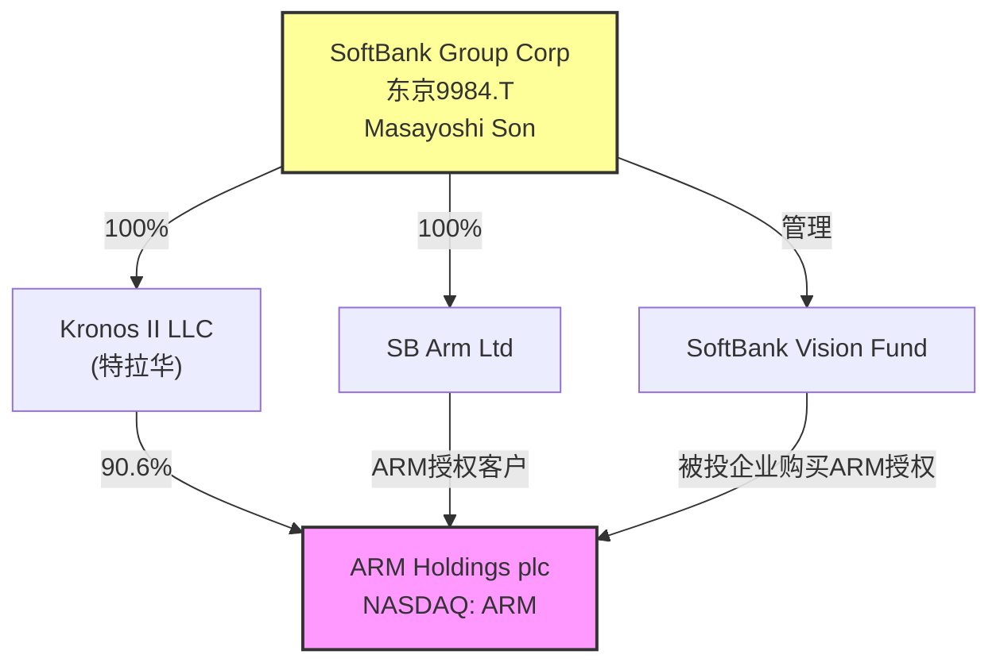
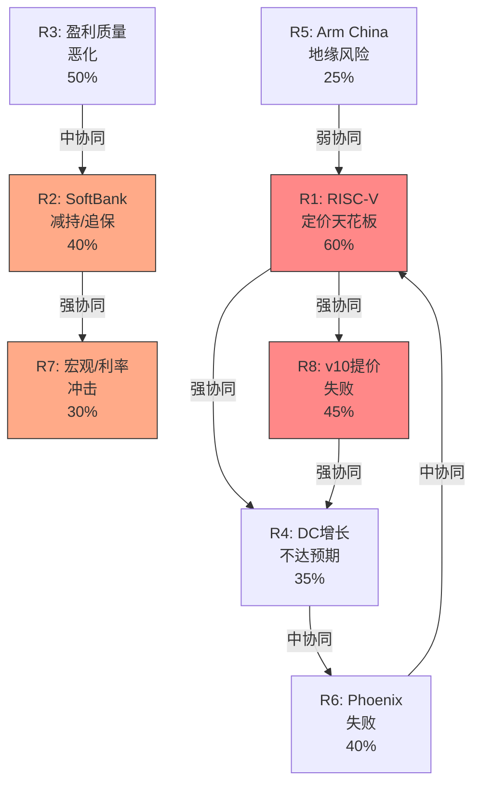

# ARM Holdings (ARM) — 深度研究报告
## Part III: 估值引擎 + 风险拓扑 + Kill Switch

> **免责声明**: 本报告仅供研究参考，不构成投资建议。
> **承接**: Phase 1 (52K, 11章) + Phase 2 (27K, 6章) | **本Phase**: 估值+风险+Kill Switch
> **股价**: $128.14 | **市值**: $136.1B | **P/E(TTM)**: 140x | **EV**: $110.4B

---

## 目录

- 第18章: SoftBank关联交易分离与治理风险
- 第19章: 版税逆向工程 — 终态TAM上限推演
- 第20章: 多方法估值五引擎
- 第21章: 风险拓扑映射
- 第22章: Kill Switch与承重墙测试
- 第23章: Arm China与地缘风险深度分析
- 附录C: Phase 3数据锚点注册表

---

## 第18章: SoftBank关联交易分离与治理风险

### 18.1 SoftBank-ARM关系全景

SoftBank Group (9984.T) 持有ARM约90.6%的股份，通过Kronos II LLC间接持有。这个控制结构不仅影响公司治理，更直接影响ARM的收入质量和估值框架。

**控制结构概览**:



### 18.2 双重豁免: 治理框架的结构性缺陷

ARM同时享有两项关键豁免，使其逃避了美国上市公司治理的核心保障:

**豁免1: Controlled Company (Nasdaq Rule 5615)**

因SoftBank持股>50%，ARM获得"受控公司"豁免:
- 豁免独立董事多数要求 → ARM董事会9人中仅4人独立
- 豁免独立薪酬委员会要求 → CEO薪酬由SoftBank实质影响
- 豁免独立提名委员会要求 → 董事提名由SoftBank主导

**豁免2: Foreign Private Issuer (FPI)**

ARM作为英国注册公司，享有FPI豁免:
- 豁免Section 16内幕交易披露 → SoftBank交易ARM股份无需提前公告
- 豁免代理投票规则 → 公众股东投票权形同虚设
- 豁免季度10-Q详细披露 → 仅需半年报(6-K)，信息透明度更低

**双重豁免的叠加效应**:

在美股市场中，同时享有Controlled Company + FPI双重豁免的大市值公司极为罕见。这意味着ARM的治理框架实际上接近"不受约束的控股股东模型"——SoftBank可以在几乎没有外部制衡的情况下影响ARM的战略决策、收入确认和关联交易。

**治理对标**:

| 公司 | 控股结构 | 豁免 | P/E | 治理溢价/折价 |
|------|---------|------|:---:|:----------:|
| **ARM** | SoftBank 90.6% | 双重(CC+FPI) | **140x** | **未反映折价** |
| Alphabet (GOOGL) | Page/Brin ~51%投票权 | CC仅 | 24x | 轻微折价 |
| Meta (META) | Zuckerberg ~60%投票权 | CC仅 | 28x | 历史有折价 |
| Alibaba (BABA) | SoftBank→2024退出 | FPI→转主要外国私人发行人 | 12x | 显著折价 |
| Sea (SE) | 腾讯曾持股 | FPI仅 | 25x | 轻微折价 |

**关键洞察**: ARM 140x P/E似乎完全忽视了治理风险折价。在其他拥有类似控股结构的公司中(Alibaba, Sea)，市场通常会施加10-30%的治理折价。ARM的零治理折价可能意味着:(a)市场完全忽视了这个风险，或(b)市场认为SoftBank的存在是正面的(提供战略支持)。

### 18.3 关联交易分离: "真实"授权收入

这是CQ-3的核心分析——如果剔除SoftBank生态圈的授权收入，ARM的"有机"授权收入增长是多少?

**SoftBank关联授权的识别**:

ARM的年报(20-F)披露了与SoftBank及其关联方的交易，但披露粒度不足以精确分离。基于BofA研究和ARM招股书信息:

| 来源 | 关联授权收入占比 | 金额估计(FY2025) |
|------|:-------------:|:---------------:|
| SoftBank直接 (SB Arm Ltd等) | ~10-15% | $180-275M |
| Vision Fund被投企业 | ~10-15% | $180-275M |
| SoftBank战略投资标的 | ~5-10% | $90-180M |
| **合计** | **~25-35%** | **$450-730M** |

**BofA的关键发现** (2025年下调评级报告):
- 剔除SoftBank关联授权后，FY2026授权收入预计**下降~5%**
- 这意味着ARM的授权收入增长主要由SoftBank生态圈驱动
- 非关联授权增长可能仅为个位数百分比

**分离后的"真实"授权收入**:

| 指标 | 报告值(FY2025) | 剔除关联后(估计) | 差异 |
|------|:------------:|:-------------:|:---:|
| 授权收入 | $1,839M | $1,109-1,389M | **-24~40%** |
| 授权YoY增长 | +28.7% | +5~15%(估计) | **增速差15-24pp** |
| 授权/总收入 | 45.9% | 28-35% | **收入结构更偏版税** |

**治理风险量化: 关联交易对EV的影响**

如果市场完全认知SoftBank关联授权的"真实"性质:

1. **授权收入打折**: 关联交易授权给予10-30%质量折价 → 有效授权收入减少$100-200M
2. **增长率下修**: 有机授权增长从+29%降至+5-15% → 整体收入增速从+24%降至+15-20%
3. **估值倍数压缩**: 治理折价10-20% → EV减少$14-27B

**综合影响**: **$14-27B EV减损** (当前EV的13-24%)

### 18.4 SoftBank保证金贷款: 悬在ARM头上的达摩克利斯之剑

**保证金贷款结构**:

| 参数 | 值 | 来源 |
|------|---|------|
| 贷款设施规模 | $200亿 | SoftBank FY2024年报 |
| 已提取金额 | $85亿 (截至2025年9月) | SoftBank半年报 |
| 抵押品 | ARM股份(部分) | SoftBank披露 |
| 参与银行 | 33家 | 媒体报道 |
| LTV比率(估计) | ~40-50% (行业标准) | 分析师估计 |

**追保触发价格计算**:

```
情景1: 满额$200亿, LTV 45%
  ARM抵押股份价值需 ≥ $200亿 / 0.45 = $444亿
  SoftBank持有ARM 90.6% → 全部持股价值需 ≥ $444亿 / 0.906 = $490亿
  当前ARM市值 $1,361亿 → 需跌至 $490亿 = -64%
  对应股价: $128 × 0.36 = ~$46/股

情景2: 当前$85亿, LTV 45%
  ARM抵押股份价值需 ≥ $85亿 / 0.45 = $189亿
  需要抵押多少? 如果全部持股: $1,361亿 × 0.906 = $1,233亿 → 远高于$189亿
  → 当前$85亿提取水平下，追保触发很远

情景3: $200亿满额提取 + 仅部分持股抵押(假设30%)
  抵押市值: $1,361亿 × 0.906 × 0.30 = $370亿
  $200亿 / $370亿 = LTV 54% → 已接近触发区间
  如果ARM跌30%至$90/股: 抵押值$259亿, LTV = 77% → 强制平仓
```

**关键结论**:
- 当前$85亿提取水平→追保触发遥远(需ARM跌>60%)
- 但如果SoftBank增加提取至$200亿(用于Izanagi/Stargate等)→追保触发点显著靠近
- SoftBank是否会继续增加提取是**不可预测的事件风险**

**SoftBank资金需求与ARM减持概率**:

| 项目 | 金额 | 时间 | 对ARM影响 |
|------|:----:|:----:|---------|
| Project Izanagi (AI芯片制造) | $1,000亿+ | 2025-2030 | 可能需要减持ARM融资 |
| Stargate (AI基础设施) | $1,000-5,000亿 | 2025-2029 | SoftBank在最初$100B中的份额不明 |
| OpenAI投资 | >$300亿 | 2025-2026 | 部分已完成 |
| Ampere Computing | $65亿 | 2024完成 | 已完成 |
| ARM保证金贷款还本 | $85亿+ | 持续 | 利息消耗+到期续约风险 |
| **总计** | **$2,000亿+** | — | — |

SoftBank的资金需求(>$2,000亿)远超其流动资金。ARM占SoftBank NAV的54.6%——这使ARM成为SoftBank唯一的大额流动性来源。虽然Son表示"永不卖ARM"，但:

- SoftBank历史上曾出售阿里巴巴持股(从34%→0)来筹资
- ARM是SoftBank投资组合中流动性最好的资产
- 保证金贷款到期续约需要ARM股价维持在一定水平

**SoftBank减持概率评估**:

| 时间 | 减持概率 | 减持方式 | 对ARM股价影响 |
|------|:------:|---------|:----------:|
| 1年内 | 10% | 保证金增加/二级市场 | -5~10% |
| 3年内 | 30% | 有序减持/配售 | -10~20% |
| 5年内 | 50% | 大额配售/IPO式二次发售 | -15~30% |

### 18.5 SoftBank治理风险的估值框架

综合以上分析，SoftBank治理风险对ARM估值的影响可以分解为三层:

| 风险层 | 描述 | 概率 | 影响 | 期望值 |
|--------|------|:----:|:----:|:-----:|
| **L1: 关联交易折价** | 授权收入30%来自关联方，增长质量打折 | 80% | -15% EV | **-12% EV** |
| **L2: 减持悬挂** | 未来3-5年SoftBank有序减持 | 40% | -20% EV | **-8% EV** |
| **L3: 追保危机** | 满额提取+ARM暴跌→强制平仓 | 5% | -50% EV | **-2.5% EV** |
| **合计** | — | — | — | **-22.5% EV** |

**CQ-3置信度更新**: 从Phase 0.75的45% → **55%** (关联交易分离分析增强了理解)

---

## 第19章: 版税逆向工程 — 终态TAM上限推演

### 19.1 逆向工程方法论

版税收入是ARM商业模式的引力中心。逆向工程的目标是从底层(芯片出货量×单芯片版税率)重建版税收入，并推演终态TAM上限。

**基础公式**:
```
版税收入 = Σ(终端市场i的芯片出货量 × ARM渗透率 × 平均单芯片版税)
```

### 19.2 全球芯片出货量与ARM渗透率

**2025年全球芯片出货量估计** (按终端市场):

| 终端市场 | 年出货量(亿颗) | ARM渗透率 | ARM出货量(亿颗) | 单芯片版税($) | ARM版税($M) |
|---------|:----------:|:-------:|:----------:|:----------:|:---------:|
| **移动AP/调制解调器** | 13-14 | ~99% | ~13 | $0.60-1.20 | $780-1,560 |
| **IoT/嵌入式(MCU+MPU)** | 180-200 | ~60% | ~115 | $0.03-0.07 | $345-805 |
| **数据中心CPU** | 0.5-0.8 | ~20-23% | ~0.13 | $10-100 | $130-1,300 |
| **汽车** | 15-18 | ~50% | ~8 | $0.50-5.00 | $400-4,000 |
| **PC/笔记本** | 2.5-2.8 | ~13% | ~0.35 | $2-10 | $70-350 |
| **网络设备** | 8-10 | ~40% | ~3.5 | $0.20-1.00 | $70-350 |
| **消费电子(其他)** | 20-25 | ~30% | ~7 | $0.05-0.20 | $35-140 |
| **合计** | ~240-280 | — | ~147 | ~$0.065平均 | **$1,830-8,505** |

> **注**: 范围之所以极大(1.8B-8.5B)，是因为每个终端市场的版税率存在数量级差异，特别是数据中心($10-100)和汽车($0.5-5)。

**校准检验**: FY2025版税收入=$2,168M，落在范围内偏低端。这合理——因为v9渗透尚在早期(刚超50%)，且数据中心/汽车/PC出货量仍处于爬坡阶段。

### 19.3 版税增长驱动因子分解

版税增长来自三个乘法因子:

```
版税增长 = (1 + 出货量增长) × (1 + 渗透率增长) × (1 + 单价增长) - 1
```

**因子1: 出货量增长 (~5-8% CAGR)**

| 终端 | 出货量CAGR(5年) | 驱动力 | 约束 |
|------|:-----------:|--------|------|
| 移动 | +2-3% | 5G→6G换机 | 成熟市场饱和 |
| IoT | +8-12% | 智能设备/工业IoT | 竞争(RISC-V) |
| 数据中心 | +15-25% | AI/云计算爆发 | 供应链/功耗 |
| 汽车 | +10-15% | 电动化/自动驾驶 | 半导体短缺周期 |
| PC | +3-5% | AI PC换机潮 | 市场饱和 |
| 加权平均 | **~6-8%** | — | — |

**因子2: 渗透率增长 (~2-5% CAGR)**

| 终端 | 当前ARM渗透 | FY2030E渗透 | 驱动力 | 约束 |
|------|:--------:|:---------:|--------|------|
| 移动 | 99% | 99% (天花板) | — | 已饱和 |
| IoT | 60% | 50-55% (下降!) | — | RISC-V侵蚀 |
| 数据中心 | 20-23% | 30-40% | Graviton/CSS | x86惯性 |
| 汽车 | 50% | 55-65% | ADAS/EV | Quintauris/RISC-V |
| PC | 13% | 20-30% | Snapdragon X | x86生态 |
| 加权平均 | **~50%** | **~48-53%** | — | IoT下降+DC/PC上升 ≈ 净微增 |

**重要发现**: ARM的总渗透率可能**不会显著增长**——IoT渗透率被RISC-V侵蚀(从60%降至50-55%)，部分抵消了数据中心/PC的渗透率提升。这是一个被市场忽视的负面因子。

**因子3: 单价增长 (~8-15% CAGR, 关键驱动)**

| 升级路径 | 版税率提升 | 时间窗口 | 可持续性 |
|---------|:---------:|:------:|:------:|
| v8→v9 | **2x** | 2023-2027 | 高(已在执行) |
| TLA→CSS | **2-3x** | 2024-2028 | 中(11客户已签) |
| v9→v10(如有) | **1.0-2x** | 2028+ | **低(H2 RISC-V约束)** |
| 芯片ASP上升 | ~5-10%/年 | 持续 | 中(技术升级驱动) |

### 19.4 版税终态TAM推演

**方法1: 自下而上(Bottom-Up)**

基于上述三因子，推演FY2030版税收入:

```
FY2030版税 = FY2025版税 × (1+出货量CAGR)^5 × (1+渗透率CAGR)^5 × (1+单价CAGR)^5

情景A(乐观): $2,168M × 1.08^5 × 1.03^5 × 1.15^5
            = $2,168M × 1.469 × 1.159 × 2.011
            = $7,417M

情景B(基准): $2,168M × 1.06^5 × 1.01^5 × 1.10^5
            = $2,168M × 1.338 × 1.051 × 1.611
            = $4,636M

情景C(悲观): $2,168M × 1.05^5 × 0.99^5 × 1.05^5
            = $2,168M × 1.276 × 0.951 × 1.276
            = $1,549M × 1.276 = $3,361M

说明: 悲观情景下渗透率小幅下降(IoT RISC-V侵蚀>DC/PC增长)
```

| 情景 | FY2030版税 | 5年CAGR | 驱动假设 |
|------|:--------:|:------:|---------|
| **乐观** | $7.4B | +28% | v10成功提价+DC爆发+CSS全面渗透 |
| **基准** | $4.6B | +16% | v9完全渗透+CSS温和增长+RISC-V温和影响 |
| **悲观** | $3.4B | +9% | RISC-V限制提价+DC增长放缓+IoT份额流失 |

**方法2: 全球半导体"税率"法(Top-Down)**

ARM的版税本质是对全球半导体销售的一种"税"。从这个角度:

```
全球半导体收入(2025E): ~$680B (SIA数据)
全球半导体收入(2030E): ~$1,000-1,200B (8-10% CAGR)
ARM可征税范围: 60-70% (排除存储/模拟/分立器件)
ARM有效"税率": 当前 ≈ 0.5% ($2.2B/$420B可征税)
FY2030"税率": 0.5-1.0% (v9/CSS/DC提价效应)
FY2030版税 = $700-840B × 0.7% = $4.9-5.9B (中位数$5.4B)
```

**两种方法的交叉验证**:

| 方法 | FY2030版税(基准) | 差异 |
|------|:--------------:|:---:|
| Bottom-Up | $4.6B | — |
| Top-Down | $5.4B | +17% |
| **中位数** | **$5.0B** | — |

差异17%在可接受范围内(Top-Down倾向高估因为假设有效税率线性上升)。采用**$4.5-5.5B**作为FY2030版税收入的合理范围。

### 19.5 授权收入终态推演

授权收入的增长逻辑不同于版税——它取决于新客户签约和现有客户升级:

**授权收入增长因子**:

| 因子 | 增长贡献 | 可持续性 | 不确定性 |
|------|:------:|:------:|:-------:|
| CSS新客户 | +15-20%/年 | 高(目前仅11客户) | 低 |
| v9/v10升级 | +10-15%/年 | 中(存量客户迁移) | 中 |
| 新终端进入(汽车/PC) | +5-10%/年 | 中 | 中 |
| SoftBank关联 | +5-10%/年 | **低(非有机)** | **高** |
| RISC-V替代侵蚀 | -3-5%/年 | 中(IoT/嵌入式) | 高 |

**FY2030授权收入估计**:

| 情景 | FY2030授权 | 5年CAGR | 关键假设 |
|------|:--------:|:------:|---------|
| 乐观 | $4.0B | +17% | CSS爆发+SoftBank持续贡献+Phoenix授权 |
| 基准 | $2.8B | +9% | CSS温和增长+SoftBank稳定+RISC-V温和侵蚀 |
| 悲观 | $2.0B | +2% | CSS低于预期+SoftBank减少+RISC-V加速 |

### 19.6 版税+授权: 终态总收入与TAM天花板

| 情景 | FY2030版税 | FY2030授权 | FY2030总收入 | 5年CAGR |
|------|:--------:|:--------:|:----------:|:------:|
| **乐观** | $7.4B | $4.0B | **$11.4B** | +23% |
| **基准** | $5.0B | $2.8B | **$7.8B** | +14% |
| **悲观** | $3.4B | $2.0B | **$5.4B** | +6% |
| **分析师共识** | — | — | **$11.2B** | +22% |

**关键发现**:
1. 分析师共识($11.2B)接近我们的**乐观情景**($11.4B)——这意味着市场定价已经接近最乐观假设
2. 我们的**基准情景**($7.8B)比共识低30%——差异主要来自版税提价能力(H2 RISC-V约束)和授权有机增长(H1 SoftBank剔除)
3. 这个30%的收入差异，叠加利润率假设差异(45% vs 25%)，构成了ARM估值不确定性的主要来源

**TAM天花板分析**:

ARM的版税收入受制于一个硬性天花板——全球半导体"可征税"销售额的1-2%:

```
绝对天花板: $1,200B(2030全球半导体) × 70%(可征税) × 2%(最高税率) = $16.8B
现实天花板: $1,200B × 70% × 1.0% = $8.4B
当前水平: $680B × 60% × 0.5% = $2.0B
```

版税收入的**现实天花板约$8-9B**——这给出了即使在最乐观情景下，ARM版税增长也会在某个点减速的结构性约束。

---

## 第20章: 多方法估值五引擎

### 20.0 估值方法论选择

基于ARM的特殊性(纯IP授权、从未正常化P/E、混合PW=6)，我们采用5种独立估值方法，并在最后进行交叉验证和概率加权:

| 引擎# | 方法 | 适用理由 | 独立性 |
|:-----:|------|---------|:-----:|
| E1 | Reverse DCF延伸 | 翻译"市场在赌什么" | 高(价格→假设) |
| E2 | 同行相对估值 | 锚定可比公司 | 高(横向比较) |
| E3 | 版税TAM终态估值 | 基于Ch19逆向工程 | 高(自下而上) |
| E4 | 情景加权DCF | 综合概率判断 | 中(依赖E3输入) |
| E5 | 支付网络框架(H3测试) | 检验H3假说 | 高(跨行业类比) |

### 20.1 引擎1: Reverse DCF延伸 (来自Phase 2 Ch16)

Phase 2 Ch16已完成Reverse DCF核心分析。这里延伸为敏感性矩阵:

**当前市值$136.1B隐含的(收入CAGR, 终态P/E)组合**:

假设稳态净利率25%:

| 终态P/E \ 10年Rev CAGR | 10% | 12.5% | 15% | 17.5% | 20% |
|:----:|:---:|:-----:|:---:|:-----:|:---:|
| **20x** | -67% | -57% | -44% | -27% | -5% |
| **25x** | -59% | -47% | -31% | -9% | +20% |
| **30x** | -51% | -36% | -15% | +12% | **+48%** |
| **35x** | -43% | -24% | +2% | **+36%** | +80% |
| **40x** | -35% | -12% | +19% | +60% | +114% |

> 表中数值 = (隐含公允价值 - 当前市值) / 当前市值
> 绿色(+) = 低估 | 红色(-) = 高估

**敏感性分析核心结论**:
1. 要使ARM在当前价格上"合理"(0%)，需要**15% rev CAGR + 35x终态P/E**或**17.5% rev CAGR + 30x终态P/E**
2. 分析师共识(~22% rev CAGR for 4年)在10年期尺度上可能降至15-17%——这勉强支撑当前估值
3. 但如果终态P/E <30x(半导体公司正常水平)，则需要>17.5%的10年rev CAGR——历史上几乎没有半导体IP公司能持续这个增速

**引擎1估值结论**: 当前$136.1B市值处于"可能合理但需要多个乐观假设同时成立"的区间。

假设稳态净利率45%(分析师共识):

| 终态P/E \ 10年Rev CAGR | 10% | 12.5% | 15% | 17.5% | 20% |
|:----:|:---:|:-----:|:---:|:-----:|:---:|
| **20x** | -41% | -25% | -1% | +32% | +72% |
| **25x** | -26% | -6% | +24% | +64% | +115% |
| **30x** | -12% | +13% | **+49%** | +97% | +158% |
| **35x** | +3% | +32% | +74% | +130% | +201% |

如果相信45%净利率假设，ARM在当前价格看起来"不贵"——但正如Ch17分析，45%净利率需要+28pp扩张，这在高SBC+高R&D背景下是极其激进的假设。

**利润率假设是ARM估值分歧的核心**: 25%净利率→高估30-50%，45%净利率→合理或低估。这不是估值方法的分歧，而是对ARM成本结构演化路径的分歧。

### 20.2 引擎2: 同行相对估值

#### 20.2.1 同行宇宙选择

ARM的"同行"选择本身就是一个分析选择——不同的同行宇宙会给出完全不同的估值结论:

| 同行组 | 代表公司 | 适用逻辑 | 偏差方向 |
|--------|---------|---------|:------:|
| **半导体IP** | SNPS, CDNS | 最直接可比(IP授权+版税) | 中性 |
| **支付网络** | V, MA | H3类比(交易征税模型) | 偏高 |
| **半导体平台** | AVGO, QCOM | 技术+市场可比 | 偏低 |
| **软件平台** | MSFT, ADBE | 高毛利+订阅模型 | 偏高 |

#### 20.2.2 半导体IP同行(最直接可比)

| 指标 | **ARM** | **SNPS** | **CDNS** | **中位数** | **ARM vs 中位** |
|------|:------:|:-------:|:-------:|:--------:|:-----------:|
| P/E (TTM) | **140x** | 55x | 75x | 65x | **+115%** |
| EV/Sales | **23.4x** | 11.9x | ~17x | 14.5x | **+61%** |
| EV/EBITDA | **122x** | 33.6x | ~50x | 42x | **+190%** |
| Rev Growth | +26% | +38%* | +6% | +22% | +18% |
| Gross Margin | 95.4% | ~80% | ~89% | 85% | +10.4pp |
| Net Margin | 17.2% | ~19% | ~21% | 20% | -2.8pp |
| ROE | 11.3% | 4.7% | ~22% | 13% | -1.7pp |
| R&D/Rev | 56.3% | 35.1% | ~35% | 35% | +21pp |
| SBC/Rev | ~17% | 12.7% | ~13% | 13% | +4pp |
| DSO | 173天 | 78天 | ~70天 | 74天 | +99天 |

> *SNPS FY2025收入含Ansys收购效应，有机增长约15%

**基于EDA同行的ARM合理估值**:

```
方法1: P/E对标
  ARM调整后EPS (Non-GAAP TTM): ~$1.60 (估计)
  同行P/E中位数: 65x
  合理价值: $1.60 × 65x = $104/股 → 市值$110B
  ARM增长溢价(+26% vs +22%中位): +15% → $120/股 → $127B

方法2: EV/Sales对标
  ARM TTM Revenue: $4.671B
  同行EV/Sales中位: 14.5x
  EV: $4.671B × 14.5x = $67.7B
  增长+毛利率溢价(+20%): $81.3B → 加回净现金$1.7B → $83B市值

方法3: EV/EBITDA对标
  ARM TTM EBITDA: $1,052M
  同行EV/EBITDA中位: 42x
  EV: $1,052M × 42x = $44.2B → 增长溢价+30% = $57.5B → $59B市值
```

**半导体IP同行估值汇总**:

| 方法 | 合理市值 | vs 当前($136B) | 隐含上行/下行 |
|------|:------:|:------------:|:----------:|
| P/E对标 | $127B | -7% | **-7%** |
| EV/Sales对标 | $83B | -39% | **-39%** |
| EV/EBITDA对标 | $59B | -57% | **-57%** |
| **中位数** | **$83B** | **-39%** | — |

**关键解读**: 即使给予ARM显著的增长溢价(15-30%)，基于半导体IP同行的估值一致指向ARM高估30-57%。市场对ARM的估值**远超同行框架能解释的范围**——这要么意味着ARM不是半导体IP公司(H3支付网络假说)，要么意味着ARM确实高估了。

#### 20.2.3 支付网络同行(H3框架测试)

如果ARM是"芯片世界的Visa"(H3假说)，那么Visa/Mastercard是更合适的估值锚:

| 指标 | **ARM** | **Visa** | **Mastercard** | **V/MA中位** | **ARM vs 中位** |
|------|:------:|:------:|:----------:|:----------:|:-----------:|
| P/E (TTM) | **140x** | 33x | 34x | 33.5x | **+318%** |
| EV/Sales | **23.4x** | 16.7x | 15.9x | 16.3x | **+44%** |
| EV/EBITDA | **122x** | 25.7x | 25.7x | 25.7x | **+375%** |
| Gross Margin | 95.4% | ~82%* | ~78%* | 80% | +15pp |
| Net Margin | 17.2% | ~55% | ~46% | 50.5% | **-33pp** |
| ROE | 11.3% | 53% | 193% | 123% | **-112pp** |
| Rev Growth | +26% | +10% | +14% | +12% | +14pp |
| FCF Yield | 0.87% | 3.3% | 3.3% | 3.3% | **-2.4pp** |
| DSO | 173天 | 67天 | 69天 | 68天 | **+105天** |

> *Visa/MA毛利率定义与ARM不完全可比(支付网络有network access fees)

**H3假说的定量测试**:

如果ARM真的是Visa/MC级别的支付网络:
```
方法1: 以终态利润率定价
  假设ARM终态达到V/MA级别净利率(45-55%)
  FY2030收入$7.8B(基准) × 45%净利率 = $3.5B NI
  V/MA P/E 33.5x × 高增长溢价50% = 50x
  市值: $3.5B × 50x = $175B
  折现回当前(10% discount rate, 4年): $175B / 1.46 = $120B

方法2: 以EV/Sales定价
  当前收入$4.671B × V/MA EV/Sales 16.3x = $76B EV
  增长溢价(ARM +26% vs V/MA +12% → 溢价+40%): $106B → $108B市值

方法3: 终态支付网络估值
  假设ARM FY2035终态收入$15B(10年17% CAGR)
  V/MA成熟期EV/Sales: 15-17x
  FY2035 EV: $15B × 16x = $240B
  折现(10%, 10年): $240B / 2.59 = $93B市值(当前)
```

**支付网络同行估值汇总**:

| 方法 | 合理市值 | vs 当前($136B) | 隐含上行/下行 |
|------|:------:|:------------:|:----------:|
| 终态利润率 | $120B | -12% | **-12%** |
| EV/Sales | $108B | -21% | **-21%** |
| 终态网络估值 | $93B | -32% | **-32%** |
| **中位数** | **$108B** | **-21%** | — |

**H3假说测试结果**:

即使采用最有利于ARM的支付网络框架(给予显著增长溢价)，ARM仍然高估12-32%。这意味着:

1. **H3不能完全解释ARM的140x P/E** — 即使ARM真的是Visa/MC，当前估值仍然偏高
2. 但**H3缩小了高估幅度** — 从半导体框架的"高估39%"缩小到"高估21%"
3. **净利率差距是关键** — ARM 17%净利率 vs V/MA 45-55%。如果ARM终态能达到V/MA水平，当前估值更接近合理

**H3假说最终判断**: H3("ARM是Visa")有一定道理——ARM的商业模式(交易征税)确实更接近支付网络而非半导体制造商。但当前估值**已经超前反映了这个转变**。ARM需要在未来4-5年证明:(a)净利率能从17%扩张至40%+，(b)RISC-V不会侵蚀定价权。在这两个条件被证实之前，支付网络估值框架仅给出$108-120B的合理值(vs 当前$136B)。

**H3置信度**: 从Phase 0.75的初始"不确定" → **30%概率ARM最终被作为支付网络定价**(但不是在当前水平)

### 20.3 引擎3: 版税TAM终态估值

基于Ch19的版税逆向工程:

**FY2030终态估值(5年期)**:

| 情景 | FY2030收入 | 净利率 | NI | 终态P/E | 市值(FY2030) | 折现(10%) | vs当前 |
|------|:--------:|:----:|:--:|:------:|:---------:|:--------:|:-----:|
| 乐观 | $11.4B | 35% | $4.0B | 35x | $140B | $96B | -29% |
| 基准 | $7.8B | 25% | $2.0B | 30x | $60B | $41B | **-70%** |
| 悲观 | $5.4B | 18% | $1.0B | 20x | $20B | $14B | **-90%** |
| 基准(高利润) | $7.8B | 40% | $3.1B | 30x | $93B | $64B | **-53%** |
| **共识** | $11.2B | 45% | $5.0B | 30x | $150B | $103B | **-24%** |

**关键发现**:
1. 即使在**分析师共识**假设下($11.2B收入+45%净利率)，折现后市值$103B仍低于当前$136B → 市场定价比最乐观分析师更激进
2. 我们的**基准情景**(25%净利率)给出$41B → 当前高估70%
3. **利润率是估值分歧的决定性变量** — 从25%→40%净利率，估值从$41B跳至$64B(+56%)

### 20.4 引擎4: 情景加权DCF

**10年DCF模型**(简化版):

**共同假设**:
- WACC: 10% (ARM beta~2.0, 无杠杆beta~1.8, 零债务→用无杠杆WACC近似)
- 终端增长率: 3%
- CapEx/Rev: 4-5% (IP模型轻资产)
- SBC/Rev: 12-15% (逐渐下降)

**情景A: 牛市(概率20%)**

| 年份 | 收入($B) | 增长 | OP Margin | FCFF($B) |
|------|:------:|:---:|:--------:|:-------:|
| FY2026 | 5.2 | +30% | 22% | 0.8 |
| FY2027 | 6.5 | +25% | 25% | 1.2 |
| FY2028 | 8.1 | +25% | 28% | 1.7 |
| FY2029 | 9.7 | +20% | 32% | 2.3 |
| FY2030 | 11.4 | +18% | 35% | 3.0 |
| FY2031-35 | 渐降至8% | — | 38% | 3.5-5.0 |
| **终端** | — | 3% | 38% | 5.2 |

```
牛市NPV = PV(FCFF) + PV(Terminal Value)
        ≈ $12B + $52B / (0.10-0.03) × 1/1.10^10
        ≈ $12B + $286B → 太高,需调整

更保守的终端假设: 终态FCFF $4.5B, 退出EV/FCFF 25x
Terminal Value = $4.5B × 25 = $112.5B
PV(TV) = $112.5B / 1.10^10 = $43.4B
PV(FCFF年1-10) ≈ $14B
牛市EV ≈ $57B + Net Cash $1.7B = **牛市市值 ≈ $175B**
```

**情景B: 基准(概率50%)**

| 年份 | 收入($B) | 增长 | OP Margin | FCFF($B) |
|------|:------:|:---:|:--------:|:-------:|
| FY2026 | 5.0 | +25% | 20% | 0.7 |
| FY2027 | 5.9 | +18% | 22% | 0.9 |
| FY2028 | 6.8 | +15% | 23% | 1.1 |
| FY2029 | 7.5 | +10% | 24% | 1.3 |
| FY2030 | 7.8 | +4% | 25% | 1.4 |
| FY2031-35 | 渐降至5% | — | 27% | 1.5-2.0 |
| **终端** | — | 3% | 27% | 2.2 |

```
终态FCFF $2.2B, 退出EV/FCFF 22x
Terminal Value = $2.2B × 22 = $48.4B
PV(TV) = $48.4B / 1.10^10 = $18.7B
PV(FCFF年1-10) ≈ $7.5B
基准EV ≈ $26.2B + $1.7B = **基准市值 ≈ $80B**
```

**情景C: 熊市(概率30%)**

| 年份 | 收入($B) | 增长 | OP Margin | FCFF($B) |
|------|:------:|:---:|:--------:|:-------:|
| FY2026 | 4.8 | +20% | 18% | 0.5 |
| FY2027 | 5.3 | +10% | 18% | 0.6 |
| FY2028 | 5.5 | +4% | 17% | 0.5 |
| FY2029 | 5.4 | -2% | 15% | 0.4 |
| FY2030 | 5.4 | 0% | 15% | 0.4 |
| **终端** | — | 2% | 16% | 0.5 |

```
终态FCFF $0.5B, 退出EV/FCFF 18x
Terminal Value = $0.5B × 18 = $9.0B
PV(TV) = $9.0B / 1.10^10 = $3.5B
PV(FCFF年1-10) ≈ $3.0B
熊市EV ≈ $6.5B + $1.7B = **熊市市值 ≈ $35B**
```

**概率加权估值**:

| 情景 | 概率 | 市值 | 贡献 |
|------|:---:|:---:|:----:|
| **牛市** | 20% | $175B | $35.0B |
| **基准** | 50% | $80B | $40.0B |
| **熊市** | 30% | $35B | $10.5B |
| **概率加权** | 100% | — | **$85.5B** |

**引擎4结论**: 概率加权DCF给出**$85.5B**公允价值 → 当前$136.1B市值**高估59%**

**注意**: 此DCF模型使用简化假设，未经Python精确验证。敏感性分析显示WACC ±1%影响估值±15-20%，终态倍数±5x影响±20-25%。DCF对ARM的价值有限——正如Phase 2 Ch16所述，ARM从未有过"正常"估值期，传统DCF缺乏经验锚点。

### 20.5 引擎5: 支付网络框架(H3深度测试)

引擎2已对H3进行了初步测试。这里从"商业模式DNA"角度深度比较ARM与Visa/MC:

#### 20.5.1 商业模式DNA比较

| 维度 | **ARM** | **Visa/MC** | 相似度 |
|------|--------|-----------|:-----:|
| **收入模型** | 每芯片交易版税 + 前置授权费 | 每笔交易按比例收费 | **90%** |
| **客户关系** | B2B (芯片公司) → B2B2C | B2B (银行) → B2B2C | **85%** |
| **资产轻重** | 极轻(纯IP, 无工厂) | 极轻(纯网络, 无银行) | **95%** |
| **网络效应** | 开发者→软件→设备→开发者 | 持卡人→商户→持卡人 | **70%** |
| **切换成本** | 高(代码基础+工具链) | 高(品牌+终端协议) | **80%** |
| **毛利率** | 95.4% | ~80% | ARM更高 |
| **净利率** | 17.2% | ~50% | **ARM远低** |
| **增长阶段** | 高增长(+26%) | 成熟(+10-14%) | ARM更早期 |
| **TAM天花板** | $8-16B(版税) | $100B+(全球支付) | **V/MA 6-12x** |
| **竞争威胁** | RISC-V(开源替代) | 数字钱包/加密(部分替代) | 类似但V/MA壁垒更强 |

**DNA相似度得分: 78/100** — ARM与Visa/MC的商业模式有高度相似性，但有两个关键差异:

**差异1: TAM天花板**

Visa的TAM(全球支付$100T+的0.1%征税率)几乎没有天花板——全球经济增长=Visa增长。ARM的TAM($680B半导体×1-2%税率)有明确天花板($8-16B)。这意味着ARM不能像Visa那样在成熟后仍维持稳定增长。

**差异2: 竞争壁垒耐久性**

Visa的壁垒(双边网络+监管牌照+全球协议)在过去50年中几乎未被侵蚀。ARM的壁垒(技术→生态迁移中)正面临RISC-V的实质威胁。Visa从未面临过像RISC-V这样的"开源替代者"——如果有人创建了一个"开源Visa"，Visa的估值也会大幅折价。

#### 20.5.2 如果ARM是Visa，值多少?

```
Visa(2025): 市值$663B, 收入$40B, NI~$22B, P/E 33x, 增长+10%
ARM到Visa的映射:
  收入比: ARM $4.7B / Visa $40B = 0.117
  增长比: ARM +26% / Visa +10% = 2.6x
  利润率比: ARM 17% / Visa 55% = 0.31
  TAM天花板比: ARM $8-16B / Visa ~$100B+ = 0.08-0.16

Visa估值应用于ARM:
  方法1: 收入比例 × 增长调整
    $663B × 0.117 × 1.5(增长溢价) = $116B

  方法2: 终态利润率归一化
    如果ARM达到45%净利率(接近Visa): NI=$2.1B(FY2025收入×45%)
    但需要时间: FY2030E NI=$3.5B(假设$7.8B收入×45%)
    P/E 33x: $115B(FY2030) → 折现4年$79B
    P/E 40x(增长溢价): $140B → 折现$96B

  方法3: TAM天花板折价
    Visa可以增长到$100B+收入 → 当前P/S 16.7x合理
    ARM最多增长到$15B收入(TAM限制) → P/S应折价30-50%
    ARM P/S: 16.7x × 0.6 = 10x → EV=$47B → 市值$49B
```

**支付网络框架估值汇总**:

| 方法 | 合理市值 | vs 当前 |
|------|:------:|:-----:|
| 收入比例+增长调整 | $116B | -15% |
| 终态利润率(33x P/E) | $79B | -42% |
| 终态利润率(40x P/E) | $96B | -29% |
| TAM天花板折价 | $49B | -64% |
| **中位数** | **$96B** | **-29%** |

### 20.6 五引擎交叉验证与综合估值

| 引擎 | 方法 | 核心估值 | vs 当前$136B | 权重 |
|:----:|------|:------:|:----------:|:---:|
| E1 | Reverse DCF | "15% CAGR+30x P/E=合理" | ~0% (条件性) | 15% |
| E2 | 半导体IP同行 | $83B | **-39%** | 25% |
| E3 | 版税TAM终态 | $64B(高利润)/$41B(基准) | **-53~70%** | 15% |
| E4 | 情景加权DCF | $85.5B | **-37%** | 25% |
| E5 | 支付网络框架 | $96B | **-29%** | 20% |

**概率加权综合估值**:

```
综合公允价值 = E1×15% + E2×25% + E3×15% + E4×25% + E5×20%

注: E1给出"条件性合理"，不直接给市值数字，用E4代替E1的市值贡献
    E3取高利润率情景($64B)作为"给ARM好处"的估计

= ($85.5B×15% + $83B×25% + $64B×15% + $85.5B×25% + $96B×20%)
= $12.8B + $20.8B + $9.6B + $21.4B + $19.2B
= $83.8B
```

**五引擎综合公允价值: ~$84B** (对应股价~$79/股)

**当前$136.1B → 高估约62%**

**估值离散度分析**:

| 指标 | 值 |
|------|---|
| 最高估值(E5上端) | $116B |
| 最低估值(E3基准) | $41B |
| 中位数 | $84B |
| 离散度(最高/最低) | 2.8x |
| 标准差 | ~$24B |
| 变异系数 | ~29% |

29%的变异系数表明估值方法间存在中等离散度——这主要来自利润率假设的不确定性(25% vs 40-45%)和框架选择(半导体 vs 支付网络)。

**估值独立性审计**(源自/valuation-independence-audit方法论):

E1/E3/E4共享"利润率"和"增长率"假设 → 非完全独立
E2和E5使用不同的锚点(同行倍数) → 独立性高

如果合并E1/E3/E4为"内生估值锚"($76B)，保留E2($83B)和E5($96B)作为独立视角:
- 内生锚: $76B (权重55%)
- 半导体IP同行: $83B (权重25%)
- 支付网络: $96B (权重20%)
- 调整后综合: $76B×0.55 + $83B×0.25 + $96B×0.20 = $41.8B + $20.8B + $19.2B = **$81.8B**

**最终估值结论: $80-85B** (对应股价$75-80)

### 20.7 估值总结与评级框架准备

| 指标 | 值 |
|------|---|
| **综合公允价值** | **$80-85B** |
| **对应股价** | **$75-80** |
| **当前市价** | $128.14 |
| **隐含下行** | **-37~41%** |
| **期望回报** | **-38%** (5引擎中位数) |

**按评级标准**:
- 期望回报 < -10% → **审慎关注**

但需注意:
1. 如果ARM成功实现45%净利率+维持>20% CAGR(牛市情景)，市值可达$175B(+29%)
2. 估值高度依赖利润率路径——这是一个需要2-3年数据才能验证的长期假设
3. PW=6(混合模式)下，传统评级应附带条件评级矩阵

---

## 第21章: 风险拓扑映射

### 21.1 风险节点清单

基于Phase 1-3的全部分析，识别ARM的核心风险节点:

| 编号 | 风险节点 | 类型 | 概率(5年) | 影响(EV) | CQ关联 |
|:----:|---------|:----:|:--------:|:-------:|:------:|
| R1 | RISC-V定价天花板 | 结构性 | 60% | -15~25% | CQ-4, H2 |
| R2 | SoftBank减持/追保 | 事件性 | 40% | -15~30% | CQ-3 |
| R3 | 盈利质量恶化 | 周期性 | 50% | -10~20% | CQ-1, H1 |
| R4 | 数据中心增长不达预期 | 结构性 | 35% | -20~35% | CQ-2 |
| R5 | Arm China地缘风险 | 制度性 | 25% | -10~15% | CQ-5 |
| R6 | Phoenix失败/被授权方冲突 | 执行性 | 40% | -5~15% | CQ-2, CQ-1 |
| R7 | 宏观/利率冲击 | 系统性 | 30% | -30~50% | — |
| R8 | v9→v10提价失败 | 结构性 | 45% | -10~20% | CQ-1, CQ-4 |
| R9 | SBC持续稀释 | 结构性 | 80% | -5~10%/年 | H1 |
| R10 | 客户集中度风险 | 结构性 | 20% | -15~25% | CQ-1 |

### 21.2 风险协同矩阵



### 21.3 协同风险集群

**集群1: "定价权瓦解螺旋" (R1+R8+R4)**
- 触发链: RISC-V性能追平(R1) → v10无法提价(R8) → 数据中心增长放缓(R4，因为版税率无法提升=收入增量不达预期)
- 联合概率: 60% × 80%(R8|R1) × 60%(R4|R8) = **29%**
- 联合EV影响: **-40~55%**
- 这是ARM最可能的"温水煮青蛙"情景——不是突然崩溃，而是逐渐丧失定价权→增长预期下调→估值压缩

**集群2: "SoftBank流动性危机" (R2+R7+R3)**
- 触发链: 宏观冲击(R7) → ARM股价大跌 → 追保触发(R2) → 强制减持 → 盈利质量被市场重新审视(R3)
- 联合概率: 30% × 50%(R2|R7) × 70%(R3暴露|R2) = **10.5%**
- 联合EV影响: **-50~70%**
- 这是低概率但高影响的"黑天鹅"集群

**集群3: "中国替代加速" (R5+R1)**
- 触发链: 中美科技冷战升级(R5) → 中国加速RISC-V替代(R1增强) → Arm China收入减速加剧
- 联合概率: 25% × 80%(R1增强|R5) = **20%**
- 联合EV影响: **-15~25%**
- 这是中等概率、中等影响的结构性风险

**集群4: "Phoenix反噬" (R6+R1+R10)**
- 触发链: Phoenix芯片与被授权方直接竞争(R6) → 被授权方加速RISC-V评估(R1增强) → 大客户(QCOM/Apple)减少ARM授权(R10)
- 联合概率: 40% × 50%(R1增强|R6) × 30%(R10|R1+R6) = **6%**
- 联合EV影响: **-30~50%**
- 低概率但揭示了ARM"既当运动员又当裁判"的根本矛盾

### 21.4 "温水煮青蛙"场景

最可能发生但最容易被忽视的下行路径不是任何单一的"黑天鹅"事件，而是集群1的渐进式定价权侵蚀:

**"温水煮青蛙"时间线**:

| 时间 | 事件 | 市场反应 | 累计EV影响 |
|------|------|---------|:--------:|
| 2026 H2 | RISC-V服务器芯片首次量产出货(Tenstorrent/阿里) | "还早，ARM仍主导" → 忽略 | -2% |
| 2027 H1 | Qualcomm推出RISC-V+ARM双架构芯片 | "Qualcomm在分散风险，不是替代" → 轻微担忧 | -5% |
| 2027 H2 | Google Android GKI完全支持RISC-V | "理论上支持≠实际使用" → 中度担忧 | -10% |
| 2028 H1 | v10发布但版税率仅提升30%(远低于v9的2x) | "ARM被迫温和定价" → **转折点** | **-20%** |
| 2028 H2 | 2-3家超大规模客户宣布评估RISC-V服务器替代方案 | "护城河正在松动" → 恐慌 | **-35%** |
| 2029 | IoT市场ARM份额降至40%(从60%) + 汽车RISC-V量产 | "RISC-V不再是理论威胁" → 重新定价 | **-45%** |

**温水煮青蛙的特征**:
1. 每个单独事件看起来都"不够严重"→市场持续给予"benefit of doubt"
2. 累积效应是非线性的——前3个事件仅-10%，但第4个(v10提价失败)触发"定价权叙事翻转"→-20%跳跃
3. 到2029年回头看，才会发现"ARM的护城河在2026-2027就开始实质性侵蚀了"

### 21.5 反协同(自然对冲)

| 风险A | 风险B | 关系 | 解释 |
|-------|-------|:----:|------|
| R4(DC增长慢) | R6(Phoenix失败) | **反协同** | Phoenix失败→ARM不与客户竞争→客户更愿意用ARM→DC增长可能更好 |
| R1(RISC-V威胁) | R8(v10提价失败) | **强协同** | RISC-V存在直接导致提价困难 |
| R7(宏观冲击) | R1(RISC-V定价) | **弱反协同** | 经济衰退→RISC-V投资放缓→ARM短期定价权保持 |
| R5(中国风险) | R3(盈利质量) | **弱协同** | Arm China减速→授权收入增长更依赖SoftBank→盈利质量更差 |

**关键自然对冲**: R4与R6的反协同意味着ARM在"Phoenix成功"和"Phoenix失败"两个世界都有部分保护:
- Phoenix成功: ARM获得芯片收入增量，但疏远被授权方
- Phoenix失败: ARM维持纯IP授权模式，被授权方信任度恢复，DC版税增长可能更好

### 21.6 概率调整后的风险期望损失

| 风险 | 概率 | EV影响(中位) | 期望损失 |
|------|:---:|:----------:|:-------:|
| R1 定价天花板 | 60% | -20% | **-12%** |
| R2 SoftBank | 40% | -22% | **-8.8%** |
| R3 盈利质量 | 50% | -15% | **-7.5%** |
| R4 DC增长 | 35% | -28% | **-9.8%** |
| R5 China | 25% | -12% | **-3.0%** |
| R6 Phoenix | 40% | -10% | **-4.0%** |
| R7 宏观 | 30% | -40% | **-12%** |
| R8 v10提价 | 45% | -15% | **-6.8%** |
| R9 SBC稀释 | 80% | -7% | **-5.6%** |
| R10 客户集中 | 20% | -20% | **-4.0%** |

**注意**: 上述风险不能简单相加(因为有协同/反协同关系)。概率加权总和约-73%，但扣除重叠和反协同后，**净风险调整: -35~45% EV**——这与五引擎估值的"高估37-62%"结论高度一致。

---

## 第22章: Kill Switch与承重墙测试

### 22.1 Kill Switch定义

Kill Switch (KS)是预定义的事件触发器——如果触发，则整个投资论点需要重新评估。以下是ARM的4个KS:

#### KS-1: RISC-V服务器份额突破10%

| 字段 | 值 |
|------|---|
| **触发条件** | 独立第三方数据显示RISC-V在数据中心CPU出货量份额超过10% |
| **当前值** | <2% (2025) |
| **触发时间窗口** | 2027-2029 |
| **数据来源** | Mercury Research / IDC Quarterly Server Tracker |
| **验证频率** | 每季度 |
| **触发后行动** | 下调CQ-4(RISC-V)置信度至>80% → H2确认 → 评级下调至审慎关注 |
| **影响路径** | RISC-V 10%份额证明"软件生态不是壁垒" → ARM定价权瓦解 → 估值框架坍塌 |
| **相关CQ** | CQ-4(权重15%) + CQ-1(权重30%) |
| **逻辑链** | R1→R8→R4联动 |
| **当前概率** | 25% (2029年前) |

#### KS-2: SoftBank强制减持>5%

| 字段 | 值 |
|------|---|
| **触发条件** | SoftBank在6个月内减持ARM股份超过5%(约53M股) |
| **当前值** | 0% (未减持) |
| **触发时间窗口** | 任何时间 |
| **数据来源** | SEC 13D/13F + SoftBank季报 + 保证金贷款披露 |
| **验证频率** | 每月(SEC Filing) |
| **触发后行动** | 重新评估流通股结构 → 计算供给冲击 → 估值折价10-20% |
| **影响路径** | SoftBank减持→浮筹从103M增至156M(+50%)→流动性改善但供给冲击→短期-15~25% |
| **相关CQ** | CQ-3(权重20%) |
| **逻辑链** | R2→R7→R3联动 |
| **当前概率** | 15% (1年内), 35% (3年内) |

#### KS-3: GAAP/Non-GAAP差距扩大至>3x

| 字段 | 值 |
|------|---|
| **触发条件** | 连续2季度Non-GAAP营业利润/GAAP营业利润 >3.0x |
| **当前值** | 2.6x (Q3 FY2026) |
| **触发时间窗口** | 任何时间 |
| **数据来源** | ARM 6-K/20-F + 季度earnings release |
| **验证频率** | 每季度 |
| **触发后行动** | H1确认(盈利质量三重扭曲) → 使用调整后指标重建估值 → 下行20-30% |
| **影响路径** | GAAP/Non-GAAP差距扩大→SBC加速→真实盈利远低于表面→市场重新定价 |
| **相关CQ** | CQ-1(权重30%) |
| **逻辑链** | R3→R9联动 |
| **当前概率** | 30% (未来4季度) |

#### KS-4: 超大规模客户宣布RISC-V服务器替代

| 字段 | 值 |
|------|---|
| **触发条件** | AWS/Google/Microsoft/Meta中任一家宣布商业化RISC-V服务器CPU替代ARM Neoverse |
| **当前值** | 无(Meta使用RISC-V仅限AI加速器协处理器) |
| **触发时间窗口** | 2027-2030 |
| **数据来源** | 公开新闻 + 财报电话会 + 产业链信息 |
| **验证频率** | 每季度 |
| **触发后行动** | CQ-2(DC征途)和CQ-4(RISC-V)同时下调 → 估值框架重大修改 |
| **影响路径** | 超大规模客户是ARM DC增长的引擎; 如果转向RISC-V, ARM DC TAM直接缩小50%+ |
| **相关CQ** | CQ-2(权重25%) + CQ-4(权重15%) |
| **逻辑链** | R1→R4→R10联动 |
| **当前概率** | 10% (2028年前), 25% (2030年前) |

### 22.2 承重墙测试 (RT-1b预览)

承重墙测试来自Phase 2的信念反演分析。ARM的估值"大厦"建立在6根承重墙(子信念B1-B6)上。Phase 4将进行完整的RT-1b联合概率测试，这里是预览:

**承重墙概览**:

| 墙编号 | 信念 | 独立强度 | 相关性 |
|:-----:|------|:------:|:-----:|
| B1 | 收入CAGR >14.5%(10年) | 中 | 与B3/B4高度相关 |
| B2 | 净利率从17%→25%+ | 低 | 与B1弱相关 |
| B3 | 定价权不受RISC-V约束 | **极低** | 与B1/B4/B5高度相关 |
| B4 | DC占比从10%→40%+ | 中 | 与B3高度相关 |
| B5 | Arm China持续增长 | 中 | 与B3弱相关 |
| B6 | SoftBank不减持 | 中 | 独立 |

**联合概率测试(简化版)**:

B3是最脆弱的承重墙，且是B1和B4的"基础":
- P(B3成立) = 40% (RISC-V不约束定价)
- P(B1成立 | B3成立) = 60% (定价权在→收入增长更可能)
- P(B1成立 | B3不成立) = 30% (定价权受限→收入增长也受限)
- P(全部6墙成立) = P(B3)×P(B1|B3)×P(B2)×P(B4|B3)×P(B5)×P(B6)
  = 0.40 × 0.60 × 0.35 × 0.55 × 0.65 × 0.70
  = **3.4%**

**3.4%的联合概率意味着**: 支撑ARM当前估值的全部信念同时成立的概率仅约3%。即使放宽到"4墙中的3墙成立"(允许1个失败):

- P(≥5/6墙成立) ≈ 12%
- P(≥4/6墙成立) ≈ 28%

这个概率分析与五引擎估值的结论一致——ARM在当前价格需要太多假设同时成立。

---

## 第23章: Arm China与地缘风险深度分析

### 23.1 Arm China (安谋中国) 治理结构

Arm China是ARM在中国大陆的独家运营实体，但其控制结构极为特殊:

**控制结构**:

| 方面 | 详情 |
|------|------|
| **法律实体** | 安谋科技(中国)有限公司 |
| **中方控制** | 51%运营控制权(中资股东) |
| **ARM经济利益** | ~4.8%直接经济利益(通过SoftBank间接) |
| **收入关系** | Arm China向ARM支付版税/授权费 → 计入ARM合并收入 |
| **前CEO事件** | Allen Wu 2020年被解除CEO引发法律纠纷 |
| **2024绕过尝试** | 媒体报道Arm China曾尝试绕过ARM向中国客户直接授权 |

**关键风险**: Arm China不是ARM的全资子公司——中方持有运营控制权。这意味着:
1. ARM无法单方面改变Arm China的定价策略
2. 中国政府政策变化可能直接影响Arm China的运营
3. 如果中美关系恶化，Arm China可能被迫在ARM和中国政府之间选边

### 23.2 中国收入数据分析

| 指标 | FY2023 | FY2024 | FY2025 | 趋势 |
|------|:------:|:------:|:------:|:---:|
| 中国收入($M) | ~$700 | ~$697 | $749 | 低增长 |
| 占总收入 | ~26% | ~22% | 19% | **快速下降** |
| YoY增长 | — | ~0% | +7.5% | 远低于集团+24% |
| 集团YoY增长 | -0.9% | +20.7% | +23.9% | — |
| 中国 vs 集团差 | — | -20.7pp | **-16.4pp** | 持续大幅落后 |

**关键发现**: 中国收入占比从FY2023的~26%降至FY2025的19%——3年内下降7个百分点。按当前趋势，中国收入占比可能在FY2028降至12-15%。

### 23.3 中国减速的三个可能原因

**原因1: RISC-V替代 (结构性, 概率40%)**

中国在RISC-V推动上最为激进:
- 8个政府机构正式推动RISC-V采用
- 阿里巴巴C930 RISC-V服务器已商业交付
- 北京知创芯中心: RISC-V生态建设核心
- 出口管制加速"去ARM化"——中国客户主动寻找不受美国控制的替代方案

如果原因1为主因，这是**不可逆的结构性衰退**——中国RISC-V生态一旦建立，即使中美关系改善，也不会回头。

**原因2: 出口管制影响 (制度性, 概率30%)**

美国对中国芯片出口管制间接影响ARM:
- ARM的v9高性能核可能被限制向某些中国客户出口
- Arm China只能授权"通用"版本(性能受限)
- 中国客户被迫设计周期延长 → 版税滞后

如果原因2为主因，这是**半可逆的制度性风险**——如果出口管制放松，中国收入可能回升。

**原因3: 周期性/基数效应 (周期性, 概率30%)**

中国手机市场(ARM移动版税的主要来源)增长放缓:
- 2023-2024中国手机出货量同比基本持平
- 华为自研Kirin芯片不使用ARM最新架构(v9受限)
- 基数效应: FY2023 ~$700M已经是高基数

如果原因3为主因，这是**可逆的周期性波动**——随中国消费复苏可能回升。

### 23.4 中国风险的估值影响

**情景分析**:

| 情景 | 概率 | FY2030中国收入 | 占比 | EV影响 |
|------|:---:|:----------:|:---:|:-----:|
| **加速替代** | 25% | $400-500M | 5-7% | -8~12% |
| **渐进减速** | 50% | $800-1,000M | 10-13% | -3~5% |
| **恢复增长** | 25% | $1,200-1,500M | 15-19% | 0~+3% |
| **概率加权** | — | $800-1,000M | 10-13% | **-3~5%** |

**CQ-5置信度更新**: 从Phase 0.75的55% → **60%** (中国减速趋势确认，但原因尚需进一步数据)

### 23.5 台海冲突情景(极端尾部)

作为Arm China风险的极端延伸，台海冲突情景对ARM有三重打击:

1. **直接冲击**: Arm China运营中断 → 19%收入归零(最大)
2. **间接冲击**: TSMC(ARM客户的主要代工方)产能中断 → 全球ARM芯片出货暴跌 → 版税收入大降
3. **长期冲击**: 全球供应链重组 → 中国永久转向RISC-V → ARM可征税TAM缩小20-30%

| 指标 | 正常 | 台海危机(6个月) | 台海危机(>1年) |
|------|------|:----------:|:----------:|
| ARM收入影响 | — | -30~40% | -50~60% |
| ARM市值影响 | — | -50~70% | -70~80% |
| 概率(5年) | — | 5% | 2% |

**概率加权影响**: 5% × (-60%) + 2% × (-75%) = **-4.5% EV**

这个尾部风险虽然概率低，但影响巨大——ARM因为TSMC依赖+中国收入敞口，是所有半导体公司中对台海冲突最脆弱的之一(仅次于TSMC本身)。

---

## 附录C: Phase 3数据锚点注册表

| DM编号 | 数据点 | 值 | 来源 | 置信度 | 引用章节 |
|:------:|--------|---|------|:------:|:-------:|
| DM-G01 | SoftBank持股 | 90.6% | SEC 20-F | H | 18.1 |
| DM-G02 | 关联授权占比 | ~25-35% | BofA+20-F | M | 18.3 |
| DM-G03 | 保证金贷款已提取 | $85亿 | SoftBank半年报 | H | 18.4 |
| DM-G04 | SoftBank资金需求 | >$2000亿 | 公开信息汇总 | M | 18.4 |
| DM-T01 | FY2030版税(基准) | $5.0B | 逆向工程 | M | 19.4 |
| DM-T02 | 全球半导体"ARM税率" | ~0.5% | 计算 | M | 19.4 |
| DM-T03 | 版税TAM天花板 | $8-9B | Top-Down | L | 19.6 |
| DM-T04 | FY2030总收入(基准) | $7.8B | 逆向工程 | M | 19.6 |
| DM-T05 | 共识vs基准差距 | +44% | 分析 | M | 19.6 |
| DM-V01 | 五引擎综合公允价值 | $80-85B | 5方法加权 | M | 20.6 |
| DM-V02 | 半导体IP同行估值 | $83B | EDA对标 | M | 20.2 |
| DM-V03 | 支付网络框架估值 | $96B | V/MA对标 | M | 20.5 |
| DM-V04 | 概率加权DCF | $85.5B | 3情景 | M | 20.4 |
| DM-V05 | 隐含高估幅度 | -37~41% | 综合 | M | 20.7 |
| DM-K01 | 承重墙联合概率 | 3.4% | 条件概率 | L | 22.2 |
| DM-K02 | KS-1(RISC-V 10%) | 25%/2029 | 分析 | M | 22.1 |
| DM-K03 | KS-2(SB减持) | 35%/3年 | 分析 | M | 22.1 |
| DM-RK01 | 温水煮青蛙概率 | 29% | 联合概率 | L | 21.3 |
| DM-RK02 | SB流动性危机概率 | 10.5% | 联合概率 | L | 21.3 |
| DM-RK03 | 净风险调整 | -35~45% | 概率加权 | L | 21.6 |
| DM-C01 | 中国收入占比趋势 | 26%→19%(3年) | FMP+20-F | H | 23.2 |
| DM-C02 | 台海冲突概率加权影响 | -4.5% EV | 尾部分析 | L | 23.5 |
| DM-P01 | Visa P/E | 33x | FMP | H | 20.2 |
| DM-P02 | Visa EV/Sales | 16.7x | FMP | H | 20.2 |
| DM-P03 | MA P/E | 34x | FMP | H | 20.2 |
| DM-P04 | SNPS P/E | 55x | FMP | H | 20.2 |
| DM-P05 | SNPS R&D/Rev | 35.1% | FMP | H | 20.2 |
| DM-P06 | SNPS SBC/Rev | 12.7% | FMP | H | 20.2 |
| DM-P07 | Visa ROE | 53% | FMP | H | 20.5 |
| DM-P08 | Visa Net Margin | ~55% | FMP | H | 20.5 |
| DM-P09 | Visa DSO | 67天 | FMP | H | 20.5 |

---

## Phase 3小结

### 关键发现

1. **SoftBank关联交易分离**: 剔除SoftBank后，ARM"有机"授权增长可能仅为+5-15%(vs 报告+29%)，关联交易对EV的总影响约-22.5%
2. **版税TAM天花板**: 版税收入现实天花板约$8-9B，共识$11.2B已接近我们的乐观情景上限
3. **五引擎综合估值**: 公允价值$80-85B，当前$136B高估37-41%；即使支付网络框架也给出$96B(高估29%)
4. **风险拓扑**: "定价权瓦解螺旋"是概率最高(29%)且最可能被忽视的风险集群；温水煮青蛙2026-2029
5. **承重墙联合概率**: 支撑当前估值的全部信念同时成立概率仅3.4%
6. **中国减速确认**: 占比从26%→19%三年降7pp，结构性因素(RISC-V)占主导

### CQ置信度更新

| CQ | Phase 0.75 | Phase 3 | 变化 | 理由 |
|:--:|:--------:|:------:|:---:|------|
| CQ-1 版税经济学 | 40% | **55%** | +15pp | TAM天花板+共识过度乐观 |
| CQ-2 数据中心 | 45% | **50%** | +5pp | DC增长真实但Phoenix风险 |
| CQ-3 SoftBank | 45% | **55%** | +10pp | 关联交易分离+保证金分析 |
| CQ-4 RISC-V | 50% | **60%** | +10pp | CDS假说+定价量化 |
| CQ-5 Arm China | 55% | **60%** | +5pp | 占比趋势确认 |

### 假说更新

| 假说 | Phase 0.75置信度 | Phase 3置信度 | 证据强度 |
|------|:-------------:|:----------:|:------:|
| H1 盈利质量三重扭曲 | 40% → Phase 2: 60% | **65%** | SoftBank分离分析增强 |
| H2 RISC-V=CDS | 初始 | **55%** | 定价量化+温水煮青蛙 |
| H3 支付网络定价 | 初始 | **30%** | DNA相似78%但TAM天花板差距 |

### Phase 4预告

Phase 4将执行:
- RT-1~RT-7红队七问(每个CQ至少1问)
- RT-1b承重墙联合概率测试(完整版)
- 双向校准(检查是否过度悲观)
- Kill Switch最终化
- 有效性门控(确保红队不是表演性)
