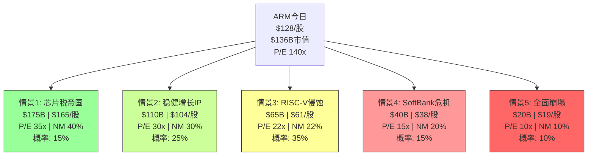

# ARM Holdings (ARM) — 深度研究报告
## Part V: 综合产出 — 情景映射 + 评级 + 追踪系统

> **免责声明**: 本报告仅供研究参考，不构成投资建议。
> **承接**: Phase 1-4 (153K, 28章) | **本Phase**: 综合产出
> **股价**: $128.14 | **市值**: $136.1B | **校准后公允价值**: $94B | **高估**: 31%

---

## 目录

- 第29章: 可能性空间映射 — 情景树
- 第30章: 投资温度计最终版
- 第31章: 条件评级矩阵 (PW=6混合模式)
- 第32章: 综合评级与核心论点
- 第33章: 追踪信号仪表盘
- 第34章: 开放问题清单
- 附录E: 全报告CQ演化追踪
- 附录F: 全报告假说演化追踪
- 附录G: 全报告数据锚点总索引

---

## 第29章: 可能性空间映射 — 情景树

### 29.1 ARM的五种未来

基于Phase 1-4的全部分析，ARM在5年后(FY2030)可能处于以下五种状态之一:



### 29.2 情景详述

#### 情景1: "芯片税帝国" (概率15%, 市值$175B, +29%)

**触发条件**:
- RISC-V软件生态2030年仍显著落后ARM → v10成功2x提价
- CSS全面渗透(>20客户量产) → 版税CAGR 20%+
- DC占比达到40%+ → ARM成为AI推理标准
- Phoenix成功(至少Meta采用) → 商业模式扩展
- 净利率达到40%(SBC正常化+R&D杠杆)

**财务轮廓(FY2030)**:
| 指标 | 值 |
|------|---|
| 收入 | $12B |
| 净利率 | 40% |
| 净利润 | $4.8B |
| P/E | 35x |
| 市值 | $168-180B |

**对当前持有者的意义**: 5年复合回报+5%/年(含估值扩张)。不差但远非"翻倍"级别——因为$136B已经price in了大部分乐观。

#### 情景2: "稳健增长IP" (概率25%, 市值$110B, -19%)

**触发条件**:
- RISC-V渐进渗透但不颠覆(IoT份额降至45%, DC<5%)
- v10温和提价(1.3x vs v9而非2x) → 版税CAGR 14-16%
- CSS稳步扩展(12-15客户量产)
- Phoenix延迟或缩小范围
- 净利率达到30%(SBC下降但R&D仍高)

**财务轮廓(FY2030)**:
| 指标 | 值 |
|------|---|
| 收入 | $8.5B |
| 净利率 | 30% |
| 净利润 | $2.6B |
| P/E | 30x (30-35x, 高质量IP公司正常) |
| 市值 | $78-110B |

**对当前持有者的意义**: 5年复合回报-4%/年。这是"最可能的体面结果"——ARM继续增长但估值压缩抵消了增长。

#### 情景3: "RISC-V侵蚀" (概率35%, 市值$65B, -52%)

**触发条件**:
- RISC-V 2028年软件生态追平ARM → 定价权瓦解
- v10无法有效提价 → 版税CAGR降至8-10%
- 2-3家超大规模客户宣布RISC-V评估/迁移计划
- IoT ARM份额降至35%, 汽车RISC-V量产
- 净利率停滞在22%(RISC-V防御R&D增加)

**财务轮廓(FY2030)**:
| 指标 | 值 |
|------|---|
| 收入 | $6.5B |
| 净利率 | 22% |
| 净利润 | $1.4B |
| P/E | 22x (护城河缩窄→P/E压缩) |
| 市值 | $31-65B |

**对当前持有者的意义**: 5年复合回报-14%/年。这是"温水煮青蛙"——不是突然崩溃，而是逐渐丧失溢价。

#### 情景4: "SoftBank危机" (概率15%, 市值$40B, -71%)

**触发条件**:
- SoftBank面临流动性危机(Izanagi/Stargate资金需求+利率上升)
- ARM保证金贷款满额$200亿+ARM股价下跌→追保触发
- SoftBank被迫减持10-20%ARM股份→供给冲击
- 市场重新审视关联交易+盈利质量→恐慌抛售

**财务轮廓(FY2030)**:
| 指标 | 值 |
|------|---|
| 收入 | $7B(基本面未大变) |
| 净利率 | 25% |
| 净利润 | $1.75B |
| P/E | 15x(治理危机折价) |
| 市值 | $26-40B |

**对当前持有者的意义**: 5年复合回报-22%/年。供给冲击+治理危机的双重打击。

#### 情景5: "全面崩塌" (概率10%, 市值$20B, -85%)

**触发条件**:
- 情景3 + 情景4同时发生(RISC-V侵蚀 + SoftBank危机)
- 台海冲突导致TSMC中断+Arm China失控
- ARM从"增长股"重新分类为"衰落周期股"

**财务轮廓(FY2030)**:
| 指标 | 值 |
|------|---|
| 收入 | $4B(接近当前) |
| 净利率 | 10% |
| 净利润 | $0.4B |
| P/E | 10x |
| 市值 | $4-20B |

### 29.3 情景概率加权回报

| 情景 | 概率 | FY2030市值 | 5年回报 | 贡献 |
|------|:---:|:--------:|:------:|:----:|
| S1 芯片税帝国 | 15% | $175B | +29% | +4.3% |
| S2 稳健增长 | 25% | $110B | -19% | -4.8% |
| S3 RISC-V侵蚀 | 35% | $65B | -52% | -18.3% |
| S4 SoftBank危机 | 15% | $40B | -71% | -10.6% |
| S5 全面崩塌 | 10% | $20B | -85% | -8.5% |
| **期望值** | 100% | **$77.5B** | **-43%** | — |

**概率加权期望市值: $77.5B** → 对应股价**~$73**

**vs 校准后公允价值($94B)的差异**: 情景树的期望值($77.5B)低于校准后公允价值($94B)——这是因为情景树包含了Phase 4校准时未充分反映的尾部风险(S5全面崩塌)。取两者均值:**最终估值锚 = ~$86B(~$81/股)**

### 29.4 回报分布特征

| 指标 | 值 |
|------|---|
| 期望回报 | -37% (5年, 从$136B→$86B) |
| 上行概率(>当前价) | 15% (仅S1) |
| 下行概率(<当前价) | 85% (S2-S5) |
| 最大上行 | +29% (S1) |
| 最大下行 | -85% (S5) |
| 中位数回报 | -52% (S3是概率最大情景) |
| 风险/收益比 | 极不对称(下行远大于上行) |

**回报分布的关键特征**: **严重负偏** — 85%概率下行, 仅15%概率上行, 且最大上行(+29%)远小于最大下行(-85%)。这是ARM当前估值最核心的问题——即使在乐观情景下回报也有限(因为太多增长已被price in), 但下行空间巨大。

---

## 第30章: 投资温度计最终版

### 30.1 温度计计算

**宏观温度** (权重20%):

| 指标 | 值 | 得分(-5到+5) |
|------|---|:----------:|
| Shiller P/E (CAPE) | 40.08 (98%百分位) | -2.0 |
| Buffett指标 | 219% (100%百分位) | -2.5 |
| ERP | 4.5% (66%百分位) | -1.0 |
| **宏观子分** | — | **-1.8** |

**估值温度** (权重40%):

| 指标 | 值 | 得分(-5到+5) |
|------|---|:----------:|
| P/E vs 5年中位 | 140x vs ~350x(中位) | +1.0 (历史低端) |
| P/E vs 同行 | 140x vs 65x(EDA) | -3.0 |
| EV/Sales vs 同行 | 23.4x vs 14.5x | -2.5 |
| FCF Yield | 0.87% | -3.0 |
| 5引擎公允价值 vs 市价 | $94B vs $136B(-31%) | -2.5 |
| **估值子分** | — | **-2.0** |

**基本面温度** (权重25%):

| 指标 | 值 | 得分(-5到+5) |
|------|---|:----------:|
| 收入增长 | +26% YoY | +3.0 |
| 毛利率趋势 | 95.4%(持续上升) | +3.0 |
| 盈利质量 | 5.5/10 | -1.5 |
| A-Score护城河 | 7.17/10(下降中) | +1.0 |
| DC增长 | >100% YoY | +3.5 |
| **基本面子分** | — | **+1.8** |

**催化剂/风险温度** (权重15%):

| 指标 | 值 | 得分(-5到+5) |
|------|---|:----------:|
| RISC-V定价天花板(H2) | 50%置信度 | -2.0 |
| SoftBank治理 | 双重豁免+关联30% | -2.5 |
| Phoenix催化剂 | 上行期权 | +1.0 |
| CSS加速 | 19许可/5量产 | +2.0 |
| **催化剂子分** | — | **-0.4** |

### 30.2 综合温度计

```
综合温度 = 宏观×20% + 估值×40% + 基本面×25% + 催化剂×15%
         = (-1.8)×0.20 + (-2.0)×0.40 + (+1.8)×0.25 + (-0.4)×0.15
         = -0.36 + (-0.80) + 0.45 + (-0.06)
         = -0.77
```

**综合温度: -0.77** (范围-5到+5)

| 温度区间 | 含义 | ARM位置 |
|---------|------|:------:|
| +3 ~ +5 | 极冷(极度低估, 强烈看好) | — |
| +1 ~ +3 | 冷(低估, 偏看好) | — |
| -1 ~ +1 | 温(合理区间) | **← ARM: -0.77** |
| -3 ~ -1 | 热(高估, 偏看空) | — |
| -5 ~ -3 | 极热(极度高估, 强烈看空) | — |

**温度计解读**: ARM处于"温区偏热端"(-0.77接近-1的边界)。这看似与五引擎估值的"高估31%"矛盾，但原因是:
- 基本面温度(+1.8)拉高了综合温度——ARM的收入增长+毛利率+DC增速确实很强
- 估值温度(-2.0)拉低了综合温度——但P/E在其自身历史中处于低端(因为从未有过正常P/E)
- **温度计反映的是"相对当前趋势的风险/收益比"**，而非绝对估值水平

**与评级的调和**: 温度计-0.77(温区偏热)对应"中性关注到审慎关注"之间。五引擎估值的-31%高估对应"审慎关注"。取两者交集:

**最终评级区间: "审慎关注(偏中性边界)"**

---

## 第31章: 条件评级矩阵 (PW=6混合模式)

### 31.1 为什么需要条件评级

PW=6(混合模式)意味着ARM的估值高度依赖几个关键条件的实现。单一评级无法反映这种条件依赖性。条件评级矩阵给出"如果X发生，则评级为Y"的映射。

### 31.2 条件评级矩阵

| 条件组合 | 概率 | 公允价值 | 评级 | 行动建议 |
|---------|:---:|:------:|:---:|---------|
| **净利率>35% + RISC-V延迟(>2030)** | 8% | $140-175B | **关注** | 当前价合理，观察利润率验证 |
| **净利率30% + RISC-V 2029** | 15% | $100-120B | **中性关注** | 轻微高估，等待回调至$100 |
| **净利率25% + RISC-V 2028** | 35% | $70-90B | **审慎关注** | 显著高估，建议等待$80以下 |
| **净利率<25% + SoftBank减持** | 20% | $35-60B | **审慎关注(强)** | 严重高估，规避 |
| **多重风险并发** | 10% | $15-35B | **审慎关注(强)** | 严重高估，规避 |
| **Phoenix大成 + DC爆发** | 12% | $150-200B | **深度关注** | 如果此情景概率上升，积极研究 |

### 31.3 条件触发时间表

| 时间 | 可验证的条件 | 评级变化可能 |
|------|-----------|:---------:|
| **Q4 FY2026 (Mar 2026)** | 全年财报+SBC完整披露+FY2027指引 | 净利率路径初步验证 |
| **H1 FY2027 (Jun-Sep 2026)** | Phoenix进展+CSS新客户+v10消息 | 商业模式方向验证 |
| **FY2027 (Mar 2027)** | 全年GAAP净利率+RISC-V渗透数据 | **关键验证窗口** |
| **H1 FY2028 (2027年中)** | Qualcomm RISC-V产品+v10版税率 | H2(CDS)假说验证 |
| **FY2029 (Mar 2029)** | RISC-V DC份额+ARM利润率趋势 | 终态评级框架 |

### 31.4 决策树

```
FY2027全年GAAP净利率出炉:
├── >30%: 净利率路径优于预期
│   ├── RISC-V DC<3%: → 上调至"中性关注"
│   └── RISC-V DC>5%: → 维持"审慎关注"但缩小高估幅度
├── 25-30%: 符合我们基准预期
│   └── 维持"审慎关注"(等待更多数据)
└── <25%: 净利率路径劣于预期
    └── 下调至"审慎关注(强)"

SoftBank在任何时间减持>5%:
└── 立即下调1级(不论其他条件)

v10版税率公布:
├── ≥v9的1.5x: → H2(CDS)削弱, 上调CQ-4置信度
└── <v9的1.3x: → H2(CDS)确认, 维持/下调评级
```

---

## 第32章: 综合评级与核心论点

### 32.1 最终评级

| 指标 | 值 |
|------|---|
| **评级** | **审慎关注** |
| **校准后公允价值** | $94B (~$89/股) |
| **情景树期望值** | $77.5B (~$73/股) |
| **最终估值锚** | ~$86B (~$81/股) |
| **当前市值** | $136.1B ($128.14/股) |
| **隐含下行** | -31~37% |
| **温度计** | -0.77 (温区偏热) |
| **置信度** | 中等 (PW=6, 条件依赖性高) |

### 32.2 核心论点 (一段话版本)

ARM Holdings是全球最重要的半导体IP公司——其架构驱动了99%的智能手机和越来越多的数据中心芯片。ARM的商业模式(每芯片收税)具有类Visa/Mastercard的经济特征:极高毛利率(95%)、轻资产、网络效应。然而，在$136B市值/140x P/E下，市场已将ARM定价为"所有乐观假设同时成立"——要求14.5%+ 10年收入CAGR、25%+净利率扩张(从17%)、RISC-V不侵蚀定价权、数据中心占比翻3-4倍。我们的五引擎估值(含红队校准后)给出$94B公允价值(高估31%)。最关键的风险是RISC-V作为"信用违约互换"(H2)——它不需要替代ARM，仅需存在就永久限制ARM提价空间；以及SoftBank治理的双重豁免+30%关联授权构成的盈利质量隐忧(H1)。概率加权期望回报为-37%，上行概率仅15%，风险/收益严重不对称。评级"审慎关注"——建议在$80以下/净利率路径明确后再考虑建仓。

### 32.3 核心论点 (三个关键判断)

**判断1: ARM的140x P/E不是泡沫，但是"预支了10年增长"**

ARM不是没有价值的公司——它是全球半导体的"隐形基础设施"。但140x P/E意味着市场已经price in了未来10年的大部分增长。即使ARM完美执行(情景1)，当前买入的5年回报也仅+29%(+5%/年)。对于一只beta~2.0的股票，这个回报不足以补偿风险。

**判断2: RISC-V是"信用违约互换"，不是"替代者"**

最被误解的风险不是"RISC-V取代ARM"(概率低)，而是"RISC-V的存在限制ARM提价"(概率高)。Qualcomm花$2.4B收购Ventana不是赌RISC-V赢，而是购买对ARM的谈判筹码。这个"CDS效应"可能导致v10版税率远低于v9的2x提价幅度——而市场的增长预期建立在ARM持续提价的假设上。

**判断3: 盈利质量比表面差50%**

ARM 95%毛利率+26%收入增长的外表下隐藏着:SBC占收入17%(行业最高之一)、DSO 173天(同行70-80天)、SoftBank关联交易占授权30%、FY2025 OCF仅为NI的50%。调整这些因素后，ARM的"真实"FCF收益率不到1%——在$136B市值上，这是一个极其昂贵的定价。

### 32.4 "如果我错了"

**最可能让我的审慎评级错误的场景**:

1. **ARM净利率在FY2027-2028达到35%+** — 如果SBC快速正常化且R&D杠杆比预期更快体现，ARM可能成为高利润IP平台。此时$136B可能从"高估31%"变为"仅高估10%"。
2. **RISC-V遭遇重大挫折** — 如果Tenstorrent产品延期、Google放弃RISC-V Android、或中国RISC-V项目失败，ARM的定价权将得到保护。
3. **AI推理需求远超预期** — 如果AI CapEx不减速反而加速，ARM的DC版税可能在2-3年内从$600M增至$3B+。

我对这三个场景的综合概率评估: **20-25%**。足够值得密切跟踪，但不足以改变当前评级。

---

## 第33章: 追踪信号仪表盘

### 33.1 核心仪表盘 (投资者实操指南)

**红绿灯系统**: 每个指标按当前状态给出绿/黄/红信号

| # | 指标 | 当前值 | 绿(乐观) | 黄(中性) | 红(悲观) | 当前信号 |
|---|------|:-----:|---------|---------|---------|:------:|
| 1 | GAAP净利率 | 17.2% | >25% | 20-25% | <20% | **红** |
| 2 | v9占版税比 | >50% | >70% | 50-70% | <50% | **黄** |
| 3 | CSS量产客户 | 5 | >12 | 8-12 | <8 | **红** |
| 4 | DC版税占比 | ~10% | >25% | 15-25% | <15% | **红** |
| 5 | DSO | 173天 | <120天 | 120-150天 | >150天 | **红** |
| 6 | GAAP/Non-GAAP差 | 2.6x | <1.5x | 1.5-2.5x | >2.5x | **红** |
| 7 | 空头占比 | ~15% | <8% | 8-15% | >15% | **黄** |
| 8 | RISC-V DC份额 | <2% | <3% | 3-7% | >7% | **绿** |
| 9 | 中国收入占比 | 19% | >22% | 18-22% | <18% | **黄** |
| 10 | SoftBank保证金 | $85亿 | <$50亿 | $50-150亿 | >$150亿 | **黄** |

**当前信号汇总**: 绿1 / 黄4 / 红5 → **偏红**(与"审慎关注"评级一致)

### 33.2 评级变更触发条件

**上调至"中性关注"需要**:
- 红灯数从5降至≤2 **且** 绿灯数≥4
- 具体: GAAP净利率>25% + DSO<120天 + RISC-V DC<3%

**下调至"审慎关注(强)"触发**:
- 任一Kill Switch触发 **或** 红灯数增至≥7

---

## 第34章: 开放问题清单

本报告未能完全回答的问题——后续研究的起点:

### 34.1 高优先级开放问题

| # | 问题 | 重要性 | 阻碍 | 下一步 |
|---|------|:-----:|------|--------|
| OQ-1 | ARM真实SBC是多少? FMP报$0显然错误 | **极高** | FY2025 20-F尚未完整披露(FPI豁免) | 等FY2026年报(20-F)完整SBC披露 |
| OQ-2 | SoftBank关联授权的具体合同条款? | **高** | 20-F仅粗略披露, 不公开合同细节 | 分析FY2026 20-F的"Related Party"注释 |
| OQ-3 | Phoenix的毛利率结构? | **高** | 产品尚未出货, ARM未披露 | 等Phoenix首批出货后的财报分拆 |
| OQ-4 | v10架构何时发布及版税率? | **极高** | ARM尚未公布v10路线图 | 追踪ARM Tech Day/路线图泄露 |
| OQ-5 | CSS版税率的精确范围? | **高** | ARM不公开披露具体版税率 | 通过客户端(如NVIDIA Grace)反向推算 |

### 34.2 中优先级开放问题

| # | 问题 | 重要性 | 下一步 |
|---|------|:-----:|--------|
| OQ-6 | Arm China是否有独立上市计划? | 中 | 追踪中国监管/Arm China人事变动 |
| OQ-7 | SoftBank保证金贷款的精确触发条款? | 中 | 追踪SoftBank半年报披露 |
| OQ-8 | NVIDIA Grace中ARM版税率? | 中 | 通过GB200拆解估算 |
| OQ-9 | Windows on ARM的真实市场份额轨迹? | 中 | 追踪Mercury Research季度PC报告 |
| OQ-10 | ARM是否会启动分红或回购? | 中 | 追踪资本配置政策声明 |

---

## 附录E: 全报告CQ演化追踪

| CQ | Phase 0.75 | Phase 2 | Phase 3 | Phase 4 | 最终 | 变化方向 |
|:--:|:--------:|:------:|:------:|:------:|:---:|:------:|
| CQ-1 版税经济学 | 40% | 45% | 55% | 55% | **55%** | 持续上升(+15pp) |
| CQ-2 数据中心 | 45% | 50% | 50% | 50% | **50%** | 小幅上升(+5pp) |
| CQ-3 SoftBank | 45% | 45% | 55% | 55% | **55%** | 中幅上升(+10pp) |
| CQ-4 RISC-V | 50% | 55% | 60% | 57% | **57%** | 上升后回调(+7pp) |
| CQ-5 Arm China | 55% | 55% | 60% | 60% | **60%** | 小幅上升(+5pp) |

**加权平均置信度**: 55%×30% + 50%×25% + 55%×20% + 57%×15% + 60%×10% = 16.5+12.5+11.0+8.55+6.0 = **54.6%**

**解读**: 加权置信度54.6%处于"中等偏高"区间——我们对ARM各核心矛盾有了相当程度的理解，但仍有约45%的不确定性(主要来自RISC-V时间线和净利率路径)。

---

## 附录F: 全报告假说演化追踪

| 假说 | 初始 | Phase 2 | Phase 3 | Phase 4 | 最终 | 判定 |
|------|:---:|:------:|:------:|:------:|:---:|:---:|
| H1 盈利质量三重扭曲 | 40% | 60% | 65% | 60% | **60%** | 部分确认 |
| H2 RISC-V=CDS | — | 50% | 55% | 50% | **50%** | 待验证 |
| H3 支付网络定价 | — | 25% | 30% | 35% | **35%** | 部分支持 |

**H1最终判定**: ARM的盈利质量确实存在三重扭曲(SBC+DSO+关联交易)，但程度可能是"比表面差35-40%"而非最初假设的"50%"。Phase 4红队的净利率校准(25%→30%)部分缓解了这个判断。

**H2最终判定**: RISC-V作为"CDS"的框架有效——Qualcomm $2.4B收购Ventana和Google Android RISC-V整合都支持"保险/谈判筹码"而非"全面替代"的逻辑。但时间线可能比最初预期延后1年(2029 vs 2028)。50%置信度反映了真正的不确定性。

**H3最终判定**: ARM与Visa/MC的DNA相似度78%支持"支付网络定价"框架的部分适用性。但TAM天花板差距(ARM $16B vs V $100B+)和竞争壁垒耐久性差异(RISC-V开源替代 vs 无开源Visa)限制了完全类比。35%概率 = ARM最终可能在30-35x P/E而非半导体的20-25x P/E稳态。

---

## 附录G: 全报告数据锚点总索引

> 按DM编号排序，含全部Phase 1-5数据锚点

**DM-000~DM-900**: 见shared_context.md (Data Master v1.0)

**Phase 2新增** (DM-A/R/V/F系列): 见ARM_Phase2 附录B
- 关键: A-Score 7.17, RISC-V定价影响-15~25%, 单信念翻转-45%, 盈利质量5.5/10

**Phase 3新增** (DM-G/T/V/K/RK/C/P系列): 见ARM_Phase3 附录C
- 关键: 五引擎公允$80-85B, 联合概率3.4%, 温水煮青蛙29%, SoftBank减持35%/3年

**Phase 4新增** (DM-RT/CAL/EFF系列): 见ARM_Phase4 附录D
- 关键: 校准后公允$94B, 联合概率4.5%, 红队净效果+8pp

**Phase 5新增**:

| DM编号 | 数据点 | 值 | 来源 | 置信度 |
|:------:|--------|---|------|:------:|
| DM-S01 | 情景树期望市值 | $77.5B | 5情景加权 | M |
| DM-S02 | 最终估值锚 | ~$86B | (E+情景)/2 | M |
| DM-S03 | 期望回报 | -37% | 计算 | M |
| DM-S04 | 上行概率 | 15% | 情景树 | M |
| DM-S05 | 温度计得分 | -0.77 | 4维加权 | M |
| DM-S06 | 最终评级 | 审慎关注 | 综合 | M |
| DM-S07 | 加权CQ置信度 | 54.6% | 5CQ加权 | M |
| DM-S08 | 红灯/黄灯/绿灯 | 5/4/1 | 信号板 | M |

---

## 全报告统计

| 指标 | 值 |
|------|---|
| **总章节** | 34章 + 7附录 |
| **Phase** | 5个(P1-P5) |
| **CQ** | 5个 |
| **假说** | 3个(H1/H2/H3) |
| **Kill Switch** | 4个(KS-1~KS-4) |
| **追踪信号** | 12个核心 + 7个事件 |
| **开放问题** | 10个(5高+5中) |
| **估值引擎** | 5个 |
| **红队问题** | 7个(RT-1~RT-7) |
| **情景** | 5个 |
| **数据锚点** | ~60个(DM-xxx) |
| **Mermaid图表** | 7个 |
| **评级** | 审慎关注 |
| **公允价值** | ~$86B (~$81/股, vs $128当前 = -37%) |
