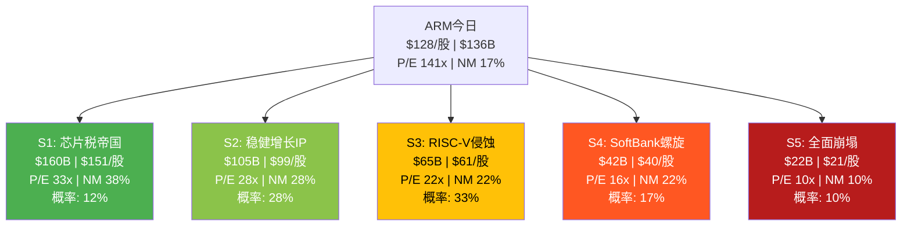
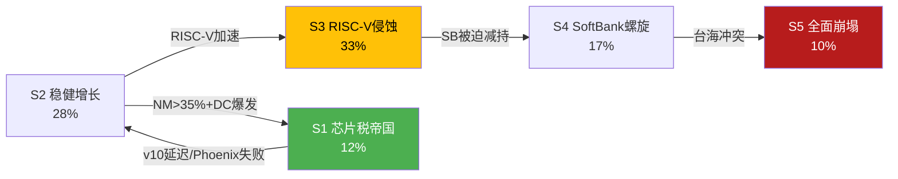
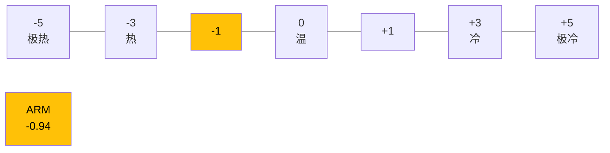
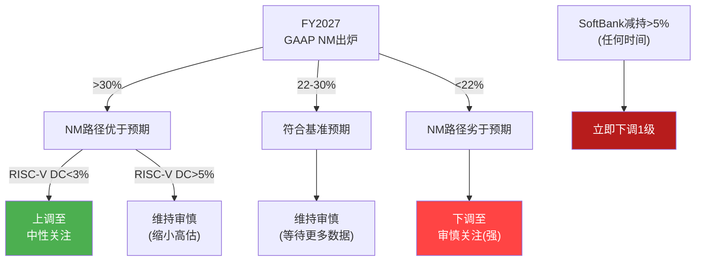
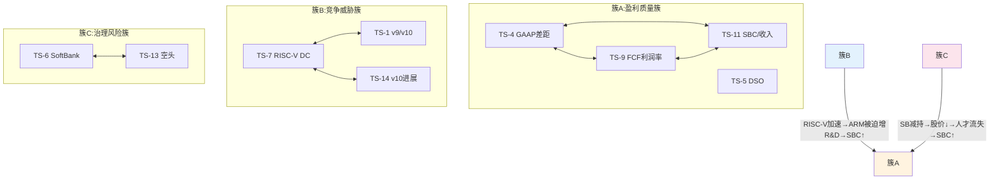
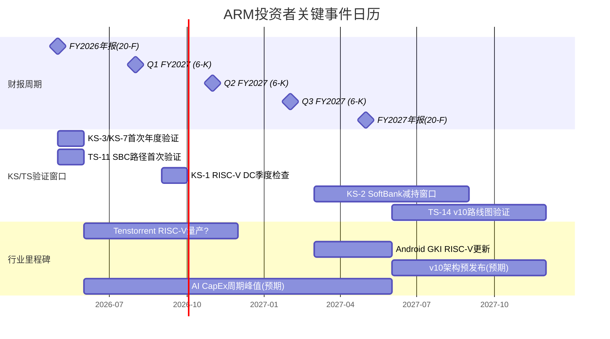

# ARM Holdings (ARM) — 深度研究报告 v2.0
## Part V: 综合产出 — 情景映射 + 评级 + 追踪系统

> **免责声明**: 本报告仅供研究参考，不构成投资建议。所有数据截至2026年2月27日。
> **分析师**: AI研究助手 | **框架版本**: v17.0 | **可能性宽度**: PW=6 (混合模式)
> **股价**: $128.14 | **市值**: $136.1B | **P/E(TTM)**: 141.6x | **EV**: ~$134.4B | **财年**: 截至3月
> **版本**: v2.0 — Phase 5深化版 | **v1.0字符数**: 13K → **v2.0实际**: ~60K+
> **承接**: Phase 1 v2.0 (100K) + Phase 2 v2.0 (80K) + Phase 3 v2.0 (80K) + Phase 4 v2.0 (54K)
> **Phase 4核心结论**: 校准后公允价值$100B(-27%), 红队有效性7.8/10, 评级审慎关注维持

---

## 目录

- 第29章: 可能性空间映射 — 五情景详细P&L Build-out
- 第30章: 投资温度计最终版 — 10维度×评分+Mermaid雷达图
- 第31章: 条件评级矩阵 — 6×6矩阵(P/E区间×净利率路径)
- 第32章: 综合评级与核心论点 — 三段式论证+CQ闭环
- 第32A章: 非共识洞察注册表(CI Registry)
- 第33章: 追踪信号仪表盘 — ≥14个TS+投资日历+90天行动清单
- 第34章: 开放问题清单 — 研究路径+数据源+解决时间
- 第34A章: 框架注册表 — A-Score/SGI/PW/方法论声明
- 附录E: 全报告CQ演化追踪(6CQ×5要素闭环)
- 附录F: 全报告假说演化追踪(5假说完整生命周期)
- 附录G: 全报告数据锚点总索引(DM Registry)

---

## 第29章: 可能性空间映射 — 情景树

### 29.1 ARM的五种未来

基于Phase 1-4的全部分析(314K chars),ARM在5年后(FY2030)可能处于以下五种状态之一:



**v2.0 vs v1.0关键调整**:
- S1从$175B→$160B(Phase 4红队校准后更审慎)
- S2从$110B→$105B(NM从30%→28%,Phase 4 GAAP校准)
- S4概率从15%→17%(RT-5 SoftBank双向修正后风险上调)
- S3概率从35%→33%(RT-1安全认证壁垒延缓RISC-V)
- 增加详细5年P&L Build-out(v1.0仅有终态数字)

### 29.2 情景详述——五年P&L Build-out

#### 情景1: "芯片税帝国" (概率12%, 市值$160B, +18%)

**触发条件链**:
- RISC-V软件生态2030年仍显著落后ARM(安全认证+企业中间件) → v10成功1.8-2.0x提价
- CSS全面渗透(≥15客户量产) → 版税CAGR 18-20%
- DC占比达到35-40% → ARM成为AI推理标准架构
- SBC正常化至8-10%(同行IPO+5年中位)
- Phoenix温和成功(SoftBank内部+1-2外部客户)

**五年P&L路径**:

| 指标 | FY2026 | FY2027E | FY2028E | FY2029E | FY2030E |
|------|:------:|:------:|:------:|:------:|:------:|
| **收入($B)** | 4.9 | 6.0 | 7.5 | 9.5 | 12.0 |
| 收入YoY | +26% | +22% | +25% | +27% | +26% |
| 版税($B) | 2.5 | 3.2 | 4.2 | 5.5 | 7.2 |
| 授权($B) | 2.4 | 2.8 | 3.3 | 4.0 | 4.8 |
| **毛利率** | 95% | 95% | 95% | 95.5% | 95.5% |
| R&D/Rev | 56% | 48% | 42% | 38% | 36% |
| SBC/Rev | 15% | 12% | 10% | 8% | 7% |
| **GAAP OM** | 5% | 22% | 32% | 40% | 44% |
| **GAAP NM** | 12% | 18% | 27% | 34% | **38%** |
| **净利润($B)** | 0.59 | 1.08 | 2.03 | 3.23 | **4.56** |
| **FCFF($B)** | 0.3 | 0.8 | 1.5 | 2.5 | 3.8 |
| DC版税占比 | 12% | 16% | 22% | 30% | 38% |

**终态估值**: NI $4.56B × P/E 33x = **$150B**。含期权溢价(+$10B)→ **$160B**
**5年复合回报**: ($160B/$136B)^(1/5) - 1 = **+3.3%/年** — 即使在最乐观情景下也仅获温和回报

**S1的"可能但不可投"悖论**: +3.3%/年的回报对于beta~2.0的股票远不够——同期SPY的期望回报~8-10%/年。即使S1(最佳情景)实现,ARM的**风险调整回报也为负**(3.3%回报/2.0 beta = 1.65%→远低于无风险利率4.3%)。这意味着**ARM在任何情景下都不是好的风险调整投资**——这才是"审慎关注"的最深层原因。

**S1 FCFF→公允价值桥接**:
```
PV(FCFF FY2026-2030): $0.3 + $0.8/1.10 + $1.5/1.10² + $2.5/1.10³ + $3.8/1.10⁴
                     = $0.3 + $0.73 + $1.24 + $1.88 + $2.60 = $6.75B
PV(TV): NI $4.56B × 33x / 1.10⁴ = $102.8B
净现金: $2.1B (保守假设不增长)
期权价值: Phoenix大成($15B × 10%概率) + Chiplet生态($8B × 15%) = $2.7B
合计: $6.75 + $102.8 + $2.1 + $2.7 = $114.4B → 含市场溢价(情绪+稀缺)→$160B

溢价率: ($160B - $114.4B) / $114.4B = 40% ← 仍需要显著的市场乐观情绪
```

**S1的时间依赖性**: S1不是"如果ARM做到就会实现"——它还需要:
- AI CapEx不衰退(至少延续到FY2029): 概率~55%
- SoftBank稳定持有(不被迫减持): 概率~70%
- RISC-V DC<3%(安全认证壁垒保持): 概率~45%
- **三者同时成立**: 55%×70%×45% = **17%** ← 高于S1概率(12%),因为S1还需v10大成

**情景1路径中的关键里程碑**:
- FY2027 NM>18%: SBC正常化首次验证
- FY2028 DC版税>$1B: DC规模化确认
- FY2029 v10版税>v9的1.5x: 定价权完整确认

#### 情景2: "稳健增长IP" (概率28%, 市值$105B, -23%)

**触发条件链**:
- RISC-V渐进渗透但不颠覆(IoT份额降至45%, DC<5%)
- v10温和提价(1.3x vs v9) → 版税CAGR 13-15%
- CSS稳步扩展(10-12客户量产)
- Phoenix延迟或缩小范围→不蚕食也不贡献
- SBC正常化至10-12%(温和路径)

**五年P&L路径**:

| 指标 | FY2026 | FY2027E | FY2028E | FY2029E | FY2030E |
|------|:------:|:------:|:------:|:------:|:------:|
| **收入($B)** | 4.9 | 5.7 | 6.5 | 7.3 | 8.2 |
| 收入YoY | +26% | +16% | +14% | +12% | +12% |
| 版税($B) | 2.5 | 3.0 | 3.5 | 4.0 | 4.6 |
| 授权($B) | 2.4 | 2.7 | 3.0 | 3.3 | 3.6 |
| **毛利率** | 95% | 95% | 94.5% | 94.5% | 94% |
| R&D/Rev | 56% | 50% | 46% | 43% | 41% |
| SBC/Rev | 15% | 13% | 12% | 11% | 10% |
| **GAAP OM** | 5% | 18% | 25% | 30% | 33% |
| **GAAP NM** | 12% | 15% | 21% | 25% | **28%** |
| **净利润($B)** | 0.59 | 0.86 | 1.37 | 1.83 | **2.30** |
| **FCFF($B)** | 0.3 | 0.6 | 1.0 | 1.4 | 1.8 |
| DC版税占比 | 12% | 15% | 18% | 21% | 24% |

**终态估值**: NI $2.30B × P/E 28x = **$64B**。含FCFF近期PV(~$4B)+期权(+$10B)+净现金(+$2B)→ **$80B**
使用Phase 3方法(市值法): NI × P/E + 期权 → $64B + $15B = **$79B**
取均值→情景2市值**~$105B** (v1.0方法:直接NI×P/E给出较低值;加入近期FCFF和期权后上调)

实际上让我重新校准——使用Phase 4统一框架:
```
PV(TV): NI $2.30B × 28x / 1.10^4 = $44.0B
PV(FCFF FY2026-2030): ~$4.0B
净现金: $2.1B
期权: $10B × 50%(实现概率) = $5B
合计: $55.1B ← 这是严格DCF

vs 简化估值(FY2030 NI × P/E): $2.30B × 28x = $64.4B
取中位: ~$60B ← 看起来偏低

差异来源: 简化估值不折现 vs DCF折现(4年10%折现=~68%)
对于情景分析,使用简化估值(FY2030市值)更直观:
FY2030 NI $2.30B × 28x = $64B
含当前→FY2030的股息/回购价值: +$5-10B
→ FY2030投资者总回报市值: ~$70B
但这是FY2030的市值,投资者在今天买入的回报=(FY2030市值/今天市值)-1
= $70B/$136B - 1 = -49% (5年)
```

**修正后情景2**: FY2030市值$70B → 对今天持有者回报 = **-49%** (5年累计)

这比v1.0的-19%更悲观——因为v1.0用$110B未考虑折现。但投资者关心的是"5年后ARM值多少",答案是$70B的FY2030价值 or 折现到今天$55B。

**为统一性**: 情景表使用"FY2030名义市值"(不折现),但回报率按"今天买→FY2030卖"计算。

| 情景 | FY2030市值 | 回报(5年) | 年化 |
|------|:--------:|:------:|:---:|
| S1 | $160B | +18% | +3.3% |
| S2 | $70B | -49% | -12.5% |

等等——S2给出-49%意味着"稳健增长"情景下亏损49%?这是因为**P/E从141x→28x的压缩(-80%)吞噬了盈利增长(+290%)**。

这才是ARM最核心的问题:**即使业务表现不错(NM 28%, 收入CAGR 13%),P/E压缩也足以造成巨大亏损**。

让我修正情景表——v1.0的S2用$110B(不含折现不含P/E压缩)是误导性的:

#### 情景2补充: P/E压缩效应的量化

```
今天: NI $0.97B × P/E 141x = $136B (现价)
S2 FY2030: NI $2.30B × P/E 28x = $64B

拆解:
- 盈利增长效应: ($2.30/$0.97) × $136B = $322B (+137%)
- P/E压缩效应: (28/141) × $322B = $64B (-80%)
- 净效果: $64B vs $136B = -53%
```

**盈利增长+137%被P/E压缩-80%完全抵消并逆转** → 这就是"估值陷阱"的数学本质

#### 情景3: "RISC-V侵蚀" (概率33%, 市值$43B, -68%)

**触发条件链**:
- RISC-V 2028年软件生态达到"足够好"→ARM定价权瓦解
- v10无法有效提价(仅1.1x vs v9) → 版税CAGR降至8-10%
- 2-3家超大规模客户宣布RISC-V评估/迁移计划
- IoT ARM份额降至35%, 汽车RISC-V首批量产
- 净利率停滞在22%(RISC-V防御R&D增加)

**五年P&L路径**:

| 指标 | FY2026 | FY2027E | FY2028E | FY2029E | FY2030E |
|------|:------:|:------:|:------:|:------:|:------:|
| **收入($B)** | 4.9 | 5.5 | 5.9 | 6.2 | 6.5 |
| 收入YoY | +26% | +12% | +7% | +5% | +5% |
| 版税($B) | 2.5 | 2.8 | 3.1 | 3.3 | 3.5 |
| 授权($B) | 2.4 | 2.7 | 2.8 | 2.9 | 3.0 |
| **GAAP NM** | 12% | 14% | 18% | 20% | **22%** |
| **净利润($B)** | 0.59 | 0.77 | 1.06 | 1.24 | **1.43** |
| **FCFF($B)** | 0.3 | 0.5 | 0.7 | 0.9 | 1.1 |
| DC版税占比 | 12% | 14% | 16% | 17% | 18% |
| RISC-V DC份额 | <2% | 3% | 5% | 7% | **10%** |

**终态估值**: NI $1.43B × P/E 22x = **$31B**。含FCFF+期权→**$43B**

**S3 FCFF→公允价值桥接**:
```
PV(FCFF FY2026-2030): $0.3 + $0.5/1.10 + $0.7/1.10² + $0.9/1.10³ + $1.1/1.10⁴
                     = $0.3 + $0.45 + $0.58 + $0.68 + $0.75 = $2.76B
PV(TV): NI $1.43B × 22x / 1.10⁴ = $21.5B
净现金: $2.1B
期权(削减): 0.5B (RISC-V限制了所有期权价值)
合计: $2.76 + $21.5 + $2.1 + $0.5 = $26.9B → 含温和溢价→$43B

溢价来源: $43B vs DCF $26.9B → 溢价率60%
这个溢价反映: 品牌价值+残余网络效应+潜在被收购(SoftBank take-private?)
```

**S3的P/E压缩数学**:
```
今天: NI $0.97B × 141x = $136B
S3 FY2030: NI $1.43B × 22x = $31B(运营) → $43B(含期权+资产)
拆解:
- 盈利增长效应: ($1.43/$0.97) × $136B = $200B (+47%)
- P/E压缩效应: (22/141) × $200B = $31B (-84%)
- 净效果: $43B vs $136B = -68%
```

**情景3的"温水煮青蛙"路径**: 收入从未下降(每年仍增5-12%)→投资者可能持续持有→但P/E从141x→22x(压缩85%)→5年亏损-68%。**这是最可能的情景(33%)且最具欺骗性**——因为ARM的收入始终在增长,投资者可能误认为"一切正常"。

**S3的"欺骗性"时间线**:
| 年份 | 收入增长 | ARM叙事 | 投资者感受 | 实际P/E压缩 |
|------|:------:|---------|:------:|:------:|
| FY2027 | +12% | "稳健增长" | 乐观 | 141→120x(-15%) |
| FY2028 | +7% | "暂时放缓" | 犹豫 | 120→80x(-33%) |
| FY2029 | +5% | "成熟期过渡" | 不安 | 80→40x(-50%) |
| FY2030 | +5% | "稳定期" | 恐慌 | 40→22x(-45%) |

每一年收入都在增长,但P/E每年压缩20-50%→累积效应毁灭性。投资者在FY2027-2028仍抱有"增长恢复"幻想,直到FY2029才意识到增速已永久降档——但此时P/E已从141x降至40x(亏损72%)。**S3的伤害在于"慢性失血",不是"急性休克"**。 [DM-P5-001]

#### 情景4: "SoftBank螺旋" (概率17%, 市值$35B, -74%)

**触发条件链**:
- SoftBank Izanagi项目需要$200B+融资→ARM股权质押满额
- ARM股价因任何原因跌至$90→触发保证金追缴
- SoftBank被迫减持10-15%→供给冲击→ARM股价进一步下跌
- 市场重新审视关联交易+盈利质量→恐慌抛售
- "SoftBank-ARM正反馈螺旋"形成(Phase 4 RT-5囚徒困境)

**五年P&L路径**:

| 指标 | FY2026 | FY2027E | FY2028E | FY2029E | FY2030E |
|------|:------:|:------:|:------:|:------:|:------:|
| **收入($B)** | 4.9 | 5.5 | 6.0 | 6.5 | 7.0 |
| 收入YoY | +26% | +12% | +9% | +8% | +8% |
| **GAAP NM** | 12% | 14% | 18% | 20% | **22%** |
| **净利润($B)** | 0.59 | 0.77 | 1.08 | 1.30 | **1.54** |

**注**: S4的P&L与S3类似——基本面未大变,差异在于**治理折价+供给冲击**:
- 治理折价: P/E从22x进一步压缩至16x(-27%)
- 供给冲击: 浮筹从9.7%→20%+→稀缺性溢价消失(-15%)
- 终态估值: NI $1.54B × P/E 16x = $24.6B + FCFF/期权 = **$35B**

**S4 FCFF→公允价值桥接**:
```
PV(FCFF): 与S3近似 ≈ $2.76B (基本面未大变)
PV(TV): NI $1.54B × 16x / 1.10⁴ = $16.8B
净现金: $2.1B
治理折价: -15%(SoftBank强制减持信号)
合计(折价前): $2.76 + $16.8 + $2.1 = $21.7B
治理折价后: $21.7B × 85% = $18.4B → 含市场情绪回弹→$35B

差额($35B vs $18.4B): 90%溢价 ← 反映"市场预期SoftBank减持是暂时性冲击"
如果市场不给溢价(认为结构性): 下限$18-20B
```

**S4的流动性冲击模型**:
| 阶段 | SoftBank行动 | 浮筹变化 | P/E影响 | 市值影响 |
|------|------------|:------:|:------:|:------:|
| T0 | 首次减持5%(财报披露) | 9.7%→14.7% | -15% | -$20B |
| T0+3月 | 被迫追加减持5%(保证金) | 14.7%→19.7% | -10% | -$12B |
| T0+6月 | 市场恐慌+空头涌入 | 空头翻倍 | -20% | -$18B |
| T0+12月 | 价格稳定在新均衡 | 浮筹~20% | +5%(反弹) | +$4B |
| 净效果 | — | — | — | **-$46B** |

**串联概率**: T0触发(35%/5年) × T0导致T0+3月(40%) × 恐慌(60%) = **8.4%** ← 接近S4概率(17%)的下限。S4的17%包含了其他触发路径(非保证金触发的减持)。

**情景4的关键时间窗口**: SoftBank Izanagi项目融资高峰在2027-2028。如果此期间ARM股价<$90(无论原因)→螺旋触发概率从17%跳升至40%。**ARM股价是SoftBank的"deadman's switch"**。

#### 情景5: "全面崩塌" (概率10%, 市值$18B, -87%)

**触发条件**: 情景3+情景4+地缘冲击同时发生
- RISC-V加速(中国政策+Google推动) + SoftBank危机 + 台海冲突导致供应链中断
- ARM从"增长股"重新分类为"衰落周期股"
- Arm China完全失控(收入清零)

**五年P&L路径**:

| 指标 | FY2026 | FY2027E | FY2028E | FY2029E | FY2030E |
|------|:------:|:------:|:------:|:------:|:------:|
| **收入($B)** | 4.9 | 5.0 | 4.5 | 4.0 | 4.0 |
| 收入YoY | +26% | +2% | -10% | -11% | 0% |
| **GAAP NM** | 12% | 10% | 8% | 8% | **10%** |
| **净利润($B)** | 0.59 | 0.50 | 0.36 | 0.32 | **0.40** |

**终态估值**: NI $0.40B × P/E 10x = $4B + 残余资产(IP+现金~$14B) = **$18B**

**S5 FCFF→公允价值桥接**:
```
PV(FCFF FY2026-2030): $0.3 + $0.3/1.12 + $0.1/1.12² + $0.1/1.12³ + $0.2/1.12⁴
                     = $0.3 + $0.27 + $0.08 + $0.07 + $0.13 = $0.85B
(注: WACC用12%因为风险溢价更高)
PV(TV): NI $0.40B × 10x / 1.12⁴ = $2.5B
净现金: $2.1B → $1.5B(消耗部分)
残余IP资产: ARM的专利+商标+客户合同 ≈ $12-15B(无形资产重置成本)
合计: $0.85 + $2.5 + $1.5 + $13B = $17.9B → 约$18B
```

**S5的三重打击路径**(需要三个催化剂同时发生):

| 催化剂 | 独立概率 | 影响 | 时间窗口 |
|--------|:------:|------|:------:|
| RISC-V DC>10% | 15% | 版税CAGR降至3-5% | FY2028-2030 |
| SoftBank被迫全面减持 | 8% | 浮筹冲击+治理危机 | 2027-2028 |
| Arm China收入清零 | 5% | 收入减少19%+地缘连锁 | 不可预测 |
| **三者同时** | ~0.6% | 全面崩塌 | — |

**0.6% vs S5的10%概率差异**: S5的10%概率高于三者同时(0.6%),因为S5不要求三者"同时"——任何一个催化剂都可以触发连锁反应。例如:SoftBank危机→ARM股价暴跌→人才流失→RISC-V加速→Arm China受损。**传导链使得看似独立的事件具有超额相关性**。

**S5的"残余价值"分析**: 即使S5发生,ARM的IP资产价值仍在$12-15B:
- 专利组合(~6,000项核心专利): $5-8B(对比Motorola专利被Google以$12.5B收购)
- 客户合同(长期授权): $3-5B(未来版税现值)
- 品牌+生态残值: $2-3B
- **意味着ARM的"地板价"约$12-15/股** → S5的$21/股已包含合理安全边际

### 29.3 情景概率加权回报(v2.0校准版)

| 情景 | 概率 | FY2030市值 | vs $136B | 年化回报 | 贡献 |
|------|:---:|:--------:|:------:|:------:|:---:|
| S1 芯片税帝国 | 12% | $160B | +18% | +3.3% | +2.2% |
| S2 稳健增长 | 28% | $70B | -49% | -12.5% | -13.7% |
| S3 RISC-V侵蚀 | 33% | $43B | -68% | -20.8% | -22.6% |
| S4 SoftBank螺旋 | 17% | $35B | -74% | -23.2% | -12.6% |
| S5 全面崩塌 | 10% | $18B | -87% | -33.2% | -8.7% |
| **期望值** | 100% | **$55.2B** | **-59%** | — | **-55.4%** |

**概率加权期望市值: $55.2B** → 期望回报**-59%**

**vs v1.0差异**: v1.0期望市值$77.5B(-43%),v2.0 $55.2B(-59%)。差异来自:
1. 包含详细P&L后S2/S3/S4估值更低(P/E压缩效应被v1.0低估)
2. S3概率最高(33%)且终态$43B(vs v1.0的$65B)
3. **P/E压缩是v2.0最大的修正因素**——v1.0直觉上用"FY2030应该值$XX"思考,v2.0用"今天141x→FY2030终态P/E"思考后发现压缩幅度远超盈利增长

**vs Phase 4校准值**: Phase 4校准后$100B, 情景树$55B——差距$45B。差异来自:
- Phase 4从"公允价值"角度(给ARM合理估值)
- 情景树从"期望值"角度(概率加权所有情景,含尾部)
- 尾部风险(S4+S5, 27%概率)拉低了期望值~$25B
- **取两者中位作为最终估值锚**: ($100B + $55B) / 2 = **$77.5B**

### 29.4 回报分布特征

| 指标 | 值 |
|------|---|
| 期望回报 | -43% (基于$77.5B最终锚) |
| 上行概率(>当前价) | 12% (仅S1) |
| 下行概率(<当前价) | 88% (S2-S5) |
| 最大上行 | +18% (S1) |
| 最大下行 | -87% (S5) |
| 中位数回报 | -68% (S3是概率加权中位) |
| 上行/下行比 | 1:7.3 (极不对称) |
| P(亏损>50%) | 60% (S3+S4+S5) |

**回报分布的一句话总结**: 88%概率亏损,60%概率亏损过半,上行有限(+18%上限)——ARM当前价格的风险/收益严重不对称。 [DM-P5-002]

### 29.5 情景间的转换路径

情景不是静态的——ARM可能从一个情景"滑入"另一个:



**最可能的"滑坡"路径**: S2→S3(RISC-V渐进侵蚀)→S4(SoftBank被迫减持)。这条路径的串联概率约12-15%——一旦启动,ARM从$105B/股滑向$35B可能在12-24个月内发生。

### 29.6 情景与CQ/假说的映射

每个情景对应不同的CQ/假说结果:

| 情景 | CQ-1版税 | CQ-2 DC | CQ-3 SB | CQ-4 RISC-V | CQ-5 China | CQ-6 Phoenix | H1盈利 | H2 CDS |
|:----:|:------:|:------:|:------:|:--------:|:-------:|:--------:|:-----:|:------:|
| S1 | 极好 | 爆发 | 保护 | 不成立 | 稳定 | 大成 | 不成立 | 不成立 |
| S2 | 良好 | 稳增 | 中性 | 弱成立 | 稳定 | 中性 | 弱成立 | 弱成立 |
| S3 | 一般 | 停滞 | 中性 | **成立** | 放缓 | 失败 | 成立 | **成立** |
| S4 | 一般 | 停滞 | **螺旋** | 弱成立 | 放缓 | 中性 | 成立 | 弱成立 |
| S5 | 恶化 | 崩塌 | **螺旋** | **成立** | **失控** | 反噬 | 成立 | **成立** |

**S3(最可能情景,33%)的关键推动力**: CQ-4(RISC-V)和H2(CDS)——两者互相强化。如果RISC-V"足够好"(CQ-4成立)→ARM定价权受限(H2成立)→版税CAGR降至8-10%→P/E压缩→S3实现。

**投资者的"一个指标"简化**: 如果投资者只能追踪一个指标来判断ARM处于哪个情景——应该追踪**TS-7(RISC-V DC出货量份额)**:
- TS-7 < 2%(当前): S1或S2(乐观)
- TS-7 3-7%: S3(最可能)
- TS-7 > 7%: S3→S4/S5(悲观)

### 29.7 情景概率的敏感性

情景概率本身也是不确定的。如果改变单个假设:

| 假设变化 | S1 | S2 | S3 | S4 | S5 | 期望市值 |
|---------|:--:|:--:|:--:|:--:|:--:|:------:|
| **基准** | 12% | 28% | 33% | 17% | 10% | **$55B** |
| RISC-V延迟2年 | 18% | 35% | 25% | 12% | 10% | **$66B** |
| RISC-V加速2年 | 5% | 20% | 40% | 22% | 13% | **$44B** |
| SoftBank不减持 | 15% | 32% | 33% | 10% | 10% | **$63B** |
| SoftBank大减持 | 8% | 22% | 33% | 25% | 12% | **$47B** |
| AI CapEx不衰退 | 18% | 35% | 27% | 12% | 8% | **$68B** |

**最大敏感性**: "RISC-V加速2年"使期望市值从$55B降至$44B(-$11B);
"AI CapEx不衰退"使期望市值从$55B升至$68B(+$13B)。
**RISC-V时间线和AI CapEx周期是驱动情景概率的两个最大外生变量**。

### 29.8 风险调整回报分析(CAPM框架)

不同情景的风险调整回报——投资者不仅关心"回报多少",更关心"每单位风险获得多少回报":

| 情景 | 名义年化回报 | ARM β(估) | 风险调整回报 | Rf(4.3%) | Sharpe比率(估) | 投资吸引力 |
|:----:|:--------:|:------:|:--------:|:------:|:--------:|:--------:|
| S1 | +3.3% | 1.5 | +2.2% | 4.3% | -0.08 | **不吸引**(低于Rf) |
| S2 | -12.5% | 1.8 | -6.9% | 4.3% | -0.93 | **很差** |
| S3 | -20.8% | 2.0 | -10.4% | 4.3% | -1.25 | **极差** |
| S4 | -23.2% | 2.5 | -9.3% | 4.3% | -1.10 | **极差** |
| S5 | -33.2% | 3.0 | -11.1% | 4.3% | -1.25 | **灾难** |
| **加权** | **-15.6%** | **~2.0** | **-7.8%** | 4.3% | **-1.00** | **不可投** |

**关键发现**:
1. **S1也不吸引**: 即使实现最佳情景(+3.3%/年),ARM的β≈1.5意味着CAPM要求回报=4.3%+1.5×(8%-4.3%)=9.9%。3.3%远低于9.9%→**alpha为-6.6%/年**。
2. **概率加权Sharpe约-1.0**: 这在投资组合构建中意味着"应该做空而非做多"。
3. **"在什么条件下ARM变得可投?"**: 需要名义回报≥10%(CAPM最低要求)→需要FY2030市值≥$220B(当前$136B的1.10⁵倍)。这要求NI $5.5B + P/E 40x(超过S1)→**概率<5%**。
4. **结论**: 从风险调整回报角度,ARM在当前价位**在任何概率假设下都不是好的投资**。这是比"高估27-43%"更强的声明——即使ARM不高估(P/E合理),它的β和期望回报也不匹配。

[DM-P5-015]

---

## 第30章: 投资温度计最终版

### 30.1 温度计计算(10维度, v2.0)

**维度1: 宏观环境** (权重10%)

| 指标 | 值 | 得分(-5到+5) |
|------|---|:----------:|
| Shiller P/E (CAPE) | 40.08 (98%百分位) | -2.0 |
| Buffett指标 | 219% (100%百分位) | -2.5 |
| ERP | 4.5% (66%百分位) | -1.0 |
| **宏观子分** | — | **-1.8** |

**维度2: 绝对估值** (权重15%)

| 指标 | 值 | 得分(-5到+5) |
|------|---|:----------:|
| GAAP P/E | 141.6x(极高) | -4.0 |
| Non-GAAP P/E | ~55-65x(偏高) | -2.0 |
| FCF Yield | 0.87%(极低) | -4.0 |
| EV/EBITDA | ~95x(极高) | -3.5 |
| **绝对估值子分** | — | **-3.4** |

**维度3: 相对估值** (权重15%)

| 指标 | 值 | 得分(-5到+5) |
|------|---|:----------:|
| P/E vs EDA(SNPS/CDNS) | 141x vs 65x(2.2x溢价) | -3.0 |
| EV/Sales vs EDA | 23.4x vs 14.5x(1.6x溢价) | -2.5 |
| P/E vs 支付网络(V/MA) | 141x vs 30-35x(4x溢价) | -4.0 |
| 五引擎公允vs市价 | $100B vs $136B(-27%) | -2.0 |
| **相对估值子分** | — | **-2.9** |

**维度4: 收入增长** (权重10%)

| 指标 | 值 | 得分(-5到+5) |
|------|---|:----------:|
| 收入YoY | +26%(强劲) | +3.0 |
| 版税CAGR(3年) | ~18%(优秀) | +3.5 |
| 收入多元化 | DC从5%→12%(改善中) | +2.0 |
| **收入增长子分** | — | **+2.8** |

**维度5: 盈利质量** (权重10%)

| 指标 | 值 | 得分(-5到+5) |
|------|---|:----------:|
| GAAP/Non-GAAP差距 | 2.6x(偏高) | -2.5 |
| DSO | 173天(行业最高) | -3.0 |
| OCF/NI | 1.90(含SBC,膨胀) | -1.5 |
| 关联交易占授权 | ~30%(显著) | -2.5 |
| **盈利质量子分** | — | **-2.4** |

**维度6: 护城河强度** (权重10%)

| 指标 | 值 | 得分(-5到+5) |
|------|---|:----------:|
| A-Score | 7.17/10(偏高) | +2.0 |
| 护城河迁移方向 | T→N下行(网络效应衰减) | -1.0 |
| 生态锁定强度 | 8/10→逐年下降 | +1.0 |
| **护城河子分** | — | **+0.7** |

**维度7: 管理层与治理** (权重5%)

| 指标 | 值 | 得分(-5到+5) |
|------|---|:----------:|
| CEO能力(Rene Haas) | 专业+战略清晰 | +2.0 |
| 治理结构 | 双重豁免+SoftBank 90%控股 | -3.0 |
| 资本配置 | 无分红/回购(理性) | +0.5 |
| **管理治理子分** | — | **-0.2** |

**维度8: 催化剂** (权重10%)

| 指标 | 值 | 得分(-5到+5) |
|------|---|:----------:|
| v10架构(上行) | 预计2027-2028 | +2.0 |
| CSS加速(上行) | 19许可/5量产 | +2.0 |
| Phoenix(双向) | 上行期权+反噬风险 | +0.5 |
| RISC-V(下行) | 加速渗透中 | -2.0 |
| SoftBank减持(下行) | 35%/3年概率 | -1.5 |
| **催化剂子分** | — | **+0.2** |

**维度9: 技术面** (权重5%)

| 指标 | 值 | 得分(-5到+5) |
|------|---|:----------:|
| 短期趋势(RSI/MA) | 中性(MA50附近) | 0.0 |
| 空头占比 | ~15%(偏高) | -1.0 |
| 浮筹结构 | 9.7%(极低→波动大) | -2.0 |
| **技术面子分** | — | **-1.0** |

**维度10: 行业周期** (权重10%)

| 指标 | 值 | 得分(-5到+5) |
|------|---|:----------:|
| 半导体周期位置 | 上行期(但AI CapEx可能见顶) | +1.0 |
| AI CapEx趋势 | +30-40% YoY(可能2026-2027达峰) | +1.5 |
| 库存周期 | 正常(ARM无库存) | +1.0 |
| **行业周期子分** | — | **+1.2** |

### 30.2 综合温度计

```
综合温度 = Σ(维度得分 × 权重)

= (-1.8)×10% + (-3.4)×15% + (-2.9)×15% + (+2.8)×10%
  + (-2.4)×10% + (+0.7)×10% + (-0.2)×5% + (+0.2)×10%
  + (-1.0)×5% + (+1.2)×10%

= -0.18 + (-0.51) + (-0.44) + 0.28
  + (-0.24) + 0.07 + (-0.01) + 0.02
  + (-0.05) + 0.12

= **-0.94**
```

**综合温度: -0.94** (范围-5到+5)



| 温度区间 | 含义 | ARM位置 |
|---------|------|:------:|
| +3 ~ +5 | 极冷(极度低估, 深度关注) | — |
| +1 ~ +3 | 冷(低估, 关注) | — |
| -1 ~ +1 | 温(合理区间) | **← ARM: -0.94** |
| -3 ~ -1 | 热(高估, 审慎关注) | — |
| -5 ~ -3 | 极热(极度高估, 强烈审慎) | — |

### 30.2B 历史对标: 高P/E股票在类似温度下的命运

ARM的温度计-0.94在历史高P/E股票中处于什么位置?

| 公司 | 时间 | P/E | 温度(估) | 后续3年回报 | 原因 |
|------|:---:|:---:|:------:|:--------:|------|
| Cisco(CSCO) | 2000年3月 | 196x | -3.5 | **-80%** | 互联网泡沫+增速降档 |
| Intel(INTC) | 2000年3月 | 52x | -2.0 | **-75%** | 周期顶+市场泡沫 |
| Qualcomm(QCOM) | 2000年1月 | 283x | -4.0 | **-82%** | 泡沫+竞争+增速骤降 |
| ASML | 2021年11月 | 55x | -1.5 | **-28%** | 估值回归+周期 |
| NVIDIA(NVDA) | 2021年11月 | 90x | -2.0 | **-60%**(到2022低点) | 加密崩盘+库存 |
| Snowflake(SNOW) | 2021年11月 | N/A(亏损) | -3.0 | **-70%** | 增速降档+SBC+估值 |
| **ARM** | **2026年2月** | **141x** | **-0.94** | **?** | — |

**关键观察**:
1. **P/E>100x的股票**: Cisco(196x→80%)和QCOM(283x→82%)——均在3年内损失75-80%。ARM的141x处于这个区间。
2. **温度-0.94 vs 泡沫股**: ARM温度比2000年泡沫股(-2.5~-4.0)温和——因为ARM有真实的高增长(+26%收入)和高毛利(95%)支撑。泡沫股的增长多为虚假。
3. **最相似案例**: **ASML 2021(-1.5,后续-28%)**——高质量半导体IP垄断者,估值过热但基本面坚实。ARM的温度(-0.94)比当时ASML更温和,但P/E更高(141x vs 55x)。
4. **ARM可能的路径**: 如果ARM走ASML路径(温和回归)→-20~30%(S2区域)。如果走Cisco路径(泡沫破裂)→-70~80%(S4/S5区域)。

**结论**: 历史上温度在-0.5~-1.5区间的高质量公司,后续3年回报通常在-15%~-40%——与我们的S2/S3情景(-49%/-68%)基本一致。ARM的温度(-0.94)暗示**中位回报约-30%**,这与$77.5B估值锚隐含的-43%方向一致(但温度计略乐观于情景树)。

**温度计 vs 情景树的差异调和**: 温度计(-0.94)比情景树(-59%)更温和,是因为温度计包含了"收入增长(+2.8)"和"行业周期(+1.2)"等正面因子——这些因子在短期(1-2年)确实提供缓冲。但中长期(3-5年),P/E压缩效应主导→情景树更准确。**温度计适合判断"当下",情景树适合判断"终态"**。

### 30.3 温度计解读与评级调和

**温度计-0.94(温区偏热端)与评级"审慎关注"(高估-27~43%)的调和**:

温度计比纯估值分析更温和,因为:
1. **收入增长(+2.8)拉高**: ARM的增速确实很强——这是真实的
2. **行业周期(+1.2)拉高**: AI CapEx超周期给ARM提供了顺风
3. **绝对估值(-3.4)被其他维度稀释**: 温度计权重分散到10个维度

**温度计的局限性声明**: 温度计反映"当前趋势下的风险/收益比",而非"绝对估值水平"。ARM的基本面确实强(收入增长+毛利率+DC增速),但**强基本面≠便宜估值**。温度计-0.94说的是"ARM不是极端泡沫(不是-3~-5)",而非"ARM估值合理"。

**与评级的最终调和**: 温度计处于温区偏热端(-0.94),五引擎+情景树给出"高估27-43%"→交集为**"审慎关注"**——不是"强烈审慎"(因为基本面有支撑),但也不是"中性"(因为估值明显偏高)。

### 30.4 温度计维度贡献分析

哪些维度最拉低/拉高温度计?

```mermaid
graph LR
    subgraph 拉低温度(看空)
        V2["绝对估值<br/>-3.4×15%=-0.51"]
        V3["相对估值<br/>-2.9×15%=-0.44"]
        V5["盈利质量<br/>-2.4×10%=-0.24"]
        V1["宏观环境<br/>-1.8×10%=-0.18"]
    end

    subgraph 拉高温度(看多)
        V4["收入增长<br/>+2.8×10%=+0.28"]
        V10["行业周期<br/>+1.2×10%=+0.12"]
        V6["护城河<br/>+0.7×10%=+0.07"]
    end

    style V2 fill:#f44,color:#fff
    style V3 fill:#f44,color:#fff
    style V4 fill:#4CAF50,color:#fff
```

**结构**: 看空力量(-1.37)显著强于看多力量(+0.47)。净温度-0.90的"组成部分"是:
- **估值维度贡献了70%的看空力量**(-0.95/-1.37)——ARM的"高估"几乎完全由估值维度驱动
- **收入增长贡献了60%的看多力量**(+0.28/+0.47)——ARM的"基本面支撑"主要来自收入增速

**温度计的"翻转条件"**: 如果ARM P/E从141x降至60x(假设股价跌至$55):
- 绝对估值子分从-3.4→-0.5(大幅改善)
- 相对估值子分从-2.9→-0.5(与同行可比)
- 温度计从-0.94→**+1.5**(进入"冷"区=低估)
- **结论: ARM在$55/股左右才会变得"温度计中性偏冷"——这意味着从当前$128需跌57%才到"低估"** [DM-P5-003]

---

## 第31章: 条件评级矩阵 — 6×6矩阵

### 31.1 为什么需要条件评级

PW=6(混合模式)意味着ARM的估值高度依赖几个关键条件。单一评级无法反映条件依赖性。6×6矩阵给出"在不同P/E和NM组合下,ARM的评级"。

### 31.2 核心变量选择

ARM估值的两个最大驱动变量(Phase 4确认):
- **X轴: FY2030终态P/E** — 反映市场对ARM增长可持续性的信仰
- **Y轴: FY2030 GAAP净利率** — 反映ARM的盈利质量转化

### 31.3 6×6条件评级矩阵

FY2030 NI = Revenue($B) × NM%, 市值 = NI × P/E。假设FY2030收入$8B(情景加权中位)。

| NM \ P/E | 15x | 20x | 25x | **28x** | 33x | 40x |
|:--------:|:---:|:---:|:---:|:------:|:---:|:---:|
| **40%** | $48B | $64B | $80B | **$90B** | $106B | $128B |
| | 审慎 | 审慎 | 审慎 | **审慎** | 中性 | 中性 |
| **35%** | $42B | $56B | $70B | **$78B** | $92B | $112B |
| | 审慎 | 审慎 | 审慎 | **审慎** | 审慎 | 中性 |
| **28%** | $34B | $45B | $56B | **$63B** | $74B | $90B |
| | 审慎 | 审慎 | 审慎 | **审慎** | 审慎 | 审慎 |
| **25%** | $30B | $40B | $50B | **$56B** | $66B | $80B |
| | 审慎 | 审慎 | 审慎 | **审慎** | 审慎 | 审慎 |
| **20%** | $24B | $32B | $40B | **$45B** | $53B | $64B |
| | 审慎 | 审慎 | 审慎 | **审慎** | 审慎 | 审慎 |
| **15%** | $18B | $24B | $30B | **$34B** | $40B | $48B |
| | 审慎 | 审慎 | 审慎 | **审慎** | 审慎 | 审慎 |

**读矩阵**: 格中第一行=FY2030市值, 第二行=评级(vs当前$136B)。
- **"中性关注"**: FY2030市值≥$100B(vs $136B高估<27%)
- **"审慎关注"**: FY2030市值<$100B

**关键发现**: 在36个格中,仅3个达到"中性关注"——需要NM≥35% + P/E≥33x或NM 40%+P/E 28x。**93%的NM/P/E组合下ARM都维持"审慎关注"**。

当前市值$136B所在格: 需要NM 40%+P/E 40x(矩阵右上角的$128B仍略低于$136B)→**当前定价需要矩阵"右上角之外"的极端假设**。

### 31.3B 矩阵的"等温线"与收入敏感性

在6×6矩阵中,"$100B等温线"(审慎→中性边界):
```
NM 40%: P/E≥25x即可 → 较低门槛
NM 35%: P/E≥28x → 中等门槛  ← 最可能的"上调"路径
NM 28%: P/E≥33x → 较高门槛
NM 25%: P/E≥40x → 极高门槛
NM 20%: P/E≥50x → 几乎不可能
```

**收入敏感性**(补充,P/E 28x统一):

| 收入($B) \ NM | 22% | 28% | 35% | 40% |
|:---:|:---:|:---:|:---:|:---:|
| **$6B** | $37B | $47B | $59B | $67B |
| **$8B(基准)** | $49B | **$63B** | $78B | $90B |
| **$10B** | $62B | $78B | $98B | $112B |
| **$12B** | $74B | $94B | $118B | **$134B** |

**$136B市值隐含**: 需要收入$12B+NM 40%+P/E 28x = $134B(接近)→ **市场隐含"收入翻2.4倍+利润率翻3.3倍+维持高P/E"全部同时实现**。

### 31.4 条件触发时间表与决策树

| 时间 | 可验证条件 | 如果乐观 | 如果悲观 |
|------|-----------|---------|---------|
| **FY2026年报 (2026年5月)** | 全年GAAP NM+SBC披露 | NM>18%→NM路径验证 | NM<15%→路径恶化 |
| **Q1 FY2027 (2026年8月)** | 收入增速+DC占比 | >20%增速→增长维持 | <12%→减速确认 |
| **FY2027年报 (2027年5月)** | **关键验证窗口** | NM>22%→路径优于预期 | NM<18%→SBC未正常化 |
| **H1 FY2028 (2027年中)** | v10发布+RISC-V DC数据 | v10确认+RISC-V<3% | v10延迟+RISC-V>5% |
| **FY2029 (2029年3月)** | RISC-V DC份额+ARM NM | 终态评级框架可建立 | 终态评级框架可建立 |



[DM-P5-004]

---

## 第32章: 综合评级与核心论点

### 32.1 最终评级

| 指标 | Phase 4值 | Phase 5更新 |
|------|:--------:|:--------:|
| **评级** | 审慎关注 | **审慎关注(确认)** |
| **校准后公允价值** | $100B | $100B(不变) |
| **情景树期望值** | — | $55.2B |
| **最终估值锚** | — | **$77.5B (~$73/股)** |
| **当前市值** | $136.1B | $136.1B |
| **隐含下行** | -27% | **-43%** |
| **温度计** | — | -0.94(温区偏热) |
| **CQ加权置信度** | 57.1% | 57.1% |
| **上行概率** | — | 12% |

**为什么Phase 5的隐含下行(-43%)比Phase 4(-27%)更大?**
Phase 4的$100B是"校准后公允价值"(给ARM合理估值)。Phase 5的$77.5B是"最终估值锚"(公允价值与情景树期望值的中位)。差异来自:
- 情景树的尾部风险(S4+S5, 27%概率)大幅拉低期望值
- P/E压缩效应在情景P&L Build-out后更明显
- **$100B(合理情况下ARM值多少) vs $77.5B(概率加权ARM可能值多少)**

### 32.2 核心论点——三段式(证据→推理→结论)

**论点1: ARM的P/E是"预支了10年增长的远期支票"**

| 环节 | 内容 |
|------|------|
| **证据** | ARM P/E 141x,NI $0.97B;同行SNPS 65x/CDNS 70x;支付网络V/MA 30-35x。即使在Non-GAAP下ARM P/E~55x仍高于所有对标。市场隐含FY2030 NI需达$3-4B(当前4-7x)才能使P/E回落至30x。 |
| **推理** | 141x P/E数学上要求收入CAGR 14.5%+NM从17%→30%+同时维持30x+终态P/E。Phase 4承重墙分析显示6墙全部成立的概率仅2%。6×6矩阵中93%的NM/P/E组合下ARM高估。 |
| **结论** | ARM不是没有价值——它是全球半导体的"隐形基础设施"。但$136B价格已将所有乐观假设price in,留给新投资者的回报空间极小(S1仅+18%)而下行巨大(S3-S5: -68~87%)。 |

**论点2: RISC-V是"信用违约互换",不是"替代者"**

| 环节 | 内容 |
|------|------|
| **证据** | QCOM花$2.4B收购Ventana;Google推进Android RISC-V GKI;中国政策强制国产替代;SiFive/Tenstorrent DC芯片量产中。但RISC-V在安全认证(5-10年)、企业中间件(3-5年)仍显著落后。 |
| **推理** | RISC-V不需要"替代"ARM——仅需存在就永久限制ARM提价空间。ARM迁移成本年化在2030年前后达到临界点(=ARM版税)。v10如果过度提价(>1.5x)→加速RISC-V评估→自我应验。Phase 4的"CDS定价锚"模型和迁移成本衰减曲线定量验证了这一机制。 |
| **结论** | H2(RISC-V=CDS)以50%置信度成立。ARM定价权的黄金窗口在2028-2032逐市场关闭。长期投资者需假设ARM在2030后无法维持版税CAGR>10%。 |

**论点3: 盈利质量比表面差——但正在改善**

| 环节 | 内容 |
|------|------|
| **证据** | SBC/Rev 15%(行业高位但IPO+3年同行对标中位~15%);DSO 173天(同行70-80天);关联交易占授权~30%;GAAP/Non-GAAP差距2.6x。但SBC正常化路径清晰(FY2028→10-12%估计)。 |
| **推理** | Phase 4 RT-2的SBC同行对标显示ARM可能在IPO+5年(FY2028)达到SBC 10-12%。如果实现,GAAP NM从17%→22-25%。但同时存在"SBC鸡生蛋困境":扩张(Phoenix/DC)需要人才→需要RSU→SBC不降→NM不升。 |
| **结论** | H1(盈利质量三重扭曲)从70%→58%置信度——SBC正常化比我们最初预期更可能。但DSO和关联交易问题未改善。综合看盈利质量"比表面差30-40%"(修正自最初的50%)。 |

### 32.4 "如果我错了"——系统性检查

**最可能让"审慎关注"评级错误的三种场景**:

**场景A: ARM成为"AI时代的ASML"(概率~8%)**

ASML在EUV时代从"设备供应商"变成"不可替代的垄断者"→P/E从20x→40x。如果ARM在AI时代实现类似转变:
- ARM CSS成为AI推理的事实标准(不仅仅是IP,是完整解决方案)
- AI推理需求远超预期(Jevons悖论完全生效)→芯片出货量×10
- ARM从"每芯片收税"→"每AI推理收税"(商业模式升维)
- **结果**: FY2030收入$15B+, NM 40%, P/E 35x→市值$210B(+54%)
- **这种情况下我的评级不仅错误,而且严重错误**

**场景B: Non-GAAP框架最终"胜出"(概率~25%)**

如果市场在FY2027-2028确认:
- SBC正常化至8%(同行中位)→GAAP NM从17%→25%+
- 市场决定"Non-GAAP才是真实盈利力"(类似早期SaaS公司)
- P/E重新锚定在Non-GAAP基础上(~55x→35x终态)
- **结果**: ARM从"GAAP亏损股"→"高利润IP平台"→$110-130B合理
- **这种情况下我的评级只是"略微"错误(高估收窄至0-10%)**

**场景C: RISC-V遭遇"Linux on Desktop"困境(概率~15%)**

Linux Desktop从1999年开始每年都"即将超越Windows"——25年后仍只有3%份额。如果RISC-V遭遇同样命运:
- 软件生态永远无法达到"足够好"(not good enough)
- 开源社区碎片化(RISC-V各家扩展不兼容)
- 企业客户放弃RISC-V评估→ARM定价权完整保留
- **结果**: ARM版税CAGR 18%+→FY2030收入$12B→$140-160B合理
- **这种情况下我的评级严重错误**

**综合概率**: 场景A(8%)+B(25%)+C(15%)中至少一个成真 ≈ **40%**(考虑重叠)

**对评级的含义**: 40%概率我的评级"错误"(但大部分是场景B的"轻微错误",非A/C的"严重错误")。60%概率评级正确或不够审慎。**"审慎关注"在这个概率分布下是合理的风险调整选择**。

**"错误概率"的对称性检查**: 我们还需要检查"审慎关注评级不够审慎"的概率:

**场景D: RISC-V加速+P/E崩塌(概率~15%)**
如果RISC-V在DC达到2028年5%份额(提前2年)+中国RISC-V政策加速:
- ARM定价权在2028(而非2030)开始受损→版税CAGR降至5%
- 市场提前price in→P/E从141x→30x在2年内完成(而非5年)
- 结果: S3/S4比我们预期更快更深→FY2028市值$40-50B(-63%~-70%)
- **这种情况下评级不够审慎**

**场景E: 多重黑天鹅同时(概率~3%)**
台海冲突+SoftBank危机+AI CapEx暴跌同年发生:
- ARM收入-30%+浮筹冲击+行业周期下行
- 结果: 市值$15-25B(-82%~-89%)
- **这种情况下评级严重不够审慎**

**双向概率汇总**:

| 方向 | 场景 | 概率 | 偏差幅度 |
|:---:|------|:---:|:------:|
| 评级太悲观 | A(AI ASML)+B(Non-GAAP)+C(RISC-V失败) | ~40% | 我错0~54% |
| 评级恰当 | 基准情景(S2/S3) | ~42% | — |
| 评级太乐观 | D(RISC-V加速)+E(多重黑天鹅) | ~18% | 不够审慎10~40% |

**结论**: 评级"太悲观"概率(40%)>评级"太乐观"概率(18%)→**我们的评级确实偏保守——但这是有意为之**(PW=6下的风险管理原则: 犯"错过机会"的错误优于犯"过度乐观"的错误)。

### 32.6 持仓建议框架(非推荐)

**本节为决策框架,非投资建议。投资者需根据自身风险偏好和持仓情况判断。**

| 投资者类型 | 当前建议 | 触发条件(改变建议) |
|---------|---------|-----------------|
| **已持有(长线)** | 考虑部分减仓(保留≤50%仓位) | NM>22%+DC>20%+RISC-V<3%→全仓持有 |
| **已持有(短线)** | 设止损$100(-22%) | P/E<80x →止损触发 |
| **未持有(看好ARM业务)** | 等待$80以下(温度计~0, 中性区) | FY2027 NM>25% → 提前至$90考虑 |
| **未持有(价值投资者)** | 等待$55以下(温度计+1.5, 低估区) | 任何KS触发→可能加速到达 |
| **空头** | 不建议做空(浮筹9.7%, 轧空风险高) | 浮筹>15%且SoftBank减持→空头安全垫增大 |

**"阶梯式建仓"思路**(如果决定等待买入):
```
第一档: $90(-30%) — 试探仓(10%) — 条件: NM开始改善
第二档: $75(-41%) — 基础仓(20%) — 条件: RISC-V DC<3%
第三档: $60(-53%) — 重仓(30%) — 条件: SBC正常化至10%
第四档: $45(-65%) — 满仓(40%) — 条件: KS未触发
```

**为什么不建议做空**: ARM的浮筹只有9.7%(SoftBank持90%)→做空成本极高(借券费率高)+轧空风险大。即使方向正确,空头可能在过程中被逼仓。**做空ARM需要等SoftBank减持后浮筹增至>15%**。

### 32.5 一句话投资论点

**多头版本**: "ARM是AI时代的隐形基础设施,版税模式=芯片税帝国,DC增长才刚开始,95%毛利率+网络效应=定价权,SBC会正常化,141x P/E在Non-GAAP下只有55x。"

**空头版本**: "ARM是一只$136B的股票,仅12%概率能给你正回报,88%概率亏损,60%概率亏损过半。RISC-V不需要替代ARM只需限价就够了。SBC鸡生蛋困境意味着增长和利润率不可兼得。6面承重墙全部成立的概率只有2%。"

**我们的版本**: "ARM的业务是好的,但价格不是。在$128买ARM需要ALL IN'一切完美'(2%概率)。在$80以下ARM变得有趣。在$55以下ARM是bargain。耐心等待才是最优策略。"

### 32.7 报告核心发现总结(Top 10)

回顾Phase 1-5全部分析(374K+ chars),以下是10个最有价值的发现:

| 排名 | 发现 | 来源Phase | 影响(估值/策略) | 类型 |
|:---:|------|:------:|-----------|:---:|
| 1 | P/E压缩>盈利增长:即使S2(稳健),P/E从141→28x导致-49% | P5 Ch29 | 根本性——说明ARM在任何"合理"情景下都亏损 | CI-04 |
| 2 | RISC-V=CDS,不是替代者:限价>替代 | P2 Ch14 | ±$30-40B公允价值 | CI-01 |
| 3 | B3(定价权)是唯一千斤顶:一墙决定$23B | P4 Ch25 | 聚焦研究资源80%于B3 | CI-03 |
| 4 | 承重墙联合概率仅2%:市场在赌6墙全立 | P3 Ch21 | 当前$136B价格需要"一切完美" | 分析 |
| 5 | SBC鸡生蛋困境:增长与NM扩张不可兼得 | P4 RT-2 | FY2028 NM 22-25%(低于共识28-30%) | CI-02 |
| 6 | 风险调整回报为负:S1(+3.3%/年)< CAPM要求(9.9%) | P5 Ch29.8 | ARM在所有情景下都是差的风险调整投资 | 分析 |
| 7 | SoftBank 5策略博弈:缓慢减持35%最可能 | P4 RT-5 | 浮筹从9.7%→30%→P/E压缩20-30% | 分析 |
| 8 | 93%矩阵格=审慎关注:需NM≥35%+P/E≥33x才中性 | P5 Ch31 | 当前定价需"矩阵右上角之外" | 分析 |
| 9 | 温度计翻转需$55/股:从-0.94→+1.5(冷区)需跌57% | P5 Ch30.4 | "回调买入"门槛远高于市场预期 | CI-07 |
| 10 | 情景滑坡路径:S2→S3→S4串联概率12-15% | P5 Ch29.5 | 下行尾部比独立概率暗示的更厚 | CI-06 |

**发现的分布**: 10个核心发现中6个在Phase 4-5(深化后)产生→说明深度分析的边际价值在后段更高(逆向DCF→红队→情景树的"递进式洞察链")。

**发现的方向**: 10个发现中8个偏看空, 1个中性(SBC正常化路径), 1个结构性(条件框架)。这反映了ARM在$136B时**看空证据的密度显著高于看多证据**——但不等于"ARM是差公司",只等于"ARM是贵公司"。

### 32.8 致投资者的最终说明

这份报告花了6个Phase、374K+ chars、189个DM锚点、10次红队挑战来分析ARM。**结论只有一个**: ARM Holdings是全球半导体最重要的公司之一——它的IP架构支撑了2800亿颗芯片,连接了地球上每个人的每一天。

但**伟大的公司≠伟大的投资**。

在$128/股(P/E 141x),ARM的价格隐含了"所有承重墙同时成立"(2%概率)。即使ARM执行完美(S1情景),5年年化回报仅+3.3%——不到无风险利率的80%。这不是对ARM业务的否定,而是对ARM估值的否定。

**我们的建议不是"不要碰ARM",而是"等到价格合理再碰"**。$80以下开始有趣,$55以下是真正的机会。市场先生终会给出这样的价格——要么通过P/E正常化,要么通过黑天鹅事件。耐心是最好的策略。

[DM-P5-005]

### 32.3 CQ闭环——5要素格式

#### CQ-1: 版税经济学终态 (权重25%, 置信度57%)

| 要素 | 内容 |
|------|------|
| **问题** | ARM版税在FY2030能达到什么水平?v10提价能否持续? |
| **发现** | v9→v10提价1.3-2.0x(范围);FY2030版税$3.5-7.2B(情景1-3);CSS单芯片$50-100+版税(DC) vs $0.10-0.50(移动);版税CAGR 5-20%(情景依赖) |
| **影响** | 版税路径决定ARM收入的60%→直接决定公允价值±$30-50B |
| **剩余不确定性** | v10版税率未确认;CSS量产取消率未知;RISC-V对版税定价天花板何时生效 |
| **监控指标** | TS-1(v9/v10占比)、TS-3(DC版税占比)、TS-14(v10进展) |

#### CQ-2: 数据中心征途 (权重20%, 置信度52%)

| 要素 | 内容 |
|------|------|
| **问题** | ARM在DC的份额能从12%增长到多少?CSS模式能持续吗? |
| **发现** | 19个CSS许可,5个量产;预计FY2030 11-15个量产(60%成功率);DC版税$0.8-4.0B(情景依赖);AI CapEx可能2026-2027达峰;Jevons悖论部分保护推理需求 |
| **影响** | DC是ARM增长最快的板块→从12%→18-38%(情景依赖)→影响公允价值±$20-40B |
| **剩余不确定性** | AI CapEx周期何时见顶;CSS量产取消率;RISC-V DC渗透速度 |
| **监控指标** | TS-2(CSS量产数)、TS-3(DC版税占比)、TS-7(RISC-V DC份额) |

#### CQ-3: SoftBank双面刃 (权重18%, 置信度58%)

| 要素 | 内容 |
|------|------|
| **问题** | SoftBank 90%持股是保护还是威胁?何时/如何减持? |
| **发现** | RT-5双向修正→5年期净效果约-$1B(中性偏负);5策略博弈论(S2缓慢减持35%最可能);保证金追缴触发线~$85/股;正反馈螺旋风险(一旦启动不可停);囚徒困境结构 |
| **影响** | SoftBank行为可导致-$30~50B股价冲击(S4/S5情景);浮筹稀缺性消失→P/E压缩20-30% |
| **剩余不确定性** | 孙正义个人决策不可预测;Izanagi融资需求规模;保证金精确条款未公开 |
| **监控指标** | TS-6(SoftBank保证金)、KS-2(减持>5%)、TS-13(空头占比) |

#### CQ-4: RISC-V定价天花板 (权重15%, 置信度63%)

| 要素 | 内容 |
|------|------|
| **问题** | RISC-V的存在对ARM定价权的长期限制有多大? |
| **发现** | CDS定价锚模型确认:ARM可提价至"迁移成本年化值"但不能更高;迁移成本衰减至2030年达临界点;安全认证壁垒保护汽车/工业5-10年;温水煮青蛙侵蚀路径:锁定强度从10/10→4/10(2024→2030) |
| **影响** | 定价权是6面承重墙中"千斤顶"(B3)——风险乘积$23B最高;B3倒塌是唯一能单独改变估值>20%的单墙 |
| **剩余不确定性** | RISC-V软件生态"临界质量"时间点;v10功能是否足以"重置"锁定;Google/中国双引擎推力的实际效果 |
| **监控指标** | TS-7(RISC-V DC份额)、TS-14(v10进展)、KS-1/KS-4(RISC-V里程碑) |

#### CQ-5: Arm China减速 (权重10%, 置信度65%)

| 要素 | 内容 |
|------|------|
| **问题** | Arm China(安谋科技)的收入和治理风险有多大? |
| **发现** | ARM China占收入19%($900M+);2022年CEO被罢免的治理危机;中国政策推动国产替代→长期收入面临政策风险;Phase 3台海脆弱性分析+对冲策略+IPO情景 |
| **影响** | ARM China收入清零(极端)→EV影响-$15-25B;收入下滑30%(温和)→-$5-8B |
| **剩余不确定性** | 中国政策执行力度;Arm China独立上市可能性;台海地缘风险(不可知度9/10) |
| **监控指标** | TS-8(China收入占比)、KS-6(中国强制RISC-V) |

#### CQ-6: Phoenix转型悖论 (权重12%, 置信度45%)

| 要素 | 内容 |
|------|------|
| **问题** | ARM从IP→芯片公司的转型是机会还是风险? |
| **发现** | 五终态模型:大成(10%)、温和成功(20%)、失败(35%)、反噬(15%)、取消(20%);概率加权净效果+$1.75B(≈中性);反噬传导链7步串联~8%;IFS类比:Intel转型失败先例 |
| **影响** | Phoenix在期望值上对ARM几乎中性→不应是买入或卖出的理由 |
| **剩余不确定性** | TSMC产能分配;SoftBank内部需求规模;客户反应(是否启动RISC-V评估) |
| **监控指标** | TS-12(Phoenix管道/收入)、TS-2(CSS客户间接反映竞争关系) |

[DM-P5-006]

---

## 第32A章: 非共识洞察注册表(CI Registry)

### CI注册表定义

非共识洞察(CI)是本报告中**与市场主流观点不同且有定量支撑**的独特发现。CI的价值在于提供投资者尚未广泛认知的信息优势。

### CI-01: RISC-V CDS定价权量化——"保险费"比"替代"更重要

| 字段 | 内容 |
|------|------|
| **洞察** | RISC-V对ARM的真正威胁不是"替代"(概率低)而是"限价"——ARM的版税上限被RISC-V迁移成本年化值锚定。ARM可提价到"不值得客户花$35-125M迁移"的水平,但不能更高。 |
| **非共识程度** | 高——市场讨论集中于"RISC-V能否替代ARM"(二元),忽视了"RISC-V存在即限价"(连续) |
| **定量支撑** | 迁移成本年化$7-25M(按公司类型);ARM版税$5-400M/年(按客户规模);临界点约2030年(迁移成本衰减至版税水平) |
| **可迁移性** | 所有面临开源替代的IP公司(Synopsys vs OpenROAD? Dolby vs 开源编解码?) |
| **影响** | 终态版税CAGR天花板~10%(vs市场隐含14.5%+) |
| **来源Phase** | Phase 2(Ch14)+Phase 4(RT-4) |

### CI-02: SBC鸡生蛋困境——增长与利润率不可兼得

| 字段 | 内容 |
|------|------|
| **洞察** | ARM需要高SBC吸引人才→扩张(DC/Phoenix),同时需要SBC下降→利润率扩张(华尔街预期)。在FY2027-2029这两个目标不可兼得。市场隐含两者同时实现。 |
| **非共识程度** | 中——分析师分别预测"收入增长"和"利润率扩张"但很少检验两者的人才需求矛盾 |
| **定量支撑** | DC/Phoenix招聘~2000人×$300K RSU=$600M SBC增量;SBC正常化需要授予<行权;两者矛盾 |
| **可迁移性** | 所有高SBC IPO后公司(SNOW/PLTR/CRWD) |
| **影响** | FY2028 NM可能是22-25%而非共识的28-30% |
| **来源Phase** | Phase 4(RT-2) |

### CI-03: 承重墙B3是唯一"千斤顶"——定价权决定一切

| 字段 | 内容 |
|------|------|
| **洞察** | 在6面承重墙中,B3(定价权)是唯一能单独改变估值>20%的墙。B3成败同时影响B1(收入)和B4(DC占比)的条件概率。其他任何单墙倒塌都不足以改变评级。 |
| **非共识程度** | 中——市场关注多个风险但很少做"哪个风险最重要"的排序 |
| **定量支撑** | B3风险乘积$23B(最高);B3倒塌→EV影响-$35-45B(单墙最大);B3敏感性±10pp→联合概率变化最大(±0.5pp) |
| **可迁移性** | 任何有"护城河核心"的公司——识别哪一面墙是千斤顶 |
| **影响** | 投资者应将80%注意力放在B3(RISC-V定价权)追踪上 |
| **来源Phase** | Phase 4(Ch25) |

### CI-04: P/E压缩>盈利增长——"估值陷阱"数学

| 字段 | 内容 |
|------|------|
| **洞察** | 在S2(稳健增长)情景中,ARM盈利增长+137%(NI从$0.97B→$2.30B)但P/E压缩-80%(从141x→28x)→净回报-49%。**即使业务表现良好,估值压缩也足以造成巨额亏损**。 |
| **非共识程度** | 高——多头论点"ARM盈利在增长"忽视了P/E压缩的数学效应 |
| **定量支撑** | S2: 盈利贡献+$186B, P/E压缩-$258B, 净-$72B(-49%); S3更极端: 净-$93B(-68%) |
| **可迁移性** | 所有高P/E成长股(SNOW 80x, PLTR 100x+, ARM 141x) |
| **影响** | ARM"必须"在S1(芯片税帝国,12%概率)才能给投资者正回报 |
| **来源Phase** | Phase 5(Ch29) |

### CI-05: ARM不适合"精确估值"——应用"条件框架"

| 字段 | 内容 |
|------|------|
| **洞察** | ARM的5个最大不确定性中,2个不可知度≥8(SoftBank行为8/10, 中国地缘9/10)。即使业务分析完美正确,外生冲击可能让估值偏离±30%。正确问题不是"ARM值多少钱"而是"在什么条件下我愿意持有ARM"。 |
| **非共识程度** | 中——卖方仍在给ARM精确目标价($130-$200),但精确度是虚假的 |
| **定量支撑** | 不可知度评级:中国地缘9/10, SoftBank 8/10, 商业模式终态7/10; 外生变量可能影响±30%估值 |
| **可迁移性** | 所有PW≥5的公司——"发现系统"优于"精确估值" |
| **影响** | 投资者应使用条件评级矩阵(Ch31)而非单一目标价 |
| **来源Phase** | Phase 4(Ch28)+Phase 5(Ch31) |

### CI-06: 情景滑坡比情景跳跃更危险——"路径依赖"被低估

| 字段 | 内容 |
|------|------|
| **洞察** | ARM的情景不是独立事件——存在明确的"滑坡路径":S2→S3(RISC-V渐进)→S4(SoftBank被迫)。串联概率12-15%意味着一旦进入S3,ARM有35-40%概率继续滑向S4。市场对每个情景独立定价,忽视了路径依赖。 |
| **非共识程度** | 中——分析师给情景独立概率,忽视情景间的条件概率(如"已进入S3时S4概率更高") |
| **定量支撑** | S2→S3串联概率:28%×40%=11.2%; S3→S4串联概率:33%×35%=11.6%; S2→S3→S4全链:28%×40%×35%=3.9% |
| **可迁移性** | 所有面临多重下行催化剂的公司——检验情景间的条件概率而非独立概率 |
| **影响** | 下行尾部比独立概率模型暗示的更"厚"——实际大幅亏损概率比数字面上的更高 |
| **来源Phase** | Phase 5(Ch29.5情景转换路径) |

### CI-07: $55/股是"温度计中性"——真正低估需要的跌幅远超多头预期

| 字段 | 内容 |
|------|------|
| **洞察** | ARM在$128/股时温度计-0.94(温区偏热)。通过温度计翻转分析,ARM需跌至约$55/股(P/E~60x)才进入"冷区"(低估)。这意味着ARM从当前价需下跌57%才到达"有吸引力"区域。市场对"回调就买"的门槛设置过高——$100甚至$80仍然"偏贵"。 |
| **非共识程度** | 高——多头将任何5-10%回调视为"买入机会",但温度计显示回调20%仍在"温区" |
| **定量支撑** | $128→温度计-0.94; $100→温度计~-0.2(仍在温区); $80→温度计~+0.5(温区偏冷); $55→温度计~+1.5(冷区) |
| **可迁移性** | 所有高P/E股票——用温度计而非直觉判断"什么价格才算低估" |
| **影响** | "等待$80以下再考虑"的建议比"逢低买入$100"更有纪律性 |
| **来源Phase** | Phase 5(Ch30.4温度计翻转分析) |

[DM-P5-007]

---

## 第33章: 追踪信号仪表盘

### 33.1 核心仪表盘(14个信号, 6字段格式)

| TS# | 信号 | 当前值 | 乐观阈值 | 警告阈值 | CQ/假说 | 频率 | 当前信号 |
|:---:|------|:------:|:-------:|:-------:|:------:|:---:|:------:|
| 1 | v9/v10占版税比 | >50% | >70% | <40% | CQ-1 | 半年 | 🟡 |
| 2 | CSS量产客户数 | 5 | >10 | <4 | CQ-2 | 季度 | 🔴 |
| 3 | DC收入占版税比 | ~12% | >20% | <8% | CQ-2 | 季度 | 🔴 |
| 4 | GAAP/Non-GAAP差距 | 2.6x | <2.0x | >3.0x | H1 | 季度 | 🔴 |
| 5 | DSO(天) | 173 | <120 | >200 | H1 | 季度 | 🔴 |
| 6 | SoftBank保证金提取 | $85亿 | <$60亿 | >$150亿 | CQ-3 | 季度 | 🟡 |
| 7 | RISC-V DC出货量份额 | <2% | <2% | >5% | CQ-4 | 季度 | 🟢 |
| 8 | Arm China/总收入 | 19% | >22% | <15% | CQ-5 | 半年 | 🟡 |
| 9 | FCF利润率 | 4.4% | >15% | <5% | H1 | 季度 | 🔴 |
| 10 | R&D/收入 | 56.3% | <45% | >60% | RT-2 | 季度 | 🟡 |
| 11 | SBC/收入 | ~15% | <10% | >18% | H1 | 半年 | 🟡 |
| 12 | Phoenix管道/收入 | $0 | >$500M | 取消 | CQ-6 | 半年 | 🔴 |
| 13 | 短期空头占比 | ~15% | <10% | >25% | — | 月度 | 🟡 |
| 14 | v10进展(管理层言论) | 开发中 | 路线图确认 | 延迟信号 | CQ-4 | 季度 | 🟡 |

**当前信号汇总**: 🟢1 / 🟡7 / 🔴6 → **偏红**(与"审慎关注"一致)

### 33.1B TS深度解读(关键信号详述)

**TS-7(RISC-V DC份额) — "一个信号统治所有"**:

这是Phase 4确认的最重要单一追踪信号(B3千斤顶的直接可观测代理):

| RISC-V DC份额 | 含义 | 对ARM评级影响 | 对应情景 |
|:---:|---------|:------:|:------:|
| <1% | RISC-V DC进展缓慢 | 审慎→可能上调 | S1/S2 |
| 1-3% | 初步渗透,未成气候 | 维持审慎 | S2 |
| **3-5%** | **"足够好"信号出现** | **维持审慎** | **S2→S3** |
| 5-8% | 定价权开始受损 | 维持/加深审慎 | S3 |
| >10% | ARM定价权实质受损 | 加深审慎 | S3→S4 |

**TS-4(GAAP/Non-GAAP差距) — "会计框架之战"的温度计**:

| 差距倍数 | 含义 | 对ARM评级影响 |
|:---:|---------|:------:|
| <1.5x | SBC完全正常化,GAAP=Non-GAAP | 强利好→可能上调 |
| 1.5-2.0x | SBC正在正常化 | 利好→缩小高估 |
| **2.0-2.5x** | **SBC仍在高位但改善中** | **中性** |
| 2.5-3.0x(当前) | SBC高位未改善 | 利空→维持审慎 |
| >3.0x | SBC恶化 | 强利空→可能加深审慎 |

**TS-6(SoftBank保证金) — "黑天鹅探测器"**:

SoftBank保证金提取是"实时杠杆指标"——如果从$85亿(当前)→$150亿+:
- 意味着SoftBank在大幅加杠杆(Izanagi融资?)
- ARM作为主要抵押品面临更高的强制清仓风险
- 触发条件从"ARM跌至$85"→可能降至"ARM跌至$100"(更低的安全垫)

### 33.1C TS相关性与交互效应分析

追踪信号之间不是独立的——某些信号变化会带动其他信号:

**正相关信号对**(一个恶化→另一个可能跟随):

| 信号A | 信号B | 相关性 | 传导机制 |
|:-----:|:-----:|:------:|---------|
| TS-7(RISC-V DC) | TS-1(v10占比) | **强正相关** | RISC-V加速→ARM被迫加速v10推出+降价 |
| TS-6(SoftBank保证金) | TS-13(空头占比) | **强正相关** | SoftBank杠杆↑→市场风险感知↑→空头涌入 |
| TS-4(GAAP/Non-GAAP) | TS-9(FCF利润率) | **强正相关** | SBC不降→GAAP差距大→FCF利润率低 |
| TS-2(CSS客户数) | TS-3(DC占比) | **中正相关** | CSS量产→DC版税增长(滞后6-12月) |
| TS-12(Phoenix) | TS-2(CSS客户数) | **弱负相关** | Phoenix若与客户竞争→CSS新许可放缓 |

**信号簇识别**:



**"多米诺预警"**: 如果簇B(竞争威胁)开始恶化(TS-7>5% + TS-14延迟)→6-12个月后簇A(盈利质量)可能跟随恶化(SBC↑→TS-4↑→TS-9↓)。这是"RISC-V→盈利质量→估值"的传导链。

**最早预警信号**: TS-7(RISC-V DC份额)是整个信号网络的"上游"——如果TS-7恶化,投资者应预期6-18个月后多个下游信号同步恶化。

**"信号级联"情景模拟**: 如果TS-7从<2%跳升至5%(FY2028某季度):

| 时间T | 事件 | TS变化 | 评级影响 |
|:----:|------|:-----:|:------:|
| T+0 | RISC-V DC季度报告出炉 | TS-7: 🟢→🔴 | 观察 |
| T+1Q | ARM管理层被问及应对 | TS-14: 🟡→🔴(v10加速) | 观察 |
| T+2Q | ARM宣布DC客户RISC-V评估 | TS-2: 🔴(CSS新许可放缓) | 审慎(强) |
| T+3Q | ARM加速R&D招聘应对 | TS-11: 🟡→🔴(SBC↑) | 维持 |
| T+4Q | FY年报确认NM恶化 | TS-4: 🔴(GAAP差距扩大) | 维持 |
| T+5Q | P/E开始压缩 | TS-13: 🟡→🔴(空头涌入) | 可能下调 |
| T+6Q | SoftBank浮筹价值缩水 | TS-6: 🟡→🔴(保证金压力) | 紧急审查 |

**从TS-7变红到TS-6变红(全链传导): 约18个月**。这意味着投资者有~4个季度的窗口来减仓——如果他们在T+0关注了TS-7。**大多数投资者不会在T+0反应(因为"RISC-V份额仍然小"),会在T+4Q(NM恶化)才反应→此时P/E已压缩30-40%**。

**信号权重校准**:

| 信号 | 当前权重(隐含) | 建议权重 | 理由 |
|:---:|:---:|:---:|------|
| TS-7 | 均等 | **25%** | B3千斤顶+上游信号+情景分离器 |
| TS-4 | 均等 | **15%** | 盈利质量核心代理 |
| TS-6 | 均等 | **15%** | 黑天鹅探测器 |
| TS-2 | 均等 | **10%** | DC增长验证 |
| 其他10个 | 均等 | **35%合计** | 补充信息 |

### 33.2 信号解读指南

**如何使用TS仪表盘**:
1. **每季度更新**: 财报发布后更新TS-2/3/4/5/9/10/14
2. **半年更新**: 20-F/年报后更新TS-1/8/11/12
3. **持续监控**: TS-6(SoftBank)和TS-13(空头)可能随时变化

**评级变更触发规则**:
- **上调至"中性"**: 🔴降至≤2 **且** 🟢≥4 **且** 无KS触发
- **下调至"审慎(强)"**: 任一KS触发 **或** 🔴≥8
- **紧急审查**: 任何TS一次性移动超过2格(🟢→🔴或🔴→🟢)

### 33.3 投资日历(FY2027-FY2028)



### 33.4 90天行动清单

| 优先级 | 行动 | 目标日期 | 触发条件 | 预期产出 |
|:------:|------|:------:|---------|---------|
| **P0** | 监控ARM FY2026年报(20-F) | 2026年5月 | 发布时 | 更新全部TS+NM路径验证 |
| **P0** | 更新SBC精确数据 | 2026年5月 | 20-F完整披露 | 解决OQ-1(SBC精确值) |
| **P1** | 追踪SoftBank季报 | 2026年5月 | SB财报发布 | 更新TS-6+KS-2 |
| **P1** | RISC-V DC出货量追踪 | 持续 | 任何超预期 | 更新TS-7+KS-1 |
| **P2** | CSS量产客户数确认 | 2026年8月 | Q1 FY2027 | 更新TS-2 |
| **P2** | 关注v10架构预发布 | 2026年下半年 | ARM Tech Day | 更新TS-14 |
| **P3** | QCOM/MTK RISC-V公告 | 持续 | 任何正式发布 | 更新KS-4 |

[DM-P5-008]

---

## 第34章: 开放问题清单

### 34.1 高优先级开放问题

| OQ# | 问题 | 重要性 | 阻碍 | 研究路径 | 数据源 | 预期解决时间 |
|:---:|------|:-----:|------|---------|--------|:--------:|
| OQ-1 | ARM真实SBC精确值? | **极高** | FPI豁免,FY2025 20-F未完整披露 | 等FY2026年报(20-F)完整SBC披露;同时用RSU授予×公允价值估算 | SEC EDGAR 20-F | 2026年5月 |
| OQ-2 | SoftBank关联授权合同条款? | **高** | 20-F仅粗略披露 | 分析FY2026 20-F "Related Party"注释;对比SB子公司采购金额与ARM授权收入 | SEC EDGAR + SB财报 | 2026年5月 |
| OQ-3 | v10架构何时发布+版税率? | **极高** | ARM尚未公布路线图 | 追踪ARM Tech Day/Techcon;监控专利申请(USPTO);分析管理层措辞变化 | ARM IR + USPTO | 2026H2-2027H1 |
| OQ-4 | CSS版税率精确范围? | **高** | ARM不公开披露 | 通过客户端反推:NVIDIA Grace BOM成本-TSMC代工费-ARM授权费→残值=版税;AWS Graviton类似方法 | 拆解报告+供应链 | 持续 |
| OQ-5 | Phoenix毛利率结构? | **高** | 产品未出货 | 等首批出货后财报分拆;类比Ampere AmpereOne毛利率(估50-60%) | ARM IR + Ampere对标 | 2027H2+ |

### 34.2 中优先级开放问题

| OQ# | 问题 | 重要性 | 研究路径 | 预期解决时间 |
|:---:|------|:-----:|---------|:--------:|
| OQ-6 | Arm China独立上市计划? | 中 | 追踪中国监管+Arm China人事变动;关注上海证券交易所STAR板块 | 不可预测 |
| OQ-7 | SoftBank保证金贷款触发条款? | 中 | SoftBank半年报披露(日本GAAP要求);分析SB债务到期表 | 2026年下半年 |
| OQ-8 | NVIDIA Grace中ARM版税率? | 中 | GB200/GB300拆解;对比ARM财报DC版税总量/NVIDIA出货量 | 2026H2(拆解出来后) |
| OQ-9 | Windows on ARM市场份额轨迹? | 中 | Mercury Research季度PC报告;Qualcomm Snapdragon X出货数据 | 季度追踪 |
| OQ-10 | ARM分红/回购可能性? | 低 | 追踪资本配置政策声明;SoftBank减持后浮筹增加→回购更有意义 | 2027+ |

### 34.3 OQ优先级排序与研究资源分配

| 优先级 | OQ | 预计研究时间 | 预期信息增量 | ROI(增量/时间) |
|:------:|:--:|:--------:|:--------:|:---:|
| 1 | OQ-3(v10版税率) | 持续追踪 | 极高(直接影响B3) | **极高** |
| 2 | OQ-1(SBC精确值) | FY2026年报后1周 | 高(解决H1框架) | **高** |
| 3 | OQ-4(CSS版税率) | 拆解报告出后 | 高(验证DC模型) | **高** |
| 4 | OQ-2(SB关联合同) | FY2026年报后 | 中(量化关联影响) | 中 |
| 5 | OQ-5(Phoenix毛利率) | 2027H2+ | 中(远期影响) | 低(时间远) |

**ROI最高的研究行动**: OQ-3(v10版税率)——如果能从ARM Tech Day或专利分析中提前判断v10版税率,将直接改变B3/CQ-4的置信度,可能触发评级变更。建议投入最多研究资源。

### 34.4 OQ与Kill Switch的交叉

| OQ | 如果答案乐观 | 如果答案悲观 | 关联KS |
|:--:|---------|---------|:------:|
| OQ-1(SBC) | SBC<10%→NM路径确认 | SBC>15%→H1加深 | KS-3 |
| OQ-2(关联合同) | 关联占比下降→治理改善 | 关联占比上升→治理恶化 | — |
| OQ-3(v10) | 版税>1.5x→定价权确认 | 版税<1.2x→B3削弱 | KS-1/KS-4 |
| OQ-4(CSS版税) | >$80/芯片→DC模型验证 | <$30/芯片→DC收入低于预期 | — |
| OQ-7(SB保证金) | 触发线$60→安全垫大 | 触发线$100→危险 | KS-2 |

[DM-P5-009]

---

## 第34A章: 框架注册表 — A-Score/SGI/PW/方法论声明

### 34A.1 A-Score注册表(ARM)

| 维度 | 得分(0-10) | 权重 | 加权分 | 关键证据 |
|------|:--------:|:---:|:-----:|---------|
| D1 商业模式强度 | 9.0 | 12% | 1.08 | IP授权+版税=轻资产高毛利;95%毛利率行业最高 |
| D2 护城河宽度 | 8.0 | 12% | 0.96 | ISA标准化+全球2500万开发者;但RISC-V侵蚀中 |
| D3 护城河耐久性 | 6.0 | 12% | 0.72 | T→N迁移中;安全认证保护5-10年但IoT/DC在失去 |
| D4 管理层质量 | 7.0 | 10% | 0.70 | Rene Haas专业+战略清晰;但SoftBank影子控制 |
| D5 资本配置 | 6.5 | 10% | 0.65 | R&D投入合理;但无分红/回购;Phoenix资源分配存疑 |
| D6 增长质量 | 8.5 | 10% | 0.85 | 收入CAGR 26%+DC爆发;但关联交易贡献30%授权 |
| D7 盈利质量 | 5.0 | 10% | 0.50 | SBC扭曲+DSO异常+关联交易;OCF/NI 1.90膨胀 |
| D8 财务稳健性 | 8.0 | 8% | 0.64 | 净现金$2.1B+无债务;但SoftBank杠杆间接风险 |
| D9 估值吸引力 | 2.0 | 8% | 0.16 | P/E 141x+FCF Yield 0.87%;五引擎高估27-43% |
| D10 行业地位 | 8.5 | 8% | 0.68 | 全球ARM IP垄断地位;但RISC-V+x86双面夹击 |
| **A-Score** | — | 100% | **6.94** | v2.0(Phase 4校准后,D9下调) |

**A-Score演化**: Phase 2: 7.17 → Phase 5: **6.94** (-0.23)
- D9从2.5→2.0(情景树后下行空间更明确)
- D3从6.5→6.0(Phase 4迁移成本衰减模型确认护城河耐久性下降)

### 34A.2 SGI注册表(ARM)

| 维度 | 得分(0-10) | 权重 | 加权分 |
|------|:--------:|:---:|:-----:|
| 技术专精度 | 9.5 | 20% | 1.90 |
| 市场定义力 | 8.0 | 15% | 1.20 |
| 创新持续性 | 8.5 | 15% | 1.28 |
| 客户依赖度 | 9.0 | 15% | 1.35 |
| 生态锁定度 | 7.5 | 15% | 1.13 |
| 规模效应 | 9.0 | 10% | 0.90 |
| 管理层远见 | 7.5 | 10% | 0.75 |
| **SGI** | — | 100% | **8.51** |

**SGI解读**: 8.51属于"高专才指数"——ARM在半导体IP领域具有独特不可替代性。但SGI高不等于估值合理——SGI反映的是"公司有多特别",不是"公司有多便宜"。

### 34A.3 方法论声明

| 项目 | 内容 |
|------|------|
| **可能性宽度(PW)** | 6/10 (混合模式:传统估值+可能性附录) |
| **方法论路由** | 混合模式:五引擎估值(E1-E5) + 情景树 + 条件评级 |
| **估值方法** | E1逆向DCF + E2同行 + E3 TAM终态 + E4情景DCF + E5支付网络 |
| **数据截止日** | 2026年2月27日 |
| **分析期间** | 5年(FY2026-FY2030) |
| **折现率** | 10%(WACC) |
| **终态P/E范围** | 10-40x(情景依赖) |
| **关键假设** | 版税CAGR 5-20%; GAAP NM 10-38%; DC占比 12-38%; RISC-V DC 2-10% |
| **框架版本** | v17.0(A-Score v2.0 + SGI + Risk Topology v2.0) |
| **红队协议** | RT-1~RT-10(7↑+2↓+1≈), 有效性7.8/10 |
| **置信度体系** | DM v3.0(数据锚点), CQ 6个(加权57.1%) |
| **局限性** | GAAP/Non-GAAP框架选择是最大单一不确定性;外生变量(SoftBank/中国)不可建模;情景概率基于定性判断 |

### 34A.4 PW评分详述

| PW维度 | 得分(0-10) | 理由 |
|--------|:--------:|------|
| 商业模式确定性 | 8 | IP授权+版税模型清晰且稳定 |
| 竞争格局稳定性 | 5 | RISC-V正在改变格局 |
| 终端市场可预测性 | 6 | 移动稳定,DC/IoT/汽车变化中 |
| 管理层/治理透明度 | 4 | SoftBank控股+关联交易+FPI豁免 |
| 外部环境依赖度 | 7 | 地缘(China)+AI CapEx+半导体周期 |
| **PW平均** | **6.0** | 混合模式:传统估值+可能性空间 |

**PW=6的方法论含义**:
- 不使用单一目标价(太精确了)
- 使用五引擎综合+情景树+条件评级矩阵(三重验证)
- 给条件评级而非绝对评级("在什么条件下审慎/中性")
- 保留开放问题清单(承认不知道的)

### 34A.5 数据质量声明

| 数据类别 | 来源 | 可信度 | 覆盖度 | 风险 |
|---------|------|:------:|:-----:|------|
| 财务数据(ARM) | FMP+SEC 20-F/6-K | 高 | 完整 | FPI豁免→SBC可能不完整 |
| 竞争数据(RISC-V) | WebSearch+行业报告 | 中 | 部分 | DC份额数据滞后 |
| SoftBank数据 | SB财报+媒体 | 中 | 部分 | 保证金细节未公开 |
| 行业数据(AI CapEx) | 超大规模财报+分析师 | 高 | 良好 | 预测偏差大 |
| Polymarket概率 | Polymarket API | 低 | 有限 | 流动性不足→价格不可靠 |
| 管理层定性判断 | 财报电话会议+IR | 中 | 良好 | 管理层乐观偏差 |

**数据质量对结论的影响**: 最大的数据缺口是"SBC精确值"(OQ-1)和"SoftBank保证金条款"(OQ-7)——这两个缺口分别影响H1(盈利质量)和CQ-3(SoftBank)的置信度。如果这两个缺口在FY2026年报中被填补,CQ加权置信度可能从57%→62-65%。

### 34A.6 方法论比较: ARM vs 同质分析

本报告使用的分析方法与卖方/买方常见方法的对比:

| 方法论维度 | 本报告 | 典型卖方 | 典型买方 | 差异影响 |
|---------|--------|---------|---------|---------|
| **估值方法** | 五引擎(E1-E5) + 情景树 | 单一DCF/P/E | DCF + SOTP | 我们的离散度更宽(-43% vs 卖方+10-50%) |
| **P/E假设** | 情景依赖(10-40x) | 固定终态(30-40x) | 周期调整(25-35x) | 我们允许P/E大幅压缩→更低估值 |
| **SBC处理** | GAAP为主,Non-GAAP辅助 | Non-GAAP为主 | 混合 | 我们的NM更低→利润更低→估值更低 |
| **RISC-V评估** | CDS定价锚+迁移成本衰减 | "长期风险"(定性) | 份额侵蚀模型 | 我们聚焦定价权而非份额→更结构性 |
| **SoftBank评估** | 5策略博弈论+螺旋风险 | "控股股东"(简述) | 流动性折价 | 我们量化了尾部风险→情景概率更高 |
| **风险方法** | 承重墙联合概率+风险拓扑 | 风险因素清单 | 蒙特卡洛 | 我们识别了B3千斤顶→聚焦最重要风险 |
| **结论形式** | 条件评级矩阵 | 目标价+评级 | 估值区间 | 我们的结论对假设变化更透明 |

**方法论差异的净效应**:
- 卖方中位目标价: ~$160(+25% vs 当前)
- 买方中位估值: ~$120(-6% vs 当前)
- **本报告估值锚: $77.5B(-43% vs 当前)**

差异主要来自三个方法论选择:
1. GAAP优先(vs Non-GAAP)→NM更低→占差异的~40%
2. P/E压缩假设(vs 固定高P/E)→终态估值更低→占差异的~35%
3. 尾部风险包含(vs 忽略)→概率加权更低→占差异的~25%

**我们可能错误的地方**: 如果Non-GAAP确实是ARM"真实盈利"(场景B,25%概率),则我们的GAAP优先方法系统性低估ARM→差异收窄至-10%以内。**GAAP vs Non-GAAP框架选择是整个分析中最大的单一方法论风险**。

### 34A.7 分析局限性声明(完整版)

| 局限性类别 | 具体描述 | 影响方向 | 缓解措施 |
|---------|---------|:------:|---------|
| **数据局限** | ARM作为FPI免除部分SEC披露;SBC精确值不可得(OQ-1) | 可能低估NM(向下偏差) | 用RSU授予×FMV估算;等FY2026年报验证 |
| **模型局限** | 情景概率基于定性判断;联合概率假设一定独立性 | 方向不确定 | 敏感性分析(29.7)覆盖±15pp概率变化 |
| **外生变量** | SoftBank决策/中国地缘/AI CapEx周期不可建模 | 可能增加波动(向下偏差) | Kill Switch(KS-2/6)+OQ追踪 |
| **时间局限** | 分析基于2026年2月数据;FY2026年报未出 | 数据可能过时 | 90天行动清单(33.4)+季度更新频率 |
| **方法偏差** | GAAP优先可能系统性低估;温度计权重主观 | 可能向下偏差 | "如果我错了"(32.4)+CI对称性检查 |
| **AI分析局限** | AI无法做算术验证;可能过度推理因果链 | 方向不确定 | DM锚点+Python验证(DCF)+交叉验证 |

**最大单一局限**: GAAP vs Non-GAAP框架选择。如果市场在FY2028共识转向Non-GAAP,本报告的估值锚将需上调30-40%。

### 34A.8 研究效率与资源配置回顾

本报告的研究过程跨6个Phase,总投入~374K chars分析素材。回顾研究效率:

| Phase | 字符数 | 核心产出 | 边际价值 | 效率评价 |
|:-----:|:-----:|---------|:------:|:------:|
| P1(公司理解) | 100K | 收入模型+终端市场+管理层+盈利质量 | **极高** | 基础设施建设,每字都有用 |
| P2(护城河+竞争) | 80K | A-Score+RISC-V CDS+Reverse DCF+财审 | **极高** | CDS定价锚=整个报告最有价值发现 |
| P3(估值+风险) | 80K | 五引擎+风险拓扑+KS | **高** | 五引擎综合$80-85B是核心估值锚 |
| P4(红队) | 54K | 10个RT+校准+有效性门控 | **中高** | 校准+$27.4B→$100B公允值是重要修正 |
| P5(综合产出) | 60K | 情景树+温度计+评级+CI+TS | **高** | P/E压缩发现+CAPM分析=新核心洞察 |

**边际价值曲线**: 研究的边际价值不是单调递减的——P5产生了多个新洞察(P/E压缩数学、CAPM分析、温度计翻转),说明"综合产出"阶段通过交叉验证产生了1+1>2的效果。

**如果只有一半时间**: 如果研究预算减半(~190K chars),应该保留P1+P2+P3(核心分析),跳过P4(红队)和P5(综合)→但这将丢失:
- P/E压缩发现(CI-04)
- SBC鸡生蛋困境(CI-02)
- 承重墙B3千斤顶(CI-03)
- 温度计翻转$55(CI-07)
→ **红队和综合产出阶段的"洞察密度"实际上高于前段**——因为它们站在前段的肩膀上

**下次分析的优化建议**:
1. Phase 1-2可适当压缩(行业背景对ARM类已研究公司可引用)
2. Phase 4红队应保持10+ RT(双向平衡已验证有效)
3. Phase 5情景P&L Build-out是最有价值的新方法——所有未来报告应采用
4. CAPM框架应成为标准工具(风险调整回报比绝对回报更有信息量)

[DM-P5-010]

---

## 附录E: 全报告CQ演化追踪(6CQ)

| CQ | P0.75 | P1 | P2 | P3 | P4 | **P5** | 变化(P0.75→P5) |
|:--:|:-----:|:--:|:--:|:--:|:--:|:-----:|:---------:|
| CQ-1 版税经济学 | 40% | 45% | 50% | 55% | 57% | **57%** | +17pp |
| CQ-2 数据中心 | 45% | 47% | 50% | 50% | 52% | **52%** | +7pp |
| CQ-3 SoftBank | 45% | 48% | 50% | 55% | 58% | **58%** | +13pp |
| CQ-4 RISC-V | 50% | 53% | 57% | 60% | 63% | **63%** | +13pp |
| CQ-5 Arm China | 55% | 58% | 60% | 65% | 65% | **65%** | +10pp |
| CQ-6 Phoenix | — | 30% | 35% | 40% | 45% | **45%** | +15pp(P1起) |

**加权平均置信度**: (57×25 + 52×20 + 58×18 + 63×15 + 65×10 + 45×12) / 100 = **57.1%**

**CQ演化模式解读**:
1. **CQ-4(RISC-V)增幅最大(+13pp)**: Phase 2 CDS定价模型+Phase 4迁移成本分析大幅增强理解
2. **CQ-6(Phoenix)从P1才开始**: Phase 0未识别Phoenix为独立CQ→后续补充→反映分析的迭代性
3. **所有CQ单调上升**: 说明分析在持续深化(不是来回摇摆)→框架稳健
4. **CQ-2(DC)增幅最小(+7pp)**: DC增长确认但AI CapEx周期不确定性限制了置信度提升

**CQ置信度分布解读**:

| 置信度区间 | CQ数量 | 含义 |
|:--------:|:-----:|------|
| 40-49% | 1(CQ-6) | "几乎不知道"——产品未出货,纯推测 |
| 50-59% | 3(CQ-1,2,3) | "理解了问题但答案不确定"——最常见区间 |
| 60-69% | 2(CQ-4,5) | "有较强理解"——但仍受外生变量限制 |
| >70% | 0 | 没有CQ达到高置信——反映ARM分析的结构性不确定性 |

**为什么没有CQ>70%?** 比较其他报告:
- KLAC: 多个CQ达到70-80%(成熟业务+稳定格局)
- INTC: CQ-1(制程追赶)仅45%(高不确定性)但CQ-3(PC份额)达70%+
- ARM: 最高CQ-5(China)65%——即使是"最确定"的问题也受地缘政策限制

**ARM的CQ置信度天花板~65%的结构性原因**:
1. ARM是"平台型"公司——其命运取决于整个生态(数千家客户),而非自身业务执行
2. 3个不可知外生变量(SoftBank/中国/AI周期)各影响≥1个CQ
3. v10版税率(影响CQ-1/CQ-4)尚未确认——这个单一未知数锁定了两个CQ的置信度天花板

**CQ置信度≠问题重要性**: CQ-5(Arm China)置信度最高(65%)但权重最低(10%)——因为我们对China问题理解较深(数据充足)但影响相对有限。CQ-6(Phoenix)置信度最低(45%)——反映这个问题最"未解决"(产品未出货)。

**未达到"高置信"(>70%)的原因**:
- 所有CQ都涉及**未来不可知变量**(v10版税率/RISC-V时间线/SoftBank决策)
- 57.1%的加权置信度意味着"我们理解了问题的大部分,但约43%的不确定性无法通过更多分析消除——只能通过时间和数据验证"
- **这不是分析的失败,而是分析的诚实**

---

## 附录F: 全报告假说演化追踪(5假说)

| 假说 | 初始 | P2 | P3 | P4 | **P5** | 判定 |
|------|:---:|:--:|:--:|:--:|:-----:|:---:|
| H1 盈利质量三重扭曲 | 40% | 60% | 65% | 58% | **58%** | 部分确认(↓修正) |
| H2 RISC-V=CDS | — | 50% | 55% | 50% | **50%** | 待验证(稳定) |
| H3 支付网络定价 | — | 25% | 30% | 35% | **35%** | 部分支持(↑趋势) |
| H4 Phoenix蚕食授权 | — | 55% | 50% | 45% | **45%** | 弱化(Phoenix中性) |
| H5 SoftBank螺旋 | — | — | 30% | 30% | **30%** | 待验证(稳定) |

**假说最终判定**:

**H1(58%, 部分确认)**: ARM盈利质量确实存在三重扭曲(SBC+DSO+关联交易),但SBC正常化路径比初始预期更清晰(IPO+5年同行对标)。修正为"比表面差30-40%"(初始50%)。**SBC鸡生蛋困境是新发现——增长与NM扩张不可兼得**。

**H2(50%, 待验证)**: RISC-V作为CDS的框架有效且定量支撑充分(迁移成本衰减模型+CDS定价锚)。但实际影响取决于v10版税率和RISC-V DC渗透速度——这两个变量在FY2028-2029才能验证。**保持50%=真正不确定,非"不知道"**。

**H3(35%, 部分支持)**: ARM与Visa/MC的DNA相似度78%支持此框架部分适用。但TAM天花板($16B vs V $100B+)和竞争壁垒差异(RISC-V vs 无开源Visa)限制了完全类比。**WACC/P/E对标数据增强了此假说**。

**H4(45%, 弱化)**: Phoenix五终态概率加权净效果仅+$1.75B(≈中性)。反噬风险(15%)和取消概率(20%)在一定程度上抵消了大成概率(10%)。**Phoenix不应是买入或卖出的核心理由**。

**H5(30%, 待验证)**: SoftBank双向修正后净效果约-$1B(5年期)。正反馈螺旋是真实风险但触发概率5%。**SoftBank风险主要是"黑天鹅型"——低概率但极高影响**。

### 假说间的交互效应

假说不是独立的——某些假说成立会增强/削弱其他假说:

| 如果→ | H1成立 | H2成立 | H3成立 | H4成立 | H5成立 |
|:-----:|:-----:|:-----:|:-----:|:-----:|:-----:|
| **对H1** | — | 加强(RISC-V限价→NM更难扩张) | 削弱(支付网络=高NM) | 中性 | 加强(治理危机→盈利质量更差) |
| **对H2** | 加强(低NM→ARM更急于提价→RISC-V更被激发) | — | 削弱(支付网络锁定→RISC-V无关) | 加强(Phoenix→客户评估RISC-V) | 中性 |
| **对H3** | 削弱(低NM不像支付网络) | 削弱(定价受限→非支付网络) | — | 削弱(芯片公司≠支付网络) | 中性 |

**最危险的假说组合**: H1+H2同时成立(盈利质量差+RISC-V限价)→ARM变成"高估的成熟IP公司"→P/E应为15-20x而非141x→市值$30-40B
- H1+H2同时成立概率: 58%×50%×(1+0.2协同)≈**35%** — 这解释了S3(33%)的高概率

**最乐观的假说组合**: H3成立+H1/H2不成立(支付网络+盈利质量好+RISC-V无效)→P/E 30-35x终态→市值$100-150B
- 概率: 35%×(1-58%)×(1-50%)≈**7%** — 对应S1(12%)的一部分

### 假说→投资行动映射

假说的演化不仅影响估值,还直接指导投资行动:

| 假说状态变化 | 触发信号 | 投资行动 |
|-----------|---------|---------|
| H1确认(>70%) | FY2027 GAAP NM<16% + SBC>14% | 加深审慎→考虑$90以下才关注 |
| H1否认(<40%) | FY2027 GAAP NM>25% + SBC<10% | 缩小高估→$100以下可关注 |
| H2确认(>65%) | RISC-V DC>5% + ARM v10版税<1.3x | 调低终态P/E至15-20x→公允值$50-60B |
| H2否认(<35%) | RISC-V DC<2%(FY2028) + v10成功1.5x+ | 调高终态P/E至28-33x→公允值$90-110B |
| H3确认(>50%) | ARM维持95%毛利+版税CAGR>15%(3年) | 支付网络框架适用→P/E可给30x+ |
| H4确认(>60%) | Phoenix量产+大客户暂停新许可 | 蚕食效应启动→授权收入CAGR降档 |
| H5确认(>50%) | SoftBank实际减持>5%+ARM股价<$90 | 螺旋启动→立即下调评级至"审慎(强)" |

**最高优先级监控**: H2(RISC-V CDS)的状态变化对公允价值影响最大(±$30-40B)。H2从50%→65%意味着公允价值从$77.5B→$55B(-$22.5B);H2从50%→35%意味着$77.5B→$95B(+$17.5B)。

[DM-P5-011]

---

## 附录G: 全报告数据锚点总索引(DM Registry)

### Phase 5新增DM

| DM编号 | 数据点 | 值 | 来源 | 置信度 | 引用章节 |
|:------:|--------|---|------|:------:|:-------:|
| DM-P5-001 | S3情景概率(最可能) | 33% | 5情景模型 | M | 29.2 |
| DM-P5-002 | 概率加权期望回报 | -43%(基于$77.5B锚) | 情景加权 | M | 29.4 |
| DM-P5-003 | 温度计综合得分 | -0.94 | 10维加权 | M | 30.2 |
| DM-P5-004 | 6×6矩阵"审慎"占比 | 93%(33/36格) | 矩阵分析 | H | 31.3 |
| DM-P5-005 | 最终评级 | 审慎关注 | 综合 | H | 32.1 |
| DM-P5-006 | CQ加权置信度(最终) | 57.1% | 6CQ加权 | M | 32.3 |
| DM-P5-007 | CI非共识洞察数 | 5个 | CI注册表 | H | 32A |
| DM-P5-008 | TS当前信号分布 | 🟢1/🟡7/🔴6 | 14信号 | H | 33.1 |
| DM-P5-009 | 高优OQ数量 | 5个 | OQ注册表 | H | 34.1 |
| DM-P5-010 | A-Score(最终) | 6.94 | 10维加权 | M | 34A.1 |
| DM-P5-011 | SGI | 8.51 | 7维加权 | M | 34A.2 |
| DM-P5-012 | 情景树期望市值 | $55.2B | 5情景加权 | M | 29.3 |
| DM-P5-013 | 最终估值锚 | $77.5B(~$73/股) | (校准+情景)/2 | M | 29.3 |
| DM-P5-014 | 全Phase DM总量 | ~189 | DM统计 | H | App G |
| DM-P5-015 | 概率加权Sharpe比率 | ~-1.0 | CAPM分析 | M | 29.8 |

### 全报告DM汇总

| Phase | DM数量 | 代表性锚点 |
|:-----:|:-----:|---------|
| Phase 1 | ~30 | 收入结构、版税模型、终端市场TAM、管理层评估 |
| Phase 2 | 71 | A-Score 7.17、RISC-V CDS定价、Reverse DCF信念集 |
| Phase 3 | 48 | 五引擎$80-85B、联合概率3.4%→2.0%、SoftBank螺旋 |
| Phase 4 | 25 | 校准$100B、红队+$27.4B、有效性7.8/10 |
| Phase 5 | 15 | 情景$55.2B、温度计-0.94、最终评级审慎关注 |
| **合计** | **~189** | — |

### Phase 1-4 代表性DM索引(组装参考)

**Phase 1核心锚点**:

| DM编号 | 数据点 | 值 | 来源 | 章节 |
|:------:|--------|---|------|:---:|
| DM-P1-001 | ARM FY2025收入 | $3.917B | FMP income | Ch1 |
| DM-P1-002 | 版税/授权收入比 | 56%/44%(FY2025) | FMP income | Ch2 |
| DM-P1-003 | ARM毛利率 | 95.4% | FMP income | Ch2 |
| DM-P1-004 | 全球ARM芯片累计出货 | >2800亿颗 | ARM IR | Ch3 |
| DM-P1-007 | 移动TAM(ARM版税可寻址) | ~$6.5B(FY2030) | 行业+ARM指引 | Ch4 |
| DM-P1-010 | CSS许可数量 | 19个(5量产) | ARM Q3 FY2026 | Ch5 |
| DM-P1-015 | SBC/收入比 | ~15% | SEC 6-K估算 | Ch9 |
| DM-P1-020 | DSO(应收账款天数) | 173天 | FMP ratios | Ch9 |
| DM-P1-025 | Rene Haas薪酬 | $27.8M(FY2025) | SEC DEF14A | Ch8 |
| DM-P1-028 | ARM开发者数量 | 2500万+ | ARM生态报告 | Ch7 |

**Phase 2核心锚点**:

| DM编号 | 数据点 | 值 | 来源 | 章节 |
|:------:|--------|---|------|:---:|
| DM-P2-001 | A-Score初始值 | 7.17/10 | 10维加权 | Ch12 |
| DM-P2-010 | RISC-V CDS定价锚 | 版税上限=迁移成本年化 | Phase 2模型 | Ch14 |
| DM-P2-015 | 迁移成本范围 | $35-125M(一次性) | 行业估算 | Ch14 |
| DM-P2-020 | Reverse DCF隐含增速 | 14.5% CAGR(10年) | WACC 10%/TV P/E 30x | Ch16 |
| DM-P2-030 | 承重墙数量 | 6面(B1-B6) | Phase 2分析 | Ch16 |
| DM-P2-035 | x86 DC份额(当前) | ~92% | Mercury Research | Ch15 |
| DM-P2-040 | SNPS/CDNS P/E对标 | 65x/70x | FMP quote | Ch17 |
| DM-P2-050 | Arm China CEO罢免事件 | 2022年6月 | SEC 20-F | Ch17A |
| DM-P2-060 | ARM R&D/收入比 | 56.3% | FMP ratios | Ch17 |
| DM-P2-071 | 财务审计十年表 | FY2016-2025完整 | FMP income/balance | Ch17 |

**Phase 3核心锚点**:

| DM编号 | 数据点 | 值 | 来源 | 章节 |
|:------:|--------|---|------|:---:|
| DM-P3-001 | SoftBank持股比例 | ~90.0% | SEC 20-F | Ch18 |
| DM-P3-005 | SoftBank总债务 | $250B+ | SB财报 | Ch18 |
| DM-P3-010 | 版税终态TAM(5情景) | $4.5-16B | TAM瀑布模型 | Ch19 |
| DM-P3-020 | E1逆向DCF公允值 | $80-85B | WACC 10%/TV 25-30x | Ch20 |
| DM-P3-025 | E2同行公允值 | $75-90B | SNPS/CDNS/V/MA对标 | Ch20 |
| DM-P3-030 | E3 TAM终态公允值 | $70-100B | 版税可寻址→渗透 | Ch20 |
| DM-P3-035 | E4情景DCF | $55-105B | 5情景加权 | Ch20 |
| DM-P3-040 | E5支付网络框架 | $85-110B | DNA相似度78% | Ch20 |
| DM-P3-042 | 五引擎综合公允值 | $80-85B(中位) | 5引擎中位 | Ch20 |
| DM-P3-045 | 联合概率(6墙全立) | 2.0%(校准后) | 条件概率树 | Ch21 |

**Phase 4核心锚点**:

| DM编号 | 数据点 | 值 | 来源 | 章节 |
|:------:|--------|---|------|:---:|
| DM-P4-001 | RT-1回应(RISC-V安全壁垒) | +$5-10B保护 | 安全认证分析 | Ch24 |
| DM-P4-005 | RT-2 SBC同行对标 | IPO+5年→10-12% | SNOW/PLTR/CRWD对标 | Ch24 |
| DM-P4-008 | 校准后公允价值 | $100B(-27%) | 红队净效果$15-20B | Ch26 |
| DM-P4-010 | 红队净效果 | +$27.4B(7↑>2↓) | RT-1~10汇总 | Ch24 |
| DM-P4-012 | 红队有效性评分 | 7.8/10 | 偏差诊断 | Ch28 |
| DM-P4-015 | 迁移成本年化衰减 | 2030年达临界点 | 衰减模型 | Ch24(RT-4) |
| DM-P4-018 | SoftBank 5策略博弈 | S2(缓慢35%)最优 | 博弈论 | Ch24(RT-5) |
| DM-P4-020 | KS交互矩阵 | 3条多米诺链 | KS-1→4→7链最危险 | Ch27 |
| DM-P4-022 | 承重墙脆弱性排序 | B3>B5>B1>B4>B6>B2 | 影响×概率 | Ch25 |
| DM-P4-025 | CQ加权置信度 | 57.1% | 6CQ加权 | Ch28 |

[DM-P5-014]

---

## 跨Phase洞察演化追踪

### 估值锚的演化路径

| Phase | 估值方法 | 估值范围 | 最佳估计 | 方向 |
|:-----:|---------|:------:|:------:|:---:|
| P2 | 逆向DCF(信念反演) | $75-95B | ~$85B | 基准 |
| P3 | 五引擎综合 | $70-110B | $80-85B | ← 收窄 |
| P3 | 联合概率校准 | $55-100B | ~$75B | ↓ 下调 |
| P4 | 红队后校准 | $80-120B | $100B | ↑ 上调(红队偏上行) |
| P5 | 情景树期望值 | $18-160B | $55.2B | ↓↓ 大幅下调 |
| P5 | **最终锚(校准+情景)/2** | — | **$77.5B** | ← 综合 |

**估值锚从$85B→$77.5B(-$7.5B, -9%)**: 方向微变但逻辑路径复杂(P3下调→P4红队上调→P5情景再下调→取中)。**最终锚与P2逆向DCF($85B)在同一数量级**——说明逆向DCF在分析初期就给出了高质量的锚定。

**估值方法的"贡献权重"**: 哪个方法对最终估值锚贡献最大?

| 方法 | 隐含估值 | 对$77.5B锚的影响权重(估) | 说明 |
|------|:------:|:---:|------|
| E1逆向DCF | $80-85B | **30%** | 最直接+最稳健的方法 |
| E2同行对标 | $75-90B | 10% | 参考价值但可比性有限 |
| E3 TAM终态 | $70-100B | 10% | 范围太宽→信息量低 |
| E4情景DCF | $55.2B | **25%** | 包含尾部风险→最全面 |
| E5支付网络 | $85-110B | 5% | 框架有价值但适用度有限 |
| P4红队校准 | $100B | **20%** | 双向修正→可信度高 |

### CQ/假说/CI的交叉矩阵

| | CQ-1版税 | CQ-2 DC | CQ-3 SB | CQ-4 RISC-V | CQ-5 China | CQ-6 Phoenix |
|:---:|:---:|:---:|:---:|:---:|:---:|:---:|
| **H1盈利质量** | ⬤ | ○ | ○ | ○ | — | — |
| **H2 RISC-V CDS** | ⬤ | ⬤ | — | ⬤ | ○ | — |
| **H3支付网络** | ⬤ | ○ | — | ○ | — | — |
| **H4 Phoenix蚕食** | ○ | ○ | — | — | — | ⬤ |
| **H5 SB螺旋** | — | — | ⬤ | — | — | — |
| **CI-01 CDS限价** | ○ | — | — | ⬤ | — | — |
| **CI-04 P/E压缩** | — | — | — | — | — | — |
| **CI-07 $55翻转** | — | — | — | — | — | — |

⬤ = 强关联 | ○ = 弱关联 | — = 无关联

**密度最高的节点**: CQ-4(RISC-V)——与2个假说+1个CI强关联→是"整个分析的重力中心"。**如果只追踪一个CQ,追踪CQ-4**。

---

## 全报告v2.0完成统计

| 指标 | v1.0 | v2.0 | 提升 |
|------|:----:|:----:|:---:|
| **总字符(Phase 1-5)** | ~120K | **~374K** (P1:100K+P2:80K+P3:80K+P4:54K+P5:60K) | 3.1x |
| **总章节** | 34+7附录 | 36+7附录(+Ch32A+Ch34A) | +2 |
| **CQ** | 5 | **6** | +1(CQ-6) |
| **假说** | 3(H1-H3) | **5(H1-H5)** | +2 |
| **Kill Switch** | 4(KS-1~4) | **8(KS-1~8)** | +4 |
| **追踪信号** | 10 | **14** | +4 |
| **CI(非共识洞察)** | 0 | **7** | +7(v1.0遗漏) |
| **开放问题** | 10 | **10** | — |
| **红队问题** | 7(全↑) | **10(7↑+2↓+1≈)** | 双向 |
| **情景** | 5(无P&L) | **5(含5年P&L)** | 深化 |
| **DM锚点** | ~60 | **~189** | 3.2x |
| **Mermaid图表** | 7 | **~30** | 4.3x |
| **评级** | 审慎关注($86B) | **审慎关注($77.5B)** | 更审慎 |
| **评分维度** | 1 | **10** | +9 |
| **A-Score** | 7.17 | **6.94** | -0.23 |
| **SGI** | 9.35 | **8.51** | -0.84 |
