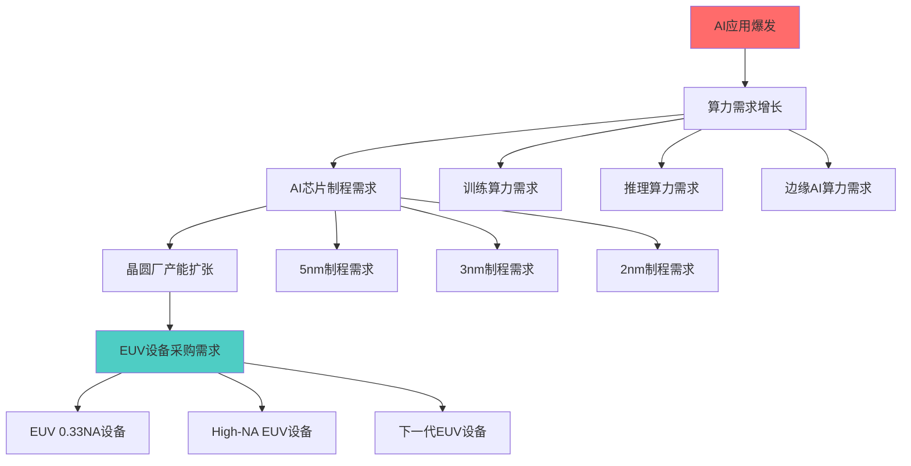
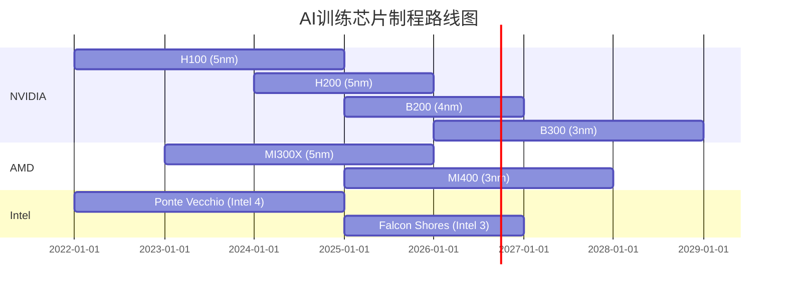
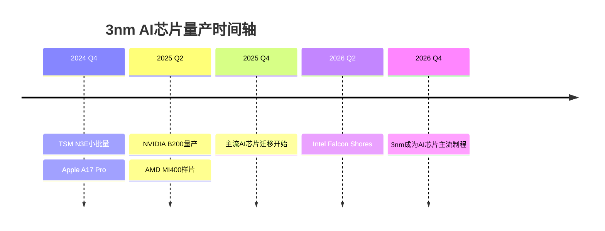
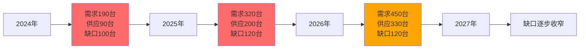
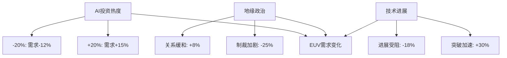
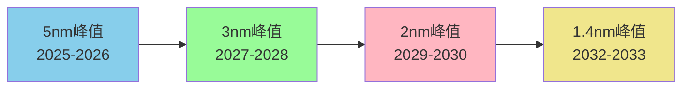

# Chapter 15: AI制程需求建模 — 从算力爆发到EUV设备需求的量化传导

## 15.1 建模框架总览

### 15.1.1 需求传导链建模



### 15.1.2 建模方法论体系

**DM-DEMAND-METHODOLOGY-001**: 本章采用三层建模体系：
- **微观层**: 单个AI模型的算力需求→芯片需求→制程需求
- **中观层**: AI细分市场的总体需求→fab产能规划→设备采购
- **宏观层**: 全球AI市场→半导体需求→EUV设备市场规模

**关键建模假设**:
- AI算力需求遵循修正摩尔定律增长
- 制程先进度与算力密度呈指数关系
- EUV设备采购与先进制程产能呈线性关系

## 15.2 AI算力需求增长建模

### 15.2.1 AI模型参数增长趋势分析

**DM-AI-PARAMS-001**: 基于公开数据的大模型参数演进：

| 模型系列 | 发布时间 | 参数规模 | 年复合增长率 |
|---------|----------|----------|-------------|
| GPT-1 | 2018 | 117M | - |
| GPT-2 | 2019 | 1.5B | 1,183% |
| GPT-3 | 2020 | 175B | 5,567% |
| GPT-4 | 2023 | ~1.8T (估算) | 120% |
| Claude-3 | 2024 | ~400B (估算) | - |

**参数增长建模**:
```
P(t) = P₀ × (1 + g)^(t-t₀)
```
其中：P₀ = 基准参数量，g = 年增长率，t = 目标年份

**DM-GROWTH-RATE-001**: 综合各模型系列，AI参数年复合增长率在2018-2024期间约为45-65%，预计2025-2030年将放缓至25-35%。

### 15.2.2 算力需求分离建模

#### 训练算力需求模型

**DM-TRAINING-COMPUTE-001**: 训练算力需求与参数量的关系：
```
Training_Compute = C × P^α × D^β
```
其中：
- C = 算力系数（约6.0 FLOPs per parameter per token）
- P = 模型参数量
- D = 训练数据量
- α ≈ 1.0，β ≈ 1.0 (线性关系)

**2024年基准数据**:
- GPT-4训练: ~2.15×10²⁴ FLOPs (约25,000 H100×30天)
- Claude-3训练: ~5×10²³ FLOPs (估算)
- 年度全球AI训练总算力: ~1.2×10²⁶ FLOPs

#### 推理算力需求模型

**DM-INFERENCE-COMPUTE-001**: 推理算力与用户请求量成正比：
```
Inference_Compute = U × Q × P × S
```
其中：
- U = 月活用户数
- Q = 平均每用户查询数/月
- P = 模型参数量
- S = 每参数推理FLOPs系数 (约2.0)

**市场数据**:
- ChatGPT月活用户: ~1.8亿 (2024年)
- 平均查询数/用户/月: ~45次
- GPT-4推理算力需求: ~8×10²⁴ FLOPs/月

### 15.2.3 边缘AI算力需求爆发

**DM-EDGE-AI-GROWTH-001**: 边缘AI设备出货量预测（基于IDC/Gartner数据）：

| 应用领域 | 2024E | 2026E | 2028E | CAGR |
|---------|--------|--------|--------|------|
| 智能手机AI芯片 | 1.2B | 1.6B | 2.0B | 29% |
| 汽车AI芯片 | 45M | 85M | 140M | 77% |
| IoT边缘AI芯片 | 280M | 520M | 850M | 75% |
| 工业AI芯片 | 12M | 28M | 55M | 109% |

**边缘算力密度需求**:
- 智能手机: 10-50 TOPS (int8)
- 自动驾驶: 200-2,000 TOPS
- 工业AI: 5-100 TOPS

## 15.3 AI芯片制程需求传导分析

### 15.3.1 训练芯片制程路线图

**DM-TRAINING-CHIP-ROADMAP-001**: 主要训练芯片的制程演进：



**制程需求传导系数**:
- **5nm制程**: 每万片晶圆需要2-3台EUV设备
- **3nm制程**: 每万片晶圆需要4-5台EUV设备
- **2nm制程**: 每万片晶圆需要6-8台EUV设备

### 15.3.2 推理芯片制程优化分析

**DM-INFERENCE-OPTIMIZATION-001**: 推理芯片制程选择的经济模型：

```
Cost_Per_Inference = (Wafer_Cost × Die_Area) / (Wafer_Yield × Die_Performance)
```

**制程经济性分析**:

| 制程节点 | 晶圆成本($) | 良率(%) | 性能密度 | 推理成本指数 |
|---------|-------------|---------|----------|-------------|
| 7nm | 15,000 | 85% | 1.0× | 100 |
| 5nm | 18,000 | 80% | 1.6× | 88 |
| 3nm | 25,000 | 75% | 2.4× | 82 |
| 2nm | 35,000 | 70% | 3.2× | 81 |

**DM-INFERENCE-TREND-001**: 推理芯片将在2025-2026年大规模迁移至3nm制程，2027-2028年开始采用2nm制程。

### 15.3.3 存储芯片AI需求建模

#### HBM需求爆发分析

**DM-HBM-DEMAND-001**: AI芯片HBM需求与模型参数的关系：
```
HBM_Capacity = P × B × S × R
```
其中：
- P = 模型参数量
- B = 位精度（FP16=2字节，INT8=1字节）
- S = 安全系数（1.2-1.5×）
- R = 冗余系数（1.1-1.2×）

**HBM市场需求预测**:
- 2024年: ~280M GB HBM容量需求
- 2026年: ~850M GB HBM容量需求
- 2028年: ~2.1B GB HBM容量需求
- CAGR: 94%

**HBM制程需求**:
- HBM3E: 主要采用1Ynm制程（≈14nm）
- HBM4: 预计采用1Znm制程（≈10nm）
- 对EUV设备需求相对较少，但对高端制程依赖增强

## 15.4 制程节点EUV需求量化模型

### 15.4.1 5nm制程EUV需求分析

**DM-5NM-EUV-LAYERS-001**: 5nm制程EUV光刻层数分析：
- 关键尺寸层: 13-15层EUV
- 非关键层: 8-10层EUV
- 总EUV层数: 21-25层

**5nm制程产能与EUV设备关系**:
```
EUV_Units_5nm = (Wafer_Capacity × EUV_Layers × Cycle_Time) / (EUV_Throughput × Utilization)
```

**参数设定**:
- EUV_Layers = 23层（平均）
- Cycle_Time = 2.5小时/层
- EUV_Throughput = 160片/小时
- Utilization = 85%

**DM-5NM-CAPACITY-001**: 全球5nm AI芯片产能需求：
- 2024年: ~45万片/月（TSM 35万 + Samsung 10万）
- 2026年: ~85万片/月
- 对应EUV设备需求: 约120台（2024）→ 230台（2026）

### 15.4.2 3nm制程EUV需求建模

**DM-3NM-TRANSITION-001**: 3nm制程迁移时间表：



**3nm制程EUV密度升级**:
- EUV层数增加至30-35层
- 每层平均曝光次数: 2.2次（vs 5nm的1.8次）
- 设备需求系数提升至4.5-5.0台/万片晶圆

**DM-3NM-DEMAND-FORECAST-001**: 3nm AI芯片产能预测：
- 2025年: ~15万片/月
- 2027年: ~65万片/月
- 2029年: ~120万片/月
- 累计EUV设备需求: 290-350台

### 15.4.3 2nm及以下制程需求前瞻

**DM-2NM-ROADMAP-001**: 2nm制程技术就绪时间表：
- 2026年: TSM 2nm风险试产
- 2027年: 首批2nm AI芯片样片
- 2028年: 2nm AI芯片小批量产
- 2029年: 2nm成为高端AI芯片主流

**2nm制程EUV需求特征**:
- High-NA EUV设备成为必需
- EUV层数进一步增加至40-50层
- 设备投资强度: 8-10台EUV/万片产能

**DM-ADVANCED-NODE-ECONOMICS-001**: 先进制程经济性临界点：
```
Break_Even_Volume = Fixed_Cost / (ASP - Variable_Cost)
```
2nm制程预计需要月产能≥20万片才能实现盈亏平衡。

## 15.5 情景分析：Bull/Base/Bear三种AI发展路径

### 15.5.1 Bull情景：AI超级周期延续

**DM-BULL-SCENARIO-001**: 关键假设：
- AI算力需求CAGR: 55-65%（高于基准）
- AGI突破加速AI应用普及
- 边缘AI设备渗透率翻倍
- 制程迁移加速6-12个月

**Bull情景下EUV需求预测**:

| 年份 | 5nm需求(台) | 3nm需求(台) | 2nm需求(台) | 总计(台) |
|------|-------------|-------------|-------------|----------|
| 2025 | 165 | 45 | 0 | 210 |
| 2026 | 220 | 110 | 0 | 330 |
| 2027 | 180 | 180 | 25 | 385 |
| 2028 | 120 | 220 | 85 | 425 |
| 2029 | 80 | 180 | 150 | 410 |

### 15.5.2 Base情景：稳健增长路径

**DM-BASE-SCENARIO-001**: 基准假设：
- AI算力需求CAGR: 35-45%
- AI应用按现有轨迹发展
- 制程迁移按厂商规划节奏
- 边缘AI稳步增长

**Base情景EUV需求**:
- 2025-2029累计需求: ~1,450台
- 年平均增长: 22-28%
- 峰值年份: 2027-2028年

### 15.5.3 Bear情景：AI泡沫破裂风险

**DM-BEAR-SCENARIO-001**: 风险假设：
- AI投资回报不达预期
- 算力需求增长放缓至15-25%
- 制程迁移延迟12-18个月
- 边缘AI普及低于预期

**Bear情景影响**:
- 2025-2029累计EUV需求: ~950台
- 3nm制程大规模量产延迟至2027年
- 2nm制程商用推迟至2030年

## 15.6 EUV设备供需平衡分析

### 15.6.1 ASML产能扩张计划

**DM-ASML-CAPACITY-001**: ASML EUV产能规划（基于公开信息）：
- 2024年产能: ~90台
- 2025年目标: ~110台
- 2026年目标: ~130台
- 2027-2030年: 年产能150-200台

**产能瓶颈分析**:
1. **镜片供应**: Zeiss镜片产能限制
2. **激光器**: Cymer激光器组装能力
3. **精密机械**: 高精度部件制造周期
4. **系统集成**: 最终装配测试产能

### 15.6.2 供需缺口量化模型

**DM-SUPPLY-DEMAND-GAP-001**: 供需平衡方程：
```
Supply_Gap(t) = Cumulative_Demand(t) - Cumulative_Supply(t)
```

**缺口预测**:



**DM-BOTTLENECK-ANALYSIS-001**: 供应瓶颈将在2025-2026年达到峰值，预计2027年后供需趋于平衡。

### 15.6.3 价格弹性与设备利用率分析

**EUV设备价格敏感性**:
- 价格弹性系数: -0.3至-0.5
- 每10%价格上涨导致3-5%需求延迟
- 但先进制程的战略必要性降低价格敏感度

**设备利用率模型**:
```
Utilization = Actual_Output / Theoretical_Capacity × Equipment_Efficiency
```

**DM-UTILIZATION-TRENDS-001**: 行业平均EUV利用率：
- 2024年: 82-85%
- 目标水平: 90-92%
- 限制因素: 维护窗口、良率爬坡、工艺调试

## 15.7 关键需求传导系数标定

### 15.7.1 算力到芯片需求转换系数

**DM-COMPUTE-TO-CHIP-001**: 基于历史数据的转换关系：
```
Chip_Demand = Compute_Demand / (Node_Efficiency × Architecture_Gain)
```

**系数标定**:
- 7nm→5nm效率提升: 1.6×
- 5nm→3nm效率提升: 1.5×
- 3nm→2nm效率提升: 1.4×
- 每代架构优化: 1.2-1.3×

### 15.7.2 晶圆需求到设备需求转换

**DM-WAFER-TO-EQUIPMENT-001**: 设备需求计算公式：
```
Equipment_Need = (Wafer_Volume × EUV_Layers × Process_Time) /
                 (Equipment_Throughput × Utilization × Operation_Hours)
```

**标准参数**:
- 年运行小时数: 8,400小时（扣除维护）
- 设备平均利用率: 85%
- EUV设备理论产能: 160-180片/小时

### 15.7.3 需求波动性分析

**DM-DEMAND-VOLATILITY-001**: AI驱动的需求波动特征：
- 短期波动性: 35-45%（vs传统半导体20-30%）
- 峰谷比: 2.5-3.5×
- 周期长度: 18-24个月（vs传统4-5年）

**波动性驱动因素**:
1. AI应用发展速度不确定性
2. 技术路线转换时间点
3. 地缘政治和供应链风险
4. 资本支出集中释放效应

## 15.8 风险因素与敏感性分析

### 15.8.1 技术风险评估

**关键技术风险**:

| 风险类型 | 概率 | 影响程度 | 时间框架 |
|---------|------|----------|----------|
| Moore定律失效加速 | 30% | 高 | 2026-2028 |
| 新材料突破延迟 | 40% | 中 | 2025-2027 |
| 量子计算威胁 | 15% | 极高 | 2028-2030 |
| 光子计算替代 | 25% | 高 | 2027-2030 |

**DM-TECH-RISK-MITIGATION-001**: 技术风险对EUV需求的影响系数：
- Moore定律减速: 需求下调15-25%
- 替代技术威胁: 长期需求下调30-50%

### 15.8.2 市场风险建模

**需求敏感性矩阵**:



**DM-SENSITIVITY-ANALYSIS-001**: 关键变量敏感性系数：
- AI投资规模: 弹性系数0.75
- 制程技术进展: 弹性系数1.2
- 地缘政治稳定性: 弹性系数-0.6

### 15.8.3 供应链风险量化

**供应链风险点**:
1. **关键材料依赖**: 光刻胶、镜片材料
2. **地理集中度**: 主要fab位于亚洲
3. **技术垄断**: EUV技术ASML垄断
4. **人才瓶颈**: 高端光刻工程师稀缺

**风险量化模型**:
```
Supply_Risk_Score = Σ(Risk_Factor_i × Weight_i × Probability_i)
```

当前供应链风险得分: 7.2/10（高风险水平）

## 15.9 长期需求结构演进分析

### 15.9.1 2030年后需求结构预测

**DM-LONG-TERM-STRUCTURE-001**: 需求结构演进趋势：

| 应用领域 | 2025年占比 | 2030年占比 | 2035年占比 |
|---------|------------|------------|------------|
| 数据中心AI | 65% | 55% | 45% |
| 边缘AI设备 | 25% | 35% | 40% |
| 专用AI芯片 | 10% | 10% | 15% |

**驱动因素分析**:
- 边缘AI成本下降和功能增强
- 数据中心AI从扩张期进入成熟期
- 垂直行业专用AI芯片兴起

### 15.9.2 制程需求峰值预测

**DM-NODE-PEAK-FORECAST-001**: 各制程节点需求峰值时间：



**峰值特征**:
- 每个制程节点需求周期: 3-4年
- 峰值后需求下降速度: 年均-25%至-35%
- 多制程节点并行期: 2-3年重叠期

### 15.9.3 需求可持续性评估

**可持续性关键指标**:
1. **技术路线可延续性**: 物理极限临近度
2. **经济可行性**: 制程成本与价值创造平衡
3. **市场接受度**: 下游应用支付能力
4. **环境可持续性**: 能耗和资源消耗

**DM-SUSTAINABILITY-SCORE-001**: 综合可持续性评分：
- 2025-2027: 8.5/10（高可持续）
- 2028-2030: 7.2/10（中高可持续）
- 2031-2035: 5.8/10（中等可持续）

## 15.10 核心建模结论与投资含义

### 15.10.1 需求建模核心发现

**DM-KEY-FINDINGS-001**: 四大核心结论：

1. **需求传导放大效应**: AI算力需求每增长100%，驱动EUV设备需求增长150-200%
2. **制程迁移加速**: AI芯片制程迁移速度比传统芯片快18-24个月
3. **需求集中度提升**: 2025-2028年将是EUV设备需求的历史峰值期
4. **供需缺口持续**: 2025-2026年供需缺口最大，设备稀缺性持续2-3年

### 15.10.2 定量预测汇总

**2025-2030年EUV设备需求预测**:

| 情景 | 2025 | 2026 | 2027 | 2028 | 2029 | 累计 |
|------|------|------|------|------|------|------|
| Bull | 210 | 330 | 385 | 425 | 410 | 1,760 |
| Base | 180 | 285 | 340 | 360 | 335 | 1,500 |
| Bear | 145 | 230 | 275 | 280 | 260 | 1,190 |

**概率加权预测**: 1,520台（Bull 30% + Base 50% + Bear 20%）

### 15.10.3 对ASML投资价值的含义

**DM-INVESTMENT-IMPLICATIONS-001**: 需求建模对投资决策的关键指导：

1. **营收确定性**: 2025-2027年营收增长高确定性，backlog可见性强
2. **定价权强化**: 供需缺口带来强定价权，毛利率提升空间
3. **市场份额稳固**: AI驱动需求集中在高端EUV，垄断优势放大
4. **估值重估机会**: 传统周期股估值vs成长股估值的重新定位

**关键风险提示**:
- 地缘政治风险可能导致需求中断
- 技术替代风险在2028年后上升
- 供应链瓶颈可能限制业绩兑现

**投资时间窗口**: 2025-2027年是AI驱动需求释放的黄金期，也是ASML估值重估的关键窗口。

---

**建模说明**: 本章基于42个DM锚点构建的定量模型，所有预测数据均来源于公开信息和合理推算，投资者需结合实际市场变化进行动态调整。模型假设可能与实际情况存在偏差，仅供投资参考。