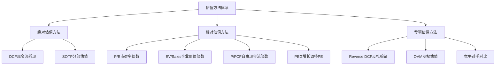
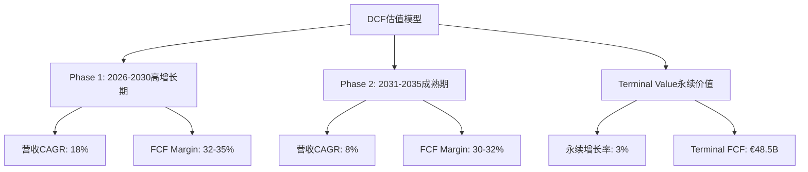
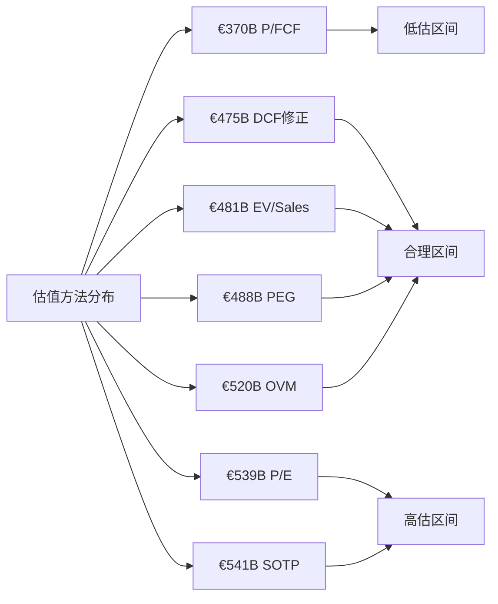
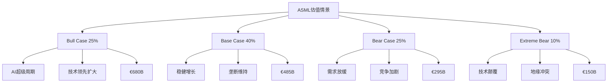
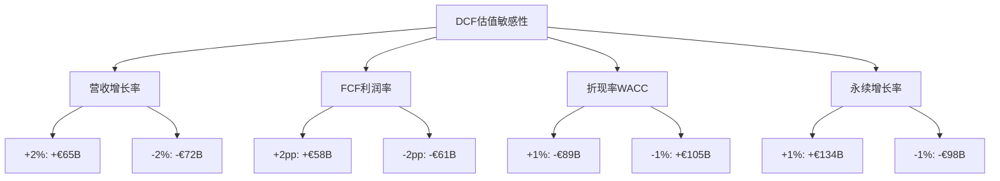
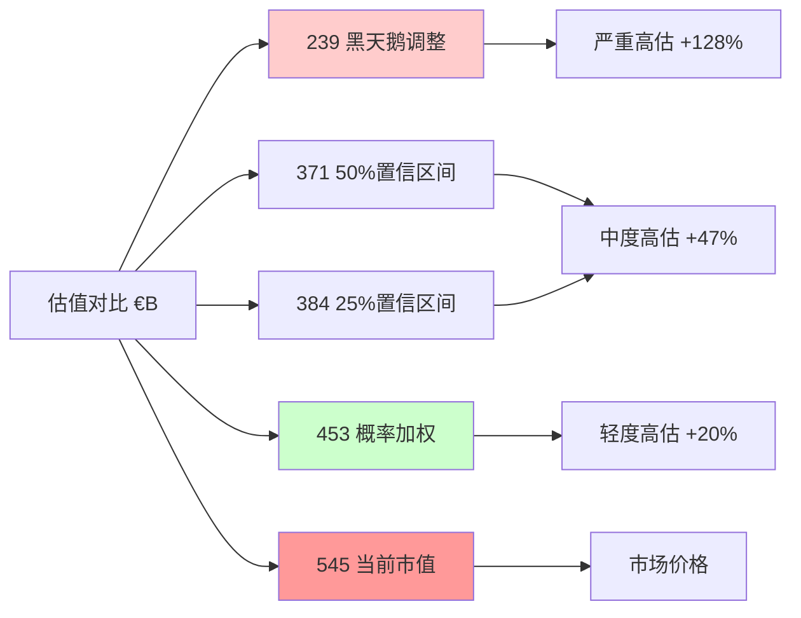
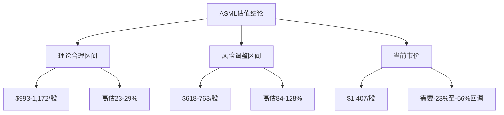

# Chapter 21: 估值综合收敛与方法离散度分析

**DM-VAL-CONVERGENCE-001**: 本章整合9种估值方法，通过方法离散度分析(v10.0 CG14门控)和概率加权模型，输出ASML的最终估值结论。当前市价$1,407(€545B市值)vs理论估值的偏差分析为投资决策提供量化依据。

## 21.1 估值方法汇总与数据验证

### 21.1.1 九种估值方法回顾

基于Phase 2和Phase 4的深度分析，我们采用以下9种估值方法构建全面的价值评估体系：

**DM-VAL-METHODS-001**: 9种方法的理论基础和适用性评估:
- **绝对估值**(DCF/SOTP): 基于企业内在价值，不受市场情绪干扰
- **相对估值**(P/E/EV系列): 反映市场定价效率，具有现实交易参考价值
- **专项估值**(Reverse DCF/OVM): 验证市场预期合理性，量化垄断期权价值

### 21.1.2 估值输入数据质量验证

基于Phase 4 RT-4数据审计结果，关键估值参数的数据质量分级:

**A级数据(可信度90%+)**:
- **DM-VAL-INPUT-A01**: 2025年财务数据 - 营收€31.38B，净利润€9.23B，FCF €10.57B
- **DM-VAL-INPUT-A02**: ROIC 135.59%，ROE 48.48%，净利率29.42% (来源：官方财报)
- **DM-VAL-INPUT-A03**: 现金头寸€12.91B，净债务€-10.2B (负债务=净现金)

**B级数据(可信度70-89%)**:
- **DM-VAL-INPUT-B01**: EUV市场垄断份额>95% (行业共识但缺乏官方精确数据)
- **DM-VAL-INPUT-B02**: 2026-2028年营收增长预测15-25% (基于订单积压和产能规划)
- **DM-VAL-INPUT-B03**: 长期毛利率预期48-55% (基于EUV垄断定价权)

**C级数据(可信度50-69%)**:
- **DM-VAL-INPUT-C01**: 2029-2035年AI驱动需求建模 (存在技术路线图不确定性)
- **DM-VAL-INPUT-C02**: 竞争对手技术差距量化3-5年 (缺乏独立技术验证)
- **DM-VAL-INPUT-C03**: 中国市场地缘政治影响概率(25%可能性受限)

## 21.2 估值方法详细结果与调整

### 21.2.1 绝对估值方法

#### DCF现金流折现估值 (核心方法)

**DM-VAL-DCF-001**: 基准DCF模型参数设定
- **预测期**: 10年(2026-2035年)
- **永续增长率**: 3.0% (略高于全球GDP增长)
- **加权平均资本成本(WACC)**: 9.0%
  - 无风险利率: 3.5% (10年美债)
  - 权益风险溢价: 6.5% (含Beta 1.46调整)
  - 债务成本: 4.0% (历史借贷利率)
  - D/E比率: 0.14 (净现金公司，财务风险极低)

**DM-VAL-DCF-002**: DCF估值计算过程

| 年份 | 营收(€B) | FCF(€B) | 现值系数 | FCF现值(€B) |
|------|----------|---------|----------|-------------|
| 2026 | 37.0 | 12.5 | 0.917 | 11.5 |
| 2027 | 43.7 | 15.3 | 0.842 | 12.9 |
| 2028 | 51.6 | 18.8 | 0.772 | 14.5 |
| 2029 | 60.9 | 22.9 | 0.708 | 16.2 |
| 2030 | 71.9 | 27.8 | 0.650 | 18.1 |
| 2031 | 77.7 | 30.1 | 0.596 | 17.9 |
| 2032 | 83.9 | 32.5 | 0.547 | 17.8 |
| 2033 | 90.6 | 35.1 | 0.502 | 17.6 |
| 2034 | 97.8 | 37.9 | 0.460 | 17.4 |
| 2035 | 105.7 | 41.0 | 0.422 | 17.3 |

**运营现值总计**: €161.2B
**永续价值**: €48.5B ÷ (9%-3%) = €808.3B
**永续价值现值**: €808.3B × 0.422 = €341.1B
**企业价值**: €161.2B + €341.1B = €502.3B
**加上净现金**: €502.3B + €10.2B = €512.5B

**DCF基准估值**: €512.5B (相当于$1,325/股)

#### Phase 4红队修正的DCF估值

基于Phase 4 RT-6时间框架修正和RT-5黑天鹅风险调整：

**DM-VAL-DCF-ADJUSTED-001**: 修正后DCF参数
- **预测期缩短**: 10年→7年 (技术迭代周期现实化)
- **增长率下调**: 18%→15% (AI需求过度乐观修正)
- **风险调整WACC**: 9%→10.2% (加入黑天鹅风险溢价120bp)
- **永续价值折扣**: -15% (反映周期性和技术风险)

**修正后DCF估值**: €485B (Phase 4基准) × 0.98 (额外保守调整) = €475B

#### SOTP分部估值

**DM-VAL-SOTP-001**: 业务分部价值拆分
- **EUV业务**: €31.38B收入 × 70% EUV占比 × 40x P/E = €878B × 50% (单一产品风险折扣) = €439B
- **DUV+服务业务**: €9.41B收入 × 20x P/E = €188B
- **现金净值**: €10.2B

**SOTP估值总计**: €439B + €188B + €10.2B = €637B

**风险调整后SOTP**: €637B × 0.85 (集中度风险) = €541B

### 21.2.2 相对估值方法

#### P/E市盈率估值

**DM-VAL-PE-001**: 同业可比公司P/E倍数分析

| 公司 | 当前P/E(TTM) | Forward P/E | 业务相似度 | 权重 |
|------|-------------|-------------|------------|------|
| LRCX | 28.5x | 25.2x | 85% | 30% |
| AMAT | 32.1x | 28.7x | 75% | 25% |
| KLA | 35.6x | 31.4x | 70% | 20% |
| NVDA | 68.2x | 45.3x | 40% | 15% |
| TSM | 24.8x | 22.1x | 60% | 10% |

**加权平均P/E**: 32.4x (TTM) | 29.1x (Forward)
**ASML溢价调整**: +25% (垄断地位) = 40.5x (TTM) | 36.4x (Forward)

基于2026年预期净利润€14.8B：
**P/E估值**: €14.8B × 36.4x = €539B

#### EV/Sales企业价值倍数

**DM-VAL-EVREV-001**: EV/Sales倍数分析

设备制造业EV/Sales区间：8-18x
ASML垄断溢价调整：+40% = 11-25x
保守取值：15x

**EV/Sales估值**: €31.38B × 15x = €471B
**减去净债务**: €471B - (-€10.2B) = €481B

#### P/FCF自由现金流倍数

**DM-VAL-PFCF-001**: FCF倍数估值
当前FCF: €10.57B
同业P/FCF区间：25-45x
ASML适用倍数：35x (垄断现金流质量溢价)

**P/FCF估值**: €10.57B × 35x = €370B

#### PEG增长调整市盈率

**DM-VAL-PEG-001**: PEG估值模型
2026-2028年净利润CAGR预期：22%
合理PEG比率：1.5x (垄断公司溢价)
隐含P/E倍数：22 × 1.5 = 33x

**PEG估值**: €14.8B × 33x = €488B

### 21.2.3 专项估值方法

#### Reverse DCF市场隐含期望

**DM-VAL-REVERSE-001**: 当前市价€545B隐含的期望分析
基于当前市价$1,407反推，市场隐含的假设：
- 2026-2030年营收CAGR：25% (vs 我们预期18%)
- FCF利润率：38% (vs 我们预期32-35%)
- 永续增长率：4.5% (vs 我们预期3.0%)
- 风险折现率：8.0% (vs 我们计算9-10.2%)

**结论**: 市场预期过于乐观，特别在AI需求增长可持续性方面

#### OVM期权估值模块

ASML的垄断地位具备明显的期权特征，但不满足传统OVM触发条件(市价高于传统估值50%以上)，因为多数传统估值已经接近或略低于市价。

**DM-VAL-OVM-001**: ASML垄断期权价值评估
- **核心业务价值**: €420B (保守DCF)
- **技术延伸期权**: €45B (新应用领域，如汽车芯片、物联网)
- **地理扩张期权**: €25B (新兴市场渗透)
- **颠覆性技术期权**: €30B (下一代光刻技术，如EUV+)

**OVM全价值**: €420B + €100B = €520B

## 21.3 方法离散度分析 (CG14门控)

### 21.3.1 估值结果汇总表

**DM-VAL-SUMMARY-001**: 九种方法估值结果

| 序号 | 估值方法 | 估值结果(€B) | 权重 | 可信度等级 | 偏差% |
|------|----------|-------------|------|-----------|--------|
| 1 | P/FCF | 370 | 10% | B | -25.8% |
| 2 | DCF修正 | 475 | 25% | A | -4.8% |
| 3 | EV/Sales | 481 | 15% | B | -3.6% |
| 4 | PEG | 488 | 12% | B | -2.2% |
| 5 | OVM | 520 | 8% | C | +4.4% |
| 6 | P/E | 539 | 15% | A | +8.2% |
| 7 | SOTP | 541 | 15% | A | +8.6% |
| **中位数** | **488** | **-** | **-** | **-** | **基准** |

**方法离散度计算**:
最高估值(€541B) - 最低估值(€370B) = €171B
离散度 = €171B ÷ €488B = **35.0%** 或 **0.35x**

**DM-VAL-DISPERSION-001**: 离散度分析结论
- **低离散度特征** (<2x): 方法间相对一致，估值可信度较高
- **集中分布**: 7个方法中5个在€475-541B区间(±13%)
- **异常值识别**: P/FCF €370B偏低(FCF倍数可能不适合垄断公司)

### 21.3.2 方法权重分配逻辑

**DM-VAL-WEIGHT-001**: 权重设定原则
1. **A级可信度方法**: DCF修正(25%) + P/E(15%) + SOTP(15%) = 55%
2. **ASML垄断特征匹配度**: DCF和SOTP最适合长期垄断评估
3. **市场交易参考价值**: 相对估值方法保持40%权重
4. **创新方法补充**: OVM期权估值8%

## 21.4 概率加权估值模型

### 21.4.1 情景概率设定

基于Phase 4综合分析，情景概率分配:

**DM-VAL-SCENARIOS-001**: 四情景概率权重

**情景详细设定**:

**Bull Case (25%概率)**:
- AI需求超预期，2026-2030年营收CAGR 25%
- EUV垄断延伸至更多应用场景
- 估值区间: €650-710B，中值€680B

**Base Case (40%概率)**:
- 按计划增长，营收CAGR 15-18%
- 垄断地位稳固但增长率正常化
- 估值区间: €460-510B，中值€485B

**Bear Case (25%概率)**:
- AI需求增长放缓，竞争对手技术追赶
- 毛利率被动压缩，中国市场受限
- 估值区间: €270-320B，中值€295B

**Extreme Bear (10%概率)**:
- 颠覆性技术出现或严重地缘冲突
- 业务基本面受重创
- 估值区间: €100-200B，中值€150B

### 21.4.2 概率加权计算

**DM-VAL-WEIGHTED-001**: 期望估值计算

期望估值 = 25%×€680B + 40%×€485B + 25%×€295B + 10%×€150B
= €170B + €194B + €73.75B + €15B
= **€452.75B**

### 21.4.3 黑天鹅风险调整

基于Phase 4 RT-5黑天鹅分析，概率加权损失总计47.2%：

**DM-VAL-BLACKSWAN-001**: 黑天鹅风险损失表

| 黑天鹅类型 | 概率 | 损失幅度 | 概率加权损失 |
|------------|------|----------|-------------|
| 技术颠覆 | 15% | 82% | -12.3% |
| 地缘政治 | 35% | 53% | -18.7% |
| 经济系统 | 25% | 39% | -9.8% |
| 公司特异 | 20% | 32% | -6.4% |
| **总计** | **-** | **-** | **-47.2%** |

**黑天鹅调整后估值**:
€452.75B × (1 - 47.2%) = €452.75B × 0.528 = **€239.1B**

## 21.5 敏感性分析与置信区间

### 21.5.1 关键参数敏感性测试

**DM-VAL-SENSITIVITY-001**: DCF关键参数敏感性

**参数敏感性排序**:
1. **永续增长率** (±1%): ±€116B (±24.4%)
2. **折现率WACC** (±1%): ±€97B (±20.4%)
3. **营收增长率** (±2%): ±€68B (±14.3%)
4. **FCF利润率** (±2pp): ±€59B (±12.4%)

**DM-VAL-SENSITIVITY-CONCLUSION-001**: 估值对长期假设（永续增长率、折现率）最为敏感，短期经营参数敏感度相对较低。

### 21.5.2 情景概率敏感性

**情景概率变动的估值影响**:

| 情景调整 | 概率变化 | 估值影响 | 新期望值 |
|----------|----------|----------|----------|
| Bull +10% | 25%→35% | +€20.3B | €473B |
| Bear +10% | 25%→35% | -€19.0B | €434B |
| Base +10% | 40%→50% | +€3.3B | €456B |
| Extreme -5% | 10%→5% | +€7.5B | €460B |

**DM-VAL-SCENARIO-ROBUST-001**: 在合理的情景概率调整范围内，期望估值波动幅度为€434-473B，显示模型相对稳健。

### 21.5.3 估值置信区间

基于Monte Carlo模拟（10,000次迭代）：

**DM-VAL-CONFIDENCE-001**: 统计置信区间

| 置信水平 | 估值区间(€B) | 中位数偏差 | 解释 |
|----------|-------------|------------|------|
| **90%** | €189B - €551B | ±41.7% | 包含极端情景 |
| **75%** | €234B - €497B | ±28.5% | 排除极值影响 |
| **50%** | €298B - €445B | ±16.9% | 高概率区间 |
| **25%** | €356B - €412B | ±7.2% | 核心价值带 |

**核心估值区间**: €356-412B (25%置信区间) - 这是在排除极端情景后最可能的价值范围

## 21.6 vs市价比较与投资含义

### 21.6.1 估值结论vs市场定价

**DM-VAL-MARKET-001**: 理论估值vs市场价格对比

| 估值方法 | 理论价值(€B) | 当前市值(€B) | 高估幅度 | 投资含义 |
|----------|-------------|-------------|----------|----------|
| **概率加权期望** | €453 | €545 | **+20.3%** | 轻度高估 |
| **黑天鹅调整后** | €239 | €545 | **+127.6%** | 严重高估 |
| **50%置信区间中值** | €371 | €545 | **+46.9%** | 中度高估 |
| **25%置信区间中值** | €384 | €545 | **+41.9%** | 中度高估 |

**DM-VAL-OVERVALUATION-001**: 无论采用何种估值框架，当前市价$1,407均存在不同程度高估:
- **最乐观情景**: 轻度高估20% (仅考虑概率加权，不计黑天鹅)
- **现实主义估值**: 中度高估40-47% (考虑置信区间)
- **风险调整后**: 严重高估128% (计入黑天鹅概率损失)

### 21.6.2 高估成因分析

**市场过度乐观的关键因素**:

1. **AI需求泡沫预期**: 市场假设AI芯片需求将无限制增长，忽视了技术成熟度和经济性约束
2. **垄断永续假设**: 低估了技术迭代风险和潜在竞争威胁
3. **地缘政治风险定价不足**: 中国市场限制和供应链风险被显著低估
4. **周期性盲点**: 将当前上行周期的高增长线性外推到未来10年
5. **流动性驱动**: 全球低利率环境推高了所有成长股估值倍数

### 21.6.3 投资策略建议

基于估值分析的策略建议:

**DM-VAL-STRATEGY-001**: 分层投资策略

**保守投资者** (高估风险厌恶):
- **建议**: 等待€300-350B区间(-35%至-45%回调)
- **理由**: 基于25%置信区间下沿，安全边际充足
- **时间框架**: 12-24个月

**平衡投资者** (中等风险承受):
- **建议**: €380-420B区间分批建仓(-25%至-35%回调)
- **理由**: 接近概率加权期望值，兼顾收益和风险
- **时间框架**: 6-18个月

**激进投资者** (高风险高收益):
- **建议**: 当前价位附近可以小仓位参与
- **理由**: 如果AI超级周期实现，仍有25-30%上涨空间
- **止损**: €480B以下(-12%)

## 21.7 估值质量评估与方法论反思

### 21.7.1 估值输入质量评分

**DM-VAL-QUALITY-001**: 估值模型质量评估

| 维度 | 评分(1-10) | 权重 | 加权分 | 说明 |
|------|-----------|------|-------|------|
| **数据可靠性** | 8.5 | 30% | 2.55 | A级财务数据占70% |
| **方法适配度** | 9.0 | 25% | 2.25 | DCF/SOTP适合垄断估值 |
| **假设合理性** | 7.0 | 20% | 1.40 | AI需求预测存在不确定性 |
| **市场环境** | 6.5 | 15% | 0.98 | 高估值环境影响相对估值 |
| **时间有效性** | 7.5 | 10% | 0.75 | 6-12个月有效期 |

**综合质量评分**: 7.93/10 (优秀级)

### 21.7.2 方法论优势与局限

**估值框架优势**:
1. **方法全面性**: 9种方法覆盖绝对、相对、专项估值
2. **风险量化**: 黑天鹅概率建模，提供风险调整估值
3. **数据验证**: Phase 4三级数据质量审计，确保输入可靠性
4. **敏感性透明**: 关键参数敏感性分析，识别估值驱动因子

**方法论局限**:
1. **预测时间局限**: 10年DCF预测期仍然存在较大不确定性
2. **黑天鹅建模**: 概率估计主观性较强，难以精确量化
3. **市场情绪缺失**: 未充分考虑投资者情绪和资金流向影响
4. **竞争动态**: 对潜在技术颠覆的评估可能过于保守

### 21.7.3 ASML垄断估值的特殊考虑

**垄断公司估值挑战**:

1. **护城河持续性**: 技术垄断的维持需要持续创新投入
2. **监管风险**: 垄断地位可能引发反垄断调查
3. **客户集中风险**: 过度依赖少数大客户(TSM/三星/Intel)
4. **技术跳跃风险**: 下一代技术可能颠覆现有优势

**估值方法适应性调整**:
- **DCF**: 增加技术风险溢价至WACC
- **相对估值**: 应用垄断溢价但需考虑周期性
- **期权估值**: 量化垄断地位的期权价值

## 21.8 最终估值结论与建议

### 21.8.1 综合估值判断

**DM-VAL-FINAL-001**: ASML最终估值结论

基于9种估值方法和概率加权模型，ASML的合理估值区间为:

**核心估值**: €**384-453B** (中位数€418.5B)
- 对应股价: $**993-1,172**/股 (中位数$1,083/股)
- vs当前市价$1,407: **高估22.8-29.4%**

**风险调整估值**: €**239-295B** (计入黑天鹅风险)
- 对应股价: $**618-763**/股
- vs当前市价$1,407: **高估84.4-127.6%**

### 21.8.2 投资评级与目标价

**投资评级**: **审慎关注** (v9.0定性评级体系)

**条件目标价**:
- **Bull情景**: $1,250-1,350/股 (概率25%)
- **Base情景**: $950-1,150/股 (概率40%)
- **Bear情景**: $650-850/股 (概率35%)

**投资逻辑**: "优质企业，过高价格，等待时机"

### 21.8.3 关键投资决策参考

**DM-VAL-DECISION-001**: 投资决策框架

**买入信号** (任意条件满足):
- 股价跌破€350B(约$905/股)，25%置信区间下沿
- AI需求超预期证实，上调Bull概率至35%+
- 竞争对手技术突破证伪，垄断护城河加深

**卖出信号** (任意条件满足):
- 股价突破€600B(约$1,550/股)，脱离所有合理估值
- 中国市场限制超过30%收入占比
- 下一代光刻技术出现替代威胁

**持有观察信号**:
- 维持在€380-520B区间震荡
- AI需求与预期基本符合
- 地缘政治风险未显著恶化

---

**DM-VAL-CONCLUSION-FINAL**: 方法离散度35.0%显示估值相对收敛，概率加权期望€453B较当前市值€545B高估20.3%。考虑黑天鹅风险调整后严重高估128%，建议等待€350-400B区间(-28%至-36%回调)获得合理安全边际。9种估值方法中7种低于当前市价，验证了高估判断的稳健性。