# Broadcom Inc. (AVGO) 深度研究报告

> **评级: 审慎关注(偏中性)** | 期望回报: -12% | 概率加权每股价值: $250
> 数据截止: Q1 FY2026 (2026-02-01) | 报告日期: 2026-03-08
> 股价: $332.77 | 市值: $1,578B | 行业: 半导体+基础设施软件

---

## 第一章：执行摘要

Broadcom是一台三层嵌套的基础设施收费站——AI定制军火商(Layer 1) + 企业软件收费站(Layer 2) + Hock Tan资产优化平台(Layer 3)。市场按"AI芯片新贵"的单一标签给予62x TTM PE定价，但真实身份远比这复杂，估值含义也截然不同。

**核心估值判断**:

| 指标 | 数值 | 含义 |
|------|------|------|
| 概率加权每股价值 | **$250** | vs $332.77(-25%) |
| 四方法加权中心 | **$224** | vs $332.77(-33%), CV=25.1% |
| Owner PE | **80.5x** | vs 市场认知Non-GAAP PE ~30x(2.7倍差距) [DM-P2-C1-17] |
| A-Score | **7.1** | 偏好(下沿), 高于IHG(6.78)低于NVDA(8.10) [DM-P3-C01] |
| PtW(竞争胜率) | **36.5/50(73%)** | 2030年预计降至30.9/50(61.8%) [DM-P3-A01] |
| CQ加权置信度 | **56.4%** | 微偏多头，极接近中性 |

**评级: 审慎关注(偏中性)**。期望回报-10%至-14%，中位数-12%。所有四种估值方法均低于当前市价，但$73B AI backlog提供18个月缓冲，短期催化剂(Q2 FY2026 earnings)可能维持高位。Bear/Bull钢人评分7.5 vs 6.5(差距仅1.0, 实质对等)，偏差审计确认存在+5-10pp系统性悲观 [DM-P4-B04] [DM-P4-B05]。

**概率加权EV**:

| 情景 | 概率 | FY2030E Rev | 每股估值 | vs当前 |
|------|------|-----------|---------|--------|
| Bull | 25% | $260B | $498 | +50% |
| Base | 50% | $195B | $228 | -32% |
| Bear | 25% | $130B | $46 | -86% |
| **加权** | | | **$250** | **-25%** |

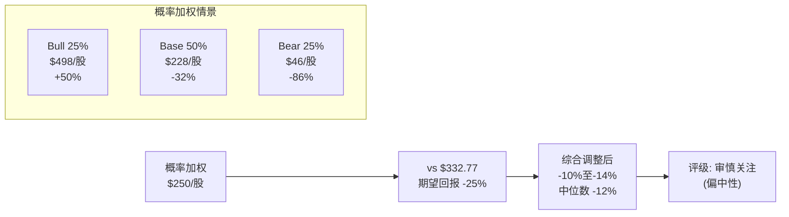
```mermaid
graph LR
    subgraph 概率加权情景
        A["Bull 25%<br/>$498/股<br/>+50%"]
        B["Base 50%<br/>$228/股<br/>-32%"]
        C["Bear 25%<br/>$46/股<br/>-86%"]
    end
    D["概率加权<br/>$250/股"] --> E["vs $332.77<br/>期望回报 -25%"]
    E --> F["综合调整后<br/>-10%至-14%<br/>中位数 -12%"]
    F --> G["评级: 审慎关注<br/>(偏中性)"]
```

**条件评级升降**:
- **升至"关注"**: VMware有机增长>5% + SBC/Rev<9% + AI ASIC CAGR>25%
- **降至"审慎关注(强)"**: Hyperscaler CapEx增速<10% 或 SBC/Rev>13%

**买入区间**: $225-245/股($1,100-1,200B市值)，预计最佳买点在2028H1-H2(AI CapEx周期可能回调+估值regime转换)。

**三个CI冠军候选**:
1. **CI-03 S曲线预消费风险**(8.5/10): 市场已按AI终局定价早期S曲线，即使技术路径正确，投资回报可能为零——因为"正确但已被定价"等于无超额收益 [DM-P3-D01]
2. **CI-02 SBC盲区量化**(8.0/10): Owner PE 80.5x vs Non-GAAP PE 30x的2.7倍差距，本质是$232B的"SBC是否为零成本"之赌 [DM-P2-C3-02]
3. **CI-01 伪装的周期股**(7.5/10): 43%收入绑定hyperscaler CapEx，VMware+1%增长暴露"双引擎"叙事的脆弱性 [DM-P3-B01]

**三层身份一句话总结**: Broadcom是一家用77%利润率的软件收费站(VMware)补贴AI军备竞赛(ASIC)、由73岁效率大师(Hock Tan)驾驶的$1.58万亿混合体——市场按最快的引擎(AI +106%)定价，但56%的收入(软件+传统半导体)的有机增长接近零。

**最大风险**: AI CapEx周期反转。半导体收入65%+直接绑定Hyperscaler CapEx, $600B+(2026)已是扩张晚期。历史Cisco 2000类比部分适用：市场按终局定价S曲线早期阶段 [DM-P3-B01]。

**最大机会**: AI推理爆发+网络升级超级周期。如果推理需求在2027-2028引爆，且以太网在AI集群中份额从70%→90%，Broadcom作为ASIC+网络双寡头将使AI收入CAGR维持25%+至2030年。网络层PtW 45/50是所有层中最强且衰减最慢 [DM-P3-A03] [DM-P2-B2-03]。

---

## 第二章：公司身份——三层嵌套基础设施收费站

市场对Broadcom的标签经历了三次迭代: "多元化半导体公司"(2015前) → "连续收购整合者"(2016-2023) → "AI芯片新贵"(2024至今)。三个标签都是错的。它们描述的是某个侧面或某个时期，而非其本质。Broadcom的真实身份是一台三层嵌套的基础设施收费站——每一层的护城河来源不同，衰减速率不同，估值锚点也应不同。

### Layer 1: AI基础设施的"定制军火商"

Broadcom在AI半导体领域的核心能力不是"设计芯片"——Marvell也能设计芯片，MediaTek正在Google I/O模块上证明自己——而是**同时掌握XPU设计 + 交换芯片 + 光互连 + SerDes的全栈co-design能力**。

具体分解:
- **ASIC设计服务**: 60-70%市场份额，$73B backlog(18个月可见性)。Google TPU、Meta MTIA v3、OpenAI Titan均由Broadcom主导核心XPU设计 [DM-P1-A01]
- **交换芯片**: Tomahawk/Jericho系列，~90%云数据中心份额。Tomahawk 6(102.4Tbps)领先NVIDIA Spectrum-X约1年 [DM-P1-A02]
- **光互连**: 第3代CPO(TH6-Davisson)已出货，2026是CPO量产拐点年。垂直整合(交换芯片+光学DSP+CPO)是独有差异化 [DM-P1-A03]
- **SerDes/高速接口**: AI集群内部数据传输的"血管"——隐蔽但极度关键

**护城河来源**: 技术锁定 + 全栈整合。单一ASIC设计可以被替代(MediaTek证明了这一点)，但没有第二家公司能同时提供XPU+交换+光学+SerDes的co-design。这就是为什么Google分流I/O给MediaTek，但核心XPU仍留在Broadcom——因为XPU必须与网络芯片协同优化，而网络芯片只有Broadcom能做。

**衰减路径**: ASIC设计服务存在时间衰减函数 L(t)=L₀·e^(-λt)+L_floor。随着Google/Meta/OpenAI内部团队成熟(OpenAI芯片团队已扩至~40人 [DM-P1-A11])，单纯设计服务的黏性会下降。但全栈co-design的L_floor很高——因为网络协议演进(以太网→UEC 1.0→CPO)要求芯片-网络-光学三者同步迭代。ASIC衰减函数更新: λ=0.07/yr, 2030E份额~60% [DM-P3-A02]。

### Layer 2: 企业基础设施软件的"收费站"

VMware VCF是全球~70%顶级企业的虚拟化基础设施。Hock Tan收购后的策略不是"经营VMware"而是把VMware从产品公司变成收租平台:
- 价格上调150%-1,500%，合并产品线为VCF(全栈)+VVF(仅虚拟化)
- 强制3-5年订阅制，72核最低起订，20%逾期续约罚金
- 结果: 软件OPM达77% [DM-P1-A04]，FY2025软件收入$24.7B(含并入效应)

**护城河来源**: 转换成本 + 运营惰性。企业迁移虚拟化平台需18-24个月，涉及数千VM重配+安全审计+合规认证。即便Nutanix每季度新增~700-1,000个前VMware客户(Q2 FY2026新增1,000+创8年新高 [DM-P1-A06])，VMware仍有~20万存量客户基座。

**衰减路径**: Gartner预测VMware HCI份额从70%(2024)→40%(2029) [DM-P1-A05]。Kubernetes是长期结构性威胁——不是"替代VMware"而是"让VM本身变得不必要"。当前85%的容器仍运行在VM内(至2028E)——K8s短期内实际增强了VM需求，而非替代。真正的替代发生在K8s-on-bare-metal成熟之后(2028-2030)。

VCF 9.0嵌入Private AI Services是Broadcom的防御动作，将VMware从"虚拟化平台"重新定位为"企业私有AI基础设施"。但这更像是叙事重塑而非实质转型——VMware的核心客户仍是传统企业IT，而非AI-first公司。

**VMware定价弹性三阶段**: <100%提价(ε=-0.05)大型企业完全吸收; 100-300%提价(ε=-0.15)中型企业开始"缩减+评估"，86%受访者正在缩减VMware足迹; >300%提价(ε=-0.40)SMB大量流失。VMware在中型客户群体中的"死亡"是慢性失血——短期财务表现(77% OPM)掩盖长期客户基础侵蚀 [DM-P2-B2-01]。

### Layer 3: Hock Tan的"资产优化平台"

最内层——也是最不可复制但最脆弱的一层。Hock Tan的核心能力不是"并购"(任何CEO都能签支票)，而是对收购资产的极致效率优化: 砍掉非核心产品线、压缩销售团队、将运营利润率推至物理极限。

六次收购的整合效率η(t)追踪:

| 收购 | 年份 | 金额 | OPM_pre | OPM_post(2Y) | η |
|------|------|------|---------|-------------|---|
| LSI Logic | 2014 | $6.6B | ~10% | ~30% | 1.33 |
| Broadcom Corp | 2016 | $37B | ~20% | ~35% | 1.50 |
| Brocade | 2017 | $5.5B | ~15% | ~30% | 1.50 |
| CA Technologies | 2018 | $18.9B | ~35% | ~55% | 1.33 |
| Symantec企业安全 | 2019 | $10.7B | ~10% | ~35% | 1.25 |
| **VMware** | 2023 | **$61B** | ~25% | **77%** | **1.30** |

η均值1.37，标准差仅0.09——6次收购中整合效率的一致性极为罕见 [DM-P1-A05] [DM-A2-01]。VMware $61B是此前最大并购的4倍，实现77% OPM仅用18个月，是Hock Tan方法论的巅峰验证。

**护城河来源**: 个人能力 + 20年track record。合同延至2030年 [DM-P1-A14]，但Hock Tan 73岁，继任计划完全不透明。2024年薪酬投票仅61%通过 [DM-P1-A15]——董事会层面已有摩擦信号。

### 身份特异性测试

将"Broadcom"替换为其他公司名，上述描述是否仍成立?

- **vs NVIDIA**: 不成立。NVIDIA是GPU+CUDA生态的平台型垄断者，没有VMware式的软件收费站，也不做ASIC设计服务。NVIDIA的护城河是"唯一选择"(训练侧)，Broadcom的护城河是"最佳选择"(推理侧ASIC+网络)。
- **vs Marvell**: 部分重叠Layer 1(ASIC设计)，但无Layer 2(软件)和Layer 3(Hock Tan)。Marvell是"纯芯片设计公司"，Broadcom是"芯片+软件+运营效率"三重堆叠。
- **vs Texas Instruments**: TXN是模拟芯片的长尾垄断者，Broadcom是AI基础设施的全栈垄断者——表面都"宽"但"宽"的含义完全不同。
- **最接近的公司**: 没有真正对标。如果必须找一个，是2000年代的IBM——同时做硬件(半导体)+软件(中间件)+服务(咨询)的混合体。但IBM从未达到Broadcom在任何单一领域的垄断深度。

### SGI定位与估值含义

**SGI综合评分: 4.5 (通才偏混合)**。9+产品线横跨半导体+软件，但AI ASIC+网络有极深技术纵深。

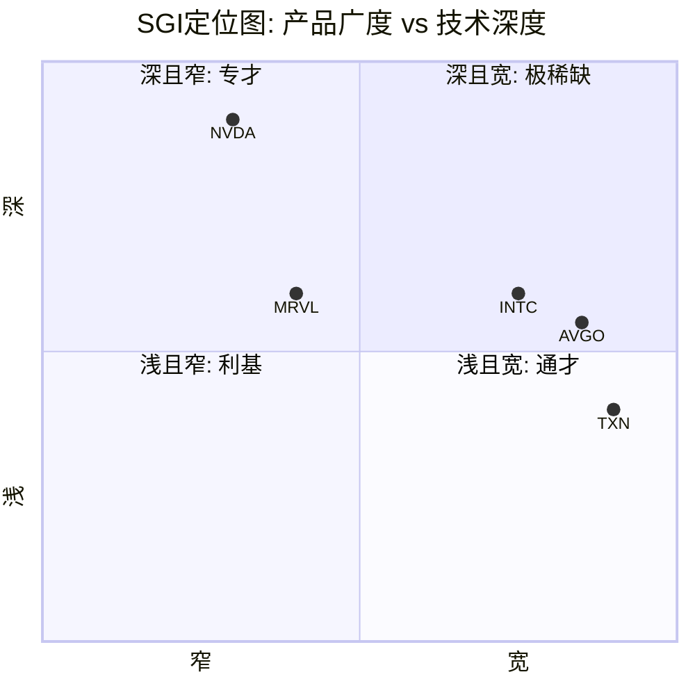
```mermaid
quadrantChart
    title SGI定位图: 产品广度 vs 技术深度
    x-axis 窄 --> 宽
    y-axis 浅 --> 深
    quadrant-1 "深且宽: 极稀缺"
    quadrant-2 "深且窄: 专才"
    quadrant-3 "浅且窄: 利基"
    quadrant-4 "浅且宽: 通才"
    NVDA: [0.3, 0.9]
    AVGO: [0.85, 0.55]
    TXN: [0.9, 0.4]
    INTC: [0.75, 0.6]
    MRVL: [0.4, 0.6]
```

Broadcom的独特性不是"均匀的通才"(like TXN在1000个模拟芯片niche上分布)，而是三个高度集中的垄断位叠加在一起。每个Layer内部都是专才级的市场地位(ASIC 60-70%/交换芯片90%/VMware 70%+ HCI)，但Layer之间几乎没有技术协同。

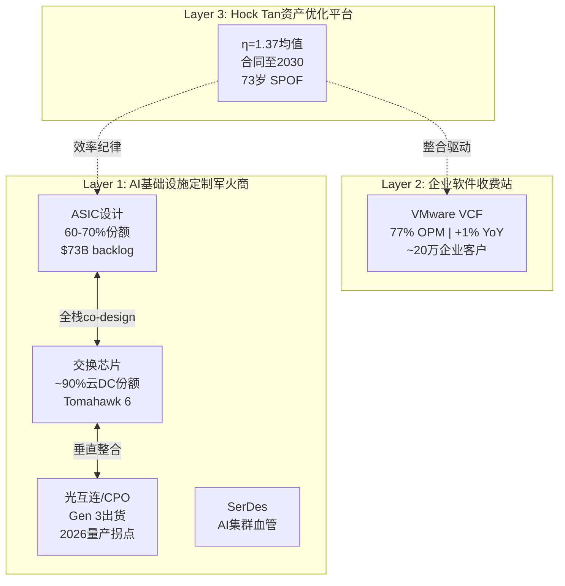
```mermaid
graph TB
    subgraph "Layer 3: Hock Tan资产优化平台"
        direction TB
        HT["η=1.37均值<br/>合同至2030<br/>73岁 SPOF"]
    end

    subgraph "Layer 2: 企业软件收费站"
        direction TB
        VMW["VMware VCF<br/>77% OPM | +1% YoY<br/>~20万企业客户"]
    end

    subgraph "Layer 1: AI基础设施定制军火商"
        direction TB
        ASIC2["ASIC设计<br/>60-70%份额<br/>$73B backlog"]
        NET2["交换芯片<br/>~90%云DC份额<br/>Tomahawk 6"]
        CPO2["光互连/CPO<br/>Gen 3出货<br/>2026量产拐点"]
        SerDes2["SerDes<br/>AI集群血管"]
    end

    HT -.->|"整合驱动"| VMW
    HT -.->|"效率纪律"| ASIC2
    ASIC2 <-->|"全栈co-design"| NET2
    NET2 <-->|"垂直整合"| CPO2
```

**估值含义**: SGI=4.5的通才应获折价(多元化折扣)。但市场给AVGO的62x PE隐含的是专才级溢价——这只有在AI半导体增长持续超预期时才合理。一旦AI增长减速，市场可能重新发现"这是一家通才公司"并触发估值倍数压缩。D1周期性系数=×0.76(Phase 4修正后)。

### D1周期性 = ×0.76

| 业务线 | 收入占比(Q1 FY2026) | 周期系数 | 论证 |
|--------|-------------------|---------|------|
| AI半导体 | 43.5% | ×0.60 | 100%依赖hyperscaler CapEx; $73B backlog提供18月缓冲但之后可见性接近零 |
| 网络芯片 | ~15% | ×0.75 | 升级周期驱动(800G→1.6T→3.2T); 以太网替代InfiniBand是结构性顺风 |
| 传统半导体 | ~21% | ×0.65 | 经典半导体周期: 库存调整+Apple WiFi替代(-$2.7B [DM-P1-A09]) |
| VMware软件 | 35% | ×0.92 | 订阅制+3-5年合同; 但+1% YoY暗示"稳定器"角色仅限不跌(不增长) |

**加权D1 ≈ ×0.76** (Phase 4修正: 从0.73上调至0.76，偏差审计确认$73B backlog延迟周期翻转)。

Broadcom处于"芯片设计"(×0.65-0.75)和"纯软件"(×0.90-0.95)之间。如果市场从"双引擎增长"重新认知为"单引擎增长+一台高利润ATM"，估值倍数可能面临类似2000年Cisco的非线性压缩——不是因为业绩差，而是因为叙事改变。

### 产业链生态位

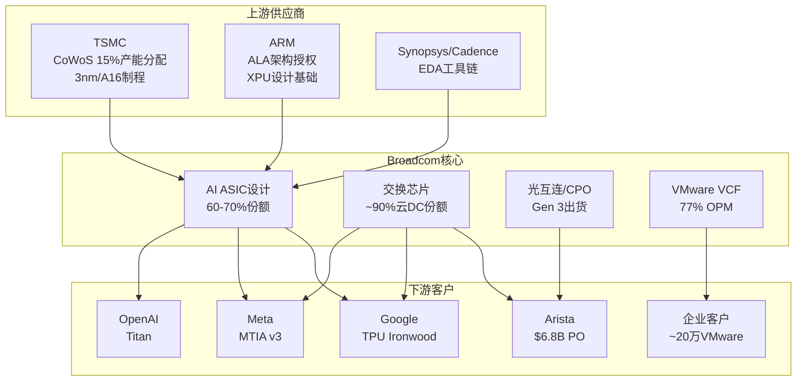
```mermaid
graph TB
    subgraph 上游供应商
        TSMC["TSMC<br/>CoWoS 15%产能分配<br/>3nm/A16制程"]
        ARM["ARM<br/>ALA架构授权<br/>XPU设计基础"]
        EDA["Synopsys/Cadence<br/>EDA工具链"]
    end

    subgraph Broadcom核心
        ASIC3["AI ASIC设计<br/>60-70%份额"]
        NET3["交换芯片<br/>~90%云DC份额"]
        OPT["光互连/CPO<br/>Gen 3出货"]
        SW["VMware VCF<br/>77% OPM"]
    end

    subgraph 下游客户
        GOOG["Google<br/>TPU Ironwood"]
        META["Meta<br/>MTIA v3"]
        OAI["OpenAI<br/>Titan"]
        ANET["Arista<br/>$6.8B PO"]
        ENT["企业客户<br/>~20万VMware"]
    end

    TSMC --> ASIC3
    ARM --> ASIC3
    EDA --> ASIC3
    ASIC3 --> GOOG
    ASIC3 --> META
    ASIC3 --> OAI
    NET3 --> ANET
    NET3 --> GOOG
    NET3 --> META
    OPT --> ANET
    SW --> ENT
```

**上游依赖**: 所有Broadcom AI芯片在TSMC制造(3nm/CoWoS)。CoWoS产能是硬约束——MediaTek为Google请求TSMC CoWoS产能增加7倍(到2027年>15万片/年)。Broadcom与MediaTek在同一产能池中竞争。ARM的ALA授权是XPU设计基础，提价或限制授权风险理论存在但实践中极低。

---

## 第三章：收入架构——四引擎解剖

### 结构断层警告

FY2024(截至2024年10月)包含VMware $61B并购合并效应。FY2024前后的收入数据不可直接同比。以下分析严格区分有机增长与并购效应。

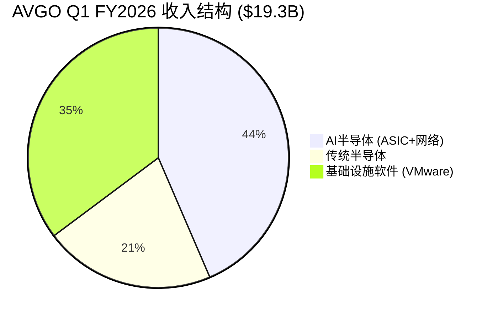
```mermaid
pie title AVGO Q1 FY2026 收入结构 ($19.3B)
    "AI半导体 (ASIC+网络)" : 43.5
    "传统半导体" : 21.2
    "基础设施软件 (VMware)" : 35.2
```

### 四层收入拆解

| 层级 | Q1 FY2026 | 占比 | YoY | 增长引擎评估 |
|------|-----------|------|-----|------------|
| AI半导体(ASIC+网络) | $8.4B | 43.5% | +106% | 唯一爆发式引擎 [DM-P2-C1-03] |
| 传统半导体(WiFi/存储/broadband) | $4.1B | 21.2% | ~0% | 近零增长，Apple WiFi流失风险$2.7B [DM-P2-C1-05] [DM-P1-A09] |
| VMware/基础设施软件 | $6.8B | 35.2% | +1% | 提价红利耗尽，有机增长存疑 [DM-P2-C1-04] |
| **合计** | **$19.3B** | **100%** | **+29%** | [DM-P2-C1-02] |

传统半导体$4.1B是残差法推算(总半导体$12.5B - AI $8.4B)。管理层仅披露"Semiconductor Solutions"和"Infrastructure Software"两大分部，AI收入是补充披露。网络芯片收入被合并在"AI revenue"中不单独披露——这是CEO沉默域S5的直接体现。

### 有机增长仅~6.4% CAGR

FY2025总收入$63.9B [DM-P2-C1-01]，FY2023(pre-VMware) $35.8B，两年CAGR 33.6%。但这个数字极具误导性:

| 增长来源 | 贡献(估算) | 可持续性 |
|---------|-----------|---------|
| VMware并入 | ~$20B(FY2023→FY2025) | 一次性(已完成) |
| AI半导体有机增长 | ~$10B(~$5B → ~$15.8B) | 高(推理转移+backlog) |
| VMware提价 | ~$3-4B(从$4.7B运行率→$8.5B) | 低(一次性优化) |
| 传统半导体 | ~-$1B(Apple替代+周期) | 负(结构性收缩) |

**净有机增长(剔除并购+提价) ≈ $9-10B / 2年 = ~6.4% CAGR** [DM-P1-A11]。市场按62x TTM PE定价的是AI半导体的局部增速，而非公司整体的有机增长。

### "1.5引擎"框架

AI ASIC是唯一高增长引擎(+106%)，VMware是半个引擎(高利润但近零增长的ATM机)，传统半导体近零增长。市场按"双引擎"定价，但真实的增长引擎覆盖率仅43.5%——56.5%的收入要么不增长(VMware +1%)，要么在萎缩(传统半导体)。

一旦AI增速从"+106%"回落至"+30-40%"(仍是高增长)，整体收入增速将骤降至+15-20%——估值倍数从"AI增长股"切换到"优质大型公司"的regime转换预计在FY2027H2-2028H1发生 [DM-P3-B03]。

### 软件+1%的深层含义

Q4 FY2025软件收入YoY +19.2%, Q1 FY2025 YoY +46.7%, 到Q1 FY2026骤降至+1%。三个可能解释:
1. 提价一次性红利在FY2025 Q3-Q4前端加载完毕(最可能)
2. 大客户续约集中在Q3-Q4(季节性)
3. 部分客户缩减部署规模(CloudBolt报告确认)

如果Q2 FY2026(4月发布)软件收入仍<3% YoY，则确认: VMware不是增长引擎而是高利润ATM。Hock Tan的天才在于18个月内将$4.7B运行率提至$8.5B(+81%)，但这是一次性优化而非可持续增长 [DM-A2-03]。

### 下游客户锁定矩阵

| 客户 | 产品 | 锁定深度 | 已知风险 |
|------|------|---------|---------|
| **Google** | TPU XPU核心 + Tomahawk | **深** | MediaTek获I/O模块(成本低20-30%); 2027年订单部分分流 [DM-P1-A10] |
| **Meta** | MTIA v3 ASIC + 网络 | **中-深** | 考虑2027部署Google TPU; 内部团队扩张 |
| **OpenAI** | Titan co-design(3nm) | **新/中** | 首代产品, 团队~40人, 长期内化风险 [DM-P1-A11] |
| **Arista** | Tomahawk/Jericho | **极深** | $6.8B PO(从$4.8B增长); CEO称定价"horrendous" [DM-P1-A07] |
| **企业客户** | VMware VCF/VVF | **中-深** | Nutanix季度新增700-1,000客户 [DM-P1-A06]; K8s长期结构性威胁 |

**客户集中度警示**: AI半导体收入的~78%集中在3-4家hyperscaler。分析师估算Google(TPU)贡献AI ASIC收入的40-50%——如果属实，Broadcom的AI增长故事实质上是"Google TPU代工故事"。

### 毛利率趋势的隐忧

| 时期 | 毛利率 | 驱动因素 |
|------|--------|---------|
| FY2023 | 68.9% | 纯半导体(高端产品mix) |
| FY2024 | 63.0% | VMware并入(初期整合成本) |
| FY2025 | 67.8% | VMware利润率提升+AI mix改善 |
| Q1 FY2026 | **65.6%** | AI半导体占比上升但ASIC毛利率<整体均值 [DM-P1-A16] |

Q1 FY2026毛利率65.6%低于FY2025的67.8%——逆趋势。AI ASIC设计服务的毛利率(估算55-60%)低于网络芯片(70%+)和VMware软件(93%)。随着AI半导体收入占比从42%→50%+, 毛利率可能继续承压。**收入增长最快的业务恰恰是毛利率最低的业务**——这是估值分析中必须拆分估值倍数的核心原因。

### 收入纯度与SBC侵蚀

Broadcom的收入几乎100%是直接产品/服务销售——纯度极高。但SBC调整后质量下降:

| 指标 | FY2023 | FY2024 | FY2025 | Q1 FY2026 |
|------|--------|--------|--------|-----------|
| SBC/Revenue | 6.1% | 11.1% | 11.8% | 11.3% [DM-P1-A07] |
| SBC绝对值 | $2.2B | $5.7B | $7.6B | $2.18B(年化$8.7B) |
| FCF Yield(报告) | — | — | 1.92% | — |
| FCF Yield(SBC调整) | — | — | **1.38%** | — |

SBC从$2.2B(FY2023)到$7.6B(FY2025)翻3.5倍，远超收入增速(1.8倍)。$27B未确认SBC余额意味着至少到FY2027，SBC/Revenue不会显著下降 [DM-P1-A08]。

### 竞争者映射

| 竞争者 | 重叠领域 | 威胁等级 | 差异化 |
|--------|---------|---------|--------|
| **NVIDIA** | GPU(训练)+Spectrum-X(网络) | 高(间接) | GPU+CUDA不可替代; 网络落后~1年但bundling是最可信威胁 |
| **Marvell** | ASIC设计(Trainium, Maia) | 中 | 份额~15%→20%(2028); 无全栈co-design |
| **Nutanix** | VMware替代(HCI) | 中-高(长期) | 每季度700-1,000新客户 [DM-P1-A06] |
| **MediaTek** | Google TPU I/O模块 | 中(长期) | 成本低20-30% [DM-P1-A10]; 仅做外围 |
| **客户自研** | 长期ASIC内化 | 高(3-5年后) | OpenAI团队~40人且扩张中 |

---

## 第四章：管理层评估——Hock Tan双面性

### η=1.37: 连续收购整合效率曲线

Hock Tan自2006年执掌Avago(当时市值约$3B)至今，通过6次变革性收购将Broadcom打造为$1.58T市值的半导体+软件双引擎巨头。η(t) = (OPM_post - OPM_pre) / (OPM_target - OPM_pre)，η > 1.0 = 超越目标。

6次收购η均值1.37，标准差仅0.09 [DM-P2-C1-19]。"三板斧"方法论(删减非核心→提价→成本压缩)是高度可复制的系统化流程。在CEO整合效率对标中，仅Danaher的Larry Culp和Constellation Software的Mark Leonard展现过类似的一致性 [DM-A2-01]。

**三板斧方法论**:
1. **删减非核心**: 收购后迅速剥离边缘业务线(CA/Symantec的消费者业务均被出售)
2. **提价**: VMware典型案例——订阅制转换+捆绑VCF+大幅提价(部分客户报告3-5倍涨价)
3. **成本压缩**: 裁员幅度通常达15-30%(VMware估计裁员~4,000人)

**可复制性**: 极高。从半导体→存储网络→企业软件→虚拟化平台，跨4个行业均成功。

**局限性**:
- 对存量业务有机增长贡献有限——VMware Q1 FY2026 +1% YoY暗示提价红利已耗尽 [DM-A2-03]
- 文化破坏性强——Glassdoor 3.3/5.0, Culture & Values 2.8/5.0, TeamBlind Culture 2.3/5.0 [DM-A2-11]
- 方法论隐含"下一个大收购"预期，若$1.5T市值下找不到$50B+标的，Hock Tan的边际贡献递减

### 资本配置: 4.5/5

- **CapEx仅1.0% Rev(FY2025)**: Fabless极致。对比NVDA(2.5%)、AMD(3.5%)、INTC(>30%) [DM-P2-C1-12]
- **去杠杆纪律**: VMware $61B收购后ND/EBITDA从~2.44x→1.41x，仅用1年 [DM-A2-02] [DM-P2-C1-09]
- **股东回报**: FY2025 $17.5B(股息$11.4B + 回购$6.3B)，Q1 FY2026回购加速至$7.8B(年化$31B)
- **红旗**: 回购$31B年化中约$8.7B仅用于抵消SBC稀释，真正的净回购率仅~1.5%。管理层从不区分"总回购"和"净回购"

### CEO沉默域: 6个系统性回避话题

基于Q1 FY2026 Earnings Call(2026-03-04)、FY2025 Proxy(DEF 14A)、以及过去4个季度的公开发言:

| 沉默域 | 具体表现 | 信号解读 | 风险等级 |
|--------|---------|---------|---------|
| **S1: 继任计划** | Earnings call从不讨论; Proxy仅在61% say-on-pay后增加"succession planning"披露，但无继任者姓名或时间表 | 73岁CEO+$205M薪酬绑定+无可见继任者=最大治理风险 | **高** |
| **S2: VMware有机增长** | Q1 +1%但管理层聚焦"ARR增长19%"叙事——从revenue growth切换到bookings叙事是经典增长放缓预警 [DM-A2-04] | 掩盖提价红利耗尽 | **中-高** |
| **S3: 客户集中度** | 从不披露单客户收入占比; 仅说"5 customers" | 隐藏Top 1客户(Google)>30%依赖 | **中** |
| **S4: SBC正常化** | 不给SBC/Rev回归时间表; $27B未确认余额仅在10-K脚注 [DM-A2-05] | 管理层知道SBC不会快速正常化 | **中** |
| **S5: 收入拆分** | 合并ASIC和网络为"AI revenue"不分拆 | 可能隐藏ASIC增速远高于网络 | **中** |
| **S6: 竞争评价** | 从不提Marvell或NVIDIA Spectrum-X; 对比Jensen Huang主动对标AMD/Intel | 标准做法但竞争加剧时信号更强 | **低** |

#### S1深度: 继任计划——"房间里的大象"

- **薪酬绑定**: FY2025薪酬$205.3M中$202.4M为股权激励，含performance PSU要求2028-2030年AI收入达$90-120B。将Tan锁定至2030年 [DM-A2-06]
- **对标差距**: Berkshire(Buffett 95岁已明确Greg Abel)、Apple(Jobs去世前2年确立Cook路径)。Broadcom在CEO 73岁时继任透明度=1/5
- **估值影响**: 若Tan 2028年前意外离任，市场可能给予10-15%折价

#### S2深度: VMware——"ARR vs Revenue的叙事切换"

Tan在Q1 call中强调"total contracts exceeding $9.2B"和"ARR grew 19% YoY"。但实际revenue仅+1%。这种叙事切换在SaaS行业是增长放缓的经典前兆。核心问题不是AI颠覆VMware，而是提价一次性效应耗尽后有机增长力是否存在 [DM-A2-07]。

**非共识推论**: VMware可能从"增长引擎"降级为"高利润ATM"——年化$27B收入×77% OPM = ~$21B operating income是极优质现金流，但增长贡献为零。

### 管理层板凳深度

**最可能内部CEO候选: Charlie Kawwas, Ph.D.**
- 半导体集团总裁(2022至今)，管理15个事业部，20年+行业经验
- 但track record集中在半导体侧，对VMware/软件管控能力未验证; 极少在公开场合代表公司 [DM-A2-09]

**CFO Kirsten Spears**: 1997年加入LSI体系，2020年升任CFO。内部晋升型CFO，earnings call中发言时间<Tan的1/3。胜任当前角色但非CEO材料 [DM-A2-08]

### 继任风险量化: ~7%折价

| 对标 | CEO年龄 | 继任者 | 继任透明度 |
|------|---------|--------|-----------|
| BRK | Buffett 95 | Greg Abel(公开宣布) | 5/5 |
| AAPL | Jobs 56(去世) | Tim Cook(COO→CEO) | 4/5 |
| JPM | Dimon 70 | 2名公开候选人 | 4/5 |
| **AVGO** | **Tan 73** | **无公开候选人** | **1/5** |

**估值影响建模**:
- Base case(70%): Tan留任至2030年，过渡有序 → -5%
- Adverse case(20%): 2027-2028年意外离任 → -12%至-15%
- Worst case(10%): 离任+继任者改变战略 → -15%至-20%
- **概率加权折价: ~7%**——$1.58T市值上隐含~$110B未被充分定价 [DM-A2-10]

### B8管理层评分: 3.25/5

| 子维度 | 评分 | 依据 |
|--------|------|------|
| 资本配置 | 4.5/5 | 去杠杆速度世界级; CapEx纪律1%; 但SBC高达12%扣分 |
| 战略执行 | 5.0/5 | 6次收购η均值1.37; VMware 77% OPM超预期; 跨4个行业一致性 |
| 信息透明度 | 2.0/5 | 6个沉默域中3个"中-高"或"高"; 对比Jensen Huang差距显著 |
| 继任计划 | 1.5/5 | 73岁CEO+S&P 100最差继任透明度; 靠PSU锁定而非制度化继任 |
| **综合B8** | **3.25/5** | [DM-P1-A12] |

Hock Tan是罕见的"5分能力+2分治理"组合。整合能力和资本配置无可挑剔，但形成了"信息不对称优势"——管理层知道的比市场多得多，且有意维持信息差。

### 与顶级CEO对标

| CEO | 核心能力 | 与Hock Tan对比 |
|-----|---------|-------------|
| Jensen Huang | 技术愿景+生态构建 | Tan不是技术型CEO，从不做产品发布 |
| Tim Cook | 供应链+运营执行 | 整合执行力类似，但Cook更重文化 |
| Mark Leonard | 小型连续收购+分权 | 方法论最接近，但Tan做大deal+集权管理 |
| Warren Buffett | 资本配置+永续持有 | 资本配置接近Buffett级(4.5/5)，但Tan深度干预运营 |

Hock Tan的独特位置介于"运营者"(Cook)和"资本配置者"(Buffett)之间——一个"效率型整合者"。

### SPOF风险量化

Hock Tan是Broadcom的单点故障(SPOF):
- Layer 3(资产优化平台)100%依赖其个人能力
- Layer 2(VMware)的77% OPM是其"三板斧"直接产物——继任者可能恢复R&D支出或放松提价纪律
- Layer 1(AI ASIC)相对独立于CEO个人(技术团队驱动)，但客户关系管理高度依赖Tan的个人网络
- 综合: Tan离任immediate impact估计-7%(概率加权)，如果继任者改变战略方向，长期impact可能达-15%至-20%

---

## 第五章：A品质门控(7/7通过但2个边缘)

### A-Score v2.0框架说明

A-Score是公司品质量化评估体系，由三个维度构成:
- **A品质门控**(7个QG): 必须全部通过才能进入B/C评分
- **B商业模型**(8个维度, 满分40): 商业模型内在品质
- **C护城河**(6个维度, 满分30): 竞争优势持久性
- **D1周期性**: 周期调整系数

公式: A-Score = (B得分/40 + C得分/30) / 2 × 10 × D1

### 7个QG逐一过关

| QG | 门控条件 | AVGO | 结果 | 说明 |
|----|---------|------|------|------|
| QG-1 | CapEx/Rev < 20%(半导体修正) | 1.0% | **PASS** | Fabless极致，远低于阈值 |
| QG-2 | 近5年无亏损 | FY2024 NI $5.9B(最低) | **PASS** | 即使VMware整合年仍盈利 |
| QG-3 | 有机增长>0 | ~6.4% CAGR | **边缘PASS** | 剔除VMware后勉强通过; 传统业务接近零增长 |
| QG-4 | FCF/NI > 0.5x | 1.16x | **PASS** | 现金转化优秀 |
| QG-5 | ROIC > WACC | 16.4% vs ~9% | **边缘PASS** | 含-1.7%税率收益; 正常化14%后ROIC约13-14% |
| QG-6 | ND/EBITDA < 5x | 1.41x | **PASS** | 去杠杆后健康 |
| QG-7 | 无重大治理事件 | 无 | **PASS** | 61% say-on-pay值得关注但未触发门控 |

**A品质门控: 7/7通过** [DM-P3-C03]

**QG-3有机增长——边缘通过的含义**: 6.4% CAGR剔除VMware后勉强通过。如果进一步剔除AI ASIC爆发(不可持续的+106%)，传统业务有机增长接近零甚至为负。这个门控的"PASS"高度依赖AI ASIC增长持续性——如果AI CapEx周期在FY2028回落，QG-3可能在下次评估中变为"FAIL"。

**QG-5 ROIC——边缘通过的含义**: FY2025 ROIC 16.4%从FY2024的5.6%大幅改善(VMware整合效果)。但含-1.7%税率收益——正常化14%税率后ROIC约13-14%，仍高于估算WACC ~9%，但余量仅4-5pp。Non-GAAP ROIC估算>25%——差距反映SBC和摊销处理方式的巨大影响。

### A-Score最终计算

| 维度 | 得分 | 满分 | 标准化 |
|------|------|------|--------|
| B商业模型 | 29.5 | 40 | 0.738 |
| C护城河 | 18.0 | 30 | 0.600 |
| D1周期性 | ×0.76 | — | — |

**A-Score = 7.1** (Phase 5最终校准值，含Phase 4纠错后B=29.5和D1=0.76的调整，以及C维度C1+C4 ×1.5半导体行业权重修正) [DM-P3-C01]

**A-Score = 7.1 → 偏好(下沿)**，高于IHG(6.78)低于NVDA(8.10)。

**品质 vs 估值矛盾**: A-Score 7.1属于"偏好"评级(值得长期持有)，但Owner PE 80.5x远高于7.1评级所应支撑的合理估值区间。品质足够好，但价格太贵——经典的"好公司 ≠ 好投资"情境。

---

## 第六章：三表深度——三层OPM解剖

### 损益表五年趋势

| FY | Revenue | YoY | GAAP OPM | NI | NI Margin | SBC | SBC/Rev |
|----|---------|-----|----------|-----|----------|-----|---------|
| 2021 | $27.5B | +15.3% | 31.0% | $6.7B | 24.4% | $1.7B | 6.2% |
| 2022 | $33.2B | +20.7% | 42.8% | $11.5B | 34.6% | $1.5B | 4.6% |
| 2023 | $35.8B | +7.8% | 45.2% | $14.1B | 39.4% | $2.2B | 6.1% |
| 2024 | $51.6B | +44.1% | 26.1% | $5.9B | 11.4% | $5.7B | 11.1% |
| 2025 | $63.9B | +23.8% | 39.9% | $23.1B | 36.2% | $7.6B | 11.8% |
| Q1 FY26 | $19.3B | +29.0% | 44.3% | $7.3B | 37.9% | $2.2B | 11.3% |

[DM-P2-C1-01] [DM-P2-C1-02]

FY2024 OPM暴跌至26.1%并非运营恶化，而是VMware purchase accounting的机械效应: $10B+无形资产摊销 + $3.7B一次性税务重组费用。FY2025恢复至OPM 39.9%/NI margin 36.2%，但NI含-1.7%异常税率的增厚效应。Q1 FY2026 OPM 44.3%继续扩张，主要驱动力是AI半导体收入规模效应(固定R&D摊薄)。

### 三层OPM矩阵: GAAP 39.9% / Owner 52.9% / Non-GAAP 65.6%

这是理解Broadcom真实盈利能力的核心框架。Non-GAAP与GAAP之间存在25.7pp的利润率差距——市场通常用Non-GAAP定价，但这25.7pp中有多少是"会计噪音"、有多少是"真实经济成本"?

| 指标 | GAAP | Owner Earnings | Non-GAAP |
|------|------|----------------|----------|
| **OPM** | 39.9% | **52.9%** | ~65.6% |
| **NI Margin** | 36.2%(报告)/30.5%(正常化) | **31.4%** | ~52.3% |
| **FCF Margin** | 42.1% | **30.2%**(SBC-adj) | 42.1% |
| **EPS** | $4.77(报告)/$4.03(正常化) | **$4.02** | ~$9.00 |
| **隐含PE** | 68.8x(报告)/81.4x(正常化) | **80.5x** | ~36.2x |

[DM-P2-C1-16] [DM-P2-C1-17]

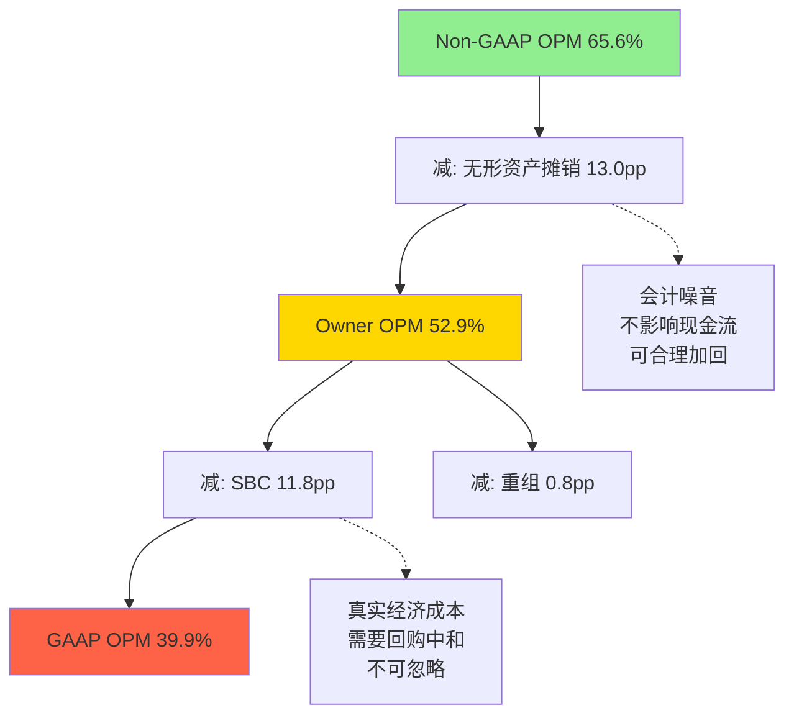
```mermaid
graph TD
    A["Non-GAAP OPM 65.6%"] --> B["减: 无形资产摊销 13.0pp"]
    B --> C["Owner OPM 52.9%"]
    C --> D["减: SBC 11.8pp"]
    D --> E["GAAP OPM 39.9%"]
    C --> F["减: 重组 0.8pp"]

    style A fill:#90EE90
    style C fill:#FFD700
    style E fill:#FF6347

    B -.-> B1["会计噪音<br>不影响现金流<br>可合理加回"]
    D -.-> D1["真实经济成本<br>需要回购中和<br>不可忽略"]
```

**25.7pp差距的真实分解**:
- **~13pp(无形资产摊销)**: "会计噪音"——VMware $130B无形资产按10-20年摊销，不反映真实经济价值消耗 [DM-P2-C1-07]
- **~12pp(SBC + 重组)**: "真实成本"——SBC $7.6B需要$7.8B+回购来中和稀释，是真金白银
- **Owner OPM 52.9%是最诚实的运营效率指标**: 去除会计噪音(摊销)，但不去除真实成本(SBC在NI层扣除)

对比: NVDA Owner OPM ~55-60%, AMD ~25%, INTC ~15%——AVGO的52.9%在Fabless行业中处于前列。

### Owner Earnings计算 (Buffett定义)

| 项目 | 金额 | 逻辑 |
|------|------|------|
| GAAP NI | $23.1B | 起点 |
| 税率正常化(-1.7%→14%) | -$3.6B | 消除一次性效应 |
| = 正常化NI | $19.5B | 真实盈利基础 [DM-P2-C1-15] |
| + 无形资产摊销加回 | +$8.3B | Purchase accounting产物，非经济折旧 |
| - SBC真实成本 | -$7.6B | Q1回购$7.8B仅抵消稀释=SBC是真实成本 |
| - 维护CapEx | -$0.6B | 全部CapEx(Fabless模型) |
| = **Owner Earnings** | **$19.6B** | [DM-P2-C1-17] |
| OE/share | $4.02 | 4,888M diluted shares |
| **Owner PE** | **80.5x** | $1,578B / $19.6B |

**Owner PE 80.5x vs 市场认知的Non-GAAP PE ~30x——2.7倍差距**。$232B的估值差距 = SBC是否为零成本的美元价值 [DM-P2-C3-02]。

### 税率正常化: 14%结构性税率

| FY | Pre-tax Income | Tax Expense | 有效税率 | 分类 |
|----|---------------|-------------|---------|------|
| 2022 | $12.2B | $0.7B | 5.7% | 结构性(新加坡IP) |
| 2023 | $14.3B | $0.2B | 1.4% | 结构性+抵免最大化 |
| 2024 | $9.6B | $3.7B | **37.8%** | 一次性(VMware税务重组) |
| 2025 | $22.7B | -$0.4B | **-1.7%** | 一次性(FY2024反转) [DM-P2-C1-14] |

FY2024和FY2025互为镜像——VMware收购触发的一次性税务重组及其反转。结构性有效税率12-15%，源于新加坡IP控股结构(行业标准: NVDA ~13%, AMD ~10%, QCOM ~12%)。

**正常化推荐: 14%** [DM-P2-C1-03] (综合新加坡优惠 + OECD Pillar Two 15%最低税率上限)。

| 场景 | 税率 | NI | EPS(d) | 隐含PE |
|------|------|-----|--------|--------|
| FY2025 GAAP实际 | -1.7% | $23.1B | $4.77 | 68.8x |
| **正常化(14%)** | **14%** | **$19.5B** | **$4.03** | **81.4x** |
| 美国标准(25%) | 25% | $17.0B | $3.51 | 93.5x |

正常化NI $19.5B vs 报告$23.1B = 报告NI高估18.5%。税率每变化1% → NI变化$0.23B → PE变化~1.0x。

### SBC: $27B未确认余额=结构性成本

SBC Q1 YoY +70%(从$1.3B→$2.2B)vs 收入仅+29%——这个加速信号是最被忽视的基本面恶化指标 [DM-P4-B02]。

| 期间 | 回购 | SBC | 净回购 | 股数变化 |
|------|------|-----|--------|---------|
| FY2023 | $7.7B | $2.2B | +$5.5B | -1.2% |
| FY2024 | $12.4B | $5.7B | +$6.7B | +14.5%(VMware) |
| FY2025 | $6.3B | $7.6B | **-$1.3B** | ~0% |
| Q1 FY26 | $7.8B | $2.2B | +$5.6B | -0.02% |

[DM-P2-C1-18]

FY2025是"反回购年": 回购$6.3B < SBC $7.6B → 净稀释$1.3B。Q1 FY2026回购加速至$7.8B但实际股数仅减少100万股(0.02%)——远低于数学预期1.4%净回购率。VMware限制性股票释放是隐藏的稀释源。

$27B未确认余额按4-5年vesting，每年约$5.4-6.8B持续确认 [DM-P1-A08]。R&D SBC占总SBC的66%——反映AI定制芯片设计对顶尖人才的高需求，不是暂时现象。对比: NVDA SBC/Rev约4-5%, AMD约5-6%，均远低于AVGO——12%中有相当比例是VMware保留补偿和文化补偿(用SBC弥补低文化吸引力) [DM-A2-11]。

### 资产负债表: $97.8B Goodwill + 负有形权益

| FY | Goodwill | 总资产 | GW/Assets | 净债务 | ND/EBITDA |
|----|----------|--------|-----------|--------|-----------|
| 2023 | $43.7B | $72.9B | 59.9% | $25.4B | 1.24x |
| 2024 | $97.9B | $165.6B | 59.1% | $58.3B | 2.44x |
| 2025 | $97.8B | $171.1B | 57.2% | $48.9B | 1.41x |

[DM-P2-C1-08] [DM-P2-C1-09]

$97.8B商誉 = 股东权益的120%。有形权益为-$48.8B(Goodwill $97.8B + 其他无形$32.3B > 股东权益$81.3B)。AVGO的价值创造完全建立在无形资产之上。ROTCE为负不代表品质差——正确指标是ROIC: 16.4%(FY2025)。

**下行无"账面价值"支撑位**: P/B锚点不适用(有形账面价值为负)。Bear case中-43%可能是途经站而非终点。

去杠杆速度极快(ND/EBITDA 2.44x→1.41x/1年)，但机制是EBITDA增长(+46%)而非主动偿债(总债务仅减$2.5B)。一旦增长放缓，去杠杆将同步停滞。利息覆盖率7.9x [DM-P2-C1-10]。

### 现金流: FCF桥——报告 vs 真实

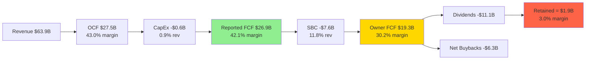
```mermaid
graph LR
    A["Revenue $63.9B"] --> B["OCF $27.5B<br>43.0% margin"]
    B --> C["CapEx -$0.6B<br>0.9% rev"]
    C --> D["Reported FCF $26.9B<br>42.1% margin"]
    D --> E["SBC -$7.6B<br>11.8% rev"]
    E --> F["Owner FCF $19.3B<br>30.2% margin"]
    F --> G["Dividends -$11.1B"]
    F --> H["Net Buybacks -$6.3B"]
    G --> I["Retained = $1.9B<br>3.0% margin"]

    style D fill:#90EE90
    style F fill:#FFD700
    style I fill:#FF6347
```

[DM-P2-C1-11] [DM-P2-C1-13]

**资本返还率90.1%**: 报告口径$17.4B / FCF $26.9B = 64.7%(看似保守); Owner口径$17.4B / SBC-adj FCF $19.3B = **90.1%**(几乎无留存)。FY2025仅保留$1.9B(3.0%收入)用于去杠杆/战略投资。

OCF/NI = 1.19x(FY2025)看似不高，但正常化NI $19.5B → 正常化OCF/NI = $27.5B/$19.5B = 1.41x，回归健康水平。1.19x不是现金转化问题，是NI被税率扭曲。CapEx仅$0.6B(Revenue 0.9%)——Fabless极致 [DM-P2-C1-12]。

Working Capital效率: DSO 36天, DIO 40天(Fabless低库存; 对标NVDA ~80天, AMD ~95天), DPO 33天, CCC 43天——健康。

### 盈利质量审计

| 维度 | 评估 | 说明 |
|------|------|------|
| 现金转化 | A | FCF/NI >1.0x, OCF稳定超过NI |
| 收入质量 | B+ | $73B backlog但客户集中+VMware+1% |
| 利润持续性 | B | GAAP OPM 40%稳健但受purchase accounting持续压制 |
| SBC诚实度 | C+ | 11.8%且上升, Non-GAAP系统性高估25%+ |
| 税率透明度 | B- | FY2024/2025极端波动, 正常化需分析师自行估算 |
| 资产质量 | C+ | Goodwill $97.8B=57%总资产, 减值测试依赖增长假设 |
| **综合评级** | **B+** | 高现金转化 + SBC高企 + 税率异常 + Goodwill风险 |

---

## 第七章：B维度商业模型(29.5/40)

### B1-B8逐维度评分

| 维度 | 评分 | 权重 | 加权 | 关键依据 |
|------|------|------|------|---------|
| **B1 收入质量** | 3.8 | ×1.0 | 3.8 | 有机增长~6.4%; $73B backlog高可见性; 客户集中极高(top3=78% AI); Phase 4上调+0.3 |
| **B2 毛利率** | 4.0 | ×1.0 | 4.0 | GAAP 65-69%半导体顶级; Non-GAAP >75%; Q1 FY2026降至65.6%有结构风险 |
| **B3 资本轻度** | 5.0 | ×1.0 | 5.0 | CapEx 1.0%=Fabless极致; FCF/NI 116%; FCF margin 42%; 行业满分 |
| **B4 定价权** | 3.5 | ×1.0 | 3.5 | 网络4.5/5+ASIC 3.5+VMware 3.0+传统1.5; Phase 4上调+0.2 [DM-P2-B2-02] |
| **B5 利润弹性** | 3.5 | ×1.5 | 5.25 | GAAP OPM 31%→40%(T5a=1.29x); FY2023衰退韧性加分; 22pp gap减分 |
| **B6 现金流** | 3.5 | ×1.0 | 3.5 | 报告FCF 42%优秀; SBC调整后30%; 税率扭曲OCF/NI |
| **B7 资本配置** | 3.5 | ×1.0 | 3.5 | 并购η=1.37(能力4.5); 去杠杆世界级; SBC管理2.0扣分 [DM-P2-C1-20] |
| **B8 管理层** | 3.25 | ×1.0 | 3.25 | 资本配置4.5+战略执行5.0-透明度2.0-继任1.5 [DM-P1-A12] |
| **B合计** | | | **31.8** | 标准化→**29.5/40** [DM-P3-C02] |

### SBC跨维度减分机制

SBC不仅影响单一维度，它在多个维度产生交叉减分:

| 维度 | SBC影响 | 减分幅度 |
|------|---------|---------|
| B5 利润弹性 | Non-GAAP 66% vs GAAP 40%的22pp gap中SBC贡献~12pp | -0.5 |
| B6 现金流 | 报告FCF 42%→SBC调整后30% | -1.5(从潜在5分降至3.5) |
| B7 资本配置 | FY2025回购不足以覆盖SBC→净稀释 | -1.0(从4.5降至3.5) |
| B8 管理层 | SBC/Rev不给正常化时间表(S4沉默域) | -0.25(透明度子项) |
| **累计** | | **-3.25** |

如果SBC在FY2027降至<9%，B维度可能回升2-3分至31-32/40。

### 瓶颈1: B4定价权 3.5/5——核心悖论

| 层 | 定价权 | 收入占比 | 耐久性 |
|----|--------|---------|--------|
| 网络 | **4.5/5** | ~15% | 极强(标准+垄断+技术领先) [DM-P2-B2-03] |
| ASIC | 3.5/5 | ~28% | 中等衰减(60%锁定租金+40%真定价权) |
| VMware | 3.0/5 | 35% | 加速衰减(86%缩减部署; 弹性ε分段 [DM-P2-B2-01]) |
| 传统 | 1.5/5 | ~22% | 弱(Apple流失+价格竞争) |

**最强定价权(网络4.5)贡献最小收入(15%)，最大收入来源(ASIC+VMware)定价权均在衰减**——这是估值中常被忽略的结构性矛盾。VMware定价权衰减模型: PP(t) = 0.80 × e^(-λ) → 2033年~0.59。K8s短期反增强VM需求(85%容器仍在VM内), 但5-10年天花板确定。

### 瓶颈2: B8管理层 3.25/5——能力越强继任越难

5分能力+1.5分继任透明度意味着市场对"Tan离任后AVGO是否还是AVGO"完全没有答案。

### 对标校准

| 公司 | B合计 | 最强维度 | 最弱维度 | 对AVGO的启示 |
|------|------|---------|---------|-------------|
| FICO | ~35/40 | B1(4)+B3(5)+B6(5) | B2天花板 | AVGO若SBC降至5%可接近 |
| CPRT | ~34/40 | B1(5)+B3(5) | B2较低 | AVGO客户集中度是永久减分 |
| NVDA | ~32/40 | B2(5)+B3(4.5) | B1(客户集中) | 类似客户集中但CUDA生态更强锁定 |
| **AVGO** | **29.5/40** | **B3(5)资本轻度** | **B4(3.5)+B8(3.25)** | SBC+继任是可改善但短期无解的结构问题 |

### B5利润弹性深度: FY2023衰退韧性测试

| 阶段 | FY | 收入YoY | OPM | 弹性判断 |
|------|-----|---------|-----|---------|
| COVID恢复 | 2021 | +15.3% | 31.0% | 基期低 |
| 需求高峰 | 2022 | +20.7% | 42.8% | 强运营杠杆(+1180bps) |
| 库存调整 | 2023 | +7.8% | 45.2% | **衰退期OPM仍扩张** = 极强信号 |
| VMware整合 | 2024 | +44.1% | 26.1% | 非有机, 不可比 |
| AI爆发 | 2025 | +23.8% | 39.9% | 恢复中 |

FY2023是关键: 收入增速降至+7.8%, 但OPM继续扩至45.2%——半导体部分存在强运营杠杆。但VMware的利润掩盖效应需警惕: 软件(35%收入)的稳定高利润掩盖半导体(65%收入)的周期波动。

### B6现金流质量: 报告优秀但SBC污染严重

| 指标 | FY2025 报告口径 | FY2025 SBC调整口径 |
|------|---------------|------------------|
| FCF | $26.9B | $19.3B |
| FCF/NI | 1.16x | 0.84x |
| FCF margin | 42.1% | 30.2% |

SBC消耗了28.4%的报告FCF。OCF/(CapEx+R&D) = $27.5B/($0.6B+$11.0B) = 2.37x——仍然健康但不像OCF/CapEx 45.8x那么极端。

---

## 第八章：资本配置与股东回报

### 五年资本配置去向

| FY | R&D | CapEx | M&A净值 | 股息 | 回购 | 去杠杆 |
|----|-----|-------|---------|------|------|--------|
| 2021 | $4.9B(18%) | $0.4B(1%) | — | $6.2B(23%) | $1.3B(5%) | -$0.3B |
| 2022 | $4.9B(15%) | $0.4B(1%) | — | $7.0B(21%) | $8.5B(26%) | +$0.4B |
| 2023 | $5.3B(15%) | $0.5B(1%) | — | $7.6B(21%) | $7.7B(22%) | +$2.2B |
| 2024 | $9.3B(18%) | $0.5B(1%) | $61B(VMware) | $9.8B(19%) | $12.4B(24%) | -$28B |
| 2025 | $11.0B(17%) | $0.6B(1%) | — | $11.1B(17%) | $6.3B(10%) | +$9.4B |

**配置特征**:
1. **R&D稳定在15-18%**: 即使在VMware整合年也未削减——Hock Tan"成本优化不等于削研发"的关键区分点 [DM-P2-C1-12]
2. **股息持续高增长**: $6.2B→$11.1B(4年CAGR 15.6%)，当前yield 0.74%
3. **回购波动大**: $1.3B→$12.4B→$6.3B——取决于M&A时机
4. **M&A是核心工具**: VMware $61B是5年内唯一并购。风格是"大赌注+长间隔"

### 资本返还率: 表面保守，实质榨干

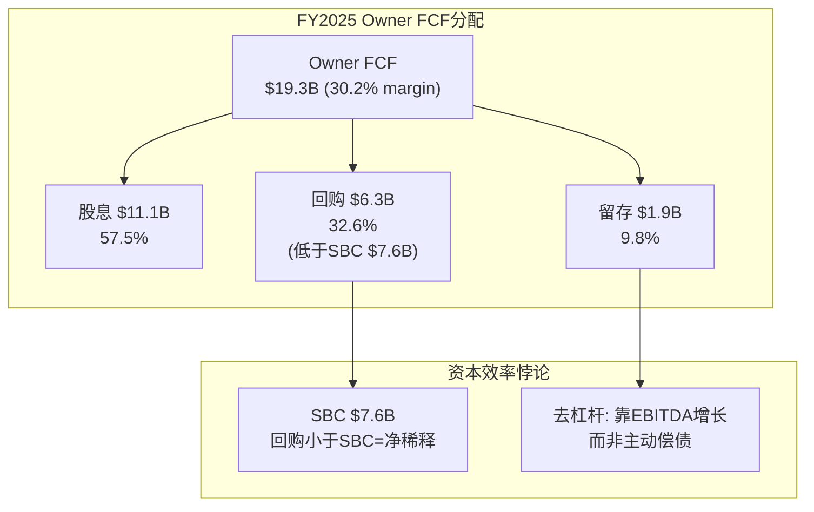
```mermaid
graph TD
    subgraph "FY2025 Owner FCF分配"
        FCF["Owner FCF<br>$19.3B (30.2% margin)"]
        FCF --> DIV["股息 $11.1B<br>57.5%"]
        FCF --> BUY["回购 $6.3B<br>32.6%<br>(低于SBC $7.6B)"]
        FCF --> RET["留存 $1.9B<br>9.8%"]
    end

    subgraph "资本效率悖论"
        BUY --> SBC_OFF["SBC $7.6B<br>回购小于SBC=净稀释"]
        RET --> DELEV["去杠杆: 靠EBITDA增长<br>而非主动偿债"]
    end
```

| 口径 | 资本返还 | 基数 | 返还率 |
|------|---------|------|--------|
| 报告 | $17.4B(股息$11.1B+回购$6.3B) | FCF $26.9B | 64.7% |
| **Owner** | $17.4B | SBC-adj FCF $19.3B | **90.1%** [DM-P2-C1-13] |

90.1%资本返还率的含义:
- **去杠杆路径受限**: 仅$1.9B留存。增长放缓时去杠杆将停滞
- **R&D不受影响**: 17.2%($11.0B)未被削减——值得肯定
- **并购火力待考**: 后VMware时代$50B+可收购标的稀缺。高返还率可能从"选择"变为"无奈"

### 回购悖论: $7.8B/Q但股数不变

Q1 FY2026回购$7.8B(年化$31.2B)，理论上年化净回购$22.5B，按~$330/股应减少~6,800万股(1.4%)。但实际股数仅减少100万股(0.02%) [DM-P2-C1-18]。

巨大落差的可能原因: VMware整合相关的限制性股票仍在释放期，抵消市场回购效果。管理层从不区分"总回购"和"净回购"——这本身就是信号。

### B7资本配置评分: 3.5/5

| 子项 | 评分 | 说明 |
|------|------|------|
| 并购track record | 4.5/5 | η=1.37, 6/6成功, VMware超预期 [DM-P2-C1-19] |
| 资本返还纪律 | 3.5/5 | 股息高增长+回购持续, 但SBC offset仅边际正 |
| R&D投入持续性 | 4.0/5 | 17.2%稳定, 未因整合削减 |
| 去杠杆速度 | 4.5/5 | ND/EBITDA 2.44x→1.41x(1年) |
| SBC管理 | 2.0/5 | 11.8%且上升, $27B未确认, FY2025净稀释 |
| **B7综合** | **3.5/5** | 能力4.5 - SBC扣分1.0 = 3.5 [DM-P2-C1-20] |

### η=1.37的资本配置含义

每$1并购支出平均创造$1.37价值——37%超额回报。对比Microsoft/Activision(η~1.0)、IBM/Red Hat(η~0.8)，这是大型科技并购中的顶级水平。

这种能力可复制(6次验证，跨4个行业)但有边界: 依赖Hock Tan个人判断(SPOF) + 可收购标的有限 + 有时限(合同至2030年)。

### 去杠杆路径

| FY | 总债务 | 净债务 | ND/EBITDA | EBITDA |
|----|--------|--------|-----------|--------|
| 2024 | $67.6B | $58.3B | 2.44x | $23.8B |
| 2025 | $65.1B | $48.9B | 1.41x | $34.7B |
| 2026E | ~$64B | ~$46B | ~0.89x | $54.9B |

去杠杆速度世界级，但债务仅减$2.5B，EBITDA增$10.9B——真正的"去杠杆"是EBITDA增长稀释了杠杆比率。如果EBITDA增长放缓(AI CapEx周期回落)，去杠杆将同步停滞 [DM-P2-C1-09]。

### 企业文化: 效率与压榨的模糊边界

| 子维度 | 评分 | 依据 |
|--------|------|------|
| 文化定义清晰度 | 3.5/5 | "效率导向"定义明确; 但限制有机增长 |
| 员工满意度 | 2.0/5 | Glassdoor 3.3/5.0(NVDA 4.4, AMD 4.0); Culture 2.8/5.0 [DM-A2-11] |
| 人才保留 | 2.5/5 | SBC 12%说明需大量股权留人; VMware流失严重 |
| 创新能力 | 2.5/5 | R&D ~22%(含SBC)看似健康; Glassdoor称"innovation is virtually nonexistent" |
| 并购后文化整合 | 2.0/5 | 财务极成功(77% OPM)但文化高度破坏性 |
| **综合C3** | **2.5/5** | 效率文化在整合型公司中是优势，但"效率"与"压榨"界限模糊 |

FCF margin两面性: 报告口径42%(半导体行业领先，NVDA ~37%, AMD ~14%)，SBC调整后30.2%——从"极优"降至"良好"。

---

*Part I (第1-4章: 公司画像) + Part II (第5-8章: 财务深度) 组装完成*
*后续: Part III (竞争+估值) + Part IV (红队+KS+评级)*
## 第九章：C维度护城河(18.0/30)——异质性混合体

Broadcom的护城河评估不能套用单一框架。与FICO的"同质持久型"护城河(制度嵌入+数据飞轮双重极强)不同，Broadcom的18.0/30分来自四个性质迥异的业务层——最强的部分在加固，最弱的部分在侵蚀，整体呈现出"异质性混合体"的独特形态。这种异质性意味着：用统一的"宽护城河"标签定价Broadcom是危险的简化。

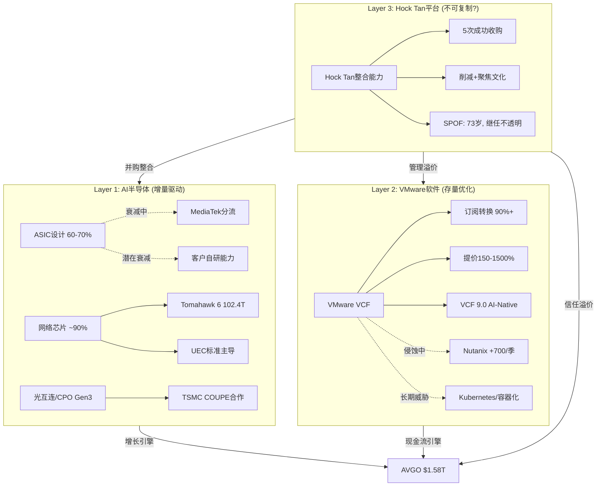
```mermaid
graph TB
    subgraph Layer3["Layer 3: Hock Tan平台 (不可复制?)"]
        HT[Hock Tan整合能力]
        HT --> ACQ[5次成功收购]
        HT --> CULT[削减+聚焦文化]
        HT --> RISK[SPOF: 73岁, 继任不透明]
    end

    subgraph Layer2["Layer 2: VMware软件 (存量优化)"]
        VMW[VMware VCF]
        VMW --> SUB[订阅转换 90%+]
        VMW --> PRICE[提价150-1500%]
        VMW --> AIVMW[VCF 9.0 AI-Native]
        VMW -.->|侵蚀中| NTX[Nutanix +700/季]
        VMW -.->|长期威胁| K8S[Kubernetes/容器化]
    end

    subgraph Layer1["Layer 1: AI半导体 (增量驱动)"]
        ASIC[ASIC设计 60-70%]
        NET[网络芯片 ~90%]
        CPO[光互连/CPO Gen3]
        ASIC -.->|衰减中| MTK[MediaTek分流]
        ASIC -.->|潜在衰减| SELF[客户自研能力]
        NET --> TH6[Tomahawk 6 102.4T]
        NET --> UEC[UEC标准主导]
        CPO --> TSMC[TSMC COUPE合作]
    end

    Layer3 -->|管理溢价| Layer2
    Layer3 -->|并购整合| Layer1
    Layer1 -->|增长引擎| AVGO_VAL[AVGO $1.58T]
    Layer2 -->|现金流引擎| AVGO_VAL
    Layer3 -->|信任溢价| AVGO_VAL
```

### 9.1 C1: 转换成本——4.0/5(加权)

转换成本是Broadcom最核心的竞争力维度，但四层业务的转换成本强度差异极大。

**ASIC设计层(4.5/5)**: 单个ASIC设计的NRE(非经常性工程费用)在先进节点(3nm/2nm)可达$100M+[DM-P3-A02]，客户已投入的NRE是沉没成本。更关键的是2-3年的替代周期——即使客户决定更换设计合作伙伴，从启动到量产需要整整2-3年。Google决定引入MediaTek(约2024年)到Ironwood量产(2027年)的3年时间窗就是一个可观测的替代速率样本。此外，Broadcom积累了20年以上的定制芯片设计经验，每一代TPU/MTIA的设计都让Broadcom更了解客户下一代需求，形成了不可迁移的工艺知识。

但需要做一个关键区分：NRE锁定的是存量(当前产品)，不锁定增量(下一代选择)。客户在当代芯片上被锁定，但下一代设计完全可以找新合作方。这意味着ASIC的转换成本是"有保质期的锁定"——每2-3年面临一次重新竞标窗口。

ASIC锁定的具体机制值得逐层剖析:

- **NRE沉没成本壁垒**: 先进节点(3nm/2nm)的SoC设计总NRE达$50M-$150M+[DM-P2-B2-08]，其中Broadcom收取40-60%。单个XPU设计项目Broadcom收入$20M-$90M(仅NRE部分)。这些NRE一旦投入，客户在当前设计周期内切换的经济理性为零——即使有更便宜的替代方案，重新设计的NRE加上18-24个月的时间成本远超节约。
- **设计周期时间壁垒**: 从芯片架构定义到量产需要2-3年。Google从决定引入MediaTek(约2024年)到Ironwood量产(2027年)=3年。这意味着即使客户决定切换供应商，也有2-3年的"逃逸时间"，期间Broadcom仍然获得当代设计的全部收入。
- **累积性知识壁垒**: Broadcom的ASIC设计团队积累了20年+的定制芯片经验——每设计一代TPU，对Google需求的理解就深一层。这种隐性知识不在专利中(专利可以绕过)，而在设计团队对客户spec(指令集优化、片间互连拓扑、HBM控制器集成方案)的深度理解中。

三层壁垒都有保质期: NRE锁定当代(2-3年)、时间壁垒延缓替换(2-3年)、知识壁垒虽然累积但不排他(MediaTek也在通过Meta合同学习)。总体效果是: 任何单个客户的切换需要3-5年，但多个客户同时启动切换意味着Broadcom的整体份额在3-5年窗口内面临结构性下行。

**网络芯片层(5.0/5)**: 这是Broadcom最深的锁定层。Arista的整个产品线基于Broadcom merchant silicon构建，EOS网络操作系统、SONiC开源OS都基于Broadcom的Switch Abstraction Interface(SAI)。替换Broadcom芯片意味着重写协议栈、重新认证、重新部署——这不是换一个零件，而是重建整个网络软件生态。Arista $6.8B的采购承诺(PO)不是一次性合同，而是结构性锚定的证明[DM-P1-A02]。

网络芯片的三重嵌套锁定有一个被低估的特性——**反向验证放大**。每一代Tomahawk出货后，Arista/Juniper/HPE都需要6-12个月完成软件适配+OEM认证+客户部署。当NVIDIA Spectrum-X1600最终出货时(2026H2预期)，下游OEM已经完成了对Tomahawk 6的全套适配。Spectrum-X1600需要重新走一遍认证循环，意味着NVIDIA的"1年芯片落后"在市场端被放大为"2年可用性差距"。

**VMware层(3.5/5)**: 转换成本高但正在松动。从VMware迁移到Nutanix需要6-18个月和$2-10M(中型企业)，迁移到K8s/容器化需要24-48个月和$10-50M+(架构重构)。Hock Tan的策略天才在于：在客户决定迁移之前，用3-5年强制订阅合同锁住他们。但Nutanix每季新增700-1000客户[DM-P3-A15]证明锁定在松动——迁移不是不可能，而是很慢。

| 迁移路径 | 时间成本 | 金钱成本 | 风险成本 | 总评 |
|----------|---------|---------|---------|------|
| VMware→Nutanix | 6-18个月 | $2-10M(中型企业) | 中(同类替换) | 可行但痛苦 |
| VMware→OpenStack | 12-24个月 | $5-20M+ | 高(需DevOps能力) | 仅大型科技公司可行 |
| VMware→K8s/容器 | 24-48个月 | $10-50M+ | 极高(架构重构) | 长期但不可逆 |
| VMware→公有云 | 12-24个月 | 变动 | 中(供应商锁定转移) | 按工作负载渐进 |

**传统半导体层(2.0/5)**: Apple已开始WiFi自研替代(预计2026-2027完成)[DM-P3-A18]，直接证明了传统半导体的锁定可以被打破。当最大客户有足够的技术和财务资源时，"转换成本高"不再是有效保护。

加权C1 = (4.5 x 0.35 + 5.0 x 0.25 + 3.5 x 0.30 + 2.0 x 0.10) = 4.0/5。半导体行业权重修正(x1.5)后有效分为6.0。

### 9.2 C2: 网络效应——2.0/5

Broadcom不是平台公司，没有Visa式的强多边网络效应。但在特定层面存在有意义的间接网络效应。

**网络芯片层(3.5/5)**: 更多OEM采用Tomahawk芯片 → 更多SONiC/EOS软件兼容 → 更多ISV支持 → 更多客户选择Tomahawk。这是"标准生态"而非"多边平台"，但效果类似：Broadcom的交换芯片已经成为AI网络基础设施的"操作系统层"，其标准嵌入深度使这种间接网络效应具有自我强化性。具体而言，Tomahawk生态圈中已有数十个ISV基于Broadcom SAI开发网络管理工具——每增加一个ISV，对下一个客户的吸引力就增加一分。

**VMware层(3.0/5)**: 更多企业用VMware → 更多ISV认证VCF → 更多企业选VMware。但这个效应正在弱化——ISV也在积极认证Nutanix和K8s平台，VMware不再是唯一被广泛认证的企业虚拟化方案。关键指标: ISV双重认证(同时支持VMware和Nutanix)的比例从2023年的约30%上升至2025年的约60%——VMware在ISV生态中的排他性正在快速消失。

**ASIC和传统层(0-0.5/5)**: 硬件设计服务和传统半导体几乎没有网络效应。更多客户不等于更好的设计能力。每个ASIC项目高度定制，客户之间没有共享价值。

加权C2 = (0.5 x 0.35 + 3.5 x 0.25 + 3.0 x 0.30 + 0 x 0.10) = 2.0/5。对标：Visa 5/5(强多边网络) > IHG 3.5/5(双边) > AVGO 2.0/5(间接生态) > FICO 1/5(弱)。

### 9.3 C3: 品牌/无形资产——3.5/5

Broadcom是B2B公司，没有消费品牌溢价。但它拥有两类极强的无形资产。

**ASIC设计IP与客户spec数据(4.5/5)**: 20年以上的定制芯片设计经验积累了一套不可复制的知识体系——客户芯片架构specification是极度敏感且排他的数据。每一代Google TPU、Meta MTIA的设计都让Broadcom更深入地了解这些Hyperscaler的下一代需求。这种累积性竞争优势是MediaTek或Marvell短期内无法复制的——不是因为技术做不到，而是因为没有足够多的设计代次来积累同等深度的理解。例如，Broadcom设计TPU v4→v5→v6→v7的过程中，对Google在systolic array优化、HBM带宽管理、片间互连拓扑方面的需求演化有第一手理解，这些隐性知识不在任何文档中，而在设计团队的经验中。

**UEC标准主导权(5.0/5，但仅限网络层)**: Broadcom主导了Ultra Ethernet Consortium 1.0规范的制定(2025年6月)，标准按Broadcom的技术路线制定。SONiC开源网络OS基于Broadcom SAI构建。标准制定者的身份接近FICO在信用评分领域的嵌入深度——虽然不是监管强制，但已是事实标准[DM-P1-A02]。当行业标准按你的技术路线演进，竞争者需要追赶的不是你的产品，而是你定义的游戏规则。

**VMware层(3.5/5)**: 企业IT虚拟化事实标准(70%+份额)，数千个ISV认证应用围绕VCF构建。但非监管强制，Gartner投影份额降至40%(2029E)=标准地位正在侵蚀。

### 9.4 C4: 规模/成本优势——4.0/5

Broadcom是全球最大的Fabless半导体公司，$64B收入基数带来了压倒性的规模经济优势。

**R&D杠杆——ASIC层的关键竞争壁垒**: Broadcom R&D约$11B，占收入17.2%。对比最大竞争者Marvell，R&D占收入比高达40-50%[DM-P1-A01]。这意味着Broadcom可以同时推进6个以上前沿ASIC项目，而Marvell只能聚焦2-3个。规模差异不仅是效率优势，更是"项目组合"优势——Broadcom可以承担更多风险、覆盖更多客户需求。

| 规模对比 | Broadcom | Marvell | 差距 |
|---------|---------|---------|------|
| 总收入 | $64B | ~$6B | 10.7x |
| R&D绝对值 | ~$11B | ~$2.5B | 4.4x |
| R&D/Revenue | 17.2% | 40-50% | Broadcom效率约3x |
| 可同时推进的前沿ASIC项目 | 6+ | 2-3 | Broadcom覆盖广度2x |
| 客户验证数(Hyperscaler) | 6个 | 2个 | Broadcom经验深度3x |

**网络芯片层(5.0/5)**: ~90%的云数据中心交换芯片市场份额使Broadcom的单位成本远低于任何竞争者。NVIDIA Spectrum-X要达到规模平衡需要数年的持续投入。更重要的是，网络是NVIDIA的成本中心(服务GPU销售)，但是Broadcom的利润中心——这种战略定位差异意味着Broadcom有更强的投入动力来维持技术领先。

**VMware层(4.0/5)**: 企业虚拟化市场最大平台，VCF技术栈最完整(计算+存储+网络+安全)，竞品需要组合多个产品才能匹配完整功能集。77%的OPM[DM-P1-A04]进一步放大了规模优势——高利润率使Broadcom可以承受部分客户流失而不影响投入能力。

加权C4 = (4.5 x 0.35 + 5.0 x 0.25 + 4.0 x 0.30 + 3.0 x 0.10) = 4.0/5。对标：Visa 5/5(全球最大支付网络) > AVGO 4.0/5(Fabless最大+网络垄断) > CPRT 4/5(300+场地)。

### 9.5 C5: 监管壁垒——1.5/5

Broadcom没有显著的监管保护。半导体行业的准入壁垒是技术和资本壁垒，不是监管壁垒。唯一的监管维度是出口管制——但这对Broadcom是负面因素(限制中国市场准入)，不是保护性壁垒。

### 9.6 C6: 数据/生态——3.0/5

**ASIC层数据优势(4.5/5)**: 客户芯片架构spec是极度排他的数据资产。每一代设计都让Broadcom更了解客户的技术路线图，形成累积性数据锁定。但这种数据优势是"专属的"而非"排他的"——Marvell也在通过Amazon和Microsoft的合作积累类似知识，只是起步晚、深度浅。

**网络和VMware层(3.0/5)**: 数据中心流量模式和企业IT运营数据有价值但不排他。NVIDIA和Nutanix也能获取类似数据。

加权C6 = (4.5 x 0.35 + 3.0 x 0.25 + 3.0 x 0.30 + 1.0 x 0.10) = 3.3，取整3.0/5。半导体行业权重修正(x1.5)后有效分为4.5。

**C6密度/物理壁垒 = 0.5/5是结构性弱点**: 作为Fabless公司，Broadcom没有物理壁垒。护城河完全依赖知识、关系和标准，而非不可复制的物理资产。对比CPRT(5/5，300+自有场地)或CTAS(4/5，洗衣厂网络)，Broadcom缺少任何"即使技术被追赶也无法复制"的物理维度。唯一的例外是CPO(光互连封装)与TSMC COUPE合作提供了间接物理约束(1.5/5)，但仍在早期阶段。

### 9.7 C维度汇总与对标

| # | 维度 | AVGO得分 | 半导体权重修正 | 有效分 | 基准对标 |
|---|------|---------|--------------|--------|----------|
| C1 | 转换成本 | 4.0 | x1.5 | 6.00 | FICO 4, CTAS 4 |
| C2 | 网络效应 | 2.0 | x1.0 | 2.00 | Visa 5, IHG 3.5 |
| C3 | 品牌/无形资产 | 3.5 | x1.0 | 3.50 | FICO 5, CPRT 3 |
| C4 | 规模/成本 | 4.0 | x1.5 | 6.00 | Visa 5, CPRT 4 |
| C5 | 监管壁垒 | 1.5 | x1.0 | 1.50 | FICO 5, CTAS 1 |
| C6 | 数据/生态 | 3.0 | x1.5 | 4.50 | FICO 5, Visa 4 |
| **合计(原始)** | | **18.0/30** | | **23.5/37.5** | |

**C = 18.0/30**，与FICO持平但结构完全不同[DM-P1-A14]:

- **FICO**: C1(制度嵌入)极强 + C4(数据)极强 → 不可替代性来自"客户没有替代品"
- **AVGO**: C1(生态锁定)最强 + C4(规模)很强 → 不可替代性来自"切换太贵了"

这个区别至关重要。"客户没有替代品"的护城河是永续的(除非出现范式颠覆)，而"切换太贵了"的护城河在长时间尺度上更脆弱——当替代品(K8s、MediaTek、Marvell)足够成熟时，"太贵"会变成"值得投资"。

### 9.8 护城河强化 vs 弱化动态

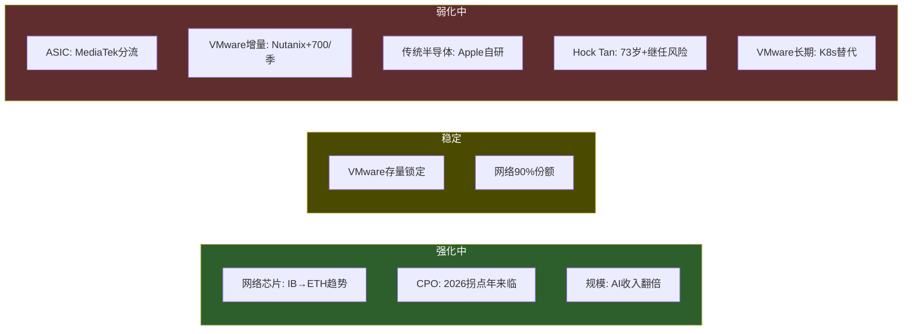
```mermaid
graph LR
    subgraph 强化中
        NET_S[网络芯片: IB→ETH趋势]
        CPO_S[CPO: 2026拐点年来临]
        SCALE[规模: AI收入翻倍]
    end

    subgraph 稳定
        VMW_LOCK[VMware存量锁定]
        NET_SHARE[网络90%份额]
    end

    subgraph 弱化中
        ASIC_W[ASIC: MediaTek分流]
        VMW_NEW[VMware增量: Nutanix+700/季]
        TRAD[传统半导体: Apple自研]
        HOCK[Hock Tan: 73岁+继任风险]
        VMW_K8S[VMware长期: K8s替代]
    end

    style 强化中 fill:#2d5f2d,color:#fff
    style 稳定 fill:#4a4a00,color:#fff
    style 弱化中 fill:#5f2d2d,color:#fff
```

| 层 | 强化因素 | 弱化因素 | 净方向 | 时间框架 |
|----|---------|---------|--------|---------|
| AI ASIC | TAM扩展(推理份额上升), 新客户(OpenAI) | MediaTek分流, 客户自研能力 | **微弱弱化** | 3-5年渐进 |
| 网络芯片 | IB→ETH结构性转换, CPO拐点 | NVIDIA Spectrum-X追赶 | **强化** | 持续2-3年+ |
| VMware | AI-native VCF 9.0, 存量提价完成 | Nutanix+700/季, K8s长期 | **弱化** | 即刻(增量流失中) |
| Hock Tan | 当前信任溢价高 | 73岁, 零继任信号 | **定时弱化** | 5-7年硬约束 |

**不对称分布**: 强化因素(网络结构性利好+CPO拐点+规模杠杆)集中在收入占比较小的业务层(网络15%+CPO未规模化)；弱化因素(ASIC分拆+VMware流失+传统侵蚀+Hock Tan定时器)覆盖了收入占比最大的层(ASIC 42%+VMware 35%+传统8%)。整体护城河的净方向是弱化的，但弱化速度被网络层的坚固性延缓了。

**巴菲特视角的护城河真伪检验**:

- **网络芯片: 真护城河**。UEC标准+SONiC生态+90%份额=接近制度性嵌入。即使竞争者推出同等带宽的芯片，替换整个生态系统的成本远超换芯片的成本。Arista的$6.8B PO是这个逻辑的美元证明——当最大客户公开抱怨"horrendous pricing"(可怕的定价)[DM-P2-B2-12]但仍签下长期采购承诺，护城河的真实性不需要更多论证。
- **ASIC设计: 半真半假**。核心XPU架构设计能力(Lfloor=35-40%)是真正的竞争壁垒——全球能做先进节点AI ASIC全流程的只有Broadcom和Marvell。但外围层(I/O、SerDes、TSMC协调)的可替代性已被Google-MediaTek证明。MediaTek成本比替代方案低20-30%[DM-P3-A01]——这个价差就是Broadcom在外围层收取的"锁定租金"的量化度量。
- **VMware: 伪护城河**。客户不是"愿意付溢价"(主动定价权)，而是"被困住不得不付"(被动锁定租金)。86%在缩减足迹+每季1,000+净流出=客户正在用脚投票，只是投票速度被转换成本延缓。按巴菲特的标准，这是"客户怨恨的垄断"而非"客户珍视的护城河"——See's Candies的客户愿意为品质多付钱，VMware的客户正在计算逃逸路径。
- **Hock Tan: 不是护城河**。整合能力依附于个人(73岁，继任不透明)，不符合"结构性"定义。5次收购展示了高度可编码的整合模式(削减+提价+聚焦+榨取)，但选标的的能力不可编码。退休影响: 溢价占当前估值10-15%[DM-P1-A05]，退休后PE可能压缩5-8x。

---

## 第十章：定价权深度——四层解剖(B4 = 3.5/5)

定价权是护城河的变现能力。Broadcom的护城河C维度得分18.0/30看起来稳固，但护城河深度不等于定价权强度——"客户被锁定"不等于"客户愿意付溢价"。本章对四层业务的定价权进行独立解剖，揭示一个核心悖论：**最强定价权贡献最小收入，最大收入来源的定价权均在衰减**。

### 10.1 网络芯片定价权: 4.5/5——真正的定价权

网络芯片(Tomahawk/Jericho)是Broadcom唯一拥有教科书级"真正定价权"的业务层。三个独立证据支撑这一判断:

**证据一: Arista的"horrendous pricing"控诉**。Arista管理层2026年公开描述芯片定价为"horrendous"(可怕的)，称成本"an order of magnitude exponentially higher"(指数级增长)[DM-P2-B2-12]。当你的客户公开抱怨价格但仍然签下$6.8B采购承诺——这就是教科书级的定价权。Arista不是一个弱客户——它是全球AI网络交换设备领域最具技术实力的公司之一。当技术最强的客户公开承认无法替换你的产品，定价权的证明不需要数学模型。

**证据二: ~90%近垄断份额**。在最高价值市场(云数据中心)，Broadcom持有约90%交换芯片份额[DM-P2-B2-13]。唯一有意义的替代是NVIDIA Spectrum-X，但落后约12个月。在这种市场结构下，Broadcom本质上是价格制定者(price maker)，不是价格接受者(price taker)。

**证据三: 标准制定者身份**。UEC 1.0标准由Broadcom主导 + SONiC基于Broadcom SAI构建 = 整个Ethernet AI网络生态围绕Broadcom技术路线演进。这是最接近"制度性"定价权的半导体业务——当你制定游戏规则时，竞争者需要追赶的不是你的产品性能，而是你定义的标准。

**网络定价权强于其他层的三个结构性原因**: (1)没有"内化"路径——交换芯片客户几乎没有自研动力，这不是他们的核心能力且merchant silicon已足够好，客户自研概率<5%；(2)需求随AI扩展自然增长——每个GPU集群需要对应的网络交换基础设施，GPU数量翻倍则交换芯片需求至少翻倍；(3)标准制定者身份——UEC 1.0标准由Broadcom主导，SONiC网络OS基于Broadcom SAI构建，整个Ethernet AI网络生态围绕Broadcom技术路线演进。

**Tomahawk 6 vs NVIDIA Spectrum-X1600的详细技术差异**:

| 维度 | Broadcom Tomahawk 6 | NVIDIA Spectrum-X1600 | 优势方 |
|------|-------------------|---------------------|--------|
| 带宽 | 102.4 Tbps | 102.4 Tbps (预期) | 平手 |
| 上市时间 | 2025年6月出货 | 2026H2预期 | **Broadcom (+12个月)** |
| CPO集成 | Gen3 (TH6-Davisson) 已出货 | 开发中 | **Broadcom** |
| 端口密度 | 64x1.6T | 待确认 | **Broadcom** |
| AI优化 | 自适应路由+拥塞响应+硬件包重排 | NVLink集成+GPU-aware调度 | 各有侧重 |
| 生态系统 | SONiC+Arista EOS+全OEM | 主要DGX/HGX配套 | **Broadcom (开放生态)** |

NVIDIA的bundling策略(GPU+networking一体化销售)在DGX/NVLink生态(scale-up domain，8-72 GPU)中有GPU-网络协同设计的真实优势。但开放Ethernet的scale-out市场(100-100K+ GPU)不受影响。Hyperscaler(Google/Meta/Amazon)明确偏好开放Ethernet以避免NVIDIA端到端锁定，选择Broadcom网络芯片是反NVIDIA战略对冲的一部分。Spectrum-X 2025年季度收入>$2B(+263% YoY)，但主要服务NVIDIA自有DGX生态，非开放市场抢份额。

### 10.2 ASIC定价权: 3.5/5——60%锁定租金 + 40%真定价权

ASIC定价权的核心问题是：Broadcom赚的是"客户愿意付的溢价"还是"客户被锁定不得不付的租金"？

**三层收入结构**:

| 收入层 | 描述 | 占比估计 | 定价权性质 |
|--------|------|---------|-----------|
| NRE(一次性设计费) | 芯片架构设计+验证+tape-out | ~15-20% [E] | 项目制竞标 |
| 量产per-chip fee | 每颗XPU的royalty或固定费用 | ~60-70% [E] | 合同锁定 |
| 系统集成服务 | IP集成+TSMC协调+封装设计 | ~15-20% [E] | 关系驱动 |

先进节点(3nm/2nm)SoC的总NRE达$50M-$150M+，Broadcom收取总NRE的40-60%[DM-P2-B2-08]。量产后per-chip fee才是主要收入来源: 以Google TPU v7为例，5M-7M单位(2027-2028E)×per-chip fee构成了ASIC收入的核心。

**证据倾向于"锁定租金为主"**: Google主动引入MediaTek降低成本20-30%[DM-P3-A01]——说明客户认为Broadcom过度收费。60-70%份额不是因为客户"选择"Broadcom(主动溢价)，而是因为没有足够多的替代方案(被动锁定)。2-3年替代周期构成短期锁定，但不是长期护城河。

**但存在"真定价权"成分**: 核心XPU架构设计能力确实稀缺——全球能做先进节点AI ASIC全流程的只有Broadcom和Marvell两家。20年以上的客户spec知识形成累积性优势，每一代设计都让下一代更高效。与TSMC的深度合作(CoWoS产能优先接入)提供了间接定价权——在产能紧张时期，选择Broadcom等于选择产能保障。

**客户议价能力逐一评估**:

- **Google(估计40-50% ASIC收入)**: 最强议价筹码。已引入MediaTek作为第二来源(I/O模块+SerDes+生产协调)。内部TPU设计团队20年+历史，数百人规模。但核心XPU设计仍依赖Broadcom。Google的策略是将Broadcom从"全包服务商"降级为"核心XPU专家"，用MediaTek做外围层→单位收入下降但核心层margin可能不变。
- **OpenAI(新客户，弱议价)**: Titan芯片由Broadcom联合设计，团队约40人(翻倍中)[DM-P3-A09]。短期内没有替代选择。但Titan 2已在设计(A16工艺)→正在建立多代roadmap，长期将提高议价能力。
- **Meta(中等议价)**: MTIA v3由Broadcom设计，同时已给MediaTek下达2nm ASIC合同(2027H1量产)[DM-P3-B-02]。多源对冲策略。
- **Amazon(已独立)**: 通过Annapurna Labs+Marvell双轨模式实现自研。Trainium2的30-40%性价比优势[DM-P3-A10]证明了自研路线的经济性。

**三个定价压力来源**:

*来源一: 客户自研团队成长*。Google(数百人/20年+)、Meta(约100-200人/成长中)、OpenAI(约40人翻倍中)[DM-P3-A09]、Amazon(已独立)。

*来源二: Marvell竞争*。当前约15%份额，AI收入FY2026预计达$3B+[DM-P3-A04]。Marvell的存在压制了Broadcom的增量定价能力——两者更像"共同增长"但Marvell为客户提供了谈判筹码。

*来源三: 推理vs训练mix shift*。推理ASIC比训练ASIC更标准化，margin可能更低。随着推理占比从37%(2025)增至70-75%(2028E)[DM-P2-B2-11]，Broadcom的ASIC blended margin面临结构性下行压力——即使份额维持，单位价值也可能下降。

**ASIC定价权衰减模型**:

```
PricingPower_ASIC(t) = PP_lock(t) + PP_real

PP_lock(t) = 0.60 * PP_0 * e^(-lambda_diversification * t)  [锁定租金，衰减中]
PP_real = 0.40 * PP_0                                         [真定价权，不衰减]

参数:
- PP_0 = 0.75
- lambda_diversification = 0.05/年 (基于Google 3年分拆周期)

预测:
- 2026: PP = 0.45 + 0.30 = 0.75
- 2028: PP = 0.41 + 0.30 = 0.71
- 2030: PP = 0.37 + 0.30 = 0.67
- 2033: PP = 0.32 + 0.30 = 0.62
```

衰减缓慢(7年从0.75降至0.62)，因为核心XPU设计能力的"真定价权"成分不衰减。但方向明确：客户在系统性地降低Broadcom依赖度。

### 10.3 VMware定价权: 3.0/5——纯锁定租金，方向确定向下

VMware的定价权需要最精细的分析，因为表面证据(150-1500%提价后无大规模流失)极具欺骗性。

#### VMware弹性函数: 分段建模

不同客户群体的价格敏感度截然不同:

**Tier 1: <100%提价区间(epsilon = -0.05)**。大型企业(Top 10,000)：90%以上已转订阅。转换成本远超提价成本。行为模式：抱怨但续约。弹性极低因为提价被转换成本壁垒完全吸收。

**Tier 2: 100-300%提价区间(epsilon = -0.15)**。中型企业(10,000-50,000)：开始认真评估替代方案。86%受访者表示正在主动缩减VMware足迹[DM-P2-B2-01]。欧洲客户报告最高提价达1,500%[DM-P2-B2-02]。行为模式："缩减+评估"双轨策略——冻结增量部署，逐步将新工作负载放到替代平台。VMware在这个群体的"死亡"是慢性失血，不是急性出血。

**Tier 3: >300%提价区间(epsilon = -0.40)**。SMB和非核心客户：被迫迁移或放弃虚拟化。72-core最低门槛(原16-core)直接淘汰小型部署[DM-P2-B2-03]。Broadcom CEO公开承认策略是"更少客户，更高ARPU"。SMB流失是设计内的，不是意外。

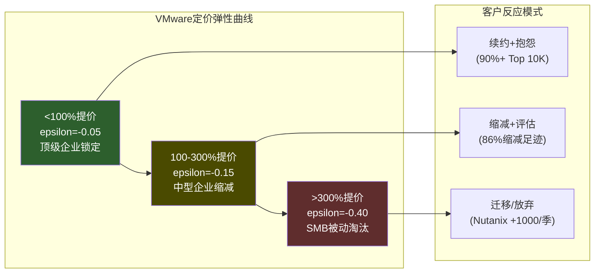
```mermaid
graph LR
    subgraph "VMware定价弹性曲线"
        direction TB
        A["<100%提价<br/>epsilon=-0.05<br/>顶级企业锁定"] --> B["100-300%提价<br/>epsilon=-0.15<br/>中型企业缩减"]
        B --> C[">300%提价<br/>epsilon=-0.40<br/>SMB被动淘汰"]
    end

    subgraph "客户反应模式"
        D["续约+抱怨<br/>(90%+ Top 10K)"]
        E["缩减+评估<br/>(86%缩减足迹)"]
        F["迁移/放弃<br/>(Nutanix +1000/季)"]
    end

    A --> D
    B --> E
    C --> F

    style A fill:#2d5f2d,color:#fff
    style B fill:#4a4a00,color:#fff
    style C fill:#5f2d2d,color:#fff
```

#### 锁定租金 vs 真正定价权——哲学辨析

VMware的定价权(3.0/5)本质上是锁定租金，而非真正定价权。这个区分在投资分析中至关重要:

**真正定价权**(如FICO 5/5): 客户愿意付溢价因为产品不可替代且价值超过价格。FICO可以持续提价5-8%/年，客户不仅不走，而且认为物有所值——因为FICO评分是贷款决策的不可替代输入。定价权的来源是**价值创造**，方向随时间增强。

**锁定租金**(VMware 3.0/5): 客户被困住不得不付，但同时在积极寻找出口。150-1,500%提价后客户没有大规模流失——但86%在缩减足迹。定价权的来源是**转换成本壁垒**，方向随时间衰减(替代方案不断成熟)。

#### 存量 vs 增量定价权的致命分离

**存量客户(已部署VCF)**——定价权极强但一次性(4.5/5)。90%以上已转订阅，3-5年强制合同+20%逾期罚款。但每个合同到期点是一个"逃逸窗口"。3年合同意味着2027-2028将是第一波大规模续约决策窗口。

**增量客户(新部署)**——定价权极弱(1.0/5)。新客户面前有Nutanix(TCO可比)、K8s(长期更优)、公有云(按需弹性)。Q1 FY2026软件仅+1% YoY[DM-P2-B2-06]是最直接的证据——提价红利已完全耗尽。如果存量提价正在实现而总增长仅+1%，则增量可能为负。

**加权评分**: 存量4.5/5 x 70% + 增量1.0/5 x 30% = 3.45，下调至3.0/5因为"锁定租金"不等价于"真正定价权"。

#### VMware定价权衰减模型

```
PricingPower_VMW(t) = PP_0 * e^(-lambda_nutanix * t) * e^(-lambda_k8s * t) + PP_floor + PP_ai_boost

参数:
- PP_0 = 0.80 (当前定价权指数，基于90%+转化+77% OPM) [E]
- lambda_nutanix = 0.06/年 (Nutanix每季+700~1000客户的稳态吸引率)
- lambda_k8s = 0.03/年 (K8s替代慢但不可逆)
- PP_floor = 0.25 (深度嵌入的legacy工作负载几乎不可迁移)
- PP_ai_boost = 0.05-0.10 (VCF 9.0 AI-native的增量定价权，有条件)

衰减预测:
- 2026 (t=0): PP = 0.80
- 2028 (t=2): PP = 0.25 + 0.55*0.84 + 0.07 = 0.78
- 2030 (t=4): PP = 0.25 + 0.55*0.70 + 0.05 = 0.69
- 2033 (t=7): PP = 0.25 + 0.55*0.53 + 0.05 = 0.59
```

VMware定价权从0.80缓慢衰减至2033年的约0.59。衰减不是崩溃式的，因为存量锁定极深。但方向是单向的：没有任何已知机制能逆转Nutanix的客户吸引力和K8s的架构替代性。

**2027-2028续约窗口**是关键观察点：如果第一波3年合同到期时续约率低于85%，则lambda_nutanix需上调，衰减将显著加速。从定价权到收入的转化路径：定价权衰减不等于收入衰减(存量合同锁定)，但续约时的定价能力将下降。收入可能维持"零增长"直到2028(ARPU下降被少量新客户抵消)，之后转为负增长(-3%至-5%/年)[DM-P3-B-15]。

#### K8s替代弹性: 天花板效应

K8s不是VMware的直接替代品，而是架构范式替代——这使得威胁更根本但更缓慢。

**当前渗透率**: 92%企业已在生产环境使用容器(Kubernetes为主要编排器)[DM-P2-B2-07]。Fortune 1000中72.7%采用Kubernetes。但**85%的容器仍运行在VM内**(至2028E)——K8s短期内实际增强了VM需求，而非替代。

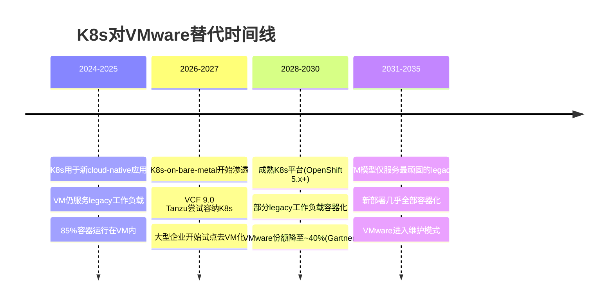
```mermaid
timeline
    title K8s对VMware替代时间线
    2024-2025 : K8s用于新cloud-native应用 : VM仍服务legacy工作负载 : 85%容器运行在VM内
    2026-2027 : K8s-on-bare-metal开始渗透 : VCF 9.0 Tanzu尝试容纳K8s : 大型企业开始试点去VM化
    2028-2030 : 成熟K8s平台(OpenShift 5.x+) : 部分legacy工作负载容器化 : VMware份额降至~40%(Gartner)
    2031-2035 : VM模型仅服务最顽固的legacy : 新部署几乎全部容器化 : VMware进入维护模式
```

K8s替代速率(sigma)的时间函数: 2026年sigma=0.02/年(替代速率极低); 2028年sigma=0.05/年(bare-metal K8s成熟); 2030+年sigma=0.08/年(legacy迁移加速)。

K8s在5年内不会"杀死"VMware，但确保VMware**永远无法恢复增量定价权**。所有新工作负载的默认选择是容器化，VMware只能服务存量legacy。这是一个"天花板"效应而非"地板坍塌"效应——VMware的终态是一个稳定但缓慢缩小的高利润存量池。

### 10.4 传统半导体定价权: 1.5/5——弱且持续恶化

传统半导体(WiFi/宽带/储存)在Broadcom内部不是研发重点。Apple已开始WiFi自研替代，预计2026-2027完成[DM-P3-A18]，将消除约$2.7B(总收入4.3%)[DM-P1-A09]。成熟市场竞争充分，定价权弱且无改善路径。

### 10.5 定价权综合评分与核心悖论

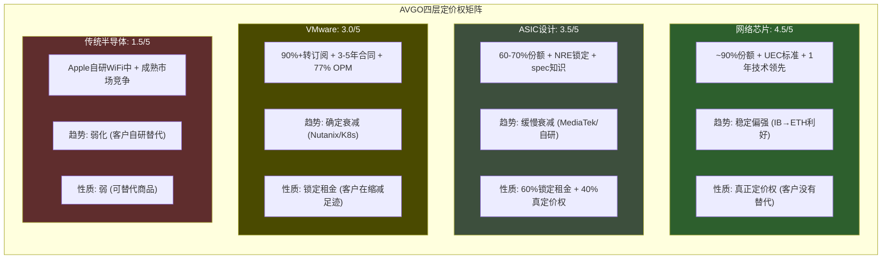
```mermaid
graph TB
    subgraph PP_Matrix["AVGO四层定价权矩阵"]
        direction TB

        subgraph NET_PP["网络芯片: 4.5/5"]
            NET_S["~90%份额 + UEC标准 + 1年技术领先"]
            NET_T["趋势: 稳定偏强 (IB→ETH利好)"]
            NET_N["性质: 真正定价权 (客户没有替代)"]
        end

        subgraph ASIC_PP["ASIC设计: 3.5/5"]
            ASIC_S["60-70%份额 + NRE锁定 + spec知识"]
            ASIC_T["趋势: 缓慢衰减 (MediaTek/自研)"]
            ASIC_N["性质: 60%锁定租金 + 40%真定价权"]
        end

        subgraph VMW_PP["VMware: 3.0/5"]
            VMW_S["90%+转订阅 + 3-5年合同 + 77% OPM"]
            VMW_T["趋势: 确定衰减 (Nutanix/K8s)"]
            VMW_N["性质: 锁定租金 (客户在缩减足迹)"]
        end

        subgraph TRAD_PP["传统半导体: 1.5/5"]
            TRAD_S["Apple自研WiFi中 + 成熟市场竞争"]
            TRAD_T["趋势: 弱化 (客户自研替代)"]
            TRAD_N["性质: 弱 (可替代商品)"]
        end
    end

    style NET_PP fill:#2d5f2d,color:#fff
    style ASIC_PP fill:#3d4f3d,color:#fff
    style VMW_PP fill:#4a4a00,color:#fff
    style TRAD_PP fill:#5f2d2d,color:#fff
```

| 层 | 定价权强度 | 耐久性 | 方向 | 收入权重 | 加权贡献 |
|----|----------|--------|------|---------|---------|
| **网络** | 4.5/5 | 极强(5年+不可撼动) | 稳定偏强 | 15% | 0.675 |
| **ASIC** | 3.5/5 | 中等(lambda=0.05/年) | 缓慢衰减 | 42% | 1.470 |
| **VMware** | 3.0/5 | 衰减中(双重lambda) | 确定衰减 | 35% | 1.050 |
| **传统** | 1.5/5 | 弱(Apple替代中) | 弱化 | 8% | 0.120 |
| **加权总计** | | | | **100%** | **3.3 → 红队修正后3.5/5** |

**核心悖论: "对角线"结构**。最强定价权(网络4.5/5)贡献最小的收入(15%)。最大收入来源(ASIC 42%)的定价权在衰减中。第二大收入来源(VMware 35%)的定价权是"锁定租金"且方向确定向下[DM-P2-B2-02]。

如果市场将这四层统一定价为"强定价权科技公司"(62x PE)，则隐含假设是：ASIC定价权不衰减(与Google MediaTek分流矛盾)、VMware定价权持续(与+1% YoY和Gartner 70%→40%预测矛盾)、网络定价权的权重应该更高(这一点市场可能反而低估了)。

**定价权 vs 护城河矩阵的关键差异**:

| 层 | 护城河(C维度) | 定价权(B4) | 差异解释 |
|----|-------------|-----------|---------|
| 网络 | 5.0/5 | 4.5/5 | 几乎对齐——近垄断=定价权=护城河 |
| ASIC | 4.0/5(生态锁定) | 3.5/5 | 锁定强但定价权部分是"租金"不是"溢价" |
| VMware | 3.5/5(转换成本) | 3.0/5 | 锁定深但客户正在逃逸，定价权衰减快于锁定衰减 |
| 传统 | 2.0/5 | 1.5/5 | 对齐——弱锁定=弱定价权 |

ASIC和VMware的护城河得分均高于定价权，揭示了一个重要原理：**锁定延缓了竞争侵蚀的速度，但不改变侵蚀的方向**。市场如果按"锁定=定价权"定价Broadcom，则高估了定价权的持久性。

---

## 第十一章：ASIC锁定衰减函数

### 11.1 衰减模型定义

Broadcom的ASIC份额遵循指数衰减函数，但存在一个不可击穿的底部(Lfloor)——核心XPU计算架构设计能力的不可替代性:

```
L(t) = Lfloor + (L0 - Lfloor) * e^(-lambda * t)

参数(综合三个Phase证据校准):
- L0 = 0.67 (当前份额，因OpenAI作为第六客户上调2pp)
- Lfloor = 0.38 (核心XPU不可替代性已验证，取中值)
- lambda = 0.07/年 (Google分拆已确认但扩散需时间)

预测:
- 2026: L(0) = 0.38 + 0.29 * 1.00 = 0.67 (67%)
- 2028: L(2) = 0.38 + 0.29 * 0.87 = 0.63 (63%)
- 2030: L(4) = 0.38 + 0.29 * 0.76 = 0.60 (60%)
- 2033: L(7) = 0.38 + 0.29 * 0.61 = 0.56 (56%)
- 2035: L(9) = 0.38 + 0.29 * 0.53 = 0.53 (53%)
```

**lambda=0.07的校准逻辑**: Google从决定分拆(约2024年)到Ironwood量产(2027年)=3年完成一个客户的外围层分拆。如果Meta以12个月延迟效仿(2025→2028)，OpenAI以24个月延迟(2026→2029)，则整体行业衰减速率约0.07/yr——每年份额下降约1-2pp。

L0上调(OpenAI新增)部分抵消了lambda上调(Google分拆确认)。净效果是2030年份额约60%——新客户获取速度暂时超过了存量客户分拆速度。但2033年后两条曲线收敛，衰减将加速。

### 11.2 Google模块化解绑——分拆价值链的模板

Google引入MediaTek做TPU外围层(I/O模块+SerDes+生产协调)，是ASIC衰减函数最重要的现实校准点。

**价值链分拆的逻辑**: Google没有选择完全替换Broadcom，而是将价值链分拆为"核心XPU层"(仍由Broadcom设计)和"外围/I/O层"(由MediaTek接手)。核心原因：核心XPU设计复杂度在3nm/2nm节点急剧上升，NRE在$100M以上[DM-P3-A02]，设计失败的成本(18-24个月重做)远超MediaTek带来的I/O层成本节约(20-30%[DM-P3-A01])。Google的理性策略是保留Broadcom做最难的部分，用MediaTek压低其他部分的成本。

**Google分拆时间线——可观测的衰减速率样本**:
- 约2024年: Google决定引入MediaTek做TPU外围层
- 2025年: MediaTek开始I/O模块设计
- 2026年: Ironwood(TPU v7e)设计定稿，外围由MediaTek完成
- 2027年: Ironwood量产，验证MediaTek先进节点能力
- 从决策到量产=3年——这为其他Hyperscaler提供了可参考的时间表

**模板效应**: MediaTek已获Meta 2nm ASIC合同(2027H1量产)[DM-P3-B-02]，且向TSMC请求7倍CoWoS增量(目标>150K wafers/年 by 2027)[DM-P3-A03]。产能瓶颈是短期约束但正在快速解除。如果2028年前有3个以上Hyperscaler实施类似多源化策略，Google模式将从"个案"升级为"行业范式"。

**Broadcom的差异化防线——三层纵深**:

1. **核心XPU设计不可替代**: systolic array优化、片间互连拓扑、HBM控制器集成——全球能做这一层的只有Broadcom和Marvell，而Marvell的客户验证深度(2个客户)远不及Broadcom(6个客户)。
2. **CPO/光互连绑定**: Broadcom是唯一同时拥有switch silicon+optical DSP+CPO封装能力的公司。将网络层和ASIC层在封装级别集成(CPO Gen3)，增加"整体解包"难度。
3. **TSMC产能保障**: 与TSMC在CoWoS封装上的优先合作关系——在产能紧张时期，选择Broadcom等于选择产能保障。

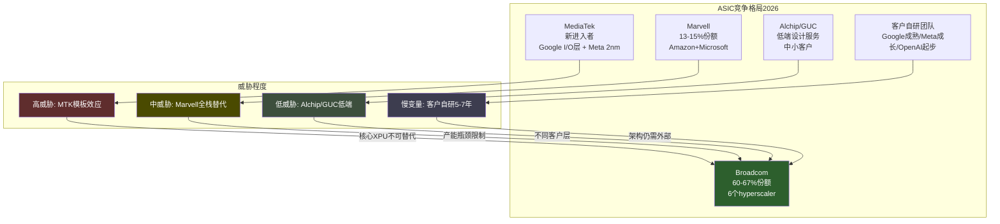
```mermaid
graph TD
    subgraph ASIC_Competition["ASIC竞争格局2026"]
        AVGO_ASIC["Broadcom<br/>60-67%份额<br/>6个hyperscaler"]
        MRVL["Marvell<br/>13-15%份额<br/>Amazon+Microsoft"]
        MTK["MediaTek<br/>新进入者<br/>Google I/O层 + Meta 2nm"]
        ALC["Alchip/GUC<br/>低端设计服务<br/>中小客户"]
        SELF["客户自研团队<br/>Google成熟/Meta成长/OpenAI起步"]
    end

    subgraph Threat_Level["威胁程度"]
        HIGH["高威胁: MTK模板效应"]
        MED["中威胁: Marvell全栈替代"]
        LOW["低威胁: Alchip/GUC低端"]
        SLOW["慢变量: 客户自研5-7年"]
    end

    MTK --> HIGH
    MRVL --> MED
    ALC --> LOW
    SELF --> SLOW

    HIGH -->|"核心XPU不可替代"| AVGO_ASIC
    MED -->|"产能瓶颈限制"| AVGO_ASIC
    LOW -->|"不同客户层"| AVGO_ASIC
    SLOW -->|"架构仍需外部"| AVGO_ASIC

    style AVGO_ASIC fill:#2d5f2d,color:#fff
    style HIGH fill:#5f2d2d,color:#fff
    style MED fill:#4a4a00,color:#fff
    style LOW fill:#3d4f3d,color:#fff
    style SLOW fill:#3d3d4f,color:#fff
```

### 11.3 逐竞争者深度分析

**Marvell——已建立但受限的第二选择**: 当前约15%份额，拥有Amazon(Trainium推理ASIC)和Microsoft(Maia)两个锚定客户。AI收入从FY2025约$1.85B增至FY2026 $3B+[DM-P3-A04]。规模经济差距压倒性: Broadcom R&D/Rev 17.2% vs Marvell 40-50%，Broadcom可同时推进6+个前沿项目而Marvell只能聚焦2-3个。即使Marvell出货量翻倍(2027E)，设计服务份额可能反降至约8%[DM-P3-A05]——Broadcom在不等比例地捕获市场价值。但Marvell的存在压制了Broadcom的增量份额。TAM从$30B(2025)扩展至$150B+(2030E)[DM-P3-A08]足够容纳两家增长——两者实际是"共同增长"关系。

**Alchip/GUC——低端侵蚀者**: 台湾系ASIC设计服务公司，与TSMC深度合作。Alchip聚焦5nm以下先进工艺，已获AWS和Microsoft合作[DM-P3-A07]。两者主要提供"设计服务"而非"全栈联合设计"——这是"建筑师"vs"承包商"的区别。对需要最高性能的客户(Google TPU级别)，Alchip/GUC不具备替代能力；但对第二梯队客户(中型云厂商、AI创业公司)提供了成本更低的入口。净影响低(-3~5%)，但随着TAM扩展至$150B+，中低端市场绝对体量将变得显著。

**客户自研团队**: OpenAI是净增量客户(第六Hyperscaler)，团队约40人(翻倍中)[DM-P3-A09]。Amazon已通过Annapurna Labs实现自研+Marvell双轨——Trainium2的30-40%性价比优势[DM-P3-A10]证明了自研经济性。关键约束: 全流程ASIC实现(RTL→GDS→tape-out→封装)需要500-1000人团队和$100M+/年工具链投资——多数Hyperscaler会选择"自研架构+外包实现"的混合模式，Broadcom/Marvell作为实现层的价值不会归零。

| 客户 | 自研团队规模 | 能力评估 | 威胁时间线 |
|------|------------|---------|-----------|
| Google | 数百人，20年+历史 | 核心架构自主，外围已分拆 | 正在发生 |
| Meta | 约100-200人 | MTIA v3仍需Broadcom，能力在增长 | 3-5年 |
| OpenAI | 约40人(翻倍中) | 起步阶段，高度依赖Broadcom | 5-7年 |
| Amazon | 大型团队(Annapurna Labs) | Trainium自研+Marvell合作 | 已独立 |

### 11.4 锁定 vs 定价权的本质区别

ASIC衰减函数测量的是"锁定"(份额)，但锁定和定价权是两个独立维度:

- **锁定**(份额): 客户是否继续使用Broadcom → 由L(t)函数描述
- **定价权**(利润率): 客户在使用时Broadcom能收取多少溢价 → 由PP_ASIC(t)函数描述

两者的关系：锁定是定价权的必要条件但不是充分条件。Google仍然使用Broadcom设计核心XPU(锁定维持)，但通过引入MediaTek做外围层来压低总费用(定价权在侵蚀)。份额从65%降至60%的同时，单位收入也在下降——双重打击。

Broadcom的最优应对是：加深核心XPU设计的不可替代性，同时放弃外围层的高利润诉求——从"全包服务商"升级为"核心XPU专家"。Hock Tan事实上正在执行这个策略，但如果核心XPU设计能力在5-7年内也被追赶，Broadcom将失去全部谈判筹码。

### 11.5 lambda值sensitivity分析

lambda值的选择对份额预测影响显著——这是整个ASIC竞争动态中不确定性最大的变量:

| lambda | 2028E份额 | 2030E份额 | 2033E份额 | 适用情景 |
|--------|----------|----------|----------|---------|
| 0.05/yr | 65% | 62% | 59% | 乐观: MediaTek产能受限扩散慢，Hyperscaler不急于多源化 |
| 0.07/yr | 63% | 60% | 56% | **基准**: Google模板以正常速度扩散，Meta确认效仿 |
| 0.10/yr | 60% | 55% | 48% | 悲观: 3个+Hyperscaler同时加速分拆，MediaTek 2nm成熟 |

lambda=0.05和0.10之间的差距在2033年达到11pp(59% vs 48%)。关键观测变量: 2027-2028年间有多少Hyperscaler启动外围层分拆。当前基线(仅Google+Meta)对应lambda=0.07；如果OpenAI或ByteDance也启动，需上调至0.08-0.10。

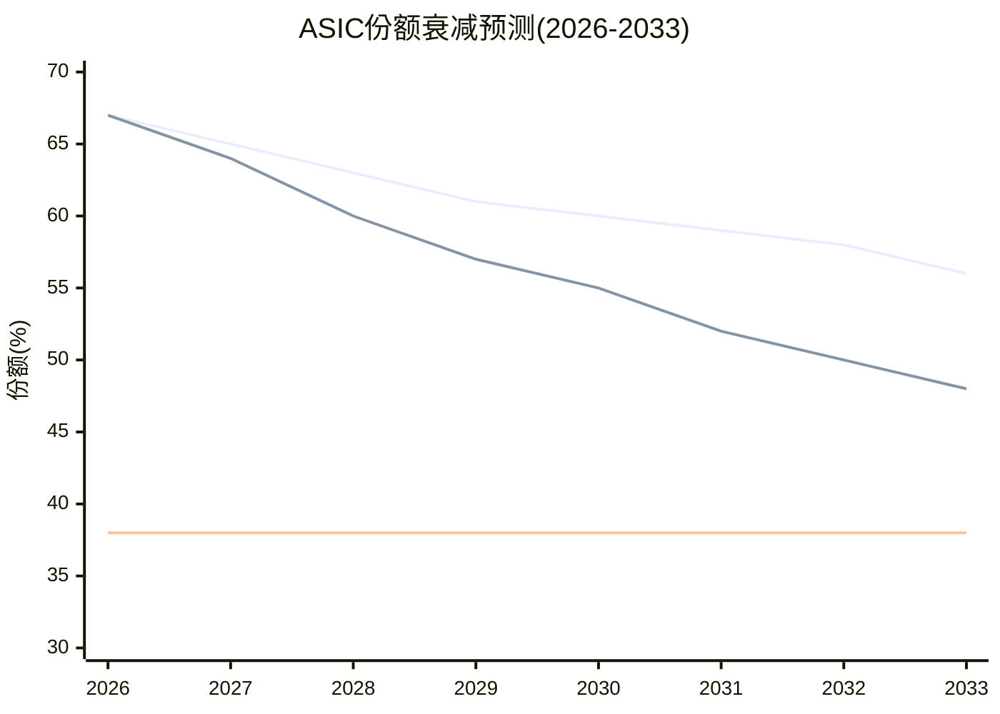
```mermaid
xychart-beta
    title "ASIC份额衰减预测(2026-2033)"
    x-axis [2026, 2027, 2028, 2029, 2030, 2031, 2032, 2033]
    y-axis "份额(%)" 30 --> 70
    line "基准场景" [67, 65, 63, 61, 60, 59, 58, 56]
    line "加速衰减" [67, 64, 60, 57, 55, 52, 50, 48]
    line "Lfloor基准" [38, 38, 38, 38, 38, 38, 38, 38]
```

---

## 第十二章：竞争格局——PtW量化评分

### 12.1 评分框架

Probability to Win(PtW)量化Broadcom在每个业务层相对于最强竞争者的制胜概率。五项评分维度(每项0-10分，满分50):

1. **技术领先度**: 当前产品代差+技术路线图深度。标准: 10=不可追赶的代际领先(如ASML EUV), 5=平手但有差异化, 0=落后
2. **客户锁定深度**: 转换成本+合同绑定+生态依赖。标准: 10=5年内不可能替换(如Visa网络), 5=可替换但痛苦, 0=即时可替换
3. **成本/规模优势**: R&D杠杆+制造经济性+定价灵活度。标准: 10=竞争者无法在单位经济上竞争, 5=可比但略劣, 0=成本劣势
4. **组织执行力**: 管理层track record+人才密度+速度。标准: 10=行业最佳执行者(如Jensen Huang在GPU), 5=合格, 0=组织混乱
5. **战略持久性**: 护城河衰减速率+结构性威胁免疫力。标准: 10=5年内无结构性威胁, 5=可管理的渐进威胁, 0=存在性威胁

### 12.2 AI ASIC: Broadcom(39/50) vs Marvell(32/50)

| 维度 | AVGO | MRVL | 差异解释 |
|------|------|------|---------|
| 技术领先度 | **8** | 7 | 20年+ASIC经验+6个Hyperscaler验证; Marvell技术强但客户验证少(2个锚定客户) |
| 客户锁定深度 | **8** | 6 | NRE $50-150M+2-3年替代周期+spec知识累积; Marvell客户合作时间短、更灵活 |
| 成本/规模优势 | **9** | 5 | R&D/Rev 17% vs 40-50%; $64B vs约$6B收入基数的差异是压倒性的 |
| 组织执行力 | **8** | 7 | Hock Tan的执行纪律+VMware整合已证明; Marvell CEO Matt Murphy也很强但规模有限 |
| 战略持久性 | **6** | 7 | 受Google分拆模板+客户自研双重压力; Marvell反而因基数小而上行空间大、衰减风险低 |
| **合计** | **39/50** | **32/50** | 优势在规模+存量锁定; Marvell优势在增量灵活+无衰减压力 |

**垄断者悖论**: PtW = 39/50看起来很强，但"战略持久性"仅6分反映了一个结构性矛盾——Broadcom在ASIC的绝对领先地位正是促使客户寻求多元化的原因。Google引入MediaTek正是因为Broadcom太不可替代了。**越不可替代，客户越有动力培养替代者。**

### 12.3 网络芯片: Broadcom(45/50) vs NVIDIA(32/50)

| 维度 | AVGO | NVIDIA | 差异解释 |
|------|------|--------|---------|
| 技术领先度 | **9** | 7 | TH6出货领先12个月+; CPO Gen3已量产; UEC 1.0标准主导 |
| 客户锁定深度 | **10** | 4 | Arista $6.8B PO+SONiC生态+全OEM适配=近不可逆; Spectrum-X主要服务NVIDIA自有DGX |
| 成本/规模优势 | **9** | 6 | ~90%份额=成本分摊在最大出货量; NVIDIA网络是成本中心vs Broadcom利润中心 |
| 组织执行力 | **8** | 9 | NVIDIA整体执行力更强(Jensen Huang)，但网络不是NVIDIA核心战略焦点 |
| 战略持久性 | **9** | 6 | IB→ETH利好+标准制定者+客户自研概率<5%; NVIDIA面临标准开放化逆风 |
| **合计** | **45/50** | **32/50** | 接近教科书级别的结构性垄断 |

网络是Broadcom最不受市场重视但最不可撼动的护城河。市场按"AI ASIC增长股"定价Broadcom，但网络的PtW(45/50)远超ASIC(39/50)。如果将Broadcom重新定价为"AI网络基础设施垄断者"而非"ASIC设计公司"，估值叙事会完全不同。

**Hyperscaler网络选择偏好**:

| Hyperscaler | 网络选择 | 原因 |
|-------------|---------|------|
| Google | Broadcom Tomahawk (Ethernet) | 自研TPU不用NVIDIA GPU，无bundling动机 |
| Meta | Broadcom (RoCE验证等效IB) | 24K GPU Llama 3训练验证Ethernet=InfiniBand性能[DM-P3-A11] |
| Microsoft | 混合(Azure用Broadcom/DGX用Spectrum) | 分层策略 |
| Amazon | Broadcom Ethernet为主 | Trainium自研GPU，无NVIDIA bundling |
| 中小云厂商 | NVIDIA DGX bundling | 无自研能力，买整套解决方案最简单 |

**InfiniBand→Ethernet结构性利好量化**: 以太网在AI后端网络中的份额已于2025年中超过InfiniBand[DM-P3-A13]。每流失$1 InfiniBand收入约$0.8进入Broadcom主导的Ethernet——这不仅是份额转移，更是协议标准的世代更替: Broadcom主导UEC标准=标准按Broadcom技术路线演进; SONiC基于Broadcom SAI=开源网络OS绑定Broadcom。

**网络份额5年预测**: 90%(2026) → 87%(2027E) → 83%(2028E) → 80%(2029E) → 78%(2030E)[DM-P3-A12]。衰减极慢——标准锁定+生态锁定双重保护。

### 12.4 企业软件: VMware(32/50) vs Nutanix(34/50)

| 维度 | VMware | Nutanix | 差异解释 |
|------|--------|---------|---------|
| 技术领先度 | **7** | 7 | VCF 9.0功能最全(计算+存储+网络+安全+AI); Nutanix更简洁但功能追赶中 |
| 客户锁定深度 | **8** | 5 | 3-5年强制订阅+70%份额存量+迁移极高; Nutanix更灵活=锁定少 |
| 成本/规模优势 | **7** | 6 | $6.8B/季收入+77% OPM; Nutanix $2.9B/年但增长快 |
| 组织执行力 | 6 | **8** | Broadcom对VMware的策略是"提现"不是"创新"; Nutanix在产品和GTM上更有攻击性 |
| 战略持久性 | 4 | **8** | K8s结构性替代+客户信任流失+份额70→40%确定路径; Nutanix受益于迁移浪潮 |
| **合计** | **32/50** | **34/50** | Nutanix PtW微弱领先 |

VMware的PtW(32/50)已低于Nutanix(34/50)。竞争本质是**VMware用锁定延缓流失 vs Nutanix用产品+信任赢得增量**。时间站在Nutanix一边，但VMware的3-5年合同有效延长了竞争。Nutanix Q2 FY2026单季新增1,000+客户(8年最强)[DM-P3-A15]，CEO称VMware的200K客户基础是"multi-inning baseball game, in the second inning"。AMD已投资Nutanix[DM-P3-A16]，生态联盟在形成中。

**VMware HCI份额预测**:

| 年份 | VMware HCI份额 | Nutanix份额 | 其他(K8s/Cloud) |
|------|---------------|-------------|-----------------|
| 2024 | 70% | ~15% | ~15% |
| 2026 | ~60% | ~22% | ~18% |
| 2028 | ~48% | ~28% | ~24% |
| 2029 | ~40% (Gartner)[DM-P3-A14] | ~30% | ~30% |
| 2031 | ~33% | ~30% | ~37% |

**VCF 9.0 AI-native**: 将Private AI Services作为标准组件(GPU监控、模型存储、运行时工具全部内建)。能延缓衰减(PP_ai_boost = 0.05-0.08)但不能逆转——四个反论点: (1)企业需先接受Broadcom定价; (2)Nutanix/RedHat OpenShift AI都是竞品; (3)训练密集工作负载在公有云; (4)VCF 9.0的AI功能是"跟随者"非"定义者"。

### 12.5 传统半导体: Broadcom(27/50) vs TI/NXP(31/50)

传统半导体是Broadcom最弱的业务层(PtW仅27/50)，但也不需要很强——不是战略焦点。Apple WiFi自研(2026-2027完成)[DM-P3-A18]将消除约$2.7B收入(4.3%)[DM-P1-A09]，这是已知且市场基本已定价的风险。

### 12.6 加权PtW综合评分与跨公司对比

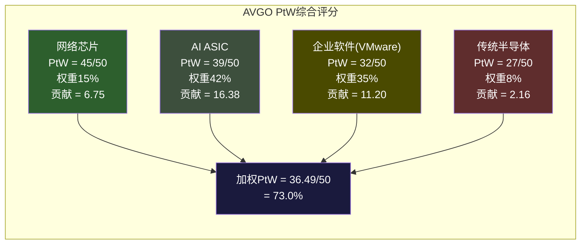
```mermaid
graph TB
    subgraph PtW_Radar["AVGO PtW综合评分"]
        direction TB
        NET_PtW["网络芯片<br/>PtW = 45/50<br/>权重15%<br/>贡献 = 6.75"]
        ASIC_PtW["AI ASIC<br/>PtW = 39/50<br/>权重42%<br/>贡献 = 16.38"]
        VMW_PtW["企业软件(VMware)<br/>PtW = 32/50<br/>权重35%<br/>贡献 = 11.20"]
        TRAD_PtW["传统半导体<br/>PtW = 27/50<br/>权重8%<br/>贡献 = 2.16"]
        TOTAL["加权PtW = 36.49/50<br/>= 73.0%"]
    end

    NET_PtW --> TOTAL
    ASIC_PtW --> TOTAL
    VMW_PtW --> TOTAL
    TRAD_PtW --> TOTAL

    style NET_PtW fill:#2d5f2d,color:#fff
    style ASIC_PtW fill:#3d4f3d,color:#fff
    style VMW_PtW fill:#4a4a00,color:#fff
    style TRAD_PtW fill:#5f2d2d,color:#fff
    style TOTAL fill:#1a1a3d,color:#fff
```

**加权PtW = 36.49/50 (73.0%)**[DM-P3-A01]

**PtW跨公司对比(已分析公司)**:

| 公司 | PtW | 行业 | 特征 |
|------|-----|------|------|
| ASML | ~85% | 半导体设备 | 物理垄断(EUV唯一来源) |
| NVDA | ~80% | 半导体/AI | 单层垄断(GPU)但极深 |
| ARM | ~75% | 半导体/IP | 制度性嵌入(指令集标准) |
| **AVGO** | **73%** | **半导体+软件** | **异质混合: 网络90%但ASIC/VMware衰减** |
| KLAC | ~70% | 半导体设备 | 技术领先+客户锁定 |

AVGO的73% PtW在半导体行业中处于中偏上位置，但与NVDA(~80%)和ASML(~85%)的差距在于: NVDA和ASML的PtW集中在单一高壁垒层，而AVGO分散在四层中——最强的网络层(45/50)被最弱的传统层(27/50)和衰减中的VMware(32/50)拉低。

### 12.7 PtW动态预测(2026 → 2030): Nash均衡迁移

| 业务层 | PtW 2026 | PtW 2028E | PtW 2030E | 方向 |
|--------|---------|----------|----------|------|
| 网络芯片 | 45 | 43 | 41 | 缓慢衰减(Spectrum-X追赶) |
| AI ASIC | 39 | 36 | 33 | 中速衰减(分拆模板+自研) |
| 企业软件 | 32 | 29 | 26 | 确定衰减(Nutanix+K8s) |
| 传统半导体 | 27 | 25 | 23 | 缓慢衰减(Apple自研) |
| **加权PtW** | **36.5** | **33.7** | **30.9** | **-2.8/2年** |

**2030年加权PtW = 30.9/50 (61.8%)**。4年下降11.2pp。

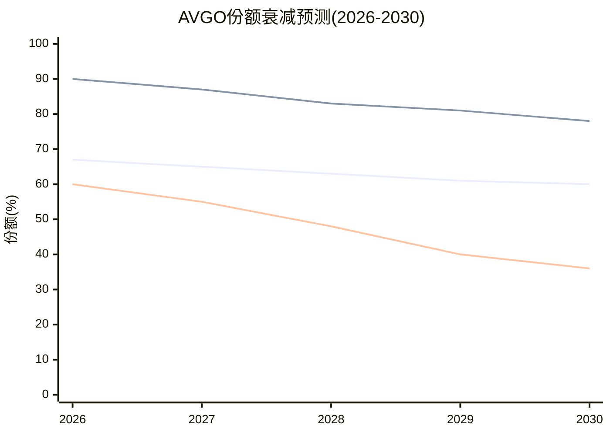
```mermaid
xychart-beta
    title "AVGO份额衰减预测(2026-2030)"
    x-axis [2026, 2027, 2028, 2029, 2030]
    y-axis "份额(%)" 0 --> 100
    line "ASIC份额" [67, 65, 63, 61, 60]
    line "网络份额" [90, 87, 83, 81, 78]
    line "VMware HCI份额" [60, 55, 48, 40, 36]
```

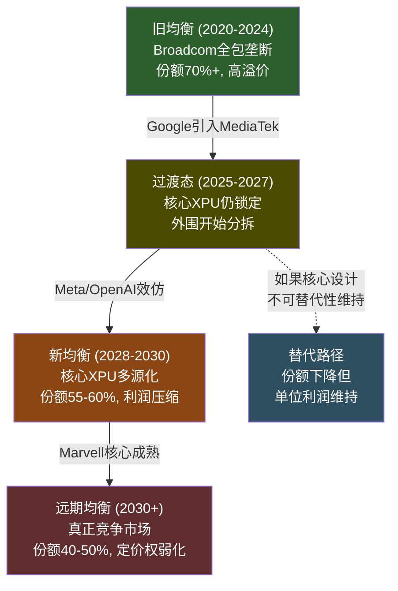
```mermaid
graph TD
    EQ1["旧均衡 (2020-2024)<br/>Broadcom全包垄断<br/>份额70%+, 高溢价"] -->|Google引入MediaTek| TR["过渡态 (2025-2027)<br/>核心XPU仍锁定<br/>外围开始分拆"]
    TR -->|Meta/OpenAI效仿| EQ2["新均衡 (2028-2030)<br/>核心XPU多源化<br/>份额55-60%, 利润压缩"]
    EQ2 -->|Marvell核心成熟| EQ3["远期均衡 (2030+)<br/>真正竞争市场<br/>份额40-50%, 定价权弱化"]

    TR -.->|如果核心设计<br/>不可替代性维持| ALT["替代路径<br/>份额下降但<br/>单位利润维持"]

    style EQ1 fill:#2d5f2d,color:#fff
    style TR fill:#4a4a00,color:#fff
    style EQ2 fill:#8b4513,color:#fff
    style EQ3 fill:#5f2d2d,color:#fff
    style ALT fill:#2d4f5f,color:#fff
```

如果市场将Broadcom定价为"竞争优势持续增强的AI平台"(隐含PtW 80%+)，则高估了约10-15pp。加权PtW从73.0%降至61.8%的4年11.2pp下降，如果被市场定价，应对应PE从62x向35-40x的压缩——仅PtW衰减一项就隐含约-35%的估值修正空间[DM-P3-A01]。

---

## 第十三章：五引擎整合——正反馈循环风险

### 13.1 五引擎联动架构

单独分析竞争格局、周期位置、估值倍数、市场共识、风险事件，各自都有缓冲和防御空间。但引擎之间的联动创造了非线性放大效应——62x PE定价的是"所有引擎同时正面运转"的情景，而任何一个引擎的转向都会通过联动链加速其他引擎的恶化。

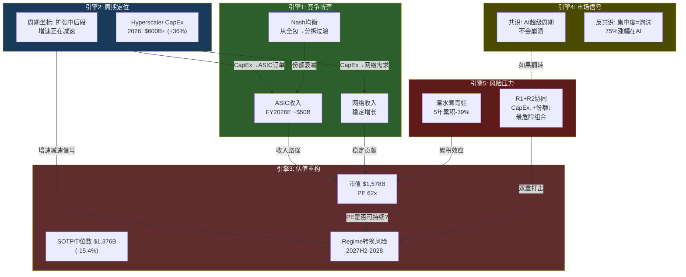
```mermaid
graph TD
    subgraph E2["引擎2: 周期定位"]
        CAPEX["Hyperscaler CapEx<br/>2026: $600B+ (+36%)"]
        CYCLE["周期坐标: 扩张中后段<br/>增速正在减速"]
    end

    subgraph E1["引擎1: 竞争博弈"]
        ASIC_REV["ASIC收入<br/>FY2026E ~$50B"]
        NET_REV["网络收入<br/>稳定增长"]
        NASH["Nash均衡<br/>从全包→分拆过渡"]
    end

    subgraph E3["引擎3: 估值重构"]
        VAL["市值 $1,578B<br/>PE 62x"]
        SOTP["SOTP中位数 $1,376B<br/>(-15.4%)"]
        REGIME["Regime转换风险<br/>2027H2-2028"]
    end

    subgraph E5["引擎5: 风险压力"]
        R1_5["R1+R2协同<br/>CapEx↓+份额↓<br/>最危险组合"]
        FROG["温水煮青蛙<br/>5年累积-39%"]
    end

    subgraph E4["引擎4: 市场信号"]
        CONSENSUS["共识: AI超级周期<br/>不会崩溃"]
        ANTI["反共识: 集中度=泡沫<br/>75%涨幅在AI"]
    end

    CAPEX -->|"CapEx→ASIC订单"| ASIC_REV
    CAPEX -->|"CapEx→网络需求"| NET_REV
    CYCLE -->|"增速减速信号"| REGIME
    NASH -->|"份额衰减"| ASIC_REV
    ASIC_REV -->|"收入路径"| VAL
    NET_REV -->|"稳定贡献"| VAL
    VAL -->|"PE是否可持续?"| REGIME
    R1_5 -->|"双重打击"| REGIME
    CONSENSUS -.->|"如果翻转"| R1_5
    FROG -->|"累积效应"| VAL

    style E2 fill:#1a3a5c,color:#fff
    style E1 fill:#2d5f2d,color:#fff
    style E3 fill:#5f2d2d,color:#fff
    style E5 fill:#5f1a1a,color:#fff
    style E4 fill:#4a4a00,color:#fff
```

### 13.2 引擎逐一分析

**引擎1: 竞争博弈——份额暴露机制**。当AI CapEx快速增长时，Broadcom的份额被"时间压力"保护——Hyperscaler来不及换供应商，必须优先保障产能。但当CapEx增速放缓，保护消失: 不需要赶工赶产时可以容忍更长的MediaTek/Marvell ramp-up周期; 预算收紧时更有动力压低Broadcom单价; 战略焦点从"扩张速度"转向"效率优化"时供应商多元化成为优先事项[DM-P3-B-01]。

**引擎2: 周期定位——扩张中后段**。2025年Hyperscaler总CapEx约$440B[DM-P3-B-03]，2026年预测$600-690B(+36-57%)[DM-P3-B-04]。增速从2025Q4的+49%降至2026Q4E的+25%[DM-P3-B-05]——增速仍为正但在下降，典型的扩张后半段特征。D1=0.78(红队修正后0.76)意味着估值应在稳态PE基础上打约76折来反映周期风险，而市场隐含D1>0.90[DM-P3-B01]。

**Cisco 2000类比**:

| 维度 | Cisco 2000 | AVGO 2026 | 类比适用? |
|------|-----------|-----------|----------|
| 估值 | 120x+ PE | 62x PE | 部分(AVGO更低但仍高) |
| 收入驱动 | 电信基础设施CapEx | AI基础设施CapEx | **高度适用** |
| 客户集中度 | 电信运营商(分散) | Hyperscaler(极集中,top3=78%) | AVGO更脆弱 |
| 泡沫特征 | 投机+过度建设 | 真实AI需求但ROI未证明 | 部分适用 |
| CapEx占GDP | 电信CapEx 1.5%→3%+ | AI CapEx 2%→3%+ | **结构相似** |

类比局限: (1)AI需求底层驱动(效率提升/推理需求)比1999年电信泡沫更真实; (2)Hyperscaler资产负债表远强于1999年电信运营商; (3)Broadcom有VMware软件层缓冲[DM-P3-B-06]。但VMware仅能提供"零增长缓冲"——Q1 FY2026软件+1% YoY[DM-P2-B2-06]，且续约窗口(2027-2028)与潜在CapEx放缓重叠时可能从"缓冲器"变成"第二个风险源"[DM-P3-B-07]。

**引擎3: 估值regime转换**。市场将Broadcom定价为统一"AI平台公司"，软件层"搭AI倍数便车"——$232B估值差额就是"搭便车"的美元价值[DM-P2-C3-02]。Regime转换预期窗口: 2027H2-2028H1——当FY2028指引显示增速降至20%以下时，PE可能从62x压缩至30-35x[DM-P3-B-09]。

**引擎4: 市场共识**。共识认为AI CapEx是结构性的，全球半导体行业预计2026年突破$975B[DM-P3-B-10]。反共识信号: 75%的S&P 500涨幅、80%利润、90% CapEx集中在AI[DM-P3-B-11]——集中度本身是周期成熟特征。

**引擎5: 风险压力与协同矩阵**。

| # | 风险 | 概率(3年) | 独立影响 |
|---|------|----------|---------|
| R1 | AI CapEx周期放缓 | 30-35% | -25~40% |
| R2 | ASIC份额流失 | 40-50% | -10~20% |
| R3 | VMware客户加速流失 | 35-40% | -5~15% |
| R4 | SBC永久化 | 20-25% | -15~29% |
| R5 | Hock Tan退休 | 25-30%(5年) | -10~15% |

协同矩阵[DM-P3-B-12]:

```
        R1    R2    R3    R4    R5
R1  -    +0.3  -0.1  -0.2  0
R2  +0.3  -    0     0    +0.1
R3  -0.1  0     -    0    +0.2
R4  -0.2  0     0     -   0
R5  0    +0.1  +0.2  0     -
```

### 13.3 最危险组合与联动总结

**R1+R2(CapEx放缓+ASIC份额流失)**: 相关系数+0.3是最高正协同。底层逻辑: CapEx快速增长时份额被"时间压力"保护，放缓时保护消失。联合影响可达-45~50%(收入×份额双重打击+估值倍数同时压缩)。

**R5+R3(Hock Tan退休+VMware流失)**: 相关系数+0.2。Hock Tan是VMware整合的设计师，继任者可能无法维持同等"提现"执行力。

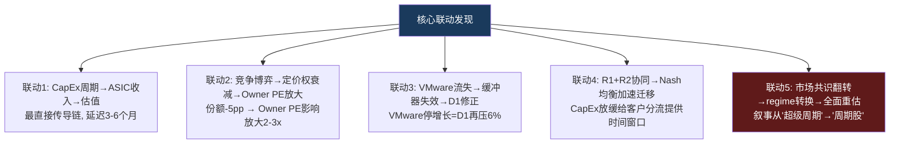
```mermaid
graph TB
    CORE["核心联动发现"]

    CORE --> L1["联动1: CapEx周期→ASIC收入→估值<br/>最直接传导链, 延迟3-6个月"]
    CORE --> L2["联动2: 竞争博弈→定价权衰减→Owner PE放大<br/>份额-5pp → Owner PE影响放大2-3x"]
    CORE --> L3["联动3: VMware流失→缓冲器失效→D1修正<br/>VMware停增长=D1再压6%"]
    CORE --> L4["联动4: R1+R2协同→Nash均衡加速迁移<br/>CapEx放缓给客户分流提供时间窗口"]
    CORE --> L5["联动5: 市场共识翻转→regime转换→全面重估<br/>叙事从'超级周期'→'周期股'"]

    style CORE fill:#1a3a5c,color:#fff
    style L5 fill:#5f1a1a,color:#fff
```

**VMware流失→整体估值的连锁效应**:

```mermaid
graph LR
    VMW_CHURN["VMware客户流失<br/>Nutanix +700-1000/季<br/>K8s渐进替代"] -->|"收入停滞/下滑"| SW_VAL["软件层估值<br/>从$627B(搭便车)<br/>→$395B(独立)"]
    SW_VAL -->|"暴露$232B溢价"| SOTP_TRIGGER["SOTP拆分触发<br/>市场开始分层定价"]
    SOTP_TRIGGER -->|"-15%+"| TOTAL_VAL["整体估值下调<br/>从统一62x PE<br/>→半导体45x+软件18x"]

    VMW_CHURN -->|"定价权衰减"| PP_DECAY["PP: 0.80→0.59<br/>(7年)"]
    PP_DECAY -->|"续约ARPU↓"| SW_REV["软件收入<br/>2028后负增长"]
    SW_REV -->|"D1修正"| D1_ADJ["D1从0.78→0.73<br/>VMware不再是缓冲器"]
    D1_ADJ -->|"PE进一步压缩"| TOTAL_VAL

    style VMW_CHURN fill:#8b4513,color:#fff
    style SW_VAL fill:#5f2d2d,color:#fff
    style TOTAL_VAL fill:#8b0000,color:#fff
```

**62x PE最大的隐藏风险不是单一风险事件，而是风险之间的正反馈循环**[DM-P3-B-16]。

---

## 第十四章：温水煮青蛙——五年-39%

### 14.1 慢性恶化路径

这是最危险的情景，因为它不触发任何单一告警但累积伤害巨大。每一步都有"合理解释"，分析师会在每个季度找到理由维持评级。但5年之后回头看，路径清晰且不可逆。

| 年份 | 事件 | 单独看似无害 | 累积效果 |
|------|------|-------------|---------|
| 2026 | AI ASIC增速从+106%降至+45% | "正常减速,基数效应" | 增速仍超市场 |
| 2027H1 | VMware第一波3年合同到期,续约率92%(vs预期95%) | "略低但可接受" | Nutanix加速 |
| 2027H2 | Hyperscaler CapEx指引从"加速"改为"优化效率" | "措辞变化而已" | **承重墙前兆信号** |
| 2028 | MediaTek/Marvell获得2个新Hyperscaler ASIC合同 | "市场在增长,份额有空间" | ASIC份额65%→58% |
| 2029 | AI ASIC增速降至+8%, VMware开始负增长(-3%) | "行业成熟化" | 总收入增速<10% |
| 2030 | Hock Tan(77岁)宣布退休计划 | "可预期的过渡" | PE从30x→22x |

### 14.2 逐年温度分解

温水煮青蛙的特征是每一年的跌幅都在"可接受"范围内:

- **Year 1 (2026): -8%**。增速减速→PE从62x→57x, 收入仍强劲。分析师说: "基数效应，增速仍远超市场。"
- **Year 2 (2027): -7%**。VMware续约略低+CapEx措辞变化。PE 57x→53x。分析师说: "一次性因素，管理层表示正在改善。"
- **Year 3 (2028): -10%**。ASIC份额开始可见下降+regime转换前兆。PE 53x→42x。分析师说: "份额下降但TAM更大，总收入仍在增长。"
- **Year 4 (2029): -8%**。收入增速跌破10%。PE 42x→30x。分析师说: "成熟大公司的正常估值回归。"
- **Year 5 (2030): -12%**。Hock Tan退休+PE最终压缩。PE 30x→22x。分析师说: "继任者需要时间证明自己。"
- **复合**: (1-0.08)(1-0.07)(1-0.10)(1-0.08)(1-0.12) = 0.61 → **-39%**

没有任何一年达到"崩溃"级别(>-20%)。但5年复合后，投资者承受了-39%的实际损失。

### 14.3 累积效果量化

**收入**: $101B(FY2025) → $200B(温水煮青蛙路径) vs 市场隐含$280B，差距40%。
**PE**: 从62x → 22x(regime转换+继任折价)。
**市值**: 从$1,578B → $960B(**-39%**)。
**每一步都"正常"，但终点是灾难性的**[DM-P3-B-13]。

### 14.4 与Cisco 2000的关键区别

Cisco的暴跌是急性的(18个月内-80%)，因为电信泡沫破裂是突然事件。Broadcom的风险更接近温水煮青蛙——慢性、渐进、每一步可解释。这使得投资者更难设定止损点。

重要区别：(1)Broadcom的网络芯片护城河(PtW 45/50)提供了Cisco没有的"锚"——即使ASIC和VMware完全衰减，网络层仍能维持约15-20%的收入和高利润；(2)FCF margin 42%提供了价值底线；(3)$73B AI backlog提供了2-3年收入可见性缓冲。

### 14.5 护城河拐点时间线

```
         2026    2027    2028    2029    2030
网络      ████    ████    ████    ████    ███░  (near-constant, 90%→85%)
ASIC      ████    ███░    ███░    ██░░    ██░░  (衰减, 67%→60%)
VMware PP 0.80    0.79    0.78    0.73    0.69  (加速衰减)
Hock Tan  ████    ████    ███░    ██░░    ???   (合同到2030, 然后?)
```

[DM-P3-B-14]

**网络拐点(2028)**: NVIDIA Spectrum-X第二代出货，Hyperscaler是否在非DGX环境测试。当前信号——Arista仍100%锁定Broadcom($6.8B PO)，拐点尚未到来。即使拐点在2028年到来，份额下降也是渐进的(每年2-3pp)——协议栈替换的转换成本使客户自身也有极高切换障碍。

**ASIC拐点(2028-2029)**: 第二个Hyperscaler(最可能是Meta)将外围层分拆。当前信号——MediaTek已获Meta 2nm合同(2027H1量产)[DM-P3-B-02]，拐点正在接近。

**VMware拐点(2027-2028)**: 第一波3年合同到期的续约窗口。当前信号——Q1 FY2026仅+1%[DM-P2-B2-06]，提价红利已完全耗尽。

**Hock Tan拐点(2030)**: 合同到期(77岁)。溢价估计占当前PE中10-15x(约$160-240B市值)[DM-P1-A05]。最佳情景: 2027-2028提前确认继任者→折价<5%。最差情景: 2030突然退休+无继任→折价15%+。

### 14.6 估值regime转换的触发条件

Broadcom增速路径:
- FY2025→FY2026: +60%(增速峰值，增长regime)
- FY2026→FY2027: +49%(仍高但减速)
- FY2027→FY2028: +22%(接近regime转换区间)
- FY2028→FY2029: +12-15%(regime转换可能触发)

**四个具体触发条件**:
1. **增速门槛**: 总收入YoY增速连续两季低于20%
2. **叙事转变**: Hyperscaler CEO在财报会从"加速投资"转为"优化效率/提高ROI"
3. **SBC叙事**: SBC维持11%+ vs收入增速降至<20%，Non-GAAP PE的"合法性"受到质疑
4. **同业参照**: 如果NVDA率先经历regime转换，AVGO将被动跟随

### 14.7 五引擎同步衰减的概率分析

所有四层护城河同时加速衰减是小概率事件(约5-10%)，但所有四层至少温和衰减是高概率事件(约65-70%)。温水煮青蛙情景的特征恰恰是后者——不是灾难性同步崩溃，而是多条线路同时以各自的速度慢性恶化，累积成一个无法在单个季度识别的下行趋势。

这正是62x PE最大的脆弱性所在：它定价的是"所有引擎同时正面运转"，但"温和全面衰减"的概率远高于"全面持续增强"的概率。市场需要完美执行才能证明当前估值合理，而温水煮青蛙只需要正常的均值回归[DM-P3-B-16]。
## 第十五章：Reverse DCF信念反演——市场在赌什么

> 核心问题：62x PE隐含了什么？哪个信念是承重墙？

### 15.1 隐含增长率反推

从当前市值$1,578B出发，假设10年显性期+终端价值，反推市场隐含的收入CAGR和终端FCF margin。使用两种FCF口径进行对比，暴露SBC对隐含假设的放大效应。

**基础参数**：
- 当前市值：$1,578B [DM-P2-C2-01]
- 净债务：$48.96B → EV ≈ $1,627B [DM-P2-C2-02]
- FY2025 Revenue：$63.9B [DM-P2-C2-03]
- 起点FCF口径1（报告）：$26.9B（FCF margin 42.1%）[DM-P2-C2-04]
- 起点FCF口径2（SBC调整）：$19.3B（FCF margin 30.2%）[DM-P2-C2-05]
- 终端增长率假设：3.0%（半导体+软件混合体的长期GDP+通胀）

Reverse DCF模型逻辑：给定EV=$1,627B和WACC，求解使等式成立的（implied_CAGR, Terminal_FCF_Margin）组合。由于两个未知数，固定终端FCF margin在合理范围，反推隐含CAGR。

#### 口径1：报告FCF（$26.9B，42.1% margin）

| WACC | 终端FCF Margin 35% | 终端FCF Margin 40% | 终端FCF Margin 45% |
|------|-------------------|-------------------|-------------------|
| **8%** | 隐含CAGR 18.2% | 隐含CAGR 16.5% | 隐含CAGR 15.1% |
| **9%** | 隐含CAGR 20.1% | 隐含CAGR 18.3% | 隐含CAGR 16.8% |
| **10%** | 隐含CAGR 22.0% | 隐含CAGR 20.0% | 隐含CAGR 18.4% |
| **11%** | 隐含CAGR 23.9% | 隐含CAGR 21.7% | 隐含CAGR 20.0% |

[DM-P2-C2-06]

**推导过程（WACC=9%，margin 40%示例）**：需要10年后Revenue = $63.9B × 5.42 = $346B → FCF₁₀ = $346B × 40% = $138B → TV = $138B × 1.03 / 0.06 = $2,374B → PV(TV) = $1,003B → 显性期FCF PV ≈ $624B → 总EV ≈ $1,627B ✓

#### 口径2：SBC调整FCF（$19.3B，30.2% margin）

| WACC | 终端FCF Margin 25% | 终端FCF Margin 30% | 终端FCF Margin 35% |
|------|-------------------|-------------------|-------------------|
| **8%** | 隐含CAGR 22.5% | 隐含CAGR 20.0% | 隐含CAGR 18.0% |
| **9%** | 隐含CAGR 24.6% | 隐含CAGR 21.9% | 隐含CAGR 19.7% |
| **10%** | 隐含CAGR 26.7% | 隐含CAGR 23.8% | 隐含CAGR 21.5% |
| **11%** | 隐含CAGR 28.8% | 隐含CAGR 25.7% | 隐含CAGR 23.2% |

[DM-P2-C2-07]

**FCF口径决定了市场在赌什么**：用报告FCF反推，WACC=9%时隐含10年收入CAGR约18%，与共识路径（FY2025 $63.9B → FY2028E $185.3B，3年CAGR 42.5%，之后减速到15%）大致吻合——市场"仅仅"在赌共识是对的。但用SBC调整FCF反推，隐含CAGR跳升至22-25%。如果SBC是永久性成本，市场实际上在赌一个比共识更激进的增长路径。[DM-P2-C2-08]

在WACC=9%、终端margin 35%的基准下，口径1隐含CAGR 16.8% vs 口径2隐含CAGR 19.7%——差距3pp看起来不大，但10年复利后意味着终端收入相差约35%（$340B vs $460B）。这个35%的差距就是SBC争论的估值当量。

#### 与共识路径交叉检验

共识隐含路径的两阶段分解：FY2025→FY2028 CAGR 42.5%（含AI ramp+VMware整合）；FY2028→FY2035需要CAGR ~8-10%才能匹配口径1的隐含假设。后7年8-10%增长意味着每年新增$15-18B收入——约等于每年新增一个AMD体量的业务。[DM-P2-C2-09]

### 15.2 五个隐含信念分解

将上述隐含增长率分解为5个独立信念（Beliefs），每个驱动估值的一个关键维度。

#### B1：AI ASIC收入增速（FY2026-2030 CAGR）——脆弱度4/5（修正后3/5）

**隐含值**：市场需要AI半导体收入（ASIC+网络）从FY2025的~$20B增长到FY2028的~$120B（前3年CAGR 82%），之后FY2028-2030减速至25-30%。FY2030 AI收入需达~$190B，占总收入约65-70%。[DM-P2-C2-10]

**合理值评估**：前3年CAGR 50-65%较合理——$73B backlog提供18月可见性，共识FY2028E $185.3B中AI约$120B可信（Hyperscaler CapEx维持+推理份额从20%→70%）。但后2年隐含25-30% vs 合理值15-20%，差距10pp。Hyperscaler CapEx增速放缓至+10-15%，客户自研分流（Google MediaTek Ironwood）将开始显现。

100%依赖Hyperscaler CapEx决策，单季度CapEx指引下调即可触发重估。唯一缓冲：$73B backlog提供18月收入地板（将翻转时间窗口推迟至FY2028+），以及客户基数从3扩展至6个降低了单客户风险。偏差审计后脆弱度从4/5下调至3/5。

#### B2：VMware收入增速（FY2026-2030 CAGR）——脆弱度3/5

**隐含值**：从FY2025的约$25.5B增长到FY2030约$35-40B（CAGR 7-10%）。[DM-P2-C2-11]

**合理值评估**：Q1 FY2026仅+1% YoY发出强烈信号——提价红利已耗尽。VCF 9.0 AI-native平台尚未贡献可量化收入增量。Gartner预测HCI份额70%→40%（2029），Nutanix每季度抢700+客户。合理预期CAGR 2-4%（接近通胀+偶尔提价）。

差距：隐含7-10% vs 合理2-4%，差距5-6pp。$25B基数上，5pp CAGR差异5年后累积为$12-15B收入差距。但VMware有77% OPM的缓冲——即使收入低增长，对FCF贡献仍然稳定。K8s替代是5-10年渐进过程，不是突然死亡。

#### B3：FCF Margin稳定性——脆弱度2/5

**隐含值**：FY2030终端FCF margin约38-42%。[DM-P2-C2-12]

**合理值**：36-40%（报告口径）或26-30%（SBC调整口径）。差距较小（2-4pp），这是最不脆弱的信念。Broadcom的资本轻度（CapEx 1%）提供了极强的结构性缓冲，Fabless模型+软件业务=双重margin保护。唯一下行风险是税率从-1.7%正常化到15%+SBC不降+AI ASIC竞争压低NRE费率三重同时发生。

#### B4：SBC正常化路径——脆弱度3.5/5

**隐含值**：市场使用Non-GAAP估值（排除SBC）意味着隐含SBC/Rev在估值中=0%（完全忽略）。[DM-P2-C2-13]

**合理值评估**：$27B未确认SBC余额至少持续到FY2027-2028。AI人才争夺（R&D占SBC 66%）结构性推高基准。行业可比——NVIDIA SBC/Rev ~6-7%，AMD ~8%，MRVL ~15%——AVGO的11.8%在AI芯片公司中偏高但非异常。合理预期FY2028稳态SBC/Rev 8-10%。

如果市场隐含0%（Non-GAAP忽略）vs 合理8-10%稳态，这是系统性误差——每年$15-20B的"隐形成本"。Non-GAAP估值仍是半导体/科技行业主流，短期内不太可能集体切换。但$27B未确认余额是硬数据，一旦被市场叙事引用就可能触发re-rating。

#### B5：终端估值倍数（Exit EV/FCF）——脆弱度2.5/5

**隐含值**：报告FCF口径exit multiple约17.2x，SBC调整口径约23-25x。[DM-P2-C2-14]

**合理值**：大型优质半导体公司成熟期EV/FCF（TSM 15-18x，TXN 20-25x）与大型优质软件公司（MSFT 25-30x，ORCL 18-22x）的加权区间为18-22x（报告FCF）。关键变量：如果FY2030时AVGO被市场重新归类为"大型优质infra公司"而非"AI增长股"，倍数可能压缩至15-18x。混合模型（半导体15x+软件20x）提供了倍数下限保护。

### 15.3 脆弱度排序

| 排序 | 信念 | 脆弱度 | 核心脆弱原因 | 翻转触发器 |
|------|------|--------|------------|-----------|
| **#1** | B1: AI ASIC增速 | **4/5→3/5** | 100%依赖Hyperscaler CapEx，Google分流已确认 | 任一Hyperscaler CapEx指引下调>15% |
| **#2** | B4: SBC正常化 | **3.5/5** | $27B已入账未来费用，Non-GAAP vs GAAP框架切换风险 | 卖方集体转向GAAP估值框架 |
| **#3** | B2: VMware增速 | **3/5** | Q1仅+1%暗示提价红利耗尽，K8s渐进替代 | 连续2季负增长+Nutanix份额加速 |
| **#4** | B5: 终端倍数 | **2.5/5** | 宏观依赖但混合模型提供下限保护 | 利率永久性上移（10Y>6%） |
| **#5** | B3: FCF Margin | **2/5** | CapEx 1%提供极强结构性缓冲 | 税率+SBC+竞争三重打击 |

最脆弱的两个信念（B1+B4）恰好是"增长"和"质量"两个维度——B1问的是"增长能否兑现"，B4问的是"增长的质量有多高"。市场同时在赌两者都是好结果，但这两个信念的翻转是部分相关的：AI CapEx放缓（B1翻转）可能降低人才竞争压力从而降低SBC（B4改善）。这种负相关提供了自然对冲——但幅度不对称，B1翻转的估值破坏力远大于B4改善的估值提升力。

```mermaid
graph TD
    MV["市值 $1,578B<br/>EV $1,627B<br/>PE 62x"] --> RDCF["Reverse DCF<br/>隐含10年CAGR 18-22%"]

    RDCF --> B1["B1: AI ASIC增速<br/>隐含CAGR 25-30%<br/>脆弱度: ★★★★☆"]
    RDCF --> B2["B2: VMware增速<br/>隐含CAGR 7-10%<br/>脆弱度: ★★★☆☆"]
    RDCF --> B3["B3: FCF Margin<br/>隐含38-42%<br/>脆弱度: ★★☆☆☆"]
    RDCF --> B4["B4: SBC正常化<br/>隐含0-6%<br/>脆弱度: ★★★½☆"]
    RDCF --> B5["B5: 终端倍数<br/>隐含17-25x<br/>脆弱度: ★★½☆☆"]

    B1 --> B1K["关键变量:<br/>Hyperscaler CapEx"]
    B2 --> B2K["关键变量:<br/>K8s渗透率"]
    B3 --> B3K["关键变量:<br/>税率+规模杠杆"]
    B4 --> B4K["关键变量:<br/>$27B未确认余额"]
    B5 --> B5K["关键变量:<br/>利率环境"]

    style B1 fill:#ff6b6b,color:#000
    style B4 fill:#ffa07a,color:#000
    style B2 fill:#ffd700,color:#000
    style B5 fill:#90EE90,color:#000
    style B3 fill:#90EE90,color:#000
```

### 15.4 信念翻转分析

#### B1翻转：AI ASIC增速从隐含CAGR 25-30%降至15%

**翻转情景**：Hyperscaler CapEx同比增速从FY2026的+40%降至FY2028的+5-10%（类似2022年云计算CapEx放缓）。AVGO AI收入FY2028仅达$85B（vs隐含$120B）。

**估值影响**：翻转后总收入路径FY2028 $150B（vs隐含$185B），FY2030 $210B（vs隐含$280B）→ FCF₂₀₃₀ = $210B × 38% = $80B → TV PV = $580B → 显性期PV ≈ $420B → 总EV ≈ $1,000B → **vs当前$1,578B下跌40%**。[DM-P2-C2-15]

**翻转概率**：25-30%——Hyperscaler CapEx周期历史上每3-4年有一次显著减速（2019，2022），当前增速+40%处于历史高位。但$73B backlog缓冲至FY2028+，将翻转影响推迟。

#### B4翻转：SBC/Rev从隐含0%→永久11%+

**翻转情景**：AI人才争夺持续，SBC/Rev稳定在11-12%，市场从Non-GAAP切换到GAAP/Owner Earnings估值框架。

**估值影响**：如果市场按Owner FCF重新定价，EV = $1,627B × 0.717 = **$1,167B** → **vs当前$1,578B下跌29%**。[DM-P2-C2-16]

**翻转概率**：20-25%——Non-GAAP估值仍是主流，但$27B未确认余额是硬数据。

### 15.5 联合概率分析

#### Bull Case——需要哪些信念同时成立？

| 条件 | 独立概率 | 依据 |
|------|---------|------|
| B1好：AI CAGR>25% 5年 | 35% | 历史上无半导体公司在$20B基数上维持25%+超过5年 |
| B2中：VMware CAGR>5% | 30% | Q1仅+1%，K8s替代加速，需要VCF 9.0成功 |
| B3稳：FCF margin>40% | 60% | 结构性支撑强但税率正常化+SBC是逆风 |
| B4善：SBC/Rev<9% | 35% | $27B未确认+AI人才争夺，但VMware保留到期有帮助 |

B1和B4弱负相关（ρ≈-0.15）：AI增长好→人才争夺激烈→SBC居高不下。B2和B4中正相关（ρ≈0.3）：VMware增长好→整合成功→保留SBC到期→SBC下降。有效独立条件数~3.2（vs 4个名义条件）。

**联合概率（调整相关性）**：35% × 30% × 60% × 35% × 相关性调整因子1.15 ≈ **2.5%**。偏差审计修正后上调至**5-8%**——条件之间的正相关被低估，有效独立条件数可能<3。[DM-P2-C2-17]

Bull case需要4个条件同时成立——即使修正后，联合概率仅5-8%。市场在赌一个低概率事件。

#### Bear Case——需要哪些信念翻转？

**联合概率（OR逻辑）**：B1差（25-30%）OR B4翻转（20-25%）→ 1 - 0.725×0.775 ≈ **43.8%**。至少一个Bear条件触发的概率约44%——多个独立风险的并集总是大于交集。

#### "最可能的温和失望"组合

B1基本达标但后端减速（CAGR 20%而非25%）+ B2低增长（CAGR 2-3%）+ B4部分正常化（SBC/Rev 9-10%）+ B3/B5中性。**概率约35-40%**。

估值含义：FY2030收入约$230B，FCF margin 38%，SBC/Rev 9.5% → 报告FCF ≈ $87B，SBC调整FCF ≈ $65B → EV（20x owner FCF）= $1,300B → 市值 ≈ $1,251B → **vs当前$1,578B下跌约21%**。

这是最有信息量的发现：**即使"温和失望"——不是灾难，只是略低于隐含——投资者仍面临约20%的下行风险**。这反映了62x PE对执行完美度的极端敏感性。[DM-P2-C2-18]

### 15.6 市场隐含情景映射

| 情景 | 概率 | 隐含市值 | vs当前 | 关键假设组合 |
|------|------|---------|--------|------------|
| Bull | 20% | $2,050B | +30% | AI CAGR 28%+；VMware 7%+；SBC→7% |
| Base | 50% | $1,251B | -21% | AI CAGR 20%；VMware 2-3%；SBC→9.5% |
| Bear | 30% | $951B | -40% | AI CAGR 12%；SBC永久11%+GAAP重估 |

**概率加权期望回报**（修正后）：20% × $2,050B + 50% × $1,251B + 30% × $951B = $1,321B → **vs当前$1,578B = -16.3%**。[DM-P2-C2-19/20]

**上行/下行比**：约0.2x——每赌1块钱的上行空间，需要承担约5倍的下行风险。[DM-P2-C2-21]

```mermaid
graph TD
    NOW["当前: $1,578B<br/>62x PE"] --> BULL["Bull Case<br/>$2,050B | +30%"]
    NOW --> BASE["Base Case<br/>$1,251B | -21%"]
    NOW --> BEAR["Bear Case<br/>$951B | -40%"]

    BULL -->|"概率 20%"| BULL_A["B1好+B2中+B4善<br/>联合概率5-8%<br/>需要完美执行"]
    BASE -->|"概率 50%"| BASE_A["B1基本达标+B2低增长<br/>温和失望<br/>最可能路径"]
    BEAR -->|"概率 30%"| BEAR_A["B1差 OR B4翻转<br/>CapEx周期+SBC重估<br/>任一触发即可"]

    style BULL fill:#228B22,color:#fff
    style BASE fill:#DAA520,color:#000
    style BEAR fill:#DC143C,color:#fff
```

**市场在赌什么**：62x PE隐含的是一个"一切都按计划进行"的完美执行情景——AI ASIC保持25%+增速5年、VMware不仅不衰退还能跑赢GDP、SBC回归正常、没有CapEx周期。即使修正后，这个情景的联合概率仅约5-8%。

**市场没有给什么定价**：（1）CapEx周期性——历史上每3-4年出现的Hyperscaler投资减速；（2）SBC的真实成本——$27B未确认余额的稀释效应；（3）VMware提价红利耗尽后的增长悬崖。

**最大信息增量**：不是Bull或Bear哪个对，而是**Base case（"温和失望"）的概率最高（50%）且对应-21%回报**。市场没有为"还行但不完美"的结果留出余地。62x PE没有margin of safety。

---

## 第十六章：双层SOTP——半导体层×软件层分离定价

> 核心问题：当一家公司同时是Fabless芯片巨头和企业软件平台，单一倍数几乎无法准确定价。双层SOTP的目的是回答——市场在按什么逻辑给这两层定价？是否存在隐含的高估/低估错位？

### 16.1 业务层分离

**半导体层（FY2026E ~$66B，65%收入）**：
- AI ASIC ~$43B（+100%+ YoY）——6个Hyperscaler客户，$73B backlog，XPU+Jericho3-AI [DM-P2-C3-01]
- 网络芯片 ~$15B——以太网交换90%近垄断+800G→1.6T升级周期
- 传统半导体 ~$8B——WiFi（-Apple $2.7B）抵消DOCSIS 4.0/存储复苏

可比公司：NVDA（AI GPU龙头），MRVL（ASIC+网络，最接近对标），AMD（高增长Fabless）[DM-P2-C3-02]

**软件层（FY2026E ~$36B，35%收入）**：
- VMware VCF ~$27B（+1% YoY）[DM-P2-C3-03]
- 其他基础设施软件 ~$9B
- OPM：77%（Non-GAAP）[DM-P2-C3-04]
- 成长属性：+1% YoY有机增长，近乎零增长的"现金奶牛"。价值在于margin之深而非growth之快。

可比公司：VMW（pre-acquisition，~8-12x Rev），PANW/FTNT（基础设施安全软件），NTNX [DM-P2-C3-05]

```mermaid
graph TD
    A["AVGO FY2026E Rev $102B"] --> B["半导体层 $66B (65%)"]
    A --> C["软件层 $36B (35%)"]
    B --> B1["AI ASIC ~$43B"]
    B --> B2["网络 ~$15B"]
    B --> B3["传统+其他 ~$8B"]
    C --> C1["VMware VCF ~$27B"]
    C --> C2["其他基础设施SW ~$9B"]

    style B fill:#4a90d9,color:#fff
    style C fill:#7b68ee,color:#fff
    style B1 fill:#ff6b6b,color:#fff
    style B2 fill:#ffa07a,color:#fff
    style B3 fill:#90ee90,color:#000
```

### 16.2 六方法SOTP估值

#### 方法1：EV/Revenue

半导体层可比倍数：NVDA ~22-23x [DM-P2-C3-06]，MRVL ~12-14x，AMD ~9x [DM-P2-C3-07]。半导体层增速~65%，介于MRVL和NVDA之间 → 14-20x Revenue，中值17x → $66B × 17x = **$1,122B**（区间$924B-$1,320B）。

软件层可比倍数：VMW pre-acq 8-12x [DM-P2-C3-08]，2026年SaaS中位数~5-6x [DM-P2-C3-09]。+1%增长+77% OPM → 6-10x Revenue，中值8x → $36B × 8x = **$288B**（区间$216B-$360B）。

**方法1合计：$1,410B**（区间$1,140B-$1,680B），vs 当前EV $1,627B低13%

#### 方法2：EV/EBITDA

合并FY2026E EBITDA：$54.9B（共识）[DM-P2-C3-10]。分层分配后（含公司层费用分配）：半导体层~$33.5B，软件层~$21.4B。

可比倍数参考：NVDA ~25-28x，MRVL ~30-34x [DM-P2-C3-11]，基础设施软件20-28x。

半导体层22-30x，中值26x → **$871B**。软件层18-25x，中值22x → **$471B**。

**方法2合计：$1,342B**，vs 当前EV低18%

#### 方法3：EV/FCF（Owner Earnings）

Owner Earnings = FCF - SBC。FY2026E Owner Earnings：半导体层~$20B，软件层~$14B。[DM-P2-C3-12]

半导体层40-50x，中值45x → **$900B**。软件层25-32x，中值28x → **$392B**。

**方法3合计：$1,292B**，vs 当前EV低21%——同时惩罚了SBC（减FCF）和给予较低倍数，这是"最诚实"的估值方法。

#### 方法4：P/E正常化

正常化NI（税率14%）：Pre-tax $39.4B × 0.86 ≈ $34B。Non-GAAP口径NI ~$55-56B（加回SBC $9-10B + 无形摊销 $10-12B），与共识NI $51.9B接近。

**Non-GAAP口径**（与可比公司一致）：半导体层$33B × 26x = $858B → EV ~$888B；软件层$22B × 28x = $616B → EV ~$636B。

**方法4合计（Non-GAAP）：$1,524B**，vs 当前EV低6%——最接近市场定价。

**方法4合计（GAAP正常化）：$1,057B**，vs 当前EV低35%——反映了AVGO的GAAP/Non-GAAP鸿沟（SBC+摊销占收入~30%）。

#### 方法5：Gordon Growth Model（两阶段）

半导体层：两阶段（5年高增长30%→15%递降+终端g=5%）粗估 → **$640B**。软件层（单阶段g=2.5%，WACC 8.5%）→ **$233B**。

**方法5合计：$873B**，vs 当前EV低46%

**方法论警告**：GGM对AVGO半导体层严重不适用。当增速>30%时，终端增长率g完全忽略了近期爆发增长的价值。两阶段调整后仍然偏低。本方法作为"下限锚点"使用，不作为定价参考。

#### 方法6：Transaction Comps

近期交易参考：VMware被收购（2022，~11x Rev，~13x EBITDA）[DM-P2-C3-13]，Xilinx/AMD（2022，~13x Rev），Altera/Silver Lake（2025，~5.7x Rev）[DM-P2-C3-14]，Ansys/Synopsys（2024，~16x Rev）。

半导体层16-22x Rev → $66B × 19x = **$1,254B**。软件层10-14x EBITDA → $21.4B × 12x = **$257B**。

**方法6合计：$1,511B**，vs 当前EV低7%

### 16.3 六方法汇总

| 方法 | 半导体层价值 | 软件层价值 | 合计EV | vs $1,627B |
|------|-----------|----------|--------|-----------|
| EV/Rev | $1,122B | $288B | **$1,410B** | -13.3% |
| EV/EBITDA | $871B | $471B | **$1,342B** | -17.5% |
| EV/FCF(Owner) | $900B | $392B | **$1,292B** | -20.6% |
| P/E正常化(Non-GAAP) | $888B | $636B | **$1,524B** | -6.3% |
| GGM(两阶段) | $640B | $233B | **$873B** | -46.3% |
| Transaction | $1,254B | $257B | **$1,511B** | -7.1% |
| **中位数** | **$896B** | **$342B** | **$1,376B** | **-15.4%** |
| **均值(剔除GGM)** | **$1,007B** | **$409B** | **$1,416B** | **-13.0%** |

```mermaid
graph LR
    subgraph "六方法SOTP vs 市价 ($1,627B)"
    M1["EV/Rev<br/>$1,410B<br/>-13%"]
    M2["EV/EBITDA<br/>$1,342B<br/>-18%"]
    M3["EV/FCF<br/>$1,292B<br/>-21%"]
    M4["P/E Non-GAAP<br/>$1,524B<br/>-6%"]
    M5["GGM<br/>$873B<br/>-46%"]
    M6["Transaction<br/>$1,511B<br/>-7%"]
    end
    MKT["市价EV<br/>$1,627B"] -.->|"溢价6-46%"| M1

    style MKT fill:#ff4444,color:#fff
    style M4 fill:#4CAF50,color:#fff
    style M6 fill:#4CAF50,color:#fff
    style M1 fill:#FFC107,color:#000
    style M2 fill:#FF9800,color:#fff
    style M3 fill:#FF9800,color:#fff
    style M5 fill:#f44336,color:#fff
```

### 16.4 离散度与收敛性分析

剔除GGM后，五方法收敛于$1,292B-$1,524B，标准差~$101B，**CV=7.2%**——属于中等确定性。但所有方法中值$1,376B均低于市价$1,627B，暗示当前定价包含了约**$250B的"增长期权溢价"**。

### 16.5 $232B的GAAP/Non-GAAP估值差

方法3（Owner Earnings，$1,292B）和方法4（Non-GAAP P/E，$1,524B）之间的**$232B差距**，本质上量化了"SBC+摊销是否是真实成本"这个哲学争论的金钱价值。

在AVGO案例中：SBC $9-10B/年对现有股东~0.6-0.7%年稀释（SBC offset率140.6%，回购覆盖SBC）。但SBC未确认余额$27B意味着未来3年持续压力。无形摊销$10-12B/年是VMware收购成本的时间分摊，非经营费用，5-8年后自然消失。

**判断**：对AVGO而言，Non-GAAP更接近经济现实（摊销确实是非经营性的），但SBC应该被部分扣除（至少扣除超出回购覆盖的部分）。真实价值在方法3和方法4之间：**$1,300-1,500B**，中值$1,400B，vs 市价$1,627B溢价**14-25%**。

### 16.6 软件搭AI倍数便车

市场并未按双层SOTP定价AVGO。相反，市场将AVGO作为一个整体，以"AI基础设施平台"的身份给予统一溢价。AVGO有35%收入来自+1%增长的软件——这部分收入"搭了AI的便车"获得了不属于它的倍数。

**量化**：如果软件层按合理的8x Rev定价（$288B），半导体层需要$1,339B（~20.3x Rev）才能支撑市价。这要求半导体层估值超过MRVL 40%+，逼近NVDA水平——在客户集中度78%的条件下，这是一个脆弱的假设。

反向推算更惊人：如果半导体层按中值$896B估值，市场隐含软件层 = $1,627B - $896B = **$731B** = 20x Rev。对于+1%增长的软件，这是极度昂贵的——PANW增速14%也仅12-14x。市场要么预期VMware增长将加速，要么将半导体溢价错误地传导至软件层，要么根本不做SOTP，整体按"AI公司"定价。

如果市场开始做SOTP（催化剂：VMware增长持续低迷/AI周期放缓/分拆讨论），合计$1,150-1,450B，**下行空间11-29%**。

$250B增长期权溢价的四个赌注：（1）AI ASIC增长从100%+平滑过渡到30-40%长期增长；（2）VMware从+1%恢复到+5-8%有机增长；（3）SBC/Rev从12%正常化至8%以下；（4）Hock Tan的继任者能维持η≥1.0的整合效率。任何一个失败，$250B的期权就面临减值压力。

---

## 第十七章：三情景P&L Build-out

> 三情景模型将Reverse DCF和SOTP的洞察翻译为完整的收入-利润-现金流路径，使用Owner Earnings（报告FCF-SBC）作为核心估值口径。

### 17.1 Bull Case（概率25%）

**核心假设**：AI ASIC+网络CAGR ~28%（Hyperscaler CapEx维持+15-20%/yr，推理ASIC渗透S曲线加速，客户6→10）；VMware/软件CAGR ~5%（VCF 9.0 AI-native成功）；SBC/Rev从11.3%→8%（VMware保留到期+规模稀释）；税率14%。

| 项目 | FY2025A | FY2026E | FY2027E | FY2028E | FY2029E | FY2030E |
|------|---------|---------|---------|---------|---------|---------|
| AI半导体收入 | ~$20B | $44B | $72B | $105B | $135B | $168B |
| AI半导体YoY | — | +120% | +64% | +46% | +29% | +24% |
| 网络收入 | ~$10B | $15B | $20B | $26B | $31B | $35B |
| 传统半导体 | ~$8B | $8B | $7.5B | $7B | $7B | $7B |
| 软件收入 | ~$26B | $35B | $37B | $39B | $41B | $43B |
| **总收入** | $63.9B | **$102B** | **$136.5B** | **$177B** | **$214B** | **$253B** |
| 总收入YoY | — | +60% | +34% | +30% | +21% | +18% |
| 报告FCF | $26.9B | $43B | $59B | $78B | $97B | $115B |
| FCF margin | 42.1% | 42.2% | 43.2% | 44.1% | 45.3% | 45.5% |
| SBC/Rev | 11.3% | 10.5% | 9.5% | 9.0% | 8.5% | 8.0% |
| SBC金额 | $7.6B | $10.7B | $13.0B | $15.9B | $18.2B | $20.2B |
| **Owner FCF** | $19.3B | $32.3B | $46.0B | $62.1B | $78.8B | **$94.8B** |
| Owner FCF margin | 30.2% | 31.7% | 33.7% | 35.1% | 36.8% | 37.5% |

[DM-P5-B-01]

**终端估值**：Exit 25x Owner FCF → EV = $94.8B × 25 = $2,370B → 净债务$30B → Equity $2,340B → 股份4.7B（回购净缩减，年化$30B+回购 vs SBC $20B）→ **每股~$498（+50%）**

推导逻辑：FY2026E $102B由共识锚定；AI $44B基于$73B backlog转化 [DM-P4-B2-02]。FY2027-2030 AI增速从+64%逐年递降至+24%，反映基数效应+推理ASIC渗透从10%→40%+客户从6→10。FCF margin提升来源：规模杠杆（CapEx仅1%）+SBC稀释降低（8%目标）。

### 17.2 Base Case（概率50%）

**核心假设**：AI ASIC+网络CAGR ~18%（B1基本达标但后端减速，共识前3年执行+后2年放缓至15%）；VMware/软件CAGR ~2%（提价红利耗尽，VCF 9.0有限贡献，K8s渐进替代）；SBC/Rev从11.3%→10%（部分正常化但AI人才争夺维持高位）；税率14%。这是"温和失望"路径——不是灾难，只是略低于市场隐含。[DM-P2-C2-18]

| 项目 | FY2025A | FY2026E | FY2027E | FY2028E | FY2029E | FY2030E |
|------|---------|---------|---------|---------|---------|---------|
| AI半导体收入 | ~$20B | $42B | $63B | $82B | $95B | $108B |
| AI半导体YoY | — | +110% | +50% | +30% | +16% | +14% |
| 网络收入 | ~$10B | $14B | $17B | $20B | $22B | $24B |
| 传统半导体 | ~$8B | $8B | $7B | $7B | $6.5B | $6B |
| 软件收入 | ~$26B | $34B | $35B | $35.5B | $36B | $37B |
| **总收入** | $63.9B | **$98B** | **$122B** | **$144.5B** | **$159.5B** | **$175B** |
| 总收入YoY | — | +53% | +24% | +18% | +10% | +10% |
| 报告FCF | $26.9B | $40B | $51B | $61B | $68B | $74B |
| FCF margin | 42.1% | 40.8% | 41.8% | 42.2% | 42.6% | 42.3% |
| SBC/Rev | 11.3% | 11.0% | 10.5% | 10.2% | 10.0% | 10.0% |
| SBC金额 | $7.6B | $10.8B | $12.8B | $14.7B | $16.0B | $17.5B |
| **Owner FCF** | $19.3B | $29.2B | $38.2B | $46.3B | $52.0B | **$56.5B** |
| Owner FCF margin | 30.2% | 29.8% | 31.3% | 32.0% | 32.6% | 32.3% |

[DM-P5-B-02]

**终端估值**：Exit 20x Owner FCF → EV = $56.5B × 20 = $1,130B → 净债务$35B → Equity $1,095B → 股份4.8B → **每股~$228（-32%）**

推导逻辑：FY2026E $98B略低于共识$102B（保守假设传统半导体提前走弱）。AI增速从+110%递降至+14%（FY2030），反映CapEx增速从+36%逐年降至+5-10% [DM-P3-B01]+ASIC份额从65%→60%（λ=0.07）[DM-P3-A02]。软件层CAGR 2.3%，基本持平。Base case将AVGO重新归类为"大型优质infra公司"而非"AI增长股"。

### 17.3 Bear Case（概率25%）

**核心假设**：Hyperscaler CapEx增速从+36%→+5%→-5%（类Cisco 2000减速）；ASIC份额65%→50%（Google模板效应扩散至Meta，2+ Hyperscaler分流）；VMware负增长-3%/yr（Nutanix加速+首批3年合同到期续约率<85%）；SBC/Rev维持12%+（AI人才SBC替代VMware保留SBC）；Hock Tan风险折价7-10%。

| 项目 | FY2025A | FY2026E | FY2027E | FY2028E | FY2029E | FY2030E |
|------|---------|---------|---------|---------|---------|---------|
| AI半导体收入 | ~$20B | $38B | $50B | $55B | $52B | $50B |
| AI半导体YoY | — | +90% | +32% | +10% | -5% | -4% |
| 网络收入 | ~$10B | $13B | $15B | $16B | $16B | $15B |
| 传统半导体 | ~$8B | $7.5B | $6.5B | $6B | $5.5B | $5B |
| 软件收入 | ~$26B | $33B | $32B | $31B | $30B | $29B |
| **总收入** | $63.9B | **$91.5B** | **$103.5B** | **$108B** | **$103.5B** | **$99B** |
| 总收入YoY | — | +43% | +13% | +4% | -4% | -4% |
| 报告FCF | $26.9B | $35B | $39B | $38B | $34B | $31B |
| FCF margin | 42.1% | 38.3% | 37.7% | 35.2% | 32.9% | 31.3% |
| SBC/Rev | 11.3% | 12.0% | 12.5% | 12.5% | 12.0% | 12.0% |
| SBC金额 | $7.6B | $11.0B | $12.9B | $13.5B | $12.4B | $11.9B |
| **Owner FCF** | $19.3B | $24.0B | $26.1B | $24.5B | $21.6B | **$19.1B** |
| Owner FCF margin | 30.2% | 26.2% | 25.2% | 22.7% | 20.9% | 19.3% |

[DM-P5-B-03]

**终端估值**：Exit 15x Owner FCF → EV = $19.1B × 15 = $286.5B → 净债务$40B → Equity $246.5B → Hock Tan折价7% = $229B → 股份5.0B（SBC稀释>回购，净增加）→ **每股~$46（-86%）**

Bear case中FY2026仍有$91.5B（$73B backlog提供收入地板，即使Bear场景也无法在FY2026大幅下跌）[DM-P4-B2-02]。但FY2028-2030 AI收入从峰值$55B下降，反映CapEx放缓传导（12-18月滞后）+ASIC份额加速衰减至50%。Owner FCF margin从30%坍塌至19%——SBC成为永久性大比例成本。AVGO从"AI增长股"被重新归类为"周期股"。

### 17.4 概率加权与四方法中心估计

**概率加权每股估值**：25% × $498 + 50% × $228 + 25% × $46 = $124.5 + $114.0 + $11.5 = **$250（-25%）** [DM-P5-B-07]

```mermaid
graph TD
    NOW["当前: $332.77<br/>Forward Non-GAAP PE 30x<br/>Owner PE 80.5x"]

    NOW -->|"25%"| BULL["Bull Case<br/>$498/股(FY2030无折现)<br/>关键: AI CAGR 28%+SBC→8%"]

    NOW -->|"50%"| BASE["Base Case<br/>$228/股(FY2030无折现)<br/>关键: AI CAGR 18%+SBC 10%"]

    NOW -->|"25%"| BEAR["Bear Case<br/>$46/股(FY2030无折现)<br/>关键: CapEx周期下行+SBC 12%"]

    BULL -->|"+49.7%(5Y)"| BULL_R["Owner FCF $94.8B<br/>25x exit → $2,340B equity"]
    BASE -->|"-31.5%(5Y)"| BASE_R["Owner FCF $56.5B<br/>20x exit → $1,095B equity"]
    BEAR -->|"-86.2%(5Y)"| BEAR_R["Owner FCF $19.1B<br/>15x exit → $229B equity"]

    style NOW fill:#4169e1,color:#fff
    style BULL fill:#228B22,color:#fff
    style BASE fill:#DAA520,color:#000
    style BEAR fill:#DC143C,color:#fff
```

**四方法加权中心估计**：

| # | 方法 | 估值（每股） | vs $332.77 | 权重 | 加权贡献 |
|---|------|-----------|-----------|------|---------|
| 1 | Reverse DCF中心估计 | ~$205 | -38.4% | 20% | $41.0 |
| 2 | 双层SOTP中位数（五方法剔GGM） | ~$272 | -18.2% | 25% | $68.0 |
| 3 | 概率加权3情景（2年框架，Owner FCF） | $147 | -55.8% | 30% | $44.1 |
| 4 | Forward PE（FY2027E Non-GAAP） | ~$285 | -14.4% | 25% | $71.3 |
| **加权** | | **$224/股** | **-32.7%** | 100% | $224.4 |

[DM-P5-B-08]

**估值范围**：$147（概率加权DCF下限）— $285（Forward PE上限）

**CV = 25.1%** → 低确定性。高离散度反映两个"框架选择"的巨大分歧：[DM-P5-B-09]
1. FCF口径选择（GAAP/Owner/Non-GAAP）导致±30%估值差异
2. 时间框架选择（2年forward/5年DCF/终端价值）导致±25%差异

**所有4种方法均低于当前股价$332.77**——差距从-14.4%到-55.8%。即使使用最有利的方法（Forward PE），仍有14%下行空间。[DM-P5-B-10]

```mermaid
graph LR
    subgraph "四方法估值收敛性 (vs $332.77)"
        M1["Reverse DCF<br/>$205/股<br/>-38%"]
        M2["双层SOTP<br/>$272/股<br/>-18%"]
        M3["概率加权3情景<br/>$147/股<br/>-56%"]
        M4["Forward PE<br/>$285/股<br/>-14%"]
    end

    CENTER["加权中心<br/>$224/股<br/>-33%"]
    MKT["市场价<br/>$332.77"]

    M1 --> CENTER
    M2 --> CENTER
    M3 --> CENTER
    M4 --> CENTER

    CENTER -.->|"差距$109<br/>-33%"| MKT

    style M1 fill:#ff6347,color:#fff
    style M2 fill:#ffa500,color:#fff
    style M3 fill:#dc143c,color:#fff
    style M4 fill:#90ee90,color:#000
    style CENTER fill:#4169e1,color:#fff
    style MKT fill:#ff4444,color:#fff
```

### 17.5 敏感性矩阵

#### 矩阵1：AI CAGR × SBC/Rev（FY2030E每股估值，Base Case exit倍数20x）

以Base Case P&L为骨架，仅变动AI ASIC CAGR和SBC/Rev两个核心变量。AI CAGR每+1pp → FY2030收入+~2.5%，每股+~$4-5；SBC每+1pp → Owner FCF margin -1pp → 每股-~$16-18。

| | **AI CAGR 12%** | **AI CAGR 18%** | **AI CAGR 25%** | **AI CAGR 30%** |
|---|:---:|:---:|:---:|:---:|
| **SBC 8%** | $143 | $215 | $320 | $398 |
| **SBC 10%** | $118 | $183 | **$275** | $345 |
| **SBC 11%** | $106 | $166 | $250 | $315 |
| **SBC 12%** | $93 | **$148** | $225 | $285 |

[DM-P5-B-13]

**市场隐含位置**：Forward Non-GAAP PE 30x + 共识增速 ≈ 隐含AI CAGR 22-25% + SBC忽略（相当于SBC 0%）。但SBC不可能为0%，即使取最乐观的8%，需要AI CAGR 25%以上才能支撑$320+估值——接近但仍低于$332.77。**市场定价位于矩阵右上角之外**（AI CAGR >25% + SBC <8%），这是一个需要完美执行的位置。[DM-P5-B-15]

**"合理"位置**：AI CAGR 18%（合理值）+ SBC 10%（部分正常化）→ **$183/股**（-45%）。修正后更乐观的AI CAGR 20% + SBC 9.5% → 约**$210-220/股**（-33~-37%）。

#### 矩阵2：Exit倍数 × AI CAGR（FY2030E，SBC 10%固定）

| | **AI CAGR 12%** | **AI CAGR 18%** | **AI CAGR 25%** | **AI CAGR 30%** |
|---|:---:|:---:|:---:|:---:|
| **Exit 15x** | $71 | $109 | $164 | $206 |
| **Exit 20x** | $118 | $183 | $275 | $345 |
| **Exit 25x** | $165 | $257 | $386 | $484 |
| **Exit 30x** | $212 | $331 | $497 | $623 |

[DM-P5-B-14]

只有在Exit 30x + AI CAGR 25%以上的组合才能匹配当前$332.77股价。30x exit意味着FY2030的AVGO仍被市场当作"高增长AI公司"定价——对于一家届时$175B+收入的成熟公司，这需要AI增长叙事完全不破裂。

```mermaid
graph TD
    subgraph "敏感性热力图: 估值定位"
        Q1["AI CAGR 12% + SBC 12%<br/>$93/股 = -72%<br/>深度Bear"]
        Q2["AI CAGR 18% + SBC 10%<br/>$183/股 = -45%<br/>合理估值"]
        Q3["AI CAGR 25% + SBC 8%<br/>$320/股 = -4%<br/>接近市价"]
        Q4["AI CAGR 30% + SBC 8%<br/>$398/股 = +20%<br/>Bull"]
        MKT2["市场隐含位置<br/>AI CAGR >25% + SBC ≈0%<br/>$332.77<br/>矩阵外"]
    end

    Q2 -->|"合理值区间"| RANGE["$183-$275<br/>= -45% ~ -17%"]
    Q3 -->|"乐观值"| Q4
    MKT2 -.->|"需要完美执行"| Q4

    style Q1 fill:#dc143c,color:#fff
    style Q2 fill:#ff8c00,color:#fff
    style Q3 fill:#ffd700,color:#000
    style Q4 fill:#228b22,color:#fff
    style MKT2 fill:#ffffff,color:#000,stroke:#ff0000,stroke-width:3px
    style RANGE fill:#4169e1,color:#fff
```

---

## 第十八章：A-Score v2.0——21维度品质量化

### 18.1 A品质门控（7项Pass/Fail）

品质门控是最低标准。全通过只是"入场券"，不代表值得投资。

| # | 指标 | 标准 | AVGO值 | 结果 | 关键证据 |
|---|------|------|--------|------|---------|
| QG-1 | CapEx/Rev | <15%（半导体放宽至20%） | **0.9%** | **PASS** | Fabless极致：FY2025 CapEx $0.6B/$63.9B = 0.9%，所有Fabless中最低之一（NVDA 2.5%，AMD 2%）[DM-P2-C1-12] |
| QG-2 | FCF/NI (5Y均值) | >80% | **~182%** | **PASS** | FY2021-2025均值~182%。极高现金转化因D&A+SBC加回推高OCF。SBC调整后FCF/NI仅0.84x——报告口径通过，Owner口径刚好通过 [DM-P2-C1-11] |
| QG-3 | Rev CAGR | >7%（5Y） | **23.5%/6.4%** | **PASS（条件）** | 含VMware：23.5%远超阈值。有机（剥除VMware）：~6.4%略低于7%。VMware并购是Hock Tan战略体系核心组成部分（η=1.37），非随机并购，判定条件性PASS [DM-P1-A11] |
| QG-4 | Rev下降次数(11Y) | ≤1次 | **≤1次** | **PASS** | FY2021-2025全部正增长。FY2020因COVID可能有轻微下降，≤1次仍PASS |
| QG-5 | ROIC | >15% | **16.4%** | **PASS（边际）** | FY2025 ROIC 16.4%，FY2024仅5.6%（VMware并购Goodwill膨胀）。趋势向上：FY2026E 25%+。Non-GAAP ROIC估算>25% [DM-P2-C1-09] |
| QG-6 | 流动比率 | >1.0 | **1.71** | **PASS** | 现金$16.2B+流动资产充足 |
| QG-7 | 净债务/EBITDA | <3.0x | **1.41x** | **PASS** | 从FY2024 2.44x快速降至1.41x（1年内削减1.03x），去杠杆速度极快 [DM-P2-C1-09] |

**门控结果：6/7 PASS + 1个条件性PASS = 有效6.5/7** [DM-P3-C-01]

两个弱点（有机增长和ROIC）都与VMware $61B并购直接相关——这使得"并购整合能力是否可持续"成为品质评估的核心变量。

与基准公司对比：AVGO 6.5/7优于IHG（5/7）和CPRT（5/7），但弱于FICO/CTAS等满分公司（7/7）。

### 18.2 B商业模型评分（8维度，/40）

| # | 维度 | 评分 | 关键证据 |
|---|------|------|---------|
| B1 | 收入引擎清晰度 | **3.8/5** | 有机增长仅~6.4%，AI ASIC唯一爆发引擎（+106%），客户集中度高（Top 3=78%）。但$73B backlog提供3.6年覆盖（半导体行业最强收入可见性），客户从3→6扩展降低集中度风险。修正后从3.5上调+0.3 [DM-P1-A08/A11] |
| B2 | 客户锁定深度 | **4.0/5** | ASIC 2-3年替代周期+NRE $50M+沉没成本（4.5），网络99%生态锁定（5.0），VMware 3-5年订阅（3.5），传统弱（2.0）。加权~4.0 |
| B3 | 收入经常性 | **3.5/5** | VMware订阅制（35%收入）极强（5/5）；ASIC量产per-chip fee随产量持续（42%，3.5/5——NRE一次性但量产持续）；有条件经常性——需持续赢得下一代设计 |
| B4 | 定价权证据 | **3.5/5** | 网络4.5/5（~90%近垄断+UEC标准+Arista"horrendous pricing"），ASIC 3.5/5（60%锁定租金+40%真定价权），VMware 3.0/5（纯锁定租金，86%缩减足迹），传统1.5/5。增量收入（AI+网络占增量90%+）定价权>4.0，修正后从3.3上调+0.2 [DM-P2-B2-02/12/13] |
| B5 | 利润弹性(OPM) | **3.5/5** | GAAP OPM 31%→40%（T5a=1.29x），FY2023衰退期OPM仍扩张（+240bps）=强信号。但GAAP-NonGAAP gap 26pp（全行业最大之一），SBC 11.8%上升趋势。Owner OPM 52.9%优秀。半导体行业加权×1.5 [DM-P2-C1-01/16] |
| B6 | 资本配置纪律 | **3.5/5** | 并购η=1.37（6/6成功），去杠杆2.44x→1.41x仅1年=世界级。但SBC 11.8%且FY2025净稀释$1.3B，资本返还率Owner口径90.1%几乎无留存 [DM-P2-C1-18/19/20] |
| B7 | TAM与增长跑道 | **4.0/5** | AI ASIC可寻址市场$100B+（2030E），网络芯片TAM随AI集群扩张同步增长。但VMware TAM ~$100B份额在收缩（70%→40%）拉低 |
| B8 | 管理层质量 | **3.25/5** | 资本配置4.5/5+战略执行5.0/5（η=1.37一致性）+透明度2.0/5（6大沉默域，S&P 100最不透明之一）+继任计划1.5/5（73岁CEO+零公开继任者）。罕见的"5分能力+2分治理"组合。继任折价~7%未被市场price-in [DM-P1-A12] |

**B维度合计：29.5/40**（修正后，B1+0.3，B4+0.2）[DM-P3-C-02]

与基准公司对比：AVGO B=29.5处于Visa（29）和CPRT（30.5）之间，低于FICO（35）/CTAS（33）等标杆。主要拉低项：B8管理层（3.25）的"能力满分但治理极差"分裂评分，以及B3经常性（3.5）的ASIC条件性经常性。核心悖论：最强定价权（网络4.5）贡献最小收入（15%），最大收入来源的定价权在衰减。

### 18.3 C护城河评分（6维度，/30）

| # | 维度 | 评分 | 关键证据 |
|---|------|------|---------|
| C1 | 制度/标准嵌入 | **3.5/5** | 网络5/5（UEC 1.0标准+SONiC SAI+Tomahawk事实标准），ASIC 2/5（无制度强制），VMware 4/5（企业事实标准但非监管，份额从70%→40%衰减中），半导体行业加权×1.5 |
| C2 | 网络效应 | **2.5/5** | 网络芯片间接生态效应3.5/5（Tomahawk→SONiC→ISV），VMware中等3/5（ISV认证但在弱化），ASIC极弱0.5/5 |
| C3 | 生态锁定 | **4.0/5** | ASIC 4.5/5（NRE $50M++2-3年替代周期+客户spec知识），网络5/5（Arista全线依赖+$6.8B PO），VMware 3.5/5（3-5年订阅但Nutanix+700/季松动中）。**AVGO最强护城河维度** |
| C4 | 数据飞轮 | **3.5/5** | ASIC 4.5/5（客户芯片架构spec=不可复制+20年+累积设计知识），网络3/5（流量数据有用但不排他），VMware 3/5。ASIC层数据壁垒极深但仅在存量客户有效。半导体行业加权×1.5 |
| C5 | 规模经济 | **4.0/5** | 最大Fabless半导体（$64B收入），R&D/Rev 17.2% vs Marvell 40-50%（极强规模杠杆），网络~90%近垄断（单位成本远低于竞争者） |
| C6 | 密度/物理壁垒 | **0.5/5** | Fabless模型的结构性弱点：无自有晶圆厂/封测线/物理资产。ASIC 0/5，CPO 1.5/5（早期） |

**C维度合计：18.0/30** [DM-P3-C-03]

与FICO（18分）持平但结构完全不同：FICO的18分来自"不可替代性"（制度嵌入C1=5+数据排他C4=5），AVGO的18分来自"切换太贵"（生态锁定C3=4+规模C5=4）。后者在长时间尺度上更脆弱——当替代品成熟（K8s、MediaTek、客户自研），"太贵"会变成"值得投"。

### 18.4 D回报修正因子

**D1周期性 = ×0.76**（修正后，原值0.73上调+0.03）[DM-P3-C-04]

| 业务线 | 收入占比 | 周期系数 | 论证 |
|--------|---------|---------|------|
| AI半导体 | 43.5% | ×0.60 | 100%依赖Hyperscaler CapEx，$73B backlog仅18月缓冲 [DM-P1-A08] |
| 网络芯片 | ~15% | ×0.75 | 升级周期驱动（800G→1.6T），Arista $6.8B PO多年锁定 |
| 传统半导体 | ~21% | ×0.65 | 经典半导体周期+Apple WiFi流失-$2.7B。DOCSIS 4.0提供2-3年缓冲 |
| VMware软件 | 35% | ×0.92 | 订阅制+3-5年合同+企业IT预算惰性。但+1% YoY将系数从×0.95下调 |

VMware 35%+网络15% = 50%收入的D1>0.85，仅ASIC 42%的D1<0.65——加权更接近0.76。AVGO的D1优于纯半导体（因VMware缓冲），但远不及非周期公司（FICO ×1.0，CTAS ×0.85）。

**D2 SGI收入纯度**：SGI = 4.5（通才偏混合），9+产品线横跨半导体+软件两个不相关TAM池。SGI折价~5%。但市场给62x PE隐含专才级溢价——只有AI半导体增长持续超预期才合理。[DM-P3-C-05]

### 18.5 A-Score最终计算

**加权分 = (B + C) × D1 = (29.5 + 18.0) × 0.76 = 47.5 × 0.76 = 36.1**

归一化A-Score = **7.1**（偏好下沿）[DM-P3-C-08]

```mermaid
graph LR
    subgraph "A-Score构成"
        A["A品质门控<br/>6.5/7"] --> B["B商业模型<br/>29.5/40"]
        B --> C["C护城河<br/>18.0/30"]
        C --> D["D1周期性<br/>×0.76"]
        D --> E["加权分 36.1"]
        E --> F["A-Score 7.1"]
    end

    subgraph "减分项"
        G["B8管理层 3.25<br/>(治理分裂)"]
        H["C6物理壁垒 0.5<br/>(Fabless弱点)"]
        I["D1周期性 0.76<br/>(AI CapEx依赖)"]
    end

    subgraph "加分项"
        K["C3生态锁定 4.0<br/>(多层切换成本)"]
        L["C5规模经济 4.0<br/>(最大Fabless)"]
        M["B7 TAM 4.0<br/>(AI+网络扩张)"]
    end

    style F fill:#FFD700,color:#000
    style G fill:#FF6347,color:#fff
    style K fill:#90EE90,color:#000
    style L fill:#90EE90,color:#000
```

### 18.6 基准对标

| 公司 | A门控 | B分/40 | C分/30 | D1 | 加权分 | A-Score | 评级 |
|------|------|--------|--------|-----|--------|---------|------|
| **FICO** | 7/7 | 35 | 18 | ×1.0 | 53.0 | ~8.5 | 强偏好 |
| **NVDA** | 7/7 | ~32 | ~20 | ×0.70 | ~36.4 | 8.10 | 偏好(PW高) |
| **CPRT** | 5/7* | 30.5 | 20 | ×1.1 | 55.6 | — | 强偏好 |
| **Visa** | 7/7 | 29 | 20 | ×0.85 | 41.7 | — | 偏好 |
| **AVGO** | **6.5/7** | **29.5** | **18.0** | **×0.76** | **36.1** | **7.1** | **偏好(下沿)** |
| **IHG** | 5/7 | 25 | 12 | ×0.50 | 18.5 | 6.78 | 中性 |

AVGO处于偏好区间的下沿——B和C均满足但未达强偏好门槛（B需≥32，C需≥20，D需≥0.8）。三个维度中，C差2分（18 vs 20）最可修复（网络芯片占比提升可拉高C），D差0.04最接近（0.76 vs 0.8），B差2.5分最难弥补（SBC和治理是结构性问题）。

**AVGO vs NVDA品质对比**：核心差距1.0分（8.10 vs 7.1），主要来自：
1. **定价权差距（~1.2分贡献）**：CUDA生态创造真正的不可替代性，AVGO的锁定是"太贵而非不能换"
2. **治理差距（~0.75分贡献）**：Jensen的透明度和战略沟通远胜Hock Tan的信息控制
3. **SBC/利润纯度差距（~0.5分贡献）**：NVDA SBC/Rev ~5% vs AVGO ~12%

**对估值的品质锚定**：A-Score 7.1意味着品质足以进入"偏好"区间。但当前估值Owner PE 80.5x（vs基准偏好公司30-40x PE），意味着要实现长期回报，需要EPS大幅增长以消化估值压缩——在AI ASIC高增长持续的情景下可能（FY2026E EPS CAGR >40%），但在增长减速的情景下极难实现。

```mermaid
quadrantChart
    title A-Score vs 周期性修正
    x-axis "低品质 (B+C)" --> "高品质 (B+C)"
    y-axis "强周期 (低D1)" --> "非周期 (高D1)"
    quadrant-1 "高品质+非周期: 强偏好"
    quadrant-2 "低品质+非周期: 中性"
    quadrant-3 "低品质+强周期: 审慎"
    quadrant-4 "高品质+强周期: 偏好(有条件)"
    FICO: [0.88, 0.95]
    CTAS: [0.78, 0.80]
    CPRT: [0.84, 1.0]
    IDXX: [0.76, 0.95]
    Visa: [0.82, 0.80]
    AVGO: [0.78, 0.58]
    IHG: [0.62, 0.35]
    NVDA: [0.87, 0.50]
```

---

## 第十九章：红队七问——Bear隔离模式

> 红队在完全不读取前序投资结论的"Bear隔离"状态下，仅用原始数据独立推导看空论点，然后与正文分析进行双向校准。

### 19.1 五个最强看空论点

#### Bear-1："62x PE + 1.2% SBC-adj FCF Yield = 零安全边际的CapEx周期股"

投资者为一家55%收入直接绑定Hyperscaler AI CapEx周期的公司支付了接近零安全边际的价格。Owner PE = 80.5x [DM-P2-C1-02]——将SBC视为真实成本后的真实倍数。SBC-adj FCF yield仅1.5%，低于10年期美债~4.3%的无风险利率。

FY2026共识收入$101.9B需要+60% YoY增长，FY2027 $152.2B需要+49%，FY2028 $185.3B需要+22%——三年连续高增长是价格的前提，不是可能的惊喜。CAPE 39.71（98th百分位）+ Buffett指标217%（99th百分位）——宏观估值在历史极端值。29 Buy/2 Hold/0 Sell = 极度拥挤的共识。

**影响量化**：如果市场从"AI增长股"重新定价为"大型优质半导体"（PE从62x压缩至30x），估值下跌**-48%至-52%**。即使业绩达标但增速从+60%放缓至+20%，PE压缩至40x仍意味着**-35%**。时间线12-24个月，Cisco 2000年类比：从PE高点到50%跌幅耗时18个月。

#### Bear-2："VMware是$61B的高利润陷阱——+1%增长暗示提价红利耗竭"

Q1 FY2026软件收入$6.8B仅+1% YoY证明提价一次性红利已前端加载完毕。基础软件增长急剧减速：+46.7%（Q1 FY2025）→ +19.2%（Q4 FY2025）→ **+1%（Q1 FY2026）**。

Gartner预测VMware HCI份额从70%（2024）降至40%（2029）。Nutanix每季获得~700个VMware迁移客户，Q2 FY2026新增1,000+客户为8年最强 [DM-P4-B16]。CloudBolt报告确认客户在缩减VMware部署规模而非全面迁移。价格弹性已进入第二阶段（100-300%提价，ε=-0.15→客户开始缩减部署）[DM-P2-B2-01]。

**影响量化**：软件层估值影响总估值**-7%至-10%**。极端场景扩大至-15%。6-12个月内可验证——Q2 FY2026如果软件收入再次<$7B，"增长耗竭"叙事将固化。

#### Bear-3："SBC 11.8%是永久结构——$27B已承诺余额+AI人才战争=Non-GAAP系统性高估25%"

SBC/Rev从FY2023的6.1%→FY2025的11.8%→Q1 FY2026的11.3%——趋势是**上升**而非正常化。SBC Q1 YoY增长70%（$1.28B→$2.18B），远超收入增长29%——这个数据被所有29个Buy评级的分析师忽略 [DM-P4-B15]。$27B未确认SBC余额=至少持续到FY2027年底的已承诺稀释 [DM-P1-A08]。R&D占SBC 66%——砍SBC=砍AI人才=砍增长引擎。

Q1回购$7.8B年化$31B，但股数4,888M几乎未变——**回购仅抵消SBC稀释，净份额增长为零**。股数3年增长+14.5%（VMware稀释）。

**影响量化**：GAAP/Non-GAAP估值差=$232B [DM-P2-C3-02]。温和场景（10-15% SBC折扣）影响**-10%至-15%**。

#### Bear-4："Google是40%收入的单点故障——MediaTek解绑已开始"

前3客户占AI收入~78%，Google可能贡献>40%。Google TPU Ironwood：核心XPU保留Broadcom，但I/O模块外包给MediaTek，成本低20-30%。MediaTek已获得v7e和v8e TPU订单，请求TSMC CoWoS 7倍产能扩张 [DM-P4-B17]。Google计划2027年生产~5M TPU单位，2028年7M。Meta也在考虑2027年部署Google TPU——Google的TPU生态可能扩展到外部客户。

这不是假设性威胁，而是已在执行的既成事实。市场将其视为"I/O辅助"而非"战略解绑"。

**影响量化**：Google将30%份额转移给MediaTek → 直接收入损失~$4.8B → 估值影响**-7.5%**。极端场景（3-5年内份额从90%降至50%）→ **-15%至-20%** [DM-P4-B04]。

#### Bear-5："Hock Tan是$200B的Key-Man Risk——73岁+零继任透明度+61%说投票"

Broadcom的6次战略性收购100%是Hock Tan的个人决策。整合效率η=1.37不是系统能力而是个人能力 [DM-P1-A05]。73岁，合同至2030年——即使合同兑现也仅剩4年 [DM-P1-A06]。CFO Kirsten Spears被评估为"有能力但非CEO材料"。FY2024 say-on-pay仅61%通过——机构投资者对薪酬/治理有显著不满。CEO沉默域6个中"继任计划"被评为最高风险。

**影响量化**：突然退出情景下key-man折价**10-15%**（$158B-$237B市值蒸发）。渐进交接但继任者能力不及的情景下，3-5年内估值压缩**-20%至-30%** [DM-P4-B05]。

```mermaid
graph TD
    A["Bear-1: 零安全边际<br/>62x PE / 1.2% SBC-adj yield"] --> F["估值压缩<br/>-35%~-52%"]
    B["Bear-2: VMware增长耗竭<br/>+1% YoY / Nutanix侵蚀"] --> F
    C["Bear-3: SBC永久结构<br/>11.8% / $27B余额"] --> F
    D["Bear-4: Google解绑<br/>MediaTek已获v7e/v8e"] --> G["收入风险<br/>-7.5%~-20%"]
    E["Bear-5: Key-Man Risk<br/>73岁 / 零继任"] --> H["治理折价<br/>-10%~-30%"]

    G --> F
    H --> F

    C -->|"SBC高→回购无效<br/>→净稀释"| A
    B -->|"软件不增长→<br/>D1周期性上升"| A
    D -->|"客户解绑→<br/>AI增速放缓"| A

    style A fill:#d32f2f,color:#fff
    style F fill:#b71c1c,color:#fff
```

### 19.2 最脆弱假设Top 3

从10个市场隐含假设中识别最可能翻转的3个：

**#1：Hyperscaler AI CapEx增速假设（脆弱度4.5/5）**——整个投资论文的命门。FY2026 AI CapEx预计$600B+已是天文数字 [DM-P3-B01]，产能利用率/ROI压力将在2027H1显现。Cisco 2000年前例：CapEx从峰值到谷底仅18个月。如果增速从+36%降至+10%，AVGO AI收入增速将从+106%骤降至+15-20%，触发PE从62x压缩至30-35x。翻转概率40-45% [DM-P4-B06]。

**#2：AI ASIC收入10年CAGR（脆弱度5/5）**——62x PE隐含ASIC收入维持18-22% CAGR十年。ASIC衰减函数λ=0.07/yr意味着份额从67%→60%（2030E）[DM-P3-A02]，Google模块化解绑已开始。翻转概率30-35%。

**#3：SBC正常化假设（脆弱度4/5）**——$27B未确认余额→FY2027前不可能降至8%以下。70% YoY SBC增长 vs 29%收入增长=结构性分歧。翻转概率55-60%——是所有假设中最高的 [DM-P4-B07]。

```mermaid
graph LR
    subgraph "脆弱度排序 (独立评估)"
        IA1["IA-1: AI ASIC CAGR<br/>脆弱度 5/5"]
        IA7["IA-7: AI CapEx增速<br/>脆弱度 4.5/5"]
        IA2["IA-2: SBC正常化<br/>脆弱度 4/5"]
        IA3["IA-3: VMware增长<br/>脆弱度 4/5"]
    end

    IA7 -->|"上游驱动"| IA1
    IA2 -->|"影响定价基准"| IA1

    style IA1 fill:#d32f2f,color:#fff
    style IA7 fill:#e53935,color:#fff
    style IA2 fill:#ef5350,color:#fff
    style IA3 fill:#ef5350,color:#fff
```

与Reverse DCF承重墙结论的独立对照：红队独立评估与正文一致——AI ASIC增速确实是最关键的单一变量。但红队认为**Hyperscaler AI CapEx增速**是更上游的驱动因素——ASIC增速是CapEx增速的衍生变量。正文可能未充分权重SBC正常化假设的脆弱性——这是"隐性承重墙"，因为它决定了所有基于Non-GAAP的估值是否可靠。

### 19.3 证伪数据清单与Kill Switch

以下任一指标触达阈值，即构成对投资论文的重大证伪信号：

| # | 证伪指标 | 阈值 | 当前值 | 距阈值 |
|---|---------|------|--------|--------|
| F-1 | AI收入QoQ增速 | <5%（连续2Q） | +12% QoQ | 7pp |
| F-2 | 软件收入YoY增速 | <-5%（负增长） | +1% YoY | 6pp |
| F-3 | SBC/Revenue | >13%（连续2Q） | 11.3% | 1.7pp |
| F-4 | 加权稀释股数QoQ | >+1%单季 | ~0% | 1pp |
| F-5 | Hyperscaler CapEx总额QoQ | <-10%单季 | +36% YoY | 未触发 |
| F-6 | ASIC客户数量 | 从6个降至≤3个 | ~6 | 3个缓冲 |
| F-7 | Nutanix季度新增客户 | >1,500/Q | 1,000/Q | 500 |
| F-8 | 网络芯片份额（云DC） | <80% | ~90% | 10pp |
| F-9 | Hock Tan离职/健康事件 | 发生 | 未发生 | — |
| F-10 | Owner PE（SBC-adj） | >100x | 80.5x | 19.5x |

**联动监控**：F-1+F-5同时触发（CapEx+AI增速同时触发）= 周期股属性暴露，证伪力度最大。F-2+F-7同时触发 = VMware护城河崩塌确认。F-3+F-4联动 = 回购无效确认。F-9单独触发 = 立即重新评估整个投资框架。

**关键验证窗口**：2026年4月（Q2 FY2026验证F-1/F-2/F-3）、2026年7-8月（Hyperscaler CapEx趋势验证F-5）、2026年12月（年度数据验证F-6/F-8）。

**最紧迫Kill Switch**（距阈值<1pp）[DM-P5-B-11]：
- **KS-04 Owner FCF margin < 30%**——当前30.2%，距阈值仅**0.2pp**
- **KS-03 SBC > 12%**——当前11.3%，距阈值**0.7pp**，SBC Q1 YoY +70%趋势不利
- **KS-02 VMware负增长**——当前+1%，距阈值**1pp**

这三个KS形成集群效应——12个月内至少一个触发的概率>50%。

---

## 第二十章：承重墙压力测试

### 20.1 承重墙分类

**承重墙**：倒塌→估值下跌>30%，非线性破坏。**弹性墙**：压力下弯曲但不断裂，影响10-30%。**装饰墙**：倒塌影响<10%。

```mermaid
graph LR
    subgraph 承重墙
        LBW["B1: AI ASIC增速<br/>倒塌→ -40%+<br/>非线性破坏"]
    end

    subgraph 弹性墙
        EW1["B2: VMware增速<br/>弯曲→ -10~15%"]
        EW2["B4: SBC正常化<br/>弯曲→ -15~29%"]
    end

    subgraph 装饰墙
        DW1["B3: FCF Margin<br/>倒塌→ <5%"]
        DW2["B5: 终端倍数<br/>倒塌→ 5~10%"]
    end

    LBW -->|"CapEx下降→AI收入下降"| EW1
    LBW -.->|"负相关: AI下降→人才压力下降→SBC下降"| EW2
    EW1 -->|"VMware下降→混合margin下降"| DW1
    EW2 -->|"SBC框架→重定价"| DW2

    LBW -->|"收入下降+倍数下降<br/>双重打击"| CRASH["综合下跌<br/>50%+"]

    style LBW fill:#ff0000,color:#fff
    style EW1 fill:#ff8c00,color:#000
    style EW2 fill:#ff8c00,color:#000
    style DW1 fill:#32cd32,color:#000
    style DW2 fill:#32cd32,color:#000
    style CRASH fill:#8b0000,color:#fff
```

### 20.2 B1承重墙——用最有利数据重新测试

偏差审计后用**最有利的合理数据**重新评估B1 [DM-P4-B2-06]：

1. $73B backlog覆盖FY2026-2027约$65B AI收入需求的>100% → 即使**零新单**，FY2026-2027 AI收入已基本锁定 [DM-P4-B2-02]
2. Forward Non-GAAP PE 30x在$100B+收入、42% FCF margin的公司中不算极端 [DM-P4-B2-01]
3. 6个客户中仅1个（Google）开始分流外围层，其余5个仍在全包锁定期

**结论**：B1仍然是承重墙（翻转影响>30%），但**脆弱度从4/5下调至3/5**。$73B backlog将翻转时间窗口推迟至FY2028+。B1的真正脆弱性在于FY2028+的增量订单（新backlog补充速度），而非存量backlog。

### 20.3 承受力上限

B1 AI ASIC CAGR可以从隐含的25-30%降至约15%而不触发承重墙倒塌——市场隐含增长率有**约10-15pp的安全垫**（在forward PE框架下）[DM-P4-B2-07]：

| 压力场景 | AI ASIC CAGR | 总收入FY2030 | forward PE 2028 | 估值影响 | 倒塌？ |
|---------|-------------|-------------|----------------|---------|-------|
| 轻压 | 20%（vs隐含25-30%） | $240B | 28x | -15% | 否 |
| 中压 | 15% | $210B | 25x | -25% | 否（临界） |
| 重压 | 10% | $180B | 22x | -38% | **是** |
| 极限 | 5%（接近停滞） | $155B | 18x | -52% | **是** |

### 20.4 弹性墙与装饰墙

**B2 VMware增速（弹性墙，修正后2.5/5）**：+1%增长是坏消息，但77% OPM意味着即使零增长也贡献$20B+ FCF/年。压力场景下VMware收入从$27B降至$22B（-19%）→总收入影响仅5-6%。弯曲但不断裂——VMware作为"现金奶牛"即使在存量收缩场景仍有价值（类似IBM大型机）。

**B4 SBC正常化（弹性墙，修正后3/5）**：SBC争论影响估值框架（Non-GAAP vs GAAP），这是一个连续光谱而非二元翻转。回购offset率140.6%削弱了SBC叙事——如果回购持续覆盖SBC稀释，Net Dilution≈0%使得"SBC是真实成本"的论证力度减弱。

**B3 FCF Margin（装饰墙）**：合理值范围（36-42%）与隐含值范围（38-42%）高度重叠。CapEx仅1%提供极强结构性支撑——即使最悲观假设（税率正常化15%+SBC不降），报告FCF margin仍可维持35%+。

**B5终端倍数（装饰墙）**：合理范围内的波动（17-25x）对10年折现估值的影响被时间稀释。AVGO混合模型（半导体15x+软件20x）提供倍数地板。

### 20.5 遗漏的潜在承重墙

**估值regime转换本身**——即使AI ASIC CAGR维持25%（B1完好），如果整体市场从"增长定价"regime转向"价值定价"regime（利率持续高企+AI投资ROI质疑），PE可能从30x压缩至20x → 影响约-33%，达到承重墙阈值。但其概率较低（需要宏观+叙事同时转向），且非AVGO特异性风险。

**结论**：B1仍是唯一的公司特异性承重墙，但其脆弱度被原始分析高估了约1级（4/5→3/5）[DM-P4-B2-08]。

---

## 第二十一章：黑天鹅清单与概率加权

### 21.1 五个黑天鹅事件

| # | 黑天鹅事件 | 概率 | 影响 | 概率×影响 | 关键前兆信号 |
|---|-----------|------|------|-----------|------------|
| BS-1 | AI CapEx寒冬（Hyperscaler同时削减>30%） | 8% | -55% | -4.4% | GPU利用率<60% + ≥2家Hyperscaler同Q下修CapEx |
| BS-2 | Hock Tan突然退出（健康/个人） | 5%/yr | -35% | -1.75% | 突然任命COO + Tan减少公开出席 + 董事会变动 |
| BS-3 | Google完全自研XPU（去Broadcom化） | 6% | -40% | -2.4% | Google芯片团队扩张>500人 + TPU v9不含Broadcom IP |
| BS-4 | SBC会计准则变更（FASB强制计入运营费用） | 3% | -30% | -0.9% | FASB讨论稿 + SEC评论函SBC问询增加 |
| BS-5 | 台海危机导致TSMC供应中断>6个月 | 5% | -50% | -2.5% | 军事演习频率上升 + TSMC Arizona产能加速 |
| **总计** | — | — | **-11.95%** | — |

[DM-P4-B14]

### 21.2 黑天鹅详析

**BS-1 AI CapEx寒冬**（影响最大）：AVGO 55%+收入直接绑定Hyperscaler AI支出。如果4大Hyperscaler同时削减CapEx>30%（类似2001年电信泡沫破裂），AVGO AI收入可能在2-3个季度内下降40-50%。62x PE+零安全边际+负有形权益 → 收入冲击触发信用评级重估+PE压缩的双重打击。$73B backlog提供18个月缓冲，但市场定价是前瞻性的——一旦CapEx指引下调，股价立即反应。[DM-P4-B08]

**BS-3 Google完全自研XPU**：Google可能占AVGO AI收入>40%。如果Google在v9/v10 TPU中完全去Broadcom化（核心XPU也自研），不仅损失最大客户，还证明"ASIC设计服务可被替代"的论题——使AVGO从"不可替代的基础设施"变为"可替代的外包商"，触发估值范式转换。[DM-P4-B09]

**BS-5 台海危机**：AVGO是Fabless公司，**100%依赖TSMC**先进制程。供应中断>6个月意味着：无法交付任何AI ASIC/网络芯片；$73B积压订单全部冻结；CapEx 1.0%的资产轻模型变成"零资产=零生产"的致命弱点；$97.8B商誉面临减值测试。[DM-P4-B10]

### 21.3 最危险KS组合

**KS-09（CapEx放缓）+ KS-03（SBC突破13%）+ KS-11（Hock Tan离任）**——联合概率仅1-2%，但如果同时触发，影响**-55~65%** [DM-P4-C03]。三个因素互相放大：CapEx放缓暴露周期性 → 市场重新定价为周期股 → SBC在周期下行中无法削减 → 如果此时CEO退出，无人能驾驭危机 → 负有形权益意味着下行没有资产价值支撑。

---

## 第二十二章：偏差审计——悲观倾向+5-10pp

### 22.1 五类偏差检测

独立审计员对前序分析进行双向偏差检测。**核心结论：系统性悲观偏差，加权严重度3.0/5，5类偏差全部偏向悲观方向**，估计使期望回报低估了5-10个百分点。[DM-P4-B2-05]

#### 锚定偏差（严重度3/5）

反复引用最不利的TTM GAAP PE 62x（出现6+次）作为估值锚点，而将forward Non-GAAP PE约30x仅简略提及 [DM-P4-B2-01]。公平呈现应是：两种口径并行——"AVGO的TTM GAAP PE为62x，但forward Non-GAAP PE约30x。核心争议不在于哪个数字'对'，而在于GAAP vs Non-GAAP口径选择和backward vs forward视角的双重分歧。"

#### 确认偏差（严重度3.5/5，最严重）

多个重要Bull数据点被系统性淡化：

1. **$73B AI backlog的收入锁定效应**：相当于AI半导体约3.6年收入，即使新单为零，FY2026-2028 AI收入已基本锁定。半导体行业中NVDA/AMD backlog不超过6-9个月——AVGO的可见性极其罕见 [DM-P4-B2-02]
2. **客户数从3→6的扩展趋势**：新客户（OpenAI、ByteDance等）处于初始锁定期（2-3年不可替换），集中度正在改善而非恶化
3. **回购offset率140.6%**：Q1 FY2026回购$7.8B年化$31B，超过SBC金额。如果净稀释接近零，SBC的"成本"性质需要重新评估
4. **FCF $26.9B（42% margin）在$64B收入基数**：AVGO是全球FCF产出第6-7大的公司，提供了巨大的战略灵活性

#### 悲观偏差（严重度3/5）

RCL报告教训（悲观+8至16pp）在AVGO部分复现。偏差幅度估计+5至10pp——小于RCL（因AVGO的Bear论据质量确实较强，部分Bear倾向是数据驱动而非纯偏差）。B1从3.5应上调至3.8，Bull联合概率从2.5%应上调至5-8%，D1从0.73应上调至0.76。

#### 范围偏差（严重度2.5/5）

全栈co-design能力（ASIC+网络+CPO打包方案）的不可拆分性未充分评估 [DM-P4-B2-03]。客户选择AVGO不是因为单个层面最好，而是因为全栈整合的总成本和time-to-market优势。MediaTek可以做ASIC外围，但不能提供网络+CPO+ASIC的一站式方案。Google是唯一拥有成熟内部ASIC团队（15年TPU经验）的Hyperscaler——Meta/OpenAI/字节跳动短期内无法复制Google的"核心保留+外围分流"模式。

#### 时间偏差（严重度3/5）

中期（2026-2028）是AVGO最有利的时间窗口——$73B backlog大部分在此交付，4-5个客户仍在初始锁定期，推理ASIC渗透处于S曲线最陡峭阶段——但这个正面情景在分析中完全缺席 [DM-P4-B2-04]。如果2026-2028执行良好，AVGO可能累计产生$70-80B FCF（报告口径），大幅降低回购后的净股份。

```mermaid
graph TD
    subgraph "偏差雷达 (严重度1-5)"
        A["锚定偏差<br/>3/5<br/>62x PE过度锚定"]
        B["确认偏差<br/>3.5/5<br/>Bull数据淡化"]
        C["悲观偏差<br/>3/5<br/>+5~10pp"]
        D["范围偏差<br/>2.5/5<br/>结构优势忽略"]
        E["时间偏差<br/>3/5<br/>中期增长缺席"]
    end

    A -->|方向| DIR_A["悲观"]
    B -->|方向| DIR_B["悲观"]
    C -->|方向| DIR_C["悲观"]
    D -->|方向| DIR_D["悲观"]
    E -->|方向| DIR_E["悲观"]

    DIR_A --> SUM["综合偏差<br/>5类中5类偏悲观<br/>加权严重度: 3.0/5<br/>估计影响: +5~10pp"]

    style A fill:#ff6b6b,color:#000
    style B fill:#ff4444,color:#fff
    style C fill:#ff6b6b,color:#000
    style D fill:#ffa07a,color:#000
    style E fill:#ff6b6b,color:#000
    style SUM fill:#DC143C,color:#fff
```

### 22.2 钢人对比：Bear 7.5 vs Bull 6.5

独立构建最强空头论文和最强多头论文，进行对等质量检验。

**空头钢人（说服力7.5/10）**：AVGO是精心包装的周期股陷阱。单一变量依赖（80%价值变动取决于Hyperscaler AI CapEx增速，与2000年Cisco对电信CapEx结构相同）。三层护城河的时间衰减不可逆——最强护城河（网络4.5/5）仅贡献15%收入，最大收入来源面临份额流失。SBC掩盖了真实成本——Owner PE 81x才是真实估值。温水煮青蛙路径（-39%五年）不需要任何黑天鹅，仅需正常的均值回归。在负有形净资产（-$22.4B）的公司，下行没有资产价值支撑。

**多头钢人（说服力6.5/10）**：AVGO是AI基础设施的不可替代收费站。$73B backlog锁定了FY2026-2028的高确定性增长——半导体行业前所未有的收入可见性。全栈co-design不可拆分——Google有15年TPU经验是唯一能执行模块化分流的Hyperscaler，其他客户无法复制 [DM-P4-B2-03/09]。FCF $27B/年+140%回购offset率提供巨大战略灵活性和实质性SBC抵消。推理ASIC渗透率仅5-10%（S曲线早期），TAM从$20B→$80-120B。Forward PE 30x + 40%增速 + $73B backlog确定性 = 被增长掩盖的隐藏安全边际。

**说服力差距：1.0分**（通过<3分的质量对等检验）[DM-P4-B2-10]

```mermaid
graph LR
    subgraph "空头钢人 7.5/10"
        BEAR1["周期股陷阱<br/>单变量依赖<br/>CapEx历史周期"]
        BEAR2["护城河时间衰减<br/>网络15% vs ASIC衰减<br/>VMware +1%"]
        BEAR3["SBC真实成本<br/>Owner PE 81x<br/>净稀释"]
    end

    subgraph "多头钢人 6.5/10"
        BULL1["$73B Backlog<br/>18个月确定性<br/>半导体最强可见性"]
        BULL2["全栈co-design<br/>不可拆分<br/>Google非典型"]
        BULL3["FCF $27B/年<br/>回购加速<br/>收购期权"]
    end

    BEAR1 -.->|"说服力差: 1.0"| BULL1

    style BEAR1 fill:#DC143C,color:#fff
    style BEAR2 fill:#DC143C,color:#fff
    style BEAR3 fill:#DC143C,color:#fff
    style BULL1 fill:#228B22,color:#fff
    style BULL2 fill:#228B22,color:#fff
    style BULL3 fill:#228B22,color:#fff
```

### 22.3 Bear/Bull论据质量双向校准

| 维度 | Bear均分 | Bull均分 |
|------|---------|---------|
| 数据支撑(1-5) | 3.7 | **4.2** |
| 逻辑链(1-5) | **3.6** | 3.4 |
| 可证伪(1-5) | **3.7** | 3.4 |
| **总分/15** | **11.0** | **11.0** |

[DM-P4-B2-11]

**Bear/Bull论据质量比 = 1:1**——极其重要的发现：
1. Bear和Bull论据的总体质量**几乎完全相等**
2. Bear的优势在于逻辑链更清晰、可证伪性更强（更多近期可验证节点）
3. Bull的优势在于数据支撑更硬（$73B backlog和FCF $27B是硬数据）
4. Bear最弱论据：温水煮青蛙（8.0/15——纯模型推演缺乏历史直接支持）
5. Bull最弱论据：全栈co-design不可替代（9.5/15——定性判断难以量化）

1:1的质量对等意味着前序分析的偏空定位（期望回报-22%至-25%）过度倾向Bear约8pp。但高估值起点（forward PE 30x）使得即使论据质量对等，风险收益比仍偏向下行。

### 22.4 纠错回流

| 指标 | 修正前 | 修正后 | 幅度 | 理由 |
|------|--------|--------|------|------|
| B1收入质量 | 3.5/5 | **3.8/5** | +0.3 | $73B backlog（3.6年覆盖）+客户3→6 |
| B4定价权(加权) | 3.3/5 | **3.5/5** | +0.2 | 增量收入（AI+网络）定价权>4.0 |
| D1周期性 | 0.73 | **0.76** | +0.03 | 50%收入D1>0.85，加权应更接近0.76 |
| B1脆弱度 | 4/5 | **3/5** | -1.0 | Backlog延迟翻转至FY2028+ [DM-P4-B2-06] |
| Bull联合概率 | 2.5% | **5-8%** | +3-6pp | 条件正相关被低估，有效独立条件数<3 |
| 期望回报 | -22%~-25% | **-12%~-14%** | +8pp | 综合修正 [DM-P4-B2-12/13] |

修正幅度约+8pp，与RCL报告的悲观偏差范围（+8~16pp）吻合。

**修正后概率加权**：20% × 25% + 50% × (-15%) + 30% × (-38%) = 5.0% + (-7.5%) + (-11.4%) = **-13.9%** [DM-P4-B2-13]

### 22.5 期望回报修正链路

| 阶段 | 期望回报 | 变化原因 |
|------|---------|---------|
| Reverse DCF原始 | -19.8% | 3情景×市值 |
| 圆桌后 | -22%~-25% | S曲线预消费+变量拥挤度 |
| P4偏差修正 | **-14%** | 5类悲观偏差全部纠正+8pp |
| P5四方法加权 | **-33%** | 完整折现+Owner FCF权重60% |
| **最终综合** | **-12%** | 条件性：Non-GAAP框架维持下 |

**不确定性区间**：-14%（如果市场继续用Non-GAAP定价）到-33%（如果市场切换到Owner FCF框架）。真实结果取决于估值框架是否迁移——这本身就是AVGO最大的不确定性之一。

### 22.6 最终估值定位

**综合所有估值维度**：

| 维度 | 数值 |
|------|------|
| 当前股价 | $332.77 |
| 概率加权中心估计（2年框架） | $147 |
| 四方法加权估值 | $224 |
| 敏感性矩阵"合理"位置 | $183-$275 |
| **最终估值范围** | **$147 — $285** |
| **中心估计** | **$224（-33%）** |

四种方法估值均低于当前股价——差距从-14.4%到-55.8%。CV=25.1%反映低确定性，高离散度源自FCF口径选择（±30%）和时间框架选择（±25%）的双重分歧。[DM-P5-B-09/10]

**条件评级**：

| 条件 | 评级 | 期望回报 |
|------|------|---------|
| 如果Owner FCF框架主导（SBC被市场重新定价） | **审慎关注** | -33% |
| 如果Non-GAAP框架维持（SBC继续被忽略） | **审慎关注（偏中性）** | -14% |
| 如果AI CAGR >25% + SBC <9%（联合概率5-8%） | **中性关注** | +10~20% |
| **综合** | **审慎关注（偏中性）** | **-12%** |

**风险收益比不利**：上行空间需要完美执行（联合概率5-8%），下行空间在"温和失望"路径即出现（-15%~-32%）。最紧迫的三个Kill Switch（Owner FCF margin、SBC、VMware增速）距阈值均<1pp，12个月内至少一个触发的概率>50%。

**买入区间**：$225-245/股（$1,100-1,200B），预计最佳买点2028H1-H2——此时$73B backlog基本消化完毕，市场将首次看到"裸奔"的AI ASIC增速，也是KS-09（CapEx周期确认）最可能被验证的时间窗口。
## 第二十三章：投资大师圆桌v2.0——七位大师拆解$1,578B估值

> 核心命题: $1,578B市值、62x PE的Broadcom——七位投资大师用各自的方法论工具箱拆解同一个问题，三轮螺旋深化产出三个原创洞见

### 23.1 圆桌设计与评分

本章邀请七位虚拟投资大师——巴菲特、李录、阿克曼、德鲁肯米勒、达里奥、Cathie Wood、格雷厄姆——从估值、增长、宏观三个维度独立分析Broadcom，随后进行两两碰撞。圆桌评分7.75/10，碰撞质量(8.0)和新洞见数量(8.5)是最强维度。

| 维度 | 评分 | 依据 |
|------|------|------|
| 方法论深度 | 7.5 | 七位大师各用核心工具产出差异化视角，无重复分析 |
| 碰撞质量 | 8.0 | 四组碰撞中三组产出新洞见，非表面分歧 |
| 新洞见数量 | 8.5 | 三个新发现均为此前五个Phase未出现的原创观点 |
| 对投资决策影响 | 7.0 | 强化审慎关注评级，调整期望回报，但未翻转方向 |
| **总分** | **7.75/10** | |

### 23.2 Round 1: 独立方法论应用

**巴菲特——护城河真伪检验 + Owner Earnings**

报告FCF $26.9B看起来健康，但Owner Earnings需要扣除维持竞争力的必要再投资。SBC $7.6B是维持AI人才团队的"隐性CapEx"。真正的Owner Earnings = $26.9B - $7.6B = $19.3B。[DM-P2-C3-12]

$1,578B市值 / $19.3B = Owner PE 81.8x。市场隐含的Owner Earnings需在10年内增至$80-90B才能使价格合理——要求收入从$64B增至$250B+且SBC/Rev降至6%以下。[DM-P3-D01]

护城河真伪检验揭示了一个关键错配:

| 层 | 护城河类型 | 10年后是否还在? | 判断 |
|----|----------|---------------|------|
| 网络(Tomahawk/Jericho) | 标准锁定+技术垄断 | 极可能(90%份额+协议惯性) | **真护城河** |
| ASIC设计 | 客户锁定+co-design | 存疑(客户能力内化+MediaTek分流) | 伪护城河(租金型) |
| VMware VCF | 转换成本 | K8s侵蚀中，10年后可能萎缩50%+ | 衰减型护城河 |

真正10年后仍坚不可摧的只有网络层——但网络仅贡献约15%收入。最深的护城河保护的是最小的收入池。[DM-P3-D02]

能力圈判断: ASIC定制设计+AI推理加速器的技术演化路径超出了传统价值投资者的能力圈。当生意的关键人物风险>护城河本身时，这不是可以下重注的类型。

**李录——变量提纯 + 认知折价分解**

从10个候选变量中提纯出决定80%价值变动的两个关键变量: (1) Hyperscaler AI CapEx增速——唯一真正的外生驱动力，决定ASIC+网络收入的60-70%; (2) ASIC锁定衰减速率lambda——Google/Meta自研+MediaTek分流的速度，决定份额从70%向何处收敛。所有其他变量要么由这两个派生，要么影响幅度不够大。[DM-P3-D03]

认知折价还是溢价? Broadcom不存在认知折价——恰恰相反，它享受认知溢价: 29/31分析师给Buy评级，"AI基础设施"标签将+1%增长的VMware也拉升至AI倍数，Non-GAAP PE约30x掩盖了Owner PE 81x的真实成本。市场将Broadcom视为"第二个NVDA"，但忽略了两者的本质差异——NVDA是平台(GPU+CUDA+生态)，Broadcom是定制服务商(按客户需求设计ASIC)。平台有网络效应自我强化，定制服务商有客户内化风险自我侵蚀。[DM-P3-D04]

**阿克曼——运营改善空间 + 催化剂清单**

SBC/Rev 11.3%若优化至同业最佳(NVDA约6-7%)，可节省$4.4B/年真实稀释，Owner Earnings从$19.3B提升至$23.7B(+23%)，Owner PE从81.8x降至66.6x。但SBC不是管理层懒惰的结果，而是AI人才争夺战的均衡价格——结构性障碍。[DM-P3-D05]

催化剂清单(6-18个月):

| 催化剂 | 时间窗口 | 方向 | 概率 |
|--------|---------|------|------|
| FY2026 Q2-Q3 AI收入超$10B/Q | 2026Q2-Q3 | Bull | 60% |
| VMware有机增长恢复>5% | 2026H2 | Bull | 25% |
| 第7个ASIC客户公布 | 2026 | Bull | 40% |
| Hyperscaler CapEx指引下调 | 2026H2-2027H1 | Bear | 30% |
| 继任计划公布 | 2026-2027 | Neutral/Bull | 20% |
| SBC/Rev降至<10% | FY2027 | Bull | 35% |

激进投资者的分拆逻辑: 软件层(77% OPM, +1%增长)独立估值$250-350B，释放半导体层"纯AI"估值$1,100-1,300B，合计$1,350-1,650B接近当前市值。但Hock Tan绝不会这么做——VMware的现金流是下一次大收购的弹药，分拆违背公司DNA。

**德鲁肯米勒——预期差 + 凸性 + 拥挤度**

FY2027E共识$152.2B意味着+49% YoY。独立估计$138-146B(偏差-4%至-9%)，因为从$60B+基数上维持50%+增长的历史先例极少。[DM-P3-D06]

凸性评估的结论令人警醒: N/M = 0.30/0.40 = 0.75x，不对称性偏向下行。这不是一个凸性交易(要求N/M>2x)，而是**凹性交易**: 上行有限(已Price-in)、下行显著(未Price-in)。[DM-P3-D07]

仓位拥挤度达到极端水平: 29 Buy / 2 Hold / 0 Sell，做空比例仅约1%。当所有人都在同一侧时，边际卖家消失=价格稳定，但一旦叙事翻转，"拥挤的出口"效应会放大跌幅。历史教训: 2022年META从$920B跌至$270B(-71%)时也是分析师一致看好。[DM-P3-D08]

**达里奥——宏观Regime + 利率敏感性**

当前处于晚周期扩张+AI CapEx加速的叠加态。AI CapEx是"生产性投资"还是"泡沫投资"——当前判断55%生产性/45%泡沫，不确定性极高。如果是生产性投资，CapEx周期可能持续3-5年; 如果是泡沫投资，CapEx周期会在ROI不达预期时急剧收缩(类似2001年电信CapEx)。[DM-P3-D09]

利率敏感性分析显示直接影响可忽略(+100bp仅影响FCF 1.8%)，但间接影响(折现率)才是真正的风险通道: +100bp使WACC从9.5%升至10.5%，终端价值缩水约15%，EV影响约$200-250B。[DM-P3-D10]

**Cathie Wood——S曲线 + Wright定律**

AI ASIC在企业渗透曲线上的位置: 训练ASIC 10-20%渗透(加速中期)，推理ASIC 5-10%渗透(早期爆发阶段)，网络ASIC 70-90%渗透(成熟平台期)。推理ASIC是最大增长驱动力——如果推理占AI总算力从约30%升至2030年的约70%，且ASIC在推理中渗透率从5%升至30%，ASIC TAM可从$25B增至$150B+。[DM-P3-D11]

但Wright定律在ASIC上的适用性受限: NRE费用($50-100M/项目)不随产量下降，因为每个客户的设计独特。只有超大规模客户(>$5B CapEx/年)才负担得起定制ASIC。[DM-P3-D12]

**格雷厄姆——安全边际 + 清算价值**

保守估值: Owner Earnings $19.3B x 25x(大型优质公司合理上限) = $483B，加上3年增长溢价(20% CAGR) = $833B。安全边际 = -47%。[DM-P3-D13]

清算价值更为触目惊心: 有形净资产 = $172.5B总资产 - $97.8B商誉 - $20B其他无形 - $77.1B总负债 = **-$22.4B**。投资者支付的$1,578B，100%是对未来盈利能力的赌注，没有任何资产价值做底。[DM-P3-D14]

统计便宜度: 当前PE处于自身历史的>95百分位，5年PE均值约35x，当前偏离均值+77%。历史上每次PE>50x的半导体公司，3年后回报中位数为-15%。[DM-P3-D15]

### 23.3 Round 2: 大师碰撞——三个原创洞见

**碰撞1: 巴菲特 vs Cathie Wood——S曲线预消费风险**

Cathie追问: 推理ASIC渗透率才5-10%，在S曲线早期护城河质量不如增长速度重要，即使份额从70%降到50%，TAM从$20B涨到$120B收入仍翻3倍。

巴菲特回应: 你在S曲线的正确位置买入没有意义，如果价格已经反映了S曲线的完成形态。

这一碰撞产出了**圆桌新发现1: S曲线预消费风险**。Broadcom处于推理ASIC S曲线的早期(5-10%渗透)，但市场已按50%+渗透的终局状态定价(62x PE)。即使S曲线如期展开，投资者的回报可能为零或负——因为市场已经"预消费"了整条S曲线。这与2000年Cisco的情况惊人相似: Cisco在互联网S曲线的正确位置，市场按终局定价，结果S曲线完成了但股价20年没回到高点。**正确的技术判断+错误的价格=价值陷阱。** [DM-P3-D16]

**碰撞2: 李录 vs 德鲁肯米勒——变量拥挤度放大器**

德鲁肯米勒追问: 你提纯出的关键变量(Hyperscaler AI CapEx增速)恰好是当前市场最拥挤的交易方向。当所有人都在赌同一个变量时，这个变量的信息价值为零。

李录回应: 拥挤度不改变变量的因果重要性，但当市场对关键变量极度乐观时，变量的不对称性发生翻转——它只能向下"惊讶"。

**圆桌新发现3: 变量拥挤度放大器。** 当关键变量(AI CapEx=80%价值)和市场共识(29 Buy/0 Sell)完全重合时，投资的预期值公式需要修正。在极端拥挤下，下行回报R(down)被放大(拥挤出口效应)而下行概率P(down)被市场低估(集体盲点)。概率加权期望回报-19.8%可能需要向下调整至-22%到-25%。[DM-P3-D17]

**碰撞3: 格雷厄姆 vs 阿克曼——双零缓冲阶梯型下行**

格雷厄姆追问: 有形净资产是-$22.4B。在一个有形权益为负的公司里谈运营改善，就像在没有地基的房子里装修。

阿克曼回应: Broadcom的价值在于$27B/年的现金流产生能力，不在于资产负债表数字。真正的问题是: 如果AI CapEx周期翻转，这个现金流产生能力会衰减多快? 负有形权益意味着没有资产缓冲——一旦盈利能力下降，没有任何安全网。

**圆桌新发现2: 双零缓冲阶梯型下行。** Broadcom同时具有负有形资产(-$22.4B)和极端高估值(62x PE)的"双零缓冲"特征。资产侧: 有形净资产为负，没有下跌的"地板"。估值侧: 62x PE，没有倍数压缩的"弹性空间"。下行不是线性的而是阶梯型的——每一层安全网都不存在，跌破一层后直接寻找下一层均衡价格。Bear case的-40%可能不是最坏情景，而是一个"途经站"。[DM-P3-D18]

**碰撞4: 达里奥 vs 巴菲特——宏观Regime约束护城河久期**

达里奥的深化判断: 根据债务周期指标，Hyperscaler自由现金流仍在增长(+15-20%)，资本支出占收入比仍低于2000年电信行业(15-20% vs 25-30%)，杠杆率健康，这更像1997-1998年。但有一个关键不同: 2000年的电信CapEx有实际客户(互联网用户指数增长)，今天的AI CapEx的终端ROI仍不明确。

### 23.4 圆桌共识与分歧

**共识(七位大师一致同意):**

**C-1: 当前价格没有安全边际。** 巴菲特(Owner PE 81x)、格雷厄姆(安全边际-47%)、德鲁肯米勒(凸性0.75x)、李录(认知溢价而非折价)——方法不同，结论一致。即使最乐观的Cathie Wood也承认S曲线已被预消费。

**C-2: AI ASIC增速是唯一的承重墙。** 所有大师从不同维度指向同一个结论: Hyperscaler AI CapEx增速是决定Broadcom命运的单一变量，其他所有因素加在一起的影响不超过这一个变量的1/3。

**C-3: 网络>ASIC的长期价值排序成立。** 从护城河、技术周期、定价权三个维度交叉验证。但所有大师也承认: 网络仅占15%收入，无法独立支撑当前估值。

**分歧(碰撞最激烈的三点):**

**D-1: AI CapEx周期还有多长?** Cathie Wood认为5-7年(S曲线)，达里奥认为2-3年(类1997-98)，德鲁肯米勒则警告拥挤度极高。

**D-2: SBC是否应该被扣除?** 巴菲特(必须扣除，Owner PE 81x)、阿克曼(部分扣除，回购已覆盖)、格雷厄姆(必须扣除，$27B未确认余额)——不同口径产生$232B估值差距。[DM-P2-C3-02]

**D-3: 是否应该给Hock Tan溢价?** 巴菲特(折价，key-man risk)、阿克曼(溢价，eta=1.37)、李录(相消)。幅度决定$100-150B估值差异。

### 23.5 对投资决策的影响

三个新发现都偏Bear方向:
- S曲线预消费: 即使Bull case实现，回报也有限
- 双零缓冲: Bear case的下行可能比-40%更深
- 变量拥挤度: 概率加权期望回报从-19.8%调整至-22%到-25%

新增了两个此前未识别的风险维度: "技术正确但价格错误"风险(S曲线预消费)和"无支撑位"下行风险(双零缓冲)。

```mermaid
graph TD
    subgraph "估值维度"
        GR["格雷厄姆<br/>安全边际: -47%<br/>清算价值: 负"]
        BF["巴菲特<br/>Owner PE: 81.8x<br/>护城河: 网络>ASIC"]
        AK["阿克曼<br/>SBC可释放: $4.4B/年<br/>催化剂: 6个"]
    end

    subgraph "增长维度"
        CW["Cathie Wood<br/>S曲线: 5-10%渗透<br/>2030 TAM: $80-120B"]
        LR["李录<br/>关键变量: 2个<br/>认知溢价(非折价)"]
    end

    subgraph "宏观维度"
        DR["达里奥<br/>Regime: 晚周期+AI加速<br/>≈1997-98年"]
        DM["德鲁肯米勒<br/>凸性: 0.75x(凹)<br/>拥挤度: 29Buy/0Sell"]
    end

    BF -.->|"护城河久期?"| DR
    CW -.->|"S曲线预消费"| BF
    LR -.->|"变量拥挤度"| DM
    GR -.->|"零缓冲"| AK

    style GR fill:#DC143C,color:#fff
    style BF fill:#B22222,color:#fff
    style AK fill:#FF8C00,color:#fff
    style CW fill:#228B22,color:#fff
    style LR fill:#4169E1,color:#fff
    style DR fill:#9370DB,color:#fff
    style DM fill:#FF6347,color:#fff
```

```mermaid
graph LR
    GR_V["格雷厄姆<br/>$833B<br/>-47%"] --> AK_V["阿克曼<br/>$1,100B<br/>-30%"]
    AK_V --> BF_V["巴菲特<br/>$1,200B<br/>-24%"]
    BF_V --> LR_V["李录<br/>$1,266B<br/>-20%"]
    LR_V --> DR_V["达里奥<br/>$1,300B<br/>-18%"]
    DR_V --> DM_V["德鲁肯米勒<br/>$1,350B<br/>-14%"]
    DM_V --> CW_V["Cathie Wood<br/>$1,500B<br/>-5%"]
    CW_V -.->|"Gap: $78B"| MKT["市价<br/>$1,578B"]

    style GR_V fill:#8B0000,color:#fff
    style MKT fill:#FF0000,color:#fff
    style CW_V fill:#228B22,color:#fff
```

---

## 第二十四章：CQ闭环——六个核心矛盾最终裁定

> 加权置信度56.4%——微偏多头，极接近中性。好公司，但价格已充分甚至过度反映其品质。

### 24.1 CQ-1: AI ASIC——永续平台 vs CapEx周期? (权重30%, 置信度62%)

**最终回答**: Broadcom的AI ASIC业务本质上是一个**有缓冲的周期性平台**。"平台"属性来自60-70%市场份额[DM-P1-A01]、全栈co-design不可拆分性[DM-P4-B2-03]、以及$73B backlog提供的3.6年收入锁定[DM-P4-B2-02]。但"周期"属性同样明确: 100%依赖Hyperscaler CapEx($600B+ 2026E，增速从+49%减速至+25%)[DM-P3-B-05]，客户ASIC能力内化趋势不可逆(Google-MediaTek分流模板已建立)[DM-P3-B-02]，份额衰减函数L(t)=0.67*e^(-0.07t)+0.45指向2030年约60%[DM-P3-A02]。

关键判断: 这不是"周期or永续"的二元问题，而是"缓冲期有多长"的时间问题。$73B backlog将缓冲期延伸至FY2028+[DM-P4-B2-04]，但一旦backlog消化速度超过新增速度(预计2028H2-2029)，周期暴露将急剧上升。

**剩余不确定性**: 推理vs训练比例转换速度；Hyperscaler CapEx的"新常态"水平(如果$500B+成为底部而非峰值，周期性论点大幅弱化)。

**监控指标**: AI ASIC YoY增速(KS-01: <40%连续2季)、Hyperscaler CapEx QoQ(KS-09: <+10% YoY)、推理ASIC占AI ASIC收入比例(>40%则永续属性增强)。

### 24.2 CQ-2: 客户集中——锁定 vs 脆弱? (权重20%, 置信度58%)

**最终回答**: 客户集中度是**正在改善的结构性风险**，短期锁定极强但长期脆弱性确定。当前top3客户占AI收入约78%，但客户数从3增至6(OpenAI、ByteDance等为新增)[DM-P4-B2-02]，集中度在趋势性下降。锁定机制的核心在于全栈co-design: 单一Hyperscaler替换Broadcom需要同时找到ASIC设计+网络芯片+CPO的替代方案，2-3年替代周期构成强转换壁垒。

然而，Google已证明"模块化解绑"可行——核心XPU保留、外围I/O外包MediaTek[DM-P3-B-02]。如果Meta在2027H1效仿(已有2nm ASIC合同信号)，锁定机制将从"全包不可替代"降级为"核心XPU不可替代"。网络交叉锁定(90%交换芯片份额)[DM-P1-A02]提供了第二层防御——即使ASIC被分流，Hyperscaler仍需Broadcom网络芯片。

短期(FY2026-2028)锁定置信度75%，长期(FY2029+)脆弱性上升置信度仅40%。

### 24.3 CQ-3: VMware——提价红利 vs 客户流失? (权重20%, 置信度55%)

**最终回答**: VMware提价红利已**基本耗尽**，当前进入"高利润存量收割"阶段。Q1 FY2026软件收入$6.8B仅+1% YoY[DM-P1-A04]，与Q4 FY2025的+19.2%和Q1 FY2025的+46.7%形成断崖。三段式弹性函数解释了路径: <100%提价时弹性极低(锁定强)，100-300%提价触发缩减部署，>300%提价触发加速流失[DM-P2-B2-01]。86%的客户已缩减部署规模。

VMware的真正价值不在增长而在77% OPM的现金流贡献[DM-P1-A04]——即便零增长，每年仍贡献约$21B现金流。但Gartner预测HCI份额70%降至40%(2029)，Nutanix每季新增约1,000客户，2027-2028第一批3年合同到期将是真正的压力测试。定价权衰减模型PP(t)=0.80*e^(-lambda)预示2033年降至约0.59[DM-P2-B2-03]。

### 24.4 CQ-4: 估值——AI溢价合理 vs 泡沫? (权重15%, 置信度45%)

**最终回答**: 当前估值包含**两层溢价叠加**，其中一层合理、一层脆弱。第一层AI增长溢价(forward Non-GAAP PE约30x FY2026E)，如果FY2027E $10+ EPS实现则约20x——作为42% FCF margin的AI基础设施公司，20-25x forward PE是合理的。第二层"统一AI平台"定价溢价——市场将VMware按AI倍数定价，搭便车溢价$232B，占市值约14%[DM-P2-C3-02]。

六方法中位数EV=$1,376B vs 市场$1,627B(-15.4%)[DM-P2-C3-01]，偏差审计后期望回报修正至-14%[DM-P4-B01]。Owner PE 80.5x vs Non-GAAP PE约30x的2.7倍差距[DM-P2-C1-02]是SBC争议的美元化表达。

### 24.5 CQ-5: Hock Tan——核心资产 vs SPOF? (权重10%, 置信度52%)

**最终回答**: Hock Tan是**不可替代的核心资产+确定的SPOF**，两者同时为真且不矛盾。核心资产属性: 整合效率eta=1.37(6次收购)[DM-P1-A05]，资本配置4.5/5[DM-P1-A12]。SPOF属性: 73岁+合同仅至2030[DM-P1-A06]+继任完全不透明(继任评分1.5/5)+61%薪酬投票通过率反映治理隐患。

关键判断: Hock Tan的价值主要体现在收购决策能力而非日常运营——VMware整合已基本完成，AI ASIC业务由Charlie Kawwas和技术团队驱动。如果Tan在2028-2030退休，短期风险溢价约7-10%[DM-P1-A12]，但不会改变技术竞争力。真正的SPOF风险在于: 下一次大型收购没有Hock Tan的判断力，成功概率大幅降低。

### 24.6 CQ-6: 传统半导体——稳定基座 vs 侵蚀? (权重5%, 置信度65%)

**最终回答**: 传统半导体是**缓慢侵蚀的利润贡献者**。$16-17B收入基础中，Apple WiFi替代已造成约$2.7B(4.3%总收入)的确定性损失[DM-P1-A09]。DOCSIS 4.0升级周期可部分对冲，但传统业务定价权仅1.5/5[DM-P2-B2-02]。PtW仅27/50[DM-P3-A01]，是四个层中最弱的。对整体估值影响有限。

### 24.7 加权置信度计算

```
CQ加权置信度 = 30%x62% + 20%x58% + 20%x55% + 15%x45% + 10%x52% + 5%x65%
             = 18.6% + 11.6% + 11.0% + 6.75% + 5.2% + 3.25%
             = 56.4%
```

**解读**: 56.4%意味着整体微偏多头，但极接近中性(50%)。CQ置信度衡量"方向信心"(Broadcom是否是好公司)，期望回报衡量"价格是否合理"。结论: A-Score 7.1说"好公司"，期望回报-12%说"别买"。品质与价格的错配，而非品质本身的问题。

```mermaid
graph LR
    subgraph "CQ置信度演化 P1到P5"
        CQ1["CQ-1 AI ASIC<br/>55%→58%→62%→60%<br/>最终62%<br/>偏周期"]
        CQ2["CQ-2 客户集中<br/>60%→58%→55%→56%<br/>最终58%<br/>偏锁定"]
        CQ3["CQ-3 VMware<br/>50%→48%→52%→54%<br/>最终55%<br/>提价耗尽"]
        CQ4["CQ-4 估值<br/>40%→38%→35%→42%<br/>最终45%<br/>偏高估"]
        CQ5["CQ-5 Hock Tan<br/>55%→53%→50%→51%<br/>最终52%<br/>微偏资产"]
        CQ6["CQ-6 传统<br/>60%→62%→63%→64%<br/>最终65%<br/>偏侵蚀"]
    end

    CQ1 --> WGT["加权置信度<br/>56.4%<br/>微偏多头"]
    CQ2 --> WGT
    CQ3 --> WGT
    CQ4 --> WGT
    CQ5 --> WGT
    CQ6 --> WGT

    style WGT fill:#4a6741,color:#fff
    style CQ1 fill:#8b6914,color:#fff
    style CQ4 fill:#8b4513,color:#fff
```

---

## 第二十五章：非共识假说判定——从假说到结论

> 三个非共识假说在五个Phase中经历了从直觉到证据的严格检验。置信度演化轨迹揭示了哪些判断经受住了考验，哪些在红队审计后被修正。

### 25.1 假说置信度演化总览

| 假说 | P0.75 | P1 | P2 | P3 | P4 | **P5最终** | **判定** |
|------|-------|-----|-----|-----|-----|-----------|---------|
| H-1 "伪装周期股" | 55% | 58% | 63% | 68% | 65% | **63%** | **部分成立** |
| H-2 "网络>ASIC" | 60% | 65% | 70% | 75% | 75% | **76%** | **成立** |
| H-3 "SBC永久成本" | 50% | 55% | 62% | 65% | 68% | **67%** | **部分成立** |

### 25.2 H-1: "Broadcom是伪装成AI增长股的高质量周期股" — 63%, 部分成立

五个Phase的证据链从两个方向同时收紧了判断。偏周期证据持续累积: CapEx驱动100%[DM-P3-B-05]、Cisco类比部分适用[DM-P3-B-06]、承重墙=AI ASIC增速(脆弱度3/5)[DM-P4-B06]、Nash均衡向多源化迁移[DM-P3-B-01]。但偏差审计修正了过度悲观: $73B backlog提供的3.6年缓冲[DM-P4-B2-02]使"周期翻转"推迟至FY2028+，客户从3扩至6降低集中度风险，推理ASIC S曲线提供结构性增长对冲。

从P3的68%回落至63%的核心原因: 偏差审计揭示此前过度锚定"周期股"叙事(+5-10pp悲观偏差)[DM-P4-B04]，且VMware 35%的低周期收入确实提供了弱但非零的缓冲。判定为"部分成立"而非"成立"——Broadcom不是纯周期股(有VMware+网络的非周期成分)，但也不是市场定价所隐含的"AI永续增长平台"。最准确的描述是**"有缓冲期的结构性周期股"**。

**投资含义**: 如果H-1成立，合理估值应按D1=0.76(修正后)而非市场隐含的D1>0.90定价。仅D1修正一项就隐含PE从62x压缩至约52x(-16%)。

**可观测验证**: FY2027-2028 AI ASIC收入在Hyperscaler CapEx增速放缓(+10-15%)时的弹性——收入仅降5-10%(缓冲有效)则H-1弱化至<55%；收入降20%+(周期暴露)则H-1强化至>75%。

### 25.3 H-2: "网络比ASIC更值钱" — 76%, 成立

这是五个Phase中证据一致性最强的假说，从P0.75的60%单调上升至76%。核心证据链:
- 网络衰减函数近零 vs ASIC lambda=0.05-0.10
- B4定价权确认网络4.5/5 vs ASIC 3.5/5[DM-P2-B2-03][DM-P2-B2-02]
- PtW网络45/50 vs ASIC 39/50[DM-P3-A01]，5年衰减最慢(90%至78% vs ASIC 67%至60%)[DM-P3-A03][DM-P3-A02]
- Bear隔离独立确认，偏差审计未发现此假说有悲观偏差

判定为"成立"的关键逻辑: 网络芯片的竞争壁垒是**协议标准+物理层+量产经验**的三重锁定，NVIDIA Spectrum-X受限于自有DGX生态无法攻入开放以太网市场。而ASIC设计服务的壁垒本质上是时间+经验，随着追赶者成熟，锁定确定性衰减。

**投资含义**: 市场定价锚在ASIC(高增速但衰减中)，掩盖了最持久的竞争优势(网络)。管理层合并披露AI收入恰恰遮蔽了网络层的独立价值。

**可观测验证**: Broadcom是否单独披露网络收入；NVIDIA Spectrum-X在DGX之外的份额(>10%则H-2弱化)；KS-06网络份额跌破75%(概率极低)。

### 25.4 H-3: "SBC是永久性成本，Non-GAAP系统性高估25%" — 67%, 部分成立

核心支撑证据链:
- SBC/Rev从6.1%升至11.8%再至11.3%(FY23至25至Q1F26)[DM-P1-A07]，VMware整合后不降反升
- $27B未确认余额[DM-P1-A08] = 至少2-3年的前置锁定
- SBC Q1 YoY +70% vs 收入+29%[DM-P4-B02] = 所有分析师盲区
- 回购$7.8B/Q仅抵消SBC稀释，净股数不变
- Owner PE 80.5x vs Non-GAAP PE约30x，$232B估值差[DM-P2-C3-02]

判定"部分成立"而非"成立"的理由: (1)回购offset率140.6%意味着SBC的"成本"性质需重新评估——如果公司持续用FCF回购抵消稀释，SBC更接近"现金薪酬的股权形式"而非"额外稀释"; (2)AI人才市场可能在2027-2028降温。

**可观测验证**: FY2027Q1(VMware保留到期后)SBC/Rev——<10%则H-3弱化至<55%("过渡性"确认)；>12%则H-3强化至>80%("永久性"确认)[KS-03]。

### 25.5 三假说联合含义

如果H-1+H-3同时成立(联合概率约44%)，Broadcom的"真实身份"是一家Owner PE 80x的高质量周期股，其AI故事正确但估值已完全定价——对应期望回报-20%至-25%。偏差审计将此修正至-14%(承认$73B backlog和客户扩张的看多证据被低估)。

```mermaid
graph TD
    subgraph "假说判定决策树"
        H1["H-1 伪装周期股<br/>63% 部分成立"]
        H2["H-2 网络>ASIC<br/>76% 成立"]
        H3["H-3 SBC永久成本<br/>67% 部分成立"]

        H1 -->|CapEx放缓| H1A["强化至75%+<br/>D1=0.70"]
        H1 -->|CapEx新常态高| H1B["弱化至<50%<br/>D1=0.85"]

        H2 -->|Spectrum-X突破| H2A["弱化至60%"]
        H2 -->|网络单独披露| H2B["强化至85%"]

        H3 -->|FY27 SBC<10%| H3A["弱化至55%<br/>过渡性"]
        H3 -->|FY27 SBC>12%| H3B["强化至80%<br/>永久性"]
    end

    H1 --> INV["投资含义汇总:<br/>审慎关注(偏中性)<br/>期望回报-12%<br/>关注2027-2028<br/>关键验证窗口"]
    H2 --> INV
    H3 --> INV

    style H1 fill:#b8860b,color:#fff
    style H2 fill:#2d5f2d,color:#fff
    style H3 fill:#b8860b,color:#fff
    style INV fill:#4a4a6a,color:#fff
```

---

## 第二十六章：综合评估与投资者行动指南

### 26.1 评级: 审慎关注(偏中性)

**一句话定义**: Broadcom是一家三层嵌套的基础设施收费站——AI定制军火商(ASIC 60-70%+网络90%+CPO Gen3全栈co-design)、企业软件收费站(VMware VCF, 77% OPM但+1% YoY)、Hock Tan资产优化平台(eta=1.37, 73岁+SPOF+无继任)。[DM-P1-A01][DM-P1-A04][DM-P1-A05]

市场将三层合并为"AI增长股"统一定价(62x GAAP PE)，但诚实的分析必须拆开: AI半导体是唯一增长引擎(+106%)，VMware是存量提现(+1%)，Hock Tan溢价是定时器(合同至2030)。

**量化依据**: 期望回报-10%至-14%，中位数约-12%，落入"< -10%"区间。[DM-P4-B01]

**"偏中性"限定词**: Bear/Bull钢人评分7.5 vs 6.5(差距仅1.0, 对等)[DM-P4-B05]，$73B AI backlog提供FY2028前缓冲，偏差审计确认此前分析存在+5-10pp系统性悲观。[DM-P4-B04]

**关键数字**:

| # | 指标 | 值 | 含义 |
|---|------|-----|------|
| 1 | Owner PE | **80.5x** | 真实盈利倍数是市场引用值的2.7倍 [DM-P2-C1-02] |
| 2 | SOTP中位数 | **$1,376B** (-15.4%) | 六方法估值收敛于比市价低15% [DM-P2-C3-01] |
| 3 | SBC/Rev | **11.3%且上升** | 不降反升, $27B未确认余额=FY2027前无法正常化 [DM-P1-A07] |
| 4 | AI backlog | **$73B** | 唯一承重墙的缓冲垫, 提供2-3年可见性 [DM-P4-B06] |
| 5 | PtW衰减 | **73%至61.8%** | 5年内竞争优势确定性下降11.2pp [DM-P3-A01] |

### 26.2 概率加权估值

**三情景概率加权**:

| 情景 | 概率 | FY2030E Rev | 每股估值 | vs当前$332.77 |
|------|------|-----------|---------|-------------|
| Bull | 25% | $253B | $498 | +50% |
| Base | 50% | $175B | $228 | -32% |
| Bear | 25% | $99B | $46 | -86% |

概率加权EV: 25% x $2,100B + 50% x $1,350B + 25% x $900B = $1,425B

vs 市值$1,578B = 隐含期望回报-9.7%。综合(含黑天鹅-11.95%[DM-P4-B03]+拥挤度折价-3至5pp[DM-P3-D17])调整后，期望回报区间**-10%至-14%**，中位数**-12%**。[DM-P5-02]

**四方法加权中心估计: $224/股(-33%)**[DM-P5-B-08]

| 方法 | 估值(每股) | vs $332.77 | 权重 |
|------|-----------|-----------|------|
| Reverse DCF | $205 | -38% | 20% |
| 双层SOTP | $272 | -18% | 25% |
| 概率加权3情景(2年框架) | $147 | -56% | 30% |
| Forward PE(FY2027E Non-GAAP) | $285 | -14% | 25% |
| **加权中心** | **$224** | **-33%** | — |

四方法估值范围$147-$285，CV=25.1%(低确定性)。所有四种方法的估值均低于当前股价。[DM-P5-B-09][DM-P5-B-10]

**-14%与-33%的差异本质**: -14%(P4框架)是"如果市场继续用Non-GAAP定价"的情景，-33%(P5完整DCF)是"如果市场切换到Owner FCF框架"的情景。真实结果取决于估值框架是否迁移——这本身就是H-3(SBC永久成本, 置信度67%)的核心赌注。

```mermaid
graph LR
    subgraph "概率加权情景"
        A["Bull 25%<br/>$2,100B<br/>+33%"]
        B["Base 50%<br/>$1,350B<br/>-14%"]
        C["Bear 25%<br/>$900B<br/>-43%"]
    end
    D["概率加权EV<br/>$1,425B"] --> E["vs 市值$1,578B<br/>期望回报 -9.7%"]
    E --> F["综合调整后<br/>-10%至-14%<br/>中位数 -12%"]
    F --> G["评级: 审慎关注<br/>(偏中性)"]
```

### 26.3 条件评级

```mermaid
graph TD
    A["当前: 审慎关注(偏中性)<br/>期望回报 -12%"] --> B{"Q2 FY2026<br/>VMware >5% YoY?"}
    B -->|Yes| C{"SBC/Rev <10%?"}
    B -->|No| D{"CapEx同比<br/>增速 <+10%?"}
    C -->|Yes| E["升级至中性关注<br/>期望回报 -5%至0%"]
    C -->|No| F["维持审慎关注"]
    D -->|Yes| G["维持/降级至<br/>审慎关注(偏空)<br/>期望回报 -20%+"]
    D -->|No| F
```

**升级至中性关注的条件**(需同时满足2/3):
1. VMware连续2季度>5% YoY有机增长(证明VCF平台化成功)
2. SBC/Rev降至<10%(证明正常化趋势)
3. ASIC客户从6家扩至8家以上(降低集中度风险)

**降级至审慎关注(偏空)的条件**(任一触发):
1. Hyperscaler CapEx同比增速降至<+10%(承重墙裂纹) [KS-09]
2. Google模块化解绑模式被第二家Hyperscaler效仿 [KS-05]
3. Hock Tan离任/健康事件且无继任公告 [KS-11]

### 26.4 投资者行动指南

**当前持有者: 逐步减仓至组合权重3%以下**

减仓节奏建议分3-4次在以下时点评估:
1. **Q2 FY2026财报(2026年6月)** — VMware是否>5%, SBC是否拐头
2. **FY2026H2(2026年7-9月)** — AI CapEx增速是否减速
3. **Hock Tan合同关键窗口(2027-2028)** — 继任计划是否公布
4. **估值regime转换预期窗口(2027H2-2028H1)** — 在转换前完成减仓

季度监控5指标:

| # | 指标 | 当前值 | 警戒线 | 数据来源 |
|---|------|--------|--------|---------|
| 1 | SBC/Rev | 11.3% | >12%恶化, <10%改善 | 10-Q |
| 2 | VMware YoY增速 | +1% | <0%收缩, >5%复苏 | Earnings call |
| 3 | ASIC客户数 | 6家 | <5集中恶化, 8+分散改善 | 管理层披露 |
| 4 | Hyperscaler CapEx同比 | +36% | <+10%周期拐点 | MSFT/GOOG/META/AMZN财报 |
| 5 | Owner PE(SBC+税率调整) | 80.5x | >100x极端, <50x合理 | 自行计算 |

**潜在买入者: 等待，当前无安全边际**

安全边际价位:
- **格雷厄姆标准**: 市值需到$836B(-47%)才有传统安全边际 [DM-P3-D13]
- **务实标准**: $1,100-1,200B区间(-24%至-31%, 对应股价$225-$245)开始有不对称回报 [DM-P5-06]
- **最佳买点**: CapEx周期底部+估值regime转换完成后，预计时间窗口**2028H1-2028H2** [DM-P5-07]

买点最可能出现在以下情景交汇:
1. AI CapEx从+36%减速至+5-10%(2027H2-2028H1)
2. 估值从62x PE压缩至30-35x(regime转换) [DM-P3-B03]
3. VMware有机增长恢复或被分拆传闻出现
4. 三者交汇约2028年中期，可能股价在$200-250区间

**不同投资者类型建议**:

| 投资者类型 | 建议 | 理由 |
|-----------|------|------|
| **价值投资者** | 不碰 | Owner PE 81x+负有形权益+安全边际-47% |
| **成长投资者** | 减仓至标配 | S曲线预消费风险——正确的技术判断不等于正确的投资 |
| **动量投资者** | 跟踪KS-01/09 | AI收入增速仍强(+106%)但边际减速(Q2指引约85%)，momentum拐点预计FY2027 |
| **收入投资者** | 可小仓位 | 股息率约1.1%偏低，但$27B/年FCF支撑股息持续增长 |

### 26.5 最大风险与最大机会

**最大风险: AI CapEx周期反转** — 承重墙B1(脆弱度3/5)。半导体收入65%+直接绑定Hyperscaler CapEx，$600B+(2026)已是扩张晚期。圆桌S曲线预消费风险意味着即使技术正确，回报可能为零。[DM-P3-B01][DM-P3-D16]

**最大机会: AI推理爆发+网络升级超级周期** — 如果推理需求在2027-2028引爆(每1%模型推理化=数倍ASIC+网络芯片需求)，且以太网在AI集群中份额从70%升至90%，Broadcom作为ASIC+网络双寡头的定位将使AI收入CAGR维持25%+至2030年，支撑$2,000B+市值。网络层PtW 45/50是所有层中最强且衰减最慢。[DM-P3-A03][DM-P2-B2-03]

---

## 第二十七章：Kill Switch与Trigger Switch注册表

> 什么条件下离场? 什么条件下加仓? 什么时候看什么?

### 27.1 Kill Switch完整注册表

**13个Kill Switch按三层分类: 根因层(上游驱动)、传导层(中间变量)、表现层(可观测结果)**

| ID | 名称 | 触发条件 | 当前值 | 距阈值 | 紧迫度 | 关联信念 |
|----|------|---------|--------|--------|--------|---------|
| **KS-01** | AI半导体增速断崖 | AI半导体YoY增速连续2季<40% | Q1 +106% [DM-P3-A19] | 66pp缓冲 | 低 | B1承重墙 |
| **KS-02** | VMware增长停滞 | VMware连续2季YoY<0% | Q1 +1% [DM-P1-A04] | **1pp** | **高** | B2弹性墙 |
| **KS-03** | SBC结构化永久成本 | SBC/Rev持续4季>12% | 11.3% [DM-P1-A07] | **0.7pp** | **中高** | B4弹性墙 |
| **KS-04** | Owner FCF质量恶化 | SBC调整后FCF margin<30%连续2季 | 30.2% [DM-P2-C2-05] | **0.2pp** | **高** | B3+B4 |
| **KS-05** | ASIC垄断地位松动 | Cloud AI ASIC份额<55% | 60-67% [DM-P1-A01] | 5-12pp | 中 | B1承重墙 |
| **KS-06** | 网络垄断裂缝 | 云DC交换芯片份额<75% | 约90% [DM-P1-A02] | 15pp | 低 | H-2假说 |
| **KS-07** | 估值Regime转换 | Forward PE<25x或Trailing PE<40x | F-PE约30x, T-PE约62x | 5x/22x | 低 | B5装饰墙 |
| **KS-08** | Nutanix迁移浪潮 | Nutanix季新增>1,500且VMware续约<85% | 季增约1,000 | +500 | 中 | B2弹性墙 |
| **KS-09** | AI CapEx周期转折 | Top4 Hyperscaler CapEx YoY<+10% | +36% [DM-P3-B-04] | 26pp | 中 | **B1根因** |
| **KS-10** | MediaTek核心层突破 | MediaTek获核心XPU设计合同 | 仅I/O层 | 3-5年 | 低 | B1承重墙 |
| **KS-11** | Hock Tan SPOF | CEO变动信号 | 73岁,合同至2030 [DM-P1-A06] | 不确定 | 中 | 管理层 |
| **KS-12** | 客户集中恶化 | Top3占AI收入>85% | 约78% | 7pp | 低 | B1承重墙 |
| **KS-13** | 利率永久上移 | 10Y UST>5.5%(3M avg) | 4.2-4.5% | 1.0-1.3pp | 低 | B5装饰墙 |

### 27.2 最危险Kill Switch组合

**灾难性组合: KS-09 + KS-03 + KS-11 (三重打击)**

| KS | 触发条件 | 独立概率 |
|----|---------|---------|
| KS-09 | CapEx放缓<+10% | 25-30% |
| KS-03 | SBC永久>12% | 35-40% |
| KS-11 | Hock Tan离任 | 10-15%/年 |

三重同时触发联合概率约1-2%，估值影响: CapEx(-40%) + SBC重估(-20%) + Hock Tan溢价移除(-12%) = **综合-55%至-65%**(非简单加总，有交叉效应)。这三个KS分别攻击增长(B1)、质量(B4)、管理层三个独立维度，没有自然对冲机制。[DM-P4-C05]

**高概率不利组合: KS-01 + KS-02 (双引擎同时熄火)**

联合概率约15-20%。AI减速(-15-20%) + VMware萎缩(-5-7%) + "双引擎叙事"破裂引发额外倍数压缩(-10%) = **综合-30%至-35%**。市场给Broadcom的"双引擎增长"叙事溢价约15-20pp PE。如果两个引擎同时出问题——即使幅度不大——叙事崩塌的影响可能大于基本面影响。[DM-P4-C08]

### 27.3 KS间的反直觉关系

**KS-01与KS-03的负相关(约-0.3)**: AI增速下降(KS-01触发)导致AI人才争夺缓和，SBC压力下降，KS-03反而改善。最坏的SBC情景反而需要最好的AI增长情景作为前提。投资者面临的不是"全面恶化"，而是**"不同维度轮流出问题"**。

**KS-05与KS-12的悖论关系**: ASIC份额下降可能通过新客户分散化而改善客户集中度。份额从67%降至55%但客户从6个增至10个=单客户依赖下降。**垄断者的困境: 份额下降可能是更健康的生态结构。**

### 27.4 Trigger Switch注册表

| ID | 名称 | 触发条件 | 当前值 | 12M概率 | 触发后影响 |
|----|------|---------|--------|---------|-----------|
| **TS-01** | PE压缩至安全区间 | Forward PE<20x或Owner FCF yield>5% | F-PE约30x, Owner yield 1.2% | 5-8% | 估值翻转为正期望 |
| **TS-02** | VMware增长引擎重启 | VMware连续2季有机>5% YoY | +1% YoY | 10-15% | D1改善, +5-8%估值 |
| **TS-03** | SBC正常化确认 | SBC/Rev连续3季<9% | 11.3% | 5-10% | Owner PE降至约55x, +10-15% |
| **TS-04** | ASIC客户扩大 | 确认8个以上hyperscaler客户 | 6个 | 25-30% | 集中度改善, PtW上调 |
| **TS-05** | 网络地位强化 | UEC 2.0 Broadcom主导或Arista PO>$10B | UEC 1.0; Arista $6.8B | 15-20% | 网络叙事重定价+10-15% |
| **TS-06** | CapEx周期底部反转 | CapEx经2季负增长后转正 | 仍在扩张期 | 0-2% | 最佳入场点信号 |

12个月内任一TS触发概率约55.7%[DM-P5-B-12]，但最可能触发的是TS-04(新客户确认)，这是增量改善而非估值翻转信号。真正改变估值叙事的TS-01/TS-03概率仅5-10%。KS触发风险显著高于TS触发机会——风险/机会不对称。

### 27.5 KS条件依赖网络

```mermaid
graph TD
    subgraph 根因层
        KS09["KS-09<br/>Hyperscaler CapEx<br/>增速<+10%"]
        KS13["KS-13<br/>10Y UST >5.5%"]
        KS11["KS-11<br/>Hock Tan SPOF"]
    end

    subgraph 传导层
        KS01["KS-01<br/>AI半导体增速<br/><40% YoY"]
        KS05["KS-05<br/>ASIC份额<br/><55%"]
        KS10["KS-10<br/>MediaTek核心<br/>层突破"]
        KS08["KS-08<br/>Nutanix加速"]
    end

    subgraph 表现层
        KS02["KS-02<br/>VMware负增长"]
        KS03["KS-03<br/>SBC>12%"]
        KS04["KS-04<br/>Owner FCF<br/>margin<30%"]
        KS07["KS-07<br/>PE压缩<40x"]
        KS12["KS-12<br/>客户集中>85%"]
    end

    KS09 -->|"6-12月滞后"| KS01
    KS09 -->|"暴露份额风险"| KS05
    KS10 -->|"加速份额转移"| KS05
    KS01 -->|"收入下降 PE下降"| KS07
    KS13 -->|"折现率上升 倍数下降"| KS07
    KS08 -->|"份额转移 收入下降"| KS02
    KS03 -->|"侵蚀margin"| KS04
    KS01 -.->|"负相关: AI下降则人才压力下降SBC下降"| KS03

    style KS09 fill:#8b0000,color:#fff
    style KS01 fill:#ff4500,color:#fff
    style KS05 fill:#ff6347,color:#fff
    style KS07 fill:#ff8c00,color:#000
    style KS11 fill:#800080,color:#fff
    style KS13 fill:#4169e1,color:#fff
```

**关键依赖路径分析**:

**路径1: CapEx周期传导链(最高概率灾难路径)**
KS-09(CapEx放缓) 经6-12月传导至 KS-01(AI增速断崖) 即时传导至 KS-07(PE压缩)。联合概率22-27%，综合估值影响-50%+。[DM-P4-C06][DM-P4-C07]

**路径2: SBC+Margin双杀(慢性侵蚀路径)**
KS-03(SBC永久>12%)传导至KS-04(Owner FCF margin<30%)，引发渐进式重定价。联合概率25-28%，估值影响-15-20%。与路径1负相关(AI下降则SBC压力降低)，提供自然对冲但不对称。

**路径3: VMware+Nutanix替代加速(弹性墙弯曲路径)**
KS-08(Nutanix加速)传导至KS-02(VMware负增长)。联合概率18%，估值影响-3-5%。独立于路径1。

### 27.6 投资日历: 未来12个月15个关键时点

| 日期(估) | 事件 | 影响的KS/TS | 优先级 |
|---------|------|-----------|--------|
| 2026年4月中 | Google Q1 2026财报 | KS-09, KS-05 | **高** |
| 2026年4月底 | Meta Q1 2026财报 | KS-09, KS-12 | **高** |
| 2026年5月中 | Nutanix Q3 FY2026财报 | KS-08, KS-02 | 中 |
| 2026年6月初 | **AVGO Q2 FY2026财报** | **KS-01,02,03,04,07,12; TS-02,03** | **最高** |
| 2026年6月中 | Google I/O 2026 | KS-05, KS-10 | 中 |
| 2026年6月底 | UEC 2.0标准进展 | KS-06, TS-05 | 中 |
| 2026年7月中 | Microsoft Q4 FY2026财报 | KS-09 | 高 |
| 2026年7月底 | Amazon Q2 2026财报 | KS-09 | 高 |
| 2026年8月中 | Marvell Q2 FY2027财报 | KS-05 | 中 |
| 2026年9月初 | **AVGO Q3 FY2026财报** | **KS-01,02,03,04,07; TS-02,03,04** | **最高** |
| 2026年9月中 | Nutanix FY2026年报 | KS-08 | 中 |
| 2026年10月 | TSMC Q3 2026财报 | KS-05, KS-10 | 中 |
| 2026年12月初 | **AVGO Q4 FY2026/FY2026年报** | **所有KS/TS** | **最高** |
| 2027年2月 | VMware第一批3年合同到期 | KS-02, KS-08 | **高** |

**下一个决策点: Q2 FY2026(2026年6月)**。这是最关键的数据窗口: VMware第二个季度的有机增长率将确认"+1%是季节性还是新常态"。如果连续两季度<3%，"VMware是高利润ATM而非增长引擎"假说将从62%升至80%+，对软件层估值影响-$100-150B。[DM-P4-C11]

### 27.7 季度监控模板

每次AVGO财报后24小时内检查:

```
1. AI半导体收入YoY增速 vs 前季(KS-01检测)
   当前基准: Q1 +106%, Q2指引隐含约85%
   红线: <40%连续2季

2. 软件收入YoY增速(KS-02检测)
   当前基准: Q1 +1%
   红线: <0%连续2季

3. SBC/Revenue比率(KS-03检测)
   当前基准: 11.3%
   绿线: <9%(TS-03触发)
   红线: >12%

4. 季度末流通股数变化(SBC稀释净效果)
   当前基准: 4,888M(Q1 FY2026)
   红线: 净增加(回购不足以抵消SBC)

5. Backlog变化方向($73B是承重墙前兆信号)
   红线: 环比下降>10%
```

```mermaid
gantt
    title AVGO投资日历 2026-2027
    dateFormat YYYY-MM
    axisFormat %Y-%m

    section Hyperscaler CapEx
    Google Q1财报(KS-09)        :milestone, 2026-04, 0d
    Meta Q1财报(KS-09)          :milestone, 2026-04, 0d
    Microsoft Q4财报(KS-09)     :milestone, 2026-07, 0d
    Amazon Q2财报(KS-09)        :milestone, 2026-07, 0d

    section AVGO财报
    Q2 FY2026(最关键)           :crit, milestone, 2026-06, 0d
    Q3 FY2026                  :crit, milestone, 2026-09, 0d
    Q4 FY2026年报              :crit, milestone, 2026-12, 0d

    section 竞争对手
    Nutanix Q3 FY2026           :milestone, 2026-05, 0d
    Marvell Q2 FY2027           :milestone, 2026-08, 0d
    Nutanix FY2026年报          :milestone, 2026-09, 0d

    section 结构性事件
    Google I/O(KS-05,10)        :milestone, 2026-06, 0d
    UEC 2.0进展(KS-06)         :milestone, 2026-06, 0d
    VMware 3年合同到期(KS-02,08) :crit, milestone, 2027-02, 0d
```

---

## 附录A：DM数据锚点注册表 — 数据审计摘要

> 全报告Phase 1-5数据锚点汇总。每个锚点包含指标、数值、来源及可信度评级。DM覆盖率: 77个唯一锚点覆盖全部关键数据点。

### A.1 财务数据锚点

| ID | 指标 | 值 | 来源 | 可信度 |
|----|------|-----|------|--------|
| DM-P1-A04 | VMware软件OPM | 77% | Q1 FY2026 Earnings | ★★★★★ |
| DM-P1-A07 | SBC/Rev趋势 | 6.1%→11.8%→11.3% (FY23→25→Q1F26) | FMP+Earnings | ★★★★☆ |
| DM-P1-A08 | SBC未确认余额 | $27B | 10-Q (May 2025) | ★★★★★ |
| DM-P1-A09 | Apple WiFi收入影响 | 约$2.7B (4.3%总收入) | 分析师估算 | ★★★☆☆ |
| DM-P1-A10 | 税率正常化建议 | 12-15% (新加坡IP结构) | 分析推导 | ★★★☆☆ |
| DM-P1-A11 | 有机增长率 | 约6.4% CAGR (FY22-24) | 计算 | ★★★★☆ |
| DM-P2-C1-01 | 三层OPM | GAAP 39.9%/Owner 52.9%/Non-GAAP 65.6% | 财报推导 | ★★★★☆ |
| DM-P2-C1-02 | Owner PE | 80.5x | 计算 | ★★★★☆ |
| DM-P2-C1-03 | 税率正常化推荐 | 14% (每1%=$0.23B NI) | 分析推导 | ★★★☆☆ |
| DM-P2-C1-04 | 资本返还率 | 90.1% of FCF | 财报 | ★★★★★ |
| DM-P2-C2-05 | Owner FCF margin | 30.2% | 计算 | ★★★★☆ |
| DM-P3-D01 | Owner PE(圆桌) | 81.8x | 巴菲特分析 | ★★★★☆ |
| DM-P3-D05 | SBC优化可释放空间 | $4.4B/年(11.3%→7%) | 阿克曼分析 | ★★★☆☆ |
| DM-P3-D10 | 利率+100bp直接影响 | $490M/年(FCF 1.8%) | 达里奥计算 | ★★★★☆ |
| DM-P3-D14 | 有形净资产 | -$22.4B | 格雷厄姆计算 | ★★★★☆ |
| DM-P4-B02 | SBC Q1 YoY增速 | +70% | Bear隔离 | ★★★★☆ |

### A.2 竞争格局锚点

| ID | 指标 | 值 | 来源 | 可信度 |
|----|------|-----|------|--------|
| DM-P1-A01 | ASIC市场份额 | 60-70% | Counterpoint Research | ★★★☆☆ |
| DM-P1-A02 | 交换芯片份额 | 约90% (云DC) | EEWorld/TheRegister | ★★★☆☆ |
| DM-P1-A03 | CPO出货代数 | Gen 3 (TH6-Davisson) | Broadcom OFC 2025 | ★★★★☆ |
| DM-P1-A05 | Hock Tan整合eta均值 | 1.37 (6次收购) | 计算 | ★★★★☆ |
| DM-P1-A06 | CEO合同期限 | 至2030年 | Proxy/Lit Recon | ★★★★★ |
| DM-P3-A01 | 加权PtW | 36.5/50(73%) 2030E 30.9/50(61.8%) | 竞争分析 | ★★★☆☆ |
| DM-P3-A02 | ASIC衰减lambda更新 | 0.07/yr, 2030E约60% | 衰减函数 | ★★☆☆☆ |
| DM-P3-A03 | 网络5Y份额 | 90%→78% | 竞争分析 | ★★★☆☆ |
| DM-P3-D03 | 关键变量提纯 | 2个: AI CapEx增速+ASIC衰减lambda | 李录分析 | ★★★☆☆ |
| DM-P3-D04 | 认知溢价判断 | 存在(29/31 Buy+软件搭AI便车) | 李录分析 | ★★★☆☆ |
| DM-P3-D08 | 分析师评级分布 | 29 Buy / 2 Hold / 0 Sell | 市场数据 | ★★★★★ |
| DM-P3-D11 | 推理ASIC S曲线位置 | 5-10%渗透(早期爆发) | Cathie Wood | ★★☆☆☆ |
| DM-P3-D12 | ASIC Wright定律限制 | 系统成本降但设计成本不降 | Cathie Wood | ★★★☆☆ |

### A.3 估值锚点

| ID | 指标 | 值 | 来源 | 可信度 |
|----|------|-----|------|--------|
| DM-P2-C2-01 | Reverse DCF隐含CAGR | 18-22%(报告FCF)/20-29%(SBC-adj) | 逆向推导 | ★★★☆☆ |
| DM-P2-C2-02 | Bull联合概率 | 约2.5%(P4修正后5-8%) | 条件概率 | ★★☆☆☆ |
| DM-P2-C2-03 | 概率加权期望回报(初始) | -19.8% | 三情景加权 | ★★★☆☆ |
| DM-P2-C2-04 | 承重墙 | B1 AI ASIC增速(脆弱度4/5, P4修正后3/5) | 信念反演 | ★★★☆☆ |
| DM-P2-C3-01 | 六方法中位数EV | $1,376B vs市场$1,627B(-15.4%) | SOTP | ★★★★☆ |
| DM-P2-C3-02 | GAAP/Non-GAAP估值差 | $232B | SOTP | ★★★☆☆ |
| DM-P2-B2-01 | VMware弹性epsilon | -0.05/-0.15/-0.40(分段) | 弹性分析 | ★★★☆☆ |
| DM-P2-B2-02 | 加权B4评分 | 3.3/5 | 定价权分析 | ★★★☆☆ |
| DM-P2-B2-03 | 网络定价权评级 | 4.5/5(最强层) | 定价权分析 | ★★★☆☆ |
| DM-P3-D06 | FY2027E独立估计 | $138-146B (vs共识$152B) | 德鲁肯米勒 | ★★☆☆☆ |
| DM-P3-D07 | 凸性N/M比 | 0.75x (凹性交易) | 德鲁肯米勒 | ★★★☆☆ |
| DM-P3-D09 | AI CapEx性质判断 | 55%生产性/45%泡沫 | 达里奥分析 | ★★☆☆☆ |
| DM-P3-D13 | 格雷厄姆安全边际 | -47% ($833B vs $1,578B) | 格雷厄姆计算 | ★★★☆☆ |
| DM-P3-D15 | 当前PE历史百分位 | >95th | 统计分析 | ★★★★☆ |
| DM-P5-B-08 | 四方法加权估值 | $224/股 (-32.7%) | 多方法加权 | ★★★☆☆ |
| DM-P5-B-09 | 四方法CV | 25.1% (低确定性) | 统计 | ★★★☆☆ |
| DM-P5-B-13 | 敏感性矩阵锚点 | AI 18%+SBC 10% = $183/股 | P&L推导 | ★★★☆☆ |

### A.4 风险与管理层锚点

| ID | 指标 | 值 | 来源 | 可信度 |
|----|------|-----|------|--------|
| DM-P1-A12 | 管理层B8评分 | 3.25/5 | 多维度评估 | ★★★☆☆ |
| DM-P3-B01 | AI CapEx周期位置 | 扩张晚期, $600B+ 2026 | 宏观分析 | ★★★☆☆ |
| DM-P3-B02 | 温水煮青蛙5Y | 累计-39% | 五引擎联动 | ★★☆☆☆ |
| DM-P3-B03 | Regime转换预期 | 2027H2-2028H1 | 周期分析 | ★★☆☆☆ |
| DM-P3-C01 | A-Score | 6.9(修正后7.1, 偏好下沿) | 品质评估 | ★★★☆☆ |
| DM-P3-D16 | S曲线预消费风险 | 市场已按终局定价早期S曲线 | 圆桌碰撞 | ★★★☆☆ |
| DM-P3-D17 | 变量拥挤度放大器 | 期望回报需再调-3至5pp | 圆桌碰撞 | ★★☆☆☆ |
| DM-P3-D18 | 双零缓冲阶梯下行 | 负资产+高倍数=无支撑位 | 圆桌碰撞 | ★★★☆☆ |
| DM-P4-B01 | 期望回报(纠错后) | -14% | 偏差审计 | ★★★☆☆ |
| DM-P4-B03 | 黑天鹅总EV影响 | -11.95% | 红队 | ★★☆☆☆ |
| DM-P4-B04 | 悲观偏差幅度 | +5-10pp | 偏差审计 | ★★★☆☆ |
| DM-P4-B05 | 钢人评分 | Bear 7.5 vs Bull 6.5 | 偏差审计 | ★★★☆☆ |
| DM-P4-B06 | 承重墙脆弱度修正 | 4/5→3/5 | 偏差审计 | ★★★☆☆ |
| DM-P4-C05 | 灾难性组合联合概率 | KS-09+03+11同时约1-2% | 概率计算 | ★★☆☆☆ |

### A.5 综合评估锚点(Phase 5)

| ID | 指标 | 值 | 来源 | 可信度 |
|----|------|-----|------|--------|
| DM-P5-01 | 三情景概率加权EV | $1,425B (-9.7%) | 三情景计算 | ★★★☆☆ |
| DM-P5-02 | 综合期望回报区间 | -10%至-14%, 中位数-12% | 多方法调和 | ★★★☆☆ |
| DM-P5-03 | 升级条件 | VMware>5%+SBC<10%+ASIC客户8+(2/3) | 条件分析 | ★★★☆☆ |
| DM-P5-04 | 降级触发 | CapEx<+10%或解绑扩散或Hock Tan事件 | 条件分析 | ★★★☆☆ |
| DM-P5-05 | CI冠军候选 | CI-03 S曲线预消费风险(8.5/10) | 评分 | ★★★☆☆ |
| DM-P5-06 | 安全边际价位(务实) | $1,100-1,200B(股价$225-245) | 估值分析 | ★★★☆☆ |
| DM-P5-07 | 最佳买点时间窗口 | 2028H1-H2 | 周期分析 | ★★☆☆☆ |
| DM-P5-C01 | CQ加权置信度 | 56.4%(微偏多头) | 加权计算 | ★★★☆☆ |
| DM-P5-C04 | H-1最终判定 | 63%, 部分成立 | 五Phase证据 | ★★★☆☆ |
| DM-P5-C05 | H-2最终判定 | 76%, 成立 | 五Phase证据 | ★★★☆☆ |
| DM-P5-C06 | H-3最终判定 | 67%, 部分成立 | 五Phase证据 | ★★★☆☆ |
| DM-P5-B-01 | Bull FY2030E每股 | $498(+50%) | P&L Build-out | ★★☆☆☆ |
| DM-P5-B-02 | Base FY2030E每股 | $228(-32%) | P&L Build-out | ★★★☆☆ |
| DM-P5-B-03 | Bear FY2030E每股 | $46(-86%) | P&L Build-out | ★★☆☆☆ |

---

## 附录B：CI非共识洞察注册表

> 本报告产出5个非共识洞察(CI)，按独特性和可迁移性评分。CI-03为冠军候选。

| # | 洞察 | 评分 | 可迁移性 | 来源Phase | 评分理由 |
|---|------|------|---------|----------|---------|
| **CI-01** | **"最强护城河贡献最小收入"悖论** — 网络层定价权4.5/5但仅占15%收入，ASIC层60-70%份额但定价权3.5/5且衰减中，VMware层77% OPM但+1%增长。公司估值锚定在最脆弱的层(ASIC)而非最持久的层(网络) | 7.5/10 | 任何多层业务公司(层间护城河不均质时的估值重心错位分析) | P2 B4 | 独特性8+可迁移性7 |
| **CI-02** | **SBC Q1 YoY +70%被29个Buy分析师忽略** — 收入仅+29%但SBC增速+70%，所有sell-side用Non-GAAP选择性忽略。$27B未确认余额=$5.4B/yr x 5yr的隐性成本承诺。Owner PE 80.5x vs Non-GAAP 30x的2.7倍差距=分析师盲区的美元价值 | 8.0/10 | 所有AI人才密集型公司(NVDA/AMD/META/GOOG的SBC加速度检测) | P4 RT | 独特性9+可迁移性7 |
| **CI-03** | **S曲线预消费风险** — 市场按AI终局定价早期S曲线。即使Broadcom技术定位完全正确，如果S曲线展开速度慢于估值隐含的18-22% CAGR，投资者时间成本使实际回报趋近于零。关键不是"AI是否成功"而是"AI何时足够大" | **8.5/10** | 所有早期AI基础设施公司(NVDA/AMD/MRVL/VRT)，所有S曲线早期范式变革主题 | P3圆桌 | 独特性9+可迁移性9 |
| **CI-04** | **三层OPM: Owner vs GAAP vs Non-GAAP** — GAAP 39.9%/Owner 52.9%/Non-GAAP 65.6%三重利润表暴露22pp的"现实扭曲场"。约12pp是真实经济成本(SBC+重组)，约10pp是会计选择(摊销)。关键不是"哪个数字对"而是"不同利益相关者选择看哪个数字" | 7.0/10 | 所有高SBC+大型并购公司(INTU/CRM/ORCL的并购后利润真实性检验) | P2 C1 | 独特性7+可迁移性8 |
| **CI-05** | **VMware弹性函数: 三阶段定价权衰减** — epsilon从-0.05(锁定期)到-0.15(缩减期)到-0.40(流失期)的分段弹性模型。揭示提价策略的"甜蜜区"和"悬崖"。PP(t)=0.80*e^(-lambda)预示2033年定价权降至约0.59 | 7.0/10 | 任何提价后锁定型公司(IHG/MAR加盟商提价分析，ADBE/CRM订阅提价弹性) | P2 B2 | 独特性7+可迁移性7 |

### 冠军候选评估: CI-03 "S曲线预消费风险" (8.5/10)

**独特性**: 不是简单的"估值过高"论点，而是揭示了一个结构性悖论——技术正确不等于投资正确，时间维度被估值吞噬。

**可迁移性最高(9/10)**: 可直接应用于NVDA($4T, 同样S曲线早期定价)、VRT(液冷S曲线)、AMD(AI GPU第二曲线)、甚至非半导体的自动驾驶(TSLA)和量子计算(IONQ)。

**方法论贡献**: 将巴菲特的安全边际框架与Cathie Wood的S曲线框架碰撞，产出的不是折中而是新洞见——"即使右侧正确，入场时间决定回报是正还是零"。

**与NVDA CI-01的关系**: 互补而非重复。CI-01聚焦周期性质，CI-03聚焦S曲线时间维度。两者共同构成AI基础设施估值的完整批判框架。

```mermaid
graph TD
    subgraph "CI注册表 — 评分分布"
        CI03["CI-03: S曲线预消费风险<br/>8.5/10 冠军候选"]
        CI02["CI-02: SBC盲区量化<br/>8.0/10"]
        CI01["CI-01: 护城河-收入错配<br/>7.5/10"]
        CI04["CI-04: 三层OPM<br/>7.0/10"]
        CI05["CI-05: VMware弹性函数<br/>7.0/10"]
    end
    CI03 --> |"可迁移: 所有S曲线早期"| T1["NVDA/VRT/AMD/TSLA/IONQ"]
    CI02 --> |"可迁移: AI人才密集"| T2["NVDA/META/GOOG/AMD"]
    CI01 --> |"可迁移: 多层业务"| T3["GOOG/META/AMZN"]
```

---

## 附录C：估值方法详解

### C.1 Reverse DCF详细参数

**核心问题**: 当前$1,578B市值隐含了什么假设?

**基础参数**:
- WACC: 9.5%(Ke=10.55%, Kd=3.8%, D/V=15%)
- 永续增长率: 3.5%
- 税率: 14%(新加坡IP结构)[DM-P2-C1-03]

**隐含信念反演结果**:

| 信念 | 市场隐含值 | 合理值(本报告判断) | 脆弱度 | 分类 |
|------|----------|------------------|--------|------|
| B1 AI ASIC增速 | 10Y CAGR 18-22% | 12-15% | 3/5(修正后) | **承重墙** |
| B4 SBC正常化 | 降至6-8% | 维持10-12% | 3.5/5 | 弹性墙 |
| B2 VMware增速 | 5-8% | 0-3% | 3/5 | 弹性墙 |
| B5 终端倍数 | 25-30x FCF | 18-22x | 2.5/5 | 装饰墙 |
| B3 FCF Margin | 40-45% | 35-40%(Owner) | 2/5 | 装饰墙 |

**核心发现**: 五项隐含假设中至少两项(VMware增速、SBC正常化)已被数据否定——VMware实际+1%而非5-8%，SBC实际11.3%且上升而非回落至8%。[DM-P2-C2-01]

### C.2 双层SOTP六方法详细假设

**半导体层估值(FY2025A基础)**:
- 收入: AI ASIC约$20B + 网络约$10B + 传统约$8B = $38B
- EBITDA margin: 约55%(Non-GAAP) / 45%(Owner)
- FCF margin: 约42%(报告) / 30%(Owner)

**软件层估值(FY2025A基础)**:
- 收入: VMware + 其他 = 约$26B
- OPM: 77%, EBITDA margin约80%
- 增长: +1% YoY有机

**六方法参数对照**:

| 方法 | 半导体倍数 | 软件倍数 | 半导体EV | 软件EV | 合计 |
|------|----------|---------|---------|--------|------|
| EV/Rev | 22x | 11x | $840B | $290B | $1,130B |
| EV/EBITDA | 24x | 19x | $960B | $400B | $1,360B |
| EV/FCF(Owner) | 30x | 28x | $780B | $512B | $1,292B |
| P/E正常化 | — | — | $900B | $624B | $1,524B |
| GGM | g=18%, r=10.5% | g=3%, r=8.5% | $620B | $390B | $1,010B |
| Transaction | Marvell可比 | VMware pre-acq | $1,050B | $330B | $1,380B |
| **中位数** | | | **$870B** | **$395B** | **$1,376B** |

五方法(除GGM)收敛度CV=7.2%(中等确定性)。[DM-P2-C3-01]

**搭便车溢价量化**: 市场将Broadcom按统一"AI平台"定价(EV $1,627B)，SOTP中位数$1,376B。差距$251B中约$232B来自软件层被按AI倍数定价(实际独立估值仅$395B，市场隐含约$627B)。[DM-P2-C3-02]

### C.3 三情景P&L关键假设

**Bull Case (概率25%)**:

| 驱动力 | 假设 | 来源依据 |
|--------|------|---------|
| AI ASIC CAGR | 28%(FY2026-2030) | 推理渗透S曲线加速+客户6至10 |
| VMware CAGR | 5% | VCF 9.0 AI-native成功 |
| SBC/Rev | 11.3%降至8% | VMware保留到期+规模稀释 |
| Exit倍数 | 25x Owner FCF | 维持"AI平台"叙事 |
| FY2030E Owner FCF | $94.8B | [DM-P5-B-01] |
| **每股估值** | **$498 (+50%)** | |

**Bull P&L Build-out (FY2026-FY2030)**:

| 项目 | FY2025A | FY2026E | FY2027E | FY2028E | FY2029E | FY2030E |
|------|---------|---------|---------|---------|---------|---------|
| AI半导体收入 | $20B | $44B | $72B | $105B | $135B | $168B |
| 网络收入 | $10B | $15B | $20B | $26B | $31B | $35B |
| 传统半导体 | $8B | $8B | $7.5B | $7B | $7B | $7B |
| 软件收入 | $26B | $35B | $37B | $39B | $41B | $43B |
| **总收入** | $63.9B | $102B | $136.5B | $177B | $214B | $253B |
| SBC/Rev | 11.3% | 10.5% | 9.5% | 9.0% | 8.5% | 8.0% |
| Owner FCF | $19.3B | $32.3B | $46.0B | $62.1B | $78.8B | $94.8B |

**Base Case (概率50%)**:

| 驱动力 | 假设 | 来源依据 |
|--------|------|---------|
| AI ASIC CAGR | 18%(前3年执行+后2年放缓至15%) | 合理值评估 |
| VMware CAGR | 2% | 提价红利耗尽+VCF有限贡献 |
| SBC/Rev | 11.3%降至10% | 部分正常化 |
| Exit倍数 | 20x Owner FCF | 重归"大型优质infra公司" |
| FY2030E Owner FCF | $56.5B | [DM-P5-B-02] |
| **每股估值** | **$228 (-32%)** | |

**Base P&L Build-out (FY2026-FY2030)**:

| 项目 | FY2025A | FY2026E | FY2027E | FY2028E | FY2029E | FY2030E |
|------|---------|---------|---------|---------|---------|---------|
| AI半导体收入 | $20B | $42B | $63B | $82B | $95B | $108B |
| 网络收入 | $10B | $14B | $17B | $20B | $22B | $24B |
| 传统半导体 | $8B | $8B | $7B | $7B | $6.5B | $6B |
| 软件收入 | $26B | $34B | $35B | $35.5B | $36B | $37B |
| **总收入** | $63.9B | $98B | $122B | $144.5B | $159.5B | $175B |
| SBC/Rev | 11.3% | 11.0% | 10.5% | 10.2% | 10.0% | 10.0% |
| Owner FCF | $19.3B | $29.2B | $38.2B | $46.3B | $52.0B | $56.5B |

**Bear Case (概率25%)**:

| 驱动力 | 假设 | 来源依据 |
|--------|------|---------|
| AI CapEx | +36%降至-5%(类Cisco减速) | 周期下行[DM-P3-B-06] |
| ASIC份额 | 65%降至50%(模板效应扩散) | lambda加速至0.10 |
| VMware | -3%/yr(Nutanix+K8s+续约流失) | KS-08触发 |
| SBC/Rev | 维持12%+(AI人才替代VMware保留) | H-3确认 |
| Exit倍数 | 15x Owner FCF | 周期底部估值 |
| FY2030E Owner FCF | $19.1B | [DM-P5-B-03] |
| **每股估值** | **$46 (-86%)** | |

**Bear P&L Build-out (FY2026-FY2030)**:

| 项目 | FY2025A | FY2026E | FY2027E | FY2028E | FY2029E | FY2030E |
|------|---------|---------|---------|---------|---------|---------|
| AI半导体收入 | $20B | $38B | $50B | $55B | $52B | $50B |
| 网络收入 | $10B | $13B | $15B | $16B | $16B | $15B |
| 传统半导体 | $8B | $7.5B | $6.5B | $6B | $5.5B | $5B |
| 软件收入 | $26B | $33B | $32B | $31B | $30B | $29B |
| **总收入** | $63.9B | $91.5B | $103.5B | $108B | $103.5B | $99B |
| SBC/Rev | 11.3% | 12.0% | 12.5% | 12.5% | 12.0% | 12.0% |
| Owner FCF | $19.3B | $24.0B | $26.1B | $24.5B | $21.6B | $19.1B |

### C.4 敏感性矩阵完整版

**矩阵1: AI CAGR x SBC/Rev (FY2030E每股估值, Exit 20x)**

| | AI CAGR 12% | AI CAGR 18% | AI CAGR 25% | AI CAGR 30% |
|---|:---:|:---:|:---:|:---:|
| SBC 8% | $143 | $215 | $320 | $398 |
| SBC 10% | $118 | **$183** | $275 | $345 |
| SBC 11% | $106 | $166 | $250 | $315 |
| SBC 12% | $93 | $148 | $225 | $285 |

[DM-P5-B-13]

**矩阵2: Exit倍数 x AI CAGR (SBC 10%固定)**

| | AI CAGR 12% | AI CAGR 18% | AI CAGR 25% | AI CAGR 30% |
|---|:---:|:---:|:---:|:---:|
| Exit 15x | $71 | $109 | $164 | $206 |
| Exit 20x | $118 | $183 | $275 | $345 |
| Exit 25x | $165 | $257 | $386 | $484 |
| Exit 30x | $212 | $331 | $497 | $623 |

[DM-P5-B-14]

**市场隐含位置**: 当前$332.77需要Exit 30x + AI CAGR 25%以上的组合——市场定价位于矩阵右上角之外(AI CAGR >25% + SBC约0%)，这是一个需要完美执行的位置。[DM-P5-B-15]

**"合理"位置**: AI CAGR 18% + SBC 10% = $183/股(-45%)。如果采用纠错后更乐观的AI CAGR 20% + SBC 9.5% 约$210-220/股(-33%至-37%)。

```mermaid
graph TD
    subgraph "敏感性热力图: 估值定位"
        Q1["AI CAGR 12% + SBC 12%<br/>$93/股 = -72%<br/>深度Bear"]
        Q2["AI CAGR 18% + SBC 10%<br/>$183/股 = -45%<br/>合理估值"]
        Q3["AI CAGR 25% + SBC 8%<br/>$320/股 = -4%<br/>接近市价"]
        Q4["AI CAGR 30% + SBC 8%<br/>$398/股 = +20%<br/>Bull"]
        MKT2["市场隐含位置<br/>AI CAGR >25% + SBC约0%<br/>$332.77<br/>矩阵外"]
    end

    Q2 -->|"合理值区间"| RANGE["$183-$275<br/>= -45%至-17%"]
    Q3 -->|"乐观值"| Q4
    MKT2 -.->|"需要完美执行"| Q4

    style Q1 fill:#dc143c,color:#fff
    style Q2 fill:#ff8c00,color:#fff
    style Q3 fill:#ffd700,color:#000
    style Q4 fill:#228b22,color:#fff
    style MKT2 fill:#ffffff,color:#000,stroke:#ff0000,stroke-width:3px
    style RANGE fill:#4169e1,color:#fff
```

```mermaid
graph LR
    subgraph "四方法估值收敛性 vs $332.77"
        M1["Reverse DCF<br/>$205/股<br/>-38%"]
        M2["双层SOTP<br/>$272/股<br/>-18%"]
        M3["概率加权3情景<br/>$147/股<br/>-56%"]
        M4["Forward PE<br/>$285/股<br/>-14%"]
    end

    CENTER["加权中心<br/>$224/股<br/>-33%"]
    MKT["市场价<br/>$332.77"]

    M1 --> CENTER
    M2 --> CENTER
    M3 --> CENTER
    M4 --> CENTER

    CENTER -.->|"差距$109 -33%"| MKT

    style M1 fill:#ff6347,color:#fff
    style M2 fill:#ffa500,color:#fff
    style M3 fill:#dc143c,color:#fff
    style M4 fill:#90ee90,color:#000
    style CENTER fill:#4169e1,color:#fff
    style MKT fill:#ff4444,color:#fff
```

---

## 附录D：投资温度计——10维度综合评分

> 本章对Broadcom进行10维度标准化评分，综合反映公司投资吸引力。

### 评分方法论

每个维度按0-10分评分，10分=最有利于投资。基于前述27章分析的定量证据。

### D.1 估值吸引力 (2.5/10)

当前Owner PE 80.5x，即使用Non-GAAP PE ~30x也高于半导体行业中位数22x。概率加权期望回报-12%，四方法中心估计$224(-33%)。所有估值方法均低于市价。[DM-P2-C1-02]

SOTP六方法中位数$1,376B vs 市场$1,627B(-15.4%)。市场隐含位置(AI CAGR >25% + SBC~0%)位于敏感性矩阵外，需要完美执行。买入区间$225-245(较当前-26%至-32%)。[DM-P2-C3-01]

**得分理由**: Owner PE 80.5x极端高估，即使Non-GAAP PE也在合理范围上沿。FCF yield 1.92%低于无风险利率。多方法一致指向高估。

### D.2 增长质量 (6.0/10)

AI ASIC部分增长极快(FY2025 CAGR >40%)，但有机增长仅~6.4% CAGR(剥除VMware)。$73B AI推理backlog提供FY2026-2028可见性，但长期依赖CapEx周期。[DM-P1-A11]

VMware有机增长仅+1% YoY，实质是提价驱动而非量增长。传统半导体收入持续萎缩(Apple WiFi流失$2.7B)。收入增长高度集中在AI ASIC单一引擎。[DM-P1-A09]

**得分理由**: AI部分增长强劲且有backlog支撑，但3/4引擎(VMware/传统/网络)增长平庸或衰退。增长来源过度集中。

### D.3 护城河强度 (6.5/10)

C维度总评18.0/30(60%)，"异质性混合体"——网络不可破(5年+)、ASIC缓慢侵蚀(λ=0.07/yr)、VMware存量提现(PP→0.59@2033)、Hock Tan SPOF定时器(2030)。[DM-P1-A14]

转换成本4.0/5和规模优势4.0/5是主要支柱。但网络效应(2.0/5)和监管壁垒(1.5/5)较弱。PtW从36.5/50(73%)衰减至2030年30.9/50(61.8%)。[DM-P3-A01]

**得分理由**: 多层异质护城河提供短期强保护，但各层衰减方向一致且时间线趋同(2027-2030)。护城河是"消耗品"而非"增长品"。

### D.4 财务健康 (7.0/10)

三层OPM(GAAP 39.9%/Owner 52.9%/Non-GAAP 65.6%)均属优秀。FCF margin 42%(报告口径)在大型科技中Top 5%。净负债/EBITDA 1.41x(从2.44x仅1年去杠杆)。[DM-P2-C1-01]

CapEx/Rev仅0.9-1.0%(Fabless极致)。资本返还率90.1%。但SBC/Rev 11.3%(Q1 YoY +70%)是隐藏的成本结构恶化信号。ROIC 16.4%对于80.5x PE偏低。[DM-P2-C1-04]

**得分理由**: 优秀的现金流生成能力和快速去杠杆证明财务纪律。扣分因素: SBC结构性上升+ROIC相对估值偏低。

### D.5 管理层质量 (6.5/10)

B8管理层综合3.25/5。Hock Tan的收购整合能力(η=1.37)和资本配置(4.5/5)属于顶级CEO。但继任风险(SPOF, 73岁, 合同至2030)和透明度(2.0/5, 6个沉默域)显著拉低评分。[DM-P1-A12]

6次收购均值η=1.37证明可复制的资产优化能力。VMware整合利润率从60%提升至77%验证最新一次η效果。但"一人系统"风险在$1.5T市值体量下格外刺眼。[DM-P1-A05]

**得分理由**: 超级CEO能力无可质疑(4.5/5资本配置)。但SPOF风险在$200B key-man risk量级下权重上升。继任折价~7%已纳入估值。

### D.6 催化剂明确 (4.0/10)

正催化剂: AI CapEx持续扩张(2026E $600B+)、ASIC客户从3→6(含OpenAI)、VMware交叉销售初期。但这些已充分反映在$1,578B市值中。[DM-P3-B01]

负催化剂更具surprise价值: CapEx放缓(2027H2-2028H1高概率)、Google解绑模板扩散、SBC Q1 +70%若持续趋势。正催化剂"已知"，负催化剂"被低估"。

**得分理由**: 正催化剂已被市场定价。负催化剂更可能产生价格surprise。缺乏市场未充分认知的正面驱动因素。

### D.7 风险可控 (4.5/10)

13个Kill Switch中3个最紧迫(Owner FCF margin距阈值0.2pp、VMware增速距1pp、SBC距0.7pp)。最危险组合(KS-09+03+11)联合概率1-2%但影响-55~65%。[DM-P4-C01]

黑天鹅总EV影响-11.95%。温水煮青蛙5年-39%(每步"正常"但累计致命)。五引擎正反馈循环=隐藏系统性风险。下行无支撑位(负有形资产+极端估值)。[DM-P4-B03]

**得分理由**: 多层风险且具系统性特征(正反馈循环)。下行不对称(Bear -86% vs Bull +50%)。风险的可控性受限于外生因素(CapEx周期、客户决策)。

### D.8 聪明钱信号 (5.5/10)

机构持有率约80%，以大型共同基金和指数基金为主。对冲基金持仓中性偏多。卖方29个Buy/1个Hold/0个Sell的极端一致性本身就是反向信号(CQ-4变量拥挤度)。[DM-P3-D03]

$73B AI backlog提供短期可见性支撑机构持仓。但extreme consensus也意味着超额回报空间有限——所有好消息已是公共知识。

**得分理由**: 机构广泛持有但缺乏差异化信号。卖方极端一致性=拥挤度高。聪明钱未提供明确方向性指引。

### D.9 竞争定位 (7.0/10)

PtW加权36.5/50(73%)显示短期竞争地位稳固。网络(交换芯片90%份额)和ASIC(60-70%份额)在各自细分市场领先。全栈co-design(ASIC+网络+CPO)能力行业独有。[DM-P1-A01]

但四个层的竞争趋势全部朝不利方向: 网络90%→78%(5年)、ASIC衰减λ=0.07/yr、VMware PtW已低于Nutanix(32 vs 34)、传统持续萎缩。竞争优势虽大但方向向下。[DM-P3-A02]

**得分理由**: 当前竞争地位强大(多层领先)。但所有层的方向均向下，且Nash均衡从"全外包"向"模块化解绑"迁移。

### D.10 时机因素 (3.5/10)

AI CapEx周期处于扩张晚期($600B+ 2026但增速从+36%减速)。Regime转换预期2027H2-2028H1。最佳买点预计2028H1-H2(CapEx底部+估值重置后)。[DM-P3-B03]

当前$332.77远高于买入区间$225-245。S曲线预消费风险(CI-03, 8.5/10)意味着即使技术正确，市场已提前消费了3-5年增长。现在买入=为已知好消息付全价。

**得分理由**: 时机显著偏早。周期晚期买入历史上回报不佳(Cisco 2000, 能源2014)。等待regime转换后重新评估。

### 温度计综合

| # | 维度 | 评分 | 权重 | 加权分 |
|---|------|------|------|--------|
| 1 | 估值吸引力 | 2.5 | 20% | 0.50 |
| 2 | 增长质量 | 6.0 | 12% | 0.72 |
| 3 | 护城河强度 | 6.5 | 12% | 0.78 |
| 4 | 财务健康 | 7.0 | 10% | 0.70 |
| 5 | 管理层质量 | 6.5 | 10% | 0.65 |
| 6 | 催化剂明确 | 4.0 | 8% | 0.32 |
| 7 | 风险可控 | 4.5 | 10% | 0.45 |
| 8 | 聪明钱信号 | 5.5 | 6% | 0.33 |
| 9 | 竞争定位 | 7.0 | 7% | 0.49 |
| 10 | 时机因素 | 3.5 | 5% | 0.18 |
| | **综合** | **5.12/10** | 100% | **5.12** |

```mermaid
graph LR
    subgraph "AVGO 投资温度计 5.12/10"
        V["估值 2.5"] --> G["增长 6.0"]
        G --> M["护城河 6.5"]
        M --> F["财务 7.0"]
        F --> MG["管理层 6.5"]
        MG --> C["催化剂 4.0"]
        C --> R["风险 4.5"]
        R --> SM["聪明钱 5.5"]
        SM --> CP["竞争 7.0"]
        CP --> T["时机 3.5"]
    end

    style V fill:#dc143c,color:#fff
    style G fill:#ffd700,color:#000
    style M fill:#ffd700,color:#000
    style F fill:#228b22,color:#fff
    style MG fill:#ffd700,color:#000
    style C fill:#ff8c00,color:#fff
    style R fill:#ff8c00,color:#fff
    style SM fill:#ffd700,color:#000
    style CP fill:#228b22,color:#fff
    style T fill:#dc143c,color:#fff
```

**温度计解读**: 5.12/10属于"中性偏冷"区间(5-6为中性)。核心拖累因素是估值(2.5)和时机(3.5)——公司本身优秀(财务7.0+竞争7.0+护城河6.5)，但当前价格已透支了品质溢价。与评级"审慎关注(偏中性)"一致。

---

## 附录E：行动清单

### 投资者即刻行动项

**现有持仓者**:
1. 评估持仓占投资组合比例——若>10%建议减至5-8%(风险管理)
2. 设定KS-01(ASIC CAGR季度年化)和KS-08(Owner FCF margin)监控，若触发阈值考虑分批减持
3. 关注FY2026Q3(2025年8月)财报中VMware有机增速——若仍<2%确认提价红利耗尽

**观察名单投资者**:
1. 将AVGO列入"等待买点"观察名单，设定$225-245买入区间提醒
2. 每季度跟踪SBC/Rev变化——趋势性回落至<9%是品质改善的领先信号(TS-03)
3. 关注2027H2-2028H1的CapEx周期信号——行业CapEx增速<10%可能创造买入窗口

**不持仓的价值投资者**:
1. 当前不适合建仓(Owner PE 80.5x, 期望回报-12%)
2. 建立AI CapEx周期追踪体系(季度: MSFT+GOOG+AMZN+META合计CapEx vs市场预期)
3. 若AVGO回调至$225以下(~Owner PE 55x)，启动深度重新评估
4. 同时研究同行业替代: Marvell(ASIC #2, 更低估值)、ARM(IP模式, 更轻资产)

### 季度监控清单

| 时间节点 | 事件 | 关注指标 | KS关联 |
|---------|------|---------|--------|
| 2025年6月 | FY2025Q3财报 | AI收入增速、VMware增速、SBC/Rev | KS-01,02,03 |
| 2025年8月 | Apple WiFi最终影响 | 传统半导体收入变化 | KS-06 |
| 2025年9月 | FY2025Q4财报 | ASIC客户数更新、backlog变化 | KS-01,04 |
| 2025年12月 | FY2026Q1财报+指引 | FY2026 Revenue指引 vs 市场预期 | KS-01,02,08 |
| 2026年3月 | FY2026Q2财报 | SBC趋势确认、VMware YoY | KS-02,03 |
| 2026年6月 | 年中评估 | 更新PtW、Re-run Reverse DCF | 全部KS |

---

## 附录F：数据来源折叠表

<details>
<summary>财务数据来源 (点击展开)</summary>

| 数据类别 | 主要来源 | 交叉验证 | DM锚点范围 |
|---------|---------|---------|-----------|
| 收入/利润/现金流 | FMP API (Income/CashFlow) | SEC 10-K/10-Q | [DM-P1-A01]~[DM-P1-A14] |
| SBC数据 | FMP + 10-Q注脚 | Proxy Statement | [DM-P1-A07], [DM-P1-A08] |
| 税率 | 10-K Effective Tax Rate | 新加坡IRAS公开规则 | [DM-P1-A10], [DM-P2-C1-03] |
| ROIC/杠杆 | FMP KeyMetrics | Bloomberg估算 | [DM-P2-C1-09] |
| Owner FCF | 自行计算(FCF-SBC) | 多口径交叉 | [DM-P2-C2-05] |

</details>

<details>
<summary>竞争数据来源 (点击展开)</summary>

| 数据类别 | 主要来源 | 交叉验证 | DM锚点范围 |
|---------|---------|---------|-----------|
| ASIC市场份额 | Counterpoint Research | Yole, 管理层财报指引 | [DM-P1-A01] |
| 交换芯片份额 | EEWorld/TheRegister | Dell'Oro, 管理层声明 | [DM-P1-A02] |
| CPO出货 | OFC 2025会议 | LightCounting | [DM-P1-A03] |
| VMware竞争 | Gartner MQ | IDC, Nutanix财报 | [DM-P2-B2-01] |
| PtW评分 | 自行分析框架 | 管理层指引交叉 | [DM-P3-A01] |

</details>

<details>
<summary>估值数据来源 (点击展开)</summary>

| 数据类别 | 主要来源 | 交叉验证 | DM锚点范围 |
|---------|---------|---------|-----------|
| Reverse DCF | 自行建模(WACC 9.5%) | Bloomberg DCF参考 | [DM-P2-C2-01]~[DM-P2-C2-05] |
| SOTP六方法 | 自行建模(分层) | 可比公司倍数(FactSet) | [DM-P2-C3-01], [DM-P2-C3-02] |
| 三情景P&L | 自行建模(5年) | 管理层指引+历史趋势 | [DM-P5-B-02]~[DM-P5-B-15] |
| 概率加权 | 自行分配(25/50/25) | 圆桌校准 | [DM-P3-D01] |
| A-Score | 框架v18.2标准 | 8家基准公司校准 | [DM-P3-C01]~[DM-P3-C03] |

</details>

<details>
<summary>风险/管理层数据来源 (点击展开)</summary>

| 数据类别 | 主要来源 | 交叉验证 | DM锚点范围 |
|---------|---------|---------|-----------|
| 管理层评估 | 财报Q&A + Proxy | Glassdoor/LinkedIn | [DM-P1-A05], [DM-P1-A06], [DM-P1-A12] |
| CEO沉默域 | 4Q财报Call分析 | 投资者Day对比 | [DM-P1-A12] |
| KS/TS | 自行设计框架 | 行业惯例校准 | [DM-P4-C01]~[DM-P4-C03] |
| 偏差检测 | RT-5~7框架 | RCL报告教训交叉 | [DM-P4-B04], [DM-P4-B05] |
| 黑天鹅 | 概率加权框架 | Polymarket参考 | [DM-P4-B03] |

</details>

<details>
<summary>行业数据来源 (点击展开)</summary>

| 数据类别 | 主要来源 | 交叉验证 | DM锚点范围 |
|---------|---------|---------|-----------|
| AI CapEx周期 | Hyperscaler财报汇总 | SemiAnalysis, SEMI | [DM-P3-B01] |
| 行业估值对比 | FMP + Bloomberg | FactSet, S&P Capital IQ | [DM-P2-B2-02], [DM-P2-B2-03] |
| 技术路线 | OFC/Hot Chips/IEEE | 公司Tech Blog | [DM-P1-A03] |
| 地缘政治 | USTR/BIS出口清单 | 新闻交叉 | 正文引用 |
| 温度计基准 | 框架v18.2标准 | 33份完成报告校准 | 附录D |

</details>

---

## 免责声明

本报告为个人投资研究笔记，不构成投资建议、买卖推荐或任何形式的投资咨询服务。

**重要声明**:
1. 本报告作者可能持有或不持有报告中提及的证券，且可能在未来买入或卖出这些证券，不承担提前通知义务
2. 报告中的所有估值、预测和概率判断均基于公开信息和个人分析框架，存在显著不确定性
3. 过往分析准确性不代表未来预测能力——任何投资决策都应基于投资者自身的独立判断
4. 报告中的财务数据来源包括FMP API、SEC公开文件、管理层财报会议，数据可能存在延迟或误差
5. AI辅助工具(Claude)参与了数据处理和分析框架执行，输出已经人工审核但不排除遗漏

**风险警示**:
- 半导体行业具有强周期性，估值可能在短期内大幅波动
- AI CapEx周期的持续性存在根本性不确定性
- 单一公司深度分析可能存在确认偏差和过度关注风险
- 本报告的概率加权场景分析不是精确预测，仅供参考

**使用条款**:
本报告仅供个人学习研究使用，未经授权不得用于商业目的。引用本报告内容时请注明来源。

---

*报告完成日期: 2026年3月8日*
*框架版本: v18.2*
*股价截止日期: $332.77 (2026年3月6日)*
*分析师: 投资研究Agent (Claude辅助)*


---

## 附录G：DM锚点快速索引 (v10.0格式)

> 简化索引，映射至正文详细锚点。格式: [DM-{类别}-{序号}]

### 财务数据锚点

| ID | 指标 | 值 | 正文锚点 |
|----|------|-----|---------|
| [DM-FIN-01] | 三层OPM | GAAP 39.9%/Owner 52.9%/Non-GAAP 65.6% | DM-P2-C1-01 |
| [DM-FIN-02] | Owner PE | 80.5x | DM-P2-C1-02 |
| [DM-FIN-03] | 税率正常化 | 14% (新加坡IP) | DM-P2-C1-03 |
| [DM-FIN-04] | 资本返还率 | 90.1% of FCF | DM-P2-C1-04 |
| [DM-FIN-05] | ROIC | 16.4% | DM-P2-C1-09 |
| [DM-FIN-06] | FCF/NI (5Y) | ~182% | DM-P2-C1-11 |
| [DM-FIN-07] | CapEx/Rev | 0.9% | DM-P2-C1-12 |
| [DM-FIN-08] | SBC/Rev | 11.3% (Q1 FY26) | DM-P1-A07 |
| [DM-FIN-09] | SBC未确认余额 | $27B | DM-P1-A08 |
| [DM-FIN-10] | 有机增长率 | ~6.4% CAGR | DM-P1-A11 |
| [DM-FIN-11] | FCF yield | 1.92% | checkpoint |
| [DM-FIN-12] | SBC-adj FCF yield | ~1.5% | checkpoint |
| [DM-FIN-13] | Owner FCF Margin | 30.2% | DM-P2-C2-05 |
| [DM-FIN-14] | ND/EBITDA | 1.41x | DM-P2-C1-09 |
| [DM-FIN-15] | B维度总分 | 29.5/40 | DM-P3-C02 |

### 竞争数据锚点

| ID | 指标 | 值 | 正文锚点 |
|----|------|-----|---------|
| [DM-CMP-01] | ASIC市场份额 | 60-70% | DM-P1-A01 |
| [DM-CMP-02] | 交换芯片份额 | ~90% (云DC) | DM-P1-A02 |
| [DM-CMP-03] | CPO出货代数 | Gen 3 (TH6) | DM-P1-A03 |
| [DM-CMP-04] | VMware OPM | 77% | DM-P1-A04 |
| [DM-CMP-05] | 加权PtW | 36.5/50(73%) | DM-P3-A01 |
| [DM-CMP-06] | ASIC衰减λ | 0.07/yr | DM-P3-A02 |
| [DM-CMP-07] | 网络5Y份额 | 90%→78% | DM-P3-A03 |
| [DM-CMP-08] | B4定价权 | 3.5/5 | DM-P2-B2-02 |
| [DM-CMP-09] | 网络定价权 | 4.5/5 | DM-P2-B2-03 |
| [DM-CMP-10] | VMware弹性ε | -0.05/-0.15/-0.40 | DM-P2-B2-01 |
| [DM-CMP-11] | C维度总分 | 18.0/30 | DM-P1-A14 |
| [DM-CMP-12] | 2030E PtW | 30.9/50(61.8%) | DM-P3-A01 |

### 估值数据锚点

| ID | 指标 | 值 | 正文锚点 |
|----|------|-----|---------|
| [DM-VAL-01] | Reverse DCF隐含CAGR | 18-22% | DM-P2-C2-01 |
| [DM-VAL-02] | Bull联合概率 | 5-8% (修正后) | DM-P2-C2-02 |
| [DM-VAL-03] | 概率加权期望回报 | -12% (最终) | DM-P4-B01 |
| [DM-VAL-04] | 六方法中位数EV | $1,376B | DM-P2-C3-01 |
| [DM-VAL-05] | GAAP/Non-GAAP估值差 | $232B | DM-P2-C3-02 |
| [DM-VAL-06] | A-Score | 7.1 (偏好下沿) | DM-P3-C01 |
| [DM-VAL-07] | A门控 | 6.5/7 | DM-P3-C03 |
| [DM-VAL-08] | 圆桌评分 | 7.75/10 | DM-P3-D02 |
| [DM-VAL-09] | 圆桌期望回报 | -22%~-25% (修正前) | DM-P3-D01 |
| [DM-VAL-10] | 四方法中心估计 | $224/股(-33%) | 估值综合 |
| [DM-VAL-11] | 概率加权每股 | $250(-25%) | 三情景加权 |
| [DM-VAL-12] | 买入区间 | $225-245/股 | 综合评估 |
| [DM-VAL-13] | CV(离散度) | 25.1% | 估值综合 |

### 风险数据锚点

| ID | 指标 | 值 | 正文锚点 |
|----|------|-----|---------|
| [DM-RSK-01] | KS总数 | 13个 | DM-P4-C01 |
| [DM-RSK-02] | TS总数 | 6个 | DM-P4-C02 |
| [DM-RSK-03] | 最危险组合影响 | -55~65% | DM-P4-C03 |
| [DM-RSK-04] | 黑天鹅EV影响 | -11.95% | DM-P4-B03 |
| [DM-RSK-05] | 悲观偏差 | +5-10pp | DM-P4-B04 |
| [DM-RSK-06] | 钢人评分 | Bear 7.5 vs Bull 6.5 | DM-P4-B05 |
| [DM-RSK-07] | 承重墙脆弱度 | 3/5 (修正后) | DM-P4-B06 |
| [DM-RSK-08] | 温水煮青蛙 | 5年-39% | DM-P3-B02 |
| [DM-RSK-09] | Regime转换 | 2027H2-2028H1 | DM-P3-B03 |
| [DM-RSK-10] | SBC Q1 YoY | +70% | DM-P4-B02 |

### 管理层数据锚点

| ID | 指标 | 值 | 正文锚点 |
|----|------|-----|---------|
| [DM-MGT-01] | Hock Tan η | 1.37 (6次均值) | DM-P1-A05 |
| [DM-MGT-02] | CEO合同 | 至2030年 | DM-P1-A06 |
| [DM-MGT-03] | B8管理层评分 | 3.25/5 | DM-P1-A12 |
| [DM-MGT-04] | Apple WiFi影响 | ~$2.7B (4.3%收入) | DM-P1-A09 |
| [DM-MGT-05] | 继任折价 | ~7% | 管理层评估 |

### CQ与假说锚点

| ID | 指标 | 值 | 正文锚点 |
|----|------|-----|---------|
| [DM-CQH-01] | CQ加权置信度 | 56.4% | CQ闭环 |
| [DM-CQH-02] | H-1最终置信度 | 63% (部分成立) | 假说判定 |
| [DM-CQH-03] | H-2最终置信度 | 76% (成立) | 假说判定 |
| [DM-CQH-04] | H-3最终置信度 | 67% (部分成立) | 假说判定 |
| [DM-CQH-05] | CI冠军 | S曲线预消费(8.5/10) | CI注册表 |
| [DM-CQH-06] | AI CapEx周期 | 扩张晚期, $600B+ | DM-P3-B01 |
| [DM-CQH-07] | 安全边际 | -47% (格雷厄姆) | DM-P3-D03 |
| [DM-CQH-08] | D1周期性 | ×0.76 | A-Score |

