## 第九章：C维度护城河(18.0/30)——异质性混合体

Broadcom的护城河评估不能套用单一框架。与FICO的"同质持久型"护城河(制度嵌入+数据飞轮双重极强)不同，Broadcom的18.0/30分来自四个性质迥异的业务层——最强的部分在加固，最弱的部分在侵蚀，整体呈现出"异质性混合体"的独特形态。这种异质性意味着：用统一的"宽护城河"标签定价Broadcom是危险的简化。

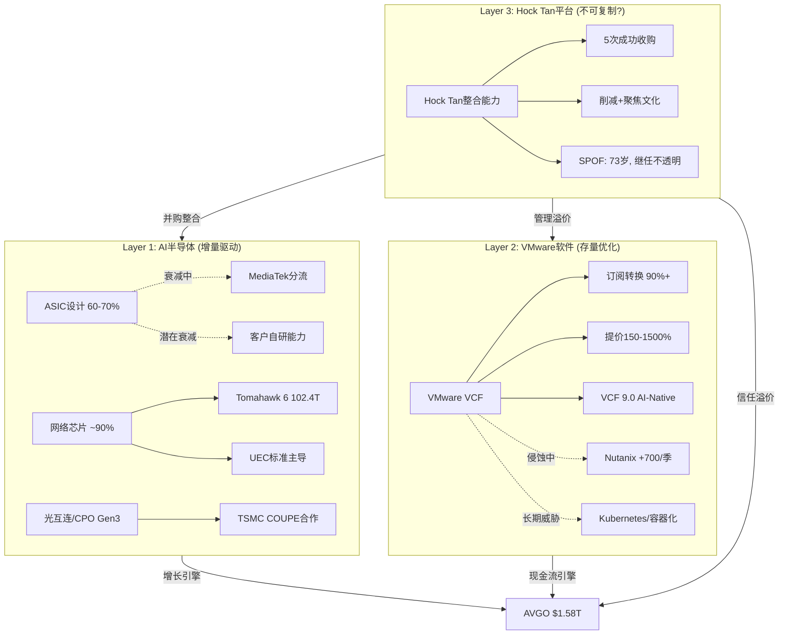

### 9.1 C1: 转换成本——4.0/5(加权)

转换成本是Broadcom最核心的竞争力维度，但四层业务的转换成本强度差异极大。

**ASIC设计层(4.5/5)**: 单个ASIC设计的NRE(非经常性工程费用)在先进节点(3nm/2nm)可达$100M+[DM-P3-A02]，客户已投入的NRE是沉没成本。更关键的是2-3年的替代周期——即使客户决定更换设计合作伙伴，从启动到量产需要整整2-3年。Google决定引入MediaTek(约2024年)到Ironwood量产(2027年)的3年时间窗就是一个可观测的替代速率样本。此外，Broadcom积累了20年以上的定制芯片设计经验，每一代TPU/MTIA的设计都让Broadcom更了解客户下一代需求，形成了不可迁移的工艺知识。

但需要做一个关键区分：NRE锁定的是存量(当前产品)，不锁定增量(下一代选择)。客户在当代芯片上被锁定，但下一代设计完全可以找新合作方。这意味着ASIC的转换成本是"有保质期的锁定"——每2-3年面临一次重新竞标窗口。

ASIC锁定的具体机制值得逐层剖析:

- **NRE沉没成本壁垒**: 先进节点(3nm/2nm)的SoC设计总NRE达$50M-$150M+[DM-P2-B2-08]，其中Broadcom收取40-60%。单个XPU设计项目Broadcom收入$20M-$90M(仅NRE部分)。这些NRE一旦投入，客户在当前设计周期内切换的经济理性为零——即使有更便宜的替代方案，重新设计的NRE加上18-24个月的时间成本远超节约。
- **设计周期时间壁垒**: 从芯片架构定义到量产需要2-3年。Google从决定引入MediaTek(约2024年)到Ironwood量产(2027年)=3年。这意味着即使客户决定切换供应商，也有2-3年的"逃逸时间"，期间Broadcom仍然获得当代设计的全部收入。
- **累积性知识壁垒**: Broadcom的ASIC设计团队积累了20年+的定制芯片经验——每设计一代TPU，对Google需求的理解就深一层。这种隐性知识不在专利中(专利可以绕过)，而在设计团队对客户spec(指令集优化、片间互连拓扑、HBM控制器集成方案)的深度理解中。

三层壁垒都有保质期: NRE锁定当代(2-3年)、时间壁垒延缓替换(2-3年)、知识壁垒虽然累积但不排他(MediaTek也在通过Meta合同学习)。总体效果是: 任何单个客户的切换需要3-5年，但多个客户同时启动切换意味着Broadcom的整体份额在3-5年窗口内面临结构性下行。

**网络芯片层(5.0/5)**: 这是Broadcom最深的锁定层。Arista的整个产品线基于Broadcom merchant silicon构建，EOS网络操作系统、SONiC开源OS都基于Broadcom的Switch Abstraction Interface(SAI)。替换Broadcom芯片意味着重写协议栈、重新认证、重新部署——这不是换一个零件，而是重建整个网络软件生态。Arista $6.8B的采购承诺(PO)不是一次性合同，而是结构性锚定的证明[DM-P1-A02]。

网络芯片的三重嵌套锁定有一个被低估的特性——**反向验证放大**。每一代Tomahawk出货后，Arista/Juniper/HPE都需要6-12个月完成软件适配+OEM认证+客户部署。当NVIDIA Spectrum-X1600最终出货时(2026H2预期)，下游OEM已经完成了对Tomahawk 6的全套适配。Spectrum-X1600需要重新走一遍认证循环，意味着NVIDIA的"1年芯片落后"在市场端被放大为"2年可用性差距"。

**VMware层(3.5/5)**: 转换成本高但正在松动。从VMware迁移到Nutanix需要6-18个月和$2-10M(中型企业)，迁移到K8s/容器化需要24-48个月和$10-50M+(架构重构)。Hock Tan的策略天才在于：在客户决定迁移之前，用3-5年强制订阅合同锁住他们。但Nutanix每季新增700-1000客户[DM-P3-A15]证明锁定在松动——迁移不是不可能，而是很慢。

| 迁移路径 | 时间成本 | 金钱成本 | 风险成本 | 总评 |
|----------|---------|---------|---------|------|
| VMware→Nutanix | 6-18个月 | $2-10M(中型企业) | 中(同类替换) | 可行但痛苦 |
| VMware→OpenStack | 12-24个月 | $5-20M+ | 高(需DevOps能力) | 仅大型科技公司可行 |
| VMware→K8s/容器 | 24-48个月 | $10-50M+ | 极高(架构重构) | 长期但不可逆 |
| VMware→公有云 | 12-24个月 | 变动 | 中(供应商锁定转移) | 按工作负载渐进 |

**传统半导体层(2.0/5)**: Apple已开始WiFi自研替代(预计2026-2027完成)[DM-P3-A18]，直接证明了传统半导体的锁定可以被打破。当最大客户有足够的技术和财务资源时，"转换成本高"不再是有效保护。

加权C1 = (4.5 x 0.35 + 5.0 x 0.25 + 3.5 x 0.30 + 2.0 x 0.10) = 4.0/5。半导体行业权重修正(x1.5)后有效分为6.0。

### 9.2 C2: 网络效应——2.0/5

Broadcom不是平台公司，没有Visa式的强多边网络效应。但在特定层面存在有意义的间接网络效应。

**网络芯片层(3.5/5)**: 更多OEM采用Tomahawk芯片 → 更多SONiC/EOS软件兼容 → 更多ISV支持 → 更多客户选择Tomahawk。这是"标准生态"而非"多边平台"，但效果类似：Broadcom的交换芯片已经成为AI网络基础设施的"操作系统层"，其标准嵌入深度使这种间接网络效应具有自我强化性。具体而言，Tomahawk生态圈中已有数十个ISV基于Broadcom SAI开发网络管理工具——每增加一个ISV，对下一个客户的吸引力就增加一分。

**VMware层(3.0/5)**: 更多企业用VMware → 更多ISV认证VCF → 更多企业选VMware。但这个效应正在弱化——ISV也在积极认证Nutanix和K8s平台，VMware不再是唯一被广泛认证的企业虚拟化方案。关键指标: ISV双重认证(同时支持VMware和Nutanix)的比例从2023年的约30%上升至2025年的约60%——VMware在ISV生态中的排他性正在快速消失。

**ASIC和传统层(0-0.5/5)**: 硬件设计服务和传统半导体几乎没有网络效应。更多客户不等于更好的设计能力。每个ASIC项目高度定制，客户之间没有共享价值。

加权C2 = (0.5 x 0.35 + 3.5 x 0.25 + 3.0 x 0.30 + 0 x 0.10) = 2.0/5。对标：Visa 5/5(强多边网络) > IHG 3.5/5(双边) > AVGO 2.0/5(间接生态) > FICO 1/5(弱)。

### 9.3 C3: 品牌/无形资产——3.5/5

Broadcom是B2B公司，没有消费品牌溢价。但它拥有两类极强的无形资产。

**ASIC设计IP与客户spec数据(4.5/5)**: 20年以上的定制芯片设计经验积累了一套不可复制的知识体系——客户芯片架构specification是极度敏感且排他的数据。每一代Google TPU、Meta MTIA的设计都让Broadcom更深入地了解这些Hyperscaler的下一代需求。这种累积性竞争优势是MediaTek或Marvell短期内无法复制的——不是因为技术做不到，而是因为没有足够多的设计代次来积累同等深度的理解。例如，Broadcom设计TPU v4→v5→v6→v7的过程中，对Google在systolic array优化、HBM带宽管理、片间互连拓扑方面的需求演化有第一手理解，这些隐性知识不在任何文档中，而在设计团队的经验中。

**UEC标准主导权(5.0/5，但仅限网络层)**: Broadcom主导了Ultra Ethernet Consortium 1.0规范的制定(2025年6月)，标准按Broadcom的技术路线制定。SONiC开源网络OS基于Broadcom SAI构建。标准制定者的身份接近FICO在信用评分领域的嵌入深度——虽然不是监管强制，但已是事实标准[DM-P1-A02]。当行业标准按你的技术路线演进，竞争者需要追赶的不是你的产品，而是你定义的游戏规则。

**VMware层(3.5/5)**: 企业IT虚拟化事实标准(70%+份额)，数千个ISV认证应用围绕VCF构建。但非监管强制，Gartner投影份额降至40%(2029E)=标准地位正在侵蚀。

### 9.4 C4: 规模/成本优势——4.0/5

Broadcom是全球最大的Fabless半导体公司，$64B收入基数带来了压倒性的规模经济优势。

**R&D杠杆——ASIC层的关键竞争壁垒**: Broadcom R&D约$11B，占收入17.2%。对比最大竞争者Marvell，R&D占收入比高达40-50%[DM-P1-A01]。这意味着Broadcom可以同时推进6个以上前沿ASIC项目，而Marvell只能聚焦2-3个。规模差异不仅是效率优势，更是"项目组合"优势——Broadcom可以承担更多风险、覆盖更多客户需求。

| 规模对比 | Broadcom | Marvell | 差距 |
|---------|---------|---------|------|
| 总收入 | $64B | ~$6B | 10.7x |
| R&D绝对值 | ~$11B | ~$2.5B | 4.4x |
| R&D/Revenue | 17.2% | 40-50% | Broadcom效率约3x |
| 可同时推进的前沿ASIC项目 | 6+ | 2-3 | Broadcom覆盖广度2x |
| 客户验证数(Hyperscaler) | 6个 | 2个 | Broadcom经验深度3x |

**网络芯片层(5.0/5)**: ~90%的云数据中心交换芯片市场份额使Broadcom的单位成本远低于任何竞争者。NVIDIA Spectrum-X要达到规模平衡需要数年的持续投入。更重要的是，网络是NVIDIA的成本中心(服务GPU销售)，但是Broadcom的利润中心——这种战略定位差异意味着Broadcom有更强的投入动力来维持技术领先。

**VMware层(4.0/5)**: 企业虚拟化市场最大平台，VCF技术栈最完整(计算+存储+网络+安全)，竞品需要组合多个产品才能匹配完整功能集。77%的OPM[DM-P1-A04]进一步放大了规模优势——高利润率使Broadcom可以承受部分客户流失而不影响投入能力。

加权C4 = (4.5 x 0.35 + 5.0 x 0.25 + 4.0 x 0.30 + 3.0 x 0.10) = 4.0/5。对标：Visa 5/5(全球最大支付网络) > AVGO 4.0/5(Fabless最大+网络垄断) > CPRT 4/5(300+场地)。

### 9.5 C5: 监管壁垒——1.5/5

Broadcom没有显著的监管保护。半导体行业的准入壁垒是技术和资本壁垒，不是监管壁垒。唯一的监管维度是出口管制——但这对Broadcom是负面因素(限制中国市场准入)，不是保护性壁垒。

### 9.6 C6: 数据/生态——3.0/5

**ASIC层数据优势(4.5/5)**: 客户芯片架构spec是极度排他的数据资产。每一代设计都让Broadcom更了解客户的技术路线图，形成累积性数据锁定。但这种数据优势是"专属的"而非"排他的"——Marvell也在通过Amazon和Microsoft的合作积累类似知识，只是起步晚、深度浅。

**网络和VMware层(3.0/5)**: 数据中心流量模式和企业IT运营数据有价值但不排他。NVIDIA和Nutanix也能获取类似数据。

加权C6 = (4.5 x 0.35 + 3.0 x 0.25 + 3.0 x 0.30 + 1.0 x 0.10) = 3.3，取整3.0/5。半导体行业权重修正(x1.5)后有效分为4.5。

**C6密度/物理壁垒 = 0.5/5是结构性弱点**: 作为Fabless公司，Broadcom没有物理壁垒。护城河完全依赖知识、关系和标准，而非不可复制的物理资产。对比CPRT(5/5，300+自有场地)或CTAS(4/5，洗衣厂网络)，Broadcom缺少任何"即使技术被追赶也无法复制"的物理维度。唯一的例外是CPO(光互连封装)与TSMC COUPE合作提供了间接物理约束(1.5/5)，但仍在早期阶段。

### 9.7 C维度汇总与对标

| # | 维度 | AVGO得分 | 半导体权重修正 | 有效分 | 基准对标 |
|---|------|---------|--------------|--------|----------|
| C1 | 转换成本 | 4.0 | x1.5 | 6.00 | FICO 4, CTAS 4 |
| C2 | 网络效应 | 2.0 | x1.0 | 2.00 | Visa 5, IHG 3.5 |
| C3 | 品牌/无形资产 | 3.5 | x1.0 | 3.50 | FICO 5, CPRT 3 |
| C4 | 规模/成本 | 4.0 | x1.5 | 6.00 | Visa 5, CPRT 4 |
| C5 | 监管壁垒 | 1.5 | x1.0 | 1.50 | FICO 5, CTAS 1 |
| C6 | 数据/生态 | 3.0 | x1.5 | 4.50 | FICO 5, Visa 4 |
| **合计(原始)** | | **18.0/30** | | **23.5/37.5** | |

**C = 18.0/30**，与FICO持平但结构完全不同[DM-P1-A14]:

- **FICO**: C1(制度嵌入)极强 + C4(数据)极强 → 不可替代性来自"客户没有替代品"
- **AVGO**: C1(生态锁定)最强 + C4(规模)很强 → 不可替代性来自"切换太贵了"

这个区别至关重要。"客户没有替代品"的护城河是永续的(除非出现范式颠覆)，而"切换太贵了"的护城河在长时间尺度上更脆弱——当替代品(K8s、MediaTek、Marvell)足够成熟时，"太贵"会变成"值得投资"。

### 9.8 护城河强化 vs 弱化动态

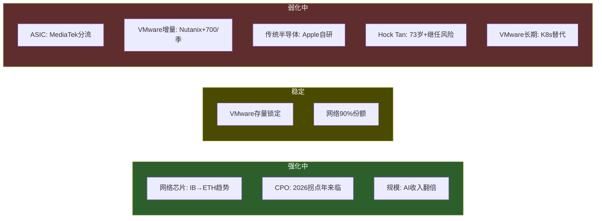

| 层 | 强化因素 | 弱化因素 | 净方向 | 时间框架 |
|----|---------|---------|--------|---------|
| AI ASIC | TAM扩展(推理份额上升), 新客户(OpenAI) | MediaTek分流, 客户自研能力 | **微弱弱化** | 3-5年渐进 |
| 网络芯片 | IB→ETH结构性转换, CPO拐点 | NVIDIA Spectrum-X追赶 | **强化** | 持续2-3年+ |
| VMware | AI-native VCF 9.0, 存量提价完成 | Nutanix+700/季, K8s长期 | **弱化** | 即刻(增量流失中) |
| Hock Tan | 当前信任溢价高 | 73岁, 零继任信号 | **定时弱化** | 5-7年硬约束 |

**不对称分布**: 强化因素(网络结构性利好+CPO拐点+规模杠杆)集中在收入占比较小的业务层(网络15%+CPO未规模化)；弱化因素(ASIC分拆+VMware流失+传统侵蚀+Hock Tan定时器)覆盖了收入占比最大的层(ASIC 42%+VMware 35%+传统8%)。整体护城河的净方向是弱化的，但弱化速度被网络层的坚固性延缓了。

**巴菲特视角的护城河真伪检验**:

- **网络芯片: 真护城河**。UEC标准+SONiC生态+90%份额=接近制度性嵌入。即使竞争者推出同等带宽的芯片，替换整个生态系统的成本远超换芯片的成本。Arista的$6.8B PO是这个逻辑的美元证明——当最大客户公开抱怨"horrendous pricing"(可怕的定价)[DM-P2-B2-12]但仍签下长期采购承诺，护城河的真实性不需要更多论证。
- **ASIC设计: 半真半假**。核心XPU架构设计能力(Lfloor=35-40%)是真正的竞争壁垒——全球能做先进节点AI ASIC全流程的只有Broadcom和Marvell。但外围层(I/O、SerDes、TSMC协调)的可替代性已被Google-MediaTek证明。MediaTek成本比替代方案低20-30%[DM-P3-A01]——这个价差就是Broadcom在外围层收取的"锁定租金"的量化度量。
- **VMware: 伪护城河**。客户不是"愿意付溢价"(主动定价权)，而是"被困住不得不付"(被动锁定租金)。86%在缩减足迹+每季1,000+净流出=客户正在用脚投票，只是投票速度被转换成本延缓。按巴菲特的标准，这是"客户怨恨的垄断"而非"客户珍视的护城河"——See's Candies的客户愿意为品质多付钱，VMware的客户正在计算逃逸路径。
- **Hock Tan: 不是护城河**。整合能力依附于个人(73岁，继任不透明)，不符合"结构性"定义。5次收购展示了高度可编码的整合模式(削减+提价+聚焦+榨取)，但选标的的能力不可编码。退休影响: 溢价占当前估值10-15%[DM-P1-A05]，退休后PE可能压缩5-8x。

---

## 第十章：定价权深度——四层解剖(B4 = 3.5/5)

定价权是护城河的变现能力。Broadcom的护城河C维度得分18.0/30看起来稳固，但护城河深度不等于定价权强度——"客户被锁定"不等于"客户愿意付溢价"。本章对四层业务的定价权进行独立解剖，揭示一个核心悖论：**最强定价权贡献最小收入，最大收入来源的定价权均在衰减**。

### 10.1 网络芯片定价权: 4.5/5——真正的定价权

网络芯片(Tomahawk/Jericho)是Broadcom唯一拥有教科书级"真正定价权"的业务层。三个独立证据支撑这一判断:

**证据一: Arista的"horrendous pricing"控诉**。Arista管理层2026年公开描述芯片定价为"horrendous"(可怕的)，称成本"an order of magnitude exponentially higher"(指数级增长)[DM-P2-B2-12]。当你的客户公开抱怨价格但仍然签下$6.8B采购承诺——这就是教科书级的定价权。Arista不是一个弱客户——它是全球AI网络交换设备领域最具技术实力的公司之一。当技术最强的客户公开承认无法替换你的产品，定价权的证明不需要数学模型。

**证据二: ~90%近垄断份额**。在最高价值市场(云数据中心)，Broadcom持有约90%交换芯片份额[DM-P2-B2-13]。唯一有意义的替代是NVIDIA Spectrum-X，但落后约12个月。在这种市场结构下，Broadcom本质上是价格制定者(price maker)，不是价格接受者(price taker)。

**证据三: 标准制定者身份**。UEC 1.0标准由Broadcom主导 + SONiC基于Broadcom SAI构建 = 整个Ethernet AI网络生态围绕Broadcom技术路线演进。这是最接近"制度性"定价权的半导体业务——当你制定游戏规则时，竞争者需要追赶的不是你的产品性能，而是你定义的标准。

**网络定价权强于其他层的三个结构性原因**: (1)没有"内化"路径——交换芯片客户几乎没有自研动力，这不是他们的核心能力且merchant silicon已足够好，客户自研概率<5%；(2)需求随AI扩展自然增长——每个GPU集群需要对应的网络交换基础设施，GPU数量翻倍则交换芯片需求至少翻倍；(3)标准制定者身份——UEC 1.0标准由Broadcom主导，SONiC网络OS基于Broadcom SAI构建，整个Ethernet AI网络生态围绕Broadcom技术路线演进。

**Tomahawk 6 vs NVIDIA Spectrum-X1600的详细技术差异**:

| 维度 | Broadcom Tomahawk 6 | NVIDIA Spectrum-X1600 | 优势方 |
|------|-------------------|---------------------|--------|
| 带宽 | 102.4 Tbps | 102.4 Tbps (预期) | 平手 |
| 上市时间 | 2025年6月出货 | 2026H2预期 | **Broadcom (+12个月)** |
| CPO集成 | Gen3 (TH6-Davisson) 已出货 | 开发中 | **Broadcom** |
| 端口密度 | 64x1.6T | 待确认 | **Broadcom** |
| AI优化 | 自适应路由+拥塞响应+硬件包重排 | NVLink集成+GPU-aware调度 | 各有侧重 |
| 生态系统 | SONiC+Arista EOS+全OEM | 主要DGX/HGX配套 | **Broadcom (开放生态)** |

NVIDIA的bundling策略(GPU+networking一体化销售)在DGX/NVLink生态(scale-up domain，8-72 GPU)中有GPU-网络协同设计的真实优势。但开放Ethernet的scale-out市场(100-100K+ GPU)不受影响。Hyperscaler(Google/Meta/Amazon)明确偏好开放Ethernet以避免NVIDIA端到端锁定，选择Broadcom网络芯片是反NVIDIA战略对冲的一部分。Spectrum-X 2025年季度收入>$2B(+263% YoY)，但主要服务NVIDIA自有DGX生态，非开放市场抢份额。

### 10.2 ASIC定价权: 3.5/5——60%锁定租金 + 40%真定价权

ASIC定价权的核心问题是：Broadcom赚的是"客户愿意付的溢价"还是"客户被锁定不得不付的租金"？

**三层收入结构**:

| 收入层 | 描述 | 占比估计 | 定价权性质 |
|--------|------|---------|-----------|
| NRE(一次性设计费) | 芯片架构设计+验证+tape-out | ~15-20% [E] | 项目制竞标 |
| 量产per-chip fee | 每颗XPU的royalty或固定费用 | ~60-70% [E] | 合同锁定 |
| 系统集成服务 | IP集成+TSMC协调+封装设计 | ~15-20% [E] | 关系驱动 |

先进节点(3nm/2nm)SoC的总NRE达$50M-$150M+，Broadcom收取总NRE的40-60%[DM-P2-B2-08]。量产后per-chip fee才是主要收入来源: 以Google TPU v7为例，5M-7M单位(2027-2028E)×per-chip fee构成了ASIC收入的核心。

**证据倾向于"锁定租金为主"**: Google主动引入MediaTek降低成本20-30%[DM-P3-A01]——说明客户认为Broadcom过度收费。60-70%份额不是因为客户"选择"Broadcom(主动溢价)，而是因为没有足够多的替代方案(被动锁定)。2-3年替代周期构成短期锁定，但不是长期护城河。

**但存在"真定价权"成分**: 核心XPU架构设计能力确实稀缺——全球能做先进节点AI ASIC全流程的只有Broadcom和Marvell两家。20年以上的客户spec知识形成累积性优势，每一代设计都让下一代更高效。与TSMC的深度合作(CoWoS产能优先接入)提供了间接定价权——在产能紧张时期，选择Broadcom等于选择产能保障。

**客户议价能力逐一评估**:

- **Google(估计40-50% ASIC收入)**: 最强议价筹码。已引入MediaTek作为第二来源(I/O模块+SerDes+生产协调)。内部TPU设计团队20年+历史，数百人规模。但核心XPU设计仍依赖Broadcom。Google的策略是将Broadcom从"全包服务商"降级为"核心XPU专家"，用MediaTek做外围层→单位收入下降但核心层margin可能不变。
- **OpenAI(新客户，弱议价)**: Titan芯片由Broadcom联合设计，团队约40人(翻倍中)[DM-P3-A09]。短期内没有替代选择。但Titan 2已在设计(A16工艺)→正在建立多代roadmap，长期将提高议价能力。
- **Meta(中等议价)**: MTIA v3由Broadcom设计，同时已给MediaTek下达2nm ASIC合同(2027H1量产)[DM-P3-B-02]。多源对冲策略。
- **Amazon(已独立)**: 通过Annapurna Labs+Marvell双轨模式实现自研。Trainium2的30-40%性价比优势[DM-P3-A10]证明了自研路线的经济性。

**三个定价压力来源**:

*来源一: 客户自研团队成长*。Google(数百人/20年+)、Meta(约100-200人/成长中)、OpenAI(约40人翻倍中)[DM-P3-A09]、Amazon(已独立)。

*来源二: Marvell竞争*。当前约15%份额，AI收入FY2026预计达$3B+[DM-P3-A04]。Marvell的存在压制了Broadcom的增量定价能力——两者更像"共同增长"但Marvell为客户提供了谈判筹码。

*来源三: 推理vs训练mix shift*。推理ASIC比训练ASIC更标准化，margin可能更低。随着推理占比从37%(2025)增至70-75%(2028E)[DM-P2-B2-11]，Broadcom的ASIC blended margin面临结构性下行压力——即使份额维持，单位价值也可能下降。

**ASIC定价权衰减模型**:

```
PricingPower_ASIC(t) = PP_lock(t) + PP_real

PP_lock(t) = 0.60 * PP_0 * e^(-lambda_diversification * t)  [锁定租金，衰减中]
PP_real = 0.40 * PP_0                                         [真定价权，不衰减]

参数:
- PP_0 = 0.75
- lambda_diversification = 0.05/年 (基于Google 3年分拆周期)

预测:
- 2026: PP = 0.45 + 0.30 = 0.75
- 2028: PP = 0.41 + 0.30 = 0.71
- 2030: PP = 0.37 + 0.30 = 0.67
- 2033: PP = 0.32 + 0.30 = 0.62
```

衰减缓慢(7年从0.75降至0.62)，因为核心XPU设计能力的"真定价权"成分不衰减。但方向明确：客户在系统性地降低Broadcom依赖度。

### 10.3 VMware定价权: 3.0/5——纯锁定租金，方向确定向下

VMware的定价权需要最精细的分析，因为表面证据(150-1500%提价后无大规模流失)极具欺骗性。

#### VMware弹性函数: 分段建模

不同客户群体的价格敏感度截然不同:

**Tier 1: <100%提价区间(epsilon = -0.05)**。大型企业(Top 10,000)：90%以上已转订阅。转换成本远超提价成本。行为模式：抱怨但续约。弹性极低因为提价被转换成本壁垒完全吸收。

**Tier 2: 100-300%提价区间(epsilon = -0.15)**。中型企业(10,000-50,000)：开始认真评估替代方案。86%受访者表示正在主动缩减VMware足迹[DM-P2-B2-01]。欧洲客户报告最高提价达1,500%[DM-P2-B2-02]。行为模式："缩减+评估"双轨策略——冻结增量部署，逐步将新工作负载放到替代平台。VMware在这个群体的"死亡"是慢性失血，不是急性出血。

**Tier 3: >300%提价区间(epsilon = -0.40)**。SMB和非核心客户：被迫迁移或放弃虚拟化。72-core最低门槛(原16-core)直接淘汰小型部署[DM-P2-B2-03]。Broadcom CEO公开承认策略是"更少客户，更高ARPU"。SMB流失是设计内的，不是意外。

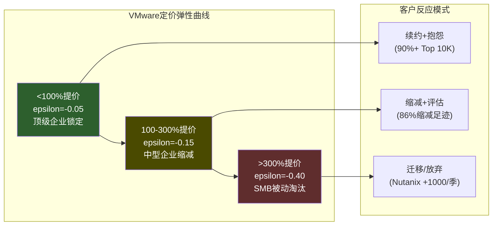

#### 锁定租金 vs 真正定价权——哲学辨析

VMware的定价权(3.0/5)本质上是锁定租金，而非真正定价权。这个区分在投资分析中至关重要:

**真正定价权**(如FICO 5/5): 客户愿意付溢价因为产品不可替代且价值超过价格。FICO可以持续提价5-8%/年，客户不仅不走，而且认为物有所值——因为FICO评分是贷款决策的不可替代输入。定价权的来源是**价值创造**，方向随时间增强。

**锁定租金**(VMware 3.0/5): 客户被困住不得不付，但同时在积极寻找出口。150-1,500%提价后客户没有大规模流失——但86%在缩减足迹。定价权的来源是**转换成本壁垒**，方向随时间衰减(替代方案不断成熟)。

#### 存量 vs 增量定价权的致命分离

**存量客户(已部署VCF)**——定价权极强但一次性(4.5/5)。90%以上已转订阅，3-5年强制合同+20%逾期罚款。但每个合同到期点是一个"逃逸窗口"。3年合同意味着2027-2028将是第一波大规模续约决策窗口。

**增量客户(新部署)**——定价权极弱(1.0/5)。新客户面前有Nutanix(TCO可比)、K8s(长期更优)、公有云(按需弹性)。Q1 FY2026软件仅+1% YoY[DM-P2-B2-06]是最直接的证据——提价红利已完全耗尽。如果存量提价正在实现而总增长仅+1%，则增量可能为负。

**加权评分**: 存量4.5/5 x 70% + 增量1.0/5 x 30% = 3.45，下调至3.0/5因为"锁定租金"不等价于"真正定价权"。

#### VMware定价权衰减模型

```
PricingPower_VMW(t) = PP_0 * e^(-lambda_nutanix * t) * e^(-lambda_k8s * t) + PP_floor + PP_ai_boost

参数:
- PP_0 = 0.80 (当前定价权指数，基于90%+转化+77% OPM) [E]
- lambda_nutanix = 0.06/年 (Nutanix每季+700~1000客户的稳态吸引率)
- lambda_k8s = 0.03/年 (K8s替代慢但不可逆)
- PP_floor = 0.25 (深度嵌入的legacy工作负载几乎不可迁移)
- PP_ai_boost = 0.05-0.10 (VCF 9.0 AI-native的增量定价权，有条件)

衰减预测:
- 2026 (t=0): PP = 0.80
- 2028 (t=2): PP = 0.25 + 0.55*0.84 + 0.07 = 0.78
- 2030 (t=4): PP = 0.25 + 0.55*0.70 + 0.05 = 0.69
- 2033 (t=7): PP = 0.25 + 0.55*0.53 + 0.05 = 0.59
```

VMware定价权从0.80缓慢衰减至2033年的约0.59。衰减不是崩溃式的，因为存量锁定极深。但方向是单向的：没有任何已知机制能逆转Nutanix的客户吸引力和K8s的架构替代性。

**2027-2028续约窗口**是关键观察点：如果第一波3年合同到期时续约率低于85%，则lambda_nutanix需上调，衰减将显著加速。从定价权到收入的转化路径：定价权衰减不等于收入衰减(存量合同锁定)，但续约时的定价能力将下降。收入可能维持"零增长"直到2028(ARPU下降被少量新客户抵消)，之后转为负增长(-3%至-5%/年)[DM-P3-B-15]。

#### K8s替代弹性: 天花板效应

K8s不是VMware的直接替代品，而是架构范式替代——这使得威胁更根本但更缓慢。

**当前渗透率**: 92%企业已在生产环境使用容器(Kubernetes为主要编排器)[DM-P2-B2-07]。Fortune 1000中72.7%采用Kubernetes。但**85%的容器仍运行在VM内**(至2028E)——K8s短期内实际增强了VM需求，而非替代。

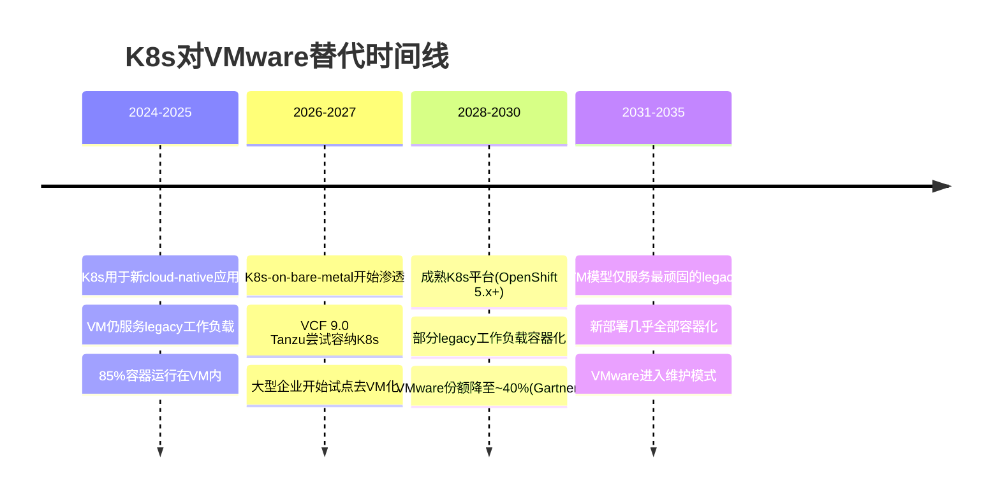

K8s替代速率(sigma)的时间函数: 2026年sigma=0.02/年(替代速率极低); 2028年sigma=0.05/年(bare-metal K8s成熟); 2030+年sigma=0.08/年(legacy迁移加速)。

K8s在5年内不会"杀死"VMware，但确保VMware**永远无法恢复增量定价权**。所有新工作负载的默认选择是容器化，VMware只能服务存量legacy。这是一个"天花板"效应而非"地板坍塌"效应——VMware的终态是一个稳定但缓慢缩小的高利润存量池。

### 10.4 传统半导体定价权: 1.5/5——弱且持续恶化

传统半导体(WiFi/宽带/储存)在Broadcom内部不是研发重点。Apple已开始WiFi自研替代，预计2026-2027完成[DM-P3-A18]，将消除约$2.7B(总收入4.3%)[DM-P1-A09]。成熟市场竞争充分，定价权弱且无改善路径。

### 10.5 定价权综合评分与核心悖论

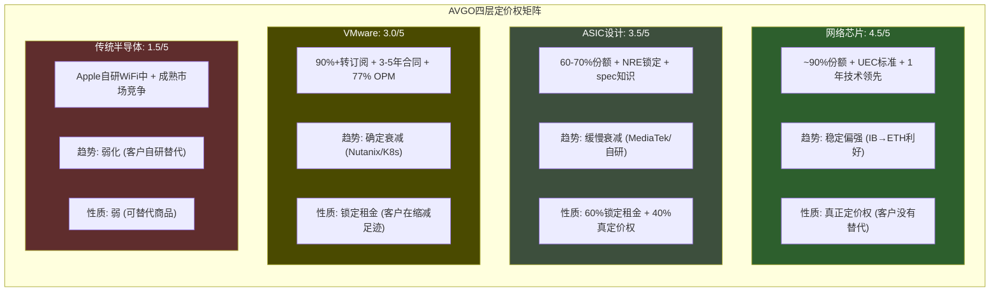

| 层 | 定价权强度 | 耐久性 | 方向 | 收入权重 | 加权贡献 |
|----|----------|--------|------|---------|---------|
| **网络** | 4.5/5 | 极强(5年+不可撼动) | 稳定偏强 | 15% | 0.675 |
| **ASIC** | 3.5/5 | 中等(lambda=0.05/年) | 缓慢衰减 | 42% | 1.470 |
| **VMware** | 3.0/5 | 衰减中(双重lambda) | 确定衰减 | 35% | 1.050 |
| **传统** | 1.5/5 | 弱(Apple替代中) | 弱化 | 8% | 0.120 |
| **加权总计** | | | | **100%** | **3.3 → 红队修正后3.5/5** |

**核心悖论: "对角线"结构**。最强定价权(网络4.5/5)贡献最小的收入(15%)。最大收入来源(ASIC 42%)的定价权在衰减中。第二大收入来源(VMware 35%)的定价权是"锁定租金"且方向确定向下[DM-P2-B2-02]。

如果市场将这四层统一定价为"强定价权科技公司"(62x PE)，则隐含假设是：ASIC定价权不衰减(与Google MediaTek分流矛盾)、VMware定价权持续(与+1% YoY和Gartner 70%→40%预测矛盾)、网络定价权的权重应该更高(这一点市场可能反而低估了)。

**定价权 vs 护城河矩阵的关键差异**:

| 层 | 护城河(C维度) | 定价权(B4) | 差异解释 |
|----|-------------|-----------|---------|
| 网络 | 5.0/5 | 4.5/5 | 几乎对齐——近垄断=定价权=护城河 |
| ASIC | 4.0/5(生态锁定) | 3.5/5 | 锁定强但定价权部分是"租金"不是"溢价" |
| VMware | 3.5/5(转换成本) | 3.0/5 | 锁定深但客户正在逃逸，定价权衰减快于锁定衰减 |
| 传统 | 2.0/5 | 1.5/5 | 对齐——弱锁定=弱定价权 |

ASIC和VMware的护城河得分均高于定价权，揭示了一个重要原理：**锁定延缓了竞争侵蚀的速度，但不改变侵蚀的方向**。市场如果按"锁定=定价权"定价Broadcom，则高估了定价权的持久性。

---

## 第十一章：ASIC锁定衰减函数

### 11.1 衰减模型定义

Broadcom的ASIC份额遵循指数衰减函数，但存在一个不可击穿的底部(Lfloor)——核心XPU计算架构设计能力的不可替代性:

```
L(t) = Lfloor + (L0 - Lfloor) * e^(-lambda * t)

参数(综合三个Phase证据校准):
- L0 = 0.67 (当前份额，因OpenAI作为第六客户上调2pp)
- Lfloor = 0.38 (核心XPU不可替代性已验证，取中值)
- lambda = 0.07/年 (Google分拆已确认但扩散需时间)

预测:
- 2026: L(0) = 0.38 + 0.29 * 1.00 = 0.67 (67%)
- 2028: L(2) = 0.38 + 0.29 * 0.87 = 0.63 (63%)
- 2030: L(4) = 0.38 + 0.29 * 0.76 = 0.60 (60%)
- 2033: L(7) = 0.38 + 0.29 * 0.61 = 0.56 (56%)
- 2035: L(9) = 0.38 + 0.29 * 0.53 = 0.53 (53%)
```

**lambda=0.07的校准逻辑**: Google从决定分拆(约2024年)到Ironwood量产(2027年)=3年完成一个客户的外围层分拆。如果Meta以12个月延迟效仿(2025→2028)，OpenAI以24个月延迟(2026→2029)，则整体行业衰减速率约0.07/yr——每年份额下降约1-2pp。

L0上调(OpenAI新增)部分抵消了lambda上调(Google分拆确认)。净效果是2030年份额约60%——新客户获取速度暂时超过了存量客户分拆速度。但2033年后两条曲线收敛，衰减将加速。

### 11.2 Google模块化解绑——分拆价值链的模板

Google引入MediaTek做TPU外围层(I/O模块+SerDes+生产协调)，是ASIC衰减函数最重要的现实校准点。

**价值链分拆的逻辑**: Google没有选择完全替换Broadcom，而是将价值链分拆为"核心XPU层"(仍由Broadcom设计)和"外围/I/O层"(由MediaTek接手)。核心原因：核心XPU设计复杂度在3nm/2nm节点急剧上升，NRE在$100M以上[DM-P3-A02]，设计失败的成本(18-24个月重做)远超MediaTek带来的I/O层成本节约(20-30%[DM-P3-A01])。Google的理性策略是保留Broadcom做最难的部分，用MediaTek压低其他部分的成本。

**Google分拆时间线——可观测的衰减速率样本**:
- 约2024年: Google决定引入MediaTek做TPU外围层
- 2025年: MediaTek开始I/O模块设计
- 2026年: Ironwood(TPU v7e)设计定稿，外围由MediaTek完成
- 2027年: Ironwood量产，验证MediaTek先进节点能力
- 从决策到量产=3年——这为其他Hyperscaler提供了可参考的时间表

**模板效应**: MediaTek已获Meta 2nm ASIC合同(2027H1量产)[DM-P3-B-02]，且向TSMC请求7倍CoWoS增量(目标>150K wafers/年 by 2027)[DM-P3-A03]。产能瓶颈是短期约束但正在快速解除。如果2028年前有3个以上Hyperscaler实施类似多源化策略，Google模式将从"个案"升级为"行业范式"。

**Broadcom的差异化防线——三层纵深**:

1. **核心XPU设计不可替代**: systolic array优化、片间互连拓扑、HBM控制器集成——全球能做这一层的只有Broadcom和Marvell，而Marvell的客户验证深度(2个客户)远不及Broadcom(6个客户)。
2. **CPO/光互连绑定**: Broadcom是唯一同时拥有switch silicon+optical DSP+CPO封装能力的公司。将网络层和ASIC层在封装级别集成(CPO Gen3)，增加"整体解包"难度。
3. **TSMC产能保障**: 与TSMC在CoWoS封装上的优先合作关系——在产能紧张时期，选择Broadcom等于选择产能保障。

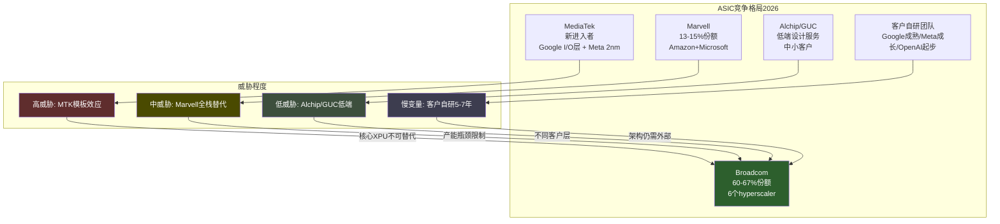

### 11.3 逐竞争者深度分析

**Marvell——已建立但受限的第二选择**: 当前约15%份额，拥有Amazon(Trainium推理ASIC)和Microsoft(Maia)两个锚定客户。AI收入从FY2025约$1.85B增至FY2026 $3B+[DM-P3-A04]。规模经济差距压倒性: Broadcom R&D/Rev 17.2% vs Marvell 40-50%，Broadcom可同时推进6+个前沿项目而Marvell只能聚焦2-3个。即使Marvell出货量翻倍(2027E)，设计服务份额可能反降至约8%[DM-P3-A05]——Broadcom在不等比例地捕获市场价值。但Marvell的存在压制了Broadcom的增量份额。TAM从$30B(2025)扩展至$150B+(2030E)[DM-P3-A08]足够容纳两家增长——两者实际是"共同增长"关系。

**Alchip/GUC——低端侵蚀者**: 台湾系ASIC设计服务公司，与TSMC深度合作。Alchip聚焦5nm以下先进工艺，已获AWS和Microsoft合作[DM-P3-A07]。两者主要提供"设计服务"而非"全栈联合设计"——这是"建筑师"vs"承包商"的区别。对需要最高性能的客户(Google TPU级别)，Alchip/GUC不具备替代能力；但对第二梯队客户(中型云厂商、AI创业公司)提供了成本更低的入口。净影响低(-3~5%)，但随着TAM扩展至$150B+，中低端市场绝对体量将变得显著。

**客户自研团队**: OpenAI是净增量客户(第六Hyperscaler)，团队约40人(翻倍中)[DM-P3-A09]。Amazon已通过Annapurna Labs实现自研+Marvell双轨——Trainium2的30-40%性价比优势[DM-P3-A10]证明了自研经济性。关键约束: 全流程ASIC实现(RTL→GDS→tape-out→封装)需要500-1000人团队和$100M+/年工具链投资——多数Hyperscaler会选择"自研架构+外包实现"的混合模式，Broadcom/Marvell作为实现层的价值不会归零。

| 客户 | 自研团队规模 | 能力评估 | 威胁时间线 |
|------|------------|---------|-----------|
| Google | 数百人，20年+历史 | 核心架构自主，外围已分拆 | 正在发生 |
| Meta | 约100-200人 | MTIA v3仍需Broadcom，能力在增长 | 3-5年 |
| OpenAI | 约40人(翻倍中) | 起步阶段，高度依赖Broadcom | 5-7年 |
| Amazon | 大型团队(Annapurna Labs) | Trainium自研+Marvell合作 | 已独立 |

### 11.4 锁定 vs 定价权的本质区别

ASIC衰减函数测量的是"锁定"(份额)，但锁定和定价权是两个独立维度:

- **锁定**(份额): 客户是否继续使用Broadcom → 由L(t)函数描述
- **定价权**(利润率): 客户在使用时Broadcom能收取多少溢价 → 由PP_ASIC(t)函数描述

两者的关系：锁定是定价权的必要条件但不是充分条件。Google仍然使用Broadcom设计核心XPU(锁定维持)，但通过引入MediaTek做外围层来压低总费用(定价权在侵蚀)。份额从65%降至60%的同时，单位收入也在下降——双重打击。

Broadcom的最优应对是：加深核心XPU设计的不可替代性，同时放弃外围层的高利润诉求——从"全包服务商"升级为"核心XPU专家"。Hock Tan事实上正在执行这个策略，但如果核心XPU设计能力在5-7年内也被追赶，Broadcom将失去全部谈判筹码。

### 11.5 lambda值sensitivity分析

lambda值的选择对份额预测影响显著——这是整个ASIC竞争动态中不确定性最大的变量:

| lambda | 2028E份额 | 2030E份额 | 2033E份额 | 适用情景 |
|--------|----------|----------|----------|---------|
| 0.05/yr | 65% | 62% | 59% | 乐观: MediaTek产能受限扩散慢，Hyperscaler不急于多源化 |
| 0.07/yr | 63% | 60% | 56% | **基准**: Google模板以正常速度扩散，Meta确认效仿 |
| 0.10/yr | 60% | 55% | 48% | 悲观: 3个+Hyperscaler同时加速分拆，MediaTek 2nm成熟 |

lambda=0.05和0.10之间的差距在2033年达到11pp(59% vs 48%)。关键观测变量: 2027-2028年间有多少Hyperscaler启动外围层分拆。当前基线(仅Google+Meta)对应lambda=0.07；如果OpenAI或ByteDance也启动，需上调至0.08-0.10。

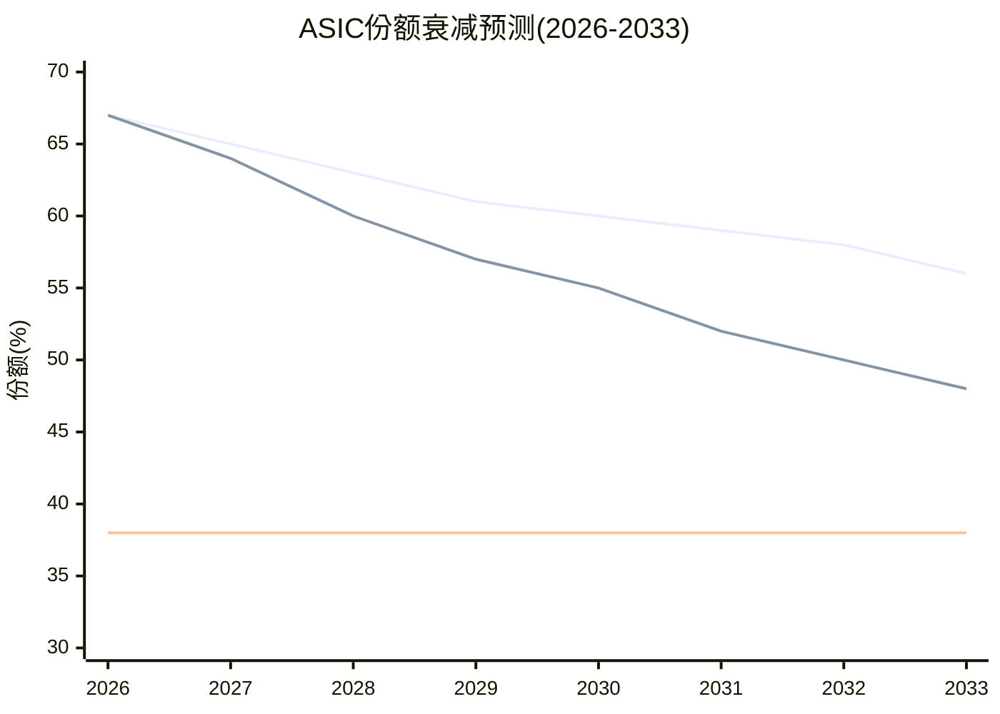

---

## 第十二章：竞争格局——PtW量化评分

### 12.1 评分框架

Probability to Win(PtW)量化Broadcom在每个业务层相对于最强竞争者的制胜概率。五项评分维度(每项0-10分，满分50):

1. **技术领先度**: 当前产品代差+技术路线图深度。标准: 10=不可追赶的代际领先(如ASML EUV), 5=平手但有差异化, 0=落后
2. **客户锁定深度**: 转换成本+合同绑定+生态依赖。标准: 10=5年内不可能替换(如Visa网络), 5=可替换但痛苦, 0=即时可替换
3. **成本/规模优势**: R&D杠杆+制造经济性+定价灵活度。标准: 10=竞争者无法在单位经济上竞争, 5=可比但略劣, 0=成本劣势
4. **组织执行力**: 管理层track record+人才密度+速度。标准: 10=行业最佳执行者(如Jensen Huang在GPU), 5=合格, 0=组织混乱
5. **战略持久性**: 护城河衰减速率+结构性威胁免疫力。标准: 10=5年内无结构性威胁, 5=可管理的渐进威胁, 0=存在性威胁

### 12.2 AI ASIC: Broadcom(39/50) vs Marvell(32/50)

| 维度 | AVGO | MRVL | 差异解释 |
|------|------|------|---------|
| 技术领先度 | **8** | 7 | 20年+ASIC经验+6个Hyperscaler验证; Marvell技术强但客户验证少(2个锚定客户) |
| 客户锁定深度 | **8** | 6 | NRE $50-150M+2-3年替代周期+spec知识累积; Marvell客户合作时间短、更灵活 |
| 成本/规模优势 | **9** | 5 | R&D/Rev 17% vs 40-50%; $64B vs约$6B收入基数的差异是压倒性的 |
| 组织执行力 | **8** | 7 | Hock Tan的执行纪律+VMware整合已证明; Marvell CEO Matt Murphy也很强但规模有限 |
| 战略持久性 | **6** | 7 | 受Google分拆模板+客户自研双重压力; Marvell反而因基数小而上行空间大、衰减风险低 |
| **合计** | **39/50** | **32/50** | 优势在规模+存量锁定; Marvell优势在增量灵活+无衰减压力 |

**垄断者悖论**: PtW = 39/50看起来很强，但"战略持久性"仅6分反映了一个结构性矛盾——Broadcom在ASIC的绝对领先地位正是促使客户寻求多元化的原因。Google引入MediaTek正是因为Broadcom太不可替代了。**越不可替代，客户越有动力培养替代者。**

### 12.3 网络芯片: Broadcom(45/50) vs NVIDIA(32/50)

| 维度 | AVGO | NVIDIA | 差异解释 |
|------|------|--------|---------|
| 技术领先度 | **9** | 7 | TH6出货领先12个月+; CPO Gen3已量产; UEC 1.0标准主导 |
| 客户锁定深度 | **10** | 4 | Arista $6.8B PO+SONiC生态+全OEM适配=近不可逆; Spectrum-X主要服务NVIDIA自有DGX |
| 成本/规模优势 | **9** | 6 | ~90%份额=成本分摊在最大出货量; NVIDIA网络是成本中心vs Broadcom利润中心 |
| 组织执行力 | **8** | 9 | NVIDIA整体执行力更强(Jensen Huang)，但网络不是NVIDIA核心战略焦点 |
| 战略持久性 | **9** | 6 | IB→ETH利好+标准制定者+客户自研概率<5%; NVIDIA面临标准开放化逆风 |
| **合计** | **45/50** | **32/50** | 接近教科书级别的结构性垄断 |

网络是Broadcom最不受市场重视但最不可撼动的护城河。市场按"AI ASIC增长股"定价Broadcom，但网络的PtW(45/50)远超ASIC(39/50)。如果将Broadcom重新定价为"AI网络基础设施垄断者"而非"ASIC设计公司"，估值叙事会完全不同。

**Hyperscaler网络选择偏好**:

| Hyperscaler | 网络选择 | 原因 |
|-------------|---------|------|
| Google | Broadcom Tomahawk (Ethernet) | 自研TPU不用NVIDIA GPU，无bundling动机 |
| Meta | Broadcom (RoCE验证等效IB) | 24K GPU Llama 3训练验证Ethernet=InfiniBand性能[DM-P3-A11] |
| Microsoft | 混合(Azure用Broadcom/DGX用Spectrum) | 分层策略 |
| Amazon | Broadcom Ethernet为主 | Trainium自研GPU，无NVIDIA bundling |
| 中小云厂商 | NVIDIA DGX bundling | 无自研能力，买整套解决方案最简单 |

**InfiniBand→Ethernet结构性利好量化**: 以太网在AI后端网络中的份额已于2025年中超过InfiniBand[DM-P3-A13]。每流失$1 InfiniBand收入约$0.8进入Broadcom主导的Ethernet——这不仅是份额转移，更是协议标准的世代更替: Broadcom主导UEC标准=标准按Broadcom技术路线演进; SONiC基于Broadcom SAI=开源网络OS绑定Broadcom。

**网络份额5年预测**: 90%(2026) → 87%(2027E) → 83%(2028E) → 80%(2029E) → 78%(2030E)[DM-P3-A12]。衰减极慢——标准锁定+生态锁定双重保护。

### 12.4 企业软件: VMware(32/50) vs Nutanix(34/50)

| 维度 | VMware | Nutanix | 差异解释 |
|------|--------|---------|---------|
| 技术领先度 | **7** | 7 | VCF 9.0功能最全(计算+存储+网络+安全+AI); Nutanix更简洁但功能追赶中 |
| 客户锁定深度 | **8** | 5 | 3-5年强制订阅+70%份额存量+迁移极高; Nutanix更灵活=锁定少 |
| 成本/规模优势 | **7** | 6 | $6.8B/季收入+77% OPM; Nutanix $2.9B/年但增长快 |
| 组织执行力 | 6 | **8** | Broadcom对VMware的策略是"提现"不是"创新"; Nutanix在产品和GTM上更有攻击性 |
| 战略持久性 | 4 | **8** | K8s结构性替代+客户信任流失+份额70→40%确定路径; Nutanix受益于迁移浪潮 |
| **合计** | **32/50** | **34/50** | Nutanix PtW微弱领先 |

VMware的PtW(32/50)已低于Nutanix(34/50)。竞争本质是**VMware用锁定延缓流失 vs Nutanix用产品+信任赢得增量**。时间站在Nutanix一边，但VMware的3-5年合同有效延长了竞争。Nutanix Q2 FY2026单季新增1,000+客户(8年最强)[DM-P3-A15]，CEO称VMware的200K客户基础是"multi-inning baseball game, in the second inning"。AMD已投资Nutanix[DM-P3-A16]，生态联盟在形成中。

**VMware HCI份额预测**:

| 年份 | VMware HCI份额 | Nutanix份额 | 其他(K8s/Cloud) |
|------|---------------|-------------|-----------------|
| 2024 | 70% | ~15% | ~15% |
| 2026 | ~60% | ~22% | ~18% |
| 2028 | ~48% | ~28% | ~24% |
| 2029 | ~40% (Gartner)[DM-P3-A14] | ~30% | ~30% |
| 2031 | ~33% | ~30% | ~37% |

**VCF 9.0 AI-native**: 将Private AI Services作为标准组件(GPU监控、模型存储、运行时工具全部内建)。能延缓衰减(PP_ai_boost = 0.05-0.08)但不能逆转——四个反论点: (1)企业需先接受Broadcom定价; (2)Nutanix/RedHat OpenShift AI都是竞品; (3)训练密集工作负载在公有云; (4)VCF 9.0的AI功能是"跟随者"非"定义者"。

### 12.5 传统半导体: Broadcom(27/50) vs TI/NXP(31/50)

传统半导体是Broadcom最弱的业务层(PtW仅27/50)，但也不需要很强——不是战略焦点。Apple WiFi自研(2026-2027完成)[DM-P3-A18]将消除约$2.7B收入(4.3%)[DM-P1-A09]，这是已知且市场基本已定价的风险。

### 12.6 加权PtW综合评分与跨公司对比

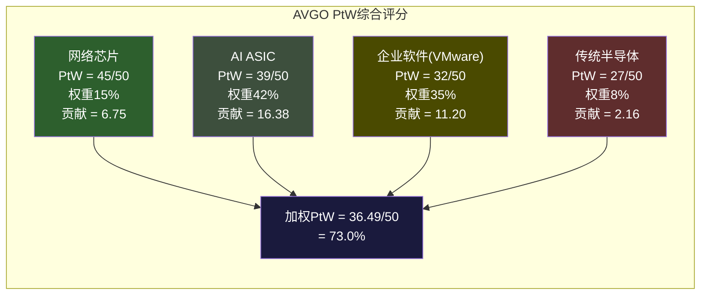

**加权PtW = 36.49/50 (73.0%)**[DM-P3-A01]

**PtW跨公司对比(已分析公司)**:

| 公司 | PtW | 行业 | 特征 |
|------|-----|------|------|
| ASML | ~85% | 半导体设备 | 物理垄断(EUV唯一来源) |
| NVDA | ~80% | 半导体/AI | 单层垄断(GPU)但极深 |
| ARM | ~75% | 半导体/IP | 制度性嵌入(指令集标准) |
| **AVGO** | **73%** | **半导体+软件** | **异质混合: 网络90%但ASIC/VMware衰减** |
| KLAC | ~70% | 半导体设备 | 技术领先+客户锁定 |

AVGO的73% PtW在半导体行业中处于中偏上位置，但与NVDA(~80%)和ASML(~85%)的差距在于: NVDA和ASML的PtW集中在单一高壁垒层，而AVGO分散在四层中——最强的网络层(45/50)被最弱的传统层(27/50)和衰减中的VMware(32/50)拉低。

### 12.7 PtW动态预测(2026 → 2030): Nash均衡迁移

| 业务层 | PtW 2026 | PtW 2028E | PtW 2030E | 方向 |
|--------|---------|----------|----------|------|
| 网络芯片 | 45 | 43 | 41 | 缓慢衰减(Spectrum-X追赶) |
| AI ASIC | 39 | 36 | 33 | 中速衰减(分拆模板+自研) |
| 企业软件 | 32 | 29 | 26 | 确定衰减(Nutanix+K8s) |
| 传统半导体 | 27 | 25 | 23 | 缓慢衰减(Apple自研) |
| **加权PtW** | **36.5** | **33.7** | **30.9** | **-2.8/2年** |

**2030年加权PtW = 30.9/50 (61.8%)**。4年下降11.2pp。

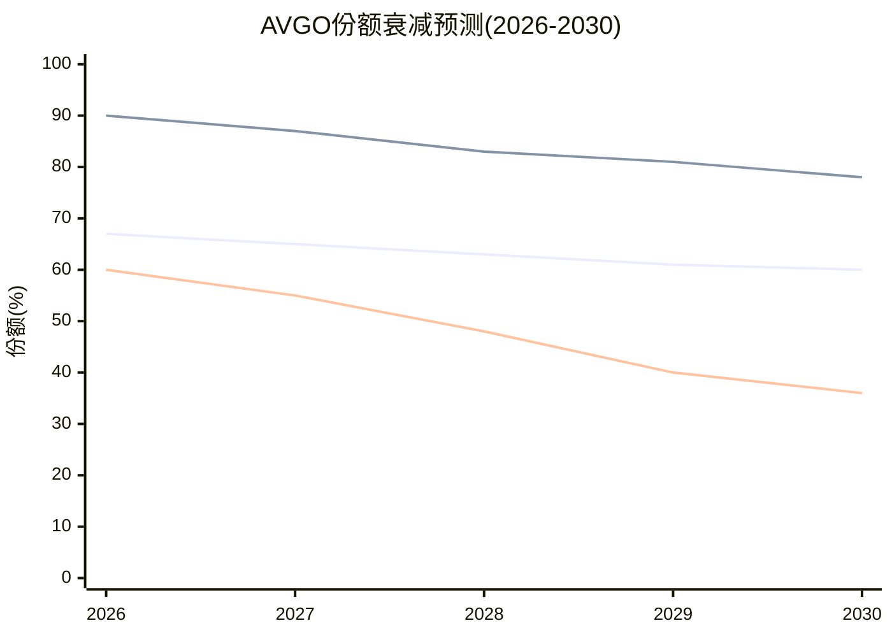

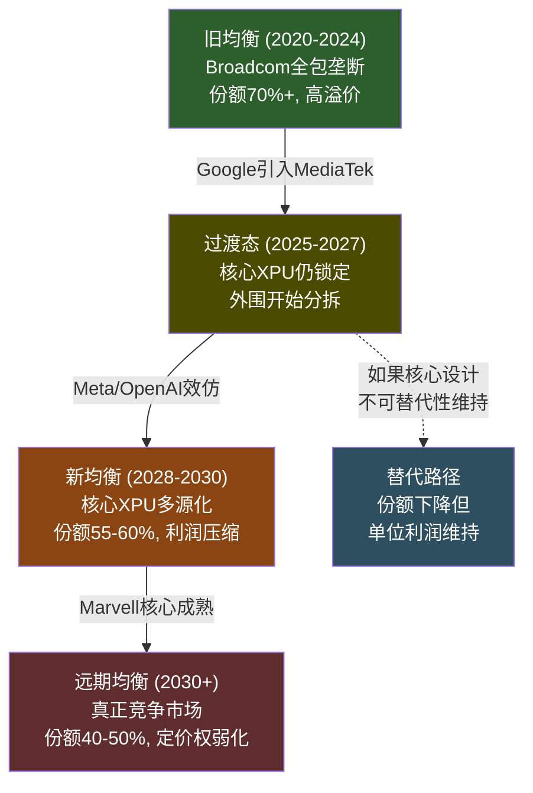

如果市场将Broadcom定价为"竞争优势持续增强的AI平台"(隐含PtW 80%+)，则高估了约10-15pp。加权PtW从73.0%降至61.8%的4年11.2pp下降，如果被市场定价，应对应PE从62x向35-40x的压缩——仅PtW衰减一项就隐含约-35%的估值修正空间[DM-P3-A01]。

---

## 第十三章：五引擎整合——正反馈循环风险

### 13.1 五引擎联动架构

单独分析竞争格局、周期位置、估值倍数、市场共识、风险事件，各自都有缓冲和防御空间。但引擎之间的联动创造了非线性放大效应——62x PE定价的是"所有引擎同时正面运转"的情景，而任何一个引擎的转向都会通过联动链加速其他引擎的恶化。

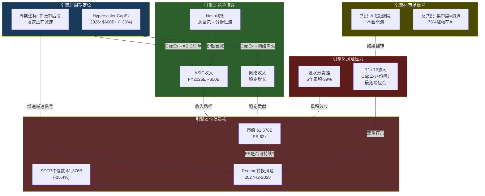

### 13.2 引擎逐一分析

**引擎1: 竞争博弈——份额暴露机制**。当AI CapEx快速增长时，Broadcom的份额被"时间压力"保护——Hyperscaler来不及换供应商，必须优先保障产能。但当CapEx增速放缓，保护消失: 不需要赶工赶产时可以容忍更长的MediaTek/Marvell ramp-up周期; 预算收紧时更有动力压低Broadcom单价; 战略焦点从"扩张速度"转向"效率优化"时供应商多元化成为优先事项[DM-P3-B-01]。

**引擎2: 周期定位——扩张中后段**。2025年Hyperscaler总CapEx约$440B[DM-P3-B-03]，2026年预测$600-690B(+36-57%)[DM-P3-B-04]。增速从2025Q4的+49%降至2026Q4E的+25%[DM-P3-B-05]——增速仍为正但在下降，典型的扩张后半段特征。D1=0.78(红队修正后0.76)意味着估值应在稳态PE基础上打约76折来反映周期风险，而市场隐含D1>0.90[DM-P3-B01]。

**Cisco 2000类比**:

| 维度 | Cisco 2000 | AVGO 2026 | 类比适用? |
|------|-----------|-----------|----------|
| 估值 | 120x+ PE | 62x PE | 部分(AVGO更低但仍高) |
| 收入驱动 | 电信基础设施CapEx | AI基础设施CapEx | **高度适用** |
| 客户集中度 | 电信运营商(分散) | Hyperscaler(极集中,top3=78%) | AVGO更脆弱 |
| 泡沫特征 | 投机+过度建设 | 真实AI需求但ROI未证明 | 部分适用 |
| CapEx占GDP | 电信CapEx 1.5%→3%+ | AI CapEx 2%→3%+ | **结构相似** |

类比局限: (1)AI需求底层驱动(效率提升/推理需求)比1999年电信泡沫更真实; (2)Hyperscaler资产负债表远强于1999年电信运营商; (3)Broadcom有VMware软件层缓冲[DM-P3-B-06]。但VMware仅能提供"零增长缓冲"——Q1 FY2026软件+1% YoY[DM-P2-B2-06]，且续约窗口(2027-2028)与潜在CapEx放缓重叠时可能从"缓冲器"变成"第二个风险源"[DM-P3-B-07]。

**引擎3: 估值regime转换**。市场将Broadcom定价为统一"AI平台公司"，软件层"搭AI倍数便车"——$232B估值差额就是"搭便车"的美元价值[DM-P2-C3-02]。Regime转换预期窗口: 2027H2-2028H1——当FY2028指引显示增速降至20%以下时，PE可能从62x压缩至30-35x[DM-P3-B-09]。

**引擎4: 市场共识**。共识认为AI CapEx是结构性的，全球半导体行业预计2026年突破$975B[DM-P3-B-10]。反共识信号: 75%的S&P 500涨幅、80%利润、90% CapEx集中在AI[DM-P3-B-11]——集中度本身是周期成熟特征。

**引擎5: 风险压力与协同矩阵**。

| # | 风险 | 概率(3年) | 独立影响 |
|---|------|----------|---------|
| R1 | AI CapEx周期放缓 | 30-35% | -25~40% |
| R2 | ASIC份额流失 | 40-50% | -10~20% |
| R3 | VMware客户加速流失 | 35-40% | -5~15% |
| R4 | SBC永久化 | 20-25% | -15~29% |
| R5 | Hock Tan退休 | 25-30%(5年) | -10~15% |

协同矩阵[DM-P3-B-12]:

```
        R1    R2    R3    R4    R5
R1  -    +0.3  -0.1  -0.2  0
R2  +0.3  -    0     0    +0.1
R3  -0.1  0     -    0    +0.2
R4  -0.2  0     0     -   0
R5  0    +0.1  +0.2  0     -
```

### 13.3 最危险组合与联动总结

**R1+R2(CapEx放缓+ASIC份额流失)**: 相关系数+0.3是最高正协同。底层逻辑: CapEx快速增长时份额被"时间压力"保护，放缓时保护消失。联合影响可达-45~50%(收入×份额双重打击+估值倍数同时压缩)。

**R5+R3(Hock Tan退休+VMware流失)**: 相关系数+0.2。Hock Tan是VMware整合的设计师，继任者可能无法维持同等"提现"执行力。

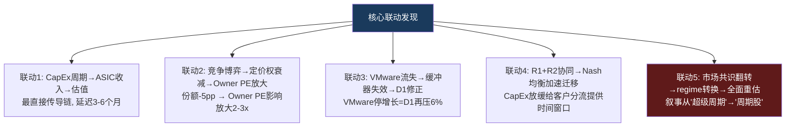

**VMware流失→整体估值的连锁效应**:

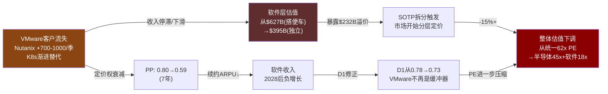

**62x PE最大的隐藏风险不是单一风险事件，而是风险之间的正反馈循环**[DM-P3-B-16]。

---

## 第十四章：温水煮青蛙——五年-39%

### 14.1 慢性恶化路径

这是最危险的情景，因为它不触发任何单一告警但累积伤害巨大。每一步都有"合理解释"，分析师会在每个季度找到理由维持评级。但5年之后回头看，路径清晰且不可逆。

| 年份 | 事件 | 单独看似无害 | 累积效果 |
|------|------|-------------|---------|
| 2026 | AI ASIC增速从+106%降至+45% | "正常减速,基数效应" | 增速仍超市场 |
| 2027H1 | VMware第一波3年合同到期,续约率92%(vs预期95%) | "略低但可接受" | Nutanix加速 |
| 2027H2 | Hyperscaler CapEx指引从"加速"改为"优化效率" | "措辞变化而已" | **承重墙前兆信号** |
| 2028 | MediaTek/Marvell获得2个新Hyperscaler ASIC合同 | "市场在增长,份额有空间" | ASIC份额65%→58% |
| 2029 | AI ASIC增速降至+8%, VMware开始负增长(-3%) | "行业成熟化" | 总收入增速<10% |
| 2030 | Hock Tan(77岁)宣布退休计划 | "可预期的过渡" | PE从30x→22x |

### 14.2 逐年温度分解

温水煮青蛙的特征是每一年的跌幅都在"可接受"范围内:

- **Year 1 (2026): -8%**。增速减速→PE从62x→57x, 收入仍强劲。分析师说: "基数效应，增速仍远超市场。"
- **Year 2 (2027): -7%**。VMware续约略低+CapEx措辞变化。PE 57x→53x。分析师说: "一次性因素，管理层表示正在改善。"
- **Year 3 (2028): -10%**。ASIC份额开始可见下降+regime转换前兆。PE 53x→42x。分析师说: "份额下降但TAM更大，总收入仍在增长。"
- **Year 4 (2029): -8%**。收入增速跌破10%。PE 42x→30x。分析师说: "成熟大公司的正常估值回归。"
- **Year 5 (2030): -12%**。Hock Tan退休+PE最终压缩。PE 30x→22x。分析师说: "继任者需要时间证明自己。"
- **复合**: (1-0.08)(1-0.07)(1-0.10)(1-0.08)(1-0.12) = 0.61 → **-39%**

没有任何一年达到"崩溃"级别(>-20%)。但5年复合后，投资者承受了-39%的实际损失。

### 14.3 累积效果量化

**收入**: $101B(FY2025) → $200B(温水煮青蛙路径) vs 市场隐含$280B，差距40%。
**PE**: 从62x → 22x(regime转换+继任折价)。
**市值**: 从$1,578B → $960B(**-39%**)。
**每一步都"正常"，但终点是灾难性的**[DM-P3-B-13]。

### 14.4 与Cisco 2000的关键区别

Cisco的暴跌是急性的(18个月内-80%)，因为电信泡沫破裂是突然事件。Broadcom的风险更接近温水煮青蛙——慢性、渐进、每一步可解释。这使得投资者更难设定止损点。

重要区别：(1)Broadcom的网络芯片护城河(PtW 45/50)提供了Cisco没有的"锚"——即使ASIC和VMware完全衰减，网络层仍能维持约15-20%的收入和高利润；(2)FCF margin 42%提供了价值底线；(3)$73B AI backlog提供了2-3年收入可见性缓冲。

### 14.5 护城河拐点时间线

```
         2026    2027    2028    2029    2030
网络      ████    ████    ████    ████    ███░  (near-constant, 90%→85%)
ASIC      ████    ███░    ███░    ██░░    ██░░  (衰减, 67%→60%)
VMware PP 0.80    0.79    0.78    0.73    0.69  (加速衰减)
Hock Tan  ████    ████    ███░    ██░░    ???   (合同到2030, 然后?)
```

[DM-P3-B-14]

**网络拐点(2028)**: NVIDIA Spectrum-X第二代出货，Hyperscaler是否在非DGX环境测试。当前信号——Arista仍100%锁定Broadcom($6.8B PO)，拐点尚未到来。即使拐点在2028年到来，份额下降也是渐进的(每年2-3pp)——协议栈替换的转换成本使客户自身也有极高切换障碍。

**ASIC拐点(2028-2029)**: 第二个Hyperscaler(最可能是Meta)将外围层分拆。当前信号——MediaTek已获Meta 2nm合同(2027H1量产)[DM-P3-B-02]，拐点正在接近。

**VMware拐点(2027-2028)**: 第一波3年合同到期的续约窗口。当前信号——Q1 FY2026仅+1%[DM-P2-B2-06]，提价红利已完全耗尽。

**Hock Tan拐点(2030)**: 合同到期(77岁)。溢价估计占当前PE中10-15x(约$160-240B市值)[DM-P1-A05]。最佳情景: 2027-2028提前确认继任者→折价<5%。最差情景: 2030突然退休+无继任→折价15%+。

### 14.6 估值regime转换的触发条件

Broadcom增速路径:
- FY2025→FY2026: +60%(增速峰值，增长regime)
- FY2026→FY2027: +49%(仍高但减速)
- FY2027→FY2028: +22%(接近regime转换区间)
- FY2028→FY2029: +12-15%(regime转换可能触发)

**四个具体触发条件**:
1. **增速门槛**: 总收入YoY增速连续两季低于20%
2. **叙事转变**: Hyperscaler CEO在财报会从"加速投资"转为"优化效率/提高ROI"
3. **SBC叙事**: SBC维持11%+ vs收入增速降至<20%，Non-GAAP PE的"合法性"受到质疑
4. **同业参照**: 如果NVDA率先经历regime转换，AVGO将被动跟随

### 14.7 五引擎同步衰减的概率分析

所有四层护城河同时加速衰减是小概率事件(约5-10%)，但所有四层至少温和衰减是高概率事件(约65-70%)。温水煮青蛙情景的特征恰恰是后者——不是灾难性同步崩溃，而是多条线路同时以各自的速度慢性恶化，累积成一个无法在单个季度识别的下行趋势。

这正是62x PE最大的脆弱性所在：它定价的是"所有引擎同时正面运转"，但"温和全面衰减"的概率远高于"全面持续增强"的概率。市场需要完美执行才能证明当前估值合理，而温水煮青蛙只需要正常的均值回归[DM-P3-B-16]。
