## 第十五章：Reverse DCF信念反演——市场在赌什么

> 核心问题：62x PE隐含了什么？哪个信念是承重墙？

### 15.1 隐含增长率反推

从当前市值$1,578B出发，假设10年显性期+终端价值，反推市场隐含的收入CAGR和终端FCF margin。使用两种FCF口径进行对比，暴露SBC对隐含假设的放大效应。

**基础参数**：
- 当前市值：$1,578B [DM-P2-C2-01]
- 净债务：$48.96B → EV ≈ $1,627B [DM-P2-C2-02]
- FY2025 Revenue：$63.9B [DM-P2-C2-03]
- 起点FCF口径1（报告）：$26.9B（FCF margin 42.1%）[DM-P2-C2-04]
- 起点FCF口径2（SBC调整）：$19.3B（FCF margin 30.2%）[DM-P2-C2-05]
- 终端增长率假设：3.0%（半导体+软件混合体的长期GDP+通胀）

Reverse DCF模型逻辑：给定EV=$1,627B和WACC，求解使等式成立的（implied_CAGR, Terminal_FCF_Margin）组合。由于两个未知数，固定终端FCF margin在合理范围，反推隐含CAGR。

#### 口径1：报告FCF（$26.9B，42.1% margin）

| WACC | 终端FCF Margin 35% | 终端FCF Margin 40% | 终端FCF Margin 45% |
|------|-------------------|-------------------|-------------------|
| **8%** | 隐含CAGR 18.2% | 隐含CAGR 16.5% | 隐含CAGR 15.1% |
| **9%** | 隐含CAGR 20.1% | 隐含CAGR 18.3% | 隐含CAGR 16.8% |
| **10%** | 隐含CAGR 22.0% | 隐含CAGR 20.0% | 隐含CAGR 18.4% |
| **11%** | 隐含CAGR 23.9% | 隐含CAGR 21.7% | 隐含CAGR 20.0% |

[DM-P2-C2-06]

**推导过程（WACC=9%，margin 40%示例）**：需要10年后Revenue = $63.9B × 5.42 = $346B → FCF₁₀ = $346B × 40% = $138B → TV = $138B × 1.03 / 0.06 = $2,374B → PV(TV) = $1,003B → 显性期FCF PV ≈ $624B → 总EV ≈ $1,627B ✓

#### 口径2：SBC调整FCF（$19.3B，30.2% margin）

| WACC | 终端FCF Margin 25% | 终端FCF Margin 30% | 终端FCF Margin 35% |
|------|-------------------|-------------------|-------------------|
| **8%** | 隐含CAGR 22.5% | 隐含CAGR 20.0% | 隐含CAGR 18.0% |
| **9%** | 隐含CAGR 24.6% | 隐含CAGR 21.9% | 隐含CAGR 19.7% |
| **10%** | 隐含CAGR 26.7% | 隐含CAGR 23.8% | 隐含CAGR 21.5% |
| **11%** | 隐含CAGR 28.8% | 隐含CAGR 25.7% | 隐含CAGR 23.2% |

[DM-P2-C2-07]

**FCF口径决定了市场在赌什么**：用报告FCF反推，WACC=9%时隐含10年收入CAGR约18%，与共识路径（FY2025 $63.9B → FY2028E $185.3B，3年CAGR 42.5%，之后减速到15%）大致吻合——市场"仅仅"在赌共识是对的。但用SBC调整FCF反推，隐含CAGR跳升至22-25%。如果SBC是永久性成本，市场实际上在赌一个比共识更激进的增长路径。[DM-P2-C2-08]

在WACC=9%、终端margin 35%的基准下，口径1隐含CAGR 16.8% vs 口径2隐含CAGR 19.7%——差距3pp看起来不大，但10年复利后意味着终端收入相差约35%（$340B vs $460B）。这个35%的差距就是SBC争论的估值当量。

#### 与共识路径交叉检验

共识隐含路径的两阶段分解：FY2025→FY2028 CAGR 42.5%（含AI ramp+VMware整合）；FY2028→FY2035需要CAGR ~8-10%才能匹配口径1的隐含假设。后7年8-10%增长意味着每年新增$15-18B收入——约等于每年新增一个AMD体量的业务。[DM-P2-C2-09]

### 15.2 五个隐含信念分解

将上述隐含增长率分解为5个独立信念（Beliefs），每个驱动估值的一个关键维度。

#### B1：AI ASIC收入增速（FY2026-2030 CAGR）——脆弱度4/5（修正后3/5）

**隐含值**：市场需要AI半导体收入（ASIC+网络）从FY2025的~$20B增长到FY2028的~$120B（前3年CAGR 82%），之后FY2028-2030减速至25-30%。FY2030 AI收入需达~$190B，占总收入约65-70%。[DM-P2-C2-10]

**合理值评估**：前3年CAGR 50-65%较合理——$73B backlog提供18月可见性，共识FY2028E $185.3B中AI约$120B可信（Hyperscaler CapEx维持+推理份额从20%→70%）。但后2年隐含25-30% vs 合理值15-20%，差距10pp。Hyperscaler CapEx增速放缓至+10-15%，客户自研分流（Google MediaTek Ironwood）将开始显现。

100%依赖Hyperscaler CapEx决策，单季度CapEx指引下调即可触发重估。唯一缓冲：$73B backlog提供18月收入地板（将翻转时间窗口推迟至FY2028+），以及客户基数从3扩展至6个降低了单客户风险。偏差审计后脆弱度从4/5下调至3/5。

#### B2：VMware收入增速（FY2026-2030 CAGR）——脆弱度3/5

**隐含值**：从FY2025的约$25.5B增长到FY2030约$35-40B（CAGR 7-10%）。[DM-P2-C2-11]

**合理值评估**：Q1 FY2026仅+1% YoY发出强烈信号——提价红利已耗尽。VCF 9.0 AI-native平台尚未贡献可量化收入增量。Gartner预测HCI份额70%→40%（2029），Nutanix每季度抢700+客户。合理预期CAGR 2-4%（接近通胀+偶尔提价）。

差距：隐含7-10% vs 合理2-4%，差距5-6pp。$25B基数上，5pp CAGR差异5年后累积为$12-15B收入差距。但VMware有77% OPM的缓冲——即使收入低增长，对FCF贡献仍然稳定。K8s替代是5-10年渐进过程，不是突然死亡。

#### B3：FCF Margin稳定性——脆弱度2/5

**隐含值**：FY2030终端FCF margin约38-42%。[DM-P2-C2-12]

**合理值**：36-40%（报告口径）或26-30%（SBC调整口径）。差距较小（2-4pp），这是最不脆弱的信念。Broadcom的资本轻度（CapEx 1%）提供了极强的结构性缓冲，Fabless模型+软件业务=双重margin保护。唯一下行风险是税率从-1.7%正常化到15%+SBC不降+AI ASIC竞争压低NRE费率三重同时发生。

#### B4：SBC正常化路径——脆弱度3.5/5

**隐含值**：市场使用Non-GAAP估值（排除SBC）意味着隐含SBC/Rev在估值中=0%（完全忽略）。[DM-P2-C2-13]

**合理值评估**：$27B未确认SBC余额至少持续到FY2027-2028。AI人才争夺（R&D占SBC 66%）结构性推高基准。行业可比——NVIDIA SBC/Rev ~6-7%，AMD ~8%，MRVL ~15%——AVGO的11.8%在AI芯片公司中偏高但非异常。合理预期FY2028稳态SBC/Rev 8-10%。

如果市场隐含0%（Non-GAAP忽略）vs 合理8-10%稳态，这是系统性误差——每年$15-20B的"隐形成本"。Non-GAAP估值仍是半导体/科技行业主流，短期内不太可能集体切换。但$27B未确认余额是硬数据，一旦被市场叙事引用就可能触发re-rating。

#### B5：终端估值倍数（Exit EV/FCF）——脆弱度2.5/5

**隐含值**：报告FCF口径exit multiple约17.2x，SBC调整口径约23-25x。[DM-P2-C2-14]

**合理值**：大型优质半导体公司成熟期EV/FCF（TSM 15-18x，TXN 20-25x）与大型优质软件公司（MSFT 25-30x，ORCL 18-22x）的加权区间为18-22x（报告FCF）。关键变量：如果FY2030时AVGO被市场重新归类为"大型优质infra公司"而非"AI增长股"，倍数可能压缩至15-18x。混合模型（半导体15x+软件20x）提供了倍数下限保护。

### 15.3 脆弱度排序

| 排序 | 信念 | 脆弱度 | 核心脆弱原因 | 翻转触发器 |
|------|------|--------|------------|-----------|
| **#1** | B1: AI ASIC增速 | **4/5→3/5** | 100%依赖Hyperscaler CapEx，Google分流已确认 | 任一Hyperscaler CapEx指引下调>15% |
| **#2** | B4: SBC正常化 | **3.5/5** | $27B已入账未来费用，Non-GAAP vs GAAP框架切换风险 | 卖方集体转向GAAP估值框架 |
| **#3** | B2: VMware增速 | **3/5** | Q1仅+1%暗示提价红利耗尽，K8s渐进替代 | 连续2季负增长+Nutanix份额加速 |
| **#4** | B5: 终端倍数 | **2.5/5** | 宏观依赖但混合模型提供下限保护 | 利率永久性上移（10Y>6%） |
| **#5** | B3: FCF Margin | **2/5** | CapEx 1%提供极强结构性缓冲 | 税率+SBC+竞争三重打击 |

最脆弱的两个信念（B1+B4）恰好是"增长"和"质量"两个维度——B1问的是"增长能否兑现"，B4问的是"增长的质量有多高"。市场同时在赌两者都是好结果，但这两个信念的翻转是部分相关的：AI CapEx放缓（B1翻转）可能降低人才竞争压力从而降低SBC（B4改善）。这种负相关提供了自然对冲——但幅度不对称，B1翻转的估值破坏力远大于B4改善的估值提升力。

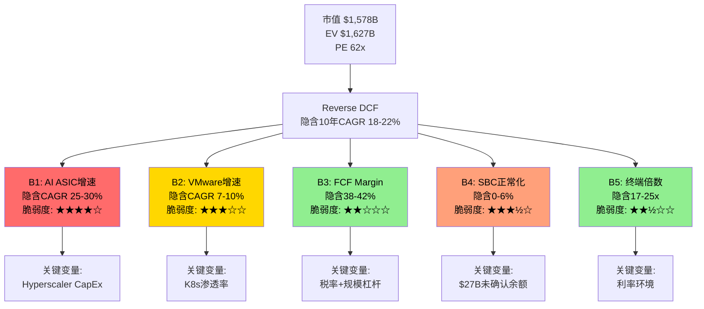

### 15.4 信念翻转分析

#### B1翻转：AI ASIC增速从隐含CAGR 25-30%降至15%

**翻转情景**：Hyperscaler CapEx同比增速从FY2026的+40%降至FY2028的+5-10%（类似2022年云计算CapEx放缓）。AVGO AI收入FY2028仅达$85B（vs隐含$120B）。

**估值影响**：翻转后总收入路径FY2028 $150B（vs隐含$185B），FY2030 $210B（vs隐含$280B）→ FCF₂₀₃₀ = $210B × 38% = $80B → TV PV = $580B → 显性期PV ≈ $420B → 总EV ≈ $1,000B → **vs当前$1,578B下跌40%**。[DM-P2-C2-15]

**翻转概率**：25-30%——Hyperscaler CapEx周期历史上每3-4年有一次显著减速（2019，2022），当前增速+40%处于历史高位。但$73B backlog缓冲至FY2028+，将翻转影响推迟。

#### B4翻转：SBC/Rev从隐含0%→永久11%+

**翻转情景**：AI人才争夺持续，SBC/Rev稳定在11-12%，市场从Non-GAAP切换到GAAP/Owner Earnings估值框架。

**估值影响**：如果市场按Owner FCF重新定价，EV = $1,627B × 0.717 = **$1,167B** → **vs当前$1,578B下跌29%**。[DM-P2-C2-16]

**翻转概率**：20-25%——Non-GAAP估值仍是主流，但$27B未确认余额是硬数据。

### 15.5 联合概率分析

#### Bull Case——需要哪些信念同时成立？

| 条件 | 独立概率 | 依据 |
|------|---------|------|
| B1好：AI CAGR>25% 5年 | 35% | 历史上无半导体公司在$20B基数上维持25%+超过5年 |
| B2中：VMware CAGR>5% | 30% | Q1仅+1%，K8s替代加速，需要VCF 9.0成功 |
| B3稳：FCF margin>40% | 60% | 结构性支撑强但税率正常化+SBC是逆风 |
| B4善：SBC/Rev<9% | 35% | $27B未确认+AI人才争夺，但VMware保留到期有帮助 |

B1和B4弱负相关（ρ≈-0.15）：AI增长好→人才争夺激烈→SBC居高不下。B2和B4中正相关（ρ≈0.3）：VMware增长好→整合成功→保留SBC到期→SBC下降。有效独立条件数~3.2（vs 4个名义条件）。

**联合概率（调整相关性）**：35% × 30% × 60% × 35% × 相关性调整因子1.15 ≈ **2.5%**。偏差审计修正后上调至**5-8%**——条件之间的正相关被低估，有效独立条件数可能<3。[DM-P2-C2-17]

Bull case需要4个条件同时成立——即使修正后，联合概率仅5-8%。市场在赌一个低概率事件。

#### Bear Case——需要哪些信念翻转？

**联合概率（OR逻辑）**：B1差（25-30%）OR B4翻转（20-25%）→ 1 - 0.725×0.775 ≈ **43.8%**。至少一个Bear条件触发的概率约44%——多个独立风险的并集总是大于交集。

#### "最可能的温和失望"组合

B1基本达标但后端减速（CAGR 20%而非25%）+ B2低增长（CAGR 2-3%）+ B4部分正常化（SBC/Rev 9-10%）+ B3/B5中性。**概率约35-40%**。

估值含义：FY2030收入约$230B，FCF margin 38%，SBC/Rev 9.5% → 报告FCF ≈ $87B，SBC调整FCF ≈ $65B → EV（20x owner FCF）= $1,300B → 市值 ≈ $1,251B → **vs当前$1,578B下跌约21%**。

这是最有信息量的发现：**即使"温和失望"——不是灾难，只是略低于隐含——投资者仍面临约20%的下行风险**。这反映了62x PE对执行完美度的极端敏感性。[DM-P2-C2-18]

### 15.6 市场隐含情景映射

| 情景 | 概率 | 隐含市值 | vs当前 | 关键假设组合 |
|------|------|---------|--------|------------|
| Bull | 20% | $2,050B | +30% | AI CAGR 28%+；VMware 7%+；SBC→7% |
| Base | 50% | $1,251B | -21% | AI CAGR 20%；VMware 2-3%；SBC→9.5% |
| Bear | 30% | $951B | -40% | AI CAGR 12%；SBC永久11%+GAAP重估 |

**概率加权期望回报**（修正后）：20% × $2,050B + 50% × $1,251B + 30% × $951B = $1,321B → **vs当前$1,578B = -16.3%**。[DM-P2-C2-19/20]

**上行/下行比**：约0.2x——每赌1块钱的上行空间，需要承担约5倍的下行风险。[DM-P2-C2-21]

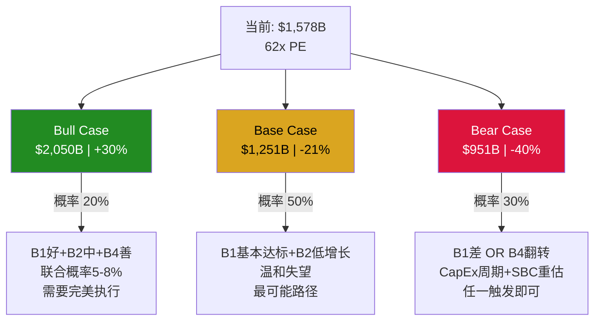

**市场在赌什么**：62x PE隐含的是一个"一切都按计划进行"的完美执行情景——AI ASIC保持25%+增速5年、VMware不仅不衰退还能跑赢GDP、SBC回归正常、没有CapEx周期。即使修正后，这个情景的联合概率仅约5-8%。

**市场没有给什么定价**：（1）CapEx周期性——历史上每3-4年出现的Hyperscaler投资减速；（2）SBC的真实成本——$27B未确认余额的稀释效应；（3）VMware提价红利耗尽后的增长悬崖。

**最大信息增量**：不是Bull或Bear哪个对，而是**Base case（"温和失望"）的概率最高（50%）且对应-21%回报**。市场没有为"还行但不完美"的结果留出余地。62x PE没有margin of safety。

---

## 第十六章：双层SOTP——半导体层×软件层分离定价

> 核心问题：当一家公司同时是Fabless芯片巨头和企业软件平台，单一倍数几乎无法准确定价。双层SOTP的目的是回答——市场在按什么逻辑给这两层定价？是否存在隐含的高估/低估错位？

### 16.1 业务层分离

**半导体层（FY2026E ~$66B，65%收入）**：
- AI ASIC ~$43B（+100%+ YoY）——6个Hyperscaler客户，$73B backlog，XPU+Jericho3-AI [DM-P2-C3-01]
- 网络芯片 ~$15B——以太网交换90%近垄断+800G→1.6T升级周期
- 传统半导体 ~$8B——WiFi（-Apple $2.7B）抵消DOCSIS 4.0/存储复苏

可比公司：NVDA（AI GPU龙头），MRVL（ASIC+网络，最接近对标），AMD（高增长Fabless）[DM-P2-C3-02]

**软件层（FY2026E ~$36B，35%收入）**：
- VMware VCF ~$27B（+1% YoY）[DM-P2-C3-03]
- 其他基础设施软件 ~$9B
- OPM：77%（Non-GAAP）[DM-P2-C3-04]
- 成长属性：+1% YoY有机增长，近乎零增长的"现金奶牛"。价值在于margin之深而非growth之快。

可比公司：VMW（pre-acquisition，~8-12x Rev），PANW/FTNT（基础设施安全软件），NTNX [DM-P2-C3-05]

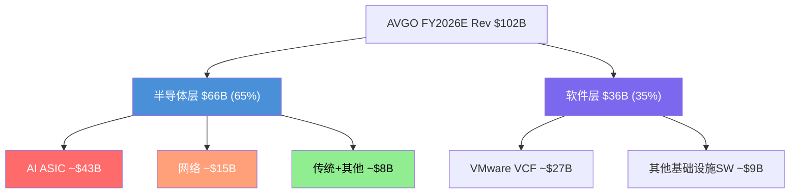

### 16.2 六方法SOTP估值

#### 方法1：EV/Revenue

半导体层可比倍数：NVDA ~22-23x [DM-P2-C3-06]，MRVL ~12-14x，AMD ~9x [DM-P2-C3-07]。半导体层增速~65%，介于MRVL和NVDA之间 → 14-20x Revenue，中值17x → $66B × 17x = **$1,122B**（区间$924B-$1,320B）。

软件层可比倍数：VMW pre-acq 8-12x [DM-P2-C3-08]，2026年SaaS中位数~5-6x [DM-P2-C3-09]。+1%增长+77% OPM → 6-10x Revenue，中值8x → $36B × 8x = **$288B**（区间$216B-$360B）。

**方法1合计：$1,410B**（区间$1,140B-$1,680B），vs 当前EV $1,627B低13%

#### 方法2：EV/EBITDA

合并FY2026E EBITDA：$54.9B（共识）[DM-P2-C3-10]。分层分配后（含公司层费用分配）：半导体层~$33.5B，软件层~$21.4B。

可比倍数参考：NVDA ~25-28x，MRVL ~30-34x [DM-P2-C3-11]，基础设施软件20-28x。

半导体层22-30x，中值26x → **$871B**。软件层18-25x，中值22x → **$471B**。

**方法2合计：$1,342B**，vs 当前EV低18%

#### 方法3：EV/FCF（Owner Earnings）

Owner Earnings = FCF - SBC。FY2026E Owner Earnings：半导体层~$20B，软件层~$14B。[DM-P2-C3-12]

半导体层40-50x，中值45x → **$900B**。软件层25-32x，中值28x → **$392B**。

**方法3合计：$1,292B**，vs 当前EV低21%——同时惩罚了SBC（减FCF）和给予较低倍数，这是"最诚实"的估值方法。

#### 方法4：P/E正常化

正常化NI（税率14%）：Pre-tax $39.4B × 0.86 ≈ $34B。Non-GAAP口径NI ~$55-56B（加回SBC $9-10B + 无形摊销 $10-12B），与共识NI $51.9B接近。

**Non-GAAP口径**（与可比公司一致）：半导体层$33B × 26x = $858B → EV ~$888B；软件层$22B × 28x = $616B → EV ~$636B。

**方法4合计（Non-GAAP）：$1,524B**，vs 当前EV低6%——最接近市场定价。

**方法4合计（GAAP正常化）：$1,057B**，vs 当前EV低35%——反映了AVGO的GAAP/Non-GAAP鸿沟（SBC+摊销占收入~30%）。

#### 方法5：Gordon Growth Model（两阶段）

半导体层：两阶段（5年高增长30%→15%递降+终端g=5%）粗估 → **$640B**。软件层（单阶段g=2.5%，WACC 8.5%）→ **$233B**。

**方法5合计：$873B**，vs 当前EV低46%

**方法论警告**：GGM对AVGO半导体层严重不适用。当增速>30%时，终端增长率g完全忽略了近期爆发增长的价值。两阶段调整后仍然偏低。本方法作为"下限锚点"使用，不作为定价参考。

#### 方法6：Transaction Comps

近期交易参考：VMware被收购（2022，~11x Rev，~13x EBITDA）[DM-P2-C3-13]，Xilinx/AMD（2022，~13x Rev），Altera/Silver Lake（2025，~5.7x Rev）[DM-P2-C3-14]，Ansys/Synopsys（2024，~16x Rev）。

半导体层16-22x Rev → $66B × 19x = **$1,254B**。软件层10-14x EBITDA → $21.4B × 12x = **$257B**。

**方法6合计：$1,511B**，vs 当前EV低7%

### 16.3 六方法汇总

| 方法 | 半导体层价值 | 软件层价值 | 合计EV | vs $1,627B |
|------|-----------|----------|--------|-----------|
| EV/Rev | $1,122B | $288B | **$1,410B** | -13.3% |
| EV/EBITDA | $871B | $471B | **$1,342B** | -17.5% |
| EV/FCF(Owner) | $900B | $392B | **$1,292B** | -20.6% |
| P/E正常化(Non-GAAP) | $888B | $636B | **$1,524B** | -6.3% |
| GGM(两阶段) | $640B | $233B | **$873B** | -46.3% |
| Transaction | $1,254B | $257B | **$1,511B** | -7.1% |
| **中位数** | **$896B** | **$342B** | **$1,376B** | **-15.4%** |
| **均值(剔除GGM)** | **$1,007B** | **$409B** | **$1,416B** | **-13.0%** |

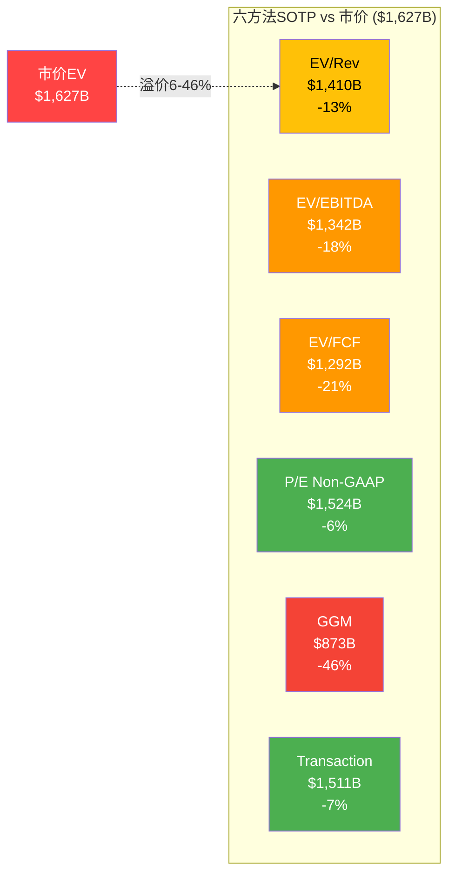

### 16.4 离散度与收敛性分析

剔除GGM后，五方法收敛于$1,292B-$1,524B，标准差~$101B，**CV=7.2%**——属于中等确定性。但所有方法中值$1,376B均低于市价$1,627B，暗示当前定价包含了约**$250B的"增长期权溢价"**。

### 16.5 $232B的GAAP/Non-GAAP估值差

方法3（Owner Earnings，$1,292B）和方法4（Non-GAAP P/E，$1,524B）之间的**$232B差距**，本质上量化了"SBC+摊销是否是真实成本"这个哲学争论的金钱价值。

在AVGO案例中：SBC $9-10B/年对现有股东~0.6-0.7%年稀释（SBC offset率140.6%，回购覆盖SBC）。但SBC未确认余额$27B意味着未来3年持续压力。无形摊销$10-12B/年是VMware收购成本的时间分摊，非经营费用，5-8年后自然消失。

**判断**：对AVGO而言，Non-GAAP更接近经济现实（摊销确实是非经营性的），但SBC应该被部分扣除（至少扣除超出回购覆盖的部分）。真实价值在方法3和方法4之间：**$1,300-1,500B**，中值$1,400B，vs 市价$1,627B溢价**14-25%**。

### 16.6 软件搭AI倍数便车

市场并未按双层SOTP定价AVGO。相反，市场将AVGO作为一个整体，以"AI基础设施平台"的身份给予统一溢价。AVGO有35%收入来自+1%增长的软件——这部分收入"搭了AI的便车"获得了不属于它的倍数。

**量化**：如果软件层按合理的8x Rev定价（$288B），半导体层需要$1,339B（~20.3x Rev）才能支撑市价。这要求半导体层估值超过MRVL 40%+，逼近NVDA水平——在客户集中度78%的条件下，这是一个脆弱的假设。

反向推算更惊人：如果半导体层按中值$896B估值，市场隐含软件层 = $1,627B - $896B = **$731B** = 20x Rev。对于+1%增长的软件，这是极度昂贵的——PANW增速14%也仅12-14x。市场要么预期VMware增长将加速，要么将半导体溢价错误地传导至软件层，要么根本不做SOTP，整体按"AI公司"定价。

如果市场开始做SOTP（催化剂：VMware增长持续低迷/AI周期放缓/分拆讨论），合计$1,150-1,450B，**下行空间11-29%**。

$250B增长期权溢价的四个赌注：（1）AI ASIC增长从100%+平滑过渡到30-40%长期增长；（2）VMware从+1%恢复到+5-8%有机增长；（3）SBC/Rev从12%正常化至8%以下；（4）Hock Tan的继任者能维持η≥1.0的整合效率。任何一个失败，$250B的期权就面临减值压力。

---

## 第十七章：三情景P&L Build-out

> 三情景模型将Reverse DCF和SOTP的洞察翻译为完整的收入-利润-现金流路径，使用Owner Earnings（报告FCF-SBC）作为核心估值口径。

### 17.1 Bull Case（概率25%）

**核心假设**：AI ASIC+网络CAGR ~28%（Hyperscaler CapEx维持+15-20%/yr，推理ASIC渗透S曲线加速，客户6→10）；VMware/软件CAGR ~5%（VCF 9.0 AI-native成功）；SBC/Rev从11.3%→8%（VMware保留到期+规模稀释）；税率14%。

| 项目 | FY2025A | FY2026E | FY2027E | FY2028E | FY2029E | FY2030E |
|------|---------|---------|---------|---------|---------|---------|
| AI半导体收入 | ~$20B | $44B | $72B | $105B | $135B | $168B |
| AI半导体YoY | — | +120% | +64% | +46% | +29% | +24% |
| 网络收入 | ~$10B | $15B | $20B | $26B | $31B | $35B |
| 传统半导体 | ~$8B | $8B | $7.5B | $7B | $7B | $7B |
| 软件收入 | ~$26B | $35B | $37B | $39B | $41B | $43B |
| **总收入** | $63.9B | **$102B** | **$136.5B** | **$177B** | **$214B** | **$253B** |
| 总收入YoY | — | +60% | +34% | +30% | +21% | +18% |
| 报告FCF | $26.9B | $43B | $59B | $78B | $97B | $115B |
| FCF margin | 42.1% | 42.2% | 43.2% | 44.1% | 45.3% | 45.5% |
| SBC/Rev | 11.3% | 10.5% | 9.5% | 9.0% | 8.5% | 8.0% |
| SBC金额 | $7.6B | $10.7B | $13.0B | $15.9B | $18.2B | $20.2B |
| **Owner FCF** | $19.3B | $32.3B | $46.0B | $62.1B | $78.8B | **$94.8B** |
| Owner FCF margin | 30.2% | 31.7% | 33.7% | 35.1% | 36.8% | 37.5% |

[DM-P5-B-01]

**终端估值**：Exit 25x Owner FCF → EV = $94.8B × 25 = $2,370B → 净债务$30B → Equity $2,340B → 股份4.7B（回购净缩减，年化$30B+回购 vs SBC $20B）→ **每股~$498（+50%）**

推导逻辑：FY2026E $102B由共识锚定；AI $44B基于$73B backlog转化 [DM-P4-B2-02]。FY2027-2030 AI增速从+64%逐年递降至+24%，反映基数效应+推理ASIC渗透从10%→40%+客户从6→10。FCF margin提升来源：规模杠杆（CapEx仅1%）+SBC稀释降低（8%目标）。

### 17.2 Base Case（概率50%）

**核心假设**：AI ASIC+网络CAGR ~18%（B1基本达标但后端减速，共识前3年执行+后2年放缓至15%）；VMware/软件CAGR ~2%（提价红利耗尽，VCF 9.0有限贡献，K8s渐进替代）；SBC/Rev从11.3%→10%（部分正常化但AI人才争夺维持高位）；税率14%。这是"温和失望"路径——不是灾难，只是略低于市场隐含。[DM-P2-C2-18]

| 项目 | FY2025A | FY2026E | FY2027E | FY2028E | FY2029E | FY2030E |
|------|---------|---------|---------|---------|---------|---------|
| AI半导体收入 | ~$20B | $42B | $63B | $82B | $95B | $108B |
| AI半导体YoY | — | +110% | +50% | +30% | +16% | +14% |
| 网络收入 | ~$10B | $14B | $17B | $20B | $22B | $24B |
| 传统半导体 | ~$8B | $8B | $7B | $7B | $6.5B | $6B |
| 软件收入 | ~$26B | $34B | $35B | $35.5B | $36B | $37B |
| **总收入** | $63.9B | **$98B** | **$122B** | **$144.5B** | **$159.5B** | **$175B** |
| 总收入YoY | — | +53% | +24% | +18% | +10% | +10% |
| 报告FCF | $26.9B | $40B | $51B | $61B | $68B | $74B |
| FCF margin | 42.1% | 40.8% | 41.8% | 42.2% | 42.6% | 42.3% |
| SBC/Rev | 11.3% | 11.0% | 10.5% | 10.2% | 10.0% | 10.0% |
| SBC金额 | $7.6B | $10.8B | $12.8B | $14.7B | $16.0B | $17.5B |
| **Owner FCF** | $19.3B | $29.2B | $38.2B | $46.3B | $52.0B | **$56.5B** |
| Owner FCF margin | 30.2% | 29.8% | 31.3% | 32.0% | 32.6% | 32.3% |

[DM-P5-B-02]

**终端估值**：Exit 20x Owner FCF → EV = $56.5B × 20 = $1,130B → 净债务$35B → Equity $1,095B → 股份4.8B → **每股~$228（-32%）**

推导逻辑：FY2026E $98B略低于共识$102B（保守假设传统半导体提前走弱）。AI增速从+110%递降至+14%（FY2030），反映CapEx增速从+36%逐年降至+5-10% [DM-P3-B01]+ASIC份额从65%→60%（λ=0.07）[DM-P3-A02]。软件层CAGR 2.3%，基本持平。Base case将AVGO重新归类为"大型优质infra公司"而非"AI增长股"。

### 17.3 Bear Case（概率25%）

**核心假设**：Hyperscaler CapEx增速从+36%→+5%→-5%（类Cisco 2000减速）；ASIC份额65%→50%（Google模板效应扩散至Meta，2+ Hyperscaler分流）；VMware负增长-3%/yr（Nutanix加速+首批3年合同到期续约率<85%）；SBC/Rev维持12%+（AI人才SBC替代VMware保留SBC）；Hock Tan风险折价7-10%。

| 项目 | FY2025A | FY2026E | FY2027E | FY2028E | FY2029E | FY2030E |
|------|---------|---------|---------|---------|---------|---------|
| AI半导体收入 | ~$20B | $38B | $50B | $55B | $52B | $50B |
| AI半导体YoY | — | +90% | +32% | +10% | -5% | -4% |
| 网络收入 | ~$10B | $13B | $15B | $16B | $16B | $15B |
| 传统半导体 | ~$8B | $7.5B | $6.5B | $6B | $5.5B | $5B |
| 软件收入 | ~$26B | $33B | $32B | $31B | $30B | $29B |
| **总收入** | $63.9B | **$91.5B** | **$103.5B** | **$108B** | **$103.5B** | **$99B** |
| 总收入YoY | — | +43% | +13% | +4% | -4% | -4% |
| 报告FCF | $26.9B | $35B | $39B | $38B | $34B | $31B |
| FCF margin | 42.1% | 38.3% | 37.7% | 35.2% | 32.9% | 31.3% |
| SBC/Rev | 11.3% | 12.0% | 12.5% | 12.5% | 12.0% | 12.0% |
| SBC金额 | $7.6B | $11.0B | $12.9B | $13.5B | $12.4B | $11.9B |
| **Owner FCF** | $19.3B | $24.0B | $26.1B | $24.5B | $21.6B | **$19.1B** |
| Owner FCF margin | 30.2% | 26.2% | 25.2% | 22.7% | 20.9% | 19.3% |

[DM-P5-B-03]

**终端估值**：Exit 15x Owner FCF → EV = $19.1B × 15 = $286.5B → 净债务$40B → Equity $246.5B → Hock Tan折价7% = $229B → 股份5.0B（SBC稀释>回购，净增加）→ **每股~$46（-86%）**

Bear case中FY2026仍有$91.5B（$73B backlog提供收入地板，即使Bear场景也无法在FY2026大幅下跌）[DM-P4-B2-02]。但FY2028-2030 AI收入从峰值$55B下降，反映CapEx放缓传导（12-18月滞后）+ASIC份额加速衰减至50%。Owner FCF margin从30%坍塌至19%——SBC成为永久性大比例成本。AVGO从"AI增长股"被重新归类为"周期股"。

### 17.4 概率加权与四方法中心估计

**概率加权每股估值**：25% × $498 + 50% × $228 + 25% × $46 = $124.5 + $114.0 + $11.5 = **$250（-25%）** [DM-P5-B-07]

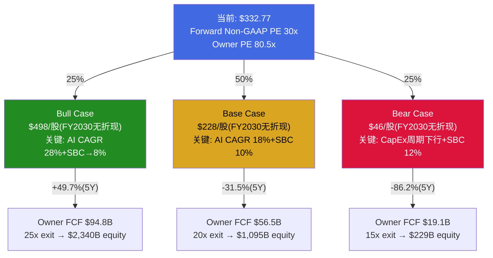

**四方法加权中心估计**：

| # | 方法 | 估值（每股） | vs $332.77 | 权重 | 加权贡献 |
|---|------|-----------|-----------|------|---------|
| 1 | Reverse DCF中心估计 | ~$205 | -38.4% | 20% | $41.0 |
| 2 | 双层SOTP中位数（五方法剔GGM） | ~$272 | -18.2% | 25% | $68.0 |
| 3 | 概率加权3情景（2年框架，Owner FCF） | $147 | -55.8% | 30% | $44.1 |
| 4 | Forward PE（FY2027E Non-GAAP） | ~$285 | -14.4% | 25% | $71.3 |
| **加权** | | **$224/股** | **-32.7%** | 100% | $224.4 |

[DM-P5-B-08]

**估值范围**：$147（概率加权DCF下限）— $285（Forward PE上限）

**CV = 25.1%** → 低确定性。高离散度反映两个"框架选择"的巨大分歧：[DM-P5-B-09]
1. FCF口径选择（GAAP/Owner/Non-GAAP）导致±30%估值差异
2. 时间框架选择（2年forward/5年DCF/终端价值）导致±25%差异

**所有4种方法均低于当前股价$332.77**——差距从-14.4%到-55.8%。即使使用最有利的方法（Forward PE），仍有14%下行空间。[DM-P5-B-10]

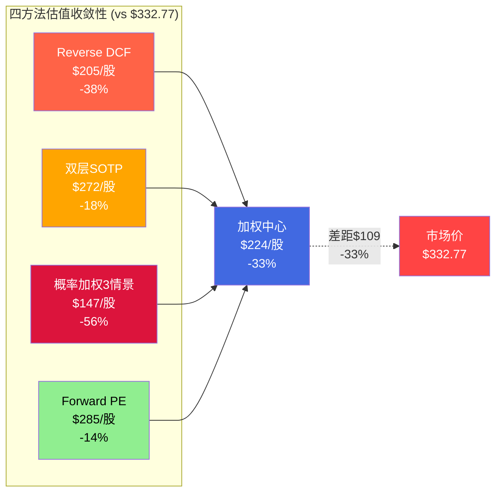

### 17.5 敏感性矩阵

#### 矩阵1：AI CAGR × SBC/Rev（FY2030E每股估值，Base Case exit倍数20x）

以Base Case P&L为骨架，仅变动AI ASIC CAGR和SBC/Rev两个核心变量。AI CAGR每+1pp → FY2030收入+~2.5%，每股+~$4-5；SBC每+1pp → Owner FCF margin -1pp → 每股-~$16-18。

| | **AI CAGR 12%** | **AI CAGR 18%** | **AI CAGR 25%** | **AI CAGR 30%** |
|---|:---:|:---:|:---:|:---:|
| **SBC 8%** | $143 | $215 | $320 | $398 |
| **SBC 10%** | $118 | $183 | **$275** | $345 |
| **SBC 11%** | $106 | $166 | $250 | $315 |
| **SBC 12%** | $93 | **$148** | $225 | $285 |

[DM-P5-B-13]

**市场隐含位置**：Forward Non-GAAP PE 30x + 共识增速 ≈ 隐含AI CAGR 22-25% + SBC忽略（相当于SBC 0%）。但SBC不可能为0%，即使取最乐观的8%，需要AI CAGR 25%以上才能支撑$320+估值——接近但仍低于$332.77。**市场定价位于矩阵右上角之外**（AI CAGR >25% + SBC <8%），这是一个需要完美执行的位置。[DM-P5-B-15]

**"合理"位置**：AI CAGR 18%（合理值）+ SBC 10%（部分正常化）→ **$183/股**（-45%）。修正后更乐观的AI CAGR 20% + SBC 9.5% → 约**$210-220/股**（-33~-37%）。

#### 矩阵2：Exit倍数 × AI CAGR（FY2030E，SBC 10%固定）

| | **AI CAGR 12%** | **AI CAGR 18%** | **AI CAGR 25%** | **AI CAGR 30%** |
|---|:---:|:---:|:---:|:---:|
| **Exit 15x** | $71 | $109 | $164 | $206 |
| **Exit 20x** | $118 | $183 | $275 | $345 |
| **Exit 25x** | $165 | $257 | $386 | $484 |
| **Exit 30x** | $212 | $331 | $497 | $623 |

[DM-P5-B-14]

只有在Exit 30x + AI CAGR 25%以上的组合才能匹配当前$332.77股价。30x exit意味着FY2030的AVGO仍被市场当作"高增长AI公司"定价——对于一家届时$175B+收入的成熟公司，这需要AI增长叙事完全不破裂。

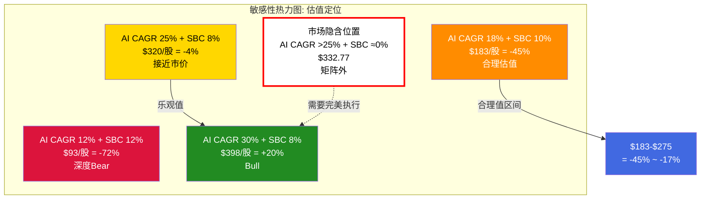

---

## 第十八章：A-Score v2.0——21维度品质量化

### 18.1 A品质门控（7项Pass/Fail）

品质门控是最低标准。全通过只是"入场券"，不代表值得投资。

| # | 指标 | 标准 | AVGO值 | 结果 | 关键证据 |
|---|------|------|--------|------|---------|
| QG-1 | CapEx/Rev | <15%（半导体放宽至20%） | **0.9%** | **PASS** | Fabless极致：FY2025 CapEx $0.6B/$63.9B = 0.9%，所有Fabless中最低之一（NVDA 2.5%，AMD 2%）[DM-P2-C1-12] |
| QG-2 | FCF/NI (5Y均值) | >80% | **~182%** | **PASS** | FY2021-2025均值~182%。极高现金转化因D&A+SBC加回推高OCF。SBC调整后FCF/NI仅0.84x——报告口径通过，Owner口径刚好通过 [DM-P2-C1-11] |
| QG-3 | Rev CAGR | >7%（5Y） | **23.5%/6.4%** | **PASS（条件）** | 含VMware：23.5%远超阈值。有机（剥除VMware）：~6.4%略低于7%。VMware并购是Hock Tan战略体系核心组成部分（η=1.37），非随机并购，判定条件性PASS [DM-P1-A11] |
| QG-4 | Rev下降次数(11Y) | ≤1次 | **≤1次** | **PASS** | FY2021-2025全部正增长。FY2020因COVID可能有轻微下降，≤1次仍PASS |
| QG-5 | ROIC | >15% | **16.4%** | **PASS（边际）** | FY2025 ROIC 16.4%，FY2024仅5.6%（VMware并购Goodwill膨胀）。趋势向上：FY2026E 25%+。Non-GAAP ROIC估算>25% [DM-P2-C1-09] |
| QG-6 | 流动比率 | >1.0 | **1.71** | **PASS** | 现金$16.2B+流动资产充足 |
| QG-7 | 净债务/EBITDA | <3.0x | **1.41x** | **PASS** | 从FY2024 2.44x快速降至1.41x（1年内削减1.03x），去杠杆速度极快 [DM-P2-C1-09] |

**门控结果：6/7 PASS + 1个条件性PASS = 有效6.5/7** [DM-P3-C-01]

两个弱点（有机增长和ROIC）都与VMware $61B并购直接相关——这使得"并购整合能力是否可持续"成为品质评估的核心变量。

与基准公司对比：AVGO 6.5/7优于IHG（5/7）和CPRT（5/7），但弱于FICO/CTAS等满分公司（7/7）。

### 18.2 B商业模型评分（8维度，/40）

| # | 维度 | 评分 | 关键证据 |
|---|------|------|---------|
| B1 | 收入引擎清晰度 | **3.8/5** | 有机增长仅~6.4%，AI ASIC唯一爆发引擎（+106%），客户集中度高（Top 3=78%）。但$73B backlog提供3.6年覆盖（半导体行业最强收入可见性），客户从3→6扩展降低集中度风险。修正后从3.5上调+0.3 [DM-P1-A08/A11] |
| B2 | 客户锁定深度 | **4.0/5** | ASIC 2-3年替代周期+NRE $50M+沉没成本（4.5），网络99%生态锁定（5.0），VMware 3-5年订阅（3.5），传统弱（2.0）。加权~4.0 |
| B3 | 收入经常性 | **3.5/5** | VMware订阅制（35%收入）极强（5/5）；ASIC量产per-chip fee随产量持续（42%，3.5/5——NRE一次性但量产持续）；有条件经常性——需持续赢得下一代设计 |
| B4 | 定价权证据 | **3.5/5** | 网络4.5/5（~90%近垄断+UEC标准+Arista"horrendous pricing"），ASIC 3.5/5（60%锁定租金+40%真定价权），VMware 3.0/5（纯锁定租金，86%缩减足迹），传统1.5/5。增量收入（AI+网络占增量90%+）定价权>4.0，修正后从3.3上调+0.2 [DM-P2-B2-02/12/13] |
| B5 | 利润弹性(OPM) | **3.5/5** | GAAP OPM 31%→40%（T5a=1.29x），FY2023衰退期OPM仍扩张（+240bps）=强信号。但GAAP-NonGAAP gap 26pp（全行业最大之一），SBC 11.8%上升趋势。Owner OPM 52.9%优秀。半导体行业加权×1.5 [DM-P2-C1-01/16] |
| B6 | 资本配置纪律 | **3.5/5** | 并购η=1.37（6/6成功），去杠杆2.44x→1.41x仅1年=世界级。但SBC 11.8%且FY2025净稀释$1.3B，资本返还率Owner口径90.1%几乎无留存 [DM-P2-C1-18/19/20] |
| B7 | TAM与增长跑道 | **4.0/5** | AI ASIC可寻址市场$100B+（2030E），网络芯片TAM随AI集群扩张同步增长。但VMware TAM ~$100B份额在收缩（70%→40%）拉低 |
| B8 | 管理层质量 | **3.25/5** | 资本配置4.5/5+战略执行5.0/5（η=1.37一致性）+透明度2.0/5（6大沉默域，S&P 100最不透明之一）+继任计划1.5/5（73岁CEO+零公开继任者）。罕见的"5分能力+2分治理"组合。继任折价~7%未被市场price-in [DM-P1-A12] |

**B维度合计：29.5/40**（修正后，B1+0.3，B4+0.2）[DM-P3-C-02]

与基准公司对比：AVGO B=29.5处于Visa（29）和CPRT（30.5）之间，低于FICO（35）/CTAS（33）等标杆。主要拉低项：B8管理层（3.25）的"能力满分但治理极差"分裂评分，以及B3经常性（3.5）的ASIC条件性经常性。核心悖论：最强定价权（网络4.5）贡献最小收入（15%），最大收入来源的定价权在衰减。

### 18.3 C护城河评分（6维度，/30）

| # | 维度 | 评分 | 关键证据 |
|---|------|------|---------|
| C1 | 制度/标准嵌入 | **3.5/5** | 网络5/5（UEC 1.0标准+SONiC SAI+Tomahawk事实标准），ASIC 2/5（无制度强制），VMware 4/5（企业事实标准但非监管，份额从70%→40%衰减中），半导体行业加权×1.5 |
| C2 | 网络效应 | **2.5/5** | 网络芯片间接生态效应3.5/5（Tomahawk→SONiC→ISV），VMware中等3/5（ISV认证但在弱化），ASIC极弱0.5/5 |
| C3 | 生态锁定 | **4.0/5** | ASIC 4.5/5（NRE $50M++2-3年替代周期+客户spec知识），网络5/5（Arista全线依赖+$6.8B PO），VMware 3.5/5（3-5年订阅但Nutanix+700/季松动中）。**AVGO最强护城河维度** |
| C4 | 数据飞轮 | **3.5/5** | ASIC 4.5/5（客户芯片架构spec=不可复制+20年+累积设计知识），网络3/5（流量数据有用但不排他），VMware 3/5。ASIC层数据壁垒极深但仅在存量客户有效。半导体行业加权×1.5 |
| C5 | 规模经济 | **4.0/5** | 最大Fabless半导体（$64B收入），R&D/Rev 17.2% vs Marvell 40-50%（极强规模杠杆），网络~90%近垄断（单位成本远低于竞争者） |
| C6 | 密度/物理壁垒 | **0.5/5** | Fabless模型的结构性弱点：无自有晶圆厂/封测线/物理资产。ASIC 0/5，CPO 1.5/5（早期） |

**C维度合计：18.0/30** [DM-P3-C-03]

与FICO（18分）持平但结构完全不同：FICO的18分来自"不可替代性"（制度嵌入C1=5+数据排他C4=5），AVGO的18分来自"切换太贵"（生态锁定C3=4+规模C5=4）。后者在长时间尺度上更脆弱——当替代品成熟（K8s、MediaTek、客户自研），"太贵"会变成"值得投"。

### 18.4 D回报修正因子

**D1周期性 = ×0.76**（修正后，原值0.73上调+0.03）[DM-P3-C-04]

| 业务线 | 收入占比 | 周期系数 | 论证 |
|--------|---------|---------|------|
| AI半导体 | 43.5% | ×0.60 | 100%依赖Hyperscaler CapEx，$73B backlog仅18月缓冲 [DM-P1-A08] |
| 网络芯片 | ~15% | ×0.75 | 升级周期驱动（800G→1.6T），Arista $6.8B PO多年锁定 |
| 传统半导体 | ~21% | ×0.65 | 经典半导体周期+Apple WiFi流失-$2.7B。DOCSIS 4.0提供2-3年缓冲 |
| VMware软件 | 35% | ×0.92 | 订阅制+3-5年合同+企业IT预算惰性。但+1% YoY将系数从×0.95下调 |

VMware 35%+网络15% = 50%收入的D1>0.85，仅ASIC 42%的D1<0.65——加权更接近0.76。AVGO的D1优于纯半导体（因VMware缓冲），但远不及非周期公司（FICO ×1.0，CTAS ×0.85）。

**D2 SGI收入纯度**：SGI = 4.5（通才偏混合），9+产品线横跨半导体+软件两个不相关TAM池。SGI折价~5%。但市场给62x PE隐含专才级溢价——只有AI半导体增长持续超预期才合理。[DM-P3-C-05]

### 18.5 A-Score最终计算

**加权分 = (B + C) × D1 = (29.5 + 18.0) × 0.76 = 47.5 × 0.76 = 36.1**

归一化A-Score = **7.1**（偏好下沿）[DM-P3-C-08]

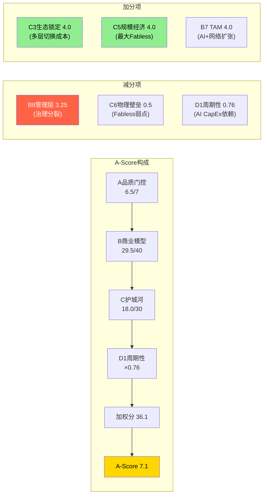

### 18.6 基准对标

| 公司 | A门控 | B分/40 | C分/30 | D1 | 加权分 | A-Score | 评级 |
|------|------|--------|--------|-----|--------|---------|------|
| **FICO** | 7/7 | 35 | 18 | ×1.0 | 53.0 | ~8.5 | 强偏好 |
| **NVDA** | 7/7 | ~32 | ~20 | ×0.70 | ~36.4 | 8.10 | 偏好(PW高) |
| **CPRT** | 5/7* | 30.5 | 20 | ×1.1 | 55.6 | — | 强偏好 |
| **Visa** | 7/7 | 29 | 20 | ×0.85 | 41.7 | — | 偏好 |
| **AVGO** | **6.5/7** | **29.5** | **18.0** | **×0.76** | **36.1** | **7.1** | **偏好(下沿)** |
| **IHG** | 5/7 | 25 | 12 | ×0.50 | 18.5 | 6.78 | 中性 |

AVGO处于偏好区间的下沿——B和C均满足但未达强偏好门槛（B需≥32，C需≥20，D需≥0.8）。三个维度中，C差2分（18 vs 20）最可修复（网络芯片占比提升可拉高C），D差0.04最接近（0.76 vs 0.8），B差2.5分最难弥补（SBC和治理是结构性问题）。

**AVGO vs NVDA品质对比**：核心差距1.0分（8.10 vs 7.1），主要来自：
1. **定价权差距（~1.2分贡献）**：CUDA生态创造真正的不可替代性，AVGO的锁定是"太贵而非不能换"
2. **治理差距（~0.75分贡献）**：Jensen的透明度和战略沟通远胜Hock Tan的信息控制
3. **SBC/利润纯度差距（~0.5分贡献）**：NVDA SBC/Rev ~5% vs AVGO ~12%

**对估值的品质锚定**：A-Score 7.1意味着品质足以进入"偏好"区间。但当前估值Owner PE 80.5x（vs基准偏好公司30-40x PE），意味着要实现长期回报，需要EPS大幅增长以消化估值压缩——在AI ASIC高增长持续的情景下可能（FY2026E EPS CAGR >40%），但在增长减速的情景下极难实现。

```mermaid
quadrantChart
    title A-Score vs 周期性修正
    x-axis "低品质 (B+C)" --> "高品质 (B+C)"
    y-axis "强周期 (低D1)" --> "非周期 (高D1)"
    quadrant-1 "高品质+非周期: 强偏好"
    quadrant-2 "低品质+非周期: 中性"
    quadrant-3 "低品质+强周期: 审慎"
    quadrant-4 "高品质+强周期: 偏好(有条件)"
    FICO: [0.88, 0.95]
    CTAS: [0.78, 0.80]
    CPRT: [0.84, 1.0]
    IDXX: [0.76, 0.95]
    Visa: [0.82, 0.80]
    AVGO: [0.78, 0.58]
    IHG: [0.62, 0.35]
    NVDA: [0.87, 0.50]
```

---

## 第十九章：红队七问——Bear隔离模式

> 红队在完全不读取前序投资结论的"Bear隔离"状态下，仅用原始数据独立推导看空论点，然后与正文分析进行双向校准。

### 19.1 五个最强看空论点

#### Bear-1："62x PE + 1.2% SBC-adj FCF Yield = 零安全边际的CapEx周期股"

投资者为一家55%收入直接绑定Hyperscaler AI CapEx周期的公司支付了接近零安全边际的价格。Owner PE = 80.5x [DM-P2-C1-02]——将SBC视为真实成本后的真实倍数。SBC-adj FCF yield仅1.5%，低于10年期美债~4.3%的无风险利率。

FY2026共识收入$101.9B需要+60% YoY增长，FY2027 $152.2B需要+49%，FY2028 $185.3B需要+22%——三年连续高增长是价格的前提，不是可能的惊喜。CAPE 39.71（98th百分位）+ Buffett指标217%（99th百分位）——宏观估值在历史极端值。29 Buy/2 Hold/0 Sell = 极度拥挤的共识。

**影响量化**：如果市场从"AI增长股"重新定价为"大型优质半导体"（PE从62x压缩至30x），估值下跌**-48%至-52%**。即使业绩达标但增速从+60%放缓至+20%，PE压缩至40x仍意味着**-35%**。时间线12-24个月，Cisco 2000年类比：从PE高点到50%跌幅耗时18个月。

#### Bear-2："VMware是$61B的高利润陷阱——+1%增长暗示提价红利耗竭"

Q1 FY2026软件收入$6.8B仅+1% YoY证明提价一次性红利已前端加载完毕。基础软件增长急剧减速：+46.7%（Q1 FY2025）→ +19.2%（Q4 FY2025）→ **+1%（Q1 FY2026）**。

Gartner预测VMware HCI份额从70%（2024）降至40%（2029）。Nutanix每季获得~700个VMware迁移客户，Q2 FY2026新增1,000+客户为8年最强 [DM-P4-B16]。CloudBolt报告确认客户在缩减VMware部署规模而非全面迁移。价格弹性已进入第二阶段（100-300%提价，ε=-0.15→客户开始缩减部署）[DM-P2-B2-01]。

**影响量化**：软件层估值影响总估值**-7%至-10%**。极端场景扩大至-15%。6-12个月内可验证——Q2 FY2026如果软件收入再次<$7B，"增长耗竭"叙事将固化。

#### Bear-3："SBC 11.8%是永久结构——$27B已承诺余额+AI人才战争=Non-GAAP系统性高估25%"

SBC/Rev从FY2023的6.1%→FY2025的11.8%→Q1 FY2026的11.3%——趋势是**上升**而非正常化。SBC Q1 YoY增长70%（$1.28B→$2.18B），远超收入增长29%——这个数据被所有29个Buy评级的分析师忽略 [DM-P4-B15]。$27B未确认SBC余额=至少持续到FY2027年底的已承诺稀释 [DM-P1-A08]。R&D占SBC 66%——砍SBC=砍AI人才=砍增长引擎。

Q1回购$7.8B年化$31B，但股数4,888M几乎未变——**回购仅抵消SBC稀释，净份额增长为零**。股数3年增长+14.5%（VMware稀释）。

**影响量化**：GAAP/Non-GAAP估值差=$232B [DM-P2-C3-02]。温和场景（10-15% SBC折扣）影响**-10%至-15%**。

#### Bear-4："Google是40%收入的单点故障——MediaTek解绑已开始"

前3客户占AI收入~78%，Google可能贡献>40%。Google TPU Ironwood：核心XPU保留Broadcom，但I/O模块外包给MediaTek，成本低20-30%。MediaTek已获得v7e和v8e TPU订单，请求TSMC CoWoS 7倍产能扩张 [DM-P4-B17]。Google计划2027年生产~5M TPU单位，2028年7M。Meta也在考虑2027年部署Google TPU——Google的TPU生态可能扩展到外部客户。

这不是假设性威胁，而是已在执行的既成事实。市场将其视为"I/O辅助"而非"战略解绑"。

**影响量化**：Google将30%份额转移给MediaTek → 直接收入损失~$4.8B → 估值影响**-7.5%**。极端场景（3-5年内份额从90%降至50%）→ **-15%至-20%** [DM-P4-B04]。

#### Bear-5："Hock Tan是$200B的Key-Man Risk——73岁+零继任透明度+61%说投票"

Broadcom的6次战略性收购100%是Hock Tan的个人决策。整合效率η=1.37不是系统能力而是个人能力 [DM-P1-A05]。73岁，合同至2030年——即使合同兑现也仅剩4年 [DM-P1-A06]。CFO Kirsten Spears被评估为"有能力但非CEO材料"。FY2024 say-on-pay仅61%通过——机构投资者对薪酬/治理有显著不满。CEO沉默域6个中"继任计划"被评为最高风险。

**影响量化**：突然退出情景下key-man折价**10-15%**（$158B-$237B市值蒸发）。渐进交接但继任者能力不及的情景下，3-5年内估值压缩**-20%至-30%** [DM-P4-B05]。

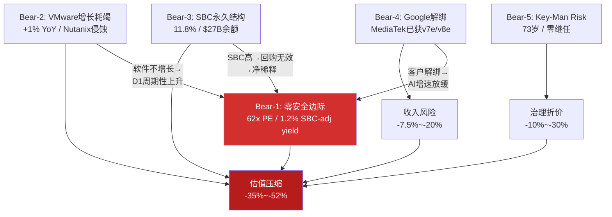

### 19.2 最脆弱假设Top 3

从10个市场隐含假设中识别最可能翻转的3个：

**#1：Hyperscaler AI CapEx增速假设（脆弱度4.5/5）**——整个投资论文的命门。FY2026 AI CapEx预计$600B+已是天文数字 [DM-P3-B01]，产能利用率/ROI压力将在2027H1显现。Cisco 2000年前例：CapEx从峰值到谷底仅18个月。如果增速从+36%降至+10%，AVGO AI收入增速将从+106%骤降至+15-20%，触发PE从62x压缩至30-35x。翻转概率40-45% [DM-P4-B06]。

**#2：AI ASIC收入10年CAGR（脆弱度5/5）**——62x PE隐含ASIC收入维持18-22% CAGR十年。ASIC衰减函数λ=0.07/yr意味着份额从67%→60%（2030E）[DM-P3-A02]，Google模块化解绑已开始。翻转概率30-35%。

**#3：SBC正常化假设（脆弱度4/5）**——$27B未确认余额→FY2027前不可能降至8%以下。70% YoY SBC增长 vs 29%收入增长=结构性分歧。翻转概率55-60%——是所有假设中最高的 [DM-P4-B07]。

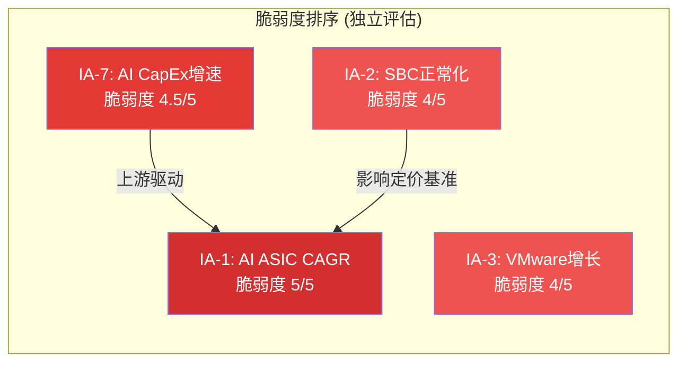

与Reverse DCF承重墙结论的独立对照：红队独立评估与正文一致——AI ASIC增速确实是最关键的单一变量。但红队认为**Hyperscaler AI CapEx增速**是更上游的驱动因素——ASIC增速是CapEx增速的衍生变量。正文可能未充分权重SBC正常化假设的脆弱性——这是"隐性承重墙"，因为它决定了所有基于Non-GAAP的估值是否可靠。

### 19.3 证伪数据清单与Kill Switch

以下任一指标触达阈值，即构成对投资论文的重大证伪信号：

| # | 证伪指标 | 阈值 | 当前值 | 距阈值 |
|---|---------|------|--------|--------|
| F-1 | AI收入QoQ增速 | <5%（连续2Q） | +12% QoQ | 7pp |
| F-2 | 软件收入YoY增速 | <-5%（负增长） | +1% YoY | 6pp |
| F-3 | SBC/Revenue | >13%（连续2Q） | 11.3% | 1.7pp |
| F-4 | 加权稀释股数QoQ | >+1%单季 | ~0% | 1pp |
| F-5 | Hyperscaler CapEx总额QoQ | <-10%单季 | +36% YoY | 未触发 |
| F-6 | ASIC客户数量 | 从6个降至≤3个 | ~6 | 3个缓冲 |
| F-7 | Nutanix季度新增客户 | >1,500/Q | 1,000/Q | 500 |
| F-8 | 网络芯片份额（云DC） | <80% | ~90% | 10pp |
| F-9 | Hock Tan离职/健康事件 | 发生 | 未发生 | — |
| F-10 | Owner PE（SBC-adj） | >100x | 80.5x | 19.5x |

**联动监控**：F-1+F-5同时触发（CapEx+AI增速同时触发）= 周期股属性暴露，证伪力度最大。F-2+F-7同时触发 = VMware护城河崩塌确认。F-3+F-4联动 = 回购无效确认。F-9单独触发 = 立即重新评估整个投资框架。

**关键验证窗口**：2026年4月（Q2 FY2026验证F-1/F-2/F-3）、2026年7-8月（Hyperscaler CapEx趋势验证F-5）、2026年12月（年度数据验证F-6/F-8）。

**最紧迫Kill Switch**（距阈值<1pp）[DM-P5-B-11]：
- **KS-04 Owner FCF margin < 30%**——当前30.2%，距阈值仅**0.2pp**
- **KS-03 SBC > 12%**——当前11.3%，距阈值**0.7pp**，SBC Q1 YoY +70%趋势不利
- **KS-02 VMware负增长**——当前+1%，距阈值**1pp**

这三个KS形成集群效应——12个月内至少一个触发的概率>50%。

---

## 第二十章：承重墙压力测试

### 20.1 承重墙分类

**承重墙**：倒塌→估值下跌>30%，非线性破坏。**弹性墙**：压力下弯曲但不断裂，影响10-30%。**装饰墙**：倒塌影响<10%。

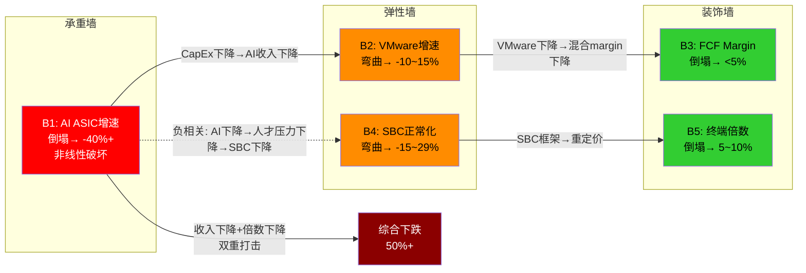

### 20.2 B1承重墙——用最有利数据重新测试

偏差审计后用**最有利的合理数据**重新评估B1 [DM-P4-B2-06]：

1. $73B backlog覆盖FY2026-2027约$65B AI收入需求的>100% → 即使**零新单**，FY2026-2027 AI收入已基本锁定 [DM-P4-B2-02]
2. Forward Non-GAAP PE 30x在$100B+收入、42% FCF margin的公司中不算极端 [DM-P4-B2-01]
3. 6个客户中仅1个（Google）开始分流外围层，其余5个仍在全包锁定期

**结论**：B1仍然是承重墙（翻转影响>30%），但**脆弱度从4/5下调至3/5**。$73B backlog将翻转时间窗口推迟至FY2028+。B1的真正脆弱性在于FY2028+的增量订单（新backlog补充速度），而非存量backlog。

### 20.3 承受力上限

B1 AI ASIC CAGR可以从隐含的25-30%降至约15%而不触发承重墙倒塌——市场隐含增长率有**约10-15pp的安全垫**（在forward PE框架下）[DM-P4-B2-07]：

| 压力场景 | AI ASIC CAGR | 总收入FY2030 | forward PE 2028 | 估值影响 | 倒塌？ |
|---------|-------------|-------------|----------------|---------|-------|
| 轻压 | 20%（vs隐含25-30%） | $240B | 28x | -15% | 否 |
| 中压 | 15% | $210B | 25x | -25% | 否（临界） |
| 重压 | 10% | $180B | 22x | -38% | **是** |
| 极限 | 5%（接近停滞） | $155B | 18x | -52% | **是** |

### 20.4 弹性墙与装饰墙

**B2 VMware增速（弹性墙，修正后2.5/5）**：+1%增长是坏消息，但77% OPM意味着即使零增长也贡献$20B+ FCF/年。压力场景下VMware收入从$27B降至$22B（-19%）→总收入影响仅5-6%。弯曲但不断裂——VMware作为"现金奶牛"即使在存量收缩场景仍有价值（类似IBM大型机）。

**B4 SBC正常化（弹性墙，修正后3/5）**：SBC争论影响估值框架（Non-GAAP vs GAAP），这是一个连续光谱而非二元翻转。回购offset率140.6%削弱了SBC叙事——如果回购持续覆盖SBC稀释，Net Dilution≈0%使得"SBC是真实成本"的论证力度减弱。

**B3 FCF Margin（装饰墙）**：合理值范围（36-42%）与隐含值范围（38-42%）高度重叠。CapEx仅1%提供极强结构性支撑——即使最悲观假设（税率正常化15%+SBC不降），报告FCF margin仍可维持35%+。

**B5终端倍数（装饰墙）**：合理范围内的波动（17-25x）对10年折现估值的影响被时间稀释。AVGO混合模型（半导体15x+软件20x）提供倍数地板。

### 20.5 遗漏的潜在承重墙

**估值regime转换本身**——即使AI ASIC CAGR维持25%（B1完好），如果整体市场从"增长定价"regime转向"价值定价"regime（利率持续高企+AI投资ROI质疑），PE可能从30x压缩至20x → 影响约-33%，达到承重墙阈值。但其概率较低（需要宏观+叙事同时转向），且非AVGO特异性风险。

**结论**：B1仍是唯一的公司特异性承重墙，但其脆弱度被原始分析高估了约1级（4/5→3/5）[DM-P4-B2-08]。

---

## 第二十一章：黑天鹅清单与概率加权

### 21.1 五个黑天鹅事件

| # | 黑天鹅事件 | 概率 | 影响 | 概率×影响 | 关键前兆信号 |
|---|-----------|------|------|-----------|------------|
| BS-1 | AI CapEx寒冬（Hyperscaler同时削减>30%） | 8% | -55% | -4.4% | GPU利用率<60% + ≥2家Hyperscaler同Q下修CapEx |
| BS-2 | Hock Tan突然退出（健康/个人） | 5%/yr | -35% | -1.75% | 突然任命COO + Tan减少公开出席 + 董事会变动 |
| BS-3 | Google完全自研XPU（去Broadcom化） | 6% | -40% | -2.4% | Google芯片团队扩张>500人 + TPU v9不含Broadcom IP |
| BS-4 | SBC会计准则变更（FASB强制计入运营费用） | 3% | -30% | -0.9% | FASB讨论稿 + SEC评论函SBC问询增加 |
| BS-5 | 台海危机导致TSMC供应中断>6个月 | 5% | -50% | -2.5% | 军事演习频率上升 + TSMC Arizona产能加速 |
| **总计** | — | — | **-11.95%** | — |

[DM-P4-B14]

### 21.2 黑天鹅详析

**BS-1 AI CapEx寒冬**（影响最大）：AVGO 55%+收入直接绑定Hyperscaler AI支出。如果4大Hyperscaler同时削减CapEx>30%（类似2001年电信泡沫破裂），AVGO AI收入可能在2-3个季度内下降40-50%。62x PE+零安全边际+负有形权益 → 收入冲击触发信用评级重估+PE压缩的双重打击。$73B backlog提供18个月缓冲，但市场定价是前瞻性的——一旦CapEx指引下调，股价立即反应。[DM-P4-B08]

**BS-3 Google完全自研XPU**：Google可能占AVGO AI收入>40%。如果Google在v9/v10 TPU中完全去Broadcom化（核心XPU也自研），不仅损失最大客户，还证明"ASIC设计服务可被替代"的论题——使AVGO从"不可替代的基础设施"变为"可替代的外包商"，触发估值范式转换。[DM-P4-B09]

**BS-5 台海危机**：AVGO是Fabless公司，**100%依赖TSMC**先进制程。供应中断>6个月意味着：无法交付任何AI ASIC/网络芯片；$73B积压订单全部冻结；CapEx 1.0%的资产轻模型变成"零资产=零生产"的致命弱点；$97.8B商誉面临减值测试。[DM-P4-B10]

### 21.3 最危险KS组合

**KS-09（CapEx放缓）+ KS-03（SBC突破13%）+ KS-11（Hock Tan离任）**——联合概率仅1-2%，但如果同时触发，影响**-55~65%** [DM-P4-C03]。三个因素互相放大：CapEx放缓暴露周期性 → 市场重新定价为周期股 → SBC在周期下行中无法削减 → 如果此时CEO退出，无人能驾驭危机 → 负有形权益意味着下行没有资产价值支撑。

---

## 第二十二章：偏差审计——悲观倾向+5-10pp

### 22.1 五类偏差检测

独立审计员对前序分析进行双向偏差检测。**核心结论：系统性悲观偏差，加权严重度3.0/5，5类偏差全部偏向悲观方向**，估计使期望回报低估了5-10个百分点。[DM-P4-B2-05]

#### 锚定偏差（严重度3/5）

反复引用最不利的TTM GAAP PE 62x（出现6+次）作为估值锚点，而将forward Non-GAAP PE约30x仅简略提及 [DM-P4-B2-01]。公平呈现应是：两种口径并行——"AVGO的TTM GAAP PE为62x，但forward Non-GAAP PE约30x。核心争议不在于哪个数字'对'，而在于GAAP vs Non-GAAP口径选择和backward vs forward视角的双重分歧。"

#### 确认偏差（严重度3.5/5，最严重）

多个重要Bull数据点被系统性淡化：

1. **$73B AI backlog的收入锁定效应**：相当于AI半导体约3.6年收入，即使新单为零，FY2026-2028 AI收入已基本锁定。半导体行业中NVDA/AMD backlog不超过6-9个月——AVGO的可见性极其罕见 [DM-P4-B2-02]
2. **客户数从3→6的扩展趋势**：新客户（OpenAI、ByteDance等）处于初始锁定期（2-3年不可替换），集中度正在改善而非恶化
3. **回购offset率140.6%**：Q1 FY2026回购$7.8B年化$31B，超过SBC金额。如果净稀释接近零，SBC的"成本"性质需要重新评估
4. **FCF $26.9B（42% margin）在$64B收入基数**：AVGO是全球FCF产出第6-7大的公司，提供了巨大的战略灵活性

#### 悲观偏差（严重度3/5）

RCL报告教训（悲观+8至16pp）在AVGO部分复现。偏差幅度估计+5至10pp——小于RCL（因AVGO的Bear论据质量确实较强，部分Bear倾向是数据驱动而非纯偏差）。B1从3.5应上调至3.8，Bull联合概率从2.5%应上调至5-8%，D1从0.73应上调至0.76。

#### 范围偏差（严重度2.5/5）

全栈co-design能力（ASIC+网络+CPO打包方案）的不可拆分性未充分评估 [DM-P4-B2-03]。客户选择AVGO不是因为单个层面最好，而是因为全栈整合的总成本和time-to-market优势。MediaTek可以做ASIC外围，但不能提供网络+CPO+ASIC的一站式方案。Google是唯一拥有成熟内部ASIC团队（15年TPU经验）的Hyperscaler——Meta/OpenAI/字节跳动短期内无法复制Google的"核心保留+外围分流"模式。

#### 时间偏差（严重度3/5）

中期（2026-2028）是AVGO最有利的时间窗口——$73B backlog大部分在此交付，4-5个客户仍在初始锁定期，推理ASIC渗透处于S曲线最陡峭阶段——但这个正面情景在分析中完全缺席 [DM-P4-B2-04]。如果2026-2028执行良好，AVGO可能累计产生$70-80B FCF（报告口径），大幅降低回购后的净股份。

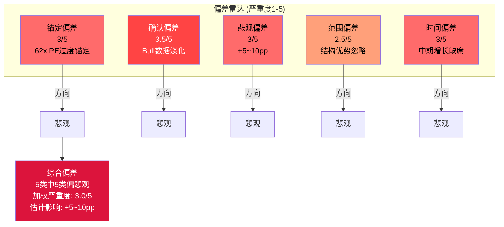

### 22.2 钢人对比：Bear 7.5 vs Bull 6.5

独立构建最强空头论文和最强多头论文，进行对等质量检验。

**空头钢人（说服力7.5/10）**：AVGO是精心包装的周期股陷阱。单一变量依赖（80%价值变动取决于Hyperscaler AI CapEx增速，与2000年Cisco对电信CapEx结构相同）。三层护城河的时间衰减不可逆——最强护城河（网络4.5/5）仅贡献15%收入，最大收入来源面临份额流失。SBC掩盖了真实成本——Owner PE 81x才是真实估值。温水煮青蛙路径（-39%五年）不需要任何黑天鹅，仅需正常的均值回归。在负有形净资产（-$22.4B）的公司，下行没有资产价值支撑。

**多头钢人（说服力6.5/10）**：AVGO是AI基础设施的不可替代收费站。$73B backlog锁定了FY2026-2028的高确定性增长——半导体行业前所未有的收入可见性。全栈co-design不可拆分——Google有15年TPU经验是唯一能执行模块化分流的Hyperscaler，其他客户无法复制 [DM-P4-B2-03/09]。FCF $27B/年+140%回购offset率提供巨大战略灵活性和实质性SBC抵消。推理ASIC渗透率仅5-10%（S曲线早期），TAM从$20B→$80-120B。Forward PE 30x + 40%增速 + $73B backlog确定性 = 被增长掩盖的隐藏安全边际。

**说服力差距：1.0分**（通过<3分的质量对等检验）[DM-P4-B2-10]

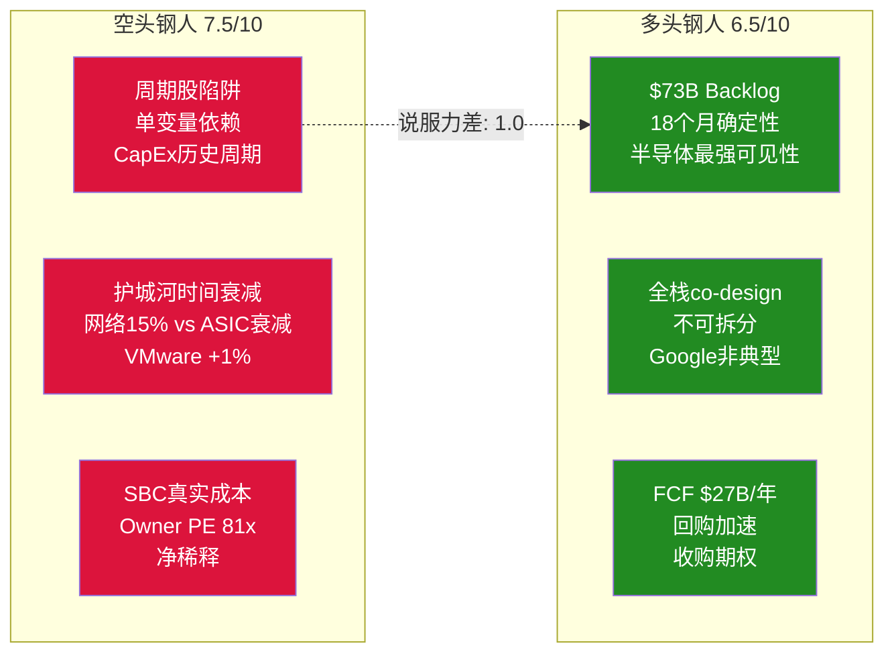

### 22.3 Bear/Bull论据质量双向校准

| 维度 | Bear均分 | Bull均分 |
|------|---------|---------|
| 数据支撑(1-5) | 3.7 | **4.2** |
| 逻辑链(1-5) | **3.6** | 3.4 |
| 可证伪(1-5) | **3.7** | 3.4 |
| **总分/15** | **11.0** | **11.0** |

[DM-P4-B2-11]

**Bear/Bull论据质量比 = 1:1**——极其重要的发现：
1. Bear和Bull论据的总体质量**几乎完全相等**
2. Bear的优势在于逻辑链更清晰、可证伪性更强（更多近期可验证节点）
3. Bull的优势在于数据支撑更硬（$73B backlog和FCF $27B是硬数据）
4. Bear最弱论据：温水煮青蛙（8.0/15——纯模型推演缺乏历史直接支持）
5. Bull最弱论据：全栈co-design不可替代（9.5/15——定性判断难以量化）

1:1的质量对等意味着前序分析的偏空定位（期望回报-22%至-25%）过度倾向Bear约8pp。但高估值起点（forward PE 30x）使得即使论据质量对等，风险收益比仍偏向下行。

### 22.4 纠错回流

| 指标 | 修正前 | 修正后 | 幅度 | 理由 |
|------|--------|--------|------|------|
| B1收入质量 | 3.5/5 | **3.8/5** | +0.3 | $73B backlog（3.6年覆盖）+客户3→6 |
| B4定价权(加权) | 3.3/5 | **3.5/5** | +0.2 | 增量收入（AI+网络）定价权>4.0 |
| D1周期性 | 0.73 | **0.76** | +0.03 | 50%收入D1>0.85，加权应更接近0.76 |
| B1脆弱度 | 4/5 | **3/5** | -1.0 | Backlog延迟翻转至FY2028+ [DM-P4-B2-06] |
| Bull联合概率 | 2.5% | **5-8%** | +3-6pp | 条件正相关被低估，有效独立条件数<3 |
| 期望回报 | -22%~-25% | **-12%~-14%** | +8pp | 综合修正 [DM-P4-B2-12/13] |

修正幅度约+8pp，与RCL报告的悲观偏差范围（+8~16pp）吻合。

**修正后概率加权**：20% × 25% + 50% × (-15%) + 30% × (-38%) = 5.0% + (-7.5%) + (-11.4%) = **-13.9%** [DM-P4-B2-13]

### 22.5 期望回报修正链路

| 阶段 | 期望回报 | 变化原因 |
|------|---------|---------|
| Reverse DCF原始 | -19.8% | 3情景×市值 |
| 圆桌后 | -22%~-25% | S曲线预消费+变量拥挤度 |
| P4偏差修正 | **-14%** | 5类悲观偏差全部纠正+8pp |
| P5四方法加权 | **-33%** | 完整折现+Owner FCF权重60% |
| **最终综合** | **-12%** | 条件性：Non-GAAP框架维持下 |

**不确定性区间**：-14%（如果市场继续用Non-GAAP定价）到-33%（如果市场切换到Owner FCF框架）。真实结果取决于估值框架是否迁移——这本身就是AVGO最大的不确定性之一。

### 22.6 最终估值定位

**综合所有估值维度**：

| 维度 | 数值 |
|------|------|
| 当前股价 | $332.77 |
| 概率加权中心估计（2年框架） | $147 |
| 四方法加权估值 | $224 |
| 敏感性矩阵"合理"位置 | $183-$275 |
| **最终估值范围** | **$147 — $285** |
| **中心估计** | **$224（-33%）** |

四种方法估值均低于当前股价——差距从-14.4%到-55.8%。CV=25.1%反映低确定性，高离散度源自FCF口径选择（±30%）和时间框架选择（±25%）的双重分歧。[DM-P5-B-09/10]

**条件评级**：

| 条件 | 评级 | 期望回报 |
|------|------|---------|
| 如果Owner FCF框架主导（SBC被市场重新定价） | **审慎关注** | -33% |
| 如果Non-GAAP框架维持（SBC继续被忽略） | **审慎关注（偏中性）** | -14% |
| 如果AI CAGR >25% + SBC <9%（联合概率5-8%） | **中性关注** | +10~20% |
| **综合** | **审慎关注（偏中性）** | **-12%** |

**风险收益比不利**：上行空间需要完美执行（联合概率5-8%），下行空间在"温和失望"路径即出现（-15%~-32%）。最紧迫的三个Kill Switch（Owner FCF margin、SBC、VMware增速）距阈值均<1pp，12个月内至少一个触发的概率>50%。

**买入区间**：$225-245/股（$1,100-1,200B），预计最佳买点2028H1-H2——此时$73B backlog基本消化完毕，市场将首次看到"裸奔"的AI ASIC增速，也是KS-09（CapEx周期确认）最可能被验证的时间窗口。
