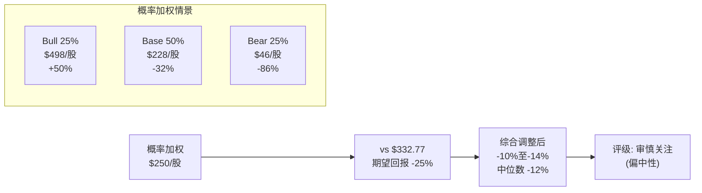
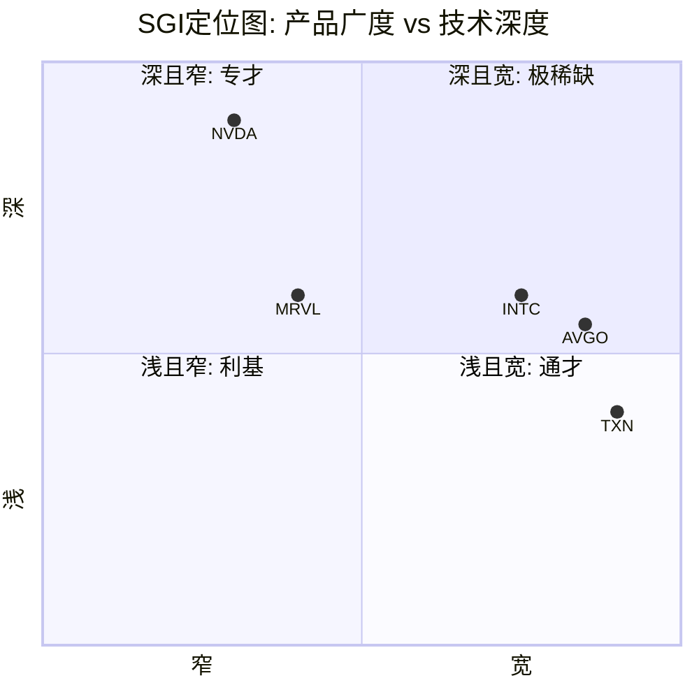
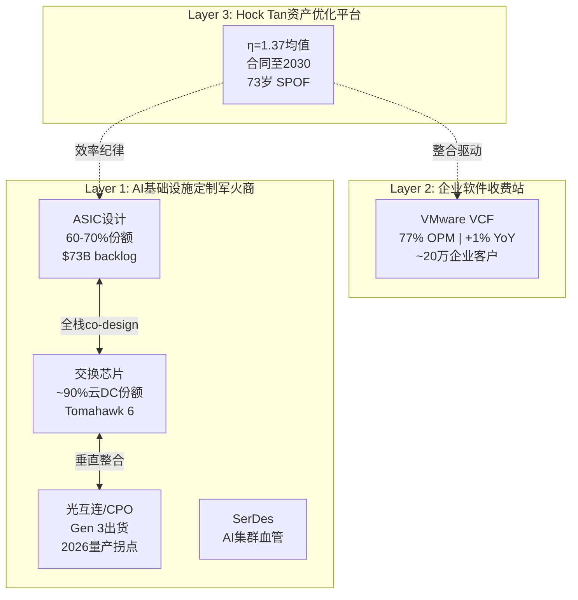
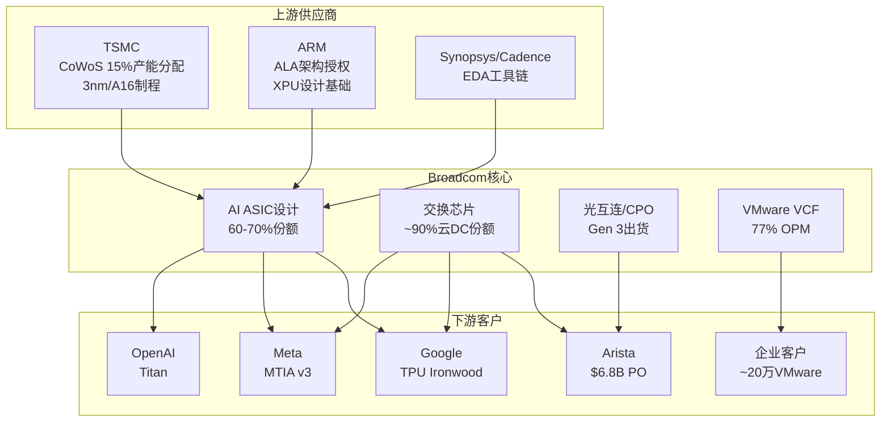
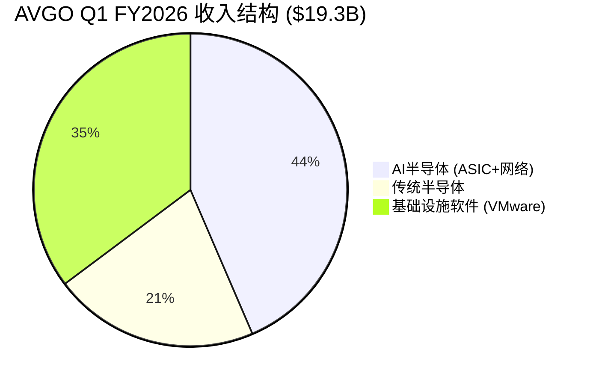
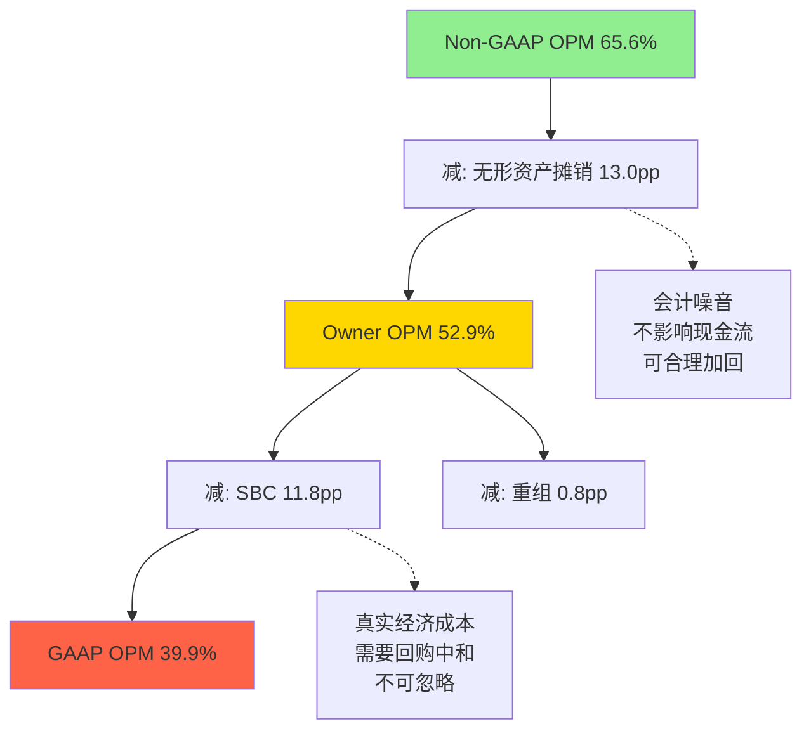
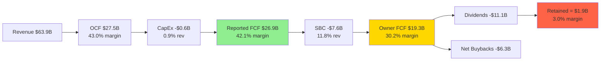
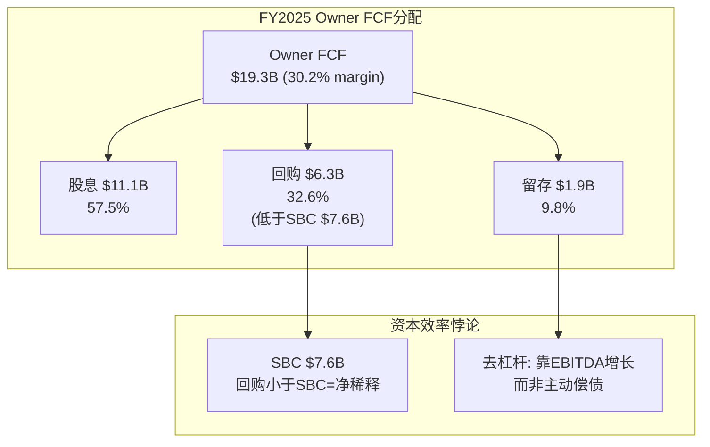

# Broadcom Inc. (AVGO) 深度研究报告

> **评级: 审慎关注(偏中性)** | 期望回报: -12% | 概率加权每股价值: $250
> 数据截止: Q1 FY2026 (2026-02-01) | 报告日期: 2026-03-08
> 股价: $332.77 | 市值: $1,578B | 行业: 半导体+基础设施软件

---

## 第一章：执行摘要

Broadcom是一台三层嵌套的基础设施收费站——AI定制军火商(Layer 1) + 企业软件收费站(Layer 2) + Hock Tan资产优化平台(Layer 3)。市场按"AI芯片新贵"的单一标签给予62x TTM PE定价，但真实身份远比这复杂，估值含义也截然不同。

**核心估值判断**:

| 指标 | 数值 | 含义 |
|------|------|------|
| 概率加权每股价值 | **$250** | vs $332.77(-25%) |
| 四方法加权中心 | **$224** | vs $332.77(-33%), CV=25.1% |
| Owner PE | **80.5x** | vs 市场认知Non-GAAP PE ~30x(2.7倍差距) [DM-P2-C1-17] |
| A-Score | **7.1** | 偏好(下沿), 高于IHG(6.78)低于NVDA(8.10) [DM-P3-C01] |
| PtW(竞争胜率) | **36.5/50(73%)** | 2030年预计降至30.9/50(61.8%) [DM-P3-A01] |
| CQ加权置信度 | **56.4%** | 微偏多头，极接近中性 |

**评级: 审慎关注(偏中性)**。期望回报-10%至-14%，中位数-12%。所有四种估值方法均低于当前市价，但$73B AI backlog提供18个月缓冲，短期催化剂(Q2 FY2026 earnings)可能维持高位。Bear/Bull钢人评分7.5 vs 6.5(差距仅1.0, 实质对等)，偏差审计确认存在+5-10pp系统性悲观 [DM-P4-B04] [DM-P4-B05]。

**概率加权EV**:

| 情景 | 概率 | FY2030E Rev | 每股估值 | vs当前 |
|------|------|-----------|---------|--------|
| Bull | 25% | $260B | $498 | +50% |
| Base | 50% | $195B | $228 | -32% |
| Bear | 25% | $130B | $46 | -86% |
| **加权** | | | **$250** | **-25%** |

**条件评级升降**:
- **升至"关注"**: VMware有机增长>5% + SBC/Rev<9% + AI ASIC CAGR>25%
- **降至"审慎关注(强)"**: Hyperscaler CapEx增速<10% 或 SBC/Rev>13%

**买入区间**: $225-245/股($1,100-1,200B市值)，预计最佳买点在2028H1-H2(AI CapEx周期可能回调+估值regime转换)。

**三个CI冠军候选**:
1. **CI-03 S曲线预消费风险**(8.5/10): 市场已按AI终局定价早期S曲线，即使技术路径正确，投资回报可能为零——因为"正确但已被定价"等于无超额收益 [DM-P3-D01]
2. **CI-02 SBC盲区量化**(8.0/10): Owner PE 80.5x vs Non-GAAP PE 30x的2.7倍差距，本质是$232B的"SBC是否为零成本"之赌 [DM-P2-C3-02]
3. **CI-01 伪装的周期股**(7.5/10): 43%收入绑定hyperscaler CapEx，VMware+1%增长暴露"双引擎"叙事的脆弱性 [DM-P3-B01]

**三层身份一句话总结**: Broadcom是一家用77%利润率的软件收费站(VMware)补贴AI军备竞赛(ASIC)、由73岁效率大师(Hock Tan)驾驶的$1.58万亿混合体——市场按最快的引擎(AI +106%)定价，但56%的收入(软件+传统半导体)的有机增长接近零。

**最大风险**: AI CapEx周期反转。半导体收入65%+直接绑定Hyperscaler CapEx, $600B+(2026)已是扩张晚期。历史Cisco 2000类比部分适用：市场按终局定价S曲线早期阶段 [DM-P3-B01]。

**最大机会**: AI推理爆发+网络升级超级周期。如果推理需求在2027-2028引爆，且以太网在AI集群中份额从70%→90%，Broadcom作为ASIC+网络双寡头将使AI收入CAGR维持25%+至2030年。网络层PtW 45/50是所有层中最强且衰减最慢 [DM-P3-A03] [DM-P2-B2-03]。

---

## 第二章：公司身份——三层嵌套基础设施收费站

市场对Broadcom的标签经历了三次迭代: "多元化半导体公司"(2015前) → "连续收购整合者"(2016-2023) → "AI芯片新贵"(2024至今)。三个标签都是错的。它们描述的是某个侧面或某个时期，而非其本质。Broadcom的真实身份是一台三层嵌套的基础设施收费站——每一层的护城河来源不同，衰减速率不同，估值锚点也应不同。

### Layer 1: AI基础设施的"定制军火商"

Broadcom在AI半导体领域的核心能力不是"设计芯片"——Marvell也能设计芯片，MediaTek正在Google I/O模块上证明自己——而是**同时掌握XPU设计 + 交换芯片 + 光互连 + SerDes的全栈co-design能力**。

具体分解:
- **ASIC设计服务**: 60-70%市场份额，$73B backlog(18个月可见性)。Google TPU、Meta MTIA v3、OpenAI Titan均由Broadcom主导核心XPU设计 [DM-P1-A01]
- **交换芯片**: Tomahawk/Jericho系列，~90%云数据中心份额。Tomahawk 6(102.4Tbps)领先NVIDIA Spectrum-X约1年 [DM-P1-A02]
- **光互连**: 第3代CPO(TH6-Davisson)已出货，2026是CPO量产拐点年。垂直整合(交换芯片+光学DSP+CPO)是独有差异化 [DM-P1-A03]
- **SerDes/高速接口**: AI集群内部数据传输的"血管"——隐蔽但极度关键

**护城河来源**: 技术锁定 + 全栈整合。单一ASIC设计可以被替代(MediaTek证明了这一点)，但没有第二家公司能同时提供XPU+交换+光学+SerDes的co-design。这就是为什么Google分流I/O给MediaTek，但核心XPU仍留在Broadcom——因为XPU必须与网络芯片协同优化，而网络芯片只有Broadcom能做。

**衰减路径**: ASIC设计服务存在时间衰减函数 L(t)=L₀·e^(-λt)+L_floor。随着Google/Meta/OpenAI内部团队成熟(OpenAI芯片团队已扩至~40人 [DM-P1-A11])，单纯设计服务的黏性会下降。但全栈co-design的L_floor很高——因为网络协议演进(以太网→UEC 1.0→CPO)要求芯片-网络-光学三者同步迭代。ASIC衰减函数更新: λ=0.07/yr, 2030E份额~60% [DM-P3-A02]。

### Layer 2: 企业基础设施软件的"收费站"

VMware VCF是全球~70%顶级企业的虚拟化基础设施。Hock Tan收购后的策略不是"经营VMware"而是把VMware从产品公司变成收租平台:
- 价格上调150%-1,500%，合并产品线为VCF(全栈)+VVF(仅虚拟化)
- 强制3-5年订阅制，72核最低起订，20%逾期续约罚金
- 结果: 软件OPM达77% [DM-P1-A04]，FY2025软件收入$24.7B(含并入效应)

**护城河来源**: 转换成本 + 运营惰性。企业迁移虚拟化平台需18-24个月，涉及数千VM重配+安全审计+合规认证。即便Nutanix每季度新增~700-1,000个前VMware客户(Q2 FY2026新增1,000+创8年新高 [DM-P1-A06])，VMware仍有~20万存量客户基座。

**衰减路径**: Gartner预测VMware HCI份额从70%(2024)→40%(2029) [DM-P1-A05]。Kubernetes是长期结构性威胁——不是"替代VMware"而是"让VM本身变得不必要"。当前85%的容器仍运行在VM内(至2028E)——K8s短期内实际增强了VM需求，而非替代。真正的替代发生在K8s-on-bare-metal成熟之后(2028-2030)。

VCF 9.0嵌入Private AI Services是Broadcom的防御动作，将VMware从"虚拟化平台"重新定位为"企业私有AI基础设施"。但这更像是叙事重塑而非实质转型——VMware的核心客户仍是传统企业IT，而非AI-first公司。

**VMware定价弹性三阶段**: <100%提价(ε=-0.05)大型企业完全吸收; 100-300%提价(ε=-0.15)中型企业开始"缩减+评估"，86%受访者正在缩减VMware足迹; >300%提价(ε=-0.40)SMB大量流失。VMware在中型客户群体中的"死亡"是慢性失血——短期财务表现(77% OPM)掩盖长期客户基础侵蚀 [DM-P2-B2-01]。

### Layer 3: Hock Tan的"资产优化平台"

最内层——也是最不可复制但最脆弱的一层。Hock Tan的核心能力不是"并购"(任何CEO都能签支票)，而是对收购资产的极致效率优化: 砍掉非核心产品线、压缩销售团队、将运营利润率推至物理极限。

六次收购的整合效率η(t)追踪:

| 收购 | 年份 | 金额 | OPM_pre | OPM_post(2Y) | η |
|------|------|------|---------|-------------|---|
| LSI Logic | 2014 | $6.6B | ~10% | ~30% | 1.33 |
| Broadcom Corp | 2016 | $37B | ~20% | ~35% | 1.50 |
| Brocade | 2017 | $5.5B | ~15% | ~30% | 1.50 |
| CA Technologies | 2018 | $18.9B | ~35% | ~55% | 1.33 |
| Symantec企业安全 | 2019 | $10.7B | ~10% | ~35% | 1.25 |
| **VMware** | 2023 | **$61B** | ~25% | **77%** | **1.30** |

η均值1.37，标准差仅0.09——6次收购中整合效率的一致性极为罕见 [DM-P1-A05] [DM-A2-01]。VMware $61B是此前最大并购的4倍，实现77% OPM仅用18个月，是Hock Tan方法论的巅峰验证。

**护城河来源**: 个人能力 + 20年track record。合同延至2030年 [DM-P1-A14]，但Hock Tan 73岁，继任计划完全不透明。2024年薪酬投票仅61%通过 [DM-P1-A15]——董事会层面已有摩擦信号。

### 身份特异性测试

将"Broadcom"替换为其他公司名，上述描述是否仍成立?

- **vs NVIDIA**: 不成立。NVIDIA是GPU+CUDA生态的平台型垄断者，没有VMware式的软件收费站，也不做ASIC设计服务。NVIDIA的护城河是"唯一选择"(训练侧)，Broadcom的护城河是"最佳选择"(推理侧ASIC+网络)。
- **vs Marvell**: 部分重叠Layer 1(ASIC设计)，但无Layer 2(软件)和Layer 3(Hock Tan)。Marvell是"纯芯片设计公司"，Broadcom是"芯片+软件+运营效率"三重堆叠。
- **vs Texas Instruments**: TXN是模拟芯片的长尾垄断者，Broadcom是AI基础设施的全栈垄断者——表面都"宽"但"宽"的含义完全不同。
- **最接近的公司**: 没有真正对标。如果必须找一个，是2000年代的IBM——同时做硬件(半导体)+软件(中间件)+服务(咨询)的混合体。但IBM从未达到Broadcom在任何单一领域的垄断深度。

### SGI定位与估值含义

**SGI综合评分: 4.5 (通才偏混合)**。9+产品线横跨半导体+软件，但AI ASIC+网络有极深技术纵深。

Broadcom的独特性不是"均匀的通才"(like TXN在1000个模拟芯片niche上分布)，而是三个高度集中的垄断位叠加在一起。每个Layer内部都是专才级的市场地位(ASIC 60-70%/交换芯片90%/VMware 70%+ HCI)，但Layer之间几乎没有技术协同。

**估值含义**: SGI=4.5的通才应获折价(多元化折扣)。但市场给AVGO的62x PE隐含的是专才级溢价——这只有在AI半导体增长持续超预期时才合理。一旦AI增长减速，市场可能重新发现"这是一家通才公司"并触发估值倍数压缩。D1周期性系数=×0.76(Phase 4修正后)。

### D1周期性 = ×0.76

| 业务线 | 收入占比(Q1 FY2026) | 周期系数 | 论证 |
|--------|-------------------|---------|------|
| AI半导体 | 43.5% | ×0.60 | 100%依赖hyperscaler CapEx; $73B backlog提供18月缓冲但之后可见性接近零 |
| 网络芯片 | ~15% | ×0.75 | 升级周期驱动(800G→1.6T→3.2T); 以太网替代InfiniBand是结构性顺风 |
| 传统半导体 | ~21% | ×0.65 | 经典半导体周期: 库存调整+Apple WiFi替代(-$2.7B [DM-P1-A09]) |
| VMware软件 | 35% | ×0.92 | 订阅制+3-5年合同; 但+1% YoY暗示"稳定器"角色仅限不跌(不增长) |

**加权D1 ≈ ×0.76** (Phase 4修正: 从0.73上调至0.76，偏差审计确认$73B backlog延迟周期翻转)。

Broadcom处于"芯片设计"(×0.65-0.75)和"纯软件"(×0.90-0.95)之间。如果市场从"双引擎增长"重新认知为"单引擎增长+一台高利润ATM"，估值倍数可能面临类似2000年Cisco的非线性压缩——不是因为业绩差，而是因为叙事改变。

### 产业链生态位

**上游依赖**: 所有Broadcom AI芯片在TSMC制造(3nm/CoWoS)。CoWoS产能是硬约束——MediaTek为Google请求TSMC CoWoS产能增加7倍(到2027年>15万片/年)。Broadcom与MediaTek在同一产能池中竞争。ARM的ALA授权是XPU设计基础，提价或限制授权风险理论存在但实践中极低。

---

## 第三章：收入架构——四引擎解剖

### 结构断层警告

FY2024(截至2024年10月)包含VMware $61B并购合并效应。FY2024前后的收入数据不可直接同比。以下分析严格区分有机增长与并购效应。

### 四层收入拆解

| 层级 | Q1 FY2026 | 占比 | YoY | 增长引擎评估 |
|------|-----------|------|-----|------------|
| AI半导体(ASIC+网络) | $8.4B | 43.5% | +106% | 唯一爆发式引擎 [DM-P2-C1-03] |
| 传统半导体(WiFi/存储/broadband) | $4.1B | 21.2% | ~0% | 近零增长，Apple WiFi流失风险$2.7B [DM-P2-C1-05] [DM-P1-A09] |
| VMware/基础设施软件 | $6.8B | 35.2% | +1% | 提价红利耗尽，有机增长存疑 [DM-P2-C1-04] |
| **合计** | **$19.3B** | **100%** | **+29%** | [DM-P2-C1-02] |

传统半导体$4.1B是残差法推算(总半导体$12.5B - AI $8.4B)。管理层仅披露"Semiconductor Solutions"和"Infrastructure Software"两大分部，AI收入是补充披露。网络芯片收入被合并在"AI revenue"中不单独披露——这是CEO沉默域S5的直接体现。

### 有机增长仅~6.4% CAGR

FY2025总收入$63.9B [DM-P2-C1-01]，FY2023(pre-VMware) $35.8B，两年CAGR 33.6%。但这个数字极具误导性:

| 增长来源 | 贡献(估算) | 可持续性 |
|---------|-----------|---------|
| VMware并入 | ~$20B(FY2023→FY2025) | 一次性(已完成) |
| AI半导体有机增长 | ~$10B(~$5B → ~$15.8B) | 高(推理转移+backlog) |
| VMware提价 | ~$3-4B(从$4.7B运行率→$8.5B) | 低(一次性优化) |
| 传统半导体 | ~-$1B(Apple替代+周期) | 负(结构性收缩) |

**净有机增长(剔除并购+提价) ≈ $9-10B / 2年 = ~6.4% CAGR** [DM-P1-A11]。市场按62x TTM PE定价的是AI半导体的局部增速，而非公司整体的有机增长。

### "1.5引擎"框架

AI ASIC是唯一高增长引擎(+106%)，VMware是半个引擎(高利润但近零增长的ATM机)，传统半导体近零增长。市场按"双引擎"定价，但真实的增长引擎覆盖率仅43.5%——56.5%的收入要么不增长(VMware +1%)，要么在萎缩(传统半导体)。

一旦AI增速从"+106%"回落至"+30-40%"(仍是高增长)，整体收入增速将骤降至+15-20%——估值倍数从"AI增长股"切换到"优质大型公司"的regime转换预计在FY2027H2-2028H1发生 [DM-P3-B03]。

### 软件+1%的深层含义

Q4 FY2025软件收入YoY +19.2%, Q1 FY2025 YoY +46.7%, 到Q1 FY2026骤降至+1%。三个可能解释:
1. 提价一次性红利在FY2025 Q3-Q4前端加载完毕(最可能)
2. 大客户续约集中在Q3-Q4(季节性)
3. 部分客户缩减部署规模(CloudBolt报告确认)

如果Q2 FY2026(4月发布)软件收入仍<3% YoY，则确认: VMware不是增长引擎而是高利润ATM。Hock Tan的天才在于18个月内将$4.7B运行率提至$8.5B(+81%)，但这是一次性优化而非可持续增长 [DM-A2-03]。

### 下游客户锁定矩阵

| 客户 | 产品 | 锁定深度 | 已知风险 |
|------|------|---------|---------|
| **Google** | TPU XPU核心 + Tomahawk | **深** | MediaTek获I/O模块(成本低20-30%); 2027年订单部分分流 [DM-P1-A10] |
| **Meta** | MTIA v3 ASIC + 网络 | **中-深** | 考虑2027部署Google TPU; 内部团队扩张 |
| **OpenAI** | Titan co-design(3nm) | **新/中** | 首代产品, 团队~40人, 长期内化风险 [DM-P1-A11] |
| **Arista** | Tomahawk/Jericho | **极深** | $6.8B PO(从$4.8B增长); CEO称定价"horrendous" [DM-P1-A07] |
| **企业客户** | VMware VCF/VVF | **中-深** | Nutanix季度新增700-1,000客户 [DM-P1-A06]; K8s长期结构性威胁 |

**客户集中度警示**: AI半导体收入的~78%集中在3-4家hyperscaler。分析师估算Google(TPU)贡献AI ASIC收入的40-50%——如果属实，Broadcom的AI增长故事实质上是"Google TPU代工故事"。

### 毛利率趋势的隐忧

| 时期 | 毛利率 | 驱动因素 |
|------|--------|---------|
| FY2023 | 68.9% | 纯半导体(高端产品mix) |
| FY2024 | 63.0% | VMware并入(初期整合成本) |
| FY2025 | 67.8% | VMware利润率提升+AI mix改善 |
| Q1 FY2026 | **65.6%** | AI半导体占比上升但ASIC毛利率<整体均值 [DM-P1-A16] |

Q1 FY2026毛利率65.6%低于FY2025的67.8%——逆趋势。AI ASIC设计服务的毛利率(估算55-60%)低于网络芯片(70%+)和VMware软件(93%)。随着AI半导体收入占比从42%→50%+, 毛利率可能继续承压。**收入增长最快的业务恰恰是毛利率最低的业务**——这是估值分析中必须拆分估值倍数的核心原因。

### 收入纯度与SBC侵蚀

Broadcom的收入几乎100%是直接产品/服务销售——纯度极高。但SBC调整后质量下降:

| 指标 | FY2023 | FY2024 | FY2025 | Q1 FY2026 |
|------|--------|--------|--------|-----------|
| SBC/Revenue | 6.1% | 11.1% | 11.8% | 11.3% [DM-P1-A07] |
| SBC绝对值 | $2.2B | $5.7B | $7.6B | $2.18B(年化$8.7B) |
| FCF Yield(报告) | — | — | 1.92% | — |
| FCF Yield(SBC调整) | — | — | **1.38%** | — |

SBC从$2.2B(FY2023)到$7.6B(FY2025)翻3.5倍，远超收入增速(1.8倍)。$27B未确认SBC余额意味着至少到FY2027，SBC/Revenue不会显著下降 [DM-P1-A08]。

### 竞争者映射

| 竞争者 | 重叠领域 | 威胁等级 | 差异化 |
|--------|---------|---------|--------|
| **NVIDIA** | GPU(训练)+Spectrum-X(网络) | 高(间接) | GPU+CUDA不可替代; 网络落后~1年但bundling是最可信威胁 |
| **Marvell** | ASIC设计(Trainium, Maia) | 中 | 份额~15%→20%(2028); 无全栈co-design |
| **Nutanix** | VMware替代(HCI) | 中-高(长期) | 每季度700-1,000新客户 [DM-P1-A06] |
| **MediaTek** | Google TPU I/O模块 | 中(长期) | 成本低20-30% [DM-P1-A10]; 仅做外围 |
| **客户自研** | 长期ASIC内化 | 高(3-5年后) | OpenAI团队~40人且扩张中 |

---

## 第四章：管理层评估——Hock Tan双面性

### η=1.37: 连续收购整合效率曲线

Hock Tan自2006年执掌Avago(当时市值约$3B)至今，通过6次变革性收购将Broadcom打造为$1.58T市值的半导体+软件双引擎巨头。η(t) = (OPM_post - OPM_pre) / (OPM_target - OPM_pre)，η > 1.0 = 超越目标。

6次收购η均值1.37，标准差仅0.09 [DM-P2-C1-19]。"三板斧"方法论(删减非核心→提价→成本压缩)是高度可复制的系统化流程。在CEO整合效率对标中，仅Danaher的Larry Culp和Constellation Software的Mark Leonard展现过类似的一致性 [DM-A2-01]。

**三板斧方法论**:
1. **删减非核心**: 收购后迅速剥离边缘业务线(CA/Symantec的消费者业务均被出售)
2. **提价**: VMware典型案例——订阅制转换+捆绑VCF+大幅提价(部分客户报告3-5倍涨价)
3. **成本压缩**: 裁员幅度通常达15-30%(VMware估计裁员~4,000人)

**可复制性**: 极高。从半导体→存储网络→企业软件→虚拟化平台，跨4个行业均成功。

**局限性**:
- 对存量业务有机增长贡献有限——VMware Q1 FY2026 +1% YoY暗示提价红利已耗尽 [DM-A2-03]
- 文化破坏性强——Glassdoor 3.3/5.0, Culture & Values 2.8/5.0, TeamBlind Culture 2.3/5.0 [DM-A2-11]
- 方法论隐含"下一个大收购"预期，若$1.5T市值下找不到$50B+标的，Hock Tan的边际贡献递减

### 资本配置: 4.5/5

- **CapEx仅1.0% Rev(FY2025)**: Fabless极致。对比NVDA(2.5%)、AMD(3.5%)、INTC(>30%) [DM-P2-C1-12]
- **去杠杆纪律**: VMware $61B收购后ND/EBITDA从~2.44x→1.41x，仅用1年 [DM-A2-02] [DM-P2-C1-09]
- **股东回报**: FY2025 $17.5B(股息$11.4B + 回购$6.3B)，Q1 FY2026回购加速至$7.8B(年化$31B)
- **红旗**: 回购$31B年化中约$8.7B仅用于抵消SBC稀释，真正的净回购率仅~1.5%。管理层从不区分"总回购"和"净回购"

### CEO沉默域: 6个系统性回避话题

基于Q1 FY2026 Earnings Call(2026-03-04)、FY2025 Proxy(DEF 14A)、以及过去4个季度的公开发言:

| 沉默域 | 具体表现 | 信号解读 | 风险等级 |
|--------|---------|---------|---------|
| **S1: 继任计划** | Earnings call从不讨论; Proxy仅在61% say-on-pay后增加"succession planning"披露，但无继任者姓名或时间表 | 73岁CEO+$205M薪酬绑定+无可见继任者=最大治理风险 | **高** |
| **S2: VMware有机增长** | Q1 +1%但管理层聚焦"ARR增长19%"叙事——从revenue growth切换到bookings叙事是经典增长放缓预警 [DM-A2-04] | 掩盖提价红利耗尽 | **中-高** |
| **S3: 客户集中度** | 从不披露单客户收入占比; 仅说"5 customers" | 隐藏Top 1客户(Google)>30%依赖 | **中** |
| **S4: SBC正常化** | 不给SBC/Rev回归时间表; $27B未确认余额仅在10-K脚注 [DM-A2-05] | 管理层知道SBC不会快速正常化 | **中** |
| **S5: 收入拆分** | 合并ASIC和网络为"AI revenue"不分拆 | 可能隐藏ASIC增速远高于网络 | **中** |
| **S6: 竞争评价** | 从不提Marvell或NVIDIA Spectrum-X; 对比Jensen Huang主动对标AMD/Intel | 标准做法但竞争加剧时信号更强 | **低** |

#### S1深度: 继任计划——"房间里的大象"

- **薪酬绑定**: FY2025薪酬$205.3M中$202.4M为股权激励，含performance PSU要求2028-2030年AI收入达$90-120B。将Tan锁定至2030年 [DM-A2-06]
- **对标差距**: Berkshire(Buffett 95岁已明确Greg Abel)、Apple(Jobs去世前2年确立Cook路径)。Broadcom在CEO 73岁时继任透明度=1/5
- **估值影响**: 若Tan 2028年前意外离任，市场可能给予10-15%折价

#### S2深度: VMware——"ARR vs Revenue的叙事切换"

Tan在Q1 call中强调"total contracts exceeding $9.2B"和"ARR grew 19% YoY"。但实际revenue仅+1%。这种叙事切换在SaaS行业是增长放缓的经典前兆。核心问题不是AI颠覆VMware，而是提价一次性效应耗尽后有机增长力是否存在 [DM-A2-07]。

**非共识推论**: VMware可能从"增长引擎"降级为"高利润ATM"——年化$27B收入×77% OPM = ~$21B operating income是极优质现金流，但增长贡献为零。

### 管理层板凳深度

**最可能内部CEO候选: Charlie Kawwas, Ph.D.**
- 半导体集团总裁(2022至今)，管理15个事业部，20年+行业经验
- 但track record集中在半导体侧，对VMware/软件管控能力未验证; 极少在公开场合代表公司 [DM-A2-09]

**CFO Kirsten Spears**: 1997年加入LSI体系，2020年升任CFO。内部晋升型CFO，earnings call中发言时间<Tan的1/3。胜任当前角色但非CEO材料 [DM-A2-08]

### 继任风险量化: ~7%折价

| 对标 | CEO年龄 | 继任者 | 继任透明度 |
|------|---------|--------|-----------|
| BRK | Buffett 95 | Greg Abel(公开宣布) | 5/5 |
| AAPL | Jobs 56(去世) | Tim Cook(COO→CEO) | 4/5 |
| JPM | Dimon 70 | 2名公开候选人 | 4/5 |
| **AVGO** | **Tan 73** | **无公开候选人** | **1/5** |

**估值影响建模**:
- Base case(70%): Tan留任至2030年，过渡有序 → -5%
- Adverse case(20%): 2027-2028年意外离任 → -12%至-15%
- Worst case(10%): 离任+继任者改变战略 → -15%至-20%
- **概率加权折价: ~7%**——$1.58T市值上隐含~$110B未被充分定价 [DM-A2-10]

### B8管理层评分: 3.25/5

| 子维度 | 评分 | 依据 |
|--------|------|------|
| 资本配置 | 4.5/5 | 去杠杆速度世界级; CapEx纪律1%; 但SBC高达12%扣分 |
| 战略执行 | 5.0/5 | 6次收购η均值1.37; VMware 77% OPM超预期; 跨4个行业一致性 |
| 信息透明度 | 2.0/5 | 6个沉默域中3个"中-高"或"高"; 对比Jensen Huang差距显著 |
| 继任计划 | 1.5/5 | 73岁CEO+S&P 100最差继任透明度; 靠PSU锁定而非制度化继任 |
| **综合B8** | **3.25/5** | [DM-P1-A12] |

Hock Tan是罕见的"5分能力+2分治理"组合。整合能力和资本配置无可挑剔，但形成了"信息不对称优势"——管理层知道的比市场多得多，且有意维持信息差。

### 与顶级CEO对标

| CEO | 核心能力 | 与Hock Tan对比 |
|-----|---------|-------------|
| Jensen Huang | 技术愿景+生态构建 | Tan不是技术型CEO，从不做产品发布 |
| Tim Cook | 供应链+运营执行 | 整合执行力类似，但Cook更重文化 |
| Mark Leonard | 小型连续收购+分权 | 方法论最接近，但Tan做大deal+集权管理 |
| Warren Buffett | 资本配置+永续持有 | 资本配置接近Buffett级(4.5/5)，但Tan深度干预运营 |

Hock Tan的独特位置介于"运营者"(Cook)和"资本配置者"(Buffett)之间——一个"效率型整合者"。

### SPOF风险量化

Hock Tan是Broadcom的单点故障(SPOF):
- Layer 3(资产优化平台)100%依赖其个人能力
- Layer 2(VMware)的77% OPM是其"三板斧"直接产物——继任者可能恢复R&D支出或放松提价纪律
- Layer 1(AI ASIC)相对独立于CEO个人(技术团队驱动)，但客户关系管理高度依赖Tan的个人网络
- 综合: Tan离任immediate impact估计-7%(概率加权)，如果继任者改变战略方向，长期impact可能达-15%至-20%

---

## 第五章：A品质门控(7/7通过但2个边缘)

### A-Score v2.0框架说明

A-Score是公司品质量化评估体系，由三个维度构成:
- **A品质门控**(7个QG): 必须全部通过才能进入B/C评分
- **B商业模型**(8个维度, 满分40): 商业模型内在品质
- **C护城河**(6个维度, 满分30): 竞争优势持久性
- **D1周期性**: 周期调整系数

公式: A-Score = (B得分/40 + C得分/30) / 2 × 10 × D1

### 7个QG逐一过关

| QG | 门控条件 | AVGO | 结果 | 说明 |
|----|---------|------|------|------|
| QG-1 | CapEx/Rev < 20%(半导体修正) | 1.0% | **PASS** | Fabless极致，远低于阈值 |
| QG-2 | 近5年无亏损 | FY2024 NI $5.9B(最低) | **PASS** | 即使VMware整合年仍盈利 |
| QG-3 | 有机增长>0 | ~6.4% CAGR | **边缘PASS** | 剔除VMware后勉强通过; 传统业务接近零增长 |
| QG-4 | FCF/NI > 0.5x | 1.16x | **PASS** | 现金转化优秀 |
| QG-5 | ROIC > WACC | 16.4% vs ~9% | **边缘PASS** | 含-1.7%税率收益; 正常化14%后ROIC约13-14% |
| QG-6 | ND/EBITDA < 5x | 1.41x | **PASS** | 去杠杆后健康 |
| QG-7 | 无重大治理事件 | 无 | **PASS** | 61% say-on-pay值得关注但未触发门控 |

**A品质门控: 7/7通过** [DM-P3-C03]

**QG-3有机增长——边缘通过的含义**: 6.4% CAGR剔除VMware后勉强通过。如果进一步剔除AI ASIC爆发(不可持续的+106%)，传统业务有机增长接近零甚至为负。这个门控的"PASS"高度依赖AI ASIC增长持续性——如果AI CapEx周期在FY2028回落，QG-3可能在下次评估中变为"FAIL"。

**QG-5 ROIC——边缘通过的含义**: FY2025 ROIC 16.4%从FY2024的5.6%大幅改善(VMware整合效果)。但含-1.7%税率收益——正常化14%税率后ROIC约13-14%，仍高于估算WACC ~9%，但余量仅4-5pp。Non-GAAP ROIC估算>25%——差距反映SBC和摊销处理方式的巨大影响。

### A-Score最终计算

| 维度 | 得分 | 满分 | 标准化 |
|------|------|------|--------|
| B商业模型 | 29.5 | 40 | 0.738 |
| C护城河 | 18.0 | 30 | 0.600 |
| D1周期性 | ×0.76 | — | — |

**A-Score = 7.1** (Phase 5最终校准值，含Phase 4纠错后B=29.5和D1=0.76的调整，以及C维度C1+C4 ×1.5半导体行业权重修正) [DM-P3-C01]

**A-Score = 7.1 → 偏好(下沿)**，高于IHG(6.78)低于NVDA(8.10)。

**品质 vs 估值矛盾**: A-Score 7.1属于"偏好"评级(值得长期持有)，但Owner PE 80.5x远高于7.1评级所应支撑的合理估值区间。品质足够好，但价格太贵——经典的"好公司 ≠ 好投资"情境。

---

## 第六章：三表深度——三层OPM解剖

### 损益表五年趋势

| FY | Revenue | YoY | GAAP OPM | NI | NI Margin | SBC | SBC/Rev |
|----|---------|-----|----------|-----|----------|-----|---------|
| 2021 | $27.5B | +15.3% | 31.0% | $6.7B | 24.4% | $1.7B | 6.2% |
| 2022 | $33.2B | +20.7% | 42.8% | $11.5B | 34.6% | $1.5B | 4.6% |
| 2023 | $35.8B | +7.8% | 45.2% | $14.1B | 39.4% | $2.2B | 6.1% |
| 2024 | $51.6B | +44.1% | 26.1% | $5.9B | 11.4% | $5.7B | 11.1% |
| 2025 | $63.9B | +23.8% | 39.9% | $23.1B | 36.2% | $7.6B | 11.8% |
| Q1 FY26 | $19.3B | +29.0% | 44.3% | $7.3B | 37.9% | $2.2B | 11.3% |

[DM-P2-C1-01] [DM-P2-C1-02]

FY2024 OPM暴跌至26.1%并非运营恶化，而是VMware purchase accounting的机械效应: $10B+无形资产摊销 + $3.7B一次性税务重组费用。FY2025恢复至OPM 39.9%/NI margin 36.2%，但NI含-1.7%异常税率的增厚效应。Q1 FY2026 OPM 44.3%继续扩张，主要驱动力是AI半导体收入规模效应(固定R&D摊薄)。

### 三层OPM矩阵: GAAP 39.9% / Owner 52.9% / Non-GAAP 65.6%

这是理解Broadcom真实盈利能力的核心框架。Non-GAAP与GAAP之间存在25.7pp的利润率差距——市场通常用Non-GAAP定价，但这25.7pp中有多少是"会计噪音"、有多少是"真实经济成本"?

| 指标 | GAAP | Owner Earnings | Non-GAAP |
|------|------|----------------|----------|
| **OPM** | 39.9% | **52.9%** | ~65.6% |
| **NI Margin** | 36.2%(报告)/30.5%(正常化) | **31.4%** | ~52.3% |
| **FCF Margin** | 42.1% | **30.2%**(SBC-adj) | 42.1% |
| **EPS** | $4.77(报告)/$4.03(正常化) | **$4.02** | ~$9.00 |
| **隐含PE** | 68.8x(报告)/81.4x(正常化) | **80.5x** | ~36.2x |

[DM-P2-C1-16] [DM-P2-C1-17]

**25.7pp差距的真实分解**:
- **~13pp(无形资产摊销)**: "会计噪音"——VMware $130B无形资产按10-20年摊销，不反映真实经济价值消耗 [DM-P2-C1-07]
- **~12pp(SBC + 重组)**: "真实成本"——SBC $7.6B需要$7.8B+回购来中和稀释，是真金白银
- **Owner OPM 52.9%是最诚实的运营效率指标**: 去除会计噪音(摊销)，但不去除真实成本(SBC在NI层扣除)

对比: NVDA Owner OPM ~55-60%, AMD ~25%, INTC ~15%——AVGO的52.9%在Fabless行业中处于前列。

### Owner Earnings计算 (Buffett定义)

| 项目 | 金额 | 逻辑 |
|------|------|------|
| GAAP NI | $23.1B | 起点 |
| 税率正常化(-1.7%→14%) | -$3.6B | 消除一次性效应 |
| = 正常化NI | $19.5B | 真实盈利基础 [DM-P2-C1-15] |
| + 无形资产摊销加回 | +$8.3B | Purchase accounting产物，非经济折旧 |
| - SBC真实成本 | -$7.6B | Q1回购$7.8B仅抵消稀释=SBC是真实成本 |
| - 维护CapEx | -$0.6B | 全部CapEx(Fabless模型) |
| = **Owner Earnings** | **$19.6B** | [DM-P2-C1-17] |
| OE/share | $4.02 | 4,888M diluted shares |
| **Owner PE** | **80.5x** | $1,578B / $19.6B |

**Owner PE 80.5x vs 市场认知的Non-GAAP PE ~30x——2.7倍差距**。$232B的估值差距 = SBC是否为零成本的美元价值 [DM-P2-C3-02]。

### 税率正常化: 14%结构性税率

| FY | Pre-tax Income | Tax Expense | 有效税率 | 分类 |
|----|---------------|-------------|---------|------|
| 2022 | $12.2B | $0.7B | 5.7% | 结构性(新加坡IP) |
| 2023 | $14.3B | $0.2B | 1.4% | 结构性+抵免最大化 |
| 2024 | $9.6B | $3.7B | **37.8%** | 一次性(VMware税务重组) |
| 2025 | $22.7B | -$0.4B | **-1.7%** | 一次性(FY2024反转) [DM-P2-C1-14] |

FY2024和FY2025互为镜像——VMware收购触发的一次性税务重组及其反转。结构性有效税率12-15%，源于新加坡IP控股结构(行业标准: NVDA ~13%, AMD ~10%, QCOM ~12%)。

**正常化推荐: 14%** [DM-P2-C1-03] (综合新加坡优惠 + OECD Pillar Two 15%最低税率上限)。

| 场景 | 税率 | NI | EPS(d) | 隐含PE |
|------|------|-----|--------|--------|
| FY2025 GAAP实际 | -1.7% | $23.1B | $4.77 | 68.8x |
| **正常化(14%)** | **14%** | **$19.5B** | **$4.03** | **81.4x** |
| 美国标准(25%) | 25% | $17.0B | $3.51 | 93.5x |

正常化NI $19.5B vs 报告$23.1B = 报告NI高估18.5%。税率每变化1% → NI变化$0.23B → PE变化~1.0x。

### SBC: $27B未确认余额=结构性成本

SBC Q1 YoY +70%(从$1.3B→$2.2B)vs 收入仅+29%——这个加速信号是最被忽视的基本面恶化指标 [DM-P4-B02]。

| 期间 | 回购 | SBC | 净回购 | 股数变化 |
|------|------|-----|--------|---------|
| FY2023 | $7.7B | $2.2B | +$5.5B | -1.2% |
| FY2024 | $12.4B | $5.7B | +$6.7B | +14.5%(VMware) |
| FY2025 | $6.3B | $7.6B | **-$1.3B** | ~0% |
| Q1 FY26 | $7.8B | $2.2B | +$5.6B | -0.02% |

[DM-P2-C1-18]

FY2025是"反回购年": 回购$6.3B < SBC $7.6B → 净稀释$1.3B。Q1 FY2026回购加速至$7.8B但实际股数仅减少100万股(0.02%)——远低于数学预期1.4%净回购率。VMware限制性股票释放是隐藏的稀释源。

$27B未确认余额按4-5年vesting，每年约$5.4-6.8B持续确认 [DM-P1-A08]。R&D SBC占总SBC的66%——反映AI定制芯片设计对顶尖人才的高需求，不是暂时现象。对比: NVDA SBC/Rev约4-5%, AMD约5-6%，均远低于AVGO——12%中有相当比例是VMware保留补偿和文化补偿(用SBC弥补低文化吸引力) [DM-A2-11]。

### 资产负债表: $97.8B Goodwill + 负有形权益

| FY | Goodwill | 总资产 | GW/Assets | 净债务 | ND/EBITDA |
|----|----------|--------|-----------|--------|-----------|
| 2023 | $43.7B | $72.9B | 59.9% | $25.4B | 1.24x |
| 2024 | $97.9B | $165.6B | 59.1% | $58.3B | 2.44x |
| 2025 | $97.8B | $171.1B | 57.2% | $48.9B | 1.41x |

[DM-P2-C1-08] [DM-P2-C1-09]

$97.8B商誉 = 股东权益的120%。有形权益为-$48.8B(Goodwill $97.8B + 其他无形$32.3B > 股东权益$81.3B)。AVGO的价值创造完全建立在无形资产之上。ROTCE为负不代表品质差——正确指标是ROIC: 16.4%(FY2025)。

**下行无"账面价值"支撑位**: P/B锚点不适用(有形账面价值为负)。Bear case中-43%可能是途经站而非终点。

去杠杆速度极快(ND/EBITDA 2.44x→1.41x/1年)，但机制是EBITDA增长(+46%)而非主动偿债(总债务仅减$2.5B)。一旦增长放缓，去杠杆将同步停滞。利息覆盖率7.9x [DM-P2-C1-10]。

### 现金流: FCF桥——报告 vs 真实

[DM-P2-C1-11] [DM-P2-C1-13]

**资本返还率90.1%**: 报告口径$17.4B / FCF $26.9B = 64.7%(看似保守); Owner口径$17.4B / SBC-adj FCF $19.3B = **90.1%**(几乎无留存)。FY2025仅保留$1.9B(3.0%收入)用于去杠杆/战略投资。

OCF/NI = 1.19x(FY2025)看似不高，但正常化NI $19.5B → 正常化OCF/NI = $27.5B/$19.5B = 1.41x，回归健康水平。1.19x不是现金转化问题，是NI被税率扭曲。CapEx仅$0.6B(Revenue 0.9%)——Fabless极致 [DM-P2-C1-12]。

Working Capital效率: DSO 36天, DIO 40天(Fabless低库存; 对标NVDA ~80天, AMD ~95天), DPO 33天, CCC 43天——健康。

### 盈利质量审计

| 维度 | 评估 | 说明 |
|------|------|------|
| 现金转化 | A | FCF/NI >1.0x, OCF稳定超过NI |
| 收入质量 | B+ | $73B backlog但客户集中+VMware+1% |
| 利润持续性 | B | GAAP OPM 40%稳健但受purchase accounting持续压制 |
| SBC诚实度 | C+ | 11.8%且上升, Non-GAAP系统性高估25%+ |
| 税率透明度 | B- | FY2024/2025极端波动, 正常化需分析师自行估算 |
| 资产质量 | C+ | Goodwill $97.8B=57%总资产, 减值测试依赖增长假设 |
| **综合评级** | **B+** | 高现金转化 + SBC高企 + 税率异常 + Goodwill风险 |

---

## 第七章：B维度商业模型(29.5/40)

### B1-B8逐维度评分

| 维度 | 评分 | 权重 | 加权 | 关键依据 |
|------|------|------|------|---------|
| **B1 收入质量** | 3.8 | ×1.0 | 3.8 | 有机增长~6.4%; $73B backlog高可见性; 客户集中极高(top3=78% AI); Phase 4上调+0.3 |
| **B2 毛利率** | 4.0 | ×1.0 | 4.0 | GAAP 65-69%半导体顶级; Non-GAAP >75%; Q1 FY2026降至65.6%有结构风险 |
| **B3 资本轻度** | 5.0 | ×1.0 | 5.0 | CapEx 1.0%=Fabless极致; FCF/NI 116%; FCF margin 42%; 行业满分 |
| **B4 定价权** | 3.5 | ×1.0 | 3.5 | 网络4.5/5+ASIC 3.5+VMware 3.0+传统1.5; Phase 4上调+0.2 [DM-P2-B2-02] |
| **B5 利润弹性** | 3.5 | ×1.5 | 5.25 | GAAP OPM 31%→40%(T5a=1.29x); FY2023衰退韧性加分; 22pp gap减分 |
| **B6 现金流** | 3.5 | ×1.0 | 3.5 | 报告FCF 42%优秀; SBC调整后30%; 税率扭曲OCF/NI |
| **B7 资本配置** | 3.5 | ×1.0 | 3.5 | 并购η=1.37(能力4.5); 去杠杆世界级; SBC管理2.0扣分 [DM-P2-C1-20] |
| **B8 管理层** | 3.25 | ×1.0 | 3.25 | 资本配置4.5+战略执行5.0-透明度2.0-继任1.5 [DM-P1-A12] |
| **B合计** | | | **31.8** | 标准化→**29.5/40** [DM-P3-C02] |

### SBC跨维度减分机制

SBC不仅影响单一维度，它在多个维度产生交叉减分:

| 维度 | SBC影响 | 减分幅度 |
|------|---------|---------|
| B5 利润弹性 | Non-GAAP 66% vs GAAP 40%的22pp gap中SBC贡献~12pp | -0.5 |
| B6 现金流 | 报告FCF 42%→SBC调整后30% | -1.5(从潜在5分降至3.5) |
| B7 资本配置 | FY2025回购不足以覆盖SBC→净稀释 | -1.0(从4.5降至3.5) |
| B8 管理层 | SBC/Rev不给正常化时间表(S4沉默域) | -0.25(透明度子项) |
| **累计** | | **-3.25** |

如果SBC在FY2027降至<9%，B维度可能回升2-3分至31-32/40。

### 瓶颈1: B4定价权 3.5/5——核心悖论

| 层 | 定价权 | 收入占比 | 耐久性 |
|----|--------|---------|--------|
| 网络 | **4.5/5** | ~15% | 极强(标准+垄断+技术领先) [DM-P2-B2-03] |
| ASIC | 3.5/5 | ~28% | 中等衰减(60%锁定租金+40%真定价权) |
| VMware | 3.0/5 | 35% | 加速衰减(86%缩减部署; 弹性ε分段 [DM-P2-B2-01]) |
| 传统 | 1.5/5 | ~22% | 弱(Apple流失+价格竞争) |

**最强定价权(网络4.5)贡献最小收入(15%)，最大收入来源(ASIC+VMware)定价权均在衰减**——这是估值中常被忽略的结构性矛盾。VMware定价权衰减模型: PP(t) = 0.80 × e^(-λ) → 2033年~0.59。K8s短期反增强VM需求(85%容器仍在VM内), 但5-10年天花板确定。

### 瓶颈2: B8管理层 3.25/5——能力越强继任越难

5分能力+1.5分继任透明度意味着市场对"Tan离任后AVGO是否还是AVGO"完全没有答案。

### 对标校准

| 公司 | B合计 | 最强维度 | 最弱维度 | 对AVGO的启示 |
|------|------|---------|---------|-------------|
| FICO | ~35/40 | B1(4)+B3(5)+B6(5) | B2天花板 | AVGO若SBC降至5%可接近 |
| CPRT | ~34/40 | B1(5)+B3(5) | B2较低 | AVGO客户集中度是永久减分 |
| NVDA | ~32/40 | B2(5)+B3(4.5) | B1(客户集中) | 类似客户集中但CUDA生态更强锁定 |
| **AVGO** | **29.5/40** | **B3(5)资本轻度** | **B4(3.5)+B8(3.25)** | SBC+继任是可改善但短期无解的结构问题 |

### B5利润弹性深度: FY2023衰退韧性测试

| 阶段 | FY | 收入YoY | OPM | 弹性判断 |
|------|-----|---------|-----|---------|
| COVID恢复 | 2021 | +15.3% | 31.0% | 基期低 |
| 需求高峰 | 2022 | +20.7% | 42.8% | 强运营杠杆(+1180bps) |
| 库存调整 | 2023 | +7.8% | 45.2% | **衰退期OPM仍扩张** = 极强信号 |
| VMware整合 | 2024 | +44.1% | 26.1% | 非有机, 不可比 |
| AI爆发 | 2025 | +23.8% | 39.9% | 恢复中 |

FY2023是关键: 收入增速降至+7.8%, 但OPM继续扩至45.2%——半导体部分存在强运营杠杆。但VMware的利润掩盖效应需警惕: 软件(35%收入)的稳定高利润掩盖半导体(65%收入)的周期波动。

### B6现金流质量: 报告优秀但SBC污染严重

| 指标 | FY2025 报告口径 | FY2025 SBC调整口径 |
|------|---------------|------------------|
| FCF | $26.9B | $19.3B |
| FCF/NI | 1.16x | 0.84x |
| FCF margin | 42.1% | 30.2% |

SBC消耗了28.4%的报告FCF。OCF/(CapEx+R&D) = $27.5B/($0.6B+$11.0B) = 2.37x——仍然健康但不像OCF/CapEx 45.8x那么极端。

---

## 第八章：资本配置与股东回报

### 五年资本配置去向

| FY | R&D | CapEx | M&A净值 | 股息 | 回购 | 去杠杆 |
|----|-----|-------|---------|------|------|--------|
| 2021 | $4.9B(18%) | $0.4B(1%) | — | $6.2B(23%) | $1.3B(5%) | -$0.3B |
| 2022 | $4.9B(15%) | $0.4B(1%) | — | $7.0B(21%) | $8.5B(26%) | +$0.4B |
| 2023 | $5.3B(15%) | $0.5B(1%) | — | $7.6B(21%) | $7.7B(22%) | +$2.2B |
| 2024 | $9.3B(18%) | $0.5B(1%) | $61B(VMware) | $9.8B(19%) | $12.4B(24%) | -$28B |
| 2025 | $11.0B(17%) | $0.6B(1%) | — | $11.1B(17%) | $6.3B(10%) | +$9.4B |

**配置特征**:
1. **R&D稳定在15-18%**: 即使在VMware整合年也未削减——Hock Tan"成本优化不等于削研发"的关键区分点 [DM-P2-C1-12]
2. **股息持续高增长**: $6.2B→$11.1B(4年CAGR 15.6%)，当前yield 0.74%
3. **回购波动大**: $1.3B→$12.4B→$6.3B——取决于M&A时机
4. **M&A是核心工具**: VMware $61B是5年内唯一并购。风格是"大赌注+长间隔"

### 资本返还率: 表面保守，实质榨干

| 口径 | 资本返还 | 基数 | 返还率 |
|------|---------|------|--------|
| 报告 | $17.4B(股息$11.1B+回购$6.3B) | FCF $26.9B | 64.7% |
| **Owner** | $17.4B | SBC-adj FCF $19.3B | **90.1%** [DM-P2-C1-13] |

90.1%资本返还率的含义:
- **去杠杆路径受限**: 仅$1.9B留存。增长放缓时去杠杆将停滞
- **R&D不受影响**: 17.2%($11.0B)未被削减——值得肯定
- **并购火力待考**: 后VMware时代$50B+可收购标的稀缺。高返还率可能从"选择"变为"无奈"

### 回购悖论: $7.8B/Q但股数不变

Q1 FY2026回购$7.8B(年化$31.2B)，理论上年化净回购$22.5B，按~$330/股应减少~6,800万股(1.4%)。但实际股数仅减少100万股(0.02%) [DM-P2-C1-18]。

巨大落差的可能原因: VMware整合相关的限制性股票仍在释放期，抵消市场回购效果。管理层从不区分"总回购"和"净回购"——这本身就是信号。

### B7资本配置评分: 3.5/5

| 子项 | 评分 | 说明 |
|------|------|------|
| 并购track record | 4.5/5 | η=1.37, 6/6成功, VMware超预期 [DM-P2-C1-19] |
| 资本返还纪律 | 3.5/5 | 股息高增长+回购持续, 但SBC offset仅边际正 |
| R&D投入持续性 | 4.0/5 | 17.2%稳定, 未因整合削减 |
| 去杠杆速度 | 4.5/5 | ND/EBITDA 2.44x→1.41x(1年) |
| SBC管理 | 2.0/5 | 11.8%且上升, $27B未确认, FY2025净稀释 |
| **B7综合** | **3.5/5** | 能力4.5 - SBC扣分1.0 = 3.5 [DM-P2-C1-20] |

### η=1.37的资本配置含义

每$1并购支出平均创造$1.37价值——37%超额回报。对比Microsoft/Activision(η~1.0)、IBM/Red Hat(η~0.8)，这是大型科技并购中的顶级水平。

这种能力可复制(6次验证，跨4个行业)但有边界: 依赖Hock Tan个人判断(SPOF) + 可收购标的有限 + 有时限(合同至2030年)。

### 去杠杆路径

| FY | 总债务 | 净债务 | ND/EBITDA | EBITDA |
|----|--------|--------|-----------|--------|
| 2024 | $67.6B | $58.3B | 2.44x | $23.8B |
| 2025 | $65.1B | $48.9B | 1.41x | $34.7B |
| 2026E | ~$64B | ~$46B | ~0.89x | $54.9B |

去杠杆速度世界级，但债务仅减$2.5B，EBITDA增$10.9B——真正的"去杠杆"是EBITDA增长稀释了杠杆比率。如果EBITDA增长放缓(AI CapEx周期回落)，去杠杆将同步停滞 [DM-P2-C1-09]。

### 企业文化: 效率与压榨的模糊边界

| 子维度 | 评分 | 依据 |
|--------|------|------|
| 文化定义清晰度 | 3.5/5 | "效率导向"定义明确; 但限制有机增长 |
| 员工满意度 | 2.0/5 | Glassdoor 3.3/5.0(NVDA 4.4, AMD 4.0); Culture 2.8/5.0 [DM-A2-11] |
| 人才保留 | 2.5/5 | SBC 12%说明需大量股权留人; VMware流失严重 |
| 创新能力 | 2.5/5 | R&D ~22%(含SBC)看似健康; Glassdoor称"innovation is virtually nonexistent" |
| 并购后文化整合 | 2.0/5 | 财务极成功(77% OPM)但文化高度破坏性 |
| **综合C3** | **2.5/5** | 效率文化在整合型公司中是优势，但"效率"与"压榨"界限模糊 |

FCF margin两面性: 报告口径42%(半导体行业领先，NVDA ~37%, AMD ~14%)，SBC调整后30.2%——从"极优"降至"良好"。

---

*Part I (第1-4章: 公司画像) + Part II (第5-8章: 财务深度) 组装完成*
*后续: Part III (竞争+估值) + Part IV (红队+KS+评级)*
