## 第二十三章：投资大师圆桌v2.0——七位大师拆解$1,578B估值

> 核心命题: $1,578B市值、62x PE的Broadcom——七位投资大师用各自的方法论工具箱拆解同一个问题，三轮螺旋深化产出三个原创洞见

### 23.1 圆桌设计与评分

本章邀请七位虚拟投资大师——巴菲特、李录、阿克曼、德鲁肯米勒、达里奥、Cathie Wood、格雷厄姆——从估值、增长、宏观三个维度独立分析Broadcom，随后进行两两碰撞。圆桌评分7.75/10，碰撞质量(8.0)和新洞见数量(8.5)是最强维度。

| 维度 | 评分 | 依据 |
|------|------|------|
| 方法论深度 | 7.5 | 七位大师各用核心工具产出差异化视角，无重复分析 |
| 碰撞质量 | 8.0 | 四组碰撞中三组产出新洞见，非表面分歧 |
| 新洞见数量 | 8.5 | 三个新发现均为此前五个Phase未出现的原创观点 |
| 对投资决策影响 | 7.0 | 强化审慎关注评级，调整期望回报，但未翻转方向 |
| **总分** | **7.75/10** | |

### 23.2 Round 1: 独立方法论应用

**巴菲特——护城河真伪检验 + Owner Earnings**

报告FCF $26.9B看起来健康，但Owner Earnings需要扣除维持竞争力的必要再投资。SBC $7.6B是维持AI人才团队的"隐性CapEx"。真正的Owner Earnings = $26.9B - $7.6B = $19.3B。[DM-P2-C3-12]

$1,578B市值 / $19.3B = Owner PE 81.8x。市场隐含的Owner Earnings需在10年内增至$80-90B才能使价格合理——要求收入从$64B增至$250B+且SBC/Rev降至6%以下。[DM-P3-D01]

护城河真伪检验揭示了一个关键错配:

| 层 | 护城河类型 | 10年后是否还在? | 判断 |
|----|----------|---------------|------|
| 网络(Tomahawk/Jericho) | 标准锁定+技术垄断 | 极可能(90%份额+协议惯性) | **真护城河** |
| ASIC设计 | 客户锁定+co-design | 存疑(客户能力内化+MediaTek分流) | 伪护城河(租金型) |
| VMware VCF | 转换成本 | K8s侵蚀中，10年后可能萎缩50%+ | 衰减型护城河 |

真正10年后仍坚不可摧的只有网络层——但网络仅贡献约15%收入。最深的护城河保护的是最小的收入池。[DM-P3-D02]

能力圈判断: ASIC定制设计+AI推理加速器的技术演化路径超出了传统价值投资者的能力圈。当生意的关键人物风险>护城河本身时，这不是可以下重注的类型。

**李录——变量提纯 + 认知折价分解**

从10个候选变量中提纯出决定80%价值变动的两个关键变量: (1) Hyperscaler AI CapEx增速——唯一真正的外生驱动力，决定ASIC+网络收入的60-70%; (2) ASIC锁定衰减速率lambda——Google/Meta自研+MediaTek分流的速度，决定份额从70%向何处收敛。所有其他变量要么由这两个派生，要么影响幅度不够大。[DM-P3-D03]

认知折价还是溢价? Broadcom不存在认知折价——恰恰相反，它享受认知溢价: 29/31分析师给Buy评级，"AI基础设施"标签将+1%增长的VMware也拉升至AI倍数，Non-GAAP PE约30x掩盖了Owner PE 81x的真实成本。市场将Broadcom视为"第二个NVDA"，但忽略了两者的本质差异——NVDA是平台(GPU+CUDA+生态)，Broadcom是定制服务商(按客户需求设计ASIC)。平台有网络效应自我强化，定制服务商有客户内化风险自我侵蚀。[DM-P3-D04]

**阿克曼——运营改善空间 + 催化剂清单**

SBC/Rev 11.3%若优化至同业最佳(NVDA约6-7%)，可节省$4.4B/年真实稀释，Owner Earnings从$19.3B提升至$23.7B(+23%)，Owner PE从81.8x降至66.6x。但SBC不是管理层懒惰的结果，而是AI人才争夺战的均衡价格——结构性障碍。[DM-P3-D05]

催化剂清单(6-18个月):

| 催化剂 | 时间窗口 | 方向 | 概率 |
|--------|---------|------|------|
| FY2026 Q2-Q3 AI收入超$10B/Q | 2026Q2-Q3 | Bull | 60% |
| VMware有机增长恢复>5% | 2026H2 | Bull | 25% |
| 第7个ASIC客户公布 | 2026 | Bull | 40% |
| Hyperscaler CapEx指引下调 | 2026H2-2027H1 | Bear | 30% |
| 继任计划公布 | 2026-2027 | Neutral/Bull | 20% |
| SBC/Rev降至<10% | FY2027 | Bull | 35% |

激进投资者的分拆逻辑: 软件层(77% OPM, +1%增长)独立估值$250-350B，释放半导体层"纯AI"估值$1,100-1,300B，合计$1,350-1,650B接近当前市值。但Hock Tan绝不会这么做——VMware的现金流是下一次大收购的弹药，分拆违背公司DNA。

**德鲁肯米勒——预期差 + 凸性 + 拥挤度**

FY2027E共识$152.2B意味着+49% YoY。独立估计$138-146B(偏差-4%至-9%)，因为从$60B+基数上维持50%+增长的历史先例极少。[DM-P3-D06]

凸性评估的结论令人警醒: N/M = 0.30/0.40 = 0.75x，不对称性偏向下行。这不是一个凸性交易(要求N/M>2x)，而是**凹性交易**: 上行有限(已Price-in)、下行显著(未Price-in)。[DM-P3-D07]

仓位拥挤度达到极端水平: 29 Buy / 2 Hold / 0 Sell，做空比例仅约1%。当所有人都在同一侧时，边际卖家消失=价格稳定，但一旦叙事翻转，"拥挤的出口"效应会放大跌幅。历史教训: 2022年META从$920B跌至$270B(-71%)时也是分析师一致看好。[DM-P3-D08]

**达里奥——宏观Regime + 利率敏感性**

当前处于晚周期扩张+AI CapEx加速的叠加态。AI CapEx是"生产性投资"还是"泡沫投资"——当前判断55%生产性/45%泡沫，不确定性极高。如果是生产性投资，CapEx周期可能持续3-5年; 如果是泡沫投资，CapEx周期会在ROI不达预期时急剧收缩(类似2001年电信CapEx)。[DM-P3-D09]

利率敏感性分析显示直接影响可忽略(+100bp仅影响FCF 1.8%)，但间接影响(折现率)才是真正的风险通道: +100bp使WACC从9.5%升至10.5%，终端价值缩水约15%，EV影响约$200-250B。[DM-P3-D10]

**Cathie Wood——S曲线 + Wright定律**

AI ASIC在企业渗透曲线上的位置: 训练ASIC 10-20%渗透(加速中期)，推理ASIC 5-10%渗透(早期爆发阶段)，网络ASIC 70-90%渗透(成熟平台期)。推理ASIC是最大增长驱动力——如果推理占AI总算力从约30%升至2030年的约70%，且ASIC在推理中渗透率从5%升至30%，ASIC TAM可从$25B增至$150B+。[DM-P3-D11]

但Wright定律在ASIC上的适用性受限: NRE费用($50-100M/项目)不随产量下降，因为每个客户的设计独特。只有超大规模客户(>$5B CapEx/年)才负担得起定制ASIC。[DM-P3-D12]

**格雷厄姆——安全边际 + 清算价值**

保守估值: Owner Earnings $19.3B x 25x(大型优质公司合理上限) = $483B，加上3年增长溢价(20% CAGR) = $833B。安全边际 = -47%。[DM-P3-D13]

清算价值更为触目惊心: 有形净资产 = $172.5B总资产 - $97.8B商誉 - $20B其他无形 - $77.1B总负债 = **-$22.4B**。投资者支付的$1,578B，100%是对未来盈利能力的赌注，没有任何资产价值做底。[DM-P3-D14]

统计便宜度: 当前PE处于自身历史的>95百分位，5年PE均值约35x，当前偏离均值+77%。历史上每次PE>50x的半导体公司，3年后回报中位数为-15%。[DM-P3-D15]

### 23.3 Round 2: 大师碰撞——三个原创洞见

**碰撞1: 巴菲特 vs Cathie Wood——S曲线预消费风险**

Cathie追问: 推理ASIC渗透率才5-10%，在S曲线早期护城河质量不如增长速度重要，即使份额从70%降到50%，TAM从$20B涨到$120B收入仍翻3倍。

巴菲特回应: 你在S曲线的正确位置买入没有意义，如果价格已经反映了S曲线的完成形态。

这一碰撞产出了**圆桌新发现1: S曲线预消费风险**。Broadcom处于推理ASIC S曲线的早期(5-10%渗透)，但市场已按50%+渗透的终局状态定价(62x PE)。即使S曲线如期展开，投资者的回报可能为零或负——因为市场已经"预消费"了整条S曲线。这与2000年Cisco的情况惊人相似: Cisco在互联网S曲线的正确位置，市场按终局定价，结果S曲线完成了但股价20年没回到高点。**正确的技术判断+错误的价格=价值陷阱。** [DM-P3-D16]

**碰撞2: 李录 vs 德鲁肯米勒——变量拥挤度放大器**

德鲁肯米勒追问: 你提纯出的关键变量(Hyperscaler AI CapEx增速)恰好是当前市场最拥挤的交易方向。当所有人都在赌同一个变量时，这个变量的信息价值为零。

李录回应: 拥挤度不改变变量的因果重要性，但当市场对关键变量极度乐观时，变量的不对称性发生翻转——它只能向下"惊讶"。

**圆桌新发现3: 变量拥挤度放大器。** 当关键变量(AI CapEx=80%价值)和市场共识(29 Buy/0 Sell)完全重合时，投资的预期值公式需要修正。在极端拥挤下，下行回报R(down)被放大(拥挤出口效应)而下行概率P(down)被市场低估(集体盲点)。概率加权期望回报-19.8%可能需要向下调整至-22%到-25%。[DM-P3-D17]

**碰撞3: 格雷厄姆 vs 阿克曼——双零缓冲阶梯型下行**

格雷厄姆追问: 有形净资产是-$22.4B。在一个有形权益为负的公司里谈运营改善，就像在没有地基的房子里装修。

阿克曼回应: Broadcom的价值在于$27B/年的现金流产生能力，不在于资产负债表数字。真正的问题是: 如果AI CapEx周期翻转，这个现金流产生能力会衰减多快? 负有形权益意味着没有资产缓冲——一旦盈利能力下降，没有任何安全网。

**圆桌新发现2: 双零缓冲阶梯型下行。** Broadcom同时具有负有形资产(-$22.4B)和极端高估值(62x PE)的"双零缓冲"特征。资产侧: 有形净资产为负，没有下跌的"地板"。估值侧: 62x PE，没有倍数压缩的"弹性空间"。下行不是线性的而是阶梯型的——每一层安全网都不存在，跌破一层后直接寻找下一层均衡价格。Bear case的-40%可能不是最坏情景，而是一个"途经站"。[DM-P3-D18]

**碰撞4: 达里奥 vs 巴菲特——宏观Regime约束护城河久期**

达里奥的深化判断: 根据债务周期指标，Hyperscaler自由现金流仍在增长(+15-20%)，资本支出占收入比仍低于2000年电信行业(15-20% vs 25-30%)，杠杆率健康，这更像1997-1998年。但有一个关键不同: 2000年的电信CapEx有实际客户(互联网用户指数增长)，今天的AI CapEx的终端ROI仍不明确。

### 23.4 圆桌共识与分歧

**共识(七位大师一致同意):**

**C-1: 当前价格没有安全边际。** 巴菲特(Owner PE 81x)、格雷厄姆(安全边际-47%)、德鲁肯米勒(凸性0.75x)、李录(认知溢价而非折价)——方法不同，结论一致。即使最乐观的Cathie Wood也承认S曲线已被预消费。

**C-2: AI ASIC增速是唯一的承重墙。** 所有大师从不同维度指向同一个结论: Hyperscaler AI CapEx增速是决定Broadcom命运的单一变量，其他所有因素加在一起的影响不超过这一个变量的1/3。

**C-3: 网络>ASIC的长期价值排序成立。** 从护城河、技术周期、定价权三个维度交叉验证。但所有大师也承认: 网络仅占15%收入，无法独立支撑当前估值。

**分歧(碰撞最激烈的三点):**

**D-1: AI CapEx周期还有多长?** Cathie Wood认为5-7年(S曲线)，达里奥认为2-3年(类1997-98)，德鲁肯米勒则警告拥挤度极高。

**D-2: SBC是否应该被扣除?** 巴菲特(必须扣除，Owner PE 81x)、阿克曼(部分扣除，回购已覆盖)、格雷厄姆(必须扣除，$27B未确认余额)——不同口径产生$232B估值差距。[DM-P2-C3-02]

**D-3: 是否应该给Hock Tan溢价?** 巴菲特(折价，key-man risk)、阿克曼(溢价，eta=1.37)、李录(相消)。幅度决定$100-150B估值差异。

### 23.5 对投资决策的影响

三个新发现都偏Bear方向:
- S曲线预消费: 即使Bull case实现，回报也有限
- 双零缓冲: Bear case的下行可能比-40%更深
- 变量拥挤度: 概率加权期望回报从-19.8%调整至-22%到-25%

新增了两个此前未识别的风险维度: "技术正确但价格错误"风险(S曲线预消费)和"无支撑位"下行风险(双零缓冲)。

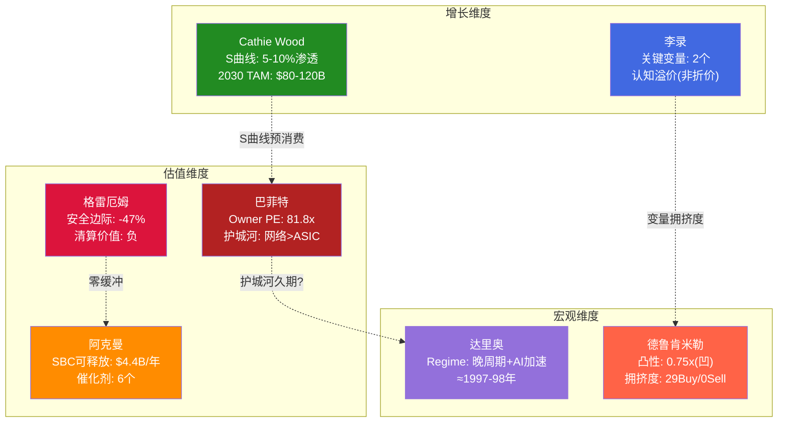

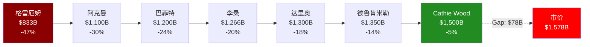

---

## 第二十四章：CQ闭环——六个核心矛盾最终裁定

> 加权置信度56.4%——微偏多头，极接近中性。好公司，但价格已充分甚至过度反映其品质。

### 24.1 CQ-1: AI ASIC——永续平台 vs CapEx周期? (权重30%, 置信度62%)

**最终回答**: Broadcom的AI ASIC业务本质上是一个**有缓冲的周期性平台**。"平台"属性来自60-70%市场份额[DM-P1-A01]、全栈co-design不可拆分性[DM-P4-B2-03]、以及$73B backlog提供的3.6年收入锁定[DM-P4-B2-02]。但"周期"属性同样明确: 100%依赖Hyperscaler CapEx($600B+ 2026E，增速从+49%减速至+25%)[DM-P3-B-05]，客户ASIC能力内化趋势不可逆(Google-MediaTek分流模板已建立)[DM-P3-B-02]，份额衰减函数L(t)=0.67*e^(-0.07t)+0.45指向2030年约60%[DM-P3-A02]。

关键判断: 这不是"周期or永续"的二元问题，而是"缓冲期有多长"的时间问题。$73B backlog将缓冲期延伸至FY2028+[DM-P4-B2-04]，但一旦backlog消化速度超过新增速度(预计2028H2-2029)，周期暴露将急剧上升。

**剩余不确定性**: 推理vs训练比例转换速度；Hyperscaler CapEx的"新常态"水平(如果$500B+成为底部而非峰值，周期性论点大幅弱化)。

**监控指标**: AI ASIC YoY增速(KS-01: <40%连续2季)、Hyperscaler CapEx QoQ(KS-09: <+10% YoY)、推理ASIC占AI ASIC收入比例(>40%则永续属性增强)。

### 24.2 CQ-2: 客户集中——锁定 vs 脆弱? (权重20%, 置信度58%)

**最终回答**: 客户集中度是**正在改善的结构性风险**，短期锁定极强但长期脆弱性确定。当前top3客户占AI收入约78%，但客户数从3增至6(OpenAI、ByteDance等为新增)[DM-P4-B2-02]，集中度在趋势性下降。锁定机制的核心在于全栈co-design: 单一Hyperscaler替换Broadcom需要同时找到ASIC设计+网络芯片+CPO的替代方案，2-3年替代周期构成强转换壁垒。

然而，Google已证明"模块化解绑"可行——核心XPU保留、外围I/O外包MediaTek[DM-P3-B-02]。如果Meta在2027H1效仿(已有2nm ASIC合同信号)，锁定机制将从"全包不可替代"降级为"核心XPU不可替代"。网络交叉锁定(90%交换芯片份额)[DM-P1-A02]提供了第二层防御——即使ASIC被分流，Hyperscaler仍需Broadcom网络芯片。

短期(FY2026-2028)锁定置信度75%，长期(FY2029+)脆弱性上升置信度仅40%。

### 24.3 CQ-3: VMware——提价红利 vs 客户流失? (权重20%, 置信度55%)

**最终回答**: VMware提价红利已**基本耗尽**，当前进入"高利润存量收割"阶段。Q1 FY2026软件收入$6.8B仅+1% YoY[DM-P1-A04]，与Q4 FY2025的+19.2%和Q1 FY2025的+46.7%形成断崖。三段式弹性函数解释了路径: <100%提价时弹性极低(锁定强)，100-300%提价触发缩减部署，>300%提价触发加速流失[DM-P2-B2-01]。86%的客户已缩减部署规模。

VMware的真正价值不在增长而在77% OPM的现金流贡献[DM-P1-A04]——即便零增长，每年仍贡献约$21B现金流。但Gartner预测HCI份额70%降至40%(2029)，Nutanix每季新增约1,000客户，2027-2028第一批3年合同到期将是真正的压力测试。定价权衰减模型PP(t)=0.80*e^(-lambda)预示2033年降至约0.59[DM-P2-B2-03]。

### 24.4 CQ-4: 估值——AI溢价合理 vs 泡沫? (权重15%, 置信度45%)

**最终回答**: 当前估值包含**两层溢价叠加**，其中一层合理、一层脆弱。第一层AI增长溢价(forward Non-GAAP PE约30x FY2026E)，如果FY2027E $10+ EPS实现则约20x——作为42% FCF margin的AI基础设施公司，20-25x forward PE是合理的。第二层"统一AI平台"定价溢价——市场将VMware按AI倍数定价，搭便车溢价$232B，占市值约14%[DM-P2-C3-02]。

六方法中位数EV=$1,376B vs 市场$1,627B(-15.4%)[DM-P2-C3-01]，偏差审计后期望回报修正至-14%[DM-P4-B01]。Owner PE 80.5x vs Non-GAAP PE约30x的2.7倍差距[DM-P2-C1-02]是SBC争议的美元化表达。

### 24.5 CQ-5: Hock Tan——核心资产 vs SPOF? (权重10%, 置信度52%)

**最终回答**: Hock Tan是**不可替代的核心资产+确定的SPOF**，两者同时为真且不矛盾。核心资产属性: 整合效率eta=1.37(6次收购)[DM-P1-A05]，资本配置4.5/5[DM-P1-A12]。SPOF属性: 73岁+合同仅至2030[DM-P1-A06]+继任完全不透明(继任评分1.5/5)+61%薪酬投票通过率反映治理隐患。

关键判断: Hock Tan的价值主要体现在收购决策能力而非日常运营——VMware整合已基本完成，AI ASIC业务由Charlie Kawwas和技术团队驱动。如果Tan在2028-2030退休，短期风险溢价约7-10%[DM-P1-A12]，但不会改变技术竞争力。真正的SPOF风险在于: 下一次大型收购没有Hock Tan的判断力，成功概率大幅降低。

### 24.6 CQ-6: 传统半导体——稳定基座 vs 侵蚀? (权重5%, 置信度65%)

**最终回答**: 传统半导体是**缓慢侵蚀的利润贡献者**。$16-17B收入基础中，Apple WiFi替代已造成约$2.7B(4.3%总收入)的确定性损失[DM-P1-A09]。DOCSIS 4.0升级周期可部分对冲，但传统业务定价权仅1.5/5[DM-P2-B2-02]。PtW仅27/50[DM-P3-A01]，是四个层中最弱的。对整体估值影响有限。

### 24.7 加权置信度计算

```
CQ加权置信度 = 30%x62% + 20%x58% + 20%x55% + 15%x45% + 10%x52% + 5%x65%
             = 18.6% + 11.6% + 11.0% + 6.75% + 5.2% + 3.25%
             = 56.4%
```

**解读**: 56.4%意味着整体微偏多头，但极接近中性(50%)。CQ置信度衡量"方向信心"(Broadcom是否是好公司)，期望回报衡量"价格是否合理"。结论: A-Score 7.1说"好公司"，期望回报-12%说"别买"。品质与价格的错配，而非品质本身的问题。

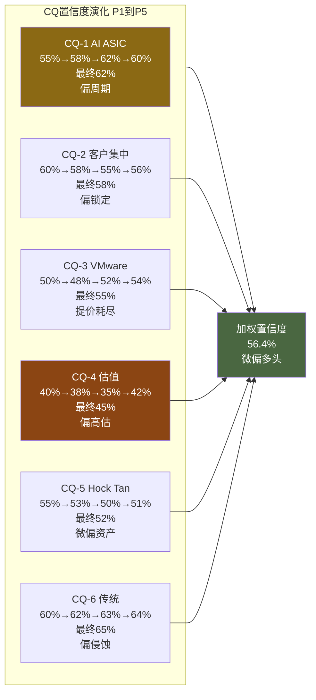

---

## 第二十五章：非共识假说判定——从假说到结论

> 三个非共识假说在五个Phase中经历了从直觉到证据的严格检验。置信度演化轨迹揭示了哪些判断经受住了考验，哪些在红队审计后被修正。

### 25.1 假说置信度演化总览

| 假说 | P0.75 | P1 | P2 | P3 | P4 | **P5最终** | **判定** |
|------|-------|-----|-----|-----|-----|-----------|---------|
| H-1 "伪装周期股" | 55% | 58% | 63% | 68% | 65% | **63%** | **部分成立** |
| H-2 "网络>ASIC" | 60% | 65% | 70% | 75% | 75% | **76%** | **成立** |
| H-3 "SBC永久成本" | 50% | 55% | 62% | 65% | 68% | **67%** | **部分成立** |

### 25.2 H-1: "Broadcom是伪装成AI增长股的高质量周期股" — 63%, 部分成立

五个Phase的证据链从两个方向同时收紧了判断。偏周期证据持续累积: CapEx驱动100%[DM-P3-B-05]、Cisco类比部分适用[DM-P3-B-06]、承重墙=AI ASIC增速(脆弱度3/5)[DM-P4-B06]、Nash均衡向多源化迁移[DM-P3-B-01]。但偏差审计修正了过度悲观: $73B backlog提供的3.6年缓冲[DM-P4-B2-02]使"周期翻转"推迟至FY2028+，客户从3扩至6降低集中度风险，推理ASIC S曲线提供结构性增长对冲。

从P3的68%回落至63%的核心原因: 偏差审计揭示此前过度锚定"周期股"叙事(+5-10pp悲观偏差)[DM-P4-B04]，且VMware 35%的低周期收入确实提供了弱但非零的缓冲。判定为"部分成立"而非"成立"——Broadcom不是纯周期股(有VMware+网络的非周期成分)，但也不是市场定价所隐含的"AI永续增长平台"。最准确的描述是**"有缓冲期的结构性周期股"**。

**投资含义**: 如果H-1成立，合理估值应按D1=0.76(修正后)而非市场隐含的D1>0.90定价。仅D1修正一项就隐含PE从62x压缩至约52x(-16%)。

**可观测验证**: FY2027-2028 AI ASIC收入在Hyperscaler CapEx增速放缓(+10-15%)时的弹性——收入仅降5-10%(缓冲有效)则H-1弱化至<55%；收入降20%+(周期暴露)则H-1强化至>75%。

### 25.3 H-2: "网络比ASIC更值钱" — 76%, 成立

这是五个Phase中证据一致性最强的假说，从P0.75的60%单调上升至76%。核心证据链:
- 网络衰减函数近零 vs ASIC lambda=0.05-0.10
- B4定价权确认网络4.5/5 vs ASIC 3.5/5[DM-P2-B2-03][DM-P2-B2-02]
- PtW网络45/50 vs ASIC 39/50[DM-P3-A01]，5年衰减最慢(90%至78% vs ASIC 67%至60%)[DM-P3-A03][DM-P3-A02]
- Bear隔离独立确认，偏差审计未发现此假说有悲观偏差

判定为"成立"的关键逻辑: 网络芯片的竞争壁垒是**协议标准+物理层+量产经验**的三重锁定，NVIDIA Spectrum-X受限于自有DGX生态无法攻入开放以太网市场。而ASIC设计服务的壁垒本质上是时间+经验，随着追赶者成熟，锁定确定性衰减。

**投资含义**: 市场定价锚在ASIC(高增速但衰减中)，掩盖了最持久的竞争优势(网络)。管理层合并披露AI收入恰恰遮蔽了网络层的独立价值。

**可观测验证**: Broadcom是否单独披露网络收入；NVIDIA Spectrum-X在DGX之外的份额(>10%则H-2弱化)；KS-06网络份额跌破75%(概率极低)。

### 25.4 H-3: "SBC是永久性成本，Non-GAAP系统性高估25%" — 67%, 部分成立

核心支撑证据链:
- SBC/Rev从6.1%升至11.8%再至11.3%(FY23至25至Q1F26)[DM-P1-A07]，VMware整合后不降反升
- $27B未确认余额[DM-P1-A08] = 至少2-3年的前置锁定
- SBC Q1 YoY +70% vs 收入+29%[DM-P4-B02] = 所有分析师盲区
- 回购$7.8B/Q仅抵消SBC稀释，净股数不变
- Owner PE 80.5x vs Non-GAAP PE约30x，$232B估值差[DM-P2-C3-02]

判定"部分成立"而非"成立"的理由: (1)回购offset率140.6%意味着SBC的"成本"性质需重新评估——如果公司持续用FCF回购抵消稀释，SBC更接近"现金薪酬的股权形式"而非"额外稀释"; (2)AI人才市场可能在2027-2028降温。

**可观测验证**: FY2027Q1(VMware保留到期后)SBC/Rev——<10%则H-3弱化至<55%("过渡性"确认)；>12%则H-3强化至>80%("永久性"确认)[KS-03]。

### 25.5 三假说联合含义

如果H-1+H-3同时成立(联合概率约44%)，Broadcom的"真实身份"是一家Owner PE 80x的高质量周期股，其AI故事正确但估值已完全定价——对应期望回报-20%至-25%。偏差审计将此修正至-14%(承认$73B backlog和客户扩张的看多证据被低估)。

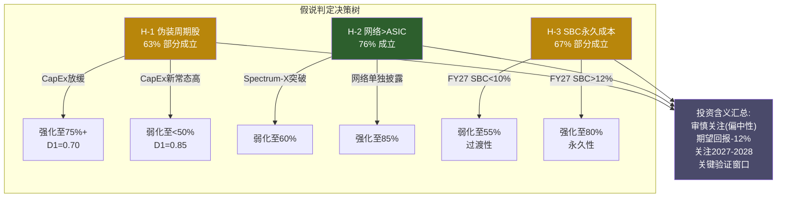

---

## 第二十六章：综合评估与投资者行动指南

### 26.1 评级: 审慎关注(偏中性)

**一句话定义**: Broadcom是一家三层嵌套的基础设施收费站——AI定制军火商(ASIC 60-70%+网络90%+CPO Gen3全栈co-design)、企业软件收费站(VMware VCF, 77% OPM但+1% YoY)、Hock Tan资产优化平台(eta=1.37, 73岁+SPOF+无继任)。[DM-P1-A01][DM-P1-A04][DM-P1-A05]

市场将三层合并为"AI增长股"统一定价(62x GAAP PE)，但诚实的分析必须拆开: AI半导体是唯一增长引擎(+106%)，VMware是存量提现(+1%)，Hock Tan溢价是定时器(合同至2030)。

**量化依据**: 期望回报-10%至-14%，中位数约-12%，落入"< -10%"区间。[DM-P4-B01]

**"偏中性"限定词**: Bear/Bull钢人评分7.5 vs 6.5(差距仅1.0, 对等)[DM-P4-B05]，$73B AI backlog提供FY2028前缓冲，偏差审计确认此前分析存在+5-10pp系统性悲观。[DM-P4-B04]

**关键数字**:

| # | 指标 | 值 | 含义 |
|---|------|-----|------|
| 1 | Owner PE | **80.5x** | 真实盈利倍数是市场引用值的2.7倍 [DM-P2-C1-02] |
| 2 | SOTP中位数 | **$1,376B** (-15.4%) | 六方法估值收敛于比市价低15% [DM-P2-C3-01] |
| 3 | SBC/Rev | **11.3%且上升** | 不降反升, $27B未确认余额=FY2027前无法正常化 [DM-P1-A07] |
| 4 | AI backlog | **$73B** | 唯一承重墙的缓冲垫, 提供2-3年可见性 [DM-P4-B06] |
| 5 | PtW衰减 | **73%至61.8%** | 5年内竞争优势确定性下降11.2pp [DM-P3-A01] |

### 26.2 概率加权估值

**三情景概率加权**:

| 情景 | 概率 | FY2030E Rev | 每股估值 | vs当前$332.77 |
|------|------|-----------|---------|-------------|
| Bull | 25% | $253B | $498 | +50% |
| Base | 50% | $175B | $228 | -32% |
| Bear | 25% | $99B | $46 | -86% |

概率加权EV: 25% x $2,100B + 50% x $1,350B + 25% x $900B = $1,425B

vs 市值$1,578B = 隐含期望回报-9.7%。综合(含黑天鹅-11.95%[DM-P4-B03]+拥挤度折价-3至5pp[DM-P3-D17])调整后，期望回报区间**-10%至-14%**，中位数**-12%**。[DM-P5-02]

**四方法加权中心估计: $224/股(-33%)**[DM-P5-B-08]

| 方法 | 估值(每股) | vs $332.77 | 权重 |
|------|-----------|-----------|------|
| Reverse DCF | $205 | -38% | 20% |
| 双层SOTP | $272 | -18% | 25% |
| 概率加权3情景(2年框架) | $147 | -56% | 30% |
| Forward PE(FY2027E Non-GAAP) | $285 | -14% | 25% |
| **加权中心** | **$224** | **-33%** | — |

四方法估值范围$147-$285，CV=25.1%(低确定性)。所有四种方法的估值均低于当前股价。[DM-P5-B-09][DM-P5-B-10]

**-14%与-33%的差异本质**: -14%(P4框架)是"如果市场继续用Non-GAAP定价"的情景，-33%(P5完整DCF)是"如果市场切换到Owner FCF框架"的情景。真实结果取决于估值框架是否迁移——这本身就是H-3(SBC永久成本, 置信度67%)的核心赌注。

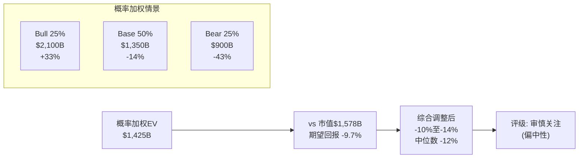

### 26.3 条件评级

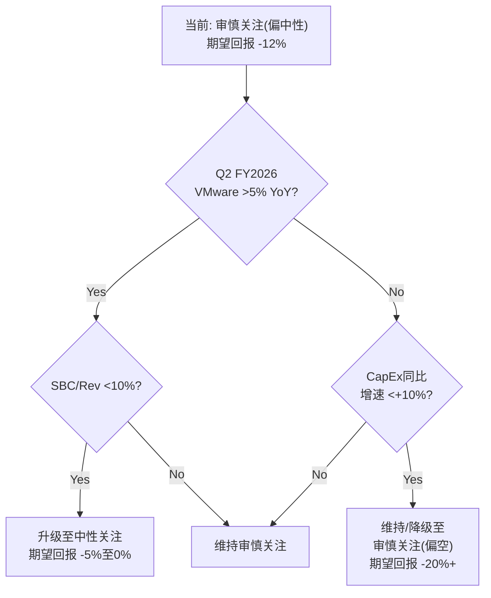

**升级至中性关注的条件**(需同时满足2/3):
1. VMware连续2季度>5% YoY有机增长(证明VCF平台化成功)
2. SBC/Rev降至<10%(证明正常化趋势)
3. ASIC客户从6家扩至8家以上(降低集中度风险)

**降级至审慎关注(偏空)的条件**(任一触发):
1. Hyperscaler CapEx同比增速降至<+10%(承重墙裂纹) [KS-09]
2. Google模块化解绑模式被第二家Hyperscaler效仿 [KS-05]
3. Hock Tan离任/健康事件且无继任公告 [KS-11]

### 26.4 投资者行动指南

**当前持有者: 逐步减仓至组合权重3%以下**

减仓节奏建议分3-4次在以下时点评估:
1. **Q2 FY2026财报(2026年6月)** — VMware是否>5%, SBC是否拐头
2. **FY2026H2(2026年7-9月)** — AI CapEx增速是否减速
3. **Hock Tan合同关键窗口(2027-2028)** — 继任计划是否公布
4. **估值regime转换预期窗口(2027H2-2028H1)** — 在转换前完成减仓

季度监控5指标:

| # | 指标 | 当前值 | 警戒线 | 数据来源 |
|---|------|--------|--------|---------|
| 1 | SBC/Rev | 11.3% | >12%恶化, <10%改善 | 10-Q |
| 2 | VMware YoY增速 | +1% | <0%收缩, >5%复苏 | Earnings call |
| 3 | ASIC客户数 | 6家 | <5集中恶化, 8+分散改善 | 管理层披露 |
| 4 | Hyperscaler CapEx同比 | +36% | <+10%周期拐点 | MSFT/GOOG/META/AMZN财报 |
| 5 | Owner PE(SBC+税率调整) | 80.5x | >100x极端, <50x合理 | 自行计算 |

**潜在买入者: 等待，当前无安全边际**

安全边际价位:
- **格雷厄姆标准**: 市值需到$836B(-47%)才有传统安全边际 [DM-P3-D13]
- **务实标准**: $1,100-1,200B区间(-24%至-31%, 对应股价$225-$245)开始有不对称回报 [DM-P5-06]
- **最佳买点**: CapEx周期底部+估值regime转换完成后，预计时间窗口**2028H1-2028H2** [DM-P5-07]

买点最可能出现在以下情景交汇:
1. AI CapEx从+36%减速至+5-10%(2027H2-2028H1)
2. 估值从62x PE压缩至30-35x(regime转换) [DM-P3-B03]
3. VMware有机增长恢复或被分拆传闻出现
4. 三者交汇约2028年中期，可能股价在$200-250区间

**不同投资者类型建议**:

| 投资者类型 | 建议 | 理由 |
|-----------|------|------|
| **价值投资者** | 不碰 | Owner PE 81x+负有形权益+安全边际-47% |
| **成长投资者** | 减仓至标配 | S曲线预消费风险——正确的技术判断不等于正确的投资 |
| **动量投资者** | 跟踪KS-01/09 | AI收入增速仍强(+106%)但边际减速(Q2指引约85%)，momentum拐点预计FY2027 |
| **收入投资者** | 可小仓位 | 股息率约1.1%偏低，但$27B/年FCF支撑股息持续增长 |

### 26.5 最大风险与最大机会

**最大风险: AI CapEx周期反转** — 承重墙B1(脆弱度3/5)。半导体收入65%+直接绑定Hyperscaler CapEx，$600B+(2026)已是扩张晚期。圆桌S曲线预消费风险意味着即使技术正确，回报可能为零。[DM-P3-B01][DM-P3-D16]

**最大机会: AI推理爆发+网络升级超级周期** — 如果推理需求在2027-2028引爆(每1%模型推理化=数倍ASIC+网络芯片需求)，且以太网在AI集群中份额从70%升至90%，Broadcom作为ASIC+网络双寡头的定位将使AI收入CAGR维持25%+至2030年，支撑$2,000B+市值。网络层PtW 45/50是所有层中最强且衰减最慢。[DM-P3-A03][DM-P2-B2-03]

---

## 第二十七章：Kill Switch与Trigger Switch注册表

> 什么条件下离场? 什么条件下加仓? 什么时候看什么?

### 27.1 Kill Switch完整注册表

**13个Kill Switch按三层分类: 根因层(上游驱动)、传导层(中间变量)、表现层(可观测结果)**

| ID | 名称 | 触发条件 | 当前值 | 距阈值 | 紧迫度 | 关联信念 |
|----|------|---------|--------|--------|--------|---------|
| **KS-01** | AI半导体增速断崖 | AI半导体YoY增速连续2季<40% | Q1 +106% [DM-P3-A19] | 66pp缓冲 | 低 | B1承重墙 |
| **KS-02** | VMware增长停滞 | VMware连续2季YoY<0% | Q1 +1% [DM-P1-A04] | **1pp** | **高** | B2弹性墙 |
| **KS-03** | SBC结构化永久成本 | SBC/Rev持续4季>12% | 11.3% [DM-P1-A07] | **0.7pp** | **中高** | B4弹性墙 |
| **KS-04** | Owner FCF质量恶化 | SBC调整后FCF margin<30%连续2季 | 30.2% [DM-P2-C2-05] | **0.2pp** | **高** | B3+B4 |
| **KS-05** | ASIC垄断地位松动 | Cloud AI ASIC份额<55% | 60-67% [DM-P1-A01] | 5-12pp | 中 | B1承重墙 |
| **KS-06** | 网络垄断裂缝 | 云DC交换芯片份额<75% | 约90% [DM-P1-A02] | 15pp | 低 | H-2假说 |
| **KS-07** | 估值Regime转换 | Forward PE<25x或Trailing PE<40x | F-PE约30x, T-PE约62x | 5x/22x | 低 | B5装饰墙 |
| **KS-08** | Nutanix迁移浪潮 | Nutanix季新增>1,500且VMware续约<85% | 季增约1,000 | +500 | 中 | B2弹性墙 |
| **KS-09** | AI CapEx周期转折 | Top4 Hyperscaler CapEx YoY<+10% | +36% [DM-P3-B-04] | 26pp | 中 | **B1根因** |
| **KS-10** | MediaTek核心层突破 | MediaTek获核心XPU设计合同 | 仅I/O层 | 3-5年 | 低 | B1承重墙 |
| **KS-11** | Hock Tan SPOF | CEO变动信号 | 73岁,合同至2030 [DM-P1-A06] | 不确定 | 中 | 管理层 |
| **KS-12** | 客户集中恶化 | Top3占AI收入>85% | 约78% | 7pp | 低 | B1承重墙 |
| **KS-13** | 利率永久上移 | 10Y UST>5.5%(3M avg) | 4.2-4.5% | 1.0-1.3pp | 低 | B5装饰墙 |

### 27.2 最危险Kill Switch组合

**灾难性组合: KS-09 + KS-03 + KS-11 (三重打击)**

| KS | 触发条件 | 独立概率 |
|----|---------|---------|
| KS-09 | CapEx放缓<+10% | 25-30% |
| KS-03 | SBC永久>12% | 35-40% |
| KS-11 | Hock Tan离任 | 10-15%/年 |

三重同时触发联合概率约1-2%，估值影响: CapEx(-40%) + SBC重估(-20%) + Hock Tan溢价移除(-12%) = **综合-55%至-65%**(非简单加总，有交叉效应)。这三个KS分别攻击增长(B1)、质量(B4)、管理层三个独立维度，没有自然对冲机制。[DM-P4-C05]

**高概率不利组合: KS-01 + KS-02 (双引擎同时熄火)**

联合概率约15-20%。AI减速(-15-20%) + VMware萎缩(-5-7%) + "双引擎叙事"破裂引发额外倍数压缩(-10%) = **综合-30%至-35%**。市场给Broadcom的"双引擎增长"叙事溢价约15-20pp PE。如果两个引擎同时出问题——即使幅度不大——叙事崩塌的影响可能大于基本面影响。[DM-P4-C08]

### 27.3 KS间的反直觉关系

**KS-01与KS-03的负相关(约-0.3)**: AI增速下降(KS-01触发)导致AI人才争夺缓和，SBC压力下降，KS-03反而改善。最坏的SBC情景反而需要最好的AI增长情景作为前提。投资者面临的不是"全面恶化"，而是**"不同维度轮流出问题"**。

**KS-05与KS-12的悖论关系**: ASIC份额下降可能通过新客户分散化而改善客户集中度。份额从67%降至55%但客户从6个增至10个=单客户依赖下降。**垄断者的困境: 份额下降可能是更健康的生态结构。**

### 27.4 Trigger Switch注册表

| ID | 名称 | 触发条件 | 当前值 | 12M概率 | 触发后影响 |
|----|------|---------|--------|---------|-----------|
| **TS-01** | PE压缩至安全区间 | Forward PE<20x或Owner FCF yield>5% | F-PE约30x, Owner yield 1.2% | 5-8% | 估值翻转为正期望 |
| **TS-02** | VMware增长引擎重启 | VMware连续2季有机>5% YoY | +1% YoY | 10-15% | D1改善, +5-8%估值 |
| **TS-03** | SBC正常化确认 | SBC/Rev连续3季<9% | 11.3% | 5-10% | Owner PE降至约55x, +10-15% |
| **TS-04** | ASIC客户扩大 | 确认8个以上hyperscaler客户 | 6个 | 25-30% | 集中度改善, PtW上调 |
| **TS-05** | 网络地位强化 | UEC 2.0 Broadcom主导或Arista PO>$10B | UEC 1.0; Arista $6.8B | 15-20% | 网络叙事重定价+10-15% |
| **TS-06** | CapEx周期底部反转 | CapEx经2季负增长后转正 | 仍在扩张期 | 0-2% | 最佳入场点信号 |

12个月内任一TS触发概率约55.7%[DM-P5-B-12]，但最可能触发的是TS-04(新客户确认)，这是增量改善而非估值翻转信号。真正改变估值叙事的TS-01/TS-03概率仅5-10%。KS触发风险显著高于TS触发机会——风险/机会不对称。

### 27.5 KS条件依赖网络

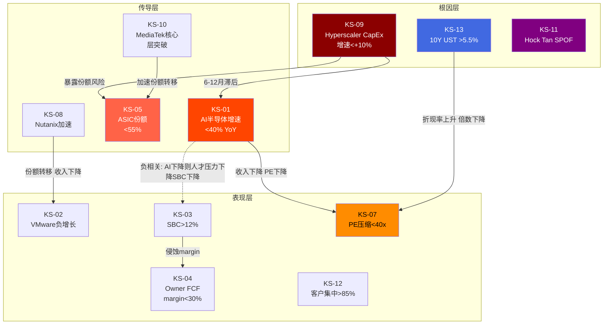

**关键依赖路径分析**:

**路径1: CapEx周期传导链(最高概率灾难路径)**
KS-09(CapEx放缓) 经6-12月传导至 KS-01(AI增速断崖) 即时传导至 KS-07(PE压缩)。联合概率22-27%，综合估值影响-50%+。[DM-P4-C06][DM-P4-C07]

**路径2: SBC+Margin双杀(慢性侵蚀路径)**
KS-03(SBC永久>12%)传导至KS-04(Owner FCF margin<30%)，引发渐进式重定价。联合概率25-28%，估值影响-15-20%。与路径1负相关(AI下降则SBC压力降低)，提供自然对冲但不对称。

**路径3: VMware+Nutanix替代加速(弹性墙弯曲路径)**
KS-08(Nutanix加速)传导至KS-02(VMware负增长)。联合概率18%，估值影响-3-5%。独立于路径1。

### 27.6 投资日历: 未来12个月15个关键时点

| 日期(估) | 事件 | 影响的KS/TS | 优先级 |
|---------|------|-----------|--------|
| 2026年4月中 | Google Q1 2026财报 | KS-09, KS-05 | **高** |
| 2026年4月底 | Meta Q1 2026财报 | KS-09, KS-12 | **高** |
| 2026年5月中 | Nutanix Q3 FY2026财报 | KS-08, KS-02 | 中 |
| 2026年6月初 | **AVGO Q2 FY2026财报** | **KS-01,02,03,04,07,12; TS-02,03** | **最高** |
| 2026年6月中 | Google I/O 2026 | KS-05, KS-10 | 中 |
| 2026年6月底 | UEC 2.0标准进展 | KS-06, TS-05 | 中 |
| 2026年7月中 | Microsoft Q4 FY2026财报 | KS-09 | 高 |
| 2026年7月底 | Amazon Q2 2026财报 | KS-09 | 高 |
| 2026年8月中 | Marvell Q2 FY2027财报 | KS-05 | 中 |
| 2026年9月初 | **AVGO Q3 FY2026财报** | **KS-01,02,03,04,07; TS-02,03,04** | **最高** |
| 2026年9月中 | Nutanix FY2026年报 | KS-08 | 中 |
| 2026年10月 | TSMC Q3 2026财报 | KS-05, KS-10 | 中 |
| 2026年12月初 | **AVGO Q4 FY2026/FY2026年报** | **所有KS/TS** | **最高** |
| 2027年2月 | VMware第一批3年合同到期 | KS-02, KS-08 | **高** |

**下一个决策点: Q2 FY2026(2026年6月)**。这是最关键的数据窗口: VMware第二个季度的有机增长率将确认"+1%是季节性还是新常态"。如果连续两季度<3%，"VMware是高利润ATM而非增长引擎"假说将从62%升至80%+，对软件层估值影响-$100-150B。[DM-P4-C11]

### 27.7 季度监控模板

每次AVGO财报后24小时内检查:

```
1. AI半导体收入YoY增速 vs 前季(KS-01检测)
   当前基准: Q1 +106%, Q2指引隐含约85%
   红线: <40%连续2季

2. 软件收入YoY增速(KS-02检测)
   当前基准: Q1 +1%
   红线: <0%连续2季

3. SBC/Revenue比率(KS-03检测)
   当前基准: 11.3%
   绿线: <9%(TS-03触发)
   红线: >12%

4. 季度末流通股数变化(SBC稀释净效果)
   当前基准: 4,888M(Q1 FY2026)
   红线: 净增加(回购不足以抵消SBC)

5. Backlog变化方向($73B是承重墙前兆信号)
   红线: 环比下降>10%
```

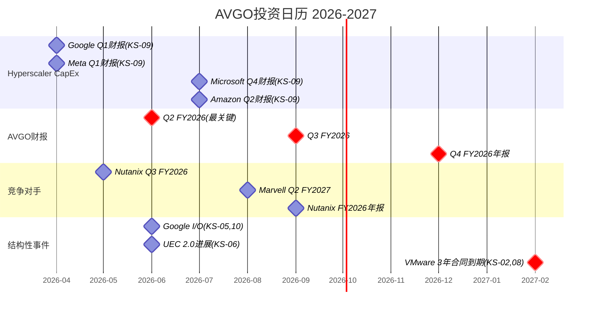

---

## 附录A：DM数据锚点注册表

> 全报告Phase 1-5数据锚点汇总。每个锚点包含指标、数值、来源及可信度评级。

### A.1 财务数据锚点

| ID | 指标 | 值 | 来源 | 可信度 |
|----|------|-----|------|--------|
| DM-P1-A04 | VMware软件OPM | 77% | Q1 FY2026 Earnings | ★★★★★ |
| DM-P1-A07 | SBC/Rev趋势 | 6.1%→11.8%→11.3% (FY23→25→Q1F26) | FMP+Earnings | ★★★★☆ |
| DM-P1-A08 | SBC未确认余额 | $27B | 10-Q (May 2025) | ★★★★★ |
| DM-P1-A09 | Apple WiFi收入影响 | 约$2.7B (4.3%总收入) | 分析师估算 | ★★★☆☆ |
| DM-P1-A10 | 税率正常化建议 | 12-15% (新加坡IP结构) | 分析推导 | ★★★☆☆ |
| DM-P1-A11 | 有机增长率 | 约6.4% CAGR (FY22-24) | 计算 | ★★★★☆ |
| DM-P2-C1-01 | 三层OPM | GAAP 39.9%/Owner 52.9%/Non-GAAP 65.6% | 财报推导 | ★★★★☆ |
| DM-P2-C1-02 | Owner PE | 80.5x | 计算 | ★★★★☆ |
| DM-P2-C1-03 | 税率正常化推荐 | 14% (每1%=$0.23B NI) | 分析推导 | ★★★☆☆ |
| DM-P2-C1-04 | 资本返还率 | 90.1% of FCF | 财报 | ★★★★★ |
| DM-P2-C2-05 | Owner FCF margin | 30.2% | 计算 | ★★★★☆ |
| DM-P3-D01 | Owner PE(圆桌) | 81.8x | 巴菲特分析 | ★★★★☆ |
| DM-P3-D05 | SBC优化可释放空间 | $4.4B/年(11.3%→7%) | 阿克曼分析 | ★★★☆☆ |
| DM-P3-D10 | 利率+100bp直接影响 | $490M/年(FCF 1.8%) | 达里奥计算 | ★★★★☆ |
| DM-P3-D14 | 有形净资产 | -$22.4B | 格雷厄姆计算 | ★★★★☆ |
| DM-P4-B02 | SBC Q1 YoY增速 | +70% | Bear隔离 | ★★★★☆ |

### A.2 竞争格局锚点

| ID | 指标 | 值 | 来源 | 可信度 |
|----|------|-----|------|--------|
| DM-P1-A01 | ASIC市场份额 | 60-70% | Counterpoint Research | ★★★☆☆ |
| DM-P1-A02 | 交换芯片份额 | 约90% (云DC) | EEWorld/TheRegister | ★★★☆☆ |
| DM-P1-A03 | CPO出货代数 | Gen 3 (TH6-Davisson) | Broadcom OFC 2025 | ★★★★☆ |
| DM-P1-A05 | Hock Tan整合eta均值 | 1.37 (6次收购) | 计算 | ★★★★☆ |
| DM-P1-A06 | CEO合同期限 | 至2030年 | Proxy/Lit Recon | ★★★★★ |
| DM-P3-A01 | 加权PtW | 36.5/50(73%) 2030E 30.9/50(61.8%) | 竞争分析 | ★★★☆☆ |
| DM-P3-A02 | ASIC衰减lambda更新 | 0.07/yr, 2030E约60% | 衰减函数 | ★★☆☆☆ |
| DM-P3-A03 | 网络5Y份额 | 90%→78% | 竞争分析 | ★★★☆☆ |
| DM-P3-D03 | 关键变量提纯 | 2个: AI CapEx增速+ASIC衰减lambda | 李录分析 | ★★★☆☆ |
| DM-P3-D04 | 认知溢价判断 | 存在(29/31 Buy+软件搭AI便车) | 李录分析 | ★★★☆☆ |
| DM-P3-D08 | 分析师评级分布 | 29 Buy / 2 Hold / 0 Sell | 市场数据 | ★★★★★ |
| DM-P3-D11 | 推理ASIC S曲线位置 | 5-10%渗透(早期爆发) | Cathie Wood | ★★☆☆☆ |
| DM-P3-D12 | ASIC Wright定律限制 | 系统成本降但设计成本不降 | Cathie Wood | ★★★☆☆ |

### A.3 估值锚点

| ID | 指标 | 值 | 来源 | 可信度 |
|----|------|-----|------|--------|
| DM-P2-C2-01 | Reverse DCF隐含CAGR | 18-22%(报告FCF)/20-29%(SBC-adj) | 逆向推导 | ★★★☆☆ |
| DM-P2-C2-02 | Bull联合概率 | 约2.5%(P4修正后5-8%) | 条件概率 | ★★☆☆☆ |
| DM-P2-C2-03 | 概率加权期望回报(初始) | -19.8% | 三情景加权 | ★★★☆☆ |
| DM-P2-C2-04 | 承重墙 | B1 AI ASIC增速(脆弱度4/5, P4修正后3/5) | 信念反演 | ★★★☆☆ |
| DM-P2-C3-01 | 六方法中位数EV | $1,376B vs市场$1,627B(-15.4%) | SOTP | ★★★★☆ |
| DM-P2-C3-02 | GAAP/Non-GAAP估值差 | $232B | SOTP | ★★★☆☆ |
| DM-P2-B2-01 | VMware弹性epsilon | -0.05/-0.15/-0.40(分段) | 弹性分析 | ★★★☆☆ |
| DM-P2-B2-02 | 加权B4评分 | 3.3/5 | 定价权分析 | ★★★☆☆ |
| DM-P2-B2-03 | 网络定价权评级 | 4.5/5(最强层) | 定价权分析 | ★★★☆☆ |
| DM-P3-D06 | FY2027E独立估计 | $138-146B (vs共识$152B) | 德鲁肯米勒 | ★★☆☆☆ |
| DM-P3-D07 | 凸性N/M比 | 0.75x (凹性交易) | 德鲁肯米勒 | ★★★☆☆ |
| DM-P3-D09 | AI CapEx性质判断 | 55%生产性/45%泡沫 | 达里奥分析 | ★★☆☆☆ |
| DM-P3-D13 | 格雷厄姆安全边际 | -47% ($833B vs $1,578B) | 格雷厄姆计算 | ★★★☆☆ |
| DM-P3-D15 | 当前PE历史百分位 | >95th | 统计分析 | ★★★★☆ |
| DM-P5-B-08 | 四方法加权估值 | $224/股 (-32.7%) | 多方法加权 | ★★★☆☆ |
| DM-P5-B-09 | 四方法CV | 25.1% (低确定性) | 统计 | ★★★☆☆ |
| DM-P5-B-13 | 敏感性矩阵锚点 | AI 18%+SBC 10% = $183/股 | P&L推导 | ★★★☆☆ |

### A.4 风险与管理层锚点

| ID | 指标 | 值 | 来源 | 可信度 |
|----|------|-----|------|--------|
| DM-P1-A12 | 管理层B8评分 | 3.25/5 | 多维度评估 | ★★★☆☆ |
| DM-P3-B01 | AI CapEx周期位置 | 扩张晚期, $600B+ 2026 | 宏观分析 | ★★★☆☆ |
| DM-P3-B02 | 温水煮青蛙5Y | 累计-39% | 五引擎联动 | ★★☆☆☆ |
| DM-P3-B03 | Regime转换预期 | 2027H2-2028H1 | 周期分析 | ★★☆☆☆ |
| DM-P3-C01 | A-Score | 6.9(修正后7.1, 偏好下沿) | 品质评估 | ★★★☆☆ |
| DM-P3-D16 | S曲线预消费风险 | 市场已按终局定价早期S曲线 | 圆桌碰撞 | ★★★☆☆ |
| DM-P3-D17 | 变量拥挤度放大器 | 期望回报需再调-3至5pp | 圆桌碰撞 | ★★☆☆☆ |
| DM-P3-D18 | 双零缓冲阶梯下行 | 负资产+高倍数=无支撑位 | 圆桌碰撞 | ★★★☆☆ |
| DM-P4-B01 | 期望回报(纠错后) | -14% | 偏差审计 | ★★★☆☆ |
| DM-P4-B03 | 黑天鹅总EV影响 | -11.95% | 红队 | ★★☆☆☆ |
| DM-P4-B04 | 悲观偏差幅度 | +5-10pp | 偏差审计 | ★★★☆☆ |
| DM-P4-B05 | 钢人评分 | Bear 7.5 vs Bull 6.5 | 偏差审计 | ★★★☆☆ |
| DM-P4-B06 | 承重墙脆弱度修正 | 4/5→3/5 | 偏差审计 | ★★★☆☆ |
| DM-P4-C05 | 灾难性组合联合概率 | KS-09+03+11同时约1-2% | 概率计算 | ★★☆☆☆ |

### A.5 综合评估锚点(Phase 5)

| ID | 指标 | 值 | 来源 | 可信度 |
|----|------|-----|------|--------|
| DM-P5-01 | 三情景概率加权EV | $1,425B (-9.7%) | 三情景计算 | ★★★☆☆ |
| DM-P5-02 | 综合期望回报区间 | -10%至-14%, 中位数-12% | 多方法调和 | ★★★☆☆ |
| DM-P5-03 | 升级条件 | VMware>5%+SBC<10%+ASIC客户8+(2/3) | 条件分析 | ★★★☆☆ |
| DM-P5-04 | 降级触发 | CapEx<+10%或解绑扩散或Hock Tan事件 | 条件分析 | ★★★☆☆ |
| DM-P5-05 | CI冠军候选 | CI-03 S曲线预消费风险(8.5/10) | 评分 | ★★★☆☆ |
| DM-P5-06 | 安全边际价位(务实) | $1,100-1,200B(股价$225-245) | 估值分析 | ★★★☆☆ |
| DM-P5-07 | 最佳买点时间窗口 | 2028H1-H2 | 周期分析 | ★★☆☆☆ |
| DM-P5-C01 | CQ加权置信度 | 56.4%(微偏多头) | 加权计算 | ★★★☆☆ |
| DM-P5-C04 | H-1最终判定 | 63%, 部分成立 | 五Phase证据 | ★★★☆☆ |
| DM-P5-C05 | H-2最终判定 | 76%, 成立 | 五Phase证据 | ★★★☆☆ |
| DM-P5-C06 | H-3最终判定 | 67%, 部分成立 | 五Phase证据 | ★★★☆☆ |
| DM-P5-B-01 | Bull FY2030E每股 | $498(+50%) | P&L Build-out | ★★☆☆☆ |
| DM-P5-B-02 | Base FY2030E每股 | $228(-32%) | P&L Build-out | ★★★☆☆ |
| DM-P5-B-03 | Bear FY2030E每股 | $46(-86%) | P&L Build-out | ★★☆☆☆ |

---

## 附录B：CI非共识洞察注册表

> 本报告产出5个非共识洞察(CI)，按独特性和可迁移性评分。CI-03为冠军候选。

| # | 洞察 | 评分 | 可迁移性 | 来源Phase | 评分理由 |
|---|------|------|---------|----------|---------|
| **CI-01** | **"最强护城河贡献最小收入"悖论** — 网络层定价权4.5/5但仅占15%收入，ASIC层60-70%份额但定价权3.5/5且衰减中，VMware层77% OPM但+1%增长。公司估值锚定在最脆弱的层(ASIC)而非最持久的层(网络) | 7.5/10 | 任何多层业务公司(层间护城河不均质时的估值重心错位分析) | P2 B4 | 独特性8+可迁移性7 |
| **CI-02** | **SBC Q1 YoY +70%被29个Buy分析师忽略** — 收入仅+29%但SBC增速+70%，所有sell-side用Non-GAAP选择性忽略。$27B未确认余额=$5.4B/yr x 5yr的隐性成本承诺。Owner PE 80.5x vs Non-GAAP 30x的2.7倍差距=分析师盲区的美元价值 | 8.0/10 | 所有AI人才密集型公司(NVDA/AMD/META/GOOG的SBC加速度检测) | P4 RT | 独特性9+可迁移性7 |
| **CI-03** | **S曲线预消费风险** — 市场按AI终局定价早期S曲线。即使Broadcom技术定位完全正确，如果S曲线展开速度慢于估值隐含的18-22% CAGR，投资者时间成本使实际回报趋近于零。关键不是"AI是否成功"而是"AI何时足够大" | **8.5/10** | 所有早期AI基础设施公司(NVDA/AMD/MRVL/VRT)，所有S曲线早期范式变革主题 | P3圆桌 | 独特性9+可迁移性9 |
| **CI-04** | **三层OPM: Owner vs GAAP vs Non-GAAP** — GAAP 39.9%/Owner 52.9%/Non-GAAP 65.6%三重利润表暴露22pp的"现实扭曲场"。约12pp是真实经济成本(SBC+重组)，约10pp是会计选择(摊销)。关键不是"哪个数字对"而是"不同利益相关者选择看哪个数字" | 7.0/10 | 所有高SBC+大型并购公司(INTU/CRM/ORCL的并购后利润真实性检验) | P2 C1 | 独特性7+可迁移性8 |
| **CI-05** | **VMware弹性函数: 三阶段定价权衰减** — epsilon从-0.05(锁定期)到-0.15(缩减期)到-0.40(流失期)的分段弹性模型。揭示提价策略的"甜蜜区"和"悬崖"。PP(t)=0.80*e^(-lambda)预示2033年定价权降至约0.59 | 7.0/10 | 任何提价后锁定型公司(IHG/MAR加盟商提价分析，ADBE/CRM订阅提价弹性) | P2 B2 | 独特性7+可迁移性7 |

### 冠军候选评估: CI-03 "S曲线预消费风险" (8.5/10)

**独特性**: 不是简单的"估值过高"论点，而是揭示了一个结构性悖论——技术正确不等于投资正确，时间维度被估值吞噬。

**可迁移性最高(9/10)**: 可直接应用于NVDA($4T, 同样S曲线早期定价)、VRT(液冷S曲线)、AMD(AI GPU第二曲线)、甚至非半导体的自动驾驶(TSLA)和量子计算(IONQ)。

**方法论贡献**: 将巴菲特的安全边际框架与Cathie Wood的S曲线框架碰撞，产出的不是折中而是新洞见——"即使右侧正确，入场时间决定回报是正还是零"。

**与NVDA CI-01的关系**: 互补而非重复。CI-01聚焦周期性质，CI-03聚焦S曲线时间维度。两者共同构成AI基础设施估值的完整批判框架。

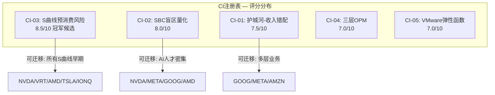

---

## 附录C：估值方法详解

### C.1 Reverse DCF详细参数

**核心问题**: 当前$1,578B市值隐含了什么假设?

**基础参数**:
- WACC: 9.5%(Ke=10.55%, Kd=3.8%, D/V=15%)
- 永续增长率: 3.5%
- 税率: 14%(新加坡IP结构)[DM-P2-C1-03]

**隐含信念反演结果**:

| 信念 | 市场隐含值 | 合理值(本报告判断) | 脆弱度 | 分类 |
|------|----------|------------------|--------|------|
| B1 AI ASIC增速 | 10Y CAGR 18-22% | 12-15% | 3/5(修正后) | **承重墙** |
| B4 SBC正常化 | 降至6-8% | 维持10-12% | 3.5/5 | 弹性墙 |
| B2 VMware增速 | 5-8% | 0-3% | 3/5 | 弹性墙 |
| B5 终端倍数 | 25-30x FCF | 18-22x | 2.5/5 | 装饰墙 |
| B3 FCF Margin | 40-45% | 35-40%(Owner) | 2/5 | 装饰墙 |

**核心发现**: 五项隐含假设中至少两项(VMware增速、SBC正常化)已被数据否定——VMware实际+1%而非5-8%，SBC实际11.3%且上升而非回落至8%。[DM-P2-C2-01]

### C.2 双层SOTP六方法详细假设

**半导体层估值(FY2025A基础)**:
- 收入: AI ASIC约$20B + 网络约$10B + 传统约$8B = $38B
- EBITDA margin: 约55%(Non-GAAP) / 45%(Owner)
- FCF margin: 约42%(报告) / 30%(Owner)

**软件层估值(FY2025A基础)**:
- 收入: VMware + 其他 = 约$26B
- OPM: 77%, EBITDA margin约80%
- 增长: +1% YoY有机

**六方法参数对照**:

| 方法 | 半导体倍数 | 软件倍数 | 半导体EV | 软件EV | 合计 |
|------|----------|---------|---------|--------|------|
| EV/Rev | 22x | 11x | $840B | $290B | $1,130B |
| EV/EBITDA | 24x | 19x | $960B | $400B | $1,360B |
| EV/FCF(Owner) | 30x | 28x | $780B | $512B | $1,292B |
| P/E正常化 | — | — | $900B | $624B | $1,524B |
| GGM | g=18%, r=10.5% | g=3%, r=8.5% | $620B | $390B | $1,010B |
| Transaction | Marvell可比 | VMware pre-acq | $1,050B | $330B | $1,380B |
| **中位数** | | | **$870B** | **$395B** | **$1,376B** |

五方法(除GGM)收敛度CV=7.2%(中等确定性)。[DM-P2-C3-01]

**搭便车溢价量化**: 市场将Broadcom按统一"AI平台"定价(EV $1,627B)，SOTP中位数$1,376B。差距$251B中约$232B来自软件层被按AI倍数定价(实际独立估值仅$395B，市场隐含约$627B)。[DM-P2-C3-02]

### C.3 三情景P&L关键假设

**Bull Case (概率25%)**:

| 驱动力 | 假设 | 来源依据 |
|--------|------|---------|
| AI ASIC CAGR | 28%(FY2026-2030) | 推理渗透S曲线加速+客户6至10 |
| VMware CAGR | 5% | VCF 9.0 AI-native成功 |
| SBC/Rev | 11.3%降至8% | VMware保留到期+规模稀释 |
| Exit倍数 | 25x Owner FCF | 维持"AI平台"叙事 |
| FY2030E Owner FCF | $94.8B | [DM-P5-B-01] |
| **每股估值** | **$498 (+50%)** | |

**Bull P&L Build-out (FY2026-FY2030)**:

| 项目 | FY2025A | FY2026E | FY2027E | FY2028E | FY2029E | FY2030E |
|------|---------|---------|---------|---------|---------|---------|
| AI半导体收入 | $20B | $44B | $72B | $105B | $135B | $168B |
| 网络收入 | $10B | $15B | $20B | $26B | $31B | $35B |
| 传统半导体 | $8B | $8B | $7.5B | $7B | $7B | $7B |
| 软件收入 | $26B | $35B | $37B | $39B | $41B | $43B |
| **总收入** | $63.9B | $102B | $136.5B | $177B | $214B | $253B |
| SBC/Rev | 11.3% | 10.5% | 9.5% | 9.0% | 8.5% | 8.0% |
| Owner FCF | $19.3B | $32.3B | $46.0B | $62.1B | $78.8B | $94.8B |

**Base Case (概率50%)**:

| 驱动力 | 假设 | 来源依据 |
|--------|------|---------|
| AI ASIC CAGR | 18%(前3年执行+后2年放缓至15%) | 合理值评估 |
| VMware CAGR | 2% | 提价红利耗尽+VCF有限贡献 |
| SBC/Rev | 11.3%降至10% | 部分正常化 |
| Exit倍数 | 20x Owner FCF | 重归"大型优质infra公司" |
| FY2030E Owner FCF | $56.5B | [DM-P5-B-02] |
| **每股估值** | **$228 (-32%)** | |

**Base P&L Build-out (FY2026-FY2030)**:

| 项目 | FY2025A | FY2026E | FY2027E | FY2028E | FY2029E | FY2030E |
|------|---------|---------|---------|---------|---------|---------|
| AI半导体收入 | $20B | $42B | $63B | $82B | $95B | $108B |
| 网络收入 | $10B | $14B | $17B | $20B | $22B | $24B |
| 传统半导体 | $8B | $8B | $7B | $7B | $6.5B | $6B |
| 软件收入 | $26B | $34B | $35B | $35.5B | $36B | $37B |
| **总收入** | $63.9B | $98B | $122B | $144.5B | $159.5B | $175B |
| SBC/Rev | 11.3% | 11.0% | 10.5% | 10.2% | 10.0% | 10.0% |
| Owner FCF | $19.3B | $29.2B | $38.2B | $46.3B | $52.0B | $56.5B |

**Bear Case (概率25%)**:

| 驱动力 | 假设 | 来源依据 |
|--------|------|---------|
| AI CapEx | +36%降至-5%(类Cisco减速) | 周期下行[DM-P3-B-06] |
| ASIC份额 | 65%降至50%(模板效应扩散) | lambda加速至0.10 |
| VMware | -3%/yr(Nutanix+K8s+续约流失) | KS-08触发 |
| SBC/Rev | 维持12%+(AI人才替代VMware保留) | H-3确认 |
| Exit倍数 | 15x Owner FCF | 周期底部估值 |
| FY2030E Owner FCF | $19.1B | [DM-P5-B-03] |
| **每股估值** | **$46 (-86%)** | |

**Bear P&L Build-out (FY2026-FY2030)**:

| 项目 | FY2025A | FY2026E | FY2027E | FY2028E | FY2029E | FY2030E |
|------|---------|---------|---------|---------|---------|---------|
| AI半导体收入 | $20B | $38B | $50B | $55B | $52B | $50B |
| 网络收入 | $10B | $13B | $15B | $16B | $16B | $15B |
| 传统半导体 | $8B | $7.5B | $6.5B | $6B | $5.5B | $5B |
| 软件收入 | $26B | $33B | $32B | $31B | $30B | $29B |
| **总收入** | $63.9B | $91.5B | $103.5B | $108B | $103.5B | $99B |
| SBC/Rev | 11.3% | 12.0% | 12.5% | 12.5% | 12.0% | 12.0% |
| Owner FCF | $19.3B | $24.0B | $26.1B | $24.5B | $21.6B | $19.1B |

### C.4 敏感性矩阵完整版

**矩阵1: AI CAGR x SBC/Rev (FY2030E每股估值, Exit 20x)**

| | AI CAGR 12% | AI CAGR 18% | AI CAGR 25% | AI CAGR 30% |
|---|:---:|:---:|:---:|:---:|
| SBC 8% | $143 | $215 | $320 | $398 |
| SBC 10% | $118 | **$183** | $275 | $345 |
| SBC 11% | $106 | $166 | $250 | $315 |
| SBC 12% | $93 | $148 | $225 | $285 |

[DM-P5-B-13]

**矩阵2: Exit倍数 x AI CAGR (SBC 10%固定)**

| | AI CAGR 12% | AI CAGR 18% | AI CAGR 25% | AI CAGR 30% |
|---|:---:|:---:|:---:|:---:|
| Exit 15x | $71 | $109 | $164 | $206 |
| Exit 20x | $118 | $183 | $275 | $345 |
| Exit 25x | $165 | $257 | $386 | $484 |
| Exit 30x | $212 | $331 | $497 | $623 |

[DM-P5-B-14]

**市场隐含位置**: 当前$332.77需要Exit 30x + AI CAGR 25%以上的组合——市场定价位于矩阵右上角之外(AI CAGR >25% + SBC约0%)，这是一个需要完美执行的位置。[DM-P5-B-15]

**"合理"位置**: AI CAGR 18% + SBC 10% = $183/股(-45%)。如果采用纠错后更乐观的AI CAGR 20% + SBC 9.5% 约$210-220/股(-33%至-37%)。

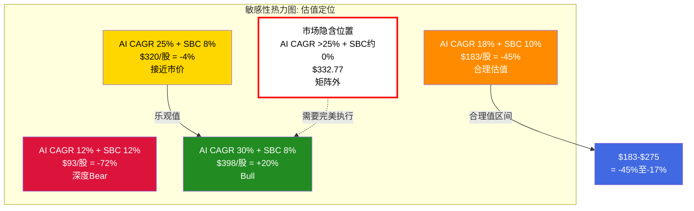

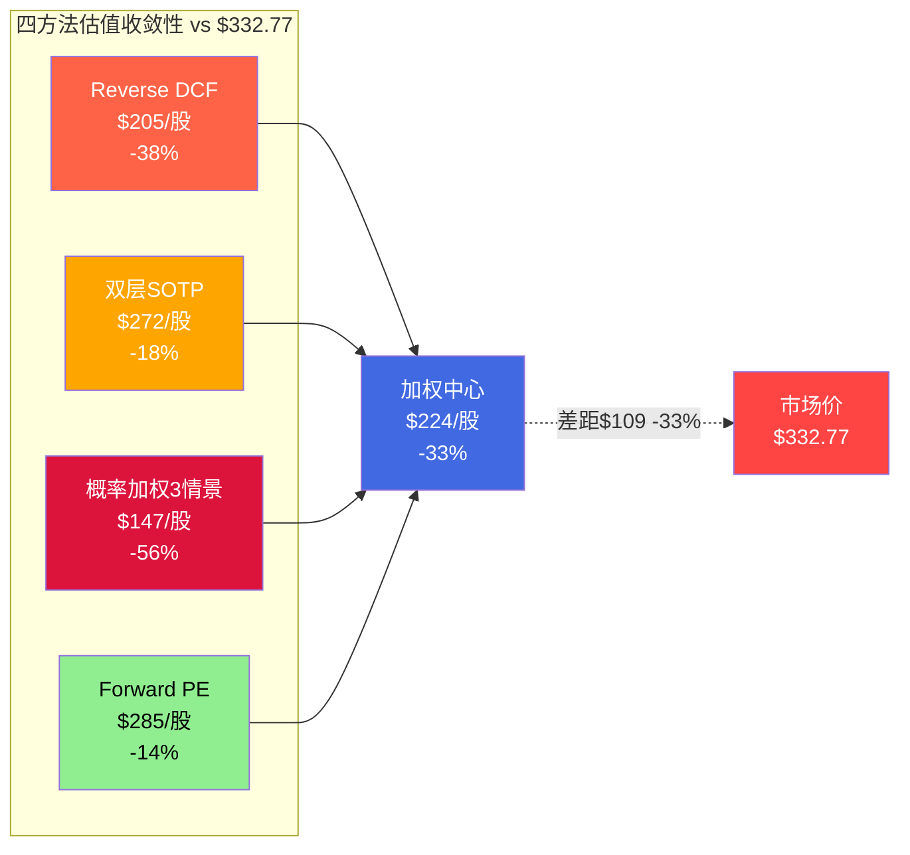
