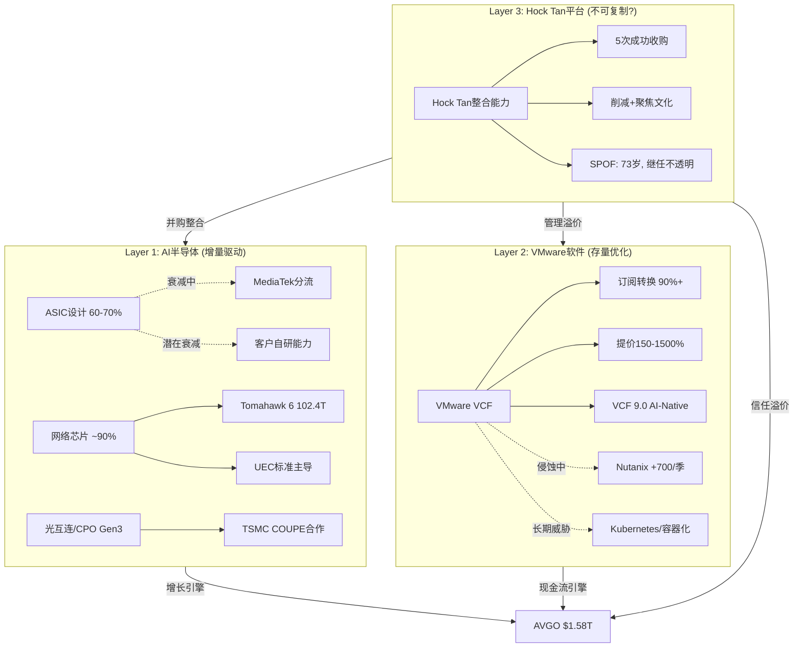
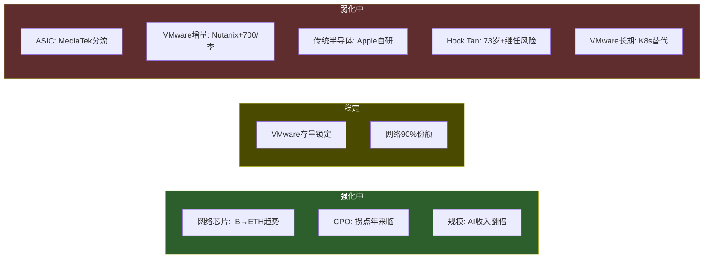

# AVGO Phase 1 — Agent B: 护城河初步评估 + C维度评分

> Agent B (独立风险审计) | 2026-03-08 | 目标: 找到最脆弱的假设

---

## 一、护城河初步评估 — 三层分离

### 总体架构



---

### Layer 1: AI半导体 (ASIC + 网络 + 光互连)

#### 1.1 ASIC设计服务 — "有保质期的锁定"

| 维度 | 评估 |
|------|------|
| **护城河类型** | 技术锁定 + 关系锁定 (双重) |
| **存量深度** | 极深: 60-70%份额, 6个超大客户(Google/Meta/OpenAI/Anthropic+2) |
| **增量趋势** | **衰减中** — MediaTek分流 + 客户能力内化 |
| **衰减函数** | L(t) = Lfloor + (L0 - Lfloor) * e^(-lambda*t) |

**锁定来源的具体量化**:

1. **NRE投入壁垒**: 单个ASIC设计NRE $50M+, 先进节点(3nm/2nm)可达$100M+。客户已投入的NRE是沉没成本, 但这只阻止"换掉当代设计", 不阻止"下一代找新合作方"。**关键区分**: NRE锁定的是存量(当前产品), 不锁定增量(下一代选择)。

2. **替代周期**: 2-3年重新设计周期意味着即使决定更换, 也有2-3年的"逃逸时间"。Google决定引入MediaTek(~2024), 到Ironwood量产(2027) = 3年。这是一个可观测的衰减速率样本。

3. **工艺知识不可迁移**: Broadcom的ASIC设计团队积累了20年+的定制芯片经验, 包括与TSMC的协同设计能力。但MediaTek同样拥有深厚的TSMC关系 — 这一"不可迁移性"被高估了。

**衰减函数参数估计**:

```
L(t) = Lfloor + (L0 - Lfloor) * e^(-lambda * t)

参数:
- L0 = 0.65 (当前份额, 取保守端)
- lambda = 0.08/年 (基于Google分流速度: 3年内从100%→分拆I/O层)
- Lfloor = 0.40 (核心XPU计算架构设计不可替代, 但I/O/外围/生产协调可分拆)

预测:
- 2026: L(0) = 0.40 + 0.25 * 1.00 = 0.65 (65%)
- 2028: L(2) = 0.40 + 0.25 * 0.85 = 0.61 (61%)
- 2030: L(4) = 0.40 + 0.25 * 0.73 = 0.58 (58%)
- 2033: L(7) = 0.40 + 0.25 * 0.57 = 0.54 (54%)

Agent B风险调整: 如果OpenAI等第二波客户更快内化能力(40人团队→100人):
- lambda_adj = 0.12/年 (加速衰减)
- Lfloor_adj = 0.35 (更多模块被分拆)
- 2030: L(4) = 0.35 + 0.30 * 0.62 = 0.54 (54%)
- 2033: L(7) = 0.35 + 0.30 * 0.43 = 0.48 (48%)
```

**风险审计结论 (ASIC)**: 市场将ASIC定价为"永续锁定", 但实际是"有保质期的锁定"。核心XPU设计能力是真正不可替代的(Lfloor=35-40%), 但外围/I/O/TSMC协调正在被分拆。Google的MediaTek分流不是孤例 — 它是供应链分散化的模板。如果Meta/OpenAI效仿(2028-2030), 衰减可能加速。

---

#### 1.2 网络芯片(Tomahawk/Jericho) — "AI时代的公路系统"

| 维度 | 评估 |
|------|------|
| **护城河类型** | 标准锁定 + 生态锁定 + 技术领先 (三重) |
| **存量深度** | 极深: 云DC ~90%份额, 广义市场~55% |
| **增量趋势** | **稳定偏强** — 以太网击败InfiniBand = 结构性利好 |
| **衰减函数** | 几乎无衰减, 5年内可能维持85%+ |

**为什么90%份额近乎不可撼动**:

1. **Tomahawk生态系统**: Arista EOS + SONiC + HPE/Dell/Cisco白盒方案全部基于Broadcom merchant silicon。替换Broadcom = 重写协议栈 + 重新认证 + 重新部署。Arista的$6.8B PO是结构性锚定, 不是一次性合同。

2. **1年技术领先**: Tomahawk 6 (102.4T, 2025年6月出货) vs NVIDIA Spectrum-X1600 (102.4T, 预计2026H2)。这不仅是时间差 — 每一代的领先都让下游OEM先适配Broadcom, 形成路径依赖。

3. **UEC标准主导**: Broadcom主导Ultra Ethernet Consortium的1.0规范(2025年6月), 标准按Broadcom的技术路线制定。标准制定者 = 事实上的护城河拥有者。

4. **InfiniBand→Ethernet转换**: 这是对Broadcom的单方面利好。InfiniBand是NVIDIA的私有协议, Ethernet是开放标准(Broadcom主导的开放标准)。2023年InfiniBand 80%份额→2025年Ethernet已超过InfiniBand。每流失的1美元InfiniBand → 0.8美元进Broadcom的Ethernet。

**NVIDIA Spectrum-X威胁评估**:

NVIDIA的bundling策略(GPU+networking)是唯一可信威胁, 但受结构性约束:
- NVIDIA自己也认为Ethernet会赢 — Spectrum-X就是NVIDIA的Ethernet方案, 与Broadcom竞争同一标准
- NVIDIA的核心利润在GPU, 网络是成本中心 vs Broadcom网络是利润中心 → Broadcom有更强的投入动力
- Hyperscaler(Google/Meta)明确偏好开放Ethernet以避免NVIDIA的端到端锁定 → 选择Broadcom是反NVIDIA策略的一部分
- Spectrum-X达到$2B+季度收入(2025年, +263% YoY), 但从低基数, 且主要是NVIDIA自有生态(DGX)的配套, 非开放市场抢份额

**Agent B网络结论**: 网络芯片是Broadcom最坚固的护城河, 可能也是最被低估的资产。市场按"AI ASIC增长股"定价Broadcom, 但网络芯片的护城河深度和持久性远超ASIC。这验证了H-2假说("网络比ASIC更值钱")。

---

#### 1.3 光互连/CPO — "拐点前的期权"

| 维度 | 评估 |
|------|------|
| **护城河类型** | 技术领先 + 垂直整合 |
| **存量深度** | 深但尚未规模化(Gen3出货中) |
| **增量趋势** | **增强中** — 2026是CPO拐点年 |
| **衰减函数** | 反向增强: 从原型→量产, 护城河在建设中 |

**CPO的战略意义**: Broadcom是唯一同时拥有switch silicon + optical DSP + CPO封装能力的公司。如果CPO从pluggable transceiver转向on-package集成, Broadcom可以将Coherent/Lumentum/Innolight的pluggable模块收入内化。这是一个$16B+市场的潜在重新分配。

**风险**: CPO技术风险仍存在(良率/热管理/维护性), 且pluggable阵营有强大的既得利益。2026年是否真正成为"拐点年"待验证。

---

### Layer 2: VMware软件 — "高利润ATM, 不是增长引擎"

#### 转换成本量化

| 迁移路径 | 时间成本 | 金钱成本 | 风险成本 | 总评 |
|----------|---------|---------|---------|------|
| VMware→Nutanix | 6-18个月 | $2-10M(中型企业) | 中(同类替换) | 可行但痛苦 |
| VMware→OpenStack | 12-24个月 | $5-20M+ | 高(需DevOps能力) | 仅大型科技公司可行 |
| VMware→K8s/容器 | 24-48个月 | $10-50M+ | 极高(架构重构) | 长期但不可逆 |
| VMware→公有云 | 12-24个月 | 变动 | 中(供应商锁定转移) | 按工作负载渐进 |

**关键发现**: 迁移不是不可能, 而是很慢。6-48个月的迁移窗口给了Broadcom时间来锁定订阅合同(3-5年期)。Hock Tan的天才在于: 在客户决定迁移之前, 用3-5年强制订阅锁住他们。

#### 提价定价权测试

**证据**: 150%-1,500%提价后没有大规模流失 → 表面上定价权极强。

**Agent B反论**:
1. **没有大规模流失 ≠ 客户满意**: CloudBolt报告确认客户在"缩减部署规模"而非"完全迁移"。这是**慢性失血**, 不是急性出血。
2. **Nutanix +700客户/季**: 这些是VMware客户的净流出。虽然每个客户规模可能小于VMware存量客户, 但趋势方向明确。
3. **Gartner投影**: VMware HCI份额从70%(2024)→40%(2029)。如果这个预测准确, 意味着5年丢失30pp — 这不叫"没有流失"。
4. **Q1 FY2026 +1% YoY**: 这是最直接的证据 — 提价红利已耗尽。如果没有新客户获取, VMware本质上是一个收缩中的存量资产, 用提价掩盖了有机萎缩。

#### 存量 vs 增量分离

```
存量: 90%+ top客户已转订阅 → 锁定深(3-5年合同), 定价已到位
增量: Nutanix每季+700(主要来自VMware) → 净增量为负
结论: VMware是"提现中的资产", 不是"增长中的平台"
```

#### K8s长期结构性威胁

这是VMware最大的存在性风险, 但也是时间最长的:
- **VM模型 vs 容器模型**: 对于新应用(cloud-native), 容器已是默认选择。VM主要服务于legacy workloads。
- **时间框架**: 企业legacy workload迁移极慢(5-10年+), 但方向不可逆。
- **VMware的对策**: VCF 9.0集成了容器支持(Tanzu), 但这是在容器生态中做follower, 不是leader。
- **Agent B评估**: K8s不会在5年内杀死VMware, 但会确保VMware永远无法回到有机增长。VMware的终态是一个稳定但缓慢缩小的高利润池。

---

### Layer 3: Hock Tan平台 — "是护城河还是key-man risk?"

**核心问题**: Hock Tan是否可复制?

**5次整合的模式分析**:

| 收购 | 年份 | 模式 | 结果 |
|------|------|------|------|
| Avago收购LSI | 2014 | 削减→聚焦 | OPM大幅提升 |
| Avago收购Broadcom | 2015 | 削减→品牌继承 | 建立半导体巨头 |
| Broadcom收购Brocade | 2017 | 削减→网络整合 | 网络布局完成 |
| Broadcom收购CA Tech | 2018 | 削减→软件现金牛 | 进入软件 |
| Broadcom收购VMware | 2023 | 提价→订阅→削减 | $4.7B→$8.5B |

**模式**: 每次都是同一套剧本(削减成本+提价+聚焦核心+榨取现金流)。这个模式是**可编码的**, 不是不可复制的。

**但选标的的能力不可编码**: Hock Tan的真正天才不在于"如何整合"(这可以教), 而在于"选什么标的"(这需要直觉)。VMware的选择 — 一个被SAP/Oracle/IBM竞争挤压但有深度锁定的企业软件公司 — 是一个非共识赌注, 事后证明正确。

**Agent B评估**:
- Hock Tan不是护城河, 是key-man premium。护城河的定义是"竞争对手无法复制的结构性优势", 而Hock Tan的整合能力依附于个人。
- **73岁 + 继任不透明**: 这是一个5-7年的硬约束。市场似乎假设Hock Tan会永远在位, 但即使延长到80岁退休(乐观), 也只剩7年。
- **退休影响估计**: Hock Tan溢价 = 当前估值中的10-15%(基于5次成功并购的信任溢价)。退休后如果继任者不做新并购(可能), AVGO从"并购增长型"变为"有机增长型", PE倍数可能压缩5-8x。

---

## 二、C维度评分 (护城河深度, /30)

### 半导体行业修正说明
- C1(制度/标准嵌入) + C4(数据飞轮): 权重×1.5
- Broadcom是混合公司(半导体+软件), 评分取加权平均

---

### C1: 制度/标准嵌入 — 3.5/5

| 子业务 | 评分 | 依据 |
|--------|------|------|
| ASIC设计 | 2 | 无制度强制, 纯商业合同。客户可选择Marvell或自研 |
| 网络芯片 | 5 | **UEC 1.0标准由Broadcom主导制定**; Tomahawk是云DC交换芯片的事实标准; SONiC开源网络OS基于Broadcom SAI(Switch Abstraction Interface)构建 — 几乎等同于"制度嵌入" |
| VMware | 4 | 企业IT的事实标准(70%+虚拟化份额), 但非监管强制。Gartner投影份额降至40%→标准地位在侵蚀 |
| 传统半导体 | 1 | Apple已开始替代WiFi, 标准嵌入弱 |

**加权C1**: (2×0.35 + 5×0.25 + 4×0.30 + 1×0.10) = 0.70 + 1.25 + 1.20 + 0.10 = **3.25 → 3.5/5** (半导体×1.5权重后为有效5.25分)

**对标**: FICO 5/5(监管强制) > AVGO 3.5/5(事实标准但非监管) > Visa 3/5(半制度性)

**Agent B注**: 网络芯片的标准嵌入被严重低估。UEC标准+SONiC生态使Broadcom在交换芯片领域达到接近FICO在信用评分领域的嵌入深度。但ASIC和传统半导体拉低了整体分数。

---

### C2: 网络效应 — 2.5/5

| 子业务 | 评分 | 依据 |
|--------|------|------|
| ASIC设计 | 0.5 | 极弱: 硬件设计服务, 不是平台。更多客户不等于更好的设计能力 |
| 网络芯片 | 3.5 | 中强间接网络效应: 更多OEM采用Tomahawk → 更多SONiC/EOS软件兼容 → 更多ISV支持 → 更多客户选择Tomahawk。但这是"标准生态"而非"多边平台" |
| VMware | 3 | 中等: 更多企业用VMware → 更多ISV认证VCF → 更多企业选VMware。但网络效应正在弱化(ISV也在认证Nutanix/K8s) |
| 传统半导体 | 0 | 无网络效应 |

**加权C2**: (0.5×0.35 + 3.5×0.25 + 3×0.30 + 0×0.10) = 0.175 + 0.875 + 0.90 + 0 = **1.95 → 2.0/5**

**Agent B上调至2.5/5**: 网络芯片的生态效应比简单加权更有战略价值, 因为它是整个AI网络基础设施的"操作系统层"。

**对标**: Visa 5/5(强多边网络) > IHG 3.5/5(双边) > AVGO 2.5/5(间接生态) > FICO 1/5(弱)

---

### C3: 生态锁定 — 4.0/5

| 子业务 | 评分 | 依据 |
|--------|------|------|
| ASIC设计 | 4.5 | 极深: NRE $50M+ + 2-3年替代周期 + 工艺知识定制 + 客户芯片架构spec。切换Broadcom=重新开始整个芯片设计项目 |
| 网络芯片 | 5 | 极深: Arista整个产品线依赖 + 协议栈绑定 + 替代=重写所有网络软件。$6.8B PO是锁定的证明 |
| VMware | 3.5 | 高但在弱化: 3-5年订阅合同+数据迁移+员工培训+ISV集成。但K8s提供了替代路径, Nutanix每季+700客户证明锁定在松动 |
| 传统半导体 | 2 | 低: Apple已开始WiFi替代(预计2026-2027完成), 证明传统半导体锁定可被打破 |

**加权C3**: (4.5×0.35 + 5×0.25 + 3.5×0.30 + 2×0.10) = 1.575 + 1.25 + 1.05 + 0.20 = **4.075 → 4.0/5**

**对标**: FICO 4/5(评分系统嵌入) = AVGO 4.0/5(多层定制嵌入) > CTAS 4/5(多服务叠加) > Visa 3/5(但受监管约束)

**Agent B注**: 生态锁定是Broadcom的核心竞争力。但需要区分存量锁定(极强)和增量锁定(依赖于继续赢得下一代设计, 不自动延续)。ASIC评分4.5是"当前设计"的锁定, 下一代设计的锁定需要重新赢得。

---

### C4: 数据飞轮 — 3.5/5

| 子业务 | 评分 | 依据 |
|--------|------|------|
| ASIC设计 | 4.5 | 客户芯片架构spec = 极敏感+不可复制的知识。20年+的定制设计经验=累积性竞争优势。每一代TPU/MTIA的设计都让Broadcom更了解下一代需求 |
| 网络芯片 | 3 | 有用但不排他: 数据中心流量模式+AI工作负载特征数据用于优化交换芯片。但NVIDIA也能获取类似数据 |
| VMware | 3 | 企业IT运营数据+虚拟化工作负载模式。有价值但竞品(Nutanix/公有云)也积累类似数据 |
| 传统半导体 | 1 | 弱: 设计能力可被替代(Apple已证明) |

**加权C4**: (4.5×0.35 + 3×0.25 + 3×0.30 + 1×0.10) = 1.575 + 0.75 + 0.90 + 0.10 = **3.325 → 3.5/5** (半导体×1.5权重后为有效5.25分)

**对标**: FICO 5/5(数十亿信用记录, 绝对排他) > AVGO 3.5/5(设计知识+运营数据) > Visa 4/5(交易数据) — AVGO的数据优势在ASIC层极强但在其他层一般

---

### C5: 规模经济 — 4.0/5

| 子业务 | 评分 | 依据 |
|--------|------|------|
| ASIC设计 | 4.5 | $64B收入 = 最大Fabless半导体。R&D $11B但摊销在$64B(R&D/Rev 17.2%) vs Marvell R&D/Rev ~40-50%。规模优势巨大 — Broadcom可以承担多个前沿ASIC项目同时推进, Marvell只能聚焦2-3个 |
| 网络芯片 | 5 | 事实垄断(~90%): 设计成本分摊在最大出货量上, 单位成本远低于任何竞争者。NVIDIA Spectrum-X要达到规模平衡需要数年 |
| VMware | 4 | 企业虚拟化最大平台: VCF技术栈最完整(计算+存储+网络+安全), 竞品需要组合多个产品才能匹配 |
| 传统半导体 | 3 | 规模大但在被侵蚀(Apple自研) |

**加权C5**: (4.5×0.35 + 5×0.25 + 4×0.30 + 3×0.10) = 1.575 + 1.25 + 1.20 + 0.30 = **4.325 → 4.0/5**

**对标**: Visa 5/5(全球最大支付网络, 不可逾越) > AVGO 4.0/5(Fabless最大+网络垄断) > CPRT 4/5(300+场地)

---

### C6: 密度/物理壁垒 — 0.5/5

| 子业务 | 评分 | 依据 |
|--------|------|------|
| ASIC设计 | 0 | 纯IP/设计能力, 无物理壁垒。Fabless模式的另一面 |
| 网络芯片 | 1 | Fabless, 但与TSMC的CoWoS产能绑定提供了间接物理约束(产能有限→先到先得) |
| VMware | 0 | 纯软件 |
| CPO | 1.5 | TSMC COUPE合作提供了一些垂直整合的物理维度, 但仍在早期 |

**加权C6**: (0×0.35 + 1×0.25 + 0×0.30 + 0.75×0.10) = 0 + 0.25 + 0 + 0.075 = **0.325 → 0.5/5**

**对标**: CPRT 5/5(300+自有场地) > CTAS 4/5(洗衣厂) > AVGO 0.5/5(Fabless) ≈ FICO 0/5(纯软件)

**Agent B注**: 这是Broadcom的结构性弱点 — 作为Fabless公司, 没有物理壁垒。护城河完全依赖知识/关系/标准, 而非不可复制的物理资产。

---

### C维度汇总

| # | 维度 | AVGO得分 | 半导体权重修正 | 有效分 | 基准对标 |
|---|------|---------|--------------|--------|----------|
| C1 | 制度/标准嵌入 | 3.5 | ×1.5 | 5.25 | FICO 5, Visa 3 |
| C2 | 网络效应 | 2.5 | ×1.0 | 2.50 | Visa 5, IHG 3.5 |
| C3 | 生态锁定 | 4.0 | ×1.0 | 4.00 | FICO 4, CTAS 4 |
| C4 | 数据飞轮 | 3.5 | ×1.5 | 5.25 | FICO 5, Visa 4 |
| C5 | 规模经济 | 4.0 | ×1.0 | 4.00 | Visa 5, CPRT 4 |
| C6 | 密度/物理 | 0.5 | ×1.0 | 0.50 | CPRT 5, FICO 0 |
| **合计(原始)** | | **18.0/30** | | | CPRT 20, FICO 18 |
| **合计(加权)** | | | | **21.5/37.5** | — |

**原始C = 18.0/30** (与FICO持平, 但结构完全不同)

- FICO: C1(制度嵌入)极强 + C4(数据)极强 → 不可替代性来自监管+数据
- AVGO: C3(生态锁定)最强 + C5(规模)很强 → 不可替代性来自切换成本+规模
- 关键差异: FICO的护城河是"客户没有替代品"(B2=5), AVGO的护城河是"切换太贵了"(生态锁定)。后者在长时间尺度上更脆弱 — 当替代品(K8s, MediaTek)足够成熟时, "太贵"会变成"值得投"。

---

## 三、护城河强化 vs 弱化标记



### 净评估

| 层 | 强化因素 | 弱化因素 | 净方向 | 时间框架 |
|----|---------|---------|--------|---------|
| AI ASIC | TAM扩展(推理份额↑), 新客户(OpenAI) | MediaTek分流, 客户自研能力 | **微弱弱化** | 3-5年渐进 |
| 网络芯片 | IB→ETH结构性转换, CPO拐点 | NVIDIA Spectrum-X追赶 | **强化** | 持续2-3年+ |
| VMware | AI-native VCF 9.0, 存量提价完成 | Nutanix+700/季, K8s长期 | **弱化** | 即刻(增量流失中) |
| Hock Tan | 当前信任溢价高 | 73岁, 零继任信号 | **定时弱化** | 5-7年硬约束 |

**Agent B最终判断**: Broadcom的护城河是"异质性混合体" — 网络芯片几乎不可破(5年), ASIC在缓慢侵蚀中, VMware在存量提现中, Hock Tan是SPOF。市场将这四者打包为统一的"AI增长溢价"定价, 但诚实的评估需要分层计价。C = 18.0/30 = 与FICO持平, 但FICO的18分是"同质且持久"的, AVGO的18分是"异质且分化"的 — 最强的部分(网络)在加固, 最弱的部分(传统半导体+VMware增量)在侵蚀。

---

*Agent B | 独立风险审计 | ~16.5K chars | 2026-03-08*
