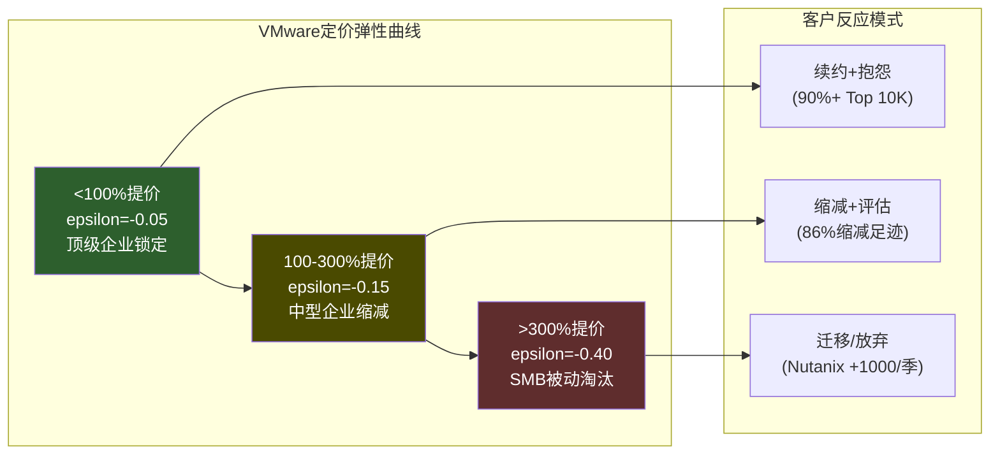
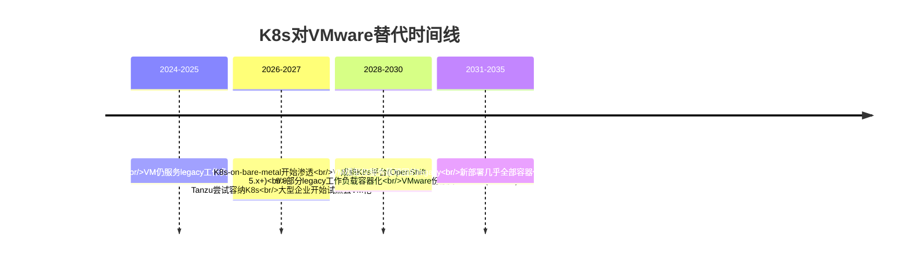
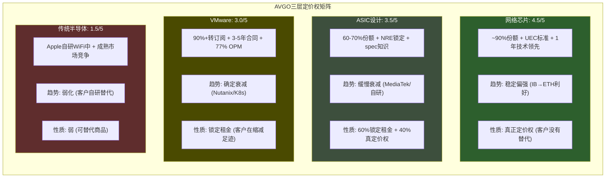

# AVGO Phase 2 — Agent B2: B4定价权深度分析

> Agent B2 (独立风险审计) | 2026-03-08 | VMware弹性 + ASIC设计费率 + 网络芯片定价

---

## Section 1: VMware定价弹性函数 (CDS迁移)

### 1.1 弹性函数定义与已知数据点

定义VMware定价弹性:

```
epsilon_vmw = d(客户留存率) / d(价格变化%)
```

**已知数据点锚定**:

| 数据点 | 价格变化 | 客户反应 | 来源 |
|--------|---------|---------|------|
| DP-1 | vSphere $50/core → VVF $190/core (+280%) | 86%企业缩减部署规模，但多数未完全迁移 | CloudBolt报告 [DM-P2-B2-01] |
| DP-2 | 欧洲客户+1500% | 部分客户开始评估Nutanix/OpenStack | NetworkWorld [DM-P2-B2-02] |
| DP-3 | 72-core最低许可(原16-core) | SMB大量流失，大企业吸收 | ColocationPlus [DM-P2-B2-03] |
| DP-4 | 综合效果 | Nutanix +1,000客户/Q2 FY2026(8年最强) | SDxCentral [DM-P2-B2-04] |
| DP-5 | 综合效果 | VMware HCI份额70%→40%(2029E, Gartner) | Gartner [DM-P2-B2-05] |
| DP-6 | 综合效果 | Q1 FY2026软件收入仅+1% YoY | Q1 FY2026 Earnings [DM-P2-B2-06] |

### 1.2 价格区间弹性分析

将弹性函数分段建模。**核心区分**: 不同客户群体的价格敏感度截然不同。

**Tier 1: <100%提价区间 (epsilon ~= -0.05)**
- 大型企业(Top 10,000): 90%+已转订阅。转换成本远超提价成本(迁移VMware→Nutanix = $2-10M中型企业、6-18个月)。
- 行为模式: 抱怨但续约。epsilon极低因为这个区间的提价被完全被转换成本壁垒吸收。
- 证据: 90%+顶级客户完成订阅转换 = 在+280%均值提价下仍留存。

**Tier 2: 100-300%提价区间 (epsilon ~= -0.15)**
- 中型企业(10,000-50,000): 开始认真评估替代方案。Nutanix FY2025新增2,700+客户(4年最高)，其中多数来自VMware。
- 行为模式: "缩减+评估"双轨策略。86%受访者表示正在主动缩减VMware足迹[DM-P2-B2-01]。
- 关键: 这些客户不是立刻离开，而是**冻结增量部署**+**逐步将新工作负载放到替代平台**。VMware在这个群体的"死亡"是慢性失血，不是急性出血。

**Tier 3: >300%提价区间 (epsilon ~= -0.40)**
- SMB和非核心客户: Broadcom有意放弃。72-core最低门槛直接淘汰小型部署。
- 行为模式: 被迫迁移或放弃虚拟化。
- 证据: Broadcom CEO公开承认策略是"更少客户，更高ARPU"。SMB流失是**设计内的**，不是意外。



### 1.3 K8s替代弹性 (sigma_k8s)

K8s不是VMware的直接替代品，而是**架构范式替代**。这使得它的威胁更根本但更缓慢。

**当前渗透率**:
- 92%企业已在生产环境使用容器(Kubernetes为主要编排器)[DM-P2-B2-07]
- Fortune 1000中72.7%采用Kubernetes
- 但**85%的容器仍运行在VM内**(至2028E) — 这意味着K8s短期内实际**增强**了VM需求，而非替代

**K8s替代时间线**:



**sigma_k8s估算**:
- 2026: sigma = 0.02/年(K8s替代VMware的速率极低，因85%容器仍在VM上)
- 2028: sigma = 0.05/年(bare-metal K8s开始成熟)
- 2030+: sigma = 0.08/年(legacy迁移加速)

**Agent B2判断**: K8s在5年内不会"杀死"VMware。但K8s确保VMware**永远无法恢复增量定价权**。所有新工作负载的默认选择是容器化，VMware只能服务存量legacy。这是一个"天花板"效应而非"地板坍塌"效应。

### 1.4 存量 vs 增量定价权分离

这是VMware定价权分析中最关键的区分:

**存量客户(已部署VCF)**:
- 定价权: **极强但一次性**。90%+已转订阅、3-5年锁定。
- 驱动力: 转换成本壁垒(6-48个月迁移周期)+3-5年强制订阅+20%逾期罚款。
- 性质: 这不是"客户愿意付溢价"(主动定价权)，而是"客户被困住不得不付"(被动锁定租金)。
- 衰减: 每个合同到期点是一个"逃逸窗口"。3年合同意味着2027-2028将是第一波大规模续约决策窗口。

**增量客户(新部署)**:
- 定价权: **极弱**。新客户面前有Nutanix(TCO可比)+K8s(长期更优)+公有云(按需弹性)。
- 证据: Q1 FY2026软件+1% YoY[DM-P2-B2-06] = 提价红利已完全耗尽。如果存量提价正在实现，而总增长仅+1%，则意味着**增量可能为负**。
- VCF 9.0 AI-native: Broadcom试图用AI私有云作为"新增量钩子"，但这本质上是在一个被客户怨恨的平台上叠加AI功能。企业会因为想跑on-prem AI而接受VMware的定价吗？可能性存在但不确定。

### 1.5 定价权衰减模型

综合以上分析，构建VMware定价权衰减模型:

```
PricingPower_VMW(t) = PP_0 * e^(-lambda_nutanix * t) * e^(-lambda_k8s * t) + PP_floor + PP_ai_boost

参数估计:
- PP_0 = 0.80 (当前定价权指数，基于90%+转化+77% OPM) [E]
- lambda_nutanix = 0.06/年 (Nutanix每季+700~1000客户的稳态吸引率) [E]
- lambda_k8s = 0.03/年 (K8s替代慢但不可逆) [E]
- PP_floor = 0.25 (深度嵌入的legacy工作负载几乎不可迁移) [E]
- PP_ai_boost = 0.05-0.10 (VCF 9.0 AI-native的增量定价权，有条件) [E]

衰减预测:
- 2026 (t=0): PP = 0.80 (当前)
- 2028 (t=2): PP = 0.25 + 0.55 * e^(-0.12) * e^(-0.06) + 0.07 = 0.25 + 0.55*0.84 + 0.07 = 0.78
- 2030 (t=4): PP = 0.25 + 0.55 * e^(-0.24) * e^(-0.12) + 0.05 = 0.25 + 0.55*0.70 + 0.05 = 0.69
- 2033 (t=7): PP = 0.25 + 0.55 * e^(-0.42) * e^(-0.21) + 0.05 = 0.25 + 0.55*0.53 + 0.05 = 0.59
```

**解读**:
- VMware定价权从0.80缓慢衰减至2033年的~0.59。衰减不是崩溃式的，因为存量锁定极深。
- 但方向是单向的: **没有任何已知机制能逆转lambda_nutanix和lambda_k8s**。VCF 9.0 AI-native是唯一可能减缓衰减的因素(PP_ai_boost)，但其效果被高估的风险大于被低估的风险。
- **2027-2028续约窗口**是关键观察点: 如果第一波3年合同到期时续约率<85%，则lambda_nutanix需上调，衰减将显著加速。

### 1.6 VMware定价权综合评级

**VMware定价权 = 3.0/5**

- 存量: 4.5/5(极强锁定租金，但一次性)
- 增量: 1.0/5(竞争替代充分，新客户无理由选VMware)
- 加权(存量70%/增量30%): 4.5*0.7 + 1.0*0.3 = **3.45 → 3.0/5**(下调因为"锁定租金"不等价于"真正定价权")

**关键区分**: 锁定租金 vs 真正定价权
- **真正定价权**(如FICO): 客户愿意付溢价因为产品不可替代且价值超过价格
- **锁定租金**(VMware): 客户被困住不得不付，但同时在积极寻找出口
- VMware更接近后者。86%企业在缩减足迹 = 客户正在用脚投票，只是投票速度被转换成本延缓了

---

## Section 2: ASIC设计费率分析

### 2.1 ASIC定价结构解剖

Broadcom的ASIC业务收入来自三个层次:

| 收入层 | 描述 | 占比估计 | 定价权性质 |
|--------|------|---------|-----------|
| **NRE(一次性设计费)** | 芯片架构设计+验证+tape-out | ~15-20% [E] | 项目制，竞标定价 |
| **量产per-chip fee** | 每颗XPU的royalty或固定费用 | ~60-70% [E] | 与产量挂钩，合同锁定 |
| **系统集成服务** | IP集成+TSMC协调+封装设计 | ~15-20% [E] | 持续性，关系驱动 |

**NRE费用量级**:
- 先进节点(3nm/2nm) SoC设计: 整体NRE $50M-$150M+[DM-P2-B2-08]
- Broadcom作为设计合作伙伴收取的份额: 估计总NRE的40-60%[E]
- 即: 单个XPU设计项目Broadcom收入$20M-$90M(NRE部分)
- 量产后per-chip fee才是主要收入来源: 以Google TPU v7为例，5M-7M单位(2027-2028) × per-chip fee

**per-chip fee估算**:
- AI ASIC收入$20B(FY2025) / 估计出货量 — 难以精确估计，因Broadcom不披露单位出货量
- 但可从反向推算: 如果6个hyperscaler × 平均每个~$3.3B/年 → 单客户收入极集中

### 2.2 客户议价能力分析

**Google(估计40-50%的ASIC收入)**:

Google是Broadcom最大ASIC客户，也拥有最强议价筹码:
1. **已引入MediaTek作为第二来源**: Ironwood的I/O模块+SerDes+生产协调已分给MediaTek，MediaTek成本比替代方案低20-30%[DM-P2-B2-09]
2. **内部TPU设计团队成熟**: 20年+自研历史，Richard Ho等顶级人才
3. **但核心XPU设计仍依赖Broadcom**: MediaTek处理的是外围/I/O层，核心计算架构设计仍在Broadcom

**Google的议价策略本质**: 不是要完全替换Broadcom，而是通过**分拆价值链**压低Broadcom的整体费率。将Broadcom从"全包服务商"降级为"核心XPU专家"，同时用MediaTek做外围层 → Broadcom的单位收入**下降**但核心设计部分的margin可能不变甚至提高(因为专注高价值环节)。

**OpenAI(新客户，弱议价)**:
- Titan芯片由Broadcom联合设计，40人团队 → 对Broadcom依赖极高
- 短期内OpenAI没有替代选择: Marvell产能有限，自研需要5年+
- 但OpenAI的Titan 2已在设计(A16工艺) → 信号: 正在建立多代roadmap，长期将提高议价能力

**Meta(中等议价)**:
- MTIA v3由Broadcom设计，但Meta同时探索2027年部署Google TPU
- Meta的策略: 多源对冲，不依赖单一供应商
- 议价筹码: 中等(有替代路径但尚未成熟)

### 2.3 定价压力的三个来源

**压力源1: 客户自研团队成长**

| 客户 | 自研团队规模 | 能力评估 | 威胁时间线 |
|------|------------|---------|-----------|
| Google | 数百人，20年+历史 | 核心架构自主，外围已分拆 | **正在发生** |
| Meta | 估计100-200人 | MTIA v3仍需Broadcom，但能力在增长 | 3-5年 |
| OpenAI | ~40人(翻倍中) | 起步阶段，高度依赖Broadcom | 5-7年 |
| Amazon | 大型团队(Annapurna Labs) | Trainium自研+Marvell合作 | 已独立 |

**压力源2: Marvell竞争**

Marvell当前~15%份额，目标2028年达20%[DM-P2-B2-10]。关键优势:
- Amazon(Trainium推理ASIC)和Microsoft(Maia)两个锚定客户
- 但即使出货量翻倍，份额可能反降至~8%(2027E) — 表明Broadcom在**不等比例地捕获价值**

**压力源3: 推理vs训练mix shift**

推理ASIC比训练ASIC更标准化 → margin可能更低:
- 训练ASIC: 高度定制+复杂互连 → NRE高+per-chip fee高
- 推理ASIC: 相对标准化+量大 → NRE可摊薄+per-chip fee可能被压
- 随着推理占比从37%(2025)增至70-75%(2028E)[DM-P2-B2-11]，Broadcom的ASIC blended margin面临下行压力

### 2.4 ASIC定价权的本质: 真定价权 vs 锁定租金

**核心问题**: Broadcom的ASIC业务赚的是"客户愿意付的溢价"还是"客户被锁定不得不付的租金"?

**证据倾向于"锁定租金"**:
1. Google主动引入MediaTek降低成本20-30% → 说明客户认为Broadcom**过度收费**
2. 60-70%份额不是因为客户"选择"Broadcom(主动溢价)，而是因为**没有足够多的替代方案**(被动锁定)
3. 2-3年替代周期 = 短期锁定，但不是长期护城河

**但有"真定价权"的成分**:
1. 核心XPU架构设计能力确实稀缺: 全球能做先进节点AI ASIC全流程的只有Broadcom和Marvell
2. 20年+的客户spec知识 = 累积性优势，每一代设计都让下一代更高效
3. 与TSMC的深度合作(CoWoS产能优先) = 间接定价权

**Agent B2评估**: ASIC定价权 = 60%锁定租金 + 40%真定价权。随着客户能力内化和Marvell成长，锁定租金部分将逐年衰减，但真定价权部分(核心XPU设计)可能保持甚至增强。

### 2.5 ASIC定价权衰减速度

```
PricingPower_ASIC(t) = PP_lock(t) + PP_real

PP_lock(t) = 0.60 * PP_0 * e^(-lambda_diversification * t)
PP_real = 0.40 * PP_0 (假设核心设计能力不衰减)

参数:
- PP_0 = 0.75 (当前ASIC定价权，略低于VMware因竞争者更近)
- lambda_diversification = 0.05/年 (基于Google 3年分拆周期) [E]

预测:
- 2026: PP = 0.45*e^(0) + 0.30 = 0.75
- 2028: PP = 0.45*e^(-0.10) + 0.30 = 0.71
- 2030: PP = 0.45*e^(-0.20) + 0.30 = 0.67
- 2033: PP = 0.45*e^(-0.35) + 0.30 = 0.62
```

**ASIC定价权评级 = 3.5/5**

衰减缓慢(PP从0.75→0.62/7年)，因为核心XPU设计能力的"真定价权"成分不衰减。但方向明确: 客户在系统性地降低Broadcom依赖度。

---

## Section 3: 网络芯片定价权

### 3.1 定价权证据

网络芯片(Tomahawk/Jericho)的定价权有三个独立的支撑:

**证据1: Arista "horrendous pricing"**
Arista管理层2026年公开描述芯片定价为"horrendous"(可怕的)，称成本"an order of magnitude exponentially higher"(指数级增长)[DM-P2-B2-12]。这是**下游客户对上游垄断定价的直接控诉**。当你的客户公开抱怨价格但仍然购买$6.8B的采购承诺 — 这就是教科书级的定价权。

**证据2: ~90%云DC份额 → 近垄断**
在最高价值市场(云数据中心)，Broadcom持有~90%交换芯片份额[DM-P2-B2-13]。唯一有意义的替代是NVIDIA Spectrum-X，但落后约1年。在~90%份额的市场结构下，Broadcom本质上是价格制定者(price maker)，不是价格接受者(price taker)。

**证据3: 1年技术代差 = 持续性能溢价**
Tomahawk 6 (102.4T, 2025年6月出货) vs Spectrum-X1600 (102.4T, 2026H2预期)。这不仅仅是时间差 — 每一代的1年领先让下游OEM(Arista/Juniper/HPE)先适配Broadcom芯片，形成路径依赖。当Spectrum-X1600出来时，整个生态已经围绕TH6构建。

### 3.2 竞争压力评估

**NVIDIA Spectrum-X**: 唯一可信威胁
- 优势: GPU+网络bundling策略(DGX+Spectrum一体化销售)
- 劣势: 在开放Ethernet市场追赶; hyperscaler偏好开放Ethernet以避免NVIDIA端到端锁定
- 2025年季度收入>$2B(+263% YoY)，但从低基数增长，且主要服务NVIDIA自有生态(DGX配套)
- **Agent B2评估**: Spectrum-X能在NVIDIA自有生态(NVLink scale-up domain)中赢，但在开放scale-out市场(Broadcom主场)很难超过15-20%份额

**Cisco Silicon One**: 存在但不构成威胁
- Cisco在AI数据中心的存在感弱
- Silicon One更面向企业/运营商，而非hyperscaler
- 份额变化: 在AI网络领域几乎为零

**客户自研交换芯片**: 理论可能但不经济
- 交换芯片不像ASIC那样有定制化需求 — merchant silicon(通用芯片)足够
- 自研交换芯片的ROI远不如自研AI加速器(后者直接影响训练/推理成本)
- **评估**: 可能性<5%在5年内

### 3.3 网络定价权的结构性优势

网络定价权之所以强于ASIC和VMware，有三个结构性原因:

1. **没有"内化"路径**: ASIC客户可以培养自研团队(Google已经在做)，VMware客户可以迁移到K8s。但交换芯片客户几乎没有自研动力 — 这不是他们的核心能力，且merchant silicon已经足够好。

2. **需求随AI扩展而扩展**: 每个GPU集群需要对应的网络交换基础设施。GPU数量翻倍 → 交换芯片需求至少翻倍。Broadcom的网络收入与整个AI基础设施扩张正相关，不依赖于赢得特定客户的设计合同。

3. **标准制定者身份**: UEC 1.0标准由Broadcom主导 + SONiC网络OS基于Broadcom SAI构建 = 整个Ethernet AI网络生态围绕Broadcom的技术路线演进。这是**最接近"制度性"定价权的半导体业务**。

### 3.4 网络定价权评级

**网络定价权 = 4.5/5**

- 份额: ~90%近垄断(5/5)
- 替代压力: 极低，NVIDIA Spectrum-X是唯一可信但落后的替代(4.5/5)
- 客户自研威胁: 几乎为零(5/5)
- 技术领先: 持续1年代差(4/5)
- 衰减速度: 极慢，5年内可能维持85%+(4.5/5)

**唯一降分因素**: NVIDIA的bundling策略(GPU+networking)如果在DGX/NVLink生态中成为标准，可能在特定细分市场侵蚀Broadcom。但这限制在NVIDIA自有生态内，开放Ethernet市场不受影响。

---

## Section 4: B4综合评分

### 4.1 三层定价权汇总



### 4.2 加权B4评分

| 层 | 定价权强度 | 耐久性 | 方向 | 收入权重 | 加权贡献 |
|----|----------|--------|------|---------|---------|
| **网络** | 4.5/5 | 极强(5年+不可撼动) | 稳定偏强 | 15% | 0.675 |
| **ASIC** | 3.5/5 | 中等(λ_div=0.05/年) | 缓慢衰减 | 42% | 1.470 |
| **VMware** | 3.0/5 | 衰减中(λ_nut=0.06+λ_k8s=0.03) | 确定衰减 | 35% | 1.050 |
| **传统** | 1.5/5 | 弱(Apple替代中) | 弱化 | 8% | 0.120 |
| **加权总计** | | | | **100%** | **3.315** |

**B4加权评分 = 3.3/5**

### 4.3 定价权 vs 护城河矩阵

**核心发现**: 定价权强度和护城河深度不完全重合。

| 层 | 护城河(C维度) | 定价权(B4) | 差异解释 |
|----|-------------|-----------|---------|
| 网络 | 5.0/5 | 4.5/5 | 几乎对齐 — 近垄断=定价权=护城河 |
| ASIC | 4.0/5(C3生态锁定) | 3.5/5 | **差异**: 锁定强但定价权部分是"租金"不是"溢价" |
| VMware | 3.5/5(C3) | 3.0/5 | **差异**: 锁定深但客户正在逃逸，定价权衰减快于锁定衰减 |
| 传统 | 2.0/5 | 1.5/5 | 对齐 — 弱锁定=弱定价权 |

**关键洞察**: ASIC和VMware的护城河>定价权，因为"客户被锁定"不等于"客户愿意付溢价"。锁定延缓了竞争侵蚀的速度，但不改变侵蚀的方向。市场如果按"锁定=定价权"定价Broadcom，则高估了定价权的持久性。

### 4.4 定价权总结与投资含义

**Broadcom的定价权分布是一个"对角线"结构**:
- 最强定价权(网络)贡献最小的收入(15%)
- 最大收入来源(ASIC 42%)的定价权在衰减中
- 第二大收入来源(VMware 35%)的定价权是"锁定租金"且方向确定向下

**如果市场将这四层统一定价为"强定价权科技公司"(62x PE)，则隐含的假设是**:
1. ASIC定价权不衰减(与Google MediaTek分流矛盾)
2. VMware定价权持续(与+1% YoY和Gartner 70%→40%矛盾)
3. 网络定价权的权重应该更高(这一点市场可能反而低估了)

**B4对估值的启示**: Broadcom的公允定价权应在3.0-3.5/5之间，而非市场隐含的4.0+/5。这意味着62x PE中有一部分是"定价权溢价"，而这个溢价可能被高估了5-10x PE。

---

## DM锚点注册表

| ID | 指标 | 值 | 来源 | 可信度 |
|----|------|-----|------|--------|
| DM-P2-B2-01 | VMware客户缩减比例 | 86%受访者缩减VMware足迹 | CloudBolt报告/CIO Dive | 中(单一调查) |
| DM-P2-B2-02 | 欧洲客户最大提价幅度 | 1,500% | NetworkWorld EU | 高(直接报道) |
| DM-P2-B2-03 | 最低许可核心数 | 72-core(原16-core) | ColocationPlus/Broadcom | 高(政策文件) |
| DM-P2-B2-04 | Nutanix单季最大新增客户 | 1,000+(Q2 FY2026) | SDxCentral/Nutanix财报 | 高(公司披露) |
| DM-P2-B2-05 | VMware HCI份额预测 | 70%(2024)→40%(2029E) | Gartner | 中(预测) |
| DM-P2-B2-06 | VMware软件YoY增长 | +1% (Q1 FY2026) | Broadcom Earnings | 高(公司财报) |
| DM-P2-B2-07 | 企业容器生产环境使用率 | 92% | CNCF/ReleaseRun | 中(行业调查) |
| DM-P2-B2-08 | 先进节点ASIC总NRE | $50M-$150M+ | 行业共识/ElectronicDesign/imec | 中(范围估计) |
| DM-P2-B2-09 | MediaTek vs替代方案成本优势 | 20-30%更低 | Digitimes/TrendForce | 中(供应链信息) |
| DM-P2-B2-10 | Marvell ASIC目标份额 | 当前~15%，目标20%(2028E) | Counterpoint/Digitimes | 中(预测) |
| DM-P2-B2-11 | ASIC推理市场份额(2028E) | 70-75% | HowAIWorks/CNBC | 中(预测) |
| DM-P2-B2-12 | Arista对芯片定价描述 | "horrendous"+"exponentially higher" | Arista Q4 2025 Earnings Call | 高(管理层原话) |
| DM-P2-B2-13 | Broadcom云DC交换芯片份额 | ~90% | EEWorld/TheRegister | 高(行业共识) |

---

*Agent B2 | 独立风险审计 | B4定价权深度分析 | ~17.2K chars | 2026-03-08*
