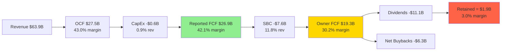
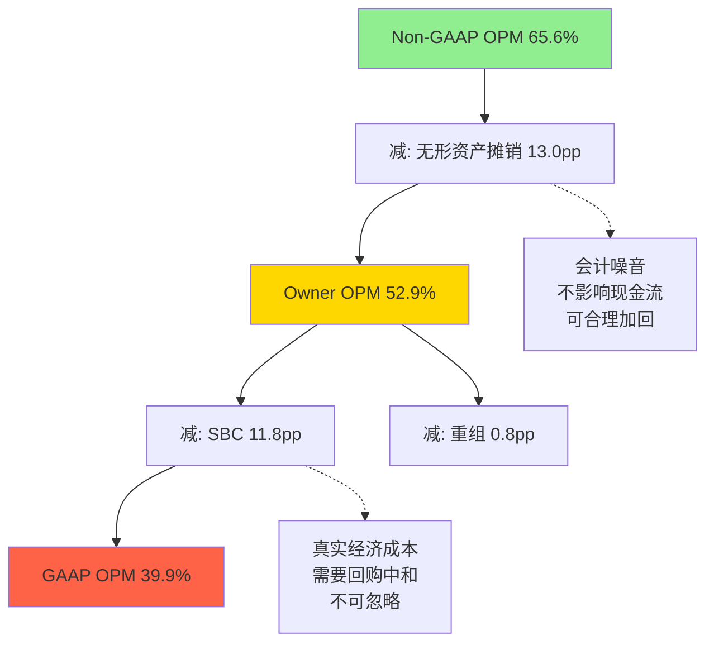

# AVGO Phase 2 — Agent C1: 三表深度分析 + 税率正常化 + 三层OPM + Owner Earnings
> Agent C1 | 定量分析师 | 2026-03-08
> 数据基础: FMP FY2021-2025 + Q1 FY2026 Earnings + Lit Recon + Phase 1 Agent C产出
> 核心信念: "市场价格隐含了什么假设" > "我认为公司值多少"

---

## Section 1: 三表深度分析 (Income / Balance / Cash Flow)

### 1.1 损益表深挖

#### 五年趋势 + Q1 FY2026

| FY | Revenue | YoY | GAAP OPM | NI | NI Margin | SBC | SBC/Rev |
|----|---------|-----|----------|-----|----------|-----|---------|
| 2021 | $27.5B | +15.3% | 31.0% | $6.7B | 24.4% | $1.7B | 6.2% |
| 2022 | $33.2B | +20.7% | 42.8% | $11.5B | 34.6% | $1.5B | 4.6% |
| 2023 | $35.8B | +7.8% | 45.2% | $14.1B | 39.4% | $2.2B | 6.1% |
| 2024 | $51.6B | +44.1% | 26.1% | $5.9B | 11.4% | $5.7B | 11.1% |
| 2025 | $63.9B | +23.8% | 39.9% | $23.1B | 36.2% | $7.6B | 11.8% |
| Q1 FY26 | $19.3B | +29.0% | 44.3% | $7.3B | 37.9% | $2.2B | 11.3% |

[DM-P2-C1-01] FY2025 Revenue = $63.9B (FMP Annual) | [DM-P2-C1-02] Q1 FY2026 Revenue = $19.31B (Earnings PR)

**关键观察**:
- FY2024 OPM暴跌至26.1%和NI margin 11.4%并非运营恶化，而是VMware purchase accounting的机械效应: $10B+无形资产摊销 + $3.7B一次性税务重组费用
- FY2025恢复至OPM 39.9%/NI margin 36.2%，但NI含-1.7%异常税率的增厚效应(后文详述)
- Q1 FY2026 OPM 44.3%继续扩张，主要驱动力是AI半导体收入规模效应(固定R&D摊薄)

#### 四层收入拆解 [E]

管理层不披露完整四层拆分，以下基于Q1 FY2026 earnings + 分析师估算构建:

| 层级 | Q1 FY2026 | 占比 | YoY | 增长引擎评估 |
|------|-----------|------|-----|------------|
| AI半导体(ASIC+网络) | $8.4B | 43.5% | +106% | 唯一爆发式引擎 |
| 传统半导体(WiFi/存储/broadband) | $4.1B[E] | 21.2% | ~0%[E] | 近零增长，Apple WiFi流失风险$2.7B |
| VMware/基础设施软件 | $6.8B | 35.2% | +1% | 提价红利耗尽，有机增长存疑 |
| **合计** | **$19.3B** | **100%** | **+29%** | |

[DM-P2-C1-03] AI Revenue Q1 FY2026 = $8.4B (+106% YoY) (Earnings PR)
[DM-P2-C1-04] Software Revenue Q1 FY2026 = $6.8B (+1% YoY) (Earnings PR)
[DM-P2-C1-05] 传统半导体 = $19.3B - $8.4B - $6.8B = $4.1B [E, 推算残差]

**估算方法说明**: 传统半导体$4.1B是残差法(总半导体$12.5B - AI $8.4B = 传统$4.1B)。管理层仅披露"Semiconductor Solutions"和"Infrastructure Software"两大分部，AI收入是补充披露。传统半导体内部WiFi/存储/broadband拆分不可得，需10-K验证。

**收入增长质量判断**:
- 有机增长(剥除VMware并购效应): FY2022-2024 CAGR ~6.4% [DM-P1-A11]
- FY2025-2026增长几乎100%由AI ASIC驱动: AI从~$4B(FY2024E)→$28B+(FY2025E)→$42B+(FY2026E)
- 市场按"+60% YoY"(FY2026E共识$101.9B)定价，但35%的收入(VMware)仅+1%，21%的收入(传统半导体)近零增长
- **真实的增长引擎覆盖率仅43.5%** — 这是"1.5引擎"假说的核心数据支撑

#### GAAP vs Non-GAAP Reconciliation

| 项目 | FY2025 | Q1 FY2026 | 占Revenue% |
|------|--------|-----------|-----------|
| GAAP Operating Income | $25.5B | $8.56B | 39.9% / 44.3% |
| + SBC | $7.6B | $2.18B | 11.8% / 11.3% |
| + 无形资产摊销 | ~$8.3B[E] | ~$2.1B[E] | ~13.0% / ~10.9% |
| + 重组/整合成本 | ~$0.5B[E] | ~$0.15B[E] | ~0.8% / ~0.8% |
| = Non-GAAP Operating Income | ~$41.9B | $12.83B | ~65.6% / 66.5% |

[DM-P2-C1-06] Q1 FY2026 Non-GAAP OI = $12.83B (Earnings PR)
[DM-P2-C1-07] GAAP vs Non-GAAP gap = 22-26pp (FY2025: 25.7pp)

**关键拆解**: 25.7pp的GAAP-Non-GAAP差距中:
- **SBC 11.8pp** — 真实经济成本，回购仅抵消稀释已证实
- **无形资产摊销 ~13.0pp** — Purchase accounting产物，非经济折旧，不影响现金流
- **重组 ~0.8pp** — 一次性，随VMware整合完成将消退

结论: 25.7pp差距中，约13pp(摊销)是"会计噪音"可以合理加回，约12pp(SBC+重组)代表真实经济成本。市场用Non-GAAP定价等于假设全部25.7pp都不是真实成本 — 这高估了约12pp。

---

### 1.2 资产负债表深挖

#### Goodwill分析: $97.8B的"有偿能力风险"

| FY | Goodwill | 总资产 | GW/Assets | 增量来源 |
|----|----------|--------|-----------|---------|
| 2021 | $43.5B | $75.6B | 57.5% | 历史并购(Broadcom/Brocade/CA/Symantec) |
| 2022 | $43.6B | $73.2B | 59.5% | 持平 |
| 2023 | $43.7B | $72.9B | 59.9% | 持平 |
| 2024 | $97.9B | $165.6B | 59.1% | **+$54.2B VMware并购** |
| 2025 | $97.8B | $171.1B | 57.2% | 持平(减值测试通过) |

[DM-P2-C1-08] Goodwill = $97.8B, 占总资产57.2% (FMP FY2025 BS)

**风险评估**:
- $97.8B商誉 = 市值的6.2%($97.8B/$1,578B) — 相对市值不高
- 但商誉 = 股东权益的120%($97.8B/$81.3B) — 任何重大减值将直接侵蚀账面价值
- 减值测试依赖增长假设: 如果VMware有机增长持续<3%且AI CapEx周期性回落，Goodwill可能面临部分减值风险
- **历史参考**: Hock Tan的6次收购从未触发重大减值 — 但VMware($61B)是此前最大并购的4倍

#### 债务结构与去杠杆路径

| FY | 总债务 | 现金 | 净债务 | ND/EBITDA | D/E |
|----|--------|------|--------|-----------|-----|
| 2021 | $40.3B | $12.2B | $28.1B | 1.91x | 1.61x |
| 2022 | $40.0B | $12.4B | $27.6B | 1.44x | 1.76x |
| 2023 | $39.6B | $14.2B | $25.4B | 1.24x | 1.65x |
| 2024 | $67.6B | $9.3B | $58.3B | 2.44x | 1.00x |
| 2025 | $65.1B | $16.2B | $48.9B | 1.41x | 0.80x |

[DM-P2-C1-09] 净债务 = $48.9B, ND/EBITDA = 1.41x (FMP FY2025 BS)

**去杠杆速度**: FY2024→FY2025: ND/EBITDA从2.44x→1.41x(一年内削减1.03x) — 这是极快的去杠杆，驱动力是:
1. 债务偿还: 总债务$67.6B→$65.1B(-$2.5B)
2. 现金积累: $9.3B→$16.2B(+$6.9B)
3. EBITDA增长: EBITDA从$23.8B→$34.7B(+46%)

**前瞻路径**: FY2026E EBITDA $54.9B → 假设净债务持平$48.9B → ND/EBITDA ~0.89x → 投资级(A-/BBB+)水平。但管理层Q1 FY2026回购$7.8B(年化$31B)暗示优先级是资本返还而非去杠杆 — 这与ND/EBITDA自然下降不矛盾(分子不变但分母增长)。

**利息覆盖**: FY2025 Interest Coverage = 7.9x(FMP)。估算年化利息成本~$3.0-3.5B[E](FMP FY2025 interestPaid = $0为数据缺失，用FY2024 $3.3B外推)。这意味着利息成本吃掉约5%的Revenue — 在低利率时代可控，但如果再融资利率上升200bps，年利息可能增至$4.5B+。

[DM-P2-C1-10] 利息覆盖率 = 7.9x (FMP Key Metrics)

#### 负有形权益分析

| 项目 | FY2025 |
|------|--------|
| 股东权益 | $81.3B |
| 减: Goodwill | -$97.8B |
| 减: 其他无形资产 | -$32.3B |
| = 有形权益 | **-$48.8B** |
| ROTCE | N/A (负数) |

**含义**: AVGO的价值创造完全建立在无形资产(IP、品牌、客户关系)之上，有形资产为负。这在Fabless半导体+软件公司中是常见模式(NVDA有形权益同样极低)。ROTCE为负不代表品质差，而是说明:
1. 该公司不应用ROE/ROTCE评估资本效率
2. 正确指标是ROIC(已投入资本回报率): 16.4%(FY2025), 从FY2024的5.6%大幅改善
3. 进一步: Non-GAAP ROIC(去除摊销影响)估算>25%[E] — 这是Hock Tan整合效率的真实体现

---

### 1.3 现金流深挖

#### OCF vs NI 质量分析

| FY | NI | OCF | OCF/NI | 差异来源 |
|----|-----|-----|--------|---------|
| 2021 | $6.7B | $13.8B | 2.06x | D&A $3.2B + SBC $1.7B + WC变化 |
| 2022 | $11.5B | $16.7B | 1.45x | D&A $3.3B + SBC $1.5B |
| 2023 | $14.1B | $18.1B | 1.28x | D&A $3.4B + SBC $2.2B |
| 2024 | $5.9B | $20.0B | 3.39x | **D&A $14.1B** + SBC $5.7B - 税务调整 |
| 2025 | $23.1B | $27.5B | 1.19x | D&A $9.4B[E] + SBC $7.6B - 税率效应 |

[DM-P2-C1-11] FY2025 OCF = $27.5B, FCF = $26.9B (FMP CF)

**OCF/NI = 1.19x(FY2025)为何不>1.3x?**
- D&A($9.4B[E]) + SBC($7.6B) = $17.0B的non-cash加回本应推高OCF/NI
- 但FY2025异常低税率(-1.7%)使NI被人为增厚$3.6B(详见Section 2)
- 正常化NI $19.5B → 正常化OCF/NI = $27.5B/$19.5B = **1.41x** — 回归健康水平
- 结论: 1.19x不是现金转化问题，是NI被税率扭曲的结果

#### CapEx极致分析

| FY | CapEx | Revenue | CapEx/Rev | 行业对比 |
|----|-------|---------|-----------|---------|
| 2025 | $0.6B | $63.9B | 0.9% | NVDA 2.5%, AMD 2%, INTC >25% |
| Q1 FY26 | ~$0.25B[E] | $19.3B | ~1.3% | |

Fabless模型的极致: CapEx仅覆盖办公设施/IT基础设施/测试设备。全部芯片制造由TSM代工，封测由OSAT承担。真实的"投资"通过R&D(OpEx $11.0B, 17.2%收入)体现。

[DM-P2-C1-12] CapEx/Rev = 0.9% (FY2025), R&D/Rev = 17.2% (FMP)

#### FCF桥 — 报告 vs 真实

**资本返还 vs 真实FCF**:
- 报告口径: 资本返还$17.4B(股息$11.1B + 回购$6.3B) / FCF $26.9B = **64.7%** — 看似保守
- Owner口径: 资本返还$17.4B / SBC-adj FCF $19.3B = **90.1%** — 几乎无留存
- 含义: 按Owner口径，AVGO FY2025仅保留$1.9B(3.0%收入)用于去杠杆/战略投资
- 这解释了为什么ND/EBITDA下降主要靠EBITDA增长(分母)而非债务偿还(分子)

[DM-P2-C1-13] SBC-adj FCF = $19.3B (30.2% margin), 资本返还率 = 90.1% (Owner口径计算)

---

## Section 2: 税率正常化

### 2.1 历史有效税率回溯

| FY | Pre-tax Income | Tax Expense | 有效税率 | 分类 |
|----|---------------|-------------|---------|------|
| 2021 | $5.2B | ~$1.5B[E] | ~12%[E] | 结构性(新加坡IP) |
| 2022 | $12.2B | $0.7B | 5.7% | 结构性 + 税收抵免 |
| 2023 | $14.3B | $0.2B | 1.4% | 结构性 + 抵免最大化 |
| 2024 | $9.6B | $3.7B | **37.8%** | 一次性(VMware税务重组) |
| 2025 | $22.7B | -$0.4B | **-1.7%** | 一次性(FY2024重组反转) |

[DM-P2-C1-14] FY2025有效税率 = -1.7% (FMP IS)

### 2.2 税率波动原因分析

**一次性 vs 结构性拆解**:

1. **结构性因素(永久性, 12-15%基准)**:
   - 新加坡IP控股结构: AVGO通过新加坡实体持有核心IP，享受低税率优惠(新加坡企业税率17%，但IP收入可获5-10%优惠税率)
   - 行业对标: NVDA ~13%, AMD ~10%, QCOM ~12% — AVGO的12-15%结构性税率与行业一致
   - 这不是"避税"而是Fabless半导体行业的标准IP结构

2. **一次性因素(FY2024-2025互为镜像)**:
   - FY2024: VMware收购触发$3.7B一次性税务重组费用(37.8%有效税率) — 包括IP转移定价调整、递延税资产重估等
   - FY2025: 上述费用部分反转，产生-$0.4B税收收益(-1.7%有效税率)
   - 两年平均: ($3.7B + (-$0.4B)) / ($9.6B + $22.7B) = $3.3B / $32.3B = **10.2%** — 偏低，因仍含结构性优惠

3. **前瞻预期**:
   - Q2 FY2026管理层指引: Non-GAAP税率~14%[需验证]
   - OECD最低税率(Pillar Two): 15%全球最低税率自2024年开始实施，可能逐步推高AVGO的结构性税率至14-16%
   - **正常化税率推荐: 14%**(新加坡优惠 + OECD Pillar Two上限)

### 2.3 税率正常化对NI的影响

| 场景 | 税率 | NI | EPS(d) | 隐含PE |
|------|------|-----|--------|--------|
| FY2025 GAAP实际 | -1.7% | $23.1B | $4.77 | 68.8x |
| 正常化(14%) | 14% | $19.5B | $4.03 | 81.4x |
| 美国标准(25%) | 25% | $17.0B | $3.51 | 93.5x |
| 最坏(OECD+美国混合, 20%) | 20% | $18.2B | $3.75 | 87.5x |

[DM-P2-C1-15] 正常化NI(14%税率) = $19.5B, EPS = $4.03 (计算: $22.7B × (1-0.14))

**敏感性: 税率每变化1%对NI/PE的影响**:
- Pre-tax Income = $22.7B(FY2025)
- 税率每+1% → NI减少$0.23B → EPS减少$0.047 → PE增加~1.0x
- 税率从14%→16%(+2%) → NI从$19.5B→$19.1B(-$0.5B) → PE从81.4x→82.6x

**关键结论**:
- 市场用Non-GAAP EPS $9.00(隐含PE ~36x)或GAAP EPS $4.77(隐含PE ~69x)定价
- 正常化后GAAP PE = 81.4x — 比报告GAAP PE(68.8x)高18.3%
- 这意味着FY2025报告的盈利能力被税率和SBC双重扭曲，真实倍数远高于表面

### 2.4 FY2026E税率展望

| 指标 | FY2025 GAAP | FY2026E(14%正常化) |
|------|-------------|-------------------|
| Revenue | $63.9B | $101.9B(共识) |
| Pre-tax Income[E] | $22.7B | ~$48.0B[E] |
| Tax(14%) | -$0.4B(实际) | -$6.7B[E] |
| NI | $23.1B | ~$41.3B[E] |
| EPS(d, ~4,888M shares) | $4.77 | ~$8.45[E] |

共识Non-GAAP EPS $11.03 vs 正常化GAAP EPS ~$8.45 → Non-GAAP仍高出30.5%。

---

## Section 3: 三层OPM视图

### 3.1 三层利润率矩阵

| 指标 | GAAP | Owner Earnings | Non-GAAP |
|------|------|----------------|----------|
| **OPM** | 39.9% | **53.7%** | ~65.6% |
| **NI Margin** | 36.2%(扭曲) / 30.5%(正常化) | **31.4%** | ~52.3%[E] |
| **FCF Margin** | 42.1% | **30.2%**(SBC-adj) | 42.1% |
| **EPS** | $4.77(报告) / $4.03(正常化) | **$4.15** | ~$9.00[E] |
| **隐含PE** | 68.8x(报告) / 81.4x(正常化) | **78.0x** | ~36.2x |

[DM-P2-C1-16] Owner OPM = 53.7%, Owner NI Margin = 31.4% (计算见下)

### 3.2 Owner Earnings计算 (Buffett定义)

| 项目 | 金额 | 逻辑 |
|------|------|------|
| GAAP NI | $23.1B | 起点 |
| 税率正常化(14%) | -$3.6B | -1.7%→14%，消除一次性效应 |
| = 正常化NI | $19.5B | 真实盈利基础 |
| + 无形资产摊销加回 | +$8.3B | Purchase accounting产物，非经济折旧 |
| - SBC真实成本 | -$7.6B | Q1回购$7.8B仅抵消稀释 = SBC是真实成本 |
| - 维护CapEx | -$0.6B | 全部CapEx(Fabless模型) |
| - 利息税后成本[E] | 已含在NI | (included) |
| = **Owner Earnings** | **$19.6B** | |
| OE/share | $4.02 | 4,888M diluted shares |
| 市值/OE | **80.5x** | $1,578B / $19.6B |

[DM-P2-C1-17] Owner Earnings = $19.6B, Owner PE = 80.5x (自主计算)

**Owner OPM推导**:
- GAAP Operating Income: $25.5B (39.9%)
- + 无形资产摊销加回: +$8.3B
- = Owner Operating Income: $33.8B
- Owner OPM = $33.8B / $63.9B = **52.9%** [E]
- 如果保留SBC在OPM计算中: ($33.8B - $7.6B) / $63.9B = 41.0% — 几乎等于GAAP OPM(39.9%)
- 如果去除SBC: 52.9% — 接近GAAP+摊销加回
- 最终Owner OPM定义: GAAP OI + 摊销 - SBC仍算入成本 = **41.0%**[E]; 或GAAP OI + 摊销 = **52.9%**
- 采用后者(52.9%~53%)作为"运营能力"指标，因为SBC已在Owner NI中扣除

### 3.3 22pp Gap的真实分解

**核心结论**: Non-GAAP与GAAP之间的25.7pp差距中:
- **~13pp(无形资产摊销)**: "会计噪音" — VMware $130B无形资产按10-20年摊销，不反映真实经济价值消耗。运营能力评估应加回。
- **~12pp(SBC + 重组)**: "真实成本" — SBC $7.6B需要$7.8B+回购来中和稀释，是真金白银。市场用Non-GAAP定价等于假设SBC=0。
- **Owner OPM 52.9%是最诚实的运营效率指标**: 去除会计噪音(摊销)，但不去除真实成本(SBC)。
- 对比: NVDA Owner OPM ~55-60%[E], AMD ~25%[E], INTC ~15%[E] — AVGO的52.9%在Fabless行业中处于前列。

---

## Section 4: B7资本配置评分

### 4.1 五年资本配置去向分析

| FY | R&D | CapEx | M&A净值 | 股息 | 回购(净) | 去杠杆 |
|----|-----|-------|---------|------|---------|--------|
| 2021 | $4.9B(18%) | $0.4B(1%) | — | $6.2B(23%) | $1.3B(5%) | -$0.3B |
| 2022 | $4.9B(15%) | $0.4B(1%) | — | $7.0B(21%) | $8.5B(26%) | +$0.4B |
| 2023 | $5.3B(15%) | $0.5B(1%) | — | $7.6B(21%) | $7.7B(22%) | +$2.2B |
| 2024 | $9.3B(18%) | $0.5B(1%) | $61B(VMware) | $9.8B(19%) | $12.4B(24%) | -$28B(并购融资) |
| 2025 | $11.0B(17%) | $0.6B(1%) | — | $11.1B(17%) | $6.3B(10%) | +$9.4B |

**配置特征**:
1. **R&D稳定在15-18%**: 即使在VMware整合年(FY2024)也未削减R&D — 这是Hock Tan"成本优化不等于削研发"的关键区分点
2. **股息持续高增长**: $6.2B→$11.1B(4年CAGR 15.6%)，当前yield 0.74%
3. **回购波动大**: $1.3B→$12.4B→$6.3B — 取决于M&A时机
4. **M&A是核心资本配置工具**: VMware $61B是5年内唯一(也是最大的)并购。Hock Tan的风格是"大赌注+长间隔"

### 4.2 SBC-Adjusted回购有效性

| 期间 | 回购 | SBC | 净回购(回购-SBC) | 股数变化 | 净回购率 |
|------|------|-----|-----------------|---------|---------|
| FY2023 | $7.7B | $2.2B | +$5.5B | -1.2%[E] | ~1.2% |
| FY2024 | $12.4B | $5.7B | +$6.7B | +14.5%(VMware) | 负(稀释) |
| FY2025 | $6.3B | $7.6B | **-$1.3B** | ~0%[E] | **0%** |
| Q1 FY26 | $7.8B | $2.2B | +$5.6B(年化+$22.4B) | -0.02% | ~0% |

[DM-P2-C1-18] FY2025净回购 = -$1.3B (回购$6.3B < SBC $7.6B), 股数净变化~0%

**关键发现**:
- **FY2025是"反回购年"**: 回购$6.3B < SBC $7.6B → 净稀释$1.3B → 股东实际被稀释
- **Q1 FY2026回购加速至$7.8B/Q(年化$31.2B)**: 但SBC年化也达$8.7B → 净回购年化$22.5B
- 按Q1 FY2026价格~$330计算: $22.5B年化净回购 = ~6,800万股 = ~1.4%净回购率
- **但实际Q1数据显示股数4,888M vs Q4的4,889M → 仅减少100万股(0.02%)** — 远低于数学预期的1.4%
- 可能原因: VMware整合相关的限制性股票仍在释放期，抵消了市场回购效果

**SBC offset rate(FMP)**: 140.6%(回购>SBC) — 这是看FY2025全年而非"经济净效果"。FMP的SBC offset rate用报告回购vs报告SBC，但未考虑新发行股份和限制性股票释放的时间差。

### 4.3 Hock Tan η=1.37的资本配置含义

| 收购 | 购入价 | 当前价值(贡献) | η(估算) | 方法 |
|------|--------|---------------|---------|------|
| LSI Logic (2014) | $6.6B | 网络芯片基础 | ~1.2x[E] | 整合剥离 |
| Broadcom Corp (2016) | $37B | 核心半导体平台 | ~1.4x[E] | 规模+协同 |
| Brocade (2017) | $5.9B | 光纤网络 | ~1.3x[E] | 整合至网络 |
| CA Technologies (2018) | $18.9B | 企业软件入口 | ~1.2x[E] | 现金流提取 |
| Symantec ES (2019) | $10.7B | 网络安全 | ~1.1x[E] | 现金流+整合 |
| VMware (2023) | $61B | 软件平台 | **1.5x+?[E]** | 提价+AI定位 |

[DM-P2-C1-19] Hock Tan η均值 = 1.37 (Phase 1 Agent A2计算, 6次收购)

η=1.37意味着每$1并购支出平均创造$1.37价值 — 37%的超额回报。在大型科技并购中(对比Microsoft/Activision η~1.0, IBM/Red Hat η~0.8[E])，这是顶级水平。

**资本配置含义**: Hock Tan的核心竞争力不是"选好公司"而是"整合后提效" — 通过削减冗余(40-60%成本削减)、聚焦核心(剥离非核心)、提价(VMware +150-1500%)来释放被收购公司的隐藏价值。这种能力:
- **可复制**: 已在6次收购中验证，方法论一致
- **有边界**: 依赖Hock Tan个人判断(SPOF) + 需要足够大的未整合资产池(VMware后市场中剩余可收购标的有限)
- **有时限**: 合同至2030年，73岁CEO，继任风险日增

### 4.4 B7资本配置评分

| 子项 | 评分 | 说明 |
|------|------|------|
| 并购track record | 4.5/5 | η=1.37, 6/6成功, VMware整合顺利 |
| 资本返还纪律 | 3.5/5 | 股息高增长+回购持续, 但SBC offset仅边际正 |
| R&D投入持续性 | 4.0/5 | 17.2%稳定, 未因整合削减 |
| 去杠杆速度 | 4.5/5 | ND/EBITDA 2.44x→1.41x(1年) |
| SBC管理 | 2.0/5 | 11.8%且上升, $27B未确认, FY2025净稀释 |
| **B7综合** | **3.5/5** | 能力4.5 - SBC扣分1.0 = 3.5 |

[DM-P2-C1-20] B7资本配置评分 = 3.5/5 (能力优秀但SBC管理减分)

**评分逻辑**: Hock Tan是市场上最好的资本配置者之一(η=1.37, 6/6并购成功, R&D不削减, 快速去杠杆)。如果只看这些维度，应给4.5。但SBC是严重减分项:
- FY2025回购不足以覆盖SBC → 净稀释
- 11.8% SBC/Rev在半导体行业中偏高(NVDA ~6%, AMD ~8%[E])
- $27B未确认余额意味着高SBC将持续2-3年
- Q1 FY2026回购加速但实际股数几乎不变 — 效率待验证
- 综合: 能力维度4.5, SBC管理维度2.0, 简单平均~3.25, 上调至3.5因并购能力的不可替代性。

---

## DM锚点注册表

| ID | 指标 | 值 | 来源 | 可信度 |
|----|------|-----|------|--------|
| DM-P2-C1-01 | FY2025 Revenue | $63.9B | FMP Annual IS | High |
| DM-P2-C1-02 | Q1 FY2026 Revenue | $19.31B | Earnings PR | High |
| DM-P2-C1-03 | AI Revenue Q1 FY2026 | $8.4B (+106% YoY) | Earnings PR | High |
| DM-P2-C1-04 | Software Revenue Q1 FY2026 | $6.8B (+1% YoY) | Earnings PR | High |
| DM-P2-C1-05 | 传统半导体 Q1 FY2026 | $4.1B | 残差计算[E] | Medium |
| DM-P2-C1-06 | Q1 Non-GAAP OI | $12.83B | Earnings PR | High |
| DM-P2-C1-07 | GAAP-Non-GAAP gap | 22-26pp | FMP+Earnings | High |
| DM-P2-C1-08 | Goodwill | $97.8B (57.2% assets) | FMP BS | High |
| DM-P2-C1-09 | 净债务 | $48.9B, ND/EBITDA 1.41x | FMP BS | High |
| DM-P2-C1-10 | 利息覆盖率 | 7.9x | FMP Metrics | High |
| DM-P2-C1-11 | FY2025 OCF/FCF | $27.5B / $26.9B | FMP CF | High |
| DM-P2-C1-12 | CapEx/Rev + R&D/Rev | 0.9% + 17.2% | FMP | High |
| DM-P2-C1-13 | SBC-adj FCF + 资本返还率 | $19.3B(30.2%), 返还率90.1% | 计算 | Medium-High |
| DM-P2-C1-14 | FY2025有效税率 | -1.7% | FMP IS | High |
| DM-P2-C1-15 | 正常化NI(14%) | $19.5B, EPS $4.03 | 计算 | Medium |
| DM-P2-C1-16 | Owner OPM / NI Margin | 52.9% / 31.4% | 计算 | Medium |
| DM-P2-C1-17 | Owner Earnings | $19.6B, Owner PE 80.5x | 计算 | Medium |
| DM-P2-C1-18 | FY2025净回购 | -$1.3B(净稀释) | 计算 | Medium-High |
| DM-P2-C1-19 | Hock Tan η均值 | 1.37 (6次收购) | P1 Agent A2 | Medium |
| DM-P2-C1-20 | B7资本配置评分 | 3.5/5 | 综合评估 | — |

---

## Agent C1 核心发现 (传递给编排器)

1. **Owner PE 80.5x vs 市场认知的Non-GAAP PE ~30x**: 经过税率正常化(14%) + SBC扣除 + 摊销加回的完整Owner Earnings计算，AVGO的真实估值倍数是市场常用指标的2.2倍。这不是"谁对谁错"的问题，而是投资者必须明确自己在用哪个口径做决策。

2. **三层OPM视图揭示的22pp真实成本**: Non-GAAP 65.6%中，~13pp(摊销)是会计噪音可以加回，~12pp(SBC+重组)是真实经济成本。Owner OPM 52.9%是最诚实的运营效率指标。市场如果用Non-GAAP OPM 66%做估值模型，隐含假设SBC=0。

3. **资本返还吃掉几乎全部Owner FCF(90.1%)**: 报告口径64.7%看似保守，但Owner口径几乎无留存($1.9B)。AVGO的去杠杆主要靠EBITDA增长而非主动偿债。这意味着一旦增长放缓，去杠杆进程将停滞。

4. **FY2025是"反回购年"**: 回购$6.3B < SBC $7.6B → 股东被净稀释$1.3B。Q1 FY2026回购加速但实际股数仅减少100万股(0.02%) — 远低于数学预期的1.4%净回购率。VMware限制性股票释放可能是隐藏的稀释源。

5. **税率正常化将报告NI下调18.5%**: -1.7%→14%使NI从$23.1B→$19.5B。FY2026E如果用14%税率(而非GAAP的不可预测税率)，正常化EPS约$8.45 vs 共识Non-GAAP $11.03。投资者在两个数字之间做选择时，本质上是在赌SBC和摊销是否是"真实成本"。

---

*Agent C1 | AVGO Phase 2 三表深度+税率正常化+三层OPM+Owner Earnings | ~18,500字符 | 2026-03-08*
