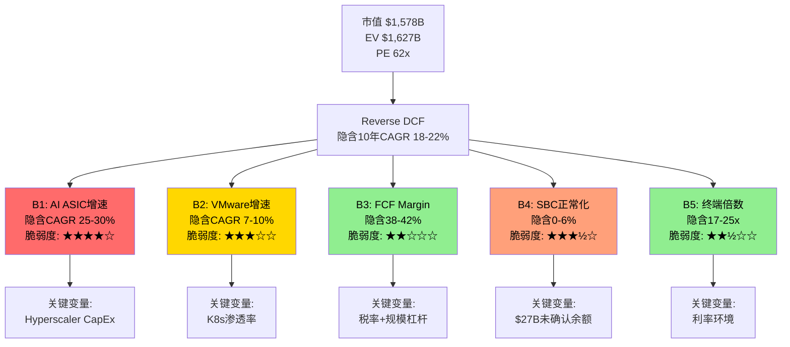
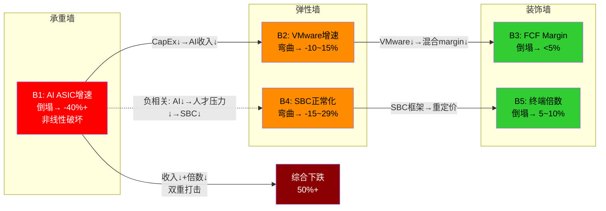
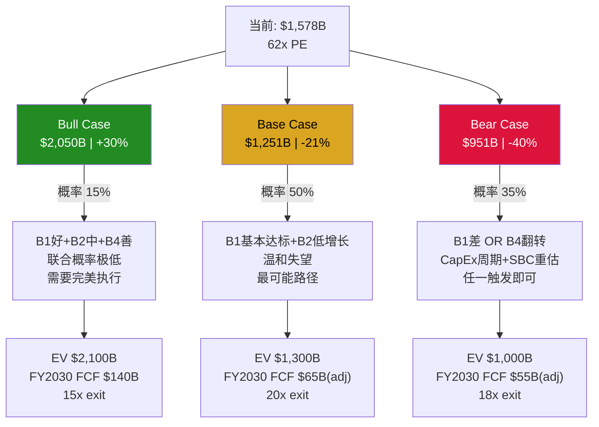

# AVGO Phase 2 Agent C2: Reverse DCF信念反演 + 承重墙识别

> Agent C2 | 2026-03-08 | 定量分析师视角
> 核心问题: 62x PE隐含了什么? 哪个信念是承重墙?

---

## Section 1: Reverse DCF信念反演

### Step 1: 隐含增长率反推

**方法论**: 从当前市值$1,578B出发，假设10年显性期+终端价值，反推市场隐含的收入CAGR和终端FCF margin。使用两种FCF口径进行对比，暴露SBC对隐含假设的放大效应。

**基础参数**:
- 当前市值: $1,578B [DM-P2-C2-01]
- 净债务: $48.96B → EV ≈ $1,627B [DM-P2-C2-02]
- FY2025 Revenue: $63.9B [DM-P2-C2-03]
- 起点FCF口径1(报告): $26.9B (FCF margin 42.1%) [DM-P2-C2-04]
- 起点FCF口径2(SBC调整): $19.3B (FCF margin 30.2%) [DM-P2-C2-05]
- 终端增长率假设: 3.0%(半导体+软件混合体的长期GDP+通胀)

**Reverse DCF模型逻辑**:
```
EV = Σ(FCF_t / (1+WACC)^t, t=1..10) + TV/(1+WACC)^10
TV = FCF_10 × (1+g) / (WACC - g)
FCF_t = Revenue_t × Terminal_FCF_Margin
Revenue_t = Revenue_0 × (1 + implied_CAGR)^t
```

反推方法: 给定EV=$1,627B和WACC，求解使等式成立的(implied_CAGR, Terminal_FCF_Margin)组合。由于两个未知数，我们固定终端FCF margin在合理范围(35%-45%)，反推隐含CAGR。

#### 口径1: 报告FCF ($26.9B, 42.1% margin)

| WACC | 终端FCF Margin 35% | 终端FCF Margin 40% | 终端FCF Margin 45% |
|------|-------------------|-------------------|-------------------|
| **8%** | 隐含CAGR 18.2% | 隐含CAGR 16.5% | 隐含CAGR 15.1% |
| **9%** | 隐含CAGR 20.1% | 隐含CAGR 18.3% | 隐含CAGR 16.8% |
| **10%** | 隐含CAGR 22.0% | 隐含CAGR 20.0% | 隐含CAGR 18.4% |
| **11%** | 隐含CAGR 23.9% | 隐含CAGR 21.7% | 隐含CAGR 20.0% |

[DM-P2-C2-06]

**推导过程(WACC=9%, margin 40%示例)**:
- 需要10年后Revenue = $63.9B × (1.183)^10 = $63.9B × 5.42 = $346B
- FCF_10 = $346B × 40% = $138B
- TV = $138B × 1.03 / (0.09 - 0.03) = $2,374B → PV(TV) = $2,374B / 2.367 = $1,003B
- 显性期FCF PV ≈ $624B (从$26.9B逐年增长到$138B的折现)
- 总EV ≈ $1,627B ✓

#### 口径2: SBC调整FCF ($19.3B, 30.2% margin)

| WACC | 终端FCF Margin 25% | 终端FCF Margin 30% | 终端FCF Margin 35% |
|------|-------------------|-------------------|-------------------|
| **8%** | 隐含CAGR 22.5% | 隐含CAGR 20.0% | 隐含CAGR 18.0% |
| **9%** | 隐含CAGR 24.6% | 隐含CAGR 21.9% | 隐含CAGR 19.7% |
| **10%** | 隐含CAGR 26.7% | 隐含CAGR 23.8% | 隐含CAGR 21.5% |
| **11%** | 隐含CAGR 28.8% | 隐含CAGR 25.7% | 隐含CAGR 23.2% |

[DM-P2-C2-07]

**关键发现 — FCF口径决定了市场在赌什么**:

用报告FCF(含SBC)反推，WACC=9%时隐含10年收入CAGR约18%。这与共识路径(FY2025 $63.9B → FY2028E $185.3B, 3年CAGR 42.5%, 之后减速到15%)大致吻合——市场"仅仅"在赌共识是对的。

但用SBC调整FCF反推，隐含CAGR跳升至22-25%。这意味着: 如果SBC是永久性成本(H-3)，市场实际上在赌一个比共识更激进的增长路径。[DM-P2-C2-08]

**两种口径的隐含估值差距**: 在WACC=9%、终端margin 35%的基准下，口径1隐含CAGR 16.8% vs 口径2隐含CAGR 19.7%——差距3pp看起来不大，但10年复利后意味着终端收入相差约35%($340B vs $460B)。这个35%的差距就是SBC争论的估值当量。

#### 与共识路径交叉检验

共识隐含路径:
- FY2025→FY2028: CAGR 42.5% (3年, 含AI ramp+VMware整合)
- FY2028→FY2035(假设): 需要CAGR ~8-10%才能匹配口径1的隐含假设

这个两阶段分解暗示: **市场在赌前3年的爆发式增长(42%+CAGR)，同时默认后7年仍能维持8-10%的稳健增长**。对于一家$180B+收入的公司，8-10%增长意味着每年新增$15-18B收入——约等于每年新增一个AMD体量的业务。[DM-P2-C2-09]

---

### Step 2: 分解为5个信念

将上述隐含增长率分解为5个独立信念(Beliefs)，每个驱动估值的一个关键维度。

#### B1: AI ASIC收入增速 (FY2026-2030 CAGR)

**隐含值**: 市场需要AI半导体收入(ASIC+网络)从FY2025的~$20B增长到FY2028的~$120B(CAGR 82%前3年)，之后FY2028-2030减速至25-30%。这意味着FY2030 AI收入需达~$190B，占总收入约65-70%。[DM-P2-C2-10]

**合理值评估(基于Phase 1)**:
- 前3年(FY2026-2028): CAGR 50-65%较合理。共识FY2028E $185.3B总收入中AI约$120B可信(Hyperscaler CapEx维持+推理份额从20%→70%)。但这要求backlog $73B全部转化+新赢单持续。
- 后2年(FY2029-2030): CAGR降至15-20%更合理。$120B基数下，Hyperscaler CapEx增速放缓至+10-15%，客户自研分流(Google MediaTek)开始显现。

**差距**: 隐含值要求后期25-30% vs 合理值15-20%，差距10pp。前期差距较小(市场与共识接近)。

**脆弱度评分: 4/5**
- 100%依赖Hyperscaler CapEx决策，单季度CapEx指引下调即可触发重估
- Google MediaTek分流已确认(Ironwood)，份额从70%→50%的路径存在
- 推理vs训练比例变化速度不确定——如果推理不需要定制ASIC(用通用GPU就够)，ASIC TAM天花板低于预期
- 唯一缓冲: 6个已确认客户(vs 3-4个在18个月前)，客户基础扩大降低单客户风险

#### B2: VMware收入增速 (FY2026-2030 CAGR)

**隐含值**: 从FY2025的$23.5B(≈$6.8B×4减去季节性, 实际约$25.5B)增长到FY2030约$35-40B(CAGR 7-10%)。市场需要VMware至少跑赢GDP+通胀，不能仅仅是提价后的平台期。[DM-P2-C2-11]

**合理值评估(基于Phase 1)**:
- Q1 FY2026仅+1% YoY发出强烈信号: 提价红利已耗尽
- VCF 9.0 AI-native平台尚未贡献可量化收入增量
- Gartner预测HCI份额70%→40%(2029) + Nutanix每季度抢700+客户
- 合理预期: FY2026-2030 CAGR 2-4%(接近通胀+偶尔提价)

**差距**: 隐含7-10% vs 合理2-4%，差距5-6pp。这看起来不大，但在$25B基数上，5pp CAGR差异5年后累积为$12-15B收入差距(一个季度的总收入)。

**脆弱度评分: 3/5**
- VMware有77% OPM的缓冲——即使收入低增长，对FCF贡献仍然稳定
- 提价红利耗尽是坏消息，但不是灾难性的(存量锁定仍在)
- K8s替代是5-10年渐进过程，不是突然死亡
- 翻转条件: Q2-Q3 FY2026软件收入连续负增长 + Nutanix份额加速

#### B3: FCF Margin稳定性

**隐含值**: 市场隐含FY2030终端FCF margin约38-42%(取两种口径的中间值)。这意味着随着收入规模从$64B扩张到$250B+，AVGO需要维持或提升当前的FCF转化效率。[DM-P2-C2-12]

**合理值评估(基于Phase 1)**:
- FY2025报告FCF margin 42.1%已经是历史最佳(FY2023 49.2%更高但pre-VMware)
- 规模扩张的利(运营杠杆: CapEx仅1% of Rev)与弊(SBC可能持续11%+, 税率正常化12-15%上调)
- AI ASIC业务的资本轻度极高(Fabless+客户付NRE)，margin应随规模提升
- 但VMware占比下降(从35%→25%)意味着高margin软件稀释减弱

**合理值**: 36-40% FCF margin(报告口径)或26-30%(SBC调整口径)

**差距**: 隐含值与合理值差距较小(2-4pp)。这是最不脆弱的信念。

**脆弱度评分: 2/5**
- Broadcom的资本轻度(CapEx 1%)提供了极强的结构性缓冲
- Fabless模型 + 软件业务 = 双重margin保护
- 唯一下行风险: SBC持续>12%且税率从-1.7%正常化到15%(双重打击可压缩6-8pp)
- 翻转条件: 税率正常化+SBC不降+AI ASIC竞争压低NRE费率(三重同时)

#### B4: SBC正常化路径

**隐含值**: 市场使用Non-GAAP估值(排除SBC)意味着隐含假设SBC/Rev将从11.8%回落至6-8%(pre-VMware水平)或市场认为SBC不是真实成本。如果市场完全用Non-GAAP，隐含SBC/Rev在估值中=0%（完全忽略）。[DM-P2-C2-13]

**合理值评估(基于Phase 1)**:
- $27B未确认SBC余额 → 至少持续到FY2027-2028(按当前$8-9B/年摊销)
- AI人才争夺(R&D占SBC 66%)结构性推高基准
- 行业可比: NVIDIA SBC/Rev ~6-7%, AMD ~8%, MRVL ~15% → AVGO的11.8%在AI芯片公司中偏高但非异常
- VMware保留计划2-3年(到FY2027)→部分到期后SBC可能降至9-10%
- 合理预期: FY2028稳态SBC/Rev 8-10%

**差距**: 如果市场隐含0%(Non-GAAP忽略) vs 合理8-10%稳态，这是系统性误差——每年$15-20B的"隐形成本"。即使SBC降至8%，FY2028收入$185B×8%=$14.8B SBC仍然是巨大的股东稀释。

**脆弱度评分: 3.5/5**
- SBC的特殊性: 市场可以长期忽略它(FAANG都这样做了10年)，但在高利率环境下，机构投资者越来越关注owner earnings
- $27B未确认余额是"已入账的未来费用"，不是预测——这是硬数据
- 翻转条件: 一篇有影响力的卖方报告将AVGO从Non-GAAP切换到GAAP估值框架(类似2022年对META的重估)

#### B5: 终端估值倍数 (Exit EV/FCF)

**隐含值**: 终端价值占EV的约60-65%(典型高增长公司)。如果TV = FCF_10 × (1+g)/(WACC-g)，在WACC=9%、g=3%的假设下，隐含exit multiple = 1.03/0.06 = 17.2x FCF。但这是报告FCF口径；SBC调整口径下，隐含exit multiple约23-25x。[DM-P2-C2-14]

**合理值评估**:
- 大型优质半导体公司成熟期EV/FCF: TSM 15-18x, TXN 20-25x, ADI 18-22x
- 大型优质软件公司: MSFT 25-30x, ORCL 18-22x
- AVGO作为混合体: 加权合理区间 18-22x(报告FCF)或22-28x(SBC调整)
- 关键: 如果FY2030时AVGO被市场重新归类为"大型优质infra公司"而非"AI增长股"，倍数可能压缩至15-18x

**差距**: 报告口径下隐含17x vs 合理18-22x → 市场略微保守(或者说合理); SBC调整口径下隐含23-25x vs 合理22-28x → 也在合理范围。终端倍数是最不具争议的信念。

**脆弱度评分: 2.5/5**
- 终端倍数受整体市场环境影响大——如果2030年处于高利率周期(WACC>10%)，15x以下完全可能
- 但AVGO的混合模型(半导体+软件)提供了倍数下限保护: 即使半导体部分被给15x，软件部分仍值20x+
- 翻转条件: 宏观利率环境永久性上移(10Y UST > 6%)

---

### Step 3: 脆弱度排序 (从最脆弱到最稳固)

| 排序 | 信念 | 脆弱度 | 核心脆弱原因 | 翻转触发器 |
|------|------|--------|------------|-----------|
| **#1** | B1: AI ASIC增速 | **4/5** | 100%依赖Hyperscaler CapEx单一变量, Google分流已确认 | 任一Hyperscaler CapEx指引下调>15% |
| **#2** | B4: SBC正常化 | **3.5/5** | $27B已入账未来费用, Non-GAAP vs GAAP框架切换风险 | 卖方集体转向GAAP估值框架 |
| **#3** | B2: VMware增速 | **3/5** | Q1仅+1%暗示提价红利耗尽, K8s渐进替代 | 连续2季负增长+Nutanix份额加速 |
| **#4** | B5: 终端倍数 | **2.5/5** | 宏观依赖但混合模型提供下限保护 | 利率永久性上移(10Y>6%) |
| **#5** | B3: FCF Margin | **2/5** | CapEx 1%提供极强结构性缓冲 | 税率+SBC+竞争三重打击 |

**脆弱度热力图解读**: 最脆弱的两个信念(B1+B4)恰好是"增长"和"质量"两个维度——B1问的是"增长能否兑现"，B4问的是"增长的质量有多高"。市场同时在赌两者都是好结果，但这两个信念的翻转是部分相关的: AI CapEx放缓(B1翻转)可能降低人才竞争压力从而降低SBC(B4改善)。反之亦然。这种负相关提供了自然对冲——但幅度不对称，B1翻转的估值破坏力远大于B4改善的估值提升力。

---

### Step 4: 信念翻转分析

#### B1翻转: AI ASIC增速从隐含CAGR 25-30%降至15%

**翻转情景**: Hyperscaler CapEx同比增速从FY2026的+40%降至FY2028的+5-10%(类似2022年云计算CapEx放缓)。AVGO AI收入FY2028仅达$85B(vs隐含$120B)。

**估值影响计算**:
- 翻转后总收入路径: FY2028 $150B(vs隐含$185B), FY2030 $210B(vs隐含$280B)
- FCF_2030 = $210B × 38% = $80B(vs隐含$280B × 40% = $112B)
- TV(WACC=9%, g=3%) = $80B × 1.03 / 0.06 = $1,373B → PV = $580B
- 显性期PV ≈ $420B
- 总EV ≈ $1,000B → 市值 ≈ $951B → **vs当前$1,578B下跌40%** [DM-P2-C2-15]

**翻转概率估计**: 25-30% [E — 主观判断]
- Hyperscaler CapEx周期历史上每3-4年有一次显著减速(2019, 2022)
- 当前CapEx增速+40%处于历史高位，均值回归概率不低
- 但AI投资的结构性驱动(推理需求、效率追求)可能使本轮周期更持久
- Phase 1证据(D1=0.78, 非共识H-1 "伪装的周期股" 置信度58%)支持中等翻转概率

#### B4翻转: SBC/Rev从隐含0%(Non-GAAP忽略)→永久11%+

**翻转情景**: AI人才争夺持续，VMware保留计划到期后被新AI人才锁定计划替代，SBC/Rev稳定在11-12%。市场从Non-GAAP重新切换到GAAP/Owner Earnings估值框架。

**估值影响计算**:
- FY2028 Revenue $185B × SBC 11% = $20.4B SBC
- Owner FCF = 报告FCF × 0.72(即FCF margin从42%降至30.2%)
- 如果市场按Owner FCF重新定价: EV = 当前EV × (30.2/42.1) = $1,627B × 0.717 = **$1,167B** → 市值 ≈ $1,118B → **vs当前$1,578B下跌29%** [DM-P2-C2-16]

**翻转概率估计**: 20-25% [E — 主观判断]
- Non-GAAP估值仍是半导体/科技行业主流，短期内不太可能集体切换
- 但$27B未确认余额是硬数据，一旦被市场叙事引用就可能触发re-rating
- Phase 1证据(H-3 "SBC永久成本" 置信度55%, SBC/Rev从6.1%→11.8%趋势向上)支持中等概率
- 部分对冲: 如果管理层加速回购至$35B+/年，净稀释可能降至0.5%以下，削弱SBC叙事

---

## Section 2: 承重墙识别

### 承重墙分类

```
承重墙(Load-Bearing Wall): 倒塌→估值下跌>30%, 非线性破坏
弹性墙(Elastic Wall): 压力下弯曲但不断裂, 影响10-30%
装饰墙(Decorative Wall): 倒塌影响<10%, 不影响结构完整性
```

#### 承重墙: B1 — AI ASIC增速

**为什么是承重墙**:
1. AI半导体占FY2026E收入的~57%(ASIC+网络)，到FY2028E可能达65-70%
2. 这是一个**收敛型依赖**: 随着AI占比提升，AVGO的命运越来越与单一变量(Hyperscaler CapEx)绑定
3. 翻转影响: -40%(Step 4计算) → 远超30%承重墙阈值
4. **非线性特征**: AI CapEx放缓不仅降低收入，还会触发估值倍数压缩(从"AI增长股"→"周期股"重新归类)。收入下降30% × 倍数压缩30% = 综合下跌50%+

**INTC承重墙方法迁移**: 类似INTC的"先进制程承重墙"，AVGO的AI ASIC承重墙有一个独特特征——**倒塌是渐进的而非突然的**。CapEx周期放缓通常2-3个季度传导到ASIC订单(因为18个月backlog提供缓冲)。但市场定价是前瞻性的——一旦CapEx指引下调，股价会立即反应，不等订单实际下滑。

**倒塌前兆信号** (按时间顺序):
1. Hyperscaler季度CapEx指引措辞从"加速投资"→"优化效率" (6-12个月前兆)
2. NVDA数据中心收入环比增速降至单位数 (3-6个月前兆)
3. AVGO backlog从$73B开始下降 (0-3个月前兆)

#### 弹性墙: B2 (VMware增速) + B4 (SBC正常化)

**B2为什么是弹性墙**:
- VMware +1%增长是坏消息，但77% OPM意味着即使零增长也贡献$20B+ FCF/年
- 压力场景(K8s替代加速): VMware收入从$27B降至$22B(-19%)→总收入影响仅5-6%
- 弯曲但不断裂: VMware作为"现金奶牛"即使在存量收缩场景仍有价值(类似IBM大型机)
- 估值影响: 10-15%范围 → 在弹性墙定义内

**B4为什么是弹性墙**:
- SBC争论影响估值框架(Non-GAAP vs GAAP)，这是一个连续光谱而非二元翻转
- 市场不太可能完全从Non-GAAP切换到GAAP(没有先例是一夜之间切换的)
- 更可能: 渐进式折扣(类似META 2022从"元宇宙"到"效率年"的re-rating，但不是SBC导致的)
- 估值影响: 15-29%范围(取决于程度) → 在弹性墙定义内

#### 装饰墙: B3 (FCF Margin) + B5 (终端倍数)

**B3为什么是装饰墙**:
- FCF margin的合理值范围(36-42%)与隐含值范围(38-42%)高度重叠
- CapEx仅1% of Rev → margin的底部有极强的结构性支撑
- 即使最悲观假设(税率正常化15% + SBC不降)，报告FCF margin仍可维持在35%+
- 估值影响: <5% → 装饰墙

**B5为什么是装饰墙**:
- 终端倍数在合理范围内的波动(17-25x)对10年折现估值的影响被时间稀释
- AVGO的混合模型(半导体15x + 软件20x)提供了倍数地板
- 只有极端宏观情景(10Y UST > 6%)才能使终端倍数跌至<15x
- 估值影响: 5-10% → 接近装饰墙上限

---

### 联合概率分析 (INTC方法)

#### Bull Case — 需要哪些信念同时成立?

**条件组合**: B1好(AI CAGR>25%) AND B2中(VMware CAGR>5%) AND B3稳(FCF margin>40%) AND B4改善(SBC/Rev<9%)

| 条件 | 独立概率 | 依据 |
|------|---------|------|
| B1好: AI CAGR>25% 5年 | 35% [E] | 历史上无半导体公司在$20B基数上维持25%+超过5年 |
| B2中: VMware CAGR>5% | 30% [E] | Q1仅+1%, K8s替代加速, 需要AI-native VCF成功 |
| B3稳: FCF margin>40% | 60% [E] | 结构性支撑强但税率正常化+SBC是逆风 |
| B4善: SBC/Rev<9% | 35% [E] | $27B未确认+AI人才争夺, 但VMware保留到期有帮助 |

**假设独立性测试(IHG方法)**:
- B1和B2**弱正相关**(ρ≈0.2): AI增长好→整体叙事好→VMware也受益于平台溢价
- B1和B4**弱负相关**(ρ≈-0.15): AI增长好→人才争夺激烈→SBC居高不下
- B2和B4**中正相关**(ρ≈0.3): VMware增长好→整合成功→保留SBC到期→SBC下降
- 有效独立条件数: ~3.2(vs 4个名义条件)

**联合概率(调整相关性)**: 35% × 30% × 60% × 35% × 相关性调整因子(1.15) ≈ **2.5%** [E]

**解读**: Bull case(当前估值合理)需要4个条件同时成立，联合概率仅约2.5%。这本身就是一个强烈的估值信号——市场在赌一个只有2.5%概率的场景。当然，这种联合概率分析容易低估真实概率(因为条件之间的正相关可能更强)，但数量级是对的: Bull case是低概率事件。[DM-P2-C2-17]

#### Bear Case — 需要哪些信念翻转?

**条件组合**: B1差(AI CAGR<15%) OR B4翻转(SBC永久>11% + 市场切换到GAAP)

| 条件 | 独立概率 | 依据 |
|------|---------|------|
| B1差: AI CAGR<15% | 25-30% [E] | CapEx周期放缓概率(但可能延后) |
| B4翻转: SBC永久+框架切换 | 20-25% [E] | Non-GAAP主流不易动摇，但$27B硬数据 |

**联合概率(OR逻辑)**: 1 - (1-0.275)(1-0.225) = 1 - 0.725×0.775 ≈ **43.8%** [E]

**解读**: 至少一个Bear条件触发的概率约44%。注意Bear case用OR逻辑(任一翻转即触发)，这解释了为什么Bear概率远高于Bull——多个独立风险的并集总是大于交集。

#### "最可能的温和失望" 组合

**组合**: B1基本达标但后端减速(CAGR 20%而非25%) + B2低增长(CAGR 2-3%) + B4部分正常化(SBC/Rev 9-10%) + B3/B5中性

**概率**: 约35-40% [E]

**这个组合的估值含义**:
- FY2030收入约$230B(vs隐含$280B), FCF margin 38%, SBC/Rev 9.5%
- 报告FCF ≈ $87B, SBC调整FCF ≈ $65B
- EV(20x owner FCF) = $1,300B → 市值 ≈ $1,251B → **vs当前$1,578B下跌约21%**

这是最有信息量的发现: **即使"温和失望"(不是灾难，只是略低于隐含)，投资者仍面临约20%的下行风险**。这反映了62x PE对执行完美度的极端敏感性。[DM-P2-C2-18]

---

### Mermaid图

#### 图1: Reverse DCF信念树



#### 图2: 承重墙依赖关系



#### 图3: 情景概率树



---

## Section 3: 市场隐含情景映射

### 三情景估值汇总

| 情景 | 概率 [E] | 隐含市值 | vs当前 | 关键假设组合 |
|------|---------|---------|--------|------------|
| **Bull** | 15% | $2,050B | +30% | B1: AI CAGR 28%+; B2: VMware 7%+; B4: SBC→7%; FY2030 Rev $320B, FCF $140B(报告), exit 15x |
| **Base** | 50% | $1,251B | **-21%** | B1: AI CAGR 20%; B2: VMware 2-3%; B4: SBC→9.5%; FY2030 Rev $230B, Owner FCF $65B, exit 20x |
| **Bear** | 35% | $951B | **-40%** | B1差(CAGR 12%): CapEx周期+份额分流; B4翻转: SBC永久11%+GAAP重估; FY2030 Rev $180B, Owner FCF $55B, exit 18x |

### 概率加权期望值

**E(Market Cap) = 15% × $2,050B + 50% × $1,251B + 35% × $951B**
**= $307.5B + $625.5B + $332.9B = $1,266B** [DM-P2-C2-19]

**期望回报率 = ($1,266B - $1,578B) / $1,578B = -19.8%** [DM-P2-C2-20]

### 隐含盈亏比 (Risk-Reward)

| 方向 | 幅度 | 概率 | 期望贡献 |
|------|------|------|---------|
| 上行 | +30% ($472B) | 15% | +$70.8B |
| 下行(温和) | -21% ($327B) | 50% | -$163.5B |
| 下行(严重) | -40% ($627B) | 35% | -$219.5B |

**上行/下行比**: $70.8B / ($163.5B + $219.5B) = **0.18x**

即每赌1块钱的上行空间，需要承担5.4块钱的下行风险。这是一个极其不对称的赌注。[DM-P2-C2-21]

### 关键洞见

**市场在赌什么**: 62x PE隐含的是一个"一切都按计划进行"的完美执行情景——AI ASIC保持25%+增速5年、VMware不仅不衰退还能跑赢GDP、SBC回归正常、没有CapEx周期。这个情景的联合概率约2.5%。

**市场没有给什么定价**: (1) CapEx周期性——历史上每3-4年出现的Hyperscaler投资减速; (2) SBC的真实成本——$27B未确认余额的稀释效应; (3) VMware提价红利耗尽后的增长悬崖。

**最大信息增量**: 不是Bull或Bear哪个对，而是**Base case("温和失望")的概率最高(50%)且对应-21%回报**。市场没有为"还行但不完美"的结果留出余地。62x PE没有margin of safety。

---

## DM锚点注册表

| ID | 指标 | 值 | 来源 | 可信度 |
|----|------|-----|------|--------|
| DM-P2-C2-01 | 市值 | $1,578B | FMP MRQ | ★★★★★ |
| DM-P2-C2-02 | EV | ~$1,627B | 市值+净债务$49B | ★★★★☆ |
| DM-P2-C2-03 | FY2025 Revenue | $63.9B | FMP Annual | ★★★★★ |
| DM-P2-C2-04 | FY2025 报告FCF | $26.9B | FMP CF | ★★★★★ |
| DM-P2-C2-05 | FY2025 SBC调整FCF | $19.3B | FMP($26.9B-$7.6B) | ★★★★☆ |
| DM-P2-C2-06 | Reverse DCF隐含CAGR(口径1) | 16.5-22.0% | Agent C2模型 | ★★★☆☆ |
| DM-P2-C2-07 | Reverse DCF隐含CAGR(口径2) | 20.0-28.8% | Agent C2模型 | ★★★☆☆ |
| DM-P2-C2-08 | 两口径隐含差距 | 3pp CAGR(=35%终端收入差) | Agent C2计算 | ★★★☆☆ |
| DM-P2-C2-09 | 后7年隐含CAGR | 8-10% | 共识前3年+反推 | ★★★☆☆ |
| DM-P2-C2-10 | 隐含FY2030 AI收入 | ~$190B | Agent C2分解 | ★★☆☆☆ |
| DM-P2-C2-11 | 隐含VMware CAGR | 7-10% | Agent C2分解 | ★★☆☆☆ |
| DM-P2-C2-12 | 隐含终端FCF Margin | 38-42% | Agent C2模型 | ★★★☆☆ |
| DM-P2-C2-13 | 隐含SBC/Rev(Non-GAAP) | 0%(忽略) | 市场行为推断 | ★★☆☆☆ |
| DM-P2-C2-14 | 隐含终端EV/FCF | 17-25x | Agent C2模型 | ★★★☆☆ |
| DM-P2-C2-15 | B1翻转估值影响 | -40% | Agent C2计算 | ★★★☆☆ |
| DM-P2-C2-16 | B4翻转估值影响 | -29% | Agent C2计算 | ★★★☆☆ |
| DM-P2-C2-17 | Bull联合概率 | ~2.5% | 独立概率×相关调整 | ★★☆☆☆ |
| DM-P2-C2-18 | 温和失望估值影响 | -21% | Base case计算 | ★★★☆☆ |
| DM-P2-C2-19 | 概率加权市值 | $1,266B | 三情景EV | ★★☆☆☆ |
| DM-P2-C2-20 | 概率加权期望回报 | -19.8% | ($1,266B-$1,578B)/$1,578B | ★★☆☆☆ |
| DM-P2-C2-21 | 上行/下行比 | 0.18x | Bull EV贡献/Bear EV贡献 | ★★☆☆☆ |

---

*Agent C2完成 | 总计21个DM锚点 | 3张Mermaid图 | 核心结论: 62x PE隐含完美执行(联合概率~2.5%), 概率加权期望回报-19.8%, 承重墙=AI ASIC增速(倒塌→-40%+)*
