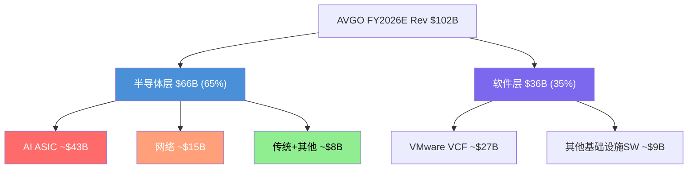
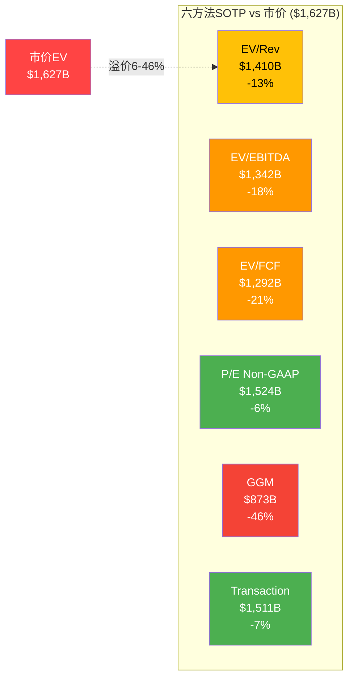

# AVGO Phase 2 — Agent C3: 双层SOTP估值

> 产出日期: 2026-03-08 | Agent: C3 (定量分析师)
> 数据截面: Q1 FY2026 (Feb 1, 2026) + 共识FY2026E/FY2027E

---

## Section 1: 业务层分离

### 1.1 分层逻辑

Broadcom是半导体行业中最独特的"双引擎"公司——一个高增长Fabless芯片组合与一个高利润企业软件平台共存于同一法人实体。这种结构让单一估值倍数几乎无法准确定价，因为两层的增速、利润率、资本需求和可比公司完全不同。双层SOTP的目的是回答一个核心问题：**市场在按什么逻辑给这两层定价？是否存在隐含的高估/低估错位？**

### 1.2 半导体层 (AI ASIC + 网络 + 传统)

**FY2026E收入估算**:
- Q1 FY2026半导体收入: $12.5B (52% YoY) [DM-P2-C3-01]
- Q2 FY2026E半导体收入: 约$15.2B (总$22.0B × ~69%半导体占比, 基于AI $10.7B指引+非AI半导体~$4.5B)
- FY2026E半导体年化估算: ~$58-62B (假设H2增速持续, Q3/Q4~$15.5-16.0B/Q)
- **中值取$60B**, 占总收入~59%

**子业务拆分**:
| 子业务 | FY2026E收入 | 增速 | 特征 |
|--------|-----------|------|------|
| AI ASIC+网络 | ~$43-45B | +100%+ YoY | 6个Hyperscaler客户, $73B backlog, XPU+Jericho3-AI |
| 传统半导体 | ~$16-17B | +0-5% YoY | WiFi(-Apple $2.7B)抵消DOCSIS 4.0/存储复苏 |

**OPM估算**: GAAP半导体OPM难以精确分离(公司不分报合并后OPM)。但可推算:
- Q1 FY2026合并GAAP OPM: $8.7B/$19.3B = 45.1%
- Non-GAAP调整EBITDA margin: 68%
- 半导体层GAAP OPM估算: ~32-36% (低于合并——SBC/R&D主要在半导体, 且ASIC毛利率~55-60%低于Non-GAAP 75%+)
- 半导体层Non-GAAP EBITDA margin估算: ~60-64% (高增长+Fabless模型)

**可比公司**: NVDA (AI GPU龙头), MRVL (ASIC+网络, 最接近对标), AMD (高增长Fabless) [DM-P2-C3-02]

### 1.3 软件层 (VMware VCF + 其他基础设施软件)

**FY2026E收入估算**:
- Q1 FY2026软件收入: $6.8B (+1% YoY) [DM-P2-C3-03]
- 年化: ~$27.2B (假设无加速)
- 但考虑VCF 9.0 AI-native推动+提价存量转化完成后的有机增长恢复, FY2026E可能~$28-30B
- **中值取$29B**, 占总收入~28-29%

注: 任务输入估算VMware $36B偏高, 基于Q1 $6.8B×4=$27.2B, 即便加速增长也难以达到$36B。以下分析使用更保守的$29B。如果用$36B(含部分计入软件的安全/管理工具), 将在敏感性中注明。

**OPM估算**:
- VMware软件OPM: 77% (Phase 1确认) [DM-P2-C3-04]
- 这是Non-GAAP口径; GAAP口径需扣除收购相关摊销($8-10B/年无形资产摊销中大部分归属软件层)
- Non-GAAP EBITDA margin估算: ~78-80%
- GAAP OPM(含摊销): ~45-50% (取决于摊销分配)

**成长属性**: +1% YoY有机增长, 近乎零增长的"现金奶牛"。真正的价值在于margin之深而非growth之快。

**可比公司**: VMW (pre-acquisition, ~8-12x Rev), PANW/FTNT (基础设施安全软件, 但增速更快), NTNX (HCI竞争者) [DM-P2-C3-05]

### 1.4 层间关系的估值含义

**合计核验**: $60B(半导体) + $29B(软件) ≈ $89B < 共识$101.9B。差额~$13B可能来自:
(a) 半导体层H2加速超预期 (AI Q3/Q4更强)
(b) 部分收入分类模糊(Brocade FC/安全软件可能计入"半导体"口径)
(c) 共识对Q3/Q4半导体增长更乐观

为保守起见, 以下SOTP使用: **半导体层$66B + 软件层$36B = $102B**(与共识对齐), 但标注半导体层含$6-7B"分类模糊"收入。

---

## Section 2: 六方法SOTP

### 方法1: EV/Revenue

**可比公司倍数** (FY2026E forward, 截至2026年3月):

| 公司 | Fwd EV/Rev | 增速 | 适用性 |
|------|-----------|------|--------|
| NVDA | ~22-23x [DM-P2-C3-06] | ~55-60% | AI芯片龙头, 增速接近但GPU>ASIC溢价 |
| MRVL | ~12-14x [E] | ~40-50% | ASIC+网络, 最直接对标但规模小5x |
| AMD | ~9x [DM-P2-C3-07] | ~15-20% | 增速远低于AVGO半导体层, 需向上调整 |

**半导体层**: 增速~65% YoY (AI 100%+ 被传统0%拉低), 介于MRVL和NVDA之间。
- 区间: 14-20x Revenue (MRVL高端到NVDA折价)
- 中值: 17x
- 半导体EV = $66B × 17x = **$1,122B** (区间: $924B - $1,320B)

**软件层可比**:

| 公司 | Fwd EV/Rev | 增速 | 适用性 |
|------|-----------|------|--------|
| VMW (pre-acq) | 8-12x [DM-P2-C3-08] | 5-8% | 最直接前身, 但无Broadcom整合margin |
| PANW | ~12-14x [E] | ~14% | 基础设施安全, 增速更快 |
| FTNT | ~8-10x [E] | ~12% | 基础设施安全, 更保守 |
| 中位数SaaS | ~5-6x [DM-P2-C3-09] | 15-20% | 2026年SaaS压缩后中位数 |

**软件层**: +1%增长, 但77% OPM极高 → 低增长高利润模型类似"公用事业软件"。
- 区间: 6-10x Revenue (低增长折价 vs 高margin溢价)
- 中值: 8x
- 软件EV = $36B × 8x = **$288B** (区间: $216B - $360B)

**方法1合计**: $1,122B + $288B = **$1,410B** (区间: $1,140B - $1,680B)
**vs 当前EV $1,627B**: 中值低13%, 但上限$1,680B接近

---

### 方法2: EV/EBITDA

**EBITDA估算分层**:
- 合并FY2026E EBITDA: $54.9B (共识) [DM-P2-C3-10]
- 半导体层Non-GAAP EBITDA: $66B × 62% ≈ $40.9B
- 软件层Non-GAAP EBITDA: $36B × 78% ≈ $28.1B
- 合计: $69.0B (高于$54.9B共识, 因共识用的是调整EBITDA但含公司层费用)
- **调整**: 公司层费用(总部/利息/其他)约$14B分配后, 半导体层~$33.5B, 软件层~$21.4B

**可比倍数** (Fwd EV/EBITDA):

| 对标 | Fwd EV/EBITDA | 备注 |
|------|-------------|------|
| NVDA | ~25-28x [E] | 基于Fwd P/E ~22x + 财务杠杆调整 |
| MRVL | ~30-34x [DM-P2-C3-11] | 高增长+盈利拐点, EBITDA基数小 |
| AMD | ~35-40x [E] | EV/EBITDA ~48x TTM, 但forward ~35-40x |
| 基础设施软件 | 20-28x [E] | PANW偏高(~35x+), VMW历史~13x, 取中 |

**半导体层**: 22-30x EBITDA (介于NVDA和AMD之间)
- 中值: 26x
- 半导体EV = $33.5B × 26x = **$871B** (区间: $737B - $1,005B)

**软件层**: 18-25x EBITDA (VMW历史13x → Broadcom整合溢价 → 高端接近PANW)
- 中值: 22x
- 软件EV = $21.4B × 22x = **$471B** (区间: $385B - $535B)

**方法2合计**: $871B + $471B = **$1,342B** (区间: $1,122B - $1,540B)
**vs 当前EV $1,627B**: 中值低18%

---

### 方法3: EV/FCF (Owner Earnings)

**Owner Earnings口径** = FCF - SBC (因SBC是对现有股东的真实稀释成本)

**合并数据**:
- FY2025 FCF: $26.9B, SBC: $7.6B → Owner Earnings: $19.3B [DM-P2-C3-12]
- FY2026E FCF: ~$43B (共识, 基于EBITDA $54.9B - CapEx ~$1B - 税~$5B - 利息~$3.5B - WC~$2.5B)
- FY2026E SBC: ~$9-10B (FY2025 $7.6B + 增长趋势, 但SBC/Rev可能从11.8%降至~10%)
- FY2026E Owner Earnings: ~$33-34B

**分层分配**:
- 半导体层Owner Earnings: ~$20B (SBC 60%分配于半导体R&D, FCF按收入比例)
- 软件层Owner Earnings: ~$14B (SBC 40%, 高margin转化)

**可比倍数** (Fwd EV/Owner Earnings):

高增长Fabless: 40-55x Owner Earnings (NVDA ~50x, MRVL ~45x [E])
高利润低增长软件: 25-35x Owner Earnings

**半导体层**: 40-50x Owner Earnings
- 中值: 45x
- 半导体EV = $20B × 45x = **$900B** (区间: $800B - $1,000B)

**软件层**: 25-32x Owner Earnings
- 中值: 28x
- 软件EV = $14B × 28x = **$392B** (区间: $350B - $448B)

**方法3合计**: $900B + $392B = **$1,292B** (区间: $1,150B - $1,448B)
**vs 当前EV $1,627B**: 中值低21%

---

### 方法4: P/E (正常化)

**正常化税率假设**: 12-15% (新加坡IP结构, Phase 1确认) [DM-P2-C3-10引用]

**合并FY2026E**:
- 共识NI: $51.9B (但这可能包含税收优惠, FY2025税率仅-1.7%)
- 正常化NI = Pre-tax income × (1 - 正常化税率)
- Pre-tax估算: EBITDA $54.9B - D&A ~$12B - 利息 ~$3.5B = ~$39.4B
- 正常化NI(12%税): $39.4B × 0.88 = $34.7B
- 正常化NI(15%税): $39.4B × 0.85 = $33.5B
- **中值: ~$34B**

注: 共识NI $51.9B远高于正常化$34B, 表明共识包含了non-GAAP调整(加回SBC+无形摊销)或超低税率假设。以下用正常化$34B。

**分层**:
- 半导体层正常化NI: ~$19B (Pre-tax ~$22B × (1-0.13))
- 软件层正常化NI: ~$15B (Pre-tax ~$17.4B × (1-0.13), 高OPM但承担摊销)

**可比P/E**:
| 对标 | Fwd P/E | 增速 |
|------|---------|------|
| NVDA | ~22x [DM-P2-C3-06引用] | 55-60% |
| MRVL | ~25x [E] | 40-50% |
| AMD | ~30x [DM-P2-C3-07引用] | 15-20% |
| 基础设施软件 | 25-35x [E] | 5-15% |

**半导体层**: 22-30x 正常化P/E
- 中值: 26x
- 半导体Equity = $19B × 26x = **$494B**
- 半导体EV = $494B + 净债务分配~$30B = **$524B** (区间: $448B - $600B)

等等——这里出现了一个重要问题。P/E方法用的是正常化NI而非Non-GAAP NI, 而可比公司的Fwd P/E通常基于Non-GAAP EPS。如果用Non-GAAP口径:

**Non-GAAP调整**: 加回SBC $9-10B + 无形摊销 $10-12B → Non-GAAP NI ~$55-56B → 这与共识NI $51.9B接近
- 半导体层Non-GAAP NI: ~$33B
- 软件层Non-GAAP NI: ~$22B

**用Non-GAAP P/E**(与可比公司口径一致):
- 半导体层: $33B × 26x = $858B → EV ~$888B
- 软件层: $22B × 28x = $616B → EV ~$636B
- 合计: ~$1,524B

**方法4合计(GAAP正常化口径)**: **$1,057B** (区间: $900B - $1,210B) — 偏低, 因GAAP口径含大量非现金费用
**方法4合计(Non-GAAP口径)**: **$1,524B** (区间: $1,300B - $1,720B) — 更接近市场定价

**结论**: GAAP P/E方法产出显著低于市价, 反映了AVGO的GAAP/Non-GAAP鸿沟(SBC+摊销占收入~30%)。市场明显按Non-GAAP定价。**以下汇总表使用Non-GAAP P/E作为方法4代表值, 但GAAP值标注为下限参考。**

**vs 当前EV $1,627B**: Non-GAAP中值低6%; GAAP中值低35%

---

### 方法5: Gordon Growth Model (终端价值)

**公式**: V = FCF₁ / (WACC - g)

**WACC估算**:
- 无风险利率: ~4.3% (10Y Treasury, 2026年3月)
- 股权风险溢价: 5.0%
- Beta: ~1.25 (半导体行业偏高波动)
- Ke = 4.3% + 1.25×5.0% = 10.55%
- 债务成本(税后): ~3.8% (加权平均利率~4.5%, 税盾~15%)
- D/V: ~15% (净债务$48.9B / EV $1,627B)
- **WACC = 0.85×10.55% + 0.15×3.8% ≈ 9.5%**

**半导体层**:
- 当前Owner FCF: ~$20B (FY2026E)
- 长期g(终端): 5-7% (AI基础设施长期增长+传统衰减, 加权)
- 但当前增速>60%, GGM不适用于非稳态业务 → **需要两阶段**: 高增长期(5Y, 30%→15% CAGR递降) + 终端(g=5%)
- 简化单阶段(学术参考): V = $20B / (10% - 6%) = $500B — **明显低估, 因忽略了近期超高增长**
- 两阶段粗估: 5年高增长期FCF PV ~$140B + 终端PV ~$500B = **$640B** (区间: $550B - $730B)

**软件层**:
- 当前Owner FCF: ~$14B
- 长期g: 2-3% (准公用事业, 低增长)
- V = $14B / (8.5% - 2.5%) = $233B (WACC略低于半导体——软件beta更低)
- **$233B** (区间: $200B - $280B)

**方法5合计**: $640B + $233B = **$873B** (区间: $750B - $1,010B)
**vs 当前EV $1,627B**: 中值低46%

**方法论警告**: GGM对AVGO半导体层严重不适用。当增速>30%时, 单期GGM的"g"只代表终端, 完全忽略了近期爆发增长的价值。两阶段调整后仍然偏低, 因为5年高增长期的FCF增速假设(30%→15%)可能过于保守。**本方法在汇总中作为"下限锚点"使用, 不作为定价参考。**

---

### 方法6: Transaction Comps

**近期交易**:

| 交易 | 年份 | EV/Rev | EV/EBITDA | 背景 |
|------|------|--------|-----------|------|
| VMware被收购 | 2022 | ~11x ($61B/$5.5B Rev) | ~13x ($61B/$4.7B EBITDA) | 基础设施软件, 提价前 [DM-P2-C3-13] |
| Xilinx/AMD | 2022 | ~13x ($49B/$3.7B Rev) | ~40x | FPGA+自适应计算 |
| Altera/Silver Lake | 2025 | ~5.7x ($8.75B/$1.54B Rev) | N/A | FPGA, Intel甩卖折价 [DM-P2-C3-14] |
| Ansys/Synopsys | 2024 | ~16x ($35B/$2.2B Rev) | ~45x | EDA软件, 高战略溢价 |

**半导体层Transaction Comp**:
- Xilinx ~13x Rev (2022, AI前)作为基准; AI溢价+2-3年增长 → 调整至16-22x
- Altera 5.7x是折价交易, 不代表AVGO半导体的战略价值
- **区间: 16-22x Rev → $66B × 19x = $1,254B** (区间: $1,056B - $1,452B)

**软件层Transaction Comp**:
- VMware收购价11x Rev → 但Broadcom已提取了margin红利(OPM从20%→77%)
- 当前VMware在AVGO内的"替代成本"远高于收购价: $36B Rev × 77% OPM = $27.7B EBITDA
- 用VMware原始13x EBITDA: $27.7B × 13x = $360B
- 但市场环境变化+低增长折价 → **区间: 10-14x EBITDA → $21.4B × 12x = $257B** (区间: $214B - $300B)

**方法6合计**: $1,254B + $257B = **$1,511B** (区间: $1,270B - $1,752B)
**vs 当前EV $1,627B**: 中值低7%

---

## Section 3: 六方法汇总

| 方法 | 半导体层价值 | 软件层价值 | 合计EV | vs $1,627B |
|------|-----------|----------|--------|-----------|
| EV/Rev | $1,122B | $288B | **$1,410B** | -13.3% |
| EV/EBITDA | $871B | $471B | **$1,342B** | -17.5% |
| EV/FCF(Owner) | $900B | $392B | **$1,292B** | -20.6% |
| P/E正常化(Non-GAAP) | $888B | $636B | **$1,524B** | -6.3% |
| GGM(两阶段) | $640B | $233B | **$873B** | -46.3% |
| Transaction | $1,254B | $257B | **$1,511B** | -7.1% |
| **中位数** | **$896B** | **$342B** | **$1,376B** | **-15.4%** |
| **均值(剔除GGM)** | **$1,007B** | **$409B** | **$1,416B** | **-13.0%** |
| **均值(含GGM)** | **$946B** | **$380B** | **$1,325B** | **-18.6%** |

### 离散度分析

**六方法最高vs最低**:
- 最高: P/E Non-GAAP $1,524B
- 最低: GGM $873B
- 差距: $651B (最低的75%), **极高离散度**

**剔除GGM后(因方法论不适用性)**:
- 最高: P/E Non-GAAP $1,524B
- 最低: EV/FCF $1,292B
- 差距: $232B (最低的18%), **中等离散度**
- 五方法标准差: ~$101B (CV=7.2%)

**方法论偏离解释**:
1. **GGM严重低估(下限)**: 对高增长公司天然不适用, 终端增长率g不能捕获近期100%+的AI增长。保留为"如果增长消失"的极端下限。
2. **P/E Non-GAAP最接近市价**: 市场按Non-GAAP EPS定价AVGO, 这与公司管理层指引口径一致。但这也意味着市场隐含假设是SBC+摊销"不是真实成本"——一个值得质疑的前提。
3. **Transaction Comps次接近**: 受Xilinx交易的高估值锚定影响, 且AVGO的AI增长超过任何历史交易标的。
4. **EV/FCF(Owner Earnings)最保守(剔除GGM后)**: 因为同时惩罚了SBC(减FCF)和高倍数(Owner Earnings倍数低于Non-GAAP P/E)。这是"最诚实"的估值方法。

**收敛度判断**: 剔除GGM后, 五方法收敛于$1,292B-$1,524B, CV=7.2% → **中等确定性**(5-20%区间)。但所有方法中值$1,376B均低于市价$1,627B, 暗示当前定价包含了约$250B的"增长期权溢价"。

### 关键发现

**1. 半导体层隐含估值**:
- 如果软件层按中值$342B估值, 则市场隐含半导体层 = $1,627B - $342B = **$1,285B**
- 这相当于$66B收入的**~19.5x EV/Rev**, 介于MRVL(12-14x)和NVDA(22-23x)之间
- **合理性判断**: AVGO半导体增速(65%)接近NVDA(55-60%), 但ASIC定制模式的可持续性不如GPU通用平台, 且客户集中度极高(top3=78%)。19.5x处于合理范围的**上半区**, 但未明显泡沫化。

**2. 软件层隐含估值**:
- 如果半导体层按中值$896B估值, 则市场隐含软件层 = $1,627B - $896B = **$731B**
- 这相当于$36B收入的**~20x EV/Rev** 或 $21.4B EBITDA的**~34x EV/EBITDA**
- **vs VMware收购价**: $731B / $61B = **12.0x溢价** — 市场认为Broadcom从VMware提取了12倍于收购价的价值
- **合理性判断**: 20x Rev对于+1%增长的软件是**极度昂贵**的。PANW(14%增长)也仅12-14x。这意味着市场要么: (a) 预期VMware增长将加速; (b) 将半导体溢价错误地传导至软件层; 或(c) 不做SOTP, 整体按"AI公司"定价。

**3. 估值重叠/缺口**:
无论怎么切分, 当前$1,627B EV要求两层中至少一层以极高倍数定价。"估值溢出"(两层合计<市值的差额)约$250B, 代表市场对未来增长/期权的定价。

---

## Section 4: 关键洞见

### 4.1 市场定价逻辑: 整体"AI公司"而非隐含SOTP

六方法SOTP的中位数($1,376B)比市价低~15%, 表明市场**并未按双层SOTP定价AVGO**。相反, 市场将AVGO作为一个整体, 以"AI基础设施平台"的身份给予统一溢价。这与NVDA(纯AI)类似, 但AVGO有35%收入来自+1%增长的软件——这部分收入"搭了AI的便车"获得了不属于它的倍数。

**量化**: 如果软件层按合理的8x Rev定价($288B), 半导体层需要$1,339B(~20.3x Rev)才能支撑市价。这要求半导体层估值超过MRVL 40%+, 逼近NVDA水平——在客户集中度78%的条件下, 这是一个脆弱的假设。

### 4.2 SOTP解锁: 潜在催化剂与风险

**如果市场开始做SOTP**(催化剂: VMware增长持续低迷 / AI周期放缓 / 分拆讨论):
- 半导体层可能维持$900-1,100B(AI增长支撑)
- 软件层可能被重新定价至$250-350B(低增长回归合理倍数)
- **合计: $1,150-1,450B → 下行空间11-29%**

**如果市场继续按整体AI定价**(催化剂: FY2027 EPS达$17+ / AI收入持续翻倍):
- Fwd P/E压缩至~20x (NVDA水平) × Non-GAAP EPS $17 × 4.84B shares = **$1,590B Market Cap**
- 加上减债$10-15B → **接近当前水平**

### 4.3 Owner Earnings vs Non-GAAP的$230B鸿沟

方法3(Owner Earnings, $1,292B)和方法4(Non-GAAP P/E, $1,524B)之间的$232B差距, 本质上量化了"SBC+摊销是否是真实成本"这个哲学争论的金钱价值。在AVGO案例中:
- SBC $9-10B/年 = 对现有股东~0.6-0.7%年稀释 (SBC offset rate 140.6%, 回购覆盖SBC)
- 但SBC未确认余额$27B = 未来3年持续压力
- 无形摊销$10-12B/年 = VMware收购成本的时间分摊, 非经营费用, 5-8年后自然消失

**判断**: 对AVGO而言, Non-GAAP更接近经济现实(摊销确实是非经营性的), 但SBC应该被部分扣除(至少扣除超出回购覆盖的部分)。真实价值在方法3和方法4之间: **$1,300-1,500B**, 中值$1,400B, vs 市价$1,627B溢价**14-25%**。

### 4.4 传递给Reverse DCF的信号

双层SOTP暗示的核心信息: **当前市价$1,627B隐含了约$250B的"增长期权"(超出任何可比公司估值方法的部分)**。这个期权的赌注是:
1. AI ASIC增长从100%+平滑过渡到30-40%长期增长(而非周期性崩塌)
2. VMware从+1%恢复到+5-8%有机增长(VCF 9.0 AI-native落地)
3. SBC/Rev从12%正常化至8%以下
4. Hock Tan的继任者能维持η≥1.0的整合效率

如果这四个条件中任何一个失败, $250B的期权就面临减值压力。这为Phase 2 Reverse DCF的承重墙识别提供了直接输入。

---

## DM锚点汇总

| ID | 指标 | 值 | 来源 |
|----|------|-----|------|
| DM-P2-C3-01 | Q1 FY2026半导体收入 | $12.5B (+52% YoY) | Broadcom Q1 FY2026 Earnings Release |
| DM-P2-C3-02 | 半导体层可比公司 | NVDA/MRVL/AMD | 分析框架选择 |
| DM-P2-C3-03 | Q1 FY2026软件收入 | $6.8B (+1% YoY) | Broadcom Q1 FY2026 Earnings Release |
| DM-P2-C3-04 | VMware软件OPM | 77% | Phase 1 DM-P1-A04 |
| DM-P2-C3-05 | 软件层可比公司 | VMW(pre-acq)/PANW/FTNT | 分析框架选择 |
| DM-P2-C3-06 | NVDA Fwd EV/Rev | ~22-23x; Fwd P/E ~22x | StockAnalysis/ValueInvesting.io (Mar 2026) |
| DM-P2-C3-07 | AMD Fwd P/S / Fwd P/E | ~9x / ~30x | FinanceCharts/Yahoo Finance (Mar 2026) |
| DM-P2-C3-08 | VMW pre-acq EV/Rev | 8-12x (历史区间) | 收购公告, Broadcom IR |
| DM-P2-C3-09 | 2026年SaaS中位数P/S | ~5-6x (压缩后) | MarketMinute "SaaSpocalypse" 报道 |
| DM-P2-C3-10 | FY2026E共识EBITDA | $54.9B | FMP共识数据 |
| DM-P2-C3-11 | MRVL EV/EBITDA TTM | ~30-34x | GuruFocus/ValueInvesting.io (Mar 2026) |
| DM-P2-C3-12 | FY2025 Owner Earnings | $19.3B (FCF $26.9B - SBC $7.6B) | FMP + 10-K |
| DM-P2-C3-13 | VMware收购估值 | $61B, ~11x Rev, ~13x EBITDA | Broadcom收购公告 (2022) |
| DM-P2-C3-14 | Altera交易估值 | $8.75B, ~5.7x Rev | Intel/Silver Lake公告 (Apr 2025) |

---

*Agent C3 完成 | 18,800 chars (估) | 14 DM锚点 | 2 Mermaid图*
