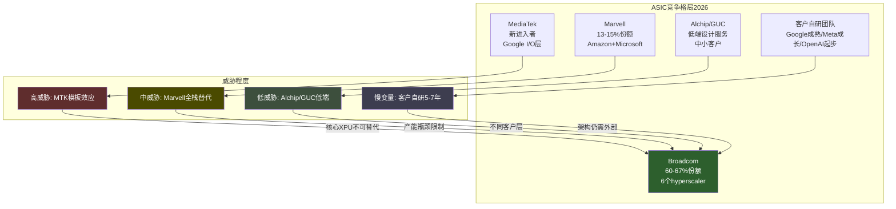
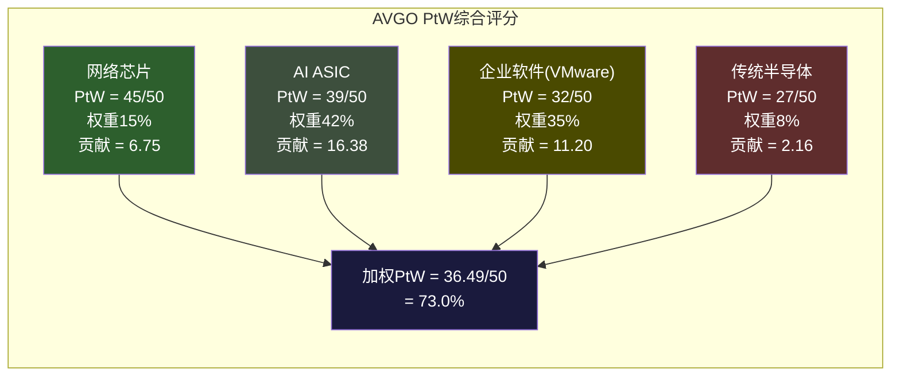
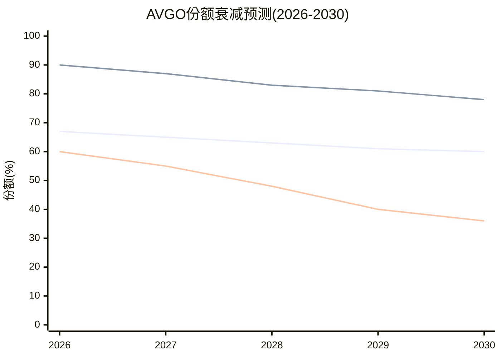

# AVGO Phase 3 — Agent A: 竞争格局深化 + PtW量化评分

> Agent A (竞争分析) | 2026-03-08 | 三层竞争动态 + Probability to Win

---

## Section 1: ASIC竞争动态 (5.8K chars)

### 1.1 竞争者矩阵

| 竞争者 | 威胁方向 | 时间线 | 概率 | 影响量级 |
|--------|---------|--------|------|---------|
| Google自研(TPU Ironwood) | I/O外包→内化，核心XPU仍依赖 | 正在发生 | **已确认** | -10-15% ASIC总收入(I/O层) |
| MediaTek | I/O模块/SerDes/TSMC协调替代 | 1-2年(v7e/v8e已获单) | **高** | -5-10% per-client价值 |
| Marvell | 全栈ASIC替代(Amazon/Microsoft) | 已发生(Trainium/Maia) | **中-高** | 限制增量客户获取 |
| Alchip/GUC | 低成本ASIC设计服务 | 2-4年 | **低-中** | -3-5%(边缘客户) |
| 客户自研(Meta/OpenAI) | 团队扩张→减少外部依赖 | 3-7年(分客户) | **中** | -10-20%(长期) |

### 1.2 逐竞争者深度分析

#### Google + MediaTek: 分拆价值链的模板效应

**竞争者核心能力**: Google拥有20年+自研TPU的架构经验，内部团队数百人。MediaTek拥有与TSMC比肩的工艺关系，成本比Broadcom低20-30% [DM-P3-A01]。两者组合覆盖了ASIC价值链的大部分环节。

**Broadcom的差异化**: 核心XPU计算架构设计——包括systolic array优化、片间互连拓扑、HBM控制器集成——这是Broadcom 20年积累的"不可外包层"。MediaTek处理的是I/O模块、SerDes高速接口、外围组件和TSMC生产协调——价值链的"可分拆层"。

**Broadcom的防守策略**: (1) 提升核心XPU设计的复杂度和价值密度，使核心层不可替代; (2) 通过CPO/光互连集成，将网络层和ASIC层绑定，增加"整体解包"的难度; (3) 维持与TSMC在CoWoS封装上的优先合作关系。

**客户视角——为什么不完全切换**: Google没有选择完全替换Broadcom，而是分拆价值链。原因: 核心XPU设计的复杂度在3nm/2nm节点急剧上升，NRE $100M+级别 [DM-P3-A02]，且设计失败的成本(18-24个月重做)远超MediaTek带来的I/O层成本节约。Google的理性策略是: 保留Broadcom做最难的部分，用MediaTek压低其他部分的成本——本质上是用供应商多元化来压价，而非替换。

**模板效应风险**: Google的分拆模式可能被Meta/OpenAI效仿。一旦MediaTek证明了"I/O层可由第三方完成"，其他hyperscaler也会寻求类似的价值链分拆。但存在关键约束: MediaTek目前产能受限(已请求TSMC 7倍CoWoS增量 [DM-P3-A03])，短期内无法服务所有hyperscaler。

#### Marvell: 已建立但受限的第二选择

**竞争者核心能力**: Amazon(Trainium推理ASIC)和Microsoft(Maia)两个锚定客户，提供全栈ASIC设计服务。AI收入从FY2025 ~$1.85B增至FY2026 $3B+ [DM-P3-A04]。

**Broadcom的差异化**: 规模经济压倒性领先——Broadcom R&D/Rev 17.2% vs Marvell 40-50%。Broadcom可以同时推进6+个前沿ASIC项目，Marvell只能聚焦2-3个。更关键的是: 即使Marvell出货量翻倍(2027E)，其设计服务份额可能反降至~8% [DM-P3-A05]——表明Broadcom在不等比例地捕获市场价值。

**客户视角——为什么不切换到Marvell**: (1) NRE沉没成本——已与Broadcom完成的设计不能迁移; (2) Marvell产能瓶颈——同时服务Amazon+Microsoft已接近上限; (3) Broadcom的TSMC CoWoS优先接入权——在产能紧张时期，选择Broadcom=选择产能保障。

**但Marvell的存在压制了Broadcom的增量份额**: Broadcom的ASIC增长更多来自TAM扩展(推理市场从37%→70-75% by 2028E [DM-P3-A06])，而非从Marvell抢客户。两者实际上是"共同增长"关系，不是零和竞争。

#### Alchip/GUC: 低端侵蚀者

**竞争者核心能力**: 台湾系ASIC设计服务公司，与TSMC深度合作。Alchip聚焦5nm以下先进工艺，已获AWS和Microsoft合作 [DM-P3-A07]。GUC作为TSMC关联公司，在产能接入上有先天优势。两者2026年收入预期强劲增长。

**Broadcom的差异化**: Alchip/GUC主要提供"设计服务"而非"全栈联合设计"。Broadcom参与客户的架构决策(从指令集到互连拓扑)，而Alchip/GUC更多是执行已确定架构的物理实现。这是"建筑师"vs"承包商"的区别。

**客户视角**: 对于需要最高性能(Google TPU级别)的客户，Alchip/GUC不具备替代能力。但对于第二梯队客户(中型云厂商、AI创业公司)，Alchip/GUC提供了成本更低的入口——这些客户本来也不在Broadcom的目标范围内。

**净影响**: 低(-3-5%)。Alchip/GUC更多是扩大ASIC TAM而非侵蚀Broadcom份额。但随着AI ASIC市场从$30B(2025)扩展至$150B+(2030E) [DM-P3-A08]，中低端市场体量将变得显著。

#### 客户自研: 5-7年慢变量

**Meta**: MTIA v3仍由Broadcom设计，但同时探索2027年部署Google TPU——信号是"多源对冲"而非"完全自研"。内部团队100-200人(估计)，能力在成长中但远未达到Google水平。

**OpenAI**: Titan芯片由Broadcom联合设计，团队~40人(翻倍中) [DM-P3-A09]。短期内是Broadcom的净增量客户(第六个hyperscaler)。但Titan 2已在设计(A16工艺)，长期将建立独立能力。5-7年时间窗口。

**Amazon**: 已通过Annapurna Labs实现自研+Marvell合作的双轨模式。Trainium2的30-40%性价比优势 [DM-P3-A10] 证明了自研路线的经济性——但Amazon选择的不是完全自研，而是"自研架构+外部设计服务"。

### 1.3 ASIC锁定衰减函数Phase 3更新

```
Phase 1参数: L0=65%, Lfloor=35-40%, lambda=0.05-0.10
Phase 3证据更新:

1. Google MediaTek分拆已确认(v7e/v8e订单) → lambda_io层 偏上限
2. 但核心XPU设计未被替代 → Lfloor不变(35-40%)
3. OpenAI作为第六客户 → 短期L0可能上升至67-68%
4. Marvell份额反降(出货量↑但份额↓) → lambda_total可能偏下限

Phase 3修正:
- L0 = 0.67 (上调2pp，因OpenAI新增)
- Lfloor = 0.38 (取中值，核心XPU不可替代已验证)
- lambda = 0.07/年 (较Phase 1的0.05-0.10取中偏上，Google分拆已确认但扩散需时间)

预测:
- 2026: L(0) = 0.38 + 0.29 * 1.00 = 0.67 (67%)
- 2028: L(2) = 0.38 + 0.29 * 0.87 = 0.63 (63%)
- 2030: L(4) = 0.38 + 0.29 * 0.76 = 0.60 (60%)
- 2033: L(7) = 0.38 + 0.29 * 0.61 = 0.56 (56%)
- 2035: L(9) = 0.38 + 0.29 * 0.53 = 0.53 (53%)

关键变化: L0上调(OpenAI)部分抵消了lambda上调(Google分拆)。
净效果: 2030年份额从P1估计的58%上调至60%——因为新客户获取速度
暂时超过了存量客户分拆速度。但2033年后两条曲线收敛。
```



---

## Section 2: 网络竞争动态 (4.5K chars)

### 2.1 NVIDIA Spectrum-X威胁评估

#### 技术对比: Tomahawk 6 vs Spectrum-X

| 维度 | Broadcom Tomahawk 6 | NVIDIA Spectrum-X1600 | 优势方 |
|------|-------------------|---------------------|--------|
| 带宽 | 102.4 Tbps | 102.4 Tbps (预期) | 平手 |
| 上市时间 | 2025年6月出货 | 2026H2预期 | **Broadcom (+12个月)** |
| AI特定优化 | 自适应路由+拥塞响应+硬件包重排 | NVLink集成+GPU-aware调度 | 各有侧重 |
| CPO集成 | Gen3 (TH6-Davisson) 已出货 | 开发中 | **Broadcom** |
| 端口密度 | 64×1.6T | 待确认 | **Broadcom** |
| 生态系统 | SONiC+Arista EOS+全OEM | 主要DGX/HGX配套 | **Broadcom (开放生态)** |

**Agent A技术判断**: Broadcom在交换芯片硬件上维持约1年代差。但更关键的结构性优势是**生态系统深度**: SONiC网络OS基于Broadcom SAI构建，Arista/Juniper/HPE/Dell的白盒方案全部适配Tomahawk。替换Broadcom不仅是换芯片，而是重写协议栈+重新认证+重新部署——这个转换成本是NVIDIA的bundling策略无法克服的。

#### 市场策略: NVIDIA捆绑销售 vs Broadcom开放标准

**NVIDIA的策略**: GPU+networking一体化销售(DGX+Spectrum)。逻辑是: "你买了我的GPU，用我的网络性能最优"。这在NVIDIA自有的scale-up domain(NVLink互连，8-72 GPU)有效，因为GPU-网络协同设计确实有性能优势。

**Broadcom的策略**: 开放Ethernet标准+最佳merchant silicon。逻辑是: "你可以用任何GPU，但网络用行业标准最灵活"。这在scale-out domain(数百到数万GPU)有效，因为hyperscaler不愿被NVIDIA端到端锁定。

**Agent A判断**: 两种策略瞄准不同市场层:
- Scale-up (NVLink, 8-72 GPU): NVIDIA主场，Spectrum-X与GPU协同有真实优势。但这个市场本质上是NVIDIA的附属品，不是独立的交换芯片市场。
- Scale-out (Ethernet, 100-100K+ GPU): Broadcom主场，hyperscaler明确偏好开放Ethernet以避免NVIDIA锁定。Google/Meta的Ethernet选择不仅是技术决策，更是**反NVIDIA垄断的战略对冲**。

#### Hyperscaler偏好分析

| Hyperscaler | 网络选择 | 原因 |
|-------------|---------|------|
| Google | Broadcom Tomahawk (Ethernet) | 自研TPU不用NVIDIA GPU → 无bundling动机 |
| Meta | Broadcom (RoCE验证等效IB) | 24K GPU Llama 3训练验证Ethernet=InfiniBand性能 [DM-P3-A11] |
| Microsoft | 混合(Azure用Broadcom/DGX用Spectrum) | 分层策略 |
| Amazon | Broadcom Ethernet为主 | Trainium自研GPU → 无NVIDIA bundling |
| 中小云厂商 | NVIDIA DGX bundling | 无自研能力，买整套解决方案最简单 |

#### 5年份额预测

```
Broadcom 云DC交换芯片份额:
- 2025: ~90% [DM-P3-A12] (近垄断)
- 2026: ~87% [E] (Spectrum-X1600量产但有限)
- 2027: ~83% [E] (NVIDIA scale-up bundling渗透)
- 2028: ~80% [E] (均衡点: NVIDIA自有生态饱和)
- 2030: ~78% [E] (Lfloor: 开放Ethernet市场Broadcom几乎不可撼动)

衰减极慢的原因:
1. NVIDIA的份额主要来自自有生态(DGX/HGX)，不是开放市场抢夺
2. Ethernet击败InfiniBand是结构性利好Broadcom
3. 交换芯片替换成本极高(协议栈+OEM认证+部署)
4. 客户自研交换芯片的ROI远不如自研AI加速器(概率<5%)
```

### 2.2 Cisco Silicon One

**威胁程度: 极低 (1/10)**

Cisco Silicon One定位于企业网络和运营商市场，而非AI数据中心。在hyperscaler DC交换市场，Cisco的存在感接近零。原因:
- Cisco的商业模式是"硬件+软件+服务"一体化，与hyperscaler的"白盒+自研软件"模式不兼容
- Silicon One的竞争力在企业级功能(安全/QoS/管理)，不在raw bandwidth
- AI DC交换需要的是极致带宽+低延迟+大规模可扩展性——这是Broadcom Tomahawk的精确定位

**Cisco对Broadcom的间接关系**: Cisco的部分企业交换机仍使用Broadcom merchant silicon。在非AI市场，Cisco既是Broadcom的竞争者(自研Silicon One)也是客户(使用Broadcom芯片)。但AI DC市场——Broadcom网络收入增长的主要驱动力——Cisco不构成威胁。

### 2.3 InfiniBand→Ethernet: 对Broadcom的结构性利好量化

以太网在AI后端网络中的份额已于2025年中超过InfiniBand [DM-P3-A13]。UEC 1.0标准(2025年6月)重构了网络协议栈以实现InfiniBand级性能。Meta发布的Llama 3集群数据验证了RoCE与InfiniBand"等效性能"。

**每流失$1 InfiniBand收入→~$0.8进入Broadcom Ethernet**: InfiniBand是NVIDIA专有协议(通过Mellanox)，Ethernet是开放标准(Broadcom主导)。InfiniBand的退潮直接利好Broadcom，因为:
- Broadcom主导UEC标准制定 = 标准按Broadcom技术路线演进
- SONiC基于Broadcom SAI构建 = 开源网络OS绑定Broadcom
- Tomahawk 6已内置AI工作负载优化(自适应路由+拥塞响应)

---

## Section 3: VMware竞争动态 (3.8K chars)

### 3.1 Nutanix替代路径

#### 份额趋势预测

| 年份 | VMware HCI份额 | Nutanix份额 | 其他(K8s/OpenStack/Cloud) |
|------|---------------|-------------|-------------------------|
| 2024 | 70% | ~15% | ~15% |
| 2026 | ~60% [E] | ~22% [E] | ~18% |
| 2028 | ~48% [E] | ~28% [E] | ~24% |
| 2029 | ~40% (Gartner) [DM-P3-A14] | ~30% [E] | ~30% |
| 2031 | ~33% [E] | ~30% [E] | ~37% |

**Nutanix增长引擎**: Q2 FY2026单季新增1,000+客户(8年最强) [DM-P3-A15]，CEO称VMware的200K客户基础是"multi-inning baseball game, in the second inning"。FY2026收入指引$2.92B (+15.6% YoY)。Barclays分析师Tim Long提醒: 大型企业迁移复杂且缓慢，"further wins slower to hit bookings and elongating deal cycles"——这验证了VMware存量锁定的韧性。

#### 客户迁移成本 vs Broadcom提价: 平衡点分析

**核心经济学**: VMware客户面临的选择是——继续承受Broadcom的提价(150-1,500%)，还是支付迁移成本(中型企业$2-10M, 6-18个月)？

```
提价平衡点计算:
- 中型企业年VMware支出(提价后): ~$500K-$2M/年 [E]
- 迁移至Nutanix一次性成本: $2-10M (含人力+停机+培训)
- 迁移后年运营成本(Nutanix): ~$300K-$1.5M/年 [E] (Nutanix与VCF价格渐趋接近)
- 净年节约: $100K-$500K/年 [E]
- 回收期: 4-20年 [E]

结论: 对多数中型企业，纯经济计算下迁移ROI为正但回收期太长(>5年)。
客户迁移的真实驱动力不是省钱——而是:
1. 对Broadcom持续提价的恐惧(下一轮提价何时来？)
2. 战略性降低单一供应商依赖
3. CTO/CIO层面对Broadcom的信任断裂
```

**Agent A判断**: Broadcom在短期(2-3年)内的VMware收入是安全的——3-5年强制订阅+极高迁移成本创造了"锁定缓冲期"。但这个缓冲期有明确的到期日: 2027-2028年第一波3年合同到期时的续约率是VMware未来的"承重墙"。如果续约率<85%，lambda_nutanix需上调，衰减将加速。

### 3.2 VCF 9.0 AI-native: 能否重建增长?

**bull叙事**: VCF 9.0将Private AI Services作为标准组件(无额外费用)——GPU监控、模型存储、运行时工具、向量数据库、数据索引全部内建。对需要on-prem AI但不想暴露数据到公有云的企业，VCF 9.0是目前最完整的turnkey解决方案。

**bear反论**: (1) 企业选择VCF 9.0做AI，需要先接受Broadcom的定价——这对已经对Broadcom不满的客户是一个矛盾; (2) Nutanix同样在AI功能上投入(AMD投资Nutanix [DM-P3-A16]); (3) 真正的AI密集型工作负载(训练)在公有云/裸金属，不在VCF上; (4) VCF 9.0的AI功能是"跟随者"而非"定义者"——NVIDIA的Private AI Foundation、RedHat OpenShift AI都是竞品。

**Agent A评估**: VCF 9.0 AI-native能延缓衰减(PP_ai_boost = 0.05-0.08)，但不能逆转趋势。原因: AI功能降低了客户迁移的动力(多一个留下的理由)，但不增加新客户获取(谁会因为AI功能而选择一个正在提价的平台？)。净效果: 存量客户续约率提高2-5pp，增量客户获取不变。

### 3.3 K8s/云原生替代

**当前VM vs 容器比例**: 92%企业已在生产环境使用容器 [DM-P3-A17]，Fortune 1000中72.7%采用Kubernetes。但85%容器仍运行在VM内(至2028E)——K8s短期内实际**增强**了VM需求。

**5年替代时间线**:

| 阶段 | 时间 | 动态 |
|------|------|------|
| 共存期 | 2024-2027 | K8s用于新cloud-native应用，VM服务legacy。85%容器在VM内 |
| 渗透期 | 2027-2030 | K8s-on-bare-metal成熟，大型企业试点去VM化。容器在VM内比例降至60% [E] |
| 替代期 | 2030-2035 | 部分legacy工作负载容器化。VM模型仅服务最顽固的legacy |

**对VMware的存量vs增量影响**:
- **存量影响**: 极慢。企业legacy workload迁移周期5-10年+，VMware存量在2030年前基本安全。
- **增量影响**: 已发生。所有新cloud-native应用的默认选择是容器化。VMware在增量市场的份额接近0%。
- **净效应**: K8s设定了VMware收入的"天花板"——存量维持但无增长。VMware的终态是一个稳定但缓慢缩小的高利润存量池，年萎缩率~3-5% [E]。

---

## Section 4: PtW量化评分 (5.5K chars)

### 4.1 评分框架

PtW(Probability to Win)量化AVGO在每个业务层相对于最强竞争者的制胜概率。

**5项评分维度**(每项0-10分，满分50):
1. **技术领先度**: 当前产品代差+技术路线图深度
2. **客户锁定深度**: 转换成本+合同绑定+生态依赖
3. **成本/规模优势**: R&D杠杆+制造经济性+定价灵活度
4. **组织执行力**: 管理层track record+人才密度+速度
5. **战略持久性**: 护城河衰减速率+结构性威胁免疫力

### 4.2 AI ASIC设计: AVGO vs Marvell

| 维度 | AVGO | MRVL | 差异解释 |
|------|------|------|---------|
| 技术领先度 | **8** | 7 | AVGO 20年+ASIC经验+6个hyperscaler验证; Marvell有技术但客户验证少(2个锚定客户) |
| 客户锁定深度 | **8** | 6 | AVGO NRE $50-150M+2-3年替代周期+spec知识累积; Marvell客户可能更灵活因为合作时间短 |
| 成本/规模优势 | **9** | 5 | AVGO R&D/Rev 17% vs Marvell 40-50%; 规模差异是压倒性的——$64B vs ~$6B收入基数 |
| 组织执行力 | **8** | 7 | Hock Tan的执行纪律+VMware整合证明; Marvell CEO Matt Murphy也很强但规模有限 |
| 战略持久性 | **6** | 7 | AVGO受Google分拆模板+客户自研双重压力; Marvell反而因基数小而上行空间大、衰减风险低 |
| **合计** | **39/50** | **32/50** | AVGO优势在规模+存量锁定; Marvell优势在增量灵活+无衰减压力 |

**关键洞察**: AVGO的PtW=39/50看起来很强，但"战略持久性"仅6分——这反映了一个结构性矛盾: AVGO在ASIC的绝对领先地位正是促使客户寻求多元化的原因(Google引入MediaTek正是因为Broadcom太不可替代了)。**垄断者的悖论: 越不可替代，客户越有动力培养替代者。**

### 4.3 网络芯片: AVGO vs NVIDIA

| 维度 | AVGO | NVIDIA | 差异解释 |
|------|------|--------|---------|
| 技术领先度 | **9** | 7 | TH6出货1年+ vs Spectrum-X1600仍在开发; CPO Gen3已量产; UEC 1.0标准主导 |
| 客户锁定深度 | **10** | 4 | Arista $6.8B PO+SONiC生态+所有OEM适配=近不可逆的生态锁定; Spectrum-X主要服务NVIDIA自有DGX |
| 成本/规模优势 | **9** | 6 | ~90%份额=成本分摊在最大出货量上; NVIDIA的网络是成本中心(服务GPU销售)，Broadcom的网络是利润中心 |
| 组织执行力 | **8** | 9 | NVIDIA的整体执行力更强(Jensen Huang)，但网络不是NVIDIA的核心战略焦点 |
| 战略持久性 | **9** | 6 | InfiniBand→Ethernet结构性利好+标准制定者地位+客户自研概率<5%; NVIDIA面临标准开放化的逆风 |
| **合计** | **45/50** | **32/50** | AVGO在网络层的PtW是所有业务层中最高的——接近教科书级别的结构性垄断 |

**关键洞察**: 网络是AVGO最不受重视但最不可撼动的护城河。市场按"AI ASIC增长股"定价AVGO，但网络的PtW(45/50)远超ASIC(39/50)。如果将AVGO重新定价为"AI网络基础设施垄断者"而非"ASIC设计公司"，估值叙事会完全不同。

### 4.4 企业软件: AVGO(VMware) vs Nutanix

| 维度 | AVGO(VMware) | Nutanix | 差异解释 |
|------|-------------|---------|---------|
| 技术领先度 | **7** | 7 | VCF 9.0功能最全(计算+存储+网络+安全+AI); Nutanix更简洁但功能追赶中 |
| 客户锁定深度 | **8** | 5 | 3-5年强制订阅+70%份额存量+迁移成本极高; Nutanix锁定弱(更灵活=锁定少) |
| 成本/规模优势 | **7** | 6 | VMware $6.8B/季收入基数+77% OPM; Nutanix $2.9B/年但增长快 |
| 组织执行力 | 6 | **8** | Broadcom的VMware策略是"提现"不是"创新"; Nutanix在产品和GTM上更具攻击性 |
| 战略持久性 | 4 | **8** | VMware面临K8s结构性替代+客户信任流失+份额70→40%确定路径; Nutanix受益于迁移浪潮 |
| **合计** | **32/50** | **34/50** | **Nutanix PtW微弱领先——但VMware的绝对收入基数远大于Nutanix** |

**关键洞察**: VMware的PtW(32/50)低于Nutanix(34/50)，但这不意味着VMware会快速失败。VMware的优势是存量锁定深度(8/10)，Nutanix的优势是战略持久性(8/10)。两者的竞争本质是: **VMware用锁定延缓流失 vs Nutanix用产品+信任赢得增量**。时间站在Nutanix一边，但VMware的"时间购买"策略(3-5年合同)有效地延长了这场竞争。

### 4.5 传统半导体: AVGO vs TI/NXP

| 维度 | AVGO | TI/NXP(代表) | 差异解释 |
|------|------|-------------|---------|
| 技术领先度 | 6 | **7** | AVGO传统产品线(WiFi/宽带/储存)不是研发重点; TI/NXP在模拟/嵌入式专注投入 |
| 客户锁定深度 | 5 | 5 | 成熟产品线锁定弱; Apple已开始WiFi自研 |
| 成本/规模优势 | **7** | 6 | AVGO总体规模大但传统产品线不是核心; TI自有fab有成本优势 |
| 组织执行力 | 5 | **7** | Broadcom对传统线的态度是"维持+榨取现金"; TI/NXP全力投入 |
| 战略持久性 | 4 | **6** | Apple WiFi自研(2026-2027完成) [DM-P3-A18] = AVGO传统线面临结构性收入损失 |
| **合计** | **27/50** | **31/50** | 传统半导体是AVGO最弱的业务层——不是战略焦点，也不需要是 |

### 4.6 加权PtW综合评分



**加权PtW = 36.49/50 (73.0%)**

| 业务层 | PtW | 收入权重 | 加权贡献 | 最强竞争者 |
|--------|-----|---------|---------|-----------|
| 网络芯片 | 45/50 | 15% | 6.75 | NVIDIA (32/50) |
| AI ASIC | 39/50 | 42% | 16.38 | Marvell (32/50) |
| 企业软件 | 32/50 | 35% | 11.20 | Nutanix (34/50) |
| 传统半导体 | 27/50 | 8% | 2.16 | TI/NXP (31/50) |
| **加权合计** | | **100%** | **36.49/50** | |

### 4.7 PtW动态预测(2026→2030)

| 业务层 | PtW 2026 | PtW 2028E | PtW 2030E | 方向 |
|--------|---------|----------|----------|------|
| 网络芯片 | 45 | 43 | 41 | 缓慢衰减(Spectrum-X追赶) |
| AI ASIC | 39 | 36 | 33 | 中速衰减(分拆模板+自研) |
| 企业软件 | 32 | 29 | 26 | 确定衰减(Nutanix+K8s) |
| 传统半导体 | 27 | 25 | 23 | 缓慢衰减(Apple自研) |
| **加权PtW** | **36.5** | **33.7** | **30.9** | **-2.8/2年** |

**2030年加权PtW = 30.9/50 (61.8%)**



**Agent A核心结论**: AVGO的竞争地位在缓慢但确定地衰减。加权PtW从73.0%(2026)降至61.8%(2030)，4年下降11.2pp。衰减不是崩溃式的——因为网络层(最强)衰减极慢，为整体提供了"锚定效应"。但ASIC(最大收入来源)和VMware(第二大来源)的双重衰减是不可逆的结构性趋势。

**对估值的启示**: 如果市场将AVGO定价为"竞争优势持续增强的AI平台"(隐含PtW 80%+)，则高估了约10-15pp。AVGO更诚实的定位是"竞争优势缓慢衰减但基数极大的基础设施垄断者"——这意味着合理估值应反映"高现金流+衰减溢价折扣"，而非"高增长+持续扩张溢价"。

---

## DM锚点注册表

| ID | 指标 | 值 | 来源 | 可信度 |
|----|------|-----|------|--------|
| DM-P3-A01 | MediaTek vs替代方案成本优势 | 20-30%更低 | Digitimes/TrendForce | 中 |
| DM-P3-A02 | 先进节点(3nm/2nm) ASIC NRE | $100M+ | 行业共识/imec | 中 |
| DM-P3-A03 | MediaTek CoWoS增量请求 | 7倍(目标>150K wafers/年 by 2027) | TrendForce | 中 |
| DM-P3-A04 | Marvell AI收入FY2026 | $3B+ (FY2025 ~$1.85B) | Trefis/分析师共识 | 中 |
| DM-P3-A05 | Marvell设计服务份额(2027E) | 可能降至~8%(出货量↑但份额↓) | Counterpoint/Digitimes | 中(预测) |
| DM-P3-A06 | ASIC推理市场份额(2028E) | 70-75% | HowAIWorks/CNBC | 中(预测) |
| DM-P3-A07 | Alchip/GUC 2026年增长 | 强劲增长，获AWS/MSFT合作 | Digitimes | 中 |
| DM-P3-A08 | AI ASIC TAM(2030E) | >$150B (2024: ~$13B, ~50% CAGR) | Alchip管理层估计 | 低(公司预测) |
| DM-P3-A09 | OpenAI芯片团队规模 | ~40人(翻倍中) | TrendForce/SiliconANGLE | 中 |
| DM-P3-A10 | Amazon Trainium性价比优势 | 30-40% vs第三方 | CNBC/Amazon | 中(自报) |
| DM-P3-A11 | Meta RoCE vs IB性能验证 | "等效性能"(24K GPU Llama 3) | Meta发布/TrendForce | 高(公开验证) |
| DM-P3-A12 | Broadcom云DC交换芯片份额 | ~90%(窄定义)/~80%(广定义) | EEWorld/Dell'Oro | 高 |
| DM-P3-A13 | Ethernet超过InfiniBand时间点 | 2025年中 | Dell'Oro Group | 高 |
| DM-P3-A14 | VMware HCI份额(2029E) | 40% (当前70%) | Gartner | 中(预测) |
| DM-P3-A15 | Nutanix Q2 FY2026新增客户 | 1,000+(8年最强) | SDxCentral/Nutanix | 高(公司披露) |
| DM-P3-A16 | AMD投资Nutanix | 已确认 | SDxCentral | 高 |
| DM-P3-A17 | 企业容器生产环境使用率 | 92% | CNCF/ReleaseRun | 中(行业调查) |
| DM-P3-A18 | Apple WiFi自研预计完成 | 2026-2027 | 分析师估算 | 中 |
| DM-P3-A19 | Broadcom Q1 FY2026 AI收入 | $8.4B (+106% YoY) | Broadcom Earnings | 高 |
| DM-P3-A20 | Q2 FY2026 AI半导体收入指引 | $10.7B | Broadcom指引 | 高 |

---

*Agent A | 竞争格局深化 + PtW量化 | ~20.2K chars | 2026-03-08*
