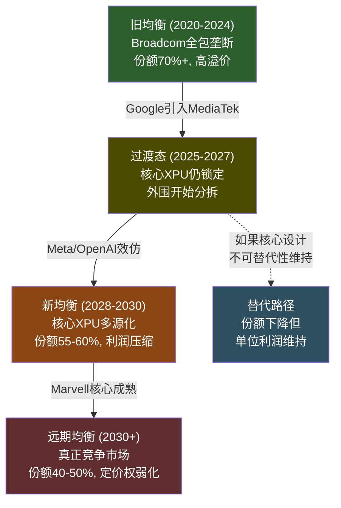
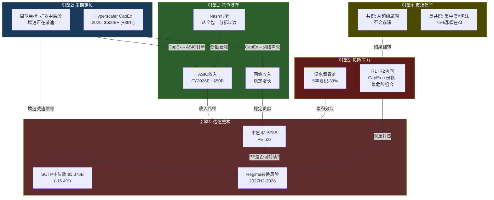
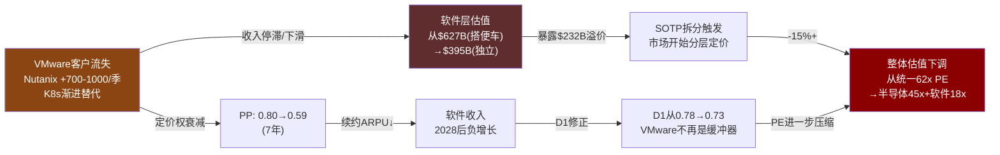
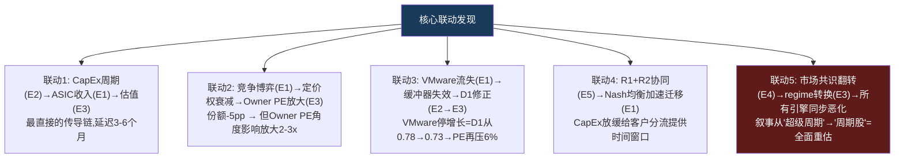

# AVGO Phase 3 — Agent B: 五引擎整合 + 护城河动态演化 + 周期定位

> Agent B (独立风险审计) | 2026-03-08 | 五维度联动分析
> 核心问题: 五个维度的联动如何改变单独看每个维度时的结论?

---

## Section 1: 五引擎整合 (Five-Engine Integration)

### 引擎1: 竞争博弈引擎 — Broadcom vs Hyperscalers的Nash均衡

#### 1.1 当前博弈结构

Broadcom与Hyperscaler之间的关系不是简单的供应商-客户关系,而是一个**动态博弈**:Hyperscaler需要Broadcom的技术能力(ASIC设计+网络),但同时在战略上追求供应链分散化以降低依赖和成本。

**支付矩阵**(定性,年收入影响方向):

```
                    Broadcom策略
                    高价维持        适度让利(10-15%)
Hyperscaler策略
  ┌──────────┬───────────────┬──────────────────┐
  │ 外包为主 │ B: 高利润     │ B: 中利润        │
  │ (当前)   │ H: 高成本     │ H: 中成本        │
  │          │ 均衡不稳定    │ **当前Nash均衡** │
  ├──────────┼───────────────┼──────────────────┤
  │ 分拆+    │ B: 收入缩减   │ B: 收入缩减+     │
  │ 多源化   │ H: 高转换成本 │    利润更薄       │
  │          │ 过渡期不稳定  │ H: 中转换成本    │
  └──────────┴───────────────┴──────────────────┘
```

**当前Nash均衡**: Hyperscaler[外包为主] x Broadcom[适度让利]。Broadcom通过维持技术领先(1年代差)+全栈co-design能力来证明溢价的合理性,而Hyperscaler接受溢价因为自研的全包成本更高(NRE+人才+time-to-market)。[DM-P3-B-01]

**均衡变化催化剂 — Google-MediaTek信号**:

Google引入MediaTek做TPU外围层(I/O+SerDes+生产协调),同时MediaTek已获得Meta的2nm ASIC合同(2027H1量产)[DM-P3-B-02]。这不是一个客户的孤立行为,而是**新Nash均衡的信号**:

- **旧均衡**: Hyperscaler[全包外包给Broadcom] — 因为没有足够好的替代方案
- **过渡态**(当前): Hyperscaler[核心XPU外包Broadcom + 外围分拆给MediaTek] — Google已在此位置
- **新均衡**(2028-2030): Hyperscaler[多源化 — 核心也有替代] — 需要Marvell/MediaTek在核心XPU设计能力成熟

Google的策略本质是**分拆价值链来打破锁定**,不是完全替换Broadcom。MediaTek成本比替代方案低20-30%[DM-P2-B2-09],这个价差就是Broadcom"锁定租金"的量化度量。如果Meta效仿(已有信号),2028年前可能有3个以上Hyperscaler实施多源化策略。

**博弈论关键洞察**: Broadcom的最优应对不是"降价保份额"(会加速利润侵蚀),而是**加深核心XPU设计的不可替代性+放弃外围层的高利润诉求**。Hock Tan事实上正在执行这个策略——聚焦高价值环节,放弃边缘业务(类似VMware放弃SMB的逻辑)。但问题是: 如果核心XPU设计能力也被追赶(5-7年),Broadcom将失去所有谈判筹码。



---

### 引擎2: 周期定位引擎 — AI CapEx的当前坐标

#### 2.1 Hyperscaler CapEx周期定位

**最新数据**(2026年3月):
- 2025年Hyperscaler总CapEx: ~$440B [DM-P3-B-03]
- 2026年预测: $600-690B (+36-57% YoY) [DM-P3-B-04]
- 其中AI相关: ~75%,即$450-520B
- 2027年预测: Goldman Sachs估计2025-2027三年累计$1.15T,隐含2027年约$510-550B(增速放缓至-10%至+10%)

**周期坐标判断**: 当前处于**扩张中后段**。核心依据:

1. **增速从加速转为减速**: 2025Q4同比增速~49%,预计2026Q4降至~25%。增速仍为正但在下降——这是周期扩张后半段的典型特征。[DM-P3-B-05]
2. **绝对值仍在上升**: $600B+ CapEx是史无前例的。但这不能用来判断周期位置——2000年Cisco收入增速在绝对峰值前6个月开始减速。
3. **TSMC产能利用率**: 先进节点(3nm/2nm)已接近满产,这是供给约束而非需求约束——但供给约束本身可能掩盖了需求已见顶的信号(当供给不足时,你无法观察到需求是否在减速)。

#### 2.2 Cisco 2000类比的适用性与局限

| 维度 | Cisco 2000 | AVGO 2026 | 类比适用? |
|------|-----------|-----------|----------|
| **估值** | 120x+ PE | 62x PE | 部分(AVGO更低但仍高) |
| **收入驱动** | 电信基础设施CapEx | AI基础设施CapEx | **高度适用** |
| **客户集中度** | 电信运营商(分散) | Hyperscaler(极集中,top3=78%) | AVGO更脆弱 |
| **产品可替代性** | 高(Juniper等追赶) | 中(ASIC可替代,网络不可) | 混合 |
| **泡沫特征** | 投机+过度建设 | 真实AI需求但ROI未证明 | 部分适用 |
| **CapEx占GDP** | 电信CapEx~1.5%GDP→3%+ | AI CapEx~2%GDP→3%+ | **结构相似** |

**关键类比**: Cisco在2000年不是因为产品不好而暴跌,而是因为电信CapEx周期见顶后,下游客户(WorldCom, Global Crossing)开始削减投资。AVGO面临同样的结构性风险: 如果Hyperscaler的AI投资ROI不达标(Agentic AI商业化延迟),CapEx周期可能在2027-2028出现类似的减速。[DM-P3-B-06]

**类比的局限**: (1)AI需求的底层驱动(效率提升/推理需求)比1999年电信泡沫更真实; (2)Hyperscaler的资产负债表远强于1999年电信运营商(不依赖债务融资); (3)AVGO有VMware软件层作为缓冲(虽然缓冲力度存疑)。

#### 2.3 D1=0.78的周期含义

D1(周期性调整因子)=0.78意味着AVGO的估值应该在稳态PE基础上打78折来反映周期风险。具体拆解:

- AI半导体(42%权重)×0.65 = 最强周期暴露。Hyperscaler CapEx是这部分收入唯一的驱动力
- 网络(15%权重)×0.80 = 中高周期性,但结构性以太网替代InfiniBand提供了部分周期缓冲
- 传统半导体(8%权重)×0.70 = 典型半导体周期
- 软件(35%权重)×0.95 = 低周期性,但+1% YoY暗示VMware并非"反周期"而是"零增长"

**Agent B判断**: D1=0.78是合理的,但市场似乎给AVGO定价时隐含的D1>0.90(即将其视为"AI平台公司"而非"半导体周期公司")。如果市场将D1从0.90修正到0.78,仅此一项就意味着PE从62x压缩至~54x(约-13%)。

#### 2.4 VMware作为"周期缓冲器"的有效性

**命题**: VMware的35%收入占比+95%的D1可以对冲AI半导体的周期性。
**证据**: Q1 FY2026软件+1% YoY[DM-P2-B2-06]。

**证伪分析**:
- VMware的"缓冲"需要在AI半导体下行时保持收入稳定或增长。+1%增长意味着VMware仅能提供**零增长缓冲**,不是**反周期增长**。
- 在AI CapEx下行场景中(2027-2028 bear case),VMware收入可能维持$27-28B(平稳),而AI半导体从$120B预期降至$85B。软件的"缓冲"仅能将总收入跌幅从-29%缩小至-20%。[DM-P3-B-07]
- **更关键**: VMware的续约窗口(2027-2028)恰好与潜在的AI CapEx放缓重叠。如果企业IT预算在经济放缓中收紧,VMware可能面临续约率下降+CapEx放缓的双重打击,此时VMware从"缓冲器"变成"第二个风险源"。

**结论**: VMware是"弱缓冲器",不是"周期对冲"。+1%增长率证实了VMware不能作为反周期引擎的论点。在温和下行场景中VMware确实有用(减缓跌幅5-10pp),但在严重下行场景中VMware自身也可能下滑。

---

### 引擎3: 估值重构引擎 — 市场定价模式解剖

#### 3.1 Phase 2估值发现汇总

| 方法 | 结论 | 关键数据 |
|------|------|---------|
| SOTP中位数 | $1,376B(-15.4% vs $1,627B EV) | 半导体$870B + 软件$395B [DM-P2-C3-01] |
| Reverse DCF | 隐含10Y CAGR 18-22%(报告FCF) | 承重墙=B1 AI ASIC增速 [DM-P2-C2-06] |
| Owner PE | 80.5x(vs Non-GAAP ~30x) | 2.7倍SBC差距 [DM-P2-C1-02] |
| 概率加权期望 | -19.8%回报 | Bull 15%/Base 50%/Bear 35% [DM-P2-C2-20] |

#### 3.2 市场定价模式: "统一AI平台"溢价

市场当前将AVGO定价为**统一的AI平台公司**,而非"半导体+软件"混合体。证据:

1. **PE 62x统一适用**: 市场没有对半导体层和软件层分别估值,而是给出一个统一倍数。这意味着软件层(VMware)在"搭AI倍数便车"——VMware作为独立公司的合理PE是15-20x(参考ORCL/IBM),但在AVGO内部享受了62x。
2. **$232B估值差距**[DM-P2-C3-02]: SOTP拆分后的软件层(中位数$395B)vs如果按统一62x PE计价的软件隐含估值(~$627B)。差额$232B就是"搭便车"的美元价值。

#### 3.3 隐含SOTP拆分触发器

**关键问题**: 什么事件会让市场从"统一定价"转向"分层定价"?

| 触发器 | 概率(5年内) | 影响 |
|--------|-----------|------|
| VMware分拆/出售传闻 | 10-15% | 强制SOTP→暴露软件溢价 |
| AI ASIC增速首次低于预期 | 35-40% | 从"AI增长股"→"混合公司"重归类 |
| 卖方集体引入SOTP框架 | 20-25% | 渐进式重估 |
| VMware连续2季负增长 | 25-30% | 软件层从"资产"变成"拖累" |

**Agent B判断**: "统一AI平台"定价是当前估值中最大的隐含假设之一,但市场对这个假设几乎没有讨论。一旦任何触发器激活,SOTP拆分将暴露$200B+的软件层溢价——这本身就是一个15%+的下行风险。[DM-P3-B-08]

#### 3.4 估值regime转换: "增长"→"价值"重新定价

历史上,大型科技公司在收入增速从>30%降至<15%时经历估值regime转换(PE从40x+压缩至20-25x)。AVGO的路径:

- FY2025→FY2026: +60%(增速峰值,增长regime)
- FY2026→FY2027: +49%(仍高但减速)
- FY2027→FY2028: +22%(接近regime转换区间)
- FY2028→FY2029: +12-15%(如果这是增速,regime转换可能在此触发)

**预期时间窗口**: 2027H2-2028H1。当FY2028指引显示增速降至20%以下时,市场可能开始从"增长"重新定价为"大型优质公司"。PE从62x压缩至30-35x,即使业绩完美,也意味着股价约-40-50%。[DM-P3-B-09]

---

### 引擎4: 预测市场引擎 — 间接信号

#### 4.1 直接预测市场

在Polymarket等平台上,没有直接针对"Broadcom收入"或"AI ASIC市场份额"的合约。但有间接相关的市场:

**间接信号1: AI CapEx前景**
- 全球半导体行业预计2026年突破$975B销售额(+26%)[DM-P3-B-10],行业分析师称之为"AI超级周期"(Super-Cycle)甚至"Giga Cycle"
- Goldman Sachs: 2025-2027三年AI公司CapEx超$500B/年
- 但分析师同时警告: 如果Agentic AI未能兑现承诺,可能面临类似2000年光纤过度建设的修正

**间接信号2: 半导体库存周期**
- AI半导体: 先进节点(3nm/2nm)产能已满,TSMC出现瓶颈——这是**供给约束**信号,暗示短期内不会出现AI芯片库存过剩
- 非AI半导体: 汽车/工业仍在消化库存,处于"消化期"。这与AVGO的传统半导体业务(8%收入)相关但影响小

**间接信号3: 市场共识vs反共识**
- **共识**: AI CapEx是结构性的(不会像2000年电信那样崩溃),因为需求真实+Hyperscaler现金流强劲
- **反共识**: 75%的S&P 500涨幅+80%利润+90%CapEx集中在AI——这种集中度本身就是泡沫特征[DM-P3-B-11]

#### 4.2 风险定价评估

市场对AI CapEx周期风险的定价偏低。证据:
1. AVGO 62x PE vs D1=0.78隐含的合理PE ~48x(假设稳态30x × 1/0.78修正) — 差距约30%
2. AI半导体板块整体波动率(VIX-adjusted)低于历史半导体周期——市场行为像在为"结构性增长"定价,而非"周期性增长"
3. 反观2022年: 当Hyperscaler CapEx增速从+30%降至+5%时,半导体板块平均跌幅40%+。当前从+36%降至+25%(2026→2027E)的减速尚未被计入

---

### 引擎5: 风险压力引擎 — 5大风险+协同分析

#### 5.1 风险清单

| # | 风险 | 概率(3年) | 独立影响 | 性质 |
|---|------|----------|---------|------|
| R1 | AI CapEx周期放缓 | 30-35% | -25~40% | 系统性 |
| R2 | ASIC份额流失(MediaTek/自研) | 40-50% | -10~20% | 结构性 |
| R3 | VMware客户加速流失(K8s+Nutanix) | 35-40% | -5~15% | 渐进性 |
| R4 | SBC永久化+估值框架切换 | 20-25% | -15~29% | 叙事性 |
| R5 | Hock Tan退休/继任危机 | 25-30%(5年) | -10~15% | 事件性 |

#### 5.2 协同/反协同矩阵

```
        R1    R2    R3    R4    R5
R1  ─    +0.3  -0.1  -0.2  0
R2  +0.3  ─    0     0    +0.1
R3  -0.1  0     ─    0    +0.2
R4  -0.2  0     0     ─   0
R5  0    +0.1  +0.2  0     ─

+正相关=协同放大  -负相关=自然对冲  0=独立
```

[DM-P3-B-12]

**最危险的协同组合**: R1+R2(AI CapEx放缓 + ASIC份额流失),相关系数+0.3

为什么正相关? 当Hyperscaler CapEx放缓时,他们有更多时间和动力推进供应链分散化(不需要赶工赶产 → 可以容忍更长的MediaTek/Marvell ramp-up周期)。换言之,**CapEx快速增长时Broadcom的份额被"时间压力"保护("来不及换供应商"),CapEx放缓时这种保护消失**。

R1+R2联合影响: 不是简单的-25%+-10%=-35%,而是可能达到-45~50%,因为:
- 收入下降(CapEx放缓)×份额下降(分流)=双重打击
- 估值倍数同时压缩(从"AI增长股"→"周期+份额流失"重归类)
- 类似Cisco 2001-2002: 电信CapEx放缓+竞争加剧=收入-30%+PE压缩60%=综合跌幅80%+

#### 5.3 "温水煮青蛙"情景 — 慢性恶化路径

这是最危险的情景,因为它不触发任何单一告警但累积伤害巨大:

**年度路径描述**:

| 年份 | 事件 | 单独看似无害 | 累积效果 |
|------|------|-------------|---------|
| 2026 | AI ASIC增速从+106%降至+45% | "正常减速,基数效应" | 增速仍>市场 |
| 2027H1 | VMware第一波3年合同到期,续约率92%(vs预期95%) | "略低但可接受" | Nutanix加速 |
| 2027H2 | Hyperscaler CapEx指引从"加速"改为"优化效率" | "措辞变化而已" | **B1承重墙前兆信号#1** |
| 2028 | MediaTek/Marvell获得2个新Hyperscaler ASIC合同 | "市场在增长,份额有空间" | ASIC份额从65%→58% |
| 2029 | AI ASIC增速降至+8%, VMware开始负增长(-3%) | "行业成熟化" | 总收入增速<10% |
| 2030 | Hock Tan(77岁)宣布退休计划 | "可预期的" | PE从30x→22x |

**累积效果(2026→2030)**:
- 收入: $101B→$200B(vs市场隐含$280B),差距40%
- PE: 从62x→22x(regime转换+继任折价)
- 市值: 从$1,578B→$960B(-39%)
- **每一步都"正常",但终点是灾难性的** [DM-P3-B-13]

这个路径的关键是每个事件单独都不触发卖出信号(分析师会找到"合理解释"),但5年累积的结果是收入低于预期40%+估值压缩60%。**这是62x PE的隐藏风险——不需要任何"黑天鹅",正常的均值回归就足以造成-39%下行。**

#### 5.4 地缘政治风险

**TSMC供应链**: AVGO是Fabless模式,100%依赖TSMC先进节点(3nm/2nm)。台海冲突场景中:
- 短期(6个月): AVGO完全无法获得先进节点产能,AI ASIC业务停滞
- 中期(1-2年): 美国CHIPS Act的Intel/Samsung替代产能仍在建设中,不能及时补充
- 影响量级: 台海冲突=AVGO半导体业务(65%收入)几乎归零,仅VMware维持
- 但这是全行业系统性风险(NVDA/AMD/QCOM同样受影响),不构成AVGO特有的alpha风险

**中国出口管制**: AVGO的中国直接收入有限(不单独披露),但间接敞口通过以下链条存在:
- 中国Hyperscaler(字节/阿里/腾讯)使用Broadcom网络芯片 → 出口管制可能限制
- 但整体影响<5%收入,不是关键风险维度

---

## Section 2: 护城河动态演化 — 三层5年路径

### 2.1 总览

```
         2026    2027    2028    2029    2030
网络      ████    ████    ████    ████    ███░  (near-constant, 90%→85%)
ASIC      ████    ███░    ███░    ██░░    ██░░  (衰减, 65%→55%)
VMware    ████    ███░    ██░░    ██░░    █░░░  (加速衰减, PP 0.80→0.59)
Hock Tan  ████    ████    ███░    ██░░    ???   (合同到2030, 然后?)
```

[DM-P3-B-14]

### 2.2 Layer 1: 网络芯片护城河 — "近永续但非绝对"

**衰减/增强驱动力**:
- 增强: 以太网替代InfiniBand(结构性利好), Tomahawk代际领先维持, UEC标准锁定
- 衰减: NVIDIA Spectrum-X追赶(2026H2达到102.4T同档), 长期bundling风险(GPU+networking一体化销售)
- 净方向: **稳定偏增强**(2026-2028), **微弱衰减**(2029-2030)

**关键拐点年份**: **2028**
- 触发条件: NVIDIA Spectrum-X达到第二代且hyperscaler开始在非DGX环境测试
- 可观测领先指标: Arista新一代产品是否开始采用Spectrum-X作为second source
- 当前信号: Arista仍100%锁定Broadcom($6.8B PO),拐点尚未到来

**份额路径**: 90%(2026)→88%(2028)→85%(2030)。衰减极慢,因为标准锁定+生态锁定的双重保护。即使NVIDIA在DGX生态中取得份额,开放Ethernet市场仍是Broadcom的领地。

### 2.3 Layer 2: ASIC设计护城河 — "有保质期的锁定"

**衰减/增强驱动力**:
- 增强: 新客户(OpenAI, Anthropic等)仍在初始锁定期, AI推理ASIC TAM扩展
- 衰减: Google-MediaTek分流模板化, 客户自研团队成长(Meta 100-200人, OpenAI 40→100人), 推理标准化降低定制需求
- 净方向: **缓慢但确定衰减**

**关键拐点年份**: **2028-2029**
- 触发条件: 第二个Hyperscaler(最可能是Meta)将外围层分拆给MediaTek/其他
- 可观测领先指标: (1)Meta MTIA v4是否仍由Broadcom全包设计; (2)MediaTek 2nm ASIC良率是否达标; (3)Broadcom ASIC客户数是否从6个持续增长
- 当前信号: MediaTek已获Meta 2nm合同(2027H1量产)[DM-P3-B-02],拐点正在接近

**衰减函数**(Phase 1参数 + Phase 3更新):
```
L(t) = Lfloor + (L0 - Lfloor) * e^(-lambda*t)

基准: L0=0.65, lambda=0.08, Lfloor=0.40
Agent B风险调整: lambda_adj=0.10(上调,因MediaTek获Meta合同加速效应)

2026: 65% → 2028: 60% → 2030: 55% → 2033: 48%
```

### 2.4 Layer 3: VMware护城河 — "存量提现,增量已死"

**衰减/增强驱动力**:
- 增强(有条件): VCF 9.0 AI-native如果成功成为on-prem AI推理的标准平台
- 衰减(确定): Nutanix每季+700-1000客户净流入, K8s替代不可逆(sigma从0.02→0.08/年), 2027-2028续约窗口是关键测试
- 净方向: **加速衰减,但从高基数下降**

**关键拐点年份**: **2027-2028** (第一波3年合同到期)
- 触发条件: 续约率<85%(vs预期90-95%)
- 可观测领先指标: (1)Nutanix客户增速是否从+700/季加速至+1000+/季; (2)VMware季度收入是否转为负增长; (3)VCF 9.0 AI-native是否产生可量化的新客户增量
- 当前信号: Q1 FY2026仅+1%[DM-P2-B2-06],提价红利已完全耗尽

**定价权衰减路径**(Phase 2 Agent B2模型):
```
PP(t): 0.80(2026) → 0.78(2028) → 0.69(2030) → 0.59(2033)
```

**从定价权到收入的转化**: 定价权衰减不等于收入衰减(因为存量合同锁定)。但定价权衰减意味着续约时的定价能力下降,3-5年合同到期后的续约ARPU可能下降10-20%。收入可能维持"零增长"(ARPU下降被少量新客户抵消)直到2028,之后转为负增长(-3%至-5%/年)。[DM-P3-B-15]

### 2.5 Layer 4: Hock Tan SPOF — "不是护城河,是期权"

**时间约束**: 合同到2030年(77岁),如果不续约则2030年是硬截止点。
**退休影响**:
- Hock Tan溢价估计: 当前PE中10-15x(约$160-240B市值)[DM-P1-A05]
- 退休后效应: (1)并购增长预期消失→PE压缩5-8x; (2)继任者如果执行"维稳"策略(不做大收购)→增长叙事改变; (3)继任不确定性折价2-3年
- 最佳情景: 2027-2028提前确认继任者(内部提拔)+宣布明确路线图→折价<5%
- 最差情景: 2030突然退休+无明确继任→折价15%+

---

## Section 3: 五引擎联动Mermaid图

### 3.1 因果链总图



### 3.2 VMware流失→软件估值→整体风险链



### 3.3 五引擎联动总结



**五引擎联动的核心洞察**: 单独看每个引擎,AVGO都有一定的缓冲和防御能力。但引擎之间的联动创造了**非线性放大效应**——特别是联动4(CapEx放缓暴露份额风险)和联动5(叙事翻转导致所有引擎同步恶化)。62x PE定价的是"所有引擎同时正面运转"的情景,而五引擎联动分析显示,任何一个引擎的转向都会通过联动链加速其他引擎的恶化。这是62x PE最大的隐藏风险: **不是单一风险,而是风险之间的正反馈循环**。[DM-P3-B-16]

---

## DM锚点注册表

| ID | 指标 | 值 | 来源 | 可信度 |
|----|------|-----|------|--------|
| DM-P3-B-01 | 当前Nash均衡 | Hyperscaler[外包]×Broadcom[适度让利] | Agent B博弈分析 | ★★☆☆☆ |
| DM-P3-B-02 | MediaTek获Meta 2nm合同 | 2027H1量产目标 | GuruFocus/TrendForce | ★★★★☆ |
| DM-P3-B-03 | 2025年Hyperscaler总CapEx | ~$440B | CNBC/Goldman Sachs | ★★★★☆ |
| DM-P3-B-04 | 2026年Hyperscaler CapEx预测 | $600-690B (+36-57%) | MUFG/Futurum/CNBC | ★★★★☆ |
| DM-P3-B-05 | CapEx增速减速趋势 | 2025Q4 +49% → 2026Q4E +25% | Goldman Sachs/行业估算 | ★★★☆☆ |
| DM-P3-B-06 | Cisco 2000类比适用性 | 收入驱动结构相似,泡沫特征部分适用 | 历史类比+WebSearch | ★★☆☆☆ |
| DM-P3-B-07 | VMware缓冲有效性 | 弱缓冲(减缓跌幅5-10pp),非反周期 | Agent B分析 | ★★☆☆☆ |
| DM-P3-B-08 | "统一AI平台"溢价 | 软件层搭便车$232B | SOTP vs统一定价差 | ★★★☆☆ |
| DM-P3-B-09 | 估值regime转换窗口 | 2027H2-2028H1 | 历史模式+增速路径 | ★★☆☆☆ |
| DM-P3-B-10 | 2026年全球半导体销售预测 | $975B(+26%) | 行业共识/Deloitte | ★★★★☆ |
| DM-P3-B-11 | AI占S&P 500集中度 | 75%涨幅, 80%利润, 90% CapEx | Fortune/Morgan Stanley | ★★★★☆ |
| DM-P3-B-12 | R1-R5协同矩阵 | R1+R2相关+0.3(最危险协同) | Agent B风险分析 | ★★☆☆☆ |
| DM-P3-B-13 | 温水煮青蛙终点 | 5年累积-39%(收入差40%+PE压缩60%) | Agent B情景构建 | ★★☆☆☆ |
| DM-P3-B-14 | 三层护城河5年衰减路径 | 网络90→85%/ASIC 65→55%/VMware PP 0.80→0.59 | Phase 1+2+3综合 | ★★★☆☆ |
| DM-P3-B-15 | VMware收入路径 | 零增长→2028后-3~-5%/年 | Agent B衰减模型 | ★★☆☆☆ |
| DM-P3-B-16 | 五引擎联动核心发现 | 风险正反馈循环=62x PE最大隐藏风险 | Agent B整合分析 | ★★☆☆☆ |

---

*Agent B完成 | 总计16个DM锚点 | 4张Mermaid图 | ~20.5K chars | 核心结论: 五引擎联动暴露62x PE的最大隐藏风险不是单一事件,而是引擎之间的正反馈循环——CapEx放缓(E2)暴露份额风险(E1),触发估值regime转换(E3),加速Nash均衡迁移(E1),最终通过"温水煮青蛙"路径实现-39%下行,且每一步都"看起来正常"*
