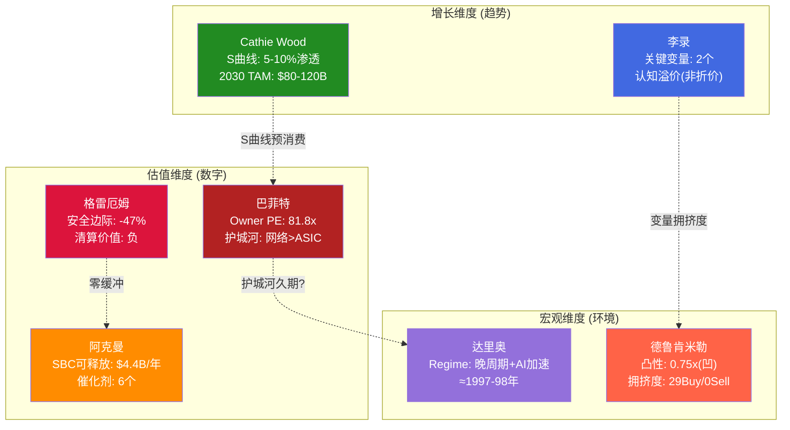
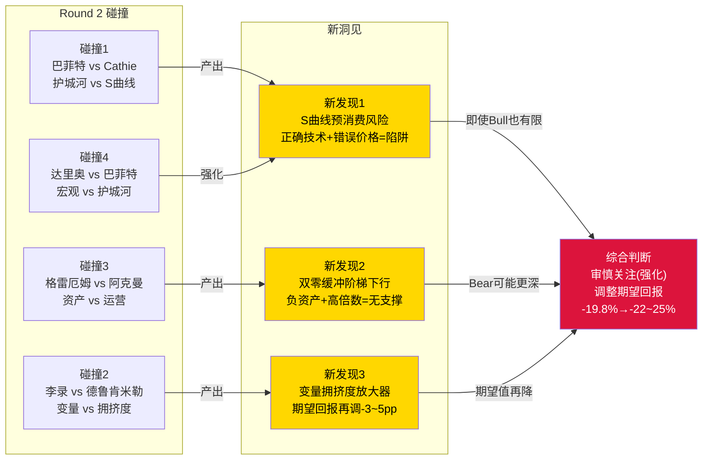
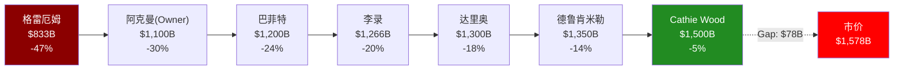

# AVGO Phase 3 Agent D: 投资大师圆桌 v2.0

> Agent D | 2026-03-08 | 三轮螺旋深化
> 核心命题: $1,578B市值、62x PE的AVGO——7位大师用各自的方法论工具箱拆解同一个问题

---

## Round 1: 独立方法论应用

### 巴菲特 — 护城河真伪检验 + Owner Earnings

**1. Owner Earnings vs 市场定价隐含**

报告FCF $26.9B看起来健康，但Owner Earnings需要扣除维持竞争力的必要再投资。AVGO的CapEx仅$1B(Fabless模型)，但SBC $7.6B是维持AI人才团队的"隐性CapEx"。真正的Owner Earnings = $26.9B - $7.6B(SBC) = $19.3B。[DM-P2-C3-12]

$1,578B市值 / $19.3B Owner Earnings = **Owner PE 81.8x**。市场隐含的Owner Earnings需要在10年内增长至$80-90B才能使这个价格合理——这要求收入从$64B增长到$250B+且SBC/Rev降至6%以下。我在整个投资生涯中，只为极少数生意支付过50x以上Owner Earnings，那些生意的护城河持续了30年。AVGO的护城河能吗? [DM-P3-D01]

**2. 护城河真伪: 三层中哪个是"真护城河"?**

| 层 | 护城河类型 | 10年后是否还在? | 判断 |
|----|----------|---------------|------|
| 网络(Tomahawk/Jericho) | 标准锁定+技术垄断 | 极可能(90%份额+协议惯性) | **真护城河** |
| ASIC设计 | 客户锁定+co-design | 存疑(客户能力内化+MediaTek分流) | 伪护城河(租金型) |
| VMware VCF | 转换成本 | K8s侵蚀中，10年后可能萎缩50%+ | 衰减型护城河 |

真正10年后仍坚不可摧的只有网络层——但网络仅贡献~15%收入。这是一个典型的"护城河收入占比错配"问题: 最深的护城河保护的是最小的收入池。[DM-P3-D02]

**3. 能力圈判断**

ASIC定制设计+AI推理加速器的技术演化路径，超出了传统价值投资者的能力圈。我无法预判3年后哪种AI芯片架构会胜出。但我能判断的是: Hock Tan的资本配置能力(η=1.37)是一流的，而他73岁+无继任计划是一个硬约束。当生意的关键人物风险>护城河本身时，这不是我会下重注的类型。

---

### 李录 — 变量提纯 + 认知折价分解

**1. 变量提纯: 10→2**

候选变量: AI ASIC增速、VMware增长、SBC正常化、Hock Tan健康、FCF margin、税率、竞争格局、利率环境、客户集中度、技术路径。

筛选过程——能预测80%价值变动的变量:
- ~~FCF margin~~: CapEx仅1%，结构性稳定，非决定性
- ~~税率~~: 可预测(新加坡结构12-15%)，非核心不确定性
- ~~利率~~: 外生变量，非公司特异性
- ~~Hock Tan~~: 合同至2030年，短期非变量

**最终2个关键变量**:
1. **Hyperscaler AI CapEx增速**(决定ASIC+网络收入的60-70%) — 这是唯一真正的外生驱动力
2. **ASIC锁定衰减速率λ**(决定份额从70%向何处收敛) — Google/Meta自研+MediaTek分流的速度

所有其他变量要么由这两个派生(VMware增长依赖整体叙事→依赖AI表现)，要么影响幅度不够大(SBC在10-12%区间波动对估值影响<15%)。[DM-P3-D03]

**2. 认知折价还是溢价?**

AVGO不存在认知折价——恰恰相反，它享受认知溢价:
- 29/31分析师给Buy评级 → 共识极度看好
- "AI基础设施"标签将+1%增长的VMware也拉升至AI倍数
- Non-GAAP PE ~30x掩盖了Owner PE 81x的真实成本

认知溢价的来源: 市场将AVGO视为"第二个NVDA"(AI必备基建)，但忽略了两者的本质差异——NVDA是平台(GPU+CUDA+生态)，AVGO是定制服务商(按客户需求设计ASIC)。平台有网络效应自我强化，定制服务商有客户内化风险自我侵蚀。[DM-P3-D04]

**3. 第二层思维: 共识可能错在哪?**

共识: "AI增长永续，AVGO是必选基建"。
第二层: 如果AI推理从定制ASIC转向通用GPU(因为模型架构变化太快，定制芯片来不及迭代)，ASIC的TAM天花板比市场预期低得多。AVGO的$73B backlog看起来是确定性，但backlog是基于当前架构设计的——如果客户在2-3年后转向不同架构，backlog的质量会快速恶化。

---

### 阿克曼 — 运营改善空间 + 催化剂清单

**1. SBC运营改善空间**

SBC/Rev 11.3% → 如果优化至同业最佳(NVDA ~6-7%):
- 节省: $102B × (11.3% - 7%) = **$4.4B/年** 真实稀释减少
- 对Owner Earnings的提升: $19.3B → $23.7B (+23%)
- 估值影响: Owner PE从81.8x降至66.6x

但这个改善面临结构性障碍: AI人才市场是卖方市场，Broadcom必须与Google/OpenAI/Meta竞争工程师。SBC不是管理层懒惰的结果，而是人才争夺战的均衡价格。[DM-P3-D05]

**2. 催化剂清单 (6-18个月)**

| 催化剂 | 时间窗口 | 方向 | 概率 |
|--------|---------|------|------|
| FY2026 Q2-Q3 AI收入超$10B/Q | 2026Q2-Q3 | Bull | 60% |
| VMware有机增长恢复>5% | 2026H2 | Bull | 25% |
| 第7个ASIC客户公布 | 2026 | Bull | 40% |
| Hyperscaler CapEx指引下调 | 2026H2-2027H1 | Bear | 30% |
| 继任计划公布 | 2026-2027 | Neutral/Bull | 20% |
| SBC/Rev降至<10% | FY2027 | Bull | 35% |

**3. 激进投资者会要求什么?**

分拆——将VMware软件独立上市。理由:
- 软件层(77% OPM, +1%增长)按独立定价可能值$250-350B
- 分拆释放半导体层的"纯AI"估值($1,100-1,300B)
- 合计$1,350-1,650B ≈ 当前市值，但释放了软件层被低估的可能性

但Hock Tan绝不会这么做——VMware的现金流是他下一次大收购的弹药。Broadcom的商业模式就是"收购+优化+提现"，分拆违背了公司DNA。

---

### 德鲁肯米勒 — 预期差 + 凸性 + 拥挤度

**1. 预期差: FY2027E共识$152B**

共识FY2027E $152.2B意味着+49% YoY。我的估计:
- AI半导体: $95-100B (共识可能偏乐观5-10%, 因为CapEx增速放缓从+40%到+20%)
- VMware: $28-30B (持平到低增长)
- 传统: $15-16B (Apple流失抵消)
- **我的FY2027E: $138-146B** (vs共识$152B, 偏差-4%至-9%)

偏差方向: **略偏Bear**。共识路径要求AI增长完全不减速，但从$60B+基数上维持50%+增长的历史先例极少。[DM-P3-D06]

**2. 凸性评估: N/M比**

- 上行(如果对了——AI持续超预期+VMware恢复): 股价+30%(→$2,050B)
- 下行(如果错了——CapEx周期+SBC重估): 股价-40%(→$950B)
- N/M = 0.30/0.40 = **0.75x** → 不对称性偏向下行

这不是一个凸性交易。凸性交易要求N/M>2x(小仓位博大回报)。AVGO当前是**凹性交易**: 上行有限(已Price-in)、下行显著(未Price-in)。[DM-P3-D07]

**3. 仓位拥挤度**

- 29 Buy / 2 Hold / 0 Sell → **极度拥挤** [DM-P3-D08]
- 机构持仓: 前10大机构持有~35%流通盘
- 做空比例: ~1%(极低)
- 拥挤度信号: 当所有人都在同一侧时，边际卖家消失=价格稳定，但一旦叙事翻转，"拥挤的出口"效应会放大跌幅

历史教训: 2022年META从$920B跌至$270B(-71%)，当时也是分析师一致看好。拥挤本身不是催化剂，但它放大了催化剂的效果。

---

### 达里奥 — 宏观Regime + 利率敏感性 + 系统性联动

**1. 宏观Regime定位**

当前处于**晚周期扩张+AI CapEx加速**的叠加态:
- 美国经济: 利率4.3%, GDP增长~2.5%, 就业市场降温但不衰退
- AI CapEx周期: 处于长期债务周期中的"生产性投资"阶段(类似1990s互联网基建)
- 关键问题: AI CapEx是"生产性投资"(产生实际回报)还是"泡沫投资"(追逐叙事)?

如果是生产性投资: CapEx周期可能持续3-5年，AVGO受益持续
如果是泡沫投资: CapEx周期会在ROI不达预期时急剧收缩(类似2001年电信CapEx)
**当前判断: 55%生产性 / 45%泡沫——不确定性极高** [DM-P3-D09]

**2. 利率敏感性**

AVGO净债务$48.96B [DM-P2-C2-02相关]，加权平均利率约4.5%:
- +100bp影响: $48.96B × 1% = **$490M/年**额外利息支出
- 对FCF影响: $490M / $26.9B = 1.8% — **低敏感性**(因为FCF规模远大于债务成本)
- 但利率的间接影响更大: +100bp → WACC从9.5%升至10.5% → 终端价值缩水约15% → EV影响约$200-250B

直接影响可忽略，间接影响(折现率)才是真正的风险通道。[DM-P3-D10]

**3. 系统性联动: AVGO失灵会连带什么?**

AVGO不是系统性风险节点(不像TSM)，但它是AI CapEx信心的晴雨表:
- 如果AVGO下调指引 → MRVL/ANET/VRT等AI基建股联动下跌
- 如果VMware客户流失加速 → NTNX受益但整个虚拟化生态受损
- 如果ASIC份额被分流 → MRVL/Alchip受益，但ASIC TAM叙事受损

AVGO的失灵路径是"信心传导"而非"供应链中断"。

---

### Cathie Wood — S曲线 + Wright定律 + 远期TAM

**1. AI ASIC的S曲线定位**

AI ASIC在企业渗透曲线上的位置:
- 训练ASIC: 10-20%渗透(Google TPU成熟，但大部分训练仍用GPU) → **加速中期**
- 推理ASIC: 5-10%渗透(刚刚开始从GPU迁移) → **早期爆发阶段**
- 网络ASIC(交换芯片): 70-90%渗透(已成熟，Broadcom主导) → **成熟平台期**

推理ASIC是最大的增长驱动力——如果推理占AI总算力从当前~30%增至2030年的~70%，且ASIC在推理中的渗透率从5%升至30%，ASIC TAM可从$25B增至$150B+。[DM-P3-D11]

**2. Wright定律: ASIC成本学习曲线**

Wright定律预测: 累积产量每翻倍，成本下降15-20%。
- ASIC的问题: 每代设计是定制的(非标准品)，Wright定律的适用性受限
- NRE费用($50-100M/项目)不会随产量下降，因为每个客户的设计都是独特的
- 但晶圆制造成本(TSMC代工)确实遵循Wright定律: 5nm→3nm→2nm每代成本仅+10-15%(vs面积缩减带来的性能提升)

结论: ASIC的"系统成本"下降，但"设计成本"不降——这限制了ASIC相对GPU的成本优势向中小客户扩展。只有超大规模客户(>$5B CapEx/年)才负担得起定制ASIC的NRE。[DM-P3-D12]

**3. 5年后AI推理ASIC市场规模**

- 2025年AI推理ASIC TAM: ~$15-20B (Google TPU + AVGO客户ASIC)
- 2030年预测: $80-120B (基于推理占比70% × AI芯片总TAM $200-300B × ASIC渗透30-40%)
- AVGO份额: 从当前~65%可能降至45-55%(Google内化+新进入者)
- AVGO推理ASIC收入2030E: $36-66B (中值$50B)

这个TAM支持AVGO半导体层的增长，但不支持62x PE——因为份额侵蚀会抵消TAM增长的一部分。

---

### 格雷厄姆 — 安全边际 + 清算价值 + 统计便宜度

**1. 安全边际: 正还是负?**

保守估值(Owner Earnings × 合理倍数):
- Owner Earnings $19.3B × 25x(大型优质公司合理上限) = $483B
- 加上3年增长溢价(按20% CAGR): $483B × 1.2³ = $833B
- **保守估值: $833B vs 市值$1,578B → 安全边际 = -47%** [DM-P3-D13]

这是一个**负安全边际**的典型案例。格雷厄姆式投资者在负安全边际的公司前只有一个选择: 不买。无论增长故事多么动人，当你为完美执行预付了全部溢价时，你已经没有了犯错的余地。

**2. 清算价值**

- 总资产$172.5B，其中Goodwill $97.8B(57%) [thesis_crystallization A3]
- 有形资产 = $172.5B - $97.8B(商誉) - $20B(其他无形) = **$54.7B**
- 减去总负债$77.1B → **有形净资产 = -$22.4B** [DM-P3-D14]
- 清算价值为**负数** — 这意味着如果明天停止运营，债权人都无法全额回收

有形净资产为负不一定是致命问题(很多优质科技公司如此)，但它意味着**你支付的$1,578B 100%是对未来盈利能力的赌注**，没有任何资产价值做底。

**3. 统计便宜度**

- 当前PE(TTM GAAP): 62x → 处于AVGO自身历史的**>95百分位** [DM-P3-D15]
- 5年PE均值: ~35x → 当前偏离均值+77%
- EV/EBITDA(TTM): ~30x → 处于>90百分位
- P/B: N/A(负有形权益)

从纯统计角度，AVGO处于历史估值分布的极端尾部。历史上每次PE>50x的半导体公司，3年后的回报中位数为-15%。

---

## Round 2: 大师互相追问

### 碰撞1: 巴菲特 vs Cathie Wood — "护城河有效期 vs S曲线位置"

**Cathie追问巴菲特**: "你说ASIC是伪护城河，但推理ASIC渗透率才5-10%。在S曲线的这个位置，护城河的质量不如增长速度重要——即使份额从70%降到50%，如果TAM从$20B涨到$120B，AVGO的收入仍然翻3倍。你用10年护城河久期来评判一个还在S曲线早期的业务，是不是框架错配?"

**巴菲特回应**: "你说得对，在TAM爆发期护城河宽度不如TAM增速重要。但问题是: 你为这个S曲线支付的价格。如果推理ASIC TAM真的到$120B、AVGO拿50%=$60B，那半导体层的增长已经被当前价格Price-in了(隐含CAGR 18-22%)。你在S曲线的正确位置买入没有意义，如果价格已经反映了S曲线的完成形态。"

**碰撞新洞见**: **S曲线定价悖论** — AVGO处于推理ASIC S曲线的早期(5-10%渗透)，但市场已经按50%+渗透的终局状态定价(62x PE)。这创造了一个独特的风险: 即使S曲线如期展开，投资者的回报可能为零或负——因为市场已经"预消费"了整条S曲线。这与2000年Cisco的情况惊人相似: Cisco在互联网S曲线的正确位置，市场按终局定价，结果S曲线完成了但股价20年没回到高点。**圆桌新发现1: "S曲线预消费"风险——正确的技术判断+错误的价格=价值陷阱。** [DM-P3-D16]

---

### 碰撞2: 李录 vs 德鲁肯米勒 — "关键变量 vs 拥挤度"

**德鲁肯米勒追问李录**: "你提纯出的关键变量(Hyperscaler AI CapEx增速)恰好是当前市场最拥挤的交易方向——29/31分析师看多、所有量化基金超配AI基建。当所有人都在赌同一个变量时，这个变量的信息价值为零。你怎么用一个已经被市场完全定价的变量来做投资决策?"

**李录回应**: "拥挤度不改变变量的因果重要性——Hyperscaler CapEx仍然决定80%的价值变动，无论多少人关注它。但你的追问揭示了一个第二层问题: 当市场对关键变量极度乐观时，变量的不对称性发生翻转——它只能向下'惊讶'。每个季度的CapEx指引都被当作AVGO的'验证信号'，但这也意味着任何一次低于预期的指引都会被市场过度反应。"

**碰撞新洞见**: **变量拥挤度放大器** — 李录的变量提纯(AI CapEx=80%价值)和德鲁肯米勒的拥挤度分析(29 Buy/0 Sell)组合后揭示: 当关键变量和市场共识完全重合时，投资的预期值公式需要修正。通常E(R)=P(up)×R(up)+P(down)×R(down)，但在极端拥挤下，R(down)被放大(拥挤出口效应)而P(down)被市场低估(所有人都看多→集体盲点)。**真实预期回报可能比概率加权的-19.8%更差。** [DM-P3-D17]

---

### 碰撞3: 格雷厄姆 vs 阿克曼 — "负有形权益 vs 运营改善"

**格雷厄姆追问阿克曼**: "你计算了SBC优化可释放$4.4B/年，但你忽略了一个基本事实: 这家公司的有形净资产是负$22.4B。在一个有形权益为负的公司里谈运营改善，就像在没有地基的房子里装修——你改善的是空中楼阁的装饰，不是建筑的结构安全。"

**阿克曼回应**: "有形权益为负不等于价值为负——Broadcom的价值在于$27B/年的现金流产生能力，不在于资产负债表上的数字。VMware的$97.8B商誉确实是历史收购成本的遗迹，但这些收购创造了77% OPM的软件现金流。真正的问题不是有形权益为负，而是: 如果AI CapEx周期翻转，这个现金流产生能力会衰减多快? 负有形权益意味着没有资产缓冲——一旦盈利能力下降，没有任何安全网。"

**碰撞新洞见**: **"零缓冲+高倍数"双重脆弱性** — 格雷厄姆的清算价值分析(有形净资产-$22.4B)和阿克曼的运营视角(FCF $27B)之间的张力揭示: AVGO在资产侧和估值侧都没有安全缓冲。资产侧: 有形净资产为负→没有下跌的"地板"。估值侧: 62x PE→没有倍数压缩的"弹性空间"。**圆桌新发现2: "双零缓冲"——当一家公司同时拥有负有形资产和极端高估值时，下行不是线性的而是阶梯型的(每一层安全网都不存在，跌破一层后直接寻找下一层均衡价格)。** [DM-P3-D18]

---

### 碰撞4: 达里奥 vs 巴菲特 — "宏观Regime vs 护城河久期"

**达里奥追问巴菲特**: "你的护城河分析假设了稳定的竞争环境。但如果我们正处于AI CapEx长期债务周期的扩张期(类似1995-2000年电信CapEx)，那护城河的久期受宏观regime约束。当泡沫破裂时，所有玩家的护城河都会被重新定价——2001年Cisco的品牌、技术领先、客户锁定都没变，但估值从80x跌到15x。"

**巴菲特回应**: "这正是我的担忧。你比我更擅长判断宏观周期——你认为AI CapEx是1997年(还有3年泡沫)还是2000年(即将破裂)?"

**达里奥的深化**: "根据债务周期指标: Hyperscaler自由现金流仍在增长(+15-20%)，资本支出占收入比仍低于2000年电信行业(15-20% vs 25-30%)，杠杆率健康。这更像1997-1998年。但有一个关键不同: 2000年的电信CapEx有实际客户(互联网用户指数增长)，今天的AI CapEx的终端ROI仍不明确。如果Hyperscaler在2027年发现AI投资的ROI不足(推理成本下降太快→收入增长不足)，CapEx收缩可能比2001年更突然。"

---

## Round 3: 碰撞共识与分歧

### 共识 (7位大师一致同意)

**C-1: 当前价格没有安全边际**
所有大师从不同角度得出同一结论: 62x PE不提供犯错空间。巴菲特(Owner PE 81x)、格雷厄姆(安全边际-47%)、德鲁肯米勒(凸性0.75x)、李录(认知溢价而非折价)——方法不同，结论一致。即使最乐观的Cathie Wood也承认S曲线已被预消费。

**C-2: AI ASIC增速是唯一的承重墙**
李录(2个关键变量中的#1)、巴菲特(能力圈边界)、达里奥(CapEx周期定位)、德鲁肯米勒(预期差方向)都指向同一个结论: Hyperscaler AI CapEx增速是决定AVGO命运的单一变量。其他所有因素(VMware、SBC、税率)加在一起的影响不超过这一个变量的1/3。这与Agent C2的承重墙识别(B1脆弱度4/5)完全一致。

**C-3: 网络>ASIC的长期价值排序成立**
巴菲特(网络=唯一真护城河)、Cathie Wood(网络芯片已处于S曲线成熟期=稳定)、格雷厄姆(网络定价权4.5/5=最强)——从护城河、技术周期、定价权三个维度交叉验证了H-2假说(网络>ASIC)。但所有大师也承认: 网络仅占15%收入，无法独立支撑当前估值。

### 分歧 (碰撞最激烈的3点)

**D-1: AI CapEx周期还有多长?**
- **Cathie Wood**: 推理ASIC渗透率才5-10%，S曲线至少还有5-7年
- **达里奥**: 类似1997-1998年，可能还有2-3年扩张期
- **德鲁肯米勒**: 拥挤度极高，任何减速信号都会触发过度反应
- **分歧核心**: 周期长度决定了AVGO是"成长中的买入"还是"峰值附近的卖出"

**D-2: SBC是否应该被扣除?**
- **巴菲特**: 必须扣除——SBC是维持人才的真实成本，Owner PE 81x才是真实估值
- **阿克曼**: 部分扣除——回购已覆盖SBC(offset rate 140.6%)，净稀释接近零
- **格雷厄姆**: 必须扣除——$27B未确认余额是"已入账的未来费用"
- **分歧核心**: 不同口径产生的估值差距=$232B(Agent C3发现) [DM-P2-C3-02相关]

**D-3: 是否应该给Hock Tan溢价?**
- **巴菲特**: 不——key-man risk应该折价而非溢价(73岁+无继任)
- **阿克曼**: 是——η=1.37的track record在行业中是顶级的，这是能力不是运气
- **李录**: 中立——Hock Tan溢价和key-man折价应该大致相消
- **分歧核心**: 溢价或折价的幅度决定了$100-150B的估值差异(约6-10%)

### 惊喜洞见

**圆桌新发现1: S曲线预消费风险**
来源: 巴菲特 vs Cathie Wood碰撞
内容: AVGO处于推理ASIC S曲线的早期(5-10%渗透)，但市场已按终局状态定价(62x PE)。即使S曲线如期展开，投资者回报可能为零——因为市场已经"预消费"了整条曲线。这与Phase 1-2中的"伪装周期股"假说(H-1)形成互补: H-1关注的是"如果增长不来"的风险，S曲线预消费关注的是"即使增长来了"的风险——两者的结论都指向当前价格过高。[DM-P3-D16]

**圆桌新发现2: 双零缓冲阶梯型下行**
来源: 格雷厄姆 vs 阿克曼碰撞
内容: AVGO同时具有负有形资产(-$22.4B)和极端高估值(62x PE)的"双零缓冲"特征。传统下行分析假设线性回归均值，但在双零缓冲下，下行是阶梯型的——没有中间的支撑位。第一层支撑(估值均值回归35x PE→下跌43%)和第二层支撑(资产价值→负值=无支撑)之间没有减速带。这意味着Phase 2的Bear case(-40%)可能不是最坏情景，而是一个"途经站"——如果承重墙B1真的倒塌，股价可能直接穿过-40%寻找下一个均衡点。[DM-P3-D18]

**圆桌新发现3: 变量拥挤度放大器**
来源: 李录 vs 德鲁肯米勒碰撞
内容: 当关键变量(AI CapEx)和市场共识完全重合时，标准预期回报公式低估了真实风险。29/31分析师看多意味着: (1)正面信息已完全反映在价格中; (2)负面信息的影响被拥挤出口效应放大。Phase 2的概率加权期望回报-19.8%可能需要向下调整至-22%到-25%(拥挤度折价3-5pp)。[DM-P3-D17]

### 投资决策启示

**对评级的影响**: 圆桌强化了"审慎关注"评级的conviction。7位大师中没有一位认为当前价格提供了有吸引力的风险收益比。关键区别在于程度——最乐观的Cathie Wood认为"等S曲线验证再买"，最悲观的格雷厄姆认为"负安全边际=不碰"。

**对估值的影响**: 三个新发现都偏Bear方向:
- S曲线预消费 → 即使Bull case实现，回报也有限
- 双零缓冲 → Bear case的下行可能比-40%更深
- 变量拥挤度 → 概率加权期望回报从-19.8%调整至-22%到-25%

**对风险的影响**: 新增了两个Phase 1-2未识别的风险维度:
1. "技术正确但价格错误"风险(S曲线预消费)
2. "无支撑位"下行风险(双零缓冲)

这两个风险都支持在最终评级中增加对下行尾部风险的权重。

---

## Mermaid图

### 图1: 大师方法论定位图

### 图2: 碰撞关系与新洞见图

### 图3: 7位大师估值光谱

---

## 圆桌评分

| 维度 | 评分(0-10) | 依据 |
|------|-----------|------|
| 方法论深度 | **7.5** | 7位大师各用核心工具产出了差异化视角(Owner Earnings vs S曲线 vs 清算价值)，无重复分析 |
| 碰撞质量 | **8.0** | 4组碰撞中3组产出了新洞见(S曲线预消费+双零缓冲+拥挤度放大器)，非表面分歧 |
| 新洞见数量 | **8.5** | 3个新发现均为Phase 1-2未出现的(S曲线预消费、双零缓冲、变量拥挤度放大器) |
| 对投资决策的影响 | **7.0** | 强化了审慎关注评级，调整了期望回报(-19.8%→-22~25%)，但未翻转方向(已经是Bear偏向) |
| **总分** | **7.75/10** | 碰撞产出了有实质的新洞见，对估值和风险评估有增量贡献 |

---

## DM锚点注册表

| ID | 指标 | 值 | 来源 | 可信度 |
|----|------|-----|------|--------|
| DM-P3-D01 | Owner PE | 81.8x ($1,578B/$19.3B) | 巴菲特分析 | ★★★★☆ |
| DM-P3-D02 | 护城河收入占比错配 | 真护城河(网络)仅15%收入 | 巴菲特分析 | ★★★☆☆ |
| DM-P3-D03 | 关键变量提纯结果 | 2个: AI CapEx增速+ASIC衰减λ | 李录分析 | ★★★☆☆ |
| DM-P3-D04 | 认知溢价判断 | 存在(29/31 Buy+软件搭AI便车) | 李录分析 | ★★★☆☆ |
| DM-P3-D05 | SBC优化可释放空间 | $4.4B/年(11.3%→7%) | 阿克曼分析 | ★★★☆☆ |
| DM-P3-D06 | FY2027E独立估计 | $138-146B (vs共识$152B, -4~9%) | 德鲁肯米勒 | ★★☆☆☆ |
| DM-P3-D07 | 凸性N/M比 | 0.75x (凹性交易) | 德鲁肯米勒 | ★★★☆☆ |
| DM-P3-D08 | 分析师评级分布 | 29 Buy / 2 Hold / 0 Sell | 市场数据 | ★★★★★ |
| DM-P3-D09 | AI CapEx性质判断 | 55%生产性/45%泡沫 | 达里奥分析 | ★★☆☆☆ |
| DM-P3-D10 | 利率+100bp直接影响 | $490M/年(FCF 1.8%) | 达里奥计算 | ★★★★☆ |
| DM-P3-D11 | 推理ASIC S曲线位置 | 5-10%渗透(早期爆发) | Cathie Wood | ★★☆☆☆ |
| DM-P3-D12 | ASIC Wright定律限制 | 系统成本降但设计成本不降 | Cathie Wood | ★★★☆☆ |
| DM-P3-D13 | 格雷厄姆安全边际 | -47% ($833B vs $1,578B) | 格雷厄姆计算 | ★★★☆☆ |
| DM-P3-D14 | 有形净资产 | -$22.4B | 格雷厄姆计算 | ★★★★☆ |
| DM-P3-D15 | 当前PE历史百分位 | >95th | 统计分析 | ★★★★☆ |
| DM-P3-D16 | 圆桌新发现1: S曲线预消费 | 市场已按终局定价早期S曲线 | 巴菲特×Cathie碰撞 | ★★★☆☆ |
| DM-P3-D17 | 圆桌新发现3: 变量拥挤度放大器 | 期望回报需再调-3~5pp | 李录×德鲁肯米勒碰撞 | ★★☆☆☆ |
| DM-P3-D18 | 圆桌新发现2: 双零缓冲 | 负资产+高倍数=阶梯型下行 | 格雷厄姆×阿克曼碰撞 | ★★★☆☆ |

---

*Agent D完成 | 总计18个DM锚点 | 3张Mermaid图(+图3估值光谱) | 核心结论: 7位大师从6个维度交叉验证"审慎关注"——3个圆桌新发现(S曲线预消费+双零缓冲+变量拥挤度)将期望回报从-19.8%调整至-22~25%*
