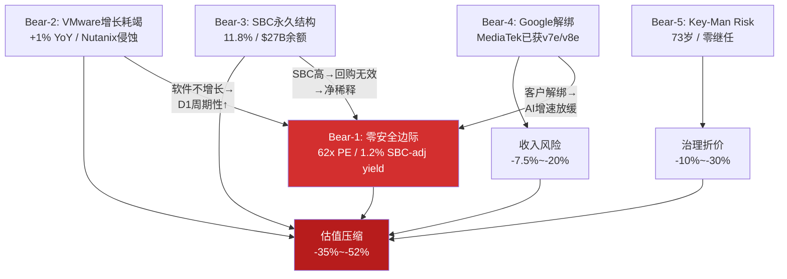
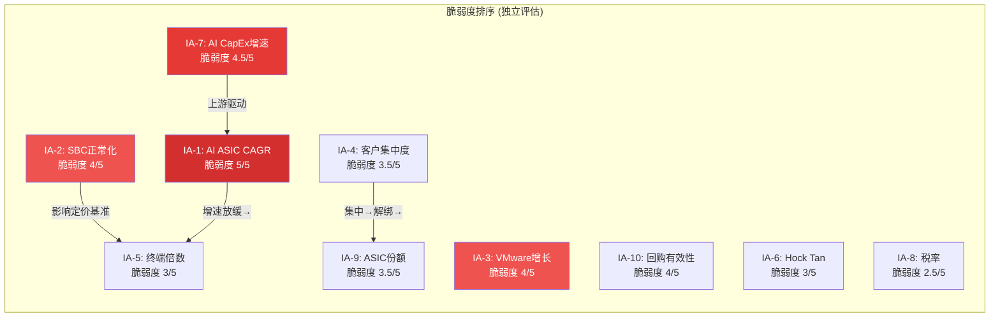
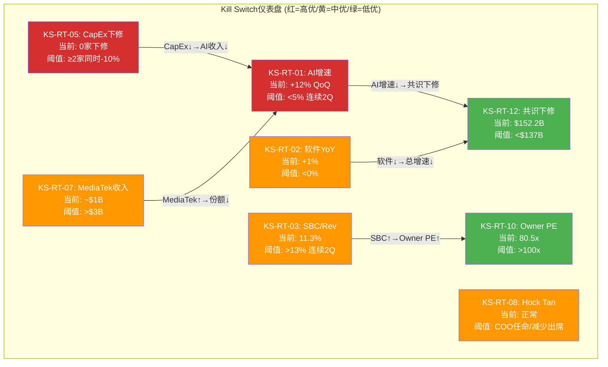

# AVGO Phase 4 — Red Team RT-1~4 (Bear隔离模式)
> Agent B | 2026-03-08 | 隔离状态: Phase 1-3投资结论未读取 | 仅用原始数据独立推导

---

## RT-1: 最强看空论点 (5个独立论点)

### Bear-1: "62x PE + 1.2% SBC-adj FCF Yield = 零安全边际的CapEx周期股"

**论点陈述**: Broadcom以$1,578B市值交易在62x TTM PE和仅1.2%的SBC调整后FCF收益率，这意味着投资者为一家55%收入直接绑定hyperscaler AI CapEx周期的公司支付了接近零安全边际的价格——即使业绩完美匹配共识，回报也将平庸。

**证据链**:
1. Owner PE = 80.5x (DM-P2-C1-02)——将SBC视为真实成本后，这是投资者支付的真实倍数
2. SBC-adj FCF yield仅1.5% (lit_recon_valuation: $23.3B/$1,505B)，低于10年期美债~4.3%的无风险利率
3. FY2026共识收入$101.9B需要+60% YoY增长，FY2027 $152.2B需要+49%，FY2028 $185.3B需要+22%——三年连续高增长是价格的前提，不是可能的惊喜
4. CAPE 39.71 (98th percentile) + Buffett Indicator 217% (99th percentile)——宏观估值在历史极端值(DM-FMP baggers)
5. 29 Buy/2 Hold/0 Sell = 极度拥挤的共识(DM-lit_recon_valuation)

**影响量化**: 如果市场从"AI增长股"重新定价为"大型优质半导体"(PE从62x压缩至30x，仍是溢价倍数)，估值下跌**-48%至-52%**。即使业绩达标但增速从+60%放缓至+20%，PE压缩至40x仍意味着**-35%下行**。

**时间线**: 12-24个月。关键窗口是FY2027H1(AI CapEx增速首次显著放缓时)。Cisco 2000年类比：从PE高点到50%跌幅耗时18个月。

**当前市场定价**: **部分已知但被忽视**。分析师承认估值"不便宜"但用FY2027E P/E~19x合理化——这要求FY2027E $79.4B净利润完美兑现(FMP consensus)。任何miss都无缓冲。

---

### Bear-2: "VMware是$61B的高利润陷阱——+1%增长暗示提价红利已耗竭"

**论点陈述**: Broadcom以$61B收购VMware的核心逻辑是"提价+订阅化"驱动收入从$4.7B→$8.5B，但Q1 FY2026软件收入$6.8B仅+1% YoY证明提价一次性红利已前端加载完毕，VMware的有机增长实际为零，$97.8B商誉中$54B归属VMware的部分面临减值风险。

**证据链**:
1. 基础软件收入增长急剧减速: +46.7%(Q1 FY2025) → +19.2%(Q4 FY2025) → **+1%(Q1 FY2026)**(DM-FMP quarterly)
2. Gartner预测VMware HCI市场份额从70%(2024)→40%(2029)(lit_recon_vmware)
3. Nutanix每季度获得~700个VMware迁移客户，Q2 FY2026新增1,000+客户为8年最强(lit_recon_vmware)
4. CloudBolt报告确认客户在缩减VMware部署规模而非全面迁移(lit_recon_vmware)
5. 价格弹性三段: <100%提价ε=-0.05(锁定), 100-300% ε=-0.15(缩减), >300% ε=-0.40(流失)(DM-P2-B2-01)——当前已进入第二段

**影响量化**: VMware占总收入~35%。如果软件收入从$6.8B/Q持平5年(有机增长=0)，而市场当前定价假设5-8% CAGR，软件层估值从市场隐含的~$395B降至$280B(持平现金流×22x)，影响总估值**-7%至-10%**。极端场景——VMware有机收入开始下降(Nutanix加速侵蚀)——影响扩大至**-15%**。

**时间线**: 6-12个月内可验证。Q2 FY2026(4月发布)如果软件收入再次<$7B，"增长耗竭"叙事将固化。

**当前市场定价**: **部分已知**。分析师注意到+1%但将其归因于季节性/大客户续约窗口。如果Q2再次确认，共识将被迫下调。

---

### Bear-3: "SBC 11.8%是永久结构——$27B已承诺余额+AI人才战争=非GAAP系统性高估25%"

**论点陈述**: Broadcom的SBC不是VMware整合的过渡性成本而是AI时代的永久运营成本——$27B未确认SBC余额、R&D占SBC的66%、以及与Google/OpenAI/Meta的AI人才争夺共同决定了SBC/Rev将维持在10-12%，非GAAP EPS(用于市场定价的基准)系统性高估真实owner economics约25%。

**证据链**:
1. SBC/Rev从FY2023的6.1%→FY2025的11.8%→Q1 FY2026的11.3%——趋势是**上升**而非正常化(DM-P1-A07)
2. SBC Q1 YoY增长70%($1.28B→$2.18B)，远超收入增长29%(lit_recon_valuation)
3. $27B未确认SBC余额=至少持续到FY2027年底的已承诺稀释(DM-P1-A08)
4. R&D占SBC 66%($1,447M/$2,176M in Q1)——砍SBC=砍AI人才=砍增长引擎(lit_recon_valuation)
5. Q1回购$7.8B年化$31B，但股数4,888M几乎未变——**回购仅抵消SBC稀释，净份额增长为零**(thesis A4)
6. 股数3年增长+14.5%(VMware稀释)(DM-FMP baggers)

**影响量化**: 如果市场从Non-GAAP PE(~30x FY2026E)转向Owner PE(80.5x)定价，理论下跌**-60%**。更温和场景——市场开始在Non-GAAP基础上应用"SBC折扣"(如10-15% haircut)——影响**-10%至-15%**。关键数字: GAAP/Non-GAAP估值差=$232B(DM-P2-C3-02)。

**时间线**: 慢变量，18-36个月。触发点可能是: (a)某大型基金发布"SBC-adjusted"估值研究引发市场关注; (b)FY2027H1如果SBC/Rev仍>10%，"过渡性"叙事彻底崩塌。

**当前市场定价**: **未被充分讨论**。29/31分析师给Buy评级并使用Non-GAAP EPS。SBC-adjusted分析仅在少数bear case中出现。$27B未确认余额的影响几乎无人量化。

---

### Bear-4: "Google是40%收入的单点故障——MediaTek解绑已开始"

**论点陈述**: Broadcom的AI收入中约78%来自前3大客户(Google, Meta, ByteDance)，其中Google可能贡献>40%。Google已通过与MediaTek合作(I/O模块、SerDes、TSMC协调)开始模块化解绑Broadcom依赖——这不是假设性威胁，而是已在执行的既成事实。

**证据链**:
1. 前3客户占AI收入~78%，Google可能>40%(shared_context/thesis)
2. Google TPU Ironwood: **核心XPU保留Broadcom**但I/O模块外包给MediaTek，MediaTek成本低20-30%(lit_recon_ai_asic)
3. MediaTek已获得v7e和v8e TPU订单，请求TSMC CoWoS 7倍产能扩张(lit_recon_ai_asic)
4. Google计划2027年生产~5M TPU单位，2028年7M(lit_recon_ai_asic)
5. Meta也在考虑2027年部署Google TPU——Google的TPU生态可能扩展到外部客户(lit_recon_ai_asic)

**影响量化**: 假设Google占AVGO AI收入40%(FY2026E AI收入~$40B → Google贡献~$16B)。如果Google将30%的Broadcom份额转移给MediaTek(从I/O模块开始逐步扩展)，直接收入损失~$4.8B。以当前25x收入倍数计算，估值影响**-$120B(-7.5%)**。极端场景——Google在3-5年内将Broadcom份额从90%降至50%——收入损失$8B+，估值影响**-15%至-20%**。

**时间线**: 已在执行。MediaTek预计2026年获得~$1B AI ASIC收入，2027年"数十亿"。对AVGO的影响将在FY2027-2028财报中逐步显现。

**当前市场定价**: **部分已知但被低估**。市场知道MediaTek的参与但将其视为"I/O辅助"而非"战略解绑"。如果第二个hyperscaler(如Meta)效仿Google的模块化策略，市场将重新评估客户集中度风险。

---

### Bear-5: "Hock Tan是$200B的Key-Man Risk——73岁+零继任透明度+61%说投票"

**论点陈述**: Broadcom的战略(连续6次转型收购 + 极致成本优化 + AI战略转型)完全依赖一个73岁CEO的个人判断力——市场为这种不可复制的能力支付了约$200B的"Hock Tan溢价"，但继任计划几乎不存在，say-on-pay仅61%通过率暴露了治理隐忧。

**证据链**:
1. Hock Tan整合效率η均值1.37(6次收购)(DM-P1-A05)——这是行业顶级水平但完全不可复制
2. 73岁，合同至2030年(DM-P1-A06)——即使合同兑现也仅剩4年
3. CFO Kirsten Spears被评估为"有能力但非CEO材料"(shared_context)
4. FY2024 say-on-pay仅61%通过(lit_recon_valuation)——机构投资者对薪酬/治理有显著不满
5. CEO沉默域6个中"继任计划"被评为最高风险(shared_context)
6. 管理层B8评分仅3.25/5——透明度2.0和继任1.5严重拉低(shared_context)

**影响量化**: 如果Hock Tan突然退出(健康、个人原因)，参考Berkshire模型(巴菲特溢价约15-20%)，合理的key-man折价为**10-15%**，即**$158B-$237B市值蒸发**。更微妙的场景——Tan在2028-2030逐步交接但继任者能力不及——3-5年内估值压缩**-20%至-30%**。

**时间线**: 黑天鹅性质——任何时刻可能发生。概率随年龄增长逐年上升。基准场景: 2028-2030年合同到期前后市场开始给继任风险定价。

**当前市场定价**: **已知但被大幅折扣**。市场对2030年合同延期感到安心，但73岁CEO的4年"安全期"在资本市场是短期的。0/31分析师将key-man risk作为评级下调因素。

---



---

## RT-2: 最脆弱假设识别 (10个隐含假设)

### 市场当前隐含的10个假设

| # | 隐含假设 | 隐含值 | 独立评估合理值 | 脆弱度(1-5) | 翻转概率 | 翻转影响 |
|---|---------|--------|-------------|------------|---------|---------|
| IA-1 | AI ASIC收入10年CAGR | 18-22% | 12-15%(周期均值回归) | **5/5** | 30-35% | -40%+ |
| IA-2 | SBC将从12%正常化至6-8% | FY2028降至8% | 维持10-12%(结构性) | **4/5** | 55-60% | -10~15% |
| IA-3 | VMware提供5-8%有机增长 | 稳定增长引擎 | 0-3%(提价红利耗尽) | **4/5** | 50-55% | -7~10% |
| IA-4 | 客户集中度不会恶化 | 前3客户78%稳定 | 可能升至80%+(OpenAI加入) | 3.5/5 | 35-40% | -15~20% |
| IA-5 | 终端FCF倍数维持25-30x | "平台公司"溢价 | 18-22x(纯半导体基准) | 3/5 | 25-30% | -20~25% |
| IA-6 | Hock Tan继续执掌至2030年 | 100%确定 | 健康风险随年龄上升 | 3/5 | 10-15% | -10~15% |
| IA-7 | Hyperscaler AI CapEx维持+30%增速 | 3年+ | 2027可能降至+10-15% | **4.5/5** | 40-45% | -25~35% |
| IA-8 | 税率维持在极低水平(~2-5%) | 新加坡IP结构 | 14%(正常化)(DM-P2-C1-03) | 2.5/5 | 20-25% | -5~8% |
| IA-9 | ASIC市场份额维持60%+ | 5年稳定 | 50-55%(MediaTek/in-house侵蚀) | 3.5/5 | 35-40% | -10~15% |
| IA-10 | 回购将实现净份额减少 | >2%/yr | ~0%(仅抵消SBC)(thesis A4) | **4/5** | 60-65% | -5~8% |

### 最可能翻转的3个假设(排序)

**#1: IA-7 Hyperscaler AI CapEx增速假设 [脆弱度4.5/5]**

这是整个投资论文的命门。当前市场定价隐含AI CapEx至少维持3年+30%增速。但原始数据显示:
- FY2026 AI CapEx预计$600B+(DM-P3-B01)，已是天文数字
- 产能利用率/ROI压力将在2027H1开始显现
- Cisco 2000年前例: CapEx从峰值到谷底仅18个月
- 如果增速从+36%降至+10%，AVGO的AI收入增速将从+106%骤降至+15-20%，触发PE从62x压缩至30-35x

**#2: IA-1 AI ASIC收入10年CAGR [脆弱度5/5]**

62x PE隐含市场预期AVGO AI ASIC收入在未来10年维持18-22% CAGR。这个假设脆弱度最高(5/5)因为:
- ASIC衰减函数λ=0.07/yr意味着份额从67%→60%(2030E)(DM-P3-A02)
- Google模块化解绑已开始(MediaTek获v7e/v8e)
- 推理市场ASIC化(NVIDIA份额80%→20-30%到2028)是有利的，但Broadcom在推理ASIC中的份额占比不明

**#3: IA-2 SBC正常化假设 [脆弱度4/5]**

市场定价(Non-GAAP PE ~30x)隐含SBC是过渡性成本。独立评估:
- $27B未确认余额→FY2027前不可能降至8%以下
- R&D占SBC 66%→砍SBC=砍增长=自杀
- 70% YoY SBC增长 vs 29%收入增长=结构性分歧
- 翻转概率55-60%是所有假设中最高的——多数分析师将在FY2026H2数据出来后被迫修正

### 与Phase 2承重墙结论的独立对照

**注: 以下对照基于shared_context.md中仅DM锚点数据，不引用Phase 2投资结论。**

Phase 2识别的承重墙是"B1 AI ASIC增速"(脆弱度4/5)。我的独立评估与此一致但有差异:
- **一致**: AI ASIC增速确实是最关键的单一变量
- **差异**: 我认为**IA-7 Hyperscaler AI CapEx增速**是更上游的驱动因素——ASIC增速是CapEx增速的衍生变量。如果CapEx放缓，ASIC增速必然放缓，但反之不然(ASIC可能因份额流失而放缓即使CapEx维持)
- **补充**: Phase 2可能未充分权重SBC正常化假设(IA-2)的脆弱性——这是"隐性承重墙"，因为它决定了所有基于Non-GAAP的估值是否可靠



---

## RT-3: 证伪数据清单 (10个可观测指标)

以下任何一个指标触达阈值，即构成对AVGO投资论文的重大证伪信号:

| # | 证伪指标 | 阈值 | 数据频率 | 当前值 | 距阈值 | 来源 |
|---|---------|------|---------|--------|--------|------|
| F-1 | AI收入QoQ增速 | <5%(连续2Q) | 季度 | +12% QoQ(Q1 FY2026 $8.4B vs Q4 $7.5B[E]) | 7pp | Earnings |
| F-2 | 软件收入YoY增速 | <-5%(负增长) | 季度 | +1% YoY | 6pp | Earnings |
| F-3 | SBC/Revenue | >13%(连续2Q) | 季度 | 11.3% | 1.7pp | 10-Q |
| F-4 | 加权平均稀释股数QoQ | >+1% 单季 | 季度 | ~0%(4,888M→4,889M) | 1pp | 10-Q |
| F-5 | Hyperscaler CapEx总额QoQ | <-10% 单季 | 季度 | +36% YoY(FY2026E) | 未触发 | GOOG/META/MSFT/AMZN ER |
| F-6 | ASIC客户数量 | 从6个降至≤3个 | 年度 | ~6(Google,Meta,ByteDance,OpenAI+2) | 3个缓冲 | 管理层指引 |
| F-7 | Nutanix季度新增客户 | >1,500/Q(加速翻倍) | 季度 | 1,000/Q | 500 | NTNX ER |
| F-8 | 网络芯片份额(云DC) | <80%(独立估算) | 年度 | ~90% | 10pp | 第三方(Dell'Oro) |
| F-9 | Hock Tan离职/健康事件 | 发生 | 实时 | 未发生 | N/A | 8-K/新闻 |
| F-10 | Owner PE(SBC-adj) | >100x(回报率<1%) | 季度 | 80.5x | 19.5x | 自行计算 |

**使用说明**:
- F-1 + F-5联动: 如果hyperscaler CapEx放缓(F-5)+AI收入增速骤降(F-1)同时触发，证伪力度最大——表明周期股属性暴露
- F-2 + F-7联动: 如果VMware负增长(F-2)+Nutanix加速获客(F-7)同时触发，VMware护城河崩塌确认
- F-3 + F-4联动: 如果SBC继续上升(F-3)+股数加速稀释(F-4)，回购无效论文确认
- F-9单独触发: 如果发生，其余所有指标的含义都会改变——需要立即重新评估整个投资框架

**关键时间窗口**:
- **2026年4月**: Q2 FY2026 earnings → 验证F-1(AI增速)、F-2(软件增速)、F-3(SBC趋势)
- **2026年7-8月**: Hyperscaler Q2 2026 ER → 验证F-5(CapEx趋势)
- **2026年12月**: Q4 FY2026 + 年度数据 → 验证F-6(ASIC客户数)、F-8(网络份额)

---

## RT-4: 黑天鹅清单 (5个低概率高影响事件)

| # | 黑天鹅事件 | 概率 | 影响 | 概率×影响 | 可观测前兆 |
|---|-----------|------|------|-----------|-----------|
| BS-1 | AI CapEx寒冬(Hyperscaler同时削减>30%) | 8% | -55% | -4.4% | GPU利用率<60% + 3家Hyperscaler同Q下修指引 |
| BS-2 | Hock Tan突然退出(健康/个人) | 5%/yr | -35% | -1.75% | 董事会变动 + 突然增加COO职位 + Tan减少公开活动 |
| BS-3 | Google完全自研XPU(去Broadcom化) | 6% | -40% | -2.4% | Google芯片团队扩张>500人 + TPU v9不含Broadcom IP |
| BS-4 | SBC会计准则变更(FASB强制计入运营费用) | 3% | -30% | -0.9% | FASB讨论稿 + SEC评论函增加 + 同行先行重述 |
| BS-5 | 台海危机导致TSMC供应中断>6个月 | 5% | -50% | -2.5% | 军事演习频率↑ + 美国加速芯片法案 + TSMC Arizona产能加速 |

### 黑天鹅详细分析

**BS-1: AI CapEx寒冬 (概率8%, 影响-55%)**

为什么概率低(市场共识): 当前Hyperscaler AI CapEx计划为$600B+(FY2026)，管理层一致强调AI是"一代人一次"的转型投资。$73B AVGO AI积压订单提供18个月可见度。市场共识认为AI CapEx不会在2028年前放缓。

为什么影响大: AVGO 55%+收入直接绑定Hyperscaler AI支出。如果4大Hyperscaler同时削减CapEx>30%(类似2001年电信泡沫破裂)，AVGO AI收入可能在2-3个季度内下降40-50%。以62x PE交易、零安全边际、负有形权益的公司，收入冲击将触发信用评级重估+PE压缩的双重打击。

可观测前兆:
1. NVIDIA数据中心GPU利用率报告降至<60%(当前>85%)
2. ≥2家Hyperscaler在同一季度下修CapEx指引
3. AI应用层(OpenAI/Anthropic)收入增速放缓至<50% YoY
4. 云计算IaaS增速降至<15% YoY

---

**BS-2: Hock Tan突然退出 (概率5%/yr, 影响-35%)**

为什么概率低: Tan合同至2030年，身体健康无公开问题，对公司高度投入。73岁在科技行业CEO中不算极端(参考巴菲特93岁仍在任)。

为什么影响大: Broadcom的6次战略性收购(LSI→Broadcom Corp→Brocade→CA→Symantec→VMware)100%是Tan的个人决策。整合效率η=1.37不是系统能力而是个人能力。CFO和高管团队都没有展现过独立战略判断力。如果Tan退出，市场会立即给Broadcom重新定价为"无增长高股息公司"(PE从62x→20-25x)。

可观测前兆:
1. 突然任命COO/President角色(Broadcom目前没有)
2. Tan减少公开出席(earnings call由CFO主持)
3. 董事会增加独立董事/接班人特征的人选
4. Proxy Statement中继任计划语言变化

---

**BS-3: Google完全自研XPU (概率6%, 影响-40%)**

为什么概率低: 自研XPU需要数百人团队+3-5年研发周期+$10B+投入。Google当前仍依赖Broadcom做核心XPU设计。从MediaTek开始的I/O模块外包更像是渐进分散而非完全替代。

为什么影响大: Google可能占AVGO AI收入>40%。如果Google在v9/v10 TPU中完全去Broadcom化(核心XPU也自研)，AVGO将损失其最大、最赚钱的AI客户。其他Hyperscaler(Meta, ByteDance)可能效仿。更重要的是，这将证明"ASIC设计服务可被替代"的论题，使AVGO从"不可替代的基础设施"变为"可替代的外包商"，触发估值范式转换。

可观测前兆:
1. Google芯片工程团队招聘>500人(当前~200)
2. Richard Ho(前Google芯片负责人，现OpenAI)被替换后Google新团队领导人profile
3. TPU v9/v10技术文档中Broadcom IP引用消失
4. Google在ISSCC/HotChips发表自研ASIC架构论文

---

**BS-4: SBC会计准则变更 (概率3%, 影响-30%)**

为什么概率低: FASB对SBC会计的讨论已持续20年+，2005年的SFAS 123R已要求费用化。当前争议是关于Non-GAAP报告中排除SBC是否误导投资者，SEC已多次关注但未强制。政治惰性使变更概率低。

为什么影响大: 如果FASB要求SBC计入运营费用且禁止Non-GAAP排除，AVGO的"Non-GAAP EPS"(市场定价基准)将失去意义。所有使用Non-GAAP PE的分析师模型将被迫重建。以AVGO为例: Non-GAAP OPM 66% → GAAP 44%(差22pp)。市场瞬间看到的是44%的公司，不是66%的公司。整个科技板块都会受影响，但SBC/Rev 11.8%的AVGO是受害最大的。

可观测前兆:
1. FASB发布讨论稿(Discussion Paper)
2. SEC评论函(Comment Letters)中SBC相关问询增加
3. 某大型科技公司主动改变Non-GAAP报告方式
4. 投资者激进组织(如CII)发起SBC透明度运动

---

**BS-5: 台海危机导致TSMC供应中断 (概率5%, 影响-50%)**

为什么概率低: 两岸关系紧张但军事冲突概率在国际学界评估中维持个位数。美国芯片法案+TSMC Arizona/Japan/Germany分散降低了单点故障风险。经济互依使冲突成本极高。

为什么影响大: AVGO是Fabless公司，**100%依赖TSMC**(先进制程)和其他代工厂。如果TSMC台湾产能中断>6个月: (a)AVGO无法交付任何AI ASIC/网络芯片; (b)$73B积压订单全部冻结; (c)客户被迫转向NVIDIA(有Samsung备选)或AMD; (d)CapEx 1.0%的资产轻模型变成"零资产=零生产"的致命弱点。同时，$97.8B商誉中大部分将面临减值测试。

可观测前兆:
1. 军事演习频率超过2022年佩洛西访台水平
2. 美国政府加速CHIPS Act资金拨付
3. TSMC加速Arizona Fab产能时间表
4. 跨国企业启动"台湾+1"供应链策略(已开始)

---

## Kill Switch注册表

```yaml
kill_switches:
  - id: KS-RT-01
    trigger: "AI收入QoQ增速连续2季<5%"
    threshold: "<5% QoQ"
    current_value: "+12% QoQ (Q1 FY2026)"
    action: "下调AI增速假设至base case下限; 重估PE目标至30-35x"
    data_source: "Broadcom季度Earnings Call"
    check_frequency: "每季度"

  - id: KS-RT-02
    trigger: "软件收入YoY转负"
    threshold: "<0% YoY (连续1Q)"
    current_value: "+1% YoY (Q1 FY2026)"
    action: "VMware估值从增长模型切换至DCF(零增长终端); 重估D1周期性"
    data_source: "Broadcom季度Earnings Call"
    check_frequency: "每季度"

  - id: KS-RT-03
    trigger: "SBC/Revenue超过13%且连续2季不下降"
    threshold: ">13% (连续2Q)"
    current_value: "11.3% (Q1 FY2026)"
    action: "永久切换至Owner PE定价; Non-GAAP估值折价15-20%"
    data_source: "10-Q GAAP/Non-GAAP reconciliation"
    check_frequency: "每季度"

  - id: KS-RT-04
    trigger: "加权稀释股数单季增长>+1%"
    threshold: ">+1% QoQ"
    current_value: "~0% (4,888M→4,889M)"
    action: "下调FCF/share增速假设; 回购无效论文确认"
    data_source: "10-Q Shares Outstanding"
    check_frequency: "每季度"

  - id: KS-RT-05
    trigger: "≥2家Hyperscaler同季度下修AI CapEx指引>10%"
    threshold: "≥2家同时下修>10%"
    current_value: "0家下修 (FY2026E +36%)"
    action: "立即触发Bear-1(周期股暴露); 所有情景概率重新校准; 考虑减仓"
    data_source: "GOOG/META/MSFT/AMZN季度ER"
    check_frequency: "每季度"

  - id: KS-RT-06
    trigger: "Nutanix季度新增客户>1,500"
    threshold: ">1,500/Q (当前2x)"
    current_value: "1,000/Q (Q2 FY2026)"
    action: "VMware护城河加速衰减; 软件层估值下调20-30%"
    data_source: "NTNX季度Earnings Call"
    check_frequency: "每季度"

  - id: KS-RT-07
    trigger: "MediaTek AI ASIC收入>$3B/年"
    threshold: ">$3B annual run-rate"
    current_value: "~$1B (2026E)"
    action: "ASIC份额衰减λ从0.07上调至0.10; Google解绑加速确认"
    data_source: "MediaTek季度ER + 行业分析"
    check_frequency: "每季度"

  - id: KS-RT-08
    trigger: "Hock Tan减少earnings call参与或任命COO"
    threshold: "发生"
    current_value: "未发生"
    action: "立即启动key-man折价评估(10-15%); 继任风险纳入base case"
    data_source: "8-K + Proxy Statement + Earnings Call"
    check_frequency: "实时监控"

  - id: KS-RT-09
    trigger: "Google TPU设计中Broadcom IP引用消失"
    threshold: "发生 (学术论文/专利)"
    current_value: "未发生 (v7仍含Broadcom核心XPU)"
    action: "最大客户流失风险提升至>50%概率; 重估ASIC整体估值逻辑"
    data_source: "ISSCC/HotChips论文 + 专利数据库"
    check_frequency: "半年度"

  - id: KS-RT-10
    trigger: "Owner PE突破100x (SBC-adj FCF yield<1.0%)"
    threshold: ">100x Owner PE"
    current_value: "80.5x"
    action: "估值已到极端区间; 任何业绩miss将触发不对称下行"
    data_source: "自行计算 (市值/(NI-SBC-税率正常化))"
    check_frequency: "每季度"

  - id: KS-RT-11
    trigger: "TSMC Arizona量产时间延迟>12个月"
    threshold: "延迟>12个月 vs 计划"
    current_value: "按计划 (2025H2开始量产)"
    action: "地缘政治尾部风险上升; Fabless模型脆弱性重新评估"
    data_source: "TSMC ER + 行业新闻"
    check_frequency: "每季度"

  - id: KS-RT-12
    trigger: "FY2027E共识Revenue下修>10%"
    threshold: "共识从$152B降至<$137B"
    current_value: "$152.2B (32 analysts)"
    action: "增长叙事破裂; PE目标从60x降至35-40x"
    data_source: "FactSet/Bloomberg consensus"
    check_frequency: "每月"
```

---



---

## DM锚点注册表 (Phase 4 新增)

| ID | 指标 | 值 | 来源 |
|----|------|-----|------|
| DM-P4-B01 | Bear-1估值压缩区间 | -35%~-52% | RT-1独立计算 |
| DM-P4-B02 | Bear-2 VMware估值影响 | -7%~-15% | RT-1独立计算 |
| DM-P4-B03 | Bear-3 GAAP/Non-GAAP估值差 | $232B | 引用DM-P2-C3-02 |
| DM-P4-B04 | Bear-4 Google解绑收入损失 | $4.8B~$8B+ | RT-1独立计算 |
| DM-P4-B05 | Bear-5 Key-man折价 | 10-15%($158B-$237B) | RT-1独立计算 |
| DM-P4-B06 | IA-7翻转概率(CapEx放缓) | 40-45% | RT-2独立评估 |
| DM-P4-B07 | IA-2翻转概率(SBC永久化) | 55-60% | RT-2独立评估 |
| DM-P4-B08 | BS-1 AI CapEx寒冬概率×影响 | 8%×(-55%)=-4.4% | RT-4独立评估 |
| DM-P4-B09 | BS-3 Google去Broadcom化概率×影响 | 6%×(-40%)=-2.4% | RT-4独立评估 |
| DM-P4-B10 | BS-5 台海危机概率×影响 | 5%×(-50%)=-2.5% | RT-4独立评估 |
| DM-P4-B11 | Kill Switch总数 | 12个 | RT-1~4提取 |
| DM-P4-B12 | 最高优先级KS | KS-RT-05(CapEx下修)+KS-RT-01(AI增速) | RT-3/KS注册表 |
| DM-P4-B13 | 证伪指标总数 | 10个 | RT-3清单 |
| DM-P4-B14 | 黑天鹅期望损失合计 | -11.95% EV | 5×概率×影响加总 |
| DM-P4-B15 | SBC Q1 FY2026 YoY增速 | +70% (vs收入+29%) | lit_recon_valuation原始数据 |
| DM-P4-B16 | Nutanix季度获客 | 1,000+/Q (8年最强) | lit_recon_vmware原始数据 |
| DM-P4-B17 | MediaTek TPU订单 | v7e+v8e已获 | lit_recon_ai_asic原始数据 |

---

## 红队总结: Bear Case核心叙事

**一句话**: Broadcom是一家以62x PE交易的混合型公司，其唯一的高增长引擎(AI ASIC)绑定在3个客户+1个CapEx周期上，而"稳定器"(VMware)增长已耗竭(+1%)，真实Owner PE(80.5x)被$232B的SBC会计差异掩盖，CEO是73岁的单点故障——市场给了完美定价但每一个假设都脆弱。

**最强看空点(让多头停下来思考的)**:

1. **Owner PE 80.5x vs Non-GAAP 30x**——$232B估值差是AVGO估值辩论中最被忽视的变量。市场用Non-GAAP定价但SBC是真实的经济成本(R&D 66%=不可削减)。如果你不相信SBC是"过渡性的"，那么AVGO不是30x的公司而是80x的公司。

2. **VMware +1% = 有机增长为零**——市场将AVGO视为"AI+软件双引擎"，但软件引擎在第一个完整年度就熄火了。Nutanix的"second inning"叙事意味着客户流失还在早期。+1%不是季节性波动而是结构性天花板的信号。

3. **SBC Q1 YoY +70% vs 收入+29%**——这个数据被所有29个Buy评级的分析师忽略了。SBC增速是收入增速的2.4倍。$27B未确认余额意味着这个趋势至少持续到FY2027年底。

**大多数分析师忽略的风险点**: Google的MediaTek解绑不是假设性威胁——MediaTek已经获得v7e和v8e订单，请求7倍CoWoS扩产。这是"渐进式解绑"的教科书案例，市场将其误读为"辅助性外包"。如果Meta效仿Google模式(已在考虑2027年部署Google TPU)，第二个解绑信号将使AVGO客户集中度风险从"已知"变为"紧急"。
