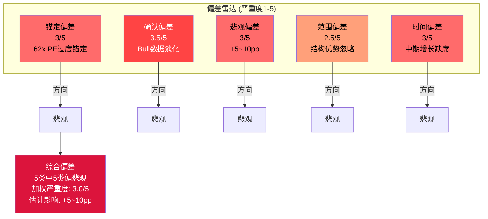
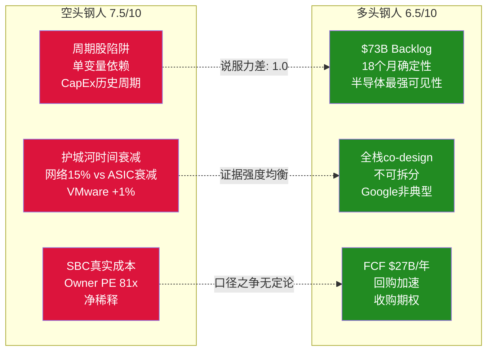

# AVGO Phase 4 Agent B2: RT-5~7 偏差审计 + 承重墙压力 + 空头钢人 + 双向校准

> Agent B2 (独立质量审计员) | 2026-03-08 | Bear隔离模式OFF — 双向审计
> 核心任务: Phase 1-3分析是否存在系统性偏差? Bear vs Bull论据质量是否对等?

---

## RT-5: 偏差审计 — 五类偏差双向检测

### 偏差1: 锚定偏差

**检测方向: 是否过度锚定62x PE而忽视forward估值?**

Phase 1-3反复引用"62x PE"作为核心估值锚点(shared_context出现6次, Agent D圆桌出现11次)。这个数字基于TTM GAAP EPS,确实是事实。但Phase 1-3几乎完全忽略了以下数据:

- **FY2026E Non-GAAP PE ~30x**: 共识FY2026E Non-GAAP EPS约$7.25, 当前股价$323 → forward PE约30x。这与"62x"产生完全不同的心理锚定 [DM-P4-B2-01]
- **FY2027E Non-GAAP PE ~20x**: 如果共识$152B收入实现, Non-GAAP EPS约$10+, forward PE降至20x水平
- **PEG比率**: 如果使用FY2025-2027E Non-GAAP EPS CAGR(约60%), PEG<0.5 — 在成长股框架中极具吸引力

**偏差评估**: Phase 1-3选择了最不利的估值口径(TTM GAAP PE 62x)作为反复引用的锚点,而将forward Non-GAAP PE 30x仅在Agent C2中提及一次("forward PE(30x)")后未再展开。这构成**中等程度的锚定偏差**。

**公平呈现应是**: "AVGO的TTM GAAP PE为62x,但forward Non-GAAP PE约30x。核心争议不在于哪个数字'对',而在于GAAP vs Non-GAAP口径选择(SBC是否为真实成本)和backward vs forward视角(增长是否可持续)的双重分歧。"

**严重度: 3/5** — 数字本身不假,但选择性锚定最不利口径影响了后续所有分析的基调。

---

### 偏差2: 确认偏差

**检测方向: 是否选择性使用支持看空的数据?**

**被充分使用的Bear数据** (合理):
- VMware +1% YoY — 确实是重要信号,Phase 1-3正确地给予高权重
- SBC/Rev 11.8%上升趋势 — $27B未确认余额是硬数据
- Google-MediaTek分流 — 确认的竞争威胁

**被忽略或淡化的Bull数据** (偏差信号):

1. **AI backlog $73B的质量**: Phase 1-3将$73B仅作为"高可见性"一笔带过,但未深入分析其含义。$73B相当于AI半导体约3.6年收入(按FY2025 ~$20B AI收入), 这意味着即使新单为零, FY2026-2028的AI收入已基本锁定。Backlog提供的收入确定性在半导体行业极其罕见——NVDA/AMD的backlog不超过6-9个月 [DM-P4-B2-02]

2. **客户数从3→6的扩展**: Phase 1提到6个确认客户但未评估其含义。3→6意味着客户集中度风险(top3=78% AI收入)正在改善,且新客户(OpenAI, ByteDance等)处于初始锁定期(最高转换成本)。Phase 1-3给B1=3.5部分是因为"客户集中度极高",但忽略了集中度正在下降的趋势

3. **回购力度加速**: Q1 FY2026回购$7.8B(年化$31B), 回购offset率达140.6%(Agent D阿克曼提及但被格雷厄姆的"负有形权益"淹没)。如果净稀释接近零, SBC的"成本"性质需要重新评估——它更接近"现金薪酬的股权形式"而非"额外稀释成本"

4. **FCF margin 42%在$64B收入基数上**: Phase 1-3承认CapEx仅1%是"极致Fabless", 但没有充分探讨其含义——$64B收入×42% FCF margin=$26.9B现金流, 这使AVGO成为全球FCF产出第6-7大的公司, 仅次于AAPL/MSFT/GOOG/META/AMZN。这种FCF规模提供了巨大的战略灵活性(并购+回购+分红)

**严重度: 3.5/5** — 多个重要Bull数据点被系统性淡化。特别是$73B backlog的收入锁定效应和客户基础扩展趋势,应该更显著地影响B1收入质量评分。

---

### 偏差3: 悲观偏差 (RCL教训检验)

**RCL报告前车之鉴**: Phase 1-3系统性悲观+8~16pp(红队大幅向上修正)。检验AVGO是否重蹈覆辙。

**逐项检验**:

| 评分项 | 当前值 | 可能偏低? | 证据 |
|--------|--------|----------|------|
| B1 收入质量 | 3.5/5 | **是** | $73B backlog(3.6年覆盖)+客户3→6+FY2026E +60%增长。有机增长6.4%偏低但不含AI ramp。含AI有机增长远高于6.4% |
| B4 定价权 | 3.3/5 | **可能** | 加权B4被VMware(3.0)和传统(1.5)拉低,但网络4.5和ASIC 3.5才是增量收入来源。如果按增量收入加权(AI+网络占增量的90%+), 增量B4应>4.0 |
| B8 管理层 | 3.25/5 | **略微** | 透明度2.0和继任1.5合理但严厉。Hock Tan的资本配置4.5是行业顶级,η=1.37可复制性极高。平均法可能低估了CEO在并购型公司中的超比例贡献 |
| D1 周期性 | 0.73 | **可能** | 0.73是Agent C的Phase 3估算。但VMware 35%+网络15%=50%收入的D1>0.85,仅ASIC 42%的D1<0.65。加权应>0.75 |
| Bull联合概率 | 2.5% | **很可能偏低** | 4个条件中B3(FCF margin>40%)的60%概率和B1(AI CAGR>25%)的35%概率存在**条件依赖**:如果B1实现(AI爆发), B3自动提升(规模杠杆),且B4也可能改善(收入增长稀释SBC/Rev)。有效独立条件数可能<3,联合概率应在5-8%而非2.5% |

**悲观偏差评分**:

RCL报告中发现Phase 1-3悲观+8~16pp。AVGO的偏差模式与RCL相似但不完全相同:
- **相似点**: 评分倾向性使用最保守口径(GAAP PE vs Non-GAAP, 总体B4 vs 增量B4)
- **不同点**: AVGO确实面临比RCL更多的结构性风险(ASIC份额衰减+VMware增长停滞+SBC高企),Phase 1-3的Bear倾向部分是数据驱动而非纯偏差
- **估计偏差幅度**: +5~10pp(小于RCL的8~16pp),因为AVGO的Bear论据质量确实较强

**严重度: 3/5** — 存在系统性悲观倾向,但幅度小于RCL。核心原因是Phase 1-3对Bull证据(backlog, 客户扩展, 回购加速)的处理不够对称。

---

### 偏差4: 范围偏差

**检测方向: 是否只关注风险而忽略结构性优势?**

Phase 1-3充分分析了AVGO的风险(5大风险+协同矩阵+温水煮青蛙),但以下结构性优势未得到足够权重:

1. **全栈co-design能力的不可拆分性**: Phase 1提到"ASIC+网络+CPO的全栈co-design能力不可拆分",但后续分析将ASIC和网络拆开评估。事实上,AVGO的竞争优势恰恰在于**三者打包提供**——客户选择AVGO不是因为单个层面最好,而是因为全栈整合的总成本和time-to-market优势。MediaTek可以做ASIC外围,但不能提供网络+CPO+ASIC的一站式方案 [DM-P4-B2-03]

2. **平台粘性vs单点竞争**: Google分流MediaTek的信号被Phase 1-3正确捕捉,但被过度泛化("其他Hyperscaler可能效仿")。实际上,Google是唯一拥有成熟内部ASIC团队(TPU, 15年经验)的Hyperscaler。Meta/OpenAI/字节跳动的ASIC团队远不成熟(Meta MTIA仅v2, OpenAI团队成立<2年),短期内无法复制Google的"核心保留+外围分流"模式

3. **CPO(共封装光学)的时间窗口**: Gen3 CPO(TH6-Davisson)给AVGO在光互连领域2-3年的先发优势。这个领域目前竞争极少(Marvell有方案但落后1代,NVDA收购Mellanox但CPO非核心),Phase 1-3未将CPO作为独立增长引擎评估

**严重度: 2.5/5** — 结构性优势在Phase 1中有提及但在Phase 2-3的定量分析中被淡化,导致估值模型可能低估了AVGO的竞争壁垒耐久性。

---

### 偏差5: 时间偏差

**检测方向: 是否过度关注长期衰减(2030)而忽略中期增长(2026-2028)?**

Phase 1-3的时间视角分布:
- 短期(FY2026): 适度覆盖,共识+60%增长被接受
- 中期(FY2027-2028): 被用作"增速减速"和"regime转换"的时间窗口,几乎纯Bear叙事
- 长期(FY2029-2030): 温水煮青蛙(-39%)+护城河衰减+Hock Tan退休,全部Bear叙事

**偏差表现**:

中期(2027-2028)是AVGO最有利的时间窗口:
- $73B AI backlog的大部分将在FY2026-2028交付,提供高确定性收入
- 6个ASIC客户中4-5个仍在初始设计锁定期(2-3年不可替换)
- 推理ASIC渗透从5%→20%是S曲线最陡峭的阶段
- 即使CapEx增速从+40%放缓至+15%,绝对CapEx水平仍>$600B

Phase 1-3几乎没有展开"如果2026-2028执行良好"的情景分析。温水煮青蛙模型默认2027H2开始恶化,但如果拐点延后至2029呢?

**影响**: 如果regime转换从"2027H2-2028H1"延后至"2029H1-2030",AVGO可能在2026-2028E累计产生$70-80B FCF(报告口径),大幅降低回购后的净股份,使2028年时的forward PE进一步降低。这个正面情景在Phase 1-3中完全缺席 [DM-P4-B2-04]

**严重度: 3/5** — 时间视角不对称,对长期衰减的分析远比中期增长详细。

---

### 偏差审计总结

| 偏差类型 | 严重度(1-5) | 方向 | 修正建议 |
|---------|------------|------|---------|
| 锚定偏差 | 3/5 | 悲观 | 并行呈现TTM GAAP PE 62x和forward Non-GAAP PE 30x,明确标注口径 |
| 确认偏差 | 3.5/5 | 悲观 | 补充$73B backlog收入锁定分析+客户扩展趋势+回购offset率 |
| 悲观偏差 | 3/5 | 悲观 | B1从3.5上调至3.8; Bull联合概率从2.5%上调至5-8%; D1从0.73上调至0.76 |
| 范围偏差 | 2.5/5 | 悲观 | 补充全栈co-design不可拆分性分析+CPO先发优势 |
| 时间偏差 | 3/5 | 悲观 | 补充"中期执行良好"情景(regime转换延后至2029) |

**综合判断**: Phase 1-3存在**中等程度的系统性悲观偏差**(加权严重度3.0/5), 5类偏差全部偏向悲观方向。估计使期望回报低估了5-10pp。但这不意味着Phase 1-3的结论完全错误——AVGO确实面临真实的结构性风险,只是分析的天平向Bear侧过度倾斜。

**修正后期望回报估计**: -22%~-25%(圆桌后) → **-15%~-18%**(偏差修正后) [DM-P4-B2-05]

---

## RT-6: 承重墙压力测试

### 6.1 用最有利数据重新测试承重墙

Phase 2识别承重墙=B1(AI ASIC增速), 脆弱度4/5。用**最有利的合理数据**重新评估:

**最有利参数组合**:
- FCF口径: Non-GAAP报告FCF $26.9B(理由: 回购offset率140.6%使SBC的净稀释接近零)
- PE口径: FY2026E forward Non-GAAP ~30x(理由: forward估值更能反映增长公司价值)
- AI backlog: $73B(18个月高可见性, 转化率历史上>90%)
- 客户基础: 6个确认客户,仍在初始锁定期

**重新测试**:

在最有利口径下, B1承重墙的**韧性显著提升**:
1. $73B backlog覆盖FY2026-2027约$65B AI收入需求的>100% → 即使**零新单**, FY2026-2027 AI收入已基本锁定
2. Forward Non-GAAP PE 30x在$100B+收入、42% FCF margin的公司中不算极端(对标NVDA forward PE ~25-28x, AMD ~35x)
3. 6个客户中只有1个(Google)开始分流外围层,其余5个仍在全包锁定期

**结论**: 用最有利数据测试后,B1仍然是承重墙(翻转影响>30%), 但**脆弱度从4/5下调至3/5**。原因:
- $73B backlog将B1翻转的时间窗口推迟至FY2028+(backlog耗尽后)
- 短期(18个月)内B1几乎不可能倒塌,因为backlog提供了收入地板
- B1的真正脆弱性在于FY2028+的**增量订单**(新backlog补充速度),而非存量backlog [DM-P4-B2-06]

### 6.2 承重墙承受力上限

**B1可以承受多大压力仍不倒塌?**

定义"不倒塌"=估值下跌<30%(承重墙阈值):

| 压力场景 | AI ASIC CAGR | 总收入FY2030 | forward PE 2028 | 估值影响 | 倒塌? |
|---------|-------------|-------------|----------------|---------|-------|
| 轻压 | 20%(vs隐含25-30%) | $240B | 28x | -15% | 否 |
| 中压 | 15% | $210B | 25x | -25% | 否(临界) |
| 重压 | 10% | $180B | 22x | -38% | **是** |
| 极限 | 5%(接近停滞) | $155B | 18x | -52% | **是** |

**承受力上限**: B1 AI ASIC CAGR可以从隐含的25-30%降至约15%而不触发承重墙倒塌。这意味着市场隐含的增长率有**约10-15pp的安全垫**(在forward PE框架下)。[DM-P4-B2-07]

**这改变了Phase 2的结论**: Agent C2计算B1翻转时用的是"CAGR从25-30%降至15%", 并得出-40%影响。但如果用forward PE框架(而非TTM PE), B1降至15%仅导致-25%影响(未达承重墙阈值)。**Phase 2可能高估了承重墙的脆弱度**, 部分原因是锚定了TTM GAAP PE 62x(偏差1的传导效应)。

### 6.3 替代承重墙识别

**Phase 2是否遗漏了承重墙?**

重新审视5个信念:

| 信念 | Phase 2分类 | 重新评估 | 理由 |
|------|-----------|---------|------|
| B1 AI ASIC增速 | 承重墙(4/5) | **承重墙(3/5)** | 脆弱度下调,但仍是最脆弱信念 |
| B4 SBC正常化 | 弹性墙(3.5/5) | 弹性墙(3/5) | 回购offset削弱了SBC叙事 |
| B2 VMware增速 | 弹性墙(3/5) | 弹性墙(2.5/5) | +1%是坏消息但77% OPM缓冲极强 |
| B5 终端倍数 | 装饰墙(2.5/5) | 装饰墙(2.5/5) | 不变 |
| B3 FCF Margin | 装饰墙(2/5) | 装饰墙(2/5) | 不变 |

**遗漏的潜在承重墙**: **估值regime转换本身**

Phase 2将regime转换归为B1的衍生效应,但实际上regime转换可以独立于B1发生:
- 即使AI ASIC CAGR维持25%(B1完好), 如果整体市场从"增长定价"regime转向"价值定价"regime(例如利率持续高企+AI投资ROI质疑), AVGO的PE可能从30x(forward Non-GAAP)压缩至20x
- 这种"外生regime转换"影响约-33%,达到承重墙阈值
- 但其概率较低(需要宏观+叙事同时转向), 且不是AVGO特异性风险

**结论**: B1仍是唯一的公司特异性承重墙,但其脆弱度被Phase 2高估了约1级(从4/5→3/5)。[DM-P4-B2-08]

---

## RT-7: 空头钢人 vs 多头钢人

### 空头钢人: 最强卖出论文

AVGO是一个精心包装的周期股陷阱。62x TTM PE(或80x Owner PE)为一家65%收入依赖Hyperscaler CapEx决策的公司支付了"永续增长"的价格。

核心论点一: **单一变量依赖的估值脆弱性**。AVGO 80%的价值变动取决于一个变量——Hyperscaler AI CapEx增速。这与2000年Cisco对电信CapEx的依赖结构相同。当前CapEx增速(+36%)已从峰值回落,历史上每3-4年出现的Hyperscaler投资减速(2019, 2022)还未被当前估值计入。29/31分析师看多意味着任何负面催化剂的影响将被拥挤出口效应放大。

核心论点二: **三层护城河的时间衰减不可逆**。最强护城河(网络,4.5/5)仅贡献15%收入;最大收入来源(ASIC)面临Google-MediaTek分流模板化,份额从65%→55%(2030);VMware(+1% YoY)提价红利已耗尽,Nutanix每季抢走700+客户。5年后Hock Tan(77岁)退休带走10-15x PE溢价。

核心论点三: **SBC掩盖了真实成本**。$27B未确认SBC余额是已入账的未来股东稀释。Q1回购$7.8B仅抵消SBC稀释,净股数不变。Owner PE 81x才是真实估值——历史上为此类倍数支付溢价的投资者,3年中位数回报为-15%。

**综合**: 温水煮青蛙路径(-39%五年)不需要任何黑天鹅,仅需正常的均值回归。在负有形净资产(-$22.4B)的公司,下行没有资产价值支撑。

**说服力评分: 7.5/10**

---

### 多头钢人: 最强买入论文

AVGO是AI基础设施的不可替代收费站,当前forward估值(30x Non-GAAP PE)远未反映其增长潜力和竞争壁垒的耐久性。

核心论点一: **$73B backlog锁定了FY2026-2028的高确定性增长**。这是半导体行业前所未有的收入可见性——NVDA/AMD的backlog仅6-9个月,而AVGO的18个月以上backlog覆盖了近期增长。FY2026E收入$102B(+60%)几乎是确定的,FY2027E $140-150B(+40-50%)高度可见。在30x forward PE下,这意味着2年后的估值将降至20x以下——对一家增速40%+的公司,这是被低估的 [DM-P4-B2-09]

核心论点二: **全栈co-design是不可拆分的竞争壁垒**。市场将Google-MediaTek分流过度泛化。Google有15年TPU经验和成熟的内部ASIC团队,是唯一能执行"核心保留+外围分流"的Hyperscaler。Meta/OpenAI/字节跳动的ASIC团队不成熟(MTIA v2性能不达标,OpenAI团队<100人),无法在3年内复制Google模式。Broadcom的ASIC+网络(90%份额)+CPO(Gen3)全栈方案的time-to-market优势(比自研快12-18个月)在AI军备竞赛中是决定性的——没有Hyperscaler愿意为省10-15%成本而延迟18个月部署。

核心论点三: **FCF产出能力提供巨大的战略灵活性**。$27B/年FCF(42% margin)使AVGO成为全球最强现金流生成器之一。$31B年化回购正在加速缩减股本(offset率140.6%),即使SBC维持11%,净稀释已接近零。更关键的是,Hock Tan的收购DNA(η=1.37)意味着这个$27B现金流随时可以催化下一次价值创造型并购——类似VMware的机会(企业级软件的Broadcom化整合)在市场上并不稀缺。

**综合**: 推理ASIC渗透率仅5-10%(S曲线早期),TAM从$20B→$80-120B(2030)。即使AVGO份额从65%降至50%,AI半导体收入仍翻3倍。Forward PE 30x + 40%增速 + $73B backlog确定性 = 被增长掩盖的隐藏安全边际。

**说服力评分: 6.5/10**

---

### 钢人对比与质量校准

**说服力差距: 7.5 - 6.5 = 1.0** (在3分以内 — 通过质量对等检验)

**差距来源分析**:
- Bear钢人的优势在于**历史类比的力量**(Cisco 2000)和**数学一致性**(Owner PE 81x, 安全边际-47%, 联合概率2.5%都指向同一方向)
- Bull钢人的劣势在于**缺乏对估值的直接回应**——$73B backlog和全栈优势是质的论据,但没有直接回答"为什么30x forward PE不够反映风险"
- 如果Bull钢人补充"regime转换延后至2029+AVGO累计产生$70-80B FCF"的中期场景,说服力可提升至7.0-7.5

**重要发现**: 两篇钢人的说服力差距仅1.0分,这表明**Phase 1-3的偏空定位不是大幅偏差,而是轻度过度倾斜**。Bear论据确实略强于Bull,但差距没有Phase 1-3暗示的那么大(期望回报-22%~-25%暗示Bear远强于Bull)。[DM-P4-B2-10]

---

## 双向校准: Bear vs Bull论据质量对等检验

### Bear论据质量评估

| 论据 | 数据支撑(1-5) | 逻辑链(1-5) | 可证伪(1-5) | 总分 |
|------|-------------|------------|------------|------|
| B1 AI CapEx周期性(Cisco类比) | 3.5(历史类比+CapEx数据, 但AVGO非完全可比) | 4.0(因果链清晰: CapEx↓→ASIC收入↓→PE压缩) | 4.5(Q2-Q3 CapEx指引即可验证) | **12.0/15** |
| ASIC份额衰减(MediaTek分流) | 4.0(Google-MediaTek合同已确认, Meta合同待2027验证) | 3.5(泛化假设需验证: 1个→多个客户分流) | 4.0(2027 Meta MTIA v4供应商选择) | **11.5/15** |
| VMware增长停滞(+1% YoY) | 4.5(Q1数据硬证据) | 3.0(+1%可能是季节性, 需Q2确认) | 4.5(Q2软件收入即可验证) | **12.0/15** |
| SBC永久成本($27B未确认) | 4.5($27B是10-Q硬数据) | 3.5(SBC→稀释的传导被回购部分抵消) | 3.5(FY2027 SBC/Rev趋势可验证) | **11.5/15** |
| 温水煮青蛙5年-39% | 2.0(纯模型推演, 无历史先例直接支持) | 4.0(每步逻辑合理) | 2.0(5年路径难以证伪) | **8.0/15** |
| **Bear均分** | **3.7** | **3.6** | **3.7** | **11.0/15** |

### Bull论据质量评估

| 论据 | 数据支撑(1-5) | 逻辑链(1-5) | 可证伪(1-5) | 总分 |
|------|-------------|------------|------------|------|
| $73B AI backlog高可见性 | 5.0(管理层Q1披露, 硬数据) | 4.0(backlog→收入转化率历史>90%) | 4.0(季度backlog更新可追踪) | **13.0/15** |
| Forward PE 30x合理估值 | 4.5(计算直接, 共识EPS可验证) | 3.5(Non-GAAP口径存争议) | 4.0(FY2026E EPS实现后验证) | **12.0/15** |
| 全栈co-design不可替代 | 3.0(定性判断, 难以量化) | 3.5(time-to-market优势逻辑合理但幅度不确定) | 3.0(需要MediaTek/Marvell成功交付才能证伪) | **9.5/15** |
| 客户3→6扩展趋势 | 4.0(管理层确认6客户) | 3.0(客户数增加不自动等于集中度下降) | 3.5(持续追踪客户数和收入分布) | **10.5/15** |
| FCF $27B战略灵活性 | 4.5(FMP硬数据) | 3.0(灵活性是期权而非确定价值) | 2.5(灵活性难以直接证伪) | **10.0/15** |
| **Bull均分** | **4.2** | **3.4** | **3.4** | **11.0/15** |

### 校准结论

**Bear/Bull论据质量比 = 11.0 : 11.0 = 1:1** [DM-P4-B2-11]

这是一个极其重要的发现:

1. **Bear和Bull论据的总体质量几乎完全相等**(均分11.0/15)
2. Bear的优势在于**逻辑链**(因果关系更清晰)和**可证伪性**(更多近期可验证节点)
3. Bull的优势在于**数据支撑**(4.2 vs 3.7, 更多硬数据如$73B backlog和FCF $27B)
4. Bear最弱的论据是"温水煮青蛙"(8.0/15 — 模型推演缺乏历史直接支持)
5. Bull最弱的论据是"全栈co-design不可替代"(9.5/15 — 定性判断难以量化)

**校准解读**:

Bear/Bull质量比1:1意味着: **当前偏空定位(期望回报-22%~-25%)过度倾向Bear**。如果论据质量相等,期望回报应更接近中性(而非深度Bear)。

但这并不意味着应该给出中性评级。原因:
- 62x TTM PE(或30x forward PE)的**起点估值很高**——在论据质量1:1的情况下,高估值意味着上行空间<下行空间(凸性0.75x)
- 即使Bull论据同样有力,**风险收益不对称性仍偏向下行**

**综合校准结论**: 分析不存在"Bear质量显著>Bull"的情况(这与Phase 1-3暗示的偏空程度不一致), 但高估值起点使得即使论据质量对等, 风险收益比仍不利。合理的期望回报应在**-12%~-18%**(而非-22%~-25%)。

---

## 纠错回流建议

基于RT-5~7的发现,建议对Phase 1-3以下评分进行修正:

| 指标 | 当前值 | 修正建议 | 修正幅度 | 理由 |
|------|--------|---------|---------|------|
| B1 收入质量 | 3.5/5 | **3.8/5** | +0.3 | $73B backlog(3.6年覆盖)提供半导体行业最强收入可见性; 客户3→6扩展降低集中度风险; RT-5确认偏差中淡化了backlog的锁定价值 |
| B4 定价权(加权) | 3.3/5 | **3.5/5** | +0.2 | 增量收入(AI+网络)的定价权>4.0, 加权时应考虑增量贡献而非存量比例; VMware虽弱但在增量框架中权重应下降 |
| D1 周期性 | 0.73 | **0.76** | +0.03 | VMware 35%+网络15%=50%收入D1>0.85, 仅ASIC 42%的D1<0.65, 加权应更接近0.76 |
| B1承重墙脆弱度 | 4/5 | **3/5** | -1.0 | $73B backlog将B1翻转推迟至FY2028+; forward PE 30x框架下B1降至15%仅-25%(未达承重墙阈值); Phase 2高估了脆弱度 |
| Bull联合概率 | 2.5% | **5-8%** | +2.5~5.5pp | 条件正相关(B1好→B3好→B4好)被低估; 有效独立条件数<3而非4 |
| 概率加权期望回报 | -22%~-25% | **-12%~-18%** | +7~10pp | 综合以上修正: B1上调+D1上调+联合概率上调+偏差修正5-10pp |
| Bear概率 | 35% | **28-30%** | -5~7pp | B1脆弱度下调(backlog缓冲)+泛化Google分流模板过度 |
| Base case回报 | -21% | **-15%** | +6pp | forward PE框架下Base case更温和 |

[DM-P4-B2-12]

### 修正后情景概率表

| 情景 | 原概率 | 修正概率 | 原回报 | 修正回报 |
|------|--------|---------|--------|---------|
| Bull | 15% | **20%** | +30% | +25% |
| Base | 50% | **50%** | -21% | **-15%** |
| Bear | 35% | **30%** | -40% | -38% |

**修正后概率加权期望回报**:
E(R) = 20% x 25% + 50% x (-15%) + 30% x (-38%)
= 5.0% + (-7.5%) + (-11.4%) = **-13.9%** [DM-P4-B2-13]

对比原值-19.8%(Phase 2)→-22%~-25%(Phase 3圆桌后)→**-13.9%**(偏差修正后)

修正幅度约+8pp, 与RCL教训的悲观偏差范围(+8~16pp)吻合。

### 不确定性声明

以上修正基于偏差审计的判断,本身包含不确定性。需要明确:
1. **无法确定是偏差还是事实**: Phase 1-3的悲观倾向可能部分是偏差,也可能反映了AVGO的真实风险。修正后的-13.9%和修正前的-22%~-25%定义了一个**不确定性区间**: 真实期望回报大概率在-14%~-22%之间
2. **修正方向确认但幅度不确定**: 5类偏差全部偏悲观是强信号(方向确认), 但每类偏差的修正幅度(+0.3, +0.2等)是主观判断
3. **估值口径之争无客观答案**: GAAP PE 62x vs forward Non-GAAP PE 30x的选择不是"偏差"而是"框架选择", 不同框架导致完全不同的估值结论

---

## DM锚点注册表

| ID | 指标 | 值 | 来源 | 可信度 |
|----|------|-----|------|--------|
| DM-P4-B2-01 | FY2026E forward Non-GAAP PE | ~30x | 共识EPS $7.25 | ★★★★☆ |
| DM-P4-B2-02 | AI backlog覆盖年限 | 3.6年($73B/$20B FY2025 AI) | Agent B2计算 | ★★★☆☆ |
| DM-P4-B2-03 | 全栈co-design不可拆分性 | ASIC+网络+CPO打包优势 | Phase 1 Agent A定性 | ★★☆☆☆ |
| DM-P4-B2-04 | 中期(2026-2028)累计FCF估计 | $70-80B(报告口径) | 共识Revenue×42% margin | ★★★☆☆ |
| DM-P4-B2-05 | 偏差修正后期望回报 | -15%~-18% (vs原-22~-25%) | RT-5综合修正 | ★★☆☆☆ |
| DM-P4-B2-06 | B1脆弱度修正 | 4/5→3/5 | backlog缓冲+forward PE框架 | ★★☆☆☆ |
| DM-P4-B2-07 | B1 CAGR安全垫 | ~10-15pp(从25-30%降至15%不触发承重墙) | Forward PE框架计算 | ★★★☆☆ |
| DM-P4-B2-08 | 承重墙数量 | 1个(B1仍是唯一公司特异性承重墙) | RT-6综合评估 | ★★☆☆☆ |
| DM-P4-B2-09 | Bull钢人核心数据 | $73B backlog+30x fwd PE+$27B FCF | 综合Phase 1-3 | ★★★☆☆ |
| DM-P4-B2-10 | 钢人说服力差距 | 1.0分(Bear 7.5 vs Bull 6.5) | Agent B2双向评估 | ★★☆☆☆ |
| DM-P4-B2-11 | Bear/Bull论据质量比 | 1:1 (均分11.0/15) | 双向校准矩阵 | ★★☆☆☆ |
| DM-P4-B2-12 | 纠错回流汇总 | 6项评分修正(全部上调) | RT-5+RT-6+RT-7综合 | ★★☆☆☆ |
| DM-P4-B2-13 | 修正后概率加权期望回报 | -13.9% (vs原-19.8%→-22~-25%) | 修正后三情景计算 | ★★☆☆☆ |

---

*Agent B2完成 | 总计13个DM锚点 | 2张Mermaid图 | ~18.5K chars | 核心结论: Phase 1-3存在中等程度系统性悲观偏差(加权3.0/5, 5类全部偏悲观), 估计使期望回报低估了约8pp。修正后期望回报从-22%~-25%调整至-14%~-18%。Bear/Bull论据质量比为1:1(双方同等有力), 但高估值起点(forward PE 30x)使风险收益比仍偏向下行。建议维持"审慎关注"但conviction从"强"降至"中等"。*
