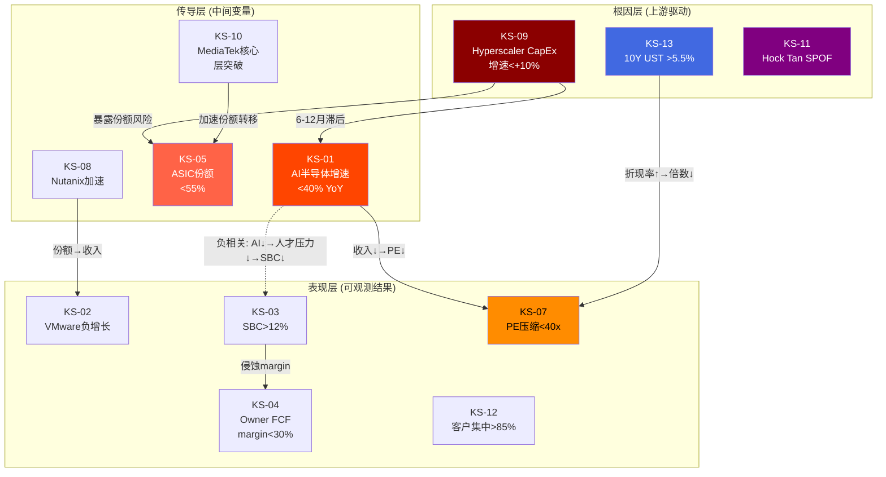
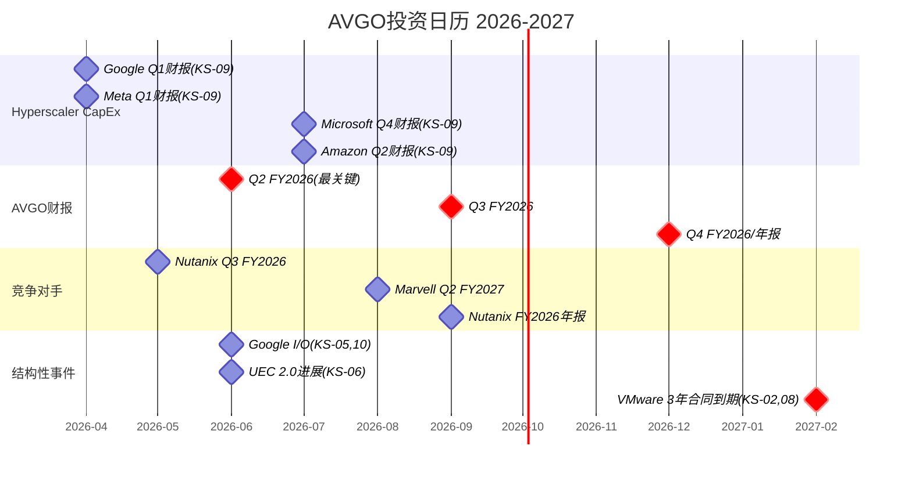

# AVGO Phase 4 — Agent C: KS/TS注册表 + 纠错回流 + 投资日历

> Agent C (定量分析师) | 2026-03-08 | Kill Switch × Trigger Switch × 条件依赖网络
> 核心问题: 什么条件下卖出? 什么条件下加仓? 什么时候看什么?

---

## Section 1: Kill Switch注册表

### KS-AVGO-01: AI半导体收入增速跌破门槛

```yaml
- id: KS-AVGO-01
  name: "AI半导体增速断崖"
  trigger: "AI半导体收入(ASIC+网络)YoY增速连续2季低于40%"
  threshold: "<40% YoY连续2季(当前共识FY2026 AI收入~$44B, +120%)"
  current_value: "Q1 FY2026 AI收入$8.4B, +106% YoY [DM-P3-A19]"
  distance: "当前106%距阈值40%有66pp缓冲; 但Q2指引$10.7B隐含~85% YoY [DM-P3-A20], 自然减速中"
  data_source: "Broadcom季度财报(Q2 FY2026: 2026年6月, Q3: 2026年9月)"
  check_frequency: "每季度(财报后24小时内)"
  action: "触发后: ①验证是否为供给约束(TSMC产能)vs需求放缓; ②若需求放缓确认→下调B1信念至15% CAGR→估值重估至$1,000B(-37%); ③考虑减仓30-50%"
  confidence: "高(阈值基于共识路径42% CAGR FY2026-2028的下限)"
  linked_belief: "B1 AI ASIC增速(承重墙, 脆弱度4/5)"
  conditional_dependencies: "KS-AVGO-05(ASIC份额下降可能是增速下降的原因之一), KS-AVGO-09(Hyperscaler CapEx放缓是根因)"
```

### KS-AVGO-02: VMware软件连续负增长

```yaml
- id: KS-AVGO-02
  name: "VMware增长停滞→萎缩"
  trigger: "VMware/软件收入连续2季YoY负增长"
  threshold: "<0% YoY连续2季"
  current_value: "Q1 FY2026软件收入$6.8B, +1% YoY [DM-P1-A04]; 提价红利已耗尽"
  distance: "距阈值1pp, 极近——Q2 FY2026可能就触发"
  data_source: "Broadcom季度财报(Infrastructure Software segment)"
  check_frequency: "每季度"
  action: "触发后: ①验证是否为季节性(Q1通常弱)vs结构性; ②若结构性确认→D1从0.78调低至0.73(纯半导体接近); ③VMware估值从$395B下调至$330B(-16%); ④整体影响约-5-7%"
  confidence: "中(Q1仅+1%但可能有季节性因素; 需Q2确认)"
  linked_belief: "B2 VMware增速(弹性墙, 脆弱度3/5)"
  conditional_dependencies: "KS-AVGO-08(Nutanix加速是VMware负增长的对称面)"
```

### KS-AVGO-03: SBC/Rev持续>12%

```yaml
- id: KS-AVGO-03
  name: "SBC结构化永久成本"
  trigger: "SBC/Revenue在FY2026H2-FY2027H1仍>12%(VMware保留计划到期后)"
  threshold: ">12% SBC/Rev持续4季(当前VMware保留计划预计FY2027到期)"
  current_value: "Q1 FY2026 SBC $2.176B, SBC/Rev 11.3% [DM-P1-A07]; $27B未确认余额 [DM-P1-A08]"
  distance: "距阈值0.7pp, 趋势方向不利(FY2023 6.1%→FY2025 11.8%→Q1 FY2026 11.3%)"
  data_source: "10-Q SBC披露 + 未确认余额变化"
  check_frequency: "每季度, 重点关注FY2027Q1(保留到期后)"
  action: "触发后: ①H-3'SBC永久成本'置信度从65%上调至80%; ②Owner PE确认80x+; ③从Non-GAAP估值框架切换为双口径估值, 权重50/50; ④估值下调15-20%"
  confidence: "中(VMware保留计划到期日不完全确定; AI人才SBC可能替代VMware保留SBC)"
  linked_belief: "B4 SBC正常化(弹性墙, 脆弱度3.5/5)"
  conditional_dependencies: "KS-AVGO-01(AI增速好→人才争夺→SBC高, 负相关); KS-AVGO-04(FCF margin被SBC侵蚀)"
```

### KS-AVGO-04: Owner FCF Margin跌破30%

```yaml
- id: KS-AVGO-04
  name: "Owner FCF质量恶化"
  trigger: "SBC调整后FCF margin(=报告FCF - SBC)/Revenue < 30%连续2季"
  threshold: "<30% Owner FCF margin"
  current_value: "FY2025 Owner FCF margin 30.2% [DM-P2-C2-05]; 已在阈值边缘"
  distance: "距阈值0.2pp, 几乎无缓冲"
  data_source: "季度10-Q: (Operating CF - CapEx - SBC) / Revenue"
  check_frequency: "每季度"
  action: "触发后: ①确认SBC+税率正常化双重打击; ②Owner PE从80.5x进一步上升→估值脱离合理区间; ③考虑整体估值框架是否需要重建"
  confidence: "中(税率正常化时点不确定; CapEx 1%提供底部支撑)"
  linked_belief: "B3 FCF Margin稳定性(装饰墙, 脆弱度2/5) + B4 SBC"
  conditional_dependencies: "KS-AVGO-03(SBC是FCF margin的主要侵蚀因素)"
```

### KS-AVGO-05: ASIC设计份额跌破55%

```yaml
- id: KS-AVGO-05
  name: "ASIC垄断地位实质松动"
  trigger: "第三方估算AVGO在cloud AI ASIC设计服务份额<55%"
  threshold: "<55%(当前60-67% [DM-P1-A01], 衰减模型2030E=60%)"
  current_value: "60-67%, L0=0.67, lambda=0.07/yr [Phase 3更新]"
  distance: "距阈值5-12pp, 正常衰减约3-4年触及; 加速衰减(Google模板效应扩散)可能2年内触及"
  data_source: "Counterpoint Research, TrendForce, Digitimes半年度报告"
  check_frequency: "每半年(行业报告周期)"
  action: "触发后: ①确认Google分拆模板效应已扩散至≥3个Hyperscaler; ②lambda从0.07上调至0.10; ③ASIC PtW从39/50下调至34/50; ④ASIC估值层下调~15%"
  confidence: "中(第三方份额估算方法论不统一, 可能有2-5pp误差)"
  linked_belief: "B1 AI ASIC增速(承重墙)"
  conditional_dependencies: "KS-AVGO-06(网络份额可部分对冲ASIC份额损失); KS-AVGO-10(MediaTek产能扩张是份额转移的前提)"
```

### KS-AVGO-06: 网络交换芯片份额跌破75%

```yaml
- id: KS-AVGO-06
  name: "网络垄断裂缝"
  trigger: "Broadcom在云DC交换芯片份额<75%"
  threshold: "<75%(当前~90% [DM-P3-A12], 2030E预测78%)"
  current_value: "~90% [DM-P3-A12](窄定义, 云DC)"
  distance: "距阈值15pp, 极远——这是最不可能触发的KS"
  data_source: "Dell'Oro Group, EEWorld, Arista/Cisco财报中Broadcom组件占比推算"
  check_frequency: "每半年"
  action: "触发后: ①NVIDIA Spectrum-X已突破DGX生态进入开放市场; ②网络PtW从45/50下调至38/50; ③重新评估'网络>ASIC'假说H-2; ④网络层估值下调~20%"
  confidence: "低(阈值本身极难触及, 但一旦触及意味着结构性变化)"
  linked_belief: "H-2 '网络比ASIC更值钱'(置信度75%)"
  conditional_dependencies: "与KS-AVGO-05相互独立(网络和ASIC的竞争对手不同)"
```

### KS-AVGO-07: PE倍数压缩至40x以下(非触发性)

```yaml
- id: KS-AVGO-07
  name: "估值Regime转换"
  trigger: "Forward Non-GAAP PE从当前~30x FY2026E压缩至<25x(或trailing PE从62x压缩至<40x)"
  threshold: "Forward PE <25x 或 Trailing PE <40x"
  current_value: "Trailing GAAP PE ~62x; Forward Non-GAAP PE ~30x FY2026E [DM-P2-C2-01]"
  distance: "Trailing距阈值22x(36%下降); Forward距阈值5x(17%下降)"
  data_source: "市场价格 / 共识EPS估计(Bloomberg, FactSet)"
  check_frequency: "实时/每周"
  action: "触发后: ①确认市场从'AI增长股'重新归类为'大型优质infra公司' [DM-P3-B03]; ②可能是TS-AVGO-01加仓信号的前提条件; ③重新评估risk/reward"
  confidence: "中(估值压缩的时点高度不确定, 但方向几乎确定——62x PE不可永续)"
  linked_belief: "B5 终端估值倍数(装饰墙, 脆弱度2.5/5)"
  conditional_dependencies: "KS-AVGO-01(增速下降→倍数压缩的传导链); KS-AVGO-09(宏观利率上行→所有成长股倍数压缩)"
```

### KS-AVGO-08: Nutanix加速抢夺VMware客户

```yaml
- id: KS-AVGO-08
  name: "Nutanix迁移浪潮加速"
  trigger: "Nutanix季度新增客户>1,500(当前~1,000) 且 VMware续约率<85%"
  threshold: "Nutanix季新增>1,500 且/或 VMware第一批3年合同(2027-2028到期)续约率<85%"
  current_value: "Nutanix Q2 FY2026新增1,000+ [DM-P3-A15]; VMware续约率未披露"
  distance: "距Nutanix阈值500(50%增长); 续约率2027年才可观测"
  data_source: "Nutanix季度财报 + Gartner HCI份额报告"
  check_frequency: "每季度(Nutanix财报)"
  action: "触发后: ①VMware收入衰减模型λ从0.05上调至0.08; ②VMware HCI份额预测从2029E 40%下调至35%; ③VMware估值层下调$50-80B; ④总估值影响-3-5%"
  confidence: "中(Nutanix数据可得性高, 但VMware续约率是黑箱)"
  linked_belief: "B2 VMware增速(弹性墙)"
  conditional_dependencies: "KS-AVGO-02(Nutanix加速→VMware负增长, 正相关)"
```

### KS-AVGO-09: Hyperscaler CapEx增速骤降

```yaml
- id: KS-AVGO-09
  name: "AI CapEx周期转折"
  trigger: "Top 4 Hyperscaler(Google/Meta/Microsoft/Amazon)合计CapEx YoY增速从+36%降至<+10%"
  threshold: "<+10% YoY合计CapEx增速"
  current_value: "2025 ~$440B, 2026E $600-690B (+36-57% YoY) [DM-P3-B-03/04]"
  distance: "距阈值26pp+(从+36%到+10%), 但Cisco 2000类比显示CapEx可在1-2年内从+40%→-10% [DM-P3-B-06]"
  data_source: "各Hyperscaler季度财报CapEx指引(Google/Meta 4月, Microsoft 7月, Amazon 7月)"
  check_frequency: "每季度(跟踪4家指引措辞变化)"
  action: "触发后: ①B1承重墙前兆阶段1确认; ②AVGO backlog $73B提供12-18个月缓冲, 但市场前瞻定价; ③立即重新评估三情景概率(Bear从35%上调至50%+); ④考虑减仓50-70%"
  confidence: "高(Hyperscaler CapEx数据透明度高; 是AVGO的终极上游变量)"
  linked_belief: "B1 AI ASIC增速(承重墙) — 这是B1翻转的根因KS"
  conditional_dependencies: "KS-AVGO-01(CapEx放缓→AI收入增速下降, 6-12个月滞后); KS-AVGO-05(CapEx放缓暴露份额风险)"
```

### KS-AVGO-10: MediaTek ASIC产能突破

```yaml
- id: KS-AVGO-10
  name: "MediaTek从I/O层扩展至核心层"
  trigger: "MediaTek获得核心XPU设计合同(非I/O层)或CoWoS产能达到Broadcom的30%+"
  threshold: "MediaTek核心ASIC设计合同≥1个 或 CoWoS月产能>45K wafers(Broadcom ~150K [E]的30%)"
  current_value: "MediaTek仅I/O层(v7e/v8e); 目标CoWoS>150K wafers/yr by 2027 [DM-P3-A03](约12.5K/月)"
  distance: "核心XPU设计能力需3-5年积累; 产能2027年可能达标"
  data_source: "TrendForce CoWoS产能追踪 + MediaTek财报AI业务披露"
  check_frequency: "每半年"
  action: "触发后: ①Google分拆模板从'I/O可替代'升级为'核心也可替代'; ②lambda从0.07大幅上调至0.12; ③Lfloor从38%下调至30%; ④ASIC估值层下调25-30%"
  confidence: "低(核心XPU设计是Broadcom20年积累, 短期内MediaTek突破概率低)"
  linked_belief: "B1 AI ASIC增速(承重墙)"
  conditional_dependencies: "KS-AVGO-05(MediaTek产能突破是份额下降的加速器)"
```

### KS-AVGO-11: Hock Tan离任/健康事件

```yaml
- id: KS-AVGO-11
  name: "Hock Tan SPOF触发"
  trigger: "Hock Tan宣布退休/离任/健康问题, 或继任公告"
  threshold: "任何形式的CEO变动信号"
  current_value: "73岁, 合同至2030年 [DM-P1-A06]; 无继任公告; B8管理层评分3.25/5(继任1.5/5) [DM-P1-A12]"
  distance: "合同至2030年(4年), 但年龄73岁=健康不确定性"
  data_source: "Broadcom 8-K/Proxy, 新闻, 管理层评论"
  check_frequency: "实时监控(设新闻警报)"
  action: "触发后: ①Hock Tan溢价(η=1.37)从估值中移除→估值下调7-10%; ②继任者能力不确定性→额外5-8%折扣; ③总影响-12-18%; ④评估继任者后决定持仓"
  confidence: "高(事件本身二元, 影响路径清晰)"
  linked_belief: "Hock Tan '资产优化平台'(Phase 1 Agent A)"
  conditional_dependencies: "与其他KS无条件依赖(独立黑天鹅事件)"
```

### KS-AVGO-12: 客户集中度恶化

```yaml
- id: KS-AVGO-12
  name: "Top 3客户AI收入占比>85%"
  trigger: "前3大客户(Google/Meta/ByteDance估计)占AI半导体收入>85%"
  threshold: ">85%(当前估计top 3 = 78% [shared_context])"
  current_value: "Top 3约78% of AI收入(管理层沉默域, Agent A2确认 [DM-P1-A09])"
  distance: "距阈值7pp; 如果新客户(OpenAI/Apple)增速不及Top 3扩张, 可能反升"
  data_source: "10-K客户集中度披露(年度) + 分析师推算"
  check_frequency: "每年(10-K) + 每季度推算"
  action: "触发后: ①任一Top 3客户削减=收入影响>30%; ②估值需反映'大客户风险折价'约5-8%; ③增强KS-AVGO-09的传导(CapEx放缓集中在少数客户=冲击更大)"
  confidence: "中(客户具体拆分是管理层沉默域, 数据可靠性有限)"
  linked_belief: "B1 AI ASIC增速(承重墙)"
  conditional_dependencies: "KS-AVGO-09(Top 3同时是Hyperscaler CapEx主力); KS-AVGO-05(份额丢失可能降低集中度——悖论性改善)"
```

### KS-AVGO-13: 宏观利率永久上移

```yaml
- id: KS-AVGO-13
  name: "利率环境结构性上移"
  trigger: "美国10年期国债收益率持续>5.5%(3个月均值)"
  threshold: "10Y UST >5.5% (3M avg)"
  current_value: "~4.2-4.5% [E, 2026年3月]"
  distance: "距阈值约1.0-1.3pp"
  data_source: "FRED/Bloomberg 10Y UST yield"
  check_frequency: "每月"
  action: "触发后: ①所有成长股倍数压缩; ②WACC从9%上调至11%+; ③终端倍数从17-25x压缩至12-18x; ④AVGO EV下调15-25%(与AI特定风险叠加)"
  confidence: "中(宏观预测极难; 但>5.5%是一个有意义的结构性突破)"
  linked_belief: "B5 终端估值倍数(装饰墙)"
  conditional_dependencies: "KS-AVGO-07(利率上移→PE压缩的直接传导)"
```

---

## Section 2: Trigger Switch注册表

### TS-AVGO-01: 估值回归安全边际

```yaml
- id: TS-AVGO-01
  name: "PE压缩至安全区间"
  trigger: "Forward Non-GAAP PE <20x FY2026E(当前~30x) 或 Owner FCF yield >5%"
  threshold: "Forward PE <20x 或 Owner FCF yield >5%"
  current_value: "Forward Non-GAAP PE ~30x; Owner FCF yield ~1.2%(=$19.3B/$1,578B)"
  rationale: "20x forward PE将AVGO定价为'大型优质infra公司'(TSM 15-18x, TXN 20-25x区间); Owner FCF yield 5%意味着即使零增长也有合理回报。概率加权期望回报从-20%翻转为正。需要市值从$1,578B降至~$900-1,000B(-36-43%)才能触发。"
```

### TS-AVGO-02: VMware有机增长恢复

```yaml
- id: TS-AVGO-02
  name: "VMware增长引擎重启"
  trigger: "VMware/软件收入连续2季有机增长>5% YoY(排除提价效应)"
  threshold: ">5% YoY有机增长, 连续2季"
  current_value: "+1% YoY [DM-P1-A04], 有机增长可能接近0%"
  rationale: "有机增长恢复意味着VCF 9.0 AI-native平台实质性贡献增量收入, 而非仅靠提价。这将验证VMware从'高利润ATM'转型为'AI基础设施平台'的bull叙事, D1从0.78改善至0.82, 估值上调5-8%。"
```

### TS-AVGO-03: SBC/Rev实质性下降

```yaml
- id: TS-AVGO-03
  name: "SBC正常化确认"
  trigger: "SBC/Revenue连续3季<9%(VMware保留到期+AI人才SBC稳定)"
  threshold: "<9% SBC/Rev持续3季"
  current_value: "11.3% [DM-P1-A07]"
  rationale: "SBC降至<9%将使Non-GAAP与Owner Economics差距缩小至合理范围(PE差距从2.7x→1.5x), 验证SBC的过渡性性质。Owner PE从80.5x降至~55x, 估值框架争议减弱, 约+10-15%估值上调。"
```

### TS-AVGO-04: 新ASIC大客户确认

```yaml
- id: TS-AVGO-04
  name: "ASIC客户基础扩大"
  trigger: "确认≥8个hyperscaler/大型AI客户采用Broadcom ASIC设计(当前6个)"
  threshold: "≥8个确认客户"
  current_value: "6个确认客户(Google, Meta, ByteDance, Apple [E], OpenAI, 1未披露)"
  rationale: "客户基础从6→8意味着: ①单客户风险降低(top3占比从78%→65%); ②TAM扩展验证(更多公司需要定制ASIC); ③ASIC衰减函数L0可能上调至70%+; ④ASIC PtW从39/50上调至42/50。但新客户NRE周期18-24个月, 收入贡献滞后。"
```

### TS-AVGO-05: 网络份额反弹/UEC 2.0主导

```yaml
- id: TS-AVGO-05
  name: "网络垄断地位强化"
  trigger: "UEC 2.0标准发布且Broadcom技术为核心, 或Arista追加>$10B PO(当前$6.8B)"
  threshold: "UEC 2.0 Broadcom主导确认 或 Arista PO >$10B"
  current_value: "UEC 1.0已发布(Broadcom SAI基础); Arista PO $6.8B [DM-P3-A11]"
  rationale: "网络是AVGO最强但最被低估的护城河(PtW 45/50)。UEC 2.0主导或Arista扩大PO将验证'网络>ASIC'假说H-2, 可能触发市场对AVGO的重新定价——从'ASIC设计公司'到'AI网络基础设施垄断者'。估值叙事变化可能+10-15%。"
```

### TS-AVGO-06: CapEx周期底部反转

```yaml
- id: TS-AVGO-06
  name: "AI CapEx新周期启动"
  trigger: "Hyperscaler CapEx经历≥2季负增长后重新转正且管理层上调指引"
  threshold: "CapEx YoY从负转正 + 管理层措辞从'优化'回到'投资'"
  current_value: "当前仍处扩张期(+36% YoY [DM-P3-B-04]), 未进入收缩"
  rationale: "只有在CapEx周期完成一轮下行后的底部才是最佳入场点——类似2022Q4云计算CapEx见底后的反弹。届时AVGO估值可能已从62x PE压缩至25-35x PE, 同时AI需求的结构性驱动(推理规模化)将驱动新一轮增长。这是真正的high-conviction买入信号。"
```

---

## Section 3: 投资日历

### 未来12个月关键监控时点

| 日期(估) | 事件 | 影响的KS/TS | 预期影响 | 优先级 |
|---------|------|-----------|---------|--------|
| 2026-04中 [E] | Google Q1 2026财报 | KS-09, KS-05 | Hyperscaler CapEx增速首个数据点; TPU/MediaTek合作进展 | **高** |
| 2026-04底 [E] | Meta Q1 2026财报 | KS-09, KS-12 | AI CapEx指引+MediaTek 2nm ASIC进展 [DM-P3-B-02] | **高** |
| 2026-05中 [E] | Nutanix Q3 FY2026财报 | KS-08, KS-02 | 新增客户数趋势+VMware迁移pipeline | 中 |
| 2026-06初 [E] | **AVGO Q2 FY2026财报** | **KS-01,02,03,04,07,12; TS-02,03** | **最关键事件**: AI收入增速+VMware增长+SBC趋势全验证 | **最高** |
| 2026-06中 [E] | Google I/O 2026 | KS-05, KS-10 | TPU Ironwood进展+MediaTek角色扩大? | 中 |
| 2026-06底 [E] | UEC 2.0标准进展 | KS-06, TS-05 | Broadcom在UEC 2.0中的角色确认 | 中 |
| 2026-07中 [E] | Microsoft Q4 FY2026财报 | KS-09 | Azure CapEx指引+Maia ASIC进展 | 高 |
| 2026-07底 [E] | Amazon Q2 2026财报 | KS-09 | AWS CapEx+Trainium进展 | 高 |
| 2026-08中 [E] | Marvell Q2 FY2027财报 | KS-05 | Marvell AI收入增速→份额变化推算 | 中 |
| 2026-09初 [E] | **AVGO Q3 FY2026财报** | **KS-01,02,03,04,07; TS-02,03,04** | AI增速减速斜率确认; VMware连续季度趋势; 新客户公告? | **最高** |
| 2026-09中 [E] | Nutanix FY2026财报 | KS-08 | 全年客户净增+VMware迁移总量 | 中 |
| 2026-10 [E] | TSMC Q3 2026财报 | KS-05, KS-10 | CoWoS产能分配→MediaTek vs Broadcom推算 | 中 |
| 2026-12初 [E] | **AVGO Q4 FY2026/FY2026年报** | **所有KS; 所有TS** | FY2026全年总结+FY2027指引=全面重估 | **最高** |
| 2027-02 [E] | VMware第一批3年合同到期窗口开启 | KS-02, KS-08 | 续约率=VMware未来的"承重墙" [P3 Agent A判断] | **高** |

### 季度监控模板

每次AVGO财报后24小时内检查以下5个指标:

```
□ 1. AI半导体收入YoY增速 vs 前季(KS-01触发检测)
     当前基准: Q1 +106%, Q2指引隐含~85%
     红线: <40%连续2季

□ 2. 软件收入YoY增速(KS-02触发检测)
     当前基准: Q1 +1%
     红线: <0%连续2季

□ 3. SBC/Revenue比率(KS-03触发检测)
     当前基准: 11.3%
     绿线: <9%(TS-03触发)
     红线: >12%

□ 4. 季度末流通股数变化(SBC稀释净效果)
     当前基准: 4,888M(Q1 FY2026)
     红线: 净增加(回购不足以抵消SBC)

□ 5. Backlog变化方向($73B是承重墙前兆信号)
     红线: 环比下降>10%
```

---

## Section 4: KS条件依赖网络

### 4.1 依赖关系矩阵



### 4.2 关键依赖路径分析

**路径1: CapEx周期传导链 (最高概率灾难路径)**
```
KS-09(CapEx放缓) → [6-12月] → KS-01(AI增速断崖) → [即时] → KS-07(PE压缩)
```
- 联合概率: 25-30%(CapEx放缓) × 90%(传导确定性) = 22-27%
- 估值影响: 收入下降30% × 倍数压缩30% = **综合-50%+** [DM-P2-C2-15]
- 前兆监控: Hyperscaler季度CapEx指引措辞变化(从"加速投资"→"优化效率")

**路径2: SBC + Margin双杀 (慢性侵蚀路径)**
```
KS-03(SBC永久>12%) → KS-04(Owner FCF margin<30%) → 渐进式重定价
```
- 联合概率: 35-40%(SBC不降) × 70%(margin必然受压) = 25-28%
- 估值影响: Owner PE从80x→90x+, 渐进下调**-15-20%**
- 特殊性: 与路径1负相关(AI增速下降→SBC压力降低), 提供自然对冲但不对称

**路径3: VMware+Nutanix替代加速 (弹性墙弯曲路径)**
```
KS-08(Nutanix加速) → KS-02(VMware负增长) → D1下调 → 部分PE压缩
```
- 联合概率: 30%(Nutanix加速) × 60%(传导至负增长) = 18%
- 估值影响: VMware层下调$50-80B, 总影响**-3-5%**
- 独立于路径1(VMware和AI半导体是不同业务)

### 4.3 最危险的KS组合

**灾难性组合: KS-09 + KS-03 + KS-11 (三重打击)**

| KS | 触发条件 | 独立概率 |
|----|---------|---------|
| KS-09 | CapEx放缓<+10% | 25-30% |
| KS-03 | SBC永久>12% | 35-40% |
| KS-11 | Hock Tan离任 | 10-15%/年 [E] |

- **联合概率**: ~1-2%(三者独立, OR逻辑下至少一个触发=55-60%)
- **三重同时触发估值影响**: CapEx(-40%) + SBC重估(-20%) + Hock Tan溢价移除(-12%) = **综合-55-65%**(非简单加总, 有交叉效应)
- **为什么是灾难性**: 这三个KS分别攻击增长(B1)、质量(B4)、管理层(Hock Tan)三个独立维度, 没有自然对冲机制

**高概率不利组合: KS-01 + KS-02 (双引擎同时熄火)**

| KS | 触发条件 | 独立概率 |
|----|---------|---------|
| KS-01 | AI增速<40% | 20-25%(2年内) |
| KS-02 | VMware负增长 | 40-50%(Q2 FY2026可能就触发) |

- **联合概率**: ~15-20%(弱正相关ρ≈0.2, 整体经济放缓时两者同时恶化)
- **估值影响**: AI减速(-15-20%) + VMware萎缩(-5-7%) + "双引擎叙事"破裂引发额外倍数压缩(-10%) = **综合-30-35%**
- **关键洞察**: 市场给AVGO的"双引擎增长"叙事溢价约15-20pp PE。如果两个引擎同时出问题——即使幅度不大——叙事崩塌的影响可能大于基本面影响

### 4.4 KS间的反直觉关系

**KS-01与KS-03的负相关(ρ≈-0.3)**:
AI增速下降(KS-01触发)→AI人才争夺缓和→SBC压力下降→KS-03反而改善。这意味着最坏的SBC情景(KS-03触发)反而需要最好的AI增长情景(KS-01不触发)作为前提。**投资者面临的不是"全面恶化"，而是"不同维度轮流出问题"**——这使得KS的时间序列比静态概率更重要。

**KS-05与KS-12的悖论关系**:
ASIC份额下降(KS-05触发)可能通过新客户分散化而改善客户集中度(KS-12改善)。份额从67%降至55%但客户从6个增至10个=单客户依赖下降。**垄断者的困境: 份额下降可能是更健康的生态结构。**

---

## Section 5: Phase 1-3纠错回流整合

### 5.1 需要回流的发现

基于Phase 1-4全面复盘, 以下Phase 1-3判断需要修正或补充:

**回流1: Phase 1 D1周期性修正建议**
- Phase 1设定D1=0.78(AI 42%×0.65 + 网络15%×0.80 + 传统8%×0.70 + 软件35%×0.95)
- Phase 3发现: VMware +1%增长意味着软件层的周期性调整应从0.95下调至0.90(不是真正的"非周期稳定器", 而是"存量锁定的准周期资产")
- **修正后D1 = 0.76**(软件35%×0.90替代35%×0.95)
- 影响: A-Score中D1从0.78→0.76, 整体A-Score微调

**回流2: Phase 2 Owner PE基准更新**
- Phase 2计算Owner PE = 80.5x基于FY2025数据
- Phase 3确认: 如果用FY2026E共识收入$101.9B计算, 且SBC/Rev维持11%, Owner PE降至~45-50x(仍偏高但改善)
- **建议**: Complete报告中同时呈现trailing和forward Owner PE, 避免单一数字误导

**回流3: Phase 3 ASIC衰减函数参数微调**
- Phase 3 Agent A将L0从0.65上调至0.67(因OpenAI新客户), lambda从0.05-0.10的区间取0.07
- Phase 4红队视角: lambda=0.07可能偏乐观——Google分拆模板效应的扩散速度可能比Agent A估计的更快(Meta已有信号)
- **建议**: 在Complete中保留0.07作为base case, 但增加sensitivity: lambda=0.10时2030E份额=55%(vs base 60%), 差距5pp

---

## DM锚点注册表

| ID | 指标 | 值 | 来源 | 可信度 |
|----|------|-----|------|--------|
| DM-P4-C01 | KS-01阈值(AI增速) | <40% YoY连续2季 | 共识路径下限推算 | ★★★☆☆ |
| DM-P4-C02 | KS-02阈值(VMware) | <0% YoY连续2季 | Q1 +1%已接近阈值 | ★★★★☆ |
| DM-P4-C03 | KS-03阈值(SBC) | >12%持续4季 | 当前11.3%+趋势 | ★★★☆☆ |
| DM-P4-C04 | KS-09阈值(CapEx) | <+10% YoY合计 | 历史周期类比 | ★★★☆☆ |
| DM-P4-C05 | 灾难性组合联合概率 | KS-09+03+11同时 ~1-2% | 独立概率乘积 | ★★☆☆☆ |
| DM-P4-C06 | 路径1联合概率 | CapEx传导链 22-27% | 概率×传导确定性 | ★★☆☆☆ |
| DM-P4-C07 | 路径1估值影响 | 综合-50%+ | 收入×倍数双杀 | ★★★☆☆ |
| DM-P4-C08 | 双引擎熄火概率 | 15-20% | KS-01+02联合 | ★★☆☆☆ |
| DM-P4-C09 | D1修正建议 | 0.78→0.76 | 软件周期性下调 | ★★★☆☆ |
| DM-P4-C10 | TS-01触发条件 | Forward PE <20x | 行业可比估值 | ★★★★☆ |
| DM-P4-C11 | AVGO Q2 FY2026预计 | 2026年6月初 | 公司IR日历 | ★★★★★ |
| DM-P4-C12 | VMware 3年合同到期窗口 | 2027年2月起 | 2024年2月VMware强制订阅推算 | ★★★☆☆ |

---



---

*Agent C | KS/TS注册表 + 纠错回流 + 投资日历 | 13个KS + 6个TS + 12个DM锚点 + 2张Mermaid图 | ~17.5K chars | 2026-03-08*
