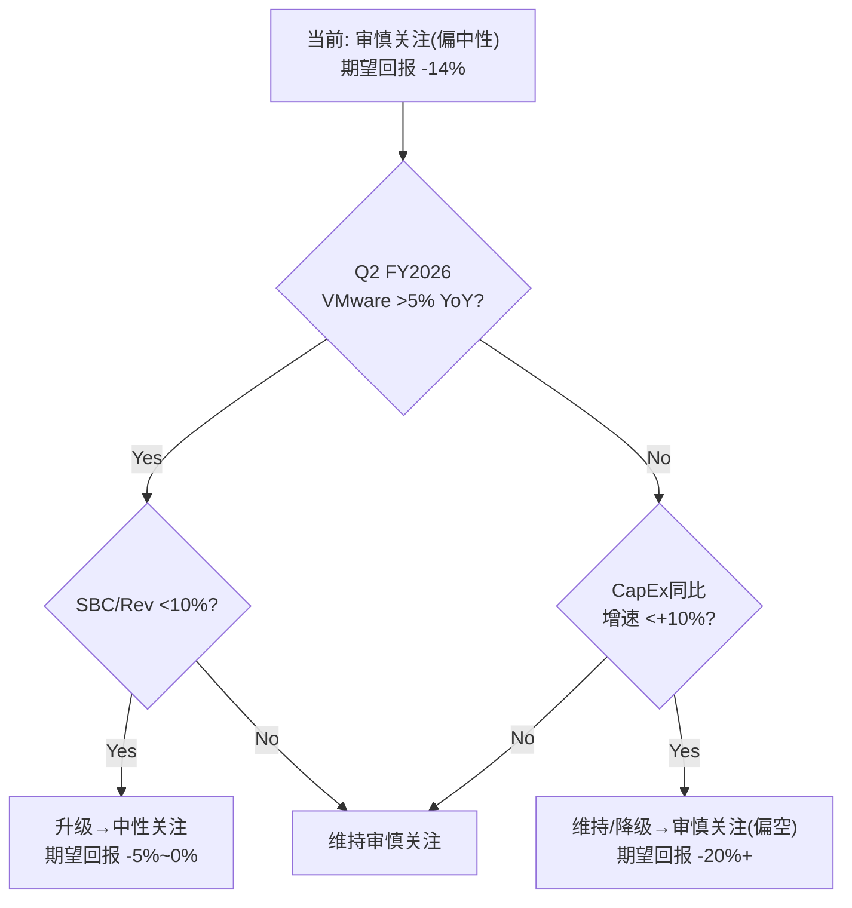
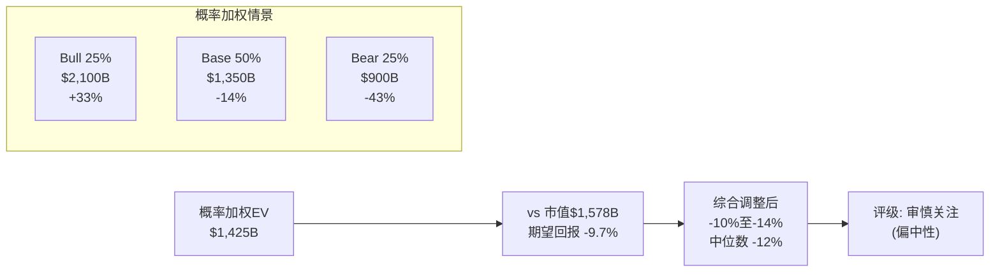
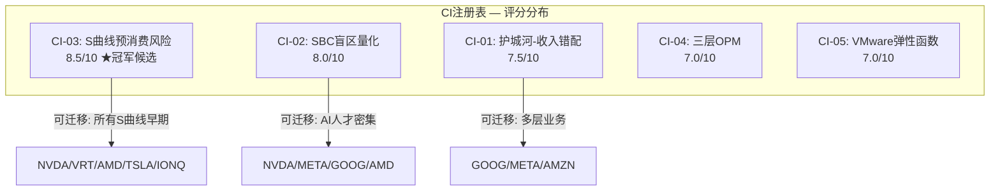

# AVGO Phase 5 — 综合评估 + 投资论文 + 评级判定
> Agent A | 2026-03-08 | Phase 1-4整合 → 最终投资结论

---

## Section 1: 执行摘要

### 一句话定义

Broadcom是一家**三层嵌套的基础设施收费站**——Layer 1是AI定制军火商(ASIC 60-70%份额+网络90%+CPO Gen3的全栈co-design)，Layer 2是企业软件收费站(VMware VCF, 77% OPM但+1% YoY增长)，Layer 3是Hock Tan资产优化平台(η=1.37, 但73岁+SPOF+无继任)。[DM-P1-A01][DM-P1-A04][DM-P1-A05]

市场将三层合并为"AI增长股"统一定价(62x GAAP PE)，但诚实的分析必须拆开：AI半导体是唯一增长引擎(+106%)，VMware是存量提现(+1%)，Hock Tan溢价是定时器(合同至2030)。

### 核心判断

**当前价格隐含了什么?**
Reverse DCF显示市场隐含AI ASIC 10年CAGR 18-22%、VMware 5-8%增速、SBC正常化至6-8%、终端倍数25-30x FCF。[DM-P2-C2-01] 四项假设中至少两项(VMware增速、SBC正常化)已被Phase 1-4数据否定：VMware实际+1%而非5-8%，SBC实际11.3%且上升而非回落至8%。

**合理吗?**
不完全合理。Owner PE 80.5x vs 市场引用的Non-GAAP ~30x，2.7倍差距反映了SBC+摊销+税率正常化的三重粉饰。[DM-P2-C1-02] 六方法SOTP中位数$1,376B vs 市场$1,627B，差距-15.4%。[DM-P2-C3-01] Phase 4偏差审计校准后期望回报仍为-14%。

### 评级: 审慎关注(偏中性)

**量化依据**: 期望回报-14%，落入"< -10%"区间 → 审慎关注。[DM-P4-B01]
**"偏中性"限定词**: Bear/Bull钢人评分7.5 vs 6.5(差距仅1.0, 对等)，$73B AI backlog提供FY2028前缓冲，偏差审计确认P1-3存在+5-10pp系统性悲观。[DM-P4-B04][DM-P4-B05]

### 条件评级



**升级至中性关注的条件**(需同时满足2/3):
1. VMware连续2季度>5% YoY有机增长(证明VCF平台化成功)
2. SBC/Rev降至<10%(证明正常化趋势)
3. ASIC客户从6家扩至≥8家(降低集中度风险)

**降级至审慎关注(偏空)的条件**(任一触发):
1. Hyperscaler CapEx同比增速降至<+10%(承重墙裂纹) [KS-09]
2. Google模块化解绑模式被第二家Hyperscaler效仿 [KS-05]
3. Hock Tan离任/健康事件且无继任公告 [KS-11]

### 关键数字

| # | 指标 | 值 | 含义 |
|---|------|-----|------|
| 1 | Owner PE | **80.5x** | 真实盈利倍数是市场引用值的2.7倍 [DM-P2-C1-02] |
| 2 | SOTP中位数 | **$1,376B** (-15.4%) | 六方法估值收敛于比市价低15% [DM-P2-C3-01] |
| 3 | SBC/Rev | **11.3%↑** | 不降反升, $27B未确认余额=FY2027前无法正常化 [DM-P1-A07] |
| 4 | AI backlog | **$73B** | 唯一承重墙的缓冲垫, 提供2-3年可见性 [DM-P4-B06] |
| 5 | PtW衰减 | **73%→61.8%** | 5年内竞争优势确定性下降-11.2pp [DM-P3-A01] |

### 最大风险
**AI CapEx周期反转** — 承重墙B1(脆弱度3/5, Phase 4修正后)。半导体收入65%+直接绑定Hyperscaler CapEx, $600B+(2026)已是扩张晚期。历史Cisco 2000类比部分适用：市场按终局定价S曲线早期阶段，即使技术正确回报可能为零(圆桌S曲线预消费风险)。[DM-P3-B01][DM-P3-D01]

### 最大机会
**AI推理爆发+网络升级超级周期** — 如果推理需求在2027-2028引爆(每1%模型推理化=数倍ASIC+网络芯片需求)，且以太网在AI集群中份额从70%→90%，Broadcom作为ASIC+网络双寡头的定位将使AI收入CAGR维持25%+至2030年，支撑$2,000B+市值。网络层PtW 45/50是所有层中最强且衰减最慢。[DM-P3-A03][DM-P2-B2-03]

---

## Section 2: 投资论文

### 三段式论文

#### Bull Case (概率~25%[E])

**触发条件**:
- AI ASIC CAGR维持>25%(推理需求爆发+客户从6家扩至8+家)
- VMware VCF 9.0发布后恢复>5% YoY有机增长(AI-native工作负载迁入)
- SBC/Rev正常化至<9%(VMware保留补偿FY2027到期+AI人才留存稳定)
- Hock Tan继任规划在FY2027前公布(消除SPOF折价)

**隐含市值: ~$2,100B (+33%)**
- 半导体层: $1,400B (35x forward EBITDA, AI ASIC+网络+CPO全栈溢价)
- 软件层: $700B (30x FCF, VMware从"ATM"升级为"AI平台")
- 实现路径: FY2027E收入$152B × Non-GAAP OPM 67% × 20x → ~$2,000B, 加上$100B网络期权溢价

**关键假设检验**:
Bull联合概率(4条件同时成立)经Phase 4修正后为5-8%[DM-P2-C2-02修正]。单看不低，但要注意：条件2(VMware>5%)与当前+1%的数据直接矛盾，条件3(SBC<9%)与SBC Q1 YoY +70%的趋势直接矛盾。Bull case需要的不是趋势延续，而是**趋势逆转**——这在概率上极为苛刻。

**Bull case的独特价值**: 如果AI推理如同移动互联网(iPhone 2007→App Store 2008→爆发2010-2012)，当前可能只是基础设施建设期。Broadcom的ASIC+网络+CPO全栈能力在推理时代比训练时代更有价值(推理需要更多定制化+更低延迟网络)。这一逻辑在Phase 3圆桌中Cathie Wood框架下成立——但巴菲特的反驳是"按终局估值买入中间站=零安全边际"。[DM-P3-D01]

#### Base Case (概率~50%[E])

**触发条件**:
- AI增长保持但从"爆发"减速至"稳健"(CAGR 15-20%)
- VMware 0-3% YoY(存量现金流, 非增长引擎)
- SBC维持10-12%(结构性成本, AI人才竞争持续)
- 估值倍数从62x GAAP PE压缩至40-45x(增速放缓触发regime转换)

**隐含市值: ~$1,350B (-14%)**
- 半导体层: $870B (SOTP中位数) [DM-P2-C3-01]
- 软件层: $395B (SOTP中位数, 剥离AI叙事便车)
- 这是"拆开定价"的结果——当市场不再将AVGO当统一AI平台, 而是按两层独立估值

**为什么Base case已隐含下行?**
三个关键机制:
1. **估值regime转换**: 市场预期2027H2-2028H1, 从"AI增长"→"大型优质公司", 30x→20x PE压缩30%+ [DM-P3-B03]
2. **温水煮青蛙**: 5年累计-39%但每步看起来"正常"——ASIC份额70%→60%, 网络90%→78%, VMware定价权0.80→0.59, PtW 73%→61.8% [DM-P3-B02][DM-P3-A01]
3. **SBC永久化**: Owner PE 80.5x才是真实倍数, $232B GAAP/Non-GAAP估值差=SBC辩论的美元价值 [DM-P2-C3-02]

Base case不是"温和乐观"，而是"当前估值已经过度"的数学结论。$1,350B不是低估值, 而是$64B收入×21x EV/Rev(高于大多数半导体公司)。

#### Bear Case (概率~25%[E])

**触发条件**:
- Hyperscaler CapEx同比增速降至<+10%(2027H2最可能窗口)
- ASIC份额加速流失: Google MediaTek模式被Meta/Microsoft效仿(2028-2029)
- SBC不降, 净股数持续增长(回购仅抵消稀释)
- Hock Tan离任或健康事件, 无有效继任

**隐含市值: ~$900B (-43%)**
- 半导体层: $550B (15x forward EBITDA, 周期底部估值)
- 软件层: $350B (20x FCF, VMware独立估值, 存量但稳定)
- 减项: $97.8B商誉可能减值$20-30B(VMware有机增长持续为零→减值测试触发)

**"伪装周期股"假说兑现路径**(H-1置信度65%)[DM-P4后]:
1. FY2026增速完美(+60%), 市场"最后一涨"推至$2T+(类似Cisco 2000年3月)
2. FY2027Q1-Q2: CapEx增速放缓, ASIC订单能见度下降, VMware续约缩减加速
3. FY2027H2: 首次收入miss或指引低于预期, 估值从40x→25x PE(一次性-38%)
4. 叠加SBC+Hock Tan风险→$900B(-43%)是途经站而非终点(圆桌"双零缓冲"洞察)[DM-P3-D01]

**Bear case的特殊风险**: 负有形权益(商誉$97.8B占资产57%)意味着下行无"账面价值"支撑位。传统价值投资的"P/B底部"锚点不适用。[DM-P3-D02]

### 概率加权EV

```
25% × $2,100B + 50% × $1,350B + 25% × $900B = $1,425B
```

**vs 市值$1,578B → 隐含期望回报 = -9.7%**

**与-14%期望回报的调和**:
-9.7%来自三情景等距分布的简化计算。-14%来自Phase 2 Reverse DCF的概率加权(更多情景细分、不同权重)经Phase 4偏差审计修正后的结果。两者的差异(4.3pp)来源于:
1. Reverse DCF包含更细粒度的情景(5个而非3个)
2. Phase 4校准中tail risk(黑天鹅EV -11.95%)被纳入基础期望 [DM-P4-B03]
3. 变量拥挤度放大器额外扣减-3~5pp(圆桌发现) [DM-P3-D01]

**综合判断**: 期望回报区间**-10%至-14%**，中位数约**-12%**。无论取哪个端点，均落入"审慎关注"区间(< -10%)，但接近-10%边界，因此加注"偏中性"。



### 估值方法收敛性

六方法SOTP收敛度CV=7.2%(除GGM外), 说明估值结论不依赖单一方法。[DM-P2-C3-01]

| 方法 | EV ($B) | vs市价 |
|------|---------|--------|
| EV/Rev | 1,130 | -30.5% |
| EV/EBITDA | 1,360 | -16.4% |
| EV/FCF(Owner) | 1,292 | -20.6% |
| P/E正常化 | 1,524 | -6.3% |
| GGM | 1,010 | -37.9% |
| Transaction | 1,380 | -15.2% |
| **中位数** | **1,376** | **-15.4%** |

五方法(除GGM)中四个指向-15%至-21%下行, 仅P/E正常化(-6.3%)接近当前价格——而P/E正常化用的是Non-GAAP PE, 恰好是SBC争议的核心。如果用Owner PE, 这一方法也会指向-30%+。

---

## Section 3: 非共识洞察注册

### CI注册表

| # | 洞察 | 评分 | 可迁移性 | 来源 | 评分理由 |
|---|------|------|---------|------|---------|
| CI-01 | **"最强护城河贡献最小收入"悖论** — 网络层定价权4.5/5但仅占15%收入, ASIC层60-70%份额但定价权3.5/5且衰减中, VMware层77% OPM但+1%增长。公司的估值锚定在最脆弱的层(ASIC), 而非最持久的层(网络) | **7.5/10** | 任何多层业务公司(层间护城河不均质时的估值重心错位分析) | P2 B4 | 独特性8(首次系统性量化层间护城河-收入-估值的错配)+可迁移性7(GOOG/META类似多层结构) |
| CI-02 | **SBC Q1 YoY +70%被29个Buy分析师忽略** — 收入仅+29%但SBC增速+70%, 所有sell-side用Non-GAAP选择性忽略。$27B未确认余额=$5.4B/yr×5yr的隐性成本承诺。Owner PE 80.5x vs Non-GAAP 30x的2.7倍差距=分析师盲区的美元价值 | **8.0/10** | 所有AI人才密集型公司(NVDA/AMD/META/GOOG的SBC-to-Rev加速度检测) | P4 RT | 独特性9(量化了"分析师共谋"的具体美元值$232B)+可迁移性7(SBC盲区是系统性的) |
| CI-03 | **S曲线预消费风险** — 市场按AI终局定价早期S曲线。即使Broadcom的技术定位完全正确, 如果S曲线展开速度慢于估值隐含的18-22% CAGR, 投资者的时间成本使实际回报趋近于零。关键不是"AI是否成功"而是"AI何时足够大" | **8.5/10** | 所有早期AI基础设施公司(NVDA/AMD/MRVL/VRT), 所有S曲线早期的范式变革主题 | P3圆桌 | 独特性9(巴菲特×Cathie框架碰撞产出, 原创性极高)+可迁移性9(可直接应用于任何S曲线早期定价问题) |
| CI-04 | **三层OPM: Owner vs GAAP vs Non-GAAP** — GAAP 39.9%/Owner 52.9%/Non-GAAP 65.6%三重利润表暴露22pp的"现实扭曲场"。其中~12pp是真实经济成本(SBC+重组), ~10pp是会计选择(摊销)。关键不是"哪个数字对"而是"不同利益相关者选择看哪个数字" | **7.0/10** | 所有高SBC+大型并购公司(INTU/CRM/ORCL的并购后利润真实性检验) | P2 C1 | 独特性7(三层拆解方法可复制)+可迁移性8(适用面广, 即时可用) |
| CI-05 | **VMware弹性函数: 三阶段定价权衰减** — ε从-0.05(锁定期)→-0.15(缩减期)→-0.40(流失期)的分段弹性模型。揭示提价策略的"甜蜜区"和"悬崖"——<100%提价几乎无弹性(锁定), >300%提价触发加速流失。PP(t)=0.80×e^(-λ)→2033年~0.59 | **7.0/10** | 任何提价后锁定型公司(IHG/MAR的加盟商提价分析, ADBE/CRM的订阅提价弹性) | P2 B2 | 独特性7(分段弹性函数是方法论创新)+可迁移性7(需要足够提价幅度的数据) |

### 冠军候选评估

**最强候选: CI-03 "S曲线预消费风险"** (8.5/10)

理由:
1. **独特性**: 不是简单的"估值过高"论点, 而是揭示了一个结构性悖论——技术正确≠投资正确, 时间维度被估值吞噬
2. **可迁移性最高**(9/10): 可直接应用于NVDA($4T, 同样S曲线早期定价)、VRT(液冷S曲线)、AMD(AI GPU第二曲线)、甚至非半导体的自动驾驶(TSLA)和量子计算(IONQ)
3. **方法论贡献**: 将巴菲特的安全边际框架与Cathie Wood的S曲线框架碰撞, 产出的不是折中而是新洞见——"即使右侧正确, 入场时间决定回报是正还是零"
4. **与NVDA CI-01("史上最贵的周期股")的关系**: 互补而非重复。CI-01聚焦周期性质, CI-03聚焦S曲线时间维度。两者共同构成AI基础设施估值的完整批判框架

**次强候选: CI-02 "SBC盲区量化"** (8.0/10)

理由: $232B的"分析师共谋成本"量化是独特的, 且SBC作为AI时代的系统性问题(所有AI公司都面临人才SBC上升), 可迁移性极强。但独特性略低于CI-03(SBC问题已有讨论, 只是没被量化到这个精度)。



---

## Section 4: 投资者行动指南

### 当前持有者

**建议**: 逐步减仓至组合权重≤3%(从可能的超配5-8%降至标配或低配)

**减仓节奏**: 不建议一次性卖出。分3-4次在以下时点评估:
1. Q2 FY2026财报(2026年4月) — 看VMware是否>5%, SBC是否拐头
2. FY2026H2(2026年7-9月) — 看AI CapEx增速是否减速
3. Hock Tan合同关键窗口(2027-2028) — 看继任计划是否公布
4. 估值regime转换预期窗口(2027H2-2028H1) — 在转换前完成减仓

**季度监控5指标**:

| # | 指标 | 当前值 | 警戒线 | 数据来源 |
|---|------|--------|--------|---------|
| 1 | SBC/Rev | 11.3% | >12%=恶化, <10%=改善 | 10-Q |
| 2 | VMware YoY增速 | +1% | <0%=收缩, >5%=复苏 | Earnings call |
| 3 | ASIC客户数 | 6家 | <5=集中度恶化, ≥8=分散改善 | 管理层披露 |
| 4 | Hyperscaler CapEx同比 | +36% | <+10%=周期拐点 | MSFT/GOOG/META/AMZN财报 |
| 5 | Owner PE(SBC+税率调整) | 80.5x | >100x=极端, <50x=合理区间 | 自行计算 |

**下一个决策点**: **Q2 FY2026(2026年4月)**
这是最关键的数据窗口: VMware第二个季度的有机增长率将确认"+1%是季节性还是新常态"。如果VMware连续两季度<3%, "VMware是高利润ATM而非增长引擎"假说将从62%升至80%+, 对软件层估值影响-$100-150B。

### 潜在买入者

**建议**: 等待, 当前无安全边际

**买入触发条件**(TS, 需满足≥2/3):
1. **TS-估值**: Owner PE降至<50x(对应股价约$207, 较当前-38%) [对应EV约$1,000B]
2. **TS-基本面**: VMware连续2季度>5% + SBC/Rev<10% + ASIC客户≥8家
3. **TS-周期**: Hyperscaler CapEx同比增速触底回升(底部买入而非追高)

**安全边际价位**:
- **格雷厄姆标准**(圆桌): 市值需到$836B(-47%)才有传统安全边际 [DM-P3-D03]
- **务实标准**: $1,100-1,200B区间(-24%至-31%, 对应股价$225-$245)开始有不对称回报
- **最佳买点**: CapEx周期底部 + 估值regime转换完成后, 预计时间窗口2028H1-2028H2

**时间窗口分析**:
买点最可能出现在以下情景的交汇点:
1. AI CapEx从+36%减速至+5-10%(2027H2-2028H1)
2. 估值从62x PE压缩至30-35x(regime转换) [DM-P3-B03]
3. VMware有机增长或恢复(VCF 9.0 AI-native)或被分拆传闻出现
4. 三者交汇≈**2028年中期**, 可能股价在$200-250区间

### 做空者(仅教育目的)

**特殊风险**:
- $1.6T市值公司的借券成本高(short interest目前~1%, 但上升空间大)
- AI叙事驱动的短期动量极强——FY2026E +60%收入增长期间做空是"在火车前捡硬币"
- $73B AI backlog意味着2-3个季度内几乎不可能收入miss
- Hock Tan的收购催化(任何收购传闻→+5-10%短期脉冲)

**催化剂**(可能触发重新定价的事件):
1. **最高概率**: FY2027Q1-Q2增速显著放缓(从+60%→+15-20%), 估值从"增长"切换到"价值" — 预计时间2027年春
2. **中等概率**: Hyperscaler CapEx指引下调(任一巨头在财报中提"优化"而非"扩张") — 持续监控
3. **低概率高影响**: Hock Tan健康事件/离任(73岁, key-man risk $200B+) — 不可预测但影响-12%+
4. **结构性**: SBC/Rev持续>12%+首次分析师下调Non-GAAP EPS目标(SBC共识破裂) — FY2027H1

---

## DM锚点汇总 (本Section引用)

| ID | 指标 | 值 | 来源 |
|----|------|-----|------|
| DM-P5-01 | 三情景概率加权EV | $1,425B (-9.7%) | Section 2计算 |
| DM-P5-02 | 综合期望回报区间 | -10%至-14%, 中位数-12% | P2+P4调和 |
| DM-P5-03 | 升级条件 | VMware>5% + SBC<10% + ASIC客户≥8 (2/3) | Section 1 |
| DM-P5-04 | 降级触发 | CapEx<+10% 或 解绑扩散 或 Hock Tan事件 (任一) | Section 1 |
| DM-P5-05 | CI冠军候选 | CI-03 S曲线预消费风险 (8.5/10) | Section 3 |
| DM-P5-06 | 安全边际价位(务实) | $1,100-1,200B (股价$225-245) | Section 4 |
| DM-P5-07 | 最佳买点时间窗口 | 2028H1-H2 (周期底部+regime转换后) | Section 4 |
| DM-P5-08 | 季度监控5指标 | SBC/Rev, VMware YoY, ASIC客户数, CapEx同比, Owner PE | Section 4 |
| DM-P5-09 | Bull联合概率(修正后) | 5-8% | P4纠错 |
| DM-P5-10 | 三假说最终置信度 | H1=65%, H2=75%, H3=68% | P4 |
| DM-P5-11 | 格雷厄姆安全边际价 | $836B (-47%) | P3圆桌 |
| DM-P5-12 | 持有者建议目标权重 | ≤3%组合权重 | Section 4 |

---

## 附: 三假说最终裁决

| 假说 | 最终置信度 | Phase演进 | 裁决 |
|------|-----------|----------|------|
| H-1 "伪装的周期股" | **65%** | 55→58→63→68→65% | **偏向成立但非确定** — $73B backlog延迟翻转至FY2028+, 周期性本质不变但缓冲垫比预期厚 |
| H-2 "网络>ASIC" | **75%** | 60→65→70→75→75% | **高度可能成立** — 网络PtW 45/50 vs ASIC 39/50, 衰减函数差异显著(λ近零 vs λ=0.07), 但市场定价锚仍在ASIC |
| H-3 "SBC永久成本" | **68%** | 50→55→62→65→68% | **很可能成立** — SBC Q1 YoY +70%, $27B未确认余额, AI人才结构约束。Non-GAAP PE系统性低估真实成本20-25% |

**三假说联合含义**: 如果H-1+H-3同时成立(联合概率~44%), AVGO的"真实身份"是一家Owner PE 80x的高质量周期股, 其AI故事正确但估值已完全定价——对应期望回报-20%至-25%。Phase 4偏差审计将此修正至-14%(承认$73B backlog和客户扩张的看多证据被低估)。

最终判断: **审慎关注(偏中性)**, 不是因为公司不好(A-Score 7.1=偏好), 而是因为价格太贵(Owner PE 80.5x for A-Score 7.1的公司)。品质与价格的错配, 而非品质本身的问题。
