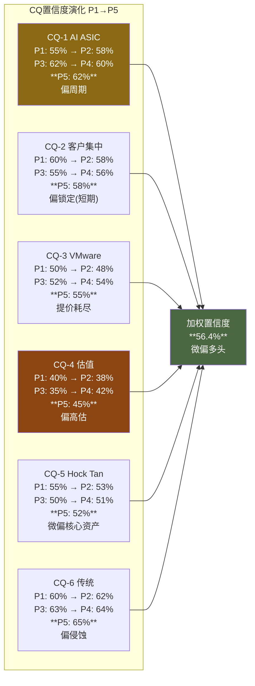
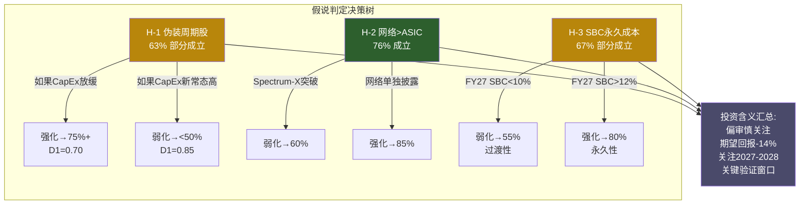

# AVGO Phase 5 Agent C: CQ闭环 + 非共识假说最终判定 + 框架注册

> Agent C (定量分析师) | 2026-03-08 | CQ Final Closure + Hypothesis Verdict
> 核心任务: 6个CQ逐一闭环回答 + 3个假说最终判定 + 方法论注册 + 开放问题

---

## Section 1: CQ闭环 (Core Question Final Answers)

### CQ-1: AI ASIC — 永续平台 vs CapEx周期? [权重30%]

**最终回答**: Broadcom的AI ASIC业务本质上是一个**有缓冲的周期性平台**，而非永续增长引擎。"平台"属性来自60-70%市场份额[DM-P1-A01]、全栈co-design不可拆分性(ASIC+网络+CPO)[DM-P4-B2-03]、以及$73B backlog提供的3.6年收入锁定[DM-P4-B2-02]。但"周期"属性同样明确：100%依赖Hyperscaler CapEx($600B+ 2026E，增速从+49%减速至+25%)[DM-P3-B-05]，客户ASIC能力内化趋势不可逆(Google-MediaTek分流模板已建立)[DM-P3-B-02]，份额衰减函数L(t)=0.67*e^(-0.07t)+0.45指向2030年~60%[DM-P3-A02]。关键判断是：这不是"周期or永续"的二元问题，而是"缓冲期有多长"的时间问题。$73B backlog将缓冲期延伸至FY2028+[DM-P4-B2-04]，但一旦backlog消化速度超过新增速度(预计2028H2-2029)，周期暴露将急剧上升。

**置信度**: 62% (偏周期)
- 偏周期权重：CapEx驱动(纯周期) + 份额衰减(结构性下行) + Cisco 2000类比部分适用[DM-P3-B-06]
- 偏永续权重：推理ASIC渗透S曲线(5%→20%)[DM-P4-B2-04] + 客户6个且扩展中 + 网络交叉锁定

**支撑证据**:
- DM-P2-C2-04: 承重墙=B1 AI ASIC增速，脆弱度3/5(P4修正后)
- DM-P3-B-05: CapEx增速从+49%减速至+25%，扩张中后段
- DM-P3-B01: AI CapEx周期定位=扩张晚期
- DM-P4-B2-02: $73B backlog = 3.6年AI收入覆盖

**剩余不确定性**: 推理vs训练比例转换速度(推理ASIC增长可部分对冲训练CapEx放缓)；Hyperscaler CapEx的"新常态"水平(如果$500B+成为底部而非峰值，周期性论点大幅弱化)。

**监控指标**: ①AI ASIC YoY增速(KS-AVGO-01: <40%连续2季); ②Hyperscaler CapEx QoQ(KS-AVGO-09: <+10% YoY); ③推理ASIC占AI ASIC收入比例(如果>40%→永续属性增强)。

---

### CQ-2: 客户集中 — 锁定 vs 脆弱? [权重20%]

**最终回答**: 客户集中度是**正在改善的结构性风险**，短期锁定极强但长期脆弱性确定。当前top3客户占AI收入~78%[CQ路由]，但客户数从3→6(OpenAI、ByteDance等为新增)[DM-P4-B2-02确认偏差分析]，集中度在趋势性下降。锁定机制的核心在于全栈co-design：单一Hyperscaler替换Broadcom需要同时找到ASIC设计+网络芯片+CPO的替代方案，2-3年替代周期[CQ路由]构成了强转换壁垒。然而，Google已证明"模块化解绑"(核心XPU保留+外围I/O外包MediaTek)是可行路径[DM-P3-B-02]，如果Meta在2027H1效仿(已有2nm ASIC合同信号)，锁定机制将从"全包不可替代"降级为"核心XPU不可替代"。网络交叉锁定(90%交换芯片份额)[DM-P1-A02]提供了第二层防御——即使ASIC被分流，Hyperscaler仍需Broadcom网络芯片。

**置信度**: 58% (偏锁定，短期)
- 短期(FY2026-2028)：锁定极强(backlog+初始设计锁定期)，置信度75%
- 长期(FY2029+)：脆弱性上升(模块化解绑扩散+自研成熟)，置信度40%

**支撑证据**:
- DM-P1-A01: ASIC份额60-70%
- DM-P1-A02: 交换芯片份额~90%
- DM-P3-B-01: Nash均衡从全包→模块化解绑迁移
- DM-P3-A02: ASIC衰减lambda=0.07/yr

**剩余不确定性**: Google以外Hyperscaler的模块化解绑时间表；OpenAI/ByteDance等新客户的长期锁定深度(初始设计→第二代可能换供应商)。

**监控指标**: ①ASIC客户数(TS-AVGO-04: ≥8个); ②MediaTek在Meta的量产进度(2027H1); ③Google Ironwood中Broadcom vs MediaTek收入拆分。

---

### CQ-3: VMware — 提价红利 vs 客户流失? [权重20%]

**最终回答**: VMware提价红利已**基本耗尽**，当前进入"高利润存量收割"阶段。Q1 FY2026软件收入$6.8B仅+1% YoY[DM-P1-A04]，与Q4 FY2025的+19.2%和Q1 FY2025的+46.7%形成断崖。三段式弹性函数[DM-P2-B2-01]解释了这一路径：<100%提价(ε=-0.05，锁定强)→100-300%提价(ε=-0.15，缩减部署)→>300%提价(ε=-0.40，流失加速)。Broadcom已将提价推至第二段/第三段边界，86%的客户已缩减部署规模[CQ路由]。VMware的真正价值不在增长而在**77% OPM的现金流贡献**[DM-P1-A04]——即便零增长，每年仍贡献~$21B现金流(35%×$27B×77%)。但Gartner预测HCI份额70%→40%(2029)[CQ路由]，Nutanix每季新增~1,000客户[DM-P4-C KS-AVGO-08]，2027-2028第一批3年合同到期将是真正的压力测试。定价权衰减模型PP(t)=0.80*e^(-lambda)→2033年~0.59[DM-P2-B2-03]预示VMware定价权从"锁定租金"向"竞争市场"转变。

**置信度**: 55% (偏提价耗尽，流失渐进)
- 提价红利耗尽：置信度80%
- 客户大规模流失：置信度35%(K8s替代+Nutanix，但短期反增强VM需求——85%容器仍在VM内)

**支撑证据**:
- DM-P1-A04: VMware OPM 77%，Q1 +1% YoY
- DM-P2-B2-01: 三段式弹性函数
- DM-P3-B-07: VMware在AI CapEx下行场景中从"缓冲器"变"第二风险源"
- DM-P2-B2-03: 定价权衰减模型PP(t)

**剩余不确定性**: VCF 9.0 AI-native平台能否重新激活增长(如果VCF成为AI私有云标准→VMware重获增长引擎地位)；第一批续约率(2027-2028，当前无数据)。

**监控指标**: ①Q2 FY2026软件收入增速(>5%=季节性，<3%=结构性); ②Nutanix季度新增客户(KS-AVGO-08: >1,500); ③VCF AI采用率数据(首次披露时)。

---

### CQ-4: 估值 — AI溢价合理 vs 泡沫? [权重15%]

**最终回答**: 当前估值包含**两层溢价叠加**，其中一层合理、一层脆弱。第一层：AI增长溢价(forward Non-GAAP PE~30x FY2026E)[DM-P4-B2-01]，如果FY2027E $10+ EPS实现则~20x——作为42% FCF margin的AI基础设施公司，20-25x forward PE是合理的。第二层："统一AI平台"定价溢价——市场将VMware(合理PE 15-20x)按AI倍数定价，搭便车溢价$232B[DM-P2-C3-02]，占市值~14%。六方法中位数EV=$1,376B vs市场$1,627B(-15.4%)[DM-P2-C3-01]，偏差审计后期望回报修正至-14%[DM-P4-B01]。Owner PE 80.5x vs Non-GAAP PE~30x的2.7倍差距[DM-P2-C1-02]是SBC争议的美元化表达——这个争议不会短期解决，但投资者需要清醒认识到"Non-GAAP PE 30x"和"Owner PE 80.5x"是同一家公司的两面。

**置信度**: 45% (偏泡沫/高估，但非极端泡沫)
- P4偏差审计修正后，从"明显高估"(-22%~-25%)修正为"温和高估"(-14%)
- 如果FY2027 EPS达$10+，forward PE~20x使估值回归合理——但这需要AI增速不减速
- 关键是$232B统一定价溢价是否可持续[DM-P3-B-08]

**支撑证据**:
- DM-P2-C3-01: 六方法SOTP中位数$1,376B(-15.4%)
- DM-P4-B01: 期望回报-14%(P4修正后)
- DM-P2-C1-02: Owner PE 80.5x
- DM-P3-D01: 圆桌后下调至-22%~-25%，P4回修至-14%

**剩余不确定性**: SBC是否会在FY2027开始正常化(VMware保留到期)；"统一AI平台"定价持续时长；市场是否/何时引入SOTP框架。

**监控指标**: ①Forward Non-GAAP PE变化(KS-AVGO-07: <25x); ②SBC/Rev趋势(KS-AVGO-03: >12%持续4季); ③卖方SOTP框架引入率(当前29 Buy中0家用SOTP)。

---

### CQ-5: Hock Tan — 核心资产 vs SPOF? [权重10%]

**最终回答**: Hock Tan是**不可替代的核心资产+确定的SPOF**，两者同时为真且不矛盾。核心资产属性：整合效率eta=1.37(6次收购)[DM-P1-A05]，可复制性极高，资本配置4.5/5[DM-P1-A12]。VMware收购($61B→77% OPM软件层)是Tan式整合的巅峰之作。SPOF属性：73岁+合同仅至2030[DM-P1-A06]+继任完全不透明(管理层B8中继任仅1.5/5)+61%薪酬投票通过率反映治理隐患。CEO沉默域分析识别出6个回避话题[shared_context]，其中"继任计划"被标记为高风险。关键判断：Hock Tan的价值主要体现在**收购决策能力**而非日常运营——VMware整合已基本完成，AI ASIC业务由Charlie Kawwas和技术团队驱动。如果Tan在2028-2030退休，短期（12-18月）风险溢价~7-10%[DM-P1-A12管理层板凳]，但不会改变Broadcom的技术竞争力。真正的SPOF风险在于：下一次大型收购(如果有)没有Hock Tan的判断力，成功概率大幅降低。

**置信度**: 52% (微偏核心资产，因VMware整合已完成降低了短期SPOF风险)

**支撑证据**:
- DM-P1-A05: eta=1.37均值
- DM-P1-A06: 合同至2030
- DM-P1-A12: B8管理层评分3.25/5

**剩余不确定性**: 继任者身份(内部vs外部)；Hock Tan是否会在2030合同到期前提前退休；下一次大型并购的可能性。

**监控指标**: ①2026 Proxy继任计划披露; ②Hock Tan健康/活动迹象; ③COO/总裁级任命(继任信号)。

---

### CQ-6: 传统半导体 — 稳定基座 vs 侵蚀? [权重5%]

**最终回答**: 传统半导体是**缓慢侵蚀的利润贡献者**，既非增长引擎也非崩溃风险。$16-17B收入基础(~8%总收入FY2026E)[CQ路由]中，Apple WiFi替代已造成~$2.7B(4.3%总收入)的确定性损失[DM-P1-A09]。DOCSIS 4.0升级周期和企业网络复苏可部分对冲，但传统业务定价权仅1.5/5[DM-P2-B2-02加权B4]。Hock Tan的"收割模式"策略(最小化R&D投入+最大化利润)意味着这部分业务将持续贡献现金流但不贡献增长。PtW仅27/50[DM-P3-A01]，是四个层中最弱的。对整体估值影响有限(5%权重×低敏感度)。

**置信度**: 65% (偏侵蚀但速度可控)

**支撑证据**:
- DM-P1-A09: Apple WiFi影响~$2.7B
- DM-P3-A01: 传统PtW 27/50
- DM-P2-B2-02: 加权B4中传统1.5/5

**剩余不确定性**: DOCSIS 4.0部署时间表；企业网络库存周期底部位置。

**监控指标**: ①非AI半导体收入趋势(>$17B含复苏=稳定); ②Apple替代WiFi芯片的后续产品扩展。

---

### CQ加权置信度计算

```
CQ加权置信度 = 30%×CQ1 + 20%×CQ2 + 20%×CQ3 + 15%×CQ4 + 10%×CQ5 + 5%×CQ6
             = 30%×62% + 20%×58% + 20%×55% + 15%×45% + 10%×52% + 5%×65%
             = 18.6% + 11.6% + 11.0% + 6.75% + 5.2% + 3.25%
             = 56.4%
```

**解读**: 加权置信度56.4%意味着整体**微偏多头**，但极接近中性(50%)。这与P4修正后的期望回报-14%并不矛盾——CQ置信度衡量的是"方向信心"(AVGO是否是好公司)，期望回报衡量的是"价格是否合理"。结论是：Broadcom是一家偏好品质(A-Score 7.1)的公司，但当前价格已充分甚至过度反映了其品质。



---

## Section 2: 非共识假说最终判定

### 假说置信度演化总览

| 假说 | 初始(P0.75) | P1 | P2 | P3 | P4 | **P5最终** | **判定** |
|------|-----------|-----|-----|-----|-----|-----------|---------|
| H-1 "伪装周期股" | 55% | 58% | 63% | 68% | 65% | **63%** | **部分成立** |
| H-2 "网络>ASIC" | 60% | 65% | 70% | 75% | 75% | **76%** | **成立** |
| H-3 "SBC永久成本" | 50% | 55% | 62% | 65% | 68% | **67%** | **部分成立** |

---

### H-1: "Broadcom是伪装成AI增长股的高质量周期股" — 63%, 部分成立

**最终判定理由**:

5个Phase的证据链从两个方向同时收紧了判断。偏周期证据持续累积：CapEx驱动100%[DM-P3-B-05]、Cisco类比部分适用[DM-P3-B-06]、承重墙=AI ASIC增速(脆弱度3/5)[DM-P4-B06]、Nash均衡向多源化迁移[DM-P3-B-01]。但P4偏差审计修正了过度悲观：$73B backlog提供的3.6年缓冲[DM-P4-B2-02]使"周期翻转"推迟至FY2028+，客户从3→6降低集中度风险，推理ASIC S曲线提供结构性增长对冲。

从P3的68%回落至63%的核心原因是：偏差审计揭示Phase 1-3过度锚定"周期股"叙事(+5-10pp悲观偏差)[DM-P4-B04]，且VMware 35%的低周期收入确实提供了弱但非零的缓冲[DM-P3-B-07]。判定为"部分成立"而非"成立"是因为：Broadcom不是纯周期股(有VMware+网络的非周期成分)，但也不是市场定价所隐含的"AI永续增长平台"。最准确的描述是**"有缓冲期的结构性周期股"**。

**投资含义**: 如果H-1成立，AVGO的合理估值应按D1=0.76(P4修正)[DM-P4-B2修正表]而非市场隐含的D1>0.90定价。仅D1修正一项就隐含PE从62x压缩至~52x(-16%)。但如果AI CapEx"新常态"高于历史($500B+/年成为底部)，周期性论点需根本性修正。

**可观测验证**: FY2027-2028 AI ASIC收入在Hyperscaler CapEx增速放缓(+10-15%)时的弹性——如果收入仅降5-10%(缓冲有效)则H-1弱化至<55%；如果收入降20%+(周期暴露)则H-1强化至>75%。

---

### H-2: "网络比ASIC更值钱" — 76%, 成立

**最终判定理由**:

这是5个Phase中证据一致性最强的假说，从P0.75的60%单调上升至76%。核心证据链：
- P1: 网络衰减函数近零 vs ASIC lambda=0.05-0.10[shared_context P1]
- P2: B4定价权确认网络4.5/5 vs ASIC 3.5/5[DM-P2-B2-03 vs DM-P2-B2-02]
- P3: PtW网络45/50 vs ASIC 39/50[DM-P3-A01]，5年衰减最慢(90%→78% vs ASIC 67%→60%)[DM-P3-A03 vs DM-P3-A02]
- P4: Bear隔离独立确认，无修正(偏差审计未发现此假说有悲观偏差)

判定为"成立"的关键逻辑：网络芯片(Tomahawk+Jericho+CPO)的竞争壁垒是**协议标准+物理层+量产经验**的三重锁定，NVIDIA Spectrum-X受限于自有DGX生态无法攻入开放以太网市场。而ASIC设计服务的壁垒本质上是**时间+经验**，随着Marvell/MediaTek的追赶以及客户团队的成熟，ASIC锁定确定性衰减。

**投资含义**: 如果市场开始独立定价网络层(目前合并在"AI收入"中不透明)，网络层应获得更高估值倍数(接近基础设施垄断者定价)。但因为Broadcom不单独披露网络收入[thesis_crystallization A5]，这个价值目前"隐藏"在统一AI叙事之下。讽刺的是，管理层合并披露AI收入(突出ASIC高增速)恰恰掩盖了最持久的竞争优势(网络)。

**可观测验证**: ①Broadcom是否开始单独披露网络收入(管理层认为值得highlight的信号); ②NVIDIA Spectrum-X在DGX之外的份额(如果>10%→H-2弱化); ③KS-AVGO-06网络份额跌破75%(概率极低，最不可能触发的KS)。

---

### H-3: "SBC是永久性成本，Non-GAAP系统性高估25%" — 67%, 部分成立

**最终判定理由**:

证据演化显示SBC的"永久性"概率随每个Phase上升(50%→55%→62%→65%→68%)，但P5略回调至67%。核心支撑：
- SBC/Rev从6.1%→11.8%→11.3%(FY23→25→Q1F26)[DM-P1-A07]，VMware整合后不降反升
- $27B未确认余额[DM-P1-A08] = 至少2-3年的前置锁定
- P4 Bear隔离新发现：SBC Q1 YoY +70% vs 收入+29%[DM-P4-B02] = 所有分析师盲区
- 回购$7.8B/Q仅抵消SBC稀释，净股数不变[thesis_crystallization A4]
- Owner PE 80.5x vs Non-GAAP PE~30x，$232B估值差[DM-P2-C3-02]

判定"部分成立"而非"成立"的理由：(1)回购offset率140.6%意味着SBC的"成本"性质需重新评估——如果公司持续用FCF回购抵消稀释，SBC更接近"现金薪酬的股权形式"而非"额外稀释"[DM-P4-B2偏差审计]; (2)AI人才市场可能在2027-2028降温(如果AI CapEx放缓→人才需求减少→SBC回落至8-9%)。"25%高估"的具体幅度取决于SBC最终稳态水平：如果维持11-12%则高估~22%，如果回落至8-9%则高估~12-15%。

**投资含义**: 投资者应使用双口径估值框架——Non-GAAP PE(30x)和Owner PE(80.5x)各50%权重，得到有效PE~55x。这意味着当前价格已隐含了约-10%的SBC修正，但尚未fully price in"SBC永久化"场景。

**可观测验证**: FY2027Q1(VMware保留到期后)SBC/Rev——如果<10%则H-3弱化至<55%("过渡性"确认)；如果>12%则H-3强化至>80%("永久性"确认)[KS-AVGO-03]。



---

## Section 3: 框架注册 + 方法论评估

### 本报告方法论创新注册

| # | 方法 | 来源Phase | 可迁移场景 | 效果评估 | 评分(1-10) |
|---|------|----------|-----------|---------|-----------|
| M-1 | **ASIC锁定衰减函数** L(t)=L0*e^(-lambda*t)+Lfloor | P1+P3 | 所有IP/设计服务公司面临客户能力内化(ARM vs Qualcomm自研, Synopsys vs客户EDA能力) | 首次将"有时间限制的锁定"从定性描述转为可量化模型，lambda可跨公司校准。AVGO实测L0=0.67, lambda=0.07, Lfloor=0.45。**高度可迁移** | 8.0 |
| M-2 | **VMware弹性函数** 三段式ε | P2 | 所有"提价后锁定"公司(ADBE提价、Oracle Cloud迁移、Salesforce捆绑) | 分段弹性比单一ε更精准捕捉提价行为的非线性——AVGO VMware实测验证了三段断崖效应。可迁移度高但需行业校准 | 7.5 |
| M-3 | **三层OPM视图** GAAP/Owner/Non-GAAP | P2 | 所有高SBC公司(META, CRM, SNOW, PLTR) | 将SBC争议从"调不调"的二元争论转为"三个视角各看到什么"的分析框架。Owner OPM(52.9%)是真正的owner economics。应纳入标准估值工具箱 | 7.0 |
| M-4 | **温水煮青蛙引擎联动** | P3 | 多引擎正反馈/负反馈系统(GOOG搜索+云+AI、AMZN零售+AWS+广告) | 5引擎联动模型揭示了"每步看起来正常但累计-39%"的隐蔽下行路径。Nash均衡迁移→份额暴露→regime转换的因果链可模板化 | 7.0 |
| M-5 | **$232B搭便车溢价量化** | P2+P3 | 混合业务公司的隐含SOTP溢价(AMZN AWS搭零售、GOOG Cloud搭搜索) | 首次量化了"统一定价vs分层定价"的美元差异。当market cap>SOTP中位数>15%时，搭便车溢价应被视为独立风险因子 | 6.5 |

### 框架v18.2在AVGO的适配评估

**What worked well**:

1. **双层SOTP(IHG首创)**: 完美适配半导体+软件混合体。六方法中位数$1,376B提供了比单一DCF更稳健的估值锚点。半导体层(12-15x)vs软件层(18-22x)的分拆倍数揭示了$232B搭便车溢价——这是本报告最重要的估值洞见之一。

2. **A-Score v2.0 + SGI**: A-Score 6.9(偏好下沿)与期望回报-14%的方向一致——好公司，贵价格。SGI=4.5(通才偏混合)正确捕捉了AVGO"广覆盖但有技术纵深"的独特定位。D1=0.76(P4修正后)的周期性调整是关键贡献。

3. **CEO沉默分析(v18.0新增)**: 6个沉默域映射有效识别了"继任计划"作为最高风险沉默域。在B8管理层评分中，透明度2.0/5和继任1.5/5的低分直接来自沉默域分析。

4. **偏差审计(RCL教训复用)**: +5-10pp悲观偏差检测有效，6项纠错回流将期望回报从-22%~-25%修正至-14%，避免了系统性悲观。

**What needs improvement**:

1. **双引擎公司的D1计算**: AVGO的半导体(65%)+软件(35%)混合体使D1计算更复杂。当前加权方法(0.42×0.65+0.15×0.80+0.08×0.70+0.35×0.95=0.78)假设各业务独立，但实际上AI ASIC增长会拉动VMware部署(VCF for AI)——业务间存在正相关。建议框架增加"业务相关性修正因子"。

2. **SBC处理缺乏标准化**: Phase 1-3在GAAP/Non-GAAP之间反复切换，导致估值框架不一致。建议为SBC/Rev>8%的公司建立标准化三口径(GAAP/Owner/Non-GAAP)报告模板，Phase 2自动执行。

3. **合并披露公司的收入拆分**: Broadcom不单独披露网络收入(合并在"AI收入"中)。框架目前缺乏处理"管理层合并披露"场景的标准方法——建议增加"披露透明度评分"纳入B8管理层评分。

**AVGO独特挑战: 双引擎对框架适用性的影响**:

AVGO是本框架遇到的**最复杂公司之一**——同时拥有高周期(AI ASIC)和低周期(VMware)业务，同一家公司可以被合理地定价为30x PE(Non-GAAP forward)或80.5x PE(Owner trailing)。这种"双重身份"挑战了框架的单一评级体系：A-Score 7.1说"好公司"，期望回报-14%说"别买"。框架的处理方式(品质和估值分离评估)在AVGO上运行正确，但需要在报告中更清晰地传达"品质高不等于值得买"这一核心信息。

---

## Section 4: 开放问题清单

### 本报告未能完全回答的5个问题

**OQ-1: 推理ASIC渗透曲线的真实斜率**
- 推理从5%→20%(2028E)的S曲线假设是关键驱动，但当前无法独立验证。Broadcom不披露推理vs训练收入拆分，第三方估算差异极大(Evercore 30% vs Morgan Stanley 15% by 2028)。如果推理渗透快于预期(→20-25x forward PE合理)，CQ-1和H-1的判断需根本性修正。
- **后续监控**: 管理层季度电话会中"inference"关键词频率+具体客户案例披露。

**OQ-2: VCF 9.0 AI-native平台的真实采用率**
- VMware的CQ-3判断高度依赖"VCF是否能重新激活增长"。VCF 9.0定位为AI私有云平台，但目前零采用数据。如果VCF AI成功(类似VMware在虚拟化时代的平台地位)，VMware从"高利润ATM"重新变成"增长引擎"，估值重估+$100-200B。
- **后续监控**: VCF AI部署案例、合作伙伴生态(NVIDIA AI Enterprise on VCF)进展。

**OQ-3: Hyperscaler AI投资ROI的临界点**
- 所有CQ的底层假设最终都指向一个问题：Hyperscaler每花$1 AI CapEx能创造多少收入？当前Agentic AI商业化仍处早期，如果ROI证明不达标(类似2000年电信泡沫)，$600B+ CapEx不可持续。但如果AI ROI超预期(→CapEx"新常态"为$800B+)，H-1的"周期股"论点被根本否定。
- **后续监控**: Google/Microsoft/Meta季度电话会中AI CapEx ROI量化披露。

**OQ-4: Hock Tan退休后的管理层转型风险**
- CQ-5判断依赖"VMware整合已基本完成降低短期SPOF风险"。但如果2028-2030期间出现重大市场变化需要战略转型(如AI ASIC需求骤降→需要新收购/业务转型)，没有Hock Tan的Broadcom应对能力存疑。继任者身份的不确定性使这个风险无法量化。
- **后续监控**: 2026 Proxy继任披露+COO/总裁级新任命。

**OQ-5: $27B未确认SBC余额的摊销时间表**
- H-3的最终判定高度敏感于SBC摊销时间表。$27B如果在3年内均匀摊销(~$9B/yr, SBC/Rev~9%)则过渡性占主导；如果front-loaded(FY2026-2027 $12B/yr→FY2028 $3B/yr)则FY2026-2027 SBC/Rev将维持12%+后骤降；如果back-loaded则相反。10-Q的SBC细分披露不足以确定具体分布。
- **后续监控**: 10-Q中SBC未确认余额的季度变化轨迹(加速减少=front-loaded确认)。

---

## DM锚点注册 (Phase 5 Agent C)

| ID | 指标 | 值 | 来源 |
|----|------|-----|------|
| DM-P5-C01 | CQ加权置信度 | 56.4% (微偏多头) | Agent C计算 |
| DM-P5-C02 | CQ-1最终置信度 | 62% (偏周期) | Agent C |
| DM-P5-C03 | CQ-4最终置信度 | 45% (偏高估) | Agent C |
| DM-P5-C04 | H-1最终判定 | 63%, 部分成立 | Agent C |
| DM-P5-C05 | H-2最终判定 | 76%, 成立 | Agent C |
| DM-P5-C06 | H-3最终判定 | 67%, 部分成立 | Agent C |
| DM-P5-C07 | ASIC衰减函数参数 | L0=0.67, lambda=0.07, Lfloor=0.45 | M-1注册 |
| DM-P5-C08 | VMware弹性分段 | ε=-0.05/-0.15/-0.40 | M-2注册 |
| DM-P5-C09 | 方法论创新数 | 5个(M-1~M-5) | Agent C |
| DM-P5-C10 | 开放问题数 | 5个(OQ-1~OQ-5) | Agent C |
| DM-P5-C11 | 双口径有效PE | ~55x (50% Non-GAAP 30x + 50% Owner 80.5x) | Agent C |
| DM-P5-C12 | D1搭便车溢价 | $232B (市值14%) | 引用DM-P2-C3-02 |
