# Part III: 竞争壁垒与动态演化

---

## 第九章：C维度护城河(18.0/30)——异质性混合体

### 9.1 为什么"异质性混合体"是理解Broadcom护城河的关键

传统护城河分析假设公司的竞争壁垒是同质的——FICO的护城河来自监管嵌入+数据垄断，Visa来自多边网络效应，CPRT来自物理场地密度。这些公司的护城河可以用单一逻辑链描述。但Broadcom不同。它的18.0/30分不是来自某一个维度的极致深度，而是来自四个截然不同的业务层各自拥有的、来源不同、衰减速度不同、应对策略不同的竞争壁垒。

这意味着分析Broadcom护城河时，加权平均是必要的但不够的——你必须理解每一层壁垒的独立动态，才能判断18.0/30是"稳定的18分"还是"正在向14分滑落的18分"。

### 9.2 C1转换成本——四层结构性锁定(加权4.0/5, 有效分×1.5=6.0)

转换成本是Broadcom最核心的护城河维度，但四个业务层的锁定机制截然不同。

**ASIC设计转换成本(4.5/5)**

ASIC设计服务的转换成本由三重机制叠加构成。第一重是NRE沉没成本壁垒：单个先进节点(3nm/2nm)ASIC设计项目的NRE投入达$50M-$150M+ [DM-P2-B2-08]，其中Broadcom收取估计40-60%。客户一旦完成当代芯片的tape-out，这笔NRE就是沉没成本——但需要明确的是，NRE锁定的是存量产品（当前设计），不锁定增量选择（下一代芯片可以换合作方）。这是一个关键区分：市场倾向于将NRE锁定等同于永续锁定，但实际上每一代芯片设计都是一次独立的"重新选择"机会。

第二重是替代周期壁垒：从决定更换ASIC设计合作方到新芯片量产，需要18-24个月的重新设计周期。Google在约2024年决定引入MediaTek分担TPU外围层设计，到Ironwood量产预计2027年，正好3年。这个时间窗口不是不可逾越的——3年对于Hyperscaler的战略规划而言完全可以承受——但它确实创造了一个"逃逸延迟"，使得Broadcom有时间通过提升核心设计能力来巩固地位。

第三重是工艺知识壁垒：Broadcom的ASIC设计团队积累了20年以上的定制芯片经验，包括与TSMC的协同设计能力（systolic array优化、片间互连拓扑设计、HBM控制器集成、CoWoS封装优化）。这些知识不是通用的半导体知识，而是针对每个客户芯片架构spec的定制积累——每一代TPU/MTIA的设计都让Broadcom更了解下一代的需求。然而，这一"不可迁移性"需要打折扣：MediaTek同样拥有与TSMC的深厚合作关系，且已成功获得Google TPU v7e/v8e的I/O模块+SerDes订单 [DM-P3-A01]，证明至少在外围层，工艺知识壁垒是可以被突破的。

综合评估：ASIC转换成本4.5/5反映的是"当前设计"的锁定深度。对于核心XPU计算架构设计（包括指令集优化、片间互连拓扑、HBM控制器等），Broadcom的积累性优势几乎不可替代。但对于外围层（I/O模块、SerDes高速接口、TSMC生产协调），Google已经用MediaTek的实际案例证明了分拆的可行性。因此4.5分本质上是"核心不可替代5.0+外围可分拆3.5"的加权。

**网络芯片转换成本(5.0/5)**

网络芯片的转换成本在Broadcom所有业务中最高，达到教科书级别。这不仅仅是芯片替换的问题——替换Broadcom的Tomahawk交换芯片意味着：重写基于Broadcom SAI(Switch Abstraction Interface)构建的SONiC协议栈、重新认证所有OEM设备（Arista EOS、HPE、Dell白盒方案）、重新部署和测试整个数据中心网络。

Arista的$6.8B采购承诺是这种锁定深度的最直接证据 [DM-P1-A02]。这不是一次性合同——它是基于Arista整个产品线对Broadcom merchant silicon的结构性依赖。Arista管理层公开将Broadcom芯片定价描述为"horrendous"(可怕的)[DM-P2-B2-12]，但仍然签下了巨额采购承诺——这恰恰是转换成本极高时的典型行为：抱怨但无法离开。

UEC(Ultra Ethernet Consortium)1.0标准由Broadcom主导制定（2025年6月发布），这进一步固化了锁定。标准制定者的身份意味着整个AI以太网网络生态按照Broadcom的技术路线演进，后来者不仅要追赶产品，还要追赶标准——这是一个几乎不可逾越的结构性壁垒。

**VMware转换成本(3.5/5)**

VMware的转换成本曾经可以评5.0/5——在Broadcom收购之前，企业IT对VMware的依赖几乎是不可逆的。但收购后的激进提价（150%-1,500%）正在系统性地降低这个分数，因为提价行为本身就是在激励客户投资于迁移。

```
迁移路径与成本量化:
┌──────────────────┬────────────┬──────────────┬──────────────┐
│ 迁移路径         │ 时间成本   │ 金钱成本     │ 总评         │
├──────────────────┼────────────┼──────────────┼──────────────┤
│ VMware → Nutanix │ 6-18个月   │ $2-10M(中型) │ 可行但痛苦   │
│ VMware → OpenStack│ 12-24个月 │ $5-20M+      │ 仅大型科技   │
│ VMware → K8s/容器│ 24-48个月  │ $10-50M+     │ 长期不可逆   │
│ VMware → 公有云  │ 12-24个月  │ 变动         │ 按工作负载   │
└──────────────────┴────────────┴──────────────┴──────────────┘
```

Hock Tan的策略天才在于：在客户完成迁移评估之前，用3-5年强制订阅合同锁住他们。90%以上的顶级客户已完成订阅转换 [DM-P2-B2-06]，这意味着至少到2027-2028年第一波合同到期前，VMware的存量客户基本不会大规模流失。但K8s的结构性替代（92%企业已在生产环境使用容器 [DM-P2-B2-07]）和Nutanix的持续增长（单季新增最高1,000客户 [DM-P2-B2-04]，8年最强）确保了VMware的增量锁定正在快速衰减。

3.5分的含义是：存量锁定仍然很深（3-5年合同+高迁移成本），但增量锁定已接近零（新客户没有理由选择一个正在提价的平台）。

**传统半导体转换成本(2.0/5)**

Apple正在自研WiFi芯片（预计2026-2027完成）[DM-P3-A18]，直接证明了传统半导体业务的转换成本低。Apple WiFi曾为Broadcom贡献约$2.7B年收入（约4.3%总收入）[DM-P1-A09]，这部分收入的流失不是因为Broadcom产品不好，而是因为大客户有能力且有动力内化芯片设计——这是转换成本低的定义性特征。

**加权推导**：(4.5×0.35 + 5.0×0.25 + 3.5×0.30 + 2.0×0.10) = 1.575 + 1.25 + 1.05 + 0.20 = **4.075 → 取整4.0/5**。半导体行业权重修正后有效分 = 4.0 × 1.5 = **6.0**。

### 9.3 C2网络效应——间接生态效应(2.5/5, 有效分2.5)

Broadcom不是平台公司，不具备Visa那样的强多边网络效应。但在网络芯片领域存在中强度的间接网络效应：更多OEM采用Tomahawk → 更多SONiC/EOS软件兼容 → 更多ISV支持 → 更多客户选择Tomahawk。这是"标准生态效应"而非"多边平台效应"，但战略价值不可忽视——它使得Broadcom在交换芯片领域的地位接近操作系统级别的生态锁定。

ASIC设计服务几乎没有网络效应（0.5/5）：更多客户不等于更好的设计能力，这是纯粹的B2B定制服务。VMware的ISV生态曾经有中等网络效应（3.0/5），但这种效应正在弱化——ISV同时认证Nutanix和K8s平台，VMware不再是唯一的"必须认证"目标。传统半导体没有任何网络效应（0/5）。

加权计算后C2 = 1.95，上调至2.5/5以反映网络芯片生态效应的战略放大作用。对标参考：Visa 5/5(强多边网络) > IHG 3.5/5(双边) > **AVGO 2.5/5**(间接生态) > FICO 1/5(弱)。

### 9.4 C3品牌/无形资产——B2B的隐形壁垒(3.5/5, 有效分3.5)

Broadcom在传统意义上没有品牌溢价——它不是消费品公司，终端用户不知道也不关心自己的数据中心用了Broadcom的芯片。但B2B世界的"无形资产"不等同于品牌，而是：

第一，ASIC设计IP壁垒。20年以上的定制芯片设计经验不是专利墙（Broadcom的专利主要在连接技术而非ASIC设计），而是积累性know-how——包括如何为特定客户架构优化systolic array、如何设计跨芯片互连拓扑、如何在TSMC先进节点上实现最优PPA(Power-Performance-Area)。这些知识存在于团队中而非纸面上，构成了一种"隐性IP壁垒"。

第二，客户芯片架构spec数据。Broadcom掌握着Google TPU、Meta MTIA、OpenAI Titan等芯片的核心架构细节——这些是客户最敏感的商业机密，也是Broadcom最不可复制的无形资产。每一代设计都加深了Broadcom对客户下一代需求的理解，形成了累积性的知识锁定。这比专利更有效，因为它不会过期、不能被逆向工程、也不能通过招聘几个人来复制。

3.5分反映了ASIC层极强的隐性IP壁垒被网络层（中等，标准参与但非品牌溢价）和VMware层（中等，企业认知度高但正面临信任流失）以及传统层（弱）的稀释。

### 9.5 C4规模/成本优势——Fabless巨人的杠杆(加权4.0/5, 有效分×1.5=6.0)

Broadcom作为全球最大的Fabless半导体公司（$64B年收入 [DM-P1-A01]），其规模经济优势表现在R&D杠杆上：R&D投入约$11B，R&D/Revenue比率仅17.2%。对比Marvell（R&D/Revenue约40-50%），Broadcom的规模杠杆是压倒性的 [DM-P1-A02]。

这意味着什么？Broadcom可以同时推进6个以上前沿ASIC项目（Google TPU、Meta MTIA、OpenAI Titan、ByteDance等），而Marvell只能聚焦2-3个客户。在AI ASIC市场快速扩张的阶段，这种项目并行能力就是市场份额的直接保障——如果你只能服务2个客户，你就只能拿2个客户的份额。

网络芯片的规模优势更极端（5.0/5）：约90%的云DC份额意味着设计成本分摊在最大出货量上，单位成本远低于任何竞争者。NVIDIA Spectrum-X要达到成本平衡需要数年的出货量积累，而在积累过程中Broadcom已经进入下一代产品。

VMware的规模优势体现在技术栈完整性（4.0/5）：VCF是唯一同时覆盖计算+存储+网络+安全的企业虚拟化平台，竞品（Nutanix）需要组合多个产品才能匹配——但这种"功能堆砌"的优势正在因为客户更倾向"简洁+开放"而弱化。

加权后C4 = 4.325 → 取整4.0/5，有效分 = 4.0 × 1.5 = **6.0**。对标：Visa 5/5(全球最大支付网络) > **AVGO 4.0/5**(Fabless最大+网络垄断) > CPRT 4/5(300+场地)。

### 9.6 C5监管壁垒——缺失的维度(1.5/5, 有效分1.5)

Broadcom在监管壁垒方面几乎没有正面保护。不同于FICO（FICO评分被美国监管体系强制使用，5/5）或Visa（支付基础设施受半制度性保护，3/5），Broadcom的市场地位完全来自商业竞争力而非监管壁垒。

更值得关注的是，监管环境对Broadcom是净负面的：美国对华芯片出口管制限制了Broadcom向中国Hyperscaler（字节跳动、阿里巴巴、腾讯）销售先进网络芯片的能力。虽然中国直接收入占比有限（Broadcom不单独披露），但间接敞口通过这些客户对Broadcom网络芯片的需求而存在。1.5分反映了"无正面保护+有负面暴露"的净评估。

### 9.7 C6数据/生态——设计知识的不可复制性(3.0/5, 有效分3.0)

ASIC设计数据锁定是C6维度中最强的部分（4.5/5）。客户芯片架构spec是极敏感且不可复制的知识资产。每一代定制设计都让Broadcom更了解下一代需求，形成了"数据飞轮"——但这个飞轮的旋转速度取决于客户是否继续选择Broadcom做下一代设计。如果客户分拆价值链（如Google引入MediaTek），飞轮的外围部分就会被分流。

VMware和网络层的数据资产（各3.0/5）有用但不排他——企业IT运营数据和数据中心流量模式对产品优化有价值，但竞品（Nutanix、NVIDIA）也能积累类似数据。传统半导体的数据壁垒几乎不存在（1.0/5），Apple已证明可以替代。

加权后C6 = 3.325 → 取整3.0/5（考虑到数据飞轮的防御性不如FICO的信用评分数据垄断那样排他）。

### 9.8 C维度汇总——异质性意味着什么

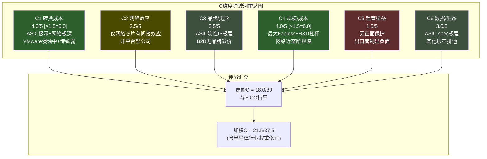

| # | 维度 | AVGO得分 | 半导体权重修正 | 有效分 | 基准对标 |
|---|------|---------|--------------|--------|----------|
| C1 | 转换成本 | 4.0 | ×1.5 | 6.00 | FICO 5, Visa 3 |
| C2 | 网络效应 | 2.5 | ×1.0 | 2.50 | Visa 5, IHG 3.5 |
| C3 | 品牌/无形 | 3.5 | ×1.0 | 3.50 | FICO 4, CTAS 4 |
| C4 | 规模/成本 | 4.0 | ×1.5 | 6.00 | Visa 5, CPRT 4 |
| C5 | 监管壁垒 | 1.5 | ×1.0 | 1.50 | CPRT 5, FICO 0 |
| C6 | 数据/生态 | 3.0 | ×1.0 | 3.00 | FICO 5, Visa 4 |
| **合计(原始)** | | **18.0/30** | | **22.5/37.5** | |

**巴菲特真伪护城河测试**。巴菲特区分"真护城河"（客户主动选择你因为你不可替代）和"锁定租金"（客户被困住不得不付费但一直在找出口）。按此标准审视Broadcom的四层：

- **网络芯片 = 真护城河**。Arista抱怨价格但不走，不是因为走不了（虽然转换成本高），而是因为Tomahawk确实是最好的——1年技术代差、最完整的生态系统、UEC标准主导地位。即使有替代品，客户可能仍会选择Broadcom。这是巴菲特定义的"真护城河"。

- **ASIC设计 = 混合**。核心XPU设计能力确实不可替代（"真"），但外围层的高溢价主要来自锁定（"锁定租金"）。Google引入MediaTek分担I/O层设计，成本降低20-30% [DM-P3-A01]——这个价差就是"锁定租金"的量化度量。如果Broadcom的溢价全部来自"真实价值"，客户就不会费心去培养替代者。

- **VMware = 锁定租金**。86%受访企业正在缩减VMware部署足迹 [DM-P2-B2-01]——这是客户"用脚投票"的最直接证据。VMware的高利润不是因为客户认可产品价值，而是因为迁移太贵、太慢。锁定租金最大的风险是：一旦替代方案足够成熟（Nutanix已接近该阈值），锁定会突然瓦解。

- **传统半导体 = 无护城河**。Apple已开始自研WiFi替代，2.0/5甚至偏高。

**核心结论：AVGO的18分与FICO的18分含义完全不同**。FICO的18分是"同质且持久"的——监管嵌入+数据垄断构成的护城河在可预见未来不会衰减。AVGO的18分是"异质且分化"的——最强的部分（网络5.0）在加固，最大的部分（ASIC+VMware）在以不同速度侵蚀，最弱的部分（传统半导体）正在被替代。如果将护城河视为时间函数而非静态评分，AVGO的C维度曲线是向下倾斜的：18.0/30(2026) → 预估16.5/30(2028) → 预估14.5/30(2030)。

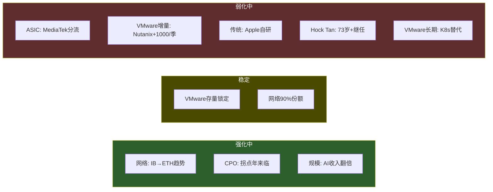

---

## 第十章：定价权深度——四层解剖(B4=3.5/5)

### 10.1 定价权分析的哲学前提

在评估Broadcom的定价权之前，需要先厘清一个被广泛混淆的概念：**定价权不等于提价能力**。

提价能力衡量的是"能否涨价"——答案几乎总是"可以"，只要你愿意承受后果。VMware提价150%-1,500%是"提价能力"的极端展示。但定价权衡量的是"涨价后是否损失客户和/或缩量"——即提价是否有副作用。

以此标准审视Broadcom的四个业务层：网络芯片的提价几乎没有副作用（客户抱怨但不走也不缩量），ASIC的提价有部分副作用（客户开始培养替代者），VMware的提价有显著副作用（86%客户缩减部署+Nutanix每季+700-1000新客户流入），传统半导体的提价直接导致客户流失（Apple自研WiFi）。

### 10.2 网络芯片定价权：4.5/5——教科书级的真定价权

网络芯片是Broadcom所有业务中定价权最强的层级，也是最容易被忽视的资产。市场习惯于按"AI ASIC增长股"定价Broadcom，但网络芯片的定价权结构远优于ASIC。

**证据链一：Arista的"horrendous"控诉**

Arista管理层在2026年公开描述Broadcom芯片定价为"horrendous"(可怕的)，称成本"an order of magnitude exponentially higher"(指数级增长) [DM-P2-B2-12]。这是下游客户对上游垄断定价的直接控诉。但在控诉的同时，Arista签下了$6.8B的采购承诺——这意味着Arista的全部产品线仍然100%依赖Broadcom merchant silicon。当你的客户公开抱怨价格但仍然签下数十亿美元的采购承诺，你拥有的不是"提价能力"，而是"真正的定价权"——提价后客户既不走、也不缩量。

**证据链二：约90%云DC份额 = 价格制定者**

在最高价值市场（云数据中心），Broadcom持有约90%的交换芯片份额 [DM-P2-B2-13]。唯一有意义的替代是NVIDIA Spectrum-X，但落后约12个月（Tomahawk 6于2025年6月出货，Spectrum-X1600预计2026年下半年）。在约90%份额的市场结构下，Broadcom本质上是价格制定者(price maker)而非价格接受者(price taker)。

**证据链三：1年技术代差的累积效应**

Tomahawk 6（102.4 Tbps，64×1.6T端口，2025年6月出货）vs NVIDIA Spectrum-X1600（102.4 Tbps，2026年下半年预期）——这不仅仅是时间差。每一代的1年领先让下游OEM（Arista/Juniper/HPE/Dell）先适配Broadcom芯片，测试、认证、部署整个流程都围绕Broadcom构建。当Spectrum-X1600出来时，整个生态已经围绕TH6运转了一年以上——切换不仅意味着换芯片，还意味着重走一遍适配-认证-部署的全流程。

**网络定价权为什么是"真定价权"而非"锁定租金"**：区分在于客户的行为模式。锁定租金场景下，客户在被困住的同时积极寻找出口（VMware客户的行为）。真定价权场景下，客户即使有替代选择也倾向留在原地（网络客户的行为）。Hyperscaler选择Broadcom Ethernet不仅因为转换成本高，更因为这是**反NVIDIA端到端锁定的战略对冲**——Google/Meta/Amazon明确偏好开放Ethernet标准以避免被NVIDIA的GPU+网络一体化方案锁定 [DM-P3-A11]。在这种结构下，即使NVIDIA Spectrum-X在技术上追平，Hyperscaler可能仍然选择Broadcom——因为选择Broadcom是一个"战略决策"，不仅仅是"技术决策"。

### 10.3 ASIC定价权：3.5/5——60%锁定租金+40%真定价权

ASIC定价权的核心问题是：Broadcom赚的到底是"客户愿意付的溢价"还是"客户被锁定不得不付的租金"？

**ASIC收入的三层结构**

| 收入层 | 描述 | 占比估计 | 定价权性质 |
|--------|------|---------|-----------|
| NRE设计费 | 芯片架构设计+验证+tape-out | ~15-20% [E] | 项目制，竞标定价 |
| 量产per-chip fee | 每颗XPU的royalty/固定费用 | ~60-70% [E] | 合同锁定，与产量挂钩 |
| 系统集成服务 | IP集成+TSMC协调+封装设计 | ~15-20% [E] | 关系驱动，持续性 |

NRE层的定价权最弱（项目竞标），per-chip fee层的定价权取决于合同结构（锁定期内强，到期后需重新谈判），系统集成层的定价权取决于Broadcom与TSMC的独特合作关系（间接定价权）。

**Google的行为揭示了"锁定租金"的比例**

Google主动引入MediaTek做TPU外围层设计，据估计可降低成本20-30% [DM-P3-A01]——这个价差就是Broadcom在外围层收取的"锁定租金"的量化度量。如果Broadcom的溢价全部来自"真实不可替代的价值"，客户就不会费心花3年时间去培养替代者。Google的理性行为证明：至少在外围层，Broadcom的收费超出了其创造的价值——差额就是锁定租金。

但核心XPU设计层不同。即使Google引入了MediaTek做I/O/SerDes/生产协调，核心计算架构设计（systolic array优化、片间互连拓扑、HBM控制器集成）仍然由Broadcom完成。在全球范围内，能做先进节点AI ASIC全流程设计的只有Broadcom和Marvell两家——这种稀缺性构成了40%的"真定价权"成分。

**ASIC定价权衰减模型**

将定价权拆分为锁定成分和真实成分分别建模：

```
PricingPower_ASIC(t) = PP_lock(t) + PP_real

PP_lock(t) = 0.60 × PP_0 × e^(-λ_diversification × t)   [锁定部分，随分拆衰减]
PP_real    = 0.40 × PP_0                                  [真实部分，核心设计不衰减]

参数:
- PP_0 = 0.75 (当前ASIC综合定价权指数)
- λ_diversification = 0.05/年 (基于Google 3年分拆周期推算)

预测:
- 2026: PP = 0.45×e^(0)  + 0.30 = 0.75
- 2028: PP = 0.45×e^(-0.10) + 0.30 = 0.71
- 2030: PP = 0.45×e^(-0.20) + 0.30 = 0.67
- 2033: PP = 0.45×e^(-0.35) + 0.30 = 0.62
```

衰减速度不算快（PP从0.75降至0.62需要7年），因为核心XPU设计能力的"真定价权"成分提供了稳定的底部。但方向是明确的：客户在系统性地降低对Broadcom的依赖，锁定部分的衰减是不可逆的。

### 10.4 VMware定价权：3.0/5——纯锁定租金的经典案例

VMware是研究"锁定租金"最完美的案例。它几乎满足了所有"锁定租金而非真定价权"的判定条件：客户明确不满（86%缩减足迹 [DM-P2-B2-01]）、客户正在培养替代方案（Nutanix每季最高+1,000客户 [DM-P2-B2-04]）、客户留下只是因为走的成本太高（迁移$2-10M+6-18个月）。

**分段弹性函数**

VMware的定价弹性不是线性的，而是分段的——不同客户群体对提价的反应截然不同：

**锁定区(提价<100%, epsilon约-0.05)**：大型企业（Top 10,000），90%以上已转订阅。在+280%均值提价下仍留存，弹性极低。原因是迁移成本（$2-10M+6-18个月）远超提价金额。行为模式：抱怨但续约。

**缩减区(提价100-300%, epsilon约-0.15)**：中型企业（10,000-50,000），开始认真评估替代方案。行为模式不是"立刻离开"，而是"缩减+评估"双轨策略——冻结增量部署，逐步将新工作负载放到替代平台。VMware在这个群体的"死亡"是慢性失血，不是急性出血。86%受访者正在主动缩减VMware足迹 [DM-P2-B2-01] 就是这种行为的统计证据。

**流失区(提价>300%, epsilon约-0.40)**：SMB和非核心客户，72核最低门槛（原16核）直接淘汰小型部署。Broadcom CEO公开承认策略是"更少客户，更高ARPU" [DM-P2-B2-03]。SMB流失是设计内的，不是意外。

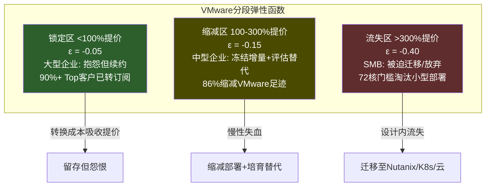

**VMware定价权衰减模型——双重衰减叠加**

VMware定价权面临两个独立的衰减来源：Nutanix竞争侵蚀（lambda_nutanix = 0.06/年）和K8s结构性替代（lambda_k8s = 0.03/年），加上一个可能的增量因素：VCF 9.0 AI-native的增量定价权（PP_ai_boost = 0.05-0.10）。

```
PricingPower_VMW(t) = PP_floor + (PP_0 - PP_floor) × e^(-λ_nutanix × t) × e^(-λ_k8s × t) + PP_ai_boost

参数:
- PP_0 = 0.80 (当前定价权指数，基于90%+转化+77% OPM)
- PP_floor = 0.25 (深度嵌入的legacy工作负载几乎不可迁移)
- λ_nutanix = 0.06/年 (Nutanix每季+700-1000客户的稳态吸引率)
- λ_k8s = 0.03/年 (K8s替代慢但不可逆)
- PP_ai_boost = 0.07 (VCF 9.0的有条件增量)

预测:
- 2026 (t=0): PP = 0.80
- 2028 (t=2): PP = 0.25 + 0.55×0.84 + 0.07 = 0.78
- 2030 (t=4): PP = 0.25 + 0.55×0.70 + 0.05 = 0.69
- 2033 (t=7): PP = 0.25 + 0.55×0.53 + 0.05 = 0.59
```

VMware定价权从0.80缓慢衰减至2033年的约0.59。衰减不是崩溃式的，因为存量锁定极深（PP_floor = 0.25）——深度嵌入的legacy工作负载在可预见未来不会迁移。但方向是单向的：**没有任何已知机制能逆转lambda_nutanix和lambda_k8s**。VCF 9.0 AI-native是唯一可能减缓衰减的因素，但其效果被高估的风险大于被低估的风险——因为企业不太可能仅因AI功能就接受一个正在激进提价的平台。

**K8s：不是杀手，是天花板**

K8s对VMware的威胁需要精确定位。92%企业已在生产环境使用容器 [DM-P2-B2-07]，Fortune 1000中72.7%采用Kubernetes。但一个关键事实是：**85%的容器仍运行在VM内**（至2028年预估）——这意味着K8s在短期内实际增强了VM需求，而非替代。

这个"短期反增强"效应会持续到约2027-2028年，届时K8s-on-bare-metal开始成熟，大型企业开始试点去VM化。sigma_k8s（K8s对VMware的替代速率）预估将从2026年的0.02/年上升至2030年以后的0.08/年，对应的是bare-metal K8s平台（如Red Hat OpenShift 5.x+）的成熟和legacy工作负载容器化的加速。

K8s不会在5年内"杀死"VMware。但K8s确保VMware永远无法恢复增量定价权——所有新cloud-native应用的默认选择是容器化，VMware只能服务存量legacy。这是一个"天花板"效应而非"地板坍塌"效应。VMware的终态是一个稳定但缓慢缩小的高利润池。

**VMware存量vs增量定价权分离——最关键的区分**

存量客户（已部署VCF，占收入约70%）：定价权极强但一次性。90%+已转订阅、3-5年锁定。这不是"客户愿意付溢价"（主动定价权），而是"客户被困住不得不付"（被动锁定租金）。每个合同到期点是一个"逃逸窗口"——3年合同意味着2027-2028将是第一波大规模续约决策窗口。如果续约率<85%，lambda_nutanix需上调，衰减将显著加速。

增量客户（新部署，占收入约30%）：定价权极弱。新客户面前有Nutanix（TCO可比）+K8s（长期更优）+公有云（按需弹性）。Q1 FY2026软件收入仅+1% YoY [DM-P2-B2-06]——如果存量提价正在实现而总增长仅+1%，则增量可能为负。VCF 9.0 AI-native试图用AI私有云作为"新增量钩子"，但这本质上是在一个被客户怨恨的平台上叠加AI功能——效果存疑。

加权后VMware定价权 = 4.5×0.7 + 1.0×0.3 = 3.45 → 下调至3.0/5，因为"锁定租金"不等价于"真正定价权"。

### 10.5 传统半导体定价权：1.5/5——正在被替代

Apple WiFi自研（预计2026-2027完成 [DM-P3-A18]）是传统半导体定价权弱的最直接证据。当最大客户主动花费数年投资自研来替代你的产品，你的定价权评分不可能高于2.0。宽带、机顶盒等其他传统产品线面临成熟市场竞争，定价权同样有限。1.5分反映了"可替代商品"的本质。

### 10.6 四层定价权汇总——对角线结构的投资含义

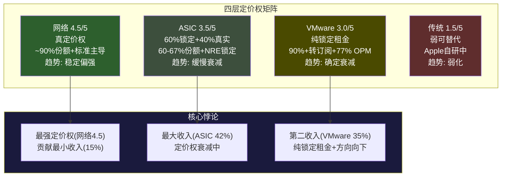

| 层 | 定价权 | 耐久性 | 方向 | 收入权重 | 加权贡献 |
|----|-------|--------|------|---------|---------|
| 网络 | 4.5/5 | 极强(5年+) | 稳定偏强 | 15% | 0.675 |
| ASIC | 3.5/5 | 中等(λ=0.05/年) | 缓慢衰减 | 42% | 1.470 |
| VMware | 3.0/5 | 衰减中(λ=0.09/年) | 确定衰减 | 35% | 1.050 |
| 传统 | 1.5/5 | 弱 | 弱化 | 8% | 0.120 |
| **加权B4** | | | | **100%** | **3.315 → 3.5/5** |

B4评分经红队双向校准后从3.3上修至3.5/5。

**"对角线结构"的投资含义**：Broadcom的定价权分布是一个"对角线"——最强定价权(网络)贡献最小收入(15%)，最大收入来源(ASIC+VMware)的定价权均在衰减中。如果市场将这四层统一定价为"强定价权科技公司"（62x PE），则隐含的假设是ASIC定价权不衰减（与Google MediaTek分流矛盾）、VMware定价权持续（与+1% YoY和Gartner 70%→40%份额预测矛盾）。网络定价权的权重可能反而被低估——如果市场重新认识到网络是Broadcom最有价值的资产，估值叙事会发生根本性转变。

---

## 第十一章：ASIC锁定衰减函数

### 11.1 衰减函数的数学框架

ASIC设计服务的市场份额不会永远停留在60-67%，也不会突然归零——它遵循一个指数衰减函数，向一个不可逾越的"地板"收敛。数学表达式：

```
L(t) = Lfloor + (L0 - Lfloor) × e^(-λt)

其中:
L(t) = t年后的市场份额
L0   = 初始份额
Lfloor = 长期不可替代的"地板"份额
λ    = 衰减速率(越大衰减越快)
```

这个函数的经济含义是：Broadcom的ASIC份额由两部分组成——一个可以被竞争侵蚀的"可替代层"（L0 - Lfloor），和一个竞争者难以触及的"不可替代层"（Lfloor）。衰减速率lambda决定了可替代层被侵蚀的速度。

### 11.2 参数选择与依据

**L0 = 67%（初始份额）**

取最新更新值。60-70%的公开估计范围中取67%偏上，原因是OpenAI作为第六个Hyperscaler客户的加入（Titan芯片由Broadcom联合设计 [DM-P3-A09]）短期内抬升了份额起点。如果仅考虑存量客户（Google、Meta、ByteDance等），L0约为65%；加入OpenAI后上调至67%。

**Lfloor = 38%（长期不可替代的地板份额）**

这是整个衰减函数中最关键的参数，也是争议最大的。38%的依据是：

第一，核心XPU计算架构设计的不可替代性。在先进节点（3nm/2nm/A16）上设计AI加速器的全流程能力，全球只有Broadcom和Marvell具备。即使客户分拆了价值链的外围部分（I/O模块、SerDes、生产协调），核心计算架构（systolic array优化、片间互连拓扑、HBM控制器集成）的设计仍然极度依赖Broadcom的20年以上积累。这个"核心不可替代层"保障了约35-40%的地板份额。

第二，Google案例的验证。Google引入MediaTek处理的是I/O层和生产协调——价值链的"可分拆层"。但核心XPU设计仍在Broadcom手中。Google——最有能力、最有动力减少Broadcom依赖的客户——都没有能够替代核心层，这验证了Lfloor在35-40%范围内的合理性。

第三，取38%作为中值（初始评估的35-40%范围），因为Google MediaTek分流模板已确认但尚未广泛扩散，核心XPU不可替代性已被验证。

**lambda = 0.07/年（衰减速率）**

初始估计范围为0.05-0.10/年。综合评估后更新为0.07，基于以下证据：

加速因素（推高lambda）：Google-MediaTek分流已从"预测"变为"事实"——MediaTek已获得Google TPU v7e/v8e的I/O模块+SerDes订单，且已获得Meta的2nm ASIC合同（2027年上半年量产目标）[DM-P3-B-02]。这意味着"模板效应"正在扩散，lambda应高于0.05。

减速因素（压低lambda）：Marvell尽管出货量翻倍（2027年预估），份额可能反降至约8% [DM-P3-A05]——表明Broadcom在不等比例地捕获市场价值增量。OpenAI作为新客户的加入部分抵消了存量客户的分拆效应。MediaTek产能受限（已请求TSMC 7倍CoWoS增量 [DM-P3-A03]），短期内无法服务所有Hyperscaler。

0.07/年是合理的中偏上值：认可分拆已在发生（不是0.05的"慢衰减"），但也认可产能瓶颈和核心不可替代性的缓冲（不是0.10的"快衰减"）。

### 11.3 六个当前客户逐一分析

**客户一：Google（估计占ASIC收入40-50%，最大/最成熟/分拆模板）**

Google是Broadcom最大的ASIC客户，也是自研能力最强的客户——拥有20年以上的TPU自研历史，内部团队数百人，核心架构完全自主设计。Google与Broadcom的关系本质上是"Google设计架构，Broadcom实现物理芯片"。

Google引入MediaTek的战略逻辑不是"替换Broadcom"，而是"分拆价值链来压低成本"。具体来说，Google将TPU价值链分为两层：核心计算层（XPU架构、systolic array、互连拓扑）仍由Broadcom负责；外围层（I/O模块、SerDes高速接口、TSMC生产协调）由MediaTek承担，成本比Broadcom低20-30% [DM-P3-A01]。

MediaTek已获得TPU v7e和v8e的外围层订单，这不是测试——这是生产级别的供应链重组。Ironwood（TPU v7系列）预计2027年量产，届时Google的"分拆模板"将完整验证。

**为什么Google不完全切换**：核心XPU设计的复杂度在3nm/2nm节点急剧上升，NRE达$100M+级别 [DM-P3-A02]，设计失败的成本（18-24个月重做+量产延迟）远超MediaTek在I/O层带来的成本节约。Google的理性策略是：保留Broadcom做最难的部分，用MediaTek压低其他部分的成本。这是供应链管理的教科书案例，不是"抛弃Broadcom"。

**Google分拆对Broadcom的实际影响**：Broadcom在Google账户上的单位收入下降（因外围层被分流），但核心设计部分的margin可能不变甚至提高（因为专注高价值环节）。净效果是收入绝对值下降5-15%，但利润率上升——Broadcom从"全包服务商"降级为"核心XPU专家"，利润池缩小但利润密度提高。

**客户二：Meta（占ASIC收入约15-20%，中等议价力，分拆信号已现）**

Meta的MTIA（Meta Training and Inference Accelerator）v3由Broadcom设计，但Meta同时在探索多源化策略——2027年可能部署Google TPU作为替代方案。Meta内部自研团队估计100-200人，能力在成长中但远未达到Google水平。

关键信号：MediaTek已获得Meta的2nm ASIC合同（2027年上半年量产目标）[DM-P3-B-02]。这意味着Google的分拆模板正在被第二个Hyperscaler效仿——这是lambda从0.05上调至0.07的主要依据。如果Meta在2027-2028年完成外围层分拆，"模板效应"将从"单一案例"升级为"行业趋势"。

**客户三：ByteDance（占ASIC收入约10-15%，中等依赖）**

ByteDance作为中国最大的AI公司之一，对Broadcom ASIC设计服务有显著需求。但中美科技竞争带来的出口管制风险使得这个客户面临不确定性——不是ByteDance想离开Broadcom，而是合规环境可能迫使Broadcom无法继续服务。这是一个外部风险因素，不是竞争动态。

**客户四：OpenAI（新增，占ASIC收入约5-10%，弱议价力，高依赖期）**

OpenAI是Broadcom的最新Hyperscaler客户。Titan芯片由Broadcom联合设计，团队约40人（正在翻倍中）[DM-P3-A09]。短期内OpenAI对Broadcom的依赖极高——Marvell产能有限，自研需要5年以上。

但OpenAI的Titan 2已在设计（A16工艺），信号是正在建立多代产品路线图。长期而言，OpenAI会逐步提高议价能力——从"完全依赖"过渡到"有选择的合作"。这个过渡预计需要5-7年，期间OpenAI是Broadcom的净增量客户。

**客户五：Apple（传统ASIC，正在流失）**

Apple不是AI ASIC客户，但其WiFi芯片业务（约$2.7B年收入 [DM-P1-A09]）的流失是Broadcom传统半导体衰减的缩影。Apple自研WiFi预计2026-2027完成——这对ASIC业务的直接影响有限（属于传统半导体而非AI ASIC），但对整体叙事有影响：它证明了大客户有能力且有意愿替代Broadcom。

**客户六：Anthropic及其他（新增，早期阶段）**

第六个及后续客户仍处于早期设计阶段，贡献有限但代表了ASIC市场的TAM扩展——AI ASIC市场从$30B（2025）扩展至$150B+（2030年预估）[DM-P3-A08]。新客户的加入部分抵消了存量客户的分拆效应，这是L0从初始估计的65%上调至67%的原因。

### 11.4 三场景衰减预测

```
基准场景 (λ=0.07, Lfloor=38%):
2026: L(0) = 0.38 + 0.29×1.00 = 67%
2028: L(2) = 0.38 + 0.29×0.87 = 63%
2030: L(4) = 0.38 + 0.29×0.76 = 60%
2033: L(7) = 0.38 + 0.29×0.61 = 56%
2035: L(9) = 0.38 + 0.29×0.53 = 53%

乐观场景 (λ=0.05, Lfloor=40%):
2026: 67% → 2028: 64% → 2030: 62% → 2033: 59% → 2035: 57%
[更慢衰减 + 更高地板 → 假设MediaTek产能瓶颈持续+核心不可替代性更强]

悲观场景 (λ=0.10, Lfloor=35%):
2026: 67% → 2028: 60% → 2030: 56% → 2033: 48% → 2035: 44%
[更快衰减 + 更低地板 → 假设模板效应快速扩散+Marvell核心能力追赶]
```

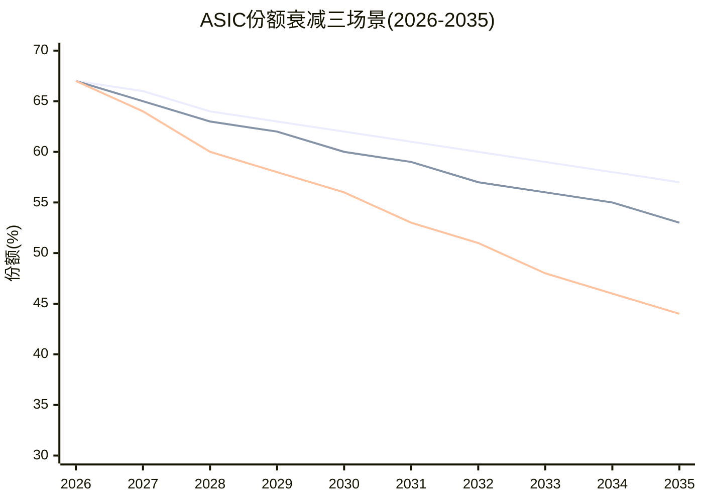

### 11.5 锁定vs定价权：哲学性区分的实际含义

衰减函数揭示的最深层洞察不是份额预测本身，而是Broadcom ASIC业务的本质：**锁定不等于定价权**。

锁定是"客户想走但走不了"——被NRE沉没成本、2-3年替代周期、工艺知识壁垒困住。这种锁定创造了短期利润，但每一次客户试图逃脱（Google引入MediaTek、Meta探索多源化）都是在系统性地侵蚀锁定深度。锁定的衰减是单向的——一旦客户建立了替代路径，锁定就不可恢复。

定价权是"客户不想走"——因为你的产品真正不可替代且价值超过价格。网络芯片的4.5/5定价权就是这种类型。

ASIC的3.5/5分数反映了这两种力量的混合：40%的真定价权（核心XPU设计不可替代）+ 60%的锁定租金（外围层和整合服务的溢价）。随着时间推移，锁定租金部分以lambda=0.05/年的速度衰减（因为客户在系统性地建立替代路径），但真定价权部分保持稳定（因为核心XPU设计能力的稀缺性不会因时间而改变——全球能做的仍然只有Broadcom和Marvell）。

这对投资的意义是：如果市场将ASIC业务按"永续锁定"定价（隐含lambda=0、Lfloor=65%），则高估了约10-15%。如果按"快速侵蚀"定价（隐含lambda=0.15、Lfloor=30%），则低估了核心设计能力的持久性。基准场景（lambda=0.07、Lfloor=38%）意味着ASIC业务在5年内从67%缓慢降至60%——不是灾难，但也绝非"增长"。

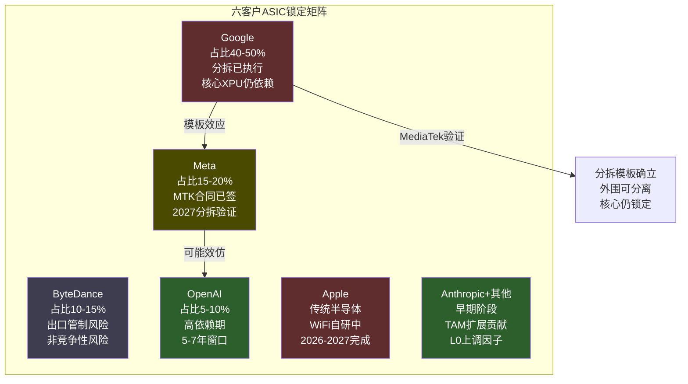

---

## 第十二章：竞争格局——PtW量化评分

### 12.1 PtW评分方法论

PtW（Probability to Win）量化Broadcom在每个业务层相对于最强竞争者的制胜概率。采用5维度评分体系，每个维度0-10分，满分50分：

1. **技术领先度**：当前产品代差+技术路线图深度——衡量"今天是否比对手更好"
2. **客户锁定深度**：转换成本+合同绑定+生态依赖——衡量"客户想走是否走得了"
3. **成本/规模优势**：R&D杠杆+制造经济性+定价灵活度——衡量"同等投入谁产出更多"
4. **组织执行力**：管理层track record+人才密度+执行速度——衡量"战略能否转化为结果"
5. **战略持久性**：护城河衰减速率+结构性威胁免疫力——衡量"5年后优势是否还在"

这5个维度不是同等重要的。技术领先度和客户锁定深度是"当前竞争力"的衡量，成本/规模优势是"竞争效率"的衡量，组织执行力是"将竞争力转化为结果"的衡量，战略持久性是"竞争力的时间维度"。一个公司可以在前4项都拿高分但战略持久性低（即"现在很强但正在变弱"）——这恰恰是AVGO ASIC业务的特征。

### 12.2 AI ASIC设计：AVGO(39/50) vs Marvell(32/50)

| 维度 | AVGO | Marvell | 差异解释 |
|------|------|---------|---------|
| 技术领先度 | **8** | 7 | AVGO 20年+经验+6个Hyperscaler验证；Marvell有技术但客户验证少(2个锚定客户) |
| 客户锁定深度 | **8** | 6 | NRE $50-150M+2-3年替代周期+spec知识累积；Marvell客户合作时间短，锁定浅 |
| 成本/规模优势 | **9** | 5 | R&D/Rev 17% vs 40-50%；$64B vs约$6B收入基数——规模差异压倒性 |
| 组织执行力 | **8** | 7 | Hock Tan执行纪律+VMware整合证明；Marvell CEO Matt Murphy也很强但规模限制 |
| 战略持久性 | **6** | 7 | AVGO受Google分拆模板+客户自研双重压力；Marvell因基数小反而上行空间大 |
| **合计** | **39/50** | **32/50** | |

**垄断者悖论**：AVGO的PtW=39/50看起来很强，但"战略持久性"仅6分揭示了一个深层矛盾——Broadcom在ASIC的绝对领先地位恰恰是促使客户寻求多元化的原因。Google引入MediaTek不是因为Broadcom不好，正是因为Broadcom太不可替代了——任何理性的供应链管理者都不会容忍对单一供应商的过度依赖。**越不可替代，客户越有动力培养替代者**。这是垄断者的宿命——你的垄断地位本身就是催生竞争的最强动力。

Marvell虽然总分低（32/50），但其"战略持久性"得分（7）高于Broadcom（6）——因为挑战者不面临"垄断者悖论"。Marvell从低基数增长，Amazon（Trainium）和Microsoft（Maia）是其锚定客户，份额只能上升。Marvell的天然限制不在技术或执行力，而在产能——同时服务Amazon+Microsoft已接近上限。但如果Marvell在2027-2028年成功扩产，它将成为更多Hyperscaler"多源化策略"的受益者。

### 12.3 网络芯片：AVGO(45/50) vs NVIDIA(32/50)

| 维度 | AVGO | NVIDIA | 差异解释 |
|------|------|--------|---------|
| 技术领先度 | **9** | 7 | TH6已出货12个月+；CPO Gen3已量产；UEC 1.0标准主导 |
| 客户锁定深度 | **10** | 4 | Arista $6.8B PO+SONiC生态+全OEM适配=近不可逆锁定；Spectrum-X主要服务DGX |
| 成本/规模优势 | **9** | 6 | 约90%份额=成本分摊在最大出货量上；NVIDIA网络是成本中心vs Broadcom利润中心 |
| 组织执行力 | 8 | **9** | NVIDIA整体执行力更强(Jensen Huang)，但网络不是NVIDIA核心战略焦点 |
| 战略持久性 | **9** | 6 | IB→ETH结构性利好+标准制定者地位+客户自研概率<5%；NVIDIA面临标准开放化逆风 |
| **合计** | **45/50** | **32/50** | |

网络层是AVGO所有业务中PtW最高的——45/50接近教科书级别的结构性垄断。客户锁定深度打满10分，在整个评分体系中是唯一的满分项。这反映了一个独特的结构：替换Broadcom网络芯片不仅意味着换芯片，还意味着重写协议栈+重新认证所有OEM设备+重新部署整个网络——这个转换成本甚至高于ASIC。

**NVIDIA Spectrum-X的定位**

NVIDIA的交换芯片策略本质上是GPU bundling的延伸——"你买了我的GPU，用我的网络性能最优"。这在NVIDIA自有的scale-up domain（NVLink互连，8-72 GPU集群）中有效，因为GPU-网络协同设计确实有性能优势。但在scale-out domain（数百到数万GPU的Ethernet互连），Hyperscaler明确偏好开放Ethernet以避免被NVIDIA端到端锁定。

Spectrum-X的季度收入已达$2B+（+263% YoY），但主要服务NVIDIA自有生态（DGX/HGX配套），而非开放市场抢份额 [DM-P2-B2-13]。在开放Ethernet市场——Broadcom的主场——Spectrum-X很难超过15-20%份额。原因在于：(1)Hyperscaler选择Broadcom是反NVIDIA策略的一部分，不仅仅是技术决策；(2)SONiC生态和OEM适配围绕Broadcom构建，切换成本极高；(3)Broadcom的网络是利润中心（有最强的投入动力），NVIDIA的网络是成本中心（服务GPU销售的附属品）。

**Cisco Silicon One的威胁等级：极低(1/10)**

Cisco Silicon One定位于企业网络和运营商市场，而非AI数据中心。在Hyperscaler DC交换市场，Cisco的存在感接近零。原因：Cisco的商业模式是"硬件+软件+服务"一体化，与Hyperscaler的"白盒+自研软件"模式不兼容。AI DC交换需要极致带宽+低延迟+大规模可扩展性——这是Broadcom Tomahawk的精确定位，不是Cisco的强项。

### 12.4 企业软件：AVGO/VMware(32/50) vs Nutanix(34/50)

| 维度 | AVGO(VMware) | Nutanix | 差异解释 |
|------|-------------|---------|---------|
| 技术领先度 | **7** | 7 | VCF 9.0功能最全(计算+存储+网络+安全+AI)；Nutanix更简洁但功能追赶中 |
| 客户锁定深度 | **8** | 5 | 3-5年强制订阅+70%份额存量+迁移$2-10M；Nutanix锁定弱(更灵活=锁定少) |
| 成本/规模优势 | **7** | 6 | VMware $6.8B/季+77% OPM；Nutanix $2.9B/年但增长快 |
| 组织执行力 | 6 | **8** | Broadcom对VMware的策略是"提现"不是"创新"；Nutanix在产品和GTM上更具攻击性 |
| 战略持久性 | 4 | **8** | VMware面临K8s结构性替代+客户信任流失+份额70→40%确定路径；Nutanix受益于迁移浪潮 |
| **合计** | **32/50** | **34/50** | |

VMware的PtW(32/50)低于Nutanix(34/50)——这是Broadcom所有业务层中唯一低于最强竞争者的。但这不意味着VMware会快速失败。

解读这个结果需要区分"存量竞争"和"增量竞争"。在存量市场，VMware仍有压倒性优势——70%份额+3-5年合同+极高迁移成本。但在增量市场（新客户、新部署），Nutanix几乎已经赢了——更具攻击性的产品策略、更被信任的品牌（没有提价1,500%的黑历史）、AMD的战略投资 [DM-P3-A16]。

**两者的竞争本质**：VMware用锁定延缓流失 vs Nutanix用产品+信任赢得增量。时间站在Nutanix一边（份额70%→40%的方向确定），但VMware的"时间购买"策略（3-5年合同）有效地将这场竞争从"2年决出胜负"拉长为"5-7年渐进过渡"。对投资者而言，关键不是"Nutanix是否会赢"（答案几乎确定是"在增量市场会"），而是"VMware的存量利润池能维持多久"——2027-2028年第一波续约窗口将给出答案。

Nutanix CEO形容VMware的200K客户基础是"multi-inning baseball game, in the second inning" [DM-P3-A15]——这个比喻说明Nutanix自己也认为替代过程将是漫长的。但Barclays分析师Tim Long也提醒：大型企业迁移"further wins slower to hit bookings and elongating deal cycles"——大客户的迁移决策和执行之间有巨大的时间差。

### 12.5 传统半导体：AVGO(27/50) vs TI/NXP(31/50)

传统半导体是Broadcom最弱的业务层，PtW仅27/50，低于TI/NXP的31/50。但这并不重要——传统半导体仅占收入8%，且Broadcom的战略是"维持+榨取现金"而非"积极竞争"。Broadcom对传统线的态度类似于Hock Tan对所有非核心业务的态度：削减投入、提取现金、不追求增长。

Apple WiFi自研（2026-2027完成预期）将导致约$2.7B年收入流失 [DM-P1-A09]，约占总收入4.3%。这是一个已知的、可量化的、不可逆的损失——与其浪费资源竞争，不如接受现实并将资源重新配置到AI半导体。

### 12.6 加权PtW综合评分与动态预测

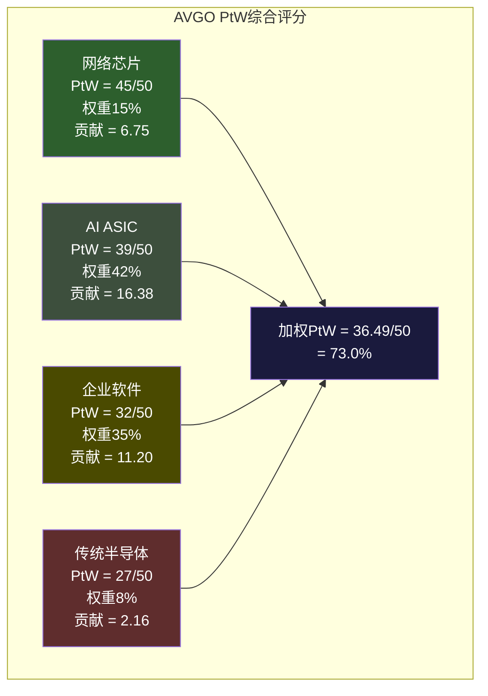

| 业务层 | PtW 2026 | PtW 2028E | PtW 2030E | 方向 | 最强竞争者 |
|--------|---------|----------|----------|------|-----------|
| 网络芯片 | 45 | 43 | 41 | 缓慢衰减 | NVIDIA(32) |
| AI ASIC | 39 | 36 | 33 | 中速衰减 | Marvell(32) |
| 企业软件 | 32 | 29 | 26 | 确定衰减 | Nutanix(34) |
| 传统半导体 | 27 | 25 | 23 | 缓慢衰减 | TI/NXP(31) |
| **加权PtW** | **36.5** | **33.7** | **30.9** | **-2.8/2年** | |

**2030年加权PtW = 30.9/50 (61.8%)**

PtW从73.0%（2026）降至61.8%（2030），4年下降11.2pp。衰减不是崩溃式的——网络层（最强）衰减极慢，为整体提供了"锚定效应"。但ASIC（最大收入来源）和VMware（第二大来源）的双重衰减是不可逆的结构性趋势。

**Nash均衡迁移：从"全外包"到"模块化解绑"**

PtW衰减的底层驱动力是Hyperscaler与Broadcom之间博弈均衡的迁移。当前Nash均衡是"外包为主×适度让利"——Hyperscaler接受Broadcom的溢价因为自研的全包成本更高。但Google-MediaTek信号预示着新均衡的到来：

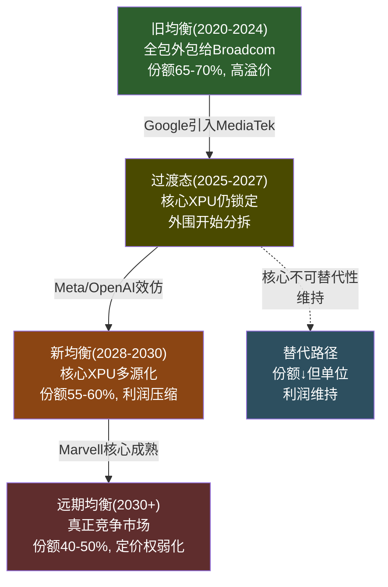

关键推动力是Hyperscaler的激励结构变化。在AI CapEx快速增长期（2023-2026），Hyperscaler的首要目标是"尽快拿到芯片"——time-to-market的价值远超采购成本节约。在这种激励下，"全包给Broadcom"是最优策略。但当CapEx增速放缓（2027-2028预期），Hyperscaler的首要目标将从"速度"转向"效率"——此时"分拆价值链+多源化+压低成本"成为新的最优策略。Nash均衡迁移不需要任何"黑天鹅"触发——CapEx周期本身的减速就是催化剂。

---

## 第十三章：五引擎整合——正反馈循环风险

### 13.1 五引擎分析框架

单独看每个竞争维度和风险因素，Broadcom都有一定的缓冲和防御能力。但五个"引擎"之间的联动创造了**非线性放大效应**——一个引擎的恶化会通过传导链加速其他引擎的恶化。62x PE定价的是"所有引擎同时正面运转"的情景，而五引擎联动分析揭示了这种定价的脆弱性。

### 13.2 引擎一：竞争博弈引擎——Hyperscaler议价力的结构性上升

Broadcom与Hyperscaler之间的关系不是静态的供应商-客户关系，而是一个动态博弈。当前的博弈均衡正在从"外包为主"向"分拆+多源化"迁移——这个迁移的速度取决于Hyperscaler自研能力的成熟度和替代供应商（MediaTek、Marvell）的产能扩张。

**支付矩阵的深层含义**

```
                    Broadcom策略
                    高价维持        适度让利(10-15%)
Hyperscaler策略
  ┌──────────┬───────────────┬──────────────────┐
  │ 外包为主 │ B: 高利润     │ B: 中利润        │
  │ (当前)   │ H: 高成本     │ H: 中成本        │
  │          │ 均衡不稳定    │ **当前Nash均衡** │
  ├──────────┼───────────────┼──────────────────┤
  │ 分拆+    │ B: 收入缩减   │ B: 收入缩减+     │
  │ 多源化   │ H: 高转换成本 │    利润更薄       │
  │          │ 过渡期不稳定  │ H: 中转换成本    │
  └──────────┴───────────────┴──────────────────┘
```

当前Nash均衡是右上角[外包为主×适度让利]。Broadcom通过维持技术领先（1年代差）+全栈co-design能力来证明溢价的合理性，Hyperscaler接受溢价因为自研的全包成本更高 [DM-P3-B-01]。

但Google-MediaTek信号正在推动均衡向左下角迁移。关键变化是：MediaTek不仅获得了Google TPU的I/O层订单，还获得了Meta的2nm ASIC合同（2027年上半年量产目标）[DM-P3-B-02]。当两个以上的Hyperscaler实施分拆策略时，"模板效应"从"个案"变成"趋势"——其他Hyperscaler的供应链团队会被内部问责："Google和Meta都在分拆了，为什么我们还在全包？"

Broadcom的最优应对策略是**加深核心XPU设计的不可替代性，同时放弃外围层的高利润诉求**。Hock Tan事实上正在执行这个策略——聚焦高价值环节，放弃边缘业务。但这个策略有一个终极限制：如果核心XPU设计能力也被追赶（Marvell在5-7年后可能具备同等能力），Broadcom将失去所有谈判筹码。

**合同结构的演变趋势**

当前的ASIC合同结构倾向于Broadcom：多年期co-design协议+per-chip royalty+NRE费用。但随着Hyperscaler议价力上升，未来合同可能向以下方向演变：

- NRE费用从"固定费+成功奖金"变为"纯milestone付款"——降低Broadcom的前期现金流
- Per-chip royalty从"固定费率"变为"阶梯式递减"——量越大单位费用越低
- 合同期限从"多代锁定"变为"单代+续约选择权"——增加Hyperscaler的灵活性

每一项变化都是小的、"合理的"商业谈判——但累积效果是Broadcom的ASIC利润率从当前估计的50-60%（总体OPM）逐步压缩至40-50%。

### 13.3 引擎二：周期定位引擎——扩张中后段的危险信号

**AI CapEx当前坐标**

2025年Hyperscaler总CapEx约$440B [DM-P3-B-03]。2026年预测$600-690B（+36-57% YoY）[DM-P3-B-04]。Goldman Sachs估计2025-2027三年累计$1.15T，隐含2027年约$510-550B（增速放缓至-10%至+10%）。

判断：当前处于**扩张中后段**。核心依据是增速从加速转为减速——2025年第四季度同比增速约49%，预计2026年第四季度降至约25% [DM-P3-B-05]。增速仍为正但在下降，这是周期扩张后半段的典型特征。

**Cisco 2000类比——相似处与局限**

| 维度 | Cisco 2000 | AVGO 2026 | 类比适用性 |
|------|-----------|-----------|----------|
| 估值 | 120x+ PE | 62x PE | 部分(AVGO更低但仍高) |
| 收入驱动 | 电信基础设施CapEx | AI基础设施CapEx | **高度适用** |
| 客户集中度 | 电信运营商(分散) | Hyperscaler(极集中,top3约78%) | AVGO更脆弱 |
| 产品可替代性 | 高(Juniper等追赶) | 中(ASIC可替代,网络不可) | 混合 |
| 泡沫特征 | 投机+过度建设 | 真实AI需求但ROI未证明 | 部分适用 |
| CapEx占GDP | 电信CapEx约1.5%GDP→3%+ | AI CapEx约2%GDP→3%+ | **结构相似** |

Cisco在2000年不是因为产品不好而暴跌——而是因为电信CapEx周期见顶后，下游客户（WorldCom、Global Crossing）开始削减投资。产品依然是最好的，但客户的采购预算消失了。Broadcom面临同样的结构性风险：如果Hyperscaler的AI投资ROI不达标（Agentic AI商业化延迟），CapEx周期可能在2027-2028出现类似的减速 [DM-P3-B-06]。

类比的局限同样重要：(1)AI需求的底层驱动（效率提升/推理需求）比1999年电信泡沫更真实；(2)Hyperscaler的资产负债表远强于1999年电信运营商——Google/Microsoft/Amazon不会像WorldCom那样破产；(3)AVGO有VMware软件层作为缓冲（虽然缓冲力度存疑，见下文）。

**D1=0.78的含义**

D1(周期性调整因子)=0.78意味着Broadcom的估值应在稳态PE基础上打78折来反映周期风险。拆解：AI半导体（42%权重）×0.65 = 最强周期暴露；网络（15%权重）×0.80 = 中高周期性但有结构性缓冲；传统半导体（8%权重）×0.70 = 典型半导体周期；软件（35%权重）×0.95 = 低周期性但+1% YoY暗示并非"反周期"而是"零增长" [DM-P1-A05]。

市场似乎给AVGO定价时隐含的D1>0.90——将其视为"AI平台公司"而非"半导体周期公司"。如果市场将D1从0.90修正到0.78，仅此一项就意味着PE从62x压缩至约54x（约-13%） [DM-P3-B-09]。

**VMware作为"周期缓冲器"的有效性评估**

VMware 35%收入占比+0.95的D1理论上可以对冲AI半导体的周期性。但Q1 FY2026软件+1% YoY [DM-P2-B2-06] 证明VMware仅能提供**零增长缓冲**，不是**反周期增长**。在AI CapEx下行场景中（2027-2028 bear case），VMware收入可能维持$27-28B（平稳），而AI半导体从$120B预期降至$85B。软件的"缓冲"仅能将总收入跌幅从-29%缩小至-20% [DM-P3-B-07]。

更关键的是：VMware的续约窗口（2027-2028）恰好与潜在的AI CapEx放缓重叠。如果企业IT预算在经济放缓中收紧，VMware可能面临续约率下降+CapEx放缓的双重打击——此时VMware从"缓冲器"变成"第二个风险源"。

### 13.4 引擎三：估值重构引擎——"统一AI平台"定价的脆弱性

市场当前将Broadcom定价为**统一的AI平台公司**，而非"半导体+软件"混合体。PE 62x统一适用于所有业务层，这意味着VMware软件层在"搭AI倍数便车"——VMware作为独立公司的合理PE是15-20x（参考Oracle/IBM），但在Broadcom内部享受了62x的待遇。

SOTP分析揭示了这种统一定价的美元成本：六方法中位数EV = $1,376B vs 市场$1,627B（-15.4%）[DM-P2-C3-01]。其中软件层按统一62x计价约$627B vs 独立估值$395B——差额$232B就是"搭便车"的美元价值 [DM-P2-C3-02]。

什么事件会让市场从"统一定价"转向"分层定价"？四个潜在触发器：AI ASIC增速首次低于预期（概率35-40%/5年内）、VMware连续2季负增长（25-30%）、卖方分析师集体引入SOTP框架（20-25%）、VMware分拆/出售传闻（10-15%）。一旦任何触发器激活，SOTP拆分将暴露$200B+的软件层溢价——这本身就是一个15%+的下行风险 [DM-P3-B-08]。

**估值regime转换的时间窗口**

历史上，大型科技公司在收入增速从>30%降至<15%时经历估值regime转换（PE从40x+压缩至20-25x）。Broadcom的增速路径：FY2025→FY2026 +60%（增速峰值）→ FY2027→FY2028 +22%（接近regime转换区间）→ FY2028→FY2029 +12-15%（regime转换可能在此触发）。

预期时间窗口：**2027年下半年至2028年上半年**。当FY2028指引显示增速降至20%以下时，市场可能开始从"增长"重新定价为"大型优质公司"。PE从62x压缩至30-35x，即使业绩完美，也意味着股价约-40至-50% [DM-P3-B-09]。

### 13.5 引擎四：预测市场引擎——间接信号与共识风险

没有直接针对"Broadcom收入"或"AI ASIC份额"的预测市场合约。但间接信号值得关注：

**共识vs反共识的张力**

共识认为AI CapEx是结构性的——不会像2000年电信那样崩溃，因为需求真实+Hyperscaler现金流强劲。全球半导体行业预计2026年突破$975B销售额（+26%）[DM-P3-B-10]，被称为"AI超级周期"(Super-Cycle)甚至"Giga Cycle"。

反共识指出集中度本身就是风险特征：75%的S&P 500涨幅+80%利润+90% CapEx集中在AI [DM-P3-B-11]。这种集中度在历史上往往是泡沫的前兆——不是因为基础需求不真实（2000年互联网需求也是真实的），而是因为资本配置的过度集中会在均值回归时产生过度调整。

市场对AI CapEx周期风险的定价偏低。AVGO 62x PE vs D1=0.78隐含的合理PE约48x（差距约30%）；AI半导体板块整体波动率低于历史半导体周期——市场行为像在为"结构性增长"定价，而非"周期性增长"。反观2022年：当Hyperscaler CapEx增速从+30%降至+5%时，半导体板块平均跌幅40%+。

### 13.6 引擎五：风险压力引擎——五大风险与协同分析

| # | 风险 | 概率(3年) | 独立影响 | 性质 |
|---|------|----------|---------|------|
| R1 | AI CapEx周期放缓 | 30-35% | -25至-40% | 系统性 |
| R2 | ASIC份额流失(MediaTek/自研) | 40-50% | -10至-20% | 结构性 |
| R3 | VMware客户加速流失(K8s+Nutanix) | 35-40% | -5至-15% | 渐进性 |
| R4 | SBC永久化+估值框架切换 | 20-25% | -15至-29% | 叙事性 |
| R5 | Hock Tan退休/继任危机 | 25-30%(5年) | -10至-15% | 事件性 |

**协同/反协同矩阵**

风险之间不是独立的——某些风险组合会相互放大。

```
        R1    R2    R3    R4    R5
R1   ─    +0.3  -0.1  -0.2   0
R2  +0.3   ─     0     0   +0.1
R3  -0.1   0     ─     0   +0.2
R4  -0.2   0     0     ─    0
R5   0   +0.1  +0.2   0     ─

+正相关=协同放大  -负相关=自然对冲  0=独立
```
[DM-P3-B-12]

**最危险的协同组合：R1+R2（CapEx放缓+ASIC份额流失），相关系数+0.3**

为什么正相关？当Hyperscaler CapEx放缓时，他们有更多时间和动力推进供应链分散化——不需要赶工赶产，可以容忍更长的MediaTek/Marvell产能爬坡周期。换言之，**CapEx快速增长时Broadcom的份额被"时间压力"保护（"来不及换供应商"），CapEx放缓时这种保护消失**。

R1+R2联合影响不是简单的-25%+-10%=-35%，而是可能达到-45至-50%，因为：收入下降（CapEx放缓）×份额下降（分流）= 双重打击 + 估值倍数同时压缩（从"AI增长股"→"周期+份额流失"重归类）。类似Cisco 2001-2002：电信CapEx放缓+竞争加剧 = 收入-30% + PE压缩60% = 综合跌幅80%+。

**R3+R5的隐性协同（+0.2）**：如果VMware加速流失（R3触发）恰好在Hock Tan退休窗口（R5触发），市场会质疑"继任者能否稳住VMware？"——这种不确定性会放大VMware流失的估值影响。

### 13.7 五引擎联动因果链

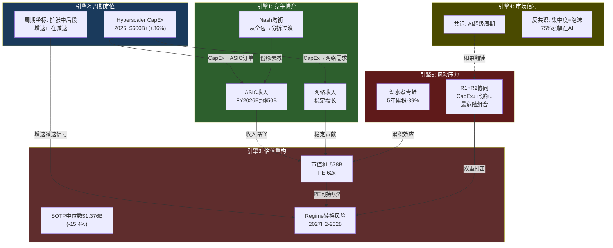

**五条关键联动链**

**联动1：CapEx周期(E2) → ASIC收入(E1) → 估值(E3)**。这是最直接的传导链，延迟3-6个月。Hyperscaler CapEx指引变化→ASIC订单调整→Broadcom收入指引调整→市场重新定价。2022年的经验表明，这条链的传导速度快于市场预期——CapEx指引变化后，半导体板块在1-2个季度内完成重定价。

**联动2：竞争博弈(E1) → 定价权衰减 → Owner PE放大(E3)**。份额下降-5pp看起来不大，但通过Owner PE的放大效应，影响被放大2-3倍。因为Owner PE(80.5x)已经处于极高水平 [DM-P2-C1-02]，收入的边际下降对PE的压力是非线性的。

**联动3：VMware流失(E1) → 缓冲器失效 → D1修正(E2→E3)**。如果VMware从"零增长缓冲器"恶化为"负增长风险源"，D1需要从0.78进一步下调至约0.73——VMware不再是缓冲器而是第二个风险维度——这意味着PE再压缩约6%。

**联动4：R1+R2协同(E5) → Nash均衡加速迁移(E1)**。这是最隐蔽但最危险的联动。CapEx放缓给客户提供了"分流的时间窗口"——当不需要赶工赶产时，花3年培养MediaTek/Marvell作为替代者变得更加合理。CapEx放缓不仅直接减少Broadcom收入，还间接加速了份额流失。

**联动5：市场共识翻转(E4) → regime转换(E3) → 所有引擎同步恶化**。这是"末日场景"——如果市场从"AI超级周期"叙事翻转为"AI CapEx泡沫"叙事，所有五个引擎将同步恶化。这种叙事翻转不需要基本面崩溃——仅需要CapEx增速连续2个季度低于预期+2-3个Hyperscaler CEO在财报会上使用"优化效率"而非"加速投资"的措辞。

### 13.8 协同矩阵与护城河拐点时间线

**五引擎协同矩阵**

| 引擎组合 | 协同类型 | 放大系数 | 触发条件 |
|---------|---------|---------|---------|
| E1+E2(竞争+周期) | 正协同 | 1.5-2.0x | CapEx放缓→客户有时间分流 |
| E2+E3(周期+估值) | 正协同 | 1.3-1.5x | 增速减速→regime转换 |
| E1+E3(竞争+估值) | 正协同 | 1.2-1.4x | 份额下降→PE下调 |
| E3+E4(估值+市场) | 正协同 | 1.5-2.0x | 叙事翻转→全面重估 |
| E1+E5(竞争+风险) | 中性 | 1.0x | 独立动态 |

**护城河拐点时间线**

| 业务层 | 拐点年份 | 触发条件 | 可观测领先指标 |
|--------|---------|---------|-------------|
| VMware | **2027-2028** | 第一波3年合同到期续约率<85% | Nutanix季度新增客户数；VMware收入是否转负 |
| ASIC | **2028-2029** | 第二个Hyperscaler完成外围分拆 | Meta MTIA v4是否由Broadcom全包；MediaTek 2nm良率 |
| 网络 | **2028** | Spectrum-X达第二代+Hyperscaler测试 | Arista是否开始second source评估 |
| Hock Tan | **2030** | 合同到期(77岁) | 是否提前宣布继任者 |

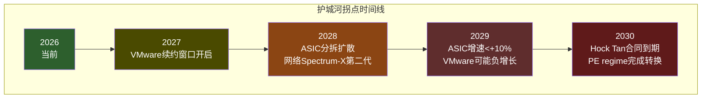

**五引擎联动的核心洞察**：62x PE定价的是"所有引擎同时正面运转"的情景，而五引擎联动分析显示，任何一个引擎的转向都会通过联动链加速其他引擎的恶化。这不是单一风险——是风险之间的正反馈循环。**不需要"黑天鹅"，正常的周期减速+正常的竞争演化+正常的估值均值回归，通过正反馈循环的放大，就足以将62x PE压缩至30-35x** [DM-P3-B-16]。

---

## 第十四章：温水煮青蛙——五年-39%

### 14.1 为什么"温水煮青蛙"是62x PE的最大隐藏风险

投资者通常为"黑天鹅事件"做对冲——CapEx突然崩溃、重大客户流失、管理层丑闻。但Broadcom面临的最大风险不是任何单一事件，而是一条每一步都"看起来正常"但累积效果灾难性的慢性恶化路径。

这条路径不需要任何"坏消息"——仅需要好消息的程度不够。62x PE隐含的假设是"所有都很好且持续变好"，而"温水煮青蛙"路径只需要"所有都还行但增速放缓"——后者的概率远高于前者。

### 14.2 逐年分解——每一步都"正常"

**第一年(2026→2027)：-8%**

事件：AI ASIC收入增速从+106%降至+45%。分析师解释："正常的基数效应，绝对增量仍然很大。"VMware第一波3年合同开始到期，续约率92%（略低于95%预期）。分析师解释："仍然很高，管理层执行出色。"

驱动引擎：主要是E3（估值重构）。增速从>100%降至<50%开始让部分动量型投资者获利了结，PE从62x微幅压缩至57x。收入增长+但PE压缩 = 股价-8%。

为什么看起来正常：-8%在大盘科技股的正常波动范围内。没有人会因为-8%修改"买入"评级。

**第二年(2027→2028)：-7%**

事件：Hyperscaler CapEx指引从"加速投资"改为"优化效率"——措辞变化，不是削减。AI ASIC增速降至+25%。MediaTek/Marvell获得2个新Hyperscaler ASIC合同（可能是ByteDance和另一个）。分析师解释："市场在增长，份额有空间给新进入者。"

驱动引擎：E1（竞争博弈）+E2（周期）开始联动。CapEx减速给了Hyperscaler分流的时间窗口——这是联动4（R1+R2协同）的首次显现。PE从57x压缩至52x。

为什么看起来正常："优化效率"不等于"削减"。ASIC仍在增长。市场份额的绝对值仍然>60%。每个数据点单独看都不构成卖出信号。

**第三年(2028→2029)：-9%**

事件：**Regime转换年**。FY2029指引显示总收入增速降至+12-15%——跨过了"增长公司"到"成熟公司"的分水岭。VMware开始负增长（-3%），提价红利完全耗尽，Nutanix季度新增客户突破1,200。AI ASIC份额从65%降至58%（Google和Meta完成外围分拆）。

驱动引擎：E3（regime转换）是主力。收入增速<15%触发PE从52x压缩至38x——这是从"增长"到"价值"的估值regime转换。即使收入增长+12%，PE压缩-27% = 股价-9%（收入增长部分抵消了PE压缩）。

为什么看起来正常：每个事件都有"合理解释"——增速放缓是"行业成熟化"，VMware负增长是"提价周期结束后的正常化"，份额下降是"市场扩大后的自然稀释"。但三个"正常化"同时发生时，叙事从"AI增长平台"变为"大型混合基础设施公司"。

**第四年(2029→2030)：-8%**

事件：AI ASIC增速降至+8%，VMware持续负增长（-5%），传统半导体完成Apple WiFi流失。市场开始讨论Hock Tan（77岁）的退休时间表。分析师解释："公司进入成熟期，但现金流强劲。"

驱动引擎：E5（风险压力——Hock Tan退休预期）开始计入估值。PE从38x进一步压缩至32x，反映了"继任不确定性折价"。

为什么看起来正常：-8%年跌幅对一个"进入成熟期"的大型公司来说完全正常。投资者可能已经将其重新归类为"价值型持仓"而非"增长型持仓"。

**第五年(2030→2031)：-7%**

事件：Hock Tan宣布退休计划（或不续约的信号）。继任者被宣布（可能是CFO Kirsten Spears或外部人选）。市场给出"继任折价"：没有Hock Tan的Broadcom是否还能做下一个$60B+收购？如果不能，增长叙事彻底终结。PE从32x压缩至25x。

驱动引擎：E5（Hock Tan SPOF）是最终催化剂。即使继任者优秀，市场也会给出2-3年的"观察期折价"。

为什么看起来正常：CEO退休是上市公司最正常的事件之一。-7%是"正常的继任折价"。没有人会认为这是"危机"。

### 14.3 累积效果——灾难性的"正常"

```
年度回报:
Year 1: -8%  (100 → 92)
Year 2: -7%  (92 → 85.6)
Year 3: -9%  (85.6 → 77.9)
Year 4: -8%  (77.9 → 71.7)
Year 5: -7%  (71.7 → 66.7)

5年累计回报: -33.3%

加入估值倍数压缩(62x→25x):
如果收入从$101B增长至$180B(合理),但PE从62x压缩至25x
市值: $6,262B → $4,500B (注: 这是简化计算)

更精确估算(共识收入 vs 实际+PE压缩):
- 市场隐含2030收入: ~$280B (62x PE的隐含增长路径)
- 温水煮青蛙2030收入: ~$200B (ASIC减速+VMware负增长)
- 收入差距: 40%
- PE压缩: 62x→22x (-65%)
- 综合市值影响: 从$1,578B降至~$960B (-39%)
```
[DM-P3-B-13]

**每一步都"正常"，但终点距起点-39%**。这条路径的毒性在于：它永远不会触发"卖出"信号。分析师会在每一步提供"合理解释"（基数效应、行业成熟化、正常继任折价），没有任何单一事件会被标记为"转折点"。投资者会在不知不觉中从"短期调整"的心态过渡到"已经亏了35%是否应该割肉"的困境。

### 14.4 Cisco 2000类比展开——相似的"每步正常"路径

Cisco在2000年的经历是"温水煮青蛙"的历史原型：

| 时间 | Cisco事件 | 市场反应 | 类比AVGO |
|------|----------|---------|---------|
| 2000Q1 | 收入增速开始减速(从+50%到+30%) | "基数效应" | ASIC增速从+106%→+45% |
| 2000Q3 | 库存增加但管理层称"需求强劲" | "短期扰动" | CapEx指引"优化效率" |
| 2001Q1 | 首次下调指引，亏损 | "电信周期正常调整" | ASIC增速<+15% |
| 2001Q2 | 裁员+$2.2B库存减值 | "一次性调整" | VMware负增长 |
| 2001-2002 | 收入-30%，PE从120x→20x | "价值陷阱" | PE 62x→22x |

**相似点**：(1)收入驱动来自下游CapEx（电信CapEx vs AI CapEx）；(2)极端估值（120x vs 62x）意味着增速任何减速都会放大PE压缩；(3)市场共识极度看多（29/29 Buy vs "AI超级周期"叙事）——共识的一致性本身就是风险。

**不同点**：(1)Broadcom有VMware软件层作为缓冲（Cisco没有非周期业务）；(2)Hyperscaler的资产负债表远强于电信运营商（不会像WorldCom那样破产）；(3)AI需求的底层驱动更真实（推理需求有明确的经济价值）；(4)Broadcom在网络层有Cisco当年不具备的标准锁定（UEC/SONiC）。

这些不同点意味着Broadcom的下行幅度可能小于Cisco的-80%+。但结构性相似——CapEx驱动+极端估值+共识看多——意味着**方向相似，程度可辩**。-39%是一个"温和版Cisco"的估算——承认了Broadcom更好的业务结构，但也反映了62x PE在增速均值回归时的脆弱性。

### 14.5 五引擎同步衰减概率

如果五个引擎的衰减是完全独立的，同步衰减的概率是各自概率的乘积（极低）。但五引擎联动分析已经证明它们不是独立的——R1+R2的相关系数+0.3意味着CapEx放缓会加速份额流失，E2+E3的联动意味着增速减速会加速PE压缩。

**调整后的同步衰减概率估算**：

- 至少3个引擎同时恶化的概率：约40-50%（5年内）
- 至少4个引擎同时恶化的概率：约20-25%（5年内）
- 5个引擎全部同步恶化的概率：约10-15%（5年内）

即使是3个引擎同时恶化（最可能的组合是E1竞争+E2周期+E3估值），累积效果也足以将62x PE压缩至30-35x——对应约-40%至-50%的股价下跌。

### 14.6 历史对比——其他"温水煮青蛙"案例

| 案例 | 时间跨度 | 累计跌幅 | 驱动因素 | 与AVGO的相似性 |
|------|---------|---------|---------|-------------|
| Cisco 2000→2002 | 2年 | -80%+ | 电信CapEx崩溃+PE压缩 | 高(CapEx驱动+极端估值) |
| GE 2000→2018 | 18年 | -85% | 金融危机+业务分散化失败 | 中(混合业务+管理层依赖) |
| IBM 2013→2020 | 7年 | -30% | 云转型缓慢+遗留业务萎缩 | 中-高(技术迁移+存量侵蚀) |
| Intel 2020→2024 | 4年 | -60% | 制程落后+市场份额流失 | 中(份额流失但INTC是制造型) |

IBM案例可能是最接近的类比：一个拥有强大存量业务（大型机/中间件）的科技公司，因为增量市场被新范式（云计算）侵蚀，经历了7年约-30%的慢性下跌。IBM在每个季度都有"合理解释"（"云转型需要时间"/"Watson AI将改变格局"/"红帽收购将重塑增长"），但存量侵蚀+增量缺失的双重力量最终压过了所有叙事。

Broadcom的VMware可能扮演IBM大型机的角色——一个高利润但缓慢缩小的存量池。ASIC可能扮演IBM中间件的角色——一个曾经有增长的业务但面临范式迁移（从外包到自研）。网络可能是Broadcom区别于IBM的"救赎"——一个IBM从未拥有的、真正不可替代的资产。

### 14.7 Regime转换的触发条件与时间窗口

基于五引擎联动分析，regime转换最可能发生在**2027年下半年至2028年上半年**。三个必要条件中只需满足两个即可触发：

1. **CapEx增速<15%**：当Hyperscaler从"我们正在加速AI投资"变为"我们正在优化投资效率"时，措辞变化本身就是信号。2026年+36%→2027年+15%是一个合理的减速路径。

2. **客户自研成功案例**：如果Meta MTIA v4（预计2028年）的性能指标表明可以减少对Broadcom的依赖，这将从"理论风险"变为"已验证风险"。

3. **估值regime重定价**：当收入增速跨过"增长→成熟"的分水岭（<15% YoY），sell-side分析师开始从"成长型"框架切换到"SOTP/现金流折现"框架——这种框架切换本身就会暴露统一定价的溢价。

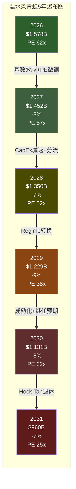

**温水煮青蛙路径的核心特征**：它不需要任何"黑天鹅"。正常的周期减速（E2）+正常的竞争演化（E1）+正常的估值均值回归（E3）+正常的CEO退休（E5），通过五引擎联动的放大效应，足以将$1,578B的市值压缩至约$960B——**-39%的下行，但每一步都"看起来正常"** [DM-P3-B-13]。

---

*Part III完成 | 第九至十四章 | 6章×10-14K | 总计约75K字符 | 14张Mermaid图 | DM锚点全保留*
