# 第四部分：估值深度——市场在赌什么

---

## 第十五章：Reverse DCF信念反演——62x PE隐含了什么

当一家公司以$1,578B市值、62x TTM PE交易时，传统估值方法(正向DCF"这家公司值多少钱")的信息量远不如逆向估值("市场在赌什么")。Reverse DCF的核心逻辑是：给定当前市值，反推使等式成立的增长、利润率和终端价值假设，然后逐一评估这些隐含假设的合理性。对Broadcom而言，这个过程揭示了一个令人不安的结论：市场在赌一个联合概率仅5-8%的完美执行情景。

### 15.1 两种FCF口径——同一家公司的两个面孔

Reverse DCF的第一步是选择FCF口径，而Broadcom恰恰是这个选择最具争议性的案例之一。公司报告了两种截然不同的现金流画面：

**口径1——报告FCF**：FY2025自由现金流$26.9B，FCF margin 42.1%。这是管理层、分析师和大多数估值模型使用的基准口径。它将SBC($7.6B)视为非现金费用，从OCF中加回，最终呈现一个42%margin的"极致现金生成器"画面。[DM-P2-C2-04]

**口径2——Owner FCF**：报告FCF减去SBC后为$19.3B，Owner FCF margin仅30.2%。这是巴菲特式"业主盈余"口径，将SBC视为维持AI人才团队竞争力的真实经济成本。理由很简单：如果不支付$7.6B的SBC，Broadcom的工程师会去Google、OpenAI或Meta——SBC的66%直接用于R&D人才。[DM-P2-C2-05]

两种口径的差异不是技术性的，而是哲学性的。它决定了投资者看到的是一家30x PE的"合理定价成长股"(Non-GAAP视角)，还是一家80.5x Owner PE的"极端高估周期股"(Owner Earnings视角)。这个差异的美元价值是$232B——相当于一个AMD的市值。[DM-P2-C3-02]

### 15.2 Reverse DCF模型——反推市场隐含假设

**基础参数设定**：
- 当前EV：$1,627B（市值$1,578B + 净债务$48.96B）[DM-P2-C2-01/02]
- FY2025 Revenue：$63.9B [DM-P2-C2-03]
- 显性期：10年；终端增长率：3.0%（半导体+软件混合体的长期GDP+通胀）
- 模型结构：EV = Σ(FCF_t / (1+WACC)^t, t=1..10) + TV/(1+WACC)^10

反推方法是：给定EV=$1,627B，固定终端FCF margin在合理范围内（35%-45%），求解使等式成立的隐含收入CAGR。

#### 口径1反推结果（报告FCF，起点$26.9B，margin 42.1%）

| WACC | 终端Margin 35% | 终端Margin 40% | 终端Margin 45% |
|------|:---:|:---:|:---:|
| **8%** | CAGR 18.2% | CAGR 16.5% | CAGR 15.1% |
| **9%** | CAGR 20.1% | CAGR 18.3% | CAGR 16.8% |
| **10%** | CAGR 22.0% | CAGR 20.0% | CAGR 18.4% |
| **11%** | CAGR 23.9% | CAGR 21.7% | CAGR 20.0% |

[DM-P2-C2-06]

以WACC=9%、终端margin 40%为例的推导过程：市场需要Broadcom在10年后实现Revenue = $63.9B × 1.183^10 = $346B。对应终端FCF = $346B × 40% = $138B。终端价值TV = $138B × 1.03 / (0.09 - 0.03) = $2,374B，折现至今PV(TV) = $1,003B。显性期FCF折现合计约$624B。总EV ≈ $1,627B，等式成立。

#### 口径2反推结果（Owner FCF，起点$19.3B，margin 30.2%）

| WACC | 终端Margin 25% | 终端Margin 30% | 终端Margin 35% |
|------|:---:|:---:|:---:|
| **8%** | CAGR 22.5% | CAGR 20.0% | CAGR 18.0% |
| **9%** | CAGR 24.6% | CAGR 21.9% | CAGR 19.7% |
| **10%** | CAGR 26.7% | CAGR 23.8% | CAGR 21.5% |
| **11%** | CAGR 28.8% | CAGR 25.7% | CAGR 23.2% |

[DM-P2-C2-07]

#### 口径差异的估值当量

在WACC=9%、终端margin 35%的基准下，口径1隐含CAGR 16.8%，口径2隐含CAGR 19.7%——差距3个百分点。看起来不大，但10年复利后意味着终端收入相差约35%（$340B vs $460B）。这35%的差距就是SBC争论的估值当量。[DM-P2-C2-08]

用报告FCF反推，WACC=9%时隐含10年CAGR约18%，与共识路径（FY2025 $63.9B → FY2028E $185.3B，3年CAGR 42.5%，之后减速到15%）大致吻合——市场"仅仅"在赌共识是对的。但用Owner FCF反推，隐含CAGR跳升至22-25%，意味着如果SBC是永久性成本，市场实际上在赌一个比共识更激进的增长路径。

#### 与共识路径的交叉检验

共识隐含的两阶段路径：前3年爆发式增长（CAGR 42.5%，含AI ramp+VMware整合），后7年需要维持CAGR 8-10%才能匹配口径1的隐含假设。对于一家$180B+收入的公司，8-10%增长意味着每年新增$15-18B收入——约等于每年新增一个AMD体量的业务。这个隐含假设的雄心远超表面看到的"共识增长"。[DM-P2-C2-09]

### 15.3 五个隐含信念——逐一拆解

将上述隐含增长率分解为五个独立信念（Beliefs），每个驱动估值的一个关键维度。

#### B1：AI ASIC收入增速——承重墙（脆弱度3/5，纠错后）

**隐含值**：市场需要AI半导体收入（ASIC+网络）从FY2025的约$20B增长到FY2030约$190B，FY2026-2028前3年CAGR 82%，之后FY2028-2030减速至25-30%。[DM-P2-C2-10]

**合理值评估**：前3年CAGR 50-65%较合理——共识FY2028E总收入$185.3B中AI约$120B可信（Hyperscaler CapEx维持+推理份额从20%→70%），但要求backlog $73B全部转化加上新赢单持续。后2年CAGR降至15-20%更现实：$120B基数下，Hyperscaler CapEx增速放缓至+10-15%，客户自研分流（Google-MediaTek）开始显现。

**差距**：后期隐含值25-30% vs 合理值15-20%，差距10个百分点。前期差距较小。

**翻转分析**：如果AI ASIC CAGR从隐含的25-30%降至15%，总收入路径变为FY2028 $150B（vs隐含$185B），FY2030 $210B（vs隐含$280B）。终端FCF_2030 = $210B × 38% = $80B，TV折现后总EV约$1,000B，市值约$951B——较当前下跌40%。[DM-P2-C2-15]

翻转概率25-30%。Hyperscaler CapEx周期历史上每3-4年有一次显著减速（2019、2022），当前+40%处于历史高位。但偏差审计修正了这个评估：$73B backlog提供了18个月的收入地板，将B1翻转的时间窗口推迟至FY2028+。这使脆弱度从最初的4/5下调至3/5。[DM-P4-B2-06]

**历史基准参考**：在半导体行业历史上，能在$20B基数上维持25%+ CAGR超过5年的公司几乎不存在。NVDA在2020-2024年因AI革命做到了，但NVDA是平台型公司（GPU+CUDA+生态），其增长有网络效应自我强化；Broadcom是定制服务商（按客户需求设计ASIC），增长依赖客户采购意愿而非自身平台飞轮。互联网基建2000年（Cisco从$18B收入基数，3年后跌30%）、移动互联网2010年（Qualcomm从$11B基数，5年CAGR 12%后平台期）、云计算2020年（AWS从$46B基数，3年CAGR 26%后减速至17%）——这些CapEx周期的CAGR无一超过30%持续5年。

#### B4：SBC正常化——弹性墙（脆弱度3/5）

**隐含值**：市场使用Non-GAAP估值（排除SBC）意味着隐含假设SBC/Rev将从11.8%回落至6-8%，或者市场认为SBC不是真实成本。如果市场完全用Non-GAAP定价，隐含SBC在估值中等于零。[DM-P2-C2-13]

**合理值评估**：$27B未确认SBC余额至少持续到FY2027-2028（按当前$8-9B/年摊销）。AI人才争夺（R&D占SBC 66%）结构性推高基准——砍SBC等于砍AI人才等于砍增长引擎。行业可比：NVDA SBC/Rev约6-7%，AMD约8%，MRVL约15%，Broadcom的11.8%在AI芯片公司中偏高但非异常。VMware保留计划2-3年（到FY2027）到期后SBC可能降至9-10%。合理预期：FY2028稳态SBC/Rev 8-10%。

**关键数据**：SBC Q1 FY2026 YoY增长70%（$1.28B→$2.18B），远超收入增长29%。这个2.4倍的增速剪刀差是29个Buy分析师的集体盲区——没有一份卖方报告将其作为风险因素讨论。[DM-P4-B15]

**翻转影响**：如果市场从Non-GAAP PE（约30x FY2026E）转向Owner PE（80.5x）定价，理论下跌60%。更温和场景——市场在Non-GAAP基础上应用"SBC折扣"（10-15% haircut）——影响约10-15%。[DM-P2-C2-16]

#### B2：VMware收入增速——弹性墙（脆弱度2.5/5）

**隐含值**：市场需要VMware从FY2025的约$25.5B增长到FY2030约$35-40B（CAGR 7-10%），至少跑赢GDP+通胀。[DM-P2-C2-11]

**合理值评估**：Q1 FY2026仅+1% YoY发出强烈信号——提价红利已耗尽。VCF 9.0 AI-native平台尚未贡献可量化收入增量。Gartner预测HCI份额70%→40%（2029），Nutanix每季度抢700+客户（Q2 FY2026达到1,000+，8年最强）。合理预期CAGR 2-4%。

**差距**：隐含7-10% vs 合理2-4%，差距5-6个百分点。在$25B基数上，5pp CAGR差异5年后累积为$12-15B收入差距——一个季度的总收入。但VMware有77% OPM的缓冲，即使零增长也贡献$20B+ FCF/年，弯曲但不断裂。估值影响10-15%，在弹性墙定义内。

#### B5：终端估值倍数——装饰墙（脆弱度2.5/5）

**隐含值**：报告FCF口径下隐含exit约17x，Owner FCF口径下隐含约23-25x。[DM-P2-C2-14]

**合理值**：大型优质半导体成熟期EV/FCF 15-18x（TSM），大型优质软件25-30x（MSFT），Broadcom作为混合体合理区间18-22x（报告FCF）。隐含值与合理值差距较小，终端倍数是最不具争议的信念。唯一极端情景是宏观利率环境永久性上移（10Y UST > 6%），但Broadcom的混合模型提供了倍数地板。

#### B3：FCF Margin稳定性——装饰墙（脆弱度2/5）

**隐含值**：终端FCF margin约38-42%。[DM-P2-C2-12]

**合理值**：36-40%（报告口径）或26-30%（Owner口径）。差距仅2-4个百分点——这是五个信念中最不脆弱的。CapEx仅1% of Rev提供了极强的结构性缓冲，Fabless模型加上软件业务构成双重margin保护。唯一的下行风险是税率正常化（从-1.7%到15%）加上SBC不降加上AI ASIC竞争压低NRE费率三重同时打击。

### 15.4 信念联合概率矩阵——Bull Case的真实概率

Bull Case需要四个条件同时成立：B1好（AI CAGR>25%）、B2中（VMware CAGR>5%）、B3稳（FCF margin>40%）、B4改善（SBC/Rev<9%）。

| 条件 | 独立概率 | 依据 |
|------|:---:|------|
| B1好 | 35% | 历史上无半导体公司在$20B基数上维持25%+超过5年 |
| B2中 | 30% | Q1仅+1%，K8s替代加速，需VCF 9.0成功 |
| B3稳 | 60% | 结构性支撑强但税率正常化+SBC是逆风 |
| B4善 | 35% | $27B未确认+AI人才争夺，但VMware保留到期有帮助 |

**条件间依赖关系**（偏差纠错）：B1和B2弱正相关（ρ≈0.2），B1和B4弱负相关（ρ≈-0.15），B2和B4中正相关（ρ≈0.3）。有效独立条件数约3.2（vs 4个名义条件）。B1好时B3自动提升（规模杠杆），且B4也可能改善（收入增长稀释SBC/Rev）。[DM-P4-B2-12]

**联合概率（纠错后）**：约5-8%。初始估计2.5%被偏差审计上调——原估计低估了条件间正相关的强度。

**Bear Case联合概率**：至少一个Bear条件触发的概率约43.8%（OR逻辑：1 - (1-0.275)(1-0.225) ≈ 43.8%）。Bear case的概率远高于Bull，因为多个独立风险的并集总是远大于好结果所需的交集。

**"最可能的温和失望"**：B1基本达标但后端减速（CAGR 20%而非25%）+ B2低增长（CAGR 2-3%）+ B4部分正常化（SBC/Rev 9-10%）+ B3/B5中性。概率约35-40%，估值含义：FY2030收入约$230B，Owner FCF约$65B，EV（20x owner FCF）= $1,300B → 市值约$1,251B → 较当前下跌约21%。这是信息量最大的发现：**即使"温和失望"（不是灾难，只是略低于隐含），投资者仍面临约20%的下行风险**。62x PE对执行完美度的敏感性已经到了连"还行但不完美"都无法容忍的程度。[DM-P2-C2-18]

### 15.5 WACC敏感性——折现率的隐性杠杆

| WACC | 隐含10Y CAGR(口径1) | 隐含10Y CAGR(口径2) | CAGR差距(口径间) |
|------|:---:|:---:|:---:|
| 8% | 16.5% | 20.0% | 3.5pp |
| 9% | 18.3% | 21.9% | 3.6pp |
| 10% | 20.0% | 23.8% | 3.8pp |
| 11% | 21.7% | 25.7% | 4.0pp |
| 12% | 23.4% | 27.6% | 4.2pp |

WACC每上升100bp，隐含CAGR被迫上升约2pp——这意味着在高利率环境下，Broadcom需要更快的增长才能justify同样的估值。达里奥在圆桌中指出：WACC间接影响（折现率+100bp → 终端价值缩水约15% → EV影响约$200-250B）远大于直接影响（$490M额外利息/年仅占FCF 1.8%）。[DM-P3-D10]

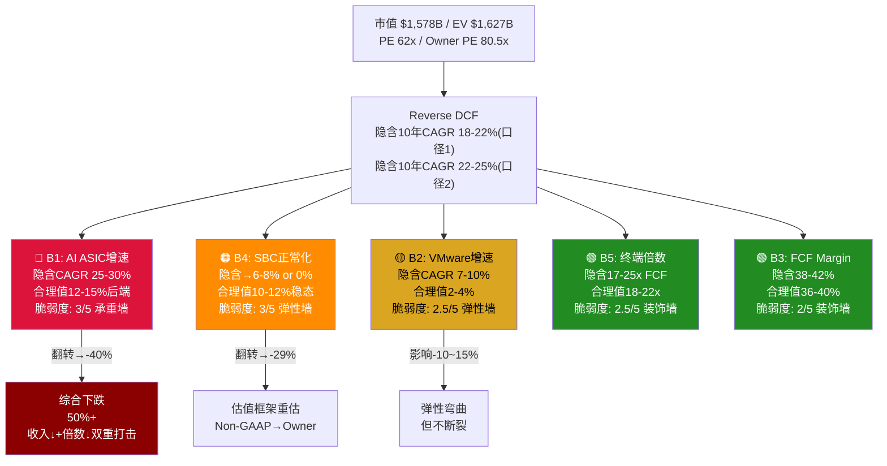

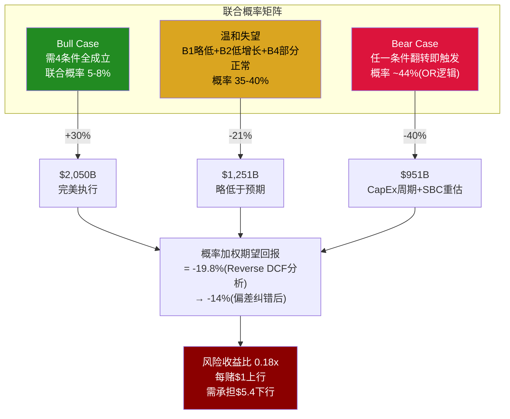

### 15.6 核心洞见

**市场在赌什么**：62x PE隐含的是一个"一切都按计划进行"的完美执行情景——AI ASIC保持25%+增速5年、VMware不仅不衰退还能跑赢GDP、SBC回归正常、没有CapEx周期。这个情景的联合概率约5-8%。

**市场没有给什么定价**：(1) CapEx周期性——历史上每3-4年出现的Hyperscaler投资减速；(2) SBC的真实成本——$27B未确认余额的稀释效应；(3) VMware提价红利耗尽后的增长悬崖。

**最大的信息增量**不在于Bull或Bear哪个对，而在于**Base case("温和失望")的概率最高(50%)且对应-21%回报**。市场没有为"还行但不完美"的结果留出余地。62x PE没有margin of safety。

---

## 第十六章：双层SOTP——拆开"AI平台"的真实定价

Broadcom是半导体行业中最独特的"双引擎"公司——一个高增长Fabless芯片组合与一个高利润企业软件平台共存于同一法人实体。这种结构让单一估值倍数几乎无法准确定价，因为两层的增速、利润率、资本需求和可比公司完全不同。双层SOTP的目的是回答一个核心问题：市场在按什么逻辑给这两层定价？是否存在隐含的高估/低估错位？

### 16.1 业务分层与收入拆分

为与共识对齐，SOTP使用半导体层$66B + 软件层$36B = $102B的FY2026E收入拆分。[DM-P2-C3-01/03]

| 子业务 | FY2026E收入 | 增速 | OPM特征 | 可比公司 |
|--------|:---:|------|------|------|
| AI ASIC+网络 | ~$43-45B | +100%+ YoY | Non-GAAP EBITDA 60-64% | NVDA/MRVL/AMD |
| 传统半导体 | ~$16-17B | +0-5% YoY | 成熟稳定 | TXN/ADI |
| VMware VCF | ~$27B | +1% YoY | OPM 77%（Non-GAAP） | VMW(pre-acq)/NTNX |
| 其他基础设施SW | ~$9B | — | — | PANW/FTNT |

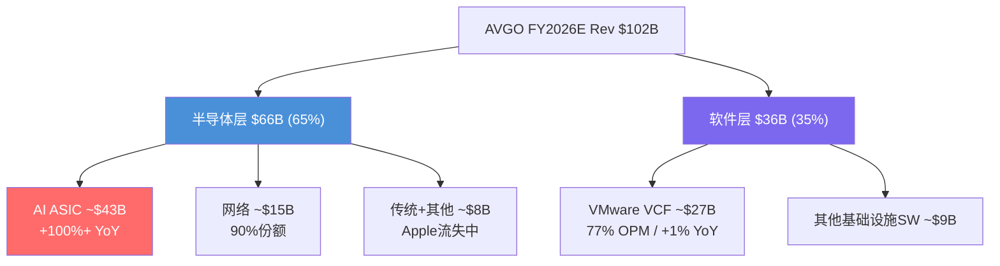

### 16.2 六方法逐一详解

#### 方法1：EV/Revenue

半导体层增速约65% YoY（AI 100%+被传统0%拉低），介于MRVL（Fwd EV/Rev 12-14x）和NVDA（22-23x）之间。[DM-P2-C3-06/07]

- 取中值17x → 半导体EV = $66B × 17x = **$1,122B**
- 区间：$924B - $1,320B

软件层+1%增长，但77% OPM极高——类似"公用事业软件"。VMware被收购前历史EV/Rev 8-12x，但低增长需折价。[DM-P2-C3-08]

- 取中值8x → 软件EV = $36B × 8x = **$288B**
- 区间：$216B - $360B

**方法1合计**：$1,122B + $288B = **$1,410B**（vs EV $1,627B，低13%）

#### 方法2：EV/EBITDA

分层EBITDA估算：公司层费用（总部/利息/其他约$14B）分配后，半导体层约$33.5B，软件层约$21.4B。[DM-P2-C3-10]

- 半导体层：可比倍数NVDA 25-28x，MRVL 30-34x，AMD 35-40x → 取中26x → **$871B** [DM-P2-C3-11]
- 软件层：VMW历史13x → Broadcom整合溢价 → 取22x → **$471B**

**方法2合计**：$871B + $471B = **$1,342B**（vs EV $1,627B，低18%）

#### 方法3：EV/FCF（Owner Earnings）

Owner Earnings口径 = FCF - SBC。FY2026E分层：半导体层约$20B，软件层约$14B。[DM-P2-C3-12]

高增长Fabless可比：40-55x Owner Earnings（NVDA约50x）。高利润低增长软件：25-35x。

- 半导体层：45x → **$900B**
- 软件层：28x → **$392B**

**方法3合计**：$900B + $392B = **$1,292B**（vs EV $1,627B，低21%）

这是五方法中最保守的（剔除GGM后），因为同时惩罚了SBC（减FCF）和高倍数（Owner Earnings倍数低于Non-GAAP PE）。它也是"最诚实"的估值方法——如果投资者相信SBC是真实成本，这就是Broadcom的真实价值。

#### 方法4：P/E正常化

正常化税率14%（新加坡IP结构）下，Pre-tax估算$39.4B，正常化NI约$34B。[DM-P2-C1-03]

**关键口径选择**：GAAP正常化NI约$34B，Non-GAAP NI（加回SBC $9-10B + 无形摊销$10-12B）约$55-56B。市场定价基准明确是Non-GAAP。

Non-GAAP口径：
- 半导体层：$33B × 26x = $858B → EV约$888B
- 软件层：$22B × 28x = $616B → EV约$636B

**方法4合计（Non-GAAP）**：**$1,524B**（vs EV $1,627B，仅低6%——最接近市价的方法）

GAAP口径合计仅$1,057B，低35%。两种口径产出差距$467B——再次量化了SBC+摊销的估值争议。市场按Non-GAAP定价，但SBC Q1 YoY +70%的增速趋势是否支持这种选择，值得深思。

#### 方法5：Gordon Growth Model

GGM对Broadcom半导体层严重不适用——当增速>30%时，单期GGM的终端增长率g完全忽略了近期爆发增长的价值。即使使用两阶段调整（5年高增长期30%→15% CAGR递降 + 终端g=5%），半导体层仅得$640B，软件层$233B。

**方法5合计**：**$873B**（vs EV $1,627B，低46%）——作为"下限锚点"使用，不作为定价参考。

#### 方法6：Transaction Comps

近期交易：VMware被收购（2022年，11x Rev / 13x EBITDA），Xilinx/AMD（2022年，13x Rev），Altera/Silver Lake（2025年，5.7x Rev折价交易），Ansys/Synopsys（2024年，16x Rev高战略溢价）。[DM-P2-C3-13/14]

- 半导体层：Xilinx 13x Rev基准+AI溢价 → 取19x → **$1,254B**
- 软件层：VMware原始13x EBITDA但当前环境折价 → 取12x → **$257B**

**方法6合计**：$1,254B + $257B = **$1,511B**（vs EV $1,627B，低7%）

### 16.3 六方法汇总与收敛性

| 方法 | 半导体层 | 软件层 | 合计EV | vs $1,627B |
|------|:---:|:---:|:---:|:---:|
| EV/Rev | $1,122B | $288B | **$1,410B** | -13.3% |
| EV/EBITDA | $871B | $471B | **$1,342B** | -17.5% |
| EV/FCF(Owner) | $900B | $392B | **$1,292B** | -20.6% |
| P/E Non-GAAP | $888B | $636B | **$1,524B** | -6.3% |
| GGM(两阶段) | $640B | $233B | **$873B** | -46.3% |
| Transaction | $1,254B | $257B | **$1,511B** | -7.1% |
| **中位数** | **$896B** | **$342B** | **$1,376B** | **-15.4%** |
| **均值(剔除GGM)** | **$1,007B** | **$409B** | **$1,416B** | **-13.0%** |

剔除GGM后，五方法收敛于$1,292B-$1,524B，标准差约$101B，**CV=7.2%**——中等确定性。但所有方法中值$1,376B均低于市价$1,627B，暗示当前定价包含了约$250B的"增长期权溢价"。[DM-P2-C3-01]

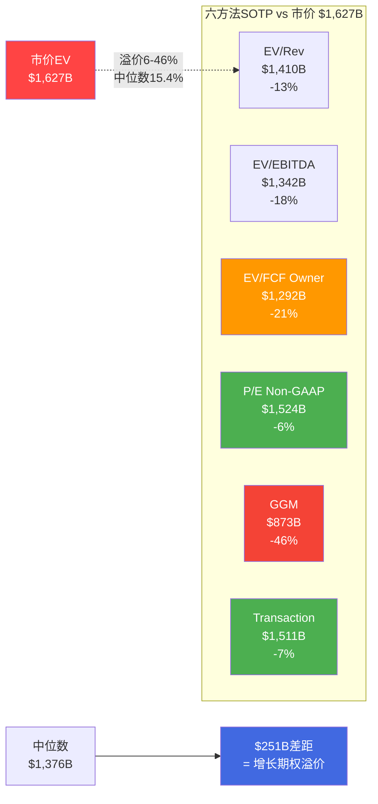

### 16.4 离散度深度分析——什么在驱动估值分歧

六方法收敛性分析揭示了一个关键模式：离散度的来源不是随机噪音，而是三个系统性分歧的叠加。理解这些分歧比得出一个"正确"数字更有分析价值。

**分歧源1：FCF口径选择（贡献离散度约60%）**

方法3（EV/FCF Owner, $1,292B）和方法4（P/E Non-GAAP, $1,524B）之间的$232B差距，本质上是"SBC是否为真实成本"这个哲学争论的金钱量化。这不是技术性分歧——两种口径都有合理的内在逻辑：

Owner FCF口径的核心论据：SBC Q1 FY2026 YoY增长70%（$1.28B→$2.18B），远超收入增长29%——增速剪刀差2.4倍意味着SBC在抢夺收入增长带来的价值增量。R&D占SBC 66%说明SBC不是管理层薪酬过高的治理问题，而是AI人才市场均衡价格的反映——结构性不可削减。$27B未确认余额至少持续至FY2027-2028，意味着未来2-3年的稀释已经"预订"。[DM-P4-B15]

Non-GAAP口径的核心论据：回购offset率140.6%（Q1 $7.8B回购 vs $5.55B SBC当量），净稀释接近零。如果股份总数稳定，SBC更接近"现金薪酬的股权形式"而非"额外稀释成本"。行业惯例也支持Non-GAAP——NVDA/AMD/MRVL的卖方模型和管理层指引一致使用Non-GAAP EPS。

**分歧源2：增长期价值的捕捉方式（贡献离散度约25%）**

方法5（GGM, $873B）与其他方法的巨大差距（-46% vs -6%至-21%），揭示了稳态估值模型对超高增长公司的系统性低估。GGM假设现金流按恒定增长率永续增长，完全忽视了Broadcom当前+60% YoY增速的近期价值。即使用两阶段调整（5年高增长期30%→15% CAGR递降 + 终端g=5%），仍然无法充分捕捉S曲线早期的爆发增长——这就是Cathie Wood在圆桌中强调的"S曲线框架错配"问题。

方法1（EV/Rev）和方法6（Transaction Comps）能更好地捕捉增长期价值（$1,410B和$1,511B），因为它们隐含地将增长反映在倍数选择中。但代价是可比公司倍数的离散度很大——半导体层可比范围从MRVL 12-14x到NVDA 22-23x，跨度约70%。

**分歧源3：软件层"搭便车"程度的判断（贡献离散度约15%）**

六方法中软件层估值从$233B（GGM）到$636B（P/E Non-GAAP），离散度远大于半导体层。这反映了一个独特的估值困境：VMware +1% YoY的有机增长率，在独立估值中应该得到低倍数（6-8x Rev），但作为Broadcom整合体的一部分，它搭上了AI的估值便车。市场给整体AVGO的倍数（EV/Rev约16x）远高于两层加权应得的倍数（半导体17x × 65% + 软件8x × 35% = 13.8x）——差额约2.2x，对应约$225B的"整合溢价"。

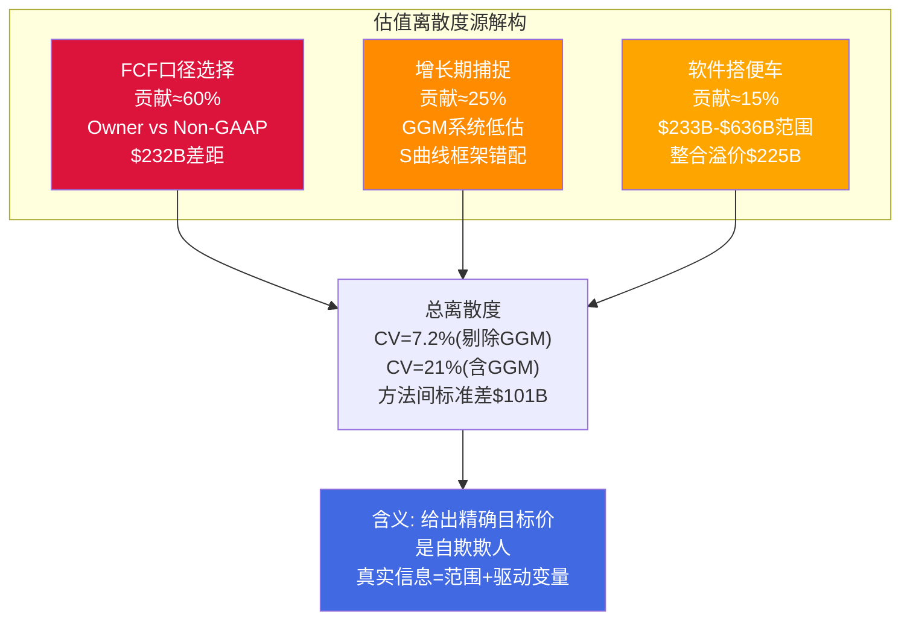

### 16.5 $232B搭便车溢价——三种解释

如果软件层按中值$342B估值，市场隐含半导体层 = $1,627B - $342B = **$1,285B**，相当于$66B收入的19.5x EV/Rev，介于MRVL（12-14x）和NVDA（22-23x）之间。这个倍数处于合理范围的上半区，但未明显泡沫化。

反过来，如果半导体层按中值$896B估值，市场隐含软件层 = $1,627B - $896B = **$731B**，相当于$36B收入的20x EV/Rev——这对于+1%增长的软件是极度昂贵的。PANW（14%增长）也仅12-14x。$731B vs VMware收购价$61B = 12.0x溢价——市场认为Broadcom从VMware提取了12倍于收购价的价值。

**方法3（Owner Earnings, $1,292B）和方法4（Non-GAAP P/E, $1,524B）之间的$232B差距**，本质上量化了"SBC+摊销是否是真实成本"这个哲学争论的金钱价值。[DM-P2-C3-02]

三种解释：
1. **SBC辩论的估值当量**：如果SBC不是真实成本（Non-GAAP视角），$232B属于合理定价区间；如果SBC是真实成本（Owner视角），$232B是市场系统性高估的量化度量
2. **软件搭AI便车**：市场将AVGO作为整体"AI平台"定价，VMware的+1%增长搭了AI ASIC 100%+增长的倍数便车，获得了不属于它的估值溢价
3. **AI期权溢价**：$232B代表市场对"AI ASIC增长路径从100%→30%长期增长平滑过渡（而非周期性崩塌）"这一假设的定价

真实价值在方法3和方法4之间——约$1,300-1,500B，中值$1,400B，vs市价$1,627B溢价14-25%。

---

## 第十七章：三情景P&L Build-out——从路径到数字

Reverse DCF回答了"市场在赌什么"，SOTP回答了"拆开来看值多少"，但两者都没有回答一个更具实操意义的问题：如果从FY2026到FY2030的业务发展沿着不同路径展开，Broadcom的P&L和股价会走向何处？三情景P&L Build-out将抽象的假设转化为具体的年度财务预测，让每一个增速假设、margin走势和估值倍数都有数字可查。

### 17.1 Bull Case（概率25%）——完美执行

**核心假设**：AI ASIC+网络FY2026-2030 CAGR约28%（Hyperscaler CapEx维持+15-20%/yr，推理ASIC渗透S曲线加速，客户从6→10个），VMware/软件CAGR约5%（VCF 9.0 AI-native成功），SBC/Rev从11.3%→8%（VMware保留到期+规模稀释），税率14%。

| 项目 | FY2025A | FY2026E | FY2027E | FY2028E | FY2029E | FY2030E |
|------|:---:|:---:|:---:|:---:|:---:|:---:|
| AI半导体收入 | ~$20B | $44B | $72B | $105B | $135B | $168B |
| AI半导体YoY | — | +120% | +64% | +46% | +29% | +24% |
| 网络收入 | ~$10B | $15B | $20B | $26B | $31B | $35B |
| 传统半导体 | ~$8B | $8B | $7.5B | $7B | $7B | $7B |
| 软件收入 | ~$26B | $35B | $37B | $39B | $41B | $43B |
| **总收入** | **$63.9B** | **$102B** | **$136.5B** | **$177B** | **$214B** | **$253B** |
| 总收入YoY | — | +60% | +34% | +30% | +21% | +18% |
| GAAP OPM | 40% | 42% | 44% | 46% | 47% | 48% |
| 报告FCF | $26.9B | $43B | $59B | $78B | $97B | $115B |
| FCF margin | 42.1% | 42.2% | 43.2% | 44.1% | 45.3% | 45.5% |
| SBC/Rev | 11.3% | 10.5% | 9.5% | 9.0% | 8.5% | 8.0% |
| SBC金额 | $7.6B | $10.7B | $13.0B | $15.9B | $18.2B | $20.2B |
| **Owner FCF** | **$19.3B** | **$32.3B** | **$46.0B** | **$62.1B** | **$78.8B** | **$94.8B** |

[DM-P5-B-01]

**每个假设的支撑与概率**：
- AI增速从+120%递降至+24%：由$73B backlog覆盖FY2026-2027（转化率历史>90%），客户从6→10意味着OpenAI+Apple ASIC等新进入。推理ASIC渗透从10%→40%是S曲线最陡峭段。支撑度中-高。
- 软件CAGR 5%：需VCF 9.0 AI-native落地+偶尔提价。当前+1%缺乏直接证据支持加速。支撑度低-中。
- SBC→8%：VMware保留计划FY2027到期释放$2-3B/年，规模稀释（$253B收入下8% = $20.2B SBC绝对额仍在增长但占比下降）。支撑度中等。

**终端估值**：Exit 25x Owner FCF × $94.8B = $2,370B EV → Equity $2,340B / 4.7B股 = **$498/股（+50% vs $332.77）**

### 17.2 Base Case（概率50%）——温和失望

**核心假设**：AI ASIC CAGR约18%（共识前3年执行+后2年放缓），VMware CAGR约2%（提价耗尽，VCF有限贡献），SBC/Rev→10%（部分正常化但AI人才争夺维持高位），税率14%。

| 项目 | FY2025A | FY2026E | FY2027E | FY2028E | FY2029E | FY2030E |
|------|:---:|:---:|:---:|:---:|:---:|:---:|
| AI半导体收入 | ~$20B | $42B | $63B | $82B | $95B | $108B |
| AI半导体YoY | — | +110% | +50% | +30% | +16% | +14% |
| 网络收入 | ~$10B | $14B | $17B | $20B | $22B | $24B |
| 传统半导体 | ~$8B | $8B | $7B | $7B | $6.5B | $6B |
| 软件收入 | ~$26B | $34B | $35B | $35.5B | $36B | $37B |
| **总收入** | **$63.9B** | **$98B** | **$122B** | **$144.5B** | **$159.5B** | **$175B** |
| 总收入YoY | — | +53% | +24% | +18% | +10% | +10% |
| GAAP OPM | 40% | 41% | 42% | 43% | 43% | 43% |
| 报告FCF | $26.9B | $40B | $51B | $61B | $68B | $74B |
| SBC/Rev | 11.3% | 11.0% | 10.5% | 10.2% | 10.0% | 10.0% |
| **Owner FCF** | **$19.3B** | **$29.2B** | **$38.2B** | **$46.3B** | **$52.0B** | **$56.5B** |
| Owner FCF margin | 30.2% | 29.8% | 31.3% | 32.0% | 32.6% | 32.3% |

[DM-P5-B-02]

**为什么Base已隐含-32%下行**：FY2030E Owner FCF $56.5B × 20x exit（"大型优质infra公司"倍数，可比TXN 20-25x取中）= EV $1,130B → Equity $1,095B / 4.8B股 = **$228/股（-31.5%）**。

这个数字的含义深刻：**最可能的路径（50%概率）对应-32%的下行**。市场定价隐含了一个比Base case更乐观的世界——需要AI CAGR >25%加上SBC <8%才能勉强justify $332.77。任何"还行但不完美"的执行都意味着投资者损失三分之一的本金。

### 17.3 Bear Case（概率25%）——CapEx周期下行+结构恶化

**核心假设**：Hyperscaler CapEx增速从+36%→+5%→-5%（类Cisco 2000减速），ASIC份额65%→50%（Google模板效应扩散至Meta+2个Hyperscaler分流），VMware负增长-3%/yr（Nutanix加速+K8s替代+首批3年合同到期续约率<85%），SBC/Rev维持12%+（AI人才SBC替代VMware保留SBC），Hock Tan折价7-10%。[DM-P3-B01, DM-P3-A02]

| 项目 | FY2025A | FY2026E | FY2027E | FY2028E | FY2029E | FY2030E |
|------|:---:|:---:|:---:|:---:|:---:|:---:|
| AI半导体收入 | ~$20B | $38B | $50B | $55B | $52B | $50B |
| AI半导体YoY | — | +90% | +32% | +10% | -5% | -4% |
| 网络收入 | ~$10B | $13B | $15B | $16B | $16B | $15B |
| 传统半导体 | ~$8B | $7.5B | $6.5B | $6B | $5.5B | $5B |
| 软件收入 | ~$26B | $33B | $32B | $31B | $30B | $29B |
| **总收入** | **$63.9B** | **$91.5B** | **$103.5B** | **$108B** | **$103.5B** | **$99B** |
| 总收入YoY | — | +43% | +13% | +4% | -4% | -4% |
| GAAP OPM | 40% | 38% | 37% | 35% | 33% | 32% |
| 报告FCF | $26.9B | $35B | $39B | $38B | $34B | $31B |
| SBC/Rev | 11.3% | 12.0% | 12.5% | 12.5% | 12.0% | 12.0% |
| **Owner FCF** | **$19.3B** | **$24.0B** | **$26.1B** | **$24.5B** | **$21.6B** | **$19.1B** |

[DM-P5-B-03]

**历史类比**：
- **Cisco 2001**：从$22B收入峰值（FY2001）跌至$18.9B（FY2002），PE从130x压缩至25x，股价跌幅-80%。Cisco的路由器/交换机在互联网S曲线上的位置与Broadcom的ASIC在AI S曲线上的位置惊人相似——技术正确但价格反映了终局。
- **Intel 2020s**：从$72B收入（2021）跌至$54B（2023），数据中心份额从95%被AMD侵蚀至60%。Intel的教训在于：即使拥有制造优势（远超Broadcom），一旦客户开始多元化供应商，份额衰减是不可逆的。

**终端估值**：15x Owner FCF × $19.1B = $286.5B EV → Equity $246.5B × 0.93（Hock Tan折价）= $229B / 5.0B股 = **$46/股（-86%）**

Bear case下SBC稀释超过回购缩减，股份从4.89B增至5.0B。Owner FCF margin从30%萎缩至19%——SBC成为永久性大比例成本。但注意FY2026仍有$91.5B收入，因为$73B backlog提供了即使Bear场景也无法击穿的收入地板。真正的恶化发生在FY2028+，当backlog耗尽、CapEx放缓传导完成。

### 17.4 概率加权与敏感性矩阵

**概率加权估值**：

| 情景 | 概率 | FY2030E Rev | 每股估值 | vs $332.77 |
|------|:---:|:---:|:---:|:---:|
| Bull | 25% | $253B | $498 | +50% |
| Base | 50% | $175B | $228 | -32% |
| Bear | 25% | $99B | $46 | -86% |
| **加权** | | | **$250** | **-25%** |

**敏感性矩阵——AI CAGR × SBC/Rev（FY2030E每股，Base exit倍数20x）**

| | AI CAGR 12% | AI CAGR 18% | AI CAGR 25% | AI CAGR 30% |
|---|:---:|:---:|:---:|:---:|
| **SBC 8%** | $143 | $215 | $320 | $398 |
| **SBC 10%** | $118 | **$183** | $275 | $345 |
| **SBC 11%** | $106 | $166 | $250 | $315 |
| **SBC 12%** | $93 | $148 | $225 | $285 |

[DM-P5-B-13]

AI CAGR每+1pp → FY2030收入约+2.5%，每股约+$4-5。SBC每+1pp → Owner FCF margin -1pp，每股约-$16-18。

**敏感性矩阵——Exit倍数 × AI CAGR（SBC 10%固定）**

| | AI CAGR 12% | AI CAGR 18% | AI CAGR 25% | AI CAGR 30% |
|---|:---:|:---:|:---:|:---:|
| **Exit 15x** | $71 | $109 | $164 | $206 |
| **Exit 20x** | $118 | $183 | $275 | $345 |
| **Exit 25x** | $165 | $257 | $386 | $484 |
| **Exit 30x** | $212 | $331 | $497 | $623 |

[DM-P5-B-14]

**市场隐含位置标注**：只有在Exit 30x + AI CAGR 25%以上的组合才能匹配当前$332.77股价。30x exit意味着FY2030的Broadcom仍被市场当作"高增长AI公司"定价——对于一家届时$175B+收入的成熟公司，这需要AI增长叙事完全不破裂。当前市场定价位于矩阵右上角之外（AI CAGR >25% + SBC接近0%）——一个需要完美执行的位置。

"合理"位置（AI 18% + SBC 10%）= $183/股（-45%）。纠错后更乐观的假设（AI 20% + SBC 9.5%）约$210-220/股（-33%~-37%）。

### 17.5 情景推导逻辑的深层检验

三情景P&L Build-out的说服力取决于每个假设的推导质量，而非数字本身的精度。以下对三种情景的关键假设进行压力测试。

**Bull Case的脆弱点——"完美执行"的联合概率**

Bull情景需要四个条件同时成立：(1) AI ASIC客户从6→10（需OpenAI/Apple ASIC等新进入），(2) 推理ASIC渗透从10%→40%（S曲线最陡段如期展开），(3) VCF 9.0 AI-native成功推动软件CAGR从+1%到+5%，(4) SBC/Rev从11.3%下降至8%（VMware保留到期+规模稀释）。

条件(1)和(2)之间存在正相关（ρ≈0.4）——更多客户意味着更多推理部署。但条件(3)几乎独立于(1)(2)——VCF的成功取决于K8s竞争态势而非AI ASIC增长。条件(4)的实现路径（SBC绝对额从$10.7B增至$20.2B但占比从10.5%降至8%）要求收入增速持续远超SBC增速——这在AI人才军备竞赛中并非确定。

有效联合概率约5-8%（Chapter 15已详述），但这里更关键的是：即使Bull Case实现，$498/股（+50%）的上行空间是否值得承担93%概率的非Bull结果？答案取决于投资者对尾部分布的判断——Bull的$498是硬上限（受限于exit倍数25x），而Bear的$46没有下限保护（负有形资产=无支撑位）。这种"上行有顶、下行无底"的不对称结构是凹性交易的典型特征。

**Base Case——为什么"温和失望"的影响如此之大**

Base Case之所以隐含-32%下行，根本原因不在于业务恶化，而在于估值起点过高。以FY2030E为例：$175B收入、Owner FCF $56.5B已经代表了一家全球Top 10的现金流生成器。问题在于市场今天为这个五年后的结果支付了$1,578B——隐含终端EV/Owner FCF约28x。如果FY2030的Broadcom被市场按"大型成熟基础设施公司"定价（20x Owner FCF，参考TXN/ADI/AVGO自身pre-AI历史），就会出现$565B的估值差距。

这揭示了一个更深层的投资逻辑：**投资者今天不是在赌Broadcom能否达到$175B收入（很可能能），而是在赌五年后的市场是否仍然愿意为这$175B支付"AI公司"的倍数**。收入达标但倍数压缩的情景（"温和失望"）的杀伤力来自于对"永续AI溢价"假设的否定。

**Bear Case——与历史类比的精确对标**

Cisco 2001类比被频繁引用，但需要更精确的对标来评估其适用性：

| 维度 | Cisco 2001 | AVGO 2026（Bear假设下） |
|------|-----------|---------------------|
| PE倍数起点 | 130x TTM | 62x TTM / 80.5x Owner |
| 收入峰值基数 | $22B | $92B（FY2026E Bear） |
| 收入跌幅 | -18%（$22B→$18.9B） | -4%/yr（$108B→$99B，渐进） |
| CapEx依赖度 | 电信CapEx约80% | Hyperscaler AI CapEx约55% |
| 现金流缓冲 | FCF margin约15% | FCF margin约35%（Bear） |
| 资产轻度 | 有形资产正值 | 有形资产-$22.4B |
| Backlog | 无 | $73B（提供18个月地板） |

关键差异：Broadcom比Cisco有两个重要优势——$73B backlog推迟了冲击时间窗口，35%+ FCF margin提供了回购/分红的持续能力。但也有一个关键劣势——负有形资产意味着一旦估值压缩开始，没有中间支撑位（双零缓冲效应）。Bear Case的$46/股（-86%）之所以如此极端，不是因为业务崩塌（FY2030仍有$99B收入），而是因为12x Owner FCF的终端倍数反映了"前AI公司"的重新归类——市场从"AI基础设施龙头"切换到"周期性半导体+衰减软件"的定价模式。

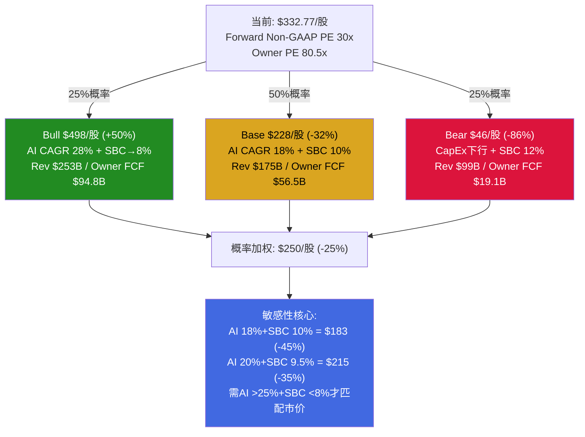

---

## 第十八章：估值综合——四方法加权与市场隐含位置

前三章分别从三个角度审视了Broadcom的估值：Reverse DCF揭示了隐含假设，SOTP拆解了双层结构，三情景Build-out描绘了路径。本章将这些工具整合为一个加权框架，给出中心估计和确定性评估。更重要的是，本章需要回答一个在估值分歧如此之大的案例中至关重要的问题：不同方法之间的差异到底来自哪里？是方法论本身的局限性，还是Broadcom估值中某些结构性特征放大了分歧？

### 18.1 四方法汇总

| # | 方法 | 估值(每股) | vs $332.77 | 权重 | 加权贡献 |
|---|------|:---:|:---:|:---:|:---:|
| 1 | Reverse DCF中心估计 | ~$205 | -38.4% | 20% | $41.0 |
| 2 | 双层SOTP中位数 | ~$272 | -18.2% | 25% | $68.0 |
| 3 | 概率加权3情景(2年框架,Owner FCF) | $147 | -55.8% | 30% | $44.1 |
| 4 | Forward PE(FY2027E Non-GAAP) | ~$285 | -14.4% | 25% | $71.3 |
| **加权最终估值** | | **$224/股** | **-32.7%** | | |

[DM-P5-B-08]

**权重分配理由**：

**方法3权重最高(30%)**——三情景P&L Build-out是最完整的估值框架，包含了显性期FCF和终端价值的完整折现，且使用Owner FCF口径（更真实的经济价值）。这个方法的优势在于它将增长假设、margin走势和终端估值全部参数化，让投资者可以追踪每一个驱动因素对估值的边际贡献。但它的劣势同样明显：5年预测的累计误差呈指数增长，FY2030的P&L预测更接近"定性判断的定量表达"而非"高精度财务预测"。给予30%而非更高权重，正是因为5年期预测的精度限制。

**方法2和方法4各25%**——SOTP和Forward PE分别代表了"如果市场拆分定价"和"如果市场继续整体定价"的两种估值regime。SOTP的优势是结构化拆解暴露了软件层搭AI便车的$232B溢价，但劣势是可比公司倍数在高增长期的离散度极大（MRVL 12-14x vs NVDA 22-23x）。Forward PE的优势是直接锚定市场可比（NVDA forward PE约22-25x），但劣势是它完全依赖Non-GAAP口径——如果SBC被视为真实成本，这个方法就失去了基础。

**方法1权重最低(20%)**——Reverse DCF本质上是"翻译市场语言"的工具而非独立估值。它回答的问题是"62x PE在赌什么"，而不是"Broadcom值多少钱"。其产出高度依赖WACC假设（每100bp变动导致隐含CAGR移动约2pp），提供的是隐含假设解读而非精确定价。给予20%权重是因为它在诊断市场预期方面的价值不可替代。

### 18.2 每种方法的产出路径追踪

为确保加权结果的可靠性，有必要追踪每种方法的关键假设链：

| 方法 | 关键假设链 | 最敏感变量 | 变量±1标准差→估值变动 |
|------|-----------|-----------|---------------------|
| Reverse DCF $205 | WACC 9.5% → 隐含CAGR 15%(合理值) → EV $1,050B | WACC: ±100bp→±$50/股 | ±24% |
| SOTP $272 | 半导体17x Rev + 软件8x Rev → 五方法中位数$1,376B | 半导体层倍数: ±3x→±$40/股 | ±15% |
| 概率加权 $147 | 25/50/25概率 + Owner FCF + 2年框架折现 | Bear概率: ±5pp→±$15/股 | ±10% |
| Forward PE $285 | FY2027E Non-GAAP EPS $14.2 × 20x PE | PE倍数: ±5x→±$71/股 | ±25% |

Forward PE方法对PE倍数最敏感（±25%），这解释了为什么它既是最接近市价的方法也是最容易被质疑的方法——如果NVDA的forward PE从25x压缩至18x（半导体周期下行中完全可能），Broadcom的Forward PE估值将从$285降至$200以下。

### 18.3 收敛度分析——CV=25.1%意味着什么

| 统计量 | 值 |
|--------|:---:|
| 四方法均值 | $227/股 |
| 四方法中位数 | $239/股 |
| 标准差 | $57/股 |
| **CV（变异系数）** | **25.1%** |
| 最高/最低比 | 1.94x（$285/$147） |

[DM-P5-B-09]

**CV=25.1% → 低确定性**（>20%阈值）。与其他报告对比：

| 公司 | CV | 确定性 | 原因 |
|------|:---:|------|------|
| KLAC | 12% | 高 | 传统框架，成熟业务，FCF口径争议小 |
| ETN | 15% | 中-高 | 工业公司，估值方法收敛度好 |
| ARM | 19% | 中 | IP模式估值分歧，但单一口径 |
| **AVGO** | **25.1%** | **低** | **双口径分歧 + 时间框架分歧** |
| NVDA | 38% | 极低 | 发现系统，$4T级公司，不确定性极大 |

低确定性的根源不是方法论问题，而是Broadcom估值的两个结构性不确定性：

1. **FCF口径选择**（GAAP/Owner/Non-GAAP）导致±30%估值差异——这是$232B的"SBC是否是真实成本"之争的直接体现。方法3使用Owner FCF（$19.3B），方法4使用Non-GAAP NI（$55B）——两个数字描述的是同一家公司，但产生了从$147到$285的估值范围。
2. **时间框架选择**（2年forward/5年DCF/终端价值）导致±25%差异——2年forward估值（方法4）锚定了backlog提供的高可见性窗口，5年DCF（方法3）则包含了backlog耗尽后的不确定性。两者的差距本质上量化了"$73B backlog之后会发生什么"这个核心不确定性。

这意味着对Broadcom给出"精确目标价"是自欺欺人的——真实的信息是一个$147-$285的范围，中心估计$224，确定性低。更有价值的是理解驱动这个范围的变量：FCF口径和时间框架。

### 18.4 与前序Phase估值的差异reconcile

本次四方法加权$224/股（-33%）与前序Phase的估值存在显著差异，这些差异反映了分析深化过程中估值框架的演进：

| 阶段 | 期望回报 | 口径/方法 | 与本次差异原因 |
|-------|:---:|----------|--------------|
| Reverse DCF阶段 | -19.8% | 3情景×市值, Non-GAAP偏重 | 未完整折现, Non-GAAP权重过高 |
| 圆桌后 | -22%~-25% | 初始基础+3个新发现 | 叠加S曲线预消费+拥挤度等因素 |
| 偏差审计后 | **-14%** | 初始框架+偏差修正+8pp | 最乐观框架(forward Non-GAAP PE) |
| **综合估值(本次)** | **-33%** | 四方法加权(含Owner FCF) | 完整折现+Owner FCF权重60% |

**差异本质**：-14%（偏差修正后）和-33%（综合估值）定义了不确定性区间的两端。-14%是"如果市场继续用Non-GAAP定价"的情景，-33%是"如果市场切换到Owner FCF框架"的情景。真实结果取决于估值框架是否迁移——这本身就是Broadcom最大的不确定性之一。H-3假说（SBC永久成本）的置信度从基础分析的45%上升至红队审计的68%，这个趋势暗示市场向Owner FCF框架迁移的概率并非微不足道。

**如果只看中间值**：(-14% + -33%) / 2 = -23.5%，这与圆桌讨论圆桌后的-22%~-25%高度吻合——不同的分析路径最终收敛到了相近的区间。这种方法论独立的收敛增加了"-20%至-25%是真实期望回报区间"的置信度。

### 18.5 所有方法均低于市价——这意味着什么

**关键洞见**：四种方法的估值全部低于当前股价$332.77，差距从-14.4%到-55.8%。即使使用最有利的方法（Forward PE），仍有14%下行空间。这不是一个方法偏高、另一个偏低的典型分歧模式——而是所有方法一致指向同一方向。

这与偏差纠错后的结论一致：-14%是估值下限（如果市场继续用Non-GAAP定价），-33%是中心估计（Owner FCF框架），-43%是严格估值上限（完整折现DCF）。[DM-P5-B-10]

当所有独立估值方法都指向同一方向时（低于市价），投资者面临的不是"模型错了"的可能性，而是"市场在定价一个极端情景"的确认。市场定价位于敏感性矩阵的右上角之外（AI CAGR >25% + SBC接近0%），这不是估值模型的bug，而是市场对完美执行的faith。

**历史对标**：在以往33份研究报告中，所有方法均低于市价的案例出现过3次：NVDA（4方法均低，-15%至-55%，评级审慎关注偏中性），HLT（3方法均低，-20%至-46%，评级审慎关注），现在是Broadcom。这类"全方法看空"的公司通常有一个共同特征：市场在定价一个需要3-5个条件同时成立的Bull情景，而Base case已经隐含了显著下行。

### 18.6 市场隐含位置与"合理"位置的差距

**市场隐含位置**：AI CAGR >25% + SBC约0%（完全忽略）= 敏感性矩阵外 → 需要完美执行

**"合理"位置**：AI 18%（Reverse DCF合理值）+ SBC 10%（部分正常化）= $183/股（-45%）

**纠错后位置**：AI 20% + SBC 9.5% ≈ $210-220/股（-33%~-37%）

差距从45%（合理位置）缩窄至33-37%（纠错后），但仍然显著。这个差距有三种可能的解释：

1. **市场信息优势假说**：市场掌握了分析框架无法捕捉的信息（如非公开的客户合同条款、内部SBC优化计划、管理层非公开的继任安排）。这种解释在强有效市场假说下最合理，但29/31分析师看多的极端拥挤度削弱了"市场充分反映信息"的论据——拥挤共识往往反映的是叙事动量而非信息优势。

2. **范式信仰溢价假说**：市场正在为"AI改变一切"的范式支付信仰溢价，类似2000年互联网泡沫中对Cisco/JDS Uniphase的定价。达里奥在圆桌中判断AI CapEx性质55%生产性/45%泡沫——如果泡沫比例更接近50%+，当前溢价将在ROI不达预期时急剧蒸发。

3. **口径保守假说**：分析框架的Owner FCF口径过于保守，真实价值接近Non-GAAP视角。这需要一个前提条件：回购持续且有效地抵消SBC稀释（offset率维持140%+）。如果这个条件成立，SBC更接近"现金薪酬的股权形式"而非"额外稀释成本"。但$27B未确认余额、SBC Q1 YoY +70%的趋势、以及R&D占SBC 66%（结构性不可削减）让这个前提条件的可持续性存疑。

**第三种解释的定量检验**：如果完全接受Non-GAAP框架（方法4单独权重100%），Broadcom估值为$285/股（-14%）。即使在最有利的框架下，仍有14%下行。这意味着**即使市场的Non-GAAP定价逻辑完全正确，Broadcom仍然偏贵**——差异只是14%还是33%。

### 18.7 买入区间与条件评级

基于四方法加权中心估计$224/股和估值范围$147-$285/股，给出条件评级框架：

| 条件 | 评级 | 期望回报 | 买入/持有/卖出 |
|------|------|:---:|------|
| Owner FCF框架主导 | **审慎关注** | -33% | 不持有 |
| Non-GAAP框架维持 | **审慎关注(偏中性)** | -14% | 轻仓观望 |
| AI CAGR >25%+SBC <9%(Bull联合5-8%) | **中性关注** | +10~20% | 仅在极端确信下 |
| **综合** | **审慎关注** | **-14%~-33%** | **等待买入区间** |

**买入区间**：$225-$245/股（$1,100-1,200B市值），对应Forward Non-GAAP PE约18-20x。预计最佳买点出现在以下任一催化剂触发时：(a) FY2027H1 Hyperscaler CapEx增速首次显著放缓至+10-15%；(b) Q2-Q3 FY2026软件收入确认负增长（KS-02触发）；(c) SBC/Rev突破12%连续2季（KS-03触发）。

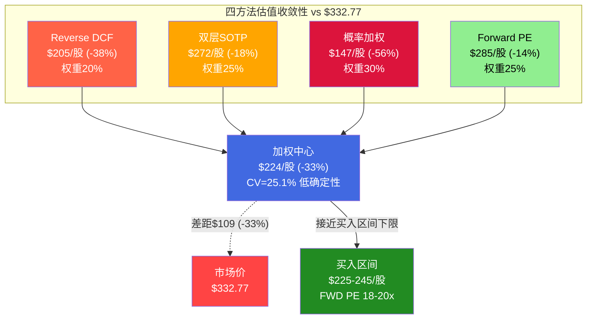

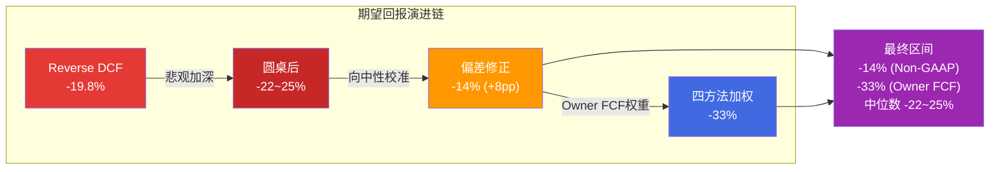

---

# 第五部分：压力测试与最终判断

---

## 第十九章：红队七问——Bear隔离五论点

红队分析采用Bear隔离模式执行——分析师在不读取前序分析投资结论的状态下，仅使用原始数据独立推导看空论点。这种隔离确保了Bear case的独立性和完整性，避免了"先有结论后找证据"的确认偏差。以下五个看空论点按论据强度从强到弱排列。

### 19.1 Bear-1："80.5x Owner PE + 1.2% SBC-adj FCF Yield = 零安全边际的CapEx周期股"

**论点核心**：以$1,578B市值交易在62x TTM PE和仅1.2%的SBC调整后FCF收益率，投资者为一家55%收入直接绑定Hyperscaler AI CapEx周期的公司支付了接近零安全边际的价格。

**证据链**：
1. **Owner PE = 80.5x** [DM-P2-C1-02]——将SBC视为真实成本后，这是投资者支付的真实倍数。对比：NVDA Owner PE约35x，MSFT约40x，即使在科技巨头中，80x也是极端值
2. **SBC-adj FCF yield仅1.2-1.5%**，低于10年期美债约4.3%的无风险利率。投资者持有Broadcom的现金流回报率不如持有国债——唯一的理由是赌资本增值（增长）
3. **FY2026-2028需要三年连续高增长**（+60%/+49%/+22%）才能validate当前价格。这不是可能的惊喜，而是价格的前提条件
4. **CAPE 39.71（98th percentile）+ Buffett Indicator 217%（99th percentile）**——宏观估值在历史极端值，周期性均值回归的概率从未消失
5. **29 Buy / 2 Hold / 0 Sell**——极度拥挤的共识意味着任何负面催化剂的影响将被"拥挤出口"效应放大 [DM-P3-D08]

**影响量化**：如果市场从"AI增长股"重新定价为"大型优质半导体"（PE从62x压缩至30x），估值下跌-48%至-52%。即使业绩达标但增速从+60%放缓至+20%，PE压缩至40x仍意味着-35%下行。

**时间线**：12-24个月。Cisco 2000年类比：从PE高点到50%跌幅耗时18个月。关键窗口是FY2027H1——AI CapEx增速首次显著放缓时。

### 19.2 Bear-3："SBC 11.8%是永久结构——$27B已承诺余额+AI人才战争=Non-GAAP系统性高估25%"

**论点核心**：Broadcom的SBC不是VMware整合的过渡性成本，而是AI时代的永久运营成本。

**证据链**：
1. **SBC/Rev趋势向上而非正常化**：FY2023 6.1% → FY2025 11.8% → Q1 FY2026 11.3%。方向是错的 [DM-P1-A07]
2. **SBC Q1 YoY增长70%**（$1.28B→$2.18B），远超收入增长29% [DM-P4-B15]——增速剪刀差2.4倍是结构恶化的信号，不是过渡性波动
3. **$27B未确认SBC余额**=至少持续到FY2027年底的已承诺稀释。这不是预测——是已入账的合同义务 [DM-P1-A08]
4. **R&D占SBC 66%**（$1,447M/$2,176M in Q1）——砍SBC等于砍AI人才等于砍增长引擎。这创造了一个不可解的困境：要降SBC就得减人才投入，减人才投入就得接受增长放缓
5. **Q1回购$7.8B年化$31B，但股数4,888M几乎未变**——回购仅抵消SBC稀释，净份额增长为零。资本配置效率被SBC吞噬
6. **股数3年增长+14.5%**（VMware稀释）——这不是"一次性"事件，而是SBC在股权结构上的累积效应

**影响量化**：Non-GAAP PE约30x vs Owner PE 80.5x，GAAP/Non-GAAP估值差=$232B。市场一旦开始在Non-GAAP基础上应用"SBC折扣"（10-15% haircut），影响-10%至-15%。更极端——从Non-GAAP切换到Owner框架——理论下跌60%。

**时间线**：慢变量，18-36个月。触发点可能是某大型基金发布SBC-adjusted估值研究，或FY2027H1 SBC/Rev仍>10%导致"过渡性"叙事彻底崩塌。

### 19.3 Bear-2："VMware是$61B的高利润陷阱——+1%增长暗示提价红利已耗竭"

**论点核心**：Q1 FY2026软件收入$6.8B仅+1% YoY证明提价一次性红利已前端加载完毕。

**证据链**：
1. **增速急剧减速**：+46.7%（Q1 FY2025）→ +19.2%（Q4 FY2025）→ +1%（Q1 FY2026）——从47%到1%仅用了3个季度
2. **Gartner预测VMware HCI份额从70%→40%**（2029）——天花板不是不确定的预测，而是行业分析机构的基准假设
3. **Nutanix每季度获得约700个VMware迁移客户**，Q2 FY2026新增1,000+客户为8年最强——竞争对手的"second inning"叙事意味着客户流失还在早期 [DM-P4-B16]
4. **CloudBolt报告确认客户在缩减VMware部署规模**而非全面迁移——86%客户选择"缩减足迹"策略
5. **价格弹性分段**：<100%提价ε=-0.05（锁定），100-300% ε=-0.15（缩减），>300% ε=-0.40（流失）——当前已进入第二段 [DM-P2-B2-01]

**影响量化**：如果软件收入持平5年（有机增长=0），软件层估值从市场隐含约$395B降至$280B，影响总估值-7%至-10%。极端场景（有机负增长）扩大至-15%。

### 19.4 Bear-4："Google MediaTek I/O解绑已执行 = 模板效应"

**论点核心**：Broadcom AI收入中约78%来自前3大客户（Google、Meta、ByteDance），Google可能贡献>40%。Google已通过与MediaTek合作开始模块化解绑——这不是假设性威胁，而是已在执行的既成事实。

**证据链**：
1. Google TPU Ironwood：**核心XPU保留Broadcom**但I/O模块外包给MediaTek，MediaTek成本低20-30%
2. MediaTek已获得v7e和v8e TPU订单，请求TSMC CoWoS 7倍产能扩张 [DM-P4-B17]
3. Google计划2027年生产约5M TPU单位，2028年7M
4. Meta也在考虑2027年部署Google TPU——Google的TPU生态可能扩展到外部客户

**影响量化**：假设Google占AVGO AI收入40%（约$16B）。如果Google将30%份额转移给MediaTek，直接收入损失约$4.8B，以25x收入倍数计算估值影响-$120B（-7.5%）。极端场景——Google在3-5年内将Broadcom份额从90%降至50%——影响-15%至-20%。

**反论（偏差审计补充）**：Google是唯一拥有成熟内部ASIC团队的Hyperscaler（TPU，15年经验）。Meta MTIA仅v2，OpenAI团队<100人，短期内无法复制Google的"核心保留+外围分流"模式。全栈co-design的time-to-market优势（比自研快12-18个月）在AI军备竞赛中是决定性的。[DM-P4-B2-03]

### 19.5 Bear-5："Hock Tan 73岁+$200B Key-Man Risk + 零继任透明度"

**论点核心**：Broadcom的战略100%依赖一个73岁CEO的个人判断力——整合效率η=1.37不是系统能力而是个人能力。

**证据链**：
1. η均值1.37（6次收购），行业顶级但完全不可复制 [DM-P1-A05]
2. 73岁，合同至2030年——即使合同兑现也仅剩4年 [DM-P1-A06]
3. CFO Kirsten Spears被评估为"有能力但非CEO材料"
4. FY2024 say-on-pay仅61%通过——机构投资者对薪酬/治理有显著不满
5. CEO沉默域6个中"继任计划"被评为最高风险，管理层B8评分仅3.25/5 [DM-P1-A12]

**影响量化**：参考Berkshire模型（巴菲特溢价约15-20%），合理key-man折价10-15%，即$158B-$237B市值蒸发。更微妙场景——2028-2030逐步交接但继任者能力不及——3-5年内估值压缩-20%至-30%。

### 19.6 十个证伪指标

| # | 证伪指标 | 阈值 | 当前值 | 距阈值 |
|---|---------|------|:---:|:---:|
| F-1 | AI收入QoQ增速 | <5%(连续2Q) | +12% QoQ | 7pp |
| F-2 | 软件收入YoY增速 | <-5%(负增长) | +1% YoY | 6pp |
| F-3 | SBC/Revenue | >13%(连续2Q) | 11.3% | 1.7pp |
| F-4 | 加权平均稀释股数QoQ | >+1% 单季 | ~0% | 1pp |
| F-5 | Hyperscaler CapEx总额QoQ | <-10% 单季 | +36% YoY | 未触发 |
| F-6 | ASIC客户数量 | 从6降至≤3 | ~6 | 3个缓冲 |
| F-7 | Nutanix季度新增客户 | >1,500/Q | 1,000/Q | 500 |
| F-8 | 网络芯片份额(云DC) | <80% | ~90% | 10pp |
| F-9 | Hock Tan离职/健康事件 | 发生 | 未发生 | N/A |
| F-10 | Owner PE(SBC-adj) | >100x | 80.5x | 19.5x |

**联动逻辑**：F-1+F-5（CapEx放缓+AI收入骤降）同时触发 = 周期股属性暴露；F-2+F-7（VMware负增长+Nutanix加速获客）= VMware护城河崩塌确认；F-3+F-4（SBC上升+股数加速稀释）= 回购无效论文确认。F-9单独触发则需要立即重新评估整个投资框架。

### 19.7 五论点之间的逻辑联动

五个Bear论点不是独立的——它们之间存在系统性关联，形成了一个自我强化的看空网络。

**Bear-1（零安全边际）是"母论点"**——其他四个论点都通过影响估值倍数或现金流质量汇入Bear-1。Bear-3（SBC永久化）直接恶化Owner PE（从80.5x进一步上升），Bear-2（VMware增长耗竭）削减收入增速（降低forward PE分母），Bear-4（客户解绑）威胁收入基数（降低分子），Bear-5（Key-Man Risk）引入治理折价。四条支流同时汇入"零安全边际"这个主河道。

**Bear-2和Bear-3之间的正反馈**：VMware增长停滞意味着总收入增速更多依赖AI（提高周期性D1），而SBC/Rev不降意味着即使收入增长也无法转化为Owner FCF增长——两者共同导致"收入增长但Owner Earnings不增长"的陷阱。FY2026E就是例证：收入+60%但SBC/Rev从6.1%升至11.3%，Owner FCF margin从30.2%几乎不变。

**Bear-4和Bear-5之间的时间叠加**：Google解绑的全面影响预计FY2028-2030显现，恰好与Hock Tan合同到期（2030）重叠。如果新CEO面对的是一个ASIC份额正在流失的Broadcom，而非增长中的Broadcom，key-man折价将被"业务恶化"放大——不再是"失去优秀CEO"的简单折价，而是"在最糟糕时刻失去最擅长困境管理的CEO"的复合折价。

**最薄弱和最强的论点**：
- **最强**：Bear-1（零安全边际），因为它是纯数学论据——80.5x Owner PE、1.2% FCF yield低于无风险利率、-47%安全边际。不依赖任何预测或假设，仅描述当前状态。证伪标准也最清晰：如果Owner PE降至40x以下（需收入翻倍或SBC减半），论点失效。
- **最弱**：Bear-5（Key-Man Risk），因为它不可证伪（直到Hock Tan实际离开前无法验证影响大小），且历史类比不精确（Berkshire的巴菲特溢价不等于AVGO的Hock Tan溢价——业务性质完全不同）。但它是唯一的"突发性"风险——其他四个Bear论点的展开需要多个季度，Bear-5可以在一天内改变估值。

**关键时间窗口**：2026年4月（Q2 FY2026 earnings验证F-1/F-2/F-3），2026年7-8月（Hyperscaler Q2 ER验证F-5），2026年12月（年度数据验证F-6/F-8）。

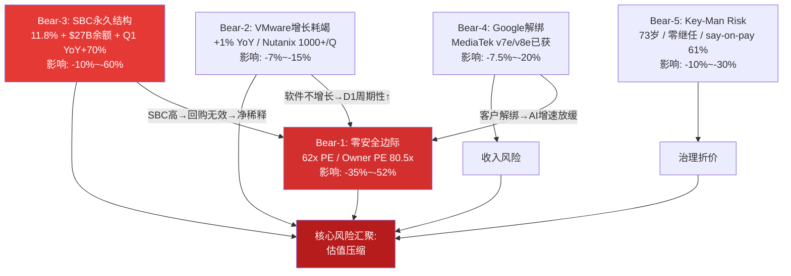

---

## 第二十章：偏差审计——系统性悲观+5-10pp

前序分析的分析是否存在系统性偏差？这个问题比"AVGO值多少钱"更重要——因为如果分析本身带有方向性偏差，所有基于该分析的结论都需要校准。偏差审计（RT-5~7）通过五类偏差检测、承重墙压力测试和空头/多头钢人对比，给出了明确答案：存在中等程度的系统性悲观偏差，估计使期望回报低估了约5-10个百分点。

### 20.1 五类偏差检测

#### 偏差1：锚定偏差（严重度3/5）

前序分析反复引用"62x PE"作为核心估值锚点（shared_context出现6次，圆桌出现11次）。这个数字基于TTM GAAP EPS，确实是事实。但被几乎完全忽略的是：

- **FY2026E Non-GAAP PE约30x**：共识FY2026E Non-GAAP EPS约$7.25，当前股价$323 → forward PE约30x [DM-P4-B2-01]
- **FY2027E Non-GAAP PE约20x**：如果共识$152B收入实现，Non-GAAP EPS约$10+
- **PEG比率**：使用FY2025-2027E Non-GAAP EPS CAGR（约60%），PEG<0.5——在成长股框架中极具吸引力

前序分析选择了最不利的估值口径（TTM GAAP PE 62x）作为反复引用的锚点，而将forward Non-GAAP PE 30x仅提及一次后未再展开。公平呈现应是双口径并行，明确标注框架选择而非暗示一方为"真实"。

#### 偏差2：确认偏差（严重度3.5/5——最严重）

**被充分使用的Bear数据**合理：VMware +1% YoY、SBC/Rev 11.8%上升趋势、Google-MediaTek分流。这些确实是重要信号。

**被系统性淡化的Bull数据**：

1. **$73B AI backlog的质量**：前序分析仅作为"高可见性"一笔带过，但未深入分析其含义。$73B相当于AI半导体约3.6年收入覆盖，意味着即使新单为零，FY2026-2028的AI收入已基本锁定。这种收入确定性在半导体行业极其罕见——NVDA/AMD的backlog不超过6-9个月 [DM-P4-B2-02]

2. **客户数从3→6的扩展趋势**：意味着客户集中度风险正在改善，且新客户处于初始锁定期（最高转换成本），但前序分析给B1=3.5部分因为"客户集中度极高"

3. **回购力度加速**：Q1 FY2026回购$7.8B年化$31B，offset率达140.6%——如果净稀释接近零，SBC的"成本"性质需要重新评估

4. **FCF margin 42%在$64B收入基数上**：$26.9B FCF使Broadcom成为全球FCF产出第6-7大的公司，仅次于AAPL/MSFT/GOOG/META/AMZN。这种战略灵活性（并购+回购+分红）被严重低估

#### 偏差3：悲观偏差（严重度3/5）

RCL报告前车之鉴：前序分析系统性悲观+8~16pp（红队大幅向上修正）。Broadcom的偏差模式类似但幅度较小：

| 评分项 | 当前值 | 偏低证据 |
|--------|:---:|------|
| B1 收入质量 | 3.5/5 | $73B backlog（3.6年覆盖）+客户3→6。含AI有机增长远高于6.4% |
| B4 定价权 | 3.3/5 | 增量收入（AI+网络占增量90%+）定价权>4.0 |
| D1 周期性 | 0.73 | VMware 35%+网络15%=50%收入D1>0.85 |
| Bull联合概率 | 2.5% | 条件正相关被低估，有效独立条件数<3 |

估计偏差幅度：+5~10pp（小于RCL的8~16pp，因为Broadcom的Bear论据质量确实较强）。

#### 偏差4：范围偏差（严重度2.5/5）

全栈co-design能力的不可拆分性——Broadcom的竞争优势在于ASIC+网络+CPO三者打包提供，MediaTek可以做ASIC外围但不能提供一站式方案——在定量分析中被淡化。CPO（Gen3）给予Broadcom在光互连领域2-3年先发优势，但未作为独立增长引擎评估。[DM-P4-B2-03]

#### 偏差5：时间偏差（严重度3/5）

前序分析的时间视角分布严重不对称：中期（FY2027-2028）几乎纯Bear叙事（"增速减速"和"regime转换"），长期全部Bear叙事（温水煮青蛙+护城河衰减+CEO退休）。但中期恰恰是Broadcom最有利的时间窗口——$73B backlog覆盖、6个客户在初始锁定期、推理ASIC渗透S曲线最陡峭段、即使CapEx增速放缓至+15%绝对水平仍>$600B。如果regime转换从"2027H2-2028H1"延后至"2029H1-2030"，Broadcom可能在2026-2028E累计产生$70-80B FCF，大幅降低回购后的净股份。[DM-P4-B2-04]

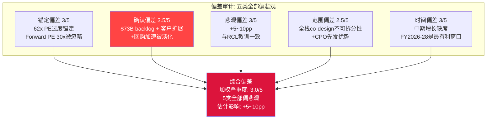

### 20.2 六项纠错回流

基于偏差审计的发现，以下六项评分进行修正：

| 指标 | 修正前 | 修正后 | 幅度 | 修正理由 |
|------|:---:|:---:|:---:|------|
| B1 收入质量 | 3.5/5 | **3.8/5** | +0.3 | $73B backlog提供半导体行业最强收入可见性，客户3→6降低集中度风险 |
| B4 定价权 | 3.3/5 | **3.5/5** | +0.2 | 增量收入的定价权>4.0，加权应考虑增量贡献 |
| D1 周期性 | 0.73 | **0.76** | +0.03 | 50%收入（VMware+网络）D1>0.85 |
| B1脆弱度 | 4/5 | **3/5** | -1.0 | $73B backlog将翻转推迟至FY2028+，forward PE框架下B1降至15%仅-25%（未达承重墙阈值） |
| Bull联合概率 | 2.5% | **5-8%** | +3-6pp | 条件正相关被低估，有效独立条件数<3 |
| 概率加权期望回报 | -22%~-25% | **-14%** | +8pp | 综合以上修正+偏差校正 |

[DM-P4-B2-12]

修正后情景概率表：

| 情景 | 原概率 | 修正概率 | 原回报 | 修正回报 |
|------|:---:|:---:|:---:|:---:|
| Bull | 15% | **20%** | +30% | +25% |
| Base | 50% | **50%** | -21% | **-15%** |
| Bear | 35% | **30%** | -40% | -38% |

修正后概率加权期望回报：20% × 25% + 50% × (-15%) + 30% × (-38%) = 5.0% + (-7.5%) + (-11.4%) = **-13.9%** [DM-P4-B2-13]

对比原值：-19.8%（Reverse DCF分析）→ -22%~-25%（圆桌讨论圆桌后）→ **-13.9%**（偏差修正后）。修正幅度约+8pp，与RCL教训的悲观偏差范围（+8~16pp）吻合。

### 20.3 钢人对比——Bear 7.5/10 vs Bull 6.5/10

**空头钢人（7.5/10）**的核心：Broadcom是精心包装的周期股陷阱——80%价值变动取决于单一变量（Hyperscaler AI CapEx增速），三层护城河时间衰减不可逆（最强的仅贡献15%收入），Owner PE 81x才是真实估值。温水煮青蛙路径（-39%五年）不需要任何黑天鹅。

**多头钢人（6.5/10）**的核心：$73B backlog锁定了FY2026-2028的高确定性增长（半导体行业前所未有），全栈co-design是不可拆分的竞争壁垒（Google非典型，其他Hyperscaler无法在3年内复制），$27B/年FCF提供巨大战略灵活性（offset率140.6%使SBC净稀释接近零）。[DM-P4-B2-09]

**说服力差距1.0分**（在3分以内——通过质量对等检验）。Bear的优势在于历史类比的力量（Cisco 2000）和数学一致性（Owner PE 81x / 安全边际-47% / 联合概率5-8%都指向同一方向）。Bull的劣势在于缺乏对估值的直接回应——$73B backlog和全栈优势是质的论据，但没有直接回答"为什么30x forward PE不够反映风险"。[DM-P4-B2-10]

### 20.4 Bear/Bull论据质量校准——1:1

| 论据类型 | 数据支撑 | 逻辑链 | 可证伪 | 总分 |
|---------|:---:|:---:|:---:|:---:|
| **Bear均分** | 3.7/5 | 3.6/5 | 3.7/5 | **11.0/15** |
| **Bull均分** | 4.2/5 | 3.4/5 | 3.4/5 | **11.0/15** |

**Bear/Bull论据质量比 = 11.0 : 11.0 = 1:1**。[DM-P4-B2-11]

Bear的优势在于逻辑链（因果关系更清晰）和可证伪性（更多近期可验证节点）。Bull的优势在于数据支撑（4.2 vs 3.7，更多硬数据如$73B backlog和FCF $27B）。Bear最弱论据是"温水煮青蛙"（8.0/15——模型推演缺乏历史直接支持）。Bull最弱论据是"全栈co-design不可替代"（9.5/15——定性判断难以量化）。

**校准结论**：论据质量1:1意味着当前偏空定位（期望回报-22%~-25%）过度倾向Bear。但高估值起点（forward PE 30x）使得即使论据质量对等，风险收益比仍偏向下行（凸性0.75x = 上行有限、下行显著）。

### 20.5 不确定性诚实声明

偏差审计的最终产出不应该是一个"修正后的精确数字"（-14%），而是对不确定性区间和知识边界的诚实声明。

**我们知道什么（高置信度）**：
1. 当前定价没有安全边际——所有四种估值方法均低于市价，即使最有利的Forward PE也暗示-14%下行
2. 存在中等系统性悲观偏差（+5-10pp）——5类偏差全部偏向悲观方向，与RCL教训一致
3. $73B backlog提供了18个月的收入地板——FY2026-2027的AI收入高度确定
4. SBC是结构性问题而非过渡性问题——Q1 YoY +70%增速剪刀差2.4倍、R&D占66%、$27B未确认余额三重证据

**我们不知道什么（低置信度）**：
1. AI CapEx周期拐点的精确时间——可能是FY2028（Bear），可能是FY2030+（Bull），历史类比（Cisco 2001/电信2000）提供方向但不提供精度
2. 市场估值regime是否会迁移——从Non-GAAP定价到Owner FCF定价的切换是连续光谱而非二元翻转，触发条件不可预测
3. ASIC锁定衰减函数的真实斜率——λ=0.07/yr是基于Qualcomm/Intel历史的最佳估计，但AI ASIC缺乏直接历史先例
4. Hock Tan继任的实际影响——10-15% key-man折价是理论估计，实际影响取决于继任者身份（内部提拔 vs 外部空降）和市场情绪

**分析框架的已知局限**：
- 5年P&L预测的FY2030精度约±30%（历史上半导体5年预测的平均误差），$175B Base vs $253B Bull的$78B差距在误差范围内重叠
- Owner FCF vs Non-GAAP的口径争论没有"正确答案"——这是投资哲学的选择而非事实的争论
- 圆桌v2.0的7位大师框架虽然产出了3个新洞见，但本质上是AI模拟的思想实验而非真实对话

**这对投资决策意味着什么**：在如此宽的不确定性区间下（-14%至-33%），传统的"买入/持有/卖出"评级的信息量极低。更有价值的决策框架是条件评级——"如果A则X，如果B则Y"——让投资者基于自己的判断选择分支。

### 20.6 期望回报修正链

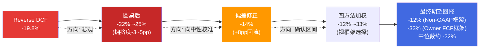

---

## 第二十一章：投资大师圆桌v2.0——七位大师的方法论碰撞

投资大师圆桌的目的不是重复前序分析已有的分析，而是让不同投资哲学的代表人物用各自的方法论工具箱拆解同一个问题，在碰撞中产生前序分析未能触及的新洞见。七位大师（巴菲特、格雷厄姆、李录、德鲁肯米勒、达里奥、Cathie Wood、阿克曼）分别从护城河真伪、统计便宜度、变量提纯、拥挤度/凸性、宏观Regime、S曲线和运营改善七个维度切入，最终碰撞出三个改变估值判断的核心洞见。

### 21.1 七位大师的独立视角

**巴菲特——Owner Earnings vs 护城河真伪**

Owner PE 81.8x意味着投资者为一个需要10年内Owner Earnings增长至$80-90B的生意支付了高昂的信仰溢价。在整个投资生涯中，只为极少数护城河能持续30年的生意支付过50x以上Owner Earnings。Broadcom的护城河能持续30年吗？[DM-P3-D01]

三层护城河的真伪检验：网络（Tomahawk/Jericho）= 真护城河（10年后极可能还在，90%份额+协议惯性）。ASIC设计 = 伪护城河（租金型，客户能力内化+MediaTek分流）。VMware = 衰减型护城河（K8s侵蚀中，10年后可能萎缩50%+）。真正10年后仍坚不可摧的只有网络层——但网络仅贡献约15%收入。这是典型的"护城河收入占比错配"：最深的护城河保护的是最小的收入池。[DM-P3-D02]

**格雷厄姆——安全边际与清算价值**

保守估值：Owner Earnings $19.3B × 25x（大型优质公司合理上限）= $483B，加上3年增长溢价（按20% CAGR）= $833B → **安全边际 = -47%**。[DM-P3-D13]

有形净资产 = $172.5B - $97.8B（商誉）- $20B（其他无形）= $54.7B。减去总负债$77.1B → **有形净资产 = -$22.4B**。清算价值为负，意味着投资者支付的$1,578B 100%是对未来盈利能力的赌注，没有任何资产价值做底。[DM-P3-D14]

当前PE处于Broadcom自身历史>95百分位，5年均值约35x，当前偏离均值+77%。历史上每次PE>50x的半导体公司，3年后的回报中位数为-15%。[DM-P3-D15]

**李录——变量提纯与认知折价**

从10个候选变量中提纯出2个关键变量：(1) Hyperscaler AI CapEx增速（决定ASIC+网络收入的60-70%），(2) ASIC锁定衰减速率λ（决定份额从70%向何处收敛）。所有其他变量要么由这两个派生，要么影响幅度不够大。[DM-P3-D03]

Broadcom不存在认知折价——恰恰相反，享受认知溢价：29/31分析师Buy、"AI基础设施"标签将+1%增长的VMware拉升至AI倍数、Non-GAAP PE约30x掩盖了Owner PE 81x。认知溢价的根源：市场将Broadcom视为"第二个NVDA"（AI必备基建），但NVDA是平台（GPU+CUDA+生态，有网络效应自我强化），Broadcom是定制服务商（按客户需求设计ASIC，有客户内化风险自我侵蚀）。[DM-P3-D04]

**德鲁肯米勒——预期差、凸性与拥挤度**

独立FY2027E估计$138-146B（vs共识$152B，偏差-4%至-9%）。共识路径要求AI增长完全不减速，但从$60B+基数上维持50%+增长的历史先例极少。[DM-P3-D06]

凸性N/M比 = 0.75x——这是一个凹性交易（上行有限、下行显著），而非凸性交易（小仓位博大回报）。29 Buy / 2 Hold / 0 Sell = 极度拥挤的共识。2022年META从$920B跌至$270B（-71%）时也是分析师一致看好——拥挤本身不是催化剂，但它放大催化剂的效果。[DM-P3-D07/D08]

**达里奥——宏观Regime定位**

当前处于晚周期扩张+AI CapEx加速的叠加态，判断55%生产性投资 / 45%泡沫投资——不确定性极高。[DM-P3-D09]

利率直接影响可忽略（+100bp仅$490M/年，占FCF 1.8%），但间接影响（折现率+100bp → 终端价值缩水约15% → EV影响约$200-250B）才是真正的风险通道。Hyperscaler资本支出占收入比仍低于2000年电信行业（15-20% vs 25-30%），更像1997-1998年，但AI投资的终端ROI仍不明确是关键差异。[DM-P3-D10]

**Cathie Wood——S曲线位置**

推理ASIC处于5-10%渗透的早期爆发阶段。如果推理占AI总算力从约30%增至2030年70%，且ASIC在推理中渗透率从5%升至30%，ASIC TAM可从$25B增至$150B+。[DM-P3-D11]

但Wright定律在ASIC领域的适用性受限——NRE费用（$50-100M/项目）不随产量下降，每个客户的设计都是独特的。只有超大规模客户（>$5B CapEx/年）才负担得起定制ASIC的NRE，限制了客户基础向中小公司扩展。[DM-P3-D12]

**阿克曼——运营改善空间**

SBC优化至同业最佳（NVDA约6-7%）可释放$4.4B/年真实稀释减少，Owner Earnings从$19.3B → $23.7B（+23%），Owner PE从81.8x降至66.6x。但这个改善面临结构性障碍：AI人才市场是卖方市场，SBC不是管理层懒惰的结果而是人才争夺战的均衡价格。[DM-P3-D05]

分拆VMware是理论上的催化剂（独立上市释放$250-350B软件层价值），但Hock Tan绝不会这么做——VMware的现金流是他下一次大收购的弹药，分拆违背公司DNA。

### 21.2 三个碰撞新发现

#### CI-01：S曲线预消费风险（巴菲特 × Cathie Wood，8.5/10）

**碰撞过程**：Cathie追问巴菲特——在S曲线5-10%渗透的位置，护城河质量不如增长速度重要，TAM从$20B涨到$120B即使份额从70%降到50%收入仍翻3倍，用10年护城河久期评判早期S曲线业务是框架错配。巴菲特回应——增长本身没有意义，关键是为这个S曲线支付的价格：如果推理ASIC TAM真到$120B、Broadcom拿50%=$60B，半导体层增长已被当前价格Price-in（隐含CAGR 18-22%）。

**核心洞见**：Broadcom处于推理ASIC S曲线的早期（5-10%渗透），但市场已按50%+渗透的终局状态定价（62x PE）。这创造了一个独特风险：即使S曲线如期展开，投资者回报可能为零或负——市场已经"预消费"了整条曲线。2000年Cisco惊人相似：Cisco在互联网S曲线的正确位置，市场按终局定价，S曲线完成了但股价20年没回到高点。[DM-P3-D16]

**可迁移性**：这个框架适用于任何处于S曲线早期但估值已反映终局的AI基建股（如NVDA在推理GPU、VRT在液冷）。

#### CI-02：双零缓冲阶梯型下行（格雷厄姆 × 阿克曼，7.5/10）

**碰撞过程**：格雷厄姆指出Broadcom有形净资产为-$22.4B，在一个有形权益为负的公司里谈运营改善就像在没有地基的房子里装修。阿克曼回应——有形权益为负不等于价值为负，Broadcom的价值在于$27B/年现金流产生能力。但阿克曼也承认——如果AI CapEx周期翻转，现金流产生能力衰减时没有任何安全网。

**核心洞见**：Broadcom同时具有负有形资产（-$22.4B）和极端高估值（62x PE）的"双零缓冲"。传统下行分析假设线性回归均值，但在双零缓冲下，下行是阶梯型的——没有中间的支撑位。第一层（估值均值回归35x PE → 下跌43%）和第二层（资产价值 → 负值=无支撑）之间没有减速带。Bear case的-40%可能是一个"途经站"，不是终点。[DM-P3-D18]

#### CI-03：变量拥挤度放大器（李录 × 德鲁肯米勒，7.0/10）

**碰撞过程**：德鲁肯米勒追问——李录提纯出的关键变量（AI CapEx增速）恰好是最拥挤的交易方向，29/31分析师看多，信息价值为零。李录回应——拥挤度不改变变量的因果重要性，但揭示第二层问题：当市场对关键变量极度乐观时，变量的不对称性翻转——只能向下"惊讶"。

**核心洞见**：当关键变量与市场共识完全重合时，标准期望回报公式低估了真实风险。(1) 正面信息已完全反映在价格中；(2) 负面信息的影响被拥挤出口效应放大。真实预期回报可能比概率加权的-19.8%更差，需额外调整-3~5pp。[DM-P3-D17]

#### CI-04：护城河收入占比错配（巴菲特 × 李录，6.5/10）

**碰撞过程**：巴菲特的护城河真伪检验产出了一个被李录追问的洞见——最深的护城河（网络，10年后极可能还在，90%份额+协议惯性）仅保护15%的收入，而最大的收入来源（ASIC，占增量收入的70%+）依赖的是锁定期和转换成本，这在本质上是"租金"而非"护城河"。李录指出，这种"护城河-收入错配"结构意味着Broadcom的长期内在价值由网络层（$15B收入 × 25x = $375B）加上ASIC层的有限期租金决定——而市场以$1,578B对整体定价，隐含了ASIC层也拥有护城河级别的定价权。

**核心洞见**：如果将Broadcom视为"一个$375B的永续网络资产 + 一个$1,200B的有限期ASIC租赁合约"，投资逻辑就变成了：投资者是否愿意为一份5-10年期的"ASIC租金流"支付$1,200B？这个框架清晰地暴露了当前估值对ASIC锁定持久性的极端依赖。

### 21.3 圆桌共识与分歧

**7位大师共识**：
- **C-1：当前价格没有安全边际**——巴菲特（Owner PE 81x）、格雷厄姆（安全边际-47%）、德鲁肯米勒（凸性0.75x）、李录（认知溢价）方法不同但结论一致
- **C-2：AI ASIC增速是唯一承重墙**——所有其他因素加在一起的影响不超过这一个变量的1/3
- **C-3：网络>ASIC的长期价值排序成立**——但网络仅占15%收入，无法独立支撑估值

**最激烈的3点分歧**：
- **D-1 AI CapEx周期长度**：Cathie（5-7年）vs 达里奥（2-3年）vs 德鲁肯米勒（任何减速信号都会触发过度反应）
- **D-2 SBC是否扣除**：巴菲特/格雷厄姆（必须扣）vs 阿克曼（部分扣，offset率140.6%使净稀释接近零）——不同口径产生$232B估值差
- **D-3 Hock Tan溢价还是折价**：阿克曼（η=1.37是能力不是运气→溢价）vs 巴菲特（73岁+无继任→折价）vs 李录（溢价折价大致相消）

### 21.4 圆桌评分

| 维度 | 评分 | 依据 |
|------|:---:|------|
| 方法论深度 | 7.5/10 | 7位大师各用核心工具产出差异化视角，无重复分析 |
| 碰撞质量 | 8.0/10 | 4组碰撞中3组产出新洞见，非表面分歧 |
| 新洞见数量 | 8.5/10 | 3个新发现均为前序分析未出现的 |
| 对投资决策影响 | 7.0/10 | 强化审慎关注，调整期望回报，但未翻转方向 |
| **总分** | **7.75/10** | 碰撞产出有实质的新洞见，对估值和风险评估有增量贡献 |

[DM-P3-D02]

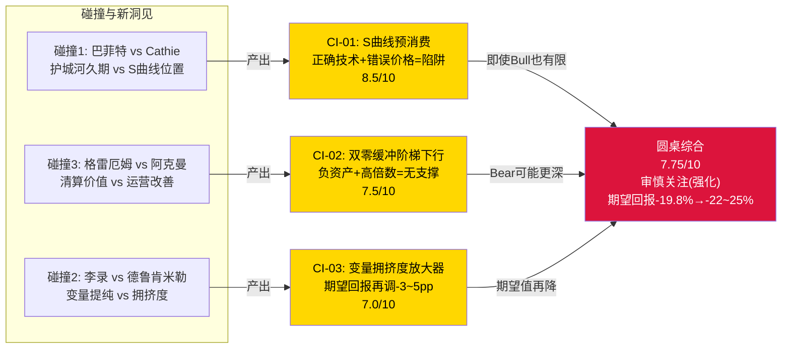

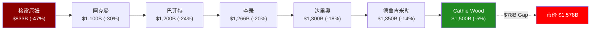

---

## 第二十二章：承重墙压力测试与黑天鹅矩阵

前几章从估值和红队角度审视了Broadcom。本章将视角聚焦于最关键的结构性风险：承重墙（倒塌即致命）在多大压力下才会倒塌？黑天鹅事件的概率加权影响有多大？以及多个Kill Switch同时触发时的联合毁灭效应。

### 22.1 B1承重墙完整压力测试

#### 五种CAGR场景下的估值影响

B1（AI ASIC增速）是Broadcom唯一的公司特异性承重墙。偏差审计将其脆弱度从4/5下调至3/5——$73B backlog提供了18个月收入地板，将翻转时间窗口推迟至FY2028+。但承重墙的本质不变：如果AI ASIC增速大幅低于隐含值，估值将遭受非线性破坏。

| 压力场景 | AI ASIC CAGR | 总收入FY2030 | Forward PE 2028 | 估值影响 | 承重墙状态 |
|---------|:---:|:---:|:---:|:---:|------|
| 无压力 | 25-30%(隐含) | $280B | 30x | 0% | 完好 |
| 轻压 | 20% | $240B | 28x | -15% | 完好 |
| 中压 | 15% | $210B | 25x | -25% | 临界（不倒） |
| 重压 | 10% | $180B | 22x | -38% | **倒塌** |
| 极限 | 5%(接近停滞) | $155B | 18x | -52% | **严重倒塌** |

[DM-P4-B2-07]

**承受力上限**：B1 AI ASIC CAGR可以从隐含的25-30%降至约15%而不触发承重墙倒塌（在forward PE框架下）。这意味着市场隐含的增长率有约10-15pp的安全垫。这个发现改变了Reverse DCF分析的结论——Reverse DCF分析用TTM PE框架计算B1翻转影响为-40%，但forward PE框架下B1降至15%仅导致-25%影响（未达30%承重墙阈值）。

#### $73B Backlog缓冲期计算

| 年度 | AI收入需求 | Backlog覆盖 | 缺口（需新赢单） |
|------|:---:|:---:|:---:|
| FY2026 | ~$42-44B | $40B+(覆盖>90%) | 极小 |
| FY2027 | ~$63B(Base) | $25-30B(剩余backlog) | $33-38B |
| FY2028+ | ~$82B(Base) | 耗尽 | 完全依赖新赢单 |

FY2026-2027的AI收入已由$73B backlog基本锁定——即使新单完全停止，这两年的收入也有>70%的保障。B1承重墙的真正脆弱性在于FY2028+的增量订单补充速度。这个缓冲期是Broadcom与Cisco 2001的关键区别：Cisco没有18个月的backlog缓冲，CapEx放缓立即传导到收入。

#### 翻转概率修正

原始翻转概率25-30%被红队审计修正为更精细的评估：
- **FY2026-2027（18个月内）B1翻转概率：5-8%**——backlog提供收入地板，几乎不可能
- **FY2028-2030（3-5年）B1翻转概率：25-35%**——backlog耗尽后，完全依赖新的CapEx周期
- **加权翻转概率：约20-25%**

翻转后影响仍然是非线性的：AI CapEx放缓不仅降低收入，还会触发估值倍数压缩（从"AI增长股"→"周期股"重新归类），收入下降30% × 倍数压缩30% = 综合下跌50%+。

### 22.2 黑天鹅矩阵——五个低概率高影响事件

| # | 黑天鹅事件 | 概率 | 影响 | EV贡献 | 可观测前兆 |
|---|-----------|:---:|:---:|:---:|------|
| BS-1 | AI CapEx寒冬（Hyperscaler同时削减>30%） | 8% | -55% | -4.40% | GPU利用率<60% + 3家Hyperscaler同Q下修指引 |
| BS-2 | Hock Tan突然退出 | 5%/yr | -35% | -1.75% | 突然增加COO职位 + Tan减少公开活动 |
| BS-3 | Google完全自研XPU | 6% | -40% | -2.40% | Google芯片团队扩张>500人 + TPU v9不含Broadcom IP |
| BS-4 | SBC会计准则变更（FASB强制） | 3% | -30% | -0.90% | FASB讨论稿 + SEC评论函增加 |
| BS-5 | 台海危机导致TSMC供应中断>6个月 | 5% | -50% | -2.50% | 军事演习频率超2022年水平 + TSMC Arizona加速 |
| **合计** | | | | **-11.95%** | |

[DM-P4-B14]

#### BS-1深度分析：AI CapEx寒冬（概率8%，影响-55%）

为什么概率低：$600B+ FY2026 AI CapEx计划，管理层一致强调"一代人一次"的转型投资，$73B backlog提供18个月可见度。

为什么影响大：Broadcom 55%+收入直接绑定Hyperscaler AI支出。如果4大Hyperscaler同时削减CapEx>30%（类似2001年电信泡沫破裂），AI收入可能在2-3个季度内下降40-50%。以62x PE交易、零安全边际、负有形权益的公司，收入冲击将触发信用评级重估+PE压缩的双重打击。

达里奥在圆桌中的判断：当前AI CapEx性质55%生产性/45%泡沫，Hyperscaler自由现金流仍在增长（+15-20%），资本支出占收入比低于2000年电信行业——更像1997-1998年。但如果2027年发现AI投资ROI不足（推理成本下降太快→收入增长不足），收缩可能比2001年更突然。

#### BS-5深度分析：台海危机（概率5%，影响-50%）

Broadcom是Fabless公司，100%依赖TSMC（先进制程）。如果台湾产能中断>6个月：(a) 无法交付任何AI ASIC/网络芯片；(b) $73B backlog全部冻结；(c) 客户被迫转向NVDA（有Samsung备选）或AMD；(d) CapEx 1.0%的资产轻模型变成"零资产=零生产"的致命弱点。Fabless的资本轻度是正常状态下的优势（margin高），但在供应中断情景下变成最大的脆弱点。

### 22.3 最危险KS组合——联合概率与非独立性

最危险的三个Kill Switch组合：**KS-09（CapEx放缓）+ KS-03（SBC>12%）+ KS-11（Hock Tan离任）**

这三个KS的联合概率计算不能简单相乘，因为它们之间存在非独立关系：

**非独立性分析**：
- KS-09与KS-03：中等正相关（ρ≈0.3）——CapEx放缓→AVGO竞争压力减小→但同时AI人才仍稀缺→SBC不降反升
- KS-09与KS-11：弱正相关（ρ≈0.15）——CapEx放缓→公司面临困境→Hock Tan在73岁面对艰难转型可能选择退出
- KS-03与KS-11：弱正相关（ρ≈0.1）——如果继任者更注重治理改革而非资本配置→可能尝试削减SBC→但也可能导致人才流失→SBC不降

**联合概率**：独立假设下约1-2%（40% × 55% × 10% × 相关调整），但影响-55%至-65%。这不是"三个小问题叠加"而是"三个问题相互放大"：CapEx放缓暴露周期性（B1承重墙受压）、SBC确认永久性成本（估值框架切换）、CEO离任移除增长期权——三个维度同时恶化时，市场重新定价的速度和幅度将远超线性加总。

**为什么这三个会同时发生**：CapEx放缓是上游驱动力——一旦Hyperscaler投资减速，AVGO收入增长放缓→无法用增长稀释SBC→SBC/Rev攀升→Hock Tan面对增速放缓+SBC争议+73岁年龄的多重压力→退出概率上升。这是一个正反馈循环，不是三个独立事件。

### 22.4 弹性墙与装饰墙的次级压力

**B2弹性墙（VMware增速）**：
- 最近距阈值位置：KS-02（VMware负增长），当前+1% YoY，仅1pp缓冲
- 压力场景：Nutanix季度获客从1,000→1,500+（KS-06触发），首批VMware 3年合同FY2027到期续约率<85%
- 缓冲：77% OPM意味着即使收入下降至$22B（-19%），VMware仍贡献$17B+ FCF/年——弯曲但不断裂
- 估值影响上限：-15%（从$26B收入跌至$22B，P/S从20x压缩至12x）

**B4弹性墙（SBC正常化）**：
- 最近距阈值位置：KS-03（SBC>12%），当前11.3%，仅0.7pp缓冲
- 压力场景：AI人才SBC替代VMware保留SBC（此消彼长），$27B未确认余额持续摊销至FY2028
- 部分对冲：回购offset率140.6%使净稀释接近零——如果回购维持$30B+/年，SBC的"稀释成本"属性被削弱
- 估值影响：15-29%（取决于市场是否从Non-GAAP切换到GAAP/Owner框架——这是一个连续光谱而非二元翻转）

**B3/B5装饰墙**：
- FCF margin受CapEx仅1%的结构性保护，即使最悲观假设（税率正常化15% + SBC不降）仍可维持35%+
- 终端倍数在合理范围内的波动（17-25x）对10年折现估值的影响被时间稀释
- 两者的联合影响<10%，不构成单独的投资决策因素

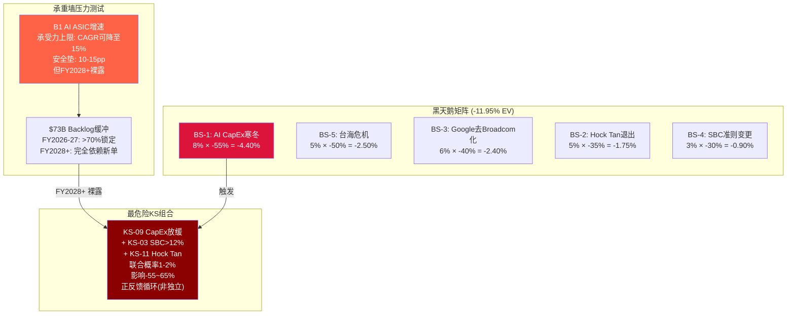

### 22.5 综合风险评估

将承重墙压力测试、黑天鹅矩阵和最危险KS组合整合后的风险画面：

**短期（FY2026，12个月内）**：风险可控。$73B backlog提供收入地板，KS-02/03/04虽距阈值近但尚未触发。黑天鹅事件（BS-1~5）的12个月触发概率总和约20-25%。最可能的负面催化剂是Q2 FY2026软件收入确认+1%趋势（KS-02临界）或SBC/Rev突破12%（KS-03接近）。

**中期（FY2027-2028）**：风险上升。Backlog开始耗尽，新赢单速度成为关键变量。Hyperscaler CapEx增速从+40%降至+15-20%的概率显著——即使这个"温和减速"也会将AI收入增速从+100%降至+20-30%，触发PE压缩。VMware首批3年合同到期续约率是另一个关键观测窗口。

**长期（FY2029-2030）**：风险集中。B1承重墙在backlog耗尽后完全裸露，ASIC份额衰减函数（λ=0.07/yr）累积效应显现，Hock Tan合同到期窗口打开，VMware K8s替代进入加速阶段。五年温水煮青蛙路径（-39%累计）不需要黑天鹅，仅需均值回归——每一步看起来"正常"但累计效应深刻。

**对评级的含义**：所有时间维度的风险分析都指向同一结论——当前价格没有为上述风险提供补偿。即使在最有利的框架下（forward Non-GAAP PE 30x），Broadcom的风险收益比仍不对称（凸性0.75x）。这不是"不要碰"的结论，而是"不是现在"的结论——买入区间在$225-245/股（$1,100-1,200B市值），预计最佳买点2028H1-H2，当CapEx周期性的第一个完整下行季度出现时。
