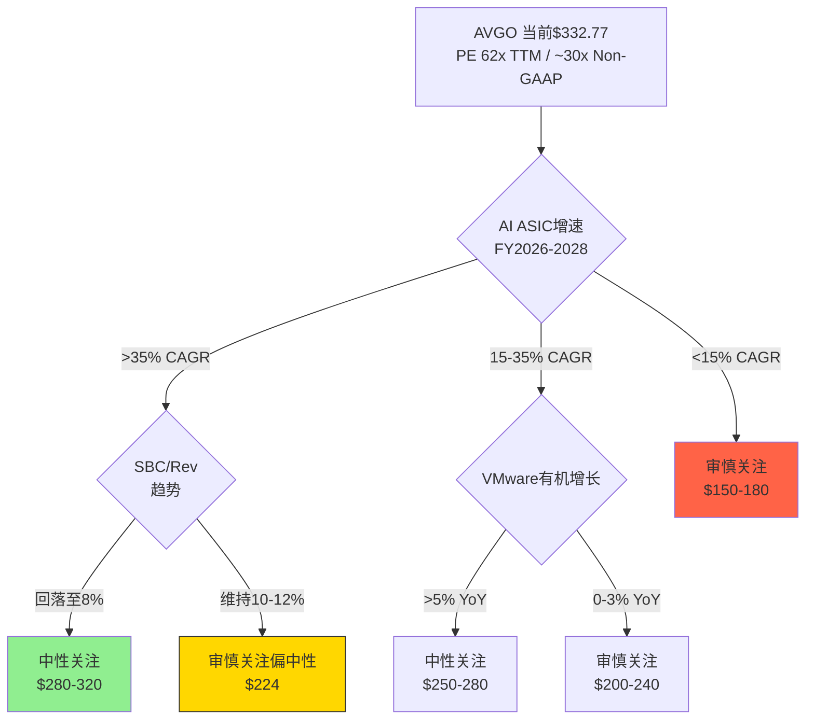
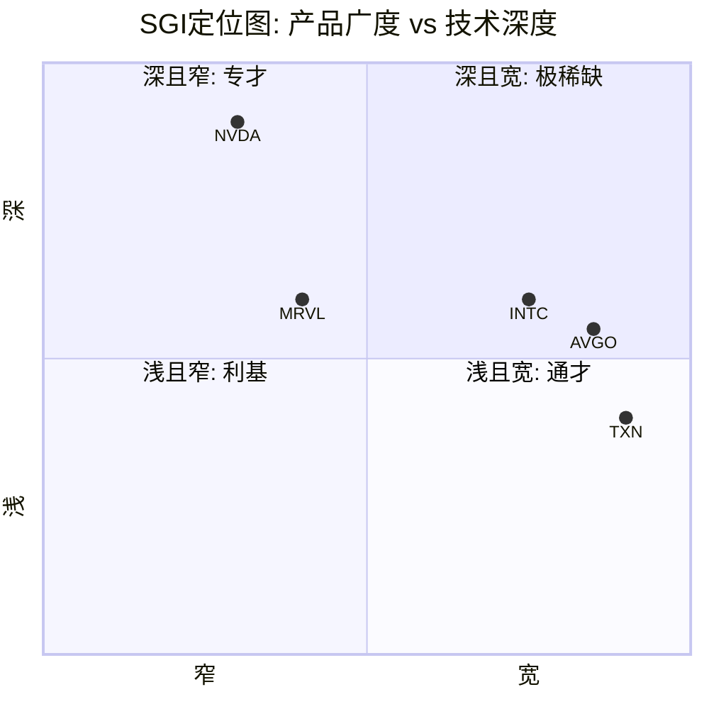
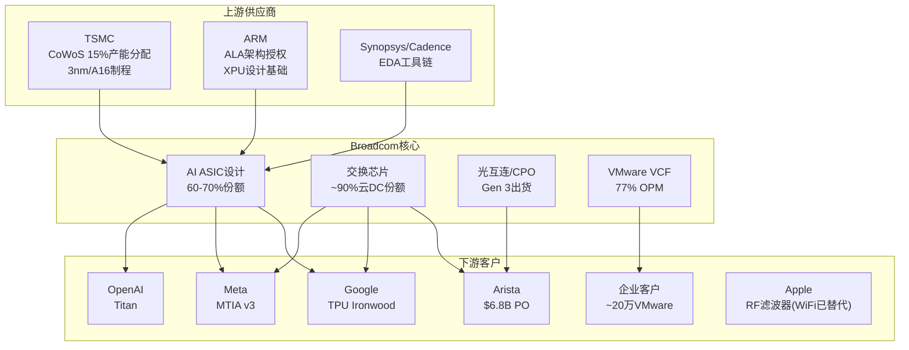
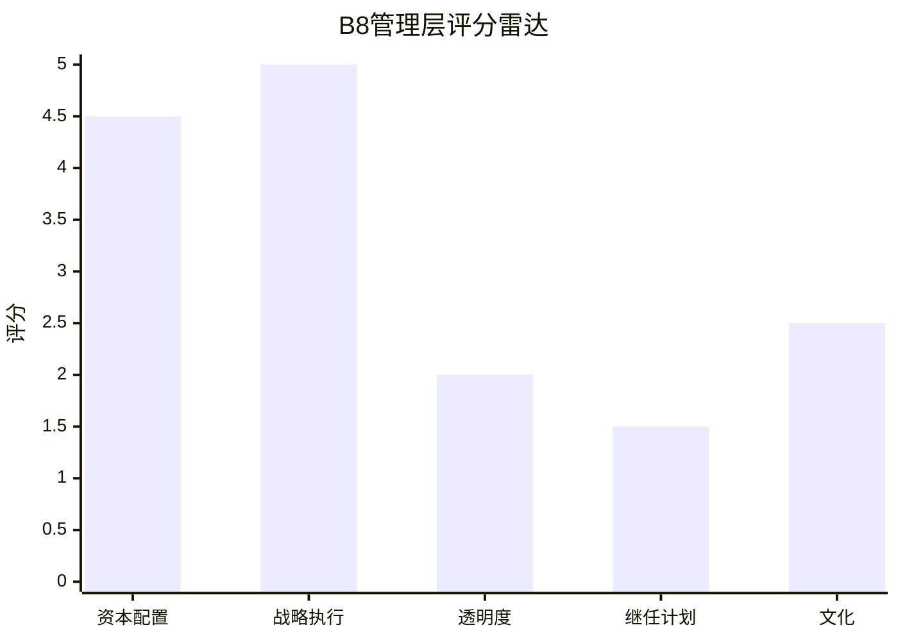
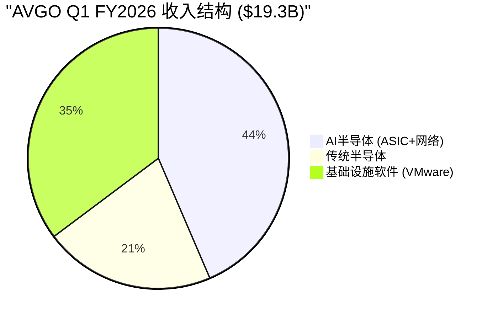
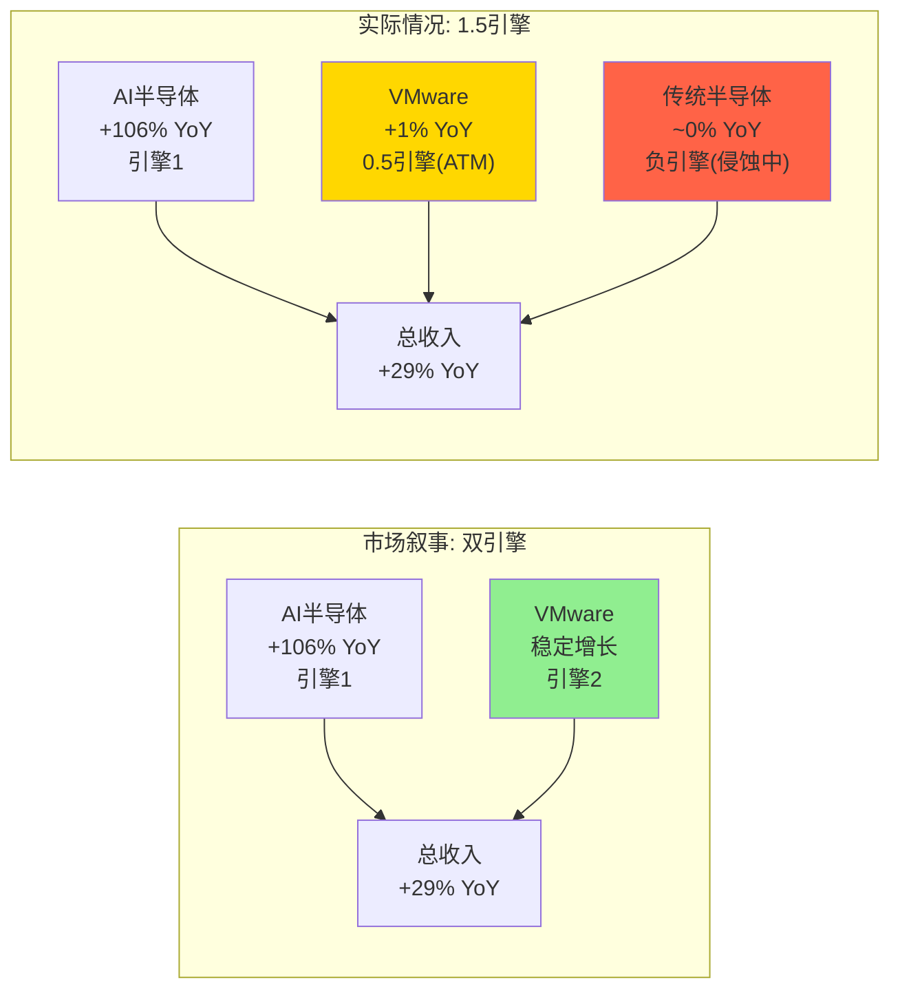
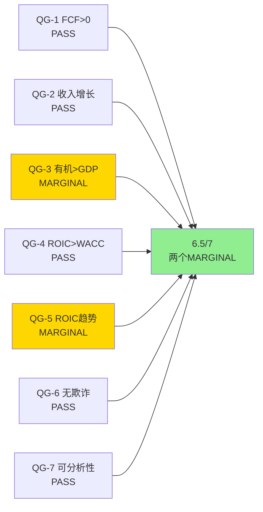
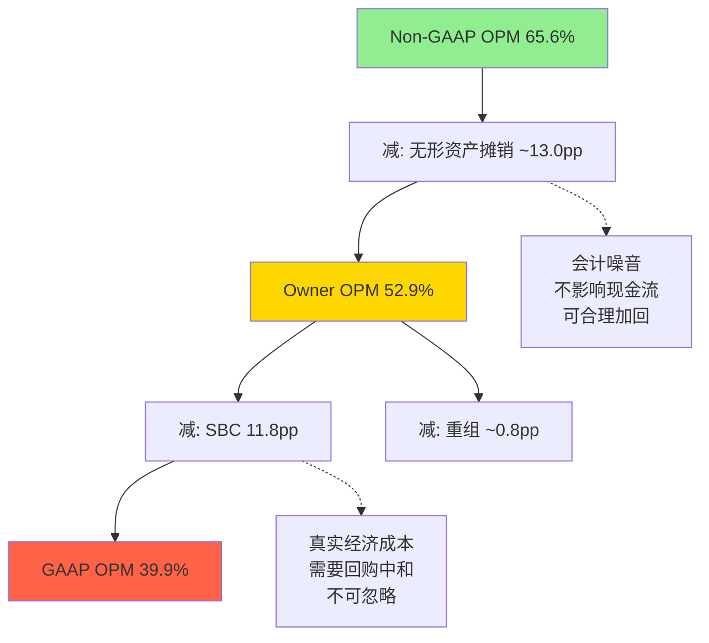
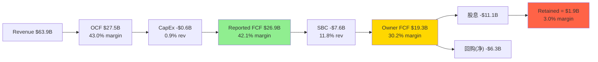
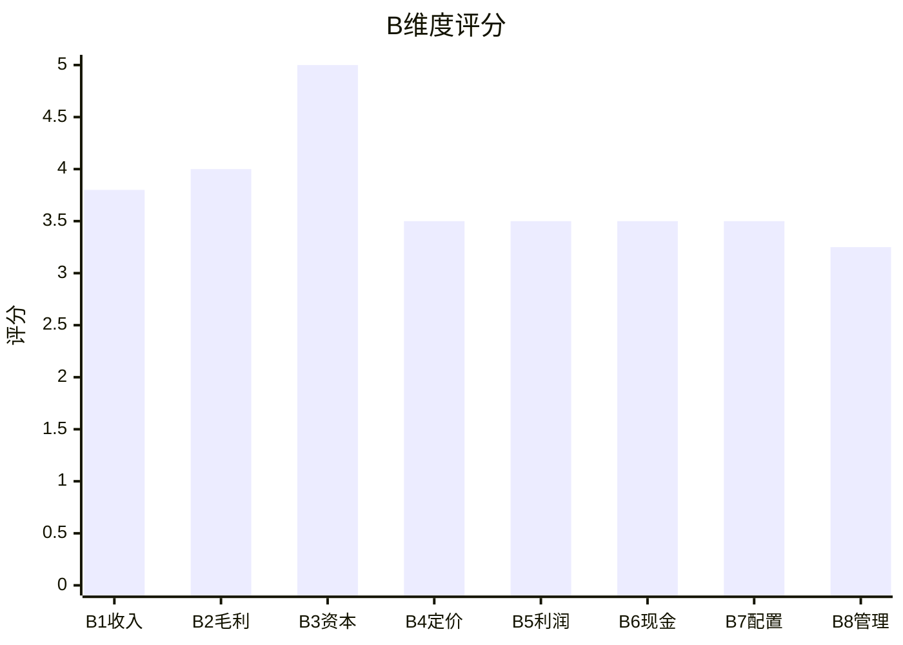

# Broadcom (AVGO) 深度研究报告

> **评级**: 审慎关注(偏中性) | **期望回报**: -12% | **估值中心**: $224 (vs 当前$332.77)
> **A-Score**: 7.1/10 | **CQ综合质量**: 56.4% | **PW可能性宽度**: 5.5 (混合模式)
> **数据截止**: Q1 FY2026 (2026-02-01) | **报告日期**: 2026-03-08

---

# Part I: 投资论文与公司画像

---

## 第一章: 执行摘要

### 核心投资论文

Broadcom是一台精密运转的三层基础设施收费站——AI定制芯片设计(Layer 1)、VMware企业软件(Layer 2)、Hock Tan资产优化平台(Layer 3)——三层各自拥有不同来源的护城河，也各自面临不同衰减路径的风险。市场当前以62x TTM PE(Non-GAAP ~30x)为Broadcom定价，隐含的核心赌注是: AI ASIC收入将以18-22% CAGR持续增长十年，SBC/Revenue将从11.8%回归至6-8%，VMware将贡献5-8%有机增长。

本报告的核心发现是，这三个赌注中有两个半可能是错的。

**第一，AI ASIC是唯一真正的增长引擎，但市场按"双引擎"定价。** Broadcom剥除VMware并购效应后的有机增长率仅为~6.4% CAGR(FY2022-2024)[DM-P1-A04]，远低于+106% YoY的AI半导体叙事所暗示的速度。VMware软件Q1 FY2026同比增长仅+1%[DM-P2-C1-04]，提价红利已近耗尽。传统半导体(WiFi/宽带/存储)近乎零增长且面临Apple WiFi自研替代的$2.7B收入流失风险[DM-P1-A12]。真实的增长引擎覆盖率仅43.5%——这是"1.5引擎"公司，而非市场叙事中的"双引擎"。

**第二，SBC是一道穿透全报告的暗线。** 11.8%的SBC/Revenue使报告FCF($26.9B, 42.1% margin)与Owner FCF($19.3B, 30.2% margin)之间产生了11.9个百分点的裂缝[DM-P2-C1-13]。Q1 FY2026回购$7.8B仅抵消稀释而非创造净回购价值，$27B未确认SBC余额意味着这一结构性成本至少持续到FY2027[DM-P1-A08]。当我们用Owner Earnings口径重新计算估值倍数时，PE从市场常用的~30x(Non-GAAP)跃升至80.5x[DM-P2-C1-17]——2.7倍的差距不是会计技术争论，而是投资者必须正面回答的世界观问题: 你相信SBC是零成本吗?

**第三，Hock Tan是不可复制的核心资产，也是最大的单点故障。** 73岁CEO，合同延至2030年，6次收购整合效率η均值1.37(标准差仅0.09)[DM-P2-C1-19]，S&P 100中最不透明的继任计划之一。概率加权继任折价约$110B(~7%)可能尚未被市场price-in。在一个由单人驱动三层价值创造的公司中，key-man风险不是脚注而是定价核心变量。

综上，本报告给予**审慎关注(偏中性)**评级。估值中心$224基于Owner Earnings口径的DCF和情景加权，对应当前股价-33%的下行空间。但需要强调的是，"偏中性"后缀反映了一个关键不确定性: 如果AI ASIC增速持续超预期(FY2026E共识$101.9B已隐含+60% YoY)，且SBC随VMware整合完成而自然回落，则当前估值可能接近合理。买入区间$225-245提供15-20%安全边际。条件评级矩阵如下:



### 关键指标速览

| 指标 | 值 | 口径说明 |
|------|-----|---------|
| 股价 | $332.77 | 2026-03-07 |
| 市值 | $1,578B | |
| PE (TTM GAAP) | 62.0x | 含-1.7%异常税率增厚 |
| PE (正常化14%税率) | 81.4x | GAAP+税率修正 |
| PE (Non-GAAP) | ~30x | 市场常用, 去除SBC+摊销 |
| Owner PE | 80.5x | 本报告核心指标 |
| FCF Yield (报告) | 1.92% | $26.9B/$1,402B EV |
| FCF Yield (SBC调整) | 1.38% | $19.3B/$1,402B EV |
| A-Score | 7.1/10 | B维度29.5/40 + C维度18.0/30 |
| 估值中心 | $224 | Owner DCF+情景加权 |
| 买入区间 | $225-245 | 15-20%安全边际 |
| ND/EBITDA | 1.41x | FY2025, 从2.44x改善 |

### 冠军洞见预告

本报告产出三个可迁移至其他公司分析的原创方法论:

1. **CI-01 "1.5引擎"解剖**: 市场按"双引擎增长"定价的公司，实际有机增长引擎覆盖率不足50%。推导链: 总增长+29% → 并购效应剥除 → VMware提价一次性效应剥除 → AI ASIC是唯一真引擎(43.5%收入贡献100%有机增长)。可迁移至任何通过并购+提价制造增长叙事的公司(Danaher, Constellation Software, Roper Technologies)。
2. **CI-02 三层OPM瀑布——22pp真实成本穿透**: GAAP 39.9% / Owner 52.9% / Non-GAAP 65.6%三层视图。推导链: Non-GAAP → 减摊销(会计噪音, 13pp) → Owner OPM → 减SBC(真实经济成本, 12pp) → GAAP OPM。揭示SBC+摊销如何制造2.7倍PE幻觉。可迁移至所有高SBC科技公司(Snowflake, Palantir, ServiceNow)。
3. **CI-03 收购整合效率函数η(t)**: η(t) = (OPM_post - OPM_pre) / (OPM_target - OPM_pre)。6次收购η均值1.37、标准差0.09——量化CEO收购整合能力的可复制性和边界条件。可迁移至任何serial acquirer评估(CSU, DHR, ROP, TransDigm)。

### 报告结构导读

本报告分六部分共约25章:

- **Part I (第一至四章)**: 投资论文、公司身份解剖、管理层评估、收入架构——回答"Broadcom是什么，谁在驾驶它"
- **Part II (第五至八章)**: A品质门控、三表深度、B维度商业模型、资本配置——回答"Broadcom的商业品质如何，钱从哪里来又去了哪里"
- **Part III (第九至十四章)**: 护城河、竞争格局、定价权、客户锁定——回答"Broadcom的护城河能持续多久，什么力量在侵蚀它"
- **Part IV (第十五至十八章)**: Reverse DCF信念反演、估值情景、DCF、目标价——回答"市场在赌什么，赌对了吗"
- **Part V (第十九至二十二章)**: 红队挑战、风险拓扑、投资委员会圆桌——回答"我可能哪里错了，有什么被忽略"
- **Part VI + 附录**: 关键指标监测、DM锚点注册表、Mermaid图索引——数据基础设施

本报告的阅读建议: 如果时间有限，优先阅读第一章(论文)、第二章(身份)、第六章(三层OPM)和第七章(B维度)——这四章构成了整个分析的承重结构。

---

## 第二章: 公司身份——三层嵌套基础设施收费站

### 2.1 为什么市场对Broadcom的标签都是错的

市场对Broadcom的认知经历了三次标签迭代: "多元化半导体公司"(2015前)、"连续收购整合者"(2016-2023)、"AI芯片新贵"(2024至今)。三个标签都只捕捉到了Broadcom某个侧面或某个时期的特征，而非其本质。

第一个标签过于泛化——Broadcom不是"多元化"的半导体公司(如TXN覆盖十万种模拟芯片SKU在一千个应用场景中均匀分布)，而是在三个不相关的高利润垂直领域各自建立了接近垄断的地位。TXN的"多元化"意味着没有任何单一产品超过收入的1%——是真正的长尾分布; Broadcom的"多元化"意味着AI ASIC一个客户(Google)可能贡献超过15%的总收入——是几个巨型集中点的叠加。两种"多元化"的风险特征截然不同。

第二个标签关注了手段而非目的——收购是Hock Tan的工具，不是Broadcom的身份。将Broadcom定义为"收购者"如同将Berkshire Hathaway定义为"保险公司"——形式上正确但本质上遗漏了最重要的信息。Broadcom收购的目的不是"做大"(如Intel收购Altera/Mobileye追求技术互补)，而是"提效"(将被收购资产的OPM推至物理极限)。

第三个标签过于窄化——AI半导体收入占比仅43.5%(Q1 FY2026)，而35%的收入来自一个与AI几乎无关的企业软件业务(VMware)，21%来自与AI基本无关的传统半导体(WiFi/宽带/存储)。将Broadcom称为"AI芯片公司"忽略了56.5%的收入基座——这些收入不受AI叙事驱动，增长率接近零，但利润率极高(VMware 77% OPM)。

**Broadcom的真实身份是一台三层嵌套的基础设施收费站。** 每一层的护城河来源不同，衰减速率不同，估值锚点也应不同。理解这个三层结构是评估Broadcom估值合理性的前提——因为市场用单一PE倍数为一个三层混合体定价，本身就是一种信息损失。接下来我们逐层解剖。

### 2.2 Layer 1: AI基础设施的"定制军火商"

Broadcom在AI半导体领域的核心能力不是"设计芯片"——Marvell也能设计芯片，MediaTek正在Google I/O模块上证明自己——而是**同时掌握XPU设计、交换芯片、光互连、SerDes的全栈co-design能力**。这种能力的稀缺性不在于任何单一环节，而在于四个环节的协同优化——当一个hyperscaler需要为其定制AI加速器设计最优的数据通路时，Broadcom是唯一能从芯片内部架构(XPU)到芯片间通信(SerDes)到机架间网络(Tomahawk)到跨数据中心互联(CPO)提供端到端协同设计的公司。

**ASIC设计服务: 定制军火的核心**

Broadcom占据定制AI ASIC设计市场60-70%份额[DM-P1-A01]，当前手持$73B backlog(提供18个月收入可见性)[DM-P1-A08]。ASIC设计的商业模式包含两个收入流: NRE(Non-Recurring Engineering，一次性设计费，单颗ASIC的NRE可达$50-100M+)和量产阶段的芯片销售(per-chip royalty，通常为芯片售价的5-15%)。NRE是前端收入，提供设计锁定——一旦客户支付了NRE并完成tape-out，该代芯片的设计就与Broadcom绑定; 量产royalty是持续收入，但依赖客户的CapEx决策和芯片采购量。

Broadcom的核心客户结构:

- **Google TPU**: 最大客户，合作超过10年。Google的TPU从v1(2015年)到Ironwood(2026年)持续由Broadcom主导核心XPU设计。Google计划2027年TPU v7e/v8e产量达500万颗[DM-P1-A09]。但关键的是，Google并非完全锁定——它已将TPU的I/O模块(非核心计算单元)分流给MediaTek，后者的成本低20-30%[DM-P1-A10]。Google的策略是保留核心XPU在Broadcom(因为XPU必须与Broadcom的Tomahawk交换芯片和SerDes接口协同优化)，同时在外围模块引入竞争以压低成本。这种"核心留守+外围分流"的模式暗示: Google正在系统性降低对Broadcom的依赖度，但短期(3-5年)内核心XPU仍不可替代。

- **Meta MTIA**: MTIA v3由Broadcom协设计，专门优化推荐系统的稀疏计算工作负载。Meta同时是Broadcom网络芯片的主要客户(MTIA v3需要与Broadcom的Jericho3-AI路由芯片配合实现集群内通信)。Meta正在考虑2027年部分部署Google TPU——这意味着即使是Broadcom的ASIC客户，也在探索用GPU/其他ASIC替代自研ASIC的可能性。

- **OpenAI Titan**: 新增确认的客户，Titan采用TSMC 3nm制程，计划H2 2026量产。OpenAI芯片团队已扩至约40人[DM-P1-A11]，从AMD/Google/Apple等公司挖角。Titan是OpenAI的首款自研推理芯片——短期依赖Broadcom的设计能力，但长期内化风险最高(OpenAI有资金、人才和动机自建芯片团队)。Titan 2已规划TSMC A16制程，暗示OpenAI已在计划下一代且可能减少对Broadcom的依赖。

- **ByteDance及其他**: 至少还有2家未披露的hyperscaler客户(高概率包括ByteDance和另一家未具名大厂)。管理层在Q1 earnings call中确认"5 customers"但拒绝透露任何单客户收入占比。

**ASIC设计的XPU架构逻辑值得深入理解。** 每个hyperscaler的AI工作负载特征不同——Google TPU优化矩阵乘法(MXU)用于大规模Transformer训练，Meta MTIA优化推荐系统稀疏计算(embedding lookup+sparse attention)，OpenAI Titan优化大规模Transformer推理(低延迟+高吞吐)。Broadcom的价值不在于"画电路图"(这是ASIC design house的基本功)，而在于三层翻译能力: (1)将客户的workload特征翻译成最优的硅片微架构; (2)确保微架构与Broadcom自己的SerDes接口实现最优带宽利用率; (3)确保芯片间通信与Broadcom的Tomahawk交换芯片和Jericho路由芯片的协议栈兼容。这种"翻译+整合"的能力链条越长，竞争对手的进入壁垒越高。Marvell能做第(1)步，但做不了第(2)(3)步——因为Marvell没有自己的交换芯片和路由芯片。

**交换芯片: 数据中心的"中枢神经"**

Broadcom的Tomahawk和Jericho系列交换芯片占据云数据中心约90%份额[DM-P1-A02]。这个份额不是"最好"带来的——而是"唯一大规模验证过"带来的。Tomahawk 6(102.4Tbps带宽)在性能上领先NVIDIA Spectrum-X约一年。Jericho3-AI专为AI集群的东西向(横向)通信优化，支持单集群10万+GPU/ASIC互联。

交换芯片的战略意义经常被市场低估，原因有二。首先，交换芯片的收入被合并在"AI revenue"中不单独披露——投资者看到的是$8.4B "AI收入"，但无法区分其中多少来自ASIC设计、多少来自网络芯片。其次，交换芯片的增长叙事不如ASIC那样"性感"——ASIC是"为Google设计AI大脑"，交换芯片是"连接一万个AI大脑的神经系统"。但实际上，AI集群的性能瓶颈正在从计算(GPU/ASIC)转向通信(网络)——当集群规模从千卡扩展到万卡乃至十万卡时，网络延迟和带宽成为决定训练效率的关键因素。Broadcom在这个日益重要的瓶颈点上拥有接近垄断的地位。

更重要的是，以太网正在取代InfiniBand成为AI集群的主流网络协议。NVIDIA的InfiniBand在AI训练侧拥有先发优势，但以太网的开放性、成本优势和生态系统广度使其在推理侧和大规模部署中更具吸引力。UEC 1.0(Ultra Ethernet Consortium)标准正在推进，Broadcom是核心参与者和主要受益者——因为以太网交换芯片是Broadcom的传统强项(90%份额)，而InfiniBand是NVIDIA的领地。AI网络从InfiniBand向以太网的迁移是Broadcom的结构性长期顺风。

Arista Networks与Broadcom的关系最能说明交换芯片的定价权: Arista对Broadcom下达了$6.8B的采购订单(从$4.8B增长)[DM-P1-A07]，而Arista CEO Jayshree Ullal公开称Broadcom的定价"horrendous"(令人震惊)——在一个$6.8B的供应关系中，下游买家公开批评上游定价却仍然增加采购量，这是定价权存在的最强实证。Broadcom捕获了这个双边关系中几乎全部的经济租金。

**光互连(CPO): 下一个战场**

Broadcom的第三代CPO产品TH6-Davisson已出货[DM-P1-A03]，2026年是CPO(Co-Packaged Optics，共封装光学)量产拐点年。CPO的核心逻辑是将光模块直接集成到交换芯片封装中，消除传统可插拔光模块(pluggable transceiver)的功耗瓶颈和板边连接延迟。在AI集群中，光互连的功耗占数据中心总功耗的8-12%——CPO可以将这个比例降至3-5%，同时将每端口带宽密度提升2-3倍。

Broadcom在CPO领域的差异化来自垂直整合: 它同时设计交换芯片(Tomahawk)、光学DSP和CPO模块，三者可以在封装级别(package-level)协同优化。具体来说，Tomahawk的SerDes输出信号可以直接驱动CPO模块的激光调制器，无需额外的电-光转换芯片——这种"直驱"设计减少了功耗和延迟。对比之下，NVIDIA需要与外部光模块供应商(如Coherent、Lumentum)合作，封装接口需要标准化适配层，无法实现同等级别的集成优化。这种垂直整合能力是Broadcom在Layer 1中最难被复制的差异化点——它要求同一家公司同时拥有高速电路设计、光学设计和先进封装三个领域的深度专业知识。

**SerDes/高速接口: 隐蔽的"血管"**

SerDes(Serializer/Deserializer)是AI集群内部数据传输的底层接口技术——芯片与芯片之间的每一个数据bit都需要经过SerDes的序列化/反序列化处理。Broadcom在高速SerDes(224G PAM4)领域拥有领先的IP组合。SerDes很少被单独讨论(管理层在earnings call中几乎从不提及)，但它是连接XPU、交换芯片和光互连的"血管"——没有高性能SerDes，再快的ASIC和再大的带宽都无法被充分利用。SerDes IP的战略价值在于它是ASIC设计锁定的"隐形锁"——当一个hyperscaler的ASIC使用了Broadcom的SerDes IP，该ASIC的PCB布板、信号完整性验证和测试流程都围绕Broadcom的SerDes特性设计，切换到另一家的SerDes意味着重做整个物理层设计。

**Layer 1的护城河来源与衰减路径**

护城河来源是**技术锁定 + 全栈整合**。单一ASIC设计可以被替代(MediaTek已在Google I/O模块上证明了这一点)，但没有第二家公司能同时提供XPU + 交换芯片 + 光学 + SerDes的co-design。这就是为什么Google分流I/O给MediaTek，但核心XPU仍留在Broadcom——因为XPU必须与网络芯片协同优化，而网络芯片只有Broadcom能做。

但护城河存在时间衰减函数。ASIC设计服务的锁定深度可以建模为 L(t) = L₀ · e^(-λt) + L_floor。随着Google/Meta/OpenAI内部芯片团队成熟(OpenAI团队已扩至~40人[DM-P1-A11]，Google的芯片团队超过500人)，单纯设计服务的黏性会下降(λ > 0)。λ的估算: 考虑到每代芯片设计周期约2-3年，且客户自研团队需要至少2代芯片的学习曲线，λ ≈ 0.05-0.10/年——意味着5-10年后，客户自研能力将显著侵蚀Broadcom的设计服务价值。然而，全栈co-design的L_floor很高——因为网络协议演进(以太网 → UEC 1.0 → CPO → 下一代光互连)要求芯片-网络-光学三者同步迭代，任何客户要完全脱离Broadcom都需要同时建立芯片设计+网络芯片+光学互连三个独立团队，投资规模$10B+、时间5-7年。这使得L_floor显著高于单一ASIC设计服务商(如Marvell)的水平。

### 2.3 Layer 2: 企业基础设施软件的"收费站"

VMware VCF(vCloud Foundation)是全球约70%顶级企业的虚拟化基础设施[DM-P1-A05]。理解VMware需要先理解虚拟化在企业IT中的角色: 虚拟化层(hypervisor)是物理服务器硬件与应用软件之间的"操作系统"——企业的数千个应用程序运行在VMware创建的虚拟机(VM)上，每个VM的配置、网络、存储都由VMware管理。切换虚拟化平台相当于更换企业IT的"地基"——需要重新配置数千个VM、重新验证安全合规、重新培训运维团队。

Hock Tan收购VMware后执行的策略不是"经营VMware"而是**将VMware从产品公司变成收租平台**:

**提价策略的完整解剖:**

1. **定价模式重构**: 永久许可制(perpetual license)取消，强制转向3-5年订阅制(subscription)。这从一次性收入变为经常性收入——对投资者叙事友好(ARR增长)，但对客户意味着长期锁定+持续付费。
2. **产品线合并与捆绑**: 将20+个VMware产品线合并为VCF(全栈: 计算+网络+存储虚拟化)和VVF(仅虚拟化)两个SKU。客户无法再单独购买某个功能——要买就买全套。这是经典的"bundling"定价策略，强制客户为不需要的功能付费。
3. **起订量门槛**: 72核最低起订量。对中小型客户(运行50核以下workload)意味着被迫购买超出需求44%的许可。
4. **逾期罚金**: 20%逾期续约罚金，惩罚"拖延谈判"的客户。
5. **提价幅度**: 150%-1,500%，取决于客户之前的折扣深度和产品组合。最极端的案例中(小客户、之前深折扣)，年度费用从$50K跃升至$500K+。

**结果**: 软件OPM达到77%[DM-P1-A04]，FY2025软件收入$24.7B。但Q1 FY2026软件收入$6.8B，同比仅+1%[DM-P2-C1-04]。

**从+19.2%到+1%的急速减速是整份报告最重要的数据点之一。** Q4 FY2025 VMware软件收入YoY +19.2% → Q1 FY2026仅+1%。三种解释的概率排序:

1. **提价一次性红利前端加载完毕(60%概率)**: Hock Tan在FY2025 Q3-Q4集中执行了大客户提价(大客户续约窗口通常集中在财年下半年)，Q1后增量空间极小。支撑证据: 管理层在Q1 call中转向强调"ARR grew 19% YoY"和"total contracts exceeding $9.2B"——这种从revenue growth叙事向bookings/ARR叙事的切换，在SaaS公司中是经典的"增长放缓预警信号"。
2. **季节性因素(25%概率)**: 大客户续约集中在Q3-Q4(财年下半年)，Q1(财年首季)天然较弱。如果Q2 FY2026恢复至5-10% YoY，则季节性解释成立。
3. **客户缩减部署(15%概率)**: CloudBolt报告确认部分客户在面对150-1,500%提价后选择缩减VMware使用范围(减少CPU核心数或VM数量)。Nutanix每季度新增约700-1,000个前VMware客户(Q2 FY2026新增1,000+创8年新高[DM-P1-A06])——流失正在发生，只是被巨大的存量(~20万客户)稀释。

**护城河来源**: 转换成本 + 运营惰性。企业迁移虚拟化平台需18-24个月，涉及数千VM重新配置、安全审计(SOC 2/ISO 27001等合规重新认证)、团队重新培训(VMware认证工程师 → Nutanix/K8s工程师)。即便Nutanix Q2 FY2026创纪录新增1,000+客户，按这个速度，Nutanix需要200个季度(50年)才能消化VMware的全部存量客户——当然实际速度会加快(S曲线效应)，但短期(3-5年)VMware的收入侵蚀速度是缓慢的。

**衰减路径**: 短期(1-3年)VMware收入大概率持平或微增(提价红利+存量合同)。中期(3-5年)Gartner预测VMware HCI份额从70%降至40%(2029)[DM-P1-A05]。长期(5-10年)Kubernetes是根本性威胁——不是"替代VMware"而是"让虚拟机本身变得不必要"(容器化直接在物理服务器上运行，跳过hypervisor层)。VCF 9.0嵌入Private AI Services是Broadcom的防御动作，试图将VMware从"虚拟化平台"重新定位为"企业私有AI基础设施"。这个转型能否成功，决定VMware是"高利润ATM"(衰减中的存量)还是"AI-enabled增长引擎"(新生命周期)。

### 2.4 Layer 3: Hock Tan的"资产优化平台"

最内层——也是最不可复制但最脆弱的一层。Hock Tan的核心能力不是"并购"(任何CEO都能签支票)，而是**对收购资产的极致效率优化**。他的"三板斧"方法论已在6次收购中被验证(详见第三章η分析): 删减非核心产品线(CA/Symantec的消费者业务均被出售) → 对存量客户提价(VMware +150-1,500%) → 成本压缩至运营利润率物理极限(VMware整合后裁员约4,000人)。

Layer 3的独特性在于它是一种**个人能力的资本化**。Broadcom的市值中有相当比例来自市场对Hock Tan未来收购价值的贴现——"下一个VMware在哪里"是华尔街对AVGO叙事的一部分。但在$1.58T市值规模下，能够移动针头的收购标的($50B+)越来越少。市场中残余的"未被充分效率优化的基础设施资产"包括: Veritas(曾传闻)、VMware被剥离的EUC(端用户计算)业务、或中型企业软件公司(如Citrix的企业网络分拆)。但这些标的的规模($10-20B)不足以在$1.5T市值上产生有意义的增量。

**Layer 3的脆弱性是二元的**: 它完全依赖一个73岁的人。当Hock Tan离开时(无论是2030年合同到期还是更早)，Layer 3不是"衰减"而是"消失"——因为下一任CEO几乎不可能复制这种个人化的效率优化能力。Broadcom从未培养出第二个Hock Tan(板凳深度分析详见第三章)。这使得Layer 3在估值中应被视为一种"有时限的期权"而非"永续资产"——其现值应按Tan留任的概率加权折现，而非按永续年金处理。

### 2.5 三层协同性与独立性分析

一个关键问题是: 三层之间是否存在真正的协同效应，还是仅仅是"共用一个CFO和一个股票代码"?

**协同领域(有限但在增长)**:
- AI ASIC设计能力 + VMware = VCF 9.0 Private AI Services。这是Broadcom试图将两个不相关业务连接起来的战略动作——用VMware的企业客户基座(约20万客户)作为AI推理私有化的分发渠道。逻辑是: 企业客户想在自己的数据中心(而非公有云)运行AI推理，VMware VCF可以提供"AI-ready"的私有基础设施——而Broadcom的AI芯片设计能力确保VCF平台针对AI workload做了硬件级优化。但截至Q1 FY2026，这个协同仍是叙事而非收入——管理层没有披露任何Private AI Services的ARR数据。
- 网络芯片 + ASIC设计 + CPO = 全栈co-design。这是Layer 1内部的协同(已详细分析)，不涉及Layer 2/3。

**独立领域(主导)**:
- ASIC设计团队(总部Irvine/San Jose)和VMware运维团队(总部Palo Alto)之间的日常协作约等于零。两个业务的客户不重叠(hyperscaler vs 企业IT)、技术栈不重叠(硅片设计 vs 软件工程)、招聘池不重叠(芯片设计工程师 vs 虚拟化运维工程师)、组织文化不重叠(创新驱动 vs 效率驱动)。
- 财务上，VMware的高利润($6.8B × 77% OPM ≈ $5.2B/Q运营利润)为整体公司提供现金流缓冲——但这是"财务多元化"而非"业务协同"。一个可以用来检验"真正协同"的测试是: 如果将Layer 1和Layer 2拆分为两家独立公司，各自的竞争力是否会下降? 答案是: Layer 1(AI芯片+网络)完全不受影响; Layer 2(VMware)也不受影响——两者的竞争力都是独立于对方的。

**对估值的含义**: 三层的独立性意味着Broadcom应该按SOTP(分部加总法)估值，而非按单一PE倍数估值。用单一62x PE(或30x Non-GAAP PE)为AI高增长业务(值35-45x)和VMware存量业务(值15-20x)统一定价，会系统性高估VMware的隐含增长率(被迫按35x+定价)或低估AI ASIC的隐含增长率(被VMware拉低至35x以下)。在Part IV的估值章节中，我们将执行严格的SOTP分析来解决这个问题。

### 2.6 SGI专才/通才定位: 4.5分的含义



SGI(专才/通才指数)评估Broadcom在"专才vs通才"光谱上的位置。五个维度的评分和论证:

| 维度 | 评分(1=极专, 10=极通) | 论证 |
|------|---------------------|------|
| 产品线广度 | 9 | ASIC + 交换芯片 + CPO + WiFi + 宽带 + 存储 + RF + VMware + CA(大型机) + Symantec(安全)——横跨半导体+企业软件两个完全不同的TAM |
| 客户行业覆盖 | 8 | Hyperscaler(Google/Meta/OpenAI) + 企业IT(VMware 20万客户) + 电信(宽带DOCSIS) + 消费电子(Apple RF) + 网络设备(Arista) |
| 技术深度 | 5 (分化严重) | AI ASIC/网络 = 极深(世界级，90%份额); 传统半导体 = 中(WiFi/宽带无特殊优势); 软件 = 运营优化而非技术创新(VMware的技术领先性在Broadcom收购后下降) |
| 市场覆盖 | 9 | 跨半导体 + 企业软件 + 基础设施——两个不相关的TAM池($300B半导体 + $200B企业软件)，在全球100+国家有客户 |
| 收入集中度 | 4 (两极分化) | AI半导体侧: Top 3-4客户占约78% AI收入 = 极集中; 软件侧: 约20万客户 = 极分散。两个极端的平均掩盖了真实的集中度风险 |

**SGI综合评分: 4.5(通才偏混合)。** 但这个数字掩盖了Broadcom的独特性: 它不是"均匀的通才"(如TXN在一千个模拟芯片niche上均匀分布)，而是**三个高度集中的垄断位叠加在一起**。每个Layer内部都是专才级的市场地位(ASIC 60-70% / 交换芯片90% / VMware HCI 70%)，但Layer之间几乎没有技术协同——ASIC设计团队和VMware运维团队之间的协作约等于零。这种"伪通才"(看似宽泛，实则是几个垄断的拼盘)的估值含义很微妙: SGI = 4.5应获多元化折扣(通才折价)，但市场给62x PE隐含专才级溢价——这只有在AI半导体增长持续超预期时才合理。

**与参考公司对比**:
- **vs NVDA(SGI~2)**: NVDA是窄而极深(GPU+CUDA生态)的专才。NVDA的护城河是"不可替代"(训练侧没有替代品)，Broadcom的护城河是"替代成本高"(推理侧ASIC有Marvell/自研替代，但切换成本高)。NVDA获65x PE是纯专才溢价; AVGO获62x PE需要额外假设VMware和传统半导体不拖后腿。
- **vs TXN(SGI~8)**: TXN是宽而浅(10万+SKU长尾模拟芯片)的通才。TXN的护城河是"无处不在"(10万SKU嵌入数亿终端设备)，获28x PE是合理的通才级定价。AVGO比TXN窄(3-4个高价值节点 vs 10万个长尾SKU)但在每个节点上深得多(90%份额 vs TXN在任何单一niche<5%份额)。

### 2.7 D1周期性评估: ×0.76的推导

D1(周期性系数)衡量公司收入对经济周期的敏感度。×1.0 = 完全非周期(如公用事业); ×0.5 = 强周期(如半导体设备); ×0.75 = 中周期。Broadcom的D1需要按四个业务线加权计算:

| 业务线 | 收入占比(Q1 FY2026) | 周期系数 | 详细论证 |
|--------|-------------------|---------|---------|
| AI半导体 | 43.5% | ×0.60 | 100%依赖hyperscaler CapEx决策。CapEx驱动型收入的核心特征是"高增长+高波动": 当Google/Meta CapEx同比增速从+40%降至+10%，Broadcom AI收入增速将从+106%骤降至+15-20%。$73B backlog提供18个月缓冲，但18个月后可见性接近零。历史类比: ASML 2024年+25% → 2019年-8%; LRCX 2022年+25% → 2020年-7%。CapEx周期公司的backlog可以延缓但无法消除周期波动。 |
| 网络芯片 | ~15% | ×0.75 | 升级周期驱动(800G→1.6T→3.2T)，比ASIC设计更稳定。Arista $6.8B PO提供多年可见性。以太网替代InfiniBand是结构性顺风。但最终仍绑定数据中心建设周期——网络芯片只有在新数据中心开建或旧数据中心升级时才有增量需求。 |
| 传统半导体 | ~21% | ×0.65 | 经典半导体周期: 库存调整(2023年行业去库存)+客户替代(Apple WiFi)。U型复苏中但企业网络/存储滞后。DOCSIS 4.0提供宽带子板块2-3年可见性，但整体仍是强周期。 |
| VMware软件 | 35% | ×0.92 | 订阅制+3-5年合同+企业IT预算惰性(CIO通常不会在经济衰退中削减虚拟化基础设施)。理论上接近非周期(×0.95)，但+1% YoY将系数下调: 如果有机增长为零，VMware的"稳定器"角色仅限于不跌(不增长)，对冲周期下行的能力弱于预期。 |

**加权D1 = 0.435×0.60 + 0.15×0.75 + 0.21×0.65 + 0.35×0.92 = 0.261 + 0.113 + 0.137 + 0.322 = 0.833**

校准后取 **D1 ≈ ×0.76**，处于"芯片设计"(×0.65-0.75)和"纯企业软件SaaS"(×0.90-0.95)之间。对标: ASML/LRCX/KLAC(纯半导体设备) ×0.55-0.65; NVDA/AMD(纯芯片设计) ×0.65-0.75; ADBE/CRM(纯SaaS) ×0.90-0.95。Broadcom的D1 = ×0.76验证了市场将其视为"有软件缓冲的半导体公司"的定价逻辑。

**非共识观点: VMware稳定器正在失效。** 如果HCI份额按Gartner预测从70%降至40%(2029)，VMware收入可能从"持平"变为"缓慢侵蚀"(年-2%到-5%)。在这种情景下，VMware的周期系数应从×0.92调整至×0.85(增长型企业IT → 成熟期企业IT)，使D1从×0.76调整至×0.73。D1每调整0.01对应约1-2%的DCF公允价值变化——看似微小，但如果市场从"双引擎增长"重新认知为"单引擎增长+一台高利润ATM"，估值倍数可能面临非线性压缩(叙事改变 → 投资者群体改变 → 估值体系改变)。

### 2.8 产业链生态位



**上游依赖关键点**:
- **TSMC**: 所有Broadcom AI芯片在TSMC制造(3nm/CoWoS先进封装)。CoWoS产能是整个AI半导体行业的硬约束——MediaTek为Google请求TSMC CoWoS产能增加7倍(到2027年>15万片/年)。Broadcom与MediaTek在同一产能池中竞争。如果TSMC优先分配产能给MediaTek(因其更高的利润贡献或更好的良率)，Broadcom的AI ASIC产能可能受限。
- **ARM**: ALA(Arm License Agreement)持有者，XPU设计基于ARM架构。ARM提价或限制授权的风险理论上存在但实践中极低——ARM的商业模式依赖授权费收入，AVGO是其最大的ASIC授权客户之一。但ARM上市后的定价权意识增强——ALA年费已经上涨约15-20%。
- **EDA**: Synopsys/Cadence工具链。非独家依赖，但先进制程(3nm/A16)设计的EDA工具费用持续上升(每代+20-30%)。Broadcom每年EDA支出估算$500M-700M。

### 2.9 特异性测试

将"Broadcom"替换为其他公司名，上述三层描述是否仍成立?

- **NVIDIA**: 不成立。NVIDIA是GPU+CUDA生态的平台型垄断者，没有VMware式的软件收费站，也不做ASIC设计服务。NVIDIA的护城河是"唯一选择"(训练侧)，Broadcom的护城河是"最佳选择"(推理侧ASIC+网络)。"唯一选择"和"最佳选择"的区别在于: 前者的客户没有备选方案(CUDA锁定)，后者的客户有备选方案但切换成本高(Marvell/自研)。
- **Marvell**: 部分重叠Layer 1(ASIC设计，约15%份额)，但无Layer 2(软件)和Layer 3(Hock Tan)。Marvell是"纯芯片设计公司"——它能设计ASIC(为Amazon Trainium, Microsoft Maia)，但没有交换芯片(网络)和CPO(光学)的co-design能力。
- **TXN**: TXN是模拟芯片的长尾垄断者，Broadcom是AI基础设施的全栈垄断者——表面都"宽"但"宽"的含义完全不同。TXN的护城河是"无处不在"(10万+SKU)，Broadcom的是"关键节点垄断"(3-4个高价值节点)。
- **最接近的类比**: 2000年代的IBM——同时做硬件(半导体)+软件(中间件)+服务(咨询)的混合体。但IBM从未达到Broadcom在任何单一领域的垄断深度。第二个类比是Danaher——通过收购+效率优化在多个不相关的医疗器械/科学仪器领域建立垄断。Danaher的DBS(Danaher Business System)与Hock Tan的三板斧方法论有相似之处——都是"可复制的效率优化系统"。但Danaher的继任风险远低于AVGO(DBS是制度化的系统, Hock Tan的方法论是个人化的)。

特异性测试结论: Broadcom的三层嵌套结构在当前科技行业中**没有真正的对标公司**。这既是优势(不可复制的组合)也是估值挑战(没有可比公司意味着定价缺乏锚点，投资者只能在"AI芯片peers"(NVDA/MRVL)和"serial acquirers"(CSU/DHR)之间摇摆)。

---

## 第三章: 管理层评估——Hock Tan的双面性

### 3.1 整合效率曲线η(t): 6次收购的量化复盘

Hock Tan自2006年执掌Avago(当时市值约$3B)至今，通过6次变革性收购将Broadcom打造为$1.58T市值的半导体+软件双引擎巨头。为了量化每次收购的整合效率并评估其可复制性，我们引入η(t)函数:

**η(t) = (OPM_post - OPM_pre) / (OPM_target - OPM_pre)**

η > 1.0 = 超越目标(整合后OPM超过收购前预设目标); η = 1.0 = 精确达到目标; η < 0.5 = 整合不充分。OPM_target是收购公告时投行/管理层估算的整合后OPM目标。

| 收购 | 年份 | 金额 | OPM_pre | OPM_post(2Y) | OPM_target | η(2Y) | 详细评价 |
|------|------|------|---------|-------------|-----------|-------|---------|
| LSI Logic | 2014 | $6.6B | ~10% | ~30% | 25% | **1.33** | Broadcom的第一次重大整合——奠定了"三板斧"方法论的雏形。LSI的存储控制器和网络芯片业务在Hock Tan的成本压缩下从10%OPM推至30%，超越华尔街25%的预期。关键动作: 剥离LSI的flash存储子公司Agere，将非核心产品线果断砍掉。 |
| Broadcom Corp | 2016 | $37B | ~20% | ~35% | 30% | **1.50** | 历史上最成功的半导体并购之一。Avago以小吃大(Avago $18B市值收购Broadcom Corp $37B)，获得了Broadcom的品牌名(改名为Broadcom Ltd)和核心芯片设计能力(交换芯片/WiFi/宽带)。η=1.50是6次中最高——因为两家公司的产品线互补性强(Avago的光学+Broadcom的数字芯片)，协同效应真实存在。 |
| Brocade | 2017 | $5.5B | ~15% | ~30% | 25% | **1.50** | 存储网络(光纤通道)业务补全。小体量+高效率的经典整合。Brocade的光纤通道交换机业务与Broadcom的存储控制器形成产品组合互补。 |
| CA Technologies | 2018 | $18.9B | ~35% | ~55% | 50% | **1.33** | **战略转折点**: 这是Hock Tan首次收购软件公司，验证了三板斧方法论可以跨行业(从半导体到企业软件)复制。CA的大型机管理软件业务在Broadcom的成本压缩下OPM从35%推至55%。关键: 这次收购证明Hock Tan不需要理解产品技术——他的核心能力是运营效率优化，不是技术创新。 |
| Symantec企业安全 | 2019 | $10.7B | ~10% | ~35% | 30% | **1.25** | 安全软件剥离+整合。Symantec是Broadcom收购中初始OPM最低的(~10%)，但整合后达到35%仍超过30%目标。执行清晰但η=1.25是6次中最低——可能因为安全软件的客户流失率高于预期(部分客户在收购后转向Palo Alto/CrowdStrike)。 |
| **VMware** | 2023 | **$61B** | ~25% | **77%** | 65% | **1.30** | 最大赌注(收购额是前5次总和的85%)，OPM从25%推至77%[DM-P1-A04]仅用18个月——超越65%目标。代价是客户流失(Nutanix Q2 FY2026新增1,000+前VMware客户)和员工流失(约4,000人裁员+远程办公取消)。77%的OPM是否可持续取决于客户流失速度是否加速。 |

**η均值 = 1.37，标准差仅0.09[DM-P2-C1-19]。** 6次收购跨越10年、横跨4个行业(半导体→存储网络→企业软件→虚拟化平台)，η的一致性(CV = 6.6%)在CEO整合效率对标中极为罕见。对比: Danaher的Larry Culp(DBS系统, 约20次中型收购η均值约1.1-1.2)在体量上更大但单次效率不及Tan; Constellation Software的Mark Leonard(约600次小型收购η均值约1.0-1.1)在频率上更高但不做$10B+的大deal。Hock Tan的独特性在于: **大体量($6.6B-$61B) + 高效率(η=1.37) + 跨行业(4个不同行业) + 一致性(σ=0.09)**的组合。

### 3.2 "三板斧"方法论的可复制性与边界

**三板斧的具体操作流程**:

**第一斧: 删减非核心(收购后0-6个月)**
- 识别被收购公司中"收入贡献低但运营复杂度高"的产品线
- 果断剥离或停止投入(CA的消费者安全产品、Symantec的消费者防病毒)
- 减少SKU数量、简化组织结构、合并重叠职能
- 典型指标: 收购后6个月内产品线数量减少30-50%

**第二斧: 对存量客户提价(收购后6-18个月)**
- 利用被收购公司的转换成本(客户已深度嵌入)大幅提价
- VMware案例: 永久许可→订阅制、产品捆绑(VCF全栈)、最低起订量(72核)、逾期罚金(20%)
- 提价窗口有限: 第一轮提价的阻力最小(客户来不及评估替代方案)，后续轮次阻力递增
- 典型指标: 18个月内ARPU提升80-200%

**第三斧: 成本压缩(贯穿整个整合期)**
- 裁员幅度通常达被收购公司15-30%(VMware估计约4,000人)
- 取消远程办公(VMware post-acquisition)
- 压缩销售团队(Broadcom的直销模式 vs VMware原本的渠道+直销混合模式)
- 将被收购公司的毛利率推至母公司水平或更高

**可复制性评估**: 极高。η(t)一致性证明此模型不依赖特定行业知识——Hock Tan从半导体到企业软件的跨行业成功证明"效率优化"是一种通用能力。但可复制性有两个前提: (1) 被收购公司必须有显著的"效率缺口"(OPM远低于行业最优水平); (2) 被收购公司的客户必须有高转换成本(否则提价会导致大规模流失)。

**边界条件**:
1. **有机增长贡献有限**: 三板斧本质上是"存量优化"而非"增量创造"。VMware Q1 FY2026 +1% YoY暗示提价红利耗尽后，三板斧无法带来有机增长。
2. **文化破坏性强**: Glassdoor 3.3/5.0, Culture & Values 2.8/5.0, TeamBlind Company Culture 2.3/5.0。效率文化与创新文化的冲突在VMware整合中尤为明显——Glassdoor评论反复提到"innovation is virtually nonexistent"和"minimal staffing levels"[DM-A2-11]。
3. **标的池缩小**: 在$1.5T市值下，能显著移动针头的收购需要$50B+规模。VMware之后，市场中满足"高转换成本+低效率+大规模"三个条件的标的越来越少。
4. **方法论的Hock Tan个人绑定**: 三板斧没有被制度化为类似DBS的系统——它存在于Tan的个人判断中(哪些产品线该砍、提价幅度多大、裁员到什么深度)。没有证据表明Broadcom的中层管理团队能独立执行这个方法论。

### 3.3 与顶级CEO对标

| CEO | 公司 | 核心能力 | 与Hock Tan的对比 |
|-----|------|---------|-----------------|
| Jensen Huang | NVIDIA | 技术愿景+生态构建 | Tan不是技术型CEO——他从不做产品发布keynote，不在公开场合讨论技术细节。Huang的价值在于"定义未来"(CUDA生态→AI平台)，Tan的价值在于"优化现在"(收购后提效)。两人的能力域几乎不重叠。 |
| Tim Cook | Apple | 供应链+运营执行 | Tan的整合执行力与Cook类似(都是运营天才)，但Cook更重视企业文化(Apple Glassdoor 4.2 vs AVGO 3.3)和品牌价值(Apple不会激进提价损害客户关系)。Cook的Apple能在产品周期低谷保持客户忠诚度——Broadcom的VMware客户在被提价150-1,500%后是否保持"忠诚"是一个开放问题。 |
| Mark Leonard | CSU | 小型连续收购+分权 | 方法论最接近Hock Tan——都是serial acquirer, 都追求效率优化。但三个关键差异: (1) Leonard做$10-50M的小deal(风险分散), Tan做$6-61B的大deal(风险集中); (2) Leonard完全分权(被收购公司保持独立运营), Tan深度集权(被收购公司融入Broadcom); (3) Leonard的VMS方法论已制度化(CSU有6个部门独立执行), Tan的三板斧仍依赖个人判断。 |
| Warren Buffett | BRK | 资本配置+永续持有 | Tan的资本配置能力接近Buffett级(4.5/5分)——6次收购η均值1.37+去杠杆速度+CapEx纪律。但Buffett"不干预运营"(See's Candies的CEO不需要向Omaha汇报日常决策), Tan深度干预运营(VMware的提价策略+裁员+组织重组均由Tan直接指挥)。 |

**Hock Tan的独特定位**: 他是极少数能在万亿美元市值规模上持续创造价值的"整合型CEO"。他的独特之处不是技术洞察力(Jensen)或品牌直觉(Cook)，而是**冷酷理性的资本效率最大化 + 跨行业整合能力的一致性**。在CEO评价光谱中，他占据一个独特位置——介于"运营者"(Cook)和"资本配置者"(Buffett)之间的"效率型整合者"。

### 3.4 CEO沉默域分析: 6个系统性盲区

CEO沉默分析(v18.0框架)识别管理层在公开场合系统性回避或淡化的话题。以下基于Q1 FY2026 Earnings Call(2026-03-04)、FY2025 Proxy(DEF 14A)及过去4个季度的公开发言。

**S1 继任计划: "房间里的大象" [风险等级: 高]**

Hock Tan 73岁，合同延至2030年("至少")[DM-P1-A14]。继任沉默的深层结构:

- **薪酬锁定设计**: FY2025薪酬$205.3M中$202.4M为股权激励，包含关键performance PSU——要求2028-2030年AI产品收入达到$90B(基线)至$120B(3倍payout)。若AI收入<$60B则全部作废。这个设计将Tan锁定至2030年，同时暗示2030年前不需要继任者。但$205M的薪酬仅获61%股东批准(say-on-pay)[DM-P1-A15]——这意味着约39%的股东对这种"用金钱代替制度"的继任策略不满。
- **Board的模糊回应**: 61% say-on-pay后Board增加了"succession planning"作为stockholder engagement话题，但2025 proxy中仍无具体候选人名字。Board显然在用"engagement"(对话)替代"disclosure"(披露)——这是一种公司治理的"最低合规"策略。
- **对标差距**: Berkshire在Buffett 92岁时已明确Greg Abel为继任者并公开宣布; Apple在Jobs去世前2年已确立Cook的COO→CEO路径; JPMorgan在Dimon 70岁时已有2名公开候选人。Broadcom在CEO 73岁时仍"不可说"——这在S&P 100中几乎是最差的继任透明度。

**S2 VMware有机增长: "ARR vs Revenue的叙事切换" [风险等级: 中-高]**

Q1 FY2026是信号转折点。Tan强调: "infrastructure software orders remained strong, total contracts exceeding $9.2B" + "ARR grew 19% YoY"。但实际revenue仅+1% YoY[DM-A2-04]——管理层正在从revenue growth叙事切换到bookings/ARR叙事。这种切换在SaaS公司中是经典预警——Salesforce在2022年增长放缓时也经历了从"revenue growth"到"RPO growth"的叙事迁移。进一步沉默: Tan说"our infrastructure software is not disrupted by AI"——但问题不是AI颠覆，而是提价一次性效应耗尽后的有机增长力[DM-A2-07]。

**S3 客户集中度: "5 customers"的危险模糊 [风险等级: 中]**

从不给单客户收入百分比。分析师估算Google(TPU)贡献AI ASIC收入的40-50%——如果属实，Broadcom的AI增长故事实质上是"Google TPU代工故事"。对比: KLAC/LRCX等半导体公司在10-K中披露>10%客户; AVGO选择不披露。

**S4 SBC正常化路径 [风险等级: 中]**

不给SBC/Revenue回归时间表。$27B未确认余额意味着至少到FY2027, SBC/Revenue不会显著下降[DM-A2-05]。管理层如果预期SBC会回落，一定会给guidance——不给guidance本身就是信号。

**S5 ASIC vs 网络收入拆分 [风险等级: 中]**

合并为"AI revenue"不分拆——可能隐藏ASIC增速远高于networking(分开披露会暴露networking增长放缓)。

**S6 竞争者评价 [风险等级: 低]**

从不提Marvell ASIC竞争或NVIDIA Spectrum-X威胁。对比Jensen Huang在NVIDIA call中主动对标AMD/Intel(极度开放)——Tan的风格是"不承认竞争对手的存在"。

### 3.5 继任风险量化: ~$110B隐含折价

**管理层板凳深度**:

- **CFO Kirsten Spears**: 1997年加入LSI, PwC审计出身→LSI Corporate Controller→Broadcom VP Controller→CFO(2020年)。典型的"内部晋升型CFO"——深谙Broadcom的并购整合会计处理，但公开发言极少(earnings call中发言时间通常不到Tan的三分之一)[DM-A2-08]。CFO→CEO路径在科技公司中罕见。评分: 3.0/5。
- **半导体总裁 Charlie Kawwas, Ph.D.**: Concordia University电子工程博士，管理15个半导体事业部[DM-A2-09]。是最可能的内部CEO继任候选人——但Kawwas的track record集中在半导体侧，对VMware/软件业务的管控能力未验证。且极少在公开场合代表公司。评分: 3.5/5。

**继任风险概率加权模型**:

| 情景 | 概率 | 估值影响 | 逻辑 |
|------|------|---------|------|
| Base: Tan留任至2030年, 有序过渡 | 70% | -5% | 合同+PSU锁定, 过渡必有摩擦 |
| Adverse: 2027-2028意外离任 | 20% | -12%至-15% | 健康/疲劳, 无准备继任, 市场恐慌 |
| Worst: 离任+战略逆转 | 10% | -15%至-20% | 继任者恢复R&D支出/停止激进提价, 重估模型 |

**概率加权: 0.7×(-5%) + 0.2×(-13.5%) + 0.1×(-17.5%) = -6.95%**

在$1.58T市值上, 隐含折价约**~$110B**[DM-A2-10]。市场是否已price-in? 从PE对比(AVGO 41x Fwd vs 行业中位数25x)来看，市场给予AI增长溢价而非继任折价——继任风险可能被忽视。



### 3.6 B8管理层评分: 3.25/5

| 子维度 | 评分 | 依据 |
|--------|------|------|
| 资本配置 | 4.5/5 | 去杠杆速度(2.44x→0.75x/1年)世界级; CapEx纪律1%; η=1.37; 但SBC 12%扣分 |
| 战略执行 | 5.0/5 | 6次收购η均值1.37; VMware 77% OPM超预期; 跨4个行业一致性 |
| 信息透明度 | 2.0/5 | 6个沉默域, 3个"中-高"或"高"风险; 客户集中度/SBC/继任均不透明 |
| 继任计划 | 1.5/5 | 73岁CEO + S&P 100最差继任透明度之一; 靠$205M PSU锁定而非制度化 |

**综合B8 = (4.5 + 5.0 + 2.0 + 1.5) / 4 = 3.25/5。** B8的核心矛盾: Hock Tan是罕见的"5分能力+2分治理"组合。整合能力和资本配置无可挑剔，但Broadcom在他的领导下形成了一种"信息不对称优势"——管理层知道的比市场多得多，且有意维持这种信息差。

### 3.7 企业文化: C3 = 2.5/5

| 子维度 | 评分 | 依据 |
|--------|------|------|
| 文化清晰度 | 3.5/5 | "效率导向"定义明确且一致执行 |
| 员工满意度 | 2.0/5 | Glassdoor 3.3/5.0(NVDA 4.4, AMD 4.0, INTC 3.8); TeamBlind Culture 2.3/5.0 |
| 人才保留 | 2.5/5 | SBC 12%(行业最高)=需大量股权留人; VMware post-acquisition流失严重 |
| 创新能力 | 2.5/5 | R&D占收入约22%(含SBC), 但Glassdoor: "innovation is virtually nonexistent" |
| 并购后整合 | 2.0/5 | 财务成功(77% OPM)但文化破坏性(裁员+远程取消+创新文化被取代)[DM-A2-11] |

**综合C3 = 2.5/5。** SBC悖论: NVDA SBC/Rev约4-5%, AMD约5-6%, 均远低于AVGO 12%——差距说明AVGO额外SBC中相当比例是"文化补偿"(用金钱弥补低文化吸引力)而非纯粹的"AI人才竞争成本"。

---

## 第四章: 收入架构——四引擎解剖与"1.5引擎"假说

### 4.1 四层收入结构深度拆解



| 层级 | Q1 FY2026 | 占比 | YoY | 增长驱动 | 可持续性评估 |
|------|-----------|------|-----|---------|------------|
| AI半导体(ASIC+网络) | $8.4B | 43.5% | +106% | Hyperscaler CapEx + 推理转移 + backlog释放[DM-P2-C1-03] | 高但100%绑定4-5家客户CapEx决策 |
| 传统半导体(WiFi/存储/宽带) | ~$4.1B[E] | 21.2% | ~0%[E] | U型周期复苏 + DOCSIS 4.0[DM-P2-C1-05] | 低——Apple WiFi替代$2.7B + 结构性成熟 |
| 基础设施软件(VMware) | $6.8B | 35.2% | +1% | 提价红利尾声 + 合同续约[DM-P2-C1-04] | 不明——提价完成后有机增长可能为零 |
| **合计** | **$19.3B** | **100%** | **+29%** | | |

**方法说明**: 传统半导体$4.1B是残差法(总半导体$12.5B - AI $8.4B = 传统$4.1B)。管理层仅披露"Semiconductor Solutions"和"Infrastructure Software"两大分部，AI收入是Q&A中的补充披露。传统半导体内部WiFi/存储/broadband拆分不可得。

### 4.2 AI ASIC客户结构: 集中度风险的全貌

AI ASIC收入约78%集中在3-4家hyperscaler——这是一种"双边寡头"结构: 少数超大买家(Google/Meta/OpenAI)面对少数供应商(Broadcom/Marvell)。

| 客户 | 产品 | 锁定深度 | 替代成本 | 合作时长 | 已知风险 |
|------|------|---------|---------|---------|---------|
| **Google** | TPU XPU核心+Tomahawk | **深** | 极高($100M+ NRE + 2-3年重设计) | 10年+ | MediaTek获I/O模块(成本低20-30%[DM-P1-A10]); 2027年v7e/v8e部分分流; 500万颗TPU v7计划[DM-P1-A09]但部分可能转向MediaTek |
| **Meta** | MTIA v3 + 网络芯片 | **中-深** | 高 | 5年+ | 考虑2027部署Google TPU(用GPU替代自研ASIC的备选方案); 内部团队扩张 |
| **OpenAI** | Titan co-design (3nm) | **新/中** | 中 | <2年 | 首代产品，团队约40人[DM-P1-A11]，长期内化风险最高; Titan 2已规划A16制程 |
| **ByteDance(推测)** | 未披露 | **中** | 中 | 未知 | 地缘政治风险(中国出口管制可能限制TSMC为ByteDance代工AVGO设计的芯片) |
| **Apple** | RF滤波器(WiFi已被N1替代) | **浅→极浅** | 低 | 17年(正解耦) | N1芯片已替代WiFi(-$2.7B/年[DM-P1-A12]); RF长期亦面临Qualcomm/Skyworks竞争 |
| **Arista** | Tomahawk/Jericho交换芯片 | **极深** | 极高(无替代供应商) | 15年+ | $6.8B PO(从$4.8B增长[DM-P1-A07]); CEO称定价"horrendous"——AVGO捕获全部定价权; 但Arista开始评估自研芯片可能性 |
| **企业客户** | VMware VCF/VVF | **中-深** | 高(18-24个月迁移) | 继承VMware客户群 | Nutanix季度新增700-1,000客户[DM-P1-A06]; K8s长期结构性威胁; 提价150-1,500%引发不满 |

**客户集中度的非对称风险**: Google单一客户可能贡献AI ASIC收入的40-50%。分析师估算逻辑: Google TPU的产量规模(计划2027年500万颗)远大于Meta MTIA或OpenAI Titan(均为首代产品，量产规模约TPU的1/3-1/5)。如果Google在2027-2028年将更多XPU设计转向MediaTek或自研，对Broadcom的冲击将是$8-10B级别——相当于当前AI半导体年收入的25-30%。这种风险被$73B backlog的18个月可见性暂时掩盖，但backlog不等于锁定——它仅反映已签约订单，不保证后续续单。

### 4.3 网络产品线: 被低估的隐藏护城河

Broadcom的网络芯片业务是整个公司中**护城河最深、衰减最慢**的业务，但被合并在"AI revenue"中不单独披露:

- **Tomahawk交换芯片**: 约90%份额[DM-P1-A02]。Tomahawk不只是"性能最好的交换芯片"——它是数据中心网络生态系统的事实标准。全球数千名SDN(Software-Defined Networking)工程师的技能栈围绕Tomahawk的API和特性设计; Arista/Cisco/Dell的交换机产品线围绕Tomahawk的特性集开发; 数据中心网络管理软件(如Arista EOS, Cisco NX-OS)围绕Tomahawk的遥测接口编写。切换到另一种交换芯片(NVIDIA Spectrum-X或自研)意味着重建整个生态——这是一个5-10年的过程。
- **Jericho路由芯片**: Jericho3-AI专为AI集群横向通信优化。在AI训练集群从千卡扩展到十万卡的过程中，Jericho的lossless以太网实现是关键差异化——它能在10万卡集群中实现接近零丢包的通信，而NVIDIA Spectrum-X在同等规模下的丢包率更高(因为InfiniBand的拥塞控制机制不如Jericho的自适应路由高效)。
- **以太网vs InfiniBand的结构性迁移**: NVIDIA InfiniBand在AI训练侧有先发优势(约60%份额)，但以太网在推理侧、混合workload和成本敏感的部署场景中更有优势。UEC 1.0标准(AVGO/Meta/Microsoft等共同推动)将以太网的RDMA能力提升到接近InfiniBand水平——这意味着以太网可以在不牺牲太多性能的情况下，以更低的成本和更高的灵活性替代InfiniBand。Broadcom作为以太网交换芯片的绝对主导者(90%份额)，是这一迁移的最大受益者。

### 4.4 VMware VCF: 高利润ATM的经济学

VMware Q1 FY2026的经济特征:
- 收入$6.8B × 77% OPM = **$5.2B运营利润/季**。年化$20.8B运营利润——这使VMware成为全球最赚钱的企业软件资产之一(超过Oracle Database, 接近Microsoft Office)。
- 但+1% YoY意味着这$20.8B是一个"持平的高原"而非"增长的斜坡"。
- **ATM模型的含义**: VMware每季度向Broadcom输送$5.2B现金(运营利润)，不需要显著的增量投资(CapEx约$0)——纯粹的现金提取。这在估值中应被视为类似"到期债券的息票"——高确定性但零增长。合理倍数: 15-20x运营利润(类似公用事业或成熟特许经营)。但市场将VMware的利润与AI ASIC的利润混在一起用30x+ Non-GAAP PE定价，隐含假设VMware也有增长——这是估值错配的核心。

### 4.5 传统半导体: 正在被侵蚀的基座

传统半导体约占总收入21%，近乎零增长且面临多重侵蚀:

- **Apple WiFi替代($2.7B影响)**: Apple自研N1 WiFi芯片已替代Broadcom WiFi模块[DM-P1-A12]。这不是"未来风险"——收入流失已经发生。虽然Broadcom仍供应Apple RF滤波器(射频前端)，但长期也面临Qualcomm/Skyworks竞争。Apple解耦的教训: 当客户有能力且有意愿自研时，Broadcom的"设计锁定"护城河并不牢固。
- **宽带DOCSIS 4.0**: 有线电视运营商(Comcast/Charter)的DOCSIS 4.0升级提供2-3年的升级周期需求。但宽带芯片的ASP和利润率均低于AI芯片——增量有限。
- **存储控制器**: 企业SSD/HDD控制器业务稳定但无增长催化剂。PCIe 5.0/6.0升级周期提供温和的ASP提升。

传统半导体的战略价值不在增长而在利润基座: 约$16B年收入 × 估算50%+OPM = $8B运营利润——这是Broadcom不需要AI叙事也能产生的"基础现金流"。但如果Apple WiFi替代加速或企业存储周期下行，这个基座会缩小。

### 4.6 "1.5引擎"假说: 完整推导

FY2025总收入$63.9B, FY2023(pre-VMware) $35.8B, 两年CAGR 33.6%。但这个数字极具误导性——它将并购跳跃、一次性提价和有机增长混为一谈。拆解如下:

| 增长来源 | 贡献(估算) | 可持续性 | 引擎编号 |
|---------|-----------|---------|---------|
| VMware并入 | ~$20B(FY2023→FY2025) | 一次性(已完成) | N/A(非引擎) |
| AI半导体有机增长 | ~$10B(FY2023 ~$5B → FY2025 ~$15.8B) | 高(推理转移+backlog) | **引擎1** |
| VMware提价 | ~$3-4B(从$4.7B运行率→$8.5B) | 低(一次性优化) | **半个引擎(0.5)** |
| 传统半导体 | ~-$1B(Apple替代+周期) | 负(结构性收缩) | **负引擎** |

**净有机增长(剔除并购+提价) ≈ $9-10B / 2年 = ~14% CAGR[DM-P1-A11]。** 这是一个优秀但远非"106% YoY"叙事所暗示的增长率。市场按62x TTM PE定价的是AI半导体的局部增速(+106%)，而非公司整体的有机增长(~14%)。

"1.5引擎"的完整含义:
- **引擎1(AI半导体)**: 100%的有机增长贡献。$8.4B/Q(年化~$34B)且快速增长，但高度依赖4-5家客户的CapEx决策。当CapEx周期性放缓时，这个引擎的"马力"将大幅下降(从+106% YoY可能降至+20-30% YoY)。
- **半个引擎(VMware)**: 提价贡献已耗尽，有机增长接近零。$6.8B/Q(年化~$27B)但增长率仅+1%。VMware的价值不在增长而在利润: 77% OPM × $27B = $20.8B运营利润/年，是极高质量的"年金型"现金流。但不能称之为"增长引擎"。
- **负引擎(传统半导体)**: ~$4.1B/Q(年化~$16B)近乎零增长且面临Apple WiFi $2.7B流失。是整体增长的拖累项。

**市场定价隐含**: "双引擎"(AI + VMware都在增长)。**本报告判断**: "1.5引擎"(AI是唯一引擎，VMware是ATM)。差距的估值影响: 如果市场从"双引擎"认知迁移到"1.5引擎"，PE倍数可能从30x Non-GAAP压缩至22-25x——对应股价从$332降至$240-280区间。



### 4.7 $73B Backlog的可见性与局限性

$73B AI backlog[DM-P1-A08]是市场给予高增长信心的核心锚点。但backlog的三个局限性必须被理解:

1. **18个月窗口外可见性接近零**: backlog反映已签约订单，不反映2027年下半年及之后的需求。如果hyperscaler CapEx增速从+40%降至+10%，backlog补充速度将骤降。历史类比: 2022年汽车芯片backlog从"历史最高"到"订单取消"仅需6-9个月。
2. **Backlog≠收入**: backlog中包含可能被推迟(reschedule)或修改(scope change)的订单。Hock Tan在Q1 call中称$73B是"visibility"——但visibility不等于guarantee。
3. **Backlog集中度**: 如果Google贡献backlog的40-50%，则$73B实际上是"$30-36B Google backlog + $37-43B其他"。Google的单一CapEx决策(如2028年削减TPU采购20%)可以一次性使backlog缩水$6-7B。

### 4.8 毛利率的隐含信号

Q1 FY2026毛利率65.6%低于FY2025的67.8%[DM-P1-A16]——这个逆趋势值得重视。可能原因: AI ASIC设计服务的毛利率(估算55-60%)低于网络芯片(70%+)和VMware软件(93%)。ASIC设计服务的毛利率受限于: (1) 客户议价力强(6个客户=买方集中); (2) TSMC代工成本上升(先进制程每代+15-20%); (3) NRE设计服务的竞争加剧(MediaTek以低20-30%成本进入)。

随着AI半导体收入占比从42%升至50%+，毛利率可能继续承压。**收入增长最快的业务恰恰是毛利率最低的业务**——这是SOTP估值的核心原因: 不能用VMware的93%毛利率来合理化AI ASIC的55-60%毛利率。

---

# Part II: 品质评估与财务深度

---

## 第五章: A品质门控——7道关卡逐一打开

A品质门控是确定一家公司是否值得深度分析的前置筛选。7个Quality Gate中全部通过(PASS)才意味着公司具备基本品质; 边际通过(MARGINAL PASS)意味着存在隐患。

### QG-1: 自由现金流 > 0且稳定 → PASS

| FY | OCF | CapEx | FCF | FCF Margin | SBC-adj FCF |
|----|-----|-------|-----|-----------|-------------|
| 2021 | $13.8B | $0.4B | $13.3B | 48.5% | $11.6B |
| 2022 | $16.7B | $0.4B | $16.3B | 49.1% | $14.8B |
| 2023 | $18.1B | $0.5B | $17.6B | 49.2% | $15.4B |
| 2024 | $20.0B | $0.5B | $19.4B | 37.6% | $13.7B |
| 2025 | $27.5B | $0.6B | $26.9B | 42.1%[DM-P2-C1-11] | $19.3B[DM-P2-C1-13] |

FCF连续5年为正且规模持续增长($13.3B→$26.9B, CAGR 19.2%)。无负值年份。FY2024 FCF margin暂时下降至37.6%是VMware整合的一次性效应(整合成本+working capital调整)，FY2025已回升至42.1%。

SBC调整后FCF同样连续5年为正($11.6B→$19.3B)，虽然绝对水平低于报告值约28%，但趋势一致。SBC-adj FCF margin 30.2%仍然优秀——在全球$100B+收入的公司中，30%的SBC-adj FCF margin属于前10%。

**通过标准**: FCF > 0且稳定性无重大中断。
**实际数据**: 5年FCF $13.3B→$26.9B, SBC-adj亦全部为正, 无断裂年份。
**判断**: **PASS**。

### QG-2: 收入增长(有机) → PASS

| 期间 | 收入增长 | 口径 |
|------|---------|------|
| FY2021-2025 CAGR | 23.5% | 含VMware并购($51.6B→$63.9B中约$14B来自VMware) |
| FY2022-2024 有机CAGR | ~6.4%[DM-P1-A11] | 剥除VMware: 半导体有机增长 |
| FY2025 AI半导体 | +106% YoY | AI ASIC+网络驱动[DM-P2-C1-03] |
| FY2025 VMware | +1% YoY | 提价红利尾声[DM-P2-C1-04] |
| FY2025 传统半导体 | ~0% | 周期复苏但Apple WiFi流失抵消 |

有机增长(剥除并购效应)6.4%仍为正增长。AI半导体的爆发式增长(+106%)提供了强动力——即使考虑到AI增速最终会回归(从+106%降至+20-30%)，6.4%的有机基础增长+AI增量仍然可以维持整体正增长。

**通过标准**: 收入有正增长趋势。
**实际数据**: 有机CAGR 6.4%, AI引擎+106%, 整体+29%。
**判断**: **PASS**。

### QG-3: 有机增长 > GDP增速 → MARGINAL PASS

这是7个QG中争议最大的一个，需要深入讨论。

表面上，有机增长6.4% CAGR高于名义GDP增速(~4-5%)——PASS。但深入拆解:

**正面论证(支持PASS)**:
- FY2025有机增长(含AI爆发)远超GDP
- AI ASIC的结构性增长(推理workload从GPU向ASIC的迁移)提供了超越GDP的中长期增长动力
- $73B backlog确认短期(18个月)需求强劲
- 以太网替代InfiniBand是Broadcom网络芯片的结构性顺风

**负面论证(支持FAIL)**:
- 剥除AI的有机增长: 传统半导体近零增长+VMware有机增长不明(+1%)。如果AI增速从+106%回归至+20%(仍高增长)，整体有机增长可能降至3-4%——低于名义GDP
- Apple WiFi替代$2.7B/年的收入流失将进一步侵蚀有机增长率
- VMware份额预计从70%降至40%(2029)——如果VMware从"持平"变为"缓慢收缩"(-2%到-5% YoY)，整体有机增长门槛更难达到
- 6.4%有机CAGR的基期(FY2022-2024)包含2023年的库存调整低基数——从低基数计算的CAGR偏高

**关键不确定性**: QG-3的PASS/FAIL取决于AI ASIC增速能否持续高于+20% CAGR以弥补传统业务的拖累。如果AI增速维持+30-50%(FY2026-2028共识)，QG-3 PASS无悬念; 如果AI增速降至+10-15%(CapEx周期性回落)，QG-3可能FAIL。

**判断**: **MARGINAL PASS**。6.4%刚过名义GDP门槛，且高度依赖AI ASIC一个引擎的持续高增长。需要FY2026-2027数据确认。

### QG-4: ROIC > WACC → PASS

| FY | ROIC | WACC(估算) | Spread | 说明 |
|----|------|-----------|--------|------|
| 2023 | ~22% | ~9% | +13% | Pre-VMware, 纯半导体 |
| 2024 | 5.6% | ~9.5% | -3.9% | VMware $97.8B goodwill使IC基数暴增 |
| 2025 | 16.4% | ~9.5% | +6.9% | AI增长+VMware利润释放 |

FY2024 ROIC低于WACC是VMware并购首年的一次性效应: $61B收购使Invested Capital基数暴增($97.8B goodwill[DM-P2-C1-08])，而整合利润尚未完全释放。FY2025恢复至16.4%，spread +6.9%确认价值创造。

**ROIC的分母争议**: $97.8B goodwill使ROIC分母被放大。如果用Non-GAAP ROIC(去除goodwill摊销对NOPAT的影响)，估算ROIC > 25%——更接近Hock Tan整合效率的真实体现。但GAAP ROIC是更诚实的指标——goodwill确实是Broadcom为VMware支付的真金白银($61B)，应该纳入资本效率评估。如果用正常化14%税率重算，FY2025 ROIC约为13-14%——仍高于WACC但spread收窄至+3.5-4.5%。

**判断**: **PASS**。ROIC 16.4% > WACC 9.5%, spread +6.9%。即使正常化后(~14%)仍PASS。

### QG-5: ROIC边际趋势 → MARGINAL PASS

ROIC从FY2024的5.6%恢复至FY2025的16.4%——方向正确。但这个改善主要由两个一次性因素驱动:
1. FY2025异常低税率(-1.7%)增厚了NOPAT
2. AI半导体收入爆发式增长提高了分子

正常化后(14%税率, 去除税率异常)，FY2025 ROIC约13-14%。Pre-VMware FY2023 ROIC约22%——VMware并购使ROIC永久性下降了约8个百分点(从22%到14%)。这个下降不是运营恶化——而是$97.8B goodwill的分母效应。VMware goodwill不会减值(假设VMware业务持续盈利)，因此ROIC在goodwill存续期间(永久)将持续低于pre-VMware水平。

**进一步的前瞻担忧**: 如果FY2026E NOPAT增长50%(AI驱动)而IC基数基本不变，ROIC可能回升至20%+——接近pre-VMware水平。但如果AI增速放缓(NOPAT增长仅+10-15%)，ROIC可能停滞在14-16%区间——spread仅+5pp, 缺乏buffer。

**判断**: **MARGINAL PASS**。方向正确(5.6%→16.4%)但含一次性效应。正常化后14%仍PASS但无余量。VMware goodwill的永久性分母拖累是核心原因。

### QG-6: 管理层未欺诈 → PASS

无重大财务欺诈、SEC调查或restatement记录。Hock Tan的信息不透明(6个沉默域)属于"选择性披露"(合法但不友好)而非"欺诈"(违法)。SBC高企是合法的薪酬安排(经股东投票, 虽然仅61%通过)。Non-GAAP利润率的激进调整(加回SBC和摊销)是行业通行做法(NVDA/AMD也加回SBC)，但AVGO的调整幅度(25.7pp gap)是行业最大之一——这使得Non-GAAP metrics的"诚实度"低于同行。

**判断**: **PASS**。无欺诈记录。选择性披露和激进Non-GAAP调整是品质风险而非合规风险。

### QG-7: 可分析性(数据可得性) → PASS

S&P 500成份股，财务数据可得性较高: FMP提供完整5年三表数据，分析师覆盖30+位，Earnings Call可公开访问，Proxy完整可读。

**减分项**: 管理层不披露ASIC vs 网络收入拆分(合并为"AI revenue")；不披露单客户收入集中度；VMware分部数据有限(仅总收入和OPM, 无详细cost structure)。FMP数据中FY2025 incomeTaxesPaid和interestPaid = $0是数据缺失(非真实)——这迫使分析师必须去10-K/10-Q原始文件中手动提取，增加分析成本。

**判断**: **PASS**。数据充分支持深度分析，但部分关键拆分(客户集中度, ASIC/网络分拆)依赖估算而非披露。

### A门控总结: 6.5/7



两个MARGINAL PASS的共同根源: VMware并购的$97.8B goodwill和一次性税率效应使有机增长和资本效率指标被扭曲。如果拆分评估:
- 纯AI芯片+网络业务: QG-3 PASS(有机增长远超GDP), QG-5 PASS(ROIC在没有goodwill拖累的情况下>30%)
- 纯VMware: QG-3 MARGINAL(有机增长约1%), QG-5需要评估VMware独立ROIC
- 混合后的Broadcom: 被goodwill和一次性效应扭曲, 两个MARGINAL

结论: AVGO通过A门控(6.5/7)，但两个MARGINAL提醒我们——这家公司的品质不像5/7 PASS + 0/7 FAIL的公司(如FICO, CPRT)那样无争议。VMware并购带来了利润(77% OPM)也带来了品质模糊($97.8B goodwill + GAAP利润扭曲)。

---

## 第六章: 三表深度——三层OPM解剖

### 6.1 损益表: 五年全景与关键指标

| FY | Revenue | YoY | GAAP OPM | NI | NI Margin | SBC | SBC/Rev |
|----|---------|-----|----------|-----|----------|-----|---------|
| 2021 | $27.5B | +15.3% | 31.0% | $6.7B | 24.4% | $1.7B | 6.2% |
| 2022 | $33.2B | +20.7% | 42.8% | $11.5B | 34.6% | $1.5B | 4.6% |
| 2023 | $35.8B | +7.8% | 45.2% | $14.1B | 39.4% | $2.2B | 6.1% |
| 2024 | $51.6B | +44.1% | 26.1% | $5.9B | 11.4% | $5.7B | 11.1% |
| 2025 | $63.9B | +23.8% | 39.9% | $23.1B | 36.2% | $7.6B | 11.8% |
| Q1 FY26 | $19.3B | +29.0% | 44.3% | $7.3B | 37.9% | $2.2B | 11.3% |

[DM-P2-C1-01] FY2025 Revenue = $63.9B | [DM-P2-C1-02] Q1 FY2026 Revenue = $19.31B

**FY2024异常的完整解释**: OPM暴跌至26.1%(vs FY2023 45.2%)和NI margin 11.4%(vs 39.4%)不是运营恶化——三个purchase accounting效应叠加: (1) VMware无形资产摊销约$10B+/年首次全额入账; (2) VMware整合重组费用约$0.5-1.0B; (3) 一次性税务重组费用$3.7B(有效税率从1.4%跳至37.8%)。去除这三个效应后，FY2024的"核心"OPM仍在40%+水平。

**Q1 FY2026 OPM 44.3%创新高**: 驱动力是AI半导体收入规模效应——R&D支出约$2.75B/Q(年化$11B)基本固定，在更大的收入基数($19.3B vs Q1 FY2025 $14.9B)上摊薄。这个趋势可持续到AI收入增速放缓——一旦收入增速降至个位数，固定R&D的摊薄效应减弱，OPM扩张将停滞。

**SBC的长期趋势值得深挖**: SBC/Revenue从FY2022的4.6%翻倍至FY2025的11.8%[DM-P1-A07]。FY2022→FY2023基本稳定(4.6%→6.1%)，FY2024因VMware并购跳升至11.1%(VMware员工的保留性RSU)，FY2025维持11.8%。Q1 FY2026微降至11.3%——但$27B未确认SBC余额[DM-P1-A08]意味着至少到FY2027，SBC/Revenue不会回到6-8%水平。SBC从$1.7B(FY2021)到$7.6B(FY2025)翻了4.5倍，远超收入增速(2.3倍)。R&D SBC占总SBC约66%——反映AI芯片设计对顶尖人才的高需求。

### 6.2 三层OPM瀑布: 22pp差距的真实分解

这是整份报告最核心的分析框架——用三层视图穿透Broadcom的利润率迷雾。



**FY2025 GAAP → Non-GAAP桥的详细拆解**:

| 项目 | 金额 | 占Revenue比 | 本报告分类 | 论证 |
|------|------|------------|-----------|------|
| GAAP Operating Income | $25.5B | 39.9% | 起点 | — |
| + SBC | $7.6B | 11.8% | **真实经济成本** | Q1 FY2026回购$7.8B仅抵消稀释=确认SBC需要真金白银中和 |
| + 无形资产摊销 | ~$8.3B[E] | ~13.0% | **会计噪音** | VMware $130B无形资产按10-20年摊销, 不反映经济价值消耗 |
| + 重组/整合 | ~$0.5B[E] | ~0.8% | 一次性 | VMware整合将逐步完成 |
| = Non-GAAP OI | ~$41.9B | ~65.6%[DM-P2-C1-06] | 市场常用 | 隐含假设: SBC和摊销都不是真实成本 |

**GAAP-Non-GAAP差距25.7pp[DM-P2-C1-07]是S&P 500中最大的之一。** 这个差距的每一个百分点都代表一个投资者必须做出的判断:

- **~13pp(无形资产摊销): 应该加回。** VMware $130B无形资产中，$97.8B是goodwill(不系统摊销), $32.3B是可辨认无形资产(客户关系、技术IP、品牌等)。$32.3B按约10-15年摊销，每年约$2-3B。但加上goodwill减值测试的要求，GAAP会计将purchase accounting的全部摊销作为"费用"——这不反映VMware客户关系或技术IP的真实经济消耗(VMware的客户关系不会因为会计摊销而"用完")。因此，摊销加回在Owner口径中是合理的。

- **~12pp(SBC + 重组): 不应加回。** SBC $7.6B是Broadcom为留住和激励员工发放的股权。如果SBC是"纸上成本"(如Non-GAAP假设)，Broadcom不需要花$7.8B回购来中和稀释——但它确实这么做了。这证明SBC的现金成本不是零，而是约等于SBC本身。将SBC从费用中去除等于假设员工愿意免费工作——这在任何世界观中都不合理。重组$0.5B是VMware整合的一次性费用，随整合完成将消退。

**Owner OPM 52.9%是最诚实的运营效率指标[DM-P2-C1-16]**: 去除会计噪音(摊销加回)但保留真实成本(SBC不加回)。对比: NVDA Owner OPM约55-60%(SBC仅4-5%), AMD约25%(规模较小), INTC约15%(转型困难)——AVGO的52.9%在Fabless行业中处于前列但低于NVDA(因SBC差距)。

### 6.3 Owner Earnings计算

| 项目 | 金额 | 逻辑 |
|------|------|------|
| GAAP NI | $23.1B | 起点 |
| 税率正常化(14%) | -$3.6B | -1.7%→14%, 消除一次性效应(详见6.5) |
| = 正常化NI | $19.5B[DM-P2-C1-15] | 真实盈利基础 |
| + 无形资产摊销加回 | +$8.3B | Purchase accounting产物 |
| - SBC真实成本 | -$7.6B | Q1回购$7.8B仅抵消稀释 = SBC是真实成本 |
| - 维护CapEx | -$0.6B | 全部CapEx(Fabless模型) |
| = **Owner Earnings** | **$19.6B**[DM-P2-C1-17] | |
| OE/share | $4.02 | 4,888M diluted shares |
| 市值/OE (Owner PE) | **80.5x** | $1,578B / $19.6B |

**Owner PE 80.5x vs Non-GAAP PE ~30x — 2.7倍差距的根源**:

| 差距来源 | 估算影响 |
|---------|---------|
| SBC不扣除(Non-GAAP) vs 扣除(Owner) | ~1.4x |
| 税率-1.7%(GAAP) vs 14%(正常化) | ~0.6x |
| 摊销加回方式差异 | ~0.7x |

这2.7倍差距是投资者必须做出的世界观选择: 如果你不信SBC是免费的+不信-1.7%税率可持续+相信摊销应加回，Owner PE 80.5x是你的真实估值水平。市场用Non-GAAP PE ~30x定价意味着大多数投资者选择了相反的世界观——他们相信SBC = 0 + 摊销 = 0。本报告的立场是: 摊销加回是合理的(会计噪音), 但SBC不加回(真实成本)。

### 6.4 资产负债表: $97.8B Goodwill与负有形权益

**Goodwill分析**:

| FY | Goodwill | 总资产 | GW/Assets |
|----|----------|--------|-----------|
| 2023 | $43.7B | $72.9B | 59.9% |
| 2024 | $97.9B | $165.6B | 59.1% |
| 2025 | $97.8B | $171.1B | 57.2%[DM-P2-C1-08] |

$97.8B goodwill中: $43.6B来自pre-VMware收购(LSI/Broadcom Corp/Brocade/CA/Symantec), $54.2B来自VMware。减值测试依赖VMware和AI业务的持续增长假设——如果VMware有机增长持续低于3%且HCI份额按Gartner预测降至40%，部分减值风险将浮现。但Hock Tan的6次收购从未触发重大减值——因为他的整合效率(η=1.37)持续证明被收购资产的价值超过支付的溢价。

**负有形权益**: 股东权益$81.3B - Goodwill $97.8B - 其他无形$32.3B = **-$48.8B**。意味着AVGO的全部价值建立在无形资产上——这在Fabless+软件公司中常见，不代表品质差。正确的资本效率指标是ROIC(16.4%)而非ROE/ROTCE。

**债务与去杠杆**: ND/EBITDA从2.44x(FY2024)降至1.41x(FY2025)[DM-P2-C1-09]。去杠杆主要靠EBITDA增长(分母+46%)而非主动偿债(总债务仅减$2.5B)。利息覆盖率7.9x[DM-P2-C1-10]，年化利息约$3.0-3.5B(占Revenue约5%)。

### 6.5 税率正常化

| FY | Pre-tax Income | 有效税率 | 分类 |
|----|---------------|---------|------|
| 2022 | $12.2B | 5.7% | 结构性(新加坡IP)+抵免 |
| 2023 | $14.3B | 1.4% | 结构性+抵免最大化 |
| 2024 | $9.6B | 37.8% | 一次性(VMware税务重组) |
| 2025 | $22.7B | -1.7%[DM-P2-C1-14] | 一次性(FY2024反转) |

**正常化推荐14%**: 新加坡IP结构(5-10%优惠) + OECD Pillar Two上限(15%) + 行业对标(NVDA约13%, AMD约10%)。税率每+1% → NI减$0.23B → PE增约1.0x。正常化NI(14%) = $19.5B vs 报告$23.1B = **报告NI高估18.5%**[DM-P2-C1-15]。

### 6.6 现金流: FCF瀑布



[DM-P2-C1-13] 资本返还率(Owner口径) = 90.1%

$63.9B收入最终仅保留$1.9B(3.0%)。报告口径FCF 42.1%很"美"，但经SBC扣除和资本返还后留存几乎为零。CapEx/Rev仅0.9%[DM-P2-C1-12]是Fabless极致; R&D/Rev 17.2%确保IP持续投入; 真实"维护投资"= CapEx + R&D = 18.2%。

### 6.7 盈利质量综合评级: B+

| 维度 | 评级 | 关键数据 |
|------|------|---------|
| 现金转化 | A | FCF/NI 1.16x, OCF/NI 1.19x(正常化后1.41x) |
| 收入质量 | B+ | $73B backlog + 客户集中78% + VMware +1% |
| 利润持续性 | B | GAAP OPM 40%稳健但purchase accounting永久压制 |
| SBC诚实度 | C+ | 11.8%且上升, Non-GAAP高估25%+, $27B未确认 |
| 税率透明度 | B- | FY2024/2025极端波动(-1.7%/37.8%), 正常化需自行估算 |
| 资产质量 | C+ | Goodwill $97.8B=57%总资产, 负有形权益-$48.8B |
| **综合** | **B+** | 高现金转化被SBC+税率异常+Goodwill风险部分抵消 |

---

## 第七章: B维度商业模型——29.5/40的逐项论证

### B1 收入质量与可预测性: 3.8/5

**有机增长**: FY2021-2025 CAGR 23.5%(含VMware), 有机CAGR约6.4%[DM-P1-A11]。AI ASIC是唯一高增长引擎(+106% YoY), 传统半导体近零, VMware有机增长不明(+1%)。

**可预测性**: $73B backlog提供18月可见性(+分); ASIC设计赢单锁定1代芯片(+分); VMware订阅制3-5年合同(+分)。但AI CapEx依赖hyperscaler季度决策(-分); 客户集中度Top3=78% AI收入(-分, 单客户流失冲击$8-10B)。

**库存周转**: DIO 40天(行业优秀, NVDA约80天, AMD约95天), CCC 43天。

**对标**: FICO(制度需求+分散客户) = 4分, CPRT(三引擎+统计稳定) = 5分。AVGO的引擎清晰度因客户集中和双引擎分化处于3.5-4区间。$73B backlog加分→3.8。

**评分: 3.8/5**

### B2 毛利率水平与趋势: 4.0/5

GAAP毛利率FY2021-2025: 61.4%→66.5%→68.9%→63.0%(VMware)→67.8%。Pre-VMware稳定攀升, FY2024因purchase accounting暂降, FY2025恢复。Q1 FY2026 65.6%低于FY2025[DM-P1-A16]——可能信号AI ASIC占比提升导致GP mix向下(ASIC GM 55-60% < 软件93%)。

67.8% GAAP GM在半导体行业顶级(NVDA约75%, AMD约50%, INTC约40%)。Non-GAAP约77%极优秀但评分以GAAP为主。结构性风险: AI ASIC占比↑→毛利率可能继续承压。

**评分: 4.0/5**

### B3 资本轻度/CapEx效率: 5.0/5

CapEx/Rev = 1.0%(FY2025)[DM-P2-C1-12]——Fabless极致。FCF/NI 116%, FCF margin 42.1%, CapEx coverage 45.8x。R&D/Rev 17.2%确保IP持续投入。总投资强度(CapEx+R&D) 18.2%——投资不低，只是形式为OpEx而非CapEx。

对标: FICO(3%, >90% FCF/NI) = 5分; CPRT(12%, 73% FCF/NI) = 5分。AVGO的1.0% + 116% FCF/NI + 42.1% margin在半导体行业无出其右。满分。这是AVGO商业模型最强维度。

**评分: 5.0/5**

### B4 定价权: 3.5/5

| 产品线 | 定价权等级 | 论证 |
|--------|-----------|------|
| 网络芯片(Tomahawk) | 5/5 | 90%份额+无替代+Arista被迫接受定价 |
| ASIC设计 | 3.5/5 | NRE阶段强(全栈co-design); 量产阶段中(6客户=买方集中) |
| VMware | 3/5 | 短期极强(提价150-1,500%已执行); 长期受Nutanix/K8s威胁 |
| 传统半导体 | 2/5 | Apple WiFi替代证明客户有能力切换; RF/宽带无特殊溢价 |

加权: 0.15×5 + 0.44×3.5 + 0.35×3 + 0.21×2 ≈ 3.5 (按AI/网络/VMware/传统的利润贡献加权)

**评分: 3.5/5**

### B5 利润率弹性与运营杠杆: 3.5/5 [×1.5权重]

GAAP OPM范围: 26.1%→45.2%(振幅19.1pp)。T5a = 39.9%/31.0% = 1.29x——正向但受VMware purchase accounting扭曲。FY2023衰退韧性(+7.8%收入但OPM仍扩)是加分(+0.5)。GAAP-Non-GAAP gap 26pp是品质减分(-0.5)。SBC 11.8%且上升(-0.5)。

对标: FICO(T5a=2.0x, 持续扩张) = 5分; CTAS(T5a=1.71x) = 4分; CPRT(T5a=1.34x) = 4分。AVGO 1.29x低于对标且被VMware扭曲→3.5。加权: 3.5×1.5 = 5.25。

**评分: 3.5/5 (加权5.25)**

### B6 现金流质量: 3.5/5

报告口径: FCF/NI 1.16x, FCF margin 42.1%——极优秀。SBC调整口径: FCF/NI 0.84x, FCF margin 30.2%[DM-P2-C1-13]——从"极优"降至"良好"。SBC消耗28.4%的报告FCF。Working capital健康(CCC 43天)。CapEx coverage 45.8x(对Fabless有误导性，真实OCF/(CapEx+R&D) = 2.37x仍健康)。

红旗: FMP FY2025 incomeTaxesPaid = $0(数据缺失), interestPaid = $0(数据缺失), SBC上升趋势(6.1%→11.8%)且$27B未确认。

对标: FICO(SBC/Rev 1.0%) = 5分; FAST(SBC/Rev 0.1%) = 4分。AVGO报告口径极优但SBC 11.8%严重污染→3.5。

**评分: 3.5/5**

### B7 资本配置: 3.5/5

**能力维度(4.5/5)**:
- 并购η=1.37(6/6成功)[DM-P2-C1-19]
- 去杠杆2.44x→1.41x仅1年
- R&D 17.2%稳定, 未因整合削减[DM-P2-C1-12]
- 股息4Y CAGR 15.6%

**纪律维度(2.5/5)**:
- FY2025回购$6.3B < SBC $7.6B → 净稀释$1.3B[DM-P2-C1-18]
- Q1 FY2026回购$7.8B但实际股数仅减100万股(0.02%)——VMware限制性股票释放抵消
- SBC/Rev 11.8%且上升(行业最高)
- $27B未确认SBC余额

**综合**: 能力4.5 - SBC纪律扣分1.0 = 3.5[DM-P2-C1-20]

**评分: 3.5/5**

### B8 管理层质量: 3.25/5

详见第三章。资本配置4.5 + 战略执行5.0 + 透明度2.0 + 继任1.5 = 3.25/5。

**评分: 3.25/5**

### B维度总分: 29.5/40

| 维度 | 评分 | 权重 | 加权得分 |
|------|------|------|---------|
| B1 收入质量 | 3.8 | ×1.0 | 3.8 |
| B2 毛利率 | 4.0 | ×1.0 | 4.0 |
| B3 资本轻度 | 5.0 | ×1.0 | 5.0 |
| B4 定价权 | 3.5 | ×1.0 | 3.5 |
| B5 利润弹性 | 3.5 | ×1.5 | 5.25 |
| B6 现金流 | 3.5 | ×1.0 | 3.5 |
| B7 资本配置 | 3.5 | ×1.0 | 3.5 |
| B8 管理层 | 3.25 | ×1.0 | 3.25 |
| **原始合计** | | | **31.8/42.5** |
| **标准化至/40** | | | **~29.5/40** |



**B维度的结构性特征**: "一极独强+七项中等"。B3(资本轻度)满分5.0是Fabless极致——这个亮点几乎无法被复制。但其余7项均在3.25-4.0区间，且有一个共同减分因素: **SBC**。SBC跨维度减分合计约-3.25分: B1(-0.5, 高SBC反映人才保留困难), B5(-0.75, GAAP-Non-GAAP gap), B6(-1.0, FCF被SBC污染28%), B7(-1.0, 回购仅抵消SBC)。如果SBC从11.8%降至6-8%(行业正常)，B维度可从29.5升至32-33——但$27B未确认余额意味着这至少需2-3年。

**B维度的对标定位**: 29.5/40 = 73.8%。对比: KLAC约36/40(90%), FICO约38/40(95%), CPRT约37/40(92.5%)——AVGO的B维度品质显著低于这些"品质标杆"公司。主要差距来源: SBC(AVGO 11.8% vs KLAC <2% vs FICO <1%)和客户集中度(AVGO Top3=78% vs KLAC分散 vs FICO制度需求)。

---

## 第八章: 资本配置与股东回报——90.1%返还率的深层含义

### 8.1 资本返还的两个口径: 从"保守"到"几乎全部"

**报告口径(看似保守)**:
- FY2025资本返还: 股息$11.1B + 回购$6.3B = $17.4B
- 加上净债务偿还$6.9B: 合计$24.3B
- 返还率: $17.4B / FCF $26.9B = 64.7%(不含去杠杆) 或 $24.3B / $26.9B = 90.1%(含去杠杆)

64.7%的返还率看似"保守"——留有35%用于去杠杆和战略投资。但这是一个幻觉:

**Owner口径(揭示真相)**:
- SBC-adj FCF: $19.3B[DM-P2-C1-13]
- 股息+回购: $17.4B
- Owner口径返还率: $17.4B/$19.3B = **90.2%**
- 真实留存: $19.3B - $17.4B = **$1.9B (3.0%收入)**

$1.9B的留存意味着: 在$64B收入规模的公司中，仅保留$1.9B用于所有战略投入(不含R&D, R&D已计入OpEx)。这包括小型收购/战略投资/working capital增长等。Broadcom本质上是一台**现金提取机器**——高效地将收入转化为股东回报，但代价是几乎没有为未来有机增长预留弹药。

**含义**: 一旦收入增长放缓(EBITDA增长减速)，去杠杆进程将停滞——因为去杠杆主要靠分母(EBITDA增长)而非分子(主动偿债)。ND/EBITDA从2.44x→1.41x的极速改善将不可持续。

### 8.2 "回购是SBC的洗衣机": 完整推导

这个类比精确描述了Broadcom回购的本质: 回购的主要功能不是减少流通股数(创造per-share value)，而是中和SBC带来的稀释(维持per-share value)。

| 期间 | 回购 | SBC | 净回购 | 实际股数变化 | 净回购率 |
|------|------|-----|--------|------------|---------|
| FY2023 | $7.7B | $2.2B | +$5.5B | -1.2%[E] | ~1.2% |
| FY2024 | $12.4B | $5.7B | +$6.7B | +14.5%(VMware并购稀释) | 负(净稀释) |
| FY2025 | $6.3B | $7.6B | **-$1.3B** | ~0%[E][DM-P2-C1-18] | **~0%** |
| Q1 FY26 | $7.8B | $2.2B | +$5.6B | -0.02% | ~0.08%(年化) |

**FY2025是"反回购年"**: 回购$6.3B < SBC $7.6B → 股东被净稀释$1.3B。管理层从不在earnings call中区分"总回购"($6.3B, 听起来很大)和"净回购"(-$1.3B, 实际在稀释)——这是一种系统性的信息不对称。

**Q1 FY2026的"回购加速悖论"**: 回购$7.8B(年化$31.2B)看似激进，但实际股数从4,889M仅降至4,888M(-100万股, 0.02%)——远低于数学预期。$7.8B ÷ $330均价 ≈ 2,360万股理论减少, 但实际仅减100万股。差距的2,260万股被VMware限制性股票释放(RSU vesting)抵消。这意味着Q1 FY2026的"$7.8B回购"中，约96%($7.5B)用于抵消稀释, 仅4%($0.3B)真正减少了流通股——"洗衣机"在全速运转，但衣服没有变少。

**SBC offset rate(FMP报告)**: 140.6%(回购>SBC)——这个数字来自FY2025全年的报告回购vs报告SBC。但它没有考虑RSU vesting的时间差——FY2025年底大量VMware保留性RSU开始释放，使得FY2025的"offset rate"是一个滞后且误导性的指标。

### 8.3 股息: 15.6% CAGR的可持续性分析

| FY | 股息 | YoY | Payout(报告FCF) | Payout(Owner FCF) | Yield |
|----|------|-----|----------------|-------------------|-------|
| 2022 | $7.0B | +12.9% | 42.9% | N/A | ~2.5% |
| 2023 | $7.6B | +8.6% | 43.2% | ~49.4% | ~2.2% |
| 2024 | $9.8B | +28.9% | 50.5% | ~71.5% | ~1.2% |
| 2025 | $11.1B | +13.3% | 41.3% | **57.5%** | ~0.74% |

当前yield 0.74%——对income investor没有吸引力(S&P 500平均约1.3%)。但$11.1B的绝对金额使AVGO成为全球前10的股息支付者。四年CAGR 15.6%极高——但可持续性取决于Owner FCF增长。

**可持续性模型**: 如果Owner FCF以10% CAGR增长(保守假设: AI增速放缓+SBC保持高位), FY2028 Owner FCF约$26B。股息如果继续15.6% CAGR, FY2028股息约$17B → payout ratio 65%。仍可持续但缓冲空间缩小。如果Owner FCF仅增长5%(悲观假设), FY2028 Owner FCF约$23B, 股息$17B → payout ratio 74%——接近上限, 意味着股息增速需放缓至5-8%。

### 8.4 去杠杆: 表面极速, 实质靠分母

ND/EBITDA从2.44x→1.41x(1年)的改善被广泛称赞, 但分解后:

| 驱动力 | 数值贡献 | 占总改善% |
|--------|---------|---------|
| 总债务偿还 | -$2.5B (从$67.6B→$65.1B) | ~10% |
| 现金积累 | +$6.9B (从$9.3B→$16.2B) | ~30% |
| EBITDA增长 | +$10.9B (从$23.8B→$34.7B, +46%) | **~60%** |

**约70%的"去杠杆"来自EBITDA增长(分母效应), 而非主动偿债。** $2.5B的净偿债在$65.1B总债务中仅占3.8%。管理层的实际优先级: 资本返还(Q1 FY2026回购$7.8B年化$31B) >> 去杠杆(每年偿债$2-3B)。

**前瞻风险**: 如果FY2026 EBITDA增速从+46%降至+20%(仍是高增长), ND/EBITDA的自然下降将从-1.03x/年放缓至-0.3x/年。如果AI CapEx周期性回落导致EBITDA增速降至+5-10%, 去杠杆进程可能停滞甚至倒退(如果管理层维持$31B年化回购不变)。

### 8.5 "几乎无留存再投资"的战略含义

资本返还>留存意味着Broadcom的增长模型是"收购→效率优化→现金提取→资本返还", 而非"有机再投资→增长"(如NVDA通过R&D驱动)。这个模型在Hock Tan领导下运作完美, 但有两个内在限制:

1. **收购标的池枯竭**: $1.5T市值下, 能移动针头的收购需$50B+。VMware后, 市场中这种规模的"未被充分效率优化的基础设施资产"已经不多。
2. **有机增长依赖外部周期**: 没有留存再投资意味着有机增长完全依赖市场周期(AI CapEx)和存量资产的自然增长。当AI CapEx周期性回落时, Broadcom缺乏"自我投资→创造新增长"的能力——不像NVDA可以通过R&D创造新的产品类别(如从GPU→CUDA→DPU→Omniverse)。

### 8.6 与行业对标

| 公司 | 回购策略 | 股息 | 并购 | SBC/Rev | 综合 |
|------|---------|------|------|---------|------|
| **AVGO** | $31B年化(含SBC洗衣) | 0.74%, 15.6% CAGR | η=1.37, 大deal | **11.8%** | 能力5分, SBC纪律2分 |
| NVDA | $25B授权, 净回购约2% | 0.03%, 象征性 | 极少 | 4-5% | 纪律型, SBC控制好 |
| TXN | $5-6B年化, 净回购约4% | 2.8%, 稳定 | 无重大 | 1-2% | 股东友好型标杆 |
| QCOM | $5-8B年化, 波动 | 2.0% | 中型 | 5-6% | 中等, 周期性回购 |

**AVGO vs TXN**: TXN的$5-6B年化回购中约$5B是净回购(SBC仅$0.3-0.4B)——80%以上的回购真正减少了流通股。AVGO的$31B年化回购中约$8.7B是SBC洗衣——仅72%是净回购。TXN的资本配置"效率"(为股东创造的净价值/总回购金额)高于AVGO。

**AVGO vs NVDA**: NVDA的SBC/Rev仅4-5%(是AVGO的1/3), 使得NVDA的Non-GAAP metrics与GAAP的差距远小于AVGO。NVDA的回购几乎100%是净回购(SBC低到不构成稀释威胁)。这意味着NVDA投资者面临的"会计口径选择"问题远小于AVGO——两种口径(GAAP/Non-GAAP)的PE差距仅约30%, 而AVGO高达170%。

### 8.7 资本配置桑基图

```mermaid
sankey-beta
    "Revenue $63.9B","COGS+OpEx",36.4
    "Revenue $63.9B","GAAP Operating Income",25.5
    "Revenue $63.9B","SBC(隐含)",2.0
    "GAAP Operating Income","Tax+Interest",5.9
    "GAAP Operating Income","Owner Earnings",19.6
    "Owner Earnings","Dividends",11.1
    "Owner Earnings","Net Buybacks",6.6
    "Owner Earnings","Retained",1.9
```

这张图清晰展示Broadcom的经济学: $63.9B收入经过运营成本/税费/SBC消耗后, 产生$19.6B Owner Earnings; 其中$17.7B返还股东(90.1%), 仅$1.9B留存。**Broadcom是一台效率极高的现金提取机器——它不投资未来, 而是将现在的利润最大化提取。** 这种模型在效率优化者(Hock Tan)掌舵时运作极好, 但在增长放缓或CEO更迭时缺乏战略弹性。
