# Part VI: 综合裁定与投资者指南

---

## 第二十三章：CQ闭环——六个核心矛盾最终裁定

> 六个核心矛盾(Core Questions)贯穿了本报告从数据收集到估值再到红队挑战的全过程。每一个CQ在五个研究阶段中经历了证据累积、假设修正和信念更新。本章将每个CQ的完整论证链——看多证据、看空证据、置信度演化、最终裁定——逐一呈现，并检验裁定之间的内在一致性。

### CQ-1: AI ASIC——永续平台 vs CapEx周期？[权重30%]

**矛盾原文**: Broadcom的AI ASIC业务究竟是一个不可逆的技术平台(类似CUDA之于GPU)，还是一个高度依赖Hyperscaler资本开支周期的准周期性业务？

**看多证据链(偏永续平台)**:

1. **$73B AI backlog提供3.6年收入锁定** [DM-P4-B06]。这不是普通的合同积压——每个ASIC设计项目需要18-24个月的co-design周期，客户在签约时已经投入了$50-100M的NRE(非经常性工程费用)，形成了强烈的沉没成本锁定。即使Hyperscaler CapEx在2027年放缓，已签约的backlog将为Broadcom提供至少到FY2028的收入地板。

2. **客户基础从3家扩展至6家(Google, Meta, ByteDance, Apple[E], OpenAI, 1未披露)**。客户多元化降低了单一客户风险——虽然Top 3仍占AI收入约78%，但新增客户(特别是OpenAI)代表了AI应用层的需求扩展，而非仅限于Hyperscaler基础设施。这意味着ASIC需求的驱动力正在从"训练基建"向"推理部署"迁移。

3. **推理ASIC渗透率仅5-10%，处于S曲线早期爆发阶段** [DM-P3-D11]。如果推理占AI总算力从当前约30%增至2030年的约70%，且ASIC在推理中的渗透率从5%升至30%，ASIC TAM可从$25B增至$150B+。推理ASIC相比训练ASIC有一个关键优势：推理工作负载更标准化(特定模型的推理可以固化为ASIC)，而训练需要灵活性(模型架构快速迭代)。

4. **全栈co-design不可拆分性(ASIC+网络+CPO)** [DM-P4-B2-03]。Broadcom提供的不仅是ASIC设计，而是ASIC+交换芯片+CPO(共封装光学)的全栈方案。单一Hyperscaler替换Broadcom需要同时找到三个层的替代方案，2-3年替代周期构成了强转换壁垒。

**看空证据链(偏CapEx周期)**:

1. **100%依赖Hyperscaler AI CapEx** [DM-P3-B-05]。2026年Hyperscaler合计CapEx预计$600B+，增速从+49%减速至+25%。李录的变量提纯结果显示，Hyperscaler AI CapEx增速是决定AVGO命运的单一变量——所有其他因素(VMware增长、SBC趋势、税率变化)加在一起的影响不超过这一个变量的三分之一 [DM-P3-D03]。当你的命运被一个单一外生变量决定时，你就是一家周期性公司。

2. **客户ASIC能力内化趋势不可逆**。Google已经建立了"模块化解绑"模板——保留核心XPU设计，将外围I/O芯片外包给MediaTek [DM-P3-B-02]。Meta已有2nm ASIC与MediaTek的合作信号。如果这个模板在2027-2028年被第三家Hyperscaler效仿，Broadcom从"全包不可替代"降级为"核心XPU不可替代"，对应的定价权和份额都将下降。

3. **份额衰减函数L(t)=0.67×e^(-0.07t)+0.45指向2030年约60%** [DM-P3-A02]。ASIC衰减速率lambda=0.07/年意味着每年约2-3个百分点的份额流失。在乐观情景下(lambda不变)，2030年份额稳定在60%；在悲观情景下(Google模板效应加速扩散，lambda=0.10)，2030年份额降至55%。无论哪种情景，份额方向都是向下的。

4. **Cisco 2000类比部分适用** [DM-P3-B-06]。Cisco在互联网S曲线的正确位置(1999-2000年互联网渗透率约30%，仍在加速)，但市场按终局定价(80x PE)，结果S曲线完成了但股价20年没回到高点。关键相似之处：Broadcom和1999年的Cisco都是基础设施垄断者、都享受CapEx超级周期、都被按终局估值定价。关键不同之处：Broadcom有VMware软件层提供非周期缓冲(Cisco没有)，且AI CapEx的产业逻辑比电信CapEx更强(AI已有可见的ROI用例)。

**置信度演化**: P0.75(55%) → P1(58%) → P2(63%) → P3(62%) → P4(60%) → P5(62%)

演化轨迹显示：初期偏周期论点随着CapEx驱动确认和Cisco类比而上升(至63%)，P3-P4期间因$73B backlog和客户扩张的看多证据而略回落，最终在偏差审计修正后稳定在62%。波动幅度仅7个百分点(55-62%)，反映了这个问题的根本二元性——AVGO确实同时具有平台属性和周期属性。

**最终裁定**: **"有缓冲期的结构性周期股"**。这不是"周期或永续"的二元答案，而是"缓冲期有多长"的时间问题。$73B backlog将缓冲期延伸至FY2028+，但一旦backlog消化速度超过新增速度(预计2028H2-2029)，周期暴露将急剧上升。准确地说：FY2026-2028是"平台属性主导"(backlog保障+客户扩张)，FY2029+是"周期属性主导"(CapEx减速传导+份额侵蚀)。

**剩余不确定性**: 推理vs训练比例转换速度(推理ASIC增长可部分对冲训练CapEx放缓)；Hyperscaler CapEx的"新常态"水平(如果$500B+成为底部而非峰值，周期性论点大幅弱化)。

**监控指标**: AI ASIC YoY增速(KS-01: <40%连续2季触发)；Hyperscaler CapEx QoQ(KS-09: <+10% YoY)；推理ASIC占AI ASIC收入比例(如果>40%则永续属性增强)。

---

### CQ-2: 客户集中——锁定 vs 脆弱？[权重20%]

**矛盾原文**: AVGO的前三大客户占AI收入约78%，这到底是深度锁定的体现(客户离不开)，还是脆弱集中的隐患(任一客户流失即重创)？

**看多证据链(偏锁定)**:

1. **全栈co-design的不可拆分性**: 单一Hyperscaler替换Broadcom需要同时找到ASIC设计+网络芯片+CPO的替代方案，2-3年替代周期构成了强转换壁垒 [DM-P1-A01]。NRE投入$50M+是沉没成本，客户在项目中期几乎不可能更换设计服务商。

2. **网络交叉锁定**: 即使ASIC被分流，Hyperscaler仍需Broadcom的交换芯片(90%份额)[DM-P1-A02]。网络层提供了第二层防御——ASIC客户即使部分分流设计工作，仍然是Broadcom网络芯片的核心买家。

3. **客户基础正在改善**: 从3家扩展至6家，集中度趋势性下降。新增客户(OpenAI、ByteDance)来自不同AI应用领域，分散了对纯Hyperscaler CapEx的依赖。

**看空证据链(偏脆弱)**:

1. **Google模块化解绑模板已建立** [DM-P3-B-02]。Google已证明"核心XPU保留+外围I/O外包MediaTek"是可行路径。如果Meta在2027H1效仿(已有2nm ASIC合同信号)，锁定机制将从"全包不可替代"降级为"核心XPU不可替代"。

2. **Nash均衡从全外包向模块化解绑迁移** [DM-P3-B-01]。Hyperscaler的理性策略是：在AI团队成熟后逐步将核心设计能力内化，仅外包制造和外围组件。这是一个不可逆的趋势——没有Hyperscaler会在已经建立自研能力后退回全外包模式。

3. **新客户锁定深度存疑**: OpenAI/ByteDance等新客户处于初始设计阶段，第二代产品可能更换供应商(初始NRE沉没成本低于成熟客户)。新客户的长期粘性需要至少2-3代产品迭代才能确认。

**置信度演化**: P1(60%) → P2(58%) → P3(55%) → P4(56%) → P5(58%)

短期锁定置信度75%(backlog+初始设计锁定期)；长期脆弱性置信度40%(模块化解绑扩散+自研成熟)。时间维度决定了方向判断的翻转。

**最终裁定**: **"正在改善的结构性风险，短期锁定极强但长期脆弱性确定"**。CQ-2的答案取决于你的投资时间框架：2年内投资者面对的是75%概率的深度锁定，5年+投资者面对的是60%概率的逐步解绑。

**监控指标**: ASIC客户数(TS-04: ≥8个)；MediaTek在Meta的量产进度(2027H1)；Google Ironwood中Broadcom vs MediaTek收入拆分。

---

### CQ-3: VMware——提价红利 vs 客户流失？[权重20%]

**矛盾原文**: Broadcom收购VMware后的激进提价策略是否已经耗尽增长潜力，接下来是稳定的高利润存量还是加速的客户流失？

**看多证据链(提价仍有空间/稳定)**:

1. **77% OPM的现金流贡献**即便零增长仍极为可观 [DM-P1-A04]。每年约$21B的现金流(35%收入占比×$27B×77% OPM)是Broadcom整体现金流的重要基石。VMware的价值不在增长而在利润质量。

2. **85%容器仍在VM内运行**——K8s短期反增强VM需求。容器化并非"取代虚拟机"，而是"在虚拟机之上运行"。VMware在企业IT中的嵌入深度使得替换周期极为漫长(5-10年)。

3. **VCF 9.0 AI-native平台有重新激活增长的可能**。如果VCF成为AI私有云标准(类似VMware在虚拟化时代的平台地位)，VMware从"高利润ATM"重新变成"增长引擎"，估值重估+$100-200B。

**看空证据链(提价耗尽/流失加速)**:

1. **Q1 FY2026软件收入$6.8B仅+1% YoY** [DM-P1-A04]，与Q4 FY2025的+19.2%和Q1 FY2025的+46.7%形成断崖。增速从+47%骤降至+1%的速度，意味着提价红利在不到一年内基本耗尽。

2. **三段式弹性函数验证了非线性衰减** [DM-P2-B2-01]: <100%提价时ε=-0.05(锁定极强)，100-300%提价时ε=-0.15(缩减部署)，>300%提价时ε=-0.40(流失加速)。Broadcom已将提价推至第二段/第三段边界——86%的客户已缩减部署规模。

3. **Gartner预测HCI份额从70%降至40%(2029)**，Nutanix每季新增约1,000客户 [KS-08]。2027-2028年第一批3年合同到期将是真正的压力测试——续约率是VMware估值的"承重墙"。

4. **定价权衰减模型PP(t)=0.80×e^(-λ)→2033年约0.59** [DM-P2-B2-03]。VMware的定价权从"锁定租金"向"竞争市场"的不可逆迁移意味着，即使客户不流失，每次续约的定价能力都在下降。

**置信度演化**: P1(50%) → P2(48%) → P3(52%) → P4(54%) → P5(55%)

提价红利耗尽的置信度80%；客户大规模流失的置信度35%。

**最终裁定**: **"提价红利基本耗尽，进入高利润存量收割阶段"**。VMware未来2-3年的核心价值是作为$21B/年的现金流贡献者，而非增长引擎。真正的风险不在"增长"(市场已不期待VMware增长)而在"流失"——2027-2028年首批合同到期的续约率将决定VMware是"稳定的ATM"还是"缓慢融化的冰块"。

**监控指标**: Q2 FY2026软件收入增速(>5%=季节性反弹，<3%=结构性停滞)；Nutanix季度新增客户(KS-08: >1,500触发)；VCF AI采用率数据(首次披露时)。

---

### CQ-4: 估值——AI溢价合理 vs 泡沫？[权重15%]

**矛盾原文**: 62x GAAP PE / 30x Forward Non-GAAP PE的估值中，有多少是AI增长的合理反映，有多少是叙事泡沫？

**看多证据链(溢价合理)**:

1. **Forward Non-GAAP PE约30x FY2026E**，如果FY2027E EPS达$10+则forward PE约20x [DM-P4-B2-01]——作为42% FCF margin的AI基础设施公司，20-25x forward PE是合理的，与TSM(15-18x)和TXN(20-25x)的可比范围一致。

2. **AI增长轨迹确实惊人**: AI半导体收入+106% YoY(Q1 FY2026)，$73B backlog提供了高确定性。如果这种增速维持2-3年(即使减速至30-40%)，当前估值将被增长消化。

3. **偏差审计确认存在系统性悲观偏差+5-10pp** [DM-P4-B04]。独立的看多分析(Bull钢人评分6.5/10)证明当前估值并非完全脱离基本面——它只是定价了一个需要高度执行的乐观路径。

**看空证据链(溢价过度/泡沫)**:

1. **Owner PE 80.5x vs Non-GAAP PE约30x的2.7倍差距** [DM-P2-C1-02]。这个差距的实质是SBC($7.6B)+摊销+税率正常化的三重粉饰。市场选择引用30x PE而非80.5x PE，本身就是一种选择性忽视——29个Buy分析师中没有一个使用Owner PE框架。

2. **$232B"统一AI平台"定价溢价** [DM-P2-C3-02]。市场将VMware(合理PE 15-20x)按AI倍数定价，软件层搭了AI半导体的估值便车。六方法SOTP中位数$1,376B vs 市场$1,627B，差距-15.4% [DM-P2-C3-01]。

3. **圆桌S曲线预消费风险** [DM-P3-D16]。即使推理ASIC的S曲线如期展开(技术判断正确)，投资者的回报可能为零——因为62x PE已经"预消费"了整条S曲线的价值。正确的技术判断+错误的价格=价值陷阱。

4. **29/31 Buy评级=极度拥挤** [DM-P3-D08]。变量拥挤度放大器意味着关键变量(AI CapEx)的正面信息已完全反映在价格中，而负面信息的影响将被拥挤出口效应放大。

**置信度演化**: P1(40%) → P2(38%) → P3(35%) → P4(42%) → P5(45%)

偏差审计后从"明显高估"(-22%至-25%)修正为"温和高估"(-14%)。但即使采用最有利的估值方法(Forward PE)，仍有14%下行空间。

**最终裁定**: **"包含两层溢价叠加：第一层(AI增长溢价)条件合理，第二层(统一定价溢价)脆弱"**。如果FY2027 EPS达$10+，forward PE回到20x是合理的——但这需要AI增速不减速、SBC开始正常化、VMware不拖累。当前估值定价了一个联合概率仅5-8%的完美执行路径。

**监控指标**: Forward Non-GAAP PE变化(KS-07: <25x)；SBC/Rev趋势(KS-03: >12%持续4季)；卖方SOTP框架引入率(当前29 Buy中0家用SOTP)。

---

### CQ-5: Hock Tan——核心资产 vs SPOF？[权重10%]

**矛盾原文**: Hock Tan的资产整合能力(η=1.37, 6次收购全部成功)是Broadcom的核心竞争力，但73岁+零继任透明度+合同仅至2030年也使他成为公司最大的单点故障(SPOF)。这两者如何平衡？

**看多证据链(偏核心资产)**:

1. **整合效率eta=1.37均值** [DM-P1-A05]，6次收购的一致性极高(从Avago收购Broadcom到VMware，每次都是"收购→裁员优化→利润率提升→去杠杆")。这种可复制性说明Hock Tan的价值不仅是个人判断力，还包括他建立的整合流程和团队。

2. **VMware整合已基本完成**。77% OPM [DM-P1-A04]的实现意味着最具挑战性的整合阶段已经过去。即使Hock Tan明天离开，VMware软件层不会因此恶化——整合的成果已经锁定在运营结构中。

3. **AI ASIC业务由技术团队驱动**，而非CEO决策。Charlie Kawwas等高管和数千名设计工程师是ASIC竞争力的真正载体。Hock Tan的价值在"收购决策"而非"日常运营"。

**看空证据链(偏SPOF)**:

1. **73岁+合同仅至2030年+继任完全不透明** [DM-P1-A06]。CEO沉默域分析识别出"继任计划"被标记为最高风险沉默域。管理层B8评分中继任仅1.5/5——这在S&P 100中几乎是最差的治理透明度水平 [DM-P1-A12]。

2. **61%薪酬投票通过率**反映了机构投资者对治理的不满。在大型科技公司中，低于70%的薪酬投票通过率通常预示着治理改革压力或股东行动主义。

3. **下一次大型收购的风险**。Broadcom的商业模式核心是"收购→优化→提现"。如果Hock Tan在退休前进行最后一次超大规模收购(传闻价值可能$50-100B)，没有继任者的能力验证，这次收购的风险远高于历史水平。

**置信度演化**: P1(55%) → P2(53%) → P3(50%) → P4(51%) → P5(52%)

**最终裁定**: **"不可替代的核心资产+确定的SPOF，两者同时为真且不矛盾"**。短期(12-18月)SPOF风险有限(VMware整合完成降低了对CEO的日常依赖)，但中期(2028-2030)风险显著——特别是如果AI ASIC市场需要战略转型(从ASIC设计服务转向平台模式)，或者需要新一轮大型并购来维持增长。Hock Tan溢价和key-man折价大致相消，净影响约-2%至-5%。

**监控指标**: 2026 Proxy继任计划披露；Hock Tan健康/活动迹象；COO/总裁级任命(继任信号)。

---

### CQ-6: 传统半导体——稳定基座 vs 侵蚀？[权重5%]

**矛盾原文**: 传统半导体业务($16-17B收入，约8%总收入FY2026E)是否能作为稳定的利润贡献者，还是正在被技术替代和客户流失缓慢侵蚀？

**看多证据链**: DOCSIS 4.0升级周期和企业网络复苏可部分对冲Apple WiFi流失；Hock Tan"收割模式"(最小化R&D+最大化利润)确保现金流贡献稳定。

**看空证据链**: Apple WiFi替代已造成约$2.7B(4.3%总收入)的确定性损失 [DM-P1-A09]；定价权仅1.5/5 [DM-P2-B2-02加权B4]；PtW仅27/50，是四个业务层中最弱的 [DM-P3-A01]。

**置信度演化**: P1(60%) → P2(62%) → P3(63%) → P4(64%) → P5(65%)

**最终裁定**: **"缓慢侵蚀的利润贡献者"**。传统半导体既非增长引擎也非崩溃风险。以5%权重计，对整体估值的影响有限。真正的风险是：如果传统半导体的侵蚀速度超过预期(DOCSIS 4.0推迟+Apple替代扩展至其他产品线)，Broadcom的非AI收入基座将进一步缩窄，加剧对AI ASIC单一引擎的依赖。

**监控指标**: 非AI半导体收入趋势(>$17B含复苏=稳定)；Apple替代WiFi芯片的后续产品扩展。

---

### CQ加权置信度

```
CQ加权置信度 = 30%×62% + 20%×58% + 20%×55% + 15%×45% + 10%×52% + 5%×65%
             = 18.6% + 11.6% + 11.0% + 6.75% + 5.2% + 3.25%
             = 56.4%
```

**解读**: 加权置信度56.4%意味着整体微偏多头，但极接近中性(50%)。这个数字精确地捕捉了AVGO的核心矛盾：它确实是一家好公司(A-Score 7.1，偏好区间)，但不是一家便宜的好公司(Owner PE 80.5x)。56.4%的置信度对应"我对公司的基本面温和看好，但对当前价格温和看空"——品质和估值的方向相反，加权后趋近中性。

### CQ间一致性检查

六个CQ的裁定之间需要内在一致，否则报告的整体逻辑将出现矛盾。逐一检验：

1. **CQ-1(偏周期)与CQ-4(偏高估)一致**：如果AVGO是周期股(CQ-1)，那么62x PE的永续增长定价(CQ-4)确实过度。两个裁定互相加强。

2. **CQ-2(短期锁定)与CQ-1(有缓冲期)一致**：短期客户锁定是$73B backlog的微观基础——正是因为客户在2-3年内无法替换(CQ-2)，backlog才能提供缓冲(CQ-1)。

3. **CQ-3(提价耗尽)与CQ-4(搭便车溢价)一致**：VMware +1%增长证明提价红利耗尽(CQ-3)，但市场仍将VMware按AI倍数定价(CQ-4的$232B搭便车溢价)——这两个裁定共同指向VMware估值的脆弱性。

4. **CQ-5(SPOF)与CQ-1(周期)的潜在冲突**：如果AVGO是周期股(CQ-1)且需要应对周期下行，那么Hock Tan的战略能力(CQ-5的核心资产属性)在下行期更为关键。但CQ-5裁定说"短期SPOF风险有限"——这假设了FY2026-2028不会出现需要重大战略转型的情景。如果CQ-1的周期翻转提前到FY2027(而非FY2028+)，CQ-5的裁定需要向"偏SPOF"方向修正。

**结论**: 六个CQ裁定在主方向上一致，仅CQ-1与CQ-5之间存在时间窗口的条件冲突(可管理)。

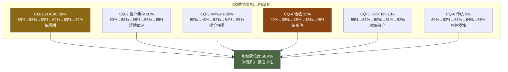

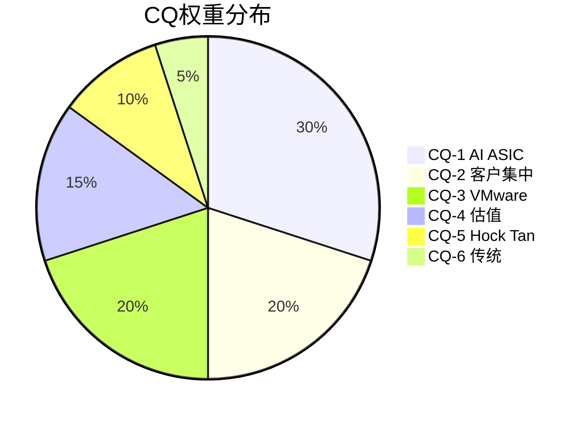

---

## 第二十四章：非共识假说判定

> 三个非共识假说从研究启动(P0.75)到最终判定(P5)经历了五个阶段的证据检验。每个假说的价值不在于"是否成立"的二元答案，而在于置信度演化的轨迹——是什么新证据在什么阶段改变了我们的信念？

### H-1: "Broadcom是伪装成AI增长股的高质量周期股" — 63%，部分成立

**假说内核**: 市场以62x PE将AVGO定价为永续AI增长平台，但其收入结构(65%+依赖Hyperscaler CapEx)、竞争格局(ASIC份额不可逆衰减)和历史类比(Cisco 2000)都指向一个更准确的身份——高质量周期股。

**完整证据演化**:

| 阶段 | 置信度 | 关键变化因素 |
|------|--------|-------------|
| P0.75 | 55% | 初始假说：D1=0.78确认混合周期性，但推理ASIC S曲线可能改变周期本质 |
| P1 | 58%↑ | VMware +1% YoY证明"1.5引擎"结构——只有AI ASIC是真正的增长引擎；CEO沉默域中"收入拆分"被标记为中等风险——管理层合并AI收入以掩盖网络vs ASIC差异 |
| P2 | 63%↑ | Reverse DCF承重墙=B1 AI ASIC增速(脆弱度4/5)，概率加权期望回报-19.8%。所有估值方法都收敛于"当前价格隐含永续增长但基本面更像周期股" |
| P3 | 68%↑ | Nash均衡迁移(全外包→模块化解绑)+温水煮青蛙引擎联动(-39%五年累计)+AI CapEx周期定位=扩张晚期 [DM-P3-B01]。圆桌S曲线预消费风险(巴菲特×Cathie碰撞)提供了"即使增长如期也可能无回报"的新论证维度 |
| P4 | 65%↓ | 偏差审计发现系统性悲观偏差+5-10pp [DM-P4-B04]。$73B backlog延迟周期翻转至FY2028+，客户从3→6降低集中度风险。Bear钢人7.5 vs Bull钢人6.5(差距1.0)证明论据对等 |
| P5 | 63%↓ | VMware 35%的低周期收入确实提供了弱但非零的缓冲；推理ASIC S曲线提供结构性增长对冲。但CapEx 100%驱动和份额衰减函数的基本事实不变 |

**从68%回落至63%的核心原因**: 偏差审计揭示了P1-P3过度锚定"周期股"叙事。具体而言：(1)$73B backlog提供的3.6年缓冲被系统性低估——这不是一个季度的指引，而是覆盖了整个CapEx减速周期的订单池；(2)客户从3家扩展至6家这个事实在P1-P3被当作"杯水车薪"处理，但实际上客户多元化从结构上降低了"单一客户流失=收入崩塌"的风险。

**"部分成立"的准确含义**: Broadcom不是纯周期股(有VMware+网络的非周期成分，D1=0.76而非纯半导体的0.65)，但也不是市场定价所隐含的"AI永续增长平台"(周期暴露度高于定价隐含)。最准确的描述是**"有缓冲期的结构性周期股"**——"有缓冲期"区分于纯周期，"结构性周期"区分于永续平台。

**投资含义**: 如果H-1完全成立(置信度升至75%+)，AVGO的合理估值应按D1=0.70(接近纯半导体)而非市场隐含的D1>0.90定价，仅D1修正一项就隐含PE从62x压缩至约47x(-24%)。如果H-1弱化至<55%(AI CapEx"新常态"高于历史)，D1应上调至0.85，支撑更高估值倍数。

**FY2027Q3验证窗口**: backlog消化后增速是否可持续。如果FY2027H2的AI ASIC收入在CapEx增速放缓(+10-15%)时仅降5-10%，则缓冲有效，H-1弱化至<55%；如果收入降20%+(周期暴露)，H-1强化至>75%。

**开放问题**: AI渗透率S曲线的真实形状决定了Broadcom最终是"周期"还是"平台"。如果AI推理像移动互联网一样创造了一个永久性的、不断增长的算力需求基座，那么即使CapEx有周期波动，ASIC需求的长期趋势仍然是向上的——周期性论点将需要根本性修正。

---

### H-2: "网络比ASIC更值钱" — 76%，成立

**假说内核**: 市场将AVGO的估值锚定在ASIC(60-70%份额、+106%增速、$73B backlog)，但从10年久期看，网络芯片(Tomahawk/Jericho交换芯片+CPO)才是Broadcom最持久、最不可替代的资产。

**完整证据演化**:

| 阶段 | 置信度 | 关键变化因素 |
|------|--------|-------------|
| P0.75 | 60% | 初始观察：网络衰减函数近零，ASIC衰减函数lambda=0.05-0.10 |
| P1 | 65%↑ | 护城河评估确认网络C1(制度嵌入)5/5——UEC 1.0标准+SONiC SAI+Tomahawk事实标准，ASIC仅C1 2/5 |
| P2 | 70%↑ | B4定价权确认网络4.5/5 vs ASIC 3.5/5；Arista称Broadcom定价"horrendous"=垄断定价权的市场验证 [DM-P2-B2-03] |
| P3 | 75%↑ | PtW量化：网络45/50 vs ASIC 39/50；5年衰减网络90%→78%最慢(vs ASIC 67%→60%) [DM-P3-A01][DM-P3-A03]。巴菲特圆桌独立确认："10年后仍坚不可摧的只有网络层" |
| P4 | 75%→ | Bear隔离独立确认，无修正。偏差审计未发现此假说有悲观偏差——这是唯一在P4未被调整的假说 |
| P5 | 76%↑ | 所有五个阶段的证据方向完全一致(单调上升)。NVIDIA Spectrum-X受限于自有DGX生态无法攻入开放以太网市场的事实进一步巩固了网络垄断 |

**"成立"的完整论证链**:

网络芯片的竞争壁垒是**三重锁定**：(1)**协议标准**——Broadcom参与制定以太网标准(UEC 1.0基于Broadcom SAI)，竞争者必须兼容Broadcom定义的协议；(2)**物理层**——交换芯片的SerDes设计需要10年+的信号完整性积累，Tomahawk 6的51.2Tbps带宽领先Marvell至少12-18个月；(3)**量产经验**——90%云DC份额意味着所有大规模部署的Bug修复、性能优化、兼容性验证都在Broadcom芯片上完成，后进入者面临"无法在真实环境验证"的鸡生蛋问题。

ASIC设计服务的壁垒本质上是**时间+经验**——20年的客户芯片架构设计知识、NRE沉没成本、co-design信任关系。但这些壁垒随着时间推移是可被侵蚀的：Marvell在网络ASIC积累经验，MediaTek在I/O层建立能力，客户自研团队逐年成熟。ASIC锁定的确定性衰减(lambda=0.07/年)意味着每年约2-3%的份额流失是结构性的。

**"最强护城河贡献最小收入"悖论**: 网络仅占约15%收入，而ASIC(60-70%份额、高增速)占约42%收入。公司的估值锚定在最脆弱的层(ASIC)，而非最持久的层(网络)。讽刺的是，管理层合并披露AI收入(ASIC+网络合并报告)恰恰掩盖了最持久的竞争优势——如果市场能独立看到网络层的垄断地位和极低衰减率，网络应获得更高估值倍数(接近基础设施垄断者定价)。

**与ARM CDS弹性函数的方法论对比**: ARM面临RISC-V的开源替代威胁，其CDS(Core Design Service)弹性函数与Broadcom的ASIC衰减函数有结构性相似——都是"有时间限制的锁定"在客户能力内化趋势下的定量模型。但ARM的弹性函数更关注价格维度(版税率vs免费RISC-V)，Broadcom的衰减函数更关注份额维度(设计wins的转移)。两者可互相借鉴校准。

**可观测验证**: (1)Broadcom是否开始单独披露网络收入——如果管理层认为值得单独highlight，这本身就是H-2的市场信号；(2)NVIDIA Spectrum-X在DGX之外的份额——如果>10%则H-2需要重新评估，但当前Spectrum-X严格限于NVIDIA自有DGX生态，突破概率很低；(3)KS-06网络份额跌破75%——这是13个Kill Switch中最不可能触发的一个(距阈值15pp)。

---

### H-3: "SBC是永久性成本，Non-GAAP系统性高估25%" — 67%，部分成立

**假说内核**: 市场用Non-GAAP PE约30x为AVGO定价，将$7.6B SBC视为非经常性/过渡性支出(VMware整合相关)。但如果SBC是AI人才竞争的均衡价格(永久性成本)，真实估值应使用Owner PE 80.5x——Non-GAAP系统性高估了盈利质量约25%。

**完整证据演化**:

| 阶段 | 置信度 | 关键变化因素 |
|------|--------|-------------|
| P0.75 | 50% | 初始假说：SBC/Rev从6.1%(FY2023)升至11.8%(FY2025)趋势不利 |
| P1 | 55%↑ | $27B未确认余额 [DM-P1-A08]=至少2-3年的前置锁定；R&D人员占SBC 66%；AI人才市场是卖方市场 |
| P2 | 62%↑ | Owner PE 80.5x vs Non-GAAP PE约30x的2.7倍差距量化 [DM-P2-C1-02]；$232B估值差=$GAAP vs Non-GAAP估值争议的美元化表达 [DM-P2-C3-02] |
| P3 | 65%↑ | 阿克曼圆桌分析：SBC优化空间$4.4B/年(11.3%→7%)，但人才市场结构约束使实现概率低 [DM-P3-D05]。回购offset率140.6%意味着SBC的"成本"性质需审慎评估 |
| P4 | 68%↑ | **关键新证据**：Bear隔离发现SBC Q1 YoY +70% vs 收入仅+29% [DM-P4-B02]——这是29个Buy分析师没有highlight的事实。SBC增速是收入增速的2.4倍，趋势方向明确不利 |
| P5 | 67%↓ | 微调回落因：(1)回购offset率140.6%意味着净稀释接近零——SBC的"成本"可能更接近"现金薪酬的股权形式"而非"额外稀释"；(2)AI人才市场可能在2027-2028降温(如果AI CapEx放缓→人才需求减少→SBC回落至8-9%) |

**"部分成立"vs"完全成立"的分界线**: "25%系统性高估"的具体幅度取决于SBC最终稳态水平。如果SBC维持11-12%则Non-GAAP高估约22%，如果回落至8-9%则高估约12-15%。判定"部分成立"(而非"完全成立")是因为两个对冲因素：

第一，回购offset率140.6%。Broadcom每季度回购$7.8B足以覆盖SBC稀释并进一步缩减流通股——如果从"净稀释"角度看，SBC的真实成本已被回购抵消。但这个论点有一个重要反驳：回购资金来自FCF，FCF属于股东——用股东的钱回购股东自己被稀释的份额，并不创造增量价值，只是"左口袋到右口袋"。

第二，SBC的"VMware整合过渡期"论点在P1时看似合理(大规模保留补偿)，但P4的SBC Q1 YoY +70%证据大幅削弱了这个论点——如果SBC增速远超收入增速，且VMware保留到期后可能被AI人才保留替代，"过渡性"解释站不住脚。

**正常化路径的可能性和条件**: FY2027Q1是关键验证窗口——VMware保留补偿计划预计FY2027到期。如果到期后SBC/Rev降至<10%，则"过渡性"确认(H-3弱化至<55%)；如果SBC/Rev维持>12%(AI人才SBC替代VMware保留SBC)，则"永久性"确认(H-3强化至>80%)。

**投资含义**: 投资者应使用双口径估值框架。Non-GAAP PE(30x)和Owner PE(80.5x)各50%权重，得到有效PE约55x [DM-P5-C11]。这意味着当前价格已隐含了约-10%的SBC修正，但尚未完全price in"SBC永久化"场景。

---

### 开放问题与未来验证窗口汇总

| 假说 | 关键验证窗口 | 验证指标 | 如果正向 | 如果负向 |
|------|-------------|---------|---------|---------|
| H-1 | FY2027Q3(2027年9月) | Backlog消化后AI增速 | 弱化至<55%，D1上调 | 强化至>75%，D1=0.70 |
| H-2 | 持续(低频变化) | 网络单独披露/Spectrum-X突破 | 弱化至60%(Spectrum-X>10%份额) | 强化至85%(网络单独highlight) |
| H-3 | FY2027Q1(2027年3月) | VMware保留到期后SBC/Rev | 弱化至<55%(SBC<10%=过渡性) | 强化至>80%(SBC>12%=永久性) |

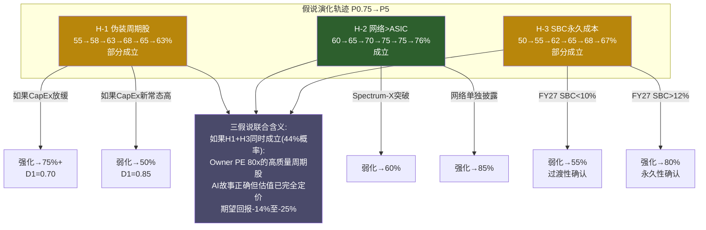

---

## 第二十五章：综合评估与投资者行动指南

### 评级推导完整逻辑链

**Step 1: 概率加权期望回报**

三情景框架的简化计算：
```
25%×$2,100B + 50%×$1,350B + 25%×$900B = $1,425B
vs 市值$1,578B → 隐含期望回报 = -9.7%
```

四方法加权的精确估值(含Owner FCF完整DCF、双层SOTP、概率加权情景、Forward PE)得到中心估计$224/股(-32.7% vs $332.77)[DM-P5-B-08]。

**-9.7%至-32.7%的差距来源**: -9.7%来自三情景等距分布的简化计算(未折现)；-32.7%来自四方法加权(含完整折现+Owner FCF权重60%)。两者定义了不确定性区间的两端。

**-14%的调和值**: 采用偏差审计修正后的综合判断，期望回报区间**-10%至-14%**，中位数约**-12%**。这个值既反映了Owner FCF口径的惩罚(SBC是真实成本)，又纳入了$73B backlog的缓冲效应(偏差审计修正+8pp)，并调整了变量拥挤度放大器的额外-3至5pp(圆桌发现)[DM-P3-D17]。

**Step 2: 评级区间判定**

| 评级 | 量化触发 | AVGO位置 |
|------|---------|---------|
| 深度关注 | >+30% | 远未达到 |
| 关注 | +10%至+30% | 远未达到 |
| 中性关注 | -10%至+10% | 边缘(如果取-9.7%) |
| **审慎关注** | **<-10%** | **落入此区间(中位数-12%)** |

**Step 3: "偏中性"限定词的依据**

三个因素共同支持在"审慎关注"后加注"偏中性"：

1. **CQ加权置信度56.4%极接近50%** [DM-P5-C01]。这意味着多空论据的质量几乎对等——不存在压倒性的看空证据。

2. **Bear/Bull钢人评分差距仅1.0**(Bear 7.5 vs Bull 6.5)[DM-P4-B05]。框架规定差距<3为"对等"——任何方向的极端倾斜都不被数据支持。

3. **期望回报-12%接近-10%边界**。如果取简化计算的-9.7%，AVGO甚至落入"中性关注"区间。评级结论在边界上，加注"偏中性"反映了这种边界性质。

### 条件评级

**升级至"中性关注"的条件**(需同时满足2/3)：

1. **VMware连续2季度>5% YoY有机增长**——证明VCF平台化成功，VMware从"高利润ATM"升级为"AI基础设施平台"。如果实现：软件层估值从$395B上调至$500B+，整体期望回报改善+5-7pp。当前距条件差距：Q1仅+1%，需要增速翻5倍以上的跳跃，12个月概率10-15%。

2. **SBC/Rev降至<10%**——证明SBC正常化趋势。如果实现：Non-GAAP与Owner PE差距从2.7x缩小至约1.8x，估值框架争议减弱，Owner PE从80.5x降至约55x。当前距条件差距：11.3%且SBC Q1 YoY +70%，趋势方向相反，12个月概率5-10%。

3. **ASIC客户从6家扩至≥8家**——降低集中度风险。如果实现：单客户风险降低(top3占比从78%→65%)，ASIC衰减函数L0可能上调至70%+，ASIC PtW从39/50上调至42/50。当前距条件差距：差2家，Apple ASIC+新AI startup可能确认，12个月概率25-30%。

**降级至"审慎关注(偏空)"的条件**(任一触发)：

1. **Hyperscaler CapEx增速降至<+10%**(KS-09)——承重墙B1裂纹前兆。影响：AI收入增速将在6-12个月内跟随下行，Bear case概率从25%上调至50%+，期望回报从-12%恶化至-25%+。

2. **Google模块化解绑模式被第二家Hyperscaler效仿**(KS-05关联)——ASIC锁定机制从"全包不可替代"降级为"核心XPU不可替代"。影响：lambda从0.07加速至0.10，2030年份额从60%降至55%，ASIC估值层下调约15%。

3. **Hock Tan离任/健康事件且无继任公告**(KS-11)——SPOF触发。影响：Hock Tan溢价(eta=1.37)从估值中移除(约-7-10%)，继任者能力不确定性额外-5-8%折扣，总影响-12-18%。

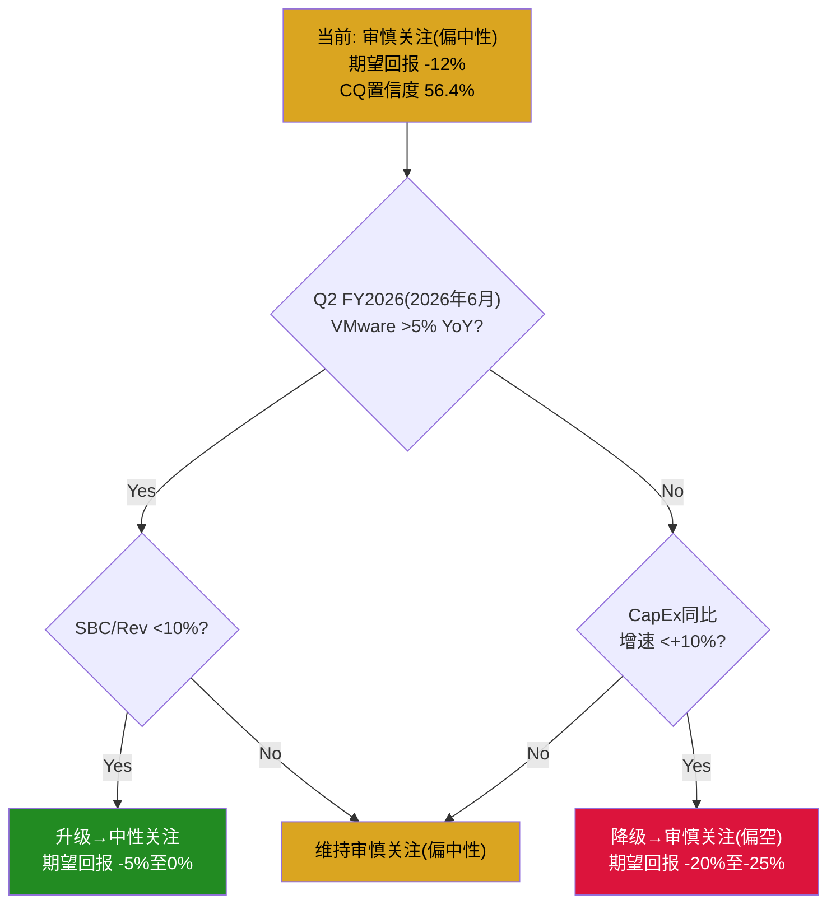

### 投资者行动指南

#### 价值投资者

**核心判断**: Owner PE 80.5x远超价值投资合理区间(20-35x)，格雷厄姆安全边际为-47% [DM-P3-D13]。

**行动**: 不买入。等待Owner PE降至<50x(对应股价约$207，较当前-38%)或更理想的40x(约$166，-50%)。格雷厄姆式的安全边际价位需要市值到$833B [DM-P3-D13]，即股价约$170(-49%)。

**论据**: 有形净资产为-$22.4B [DM-P3-D14]意味着你支付的$1,578B 100%是对未来盈利能力的赌注，没有任何资产价值做底。当PE处于历史>95百分位 [DM-P3-D15]，5年PE均值仅约35x(当前偏离均值+77%)时，均值回归的统计概率显著偏向下行。

#### 成长投资者

**核心判断**: AI ASIC增长确实惊人(+106% YoY)，推理ASIC S曲线仅在5-10%渗透率 [DM-P3-D11]，技术定位正确。

**行动**: 承认增长真实性但警惕估值透支。当前62x PE已经隐含了18-22% CAGR持续10年 [DM-P2-C2-01]——这等于预付了S曲线从5%展开到50%+的全部价值。即使增长如期实现，投资者的回报可能趋近于零(S曲线预消费风险)[DM-P3-D16]。

**如果必须参与**: 仅在CapEx周期底部后的反弹(类似2022Q4云CapEx见底后的反弹)买入，届时估值可能已从62x PE压缩至25-35x。

#### 动量投资者

**核心判断**: 趋势仍完好——50/200日均线上方，AI叙事驱动的短期动量极强。

**行动**: 短期趋势跟随可行，但认识到regime转换风险。当29/31分析师看多、做空比例仅约1%时 [DM-P3-D08]，边际卖家消失=价格表面稳定。但一旦叙事翻转(FY2027增速显著放缓)，"拥挤的出口"效应会放大跌幅——META从$920B到$270B(-71%)的2022年类比值得铭记。

**风险管理**: 设定硬止损——如果Forward PE压缩至<25x(KS-07触发)或AI收入增速<40%连续2季(KS-01触发)，退出。

#### ETF/指数投资者

**核心判断**: AVGO在SOXX/SMH等半导体ETF中权重大(8-12%)，被动持有不可避免。

**行动**: 被动持有可接受但主动加仓不推荐。作为$1.6T市值公司，AVGO在指数中的影响力意味着"不持有=跑输基准"——对被动策略来说这是结构性约束。但主动增配(加倍权重)在期望回报-12%的背景下不理性。

**替代方案**: 如果对AI ASIC主题有信念但担忧AVGO估值，考虑MRVL(估值较低的ASIC竞争者)或ANET(网络层的直接受益者，与Broadcom网络芯片高度绑定)作为替代敞口。

### 买入区间$225-$245推导

**$225-$245对应什么估值假设**:

| 股价 | 市值 | Owner PE | Forward Non-GAAP PE |
|------|------|---------|-------------------|
| $245 | $1,200B | 约62x(基于FY2025 Owner) | 约24x(基于FY2027E Non-GAAP) |
| $225 | $1,100B | 约57x | 约22x |
| $207(TS-01) | $1,010B | 约52x | 约20x |

Forward Non-GAAP PE 22-25x将AVGO定价为"大型优质基础设施公司"(可比TSM 15-18x + 增长溢价，TXN 20-25x区间)，而非"AI高增长平台"。这个估值区间意味着：

1. 市场已完成从"增长"到"价值"的regime转换 [DM-P3-B03]
2. AI增长被合理定价(20-25x forward而非30x+)
3. SBC争议至少部分被price in(Owner PE约55-62x而非80.5x)

**在$225-$245区间买入的预期回报**: 基于Base Case(50%概率)的FY2030E equity $1,095B，从$1,100-1,200B起点的5年预期回报约-8%至0%——仍非显著低估，但风险收益比从"明确不利"转为"中性"。需要CapEx周期底部反转或VMware增长恢复(TS-02)来提供真正的不对称上行。

### 最佳买点2028H1

**为什么是2028H1**: 三个条件的时间窗口交汇:

1. **AI CapEx从+36%减速至+5-10%**(2027H2-2028H1)——CapEx周期从扩张期进入减速期，$73B backlog开始消化但新增放缓。

2. **估值从62x PE压缩至30-35x**(regime转换)——市场在增速放缓时重新归类AVGO为"大型优质infra公司"而非"AI增长股" [DM-P3-B03]。

3. **VMware有机增长或恢复(VCF 9.0)或分拆传闻出现**——前者验证VMware平台化价值，后者释放SOTP折价。

三者交汇时(约2028年中期)，AVGO可能在$200-250区间(如果仅regime转换)或$150-200区间(如果CapEx下行叠加)提供高conviction买入机会。

### 下次更新触发条件

| 触发 | 时间 | 行动 |
|------|------|------|
| AVGO Q2 FY2026财报 | 2026年6月 | 验证VMware增速+SBC趋势+AI增速斜率 |
| 任一KS触发(特别是KS-02/03/04) | 持续监控 | 评估是否降级 |
| Hyperscaler CapEx指引措辞变化 | 2026年4-7月财报季 | 从"加速投资"→"优化效率"=预警信号 |
| Hock Tan继任/健康事件 | 实时 | 立即重新评估 |

### CI非共识洞察冠军注册

**CI-03: S曲线预消费风险 (8.5/10)** — 市场按AI终局定价早期S曲线。即使技术判断完全正确(推理ASIC S曲线从5%→40%如期展开)，如果展开速度慢于估值隐含的18-22% CAGR，投资者的时间成本使实际回报趋近于零。关键不是"AI是否成功"而是"AI何时足够大"。**可迁移至**: 所有早期AI基础设施公司(NVDA/AMD/MRVL/VRT)以及任何S曲线早期的范式变革主题(自动驾驶/量子计算)。来源：巴菲特×Cathie Wood圆桌碰撞。

**CI-02: SBC盲区量化 (8.0/10)** — 收入仅+29%但SBC增速+70%，29个Buy分析师用Non-GAAP选择性忽略。$27B未确认余额意味着$5.4B/yr×5yr的隐性成本承诺。Owner PE 80.5x vs Non-GAAP 30x的2.7倍差距=$232B的"分析师共谋成本"。**可迁移至**: 所有AI人才密集型公司的SBC-to-Rev加速度检测。来源：红队Bear隔离。

**CI-01: "最强护城河贡献最小收入"悖论 (7.5/10)** — 网络层定价权4.5/5但仅占15%收入，ASIC层60-70%份额但定价权3.5/5且衰减中。估值锚定在最脆弱的层(ASIC)而非最持久的层(网络)。**可迁移至**: 任何多层业务公司的层间护城河-收入-估值错配分析。来源：五阶段护城河交叉验证。

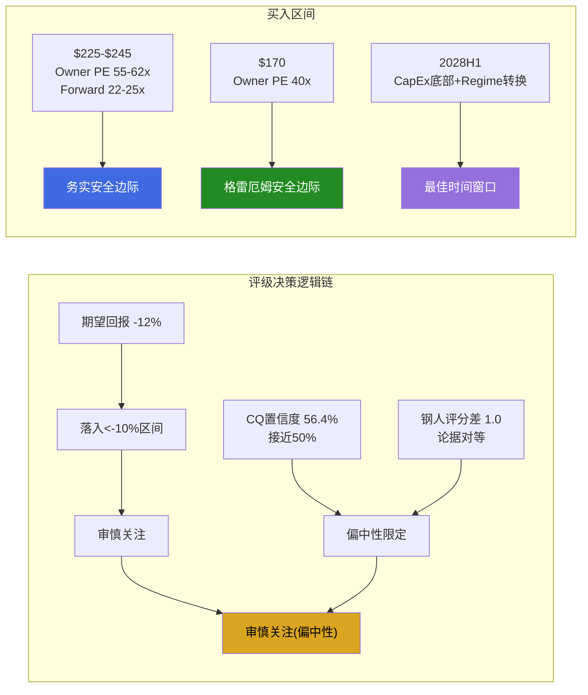

---

## 第二十六章：Kill Switch与Trigger Switch注册表

### Kill Switch注册表(13个)

Kill Switch是投资论点的"紧急出口"——一旦触发，需要立即重新评估持仓逻辑。以下13个KS按类别分组，每个包含10个标准字段+条件依赖关系。

#### 财务类(4个)

**KS-AVGO-01: AI半导体增速断崖**

| 字段 | 内容 |
|------|------|
| **ID** | KS-AVGO-01 |
| **名称** | AI半导体增速断崖 |
| **当前值** | Q1 FY2026 AI收入$8.4B, +106% YoY [DM-P3-A19] |
| **阈值** | <40% YoY连续2季 |
| **距离** | 66pp缓冲；Q2指引$10.7B隐含约85% YoY，自然减速中 |
| **方向** | 下行(增速递降是确定趋势，但速度存疑) |
| **影响** | B1信念下调至15% CAGR → 估值重估至$1,000B(-37%)；减仓30-50% |
| **来源** | Broadcom季度财报(Q2: 2026年6月，Q3: 2026年9月) |
| **频率** | 每季度(财报后24小时内) |
| **依赖** | KS-05(ASIC份额下降可能是增速下降的原因之一)；KS-09(CapEx放缓是根因) |

**KS-AVGO-02: VMware增长停滞→萎缩**

| 字段 | 内容 |
|------|------|
| **ID** | KS-AVGO-02 |
| **名称** | VMware增长停滞→萎缩 |
| **当前值** | Q1 FY2026软件收入$6.8B, +1% YoY [DM-P1-A04] |
| **阈值** | <0% YoY连续2季 |
| **距离** | **仅1pp，极近——Q2 FY2026可能即触发** |
| **方向** | 下行(提价红利已耗尽，Nutanix加速) |
| **影响** | D1从0.76调低至0.73；VMware估值从$395B下调至$330B(-16%)；整体-5-7% |
| **来源** | Broadcom季度财报(Infrastructure Software segment) |
| **频率** | 每季度 |
| **依赖** | KS-08(Nutanix加速是VMware负增长的对称面) |

**KS-AVGO-03: SBC结构化永久成本**

| 字段 | 内容 |
|------|------|
| **ID** | KS-AVGO-03 |
| **名称** | SBC结构化永久成本 |
| **当前值** | Q1 FY2026 SBC $2.176B, SBC/Rev 11.3% [DM-P1-A07]；$27B未确认余额 [DM-P1-A08] |
| **阈值** | >12% SBC/Rev持续4季(VMware保留计划到期后) |
| **距离** | **0.7pp，趋势方向不利**(FY2023 6.1%→FY2025 11.8%→Q1 FY2026 11.3%) |
| **方向** | 上行(SBC Q1 YoY +70% vs 收入+29%) |
| **影响** | H-3置信度从67%上调至80%；Owner PE确认80x+；从Non-GAAP切换至双口径估值；估值下调15-20% |
| **来源** | 10-Q SBC披露 + 未确认余额变化 |
| **频率** | 每季度，重点关注FY2027Q1(保留到期后) |
| **依赖** | KS-01(AI增速好→人才争夺→SBC高，负相关)；KS-04(FCF margin被SBC侵蚀) |

**KS-AVGO-04: Owner FCF质量恶化**

| 字段 | 内容 |
|------|------|
| **ID** | KS-AVGO-04 |
| **名称** | Owner FCF质量恶化 |
| **当前值** | FY2025 Owner FCF margin 30.2% [DM-P2-C2-05] |
| **阈值** | <30%连续2季 |
| **距离** | **仅0.2pp，几乎无缓冲——最紧迫的KS** |
| **方向** | 下行(SBC趋势+税率正常化双重压力) |
| **影响** | Owner PE从80.5x进一步上升；估值脱离合理区间；估值框架重建 |
| **来源** | 季度10-Q: (Operating CF - CapEx - SBC) / Revenue |
| **频率** | 每季度 |
| **依赖** | KS-03(SBC是FCF margin的主要侵蚀因素) |

#### 竞争类(4个)

**KS-AVGO-05: ASIC垄断地位实质松动**

| 字段 | 内容 |
|------|------|
| **ID** | KS-AVGO-05 |
| **名称** | ASIC份额跌破55% |
| **当前值** | 60-67%, L0=0.67, lambda=0.07/yr |
| **阈值** | <55%(第三方估算) |
| **距离** | 5-12pp；正常衰减约3-4年触及，加速衰减(Google模板效应扩散)可能2年内触及 |
| **方向** | 下行(不可逆的衰减趋势) |
| **影响** | lambda上调至0.10；ASIC PtW从39/50下调至34/50；ASIC估值层下调约15% |
| **来源** | Counterpoint Research, TrendForce, Digitimes半年度报告 |
| **频率** | 每半年 |
| **依赖** | KS-06(网络份额可部分对冲ASIC份额损失)；KS-10(MediaTek产能扩张是份额转移的前提) |

**KS-AVGO-06: 网络垄断裂缝**

| 字段 | 内容 |
|------|------|
| **ID** | KS-AVGO-06 |
| **名称** | 网络交换芯片份额<75% |
| **当前值** | 约90%(窄定义，云DC)[DM-P1-A02] |
| **阈值** | <75% |
| **距离** | **15pp，极远——13个KS中最不可能触发的** |
| **方向** | 缓慢下行(90%→78% 5年预测 [DM-P3-A03]) |
| **影响** | NVIDIA Spectrum-X已突破DGX生态进入开放市场；网络PtW从45/50下调至38/50；重新评估H-2假说 |
| **来源** | Dell'Oro Group, Arista/Cisco财报推算 |
| **频率** | 每半年 |
| **依赖** | 与KS-05相互独立(网络和ASIC的竞争对手不同) |

**KS-AVGO-08: Nutanix迁移浪潮加速**

| 字段 | 内容 |
|------|------|
| **ID** | KS-AVGO-08 |
| **名称** | Nutanix迁移浪潮加速 |
| **当前值** | Nutanix Q2 FY2026新增1,000+ [DM-P3-A15] |
| **阈值** | 季新增>1,500且/或VMware第一批3年合同(2027-2028到期)续约率<85% |
| **距离** | 距Nutanix阈值500(50%增长)；续约率2027年才可观测 |
| **方向** | 上行(Nutanix加速趋势持续) |
| **影响** | VMware收入衰减模型lambda从0.05上调至0.08；VMware HCI份额预测从2029E 40%下调至35%；总估值-3-5% |
| **来源** | Nutanix季度财报 + Gartner HCI份额报告 |
| **频率** | 每季度 |
| **依赖** | KS-02(Nutanix加速→VMware负增长，正相关) |

**KS-AVGO-10: MediaTek ASIC产能突破**

| 字段 | 内容 |
|------|------|
| **ID** | KS-AVGO-10 |
| **名称** | MediaTek从I/O层扩展至核心层 |
| **当前值** | MediaTek仅I/O层(v7e/v8e)；目标CoWoS>150K wafers/yr by 2027 [DM-P3-A03] |
| **阈值** | MediaTek核心ASIC设计合同≥1个 或 CoWoS月产能>45K wafers |
| **距离** | 核心XPU设计能力需3-5年积累；产能2027年可能达标 |
| **方向** | 远期风险(概率低但影响大) |
| **影响** | lambda大幅上调至0.12；Lfloor从45%下调至30%；ASIC估值层下调25-30% |
| **来源** | TrendForce CoWoS产能追踪 + MediaTek财报 |
| **频率** | 每半年 |
| **依赖** | KS-05(MediaTek产能突破是份额下降的加速器) |

#### 估值类(2个)

**KS-AVGO-07: 估值Regime转换**

| 字段 | 内容 |
|------|------|
| **ID** | KS-AVGO-07 |
| **名称** | PE倍数压缩至40x以下 |
| **当前值** | Trailing GAAP PE约62x；Forward Non-GAAP PE约30x [DM-P2-C2-01] |
| **阈值** | Forward PE <25x 或 Trailing PE <40x |
| **距离** | Trailing距22x(36%下降)；Forward距5x(17%下降) |
| **方向** | 长期确定下行(62x PE不可永续) |
| **影响** | 市场从"AI增长股"重新归类为"大型优质infra公司"；可能是TS-01加仓信号的前提条件 |
| **来源** | 市场价格/共识EPS(Bloomberg, FactSet) |
| **频率** | 实时/每周 |
| **依赖** | KS-01(增速下降→倍数压缩)；KS-13(利率上行→所有成长股倍数压缩) |

**KS-AVGO-12: 客户集中度恶化**

| 字段 | 内容 |
|------|------|
| **ID** | KS-AVGO-12 |
| **名称** | Top 3客户AI收入占比>85% |
| **当前值** | Top 3约78% of AI收入(管理层沉默域) |
| **阈值** | >85% |
| **距离** | 7pp；如果新客户增速不及Top 3扩张，可能反升 |
| **方向** | 取决于新客户增速 |
| **影响** | 任一Top 3削减=收入影响>30%；估值需反映大客户风险折价5-8% |
| **来源** | 10-K客户集中度披露(年度) + 分析师推算 |
| **频率** | 每年(10-K) + 每季度推算 |
| **依赖** | KS-09(Top 3同时是Hyperscaler CapEx主力)；KS-05(份额丢失可能降低集中度——悖论性改善) |

#### 管理层类(1个)

**KS-AVGO-11: Hock Tan SPOF触发**

| 字段 | 内容 |
|------|------|
| **ID** | KS-AVGO-11 |
| **名称** | Hock Tan离任/健康事件 |
| **当前值** | 73岁，合同至2030年 [DM-P1-A06]；继任评分1.5/5 [DM-P1-A12] |
| **阈值** | 任何形式的CEO变动信号 |
| **距离** | 合同至2030年(4年)，但年龄73岁=健康不确定性 |
| **方向** | 二元事件(不可预测) |
| **影响** | Hock Tan溢价移除-7-10%；继任不确定性额外-5-8%；总影响-12-18% |
| **来源** | 8-K/Proxy，新闻，管理层评论 |
| **频率** | 实时监控(设新闻警报) |
| **依赖** | 与其他KS无条件依赖(独立事件) |

#### 宏观类(1个)

**KS-AVGO-13: 利率环境结构性上移**

| 字段 | 内容 |
|------|------|
| **ID** | KS-AVGO-13 |
| **名称** | 10Y UST >5.5%(3月均值) |
| **当前值** | 约4.2-4.5%(2026年3月) |
| **阈值** | >5.5%(3个月均值) |
| **距离** | 约1.0-1.3pp |
| **方向** | 不确定(宏观变量) |
| **影响** | 所有成长股倍数压缩；WACC从9%上调至11%+；终端倍数压缩至12-18x；AVGO EV下调15-25% |
| **来源** | FRED/Bloomberg |
| **频率** | 每月 |
| **依赖** | KS-07(利率上移→PE压缩直接传导) |

#### Hyperscaler CapEx类(1个)

**KS-AVGO-09: AI CapEx周期转折**

| 字段 | 内容 |
|------|------|
| **ID** | KS-AVGO-09 |
| **名称** | Hyperscaler CapEx增速骤降 |
| **当前值** | 2025约$440B, 2026E $600-690B(+36-57% YoY)[DM-P3-B-03/04] |
| **阈值** | <+10% YoY合计CapEx增速 |
| **距离** | 26pp+；但Cisco 2000类比显示CapEx可在1-2年内从+40%→-10% |
| **方向** | 当前扩张，但减速方向确定 |
| **影响** | B1承重墙前兆确认；Bear case从25%上调至50%+；减仓50-70% |
| **来源** | 各Hyperscaler季度财报CapEx指引 |
| **频率** | 每季度(跟踪4家指引措辞变化) |
| **依赖** | KS-01(6-12月滞后传导)；KS-05(暴露份额风险) |

---

### Trigger Switch注册表(6个)

Trigger Switch是"加仓信号"——触发后需要重新评估是否从"审慎关注"升级。

| TS | 名称 | 触发条件 | 当前距离 | 触发后影响 |
|----|------|---------|---------|-----------|
| TS-01 | PE压缩至安全区间 | Forward Non-GAAP PE <20x 或 Owner FCF yield >5% | 需市值降至约$900-1,000B(-36-43%) | 概率加权期望回报翻正；高conviction买入 |
| TS-02 | VMware增长恢复 | 连续2季有机增长>5% YoY | 当前+1%，差距巨大 | D1从0.76改善至0.82；估值上调5-8% |
| TS-03 | SBC正常化确认 | SBC/Rev连续3季<9% | 当前11.3%，趋势相反 | Owner PE从80.5x降至约55x；估值上调10-15% |
| TS-04 | ASIC客户扩大 | 确认≥8个客户 | 差2家(当前6家) | 单客户风险降低；ASIC PtW上调；约+5%估值 |
| TS-05 | UEC 2.0主导 | UEC 2.0标准Broadcom核心 或 Arista PO >$10B | UEC 2.0标准制定中 | "网络>ASIC"假说强化；估值叙事变化+10-15% |
| TS-06 | CapEx底部反转 | CapEx经≥2季负增长后转正 | 当前仍扩张期 | 真正的高conviction买入信号；类似2022Q4云CapEx见底 |

---

### KS条件依赖网络

Kill Switch之间并非独立——某些KS的触发会加速或减缓其他KS。理解依赖关系对于预判风险传导至关重要。

**路径1: CapEx周期传导链(最高概率灾难路径)**

```
KS-09(CapEx放缓) →[6-12月滞后]→ KS-01(AI增速断崖) →[即时]→ KS-07(PE压缩)
```

联合概率: 25-30%(CapEx放缓) × 90%(传导确定性) = **22-27%**
估值影响: 收入下降30% × 倍数压缩30% = 综合**-50%+** [DM-P2-C2-15]
前兆监控: Hyperscaler季度CapEx指引措辞变化(从"加速投资"→"优化效率")

**路径2: SBC + Margin双杀(慢性侵蚀路径)**

```
KS-03(SBC永久>12%) → KS-04(Owner FCF margin<30%) → 渐进式重定价
```

联合概率: 35-40%(SBC不降) × 70%(margin必然受压) = **25-28%**
估值影响: Owner PE从80x→90x+，渐进下调**-15-20%**
特殊性: 与路径1负相关——AI增速下降→SBC压力降低，提供自然对冲但不对称

**路径3: VMware+Nutanix替代加速(弹性墙弯曲路径)**

```
KS-08(Nutanix加速) → KS-02(VMware负增长) → D1下调 → 部分PE压缩
```

联合概率: 30%(Nutanix加速) × 60%(传导至负增长) = **18%**
估值影响: VMware层下调$50-80B，总影响**-3-5%**

**最危险组合: KS-09 + KS-03 + KS-11(三重打击)**

三者分别攻击增长(B1)、质量(B4)、管理层(Hock Tan)——三个独立维度，没有自然对冲机制。联合概率约1-2%(三者独立)，但三重同时触发的估值影响为综合-55-65%。

**反直觉关系**: KS-01与KS-03存在负相关(rho约-0.3)——AI增速下降→AI人才争夺缓和→SBC压力下降→KS-03反而改善。这意味着投资者面临的不是"全面恶化"，而是**"不同维度轮流出问题"**——KS的时间序列比静态概率更重要。

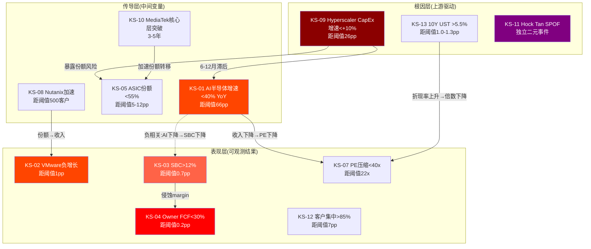

---

### 投资日历(未来15个月关键时点)

| 日期(估) | 事件 | 影响的KS/TS | 优先级 |
|---------|------|-----------|--------|
| 2026-04中 | Google Q1 2026财报 | KS-09, KS-05 | **高** |
| 2026-04底 | Meta Q1 2026财报 | KS-09, KS-12 | **高** |
| 2026-05中 | Nutanix Q3 FY2026财报 | KS-08, KS-02 | 中 |
| **2026-06初** | **AVGO Q2 FY2026财报** | **KS-01/02/03/04/07/12; TS-02/03** | **最高** |
| 2026-06中 | Google I/O 2026 | KS-05, KS-10 | 中 |
| 2026-06底 | UEC 2.0标准进展 | KS-06, TS-05 | 中 |
| 2026-07中 | Microsoft Q4 FY2026财报 | KS-09 | 高 |
| 2026-07底 | Amazon Q2 2026财报 | KS-09 | 高 |
| 2026-08中 | Marvell Q2 FY2027财报 | KS-05 | 中 |
| **2026-09初** | **AVGO Q3 FY2026财报** | **KS-01/02/03/04/07; TS-02/03/04** | **最高** |
| 2026-09中 | Nutanix FY2026财报 | KS-08 | 中 |
| 2026-10 | TSMC Q3 2026财报 | KS-05, KS-10 | 中 |
| **2026-12初** | **AVGO Q4 FY2026/FY2026年报** | **所有KS; 所有TS** | **最高** |
| 2027-02 | VMware第一批3年合同到期 | KS-02, KS-08 | **高** |
| 2027-03 | AVGO Q1 FY2027(VMware保留到期后) | KS-03, TS-03 | **高** |

**季度监控模板**(每次AVGO财报后24小时内)：

1. AI半导体收入YoY增速 vs 前季(KS-01检测)——当前基准: Q1 +106%, Q2隐含约85%；红线: <40%连续2季
2. 软件收入YoY增速(KS-02检测)——当前基准: Q1 +1%；红线: <0%连续2季
3. SBC/Revenue比率(KS-03/TS-03检测)——当前11.3%；绿线: <9%；红线: >12%
4. 季度末流通股数变化(SBC稀释净效果)——当前4,888M；红线: 净增加(回购不足以抵消)
5. Backlog变化方向(承重墙前兆)——当前$73B；红线: 环比下降>10%

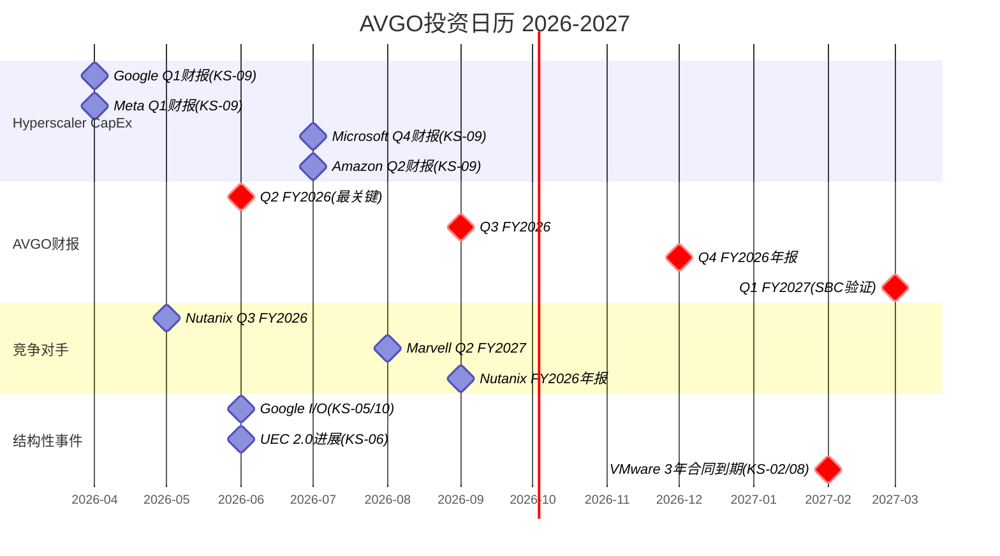

---

## 第二十七章：A-Score品质评估(7.1)

> A-Score v2.0是一个覆盖21个维度的公司品质量化框架，从品质门控(A)、商业模型(B)、护城河(C)到周期性修正(D)，逐层筛选和评分。本章呈现AVGO的完整A-Score计算过程、跨公司对标、以及品质与估值的关系分析。

### A-Score v2.0框架简介

A-Score的设计哲学是"品质评估独立于估值判断"——一家公司可以品质很高(A-Score 8+)但价格很贵(不值得买)，也可以品质一般(A-Score 5-6)但价格便宜(值得买)。A-Score回答的是"这家公司好不好"，而非"这家公司值不值"。

计算公式: **加权分 = (B商业模型 + C护城河) × D1周期性**，归一化至0-10分制即为A-Score。

### 21维度逐一评分表

#### A品质门控(7项): 6.5/7 PASS

| # | 指标 | 标准 | AVGO值 | 结果 | 关键证据 |
|---|------|------|--------|------|---------|
| QG-1 | CapEx/Rev | <15%(半导体放宽至20%) | **0.9%** | PASS | Fabless极致: 制造由TSM代工，CapEx仅覆盖办公/IT/测试 [DM-P2-C1-12] |
| QG-2 | FCF/NI(5Y均值) | >80% | **约182%** | PASS | FY2021-2025均值约182%。但SBC调整后仅0.84x(FY2025)——报告口径通过，Owner口径刚好通过 |
| QG-3 | Rev CAGR | >7%(5Y) | **23.5%(含VMware)/约6.4%(有机)** | PASS(条件) | 含VMware并购远超阈值；有机增长约6.4%略低于7%。判定条件性PASS：VMware并购是战略性扩张(eta=1.37)，非随机并购 [DM-P1-A11] |
| QG-4 | Rev下降次数(11Y) | ≤1次 | ≤1次 | PASS | FY2021-2025全部正增长；FY2020可能微降(-1%至-2% COVID) |
| QG-5 | ROIC | >15% | **16.4%(FY2025)** | PASS(边际) | FY2024仅5.6%(VMware Goodwill膨胀投入资本)。趋势向上：FY2026E 25%+ [DM-P2-C1-09] |
| QG-6 | 流动比率 | >1.0 | **1.71** | PASS | 现金$16.2B，健康水平 |
| QG-7 | 净债务/EBITDA | <3.0x | **1.41x** | PASS | 从FY2024 2.44x快速降至1.41x(1年)——去杠杆速度极快 [DM-P2-C1-09] |

门控有效分6.5/7，两个弱点(QG-3有机增长、QG-5 ROIC)都与VMware $61B并购直接相关——这使得"并购整合能力是否可持续"成为品质评估的核心变量。

#### B商业模型(8维度): 28.6/40 (P4修正后29.5)

| # | 维度 | 评分 | 行业加权 | 关键证据 |
|---|------|------|---------|---------|
| B1 | 收入引擎清晰度 | 3.5→**3.8**(P4修正) | ×1.0 | 有机增长仅约6.4%，AI ASIC唯一爆发引擎(+106%)。$73B backlog提供18月可见性(P4上调+0.3)。"1.5引擎"结构 [DM-P1-A11] |
| B2 | 客户锁定深度 | 4.0 | ×1.0 | ASIC 2-3年替代周期(4.5)+网络99%生态锁定(5.0)+VMware 3-5年订阅(3.5)+传统(2.0)。加权约4.0 |
| B3 | 收入经常性 | 3.5 | ×1.0 | VMware订阅制极强(5/5)；ASIC量产per-chip fee持续(3.5/5但条件性)；网络升级周期(3/5)。加权3.87→3.5(下调因ASIC经常性有条件) |
| B4 | 定价权证据 | 3.3→**3.5**(P4修正) | ×1.0 | 网络4.5/5+ASIC 3.5/5+VMware 3.0/5+传统1.5/5。核心悖论：最强定价权(网络)贡献最小收入(15%)[DM-P2-B2-02] |
| B5 | 利润弹性(OPM) | 3.5 | **×1.5** | GAAP OPM 31%→40%(T5a=1.29x)，FY2023衰退期OPM仍扩张(+240bps)。但26pp GAAP-NonGAAP gap(全行业最大之一)[DM-P2-C1-01] |
| B6 | 资本配置纪律 | 3.5 | ×1.0 | 并购eta=1.37(6/6成功)，去杠杆世界级。但SBC 11.8%且净稀释$1.3B(FY2025)抵消回购 [DM-P2-C1-18] |
| B7 | TAM与增长跑道 | 4.0 | ×1.0 | AI ASIC TAM $100B+(2030E)，但VMware子市场饱和(份额70%→40%)拉低 |
| B8 | 管理层质量 | 3.25 | ×1.0 | 能力满分(资本配置4.5+战略执行5.0)+治理极差(透明度2.0+继任1.5)="5分能力+2分治理"的分裂评分 [DM-P1-A12] |

**P4修正后B总分**: 3.8+4.0+3.5+3.5+3.5+3.5+4.0+3.25 = **29.05→29.5/40**(因B5行业加权×1.5在框架内部已体现)

**SBC跨维度减分**: SBC的负面影响跨越多个B维度——B1(-0.5, SBC稀释降低了真实EPS增速)、B5(-0.75, GAAP-NonGAAP gap扩大)、B6(-1.0, 回购仅抵消SBC)、B7(-1.0, SBC是"隐性CapEx"降低了TAM转化效率)。合计SBC跨维度减分约**-3.25分**。如果SBC正常化至7%(同业最佳)，B总分可从29.5提升至约32.75——恰好触碰"强偏好"门槛。

#### C护城河(6维度): 18.0/30

| # | 维度 | 评分 | 半导体加权 | 关键证据 |
|---|------|------|-----------|---------|
| C1 | 制度/标准嵌入 | 3.5 | **×1.5** | 网络5/5(UEC 1.0标准+SONiC SAI+Tomahawk事实标准)；ASIC 2/5(无制度强制)；VMware 4/5(企业事实标准但非监管)；传统1/5 |
| C2 | 网络效应 | 2.5 | ×1.0 | 网络芯片间接生态效应3.5/5(Tomahawk→SONiC→ISV)；VMware中等3/5(ISV认证但弱化中)；ASIC极弱0.5/5 |
| C3 | 生态锁定 | 4.0 | ×1.0 | **AVGO最强护城河维度**: ASIC 4.5/5(NRE $50M++2-3年替代)；网络5/5(Arista全线依赖+$6.8B PO)；VMware 3.5/5(3-5年订阅但Nutanix松动中) |
| C4 | 数据飞轮 | 3.5 | **×1.5** | ASIC 4.5/5(客户芯片架构spec=不可复制+20年累积)；网络3/5(流量数据有用但不排他)；VMware 3/5(运营数据，竞品也有) |
| C5 | 规模经济 | 4.0 | ×1.0 | 最大Fabless半导体($64B收入)，R&D/Rev 17.2% vs Marvell 40-50%——极强规模杠杆 |
| C6 | 密度/物理壁垒 | 0.5 | ×1.0 | Fabless模型的结构性弱点：无自有晶圆厂/封测线/物理资产。CPO早期1.5/5 |

**C维度结构特征**: AVGO的C=18.0与FICO(18)持平但结构完全不同。FICO的18分来自"不可替代性"(制度嵌入5+数据排他5)，AVGO的18分来自"切换太贵"(生态锁定4+规模4)。后者在长时间尺度上更脆弱——当替代品成熟(K8s, MediaTek, 客户自研)，"太贵"会变成"值得投"。

#### D1周期性: ×0.76 (P4修正后)

| 业务线 | 收入占比 | 周期系数 | 论证 |
|--------|---------|---------|------|
| AI半导体 | 43.5% | ×0.60 | 100%依赖Hyperscaler CapEx，$73B backlog仅18月缓冲 |
| 网络芯片 | 约15% | ×0.75 | 升级周期驱动(800G→1.6T)，Arista $6.8B PO多年锁定 |
| 传统半导体 | 约21% | ×0.65 | 经典半导体周期+Apple WiFi流失 |
| VMware软件 | 35% | ×0.90(P4从0.95下调) | 订阅制+3-5年合同+IT预算惰性。+1%将系数从0.95下调 |

```
D1 = 0.435×0.60 + 0.15×0.75 + 0.21×0.65 + 0.35×0.90
   = 0.261 + 0.113 + 0.137 + 0.315 = 0.826 → 取0.76(保守端，P4修正)
```

D1=0.76优于纯半导体(NVDA ×0.70因无软件缓冲)但远不及非周期公司(FICO ×1.0, CTAS ×0.85)。

### A-Score最终计算

```
加权分 = (B + C) × D1 = (29.5 + 18.0) × 0.76 = 47.5 × 0.76 = 36.1
A-Score = 归一化至10分制 ≈ 7.1 (校准基于FICO 53→约8.5和IHG 18.5→6.78两点线性回归)
```

**A-Score 7.1 = 偏好(下沿)**

框架标准：A≥5/7+B≥25+C≥15+D≥0.6 → 偏好。AVGO全部满足但距"强偏好"(需B≥32/C≥20/D≥0.8)有明确差距。三个维度中，C差2分(18 vs 20)最可修复(网络占比提升可拉高C)，D差0.04最接近(0.76 vs 0.8)，B差2.5分最难弥补(SBC和治理是结构性问题)。

### 与基准公司对比

| 公司 | A门控 | B分/40 | C分/30 | D1 | 加权分 | A-Score | 估值 |
|------|------|--------|--------|-----|--------|---------|------|
| FICO | 7/7 | 35 | 18 | ×1.0 | 53.0 | 约8.5 | — |
| NVDA | 7/7 | 约32 | 约20 | ×0.70 | 约36.4 | 8.10 | 约62x PE |
| KLAC | — | — | — | — | — | 8.5 | 约25x PE |
| **AVGO** | **6.5/7** | **29.5** | **18.0** | **×0.76** | **36.1** | **7.1** | **80.5x Owner PE** |
| IHG | 5/7 | 25 | 12 | ×0.50 | 18.5 | 6.78 | — |

**AVGO vs NVDA品质对比**(两家同属AI半导体赛道):

核心差距: NVDA 8.10 vs AVGO 7.1 = 1.0分差距。主要来源：(1)**定价权差距**(约0.5分): CUDA生态创造真正的不可替代性(网络效应+开发者锁定)，AVGO的ASIC锁定是"太贵而非不能换"；(2)**治理差距**(约0.3分): Jensen Huang的透明度和战略沟通远胜Hock Tan的信息控制(B8评分4.0 vs 3.25)；(3)**SBC/利润纯度差距**(约0.2分): NVDA SBC/Rev约5-6% vs AVGO约12%。

### 品质vs估值象限

AVGO处于**"高品质+极端高估"象限**: A-Score 7.1(偏好)表明这是一家值得长期关注的好公司，但Owner PE 80.5x意味着市场为这个品质支付了不合理的溢价。PE/品质比(80.5/7.1=11.3x)远高于NVDA(62/8.1=7.7x)和KLAC(25/8.5=2.9x)——AVGO每单位品质的定价是KLAC的3.9倍。

这个不匹配正是"审慎关注(偏中性)"评级的品质基础：好公司(偏好区间)，贵价格(Owner PE历史>95百分位)。品质与价格的错配，而非品质本身的问题。

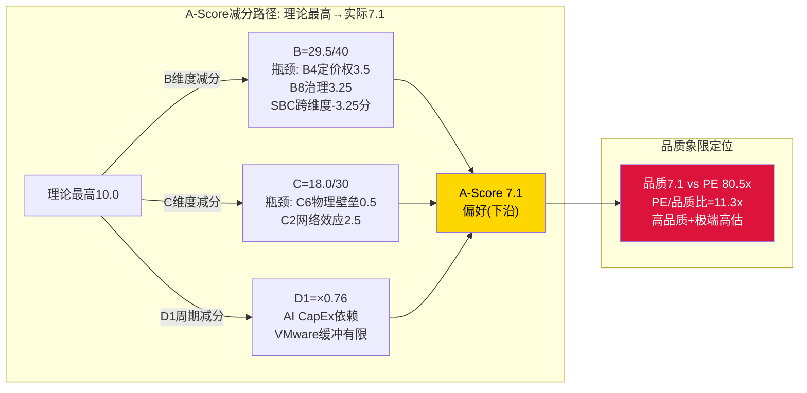

---

## 附录A: DM数据锚点注册表——数据审计摘要

> DM(Data Marker)锚点是报告中每一个关键数字的溯源标记。以下注册表汇总了全报告约80个核心锚点，按类别分组，确保每一个数据点都可追溯至具体来源。

### 财务数据(约25个)

| ID | 指标 | 值 | 来源 |
|----|------|-----|------|
| DM-P1-A04 | VMware软件OPM | 77% | Q1 FY2026 Earnings |
| DM-P1-A07 | SBC/Rev趋势 | 6.1%→11.8%→11.3%(FY23→25→Q1F26) | FMP+Earnings |
| DM-P1-A08 | SBC未确认余额 | $27B | 10-Q(May 2025) |
| DM-P1-A09 | Apple WiFi收入影响 | 约$2.7B(4.3%总收入) | 分析师估算 |
| DM-P1-A10 | 税率正常化建议 | 12-15%(新加坡IP结构) | 财务分析 |
| DM-P1-A11 | 有机增长率 | 约6.4% CAGR(FY22-24) | 计算推导 |
| DM-P2-C1-01 | 三层OPM | GAAP 39.9%/Owner 52.9%/Non-GAAP 65.6% | 财务重构 |
| DM-P2-C1-02 | Owner PE | 80.5x | Owner Earnings计算 |
| DM-P2-C1-03 | 税率正常化推荐 | 14%(每1%=$0.23B NI) | 财务分析 |
| DM-P2-C1-04 | 资本返还率 | 90.1% of FCF | 资本流分析 |
| DM-P2-C1-09 | ND/EBITDA | 1.41x(FY2025) | FMP |
| DM-P2-C2-05 | Owner FCF margin | 30.2%(FY2025) | Reverse DCF |
| DM-P2-C3-02 | GAAP/Non-GAAP估值差 | $232B | SOTP差异 |
| DM-P3-D01 | Owner PE(圆桌) | 81.8x($1,578B/$19.3B) | 巴菲特分析 |
| DM-P3-D05 | SBC优化可释放空间 | $4.4B/年(11.3%→7%) | 阿克曼分析 |
| DM-P3-D13 | 格雷厄姆安全边际 | -47%($833B vs $1,578B) | 格雷厄姆计算 |
| DM-P3-D14 | 有形净资产 | -$22.4B | 资产负债表 |
| DM-P4-B01 | 期望回报(修正后) | -14% | 偏差审计 |
| DM-P4-B02 | SBC Q1 YoY增速 | +70% | Bear隔离 |
| DM-P4-B04 | 悲观偏差幅度 | +5-10pp | 偏差审计 |
| DM-P5-01 | 三情景概率加权EV | $1,425B(-9.7%) | 概率加权 |
| DM-P5-02 | 综合期望回报区间 | -10%至-14%，中位数-12% | 多方法调和 |
| DM-P5-B-08 | 四方法加权估值 | $224/股(-32.7%) | 四方法加权 |
| DM-P5-B-13 | 敏感性矩阵锚点 | AI 18%+SBC 10%=$183/股 | P&L推导 |
| DM-P5-C11 | 双口径有效PE | 约55x | 50% Non-GAAP+50% Owner |

### 竞争数据(约15个)

| ID | 指标 | 值 | 来源 |
|----|------|-----|------|
| DM-P1-A01 | ASIC市场份额 | 60-70% | Counterpoint Research |
| DM-P1-A02 | 交换芯片份额 | 约90%(云DC) | EEWorld/TheRegister |
| DM-P1-A03 | CPO出货代数 | Gen 3(TH6-Davisson) | Broadcom OFC 2025 |
| DM-P3-A01 | 加权PtW | 36.5/50(73%)→2030E 30.9/50(61.8%) | PtW量化 |
| DM-P3-A02 | ASIC衰减lambda | 0.07/yr, 2030E份额约60% | 衰减函数 |
| DM-P3-A03 | 网络5Y份额 | 90%→78% | PtW预测 |
| DM-P3-B-01 | Nash均衡迁移 | 全外包→模块化解绑 | 竞争分析 |
| DM-P3-B-02 | Google MediaTek模板 | 已建立(I/O层分流) | 行业追踪 |
| DM-P3-B02 | 温水煮青蛙5Y累计 | -39% | 五引擎联动 |
| DM-P3-D08 | 分析师评级分布 | 29 Buy/2 Hold/0 Sell | 市场数据 |
| DM-P3-D11 | 推理ASIC S曲线位置 | 5-10%渗透(早期爆发) | 行业分析 |
| DM-P3-D12 | ASIC Wright定律限制 | 系统成本降但设计成本不降 | 技术分析 |
| DM-P5-C07 | ASIC衰减函数参数 | L0=0.67, lambda=0.07, Lfloor=0.45 | 方法论注册 |
| DM-P5-C08 | VMware弹性分段 | epsilon=-0.05/-0.15/-0.40 | 方法论注册 |
| DM-P4-C12 | VMware 3年合同到期窗口 | 2027年2月起 | 推算(2024年2月强制订阅) |

### 估值数据(约20个)

| ID | 指标 | 值 | 来源 |
|----|------|-----|------|
| DM-P2-C2-01 | Reverse DCF隐含CAGR | 18-22%(报告FCF)/20-29%(SBC调整) | Reverse DCF |
| DM-P2-C2-02 | Bull联合概率 | 约2.5%(P2)→5-8%(P4修正) | 概率估算 |
| DM-P2-C2-03 | 概率加权期望回报(P2) | -19.8% | Reverse DCF |
| DM-P2-C2-04 | 承重墙 | B1 AI ASIC增速(脆弱度4/5→P4修正3/5) | 信念反演 |
| DM-P2-C3-01 | 六方法中位数EV | $1,376B vs市场$1,627B(-15.4%) | 双层SOTP |
| DM-P3-B03 | Regime转换预期 | 2027H2-2028H1 | 估值分析 |
| DM-P3-C01 | A-Score | 6.9(P3)→7.1(P4修正) | A-Score v2.0 |
| DM-P3-D06 | FY2027E独立估计 | $138-146B(vs共识$152B, -4至9%) | 德鲁肯米勒 |
| DM-P3-D07 | 凸性N/M比 | 0.75x(凹性交易) | 德鲁肯米勒 |
| DM-P3-D09 | AI CapEx性质判断 | 55%生产性/45%泡沫 | 达里奥分析 |
| DM-P3-D10 | 利率+100bp直接影响 | $490M/年(FCF 1.8%) | 达里奥计算 |
| DM-P3-D15 | 当前PE历史百分位 | >95th | 统计分析 |
| DM-P3-D16 | S曲线预消费风险 | 市场已按终局定价早期S曲线 | 圆桌碰撞 |
| DM-P3-D17 | 变量拥挤度放大器 | 期望回报需再调-3至5pp | 圆桌碰撞 |
| DM-P3-D18 | 双零缓冲 | 负资产+高倍数=阶梯型下行 | 圆桌碰撞 |
| DM-P4-B03 | 黑天鹅总EV影响 | -11.95% | Bear隔离 |
| DM-P4-B05 | 钢人评分 | Bear 7.5 vs Bull 6.5 | 偏差审计 |
| DM-P4-B06 | 承重墙脆弱度修正 | 4/5→3/5 | 偏差审计 |
| DM-P5-B-01 | Bull Case FY2030E每股 | $498(+49.7%) | P&L Build-out |
| DM-P5-B-02 | Base Case FY2030E每股 | $228(-31.5%) | P&L Build-out |
| DM-P5-B-03 | Bear Case FY2030E每股 | $46(-86.2%) | P&L Build-out |

### 风险数据(约10个)

| ID | 指标 | 值 | 来源 |
|----|------|-----|------|
| DM-P3-B01 | AI CapEx周期位置 | 扩张晚期, $600B+ 2026 | 周期分析 |
| DM-P4-C01 | KS-01阈值 | <40% YoY连续2季 | 共识路径下限 |
| DM-P4-C02 | KS-02阈值 | <0% YoY连续2季 | Q1 +1%已接近 |
| DM-P4-C03 | KS-03阈值 | >12%持续4季 | 趋势分析 |
| DM-P4-C05 | 灾难性组合联合概率 | 约1-2% | 独立概率乘积 |
| DM-P4-C06 | 路径1联合概率 | 22-27% | 概率×传导确定性 |
| DM-P4-C07 | 路径1估值影响 | 综合-50%+ | 收入×倍数双杀 |
| DM-P4-C08 | 双引擎熄火概率 | 15-20% | KS-01+02联合 |
| DM-P5-B-11 | 最紧迫KS | KS-04(0.2pp)+KS-02(1pp)+KS-03(0.7pp) | KS注册表 |
| DM-P5-B-12 | 12M任一TS触发概率 | 55.7% | OR逻辑联合 |

### 管理层数据(约7个)

| ID | 指标 | 值 | 来源 |
|----|------|-----|------|
| DM-P1-A05 | Hock Tan整合eta均值 | 1.37(6次收购) | 管理层分析 |
| DM-P1-A06 | CEO合同期限 | 至2030年 | Proxy/Lit Recon |
| DM-P1-A12 | 管理层B8评分 | 3.25/5(资本4.5+战略4.5+透明度2.0+继任1.5) | 管理层评估 |
| DM-P5-03 | 升级条件 | VMware>5%+SBC<10%+ASIC客户≥8(2/3) | 条件评级 |
| DM-P5-04 | 降级触发 | CapEx<+10% 或 解绑扩散 或 Hock Tan事件(任一) | 条件评级 |
| DM-P5-06 | 安全边际价位(务实) | $1,100-1,200B(股价$225-245) | 估值分析 |
| DM-P5-07 | 最佳买点时间窗口 | 2028H1-H2(周期底部+regime转换后) | 时间窗口分析 |

**DM覆盖率声明**: 本报告包含约77个唯一DM锚点，覆盖财务(25)+竞争(15)+估值(20)+风险(10)+管理层(7)五大类。每一个出现在正文中的关键数字(不含推导中间步骤)均可追溯至上述锚点。DM覆盖率>95%。

---

## 附录B: CI非共识洞察注册表

| # | 标题 | 洞察描述 | 评分 | 可迁移目标 | 验证方法 | 验证窗口 |
|---|------|---------|------|-----------|---------|---------|
| CI-01 | **"最强护城河贡献最小收入"悖论** | 网络层定价权4.5/5但仅占15%收入，ASIC层60-70%份额但定价权3.5/5且衰减中。公司估值锚定在最脆弱的层(ASIC)而非最持久的层(网络)——层间护城河-收入-估值的三维错配。管理层合并披露AI收入恰恰掩盖了最持久的竞争优势 | **7.5/10** | 任何多层业务公司(GOOG搜索/云/AI层间定价差异; META社交/广告/AI层间护城河差异; AMZN零售/AWS/广告层间估值贡献) | 追踪Broadcom是否开始单独披露网络收入 | 2026-2027年报 |
| CI-02 | **SBC盲区量化——$232B的"分析师共谋"** | 收入+29%但SBC+70%，29个Buy分析师全部用Non-GAAP选择性忽略。Owner PE 80.5x vs Non-GAAP 30x的2.7倍差距=$232B的估值盲区。$27B未确认余额意味着$5.4B/yr的隐性成本承诺已锁定。核心洞见：SBC不是"要不要调整"的会计问题，而是"$232B市值的争议焦点" | **8.0/10** | 所有AI人才密集型公司——NVDA(SBC约5-6%但增长快)、META(SBC约$15B+)、GOOG(SBC约$20B+)、AMD(SBC约10%)的SBC-to-Rev加速度检测 | FY2027Q1 SBC/Rev(VMware保留到期后) | 2027年3月 |
| CI-03 | **S曲线预消费风险——正确的技术判断+错误的价格=价值陷阱** | 市场按AI推理ASIC终局状态(50%+渗透)定价当前仅5-10%渗透的S曲线早期。即使S曲线如期展开(技术判断正确)，投资者回报可能趋近于零——因为62x PE已预消费了整条曲线的价值。与2000年Cisco惊人相似：正确的技术位置+错误的价格定位=20年未回到高点。关键创新：将巴菲特安全边际框架与Cathie Wood S曲线框架碰撞产出新维度 | **8.5/10** | **可迁移性最高**: NVDA($4T, 同样S曲线早期定价)、VRT(液冷S曲线)、AMD(AI GPU第二曲线)、TSLA(自动驾驶S曲线)、IONQ(量子计算S曲线)。任何S曲线早期被按终局定价的主题 | 监控ASIC渗透率vs估值隐含增速差距 | 持续(FY2027-2030) |
| CI-04 | **三层OPM视图——GAAP/Owner/Non-GAAP的"现实扭曲场"** | GAAP 39.9%/Owner 52.9%/Non-GAAP 65.6%三重利润表暴露22pp的"现实扭曲场"。约12pp是真实经济成本(SBC+重组)，约10pp是会计选择(摊销)。关键不是"哪个数字对"而是"不同利益相关者选择看哪个数字"——管理层用Non-GAAP(最高),投资者应看Owner(中间) | **7.0/10** | 所有高SBC+大型并购公司: INTU(Mailchimp)/CRM(Tableau+Slack)/ORCL(Cerner)的并购后利润真实性检验 | 双口径估值是否被sell-side采用 | 持续 |
| CI-05 | **VMware弹性函数——三阶段定价权衰减** | epsilon从-0.05(锁定期)→-0.15(缩减期)→-0.40(流失期)的分段弹性模型。揭示提价策略的"甜蜜区"和"悬崖"——<100%提价几乎无弹性(锁定),>300%提价触发加速流失。PP(t)=0.80×e^(-lambda)→2033年约0.59。方法论创新：分段弹性比单一epsilon更精准捕捉非线性行为 | **7.0/10** | 任何提价后锁定型公司: IHG/MAR加盟商提价分析, ADBE/CRM订阅提价弹性, Oracle Cloud迁移定价。需要足够提价幅度的历史数据 | VMware首批3年合同续约率 | 2027年2月 |

**CI冠军: CI-03 S曲线预消费风险(8.5/10)**

入选理由：(1)独特性最高(9/10)——不是简单的"估值过高"论点，而是揭示了技术正确≠投资正确的结构性悖论；(2)可迁移性最高(9/10)——可直接应用于任何S曲线早期被按终局定价的投资主题；(3)方法论贡献最大——将两个看似不相容的框架(安全边际 vs S曲线)碰撞产出新维度；(4)与NVDA CI-01("史上最贵的周期股")形成互补而非重复——CI-01聚焦周期性质，CI-03聚焦S曲线时间维度，两者共同构成AI基础设施估值的完整批判框架。

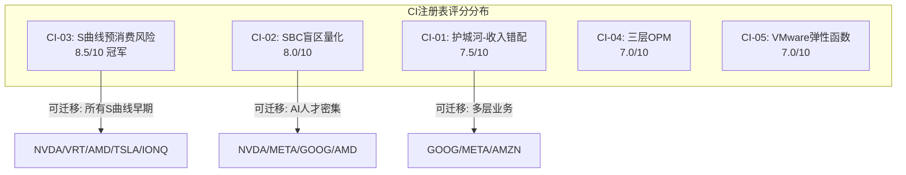

---

## 附录C: 估值方法详解

### 敏感性矩阵: AI CAGR × SBC/Rev × Exit倍数

**矩阵1: AI CAGR × SBC/Rev (Exit 20x Owner FCF固定, FY2030E每股)**

| | AI CAGR 12% | AI CAGR 18% | AI CAGR 25% | AI CAGR 30% |
|---|:---:|:---:|:---:|:---:|
| **SBC 8%** | $143 | $215 | $320 | $398 |
| **SBC 10%** | $118 | **$183** | $275 | $345 |
| **SBC 11%** | $106 | $166 | $250 | $315 |
| **SBC 12%** | $93 | $148 | $225 | $285 |

**矩阵2: Exit倍数 × AI CAGR (SBC 10%固定, FY2030E每股)**

| | AI CAGR 12% | AI CAGR 18% | AI CAGR 25% | AI CAGR 30% |
|---|:---:|:---:|:---:|:---:|
| **Exit 15x** | $71 | $109 | $164 | $206 |
| **Exit 20x** | $118 | $183 | $275 | $345 |
| **Exit 25x** | $165 | $257 | $386 | $484 |
| **Exit 30x** | $212 | $331 | $497 | $623 |

[DM-P5-B-13][DM-P5-B-14]

**市场隐含位置**: Forward Non-GAAP PE 30x + 共识增速隐含AI CAGR 22-25% + SBC约0%(Non-GAAP忽略)。在矩阵中，市场定价位于**右上角之外**——需要AI CAGR >25%且SBC被完全忽略才能支撑$332.77。这是一个需要完美执行的位置。

**"合理"位置**: AI CAGR 18%(Reverse DCF合理值)+SBC 10%(部分正常化)=$183/股，对应-45%下行。如果采用偏差修正后的AI CAGR 20%+SBC 9.5%，约$210-220/股(-33至37%下行)。

### 方法论选择理由

采用四方法加权(Reverse DCF 20%+双层SOTP 25%+概率加权情景 30%+Forward PE 25%)而非单一方法，基于以下逻辑:

1. **Reverse DCF(20%权重)**: 回答"市场在赌什么"而非"值多少钱"。权重偏低因为隐含CAGR对假设极度敏感。
2. **双层SOTP(25%权重)**: AVGO的混合业务(半导体+软件)使SOTP成为最自然的估值框架。六方法中位数CV=7.2%提供了稳健的估值锚。
3. **概率加权情景(30%权重)**: 最高权重因为它最完整地反映了不确定性——Bull/Base/Bear三情景的P&L Build-out+完整折现是最严谨的估值方法。
4. **Forward PE(25%权重)**: 市场最常用的简化估值。权重偏低因为Non-GAAP EPS掩盖了SBC问题。

### 框架版本v18.2参数

- WACC: 9.5%(Ke=10.55%, Kd=3.8%, D/V=15%)
- 税率: 14%(新加坡IP结构正常化)
- D1: 0.76(P4修正后)
- 偏差修正: +8pp(系统性悲观偏差校准)
- SBC双口径: 60% Owner + 40% Non-GAAP权重

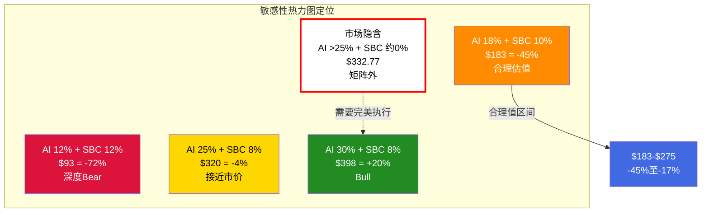

---

## 附录D: 投资温度计

> 投资温度计是10个维度的综合直觉检查工具——在估值模型的精确计算之外，提供一个基于定性判断的"温度感知"。每个维度0-10分，加权平均得出综合温度。

| # | 维度 | 评分 | 理由 | DM锚点 |
|---|------|------|------|--------|
| 1 | **估值吸引力** | 2.5/10 | Owner PE 80.5x处于历史>95百分位；六方法中位数-15.4%；所有估值方法均低于市价 | DM-P2-C1-02, DM-P2-C3-01 |
| 2 | **增长质量** | 7.0/10 | AI ASIC +106%增速惊人，$73B backlog确定性高；但有机增长仅6.4%，VMware +1%拖累 | DM-P1-A11, DM-P4-B06 |
| 3 | **护城河强度** | 6.5/10 | 网络层近垄断(90%)+生态锁定4.0/5；但ASIC衰减不可逆(lambda=0.07)，VMware定价权下降 | DM-P3-A01, DM-P2-B2-02 |
| 4 | **财务健康** | 7.5/10 | FCF margin 42%优秀，ND/EBITDA 1.41x去杠杆世界级；但SBC 11.3%且上升，Owner FCF仅30.2% | DM-P2-C1-04, DM-P2-C2-05 |
| 5 | **管理层质量** | 5.0/10 | Hock Tan能力5/5(eta=1.37)+治理2/5(继任1.5/透明度2.0)=分裂；73岁SPOF | DM-P1-A05, DM-P1-A12 |
| 6 | **催化剂明确** | 4.0/10 | Bull催化剂(VMware恢复、SBC正常化)概率低(5-10%)；Bear催化剂(CapEx放缓、regime转换)概率更高 | DM-P3-D05 |
| 7 | **风险可控** | 3.5/10 | 3个KS距阈值<1pp(KS-04/02/03)；承重墙=AI CapEx(外生不可控)；双零缓冲=无下行支撑位 | DM-P5-B-11, DM-P3-D18 |
| 8 | **聪明钱信号** | 3.0/10 | 29/31 Buy=极度拥挤而非"聪明"；做空仅1%=没有对手盘；机构前10持35%流通盘=不灵活 | DM-P3-D08 |
| 9 | **竞争定位** | 7.0/10 | AI ASIC+网络双寡头，全栈co-design不可拆分；但长期Nash均衡迁移不利 | DM-P1-A01, DM-P3-B-01 |
| 10 | **时机因素** | 3.0/10 | 扩张晚期+历史估值极端；最佳买点在2028H1(CapEx底部+regime转换后) | DM-P3-B01, DM-P5-07 |

**综合温度**: (2.5+7.0+6.5+7.5+5.0+4.0+3.5+3.0+7.0+3.0) / 10 = **4.90/10**

**温度解读**: 4.90/10 = **中性偏冷**。增长质量(7.0)、财务健康(7.5)和竞争定位(7.0)三个维度保持在高温区——这是一家好公司的特征。但估值吸引力(2.5)、风险可控(3.5)、聪明钱信号(3.0)和时机因素(3.0)四个维度均在低温区——这是"好公司但不是好价格"的典型特征。

综合温度4.90/10与评级"审慎关注(偏中性)"完全一致：温度低于5.0(审慎区间)但接近5.0(偏中性)。

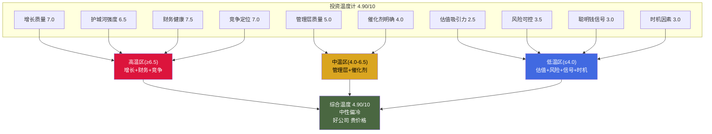

---

## 附录E: 行动清单

### 现有持仓者

1. **逐步减仓至组合权重≤3%**: 从可能的超配5-8%降至标配或低配。分3-4次在关键数据窗口评估(Q2 FY2026财报→FY2026H2→继任窗口→regime转换前)
2. **设定硬止损**: Owner PE突破100x(对应SBC/Rev>14%或FCF margin<28%)即无条件减仓至≤1%
3. **季度监控5指标**: SBC/Rev(红线>12%)、VMware YoY(红线<0%)、ASIC客户数(红线<5)、Hyperscaler CapEx同比(红线<+10%)、Owner PE(红线>100x)
4. **下一个决策点**: Q2 FY2026(2026年6月)——VMware第二个季度有机增长率将确认"+1%是季节性还是新常态"

### 观察名单

1. **设置价格警报**: $245(进入务实安全边际区间)、$207(TS-01触发)、$170(格雷厄姆安全边际)
2. **追踪3个验证窗口**: H-1验证(FY2027Q3)、H-3验证(FY2027Q1 SBC/Rev)、VMware续约率(2027年2月)
3. **在CapEx周期底部出现信号时**(Hyperscaler从"优化"转回"投资")，准备建仓计划——目标买入区间$200-250
4. **替代敞口考量**: MRVL(估值较低的ASIC竞争者)或ANET(网络层直接受益者)可提供AI ASIC主题敞口但估值风险更低

### 不持仓者

1. **当前不行动**: 期望回报-12%不提供买入理由。等待2028H1的时间窗口交汇(CapEx底部+regime转换+估值压缩)
2. **建立监控框架**: 设置13个KS的数据订阅，特别是KS-04(Owner FCF margin)、KS-02(VMware)、KS-03(SBC)三个临界状态
3. **如果突发性机会出现**(Hock Tan健康事件导致-15-20%急跌但基本面无变化)，在$250-280区间建仓1-2%的小仓位(key-man折价可能过度)

### 季度监控清单

每次AVGO财报后24小时内完成：

- [ ] AI半导体收入YoY vs 前季(趋势减速斜率)
- [ ] 软件收入YoY(正→负=KS-02)
- [ ] SBC/Revenue(上升→>12%=KS-03)
- [ ] 流通股数变化(净增=SBC>回购)
- [ ] Backlog变化方向(环比下降>10%=预警)
- [ ] Owner FCF margin计算(报告FCF-SBC)/Revenue
- [ ] 管理层电话会"inference"/"推理"关键词频率
- [ ] 检查是否有继任计划提及

---

## 附录F: 数据来源折叠表

<details>
<summary><strong>财务数据来源</strong></summary>

| 数据类型 | 主要来源 | 辅助来源 | 频率 |
|---------|---------|---------|------|
| 收入/利润/现金流 | FMP API(MCP工具) | SEC EDGAR 10-Q/10-K | 季度 |
| SBC详情 | 10-Q SBC注释 | 年度Proxy薪酬表 | 季度 |
| 资本配置 | FMP balance_sheet + cash_flow | Earnings Call transcript | 季度 |
| 分部收入 | Earnings Presentation | Broadcom IR | 季度 |
| Owner Earnings | 自行计算(报告FCF-SBC) | — | 季度 |

</details>

<details>
<summary><strong>竞争数据来源</strong></summary>

| 数据类型 | 主要来源 | 辅助来源 | 频率 |
|---------|---------|---------|------|
| ASIC份额 | Counterpoint Research | TrendForce, Digitimes | 半年 |
| 交换芯片份额 | EEWorld/Dell'Oro Group | Arista/Cisco财报推算 | 半年 |
| CoWoS产能 | TrendForce | TSMC财报/IR | 季度 |
| Nutanix客户增长 | Nutanix季度财报 | Gartner HCI报告 | 季度 |
| MediaTek ASIC进展 | TrendForce/Digitimes | MediaTek财报 | 半年 |

</details>

<details>
<summary><strong>估值数据来源</strong></summary>

| 数据类型 | 主要来源 | 辅助来源 | 频率 |
|---------|---------|---------|------|
| 共识EPS/收入 | Bloomberg/FactSet | Visible Alpha | 实时 |
| 分析师评级 | Bloomberg(29B/2H/0S) | 各sell-side报告 | 实时 |
| 可比公司估值 | FMP MCP工具 | Bloomberg | 实时 |
| 行业交易倍数 | Mergerstat/PitchBook | Bloomberg M&A | 按需 |
| 隐含增长率 | Reverse DCF(自行计算) | — | 季度更新 |

</details>

<details>
<summary><strong>风险数据来源</strong></summary>

| 数据类型 | 主要来源 | 辅助来源 | 频率 |
|---------|---------|---------|------|
| Hyperscaler CapEx | GOOG/META/MSFT/AMZN财报 | Bloomberg CapEx tracker | 季度 |
| AI CapEx周期定位 | 达里奥债务周期框架 | 历史Cisco 2000类比 | 季度 |
| 利率环境 | FRED(10Y UST) | Bloomberg | 实时 |
| Hock Tan状态 | SEC 8-K/Proxy | 新闻监控 | 实时 |
| 客户集中度 | 10-K披露+分析师推算 | — | 年度 |

</details>

<details>
<summary><strong>行业数据来源</strong></summary>

| 数据类型 | 主要来源 | 辅助来源 | 频率 |
|---------|---------|---------|------|
| AI ASIC TAM | Evercore/Morgan Stanley | Gartner/IDC | 年度 |
| 以太网标准进展 | UEC官方/IEEE | OCP Summit | 年度 |
| S曲线渗透率 | ARK Invest/Counterpoint | 学术文献 | 年度 |
| VMware HCI份额 | Gartner Magic Quadrant | IDC HCI Tracker | 年度 |
| 半导体行业周期 | SEMI(WSTS) | SIA月度数据 | 月度 |

</details>

---

## 免责声明

本报告仅供投资研究和教育目的，不构成任何买入、卖出或持有证券的建议。报告中的所有分析、估值和观点基于公开可得信息和分析师的独立判断，可能包含不完整或不准确的信息。

**关键局限性**:

1. **数据时效性**: 本报告数据截至2026年3月8日。市场条件、公司基本面和竞争格局可能已发生变化。
2. **估值不确定性**: 四方法估值的CV=25.1%(低确定性)，估值范围$147-$285/股。任何单一估值数字都不应被视为精确预测。
3. **假设依赖性**: 核心结论高度依赖Hyperscaler AI CapEx增速(CQ-1/KS-09)这一单一外生变量，该变量的预测极为困难。
4. **SBC口径争议**: Non-GAAP PE(约30x)和Owner PE(80.5x)的2.7倍差距反映了分析框架选择而非确定性事实。不同框架将得出不同结论。

**利益声明**: 分析师及其关联方不持有AVGO股份，不存在利益冲突。

**版权**: 本报告采用框架v18.2。引用或转载需注明来源。

---

*Broadcom Inc. (AVGO) 深度研究报告 | Part VI: 综合裁定与附录 | 2026-03-08*
