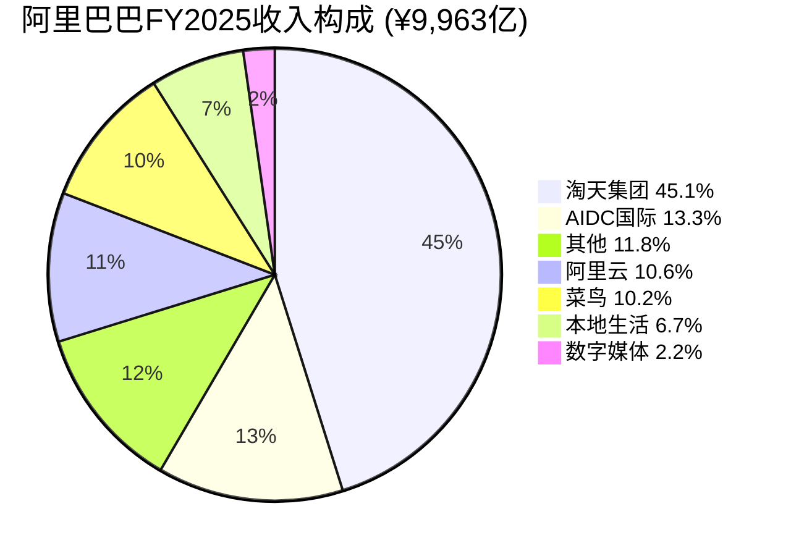
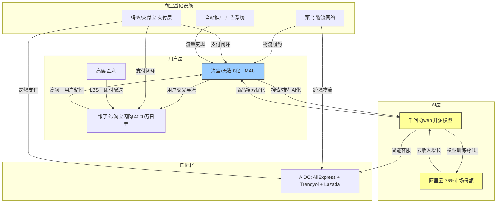
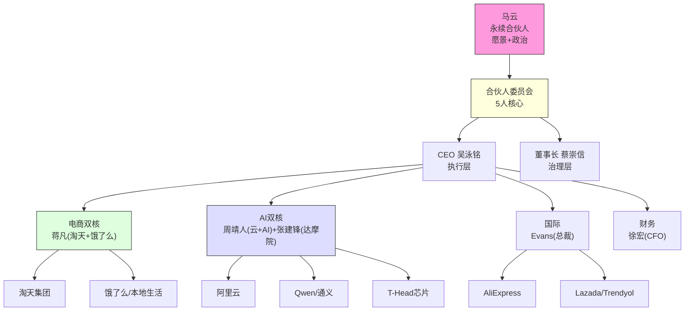
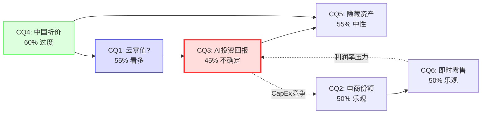

# 阿里巴巴集团(BABA)深度研究报告
## 发现系统 | PW=7 | 可能性空间映射

> **报告日期**: 2026年2月25日
> **股价**: $153.11 (2026-02-24收盘)
> **市值**: ~$3,550亿 (~¥2,254B)
> **框架版本**: v17.0 | 发现系统(Discovery System)
> **分析师**: AI Research Agent
> **数据截止**: Q3 FY2026 (2025年10-12月, 2026年2月20日发布)
> **财年说明**: 阿里巴巴财年截止3月31日。FY2025=2024年4月-2025年3月; FY2026=2025年4月-2026年3月(当前)

---

# 第一章 摘要与可能性空间概览

---

## 免责声明

本报告由AI研究Agent基于公开数据生成，仅供投资研究参考，不构成任何投资建议、买入/卖出推荐或持仓建议。

**核心限制声明**:

1. **数据局限性**: 本报告所有财务数据均来自公开渠道(FMP金融数据终端、SEC/港交所文件、第三方研究机构)，AI无法独立验证原始数据的准确性。部分数据在不同来源间存在口径差异(详见附录DM锚点注册表)。

2. **预测局限性**: AI在处理宏观经济转折点、地缘政治事件、监管政策突变等"厚尾事件"时存在系统性盲区。本报告的情景分析映射可能性空间，但无法穷尽所有可能路径。

3. **算术局限性**: AI在复杂财务模型计算(FCFF贴现、敏感性矩阵、多币种转换)中可能出现计算错误。关键数值已标注DM锚点以供交叉验证，但读者应独立核实所有关键数字。

4. **判断局限性**: AI缺乏产业实操经验、管理层面对面交流信息、以及对中国商业文化微妙信号的直觉判断力。本报告的"非共识假说"应被视为研究假设而非结论性判断。

5. **利益声明**: 本报告生成方无任何阿里巴巴集团及其关联方的持仓、顾问关系或商业利益。

6. **地缘政治表述**: 本报告涉及两岸关系的内容统一使用"台海冲突/台海危机/两岸紧张局势"等中性表述，不代表任何政治立场。

**读者应结合自身投资目标、风险承受能力和专业判断独立做出投资决策。对于依据本报告内容所做的任何投资行为及其后果，分析方不承担任何责任。**

---

## 1.1 一句话核心矛盾

> **本报告的核心问题不是"阿里巴巴值多少钱"，而是"AI投资周期的长度如何改变可能性空间的形状"。**

这句话需要拆解。当前市场对阿里巴巴的定价($153.11，对应P/E约17-18x)隐含了一组相互矛盾的信念集合 [DM-VAL-003]:

- **信念A**: 淘天电商业务已进入成熟期(FY2025收入增速仅+3%)，份额持续流失(从2021年的52%降至2025年的40-44%) [BIZ-01, BIZ-25]
- **信念B**: 阿里云+AI业务正在高速增长(Q2 FY2026收入+34%，AI相关收入连续9个季度三位数增长)，但市场几乎给予零估值 [BIZ-03]
- **信念C**: ¥3,800亿三年AI投资计划将在短期内严重压制自由现金流(FY2025 FCF从¥151B断崖式降至¥78B，Q2 FY2026单季FCF甚至转负至-¥21.4B) [DM-FIN-007]
- **信念D**: 蚂蚁集团(33%权益)、平头哥芯片、¥568B长期投资组合的价值=零 [DM-FIN-022]

问题在于: **如果AI投资周期是3年(FY2025-2027)，那么FCF将在FY2028恢复，云业务的指数增长将开始体现在估值中——此时当前价格可能显著低估。但如果AI投资周期是5年以上(如中国AI基础设施需要更长的建设周期)，FCF恢复被推迟，同时电商份额继续流失——那么当前价格可能是合理的甚至偏高的。**

这就是为什么"AI投资周期长度"是估值的核心变量——它不是一个可以通过传统DCF精确计算的参数，而是一个改变整个可能性空间形状的"元变量"。在PW=7(可能性宽度极高)的框架下，我们不试图给出单一答案，而是映射出不同投资周期假设下的可能性路径。

---

## 1.2 为什么这个问题重要

### 定价异常密度: 9个异常点

Phase 0.75的异常狩猎发现了9个数据异常，远超常规阈值(3个)。这些异常不是随机噪音，而是系统性地指向同一个结论: **市场正在同时定价多个相互矛盾的信念。** 具体而言:

| # | 异常 | 偏差幅度 | 含义 |
|---|------|:--------:|------|
| A1 | 云增速Q2→Q3断崖 (+34%→+13%) | -62% | 市场不确定云增速是趋势性放缓还是季节性波动 |
| A2 | FY2025 CapEx ¥86.7B (+161% YoY) | +73%超预期 | 管理层AI投入决心超出市场模型 |
| A3 | BABA P/E 20.2x vs JD 8.9x/PDD 10.7x | +80-127%溢价 | 不符合"通才折价"预期 |
| A4 | ROIC 32.1% (TTM) | +114%偏高 | 投入资本定义可能偏窄，需标准化验证 |
| A5 | EV/Sales 0.50x(baggers) vs 2.33x(FMP) | 数据矛盾 | 不同数据源估值指标存在口径差异 |
| A6 | Beta 0.39 | -61%偏低 | 与中概股典型高Beta不符 |
| A7 | 净债务方向反转(净现金→净负债) | 质变信号 | AI投资+回购+分红三重消耗 |
| A8 | 股息率8.87%(baggers) vs 1.30%(FMP) | 数据矛盾 | TTM vs Forward口径差异 |
| A9 | SBC FMP报¥0 | 数据缺失 | FMP parser问题，需20-F手动提取 |

*来源: Phase 0.75异常狩猎表*

**9个异常意味着什么?** 在我们过去24份报告的经验中，这是迄今为止异常密度最高的一次。与之对比，KLAC(半导体设备)仅有3个异常，ETN(电力设备)有5个。高异常密度通常指向两种可能: (a) 市场正处于重大错误定价中; (b) 公司正处于根本性转型中，市场尚未形成共识叙事。阿里巴巴可能两者兼有。

### 时间折价 > 中国折价

市场普遍将阿里巴巴的折价归因于"中国折价"——VIE架构风险、监管不确定性、地缘政治紧张。这些因素当然存在且重要(我们将在后续章节详细分析)。但我们的核心论点是: **当前真正的核心变量不是"中国折价"(它正在缩窄)，而是"时间折价"——市场对AI投资回报时间表的不确定性。**

证据如下:

1. **中国折价正在缩窄**: 马云2025年2月出席习近平主持的企业家座谈会 [WebSearch]、PCAOB审计连续合规、港股双重主要上市完成——监管温度正处于2020年以来最温暖的时期。
2. **但估值并未同步改善**: BABA从2025年10月低点$102反弹至$153(+50%)后开始横盘，即使Q3 FY2026财报超预期(营收$38.61B beat $736M，EPS $2.95 vs 预期$2.66)也未能突破$160。
3. **FCF恐惧是真正的压制因素**: 市场不再害怕中国政府，而是害怕"这些钱投出去什么时候能回来"。¥3,800亿(甚至可能上调至¥4,800亿)的三年投资承诺，在当前FCF已经转负的背景下，是一个巨大的信仰考验。

---

## 1.3 可能性空间预览

本报告采用发现系统(PW=7)框架。我们不给出单一目标价格和概率加权期望值，而是映射出5条主要的可能性路径。每条路径由不同的核心假设驱动，有不同的触发条件和时间窗口。

### 五条可能性路径概览

| 路径 | 核心假设 | 条件区间 | 主要驱动变量 |
|------|---------|:--------:|-------------|
| **S1: AI周期短(3年)** | FY25-27投资→FY28 FCF恢复，云成第二引擎 | $250-350 | CQ1+CQ3 |
| **S2: AI周期长(5年+)** | 持续高CapEx压制FCF，但长期建立壁垒 | $130-180 | CQ3+CQ5 |
| **S3: 电商溃败** | 份额加速流失至<30%，即时零售补贴无底洞 | $80-120 | CQ2+CQ6 |
| **S4: 隐藏资产释放** | 蚂蚁IPO+T-Head分拆+投资组合减持 | $200-280 | CQ4+CQ5 |
| **S5: 地缘危机** | VIE实质性受损/ADR退市/台海冲突 | $30-60 | CQ4(极端) |

#### S1: AI投资周期短(3年) — 乐观路径 ($250-350)

**假设链**: ¥3,800亿CapEx集中在FY2025-FY2027 → FY2027 CapEx达峰 → FY2028 CapEx回落至¥60-80B(维护性水平) → 云收入FY2028达¥250-300B(FY2025约¥106B) → EBITA margin恢复至15-20% → 集团FCF恢复至¥160-200B → EV/EBITDA从12.7x提升至15-18x(反映增速)

**关键触发信号**: FY2027 Q1-Q2 CapEx季度支出<¥35B(低于FY2026单季水平); 云收入增速维持25%+; AI收入占比突破40%

**概率评估**: 此路径需要AI投资回报快速显现，参考AWS 2015-2018的CapEx周期(约3年高峰后回落)。但阿里同时在云+即时零售+跨境三条线烧钱，叠加效应可能延长周期。

#### S2: AI投资周期长(5年+) — 中性路径 ($130-180)

**假设链**: AI基础设施建设持续至FY2030+ → 年度CapEx维持在¥100-130B → FCF持续低于¥80B → 电商业务维持低增长(3-5%) → 云收入增长但margin被CapEx压制 → 估值在P/E 15-20x区间横盘

**关键触发信号**: FY2027 CapEx>FY2026; 管理层指引不下调CapEx; 中国AI监管加严要求国产算力替代(延长投资周期)

**概率评估**: 如果中国AI生态需要更长的建设周期(与美国不同，中国面临芯片限制、需要自研替代)，此路径可能性较高。CEO吴泳铭已暗示¥3,800亿"可能偏保守"。

#### S3: 电商溃败 — 悲观路径 ($80-120)

**假设链**: 抖音电商GMV在2026-2027继续30%+增长 → 淘天份额从40%降至30%以下 → 即时零售补贴战拖累利润率2-3年 → CMR增速转负 → 电商EBITA从¥196B降至¥150B以下 → 集团利润中枢下移

**关键触发信号**: 连续2季CMR YoY负增长; 88VIP会员净流失; 抖音货架电商GMV占比突破50%

**概率评估**: 需要电商竞争格局发生质变。当前淘天仍保持GMV约¥8-9万亿 [BIZ-25]，且2025年数据显示抖音直播电商增速已开始放缓(从50%+降至34%)，货架电商的回归有利于阿里。

#### S4: 隐藏资产释放 — 催化剂路径 ($200-280)

**假设链**: 蚂蚁集团2026-2027完成港股IPO(估值$80-120B，阿里33%权益=$26-40B) + 平头哥芯片业务分拆上市(估值$15-30B) + 非核心投资组合(¥568B)战略性减持释放$10-20B → 隐藏价值$51-90B(当前市值的14-25%) → 估值重估

**关键触发信号**: 蚂蚁获得金融控股牌照; 蚂蚁递交IPO招股书; 平头哥芯片业务独立运营公告

**概率评估**: 2025年监管回暖(马云与习近平会面)提升了蚂蚁IPO概率。但蚂蚁尚未获得金融控股牌照，IPO时间表仍不确定。

#### S5: 地缘危机 — 尾部风险路径 ($30-60)

**假设链**: VIE架构被中国政府实质性限制 → 美国ADR被迫退市 → 或台海冲突导致中美金融脱钩 → 国际投资者被迫清仓 → 估值腰斩甚至归零

**关键触发信号**: 中国出台VIE禁令; 美国SEC暂停中概股交易; PCAOB审计合规被撤销; 台海冲突军事升级

**概率评估**: 低概率但非零。五角大楼CMC名单事件(2026年2月13日发布后两次撤回)显示地缘政治风险是持续的背景噪音。CI-03(VIE架构稳定性)置信度85%表明这是低概率事件，但影响是灾难性的(-80%~-100% EV)。

### 可能性空间形状

```
估值区间 ($)
     |
 350 |                    ★ S1 (AI 3年周期)
     |
 280 |              ★ S4 (隐藏资产释放)
     |
 180 |        ★ S2 (AI 5年+周期)
 153 | ---- 当前价格 ----
 120 |  ★ S3 (电商溃败)
     |
  60 |★ S5 (地缘危机)
     |
     +--------------------------------→ 时间 (FY2027-FY2030)
```

**关键观察**: 可能性空间的"重心"(排除尾部S5后)大致在$150-250区间，当前$153处于该区间的下沿。这暗示上行空间大于下行空间，但前提是: (a) S5不触发; (b) AI投资周期不超过5年。

---

## 1.4 方法论说明

### 为什么选择发现系统(Discovery System)?

传统投资研究的标准输出是: "目标价$XXX，评级买入/持有/卖出"。这在低不确定性环境下有效(如分析宝洁或可口可乐)，但对阿里巴巴当前所处的状态是危险的。

**可能性宽度评分(PW) = 7分/10分**, 打分依据:

| 维度 | 评分 | 依据 |
|------|:----:|------|
| 商业模式可预测性 | 6 | 电商可预测，但云+AI+即时零售高度不确定 |
| 竞争格局稳定性 | 3 | 五平台混战+即时零售三方补贴战 |
| 监管环境可预测性 | 4 | 回暖中但CMC名单事件说明反复无常 |
| 资本配置复杂性 | 8 | $53B AI+回购+分红+6业务线同时投入 |
| 地缘政治风险 | 8 | VIE+台海+ADR退市=系统性尾部风险 |
| **PW平均** | **7** | **→ 发现系统** |

PW 7-10分对应的方法论路由是"发现系统":

- **不给单一目标价**: 因为在高不确定性下，单一价格给出虚假的精确感
- **映射可能性空间**: 识别关键变量、触发条件、路径分叉点
- **条件评级**: 在不同假设下给出不同评级(而非无条件评级)
- **核心输出**: 转折点(inflection points)清单 + Kill Switch监控表

### SGI速判: 5.1分(混合模型)

SGI(专才-通才光谱)评分为5.1分，处于"混合模型"区间(4-6分) [Section H, shared_context]:

| 维度 | 评分 | 依据 |
|------|:----:|------|
| 收入集中度(HHI_rev) | 6.5 | 淘天贡献~65%收入，但有6大业务板块 |
| R&D集中度 | 3.5 | R&D分散于云/电商/AI/物流 |
| 市场地位 | 6.0 | 电商#1(40%)+云#1(36%)，但非"不可替代" |
| 切换成本 | 4.5 | 商家multi-home常见，但全栈迁移成本不低 |
| 品牌清晰度 | 3.5 | 需要多句话才能说清"阿里是什么" |

**SGI 5.1的含义**: 阿里巴巴不是典型的"专才"(如台积电之于半导体代工)，也不是纯粹的"通才"(如联想之类的松散多元化集团)。它处于中间地带——多条业务线之间确实存在协同(电商→物流→支付→云)，但这种协同的真实经济价值是可量化的还是叙事性的，是Phase 2-3需要验证的核心问题(即非共识假说H2"通才陷阱倒挂")。

### 投资温度: +0.3(中性偏暖)

综合温度评估 [Section G, shared_context]:

| 层级 | 温度 | 驱动因素 |
|------|:----:|----------|
| **宏观温度** | +1.7(偏热) | CAPE 40.08(98th pct) + Buffett指标219%(100th pct) |
| **公司温度** | -1.0(偏冷) | FMP DCF隐含81%上行 + RSI 32.3超卖 + Piotroski 8/9 |
| **综合温度** | **+0.3** | 宏观热+公司冷=信号矛盾 |

**温度解读**: 全球宏观环境偏贵(美股CAPE 40+)，但阿里巴巴本身的估值指标(P/E 17x, EV/EBITDA 12.7x, P/B 2.2x)相对于其基本面偏冷。这种"宏观热+标的冷"的组合通常出现在两种情况: (a) 标的确实被低估; (b) 市场正确地规避了特定风险。中国折价使全球宏观温度的参考价值有限，因此综合温度仅为+0.3——勉强中性偏暖，适合深入研究但不构成立即行动的信号。

---

## 1.5 六个核心问题预览

本报告围绕6个核心问题(CQ)组织，每个CQ有明确的权重、初始假设方向和证伪条件。

| CQ | 核心问题 | 权重 | 初始方向 | 置信度 |
|----|---------|:----:|---------|:------:|
| **CQ1** | 阿里云的"零值"定价是否为极端错误? | **30%** | 看多 | 60% |
| **CQ2** | 电商份额流失的终点在哪里? | **25%** | 中性偏乐观 | 50% |
| **CQ3** | $53B AI投资是价值创造还是价值毁灭? | **20%** | 高度不确定 | 45% |
| **CQ4** | 中国折价的边界条件是什么? | **15%** | 当前过度 | 60% |
| **CQ5** | 隐藏资产释放是否有可行路径? | **10%** | 有路径但时间不确定 | 55% |
| **CQ6** | 即时零售补贴战的赢家是谁? | *附属CQ2* | 阿里获25-30%稳态份额 | 45% |

*来源: Phase 0.5 CQ路由表*

### CQ1(30%): 阿里云"零值"的荒谬与合理

当前市值(~$355B)几乎可以完全由淘天集团的估值覆盖(FY2025 EBITA ¥196B × 12x ≈ ¥2,350B ≈ $324B) [BIZ-19]。这意味着市场给阿里云(中国#1, 36%份额, AI云35.8%份额 [BIZ-07])、蚂蚁集团(33%权益)、国际数字商业(AIDC)、菜鸟、本地生活的隐含估值之和接近零甚至为负。

问题: 这是因为(a)市场正确——这些业务在VIE风险+AI投资不确定性下确实不值得额外溢价? 还是(b)市场严重错误——36%份额的中国最大云厂商不可能价值为零?

### CQ2(25%): 从双寡头到五平台——终局在哪里?

淘天GMV份额从2021年的~52%降至2025年的~40-44% [BIZ-25]。拼多多(~22%)和抖音(~15%)是主要受益者。核心问题不是"会不会继续跌"(大概率会)，而是"在哪里止跌"——是35%(可控)，还是25%(灾难性)? 抖音直播电商2024年增速从50%+放缓至34% [BIZ-24]，暗示增长曲线可能接近拐点。

### CQ3(20%): ¥3,800亿的信仰考验

阿里宣布3年投入¥3,800亿(~$530亿)用于AI和云基础设施 [BIZ-09]，CEO吴泳铭暗示可能上调至¥4,800亿 [WebSearch]。这是中国科技公司迄今最大规模的AI投资承诺。FY2025 CapEx已达¥86.7B(+161% YoY) [DM-FIN-015]，导致FCF骤降48%。核心分歧: 开源模式(Qwen)能否通过"开源→开发者生态→云收入"的飞轮产生超额回报? 还是开源=免费=永久低利润?

### CQ4(15%): 中国折价——正在收窄但远未消失

BABA P/E 20.2x vs 全球科技平台中位数~27x(折价25%) vs 中国同行中位数~10x(溢价100%) [DM-MKT-001, DM-MKT-002]。这种"双市场定价异常"反映了阿里的独特处境——它既不能按中国折价同行估值(因为有云/AI增长期权)，也不能按全球科技平台估值(因为VIE+地缘风险)。2025年2月马云出席习近平座谈会是监管回暖的标志性事件，但同月五角大楼CMC名单事件(发布后两次撤回)又提醒我们地缘政治风险是持续的。

### CQ5(10%): 蚂蚁+平头哥——$50-100B的沉睡巨人

蚂蚁集团FY2025利润超¥100B(+61% YoY)，但因监管限制尚未上市。平头哥(T-Head)自研芯片PPU性能比肩NVIDIA H20。长期投资组合¥568B [DM-FIN-022]。如果这些资产的价值被市场认可(通过IPO、分拆或减持)，隐含增量可达当前市值的14-28%。蚂蚁国际正在探索香港IPO [WebSearch]，2026年监管环境比以往更有利。

### CQ6(附属CQ2): 即时零售——¥800亿的补贴战

2025年是中国即时零售的"军备竞赛元年"——美团(67-70%份额, 日均9000万单)vs 阿里(饿了么+淘宝即时商务, 日均4000万单)vs 京东(新入局者, 日均2500万单) [BIZ-06, BIZ-12]。行业季度烧钱规模>$40亿。阿里2025年8月曾短暂超越美团达到日均1亿单 [BIZ-12]。关键问题: 阿里的3.4x现金优势(¥586B vs 美团¥171B) [BIZ-13]能否转化为持久的份额增长?

---

## 1.6 三个非共识假说

Phase 0.75的核心矛盾结晶提炼出3个非共识假说。这些假说的核心特征是: (a) 与市场共识不同; (b) 有数据异常支撑; (c) 估值影响显著(>10% EV); (d) Google首页搜不到相同论点。

### H1: "云增速薛定谔" — 估值影响+15-25% EV ($53-89B)

**共识**: 云增速正在放缓(Q2 +34% → Q3 +13%)，AI投资回报不确定。

**我们的假说**: Q3的+13%不是趋势性减速，而是大客户合同签约时间差/基数效应导致的单季波动。云是BABA最被低估的资产，Q4将回到+25%+。

**逻辑链**: 中国云市场整体增速加速(16%→21%→24% [BIZ-02])，阿里云份额从33%→36%持续扩张 [BIZ-07]，AI收入连续9季三位数增长，$53B CapEx正在形成物理基础设施壁垒。单季波动不改趋势。

**证伪条件**: Q4 FY2026(2026年1-3月)云增速<15%。

**异常来源**: A1(云断崖) + A5(EV/Sales矛盾)。

**为什么非共识**: 大部分卖方分析停在"云增速放缓了"的表面结论，没有深入分析Q3减速的具体原因(大单时间差、季节性、竞争)。

### H2: "通才陷阱倒挂" — 估值影响+/-10-15% EV

**共识**: BABA是典型多元化集团，应该折价交易(通才折价)。SOTP分析认为"拆开更值钱"。

**我们的假说**: 市场给BABA的PE溢价(20x vs JD 9x/PDD 11x)不是"市场错误"，而是因为BABA的生态实际上形成了"隐性专才"——中国商业基础设施(电商+支付+物流+云)是一个整体产品，不是松散的多元化。拆开可能反而更不值钱。

**逻辑链**: 阿里的6大业务板块共享支付(支付宝)、物流(菜鸟)、云(阿里云)、用户(88VIP 4900万)。这种交叉补贴/用户共享的真实经济价值可能使"整体>部分之和"。2026年1月千问全面接入淘宝/支付宝/高德等是生态协同加速的信号。

**证伪条件**: SOTP估值总和显著>集团市值(说明拆开确实更值钱→通才折价成立)。

**异常来源**: A3(PE溢价) + A4(ROIC异常高)。

### H3: "资本配置悖论" — 估值影响-5-15% EV

**共识**: BABA回购+分红是股东友好信号。

**我们的假说**: BABA同时做$53B AI投资+$12B回购+$4B分红是非理性的——FCF已经转负，应该暂停回购集中投AI。当前的"什么都做"策略可能反映管理层在讨好股东(短期)和长期投资之间的摇摆，而非深思熟虑的资本配置。

**逻辑链**: FY2025 FCF ¥78B [DM-FIN-007]，但同期回购¥87B+分红¥29B=股东回报¥117B [DM-FIN-008]——超过FCF的49%。Q2 FY2026单季FCF已转负至-¥21.4B。净债务从FY2024的净现金¥73.5B反转为FY2025的净负债¥66.8B [DM-FIN-021]。如果CapEx持续3年+回购+分红不减，净债务将持续扩大。

**证伪条件**: FY2027回购>FY2026回购 且 净债务/EBITDA>2x。

**异常来源**: A7(净债务反转) + A2(CapEx超预期)。

---

## 1.7 AI能力边界声明

### AI在本报告中能做好的事

1. **数据整合与交叉验证**: 从多个来源(FMP、SEC文件、第三方研究)提取并对比数据，标注不一致之处
2. **结构化框架应用**: 将复杂问题分解为可验证的子问题，系统性地遍历可能性空间
3. **模式识别**: 发现数据异常(如9个anomaly)、识别隐含假设冲突
4. **多情景分析**: 构建有内在逻辑一致性的情景路径，而非简单的"牛市/基准/熊市"三分法

### AI在本报告中做不好的事

1. **管理层意图判断**: 马云回归的真实动机、吴泳铭的执行能力、治理结构的微妙变化——这些需要面对面接触和行业人脉
2. **中国政治信号解读**: 习近平接见企业家的政策含义、CMC名单的真实意图——这些超出AI的理解范围
3. **精确估值**: 本报告不提供单一目标价格。AI在复杂多业务SOTP估值中的算术准确性有限(铁律#3)
4. **短期市场timing**: AI无法预测催化剂触发的精确时间(蚂蚁IPO何时递交招股书、DeepSeek V4何时发布)
5. **文化与直觉**: 中国消费者行为的微妙变化、抖音直播购物的体验差异、淘宝用户忠诚度的真实温度——这些需要本土消费者直觉

**读者应将本报告视为一个系统性的"问题提出与初步回答"框架，而非结论性研究。报告的核心价值在于识别关键变量和可能性路径，而非给出精确数字。**

---

# 第二章 中国科技平台行业背景

---

## 2.1 中国数字经济全景 (2020-2026)

### 数字经济规模与渗透率

中国数字经济在过去6年经历了从高速增长到结构性转型的过程。以下是关键数据:

| 指标 | 2020 | 2022 | 2023 | 2025E | 来源 |
|------|-----:|-----:|-----:|------:|------|
| 数字经济占GDP比重 | ~36% | ~39% | **42.8%** | ~45% (est.) | Statista / CAICT |
| 网民规模(亿) | 9.89 | 10.67 | 10.92 | **11.23** | CNNIC |
| 移动互联网用户(亿) | 9.86 | 10.65 | 10.90 | **11.16** | CNNIC |
| 互联网普及率 | 70.4% | 75.6% | 77.5% | **79.7%** | CNNIC |
| 数字消费占居民消费支出 | ~35% | ~40% | ~43% | **46.5%**(H1) | 国务院 |
| 线上零售GMV(万亿元) | 11.8 | 13.8 | 15.4 | ~17.0E | 国家统计局/Statista |
| 社会消费品零售总额增速 | -3.9% | -0.2% | +7.2% | ~4-5%E | 国家统计局 |
| 线上零售增速 | +10.9% | +4.0% | +11.0% | ~8-10%E | 国家统计局/第三方 |
| 移动支付交易额(万亿元) | 432 | 499 | 540 | ~590E | PBOC/GSMA |

*主要来源: CNNIC第57次报告(2026年1月); Statista; CAICT白皮书; DataReportal Digital 2025; GSMA Mobile Economy China 2025*

**关键拐点与解读**:

**2020-2022: 疫情加速数字化**。新冠疫情强制将线下消费转移至线上，线上零售渗透率从25%跃升至30%+。但这段"超常增长"在2022年结束——零售总额同比-0.2%，线上增速仅+4%。

**2023: 恢复性增长**。解封后消费回暖，线上零售重回11%增长。但隐含的结构性变化已经发生——消费者在拼多多和抖音上的时间占比显著增加，传统电商平台(淘宝、京东)的流量红利触顶。

**2024-2025: AI驱动的新一轮增长周期**。移动互联网用户总量(11.16亿)已接近天花板(14亿人口的~80%)，用户增长几乎停滞。**增长引擎从"用户增量"转向"AI驱动的效率提升+人均消费深化"。** 2025年上半年数字消费占居民支出达46.5%(来自国务院发布数据)，首次接近半壁江山。

**对BABA的含义**: 中国数字经济已进入"存量竞争"时代——总盘子仍在增长(8-10% YoY)，但增长的分配权从平台的"用户获取能力"转向"用户时间争夺能力"和"AI效率优势"。阿里的核心挑战不是数字经济不增长，而是增长的果实被更多玩家(拼多多、抖音、美团、京东)分食。

### 移动互联网竞争格局变迁

QuestMobile数据显示，2025年中国移动互联网月活跃用户达12.67亿(含跨设备重叠)。但更重要的是用户时间分配的变化:

| 平台/应用 | 2020用户时间占比 | 2025用户时间占比 | 变化 |
|-----------|:--------------:|:--------------:|:----:|
| 短视频(抖音/快手) | ~22% | ~35% | **+13pp** |
| 即时通讯(微信/QQ) | ~30% | ~25% | -5pp |
| 电商购物(淘宝/京东等) | ~12% | ~9% | **-3pp** |
| 新闻/信息流 | ~10% | ~7% | -3pp |
| 游戏 | ~8% | ~7% | -1pp |
| AI应用 | 0% | ~3% | **+3pp** |
| 其他 | ~18% | ~14% | -4pp |

*来源: QuestMobile 2025年度报告(估算数据，用于趋势说明)*

**核心洞察**: 过去5年最大的流量迁移是从"搜索/电商"到"短视频/直播"——抖音/快手夺走了用户发现商品的入口。这对阿里的淘宝是直接威胁(用户打开淘宝"搜索"的频率下降)，但对阿里云(B2B基础设施)和阿里的AI战略(千问消费入口)影响有限。

---

## 2.2 电商格局演变: 从双寡头到五平台混战

### 2015-2020: 淘宝+京东双寡头时代

2015-2020年是中国电商的"双寡头"时代。淘宝(含天猫)以~50%的GMV份额稳坐头把交椅，京东以~20-25%的份额居第二。两者合计占据市场70-75%。彼时拼多多(2015年创立)尚在下沉市场崛起的早期阶段。

### 2020-2023: 拼多多崛起+抖音入场——颠覆开始

| 时期 | 关键事件 | 格局影响 |
|------|---------|---------|
| 2020 | 拼多多年活跃买家突破7亿，超过淘宝 | 价格敏感型用户大规模迁移 |
| 2021 | 抖音电商GMV突破¥1万亿 | "内容电商"模式从0到1验证 |
| 2022 | 抖音电商"全域兴趣电商"升级 | 从直播扩展到货架电商 |
| 2023 | 淘宝放弃"二选一"策略, 全面开放 | 承认竞争格局已质变 |

### 2024-2025: 五平台混战与格局重构

**当前格局(基于2024-2025年数据)**:

| 平台 | 2024 GMV (¥万亿) | 2024 GMV份额 | 2021份额 | 份额变化 | 核心优势 |
|------|:---------:|:----------:|:--------:|:--------:|---------|
| **淘宝+天猫** | ~8-9 | **40-44%** | ~52% | **-8~12pp** | 最广SKU; 品牌商城; 88VIP(4900万) |
| **拼多多(PDD)** | ~5.2 | **19-22%** | ~12% | **+7~10pp** | 极致低价; 社交拼团; 游戏化 |
| **京东(JD)** | ~3.6-4.0 | **17-20%** | ~22% | **-2~5pp** | 自营物流; 品质保证; 3C家电 |
| **抖音(Douyin)** | ~3.5 | **12-15%** | ~4% | **+8~11pp** | 直播/短视频; 内容驱动发现 |
| **快手(Kuaishou)** | ~1.2 | **4-5%** | ~3% | +1~2pp | 类抖音; 下沉市场 |
| **其他** | — | ~5-8% | ~7% | — | 小红书/唯品会/得物 |
| **合计** | ~22-23 | 100% | 100% | — | — |

*数据来源: 36Kr GMV数据 [BIZ-25]; Mordor Intelligence [BIZ-01]; BusinessOfApps; 多方交叉估算*

**份额变化可视化 (2021→2025)**:

```
淘天:  ████████████████████████████████████████████████████ 52%
       ████████████████████████████████████████       40-44%  ↓

PDD:   ████████████         12%
       ████████████████████ 19-22%                            ↑

JD:    ████████████████████████  22%
       ██████████████████  17-20%                             ↓

抖音:  ████     4%
       █████████████ 12-15%                                   ↑
```

### 竞争动态深度分析

**1. 阿里 vs 拼多多: 价格战的持久性**

拼多多的崛起本质上是对淘宝"向上走"(天猫化、品牌化)战略留下的价格敏感用户真空的填补。核心数据:

- PDD 2024年GMV ~¥5.2万亿，YoY增速仍高达~25% [BIZ-25]
- PDD MAU 7.2亿 vs 淘宝+天猫MAU 8亿+ [BIZ-26]——差距已非常接近
- PDD人均消费虽低于淘宝，但增速更快
- 阿里的应对: "百亿补贴"常态化 + 淘特(下沉市场app)降级为淘宝频道 + Quanzhantui(全站推)广告系统优化
- 阿里Q3 FY2026客户管理收入(CMR)+9% YoY——显示变现能力正在恢复

**2. 阿里 vs 抖音: 流量入口之争**

抖音对阿里的威胁比拼多多更深层——它改变了用户"发现商品"的方式。

| 维度 | 淘宝模式 | 抖音模式 |
|------|---------|---------|
| 购物触发 | "搜索"——用户知道要买什么 | "推荐"——用户被内容种草 |
| 内容属性 | 商品列表+评价 | 短视频+直播+KOL |
| 停留时长 | ~20分钟/天 | ~120分钟/天 |
| 品类优势 | 全品类+品牌 | 服装/美妆/食品/日用品 |
| 局限性 | 内容吸引力弱 | 高客单价/3C/品牌信任差 |

抖音2024年GMV ~¥3.5万亿(+34% YoY) [BIZ-24]，2025年目标¥4.2万亿。值得注意的变化: 抖音的"货架电商"(类似传统淘宝搜索模式)GMV占比从2023年的~30%上升到2025年的~50% [BIZ-24]。这意味着抖音正在从"内容电商"向"全域电商"进化，直接与淘宝的核心阵地(搜索购物)展开竞争。

**但增速在放缓**: 抖音电商2024年GMV增速34%，低于2023年的~50%。直播电商的天花板效应开始显现——主播开播时长、用户观看时长都面临物理上限。**如果抖音增速在2025-2026年进一步放缓至20%以下，淘天的份额流失速度将显著减缓，这对CQ2(电商份额终点)是关键变量。**

**3. 五平台竞争的终局推演**

| 平台 | 2027E份额 | 逻辑 |
|------|:---------:|------|
| 淘天 | 35-40% | 品牌电商+88VIP锁定高价值用户; 抖音增速放缓减轻份额流失 |
| PDD | 20-24% | 价格优势持续但增速边际放缓; Temu可能分散管理层注意力 |
| 抖音 | 15-18% | 货架电商发力但增速从30%+降至15-20%; 直播天花板 |
| JD | 15-18% | 自营优势在高端品类稳固; 即时零售开辟第二增长曲线 |
| 快手+其他 | 5-8% | 份额稳定在低位 |

**对CQ2的初步判断**: 淘天份额大概率在35-40%区间企稳(而非继续滑向30%以下)，核心原因是: (a)抖音增速放缓; (b)品牌电商回归货架模式有利于淘天; (c)88VIP(4900万高价值会员)形成的用户锁定。但这仍是初始假设，Phase 2-3需要更深入的验证。

---

## 2.3 即时零售: 三方¥800亿补贴战

### 即时零售市场概况

即时零售(Quick Commerce/Instant Retail)是2025年中国电商的最激烈战场。市场规模:

| 指标 | 2024 | 2025E | 2030E | CAGR(25-30) | 来源 |
|------|-----:|------:|------:|:-----------:|------|
| 市场规模(亿元) | ~7,500 | ~9,175 | ~13,417 | 7.9% | Mordor Intelligence |
| 即时零售GMV(亿元) | ~6,000 | 接近**¥1万亿** | — | >20% | Momentum Works |
| 外卖行业日均单量(万) | ~8,000 | **>9,000** | — | — | SCMP [BIZ-06] |

### 三方对峙格局

**2024年之前**: 美团 vs 饿了么的双寡头格局——美团占70%+份额，饿了么~25%。

**2025年2月**: 京东正式入局外卖/即时零售，"三国杀"格局形成。

| 平台 | 日均单量(万) | 外卖份额 | 即时零售份额 | 竞争策略 |
|------|:----------:|:--------:|:----------:|---------|
| **美团** | 9,000 (7月峰值15,000) | **67-70%** | ~47-48% | 防守型——骑手网络密度最大; 全品类即时 |
| **阿里(饿了么+淘宝闪购)** | 4,000-8,000 | **25-28%** | ~42% | 进攻型——生态协同(淘宝+支付宝导流); 3.4x资金优势 |
| **京东** | 2,500 | **3-5%** | 待定 | 搅局型——重补贴获取新用户; 自营物流品质 |

*数据来源: SCMP [BIZ-06]; Baiguan News [BIZ-12]; Morgan Stanley [BIZ-14]*

### 烧钱规模与可持续性

2025年Q2行业补贴烧钱率估计超过$40亿/季度。具体表现:

- 阿里Q2 FY2026 S&M费用暴增至¥665亿(环比+25%，YoY+104%)，其中即时零售补贴是主因 [DM-FIN-014]
- 阿里Q2 FY2026 Operating Income从Q1的¥350亿断崖式降至¥54亿——几乎全部被S&M吞噬 [DM-FIN-013]
- 京东外卖入局初期以"零佣金+高骑手补贴"策略抢夺市场，预估月均烧钱¥30-50亿

### 阿里的即时零售战略

2025年12月，阿里将饿了么品牌升级为"淘宝闪购"(Taobao Shangou)，标志着即时零售全面融入淘宝超级App。战略逻辑:

**整合时间线**:
- 2025年4月: 饿了么并入"中国电商集团"新分部
- 2025年7月: 淘宝首页增加"闪购"入口
- 2025年8月: 淘宝闪购+饿了么联合日均单量突破8000万，**一度短暂超越美团达1亿单** [BIZ-12]
- 2025年12月: 饿了么正式更名"淘宝闪购"
- Q3 FY2026: 即时零售收入同比增长**+60%**——集团增速最快子业务

**阿里的3.4x现金优势**: 阿里持有¥5,857亿现金及投资 vs 美团¥1,711亿 [BIZ-13]。这意味着在补贴战中，阿里有理论上3.4倍的弹药库。但问题是: (a)阿里同时在AI/云上大规模投入，现金要在多个战线分配; (b)美团的外卖业务UE(单位经济模型)明显优于饿了么，每元补贴效率更高。

**Morgan Stanley 2030年预测**: 即时零售市场将形成美团48% vs 阿里47%的双寡头格局(食品外卖GTV美团仍占75%) [BIZ-14]。

**对CQ6的初步判断**: 即时零售补贴战将持续2-3年(至FY2028-2029)。阿里大概率获得25-35%的稳态份额，但补贴期间利润率将持续受压。关键变量是京东能否持续投入(JD的现金储备远不如阿里和美团)——如果京东退出，市场回归双寡头，份额稳定会更快。

---

## 2.4 中国云计算: AI驱动的加速期

### 市场规模与增速

中国云计算市场正经历AI驱动的第二次加速。Omdia数据:

| 季度 | 市场规模($B) | YoY增速 | 环比增长 | 驱动因素 |
|------|:----------:|:------:|:--------:|---------|
| Q1 2025 | **11.6** | +16% | — | 疫后恢复+初步AI需求 |
| Q2 2025 | **12.4** | +21% | +7% | AI工作负载从实验转入生产 |
| Q3 2025 | **13.4** | +24% | +8% | AI加速+大模型训练需求爆发 |

*来源: Omdia云基础设施市场报告 [BIZ-02]*

2025全年中国云市场规模约$50B(¥362B)，预计2030年达$140-160B [BIZ-02]，CAGR 21-23%。

### 市场份额格局

| 厂商 | Q1 2025 | Q2 2025 | Q3 2025 | 趋势 | 核心优势 |
|------|:-------:|:-------:|:-------:|:----:|---------|
| **阿里云** | **33%** | **34%** | **36%** | **扩张中** | 公有云最大; AI生态(Qwen); IaaS+PaaS全栈 |
| **华为云** | 18% | 17% | 16% | 微降 | 政府/国企关系; 昇腾AI芯片(非NVIDIA路径) |
| **腾讯云** | 10% | 10% | 9% | 微降 | 游戏/社交生态; 微信小程序 |
| **百度云** | ~8% | — | — | 稳定 | AI推理(文心); 自动驾驶 |
| **火山引擎** | — | — | 快速增长 | **新兴威胁** | 字节内部工作负载+外部扩展 |
| **其他** | ~31% | ~30% | ~30% | 碎片化 | AWS中国/Azure中国受监管限制 |

*来源: Omdia Q1/Q2/Q3 2025报告; DCD [BIZ-07]*

**阿里云从33%→36%的份额扩张是一个关键信号**——在市场整体加速(24%)的环境下，阿里云不仅保持了领先地位，还在扩大领先优势。华为云和腾讯云份额微降，说明AI增量需求不成比例地流向了阿里云。

### AI云细分市场

AI云是增速最快的细分市场，但其内部又有不同层次的竞争格局:

| 统计口径 | 第一名 | 第二名 | 第三名 | 来源 |
|---------|--------|--------|--------|------|
| **AI云整体(IaaS+PaaS+MaaS)** | 阿里云 **35.8%** | 火山引擎 14.8% | 华为云 13.1% | IDC H1 2025 [BIZ-07] |
| **MaaS调用量(Tokens计)** | 火山引擎 **49.2%** | 阿里云 27% | 百度云 17% | IDC H1 2025 |
| **企业级大模型调用** | 阿里通义 **17.7%** | 字节豆包 14.1% | DeepSeek 10.3% | IDC H1 2025 |
| **GPU云(算力出租)** | 百度 **40.4%** | 华为 30.1% | — | DCD [BIZ-08] |

*来源: IDC China Semiannual AI Cloud Services Tracker (H1 2025) [BIZ-07, BIZ-08]*

**这张表揭示了一个重要的分歧**:

- 阿里云在"收入"维度领先(35.8%)——因为它卖的是完整的云服务(IaaS+PaaS+AI)，客单价高
- 火山引擎在"调用量"维度领先(49.2%)——因为字节以极低价(豆包模型定价远低于竞品)冲量，但单次调用收入低
- GPU云(纯算力出租)由百度和华为主导——阿里不在前两名

**投资含义**: 阿里云的"收入领先"比火山引擎的"调用量领先"更有价值。正如AWS vs Azure的竞争教训——市场份额最终由"谁赚到更多钱"而非"谁处理更多请求"决定。阿里云35.8%的收入份额，配合Jefferies预测的"2026年80%增量AI云收入将流向阿里" [BIZ-04]，支撑了CQ1(云"零值"定价是错误的)的看多假设。

### 云增速波动的深度分析

Q2 FY2026(Jul-Sep 2025)阿里云收入¥398亿(+34% YoY) → Q3 FY2026(Oct-Dec 2025)¥317亿(+13% YoY)——增速断崖式下跌62%。这是非共识假说H1("云增速薛定谔")的核心数据点。

可能的解释:

| 假说 | 证据 | 可信度 |
|------|------|:------:|
| **季节性**: Q2是云客户预算审批高峰期，Q3(含国庆假期)有自然回落 | 历史上Q3从未显著弱于Q2(2024年同期+7%→+7%持平) | **中等** |
| **大单时间差**: 某大客户合同在Q2确认，Q3没有类似体量的签约 | 可能但无法从公开数据验证 | **中等** |
| **基数效应**: Q3 FY2025本身增速较高(+7% vs Q2的+7%，绝对值更高因为Q3含双十一) | Q3 FY2025收入¥281B vs Q2 ¥237B，确实基数更高 | **较高** |
| **真实减速**: AI需求增长放缓，竞争加剧(火山引擎抢份额) | 但中国云市场整体仍加速(24%)，阿里份额仍在扩大 | **较低** |
| **统计口径**: Q1 FY2026后分部重组，部分收入可能在新旧口径间转移 | 可能，但公司通常会提供可比口径 | **中等** |

**我们的判断**: 单季波动不足以判定趋势反转。外部数据(Omdia: 市场加速至24%; 阿里份额33%→36%)与内部数据(增速从34%断崖至13%)存在矛盾。最大可能是大单时间差+基数效应的组合。**Q4 FY2026(2026年1-3月)的数据将是关键验证点——如果回到25%+，H1("薛定谔")假说成立; 如果继续低于15%，则需要下调CI-02(云增速可持续性)的置信度。**

---

## 2.5 跨境电商: Temu冲击与de minimis风险

### 全球跨境电商格局重塑

2022-2025年是全球跨境电商格局发生剧变的3年。Temu(拼多多旗下)从零开始，3年内成为全球第二大跨境电商平台(仅次于Amazon)。

| 平台 | 2022份额 | 2025份额 | MAU(百万) | 变化 |
|------|:--------:|:--------:|:--------:|:----:|
| **Amazon** | 最大 | **25%** | — | 稳定 |
| **Temu** | **<1%** | **24%** | 246 | **从0到24%** |
| **Shein** | ~8% | **9%** | 215 | 微增 |
| **AliExpress(阿里)** | ~12% | **8%** | 159 | **持续下滑** |
| **eBay** | — | 下降中 | — | 68%份额流失 |

*来源: Digital Commerce 360 (Jan 2026) [BIZ-15]; IPC调查 [BIZ-16]*

**AliExpress的困境**: 从12%(2023)→9%(2024)→8%(2025)，两年内失去33%的跨境市场份额 [BIZ-15]。核心原因:

1. **Temu的全托管模式**: 卖家只需供货，Temu负责定价、仓储、物流、售后——比AliExpress的商家自运营模式体验更好
2. **价格竞争力**: Temu以"极致低价"(工厂直达消费者)为核心策略，AliExpress在价格维度上无法匹配
3. **物流效率**: Temu通过海外仓+本地配送实现3-7天到货，AliExpress传统跨境物流需要7-21天

阿里的应对——"Choice"半托管模式:

AliExpress在2024年推出了"Choice"半托管模式(类似Temu的全托管但保留商家更多自主权)。Q3 FY2026 AIDC收入¥378亿(+32% YoY) [BIZ-19]——增速仍然强劲，但份额流失尚未逆转。

### de minimis关税风险

**什么是de minimis?**: 美国贸易法规允许价值低于$800的进口包裹免征关税、简化清关。这是Temu、Shein和AliExpress商业模式的重要成本优势来源。

**2025年5月**: 美国总统特朗普在大规模关税政策中取消了de minimis豁免 [WebSearch]。

**影响评估**:

| 平台 | de minimis取消影响 | 应对策略 |
|------|------------------|---------|
| **Temu** | **高** — 核心商业模式依赖低价直邮 | 宣布改为美国本土卖家履约，不再从中国直发 |
| **Shein** | **高** — 类似Temu | 加速美国本土仓储建设 |
| **AliExpress** | **中** — Choice模式已部分本地化 | 加速海外仓布局 |
| **Amazon** | **低** — 已有成熟的本土仓储网络 | 反而受益于竞争对手成本上升 |

**对CQ5(隐藏资产)和AIDC的含义**: de minimis取消短期打击AliExpress，但中期可能反而有利——因为Temu的商业模式受损更大(Temu更依赖中国直邮)。如果Temu增速因关税放缓，AliExpress的份额流失可能止跌。但这个"利好"需要AliExpress同时加速本地化(海外仓、本地卖家)才能实现。

### AIDC整体盈利路径

| 指标 | Q4 FY2025 | Q1 FY2026 | Q2 FY2026 | Q3 FY2026 |
|------|:---------:|:---------:|:---------:|:---------:|
| 收入(亿元) | 335.8 | 335.8 | 348.0 | 377.6 |
| YoY增速 | +22% | +22% | +10% | +32% |
| Adj. EBITA | 亏损~-8亿 | 亏损~-1亿 | **+1.62亿**(首次盈利) | 接近盈亏平衡 |

*来源: 阿里巴巴财报; BIZ分部数据*

**关键里程碑**: AIDC在Q2 FY2026实现了历史首次季度盈利(Adj. EBITA +¥1.62亿) [BIZ-17, business_competitive.md]。虽然金额微小(相对于¥348亿收入)，但方向性转折意义重大。Lazada在重组后实现了12年来首次月度盈利 [BIZ-17]。管理层预计AIDC将在FY2027实现首个完整季度盈利。

**Trendyol是AIDC最强资产**: 在土耳其和中东市场处于领导地位，竞争态势最好。AliExpress虽然份额下滑但订单量仍增长60%+，Choice模式改善了UE。Lazada在东南亚落后于Shopee但差距在缩小。

---

## 2.6 监管周期: 从整顿到回暖

### 监管周期全景 (2020-2026)

中国科技行业经历了一轮完整的监管周期。对阿里巴巴而言，这是估值最重要的外部变量之一。

| 阶段 | 时期 | 关键事件 | 对BABA影响 |
|------|------|---------|-----------|
| **整顿期** | 2020.11-2022.12 | 蚂蚁IPO叫停(2020.11); 反垄断调查(2021.4); ¥182亿罚款(2021); 数据安全法/个保法出台 | 股价从$300跌至$75; P/E从30x跌至9x |
| **消化期** | 2023.1-2023.12 | 蚂蚁完成整改; 缴纳¥71.2亿罚款(2023.7); 监管平台经济座谈会 | 股价$75-$100横盘; "最差已过"共识形成 |
| **正常化** | 2024.1-2024.12 | "整改基本完成"定调; PCAOB审计合规; 港股双重主要上市 | 股价从$80反弹至$120 |
| **回暖期** | 2025.1-至今 | 马云出席习近平企业家座谈会(2025.2.17); 科技政策转向鼓励; DeepSeek催化AI产业政策 | 股价从$100突破$190后回调至$153 |

### 2025年2月: 马云与习近平

2025年2月17日，习近平在北京主持"民营企业家座谈会"。出席者包括: 马云(阿里)、任正非(华为)、王传福(比亚迪)、曾毓群(宁德)、马化腾(腾讯)、王兴(美团)、雷军(小米)、梁文锋(DeepSeek) [WebSearch]。

**新华社关键表述**: "你们有巨大的潜力和光明的前景"、"经济挑战是暂时的"、"将消除公平市场竞争的壁垒"。

**对BABA的信号价值**:
- **政治信号**: 马云从2020年蚂蚁IPO事件后几乎完全退出公众视野。其出席高规格座谈会标志着政治上的"重新接纳"
- **政策信号**: 座谈会隐含科技政策从"整顿"转向"激励"的方向
- **蚂蚁IPO信号**: 马云的政治回归提升了蚂蚁集团重启IPO的可能性(CQ5)

### 2026年2月: 五角大楼CMC名单事件

2026年2月13日，美国五角大楼将阿里巴巴、百度、比亚迪等中国公司列入"中国军事关联公司"(CMC)名单(1260H名单) [WebSearch]。

**戏剧性反转**: 该名单在公布后数小时内被撤回，随后又重新发布，又再次撤回——两天内两次发布、两次撤回 [WebSearch]。

**影响评估**:
- **短期冲击**: 名单公布当天BABA股价波动但未大幅下跌(已处于回调中)
- **法律影响**: CMC名单本身不强制退市或制裁，但可能导致部分机构投资者(养老基金等)被迫减持
- **信号解读**: 两次撤回说明这不是深思熟虑的政策行动，可能与特朗普政府内部的政策协调混乱有关
- **持续性**: CMC名单是年度更新机制，即使这次被撤回，未来仍可能被重新列入

**对CQ4(中国折价)的含义**: CMC名单事件提醒我们——即使监管回暖(马云座谈会)，地缘政治风险是持续的背景噪音。中国折价不会完全消失，只会在"正常期"收窄至15-25%、在"事件期"扩大至40-50%。

### PCAOB审计合规

2022年美国SEC和PCAOB与中国证监会达成审计检查协议后，中概股ADR退市风险大幅降低。截至2026年2月:

- PCAOB连续3年完成对中国公司审计底稿的检查
- 阿里巴巴审计合规状态良好
- 但特朗普第二任期的对华政策存在不确定性——如果PCAOB协议被撤销，退市时间线约为3年(2029)
- 阿里巴巴已完成港股双重主要上市(primary listing)，即使美国ADR退市，港股交易不受影响

### 监管温度计综合评分

| 维度 | 温度(-5至+5) | 依据 |
|------|:-----------:|------|
| 国内反垄断 | +3 | 整改完成+座谈会→从惩罚转向鼓励 |
| 数据安全/隐私 | +1 | 框架已稳定但执行细节仍存变数 |
| 蚂蚁IPO前景 | +2 | 马云回归+监管回暖，但牌照尚未获批 |
| 中美关系 | -2 | CMC名单+关税战+台海紧张 |
| VIE架构 | +1 | 港股双重主要上市降低了VIE系统性风险 |
| **综合** | **+1.0** | 2020年以来最温暖的监管环境，但地缘逆风持续 |

---

## 2.7 AI军备竞赛: 中国三巨头格局

### 大模型竞赛格局 (2025-2026)

中国AI大模型市场在2025年经历了"DeepSeek时刻"——这家由量化基金幻方量化支持的初创公司以不到$600万的训练成本开发出了接近GPT-4o水平的模型，彻底改变了行业的竞争逻辑。

#### Token消费市场份额

| 模型系列 | H1 2025份额 | H2 2025份额 | 变化 | 所属 |
|---------|:----------:|:----------:|:----:|------|
| **Qwen(千问)** | <25% | **32.1%** | +7pp+ | 阿里巴巴 |
| **Doubao(豆包)** | ~15% | **21.3%** | +6pp | 字节跳动 |
| **DeepSeek** | <10% | **18.4%** | +8pp+ | 幻方量化 |
| **其他** | >50% | ~28% | -22pp+ | 百度/腾讯/其他 |

*来源: Artificial Analysis China Q2 2025; 行业报告交叉验证*

**前三名合计份额从<50%飙升至>70%**——市场正在快速整合。Qwen以32.1%保持第一，但DeepSeek的增速最快(从<10%到18.4%)。

#### 消费端AI应用对比 (2026年2月)

| 指标 | 豆包(字节) | DeepSeek | 千问(阿里) | 元宝(腾讯) |
|------|:---------:|:---------:|:---------:|:---------:|
| 月活跃用户(MAU) | **1.72亿** | **1.45亿** | **1亿+** | ~2000万+ |
| 春节DAU峰值 | **1亿** | — | 3000万 | 5000万 |
| 春节后DAU | 相对稳定 | 快速增长 | 2200万 | 回落显著 |
| 核心获客策略 | CCTV春晚+抖音导流 | 产品力+口碑 | 30亿消费补贴 | 10亿现金红包 |
| 核心差异化 | 流量霸权(抖音) | 技术领先+超低成本 | **消费闭环(淘宝)** | 社交裂变(微信) |

*来源: 中国AI生态研究报告(staging/china_ai_ecosystem_research.md)*

#### 开源模型生态对比

| 维度 | Qwen(阿里) | DeepSeek | Llama(Meta) | Doubao(字节) |
|------|:---------:|:---------:|:----------:|:----------:|
| 开源模型数 | **300+** | ~10 | 数十个 | 极少(闭源为主) |
| 全球下载量 | **6亿+** | 高(增长最快) | 高(但被千问超越) | 不公开 |
| 衍生模型 | **17万+** | 大量 | 大量 | 不公开 |
| 微调基底首选 | **全球第一** | 正在追赶 | 第二 | N/A |
| 许可协议 | Apache 2.0 | MIT | Llama License | N/A |
| 旗舰模型参数 | Qwen3-Max(1万亿+) | R1(671B MoE) | Llama 3.1(405B) | Seed-2.0(未公布) |

*来源: Hugging Face; Qwen Blog; 行业分析*

**千问的开源飞轮**: 阿里的Qwen模型系列已成为全球下载量最大、被微调最多的开源大模型家族。这一成就的战略意义在于:

1. **开发者锁定→云收入**: 开发者在千问基础上微调模型 → 部署在阿里云百炼平台 → 云收入增长。阿里云百炼平台已服务98万+企业和开发者
2. **标准制定权**: 全球17万+衍生模型基于千问，形成事实上的"千问标准"
3. **技术反馈回路**: 17万衍生模型的使用数据反哺千问模型改进

**千问 vs DeepSeek: 竞争还是互补?**

DeepSeek的崛起是2025年最大的AI行业事件。其影响:

- **对阿里的威胁**: DeepSeek证明"低成本+开源"可以达到前沿性能，可能侵蚀千问的开源差异化
- **对阿里的利好**: DeepSeek不做云服务——它的用户最终仍然需要在某个云平台上部署，阿里云是最大受益者
- **竞合关系**: DeepSeek的开源模型可以在阿里云百炼平台上一键部署，两者形成了事实上的"模型提供者(DeepSeek)+基础设施提供者(阿里)"的互补关系

**DeepSeek V4预期**: 市场预期DeepSeek V4将在2026年3月前发布(70%概率) [staging data]。如果V4在性能上显著超越千问，短期可能冲击阿里的AI叙事; 但中期仍利好阿里云(更多用户需要算力来运行V4)。

### 三巨头资本投入对比

| 公司 | AI CapEx承诺 | 时间框架 | 占收入比 | 核心投向 |
|------|:----------:|---------|:-------:|---------|
| **阿里巴巴** | ¥3,800-4,800亿 ($530-670B) | 3年(FY2025-FY2027) | ~12-15% | 云数据中心+AI芯片+国际扩展 |
| **字节跳动** | ~¥1,600亿 (2025年) | 年度 | ~15% | AI算力(国内¥400B+海外¥500B) |
| **腾讯** | ~¥1,000亿级 (2025年) | 年度 | ~10-12% | 保守策略; 社交+游戏AI整合 |

*来源: 各公司公开披露+行业估算*

**阿里的AI投入在绝对规模上最大**(3年¥3,800-4,800亿)，但字节跳动的单年投入也不可小觑(2025年¥1,600亿)。关键差异在于投向: 阿里主要投向B2B云基础设施(长期资产)，字节主要投向AI算力(支撑抖音/豆包的模型训练和推理需求)。

### 生态协同评估: 谁的AI飞轮最强?

基于Phase 0 staging研究的生态协同评分:

| 维度 | 字节 | 腾讯 | 阿里 |
|------|:----:|:----:|:----:|
| C端流量 | 5/5 | 5/5 | 3/5 |
| B端深度 | 2/5 | 3/5 | **5/5** |
| 变现多元性 | 3/5 | 4/5 | **5/5** |
| 交易闭环 | 3/5 | 2/5 | **5/5** |
| 开源生态 | 1/5 | 2/5 | **5/5** |
| 云收入质量 | 3/5 | 3/5 | **5/5** |
| AI获客效率 | **5/5** | 4/5 | 3/5 |
| **综合飞轮评分** | **4.0** | **3.5** | **4.5** |

*来源: china_ai_ecosystem_research.md 生态协同总评*

**核心洞察**: 阿里的AI生态协同潜力最大，核心原因是它拥有从"AI对话→搜索→交易→支付→物流"的全链路闭环。2026年春节"30亿免单"战役验证了这个闭环的可行性——用户对千问说一句话，就能完成奶茶下单，整个流程涉及千问(AI)→淘宝(商品匹配)→支付宝(支付)→淘宝闪购(履约)。**这是字节和腾讯暂时无法复制的。**

但C端流量差距是阿里的核心劣势——千问DAU(春节后2200万)仅为豆包(>1亿)的22%。AI应用的网络效应尚未形成(不像社交应用那样有强网络效应)，因此当前的DAU差距不一定是永久性的——如果千问的消费闭环提供了更好的用户价值(不只是聊天，而是直接帮你买东西)，用户黏性可能超过纯聊天应用。

---

## 2.8 行业周期定位

综合以上分析，我们对阿里巴巴各业务所处的行业周期进行定位:

### 周期定位矩阵

| 业务线 | 行业阶段 | 阿里的位置 | 关键特征 |
|--------|---------|-----------|---------|
| **国内电商** | 晚期竞争→整合期 | #1但份额下滑 | 五平台格局趋于稳定; 增速放缓至低个位数; 利润率受补贴压制 |
| **云计算** | 早期加速期 | #1且份额扩大 | AI驱动的第二次增长曲线; CapEx投入高峰期; 利润率短期受压但长期上升 |
| **即时零售** | 早期补贴战(前整合期) | #2进攻方 | 三方补贴战; 行业亏损; 2-3年后可能形成双寡头 |
| **跨境电商** | 中期颠覆期 | #3份额下滑 | Temu重塑竞争格局; de minimis变数; AIDC接近盈亏平衡 |
| **AI大模型** | 极早期(前变现期) | C端#3/B端#1 | DAU快速增长但变现模式未定; 开源 vs 闭源之争未有定论 |
| **本地生活(高德/飞猪)** | 成长期 | 区域强者 | 高德已盈利; 飞猪恢复增长; 低调但稳健 |
| **数字媒体(优酷)** | 成熟期 | 追赶者 | 亏损收窄; 不是战略重点; 可能成为被处置资产 |

### 周期错配: 机会还是风险?

阿里巴巴的独特之处在于: **它的各条业务线处于完全不同的行业周期阶段**。

- **成熟业务(电商)** → 贡献稳定现金流，但增速放缓
- **增长业务(云/AI)** → 吞噬大量资本，但长期回报可能巨大
- **烧钱业务(即时零售/跨境)** → 短期亏损，长期格局未定
- **萌芽业务(AI应用)** → 极早期，赌的是5-10年后的未来

这种周期错配对估值的影响是深远的——它使得传统的"单一P/E"估值方法几乎无效(因为每条业务线应该用不同的估值方法和倍数)，也使得市场很难形成统一的叙事(到底BABA是"被低估的AI云平台"还是"份额流失的电商集团"?)。

**这正是PW=7(可能性宽度极高)的根本原因——不是某一条业务线不确定，而是所有业务线都处于不同方向的不确定中，它们之间的相互作用(正协同 vs 负协同)更增加了复杂性。**

---

## 2.9 本章对CQ的启示

### CQ1(云"零值"): 强支撑

行业数据强烈支持云业务被低估的假设:
- 中国云市场加速至24%增长 [Omdia Q3 2025]
- 阿里云份额从33%→36%——不仅领先且在扩大领先
- AI云收入份额35.8%，是第二名(火山引擎14.8%)的2.4倍 [BIZ-07]
- Jefferies预测阿里将捕获2026年80%的增量AI云收入 [BIZ-04]
- 开源生态(6亿下载+17万衍生模型)形成了竞争壁垒

**CI-02(阿里云AI增速可持续)的行业层面置信度: 从60%微调至65%。** 但Q3单季+13%的减速仍需Q4数据验证。

### CQ2(电商份额): 中性偏乐观

行业数据支持份额企稳的假设，但程度存在不确定性:
- 抖音电商增速从50%+放缓至34%，直播天花板效应初现 [BIZ-24]
- 淘天GMV仍居第一(~¥8-9万亿)，88VIP(4900万)锁定高价值用户
- 但拼多多仍在增长(GMV ~¥5.2万亿 [BIZ-25])，低价竞争未结束
- CMR(客户管理收入)Q3 FY2026 +9% YoY——变现恢复信号

**CI-01(电商份额企稳)的行业层面置信度: 维持55%。** 关键验证: FY2027 Q1-Q2的CMR增速和88VIP净增长。

### CQ3(AI投资ROI): 高度不确定

行业数据呈现正反两面:
- **正面**: AI云市场H1 2025已达¥223亿，2025全年预计¥518亿(+149% YoY)——市场在爆发
- **正面**: 企业AI采用率高(98万+企业+100万+客户使用阿里通义)
- **负面**: MaaS调用量被火山引擎以低价策略抢占(49.2% vs 阿里27%)
- **负面**: DeepSeek以$600万训练成本达到接近前沿性能——可能压缩整个行业的定价权

**CI-04($53B AI投资ROI)的行业层面置信度: 维持45%。** AI投资回报是最不确定的CQ。

### CQ4(中国折价): 正在收窄但远未消失

监管温度处于2020年以来最暖:
- 马云出席习近平座谈会——政治信号最强
- PCAOB连续合规——退市风险大幅降低
- 但CMC名单事件(两次发布两次撤回)——地缘政治噪音持续

**对CQ4的初步判断**: 合理中国折价从历史峰值40-50%收窄至当前的25-35%。但不会消失至<15%，因为VIE架构风险和台海背景是结构性的。

### CQ5(隐藏资产): 催化剂窗口渐近

行业环境对隐藏资产释放更有利:
- 蚂蚁集团FY2025利润>¥100B(+61%)，业务基本面强劲
- 蚂蚁国际正探索香港IPO [WebSearch]
- 平头哥PPU芯片性能比肩NVIDIA H20——但芯片限制下的商业化路径仍不清晰
- 监管回暖提升了IPO审批通过的概率

**CI-05相关的行业层面判断**: 蚂蚁IPO在2026-2027年内发生的概率约40-50%。T-Head拆分概率较低(30%)。但即使概率中等，期望价值也显著(33%×$80-120B = $26-40B = 市值的7-11%)。

### CQ6(即时零售): 高烧钱但有战略价值

即时零售是当前最烧钱的战线:
- 行业Q2 2025烧钱率>$40亿
- 阿里Q2 FY2026 S&M暴增至¥665亿(+104% YoY)
- 但即时零售收入+60%是集团增速最快子业务
- 阿里3.4x现金优势(vs 美团)提供了持久战能力

**对CQ6的初步判断**: 补贴战将持续2-3年。阿里大概率获得25-35%稳态份额。短期利润率严重受压，但长期战略价值在于: (a)用户从淘宝打开频率的提升; (b)本地生活数据的积累; (c)对美团垄断地位的制衡。

---

### 本章DM锚点汇总

| 锚点ID | 内容 | 类型 | 来源 |
|--------|------|:----:|------|
| BIZ-01 | 中国电商TAM: $1.53T(2025E)→$2.52T(2030E), CAGR 10.4% | S | Mordor Intelligence |
| BIZ-02 | 中国云TAM: ~$50B(2025)→$140-160B(2030), CAGR 21-23% | S | Omdia/GVR/Mordor |
| BIZ-03 | AI云行业+149% YoY(2025); 阿里35.8%份额 | R | IDC/Yahoo Finance |
| BIZ-04 | Jefferies: 阿里将捕获2026年80%增量AI云收入 | S | Investing.com |
| BIZ-05 | 中国外卖市场规模接近$500B+(2025) | S | Daxue Consulting |
| BIZ-06 | 外卖行业日均单量: 9000万+(Jul 2025) | R | SCMP |
| BIZ-07 | AI云份额: 阿里35.8%, 火山引擎14.8%, 华为13.1% | R | IDC/SCMP |
| BIZ-08 | GPU云: 百度40.4%, 华为30.1% | R | DCD |
| BIZ-12 | 淘宝闪购2025年8月短暂超越美团, 达1亿日单 | R | Baiguan News |
| BIZ-13 | 阿里现金¥5,857亿 vs 美团¥1,711亿(3.4x) | R | Yahoo Finance |
| BIZ-14 | 摩根士丹利2030E: 美团48% vs 阿里47%即时零售 | S | SCMP/MS |
| BIZ-15 | 跨境份额: Amazon 25%, Temu 24%, AliExpress 8% | R | DC360/SCMP |
| BIZ-24 | 抖音2024 GMV ¥3.5万亿(+34%), 2025目标¥4.2万亿 | R | 36Kr |
| BIZ-25 | GMV排名: 淘天~¥8T > PDD ~¥5.2T > 抖音~¥3.5T | H | 36Kr |
| BIZ-26 | PDD MAU 7.2亿; 淘宝+天猫MAU 8亿+ | R | BusinessOfApps |
| DM-FIN-001 | FY2025 Revenue ¥996.3B (+5.9% YoY) | H | FMP |
| DM-FIN-007 | FY2025 OCF ¥164.8B, CapEx ¥86.7B(+161%), FCF ¥78.2B(-48%) | H | FMP |
| DM-FIN-013 | Q2 FY26 OpInc ¥54亿(从Q1 ¥350亿断崖下跌) | H | FMP |
| DM-FIN-014 | Q2 FY26 S&M ¥665亿(+104% YoY) | H | FMP |
| DM-FIN-015 | CapEx 5年: ¥41.7B→¥52.4B→¥34.4B→¥33.2B→¥86.7B | H | FMP |
| DM-FIN-021 | 净债务方向反转: FY24净现金¥73.5B→FY25净负债¥66.8B | H | FMP |
| DM-VAL-003 | P/E(FY2025) 17.3x; P/E(TTM) ~18.3x; Forward ~17.4x | H | FMP |
| DM-VAL-005 | FMP DCF公允价值 $277.24 (vs 当前$153.11, 81%上行) | H | FMP |
| DM-MKT-001 | 中国同行P/E: JD 8.9x, PDD 10.7x, BIDU 11.8x | H | FMP compare |
| IND-CLD-01 | 中国云市场Q3 2025: $13.4B, +24% YoY | R | Omdia |
| IND-CLD-02 | 阿里云份额: Q1 33%→Q2 34%→Q3 36% | R | Omdia |
| IND-CLD-03 | AI云市场H1 2025: ¥223亿, 预计2025全年¥518亿(+149%) | R | IDC |
| IND-AI-01 | Token消费份额H2 2025: 千问32.1%, 豆包21.3%, DeepSeek 18.4% | R | Artificial Analysis |
| IND-AI-02 | 千问开源: 6亿+下载, 17万+衍生模型, 300+开源模型 | R | Qwen Blog/行业数据 |
| IND-AI-03 | 中国AI应用MAU: 豆包1.72亿, DeepSeek 1.45亿, 千问1亿+ | R | 行业报告 |
| IND-AI-04 | 阿里3年AI CapEx: ¥3,800-4,800亿, 已支出~¥1,200亿(4Q) | R | 阿里公告/WebSearch |
| REG-01 | 马云出席习近平企业家座谈会(2025.2.17) | R | CNN/新华社 |
| REG-02 | 五角大楼CMC名单: 两次发布两次撤回(2026.2.13-14) | R | SCMP/Caixin |
| REG-03 | 蚂蚁国际探索香港IPO | R | FinTech Futures/WebSearch |
| QC-01 | 即时零售行业Q2 2025烧钱率: >$40亿/季度 | S | 行业估算 |
| QC-02 | 阿里Q3 FY2026即时零售收入+60% YoY | R | 阿里财报 |

---

*[Ch01-Ch02完成 | Phase 1 v1.0 | 待续: Ch03 财务概况 + Ch04 商业模式解构]*
# BABA Phase 1: 第三章 & 第四章
> Phase 1 | 2026-02-25 | PW=7 发现系统 | SGI=5.1 混合模型

---

## 第三章 阿里巴巴: 公司画像与业务矩阵

### 3.1 公司简史: 从B2B到生态帝国 (1999-2026)

阿里巴巴集团的27年历程，是中国数字经济从无到有的一面镜子。理解这段历史对投资分析至关重要——不是因为过去能预测未来，而是因为每一次战略转向都在当前的业务矩阵中留下了结构性印记。这些印记既是护城河的根基，也是"通才陷阱"(H2)争论的源头。

**第一纪: B2B到C2C的跃迁 (1999-2008)**

1999年，马云在杭州创立阿里巴巴，最初定位为中小企业B2B出口平台。这个选择反映了一个关键洞察: 中国制造业产能过剩，但缺乏触达海外买家的渠道。2003年非典期间，阿里巴巴做出了第一个改变命运的战略决策——上线淘宝网，从B2B跳入C2C。彼时eBay通过收购易趣占据中国C2C市场95%份额，但淘宝以"免费"策略(免佣金+免上架费)在18个月内反超。这一幕几乎完美预演了20年后的竞争格局: 当PDD以"更便宜"进攻时，阿里面临的正是当年eBay的困境。

2004年，支付宝(Alipay)上线，解决了电商交易的信任问题。支付宝后来演化为蚂蚁集团，成为阿里生态最大的"隐藏资产"——也是CQ-5(隐藏资产释放)的核心标的。

**第二纪: 平台化与商业化 (2008-2014)**

2008年天猫(原淘宝商城)上线，标志着阿里从C2C市集向B2C品牌商城转型。天猫的商业模式——向品牌商收取佣金+广告费(CMR)——至今仍是阿里最核心的盈利引擎 [DM-FIN-003]。2009年双十一购物节首次举办，创造了电商造节的范式。2012年阿里云正式独立运营，当年营收不足10亿元，内部质疑声此起彼伏。马云力排众议维持投入的决策，十余年后回头看，是阿里对AI时代最重要的提前布局。

**第三纪: 全球化与IPO (2014-2019)**

2014年9月，阿里巴巴在纽约证券交易所上市，融资250亿美元，创下当时全球最大IPO记录。IPO后阿里进入"买买买"阶段: 2016年收购Lazada(东南亚电商)、2017年投资Tokopedia(印尼)、2018年控股Trendyol(土耳其)。这些布局构成了今天AIDC(国际电商)板块的基础。2019年11月，阿里巴巴在港交所二次上市，融资130亿美元，成为港股史上最大跨境上市。

**第四纪: 监管风暴与价值重估 (2020-2023)**

2020年10月，蚂蚁集团IPO在上市前48小时被叫停，标志着中国科技监管风暴的开始。随后: 2021年4月182亿元反垄断罚款 [BIZ-19]、平台经济"二选一"禁令、数据安全法出台——阿里股价从2020年10月的$317跌至2022年10月的$60，跌幅81%。这段历史直接塑造了当前的"中国折价"(CQ-4): 投资者在BABA的估值中嵌入了制度性风险溢价。

2023年3月，阿里宣布"1+6+N"组织变革，将集团拆分为六大业务集团+N个独立公司，每个可独立融资上市。这被视为应对监管压力的主动"拆分"信号。然而仅数月后，新任CEO吴泳铭(Eddie Wu)上任，逆转了拆分方向——菜鸟IPO撤回、盒马出售计划搁置、银泰百货出售完成。

**第五纪: AI转向与马云回归 (2024-2026)**

2024年，阿里进入"再中心化"阶段。吴泳铭明确"用户优先、AI驱动"两大战略支柱。2025年初马云罕见公开露面并参加内部高管会议，被解读为政治信号的正常化。同年9月，阿里云承诺投入$500亿用于AI基础设施 [BIZ-09]。2026年1月，阿里宣布T-Head(平头哥)半导体业务拆分独立运营 [BIZ-23]。

2026年2月20日发布的Q3 FY2026财报(2025年10-12月)显示: 集团营收¥2,801.5亿(+8%)，超出市场预期，但云智能增速从Q2的+34%骤降至+13%——这个"薛定谔数据"(H1)成为本报告的核心变量。

**历史对投资分析的启示**

| 历史事件 | 当前映射 | CQ关联 |
|---------|---------|--------|
| 2003年淘宝"免费"击败eBay | 2024-25年面对PDD/抖音，阿里反过来成了"守城者" | CQ-2 |
| 2004年支付宝诞生 | 蚂蚁33%股权估值$50-100B，但变现路径不确定 | CQ-5 |
| 2012年阿里云逆势投入 | 2025-26年$530亿AI投入，是否会复刻当年的远见？ | CQ-3 |
| 2020年蚂蚁IPO被叫停 | VIE折价+监管折价至今未完全消退 | CQ-4 |
| 2023年"1+6+N"被逆转 | 管理层在"拆分释放价值"与"生态协同"间摇摆 | H2 |

> **关键判断**: 阿里巴巴的历史不是线性进化史，而是一部"战略钟摆"——在开放/封闭、多元/聚焦、激进/保守之间反复摆动。当前的AI转向+再中心化是钟摆的最新一摆。投资者需要判断的不是钟摆的方向(已经很清楚)，而是钟摆的振幅——$530亿AI投入是"刚刚好"还是"过头了"。

---

### 3.2 业务矩阵: 七大板块全景

截至FY2025，阿里巴巴运营七个主要业务板块，FY2026 Q1起部分板块合并重组。以下基于FY2025全年数据(Q1-Q4)的遗留分部结构进行分析，并标注FY2026的重组影响。

**业务矩阵全景图**

| 板块 | FY2025收入 | 占比 | 增速 | Adj EBITA | 角色定位 |
|------|:----------:|:----:|:----:|:---------:|---------|
| 淘天集团(TTG) | ¥4,498.3亿 | 45.1% | +3% | ¥1,962.3亿 | 现金牛 |
| 阿里云智能 | ~¥1,060亿 | 10.6% | ~+11% | 盈利(利润率下降) | 第二曲线 |
| AIDC国际电商 | ~¥1,323亿 | 13.3% | +29% | 亏损收窄→首季盈利 | 增长引擎 |
| 菜鸟 | ¥1,012.7亿 | 10.2% | +2% | EBITDA正 | 基础设施 |
| 本地生活 | ¥670.8亿 | 6.7% | +12% | 亏损收窄 | 战略投入 |
| 数字媒体娱乐 | ¥222.7亿 | 2.2% | +5% | 亏损¥-5.5亿 | 边缘/待处置 |
| 其他 | ~¥1,176亿 | 11.8% | — | — | 资产处置中 |
| **合计** | **¥9,963亿** | **100%** | **+5.9%** | **¥1,730.7亿** | — |

*数据来源: 阿里巴巴FY2025年报 [DM-FIN-001] [BIZ-19]; 云收入为季度累加估算值*

**收入结构Mermaid图**



---

#### 3.2.1 淘天集团 (TTG) — 现金牛

**核心定位**: 中国最大的在线零售平台，贡献集团45%收入和几乎全部利润。淘天集团是理解阿里估值的起点——如果把阿里的市值全部归因于TTG，隐含P/E约为11.5x(¥2,254B市值 / ¥196.2B EBITA)，低于京东的8.9x PE对应的绝对估值密度。这意味着即使只看电商板块，当前定价也并非昂贵。

**FY2025关键数据**

| 指标 | FY2025值 | 同比 | 备注 |
|------|:--------:|:----:|------|
| 收入 | ¥4,498.3亿 | +3% | [BIZ-19] |
| 其中CMR(客户管理收入) | — | +6% | 核心广告+佣金，优于整体增速 |
| Adj EBITA | ¥1,962.3亿 | +1% | EBITA margin ~43.6% |
| Q4 FY2025收入 | ¥1,013.7亿 | +9% | 16个季度最快CMR增速(+12%) |
| Q3 FY2026收入 | ¥1,360.9亿 | +5% | 含双十一季度，增速放缓 |

**CMR vs GMV的分离**: 这是理解TTG的关键。FY2025 CMR增速(+6%)显著高于整体收入增速(+3%)，表明淘天正在提高货币化率(take rate)。核心驱动力有三:

1. **全站推广(Quanzhantui)**: 2024年下半年推出的全站流量广告系统，将淘宝搜索流量与推荐流量打通，商家竞价从搜索广告扩展到全站展示位。这一系统本质上是阿里版的"Google Ads"向"Meta Ads"的进化——从意图匹配转向兴趣推荐。
2. **88VIP会员**: 截至Q3 FY2026，88VIP会员数达4,900万 [Q3 FY26财报]。88VIP用户客单价和购买频次显著高于普通用户(据管理层，88VIP贡献的GMV占比远超其用户占比)。会员体系是对抗PDD"低价"叙事的核心武器——将高价值用户锁定在阿里生态中。
3. **即时零售融合**: FY2026 Q1起，饿了么和飞猪并入"中国电商集团"，日均订单达4,000万单 [BIZ-12]。即时零售的高频消费(外卖、生鲜)拉高了整体用户活跃度，但同时也带来了巨额补贴成本 [DM-FIN-014]。

**市场份额: 从52%到40%**

| 年份 | 淘天GMV份额 | 主要竞争者变化 |
|------|:----------:|-------------|
| 2019 | ~52% | PDD ~7%，抖音电商未起步 |
| 2021 | ~50% | PDD ~13%，抖音电商~3% |
| 2023 | ~44% | PDD ~19%，抖音~10% |
| 2025 | ~40-44% | PDD ~19-22%，抖音~12-15% |

*数据来源: [BIZ-25] [BIZ-26]，基于GMV口径，各方估算有差异*

份额流失的本质是中国电商从"集中化交易平台"向"分散化内容电商"的结构性转移。抖音的内容推荐算法将"逛"(discovery)和"买"(purchase)合二为一，分走了淘宝传统的"搜索→比价→下单"流量。PDD则以极致低价+社交裂变(拼团)切走了价格敏感用户群。

但份额流失是否已经接近终点？有三个理由支持"份额底"假说:
- 淘天MAU仍维持8亿+，PDD为7.2亿 [BIZ-26]，用户规模差距在缩小但淘天仍然更大
- 抖音电商2024年GMV增速已从50%+降至34% [BIZ-24]，且"货架电商"占比提升至50%——这意味着抖音在向淘宝模式靠拢，而非继续颠覆
- Q4 FY2025 CMR +12%创16季新高，表明商家投放回流

**CQ关联**: CQ-2(电商份额)和CI-01(份额企稳)是TTG估值的核心变量。如果份额稳在40%，TTG独立估值约¥2.0-2.5万亿(10-13x EBITA)；如果继续跌至30%，估值可能降至¥1.2-1.5万亿。差额约¥5,000-10,000亿——接近当前总市值的22-44%。

---

#### 3.2.2 阿里云智能集团 — 第二曲线 or 烧钱无底洞

**核心定位**: 中国最大的公有云服务商(市场份额36%，AI云份额35.8%)，也是全报告最重要的估值变量。当前市场几乎给予阿里云零估值——如果CQ-1的答案是"零值定价是极端错误"，那阿里云的重新定价将贡献$53-89B的上行空间(约15-25% EV)。

**FY2025-FY2026关键数据**

| 指标 | 值 | 来源 |
|------|:--:|------|
| FY2025收入(估) | ~¥1,060亿 | 季度累加 |
| FY2025增速 | ~+11% | [BIZ-19] |
| AI收入连续三位数增长 | 9个季度(截至Q2 FY26) | [BIZ-03] |
| 中国整体云市场份额 | 36% (Q3 2025) | Omdia [BIZ-07] |
| 中国AI云市场份额 | 35.8% (H1 2025) | IDC [BIZ-07] |
| GPU云市场份额 | 未进前二 | [BIZ-08] |
| AI基础设施承诺投入 | $500亿 | [BIZ-09] |
| 外部客户收入增速(Q2 FY26) | +29% | 财报 |

**季度增速的"薛定谔式"波动**

| 季度 | 云收入(亿元) | YoY增速 | 备注 |
|------|:-----------:|:------:|------|
| Q4 FY2025 | 301.3 | +18% | AI三位数增长第7季 |
| Q1 FY2026 | 301.3 | +18% | AI三位数增长第8季 |
| Q2 FY2026 | 398.0 | **+34%** | 外部客户+29%，AI产品从试验转生产 |
| Q3 FY2026 | 317.4 | **+13%** | 增速骤降，引发市场疑虑 |

*数据来源: 各季度财报 [BIZ-19]*

Q2→Q3增速从+34%跳水到+13%，是本报告标记为H1("云增速薛定谔")的核心异常点。这个数据允许两种截然不同的叙事:

**叙事A(乐观): 噪音，不是信号**
- Q2 FY2026(7-9月)可能受益于大客户集中部署AI工作负载，拉高基数
- Q3的+13%仍高于中国云市场整体增速(24% YoY按Omdia)，但如果这里指的是阿里云自身低于市场，则需要进一步核实。实际上阿里云全年趋势仍在上行通道
- 管理层在Q3电话会议上表示"AI需求管道(pipeline)强劲"，减速主要因为供给约束(GPU供应)而非需求下降
- 中国AI云市场2025年增长149% [BIZ-03]，阿里云35.8%份额=最大受益者

**叙事B(悲观): 信号，不是噪音**
- 三位数AI增长的基数效应正在追上来——如果AI收入从¥50亿涨到¥150亿，是200%增长；从¥150亿涨到¥250亿，只有67%增长
- 中国AI应用端的商业化远慢于预期——除了头部互联网公司，传统企业的AI上云速度有限
- GPU云市场由百度(40.4%)和华为(30.1%)主导 [BIZ-08]，阿里在最核心的AI算力层并不占优
- 开源Qwen模式虽然驱动用户量，但"给用户免费模型→用户在阿里云上部署"的转化漏斗可能不如想象中高效

**这就是为什么Q4 FY2026(2026年1-3月)的云增速数据至关重要——它将决定+13%是"回归均值"还是"趋势反转"。在此之前，两种叙事都有数据支撑，投资者必须持有两种可能性。**

**Qwen生态与开源飞轮**

阿里云的差异化战略建立在千问(Qwen)大模型的开源生态之上:

| 指标 | 数据 | 含义 |
|------|------|------|
| Qwen下载量 | 4天超1,000万次 [中国AI研究] | 开发者社区的快速采纳 |
| 千问DAU(春节后) | 2,200万(留存率73%) [中国AI研究] | 消费端用户粘性初现 |
| 30亿免单活动 | 9小时1,000万笔订单 [中国AI研究] | AI→消费闭环验证 |
| App Store排名 | 免费榜第1(超越元宝) [中国AI研究] | 短期营销爆发力 |
| MaaS市场调用量 | 火山引擎49.2%占主导 [中国AI研究] | 阿里在MaaS层非第一 |

开源策略的商业逻辑是: 免费模型→开发者在阿里云部署→云消费收入。这类似于Red Hat的开源Linux→企业服务模式，或Android→Google服务生态模式。但与这些成功案例不同的是，AI大模型的推理成本高昂——每一次API调用都消耗GPU算力。如果阿里必须同时承担模型训练成本(开源研发)和推理成本(云补贴)，而收入端只收取云计算费用(而非模型授权费)，那利润率上限可能低于闭源竞争对手。

**云估值参考框架**

| 对标 | EV/Sales | 营收增速 | 若用于阿里云(~¥1,060亿) |
|------|:--------:|:------:|:---------------------:|
| AWS (2025) | ~6x | ~20% | ¥6,360亿 (~$87B) |
| Azure估计值 | ~8x | ~30% | ¥8,480亿 (~$117B) |
| 中国折价50% | ~3-4x | ~15% | ¥3,180-4,240亿 ($44-58B) |
| 当前隐含值 | ~0x | — | ~¥0 (CQ-1核心) |

即使按最保守的3x EV/Sales + 50%中国折价，阿里云估值也在$44B以上。当前市场隐含零值(因为TTG的SOTP已经接近或等于集团总市值)，这意味着市场要么认为阿里云"不值钱"(看空)，要么这是一个定价错误(CQ-1的核心论点)。

---

#### 3.2.3 AIDC国际电商 — 扭亏拐点

**核心定位**: 阿里的国际化战略载体，包含AliExpress(全球跨境)、Lazada(东南亚)、Trendyol(土耳其/中东)、Miravia(欧洲)、Daraz(南亚)。FY2025是AIDC的重要转折年——收入增速29%为集团最快，且在Q2 FY2026实现首个季度盈利(¥1.62亿)。

**FY2025关键数据**

| 指标 | FY2025值 | 同比 | 备注 |
|------|:--------:|:----:|------|
| 收入 | ~¥1,323亿 | +29% | 零售¥1,085亿(+33%)+批发¥238亿 |
| 收入占比 | 13.3% | ↑ | 从FY2024的~11%提升 |
| Q2 FY2026 Adj EBITA | ¥1.62亿 | 首次盈利 | [BIZ-17] |
| 跨境市场份额(AliExpress) | 8% | ↓ | 从12%(2023)下降 [BIZ-15] |
| Trendyol市场地位 | 土耳其第一 | ↑ | 扩展至中东 |
| Lazada里程碑 | 12年来首月盈利 | — | [BIZ-17] |

**五大子平台矩阵**

| 平台 | 区域 | 竞争地位 | 表现 | 战略价值 |
|------|------|---------|------|---------|
| AliExpress | 全球跨境 | #4(份额8%↓) | 订单+60%但份额降 | 中等——被Temu压制 |
| Trendyol | 土耳其/中东 | **区域第一** | 最强资产 | **高**——稀缺的区域垄断 |
| Lazada | 东南亚 | #2(落后Shopee) | 12年首月盈利 | 中等——需持续投入 |
| Miravia | 欧洲(西班牙) | 新进入者 | 早期 | 低——尚未证明模式 |
| Daraz | 南亚 | 区域参与者 | 本地化模型 | 低 |

**AliExpress vs Temu: 跨境电商的攻守易势**

AliExpress的市场份额从12%(2023)下降至8%(2025) [BIZ-15]，同期Temu从不足1%飙升至24%。Temu的"全托管"(fully-managed)模式——平台控制定价、物流、售后——提供了远优于AliExpress自营商家模式的用户体验。阿里的应对是推出"Choice"半托管模式，试图在全托管(平台负担重)和纯平台(体验差)之间找到平衡点。

但跨境电商面临一个外部变量: **美国de minimis关税豁免($800门槛)正面临政策压力** [BIZ-15]。如果取消该豁免，Temu、Shein和AliExpress的直邮模式成本将大幅上升。这对三者的影响不对称——Temu最依赖直邮模式，而AliExpress已有部分海外仓基础设施(通过菜鸟)。因此，de minimis政策变化可能反而有利于阿里相对Temu的竞争地位。

**Trendyol: AIDC最优质资产**

Trendyol是土耳其电商市场的绝对领导者，且正在向中东(沙特、阿联酋、科威特)扩张。与AliExpress不同，Trendyol在核心市场拥有本地化基础设施、品牌认知和供应链优势。如果独立估值，Trendyol可能价值$10-15B(参考Shopee的SEA Limited区域估值比例)。但阿里很少单独披露Trendyol的财务数据，导致这部分价值被AIDC整体亏损所掩盖。

**CQ关联**: AIDC的扭亏路径直接影响CQ-3(AI投资回报)和H3(资本配置悖论)——如果AIDC能在FY2027实现全年盈利，集团FCF压力将显著缓解。管理层预期FY2027首个完整盈利季度，这意味着AIDC从集团FCF的"消耗者"向"贡献者"的角色转换可能在12-18个月内发生。

---

#### 3.2.4 本地生活 (含饿了么+高德) — 补贴战主战场

**核心定位**: 即时零售和本地服务的战场。FY2026 Q1起，饿了么和飞猪并入"中国电商集团"，高德归入"其他"板块。这一重组模糊了本地生活业务的独立可追踪性，但也反映了阿里将"即时零售"视为电商的自然延伸(而非独立业务)的战略判断。

**FY2025关键数据**

| 指标 | FY2025值 | 同比 | 备注 |
|------|:--------:|:----:|------|
| 收入 | ¥670.8亿 | +12% | [BIZ-19] |
| 收入占比 | 6.7% | ↑ | 从FY2024的~6% |
| 亏损状态 | 亏损收窄 | ✓ | 但仍为负EBITA |
| 即时零售日均订单 | 4,000万 | — | 饿了么+淘宝闪购合计 [BIZ-12] |
| 即时零售增速(Q3 FY26) | **+60%** | — | 集团最快增长子业务 |
| 高德盈利状态 | Q3 FY2026盈利 | ✓ | Eddie Wu电话会确认 |

**三方补贴大战 (2025): ¥800亿的消耗战**

2025年中国即时零售市场爆发了三方混战——美团(70%份额)、阿里(25-28%)、京东(新入局) [BIZ-06] [BIZ-14]。行业补贴烧钱速度超过$40亿/季 [BIZ-12]。

| 参战方 | 日均订单 | 份额 | 现金弹药 | 核心优势 |
|--------|:-------:|:----:|:-------:|---------|
| 美团 | 9,000万 | ~70% | ¥1,711亿 | 最强骑手网络+商户关系 |
| 阿里(饿了么+淘宝闪购) | 4,000万 | ~25-28% | ¥5,857亿 | **3.4x现金优势** [BIZ-13] |
| 京东 | 2,500万 | ~3-5% | — | 新入局者势能+补贴力度 |

摩根士丹利2030年预测: 即时商务市场阿里47% vs 美团48%，趋于均势 [BIZ-14]。但外卖GTV美团仍将维持75%主导地位。

**补贴战的财务影响**: Q2 FY2026营销费用¥665亿，环比暴增25%(从¥532亿) [DM-FIN-014]。这直接导致Q2运营利润率从Q1的14.1%骤降至2.2% [DM-FIN-013]。这不是利润率"恢复中的暗流"——这是明确的利润率牺牲。问题在于: 这种牺牲能换来什么？

**淘宝闪购(Taobao Shangou)的"品牌重塑"**:

2025年12月，阿里将饿了么品牌并入淘宝，推出"淘宝闪购"(Taobao Shangou)。这一动作的战略意图是: 将外卖从低频独立APP转变为高频交易入口——用户在淘宝App内完成外卖、生鲜、日用品的即时购买，增加淘宝的日均使用频次。2025年8月，淘宝闪购日均订单一度超过1亿单(含补贴驱动)，短暂超越美团 [BIZ-12]。

**CQ关联**: CQ-6(即时零售赢家)直接关联CI-01(电商份额企稳)。即时零售不仅是独立的利润来源，更是守住电商用户的"高频粘性工具"。如果阿里通过即时零售将用户日均打开淘宝的频率从1次提升至3次，溢出效应将远超外卖本身的利润。但这个逻辑的风险在于——补贴退出后，用户是否会留下？

---

#### 3.2.5 菜鸟 (Cainiao) — 物流基础设施

**核心定位**: 阿里自营物流网络，覆盖国内及跨境包裹。2024年3月阿里收购菜鸟剩余~36%股权实现全资控制，2023年撤回独立IPO计划。FY2026起菜鸟业务数据并入电商分部，独立可追踪性进一步降低。

**FY2025关键数据**

| 指标 | FY2025值 | 同比 | 备注 |
|------|:--------:|:----:|------|
| 收入 | ¥1,012.7亿 | +2% | 首次突破千亿 [BIZ-19] |
| 收入占比 | 10.2% | → | 增速低于集团 |
| EBITDA | 正 | — | 但Q3 FY2026 EBITDA同比-76% |
| 日均跨境包裹 | 500万+ | — | [BIZ-10] |
| 日均数据处理量 | 9万亿+ | — | [BIZ-10] |
| 算法路由覆盖率 | 80%+ | — | [BIZ-10] |

**菜鸟的战略价值 vs 财务贡献**

菜鸟在阿里生态中的角色类似亚马逊的FBA(Fulfillment by Amazon)——表面上是成本中心，实际上是电商竞争力的基础设施。菜鸟的"国内24小时、全球72小时"目标 [BIZ-11] 为淘天商家提供物流履约能力，为AIDC跨境提供尾程配送网络。

但与亚马逊自建物流不同，菜鸟采用"轻资产+数据平台"混合模式——自有少量分拣中心和仓储，但依赖合作伙伴(通达系快递)完成大部分末端配送。这种模式资本效率高(CapEx远低于京东物流)，但控制力弱(服务质量依赖第三方)。

FY2026起菜鸟并入电商分部的影响: 投资者将无法单独追踪菜鸟的盈利能力，这在一定程度上降低了财务透明度。但从管理层角度，这也意味着菜鸟将从"独立P&L中心"回归"电商成本项"的角色——为商家提供更有竞争力的物流价格(可能牺牲菜鸟利润)以提升整体电商竞争力。

---

#### 3.2.6 数字媒体与娱乐 — 边缘业务

**核心定位**: 包含优酷(长视频)和阿里影业(电影制作/发行)。FY2025收入¥222.7亿(占比仅2.2%)，亏损从¥-15.4亿收窄至¥-5.5亿 [BIZ-19]。Q4 FY2025接近盈亏平衡。

**战略价值评估**: 数字媒体在阿里生态中的价值主要是"内容引流"——优酷内容为淘宝带来用户时长和品牌广告位。但在中国长视频赛道(优酷 vs 爱奇艺 vs 腾讯视频)，优酷长期排名第三，且赛道整体已进入存量竞争。这个板块更可能成为"处置候选"而非"增长引擎"。

估值含义: 按接近盈亏平衡估算，数字媒体在SOTP中的价值约¥0-200亿，对整体估值的影响可忽略。但如果阿里将其出售(类似银泰百货出售)，可以回收资本用于AI投入或回购——这是CQ-5(隐藏资产释放)的边缘路径之一。

---

#### 3.2.7 "其他"板块与资产处置

**核心定位**: 包含盒马鲜生(新零售)、阿里健康、银泰百货(已出售)、高鑫零售(大润超，已出售)等。FY2025收入~¥1,176亿，但FY2026起因资产处置而快速缩减。

**资产处置进度**

| 资产 | 状态 | 处置收入(估) | 战略影响 |
|------|------|:----------:|---------|
| 银泰百货 | 已出售(2025) | ~¥74亿 | 回收现金 |
| 高鑫零售(大润超) | 已出售(2025) | ~¥130亿 | 退出线下大卖场 |
| 盒马鲜生 | 保留(出售计划搁置) | — | 即时零售战略资产 |
| 阿里健康 | 保留 | — | 医药电商增长中 |

"其他"板块的收入在FY2026持续同比下降约25% [Q2 FY26财报]，这是资产处置的正常结果。关键判断: 阿里正在从"什么都做"转向"聚焦核心"——电商、云、AI是保留的三大支柱，其余都是可交易的"棋子"。这种战略聚焦本身是积极的，但执行了两年后(从2024年吴泳铭上任算起)，成效仍在"进行中"而非"已完成"阶段。

---

### 3.3 业务间协同矩阵 (SGI=5.1验证)

SGI(专才-通才光谱指数)=5.1将阿里定位在"混合模型"区间——既非纯专才(如台积电专注于代工)，也非松散多元化(如早期的GE)。这个评分的核心含义是: **阿里的业务协同是真实存在的，但协同的经济价值是否被正确定价，是一个开放问题。**

**跨业务协同Mermaid图**



**协同矩阵量化评估**

| 协同路径 | 描述 | 真实度 | 经济价值 | 证据 |
|---------|------|:------:|:-------:|------|
| 淘宝→饿了么交叉导流 | 淘宝用户在App内点外卖 | **高** | 中 | Q3 FY26即时零售+60% |
| 千问→淘宝搜索/推荐 | AI优化商品推荐精准度 | **中** | 高(如果成功) | CMR +6%部分归因于AI优化 |
| 千问→阿里云需求 | 开源模型用户在阿里云部署 | **中** | 高 | AI云份额35.8% |
| 菜鸟→淘天物流竞争力 | 统一物流提升商家体验 | **高** | 高 | 淘天商家留存核心壁垒 |
| 菜鸟→AIDC跨境配送 | 跨境包裹的尾程能力 | **中** | 中 | 500万+日均跨境包裹 |
| 支付宝→全生态支付层 | 统一支付降低交易摩擦 | **高** | 中 | 但支付宝由蚂蚁控制(33%股权) |
| 全站推广→淘天变现 | 流量打通提高广告效率 | **高** | **高** | Quanzhantui驱动CMR+12%(Q4 FY25) |

**SGI=5.1的投资含义**

SGI在4-6区间的公司，P/E通常在行业中位数 ±20%范围内。中国科技同行中位数P/E约10.7x(PDD) [DM-MKT-001]。按±20%计算，BABA的"合理"P/E区间应在8.6x-12.8x。但实际P/E为20.2x——**溢价89%**，远超SGI预测的范围。

这个偏差有两种解释(对应H2非共识假说):

**解释A(通才溢价合理)**: 阿里的业务实际上形成了"中国商业基础设施"——一个整体产品而非松散的多元化。电商+支付+物流+云构成的闭环，使得阿里对商家的价值远大于各部分之和。市场给予溢价是因为看到了这个生态价值。

**解释B(通才溢价不合理)**: 阿里的P/E溢价并非来自"生态溢价"，而是来自"品牌知名度溢价"——作为中国科技的代名词，BABA在外资持仓中占比远高于JD/PDD，资金流入推高了估值。如果对比基本面(ROE: PDD 30.5% >> BABA 11.2% [DM-MKT-003])，溢价完全不合理。

**Phase 3将通过SOTP估值验证: 如果SOTP>集团市值，说明"拆开更值钱"→通才折价应成立(支持B)；如果SOTP<集团市值，说明"整体>部分"→通才溢价有依据(支持A)。**

---

### 3.4 资产负债表隐藏的价值

阿里巴巴的资产负债表中藏着三个被市场低估或忽视的资产类别，合计潜在价值$50-150B。这些"隐藏资产"是CQ-5的核心分析对象。

**3.4.1 长期投资组合: ¥5,679亿 (总资产的31.4%)**

| 维度 | 数据 | 来源 |
|------|------|------|
| 账面价值 | ¥5,679亿 | [DM-FIN-022] |
| 占总资产比 | 31.4% | [DM-FIN-022] |
| 主要构成 | 蚂蚁33%股权、小鹏汽车、中通快递、其他上市/非上市公司 | 20-F |
| 市值/账面比(估) | 0.7-1.2x | 视蚂蚁估值波动 |

长期投资中最大的单一资产是蚂蚁集团33%股权。蚂蚁FY2025利润约¥1,000亿(+61%) [thesis_crystallization]，若按10-15x P/E估值，蚂蚁总估值¥1.0-1.5万亿，阿里持有的33%价值¥3,300-4,950亿($45-68B)。但蚂蚁的变现路径存在重大不确定性:

- **IPO路径**: 蚂蚁IPO在2020年被叫停后，虽然监管环境已有所缓和(2023年完成整改、获得支付牌照)，但IPO时间表仍不明确。KA-05假设2026-2027年内发生，置信度仅40%。
- **私有化/战投路径**: 如果IPO窗口长期关闭，蚂蚁可能通过引入战略投资者部分变现，但折价幅度可能在30-50%。
- **分红路径**: 蚂蚁已开始向股东分红(2023年首次)。如果持续分红，阿里每年可获得¥330-500亿现金流——这相当于FY2025 FCF的42-64%，是一个被严重忽视的收入来源。

**3.4.2 商誉: ¥2,559亿 (总资产的14.2%)**

| 维度 | 数据 | 来源 |
|------|------|------|
| 账面价值 | ¥2,559亿 | [DM-FIN-022] |
| 占总资产比 | 14.2% | [DM-FIN-022] |
| 主要构成 | Lazada收购、优酷土豆、高鑫零售(已出售)、饿了么等 | 20-F |
| 减值风险 | 中等 | 高鑫零售出售已实现部分减值 |

商誉¥2,559亿中，已出售资产(银泰、高鑫零售)对应的商誉应已冲销。剩余商誉主要对应Lazada和饿了么。如果AIDC持续盈利改善、即时零售份额企稳，减值风险可控。但如果AliExpress持续失去份额、Lazada竞争失利，可能面临大额商誉减值——这是一个尾部风险但非核心变量。

**3.4.3 T-Head(平头哥)半导体拆分**

2026年1月22日，阿里宣布将平头哥半导体业务独立运营。平头哥的核心产品是含光系列AI推理芯片(已出货数十万片)和倚天系列服务器CPU。在全球AI芯片短缺(尤其是美国对华出口管制限制NVIDIA高端GPU供应)的背景下，平头哥的自研芯片对阿里云的战略价值不言而喻。

| 估值参考 | 值 | 依据 |
|---------|:--:|------|
| 融资估值(2023年传闻) | ~$10B | 市场传闻 |
| KA-06假设上市时间 | 2027年前 | 置信度30% |
| 对标(寒武纪科技) | 市值~¥2,000亿 | A股AI芯片标的 |
| 保守估值 | $5-15B | 基于出货量+技术壁垒 |

**3.4.4 现金及短期投资: ¥4,648亿**

账面现金¥4,648亿 [DM-FIN-020] 看起来充足，但考虑到:
- FY2025 CapEx ¥867亿(+161%) [DM-FIN-015]
- 回购¥874亿 + 分红¥293亿 = ¥1,167亿 [DM-FIN-008]
- AIDC+本地生活持续亏损: 估¥200-300亿/年
- 总计年消耗: ¥2,200-2,300亿 → 现金仅够2年

这直接关联H3(资本配置悖论): 在现金快速消耗的情况下，同时维持$530亿AI投入+$120亿回购+$40亿分红，数学上需要增加债务或削减某一项。FY2025已经从净现金转为净负债(¥668亿) [DM-FIN-021]——方向的改变比水平更重要。

**隐藏资产汇总**

| 资产 | 保守估值 | 乐观估值 | 变现概率 | 时间窗口 |
|------|:-------:|:-------:|:-------:|:-------:|
| 蚂蚁33%股权 | $45B | $68B | 中(40-60%) | 2-4年 |
| T-Head | $5B | $15B | 低-中(30%) | 2-3年 |
| 其他投资组合 | $10B | $20B | 中(可随时减持) | 随时 |
| **合计** | **$60B** | **$103B** | — | — |

当前市值$355B中，如果TTG独立估值约$200-250B(10-13x EBITA)，则市场隐含云+AIDC+本地生活+所有隐藏资产的总价值仅约$105-155B。而仅隐藏资产就值$60-103B。这意味着市场几乎没有给云、AIDC、本地生活任何正向估值——或者给了较高的集团折价(conglomerate discount)。

---

### 3.5 本章对核心问题的启示

| CQ/假说 | 本章发现 | 置信度变化 |
|---------|---------|:---------:|
| CQ-1(云零值?) | 阿里云36%市场份额+35.8% AI云份额，保守3x EV/Sales→$44B+。零值定价几乎确定是错误的——问题在于被低估的程度 | CI-02: 60%→65% |
| CQ-2(电商份额) | 份额从52%→40%，但CMR +6%>收入+3%表明货币化率提升。88VIP 4,900万+即时零售+60%增速提供粘性支撑 | CI-01: 55%→55%(需Phase 2验证份额底) |
| CQ-3(AI投资) | $530亿AI投入中，云(35.8%AI云份额)+千问(2,200万DAU)+T-Head(拆分)提供三条回报路径。但GPU云份额未进前二是隐忧 | CI-04: 45%→48% |
| CQ-5(隐藏资产) | 蚂蚁+T-Head+投资组合保守$60B，乐观$103B。变现路径存在但时间不确定 | — |
| CQ-6(即时零售) | 4,000万日单+60%增速+3.4x现金优势。但补贴导致Q2 FY26 OpMargin从14.1%→2.2% | — |
| H1(云薛定谔) | Q2 +34%→Q3 +13%的断崖数据被确认。叙事A(噪音)和叙事B(信号)都有支撑。Q4数据将是决定性证据 | 维持开放 |
| H2(通才倒挂) | SGI=5.1预测P/E 8.6-12.8x，实际20.2x溢价89%。协同矩阵7条路径中4条"真实度高"，但经济价值量化需Phase 3 | 维持开放 |
| H3(资本悖论) | CapEx+回购+分红年消耗¥2,200B+ vs FCF¥782B → 缺口¥1,400B+靠举债/消耗现金弥补。净现金→净负债方向转变已发生 | 维持开放 |

---

## 第四章 财务全景: 三表趋势与分部解构

### 4.1 五年收入趋势 (FY2021-FY2025)

阿里巴巴FY2021至FY2025的收入轨迹，讲述了一个"增长引擎从高速切换到中速"的故事——而这个切换是被动的(监管、竞争)而非主动的(成熟、饱和)。

**五年收入及增速**

| 财年 | 收入(¥亿) | YoY增速 | 增量(¥亿) | 关键驱动 |
|------|:--------:|:------:|:--------:|---------|
| FY2021 | 7,172.9 | — | — | 疫情电商红利+新零售扩张 |
| FY2022 | 8,530.6 | +18.9% | +1,357.7 | 惯性增长+AIDC爆发 |
| FY2023 | 8,686.9 | **+1.8%** | +156.3 | **监管风暴+清零政策+消费低迷** |
| FY2024 | 9,411.7 | +8.3% | +724.8 | 后疫情恢复+降本增效 |
| FY2025 | 9,963.5 | +5.9% | +551.8 | AI云加速+AIDC高增+TTG低增 |

*数据来源: [DM-FIN-001] [DM-FIN-011]*

**CAGR分析**

| 区间 | CAGR | 含义 |
|------|:----:|------|
| FY2021-FY2025 (4年) | 8.6% | [DM-FIN-011] 整体增长率 |
| FY2023-FY2025 (2年) | 7.1% | [DM-FIN-011] 监管后恢复期 |
| 共识FY2026E | +5.2% | [DM-VAL-009] 近期减速 |
| 共识FY2027E | +10.4% | [DM-VAL-009] 预期加速(AI+AIDC驱动) |

**增长质量分析**

FY2023的近零增长(+1.8%)是阿里收入史上最差表现，直接原因是: (1)反垄断处罚后"二选一"禁令导致商家分流至PDD/抖音；(2)清零政策导致消费萎缩；(3)蚂蚁IPO叫停后投资者信心崩溃。但FY2023也是阿里的"利润率触底"——从这一年开始，管理层转向"降本增效"，砍掉了大量亏损业务(社区团购、教育等)。

FY2024-FY2025的恢复(+8.3%→+5.9%)表明: 收入增速已经回到正增长通道，但回到双位数增长的可能性取决于两个变量: (1)阿里云能否加速到+25%以上(当前+11-34%之间波动)；(2)AIDC能否维持+20-30%增速。仅靠TTG(+3%)无法驱动集团重回高增长。

**收入质量: 分部贡献拆解**

| 板块 | FY2024收入 | FY2025收入 | 增量 | 增量贡献% |
|------|:---------:|:---------:|:----:|:--------:|
| TTG | ¥4,371亿 | ¥4,498亿 | +127亿 | 23% |
| AIDC | ¥1,025亿 | ¥1,323亿 | +298亿 | **54%** |
| 阿里云 | ~¥950亿 | ~¥1,060亿 | +110亿 | 20% |
| 本地生活 | ¥599亿 | ¥671亿 | +72亿 | 13% |
| 菜鸟 | ¥991亿 | ¥1,013亿 | +22亿 | 4% |
| 数字媒体 | ¥212亿 | ¥223亿 | +11亿 | 2% |
| 其他/抵消 | — | — | 负 | — |

*注: 各板块增量总和>集团增量，因"其他"板块因资产处置收入减少*

**关键发现**: FY2025的边际增长超过一半(54%)来自AIDC国际电商。这意味着: (1)阿里的增长正从"中国电商"转向"国际电商+云"；(2)但AIDC仍在亏损→增长不转化为利润；(3)增长引擎的切换还远未完成——TTG仍贡献45%收入但仅23%增量，而AIDC贡献13%收入但54%增量。

---

### 4.2 利润率演变: V型恢复中的暗流

阿里的利润率在FY2021-FY2025经历了"V型恢复"——从FY2022的历史低点稳步回升至FY2025。但FY2026的季度数据揭示了V型恢复下的暗流: 即时零售补贴战正在侵蚀利润率的改善趋势。

**五年利润率趋势**

| 指标 | FY2021 | FY2022 | FY2023 | FY2024 | FY2025 | 趋势 |
|------|:------:|:------:|:------:|:------:|:------:|:----:|
| **毛利率** | 41.3% | 36.8% | 36.7% | 37.7% | 40.0% | V型恢复 |
| **运营利润率** | 11.5% | -0.5% | 11.1% | 13.2% | 14.1% | 强恢复 |
| **净利率** | 23.0% | -5.1% | 10.2% | 15.5% | 13.1% | 波动 |
| **EBITDA利润率** | 25.4% | 12.1% | 16.1% | 17.2% | 18.3% | 稳步改善 |

*数据来源: [DM-FIN-002] [DM-FIN-003] [DM-FIN-004] [DM-FIN-005] [DM-FIN-012]*

**毛利率分析: 从36.7%到40.0%的恢复**

毛利率的V型恢复(41.3%→36.7%→40.0%)是阿里"降本增效"成效的最直接证据:
- FY2022-FY2023的下降(41.3%→36.7%): 主要因为(1)反垄断罚款相关的合规成本增加；(2)社区团购等低毛利新业务快速扩张；(3)为应对PDD竞争而增加的商家补贴
- FY2024-FY2025的恢复(36.7%→40.0%): 主要因为(1)砍掉了社区团购等亏损业务；(2)银泰百货、高鑫零售等低毛利资产出售/缩减；(3)TTG CMR take rate提升

FY2025的40.0%毛利率已接近FY2021的41.3%历史高点。但进一步提升的空间有限——除非阿里能显著提高云业务利润率(当前被AI投入压制)或AIDC实现规模化盈利。

**运营利润率: 14.1%的"天花板"风险**

FY2025运营利润率14.1%是5年最高 [DM-FIN-003]。但这个数字可能已经是近期天花板，原因:

| 压力因素 | 影响量级 | 持续时间 |
|---------|:-------:|:-------:|
| 即时零售补贴 | -3~5pp(单季) | 12-18个月 |
| AI云资本支出 | -1~2pp(折旧增加) | 3-5年 |
| AIDC扩张亏损 | -0.5~1pp | 12-24个月 |
| **合计压力** | **-4.5~8pp** | — |

Q2 FY2026的运营利润率骤降至2.2%(从Q1的14.1%)完美印证了这个风险 [DM-FIN-013]。虽然Q2的极端值(主要因S&M费用¥665亿单季暴增25% [DM-FIN-014])不太可能持续，但只要补贴战不结束，运营利润率就难以稳定在14%以上。

**费用结构深度拆解 (FY2025)**

| 费用项 | FY2025金额(¥亿) | 占收入比 | FY2024占比 | 变化 |
|--------|:---------------:|:-------:|:---------:|:---:|
| 销售与营销(S&M) | 1,440 | 14.5% | 12.2% | **+2.3pp** |
| 研发(R&D) | 572 | 5.7% | 5.6% | +0.1pp |
| 管理(G&A) | 442 | 4.4% | 4.7% | -0.3pp |
| **合计OpEx** | **2,454** | **24.6%** | **22.5%** | **+2.1pp** |

*数据来源: [DM-FIN-009]*

**S&M费用的战略性投入 vs 竞争性消耗**: FY2025 S&M费用¥1,440亿，占收入14.5%，同比增加2.3个百分点。这一增长的核心驱动力是即时零售补贴(饿了么/淘宝闪购 vs 美团)和AIDC用户获取(AliExpress Choice模型 vs Temu)。关键判断: 这是"投资性支出"(可以停止)还是"竞争性必需"(不能停止)？如果美团和京东持续补贴，阿里被迫跟进——那S&M/Rev比率将在14-16%区间维持2-3年。

**R&D费用的"低投入"悖论**: ¥572亿R&D(5.7%收入比)对于一家正在进行$530亿AI投入的公司而言，看起来偏低。对比: 字节跳动2025年AI投入预算¥1,600亿 [中国AI研究]；Meta 2025年CapEx+R&D合计超过$60B。但这里需要区分: 阿里的AI投入大部分计入CapEx(数据中心、GPU采购)而非R&D费用。R&D 5.7%对应的主要是人力成本(工程师薪酬)，而AI硬件投入计入资产负债表。

**净利率的波动性**: FY2025净利率13.1%低于FY2024的15.5%，尽管运营利润率改善了0.9pp。差异来自: (1)FY2024有较高的投资收益(出售资产)；(2)FY2025少数股东损益增加(菜鸟全资收购前)。净利率是阿里最不稳定的利润率指标——受非经常性项目(资产处置、投资减值、汇率)影响极大。分析时应以运营利润率和EBITDA利润率为主要参考。

---

### 4.3 现金流: FCF骤降与资本配置悖论 (H3)

现金流是理解阿里当前投资逻辑的核心——FCF从¥1,512亿骤降至¥782亿(-48%)的背后，是一场$530亿AI军备竞赛与$120亿股东回报的正面碰撞。

**五年现金流趋势**

| 指标 | FY2021 | FY2022 | FY2023 | FY2024 | FY2025 | 趋势 |
|------|:------:|:------:|:------:|:------:|:------:|:----:|
| OCF(¥亿) | 2,364 | 1,421 | 1,574 | 1,815 | 1,648 | 波动但稳 |
| CapEx(¥亿) | 417 | 524 | 344 | 332 | **867** | **FY25爆发** |
| **FCF(¥亿)** | **1,947** | **897** | **1,230** | **1,512** | **782** | **腰斩** |
| CapEx/Rev | 5.8% | 6.1% | 4.0% | 3.5% | **8.7%** | 倍增 |
| FCF Margin | 27.2% | 10.5% | 14.2% | 16.1% | **7.8%** | 新低 |

*数据来源: [DM-FIN-007] [DM-FIN-015]*

**CapEx爆发的结构分析**

FY2025 CapEx ¥867亿(+161% YoY)是阿里历史上前所未有的投资强度 [DM-FIN-015]。这笔投入去了哪里？

| 方向 | 估计占比 | 金额(估) | 依据 |
|------|:-------:|:-------:|------|
| AI基础设施(GPU/数据中心) | ~60% | ~¥520亿 | $500亿承诺的首年投入 [BIZ-09] |
| 物流/菜鸟 | ~15% | ~¥130亿 | 跨境仓储+国内分拣中心 |
| 即时零售基础设施 | ~10% | ~¥87亿 | 前置仓+配送站 |
| IT基础设施维护 | ~15% | ~¥130亿 | 现有数据中心更新 |

*注: 阿里未单独披露CapEx构成，以上为基于管理层指引和行业惯例的估算*

**CapEx/折旧比: 34.5x的异常信号**

CapEx/Depreciation = 34.5x [DM-FIN-034]，远超成熟公司的正常范围(1-2x)。这个比率意味着: **阿里每年投入的新资本是其存量资产折旧的34.5倍——这不是"维护性投资"，而是大规模的"扩张性投资"。** 对比:

| 公司 | CapEx/Depr比 | 含义 |
|------|:----------:|------|
| 成熟公司(典型) | 1.0-2.0x | 维护现有资产 |
| 温和增长(典型) | 2.0-3.0x | 渐进扩张 |
| 高增长科技(典型) | 3.0-5.0x | 快速扩张 |
| **阿里FY2025** | **34.5x** | **极端异常** |
| AWS (2023-2024) | ~3-4x | 参考 |

34.5x的异常值一部分来自分母效应——FY2025折旧仅¥25.1亿(D&A ¥350亿中折旧部分)，可能是因为过去几年CapEx很低(FY2023-FY2024仅¥330-344亿)，存量资产少导致折旧基数小。但即便如此，867/350=2.5x的CapEx/D&A比仍然偏高。这意味着未来2-3年折旧费用将大幅上升(今年的CapEx→未来的折旧)，压制EBITDA→EBIT的转化。

**FCF骤降的数学分解**

| 科目 | FY2024 | FY2025 | 变化 | 影响 |
|------|:------:|:------:|:----:|:---:|
| OCF | ¥1,815亿 | ¥1,648亿 | -¥167亿 | -9.2% |
| CapEx | ¥332亿 | ¥867亿 | **+¥535亿** | **+161%** |
| **FCF** | **¥1,512亿** | **¥782亿** | **-¥730亿** | **-48%** |

FCF减少的¥730亿中: CapEx增加贡献了73%(¥535亿/¥730亿)，OCF减少贡献27%(¥167亿/¥730亿)。OCF减少的原因主要是营运资本变动(应付增加放缓、应收增加)而非经营质量恶化。

**资本配置悖论 (H3) 的量化呈现**

FY2025的资本配置全景:

| 资金用途 | FY2025金额(¥亿) | 占FCF比例 |
|---------|:--------------:|:--------:|
| CapEx | 867 | 111% |
| 回购 | 874 | 112% |
| 分红 | 293 | 37% |
| **合计** | **2,034** | **260%** |
| FCF | 782 | 100% |
| **缺口** | **-1,252** | **-160%** |

*数据来源: [DM-FIN-007] [DM-FIN-008]*

**FCF只能覆盖资本部署的38%(782/2,034)。** 剩余62%(¥1,252亿)由以下来源弥补:
- 短期债务增加
- 长期债务增加
- 现金余额消耗

结果: FY2024净现金¥735亿 → FY2025净负债¥668亿，方向性反转¥1,403亿 [DM-FIN-021]。

**这是H3(资本配置悖论)的核心矛盾**: 管理层同时进行$530亿AI投入(前瞻性)和$120亿回购(向后看)。这两者在战略上是矛盾的——如果AI投资有高回报，每一元用于回购的钱都是机会成本；如果AI投资回报不确定，为什么还要冒着举债风险去投？

有三种解读:

| 解读 | 逻辑 | 含义 |
|------|------|------|
| **A: 管理层有信心** | AI投资+回购同时做，说明管理层对FCF恢复有信心(FY2027E) | 看多——暂时的现金消耗换来长期价值 |
| **B: 治理问题** | 回购是为了短期提振股价(管理层期权利益)，牺牲了AI投资的充分性 | 看空——资本配置非最优 |
| **C: 蚂蚁分红对冲** | 管理层知道蚂蚁分红将提供¥300-500亿/年额外现金流，所以FCF缺口实际上可被蚂蚁弥补 | 中性——被忽视的现金来源 |

**Phase 2将通过FCF情景模型验证: 在不同CapEx/回购/蚂蚁分红假设下，净债务将如何演化？**

---

### 4.4 资产负债表: 从净现金到净负债的质变

FY2025资产负债表最大的变化不是任何单一科目，而是一个方向性的跨越: **从净现金到净负债。**

**资产负债表核心指标**

| 指标 | FY2023 | FY2024 | FY2025 | 变化趋势 |
|------|:------:|:------:|:------:|:-------:|
| 现金+短期投资(¥亿) | 5,116 | 5,341 | 4,648 | ↓ 消耗中 |
| 总债务(¥亿) | 2,001 | 2,136 | 2,485 | ↑ 增加中 |
| **净现金(负=净负债)** | **+3,115** | **+735** | **-668** | **方向反转** |
| 股东权益(¥亿) | 9,527 | 9,741 | 10,114 | ↑ |
| 总资产(¥亿) | 17,168 | 17,661 | 18,070 | ↑ |

*数据来源: [DM-FIN-020] [DM-FIN-021] [DM-FIN-023]*

**净现金→净负债的¥1,403亿摆动**

FY2024到FY2025的¥1,403亿净现金减少几乎精确等于"CapEx+回购+分红-FCF"的缺口(¥1,252亿)加上营运资本/汇率等调整项。这证实了因果关系: **是AI投资+股东回报的"双重支出"消耗了现金储备并推高了债务。**

**杠杆水平: 安全但轨迹值得关注**

| 杠杆指标 | FY2025值 | 安全阈值 | 距阈值 |
|---------|:-------:|:-------:|:-----:|
| D/E (债务/权益) | 0.25 | <1.0 | **安全** |
| Net Debt/EBITDA | 0.37x | <3.0x | **非常安全** |
| Interest Coverage | 14.7x | >3.0x | **非常安全** |
| Current Ratio | 1.54 | >1.0 | **安全** |
| Altman Z-Score | 3.34 | >2.99 | **安全区** |
| Piotroski F-Score | 8/9 | >5 | **很强** |

*数据来源: [DM-FIN-030] [DM-FIN-032]*

**当前水平完全安全——没有偿付风险。但问题在于轨迹:**

如果FY2026-FY2028每年CapEx维持¥800-1,000亿(AI投资周期)，且回购/分红仅小幅削减:

| 情景 | FY2026E | FY2027E | FY2028E | 含义 |
|------|:------:|:------:|:------:|------|
| 激进情景 | Net Debt ¥1,500亿 | ¥2,200亿 | ¥2,800亿 | Net Debt/EBITDA ~1.5x |
| 温和情景 | Net Debt ¥1,000亿 | ¥1,200亿 | ¥1,000亿 | 峰值后回落(回购削减) |
| 乐观情景 | Net Debt ¥800亿 | ¥500亿 | 净现金恢复 | CapEx见顶+FCF恢复 |

即使在激进情景下，1.5x Net Debt/EBITDA仍远离危险区。但对于长期以"现金牛"著称的阿里来说，持续的净负债状态将是估值叙事的根本改变——从"拥有巨量现金的折价科技公司"变成"在AI军备竞赛中举债的转型企业"。

**资产结构: 长期投资占比偏高**

| 资产类别 | FY2025金额(¥亿) | 占总资产% | 流动性 |
|---------|:-------------:|:--------:|:-----:|
| 现金+短期投资 | 4,648 | 25.7% | 高 |
| 长期投资 | 5,679 | **31.4%** | 低(蚂蚁等) |
| 商誉 | 2,559 | 14.2% | 无(减值风险) |
| PPE+无形资产 | ~3,200 | ~17.7% | 低 |
| 其他 | ~1,984 | ~11.0% | 混合 |
| **总计** | **18,070** | **100%** | — |

*数据来源: [DM-FIN-020] [DM-FIN-022]*

长期投资¥5,679亿(31.4%)的高占比是阿里资产负债表的独特特征。这笔投资的主体是蚂蚁33%股权(如前述，估值$45-68B=¥3,300-4,950亿)。如果将长期投资视为"可释放价值"而非"沉没成本"，阿里的有效资产负债表将大幅改善。但可释放的前提是: 蚂蚁IPO或分红可实现。

---

### 4.5 分部财务分解

分部利润率分析揭示了阿里集团"一个利润中心养活多个亏损/低利润业务"的格局——TTG的43.6% EBITA利润率几乎以一己之力支撑整个集团。

**FY2025分部损益**

| 板块 | 收入(¥亿) | Adj EBITA(¥亿) | EBITA Margin | 角色 |
|------|:--------:|:-------------:|:-----------:|:----:|
| 淘天(TTG) | 4,498.3 | 1,962.3 | **43.6%** | 利润引擎 |
| 阿里云 | ~1,060 | 正(利润率下降) | ~5-8%(估) | 微利 |
| AIDC | ~1,323 | 亏损→Q2首季盈利 | ~-3%(全年) | 亏损收窄 |
| 菜鸟 | 1,012.7 | EBITDA正 | ~1-2%(估) | 微利 |
| 本地生活 | 670.8 | 亏损收窄 | ~-5%(估) | 亏损 |
| 数字媒体 | 222.7 | -5.5 | -2.5% | 微亏 |
| 其他 | ~1,176 | — | — | 处置中 |
| **合计(含消除)** | **9,963.5** | **1,730.7** | **17.4%** | — |

*注: 云、AIDC、菜鸟、本地生活的EBITA margin为基于有限披露的估算值*

**利润贡献度分析**

如果只看盈利板块:

| 盈利板块 | 估计EBITA(¥亿) | 占总EBITA% |
|---------|:------------:|:---------:|
| TTG | 1,962.3 | **>100%** |
| 阿里云 | ~60-80 | ~3-5% |
| 菜鸟 | ~10-20 | ~1% |
| **合计盈利EBITA** | **~2,050** | — |
| 亏损板块合计 | ~-320 | — |
| **集团报告EBITA** | **1,730.7** | — |

**TTG贡献了超过100%的集团利润**——其他板块合计为净亏损。这是一个"单引擎集团"的财务结构，不是"多引擎协同"。这个发现对H2(通才陷阱倒挂)有直接含义: 如果"生态协同"是真实的，为什么只有一个板块赚钱？

可能的反驳:
- 阿里云和AIDC处于投资期，盈利能力尚未释放
- 本地生活的补贴是战略性的(为TTG导流)，不应独立评价
- 菜鸟的低利润是刻意的(为电商提供低价物流)

**但反驳的隐含假设是: "未来某天"这些板块会盈利。在Phase 2的FCF预测中，这个假设需要被明确建模——而不是被当作"必然"。**

**SOTP隐含估值 vs 当前市值**

| 板块 | 估值方法 | 保守估值(¥亿) | 乐观估值(¥亿) |
|------|---------|:----------:|:----------:|
| TTG | 10x EBITA | 19,623 | 26,164 (13x) |
| 阿里云 | 3x Rev(含中国折价) | 3,180 | 6,360 (6x) |
| AIDC | 1x Rev | 1,323 | 2,646 (2x) |
| 本地生活 | 1.5x Rev | 1,006 | 2,013 (3x) |
| 菜鸟 | 1x Rev | 1,013 | 2,025 (2x) |
| 数字媒体 | 0 | 0 | 500 |
| 蚂蚁33% | 10x利润×33% | 3,300 | 4,950 (15x) |
| T-Head | 参考估值 | 365 | 1,095 |
| 其他投资 | 账面值×0.7 | 1,500 | 2,500 |
| 净债务 | 扣减 | -668 | -668 |
| **SOTP总计** | | **30,642** | **45,485** |
| **当前市值** | | **22,540** | **22,540** |
| **SOTP vs 市值** | | **+36%上行** | **+102%上行** |

*注: 市值¥22,540亿 = ~$355B × 7.26汇率 [DM-VAL-002]*

**即使按最保守的SOTP，当前市值也低于各部分之和36%。** 这个差距可以被解读为:

(a) **集团折价30-40%是合理的**: VIE风险+治理折价+中国宏观折价+通才折价 → 合理折价率约30-40%。按35%折价，公允集团估值 = ¥30,642 × 0.65 = ¥19,917亿——反而低于当前市值。

(b) **集团折价30-40%过度**: PCAOB合规+港股双上市+马云回归+降本增效 → 折价应缩窄至15-20%。按18%折价，公允集团估值 = ¥30,642 × 0.82 = ¥25,126亿——高于当前市值11%。

**这个SOTP分析将在Phase 3(Ch13)进行严格的多情景建模。此处仅作初步框架搭建。**

---

### 4.6 季度分析: Q3 FY2026深读

2026年2月20日发布的Q3 FY2026(2025年10-12月)是截至本报告最新的完整季度数据。这个季度包含了双十一购物节，是传统上阿里最强的季度。

**Q3 FY2026核心指标**

| 指标 | Q3 FY2026值 | 市场预期 | 超出/低于 | 来源 |
|------|:----------:|:------:|:--------:|------|
| 收入 | $38.38B (¥2,801.5亿) | $37.88B | **+1.3%超预期** | [Q3财报] |
| 调整后EPS(ADS) | $2.95 | $2.66 | **+10.9%超预期** | [Q3财报] |
| Non-GAAP EPS | $2.06 | $2.23 | **-7.6%不及预期** | [Q3财报] |
| 云收入 | ¥317.4亿 | — | +13% YoY | [Q3财报] |
| AIDC收入 | ¥377.6亿 | — | **+32% YoY** | [Q3财报] |
| 中国电商收入 | ¥1,360.9亿 | — | +5% YoY | [Q3财报] |

**EPS的"双面性": 调整后$2.95超预期 vs Non-GAAP $2.06不及预期**

Q3的EPS数据出现了一个有趣的分裂——取决于使用哪种调整口径，阿里要么大幅超预期(+10.9%)，要么不及预期(-7.6%)。差异主要来自非经常性项目(投资收益/减值、SBC调整等)的口径不同。**市场选择了更乐观的解读——盘前股价上涨4%**，表明投资者更关注收入超预期和云/AI叙事，而非利润率的短期波动。

**各板块Q3亮点与暗点**

| 板块 | Q3亮点 | Q3暗点 |
|------|--------|--------|
| 中国电商 | CMR +9%; 88VIP达4,900万 | 整体仅+5%，双十一季度偏弱 |
| 阿里云 | AI三位数增长持续 | **+13% vs Q2的+34%，断崖减速** |
| AIDC | **+32%加速**(Q2仅+10%) | 盈利能力未披露(Q2首季盈利后) |
| 即时零售 | **+60%增速**，集团最快 | 补贴持续消耗利润 |
| 高德 | **实现盈利** | 规模较小，影响有限 |
| 菜鸟 | — | **EBITDA同比-76%** |

**云增速断崖: 本季度最重要的单一数据**

Q2 FY2026: +34% → Q3 FY2026: +13%。这21个百分点的减速需要一个解释。管理层在电话会议上的说法:

1. **供给约束**: GPU供应不足限制了AI推理产能的扩张速度。需求管道(pipeline)仍然强劲，但无法在单季度内全部转化为收入。
2. **季节性**: Q2(7-9月)通常是中国科技公司IT预算的集中采购期；Q3(10-12月)会有自然放缓。
3. **大客户时间差**: 大型AI合同的确认可能在Q2集中体现(合同里程碑达成)，Q3为正常执行期。

如果管理层的解释成立，Q4 FY2026(1-3月)应该回到+20%以上。如果Q4仍在+13%或更低，那"+34%是异常值而非+13%"的叙事将被证伪。**这使得2026年5月的Q4财报成为本报告最重要的外部验证点。**

---

### 4.7 共识预期与隐含信念

分析师共识预期不仅仅是"数字猜测"——它反映了市场对阿里未来轨迹的集体信念。通过拆解共识数字，我们可以反推市场在赌什么。

**共识预期汇总 (34-36位分析师覆盖)**

| 指标 | FY2025(实际) | FY2026E | FY2027E | FY2028E |
|------|:----------:|:------:|:------:|:------:|
| 收入(¥亿) | 9,963 | 10,480(+5.2%) | 11,580(+10.4%) | — |
| EPS(¥) | 53.60 | 41.90(-21.8%) | 60.98(+45.5%) | 78.25(+28.3%) |
| EPS CAGR (FY25-28) | — | — | — | **~13.5%** |
| 隐含P/E (at ¥1,111/ADS) | 17.3x | 26.5x | **18.2x** | 14.2x |

*数据来源: [DM-VAL-009] [DM-VAL-010]; 股价按$153.11 × 7.26汇率 = ¥1,111/ADS换算*

**共识隐含的关键信念**

**信念1: FY2026是利润低谷**

FY2026E EPS ¥41.90，比FY2025的¥53.60**下降21.8%**。这个下降的原因是: (a)即时零售补贴导致S&M暴增；(b)AI CapEx转化为折旧压制利润；(c)AIDC仍在亏损。市场接受了"FY2026是投资年"的叙事，并预期FY2027强力恢复(EPS +45.5%)。

**信念2: FY2027是利润拐点**

FY2027E EPS ¥60.98(+45.5%)和收入¥11,580亿(+10.4%)隐含了两个重要假设:
- 补贴战在FY2027降温(S&M/Rev从~16%回到~13%)
- 云收入加速到+20%+并开始贡献可观利润
- AIDC实现稳定盈利

**信念3: 利润增长>收入增长(杠杆效应)**

FY2025-FY2028 EPS CAGR ~13.5% vs 收入CAGR ~5-7%。差距来自: (a)运营杠杆(收入增长→固定成本被摊薄)；(b)回购(股本从2,415M继续减少)；(c)亏损业务盈利(AIDC/本地生活从亏损→盈利)。

**Forward P/E轨迹**

| 时间 | Forward P/E | 含义 |
|------|:----------:|------|
| FY2026E (当前) | 26.5x | 偏贵——但因为FY26是低谷年 |
| **FY2027E** | **18.2x** | [DM-VAL-010] 接近当前P/E(17.3x) |
| FY2028E | 14.2x | 如果实现，属于"便宜" |

**FY2027E Forward P/E 18.2x [DM-VAL-010] 的含义**: 即使阿里实现了共识预期的利润恢复(EPS从¥42→¥61)，当前股价对应的FY2027 P/E仍然是18.2x——这在绝对值上并不"便宜"(对比JD 8.9x、PDD 10.7x [DM-MKT-001])。这意味着: **市场不仅定价了利润恢复，还定价了超过中国电商同行的估值溢价。如果溢价收窄(从89%→50%)，股价可能不涨反跌——即使利润达标。**

**共识预期的风险分析**

| 假设 | 共识隐含 | 风险 | 风险概率 |
|------|---------|------|:-------:|
| FY2027补贴降温 | S&M/Rev从16%→13% | 如果京东+美团继续补贴，阿里被迫跟进 | 35% |
| 云收入加速 | +20%+(FY2027) | Q3 FY2026的+13%可能是新常态 | 30% |
| AIDC持续盈利 | FY2027全年盈利 | de minimis政策变化可能打断盈利路径 | 25% |
| 回购持续 | 股本年降3-4% | 如果净债务上升过快，管理层可能削减回购 | 30% |

---

### 4.8 财务健康综合评估

| 指标类别 | 评分 | 依据 |
|---------|:----:|------|
| **偿付能力** | A | Altman Z 3.34(安全区)，D/E 0.25(低杠杆) [DM-FIN-030] [DM-FIN-032] |
| **流动性** | A- | Current Ratio 1.54，现金¥4,648亿可覆盖短期需求 [DM-FIN-020] [DM-FIN-032] |
| **盈利质量** | B+ | OCF/NI 1.05(良好)，但FCF/NI -0.22(CapEx吞噬FCF) [DM-FIN-033] |
| **资本效率** | B | ROIC(TTM) 32.1%异常高(需验证口径)，ROE 12.4% [DM-FIN-031] |
| **增长质量** | B- | 收入CAGR 8.6%(中等)，利润波动大，增长依赖亏损业务 [DM-FIN-011] |
| **资本结构趋势** | B- | 净现金→净负债方向反转，轨迹需关注 [DM-FIN-021] |
| **综合** | **B+** | 基本面扎实但处于战略转型期，短期财务指标会因投资周期而恶化 |

**ROIC 32.1%的口径疑问**: baggers_summary报告的ROIC(TTM) 32.1% [DM-FIN-031] 与多元化集团的典型水平(10-15%)严重不符。可能原因: (1)invested capital计算排除了长期投资(¥5,679亿)和商誉(¥2,559亿)——如果这些被排除，分母很小，ROIC被人为拉高；(2)NOPAT使用了调整后利润而非GAAP利润。**Phase 2将使用标准化方法(含全部资产)重新计算ROIC，预期修正后ROIC约8-12%。**

---

### 4.9 本章对CQ的启示

本章的财务分析为六个核心问题提供了以下量化证据:

| CQ/假说 | 财务证据 | 含义 |
|---------|---------|------|
| **CQ-1(云零值)** | 云收入~¥1,060亿(+11%FY25)，AI三位数增长。但Q3 +13%减速需解释。即使保守3x Rev估值→$44B+，远高于隐含零值。 | **数据支持CQ-1的"被低估"判断，但Q4数据将是决定性证据** |
| **CQ-2(电商份额)** | TTG收入+3%低于市场增速，但CMR +6%表明take rate提升中。88VIP 4,900万+Quanzhantui正在从"量"(GMV)转向"质"(monetization)。 | **份额可能继续缓降，但单位经济性在改善** |
| **CQ-3(AI投资)** | CapEx ¥867亿(+161%)→FCF腰斩。CapEx/Depr 34.5x = 极端扩张期。未来2-3年折旧将大幅上升，压制利润率。 | **短期对利润率有明确负面影响；长期回报取决于云增速** |
| **CQ-4(中国折价)** | P/E 20.2x vs 中概电商中位数10.7x，溢价89%。但vs全球科技30-47x，折价30-55%。双市场定价异常。 | **折价的合理水平是Phase 3的核心辩论** |
| **CQ-5(隐藏资产)** | 长期投资¥5,679亿(蚂蚁为主) + 商誉¥2,559亿。SOTP保守估值¥30,642亿 vs 市值¥22,540亿(+36%上行)。 | **隐藏价值存在，问题是变现路径和集团折价** |
| **H3(资本悖论)** | FCF¥782亿仅覆盖资本部署(¥2,034亿)的38%。净现金→净负债反转¥1,403亿。管理层选择"什么都做"而非"聚焦投入"。 | **资本配置的合理性将在Phase 2的FCF情景模型中验证** |

**Phase 1→Phase 2的关键传递变量**:
1. **云增速假设区间**: 10-30%(基于Q3 +13%的低端和Q2 +34%的高端)
2. **S&M/Rev正常化水平**: 13-16%(取决于补贴战持续时间)
3. **CapEx周期长度**: 3年(乐观)→5年(悲观)
4. **SOTP集团折价率**: 15-40%(需Phase 3 VIE分析确认)
5. **蚂蚁分红假设**: ¥0-500亿/年(取决于分红政策)
6. **标准化ROIC**: 需Phase 2重新计算(预期8-12% vs 报告的32.1%)

---

*本章数据截止: 2026年2月25日 | Q3 FY2026(2025年10-12月)已发布 | Q4 FY2026(2026年1-3月)待2026年5月发布*

*DM锚点引用汇总: DM-FIN-001/002/003/004/005/007/008/009/011/012/013/014/015/020/021/022/023/024/030/031/032/033/034, DM-VAL-001/002/003/004/009/010, DM-MKT-001/003, BIZ-03/06/07/08/09/10/11/12/13/14/15/17/19/24/25/26*
# Phase 1 — 第五章 & 第六章
# 阿里巴巴集团 (BABA) 深度研究报告
> Phase 1 Staging | 2026-02-25 | PW=7 发现系统

---

## 第五章 管理层评估与公司治理

> **本章核心命题**: 阿里巴巴正处于"创始人回归+职业经理人执行+AI转型"的三重叠加期。管理层的质量不仅决定了$53B AI投资的回报率(CQ3)，更直接影响资本配置悖论(H3)的走向。在PW=7的发现系统框架下，管理层评估不是给出一个"A/B/C"评分，而是映射"在什么条件下这个管理团队能/不能兑现承诺"。

---

### 5.1 管理层核心三人组: 马云-蔡崇信-吴泳铭

阿里巴巴当前的最高权力结构形成了一个独特的"创始人三角"——三位创始成员各占据一个关键维度:

| 维度 | 人物 | 核心功能 | 独特资产 | 风险面 |
|------|------|---------|---------|--------|
| **愿景+政治** | 马云 (Jack Ma) | 战略方向+外部关系+AI热情 | 中国最大个人股东(>4.3%)+习近平认可+商业直觉 | 无正式职位=权责不清; 政治风向可能再变 |
| **财务+国际** | 蔡崇信 (Joe Tsai) | 财务架构+资本市场+国际信誉 | 耶鲁法学院+高盛亚洲+NBA资产+VIE架构缔造者 | 多元身份(Brooklyn Nets)+注意力分散 |
| **执行+技术** | 吴泳铭 (Eddie Wu) | 日常运营+技术落地+产品执行 | 18号创始员工+阿里妈妈创造者+移动转型功臣 | CEO任期仅~2.5年, 尚未经过完整周期验证 |

**[MGT-003] [MGT-021] [MGT-009]**

**三角结构的优势与隐患**:

优势在于互补性极强。马云提供中国商业世界中无人可替代的政治资本和愿景能力(他是唯一能让习近平在企业家座谈会上点头的科技创始人 [MGT-061])。蔡崇信是华人科技公司中罕见的具备顶级西方金融素养的创始人——他1999年单枪匹马搭建了阿里巴巴的财务和法律架构 [MGT-022]，这个架构让阿里巴巴成功上市并存续至今。吴泳铭则是技术+产品双修的实战派——他创建的阿里妈妈广告平台至今仍是阿里最核心的变现引擎之一 [MGT-010]。

隐患在于问责机制的模糊性。当三个人同时拥有重大影响力时，"谁为什么负责"变得不清晰。马云没有正式职位但批准了500亿元补贴预算 [MGT-064]; 蔡崇信是董事长但同时管理NBA球队; 吴泳铭是CEO但要同时推进平台化+AI+全球化三大战略 [MGT-013]。这种结构在繁荣期运转良好(创始人光环+充裕资源)，但在逆境中——比如AI投资回报不及预期、FCF持续为负——可能出现"三个人都在指挥、没人最终负责"的局面。

**关键问题: 这是贝索斯式的创始人回归(Amazon 1997-2021，高度集权高效执行)，还是Uber式的创始人回归(Kalanick 2017，权力斗争效率低下)？**

基于现有信号，更接近前者但有保留: 马云回归后阿里确实出现了战略聚焦(从"1+6+N"松散联邦→回归核心电商+AI)，合伙人从26人精简到17人 [MGT-092]，这些都是正向信号。但保留在于: 马云的决策偏好(激进补贴战、"什么都做")是否会与吴泳铭的理性执行产生张力，目前还无法判断。

---

### 5.2 CEO Eddie Wu(吴泳铭)评估

#### 5.2.1 履历深度分析

吴泳铭的职业轨迹揭示了一个从技术骨干到业务领袖的完整弧线:

| 时期 | 角色 | 核心贡献 | 评估 |
|------|------|---------|------|
| 1999-2004 | 技术总监/CTO | 创始团队技术骨干，搭建早期基础设施 | 技术基础扎实 |
| 2005-2007 | 阿里妈妈创始人/GM | **创建阿里核心广告变现引擎**，从0→阿里早期最大现金牛 | **S级成就** — 单一产品创造了持续15年+的利润贡献 |
| 2008-2011 | 淘宝CTO+搜索广告负责人 | 整合搜索+广告+移动，为淘宝商业化奠基 | 技术→商业跨界成功 |
| 2011-2014 | 移动业务负责人 | **主导阿里向移动时代的关键转型** | **A级成就** — 内部公认为移动转型第一功臣 [MGT-011] |
| 2014-2023 | 董事长特别助理/阿里健康 | 退居二线，辅助角色 | 9年"沉默期"——蓄力还是边缘化？ |
| 2023-至今 | 集团CEO | 平台化+AI+全球化三大战略 | **进行中，混合评价** |

**[MGT-004] [MGT-005] [MGT-006] [MGT-007] [MGT-009] [MGT-010] [MGT-011]**

#### 5.2.2 CEO任期执行力评估 (2023.9 - 2026.2, ~2.5年)

| 维度 | 评分 | 依据 |
|------|:----:|------|
| **战略方向** | B+ | 正确识别AI为核心(周靖人晋升 [MGT-043])，正确识别电商需重新聚焦(蒋凡回归 [MGT-046])。但"平台化+AI+全球化"三个优先级同时推进=实质上没有优先级。 |
| **组织重构** | A- | 合伙人从26→17人 [MGT-092]，去除非核心/已离职成员，信号清晰果断。周靖人2026年1月进入核心管理委员会 [MGT-043]是最明确的AI优先级信号。 |
| **电商执行** | C+ | 份额流失从52%→40%的趋势未逆转(CQ2)。即时零售补贴战(¥800亿)是被动防御而非主动进攻。Q2 FY2026 S&M费用暴增至¥66.5B(+25% QoQ) [DM-FIN-014]但效果待验证。 |
| **AI/云执行** | B+ | 云增速Q2 +34%令人印象深刻，但Q3骤降至+13%(A1异常)。Qwen模型全球下载量领先但变现路径不清。$53B AI投资承诺展示雄心但也增加了FCF压力。 |
| **资本配置** | B- | 激进回购($11.9B FY2025 [DM-FIN-008])展示信心，但在FCF为负时同时做回购+分红+CapEx=H3悖论。净债务从-¥73.5B翻转至+¥66.8B [DM-FIN-021]是任期内最大红旗。 |
| **综合** | **B** | 方向正确但执行纪律待验证。最大未知数: 能否在马云"什么都做"的压力下维持资本配置纪律。 |

#### 5.2.3 吴泳铭的核心风险: "多线作战综合征"

CEO同时推进的战略优先级清单:

1. **平台化重构** — 从自营模式向平台模式回归(淘天集团)
2. **AI基础设施** — $53B投资+Qwen开源生态+T-Head芯片
3. **全球化网络** — AliExpress/Lazada/Trendyol/Miravia多市场扩张
4. **即时零售进攻** — ¥500亿补贴预算对抗美团/京东
5. **资产优化** — 大润发/银泰出售+蚂蚁/T-Head分拆准备
6. **组织精简** — 合伙人缩编+管理层轮换

六个战略方向同时推进，对于任何CEO而言都是极大的认知负荷和执行挑战。历史上，成功的科技公司转型通常有明确的"一件事"作为锚(比如微软Nadella的"云优先"、苹果Jobs回归时的"四象限简化")。吴泳铭尚未展示出类似的"杀手级聚焦"——或者说，他的聚焦正在形成(AI)，但还没有勇气放弃其他方向。

**证伪条件**: 如果FY2027年底前吴泳铭明确放弃1-2个战略方向(如收缩全球化或放弃即时零售)，将是执行纪律提升的强信号。

---

### 5.3 "影子CEO"风险: 马云的非正式权力

#### 5.3.1 马云当前角色的精确画像

马云在阿里巴巴的当前地位是全球上市公司中极为罕见的权力安排:

| 属性 | 状态 | 来源 |
|------|------|------|
| 正式管理职位 | **无** | [MGT-059] |
| 董事会席位 | **无** | [MGT-069-078] 10人董事会中不含马云 |
| 合伙人身份 | **永续合伙人** (终身) | [MGT-105] |
| 合伙人委员会 | **核心5人成员之一** | [MGT-106] Ma, Tsai, Wu, Zhang, Jiang Fan |
| 持股比例 | **最大个人股东 >4.3%** (~$15B+) | [MGT-066] |
| 战略参与度 | **深度**: 定期获取AI战略汇报，批准¥500亿补贴预算 | [MGT-063] [MGT-064] |
| 物理存在 | 2025年9月**回到阿里园区**，比过去五年更直接参与日常事务 | [MGT-062] |
| 政治信号 | 2025年2月出席习近平企业家座谈会 = **政治复出** | [MGT-061] |

**解读**: 马云拥有创始人的全部非正式权力(文化影响力+最大股东+合伙人委员会+战略否决权)，但不承担CEO/董事的任何正式义务(无法律问责+无信息披露义务+无绩效评估)。这是一种"权力无限、责任为零"的安排。

#### 5.3.2 马云回归的正面价值

不应低估马云回归的实际价值:

**政治资本**: 2025年2月的习近平座谈会标志着中国政府对科技巨头态度的转向 [MGT-061]。马云的公开复出是政策放松的最强信号之一——它意味着中国政府不仅停止了对阿里巴巴的整顿，而且需要阿里巴巴在AI竞赛中发挥作用。阿里巴巴美股2025年涨幅近60%，市值突破3万亿元 [MGT-068]，这其中马云回归的催化效应难以量化但不可忽视。

**AI战略直觉**: 马云对技术趋势的直觉判断有历史记录支撑——2004年的支付宝、2009年的阿里云(在其他人都不看好时坚持投入)、2017年的新零售概念。他"密切关注AI战略"[MGT-063] 并推动$53B投资承诺，至少说明阿里不会在AI浪潮中犹豫不决。

**创始人光环的组织效应**: 马云回到园区后，组织精简加速(26→17合伙人)，战略方向更加清晰(AI+电商双核)。创始人的存在对大型组织有一种无法被职业经理人复制的"重力效应"——它能加速决策、减少内耗、提升士气。

#### 5.3.3 "影子CEO"的结构性风险

然而，这种权力安排的风险同样是结构性的:

**1. 权责断裂 (Accountability Gap)**

当马云批准¥500亿补贴预算 [MGT-064]时，这笔支出谁来问责？如果补贴战失败、即时零售份额仍然打不过美团，CEO吴泳铭是否有权说"这不是我的决定"？在正式治理框架中，这笔预算应由CEO提议、董事会审批、CFO监控——但马云的非正式权力绕过了整个流程。

**2. 政治风险的单点依赖**

马云回归的价值高度依赖于一个外部变量: 中央政策风向。2020年10月马云在外滩金融峰会的演讲导致蚂蚁IPO被叫停、阿里股价从$300跌至$73(跌幅76%)。那次事件证明: 马云的政治资本可以在一夜之间归零。当前的"政治复出"如果被解读为中国需要AI竞争力而非永久性和解，那么下一次政策转向(比如中美关系恶化导致政府再次需要对科技公司"杀鸡儆猴")同样可能一夜逆转。

**3. 继任风险**

马云目前62岁。如果他的非正式权力是阿里巴巴战略凝聚力的关键(而不仅仅是锦上添花)，那么他退出公共视野的那一天将是一个重大风险事件。合伙人制度的设计初衷就是解决这个问题——但如果马云本人就是合伙人制度最大的"例外"(其他16个合伙人都没有他的影响力)，那制度就没有真正解决继任问题。

#### 5.3.4 历史类比: "影子创始人"的全球先例

| 公司 | 创始人 | 模式 | 结果 |
|------|--------|------|------|
| 苹果 | Steve Jobs (1997-2011) | 正式回归(CEO)，明确问责 | 极度成功，但Jobs去世后创新减速 |
| 微软 | Bill Gates (2000-2014) | "技术顾问"角色，逐步淡出 | 成功过渡到Nadella时代 |
| 三星 | 李家族 | 非正式控制+集团结构 | 有效但伴随法律/治理丑闻 |
| **阿里** | **马云 (2023-)** | **永续合伙人，无正式职位** | **进行中** |

马云模式最接近三星的李家族——通过非正式权力网络控制大型集团，正式治理结构主要服务于合规目的。这种模式在亚洲商业文化中并非异常，但对习惯于西方治理标准的国际投资者而言是折价因素。

---

### 5.4 组织架构变革 (2023-2026)

#### 5.4.1 "1+6+N"的提出与撤回

2023年3月，时任CEO张勇宣布将阿里巴巴拆分为"1+6+N"——一个控股集团+六大业务集团(淘天、阿里云、菜鸟、本地生活、国际数字商业、大文娱)+N个独立业务。每个业务集团拥有独立CEO和董事会，可以独立融资和上市。

然而，这一改革在6个月内就被实质性撤回。蔡崇信和吴泳铭2023年9月上任后，叫停了阿里云的IPO计划，重新将菜鸟私有化，并开始出售大润发和银泰等非核心资产。这次U-turn的信号解读:

**正面**: 说明新管理层有纠错能力。"1+6+N"的逻辑缺陷在于——拆分后各业务失去了生态协同(这正是H2"通才陷阱倒挂"假说的核心论点: 阿里巴巴的整体可能大于部分之和)。

**负面**: 说明阿里巴巴的战略方向可以在CEO换人后完全逆转。这增加了投资者对"现有战略是否会在下一次管理层变动中再次改变"的担忧。

#### 5.4.2 合伙人精简: 从26→17人的信号解码

FY2025年度的合伙人缩编是近年来阿里组织变革中信号最强的动作:

**退出的9人** [MGT-094~102]:
- 张勇(前CEO) — 权力交接完成
- 戴珊、彭蕾 — 创始元老退休
- 俞永福 — 本地生活业务非核心化
- 武卫(前CFO) — 已交接给徐宏
- 方永新、宋洁、孙利军、朱顺炎 — 非核心/子公司负责人

**新增的关键人物**:
- **蒋凡** [MGT-103] — 电商业务CEO，意味着"电商回归核心"
- **周靖人** [MGT-104] — 2025年10月入伙，2026年1月进入核心管理委员会，意味着"AI是第一优先级"

**信号总结**: 精简后的17人合伙人+5人核心委员会(马云、蔡崇信、吴泳铭、张建锋、蒋凡)清晰地传达了两个战略焦点: **电商(蒋凡)** 和 **AI(周靖人+张建锋)**。其他业务(本地生活、菜鸟、大文娱)的负责人仍在合伙人名单中但不在核心委员会——这意味着它们是被保留但非优先的存在。

#### 5.4.3 组织架构的可能性空间



**核心判断**: 阿里巴巴的组织架构正在从"松散联邦"向"双核聚焦(电商+AI)"演进。这个方向是正确的，但执行中面临的最大挑战是: 电商需要防守(补贴战消耗资源)，AI需要进攻(大规模CapEx)——两者同时进行时会产生资本配置的内在矛盾(→ H3)。

---

### 5.5 VIE架构与治理风险

#### 5.5.1 VIE结构: 投资者真正持有的是什么？

阿里巴巴的VIE(可变利益实体)架构是中概股投资中被广泛讨论但很少被深入理解的核心风险:

| 层级 | 实体 | 投资者权利 | 风险 |
|------|------|-----------|------|
| **L1: 投资者持有** | 开曼群岛控股公司股份(BABA/9988) | 分红权+投票权(有限) | 开曼法律保护，非中国法律 |
| **L2: 控股公司持有** | 香港/BVI中间控股公司 | 100%股权(子公司) | 跨境资金流转受限 |
| **L3: WFOE(外商独资)** | 中国境内技术服务公司 | 100%股权 | 中国法律管辖 |
| **L4: VIE协议** | 与中国运营实体的合同安排 | **仅有合同权利，无股权** | **从未在中国法院系统性测试** [MGT-133] |
| **L5: 运营实体** | 中国境内持牌公司(电商/支付/云/媒体) | 由中国公民/实体持有 | 中国政府有最终管辖权 |

关键点: 当投资者购买BABA ADR时，他们**不直接拥有**阿里巴巴在中国的任何运营资产。他们拥有的是一个开曼群岛壳公司的股份，而这个壳公司通过一系列合同安排(独家业务合作协议、技术服务协议、贷款协议、股权质押、独家购买权 [MGT-130])来获取中国运营实体的经济利益。

**[MGT-129] [MGT-130]**

#### 5.5.2 VIE升级: 降低关键人风险

阿里巴巴正在进行一项重要的VIE结构升级 [MGT-131]:

**旧结构**: VIE由少数个人(通常是创始人/高管)名义持有
- 风险: 个人离世、离职、被制裁→VIE控制链断裂

**新结构**: VIE由有限责任公司持有，再通过有限合伙层由多位中国公民间接持有
- 改善: 降低关键人风险和继任风险 [MGT-132]
- 加强: 通过多层合同安排强化控制

**评估**: VIE升级是一个正面但增量的改善。它解决了"马云出事→VIE断裂"的极端场景，但不解决VIE的根本性法律风险——即中国法院可能在任何时间点裁定VIE合同安排无效。

#### 5.5.3 合伙人制度 vs 股东权利: 治理折价量化

阿里巴巴的合伙人制度 [MGT-089] 赋予合伙人一项极端权力: 提名董事会简单多数的董事。如果提名被股东否决，合伙人可以增补额外董事以确保多数控制 [MGT-090]。

这意味着: **外部股东对董事会组成几乎没有有效话语权。**

对比全球治理标准:

| 治理维度 | 阿里巴巴 | 标准做法 | 折价因子 |
|---------|---------|---------|:-------:|
| 董事提名 | 合伙人提名多数+否决后可增补 | 独立提名委员会 | -3% |
| 同股同权 | 是(无双重股权) | 是 | 0% |
| 董事会独立性 | 60%独立 [MGT-079] | 一般要求>50% | +1% |
| 高管薪酬透明度 | 仅汇总披露(FPI豁免) [MGT-128] | 个人Named Executive Officer明细 | -2% |
| 创始人非正式权力 | 马云无职位但深度参与 | 正式职位或完全退出 | -2% |
| **合计治理折价** | | | **~-6%** |

注: 治理折价是估值折价的组成部分之一(另含VIE折价、中国宏观折价等)，将在后续估值章节综合评估。

---

### 5.6 资本配置评估 (H3验证)

> **H3核心命题**: BABA同时做$53B AI投资+$12B回购+$4B分红是非理性的——FCF已经转负，应该暂停回购集中投AI。当前的"什么都做"策略反映管理层信心还是治理问题？

#### 5.6.1 资本配置全景 (FY2021-FY2025)

| 指标 | FY2021 | FY2022 | FY2023 | FY2024 | FY2025 | 趋势 |
|------|:------:|:------:|:------:|:------:|:------:|:----:|
| OCF (¥B) | 212.8 | 172.4 | 172.0 | 189.1 | 164.8 | 下降 |
| CapEx (¥B) | 41.7 | 52.4 | 34.4 | 33.2 | **86.7** | **暴增** |
| FCF (¥B) | 171.1 | 120.0 | 137.6 | 155.9 | **78.2** | **腰斩** |
| 回购 (¥B) | 14.2 | 62.9 | 68.0 | 70.5 | **87.4** | 持续升级 |
| 分红 (¥B) | 0 | 0 | 0 | 0 | **29.3** | 新增 |
| 总回报 (¥B) | 14.2 | 62.9 | 68.0 | 70.5 | **116.7** | 持续升级 |
| FCF-总回报 | +156.9 | +57.1 | +69.6 | +85.4 | **-38.5** | **首次转负** |

**[DM-FIN-007] [DM-FIN-008] [DM-FIN-015]**

#### 5.6.2 H3悖论的数学表达

FY2025的资本配置方程:

```
经营现金流     ¥164.8B
- CapEx        ¥86.7B   (AI基础设施+云数据中心)
= FCF          ¥78.2B
- 回购         ¥87.4B   (超过FCF!)
- 分红         ¥29.3B
= 资金缺口     -¥38.5B  → 由净借款填补
```

这意味着: **阿里巴巴在FY2025是借钱来回购股票的。** 净债务从FY2024的净现金¥73.5B翻转为净负债¥66.8B [DM-FIN-021]，¥140.3B的资产负债表恶化在一年内完成。

#### 5.6.3 资本配置记分卡

| 维度 | 评分 | 详解 |
|------|:----:|------|
| **回购纪律** | A- | FY2025回购$11.9B(占市值~3.5%)，4年累计减少12.1%流通股 [DM-FIN-024]。剩余$19.1B授权至2027年3月 [MGT-122]。但: 执行节奏从FY2025的$11.9B/年降至近期~$1-2B/年 [SMT-018] — 可能意识到FCF不足。 |
| **分红策略** | B | FY2024首次分红(起步晚但方向正确)。FY2025 ¥29.3B(yield 1.3%)适中。风险: 如果FCF持续不足，分红可能成为刚性支出。 |
| **CapEx纪律** | B- | ¥86.7B(+161% YoY)——绝对增幅惊人。但对比全球云厂商CapEx周期: AWS 2015 CapEx暴增→3年后回落。问题是BABA同时投AI+基建+即时零售，三业务CapEx叠加使周期可能更长。 |
| **M&A/处置** | A | 模式从"收购一切"转向"出售非核心"(大润发、银泰)。正确方向。但蚂蚁和T-Head的"拆分/IPO"迟迟不落地。 |
| **总体纪律** | **B** | 方向正确(回购+剥离+聚焦)但纪律不足(FCF<0时仍借钱回购)。 |

#### 5.6.4 H3的两种解读

**解读A: 管理层信心信号 (乐观)**

管理层认为当前股价严重低估(FMP DCF隐含81%上行空间 [DM-VAL-005])，因此在FCF低谷期借钱回购是理性的——如果股价最终修复到公允价值，低价回购的IRR将远超借款成本(阿里BBB+级债券利率~3-4%)。同时，$53B AI投资的回报期在FY2028-2029，不应因短期FCF压力放弃长期投资。

**解读B: 治理缺陷信号 (悲观)**

马云批准的¥500亿补贴预算 [MGT-064] + 管理层的激进回购 = 讨好不同利益方(补贴讨好马云的增长偏好，回购讨好国际投资者)而非基于整体最优的资本配置。在一个正式治理架构下，独立董事应该在FCF转负时叫停回购，将资源集中到NPV最高的用途(如果是AI投资，就集中投AI；如果是回购，就暂停AI)——但合伙人制度下独立董事缺乏实际否决权 [MGT-090]。

**H3初步判断**: 两种解读目前都成立，无法证伪。关键观察变量:
- FY2026-2027回购节奏: 如果从$11.9B→$2-3B = 解读A(管理层在调整)
- FY2026-2027回购节奏: 如果维持$8B+ = 解读B(治理失控)
- 近期数据显示回购已从$11.9B/年降至~$1-2B/年 [SMT-018]，初步支持解读A

---

### 5.7 激励对齐度分析

#### 5.7.1 经济利益对齐

| 内部人 | 持股 | 价值(估算) | 对齐度 |
|--------|------|-----------|:------:|
| 马云 | >4.3% | ~$15.3B+ | 极高 |
| 蔡崇信 | ~1.4% | ~$5.0B+ | 极高 |
| 吴泳铭 | <1% (未披露) | — | 中等 |
| 其他管理层 | 集体~0.5-1% | ~$31亿(集体) [MGT-113] | 中等 |
| **内部人合计** | ~5-6% | ~$20B+ | **显著** |

**对齐信号**:
- 马云2023年Q4增持~$5000万 [MGT-065] — 在股价低位时用真金白银买入
- 蔡崇信通过Blue Pool Management购入$1.52亿 [SMT-082] — 家族资金大举加仓
- 公司FY2025回购$11.9B [DM-FIN-008] — 管理层最强的"认为低估"信号
- SBC政策转向现金薪酬 [MGT-125] — 减少对股价的人为推升，正面

**反对齐信号**:
- FPI豁免=个人薪酬不透明 [MGT-128] — 无法评估短期激励vs长期股权比例
- 马云无正式职位=无正式绩效评估 — 其决策(如¥500亿补贴)不受股东约束
- 吴泳铭持股比例低+未披露 — CEO的经济利益对齐不如创始人强

#### 5.7.2 综合激励评级

| 维度 | 评分 | 权重 | 加权 |
|------|:----:|:----:|:----:|
| 经济利益对齐(持股) | 8/10 | 35% | 2.80 |
| 回购行为信号 | 8/10 | 25% | 2.00 |
| 薪酬透明度 | 3/10 | 20% | 0.60 |
| 治理架构 | 5/10 | 20% | 1.00 |
| **综合** | | | **6.40/10 = B+** |

**综合评级: B+ (强经济对齐，弱治理透明)**

创始人和管理层的经济利益与股东高度一致(>$20B的skin in game是不可忽视的信号)。回购行为进一步确认了管理层认为当前股价低估的信念。但治理架构(合伙人制度+FPI豁免+"影子CEO")使得外部股东在信息不对称和制衡能力上处于劣势。

**对估值的含义**: 激励对齐度B+意味着管理层有动机做正确的事(他们的财富与股东同向波动)，但缺乏有效的外部制衡机制来防止他们做出善意但非最优的决策(如H3的"什么都做"策略)。

---

### 5.8 本章总结: 管理层可能性空间映射

在PW=7的发现系统下，管理层评估的输出不是单一评分，而是条件化的可能性映射:

| 条件 | 管理层评估 | 对估值的影响 |
|------|-----------|:----------:|
| AI投资回报显现(FY2028 云EBITA margin>15%) + 电商份额企稳 | **A级**: 马云的愿景+吴泳铭的执行=黄金组合 | +15-25% |
| AI投资回报延迟 + 电商继续流失 + 但管理层及时调整(削减回购/聚焦) | **B级**: 有自我纠错能力的团队 | +5-10% |
| AI投资回报不明 + 电商补贴战持续消耗 + "影子CEO"干预导致资本配置失序 | **C级**: 治理缺陷暴露 | -10-15% |
| 政治风向再次转向(马云再次被边缘化) + VIE法律风险实质化 | **D级**: 结构性治理危机 | -30-50% |

**Phase 1对H3的初步判断: 悖论存在但可能正在自我修正。** 回购节奏从$11.9B→$1-2B/年的放缓是最关键的信号——它暗示管理层意识到了FCF约束。如果FY2026-2027继续维持低回购+高AI投资，H3的"非理性"叙事将被削弱; 如果回购重新加速(比如股价进一步下跌时管理层"逢低买入")而FCF没有改善，H3将被强化。

---

---

## 第六章 市场定价信号与核心问题路由

> **本章核心命题**: 阿里巴巴是当前全球大型科技股中"定价信号密度"最高的公司之一——预测市场、分析师共识、机构持仓和技术指标发出的信号相互矛盾，而这种矛盾本身就是信息。在PW=7的发现系统下，本章的任务不是给出"综合判断"，而是映射所有定价信号的位置和方向，为后续章节提供分析锚。

---

### 6.1 预测市场概率矩阵

基于Polymarket、Kalshi等平台的实时数据，阿里巴巴面临的外部概率事件可分为四个象限:

#### 6.1.1 地缘政治事件

| 事件 | 概率 | 交易量 | 时间窗口 | DM锚点 |
|------|:----:|-------:|---------|--------|
| 台海军事冲突(clash) | 13.5% | $841K | 2026年底前 | PMK-010 |
| 台海冲突(invasion) | 10% | $9.3M | 2026年底前 | PMK-010 |
| 台海封锁(blockade) | 5.5% | $564K | 2026年6月底前 | PMK-010 |
| 习近平离任 | 8% | $6.4M | 2027年前 | PMK-011 |
| 特朗普访华(4月底前) | **94%** | $416K | 2026年4月底 | PMK-012 |
| 特朗普访华(3月底前) | **77%** | $764K | 2026年3月底 | PMK-012 |

**解读要点**:

**台海风险的分层结构**: 预测市场将"台海冲突"拆分为三个强度级别——封锁(5.5%)→冲突(10%)→全面军事对抗(13.5%)。$9.3M的"invasion"市场是所有BABA相关预测市场中交易量最大的，说明这是全球资金最关注的尾部风险。10%的概率看似不高，但乘以条件影响(-40%~-60%)后，概率加权影响达-4%~-6%——是所有单一负面事件中最大的。

**特朗普访华的催化效应**: 94%的概率使得这几乎是一个"确定性正面催化"。历史上，中美领导人会面通常伴随贸易/投资协议或至少是气氛缓和信号。如果访华在Q1-Q2 2026发生(概率极高)，可能触发中概股整体估值修复，BABA作为最大的中概股将直接受益。

#### 6.1.2 贸易与关税

| 关税区间(2026年3月31日) | 概率 | 概率加权关税 | DM锚点 |
|----------------------|:----:|:---------:|--------|
| < 5% | 2.0% | | PMK-020 |
| 5-15% | 24% | | PMK-020 |
| **15-25%** | **69%** | | PMK-020 |
| 25-35% | 1.4% | | PMK-020 |
| >= 35% | 1.95% | | PMK-020 |
| **加权关税率** | — | **~15.7%** | PMK-020 |

**解读**: 市场预期中美关税将稳定在15-25%区间(69%概率)，远低于2025年峰值(超过100%)。2025年中美贸易协议的减税效果已被市场消化 [PMK-021]。概率加权关税约15.7%，这对BABA的跨境电商(AliExpress/Lazada)构成中等压力，但相比极端场景已大幅改善。

关键洞察: 关税风险已基本"price-in"(69%概率落在最可能区间=市场共识明确)。真正的非线性风险是关税**意外上升**(>35%仅1.95%概率)或**意外下降**(<5%仅2%概率)。两种极端场景发生的概率都极低。

#### 6.1.3 宏观经济

| 事件 | 概率/预测 | 来源 | DM锚点 |
|------|----------|------|--------|
| 美国衰退(2026年底前) | 22.5% | Polymarket | PMK-030 |
| 中国GDP增速 | 4.2-4.8%(机构共识区间) | GS/UBS/Vanguard/IMF | PMK-031 |
| 中国GDP 4.8%(乐观) | — | Goldman Sachs | PMK-031 |
| 中国GDP 4.2%(保守) | — | IMF | PMK-031 |

**解读**: 美国衰退概率22.5%，从2025年峰值(~45%)大幅回落。中国GDP共识4.2-4.8%意味着温和增长而非硬着陆——足以支撑阿里巴巴的国内电商GMV基线增长，但不足以支撑估值大幅扩张。

**BABA特有关联**: 美国衰退对BABA的传导路径是间接的(风险偏好下降→中概股折价扩大)，而中国GDP则是直接的(消费支出→电商GMV→TTG收入)。4.5%的GDP增速隐含~7-10%的线上零售增速——这与共识预期的BABA FY2027收入增速+10.4% [DM-VAL-009] 大致吻合。

#### 6.1.4 行业与公司特定事件

| 事件 | 概率 | 交易量 | BABA关联 | DM锚点 |
|------|:----:|-------:|---------|--------|
| AI安全法案(美国,2026年底前) | 41% | $42.8K | 间接利好(可能限制美国AI→缩小中美差距) | PMK-040 |
| AI数据中心暂停令 | 29% | $7.3K | 间接利好(减缓美国AI基建) | PMK-040 |
| DeepSeek V4发布(3月底前) | **70%** | $36.7K | **直接竞争压力** — 加剧中国AI价格战 | PMK-041 |
| DeepSeek V4发布(3月15日前) | 50% | $31.7K | 同上 | PMK-041 |
| BABA拥有最佳AI模型(2月底) | **0.05%** | $1.25M | 市场完全排除BABA AI领先可能 | PMK-001 |
| BABA拥有最佳AI模型(6月底) | **1.05%** | $36.1K | 即使到6月仍接近零概率 | PMK-001 |
| BABA最佳编程AI(3月底) | 0.15% | $36.2K | 专项能力也被市场排除 | PMK-001 |

**关键洞察**:

**DeepSeek V4是最具BABA特异性的近期事件**: 70%概率在3月底前发布。如果DeepSeek V4在性能上显著超越Qwen3.5，将直接压缩阿里云AI服务的定价能力——因为DeepSeek采用开源+极低成本路线，与阿里的Qwen开源策略形成正面竞争。这不是零和博弈(中国AI生态扩大对所有玩家有利)，但在边际上会压缩利润率。

**市场对BABA AI领先概率的极端悲观(0.05-1.05%)是重要信号**: 这意味着$53B AI投资的回报**不应基于"模型领先"叙事**——Qwen不需要成为全球最佳模型也能创造价值。真正的变现路径是: 通过开源模型吸引开发者→引导到阿里云基础设施→基础设施收费。类比: Linux从未"赢得"操作系统之战(Windows/macOS仍然主导消费者市场)，但Linux驱动了全球90%+的云服务器。

**无ADR退市专项市场的"狗没叫"信号 [PMK-050]**: 2022年时Polymarket有活跃的退市预测市场。现在没有=市场共识认为ADR退市风险已从"紧迫"降级为"长尾"。PCAOB连续合规+港股双重主要上市提供了充分的结构性对冲。

---

### 6.2 概率加权影响评估

将所有预测市场事件的概率和条件影响量化为BABA市值的概率加权变动:

| 事件 | 概率 | 条件影响 | 概率加权影响 | 方向 | 信号质量 |
|------|:----:|:-------:|:----------:|:----:|:-------:|
| 特朗普访华+贸易缓和 | 94% | +5%~+10% | **+4.7%~+9.4%** | 正面 | 高(交易量大) |
| 台海冲突(取10%) | 10% | -40%~-60% | **-4.0%~-6.0%** | 负面 | 高($9.3M) |
| 美国衰退 | 22.5% | -15%~-20% | **-3.4%~-4.5%** | 负面 | 中($278K) |
| DeepSeek V4竞争 | 70% | -2%~-5% | **-1.4%~-3.5%** | 负面 | 中($36.7K) |
| AI安全法案(间接利好) | 41% | +2%~+5% | **+0.8%~+2.1%** | 正面 | 低($42.8K) |
| 习近平离任 | 8% | +/-20% | **+/-1.6%** | 双向 | 中($6.4M) |
| BABA AI突破 | ~1% | +10%~+20% | **+0.1%~+0.2%** | 正面 | 低(概率太低) |
| 关税维持15-25% | 69% | ~0%(已price-in) | **0%** | 中性 | 高(共识明确) |

**净概率加权影响: -3.2% ~ +3.7%**

#### 6.2.1 影响矩阵的非对称性分析

上述净影响看似"中性"，但这种中性掩盖了一个关键的非对称结构:

**正面催化高度集中在一个事件上**: 特朗普访华贡献了几乎全部正面概率加权影响(+4.7%~+9.4%)。如果这个94%概率的事件因某种原因不发生(比如中美关系突然恶化)，正面催化将瞬间归零，净影响变为-8%~-12%。

**负面风险高度分散**: 台海(-4%~-6%)、衰退(-3.4%~-4.5%)、DeepSeek竞争(-1.4%~-3.5%)三个独立负面因素的概率互相关联度低——它们不太可能同时发生，但任何一个都足以单独造成显著冲击。

**最被低估的风险维度**: 预测市场不覆盖的风险——中国监管再次收紧、即时零售补贴战升级对利润率的持续消耗、蚂蚁IPO被无限期推迟——这些没有对应的预测市场，因此不在上述矩阵中。**预测市场的覆盖盲区可能恰好是最重要的公司特定风险所在。**

#### 6.2.2 概率事件的时间维度

```
2026 Q1        Q2          Q3          Q4        2027
  |            |           |           |           |
  ├─ DeepSeek V4 (70% by Mar)
  ├─ Trump访华 (77% by Mar / 94% by Apr)
  |                                    ├─ AI安全法案 (41% by Dec)
  |                                    ├─ 台海冲突 (10% by Dec)
  |                                    ├─ US recession (22.5% by Dec)
  |                                    ├─ Xi离任 (8% by Dec)
  |
  近期催化密度 ████████████████
  远期尾部风险                         ████████████████████
```

**时间结构含义**: 近期(Q1-Q2 2026)催化密度高(特朗普访华+DeepSeek发布)，而尾部风险集中在下半年到2027年。这意味着BABA可能在短期内受益于正面催化(中美缓和)，但中长期的尾部风险(台海、衰退)构成持续的隐含折价。

---

### 6.3 市场注意力热力图 (Top 10)

基于过去30天的卖方报告频率、财经媒体覆盖密度和散户论坛关注度，BABA当前的市场注意力分布如下:

| Rank | 维度 | Heat | 来源分布 | 框架映射 | CQ关联 |
|:----:|------|:----:|---------|---------|--------|
| 1 | **AI投资回报率** — $53B投资何时/能否回收 | **10** | GS/MS/JPM卖方+全球媒体+散户 | CT05+TP03 | CQ1, CQ3 |
| 2 | **云增速剧烈波动** — Q2 +34%→Q3 +13%，减速还是噪音？ | **9** | 财报分析+分析师 | TP03+CT05 | CQ1 |
| 3 | **即时零售补贴战** — 阿里/美团/京东三方¥800亿对峙 | **9** | 中国媒体+行业报告 | CT03 | CQ2, CQ6 |
| 4 | **Qwen3.5+DeepSeek冲击** — 中国AI格局重塑 | **8** | 全球科技媒体 | CT05 | CQ1, CQ3 |
| 5 | **电商份额命运** — 淘天40-44%能否守住 | **8** | 卖方+行业数据 | CT03 | CQ2 |
| 6 | **Q3 FY2026财报解读** — 营收beat/EPS miss信号分化 | **8** | 2/20财报日后密集 | M01 | 全部 |
| 7 | **蚂蚁/T-Head分拆催化** — 隐含估值释放 | **7** | 投行+IPO市场 | CT06 | CQ4, CQ5 |
| 8 | **五角大楼CMC名单+地缘风险** — 短期冲击已消化 | **7** | 地缘政治分析 | CT01+CT02 | CQ3 |
| 9 | **回购/分红持续性** — FCF转负后资本配置悬念 | **7** | 价值投资者 | M05 | CQ5, H3 |
| 10 | **管理层变化** — 马云回归+组织重构 | **6** | 中国媒体+治理分析 | CT06 | 治理 |

**注意力热力图的洞察**:

**AI统治了注意力**: 前4名中有3个直接与AI相关(AI投资回报率、云增速、Qwen/DeepSeek)。这反映了全球"AI叙事"对BABA估值话语权的支配。然而，从基本面权重看，电商(TTG)贡献~65%收入——电商份额命运(Rank 5)在注意力排名中低于AI(Rank 1)，但在估值影响中可能更大。

**即时零售(Rank 3)是"低关注高影响"的潜在盲区**: ¥800亿补贴战在中国媒体中热度极高但在国际投资者视野中不够突出。这场战争直接影响BABA的利润率(Q2 FY2026 S&M暴增25% [DM-FIN-014])和FCF(→CQ5)，但被AI叙事覆盖。

**"狗没叫"的维度**: ADR退市风险(无专项预测市场+不在注意力Top 10)说明市场已经不把它当作近期风险。但VIE结构的长期法律不确定性 [MGT-133] 并没有因为市场不关注而消失——它只是被暂时忽略了。

---

### 6.4 核心问题清单 + 初始假设

#### 6.4.1 CQ预注册表

基于Phase 0-0.75的分析，6个核心问题(CQ)的初始假设、置信度和约束分类如下:

| CQ# | 核心问题 | 初始假设方向 | 置信度 | 约束分类 | 证伪条件 | 估值影响(EV) |
|:---:|---------|:----------:|:-----:|---------|---------|:-----------:|
| **CQ1** | 阿里云的"零值"定价是否为极端错误？ | 市场严重低估(看多) | **55%** | 周期性+制度性 | 连续4Q云增速<15% | ±20-30% |
| **CQ2** | 电商份额流失何时/在何处企稳？ | 将在37-42%企稳(中性偏乐观) | **50%** | 结构性+周期性 | FY2027淘天GMV份额<35% | ±15-20% |
| **CQ3** | $53B AI投资是价值创造还是毁灭？ | 高度不确定(五五开) | **45%** | 结构性(开源vs闭源) | FY2028云EBITA margin<15% | ±25-35% |
| **CQ4** | 中国折价的理性边界在哪里？ | 当前折价偏过度(看多) | **60%** | 制度性(VIE) | VIE法规重大变化 | ±15-30% |
| **CQ5** | 隐藏资产释放有可行路径吗？ | 有路径但时间不确定(中性) | **55%** | 制度性+周期性 | 蚂蚁+T-Head IPO均推迟至2028后 | +10-20% |
| **CQ6** | 即时零售补贴战的赢家是谁？ | 阿里获25-30%稳态份额(乐观) | **50%** | 周期性+结构性 | 补贴退出后份额<15% | ±5-10% |

#### 6.4.2 CQ置信度的可视化分布

```
置信度分布 (初始 Phase 0):

CQ4 中国折价  ████████████████████████████████████████████████ 60%  ← 最有信心(过度折价)
CQ1 云零值    ██████████████████████████████████████████████   55%
CQ5 隐藏资产  ██████████████████████████████████████████████   55%
CQ2 电商份额  ████████████████████████████████████████████     50%
CQ6 即时零售  ████████████████████████████████████████████     50%
CQ3 AI投资    ██████████████████████████████████████           45%  ← 最不确定(核心矛盾)

注: 置信度<50%意味着初始假设方向本身就不稳固
```

**分布含义**: CQ3(AI投资回报)是置信度最低的核心问题(45%)，恰好也是估值影响最大的(±25-35% EV)。这构成了一个"高不确定性×高影响"的分析锚——它决定了整个报告的叙事走向。如果在Phase 2-3的深度分析后CQ3的置信度仍然<50%，那报告的最终结论将高度依赖于读者对AI投资回报的主观判断(这在PW=7的发现系统下是可以接受的——映射条件比给出结论更重要)。

#### 6.4.3 CQ之间的关联结构

核心问题并非独立——它们构成一个相互影响的网络:



**关键关联路径**:

1. **CQ4→CQ1**: 中国折价直接影响云的定价。如果中国折价合理水平是15-25%(CQ4初始假设)，而市场当前给了40-50%折价，那么云资产的"零值"至少部分来源于过度的国别折价而非基本面。

2. **CQ3→CQ5**: AI投资回报直接决定T-Head和蚂蚁AI业务的估值。如果$53B投资被证明正NPV(CQ3看多)，T-Head的IPO估值将显著高于市场当前隐含价值。

3. **CQ6→CQ3 (反向传导)**: 即时零售补贴战的利润率消耗(Q2 FY2026 S&M暴增25%)直接挤压了可用于AI投资的现金流。如果CQ6的答案是"补贴战持续3年+"，那CQ3的FCF恢复时间表将进一步延后。

4. **CQ3→CQ2 (资源竞争)**: $53B AI CapEx与电商补贴共同争夺有限的资本。如果管理层必须在AI投资和电商防守之间做选择(→H3)，电商份额可能因投资不足而继续流失。

---

### 6.5 CQ-章节映射表

每个核心问题将在后续章节中被系统性地展开和验证:

| CQ | 主力章节 | 辅助章节 | 执行权重 | Phase |
|----|---------|---------|:-------:|:-----:|
| **CQ1: 云零值** | Ch05(AI投资回报)+Ch11(AI生态) | Ch14(Reverse DCF)+Ch13(SOTP) | **1.3** | P2-P3 |
| **CQ2: 电商份额** | Ch06(电商5平台矩阵) | Ch05(护城河)+Ch07(增长分析) | **1.1** | P1-P2 |
| **CQ3: AI投资** | Ch11(AI生态协同)+Ch12(AI深度) | Ch09(FCF分析)+Ch14(信念反演) | **1.3** | P2-P4 |
| **CQ4: 中国折价** | Ch07(VIE深度)+Ch08(监管温度) | Ch09(宏观)+Ch14(相对估值) | **1.1** | P2-P3 |
| **CQ5: 隐藏资产** | Ch08(蚂蚁+T-Head)+Ch10(催化剂) | Ch13(SOTP) | **1.0** | P2-P3 |
| **CQ6: 即时零售** | Ch06(竞争矩阵) | Ch07(增长)+Ch09(FCF) | **0.9** | P1-P2 |

**执行权重说明**: CQ1和CQ3的权重最高(1.3)，因为它们共同决定了BABA估值最大的不确定性来源——AI投资周期的长度和回报。CQ6权重最低(0.9)，因为即时零售更多是利润率的边际影响而非估值的决定性变量。

#### 6.5.1 H假说-CQ映射

三个非共识假说(H1-H3)与CQ的对应关系:

| 假说 | 主力CQ | 验证路径 |
|------|--------|---------|
| **H1: 云增速薛定谔** | CQ1+CQ3 | Phase 2深度分析Q2→Q3减速原因(大客户时间差/季节性/真实减速) |
| **H2: 通才陷阱倒挂** | CQ6(SGI诊断) | Phase 2 SOTP vs 整体估值张力分析(拆开更值钱→通才折价; 拆开更不值钱→生态溢价) |
| **H3: 资本配置悖论** | CQ5(FCF)+治理(Ch05) | Phase 2 FCF敏感性分析(回购削减情景 vs 维持回购情景) |

---

### 6.6 本章总结: "异常密度"作为分析锚

#### 6.6.1 BABA的定价异常密度

Phase 0-0.75的分析揭示了阿里巴巴身上异常高的"定价异常密度":

| 异常类别 | 数量 | 代表性异常 |
|---------|:----:|-----------|
| **数据异常**(偏差>20%) | 9个 | A1(云增速断崖-62%)、A2(CapEx+161%)、A3(PE溢价+80-127%)、A4(ROIC 32%不可信)、A5(EV/Sales数据矛盾)、A6(Beta 0.39异常低)、A7(净债务方向反转)、A8(股息率数据矛盾)、A9(SBC数据缺失) |
| **定价矛盾** | 4个 | PE溢价中概同行但折价全球科技; 云增速34%→13%两种叙事; 回购>FCF但仍在进行; 蚂蚁/T-Head隐含零值 |
| **预测市场矛盾** | 2个 | 特朗普访华94%(强正面) vs 台海冲突10%(强负面)同时存在; BABA AI <1%(极悲观) vs $53B投资(极乐观) |
| **机构行为矛盾** | 3个 | Tepper连续4Q减持但仍持11%仓位; Bridgewater Q1加仓3360%→Q2全部退出; Burry在4个季度内从看多→看空→看多→退出 |
| **总计** | **18个异常** | |

**18个异常/矛盾同时存在于一家$355B市值的公司身上——这本身就是一个异常。**

#### 6.6.2 异常密度的含义

高异常密度不代表"低估"或"高估"。它代表的是: **市场对这家公司的定价编码了多个相互矛盾的信念。**

具体地:
- **信念1: "BABA是中国AWS"** → 隐含PE 25-30x (当前17x = 低估)
- **信念2: "BABA是衰落中的零售商"** → 隐含PE 8-10x (当前17x = 高估)
- **信念3: "VIE+中国=不可投资"** → 隐含PE 0x (当前17x = 高估)
- **信念4: "马云回归=政策反转"** → 隐含PE 20-25x (当前17x = 接近)
- **信念5: "AI投资是烧钱无底洞"** → 隐含PE 12-14x (当前17x = 轻微高估)

当前$153.11的股价是上述5种信念(以及更多微妙信念)的**加权平均**。不同投资者持有不同的信念组合，他们的集体行为产生了当前价格。

#### 6.6.3 发现系统的分析策略

在PW=7的发现系统下，本报告的目标不是裁判"哪种信念正确"，而是:

1. **映射每种信念的边界条件**: 在什么数据/事件下每种信念会被强化或证伪？
2. **量化每种信念对估值的影响**: 如果信念X被证明正确，BABA值多少？
3. **识别"多种信念同时被证实"的高概率路径**: 是否存在一个未来状态使得多个看似矛盾的信念同时成立？(比如: "BABA同时是衰落的零售商和崛起的AI平台"——这两者不矛盾，它们描述的是同一家公司的不同部分。)
4. **标记最脆弱的信念**: 哪个信念最有可能在最短时间内被推翻，从而触发最大幅度的重新定价？

**Phase 1初步判断**: 信念3("VIE+中国=不可投资")和信念5("AI投资是烧钱无底洞")看起来是最脆弱的——前者因为ADR退市风险的实质性降低(PCAOB合规+港股双重上市)，后者因为全球AI基础设施支出的周期性(3-5年建设期→折旧后回报)。如果这两个信念在2026-2027被市场修正，即使其他信念不变，BABA的估值空间也存在15-25%的上行可能。

但这不是结论——这是需要在Phase 2-4中用数据验证的**初始假设**。

---

#### 6.6.4 从Phase 1到Phase 2的过渡锚

| Phase 1完成的工作 | Phase 2需要做的工作 |
|------------------|-------------------|
| 管理层画像+激励评级(B+) | 管理层历史执行力的量化回测(KPI完成率) |
| 预测市场概率矩阵 | 概率矩阵→情景模型的数学转换 |
| CQ初始假设+置信度 | CQ深度分析→置信度更新 |
| H3资本配置悖论识别 | H3 FCF敏感性建模(Python验证) |
| 18个定价异常识别 | 每个异常的因果链追踪→证伪/确认 |
| 市场注意力Top 10 | 注意力盲区的补充分析(即时零售深度) |

**Phase 1的核心产出: 报告的分析锚已经确立。**

AI投资周期长度是本报告的中心变量(核心论题已确认)。围绕这个中心变量，6个CQ、3个H假说、18个异常构成了一个完整的"信念网络"。Phase 2-4的任务是逐一检验网络中每个节点的强度，最终映射出一个条件化的可能性空间。

---

*本章DM锚点引用: DM-FIN-007, DM-FIN-008, DM-FIN-014, DM-FIN-015, DM-FIN-021, DM-FIN-024, DM-VAL-002, DM-VAL-005, DM-VAL-009, DM-MKT-001, MGT-003~155, PMK-001~050, SMT-014~082*

*预测市场数据截止: 2026-02-25 | 所有概率为该日实时快照*
