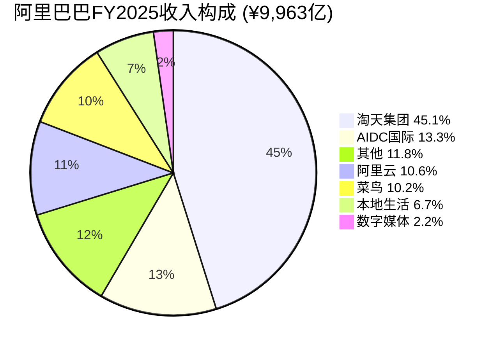
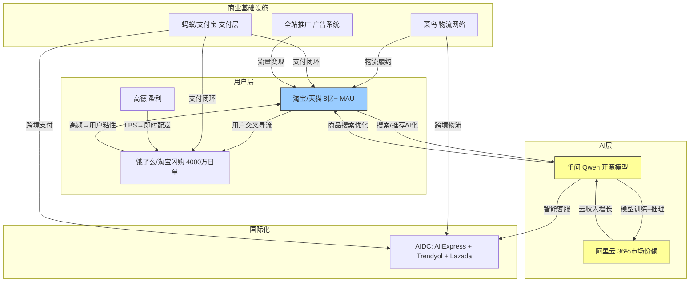

# BABA Phase 1: 第三章 & 第四章
> Phase 1 | 2026-02-25 | PW=7 发现系统 | SGI=5.1 混合模型

---

## 第三章 阿里巴巴: 公司画像与业务矩阵

### 3.1 公司简史: 从B2B到生态帝国 (1999-2026)

阿里巴巴集团的27年历程，是中国数字经济从无到有的一面镜子。理解这段历史对投资分析至关重要——不是因为过去能预测未来，而是因为每一次战略转向都在当前的业务矩阵中留下了结构性印记。这些印记既是护城河的根基，也是"通才陷阱"(H2)争论的源头。

**第一纪: B2B到C2C的跃迁 (1999-2008)**

1999年，马云在杭州创立阿里巴巴，最初定位为中小企业B2B出口平台。这个选择反映了一个关键洞察: 中国制造业产能过剩，但缺乏触达海外买家的渠道。2003年非典期间，阿里巴巴做出了第一个改变命运的战略决策——上线淘宝网，从B2B跳入C2C。彼时eBay通过收购易趣占据中国C2C市场95%份额，但淘宝以"免费"策略(免佣金+免上架费)在18个月内反超。这一幕几乎完美预演了20年后的竞争格局: 当PDD以"更便宜"进攻时，阿里面临的正是当年eBay的困境。

2004年，支付宝(Alipay)上线，解决了电商交易的信任问题。支付宝后来演化为蚂蚁集团，成为阿里生态最大的"隐藏资产"——也是CQ-5(隐藏资产释放)的核心标的。

**第二纪: 平台化与商业化 (2008-2014)**

2008年天猫(原淘宝商城)上线，标志着阿里从C2C市集向B2C品牌商城转型。天猫的商业模式——向品牌商收取佣金+广告费(CMR)——至今仍是阿里最核心的盈利引擎 [DM-FIN-003]。2009年双十一购物节首次举办，创造了电商造节的范式。2012年阿里云正式独立运营，当年营收不足10亿元，内部质疑声此起彼伏。马云力排众议维持投入的决策，十余年后回头看，是阿里对AI时代最重要的提前布局。

**第三纪: 全球化与IPO (2014-2019)**

2014年9月，阿里巴巴在纽约证券交易所上市，融资250亿美元，创下当时全球最大IPO记录。IPO后阿里进入"买买买"阶段: 2016年收购Lazada(东南亚电商)、2017年投资Tokopedia(印尼)、2018年控股Trendyol(土耳其)。这些布局构成了今天AIDC(国际电商)板块的基础。2019年11月，阿里巴巴在港交所二次上市，融资130亿美元，成为港股史上最大跨境上市。

**第四纪: 监管风暴与价值重估 (2020-2023)**

2020年10月，蚂蚁集团IPO在上市前48小时被叫停，标志着中国科技监管风暴的开始。随后: 2021年4月182亿元反垄断罚款 [BIZ-19]、平台经济"二选一"禁令、数据安全法出台——阿里股价从2020年10月的$317跌至2022年10月的$60，跌幅81%。这段历史直接塑造了当前的"中国折价"(CQ-4): 投资者在BABA的估值中嵌入了制度性风险溢价。

2023年3月，阿里宣布"1+6+N"组织变革，将集团拆分为六大业务集团+N个独立公司，每个可独立融资上市。这被视为应对监管压力的主动"拆分"信号。然而仅数月后，新任CEO吴泳铭(Eddie Wu)上任，逆转了拆分方向——菜鸟IPO撤回、盒马出售计划搁置、银泰百货出售完成。

**第五纪: AI转向与马云回归 (2024-2026)**

2024年，阿里进入"再中心化"阶段。吴泳铭明确"用户优先、AI驱动"两大战略支柱。2025年初马云罕见公开露面并参加内部高管会议，被解读为政治信号的正常化。同年9月，阿里云承诺投入$500亿用于AI基础设施 [BIZ-09]。2026年1月，阿里宣布T-Head(平头哥)半导体业务拆分独立运营 [BIZ-23]。

2026年2月20日发布的Q3 FY2026财报(2025年10-12月)显示: 集团营收¥2,801.5亿(+8%)，超出市场预期，但云智能增速从Q2的+34%骤降至+13%——这个"薛定谔数据"(H1)成为本报告的核心变量。

**历史对投资分析的启示**

| 历史事件 | 当前映射 | CQ关联 |
|---------|---------|--------|
| 2003年淘宝"免费"击败eBay | 2024-25年面对PDD/抖音，阿里反过来成了"守城者" | CQ-2 |
| 2004年支付宝诞生 | 蚂蚁33%股权估值$50-100B，但变现路径不确定 | CQ-5 |
| 2012年阿里云逆势投入 | 2025-26年$530亿AI投入，是否会复刻当年的远见？ | CQ-3 |
| 2020年蚂蚁IPO被叫停 | VIE折价+监管折价至今未完全消退 | CQ-4 |
| 2023年"1+6+N"被逆转 | 管理层在"拆分释放价值"与"生态协同"间摇摆 | H2 |

> **关键判断**: 阿里巴巴的历史不是线性进化史，而是一部"战略钟摆"——在开放/封闭、多元/聚焦、激进/保守之间反复摆动。当前的AI转向+再中心化是钟摆的最新一摆。投资者需要判断的不是钟摆的方向(已经很清楚)，而是钟摆的振幅——$530亿AI投入是"刚刚好"还是"过头了"。

---

### 3.2 业务矩阵: 七大板块全景

截至FY2025，阿里巴巴运营七个主要业务板块，FY2026 Q1起部分板块合并重组。以下基于FY2025全年数据(Q1-Q4)的遗留分部结构进行分析，并标注FY2026的重组影响。

**业务矩阵全景图**

| 板块 | FY2025收入 | 占比 | 增速 | Adj EBITA | 角色定位 |
|------|:----------:|:----:|:----:|:---------:|---------|
| 淘天集团(TTG) | ¥4,498.3亿 | 45.1% | +3% | ¥1,962.3亿 | 现金牛 |
| 阿里云智能 | ~¥1,060亿 | 10.6% | ~+11% | 盈利(利润率下降) | 第二曲线 |
| AIDC国际电商 | ~¥1,323亿 | 13.3% | +29% | 亏损收窄→首季盈利 | 增长引擎 |
| 菜鸟 | ¥1,012.7亿 | 10.2% | +2% | EBITDA正 | 基础设施 |
| 本地生活 | ¥670.8亿 | 6.7% | +12% | 亏损收窄 | 战略投入 |
| 数字媒体娱乐 | ¥222.7亿 | 2.2% | +5% | 亏损¥-5.5亿 | 边缘/待处置 |
| 其他 | ~¥1,176亿 | 11.8% | — | — | 资产处置中 |
| **合计** | **¥9,963亿** | **100%** | **+5.9%** | **¥1,730.7亿** | — |

*数据来源: 阿里巴巴FY2025年报 [DM-FIN-001] [BIZ-19]; 云收入为季度累加估算值*

**收入结构Mermaid图**

---

#### 3.2.1 淘天集团 (TTG) — 现金牛

**核心定位**: 中国最大的在线零售平台，贡献集团45%收入和几乎全部利润。淘天集团是理解阿里估值的起点——如果把阿里的市值全部归因于TTG，隐含P/E约为11.5x(¥2,254B市值 / ¥196.2B EBITA)，低于京东的8.9x PE对应的绝对估值密度。这意味着即使只看电商板块，当前定价也并非昂贵。

**FY2025关键数据**

| 指标 | FY2025值 | 同比 | 备注 |
|------|:--------:|:----:|------|
| 收入 | ¥4,498.3亿 | +3% | [BIZ-19] |
| 其中CMR(客户管理收入) | — | +6% | 核心广告+佣金，优于整体增速 |
| Adj EBITA | ¥1,962.3亿 | +1% | EBITA margin ~43.6% |
| Q4 FY2025收入 | ¥1,013.7亿 | +9% | 16个季度最快CMR增速(+12%) |
| Q3 FY2026收入 | ¥1,360.9亿 | +5% | 含双十一季度，增速放缓 |

**CMR vs GMV的分离**: 这是理解TTG的关键。FY2025 CMR增速(+6%)显著高于整体收入增速(+3%)，表明淘天正在提高货币化率(take rate)。核心驱动力有三:

1. **全站推广(Quanzhantui)**: 2024年下半年推出的全站流量广告系统，将淘宝搜索流量与推荐流量打通，商家竞价从搜索广告扩展到全站展示位。这一系统本质上是阿里版的"Google Ads"向"Meta Ads"的进化——从意图匹配转向兴趣推荐。
2. **88VIP会员**: 截至Q3 FY2026，88VIP会员数达4,900万 [Q3 FY26财报]。88VIP用户客单价和购买频次显著高于普通用户(据管理层，88VIP贡献的GMV占比远超其用户占比)。会员体系是对抗PDD"低价"叙事的核心武器——将高价值用户锁定在阿里生态中。
3. **即时零售融合**: FY2026 Q1起，饿了么和飞猪并入"中国电商集团"，日均订单达4,000万单 [BIZ-12]。即时零售的高频消费(外卖、生鲜)拉高了整体用户活跃度，但同时也带来了巨额补贴成本 [DM-FIN-014]。

**市场份额: 从52%到40%**

| 年份 | 淘天GMV份额 | 主要竞争者变化 |
|------|:----------:|-------------|
| 2019 | ~52% | PDD ~7%，抖音电商未起步 |
| 2021 | ~50% | PDD ~13%，抖音电商~3% |
| 2023 | ~44% | PDD ~19%，抖音~10% |
| 2025 | ~40-44% | PDD ~19-22%，抖音~12-15% |

*数据来源: [BIZ-25] [BIZ-26]，基于GMV口径，各方估算有差异*

份额流失的本质是中国电商从"集中化交易平台"向"分散化内容电商"的结构性转移。抖音的内容推荐算法将"逛"(discovery)和"买"(purchase)合二为一，分走了淘宝传统的"搜索→比价→下单"流量。PDD则以极致低价+社交裂变(拼团)切走了价格敏感用户群。

但份额流失是否已经接近终点？有三个理由支持"份额底"假说:
- 淘天MAU仍维持8亿+，PDD为7.2亿 [BIZ-26]，用户规模差距在缩小但淘天仍然更大
- 抖音电商2024年GMV增速已从50%+降至34% [BIZ-24]，且"货架电商"占比提升至50%——这意味着抖音在向淘宝模式靠拢，而非继续颠覆
- Q4 FY2025 CMR +12%创16季新高，表明商家投放回流

**CQ关联**: CQ-2(电商份额)和CI-01(份额企稳)是TTG估值的核心变量。如果份额稳在40%，TTG独立估值约¥2.0-2.5万亿(10-13x EBITA)；如果继续跌至30%，估值可能降至¥1.2-1.5万亿。差额约¥5,000-10,000亿——接近当前总市值的22-44%。

---

#### 3.2.2 阿里云智能集团 — 第二曲线 or 烧钱无底洞

**核心定位**: 中国最大的公有云服务商(市场份额36%，AI云份额35.8%)，也是全报告最重要的估值变量。当前市场几乎给予阿里云零估值——如果CQ-1的答案是"零值定价是极端错误"，那阿里云的重新定价将贡献$53-89B的上行空间(约15-25% EV)。

**FY2025-FY2026关键数据**

| 指标 | 值 | 来源 |
|------|:--:|------|
| FY2025收入(估) | ~¥1,060亿 | 季度累加 |
| FY2025增速 | ~+11% | [BIZ-19] |
| AI收入连续三位数增长 | 9个季度(截至Q2 FY26) | [BIZ-03] |
| 中国整体云市场份额 | 36% (Q3 2025) | Omdia [BIZ-07] |
| 中国AI云市场份额 | 35.8% (H1 2025) | IDC [BIZ-07] |
| GPU云市场份额 | 未进前二 | [BIZ-08] |
| AI基础设施承诺投入 | $500亿 | [BIZ-09] |
| 外部客户收入增速(Q2 FY26) | +29% | 财报 |

**季度增速的"薛定谔式"波动**

| 季度 | 云收入(亿元) | YoY增速 | 备注 |
|------|:-----------:|:------:|------|
| Q4 FY2025 | 301.3 | +18% | AI三位数增长第7季 |
| Q1 FY2026 | 301.3 | +18% | AI三位数增长第8季 |
| Q2 FY2026 | 398.0 | **+34%** | 外部客户+29%，AI产品从试验转生产 |
| Q3 FY2026 | 317.4 | **+13%** | 增速骤降，引发市场疑虑 |

*数据来源: 各季度财报 [BIZ-19]*

Q2→Q3增速从+34%跳水到+13%，是本报告标记为H1("云增速薛定谔")的核心异常点。这个数据允许两种截然不同的叙事:

**叙事A(乐观): 噪音，不是信号**
- Q2 FY2026(7-9月)可能受益于大客户集中部署AI工作负载，拉高基数
- Q3的+13%仍高于中国云市场整体增速(24% YoY按Omdia)，但如果这里指的是阿里云自身低于市场，则需要进一步核实。实际上阿里云全年趋势仍在上行通道
- 管理层在Q3电话会议上表示"AI需求管道(pipeline)强劲"，减速主要因为供给约束(GPU供应)而非需求下降
- 中国AI云市场2025年增长149% [BIZ-03]，阿里云35.8%份额=最大受益者

**叙事B(悲观): 信号，不是噪音**
- 三位数AI增长的基数效应正在追上来——如果AI收入从¥50亿涨到¥150亿，是200%增长；从¥150亿涨到¥250亿，只有67%增长
- 中国AI应用端的商业化远慢于预期——除了头部互联网公司，传统企业的AI上云速度有限
- GPU云市场由百度(40.4%)和华为(30.1%)主导 [BIZ-08]，阿里在最核心的AI算力层并不占优
- 开源Qwen模式虽然驱动用户量，但"给用户免费模型→用户在阿里云上部署"的转化漏斗可能不如想象中高效

**这就是为什么Q4 FY2026(2026年1-3月)的云增速数据至关重要——它将决定+13%是"回归均值"还是"趋势反转"。在此之前，两种叙事都有数据支撑，投资者必须持有两种可能性。**

**Qwen生态与开源飞轮**

阿里云的差异化战略建立在千问(Qwen)大模型的开源生态之上:

| 指标 | 数据 | 含义 |
|------|------|------|
| Qwen下载量 | 4天超1,000万次 [中国AI研究] | 开发者社区的快速采纳 |
| 千问DAU(春节后) | 2,200万(留存率73%) [中国AI研究] | 消费端用户粘性初现 |
| 30亿免单活动 | 9小时1,000万笔订单 [中国AI研究] | AI→消费闭环验证 |
| App Store排名 | 免费榜第1(超越元宝) [中国AI研究] | 短期营销爆发力 |
| MaaS市场调用量 | 火山引擎49.2%占主导 [中国AI研究] | 阿里在MaaS层非第一 |

开源策略的商业逻辑是: 免费模型→开发者在阿里云部署→云消费收入。这类似于Red Hat的开源Linux→企业服务模式，或Android→Google服务生态模式。但与这些成功案例不同的是，AI大模型的推理成本高昂——每一次API调用都消耗GPU算力。如果阿里必须同时承担模型训练成本(开源研发)和推理成本(云补贴)，而收入端只收取云计算费用(而非模型授权费)，那利润率上限可能低于闭源竞争对手。

**云估值参考框架**

| 对标 | EV/Sales | 营收增速 | 若用于阿里云(~¥1,060亿) |
|------|:--------:|:------:|:---------------------:|
| AWS (2025) | ~6x | ~20% | ¥6,360亿 (~$87B) |
| Azure估计值 | ~8x | ~30% | ¥8,480亿 (~$117B) |
| 中国折价50% | ~3-4x | ~15% | ¥3,180-4,240亿 ($44-58B) |
| 当前隐含值 | ~0x | — | ~¥0 (CQ-1核心) |

即使按最保守的3x EV/Sales + 50%中国折价，阿里云估值也在$44B以上。当前市场隐含零值(因为TTG的SOTP已经接近或等于集团总市值)，这意味着市场要么认为阿里云"不值钱"(看空)，要么这是一个定价错误(CQ-1的核心论点)。

---

#### 3.2.3 AIDC国际电商 — 扭亏拐点

**核心定位**: 阿里的国际化战略载体，包含AliExpress(全球跨境)、Lazada(东南亚)、Trendyol(土耳其/中东)、Miravia(欧洲)、Daraz(南亚)。FY2025是AIDC的重要转折年——收入增速29%为集团最快，且在Q2 FY2026实现首个季度盈利(¥1.62亿)。

**FY2025关键数据**

| 指标 | FY2025值 | 同比 | 备注 |
|------|:--------:|:----:|------|
| 收入 | ~¥1,323亿 | +29% | 零售¥1,085亿(+33%)+批发¥238亿 |
| 收入占比 | 13.3% | ↑ | 从FY2024的~11%提升 |
| Q2 FY2026 Adj EBITA | ¥1.62亿 | 首次盈利 | [BIZ-17] |
| 跨境市场份额(AliExpress) | 8% | ↓ | 从12%(2023)下降 [BIZ-15] |
| Trendyol市场地位 | 土耳其第一 | ↑ | 扩展至中东 |
| Lazada里程碑 | 12年来首月盈利 | — | [BIZ-17] |

**五大子平台矩阵**

| 平台 | 区域 | 竞争地位 | 表现 | 战略价值 |
|------|------|---------|------|---------|
| AliExpress | 全球跨境 | #4(份额8%↓) | 订单+60%但份额降 | 中等——被Temu压制 |
| Trendyol | 土耳其/中东 | **区域第一** | 最强资产 | **高**——稀缺的区域垄断 |
| Lazada | 东南亚 | #2(落后Shopee) | 12年首月盈利 | 中等——需持续投入 |
| Miravia | 欧洲(西班牙) | 新进入者 | 早期 | 低——尚未证明模式 |
| Daraz | 南亚 | 区域参与者 | 本地化模型 | 低 |

**AliExpress vs Temu: 跨境电商的攻守易势**

AliExpress的市场份额从12%(2023)下降至8%(2025) [BIZ-15]，同期Temu从不足1%飙升至24%。Temu的"全托管"(fully-managed)模式——平台控制定价、物流、售后——提供了远优于AliExpress自营商家模式的用户体验。阿里的应对是推出"Choice"半托管模式，试图在全托管(平台负担重)和纯平台(体验差)之间找到平衡点。

但跨境电商面临一个外部变量: **美国de minimis关税豁免($800门槛)正面临政策压力** [BIZ-15]。如果取消该豁免，Temu、Shein和AliExpress的直邮模式成本将大幅上升。这对三者的影响不对称——Temu最依赖直邮模式，而AliExpress已有部分海外仓基础设施(通过菜鸟)。因此，de minimis政策变化可能反而有利于阿里相对Temu的竞争地位。

**Trendyol: AIDC最优质资产**

Trendyol是土耳其电商市场的绝对领导者，且正在向中东(沙特、阿联酋、科威特)扩张。与AliExpress不同，Trendyol在核心市场拥有本地化基础设施、品牌认知和供应链优势。如果独立估值，Trendyol可能价值$10-15B(参考Shopee的SEA Limited区域估值比例)。但阿里很少单独披露Trendyol的财务数据，导致这部分价值被AIDC整体亏损所掩盖。

**CQ关联**: AIDC的扭亏路径直接影响CQ-3(AI投资回报)和H3(资本配置悖论)——如果AIDC能在FY2027实现全年盈利，集团FCF压力将显著缓解。管理层预期FY2027首个完整盈利季度，这意味着AIDC从集团FCF的"消耗者"向"贡献者"的角色转换可能在12-18个月内发生。

---

#### 3.2.4 本地生活 (含饿了么+高德) — 补贴战主战场

**核心定位**: 即时零售和本地服务的战场。FY2026 Q1起，饿了么和飞猪并入"中国电商集团"，高德归入"其他"板块。这一重组模糊了本地生活业务的独立可追踪性，但也反映了阿里将"即时零售"视为电商的自然延伸(而非独立业务)的战略判断。

**FY2025关键数据**

| 指标 | FY2025值 | 同比 | 备注 |
|------|:--------:|:----:|------|
| 收入 | ¥670.8亿 | +12% | [BIZ-19] |
| 收入占比 | 6.7% | ↑ | 从FY2024的~6% |
| 亏损状态 | 亏损收窄 | ✓ | 但仍为负EBITA |
| 即时零售日均订单 | 4,000万 | — | 饿了么+淘宝闪购合计 [BIZ-12] |
| 即时零售增速(Q3 FY26) | **+60%** | — | 集团最快增长子业务 |
| 高德盈利状态 | Q3 FY2026盈利 | ✓ | Eddie Wu电话会确认 |

**三方补贴大战 (2025): ¥800亿的消耗战**

2025年中国即时零售市场爆发了三方混战——美团(70%份额)、阿里(25-28%)、京东(新入局) [BIZ-06] [BIZ-14]。行业补贴烧钱速度超过$40亿/季 [BIZ-12]。

| 参战方 | 日均订单 | 份额 | 现金弹药 | 核心优势 |
|--------|:-------:|:----:|:-------:|---------|
| 美团 | 9,000万 | ~70% | ¥1,711亿 | 最强骑手网络+商户关系 |
| 阿里(饿了么+淘宝闪购) | 4,000万 | ~25-28% | ¥5,857亿 | **3.4x现金优势** [BIZ-13] |
| 京东 | 2,500万 | ~3-5% | — | 新入局者势能+补贴力度 |

摩根士丹利2030年预测: 即时商务市场阿里47% vs 美团48%，趋于均势 [BIZ-14]。但外卖GTV美团仍将维持75%主导地位。

**补贴战的财务影响**: Q2 FY2026营销费用¥665亿，环比暴增25%(从¥532亿) [DM-FIN-014]。这直接导致Q2运营利润率从Q1的14.1%骤降至2.2% [DM-FIN-013]。这不是利润率"恢复中的暗流"——这是明确的利润率牺牲。问题在于: 这种牺牲能换来什么？

**淘宝闪购(Taobao Shangou)的"品牌重塑"**:

2025年12月，阿里将饿了么品牌并入淘宝，推出"淘宝闪购"(Taobao Shangou)。这一动作的战略意图是: 将外卖从低频独立APP转变为高频交易入口——用户在淘宝App内完成外卖、生鲜、日用品的即时购买，增加淘宝的日均使用频次。2025年8月，淘宝闪购日均订单一度超过1亿单(含补贴驱动)，短暂超越美团 [BIZ-12]。

**CQ关联**: CQ-6(即时零售赢家)直接关联CI-01(电商份额企稳)。即时零售不仅是独立的利润来源，更是守住电商用户的"高频粘性工具"。如果阿里通过即时零售将用户日均打开淘宝的频率从1次提升至3次，溢出效应将远超外卖本身的利润。但这个逻辑的风险在于——补贴退出后，用户是否会留下？

---

#### 3.2.5 菜鸟 (Cainiao) — 物流基础设施

**核心定位**: 阿里自营物流网络，覆盖国内及跨境包裹。2024年3月阿里收购菜鸟剩余~36%股权实现全资控制，2023年撤回独立IPO计划。FY2026起菜鸟业务数据并入电商分部，独立可追踪性进一步降低。

**FY2025关键数据**

| 指标 | FY2025值 | 同比 | 备注 |
|------|:--------:|:----:|------|
| 收入 | ¥1,012.7亿 | +2% | 首次突破千亿 [BIZ-19] |
| 收入占比 | 10.2% | → | 增速低于集团 |
| EBITDA | 正 | — | 但Q3 FY2026 EBITDA同比-76% |
| 日均跨境包裹 | 500万+ | — | [BIZ-10] |
| 日均数据处理量 | 9万亿+ | — | [BIZ-10] |
| 算法路由覆盖率 | 80%+ | — | [BIZ-10] |

**菜鸟的战略价值 vs 财务贡献**

菜鸟在阿里生态中的角色类似亚马逊的FBA(Fulfillment by Amazon)——表面上是成本中心，实际上是电商竞争力的基础设施。菜鸟的"国内24小时、全球72小时"目标 [BIZ-11] 为淘天商家提供物流履约能力，为AIDC跨境提供尾程配送网络。

但与亚马逊自建物流不同，菜鸟采用"轻资产+数据平台"混合模式——自有少量分拣中心和仓储，但依赖合作伙伴(通达系快递)完成大部分末端配送。这种模式资本效率高(CapEx远低于京东物流)，但控制力弱(服务质量依赖第三方)。

FY2026起菜鸟并入电商分部的影响: 投资者将无法单独追踪菜鸟的盈利能力，这在一定程度上降低了财务透明度。但从管理层角度，这也意味着菜鸟将从"独立P&L中心"回归"电商成本项"的角色——为商家提供更有竞争力的物流价格(可能牺牲菜鸟利润)以提升整体电商竞争力。

---

#### 3.2.6 数字媒体与娱乐 — 边缘业务

**核心定位**: 包含优酷(长视频)和阿里影业(电影制作/发行)。FY2025收入¥222.7亿(占比仅2.2%)，亏损从¥-15.4亿收窄至¥-5.5亿 [BIZ-19]。Q4 FY2025接近盈亏平衡。

**战略价值评估**: 数字媒体在阿里生态中的价值主要是"内容引流"——优酷内容为淘宝带来用户时长和品牌广告位。但在中国长视频赛道(优酷 vs 爱奇艺 vs 腾讯视频)，优酷长期排名第三，且赛道整体已进入存量竞争。这个板块更可能成为"处置候选"而非"增长引擎"。

估值含义: 按接近盈亏平衡估算，数字媒体在SOTP中的价值约¥0-200亿，对整体估值的影响可忽略。但如果阿里将其出售(类似银泰百货出售)，可以回收资本用于AI投入或回购——这是CQ-5(隐藏资产释放)的边缘路径之一。

---

#### 3.2.7 "其他"板块与资产处置

**核心定位**: 包含盒马鲜生(新零售)、阿里健康、银泰百货(已出售)、高鑫零售(大润超，已出售)等。FY2025收入~¥1,176亿，但FY2026起因资产处置而快速缩减。

**资产处置进度**

| 资产 | 状态 | 处置收入(估) | 战略影响 |
|------|------|:----------:|---------|
| 银泰百货 | 已出售(2025) | ~¥74亿 | 回收现金 |
| 高鑫零售(大润超) | 已出售(2025) | ~¥130亿 | 退出线下大卖场 |
| 盒马鲜生 | 保留(出售计划搁置) | — | 即时零售战略资产 |
| 阿里健康 | 保留 | — | 医药电商增长中 |

"其他"板块的收入在FY2026持续同比下降约25% [Q2 FY26财报]，这是资产处置的正常结果。关键判断: 阿里正在从"什么都做"转向"聚焦核心"——电商、云、AI是保留的三大支柱，其余都是可交易的"棋子"。这种战略聚焦本身是积极的，但执行了两年后(从2024年吴泳铭上任算起)，成效仍在"进行中"而非"已完成"阶段。

---

### 3.3 业务间协同矩阵 (SGI=5.1验证)

SGI(专才-通才光谱指数)=5.1将阿里定位在"混合模型"区间——既非纯专才(如台积电专注于代工)，也非松散多元化(如早期的GE)。这个评分的核心含义是: **阿里的业务协同是真实存在的，但协同的经济价值是否被正确定价，是一个开放问题。**

**跨业务协同Mermaid图**

**协同矩阵量化评估**

| 协同路径 | 描述 | 真实度 | 经济价值 | 证据 |
|---------|------|:------:|:-------:|------|
| 淘宝→饿了么交叉导流 | 淘宝用户在App内点外卖 | **高** | 中 | Q3 FY26即时零售+60% |
| 千问→淘宝搜索/推荐 | AI优化商品推荐精准度 | **中** | 高(如果成功) | CMR +6%部分归因于AI优化 |
| 千问→阿里云需求 | 开源模型用户在阿里云部署 | **中** | 高 | AI云份额35.8% |
| 菜鸟→淘天物流竞争力 | 统一物流提升商家体验 | **高** | 高 | 淘天商家留存核心壁垒 |
| 菜鸟→AIDC跨境配送 | 跨境包裹的尾程能力 | **中** | 中 | 500万+日均跨境包裹 |
| 支付宝→全生态支付层 | 统一支付降低交易摩擦 | **高** | 中 | 但支付宝由蚂蚁控制(33%股权) |
| 全站推广→淘天变现 | 流量打通提高广告效率 | **高** | **高** | Quanzhantui驱动CMR+12%(Q4 FY25) |

**SGI=5.1的投资含义**

SGI在4-6区间的公司，P/E通常在行业中位数 ±20%范围内。中国科技同行中位数P/E约10.7x(PDD) [DM-MKT-001]。按±20%计算，BABA的"合理"P/E区间应在8.6x-12.8x。但实际P/E为20.2x——**溢价89%**，远超SGI预测的范围。

这个偏差有两种解释(对应H2非共识假说):

**解释A(通才溢价合理)**: 阿里的业务实际上形成了"中国商业基础设施"——一个整体产品而非松散的多元化。电商+支付+物流+云构成的闭环，使得阿里对商家的价值远大于各部分之和。市场给予溢价是因为看到了这个生态价值。

**解释B(通才溢价不合理)**: 阿里的P/E溢价并非来自"生态溢价"，而是来自"品牌知名度溢价"——作为中国科技的代名词，BABA在外资持仓中占比远高于JD/PDD，资金流入推高了估值。如果对比基本面(ROE: PDD 30.5% >> BABA 11.2% [DM-MKT-003])，溢价完全不合理。

**Phase 3将通过SOTP估值验证: 如果SOTP>集团市值，说明"拆开更值钱"→通才折价应成立(支持B)；如果SOTP<集团市值，说明"整体>部分"→通才溢价有依据(支持A)。**

---

### 3.4 资产负债表隐藏的价值

阿里巴巴的资产负债表中藏着三个被市场低估或忽视的资产类别，合计潜在价值$50-150B。这些"隐藏资产"是CQ-5的核心分析对象。

**3.4.1 长期投资组合: ¥5,679亿 (总资产的31.4%)**

| 维度 | 数据 | 来源 |
|------|------|------|
| 账面价值 | ¥5,679亿 | [DM-FIN-022] |
| 占总资产比 | 31.4% | [DM-FIN-022] |
| 主要构成 | 蚂蚁33%股权、小鹏汽车、中通快递、其他上市/非上市公司 | 20-F |
| 市值/账面比(估) | 0.7-1.2x | 视蚂蚁估值波动 |

长期投资中最大的单一资产是蚂蚁集团33%股权。蚂蚁FY2025利润约¥1,000亿(+61%) [thesis_crystallization]，若按10-15x P/E估值，蚂蚁总估值¥1.0-1.5万亿，阿里持有的33%价值¥3,300-4,950亿($45-68B)。但蚂蚁的变现路径存在重大不确定性:

- **IPO路径**: 蚂蚁IPO在2020年被叫停后，虽然监管环境已有所缓和(2023年完成整改、获得支付牌照)，但IPO时间表仍不明确。KA-05假设2026-2027年内发生，置信度仅40%。
- **私有化/战投路径**: 如果IPO窗口长期关闭，蚂蚁可能通过引入战略投资者部分变现，但折价幅度可能在30-50%。
- **分红路径**: 蚂蚁已开始向股东分红(2023年首次)。如果持续分红，阿里每年可获得¥330-500亿现金流——这相当于FY2025 FCF的42-64%，是一个被严重忽视的收入来源。

**3.4.2 商誉: ¥2,559亿 (总资产的14.2%)**

| 维度 | 数据 | 来源 |
|------|------|------|
| 账面价值 | ¥2,559亿 | [DM-FIN-022] |
| 占总资产比 | 14.2% | [DM-FIN-022] |
| 主要构成 | Lazada收购、优酷土豆、高鑫零售(已出售)、饿了么等 | 20-F |
| 减值风险 | 中等 | 高鑫零售出售已实现部分减值 |

商誉¥2,559亿中，已出售资产(银泰、高鑫零售)对应的商誉应已冲销。剩余商誉主要对应Lazada和饿了么。如果AIDC持续盈利改善、即时零售份额企稳，减值风险可控。但如果AliExpress持续失去份额、Lazada竞争失利，可能面临大额商誉减值——这是一个尾部风险但非核心变量。

**3.4.3 T-Head(平头哥)半导体拆分**

2026年1月22日，阿里宣布将平头哥半导体业务独立运营。平头哥的核心产品是含光系列AI推理芯片(已出货数十万片)和倚天系列服务器CPU。在全球AI芯片短缺(尤其是美国对华出口管制限制NVIDIA高端GPU供应)的背景下，平头哥的自研芯片对阿里云的战略价值不言而喻。

| 估值参考 | 值 | 依据 |
|---------|:--:|------|
| 融资估值(2023年传闻) | ~$10B | 市场传闻 |
| KA-06假设上市时间 | 2027年前 | 置信度30% |
| 对标(寒武纪科技) | 市值~¥2,000亿 | A股AI芯片标的 |
| 保守估值 | $5-15B | 基于出货量+技术壁垒 |

**3.4.4 现金及短期投资: ¥4,648亿**

账面现金¥4,648亿 [DM-FIN-020] 看起来充足，但考虑到:
- FY2025 CapEx ¥867亿(+161%) [DM-FIN-015]
- 回购¥874亿 + 分红¥293亿 = ¥1,167亿 [DM-FIN-008]
- AIDC+本地生活持续亏损: 估¥200-300亿/年
- 总计年消耗: ¥2,200-2,300亿 → 现金仅够2年

这直接关联H3(资本配置悖论): 在现金快速消耗的情况下，同时维持$530亿AI投入+$120亿回购+$40亿分红，数学上需要增加债务或削减某一项。FY2025已经从净现金转为净负债(¥668亿) [DM-FIN-021]——方向的改变比水平更重要。

**隐藏资产汇总**

| 资产 | 保守估值 | 乐观估值 | 变现概率 | 时间窗口 |
|------|:-------:|:-------:|:-------:|:-------:|
| 蚂蚁33%股权 | $45B | $68B | 中(40-60%) | 2-4年 |
| T-Head | $5B | $15B | 低-中(30%) | 2-3年 |
| 其他投资组合 | $10B | $20B | 中(可随时减持) | 随时 |
| **合计** | **$60B** | **$103B** | — | — |

当前市值$355B中，如果TTG独立估值约$200-250B(10-13x EBITA)，则市场隐含云+AIDC+本地生活+所有隐藏资产的总价值仅约$105-155B。而仅隐藏资产就值$60-103B。这意味着市场几乎没有给云、AIDC、本地生活任何正向估值——或者给了较高的集团折价(conglomerate discount)。

---

### 3.5 本章对核心问题的启示

| CQ/假说 | 本章发现 | 置信度变化 |
|---------|---------|:---------:|
| CQ-1(云零值?) | 阿里云36%市场份额+35.8% AI云份额，保守3x EV/Sales→$44B+。零值定价几乎确定是错误的——问题在于被低估的程度 | CI-02: 60%→65% |
| CQ-2(电商份额) | 份额从52%→40%，但CMR +6%>收入+3%表明货币化率提升。88VIP 4,900万+即时零售+60%增速提供粘性支撑 | CI-01: 55%→55%(需Phase 2验证份额底) |
| CQ-3(AI投资) | $530亿AI投入中，云(35.8%AI云份额)+千问(2,200万DAU)+T-Head(拆分)提供三条回报路径。但GPU云份额未进前二是隐忧 | CI-04: 45%→48% |
| CQ-5(隐藏资产) | 蚂蚁+T-Head+投资组合保守$60B，乐观$103B。变现路径存在但时间不确定 | — |
| CQ-6(即时零售) | 4,000万日单+60%增速+3.4x现金优势。但补贴导致Q2 FY26 OpMargin从14.1%→2.2% | — |
| H1(云薛定谔) | Q2 +34%→Q3 +13%的断崖数据被确认。叙事A(噪音)和叙事B(信号)都有支撑。Q4数据将是决定性证据 | 维持开放 |
| H2(通才倒挂) | SGI=5.1预测P/E 8.6-12.8x，实际20.2x溢价89%。协同矩阵7条路径中4条"真实度高"，但经济价值量化需Phase 3 | 维持开放 |
| H3(资本悖论) | CapEx+回购+分红年消耗¥2,200B+ vs FCF¥782B → 缺口¥1,400B+靠举债/消耗现金弥补。净现金→净负债方向转变已发生 | 维持开放 |

---

## 第四章 财务全景: 三表趋势与分部解构

### 4.1 五年收入趋势 (FY2021-FY2025)

阿里巴巴FY2021至FY2025的收入轨迹，讲述了一个"增长引擎从高速切换到中速"的故事——而这个切换是被动的(监管、竞争)而非主动的(成熟、饱和)。

**五年收入及增速**

| 财年 | 收入(¥亿) | YoY增速 | 增量(¥亿) | 关键驱动 |
|------|:--------:|:------:|:--------:|---------|
| FY2021 | 7,172.9 | — | — | 疫情电商红利+新零售扩张 |
| FY2022 | 8,530.6 | +18.9% | +1,357.7 | 惯性增长+AIDC爆发 |
| FY2023 | 8,686.9 | **+1.8%** | +156.3 | **监管风暴+清零政策+消费低迷** |
| FY2024 | 9,411.7 | +8.3% | +724.8 | 后疫情恢复+降本增效 |
| FY2025 | 9,963.5 | +5.9% | +551.8 | AI云加速+AIDC高增+TTG低增 |

*数据来源: [DM-FIN-001] [DM-FIN-011]*

**CAGR分析**

| 区间 | CAGR | 含义 |
|------|:----:|------|
| FY2021-FY2025 (4年) | 8.6% | [DM-FIN-011] 整体增长率 |
| FY2023-FY2025 (2年) | 7.1% | [DM-FIN-011] 监管后恢复期 |
| 共识FY2026E | +5.2% | [DM-VAL-009] 近期减速 |
| 共识FY2027E | +10.4% | [DM-VAL-009] 预期加速(AI+AIDC驱动) |

**增长质量分析**

FY2023的近零增长(+1.8%)是阿里收入史上最差表现，直接原因是: (1)反垄断处罚后"二选一"禁令导致商家分流至PDD/抖音；(2)清零政策导致消费萎缩；(3)蚂蚁IPO叫停后投资者信心崩溃。但FY2023也是阿里的"利润率触底"——从这一年开始，管理层转向"降本增效"，砍掉了大量亏损业务(社区团购、教育等)。

FY2024-FY2025的恢复(+8.3%→+5.9%)表明: 收入增速已经回到正增长通道，但回到双位数增长的可能性取决于两个变量: (1)阿里云能否加速到+25%以上(当前+11-34%之间波动)；(2)AIDC能否维持+20-30%增速。仅靠TTG(+3%)无法驱动集团重回高增长。

**收入质量: 分部贡献拆解**

| 板块 | FY2024收入 | FY2025收入 | 增量 | 增量贡献% |
|------|:---------:|:---------:|:----:|:--------:|
| TTG | ¥4,371亿 | ¥4,498亿 | +127亿 | 23% |
| AIDC | ¥1,025亿 | ¥1,323亿 | +298亿 | **54%** |
| 阿里云 | ~¥950亿 | ~¥1,060亿 | +110亿 | 20% |
| 本地生活 | ¥599亿 | ¥671亿 | +72亿 | 13% |
| 菜鸟 | ¥991亿 | ¥1,013亿 | +22亿 | 4% |
| 数字媒体 | ¥212亿 | ¥223亿 | +11亿 | 2% |
| 其他/抵消 | — | — | 负 | — |

*注: 各板块增量总和>集团增量，因"其他"板块因资产处置收入减少*

**关键发现**: FY2025的边际增长超过一半(54%)来自AIDC国际电商。这意味着: (1)阿里的增长正从"中国电商"转向"国际电商+云"；(2)但AIDC仍在亏损→增长不转化为利润；(3)增长引擎的切换还远未完成——TTG仍贡献45%收入但仅23%增量，而AIDC贡献13%收入但54%增量。

---

### 4.2 利润率演变: V型恢复中的暗流

阿里的利润率在FY2021-FY2025经历了"V型恢复"——从FY2022的历史低点稳步回升至FY2025。但FY2026的季度数据揭示了V型恢复下的暗流: 即时零售补贴战正在侵蚀利润率的改善趋势。

**五年利润率趋势**

| 指标 | FY2021 | FY2022 | FY2023 | FY2024 | FY2025 | 趋势 |
|------|:------:|:------:|:------:|:------:|:------:|:----:|
| **毛利率** | 41.3% | 36.8% | 36.7% | 37.7% | 40.0% | V型恢复 |
| **运营利润率** | 11.5% | -0.5% | 11.1% | 13.2% | 14.1% | 强恢复 |
| **净利率** | 23.0% | -5.1% | 10.2% | 15.5% | 13.1% | 波动 |
| **EBITDA利润率** | 25.4% | 12.1% | 16.1% | 17.2% | 18.3% | 稳步改善 |

*数据来源: [DM-FIN-002] [DM-FIN-003] [DM-FIN-004] [DM-FIN-005] [DM-FIN-012]*

**毛利率分析: 从36.7%到40.0%的恢复**

毛利率的V型恢复(41.3%→36.7%→40.0%)是阿里"降本增效"成效的最直接证据:
- FY2022-FY2023的下降(41.3%→36.7%): 主要因为(1)反垄断罚款相关的合规成本增加；(2)社区团购等低毛利新业务快速扩张；(3)为应对PDD竞争而增加的商家补贴
- FY2024-FY2025的恢复(36.7%→40.0%): 主要因为(1)砍掉了社区团购等亏损业务；(2)银泰百货、高鑫零售等低毛利资产出售/缩减；(3)TTG CMR take rate提升

FY2025的40.0%毛利率已接近FY2021的41.3%历史高点。但进一步提升的空间有限——除非阿里能显著提高云业务利润率(当前被AI投入压制)或AIDC实现规模化盈利。

**运营利润率: 14.1%的"天花板"风险**

FY2025运营利润率14.1%是5年最高 [DM-FIN-003]。但这个数字可能已经是近期天花板，原因:

| 压力因素 | 影响量级 | 持续时间 |
|---------|:-------:|:-------:|
| 即时零售补贴 | -3~5pp(单季) | 12-18个月 |
| AI云资本支出 | -1~2pp(折旧增加) | 3-5年 |
| AIDC扩张亏损 | -0.5~1pp | 12-24个月 |
| **合计压力** | **-4.5~8pp** | — |

Q2 FY2026的运营利润率骤降至2.2%(从Q1的14.1%)完美印证了这个风险 [DM-FIN-013]。虽然Q2的极端值(主要因S&M费用¥665亿单季暴增25% [DM-FIN-014])不太可能持续，但只要补贴战不结束，运营利润率就难以稳定在14%以上。

**费用结构深度拆解 (FY2025)**

| 费用项 | FY2025金额(¥亿) | 占收入比 | FY2024占比 | 变化 |
|--------|:---------------:|:-------:|:---------:|:---:|
| 销售与营销(S&M) | 1,440 | 14.5% | 12.2% | **+2.3pp** |
| 研发(R&D) | 572 | 5.7% | 5.6% | +0.1pp |
| 管理(G&A) | 442 | 4.4% | 4.7% | -0.3pp |
| **合计OpEx** | **2,454** | **24.6%** | **22.5%** | **+2.1pp** |

*数据来源: [DM-FIN-009]*

**S&M费用的战略性投入 vs 竞争性消耗**: FY2025 S&M费用¥1,440亿，占收入14.5%，同比增加2.3个百分点。这一增长的核心驱动力是即时零售补贴(饿了么/淘宝闪购 vs 美团)和AIDC用户获取(AliExpress Choice模型 vs Temu)。关键判断: 这是"投资性支出"(可以停止)还是"竞争性必需"(不能停止)？如果美团和京东持续补贴，阿里被迫跟进——那S&M/Rev比率将在14-16%区间维持2-3年。

**R&D费用的"低投入"悖论**: ¥572亿R&D(5.7%收入比)对于一家正在进行$530亿AI投入的公司而言，看起来偏低。对比: 字节跳动2025年AI投入预算¥1,600亿 [中国AI研究]；Meta 2025年CapEx+R&D合计超过$60B。但这里需要区分: 阿里的AI投入大部分计入CapEx(数据中心、GPU采购)而非R&D费用。R&D 5.7%对应的主要是人力成本(工程师薪酬)，而AI硬件投入计入资产负债表。

**净利率的波动性**: FY2025净利率13.1%低于FY2024的15.5%，尽管运营利润率改善了0.9pp。差异来自: (1)FY2024有较高的投资收益(出售资产)；(2)FY2025少数股东损益增加(菜鸟全资收购前)。净利率是阿里最不稳定的利润率指标——受非经常性项目(资产处置、投资减值、汇率)影响极大。分析时应以运营利润率和EBITDA利润率为主要参考。

---

### 4.3 现金流: FCF骤降与资本配置悖论 (H3)

现金流是理解阿里当前投资逻辑的核心——FCF从¥1,512亿骤降至¥782亿(-48%)的背后，是一场$530亿AI军备竞赛与$120亿股东回报的正面碰撞。

**五年现金流趋势**

| 指标 | FY2021 | FY2022 | FY2023 | FY2024 | FY2025 | 趋势 |
|------|:------:|:------:|:------:|:------:|:------:|:----:|
| OCF(¥亿) | 2,364 | 1,421 | 1,574 | 1,815 | 1,648 | 波动但稳 |
| CapEx(¥亿) | 417 | 524 | 344 | 332 | **867** | **FY25爆发** |
| **FCF(¥亿)** | **1,947** | **897** | **1,230** | **1,512** | **782** | **腰斩** |
| CapEx/Rev | 5.8% | 6.1% | 4.0% | 3.5% | **8.7%** | 倍增 |
| FCF Margin | 27.2% | 10.5% | 14.2% | 16.1% | **7.8%** | 新低 |

*数据来源: [DM-FIN-007] [DM-FIN-015]*

**CapEx爆发的结构分析**

FY2025 CapEx ¥867亿(+161% YoY)是阿里历史上前所未有的投资强度 [DM-FIN-015]。这笔投入去了哪里？

| 方向 | 估计占比 | 金额(估) | 依据 |
|------|:-------:|:-------:|------|
| AI基础设施(GPU/数据中心) | ~60% | ~¥520亿 | $500亿承诺的首年投入 [BIZ-09] |
| 物流/菜鸟 | ~15% | ~¥130亿 | 跨境仓储+国内分拣中心 |
| 即时零售基础设施 | ~10% | ~¥87亿 | 前置仓+配送站 |
| IT基础设施维护 | ~15% | ~¥130亿 | 现有数据中心更新 |

*注: 阿里未单独披露CapEx构成，以上为基于管理层指引和行业惯例的估算*

**CapEx/折旧比: 34.5x的异常信号**

CapEx/Depreciation = 34.5x [DM-FIN-034]，远超成熟公司的正常范围(1-2x)。这个比率意味着: **阿里每年投入的新资本是其存量资产折旧的34.5倍——这不是"维护性投资"，而是大规模的"扩张性投资"。** 对比:

| 公司 | CapEx/Depr比 | 含义 |
|------|:----------:|------|
| 成熟公司(典型) | 1.0-2.0x | 维护现有资产 |
| 温和增长(典型) | 2.0-3.0x | 渐进扩张 |
| 高增长科技(典型) | 3.0-5.0x | 快速扩张 |
| **阿里FY2025** | **34.5x** | **极端异常** |
| AWS (2023-2024) | ~3-4x | 参考 |

34.5x的异常值一部分来自分母效应——FY2025折旧仅¥25.1亿(D&A ¥350亿中折旧部分)，可能是因为过去几年CapEx很低(FY2023-FY2024仅¥330-344亿)，存量资产少导致折旧基数小。但即便如此，867/350=2.5x的CapEx/D&A比仍然偏高。这意味着未来2-3年折旧费用将大幅上升(今年的CapEx→未来的折旧)，压制EBITDA→EBIT的转化。

**FCF骤降的数学分解**

| 科目 | FY2024 | FY2025 | 变化 | 影响 |
|------|:------:|:------:|:----:|:---:|
| OCF | ¥1,815亿 | ¥1,648亿 | -¥167亿 | -9.2% |
| CapEx | ¥332亿 | ¥867亿 | **+¥535亿** | **+161%** |
| **FCF** | **¥1,512亿** | **¥782亿** | **-¥730亿** | **-48%** |

FCF减少的¥730亿中: CapEx增加贡献了73%(¥535亿/¥730亿)，OCF减少贡献27%(¥167亿/¥730亿)。OCF减少的原因主要是营运资本变动(应付增加放缓、应收增加)而非经营质量恶化。

**资本配置悖论 (H3) 的量化呈现**

FY2025的资本配置全景:

| 资金用途 | FY2025金额(¥亿) | 占FCF比例 |
|---------|:--------------:|:--------:|
| CapEx | 867 | 111% |
| 回购 | 874 | 112% |
| 分红 | 293 | 37% |
| **合计** | **2,034** | **260%** |
| FCF | 782 | 100% |
| **缺口** | **-1,252** | **-160%** |

*数据来源: [DM-FIN-007] [DM-FIN-008]*

**FCF只能覆盖资本部署的38%(782/2,034)。** 剩余62%(¥1,252亿)由以下来源弥补:
- 短期债务增加
- 长期债务增加
- 现金余额消耗

结果: FY2024净现金¥735亿 → FY2025净负债¥668亿，方向性反转¥1,403亿 [DM-FIN-021]。

**这是H3(资本配置悖论)的核心矛盾**: 管理层同时进行$530亿AI投入(前瞻性)和$120亿回购(向后看)。这两者在战略上是矛盾的——如果AI投资有高回报，每一元用于回购的钱都是机会成本；如果AI投资回报不确定，为什么还要冒着举债风险去投？

有三种解读:

| 解读 | 逻辑 | 含义 |
|------|------|------|
| **A: 管理层有信心** | AI投资+回购同时做，说明管理层对FCF恢复有信心(FY2027E) | 看多——暂时的现金消耗换来长期价值 |
| **B: 治理问题** | 回购是为了短期提振股价(管理层期权利益)，牺牲了AI投资的充分性 | 看空——资本配置非最优 |
| **C: 蚂蚁分红对冲** | 管理层知道蚂蚁分红将提供¥300-500亿/年额外现金流，所以FCF缺口实际上可被蚂蚁弥补 | 中性——被忽视的现金来源 |

**Phase 2将通过FCF情景模型验证: 在不同CapEx/回购/蚂蚁分红假设下，净债务将如何演化？**

---

### 4.4 资产负债表: 从净现金到净负债的质变

FY2025资产负债表最大的变化不是任何单一科目，而是一个方向性的跨越: **从净现金到净负债。**

**资产负债表核心指标**

| 指标 | FY2023 | FY2024 | FY2025 | 变化趋势 |
|------|:------:|:------:|:------:|:-------:|
| 现金+短期投资(¥亿) | 5,116 | 5,341 | 4,648 | ↓ 消耗中 |
| 总债务(¥亿) | 2,001 | 2,136 | 2,485 | ↑ 增加中 |
| **净现金(负=净负债)** | **+3,115** | **+735** | **-668** | **方向反转** |
| 股东权益(¥亿) | 9,527 | 9,741 | 10,114 | ↑ |
| 总资产(¥亿) | 17,168 | 17,661 | 18,070 | ↑ |

*数据来源: [DM-FIN-020] [DM-FIN-021] [DM-FIN-023]*

**净现金→净负债的¥1,403亿摆动**

FY2024到FY2025的¥1,403亿净现金减少几乎精确等于"CapEx+回购+分红-FCF"的缺口(¥1,252亿)加上营运资本/汇率等调整项。这证实了因果关系: **是AI投资+股东回报的"双重支出"消耗了现金储备并推高了债务。**

**杠杆水平: 安全但轨迹值得关注**

| 杠杆指标 | FY2025值 | 安全阈值 | 距阈值 |
|---------|:-------:|:-------:|:-----:|
| D/E (债务/权益) | 0.25 | <1.0 | **安全** |
| Net Debt/EBITDA | 0.37x | <3.0x | **非常安全** |
| Interest Coverage | 14.7x | >3.0x | **非常安全** |
| Current Ratio | 1.54 | >1.0 | **安全** |
| Altman Z-Score | 3.34 | >2.99 | **安全区** |
| Piotroski F-Score | 8/9 | >5 | **很强** |

*数据来源: [DM-FIN-030] [DM-FIN-032]*

**当前水平完全安全——没有偿付风险。但问题在于轨迹:**

如果FY2026-FY2028每年CapEx维持¥800-1,000亿(AI投资周期)，且回购/分红仅小幅削减:

| 情景 | FY2026E | FY2027E | FY2028E | 含义 |
|------|:------:|:------:|:------:|------|
| 激进情景 | Net Debt ¥1,500亿 | ¥2,200亿 | ¥2,800亿 | Net Debt/EBITDA ~1.5x |
| 温和情景 | Net Debt ¥1,000亿 | ¥1,200亿 | ¥1,000亿 | 峰值后回落(回购削减) |
| 乐观情景 | Net Debt ¥800亿 | ¥500亿 | 净现金恢复 | CapEx见顶+FCF恢复 |

即使在激进情景下，1.5x Net Debt/EBITDA仍远离危险区。但对于长期以"现金牛"著称的阿里来说，持续的净负债状态将是估值叙事的根本改变——从"拥有巨量现金的折价科技公司"变成"在AI军备竞赛中举债的转型企业"。

**资产结构: 长期投资占比偏高**

| 资产类别 | FY2025金额(¥亿) | 占总资产% | 流动性 |
|---------|:-------------:|:--------:|:-----:|
| 现金+短期投资 | 4,648 | 25.7% | 高 |
| 长期投资 | 5,679 | **31.4%** | 低(蚂蚁等) |
| 商誉 | 2,559 | 14.2% | 无(减值风险) |
| PPE+无形资产 | ~3,200 | ~17.7% | 低 |
| 其他 | ~1,984 | ~11.0% | 混合 |
| **总计** | **18,070** | **100%** | — |

*数据来源: [DM-FIN-020] [DM-FIN-022]*

长期投资¥5,679亿(31.4%)的高占比是阿里资产负债表的独特特征。这笔投资的主体是蚂蚁33%股权(如前述，估值$45-68B=¥3,300-4,950亿)。如果将长期投资视为"可释放价值"而非"沉没成本"，阿里的有效资产负债表将大幅改善。但可释放的前提是: 蚂蚁IPO或分红可实现。

---

### 4.5 分部财务分解

分部利润率分析揭示了阿里集团"一个利润中心养活多个亏损/低利润业务"的格局——TTG的43.6% EBITA利润率几乎以一己之力支撑整个集团。

**FY2025分部损益**

| 板块 | 收入(¥亿) | Adj EBITA(¥亿) | EBITA Margin | 角色 |
|------|:--------:|:-------------:|:-----------:|:----:|
| 淘天(TTG) | 4,498.3 | 1,962.3 | **43.6%** | 利润引擎 |
| 阿里云 | ~1,060 | 正(利润率下降) | ~5-8%(估) | 微利 |
| AIDC | ~1,323 | 亏损→Q2首季盈利 | ~-3%(全年) | 亏损收窄 |
| 菜鸟 | 1,012.7 | EBITDA正 | ~1-2%(估) | 微利 |
| 本地生活 | 670.8 | 亏损收窄 | ~-5%(估) | 亏损 |
| 数字媒体 | 222.7 | -5.5 | -2.5% | 微亏 |
| 其他 | ~1,176 | — | — | 处置中 |
| **合计(含消除)** | **9,963.5** | **1,730.7** | **17.4%** | — |

*注: 云、AIDC、菜鸟、本地生活的EBITA margin为基于有限披露的估算值*

**利润贡献度分析**

如果只看盈利板块:

| 盈利板块 | 估计EBITA(¥亿) | 占总EBITA% |
|---------|:------------:|:---------:|
| TTG | 1,962.3 | **>100%** |
| 阿里云 | ~60-80 | ~3-5% |
| 菜鸟 | ~10-20 | ~1% |
| **合计盈利EBITA** | **~2,050** | — |
| 亏损板块合计 | ~-320 | — |
| **集团报告EBITA** | **1,730.7** | — |

**TTG贡献了超过100%的集团利润**——其他板块合计为净亏损。这是一个"单引擎集团"的财务结构，不是"多引擎协同"。这个发现对H2(通才陷阱倒挂)有直接含义: 如果"生态协同"是真实的，为什么只有一个板块赚钱？

可能的反驳:
- 阿里云和AIDC处于投资期，盈利能力尚未释放
- 本地生活的补贴是战略性的(为TTG导流)，不应独立评价
- 菜鸟的低利润是刻意的(为电商提供低价物流)

**但反驳的隐含假设是: "未来某天"这些板块会盈利。在Phase 2的FCF预测中，这个假设需要被明确建模——而不是被当作"必然"。**

**SOTP隐含估值 vs 当前市值**

| 板块 | 估值方法 | 保守估值(¥亿) | 乐观估值(¥亿) |
|------|---------|:----------:|:----------:|
| TTG | 10x EBITA | 19,623 | 26,164 (13x) |
| 阿里云 | 3x Rev(含中国折价) | 3,180 | 6,360 (6x) |
| AIDC | 1x Rev | 1,323 | 2,646 (2x) |
| 本地生活 | 1.5x Rev | 1,006 | 2,013 (3x) |
| 菜鸟 | 1x Rev | 1,013 | 2,025 (2x) |
| 数字媒体 | 0 | 0 | 500 |
| 蚂蚁33% | 10x利润×33% | 3,300 | 4,950 (15x) |
| T-Head | 参考估值 | 365 | 1,095 |
| 其他投资 | 账面值×0.7 | 1,500 | 2,500 |
| 净债务 | 扣减 | -668 | -668 |
| **SOTP总计** | | **30,642** | **45,485** |
| **当前市值** | | **22,540** | **22,540** |
| **SOTP vs 市值** | | **+36%上行** | **+102%上行** |

*注: 市值¥22,540亿 = ~$355B × 7.26汇率 [DM-VAL-002]*

**即使按最保守的SOTP，当前市值也低于各部分之和36%。** 这个差距可以被解读为:

(a) **集团折价30-40%是合理的**: VIE风险+治理折价+中国宏观折价+通才折价 → 合理折价率约30-40%。按35%折价，公允集团估值 = ¥30,642 × 0.65 = ¥19,917亿——反而低于当前市值。

(b) **集团折价30-40%过度**: PCAOB合规+港股双上市+马云回归+降本增效 → 折价应缩窄至15-20%。按18%折价，公允集团估值 = ¥30,642 × 0.82 = ¥25,126亿——高于当前市值11%。

**这个SOTP分析将在Phase 3(Ch13)进行严格的多情景建模。此处仅作初步框架搭建。**

---

### 4.6 季度分析: Q3 FY2026深读

2026年2月20日发布的Q3 FY2026(2025年10-12月)是截至本报告最新的完整季度数据。这个季度包含了双十一购物节，是传统上阿里最强的季度。

**Q3 FY2026核心指标**

| 指标 | Q3 FY2026值 | 市场预期 | 超出/低于 | 来源 |
|------|:----------:|:------:|:--------:|------|
| 收入 | $38.38B (¥2,801.5亿) | $37.88B | **+1.3%超预期** | [Q3财报] |
| 调整后EPS(ADS) | $2.95 | $2.66 | **+10.9%超预期** | [Q3财报] |
| Non-GAAP EPS | $2.06 | $2.23 | **-7.6%不及预期** | [Q3财报] |
| 云收入 | ¥317.4亿 | — | +13% YoY | [Q3财报] |
| AIDC收入 | ¥377.6亿 | — | **+32% YoY** | [Q3财报] |
| 中国电商收入 | ¥1,360.9亿 | — | +5% YoY | [Q3财报] |

**EPS的"双面性": 调整后$2.95超预期 vs Non-GAAP $2.06不及预期**

Q3的EPS数据出现了一个有趣的分裂——取决于使用哪种调整口径，阿里要么大幅超预期(+10.9%)，要么不及预期(-7.6%)。差异主要来自非经常性项目(投资收益/减值、SBC调整等)的口径不同。**市场选择了更乐观的解读——盘前股价上涨4%**，表明投资者更关注收入超预期和云/AI叙事，而非利润率的短期波动。

**各板块Q3亮点与暗点**

| 板块 | Q3亮点 | Q3暗点 |
|------|--------|--------|
| 中国电商 | CMR +9%; 88VIP达4,900万 | 整体仅+5%，双十一季度偏弱 |
| 阿里云 | AI三位数增长持续 | **+13% vs Q2的+34%，断崖减速** |
| AIDC | **+32%加速**(Q2仅+10%) | 盈利能力未披露(Q2首季盈利后) |
| 即时零售 | **+60%增速**，集团最快 | 补贴持续消耗利润 |
| 高德 | **实现盈利** | 规模较小，影响有限 |
| 菜鸟 | — | **EBITDA同比-76%** |

**云增速断崖: 本季度最重要的单一数据**

Q2 FY2026: +34% → Q3 FY2026: +13%。这21个百分点的减速需要一个解释。管理层在电话会议上的说法:

1. **供给约束**: GPU供应不足限制了AI推理产能的扩张速度。需求管道(pipeline)仍然强劲，但无法在单季度内全部转化为收入。
2. **季节性**: Q2(7-9月)通常是中国科技公司IT预算的集中采购期；Q3(10-12月)会有自然放缓。
3. **大客户时间差**: 大型AI合同的确认可能在Q2集中体现(合同里程碑达成)，Q3为正常执行期。

如果管理层的解释成立，Q4 FY2026(1-3月)应该回到+20%以上。如果Q4仍在+13%或更低，那"+34%是异常值而非+13%"的叙事将被证伪。**这使得2026年5月的Q4财报成为本报告最重要的外部验证点。**

---

### 4.7 共识预期与隐含信念

分析师共识预期不仅仅是"数字猜测"——它反映了市场对阿里未来轨迹的集体信念。通过拆解共识数字，我们可以反推市场在赌什么。

**共识预期汇总 (34-36位分析师覆盖)**

| 指标 | FY2025(实际) | FY2026E | FY2027E | FY2028E |
|------|:----------:|:------:|:------:|:------:|
| 收入(¥亿) | 9,963 | 10,480(+5.2%) | 11,580(+10.4%) | — |
| EPS(¥) | 53.60 | 41.90(-21.8%) | 60.98(+45.5%) | 78.25(+28.3%) |
| EPS CAGR (FY25-28) | — | — | — | **~13.5%** |
| 隐含P/E (at ¥1,111/ADS) | 17.3x | 26.5x | **18.2x** | 14.2x |

*数据来源: [DM-VAL-009] [DM-VAL-010]; 股价按$153.11 × 7.26汇率 = ¥1,111/ADS换算*

**共识隐含的关键信念**

**信念1: FY2026是利润低谷**

FY2026E EPS ¥41.90，比FY2025的¥53.60**下降21.8%**。这个下降的原因是: (a)即时零售补贴导致S&M暴增；(b)AI CapEx转化为折旧压制利润；(c)AIDC仍在亏损。市场接受了"FY2026是投资年"的叙事，并预期FY2027强力恢复(EPS +45.5%)。

**信念2: FY2027是利润拐点**

FY2027E EPS ¥60.98(+45.5%)和收入¥11,580亿(+10.4%)隐含了两个重要假设:
- 补贴战在FY2027降温(S&M/Rev从~16%回到~13%)
- 云收入加速到+20%+并开始贡献可观利润
- AIDC实现稳定盈利

**信念3: 利润增长>收入增长(杠杆效应)**

FY2025-FY2028 EPS CAGR ~13.5% vs 收入CAGR ~5-7%。差距来自: (a)运营杠杆(收入增长→固定成本被摊薄)；(b)回购(股本从2,415M继续减少)；(c)亏损业务盈利(AIDC/本地生活从亏损→盈利)。

**Forward P/E轨迹**

| 时间 | Forward P/E | 含义 |
|------|:----------:|------|
| FY2026E (当前) | 26.5x | 偏贵——但因为FY26是低谷年 |
| **FY2027E** | **18.2x** | [DM-VAL-010] 接近当前P/E(17.3x) |
| FY2028E | 14.2x | 如果实现，属于"便宜" |

**FY2027E Forward P/E 18.2x [DM-VAL-010] 的含义**: 即使阿里实现了共识预期的利润恢复(EPS从¥42→¥61)，当前股价对应的FY2027 P/E仍然是18.2x——这在绝对值上并不"便宜"(对比JD 8.9x、PDD 10.7x [DM-MKT-001])。这意味着: **市场不仅定价了利润恢复，还定价了超过中国电商同行的估值溢价。如果溢价收窄(从89%→50%)，股价可能不涨反跌——即使利润达标。**

**共识预期的风险分析**

| 假设 | 共识隐含 | 风险 | 风险概率 |
|------|---------|------|:-------:|
| FY2027补贴降温 | S&M/Rev从16%→13% | 如果京东+美团继续补贴，阿里被迫跟进 | 35% |
| 云收入加速 | +20%+(FY2027) | Q3 FY2026的+13%可能是新常态 | 30% |
| AIDC持续盈利 | FY2027全年盈利 | de minimis政策变化可能打断盈利路径 | 25% |
| 回购持续 | 股本年降3-4% | 如果净债务上升过快，管理层可能削减回购 | 30% |

---

### 4.8 财务健康综合评估

| 指标类别 | 评分 | 依据 |
|---------|:----:|------|
| **偿付能力** | A | Altman Z 3.34(安全区)，D/E 0.25(低杠杆) [DM-FIN-030] [DM-FIN-032] |
| **流动性** | A- | Current Ratio 1.54，现金¥4,648亿可覆盖短期需求 [DM-FIN-020] [DM-FIN-032] |
| **盈利质量** | B+ | OCF/NI 1.05(良好)，但FCF/NI -0.22(CapEx吞噬FCF) [DM-FIN-033] |
| **资本效率** | B | ROIC(TTM) 32.1%异常高(需验证口径)，ROE 12.4% [DM-FIN-031] |
| **增长质量** | B- | 收入CAGR 8.6%(中等)，利润波动大，增长依赖亏损业务 [DM-FIN-011] |
| **资本结构趋势** | B- | 净现金→净负债方向反转，轨迹需关注 [DM-FIN-021] |
| **综合** | **B+** | 基本面扎实但处于战略转型期，短期财务指标会因投资周期而恶化 |

**ROIC 32.1%的口径疑问**: baggers_summary报告的ROIC(TTM) 32.1% [DM-FIN-031] 与多元化集团的典型水平(10-15%)严重不符。可能原因: (1)invested capital计算排除了长期投资(¥5,679亿)和商誉(¥2,559亿)——如果这些被排除，分母很小，ROIC被人为拉高；(2)NOPAT使用了调整后利润而非GAAP利润。**Phase 2将使用标准化方法(含全部资产)重新计算ROIC，预期修正后ROIC约8-12%。**

---

### 4.9 本章对CQ的启示

本章的财务分析为六个核心问题提供了以下量化证据:

| CQ/假说 | 财务证据 | 含义 |
|---------|---------|------|
| **CQ-1(云零值)** | 云收入~¥1,060亿(+11%FY25)，AI三位数增长。但Q3 +13%减速需解释。即使保守3x Rev估值→$44B+，远高于隐含零值。 | **数据支持CQ-1的"被低估"判断，但Q4数据将是决定性证据** |
| **CQ-2(电商份额)** | TTG收入+3%低于市场增速，但CMR +6%表明take rate提升中。88VIP 4,900万+Quanzhantui正在从"量"(GMV)转向"质"(monetization)。 | **份额可能继续缓降，但单位经济性在改善** |
| **CQ-3(AI投资)** | CapEx ¥867亿(+161%)→FCF腰斩。CapEx/Depr 34.5x = 极端扩张期。未来2-3年折旧将大幅上升，压制利润率。 | **短期对利润率有明确负面影响；长期回报取决于云增速** |
| **CQ-4(中国折价)** | P/E 20.2x vs 中概电商中位数10.7x，溢价89%。但vs全球科技30-47x，折价30-55%。双市场定价异常。 | **折价的合理水平是Phase 3的核心辩论** |
| **CQ-5(隐藏资产)** | 长期投资¥5,679亿(蚂蚁为主) + 商誉¥2,559亿。SOTP保守估值¥30,642亿 vs 市值¥22,540亿(+36%上行)。 | **隐藏价值存在，问题是变现路径和集团折价** |
| **H3(资本悖论)** | FCF¥782亿仅覆盖资本部署(¥2,034亿)的38%。净现金→净负债反转¥1,403亿。管理层选择"什么都做"而非"聚焦投入"。 | **资本配置的合理性将在Phase 2的FCF情景模型中验证** |

**Phase 1→Phase 2的关键传递变量**:
1. **云增速假设区间**: 10-30%(基于Q3 +13%的低端和Q2 +34%的高端)
2. **S&M/Rev正常化水平**: 13-16%(取决于补贴战持续时间)
3. **CapEx周期长度**: 3年(乐观)→5年(悲观)
4. **SOTP集团折价率**: 15-40%(需Phase 3 VIE分析确认)
5. **蚂蚁分红假设**: ¥0-500亿/年(取决于分红政策)
6. **标准化ROIC**: 需Phase 2重新计算(预期8-12% vs 报告的32.1%)

---

*本章数据截止: 2026年2月25日 | Q3 FY2026(2025年10-12月)已发布 | Q4 FY2026(2026年1-3月)待2026年5月发布*

*DM锚点引用汇总: DM-FIN-001/002/003/004/005/007/008/009/011/012/013/014/015/020/021/022/023/024/030/031/032/033/034, DM-VAL-001/002/003/004/009/010, DM-MKT-001/003, BIZ-03/06/07/08/09/10/11/12/13/14/15/17/19/24/25/26*
