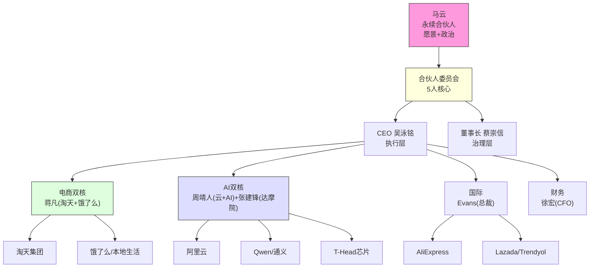
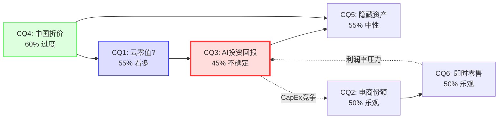

# Phase 1 — 第五章 & 第六章
# 阿里巴巴集团 (BABA) 深度研究报告
> Phase 1 Staging | 2026-02-25 | PW=7 发现系统

---

## 第五章 管理层评估与公司治理

> **本章核心命题**: 阿里巴巴正处于"创始人回归+职业经理人执行+AI转型"的三重叠加期。管理层的质量不仅决定了$53B AI投资的回报率(CQ3)，更直接影响资本配置悖论(H3)的走向。在PW=7的发现系统框架下，管理层评估不是给出一个"A/B/C"评分，而是映射"在什么条件下这个管理团队能/不能兑现承诺"。

---

### 5.1 管理层核心三人组: 马云-蔡崇信-吴泳铭

阿里巴巴当前的最高权力结构形成了一个独特的"创始人三角"——三位创始成员各占据一个关键维度:

| 维度 | 人物 | 核心功能 | 独特资产 | 风险面 |
|------|------|---------|---------|--------|
| **愿景+政治** | 马云 (Jack Ma) | 战略方向+外部关系+AI热情 | 中国最大个人股东(>4.3%)+习近平认可+商业直觉 | 无正式职位=权责不清; 政治风向可能再变 |
| **财务+国际** | 蔡崇信 (Joe Tsai) | 财务架构+资本市场+国际信誉 | 耶鲁法学院+高盛亚洲+NBA资产+VIE架构缔造者 | 多元身份(Brooklyn Nets)+注意力分散 |
| **执行+技术** | 吴泳铭 (Eddie Wu) | 日常运营+技术落地+产品执行 | 18号创始员工+阿里妈妈创造者+移动转型功臣 | CEO任期仅~2.5年, 尚未经过完整周期验证 |

**[MGT-003] [MGT-021] [MGT-009]**

**三角结构的优势与隐患**:

优势在于互补性极强。马云提供中国商业世界中无人可替代的政治资本和愿景能力(他是唯一能让习近平在企业家座谈会上点头的科技创始人 [MGT-061])。蔡崇信是华人科技公司中罕见的具备顶级西方金融素养的创始人——他1999年单枪匹马搭建了阿里巴巴的财务和法律架构 [MGT-022]，这个架构让阿里巴巴成功上市并存续至今。吴泳铭则是技术+产品双修的实战派——他创建的阿里妈妈广告平台至今仍是阿里最核心的变现引擎之一 [MGT-010]。

隐患在于问责机制的模糊性。当三个人同时拥有重大影响力时，"谁为什么负责"变得不清晰。马云没有正式职位但批准了500亿元补贴预算 [MGT-064]; 蔡崇信是董事长但同时管理NBA球队; 吴泳铭是CEO但要同时推进平台化+AI+全球化三大战略 [MGT-013]。这种结构在繁荣期运转良好(创始人光环+充裕资源)，但在逆境中——比如AI投资回报不及预期、FCF持续为负——可能出现"三个人都在指挥、没人最终负责"的局面。

**关键问题: 这是贝索斯式的创始人回归(Amazon 1997-2021，高度集权高效执行)，还是Uber式的创始人回归(Kalanick 2017，权力斗争效率低下)？**

基于现有信号，更接近前者但有保留: 马云回归后阿里确实出现了战略聚焦(从"1+6+N"松散联邦→回归核心电商+AI)，合伙人从26人精简到17人 [MGT-092]，这些都是正向信号。但保留在于: 马云的决策偏好(激进补贴战、"什么都做")是否会与吴泳铭的理性执行产生张力，目前还无法判断。

---

### 5.2 CEO Eddie Wu(吴泳铭)评估

#### 5.2.1 履历深度分析

吴泳铭的职业轨迹揭示了一个从技术骨干到业务领袖的完整弧线:

| 时期 | 角色 | 核心贡献 | 评估 |
|------|------|---------|------|
| 1999-2004 | 技术总监/CTO | 创始团队技术骨干，搭建早期基础设施 | 技术基础扎实 |
| 2005-2007 | 阿里妈妈创始人/GM | **创建阿里核心广告变现引擎**，从0→阿里早期最大现金牛 | **S级成就** — 单一产品创造了持续15年+的利润贡献 |
| 2008-2011 | 淘宝CTO+搜索广告负责人 | 整合搜索+广告+移动，为淘宝商业化奠基 | 技术→商业跨界成功 |
| 2011-2014 | 移动业务负责人 | **主导阿里向移动时代的关键转型** | **A级成就** — 内部公认为移动转型第一功臣 [MGT-011] |
| 2014-2023 | 董事长特别助理/阿里健康 | 退居二线，辅助角色 | 9年"沉默期"——蓄力还是边缘化？ |
| 2023-至今 | 集团CEO | 平台化+AI+全球化三大战略 | **进行中，混合评价** |

**[MGT-004] [MGT-005] [MGT-006] [MGT-007] [MGT-009] [MGT-010] [MGT-011]**

#### 5.2.2 CEO任期执行力评估 (2023.9 - 2026.2, ~2.5年)

| 维度 | 评分 | 依据 |
|------|:----:|------|
| **战略方向** | B+ | 正确识别AI为核心(周靖人晋升 [MGT-043])，正确识别电商需重新聚焦(蒋凡回归 [MGT-046])。但"平台化+AI+全球化"三个优先级同时推进=实质上没有优先级。 |
| **组织重构** | A- | 合伙人从26→17人 [MGT-092]，去除非核心/已离职成员，信号清晰果断。周靖人2026年1月进入核心管理委员会 [MGT-043]是最明确的AI优先级信号。 |
| **电商执行** | C+ | 份额流失从52%→40%的趋势未逆转(CQ2)。即时零售补贴战(¥800亿)是被动防御而非主动进攻。Q2 FY2026 S&M费用暴增至¥66.5B(+25% QoQ) [DM-FIN-014]但效果待验证。 |
| **AI/云执行** | B+ | 云增速Q2 +34%令人印象深刻，但Q3骤降至+13%(A1异常)。Qwen模型全球下载量领先但变现路径不清。$53B AI投资承诺展示雄心但也增加了FCF压力。 |
| **资本配置** | B- | 激进回购($11.9B FY2025 [DM-FIN-008])展示信心，但在FCF为负时同时做回购+分红+CapEx=H3悖论。净债务从-¥73.5B翻转至+¥66.8B [DM-FIN-021]是任期内最大红旗。 |
| **综合** | **B** | 方向正确但执行纪律待验证。最大未知数: 能否在马云"什么都做"的压力下维持资本配置纪律。 |

#### 5.2.3 吴泳铭的核心风险: "多线作战综合征"

CEO同时推进的战略优先级清单:

1. **平台化重构** — 从自营模式向平台模式回归(淘天集团)
2. **AI基础设施** — $53B投资+Qwen开源生态+T-Head芯片
3. **全球化网络** — AliExpress/Lazada/Trendyol/Miravia多市场扩张
4. **即时零售进攻** — ¥500亿补贴预算对抗美团/京东
5. **资产优化** — 大润发/银泰出售+蚂蚁/T-Head分拆准备
6. **组织精简** — 合伙人缩编+管理层轮换

六个战略方向同时推进，对于任何CEO而言都是极大的认知负荷和执行挑战。历史上，成功的科技公司转型通常有明确的"一件事"作为锚(比如微软Nadella的"云优先"、苹果Jobs回归时的"四象限简化")。吴泳铭尚未展示出类似的"杀手级聚焦"——或者说，他的聚焦正在形成(AI)，但还没有勇气放弃其他方向。

**证伪条件**: 如果FY2027年底前吴泳铭明确放弃1-2个战略方向(如收缩全球化或放弃即时零售)，将是执行纪律提升的强信号。

---

### 5.3 "影子CEO"风险: 马云的非正式权力

#### 5.3.1 马云当前角色的精确画像

马云在阿里巴巴的当前地位是全球上市公司中极为罕见的权力安排:

| 属性 | 状态 | 来源 |
|------|------|------|
| 正式管理职位 | **无** | [MGT-059] |
| 董事会席位 | **无** | [MGT-069-078] 10人董事会中不含马云 |
| 合伙人身份 | **永续合伙人** (终身) | [MGT-105] |
| 合伙人委员会 | **核心5人成员之一** | [MGT-106] Ma, Tsai, Wu, Zhang, Jiang Fan |
| 持股比例 | **最大个人股东 >4.3%** (~$15B+) | [MGT-066] |
| 战略参与度 | **深度**: 定期获取AI战略汇报，批准¥500亿补贴预算 | [MGT-063] [MGT-064] |
| 物理存在 | 2025年9月**回到阿里园区**，比过去五年更直接参与日常事务 | [MGT-062] |
| 政治信号 | 2025年2月出席习近平企业家座谈会 = **政治复出** | [MGT-061] |

**解读**: 马云拥有创始人的全部非正式权力(文化影响力+最大股东+合伙人委员会+战略否决权)，但不承担CEO/董事的任何正式义务(无法律问责+无信息披露义务+无绩效评估)。这是一种"权力无限、责任为零"的安排。

#### 5.3.2 马云回归的正面价值

不应低估马云回归的实际价值:

**政治资本**: 2025年2月的习近平座谈会标志着中国政府对科技巨头态度的转向 [MGT-061]。马云的公开复出是政策放松的最强信号之一——它意味着中国政府不仅停止了对阿里巴巴的整顿，而且需要阿里巴巴在AI竞赛中发挥作用。阿里巴巴美股2025年涨幅近60%，市值突破3万亿元 [MGT-068]，这其中马云回归的催化效应难以量化但不可忽视。

**AI战略直觉**: 马云对技术趋势的直觉判断有历史记录支撑——2004年的支付宝、2009年的阿里云(在其他人都不看好时坚持投入)、2017年的新零售概念。他"密切关注AI战略"[MGT-063] 并推动$53B投资承诺，至少说明阿里不会在AI浪潮中犹豫不决。

**创始人光环的组织效应**: 马云回到园区后，组织精简加速(26→17合伙人)，战略方向更加清晰(AI+电商双核)。创始人的存在对大型组织有一种无法被职业经理人复制的"重力效应"——它能加速决策、减少内耗、提升士气。

#### 5.3.3 "影子CEO"的结构性风险

然而，这种权力安排的风险同样是结构性的:

**1. 权责断裂 (Accountability Gap)**

当马云批准¥500亿补贴预算 [MGT-064]时，这笔支出谁来问责？如果补贴战失败、即时零售份额仍然打不过美团，CEO吴泳铭是否有权说"这不是我的决定"？在正式治理框架中，这笔预算应由CEO提议、董事会审批、CFO监控——但马云的非正式权力绕过了整个流程。

**2. 政治风险的单点依赖**

马云回归的价值高度依赖于一个外部变量: 中央政策风向。2020年10月马云在外滩金融峰会的演讲导致蚂蚁IPO被叫停、阿里股价从$300跌至$73(跌幅76%)。那次事件证明: 马云的政治资本可以在一夜之间归零。当前的"政治复出"如果被解读为中国需要AI竞争力而非永久性和解，那么下一次政策转向(比如中美关系恶化导致政府再次需要对科技公司"杀鸡儆猴")同样可能一夜逆转。

**3. 继任风险**

马云目前62岁。如果他的非正式权力是阿里巴巴战略凝聚力的关键(而不仅仅是锦上添花)，那么他退出公共视野的那一天将是一个重大风险事件。合伙人制度的设计初衷就是解决这个问题——但如果马云本人就是合伙人制度最大的"例外"(其他16个合伙人都没有他的影响力)，那制度就没有真正解决继任问题。

#### 5.3.4 历史类比: "影子创始人"的全球先例

| 公司 | 创始人 | 模式 | 结果 |
|------|--------|------|------|
| 苹果 | Steve Jobs (1997-2011) | 正式回归(CEO)，明确问责 | 极度成功，但Jobs去世后创新减速 |
| 微软 | Bill Gates (2000-2014) | "技术顾问"角色，逐步淡出 | 成功过渡到Nadella时代 |
| 三星 | 李家族 | 非正式控制+集团结构 | 有效但伴随法律/治理丑闻 |
| **阿里** | **马云 (2023-)** | **永续合伙人，无正式职位** | **进行中** |

马云模式最接近三星的李家族——通过非正式权力网络控制大型集团，正式治理结构主要服务于合规目的。这种模式在亚洲商业文化中并非异常，但对习惯于西方治理标准的国际投资者而言是折价因素。

---

### 5.4 组织架构变革 (2023-2026)

#### 5.4.1 "1+6+N"的提出与撤回

2023年3月，时任CEO张勇宣布将阿里巴巴拆分为"1+6+N"——一个控股集团+六大业务集团(淘天、阿里云、菜鸟、本地生活、国际数字商业、大文娱)+N个独立业务。每个业务集团拥有独立CEO和董事会，可以独立融资和上市。

然而，这一改革在6个月内就被实质性撤回。蔡崇信和吴泳铭2023年9月上任后，叫停了阿里云的IPO计划，重新将菜鸟私有化，并开始出售大润发和银泰等非核心资产。这次U-turn的信号解读:

**正面**: 说明新管理层有纠错能力。"1+6+N"的逻辑缺陷在于——拆分后各业务失去了生态协同(这正是H2"通才陷阱倒挂"假说的核心论点: 阿里巴巴的整体可能大于部分之和)。

**负面**: 说明阿里巴巴的战略方向可以在CEO换人后完全逆转。这增加了投资者对"现有战略是否会在下一次管理层变动中再次改变"的担忧。

#### 5.4.2 合伙人精简: 从26→17人的信号解码

FY2025年度的合伙人缩编是近年来阿里组织变革中信号最强的动作:

**退出的9人** [MGT-094~102]:
- 张勇(前CEO) — 权力交接完成
- 戴珊、彭蕾 — 创始元老退休
- 俞永福 — 本地生活业务非核心化
- 武卫(前CFO) — 已交接给徐宏
- 方永新、宋洁、孙利军、朱顺炎 — 非核心/子公司负责人

**新增的关键人物**:
- **蒋凡** [MGT-103] — 电商业务CEO，意味着"电商回归核心"
- **周靖人** [MGT-104] — 2025年10月入伙，2026年1月进入核心管理委员会，意味着"AI是第一优先级"

**信号总结**: 精简后的17人合伙人+5人核心委员会(马云、蔡崇信、吴泳铭、张建锋、蒋凡)清晰地传达了两个战略焦点: **电商(蒋凡)** 和 **AI(周靖人+张建锋)**。其他业务(本地生活、菜鸟、大文娱)的负责人仍在合伙人名单中但不在核心委员会——这意味着它们是被保留但非优先的存在。

#### 5.4.3 组织架构的可能性空间



**核心判断**: 阿里巴巴的组织架构正在从"松散联邦"向"双核聚焦(电商+AI)"演进。这个方向是正确的，但执行中面临的最大挑战是: 电商需要防守(补贴战消耗资源)，AI需要进攻(大规模CapEx)——两者同时进行时会产生资本配置的内在矛盾(→ H3)。

---

### 5.5 VIE架构与治理风险

#### 5.5.1 VIE结构: 投资者真正持有的是什么？

阿里巴巴的VIE(可变利益实体)架构是中概股投资中被广泛讨论但很少被深入理解的核心风险:

| 层级 | 实体 | 投资者权利 | 风险 |
|------|------|-----------|------|
| **L1: 投资者持有** | 开曼群岛控股公司股份(BABA/9988) | 分红权+投票权(有限) | 开曼法律保护，非中国法律 |
| **L2: 控股公司持有** | 香港/BVI中间控股公司 | 100%股权(子公司) | 跨境资金流转受限 |
| **L3: WFOE(外商独资)** | 中国境内技术服务公司 | 100%股权 | 中国法律管辖 |
| **L4: VIE协议** | 与中国运营实体的合同安排 | **仅有合同权利，无股权** | **从未在中国法院系统性测试** [MGT-133] |
| **L5: 运营实体** | 中国境内持牌公司(电商/支付/云/媒体) | 由中国公民/实体持有 | 中国政府有最终管辖权 |

关键点: 当投资者购买BABA ADR时，他们**不直接拥有**阿里巴巴在中国的任何运营资产。他们拥有的是一个开曼群岛壳公司的股份，而这个壳公司通过一系列合同安排(独家业务合作协议、技术服务协议、贷款协议、股权质押、独家购买权 [MGT-130])来获取中国运营实体的经济利益。

**[MGT-129] [MGT-130]**

#### 5.5.2 VIE升级: 降低关键人风险

阿里巴巴正在进行一项重要的VIE结构升级 [MGT-131]:

**旧结构**: VIE由少数个人(通常是创始人/高管)名义持有
- 风险: 个人离世、离职、被制裁→VIE控制链断裂

**新结构**: VIE由有限责任公司持有，再通过有限合伙层由多位中国公民间接持有
- 改善: 降低关键人风险和继任风险 [MGT-132]
- 加强: 通过多层合同安排强化控制

**评估**: VIE升级是一个正面但增量的改善。它解决了"马云出事→VIE断裂"的极端场景，但不解决VIE的根本性法律风险——即中国法院可能在任何时间点裁定VIE合同安排无效。

#### 5.5.3 合伙人制度 vs 股东权利: 治理折价量化

阿里巴巴的合伙人制度 [MGT-089] 赋予合伙人一项极端权力: 提名董事会简单多数的董事。如果提名被股东否决，合伙人可以增补额外董事以确保多数控制 [MGT-090]。

这意味着: **外部股东对董事会组成几乎没有有效话语权。**

对比全球治理标准:

| 治理维度 | 阿里巴巴 | 标准做法 | 折价因子 |
|---------|---------|---------|:-------:|
| 董事提名 | 合伙人提名多数+否决后可增补 | 独立提名委员会 | -3% |
| 同股同权 | 是(无双重股权) | 是 | 0% |
| 董事会独立性 | 60%独立 [MGT-079] | 一般要求>50% | +1% |
| 高管薪酬透明度 | 仅汇总披露(FPI豁免) [MGT-128] | 个人Named Executive Officer明细 | -2% |
| 创始人非正式权力 | 马云无职位但深度参与 | 正式职位或完全退出 | -2% |
| **合计治理折价** | | | **~-6%** |

注: 治理折价是估值折价的组成部分之一(另含VIE折价、中国宏观折价等)，将在后续估值章节综合评估。

---

### 5.6 资本配置评估 (H3验证)

> **H3核心命题**: BABA同时做$53B AI投资+$12B回购+$4B分红是非理性的——FCF已经转负，应该暂停回购集中投AI。当前的"什么都做"策略反映管理层信心还是治理问题？

#### 5.6.1 资本配置全景 (FY2021-FY2025)

| 指标 | FY2021 | FY2022 | FY2023 | FY2024 | FY2025 | 趋势 |
|------|:------:|:------:|:------:|:------:|:------:|:----:|
| OCF (¥B) | 212.8 | 172.4 | 172.0 | 189.1 | 164.8 | 下降 |
| CapEx (¥B) | 41.7 | 52.4 | 34.4 | 33.2 | **86.7** | **暴增** |
| FCF (¥B) | 171.1 | 120.0 | 137.6 | 155.9 | **78.2** | **腰斩** |
| 回购 (¥B) | 14.2 | 62.9 | 68.0 | 70.5 | **87.4** | 持续升级 |
| 分红 (¥B) | 0 | 0 | 0 | 0 | **29.3** | 新增 |
| 总回报 (¥B) | 14.2 | 62.9 | 68.0 | 70.5 | **116.7** | 持续升级 |
| FCF-总回报 | +156.9 | +57.1 | +69.6 | +85.4 | **-38.5** | **首次转负** |

**[DM-FIN-007] [DM-FIN-008] [DM-FIN-015]**

#### 5.6.2 H3悖论的数学表达

FY2025的资本配置方程:

```
经营现金流     ¥164.8B
- CapEx        ¥86.7B   (AI基础设施+云数据中心)
= FCF          ¥78.2B
- 回购         ¥87.4B   (超过FCF!)
- 分红         ¥29.3B
= 资金缺口     -¥38.5B  → 由净借款填补
```

这意味着: **阿里巴巴在FY2025是借钱来回购股票的。** 净债务从FY2024的净现金¥73.5B翻转为净负债¥66.8B [DM-FIN-021]，¥140.3B的资产负债表恶化在一年内完成。

#### 5.6.3 资本配置记分卡

| 维度 | 评分 | 详解 |
|------|:----:|------|
| **回购纪律** | A- | FY2025回购$11.9B(占市值~3.5%)，4年累计减少12.1%流通股 [DM-FIN-024]。剩余$19.1B授权至2027年3月 [MGT-122]。但: 执行节奏从FY2025的$11.9B/年降至近期~$1-2B/年 [SMT-018] — 可能意识到FCF不足。 |
| **分红策略** | B | FY2024首次分红(起步晚但方向正确)。FY2025 ¥29.3B(yield 1.3%)适中。风险: 如果FCF持续不足，分红可能成为刚性支出。 |
| **CapEx纪律** | B- | ¥86.7B(+161% YoY)——绝对增幅惊人。但对比全球云厂商CapEx周期: AWS 2015 CapEx暴增→3年后回落。问题是BABA同时投AI+基建+即时零售，三业务CapEx叠加使周期可能更长。 |
| **M&A/处置** | A | 模式从"收购一切"转向"出售非核心"(大润发、银泰)。正确方向。但蚂蚁和T-Head的"拆分/IPO"迟迟不落地。 |
| **总体纪律** | **B** | 方向正确(回购+剥离+聚焦)但纪律不足(FCF<0时仍借钱回购)。 |

#### 5.6.4 H3的两种解读

**解读A: 管理层信心信号 (乐观)**

管理层认为当前股价严重低估(FMP DCF隐含81%上行空间 [DM-VAL-005])，因此在FCF低谷期借钱回购是理性的——如果股价最终修复到公允价值，低价回购的IRR将远超借款成本(阿里BBB+级债券利率~3-4%)。同时，$53B AI投资的回报期在FY2028-2029，不应因短期FCF压力放弃长期投资。

**解读B: 治理缺陷信号 (悲观)**

马云批准的¥500亿补贴预算 [MGT-064] + 管理层的激进回购 = 讨好不同利益方(补贴讨好马云的增长偏好，回购讨好国际投资者)而非基于整体最优的资本配置。在一个正式治理架构下，独立董事应该在FCF转负时叫停回购，将资源集中到NPV最高的用途(如果是AI投资，就集中投AI；如果是回购，就暂停AI)——但合伙人制度下独立董事缺乏实际否决权 [MGT-090]。

**H3初步判断**: 两种解读目前都成立，无法证伪。关键观察变量:
- FY2026-2027回购节奏: 如果从$11.9B→$2-3B = 解读A(管理层在调整)
- FY2026-2027回购节奏: 如果维持$8B+ = 解读B(治理失控)
- 近期数据显示回购已从$11.9B/年降至~$1-2B/年 [SMT-018]，初步支持解读A

---

### 5.7 激励对齐度分析

#### 5.7.1 经济利益对齐

| 内部人 | 持股 | 价值(估算) | 对齐度 |
|--------|------|-----------|:------:|
| 马云 | >4.3% | ~$15.3B+ | 极高 |
| 蔡崇信 | ~1.4% | ~$5.0B+ | 极高 |
| 吴泳铭 | <1% (未披露) | — | 中等 |
| 其他管理层 | 集体~0.5-1% | ~$31亿(集体) [MGT-113] | 中等 |
| **内部人合计** | ~5-6% | ~$20B+ | **显著** |

**对齐信号**:
- 马云2023年Q4增持~$5000万 [MGT-065] — 在股价低位时用真金白银买入
- 蔡崇信通过Blue Pool Management购入$1.52亿 [SMT-082] — 家族资金大举加仓
- 公司FY2025回购$11.9B [DM-FIN-008] — 管理层最强的"认为低估"信号
- SBC政策转向现金薪酬 [MGT-125] — 减少对股价的人为推升，正面

**反对齐信号**:
- FPI豁免=个人薪酬不透明 [MGT-128] — 无法评估短期激励vs长期股权比例
- 马云无正式职位=无正式绩效评估 — 其决策(如¥500亿补贴)不受股东约束
- 吴泳铭持股比例低+未披露 — CEO的经济利益对齐不如创始人强

#### 5.7.2 综合激励评级

| 维度 | 评分 | 权重 | 加权 |
|------|:----:|:----:|:----:|
| 经济利益对齐(持股) | 8/10 | 35% | 2.80 |
| 回购行为信号 | 8/10 | 25% | 2.00 |
| 薪酬透明度 | 3/10 | 20% | 0.60 |
| 治理架构 | 5/10 | 20% | 1.00 |
| **综合** | | | **6.40/10 = B+** |

**综合评级: B+ (强经济对齐，弱治理透明)**

创始人和管理层的经济利益与股东高度一致(>$20B的skin in game是不可忽视的信号)。回购行为进一步确认了管理层认为当前股价低估的信念。但治理架构(合伙人制度+FPI豁免+"影子CEO")使得外部股东在信息不对称和制衡能力上处于劣势。

**对估值的含义**: 激励对齐度B+意味着管理层有动机做正确的事(他们的财富与股东同向波动)，但缺乏有效的外部制衡机制来防止他们做出善意但非最优的决策(如H3的"什么都做"策略)。

---

### 5.8 本章总结: 管理层可能性空间映射

在PW=7的发现系统下，管理层评估的输出不是单一评分，而是条件化的可能性映射:

| 条件 | 管理层评估 | 对估值的影响 |
|------|-----------|:----------:|
| AI投资回报显现(FY2028 云EBITA margin>15%) + 电商份额企稳 | **A级**: 马云的愿景+吴泳铭的执行=黄金组合 | +15-25% |
| AI投资回报延迟 + 电商继续流失 + 但管理层及时调整(削减回购/聚焦) | **B级**: 有自我纠错能力的团队 | +5-10% |
| AI投资回报不明 + 电商补贴战持续消耗 + "影子CEO"干预导致资本配置失序 | **C级**: 治理缺陷暴露 | -10-15% |
| 政治风向再次转向(马云再次被边缘化) + VIE法律风险实质化 | **D级**: 结构性治理危机 | -30-50% |

**Phase 1对H3的初步判断: 悖论存在但可能正在自我修正。** 回购节奏从$11.9B→$1-2B/年的放缓是最关键的信号——它暗示管理层意识到了FCF约束。如果FY2026-2027继续维持低回购+高AI投资，H3的"非理性"叙事将被削弱; 如果回购重新加速(比如股价进一步下跌时管理层"逢低买入")而FCF没有改善，H3将被强化。

---

---

## 第六章 市场定价信号与核心问题路由

> **本章核心命题**: 阿里巴巴是当前全球大型科技股中"定价信号密度"最高的公司之一——预测市场、分析师共识、机构持仓和技术指标发出的信号相互矛盾，而这种矛盾本身就是信息。在PW=7的发现系统下，本章的任务不是给出"综合判断"，而是映射所有定价信号的位置和方向，为后续章节提供分析锚。

---

### 6.1 预测市场概率矩阵

基于Polymarket、Kalshi等平台的实时数据，阿里巴巴面临的外部概率事件可分为四个象限:

#### 6.1.1 地缘政治事件

| 事件 | 概率 | 交易量 | 时间窗口 | DM锚点 |
|------|:----:|-------:|---------|--------|
| 台海军事冲突(clash) | 13.5% | $841K | 2026年底前 | PMK-010 |
| 台海冲突(invasion) | 10% | $9.3M | 2026年底前 | PMK-010 |
| 台海封锁(blockade) | 5.5% | $564K | 2026年6月底前 | PMK-010 |
| 习近平离任 | 8% | $6.4M | 2027年前 | PMK-011 |
| 特朗普访华(4月底前) | **94%** | $416K | 2026年4月底 | PMK-012 |
| 特朗普访华(3月底前) | **77%** | $764K | 2026年3月底 | PMK-012 |

**解读要点**:

**台海风险的分层结构**: 预测市场将"台海冲突"拆分为三个强度级别——封锁(5.5%)→冲突(10%)→全面军事对抗(13.5%)。$9.3M的"invasion"市场是所有BABA相关预测市场中交易量最大的，说明这是全球资金最关注的尾部风险。10%的概率看似不高，但乘以条件影响(-40%~-60%)后，概率加权影响达-4%~-6%——是所有单一负面事件中最大的。

**特朗普访华的催化效应**: 94%的概率使得这几乎是一个"确定性正面催化"。历史上，中美领导人会面通常伴随贸易/投资协议或至少是气氛缓和信号。如果访华在Q1-Q2 2026发生(概率极高)，可能触发中概股整体估值修复，BABA作为最大的中概股将直接受益。

#### 6.1.2 贸易与关税

| 关税区间(2026年3月31日) | 概率 | 概率加权关税 | DM锚点 |
|----------------------|:----:|:---------:|--------|
| < 5% | 2.0% | | PMK-020 |
| 5-15% | 24% | | PMK-020 |
| **15-25%** | **69%** | | PMK-020 |
| 25-35% | 1.4% | | PMK-020 |
| >= 35% | 1.95% | | PMK-020 |
| **加权关税率** | — | **~15.7%** | PMK-020 |

**解读**: 市场预期中美关税将稳定在15-25%区间(69%概率)，远低于2025年峰值(超过100%)。2025年中美贸易协议的减税效果已被市场消化 [PMK-021]。概率加权关税约15.7%，这对BABA的跨境电商(AliExpress/Lazada)构成中等压力，但相比极端场景已大幅改善。

关键洞察: 关税风险已基本"price-in"(69%概率落在最可能区间=市场共识明确)。真正的非线性风险是关税**意外上升**(>35%仅1.95%概率)或**意外下降**(<5%仅2%概率)。两种极端场景发生的概率都极低。

#### 6.1.3 宏观经济

| 事件 | 概率/预测 | 来源 | DM锚点 |
|------|----------|------|--------|
| 美国衰退(2026年底前) | 22.5% | Polymarket | PMK-030 |
| 中国GDP增速 | 4.2-4.8%(机构共识区间) | GS/UBS/Vanguard/IMF | PMK-031 |
| 中国GDP 4.8%(乐观) | — | Goldman Sachs | PMK-031 |
| 中国GDP 4.2%(保守) | — | IMF | PMK-031 |

**解读**: 美国衰退概率22.5%，从2025年峰值(~45%)大幅回落。中国GDP共识4.2-4.8%意味着温和增长而非硬着陆——足以支撑阿里巴巴的国内电商GMV基线增长，但不足以支撑估值大幅扩张。

**BABA特有关联**: 美国衰退对BABA的传导路径是间接的(风险偏好下降→中概股折价扩大)，而中国GDP则是直接的(消费支出→电商GMV→TTG收入)。4.5%的GDP增速隐含~7-10%的线上零售增速——这与共识预期的BABA FY2027收入增速+10.4% [DM-VAL-009] 大致吻合。

#### 6.1.4 行业与公司特定事件

| 事件 | 概率 | 交易量 | BABA关联 | DM锚点 |
|------|:----:|-------:|---------|--------|
| AI安全法案(美国,2026年底前) | 41% | $42.8K | 间接利好(可能限制美国AI→缩小中美差距) | PMK-040 |
| AI数据中心暂停令 | 29% | $7.3K | 间接利好(减缓美国AI基建) | PMK-040 |
| DeepSeek V4发布(3月底前) | **70%** | $36.7K | **直接竞争压力** — 加剧中国AI价格战 | PMK-041 |
| DeepSeek V4发布(3月15日前) | 50% | $31.7K | 同上 | PMK-041 |
| BABA拥有最佳AI模型(2月底) | **0.05%** | $1.25M | 市场完全排除BABA AI领先可能 | PMK-001 |
| BABA拥有最佳AI模型(6月底) | **1.05%** | $36.1K | 即使到6月仍接近零概率 | PMK-001 |
| BABA最佳编程AI(3月底) | 0.15% | $36.2K | 专项能力也被市场排除 | PMK-001 |

**关键洞察**:

**DeepSeek V4是最具BABA特异性的近期事件**: 70%概率在3月底前发布。如果DeepSeek V4在性能上显著超越Qwen3.5，将直接压缩阿里云AI服务的定价能力——因为DeepSeek采用开源+极低成本路线，与阿里的Qwen开源策略形成正面竞争。这不是零和博弈(中国AI生态扩大对所有玩家有利)，但在边际上会压缩利润率。

**市场对BABA AI领先概率的极端悲观(0.05-1.05%)是重要信号**: 这意味着$53B AI投资的回报**不应基于"模型领先"叙事**——Qwen不需要成为全球最佳模型也能创造价值。真正的变现路径是: 通过开源模型吸引开发者→引导到阿里云基础设施→基础设施收费。类比: Linux从未"赢得"操作系统之战(Windows/macOS仍然主导消费者市场)，但Linux驱动了全球90%+的云服务器。

**无ADR退市专项市场的"狗没叫"信号 [PMK-050]**: 2022年时Polymarket有活跃的退市预测市场。现在没有=市场共识认为ADR退市风险已从"紧迫"降级为"长尾"。PCAOB连续合规+港股双重主要上市提供了充分的结构性对冲。

---

### 6.2 概率加权影响评估

将所有预测市场事件的概率和条件影响量化为BABA市值的概率加权变动:

| 事件 | 概率 | 条件影响 | 概率加权影响 | 方向 | 信号质量 |
|------|:----:|:-------:|:----------:|:----:|:-------:|
| 特朗普访华+贸易缓和 | 94% | +5%~+10% | **+4.7%~+9.4%** | 正面 | 高(交易量大) |
| 台海冲突(取10%) | 10% | -40%~-60% | **-4.0%~-6.0%** | 负面 | 高($9.3M) |
| 美国衰退 | 22.5% | -15%~-20% | **-3.4%~-4.5%** | 负面 | 中($278K) |
| DeepSeek V4竞争 | 70% | -2%~-5% | **-1.4%~-3.5%** | 负面 | 中($36.7K) |
| AI安全法案(间接利好) | 41% | +2%~+5% | **+0.8%~+2.1%** | 正面 | 低($42.8K) |
| 习近平离任 | 8% | +/-20% | **+/-1.6%** | 双向 | 中($6.4M) |
| BABA AI突破 | ~1% | +10%~+20% | **+0.1%~+0.2%** | 正面 | 低(概率太低) |
| 关税维持15-25% | 69% | ~0%(已price-in) | **0%** | 中性 | 高(共识明确) |

**净概率加权影响: -3.2% ~ +3.7%**

#### 6.2.1 影响矩阵的非对称性分析

上述净影响看似"中性"，但这种中性掩盖了一个关键的非对称结构:

**正面催化高度集中在一个事件上**: 特朗普访华贡献了几乎全部正面概率加权影响(+4.7%~+9.4%)。如果这个94%概率的事件因某种原因不发生(比如中美关系突然恶化)，正面催化将瞬间归零，净影响变为-8%~-12%。

**负面风险高度分散**: 台海(-4%~-6%)、衰退(-3.4%~-4.5%)、DeepSeek竞争(-1.4%~-3.5%)三个独立负面因素的概率互相关联度低——它们不太可能同时发生，但任何一个都足以单独造成显著冲击。

**最被低估的风险维度**: 预测市场不覆盖的风险——中国监管再次收紧、即时零售补贴战升级对利润率的持续消耗、蚂蚁IPO被无限期推迟——这些没有对应的预测市场，因此不在上述矩阵中。**预测市场的覆盖盲区可能恰好是最重要的公司特定风险所在。**

#### 6.2.2 概率事件的时间维度

```
2026 Q1        Q2          Q3          Q4        2027
  |            |           |           |           |
  ├─ DeepSeek V4 (70% by Mar)
  ├─ Trump访华 (77% by Mar / 94% by Apr)
  |                                    ├─ AI安全法案 (41% by Dec)
  |                                    ├─ 台海冲突 (10% by Dec)
  |                                    ├─ US recession (22.5% by Dec)
  |                                    ├─ Xi离任 (8% by Dec)
  |
  近期催化密度 ████████████████
  远期尾部风险                         ████████████████████
```

**时间结构含义**: 近期(Q1-Q2 2026)催化密度高(特朗普访华+DeepSeek发布)，而尾部风险集中在下半年到2027年。这意味着BABA可能在短期内受益于正面催化(中美缓和)，但中长期的尾部风险(台海、衰退)构成持续的隐含折价。

---

### 6.3 市场注意力热力图 (Top 10)

基于过去30天的卖方报告频率、财经媒体覆盖密度和散户论坛关注度，BABA当前的市场注意力分布如下:

| Rank | 维度 | Heat | 来源分布 | 框架映射 | CQ关联 |
|:----:|------|:----:|---------|---------|--------|
| 1 | **AI投资回报率** — $53B投资何时/能否回收 | **10** | GS/MS/JPM卖方+全球媒体+散户 | CT05+TP03 | CQ1, CQ3 |
| 2 | **云增速剧烈波动** — Q2 +34%→Q3 +13%，减速还是噪音？ | **9** | 财报分析+分析师 | TP03+CT05 | CQ1 |
| 3 | **即时零售补贴战** — 阿里/美团/京东三方¥800亿对峙 | **9** | 中国媒体+行业报告 | CT03 | CQ2, CQ6 |
| 4 | **Qwen3.5+DeepSeek冲击** — 中国AI格局重塑 | **8** | 全球科技媒体 | CT05 | CQ1, CQ3 |
| 5 | **电商份额命运** — 淘天40-44%能否守住 | **8** | 卖方+行业数据 | CT03 | CQ2 |
| 6 | **Q3 FY2026财报解读** — 营收beat/EPS miss信号分化 | **8** | 2/20财报日后密集 | M01 | 全部 |
| 7 | **蚂蚁/T-Head分拆催化** — 隐含估值释放 | **7** | 投行+IPO市场 | CT06 | CQ4, CQ5 |
| 8 | **五角大楼CMC名单+地缘风险** — 短期冲击已消化 | **7** | 地缘政治分析 | CT01+CT02 | CQ3 |
| 9 | **回购/分红持续性** — FCF转负后资本配置悬念 | **7** | 价值投资者 | M05 | CQ5, H3 |
| 10 | **管理层变化** — 马云回归+组织重构 | **6** | 中国媒体+治理分析 | CT06 | 治理 |

**注意力热力图的洞察**:

**AI统治了注意力**: 前4名中有3个直接与AI相关(AI投资回报率、云增速、Qwen/DeepSeek)。这反映了全球"AI叙事"对BABA估值话语权的支配。然而，从基本面权重看，电商(TTG)贡献~65%收入——电商份额命运(Rank 5)在注意力排名中低于AI(Rank 1)，但在估值影响中可能更大。

**即时零售(Rank 3)是"低关注高影响"的潜在盲区**: ¥800亿补贴战在中国媒体中热度极高但在国际投资者视野中不够突出。这场战争直接影响BABA的利润率(Q2 FY2026 S&M暴增25% [DM-FIN-014])和FCF(→CQ5)，但被AI叙事覆盖。

**"狗没叫"的维度**: ADR退市风险(无专项预测市场+不在注意力Top 10)说明市场已经不把它当作近期风险。但VIE结构的长期法律不确定性 [MGT-133] 并没有因为市场不关注而消失——它只是被暂时忽略了。

---

### 6.4 核心问题清单 + 初始假设

#### 6.4.1 CQ预注册表

基于Phase 0-0.75的分析，6个核心问题(CQ)的初始假设、置信度和约束分类如下:

| CQ# | 核心问题 | 初始假设方向 | 置信度 | 约束分类 | 证伪条件 | 估值影响(EV) |
|:---:|---------|:----------:|:-----:|---------|---------|:-----------:|
| **CQ1** | 阿里云的"零值"定价是否为极端错误？ | 市场严重低估(看多) | **55%** | 周期性+制度性 | 连续4Q云增速<15% | ±20-30% |
| **CQ2** | 电商份额流失何时/在何处企稳？ | 将在37-42%企稳(中性偏乐观) | **50%** | 结构性+周期性 | FY2027淘天GMV份额<35% | ±15-20% |
| **CQ3** | $53B AI投资是价值创造还是毁灭？ | 高度不确定(五五开) | **45%** | 结构性(开源vs闭源) | FY2028云EBITA margin<15% | ±25-35% |
| **CQ4** | 中国折价的理性边界在哪里？ | 当前折价偏过度(看多) | **60%** | 制度性(VIE) | VIE法规重大变化 | ±15-30% |
| **CQ5** | 隐藏资产释放有可行路径吗？ | 有路径但时间不确定(中性) | **55%** | 制度性+周期性 | 蚂蚁+T-Head IPO均推迟至2028后 | +10-20% |
| **CQ6** | 即时零售补贴战的赢家是谁？ | 阿里获25-30%稳态份额(乐观) | **50%** | 周期性+结构性 | 补贴退出后份额<15% | ±5-10% |

#### 6.4.2 CQ置信度的可视化分布

```
置信度分布 (初始 Phase 0):

CQ4 中国折价  ████████████████████████████████████████████████ 60%  ← 最有信心(过度折价)
CQ1 云零值    ██████████████████████████████████████████████   55%
CQ5 隐藏资产  ██████████████████████████████████████████████   55%
CQ2 电商份额  ████████████████████████████████████████████     50%
CQ6 即时零售  ████████████████████████████████████████████     50%
CQ3 AI投资    ██████████████████████████████████████           45%  ← 最不确定(核心矛盾)

注: 置信度<50%意味着初始假设方向本身就不稳固
```

**分布含义**: CQ3(AI投资回报)是置信度最低的核心问题(45%)，恰好也是估值影响最大的(±25-35% EV)。这构成了一个"高不确定性×高影响"的分析锚——它决定了整个报告的叙事走向。如果在Phase 2-3的深度分析后CQ3的置信度仍然<50%，那报告的最终结论将高度依赖于读者对AI投资回报的主观判断(这在PW=7的发现系统下是可以接受的——映射条件比给出结论更重要)。

#### 6.4.3 CQ之间的关联结构

核心问题并非独立——它们构成一个相互影响的网络:



**关键关联路径**:

1. **CQ4→CQ1**: 中国折价直接影响云的定价。如果中国折价合理水平是15-25%(CQ4初始假设)，而市场当前给了40-50%折价，那么云资产的"零值"至少部分来源于过度的国别折价而非基本面。

2. **CQ3→CQ5**: AI投资回报直接决定T-Head和蚂蚁AI业务的估值。如果$53B投资被证明正NPV(CQ3看多)，T-Head的IPO估值将显著高于市场当前隐含价值。

3. **CQ6→CQ3 (反向传导)**: 即时零售补贴战的利润率消耗(Q2 FY2026 S&M暴增25%)直接挤压了可用于AI投资的现金流。如果CQ6的答案是"补贴战持续3年+"，那CQ3的FCF恢复时间表将进一步延后。

4. **CQ3→CQ2 (资源竞争)**: $53B AI CapEx与电商补贴共同争夺有限的资本。如果管理层必须在AI投资和电商防守之间做选择(→H3)，电商份额可能因投资不足而继续流失。

---

### 6.5 CQ-章节映射表

每个核心问题将在后续章节中被系统性地展开和验证:

| CQ | 主力章节 | 辅助章节 | 执行权重 | Phase |
|----|---------|---------|:-------:|:-----:|
| **CQ1: 云零值** | Ch05(AI投资回报)+Ch11(AI生态) | Ch14(Reverse DCF)+Ch13(SOTP) | **1.3** | P2-P3 |
| **CQ2: 电商份额** | Ch06(电商5平台矩阵) | Ch05(护城河)+Ch07(增长分析) | **1.1** | P1-P2 |
| **CQ3: AI投资** | Ch11(AI生态协同)+Ch12(AI深度) | Ch09(FCF分析)+Ch14(信念反演) | **1.3** | P2-P4 |
| **CQ4: 中国折价** | Ch07(VIE深度)+Ch08(监管温度) | Ch09(宏观)+Ch14(相对估值) | **1.1** | P2-P3 |
| **CQ5: 隐藏资产** | Ch08(蚂蚁+T-Head)+Ch10(催化剂) | Ch13(SOTP) | **1.0** | P2-P3 |
| **CQ6: 即时零售** | Ch06(竞争矩阵) | Ch07(增长)+Ch09(FCF) | **0.9** | P1-P2 |

**执行权重说明**: CQ1和CQ3的权重最高(1.3)，因为它们共同决定了BABA估值最大的不确定性来源——AI投资周期的长度和回报。CQ6权重最低(0.9)，因为即时零售更多是利润率的边际影响而非估值的决定性变量。

#### 6.5.1 H假说-CQ映射

三个非共识假说(H1-H3)与CQ的对应关系:

| 假说 | 主力CQ | 验证路径 |
|------|--------|---------|
| **H1: 云增速薛定谔** | CQ1+CQ3 | Phase 2深度分析Q2→Q3减速原因(大客户时间差/季节性/真实减速) |
| **H2: 通才陷阱倒挂** | CQ6(SGI诊断) | Phase 2 SOTP vs 整体估值张力分析(拆开更值钱→通才折价; 拆开更不值钱→生态溢价) |
| **H3: 资本配置悖论** | CQ5(FCF)+治理(Ch05) | Phase 2 FCF敏感性分析(回购削减情景 vs 维持回购情景) |

---

### 6.6 本章总结: "异常密度"作为分析锚

#### 6.6.1 BABA的定价异常密度

Phase 0-0.75的分析揭示了阿里巴巴身上异常高的"定价异常密度":

| 异常类别 | 数量 | 代表性异常 |
|---------|:----:|-----------|
| **数据异常**(偏差>20%) | 9个 | A1(云增速断崖-62%)、A2(CapEx+161%)、A3(PE溢价+80-127%)、A4(ROIC 32%不可信)、A5(EV/Sales数据矛盾)、A6(Beta 0.39异常低)、A7(净债务方向反转)、A8(股息率数据矛盾)、A9(SBC数据缺失) |
| **定价矛盾** | 4个 | PE溢价中概同行但折价全球科技; 云增速34%→13%两种叙事; 回购>FCF但仍在进行; 蚂蚁/T-Head隐含零值 |
| **预测市场矛盾** | 2个 | 特朗普访华94%(强正面) vs 台海冲突10%(强负面)同时存在; BABA AI <1%(极悲观) vs $53B投资(极乐观) |
| **机构行为矛盾** | 3个 | Tepper连续4Q减持但仍持11%仓位; Bridgewater Q1加仓3360%→Q2全部退出; Burry在4个季度内从看多→看空→看多→退出 |
| **总计** | **18个异常** | |

**18个异常/矛盾同时存在于一家$355B市值的公司身上——这本身就是一个异常。**

#### 6.6.2 异常密度的含义

高异常密度不代表"低估"或"高估"。它代表的是: **市场对这家公司的定价编码了多个相互矛盾的信念。**

具体地:
- **信念1: "BABA是中国AWS"** → 隐含PE 25-30x (当前17x = 低估)
- **信念2: "BABA是衰落中的零售商"** → 隐含PE 8-10x (当前17x = 高估)
- **信念3: "VIE+中国=不可投资"** → 隐含PE 0x (当前17x = 高估)
- **信念4: "马云回归=政策反转"** → 隐含PE 20-25x (当前17x = 接近)
- **信念5: "AI投资是烧钱无底洞"** → 隐含PE 12-14x (当前17x = 轻微高估)

当前$153.11的股价是上述5种信念(以及更多微妙信念)的**加权平均**。不同投资者持有不同的信念组合，他们的集体行为产生了当前价格。

#### 6.6.3 发现系统的分析策略

在PW=7的发现系统下，本报告的目标不是裁判"哪种信念正确"，而是:

1. **映射每种信念的边界条件**: 在什么数据/事件下每种信念会被强化或证伪？
2. **量化每种信念对估值的影响**: 如果信念X被证明正确，BABA值多少？
3. **识别"多种信念同时被证实"的高概率路径**: 是否存在一个未来状态使得多个看似矛盾的信念同时成立？(比如: "BABA同时是衰落的零售商和崛起的AI平台"——这两者不矛盾，它们描述的是同一家公司的不同部分。)
4. **标记最脆弱的信念**: 哪个信念最有可能在最短时间内被推翻，从而触发最大幅度的重新定价？

**Phase 1初步判断**: 信念3("VIE+中国=不可投资")和信念5("AI投资是烧钱无底洞")看起来是最脆弱的——前者因为ADR退市风险的实质性降低(PCAOB合规+港股双重上市)，后者因为全球AI基础设施支出的周期性(3-5年建设期→折旧后回报)。如果这两个信念在2026-2027被市场修正，即使其他信念不变，BABA的估值空间也存在15-25%的上行可能。

但这不是结论——这是需要在Phase 2-4中用数据验证的**初始假设**。

---

#### 6.6.4 从Phase 1到Phase 2的过渡锚

| Phase 1完成的工作 | Phase 2需要做的工作 |
|------------------|-------------------|
| 管理层画像+激励评级(B+) | 管理层历史执行力的量化回测(KPI完成率) |
| 预测市场概率矩阵 | 概率矩阵→情景模型的数学转换 |
| CQ初始假设+置信度 | CQ深度分析→置信度更新 |
| H3资本配置悖论识别 | H3 FCF敏感性建模(Python验证) |
| 18个定价异常识别 | 每个异常的因果链追踪→证伪/确认 |
| 市场注意力Top 10 | 注意力盲区的补充分析(即时零售深度) |

**Phase 1的核心产出: 报告的分析锚已经确立。**

AI投资周期长度是本报告的中心变量(核心论题已确认)。围绕这个中心变量，6个CQ、3个H假说、18个异常构成了一个完整的"信念网络"。Phase 2-4的任务是逐一检验网络中每个节点的强度，最终映射出一个条件化的可能性空间。

---

*本章DM锚点引用: DM-FIN-007, DM-FIN-008, DM-FIN-014, DM-FIN-015, DM-FIN-021, DM-FIN-024, DM-VAL-002, DM-VAL-005, DM-VAL-009, DM-MKT-001, MGT-003~155, PMK-001~050, SMT-014~082*

*预测市场数据截止: 2026-02-25 | 所有概率为该日实时快照*
