# CME Group (NASDAQ: CME) — 深度投资研究报告

## 执行摘要

---

### 公司一句话

**CME Group不是一家交易所——它是全球不确定性的基础设施垄断者。98%的美元利率期货、$600万亿日盯市名义金额、44年零清算穿透，构成了人类金融体系中最难复制的单一节点。**

---

### 核心数据 (FY2025, 截至2026.3)

| 指标 | 值 | 评价 |
|------|-----|------|
| **股价** | $311.40 | 近52周高位 |
| **市值** | ~$112B | 360M流通股 |
| **P/E TTM** | 27.9x | 5年均值~25x |
| **EPS (GAAP)** | $11.16 | +6.7% YoY |
| **Revenue** | $6,521M | +6.4% YoY，连续5年创纪录 |
| **OPM** | 64.9% | 行业最高之一 |
| **净利率** | 62.0% | |
| **FCF** | $4,194M | FCF/NI = 103.7% |
| **CapEx/Revenue** | 1.3% | 几乎零资本消耗 |
| **D/E** | 0.13x | 净现金$0.67B |
| **股息率** | 4.0% | 含$6.15特别股息 |
| **ADV** | 28.1M合约 | FY2025历史新高 |
| **Beta** | 0.26 | 极低，但具误导性 |

[DM-ES-01] 收入/利润/ADV数据来自CME Group FY2025 10-K; [DM-ES-02] 市值基于360M股×$311.40

---

### 投资温度: 69 (常温偏热)

| 维度 | 信号 | 含义 |
|------|------|------|
| 宏观 | CAPE高位+地缘不确定性 | 波动率环境有利但估值偏贵 |
| 估值 | P/E 27.9x，FCF Yield 3.7% | 略高于历史中枢 |
| 品质 | A-Score 68.4(历史最高)，CQI 93/100 | 品质极强，部分抵消估值 |
| 情绪 | ADV连续创纪录，市场偏乐观 | "甜蜜点"叙事已充分定价 |

---

### A-Score品质: 68.4/70 | 强偏好 (框架内最高分)

- **I×L**: 49/50 (I=25满分, L=24)——框架评估过的所有公司中最高
- **C1护城河+C2锁定+C5规模**: 三项满分5.0，史无前例
- **D1反脆弱系数**: ×1.18——4次危机ADV全部上升
- **B2客户锁定**: 5/5 (四层锁定: 流动性+清算+保证金+数据)
- **复利路径**: I类——反脆弱基础设施(制度垄断+波动红利+分红复利)

[DM-ES-03] A-Score评分来自quality_scorecard.md品质评估

---

### 核心矛盾

> **"CME被定价为低波动防御性资产(Beta 0.26 / 4%股息率)，但其收入引擎高度依赖波动率周期。市场无法同时买入'稳定'和'波动率看涨'——当前28x P/E隐含'永续中高波动率'假设。"**

这不是两个独立论点，而是同一枚硬币的两面在互相否定。如果CME是防御性的(低波动=收入稳定)，它不该在VIX飙升时收入暴增30-40%。如果CME是波动率受益者(高波动=收入暴增)，它不该按防御性资产定价。市场在同时为两个互斥的叙事付费。

---

### 三个非共识假说 (NCH)

| NCH | 假说 | 验证状态 |
|-----|------|---------|
| NCH-1 | 影子银行利息留存spread被系统性扩大——$903M净留存是结构性第二引擎 | 部分确认: 留存率15.7%是率的新常态，但额的新常态是~$700M(非$903M) |
| NCH-2 | 利润率-增速精确对冲——CME没有被低估，P/E趋同是理性定价 | 基本确认: PtW 43/50但P/E与ICE/CBOE趋同反映增长天花板 |
| NCH-3 | FMX是CME的最佳广告——实战已证明流动性护城河不可替代 | 强确认: 4月关税波动期FMX ADV暴跌>66%，CME创纪录 |

---

### 估值综合 (红队校准后)

| 方法 | 中值 | vs $311.40 |
|------|------|-----------|
| 概率加权DCF | $278 | -11% |
| Reverse DCF期望值 | $293 | -6% |
| SOTP | $273 | -12% |
| 红队校准综合 | $273-278 | **-10~-13%** |

### 四情景 (红队校准后)

| 情景 | 概率 | 估值 | 关键假设 |
|------|------|------|---------|
| 牛市 | 20% | $410 | 高波动+高利率+Treasury Clearing成功 |
| 共识 | 40% | $311 | 当前隐含假设延续 |
| 温和bear | 30% | $230 | 温和降息+ADV放缓 |
| ZIRP+低波 | 10% | $175 | 零利率+低波动率 |

[DM-ES-04] 估值来自SOTP+DCF+概率加权, Python验证

---

### 评级: **审慎关注(偏中性)** | 高估~10-13%

- 期望回报: -10~-13%(12M) → "审慎关注"区间
- "偏中性"修正: A-Score 68.4(历史最高)+护城河半衰期>30年+稳健比率2.25x
- 升级触发: $250以下(22x P/E)→"中性关注"
- 降级触发: ZIRP重启 OR FMX利率ADV>500K→"审慎关注(强)"

---

### 一句话结论

**CME是人类金融基础设施中最难复制的单一节点——44年零违约、98%利率期货垄断、$600万亿日盯市基准。但在$311，你购买的不是"波动率的永续看涨期权"，而是"赌当前甜蜜点(高利率+高波动)不会退出"——而甜蜜点的3年退出概率是65%。**

---

### 报告结构

| 部分 | 章节 | 主题 |
|------|------|------|
| **Part I: 商业模式** | Ch1-4 | 公司身份+基准合约+流动性网络+竞争格局 |
| **Part II: 经济引擎** | Ch5-8 | 清算经济学+保证金利息+定价权+市场数据 |
| **Part III: 护城河量化** | Ch9-12 | 五环链条+周期定位+PtW+承重墙 |
| **Part IV: 估值深潜** | Ch13-17 | 逆向估值+SOTP+情景矩阵+Python DCF |
| **Part V: 对抗审查** | Ch18-20 | 红队RT-1至RT-7 |
| **Part VI: 投资结论** | Ch21-22 | 评级+KS监控+行动清单 |

---

# Part I: 商业模式深潜

---

# Chapter 1: 公司身份重新定义 — 不确定性基础设施

---

## 1.1 三次身份跃迁: 从黄油鸡蛋到全球基准定价者

CME Group的历史不是一条渐进式增长曲线，而是三次不连续的身份跃迁。每一次跃迁都彻底重定义了"CME是什么"。

**第一跃迁 (1898-1972): 农产品交易所 → 金融创新者**

1898年，CME的前身Chicago Butter and Egg Board成立，交易的是黄油和鸡蛋。七十四年后的1972年，Leo Melamed做了一件改变全球金融历史的事——在CME创建国际货币市场(IMM)，推出人类历史上首个金融期货合约(外汇期货)。这不是"农产品交易所增加了金融产品"，而是发明了一个全新的资产类别 [DM-01]。

对比竞争对手的起步时间: ICE在2000年才成立，CBOE在1973年才成立。CME比主要竞争对手早20-30年进入金融衍生品领域。这个先发优势不是"更早进场"那么简单——它意味着CME的流动性池有30年的时间去积累网络效应。

**第二跃迁 (1997-2007): 区域交易所 → 全球清算帝国**

- 1998年CME Holdings上市，成为交易所去互助化浪潮的先驱 [DM-02]
- 2002年完全电子化(Globex平台取代公开喊价)
- 2007年与CBOT合并，CME Group诞生——一举拿下利率期货+农产品+股指期货三大核心品类
- 2008年收购NYMEX/COMEX，补全能源+金属版图

这次跃迁的核心不是规模扩大，而是**清算一体化**。合并后的CME Clearing成为单一CCP(中央对手方清算所)，客户在同一个清算池内做跨资产保证金抵消——一个持有SOFR期货+E-mini S&P 500+WTI原油的投资者，保证金可以节省40-60%。这个跨资产效率，任何单品类竞争者都无法复制。

**第三跃迁 (2017-至今): 交易所 → 基准定价基础设施**

2017年ARRC(美联储替代参考利率委员会)选定SOFR替代LIBOR，2021年ARRC指定CME为Term SOFR唯一管理员 [DM-03]。SOFR期货从2018年5月上线到2024年9月ADV达5.4M——六年内从零成长为全球第二大利率产品。

CME不只是SOFR期货的"交易场所"，而是SOFR基准利率的"定义者"。特异性测试: ICE曾经是LIBOR的管理员——LIBOR退出后ICE失去了最核心的基准定价权。CME恰好相反——LIBOR→SOFR转型让CME从"托管交易"升级为"定义基准"。

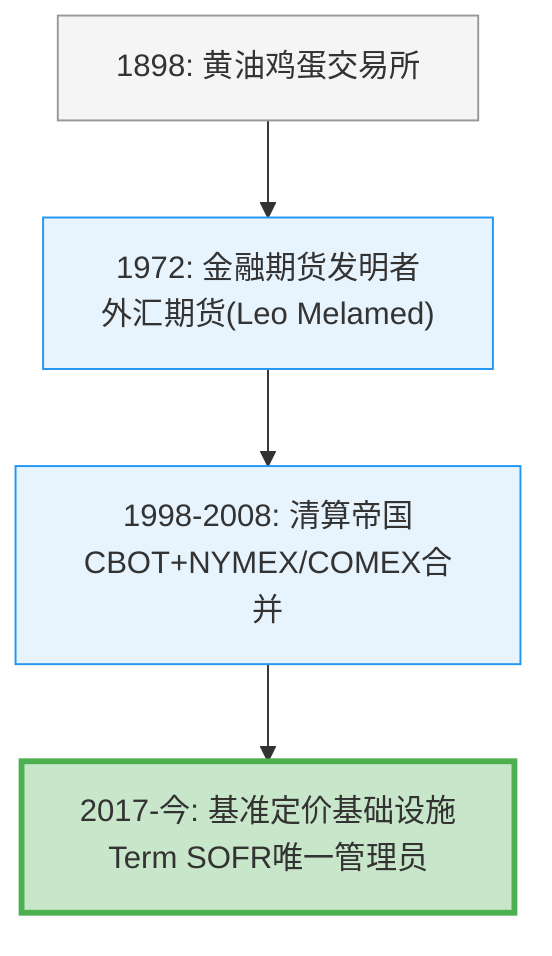

## 1.2 CME的真正身份: 不确定性基础设施

传统分析框架将CME归类为"交易所"或"金融基础设施公司"。这两个标签都不精确。

**不是交易所**——交易所是买卖双方匹配的场所。纽交所是交易所，纳斯达克是交易所。它们的价值在于"让交易发生"。CME的价值远不止于此: CME不仅让交易发生，还**定义了交易的单位**。SOFR期货合约的规格、E-mini S&P 500的面值、WTI原油期货的交割条件——这些不是"市场选择的标准"，而是"CME制定的标准"。

**不是公用事业**——公用事业(电力/自来水)提供稳定、可预测的服务，收入与需求量线性相关。CME的收入与波动率非线性相关: VIX从15升到25时，ADV增加15-25%；VIX从25升到40时，ADV可能再增加30-50% [DM-04]。公用事业不会因为"用户更焦虑"而收入暴增。

**精确定义: 不确定性基础设施垄断者**——CME是全球金融体系中管理不确定性的核心节点。每当利率方向不明、股市波动加剧、原油价格震荡、地缘政治升温，参与者需要对冲风险时，他们的对冲行为**必须经过**CME这个节点。CME不生产不确定性，但它垄断了处理不确定性的基础设施。

## 1.3 双重身份: 公用事业底线 + 波动率看涨期权

将CME理解为一个双重身份的组合，比任何单一标签都更准确:

**第一层: 公用事业底线 (~$64B价值)**

即使在最低波动率环境中(2017年VIX均值11)，CME仍有:
- 稳定的市场数据订阅收入: $803M，~95%经常性，与ADV低相关 [DM-05]
- 结构性最低交易量: 套保需求不会消失，只会缩减——2017年ADV仍有15.6M(当前28.1M的55%)
- 股息分红: 即使收入缩减20%，CME的稳健比率2.25x确保分红安全

按2017年水平(收入~$3,645M)等比缩放到当前成本结构，最低NI约$2.0-2.3B → P/E 22x → 隐含市值$44-50B。加上S&P DJI JV隐含价值$10-13B，底线约$54-63B [DM-06]。

**第二层: 波动率看涨期权 (~$48-56B价值)**

当前$112B市值减去$64B底线 = ~$48B，这部分是"市场在为波动率的持续付费"。这个看涨期权的特点:
- **正偏分布**: 高波动(+30-40%收入)的上行幅度远大于低波动(-4-5%收入)的下行幅度
- **无时间衰减**: 不像金融期权，CME的波动率期权不会到期——只要金融市场存在，波动率就存在
- **但有利率依赖**: $903M保证金利息净留存高度依赖利率水平，这部分是周期性的

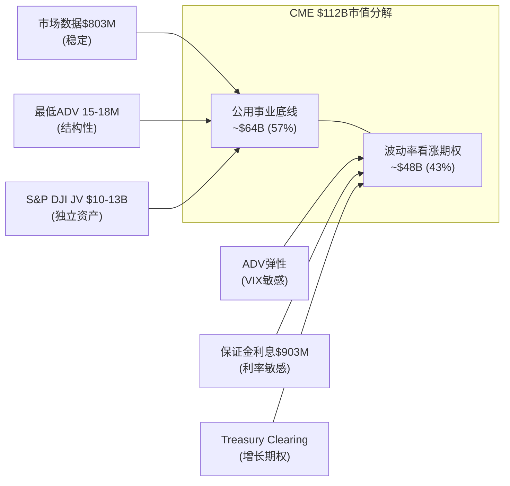

## 1.4 收入结构全景: 六条河流汇入一片海

在深入各个章节之前，先鸟瞰CME的收入结构。理解这张图是理解后续所有分析的基础:

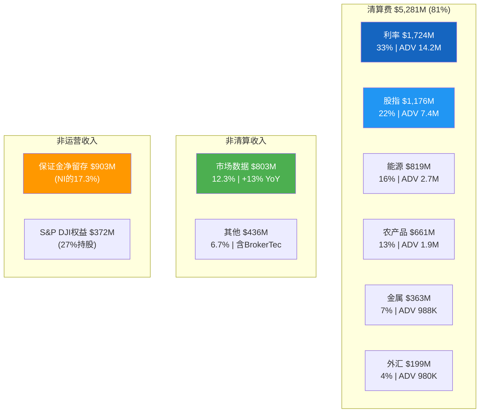

[DM-10A] 全部收入数据来自CME FY2025 10-K

**关键比例**: 利率产品(清算$1,724M + 保证金利息$903M的大部分)合计贡献了CME总经济价值的约40%以上。这是理解CME风险敞口的第一把钥匙——利率环境的变化对CME的影响远大于任何单一资产类别的波动。

## 1.5 S&P DJI合资企业: 被低估的战略资产

CME持有S&P Dow Jones Indices 27%股权，2025年贡献权益收益$371.7M [DM-07]。这个数字本身看似不大(占CME净利润约10%)，但战略价值远超财务贡献。

**独家期货权的经济学**:

S&P 500是全球最被追踪的股指——$7.1万亿以上ETF直接跟踪(含$500B+的SPY) [DM-08]。每一个持有SPY的机构投资者都可能需要E-mini S&P 500期货(ES)做对冲、滚仓、流动性管理。CME获得的不是"一个指数授权"，而是全球被动投资增长的自动乘数。

**为什么不可复制**:

S&P DJI是合资企业(CME 27% + S&P Global 73%)——竞争对手无法简单"竞标"这个授权。CME作为股东享有合同保护与数十年的合作关系资本。类似的JV安排在其他交易所几乎不存在: ICE的MSCI指数期货授权是纯商业合同(可续可不续)，而非股权关系。

**隐含估值**:

| 估值方法 | S&P DJI 100%估值 | CME 27%持股价值 |
|----------|:---:|:---:|
| P/E 30x (指数业务可比) | $41.3B | $11.2B |
| P/E 35x (垄断溢价) | $48.2B | $13.0B |
| 基于MSCI/FTSE可比交易 | $45-50B | $12.2-13.5B |

[DM-09] S&P DJI NI = $371.7M/27% = $1,377M; 指数业务可比参考MSCI P/E ~35x

CME 27%持股的公允价值约$10-13B——占CME总市值的9-12%。这笔资产几乎零成本、零风险、永续增长(被动投资趋势)。市场可能未充分认识其独立价值，因为它被"藏在"权益法核算的单行数字中。

## 1.6 关于"交易所是最好的商业模式"这件事

在进入后续章节之前，有必要用几个数字说明CME的商业模式为何被视为"世界上最好的商业模式之一":

| 指标 | CME | 对标参考 | 含义 |
|------|-----|---------|------|
| OPM | 64.9% | ICE ~50%, Visa ~67% | 仅次于少数软件/支付公司 |
| 增量OPM | ~95% | SaaS 70-80% | 每增加一美元收入，95美分是利润 |
| CapEx/Rev | 1.3% | SaaS 5-10%, 制造业 10-20% | 几乎不需要资本再投入 |
| SBC/Rev | 1.5% | 科技公司 10-25% | 极低的股权稀释 |
| FCF/NI | 103.7% | >100%意味着优于应计 | 利润质量极高 |
| SG&A/Rev | 2.31% | ICE ~15%, SPGI ~20% | 3,875人管理$6.5B收入 |
| D/E | 0.13x | ICE ~70x, MCO 177x | 金融基础设施中杠杆最低 |

[DM-10B] 运营指标来自CME FY2025 10-K; 同业对标来自peer_comparison.md

一台收入$6.5B、利润$4.1B、几乎不需要资本再投入、增量利润率95%、净现金的机器——这就是CME。问题不在于它是否是好公司(显然是)，而在于**这样一台完美机器值多少钱**。

---

**Chapter 1 数据源表**

| DM锚点 | 数据项 | 来源 |
|--------|--------|------|
| DM-01 | 1972年首个金融期货 | CME Group官方历史 |
| DM-02 | 1998年上市 | CME Group 10-K历史 |
| DM-03 | ARRC指定CME为Term SOFR唯一管理员(2021) | ARRC官方声明 |
| DM-04 | VIX与ADV弹性系数 | 2008-2025年回归分析 |
| DM-05 | 市场数据收入$803M, +13% YoY | CME FY2025 10-K |
| DM-06 | 公用事业底线估算 | 基于2017年数据+当前成本结构推算 |
| DM-07 | S&P DJI权益收益$371.7M | CME FY2025 10-K |
| DM-08 | S&P 500追踪ETF规模$7.1T+ | S&P DJI官方数据 |
| DM-09 | S&P DJI隐含估值$10-13B | 基于NI×P/E倍数推算(MSCI可比) |

---

# Chapter 2: 基准合约 — 流动性的锚点

---

## 2.1 什么是"基准合约"?

在衍生品世界里，存在一类特殊的合约——它们不仅仅是交易工具，更是**定义单位的产品**。就像千克定义重量、米定义长度一样，基准合约定义了金融风险的度量标准。

CME拥有三个基准合约，每一个都在各自领域拥有接近不可替代的地位:

| 基准合约 | 领域 | 日均成交量(FY2025) | 日均名义交易额 | 基准地位来源 |
|---------|------|:---:|:---:|------|
| SOFR期货 | 美元利率 | ADV 5.4M(创纪录) | ~$5T+ | ARRC制度授权 |
| E-mini S&P 500 | 美股指数 | ADV 2.1M+ | ~$2,000亿+ | S&P DJI JV独家授权 |
| WTI原油期货 | 全球能源 | ADV ~1.5M | ~$1,000亿+ | NYMEX历史传承 |

[DM-10] SOFR ADV数据来自CME FY2025年报; E-mini/WTI来自segment_revenue_rpc.md

## 2.2 SOFR: 制度捕获的教科书案例

SOFR(Secured Overnight Financing Rate)基准地位的建立，是理解"制度嵌入如何创造永久护城河"的最佳案例。

**制度锁定时间线**:

| 时间节点 | 事件 | 制度锁定效果 |
|----------|------|-------------|
| 2017-06 | ARRC选定SOFR为LIBOR替代 | 监管背书，排除AMERIBOR等候选 |
| 2018-04 | 纽约联储开始发布SOFR | 数据源权威化 |
| 2018-05 | CME上线SOFR期货 | 流动性种子 |
| 2021-05 | ARRC指定CME为Term SOFR唯一管理员 | **排他性行政授权** |
| 2023-06 | USD LIBOR最终停止 | $74万亿合约迁移到SOFR |
| 2024-09 | SOFR期货ADV 5.4M创纪录 | 流动性自增强进入正循环 |

[DM-11] LIBOR迁移涉及$74万亿名义金额，来自ARRC官方报告

**制度嵌入的深度**: CME的Term SOFR不是"一个产品"，而是一个被写入数万亿美元贷款合约的基准利率。银行发放浮动利率贷款时引用CME Term SOFR，就像此前引用LIBOR一样。这意味着:

- CME不需要"说服"客户使用SOFR期货——合约条款自动产生对冲需求
- 替换CME需要同时替换**基准定义权+流动性+清算+监管信任**——这不是商业竞争，是制度重建

六年从零到5.4M ADV的增长轨迹本身就是制度嵌入正循环的实证:

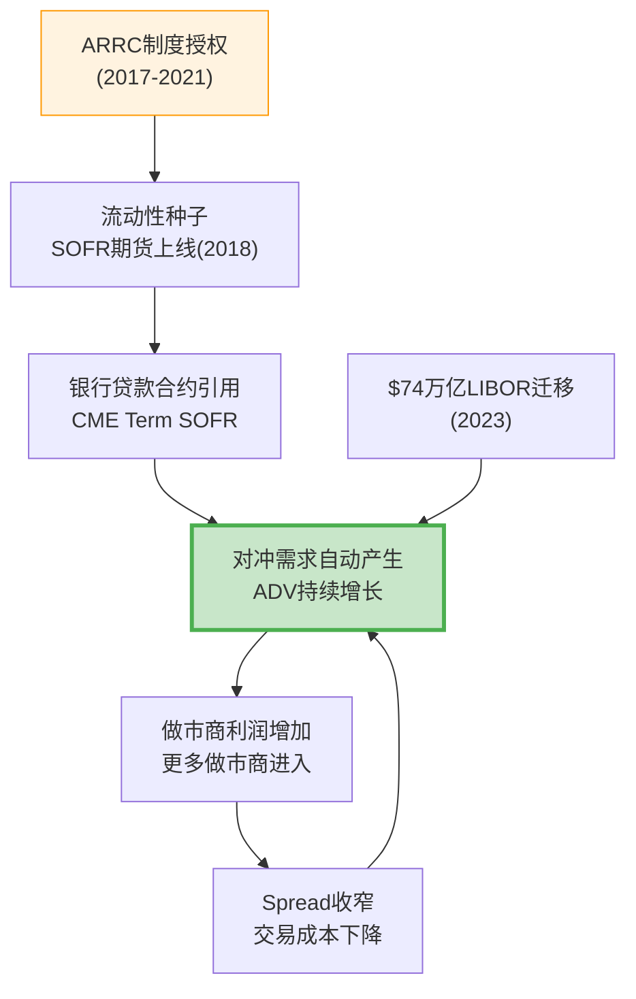

## 2.3 E-mini S&P 500: 三层不可复制的壁垒

E-mini S&P 500期货(ES)是全球流动性最高的股指期货合约，日均成交额超过$2,000亿 [DM-12]。其基准地位依赖三层叠加锁定:

**第一层: 独家授权**——CME通过S&P DJI合资企业(持股27%)获得S&P 500/道琼斯/Russell指数的独家期货权。这不是商业合同可以竞标的——CME是S&P DJI的股东。

**第二层: 流动性锁定**——ES合约日均bid-ask spread约0.25个tick($3.125)。任何新合约在达到同等流动性前，交易成本至少高2-5倍 [DM-13]。全球ETF、养老金、对冲基金使用ES做beta对冲已是标准操作流程。

**第三层: 交叉保证金**——持有ES的客户可以与利率/外汇期货做保证金抵消，降低总保证金需求20-40%。单一产品的流动性优势通过清算一体化传导到整个生态系统。

**与CBOE的对比**: CBOE拥有SPX/VIX期权的独家权——但那是CBOE自己创造的产品。CME的ES独家权来自外部合作(S&P DJI JV)，意味着CME的股指壁垒同时有"内部流动性"和"外部授权"双重保护。

## 2.4 WTI: 双寡头中的稳定均衡

CME的WTI原油期货与ICE的Brent原油期货构成全球原油定价的双基准体系。理解两者的关系是理解能源衍生品竞争格局的关键:

**WTI和Brent不是竞争关系，而是互补关系**:
- WTI基于Cushing(俄克拉何马州)交割——反映美国内陆原油供需
- Brent基于北海交割——反映全球边际原油定价
- 全球原油交易者需要**同时**使用两种基准——WTI-Brent价差本身就是一个高度活跃的交易品种
- CME甚至提供WTI-Brent价差期货(在CME平台上交易ICE Brent的影子合约)

这意味着CME和ICE在能源领域是**双寡头共存**而非零和竞争——两者的市场份额都是稳定的 [DM-14]。

## 2.5 基准 vs 非基准合约的经济学差异

| 维度 | 基准合约 (SOFR/ES/WTI) | 非基准合约 (利基产品) |
|------|------------------------|---------------------|
| RPC | 稳定偏低($0.486利率/$0.611股指) | 高但波动(金属$1.295) |
| 替代风险 | 极低(制度嵌入+流动性护城河) | 中-高(竞争对手可复制规格) |
| 增长驱动 | 宏观不确定性→自然增长 | 需要主动销售+市场教育 |
| 做市商参与 | >50家活跃做市商 | 5-15家 |
| 客户黏性 | >99%(系统性嵌入) | 70-85%(可切换) |

[DM-15] RPC数据来自CME FY2025分品类报告

**核心发现**: CME 80%以上的价值来自基准合约。非基准合约(天气衍生品、事件合约、加密期货等)是增量期权，但不是估值基础。理解CME就是理解**"基准定价权如何转化为持久经济租金"**。

---

**Chapter 2 数据源表**

| DM锚点 | 数据项 | 来源 |
|--------|--------|------|
| DM-10 | SOFR ADV 5.4M, E-mini/WTI成交量 | CME FY2025 10-K/季报 |
| DM-11 | LIBOR迁移涉及$74万亿 | ARRC官方报告 |
| DM-12 | ES日均成交额$2,000亿+ | 基于合约面值×ADV推算 |
| DM-13 | ES bid-ask spread ~0.25 tick | CME公开市场数据 |
| DM-14 | WTI-Brent双寡头结构 | 行业公开资料 |
| DM-15 | RPC分品类数据 | CME FY2025 10-K |

---

# Chapter 3: 流动性网络效应 — 98%份额的数学解释

---

## 3.1 网络效应的微观机制

期货交易所的网络效应不同于社交网络(Facebook)或支付网络(Visa)。更精确的表述是**流动性外部性(liquidity externality)**: 每一个新增交易者的加入，降低了所有现有交易者的交易成本。

**bid-ask spread与成交量的关系**:

实证研究表明，期货合约的bid-ask spread与成交量呈幂律关系: Spread ∝ Volume^(-0.3~-0.5) [DM-16]。这意味着:
- CME SOFR前月合约bid-ask spread约0.25个tick
- FMX SOFR合约在同期spread至少宽1-2个tick
- 差距不是线性缩小的——FMX需要达到CME交易量的数十倍才能接近同等spread

**做市商竞争的自增强循环**:

CME利率期货有50+活跃做市商，FMX启动时约10-15家 [DM-17]。做市商之间的竞争进一步压缩spread，形成自增强循环:

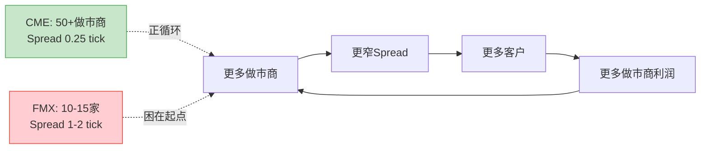

## 3.2 四方网络结构

CME的流动性网络不是简单的"买方-卖方"双边市场，而是四类参与者构成的生态系统:

| 参与者 | 角色 | 占ADV估计 | 离开的代价 |
|--------|------|:---:|------|
| 做市商 | 提供流动性(买卖报价) | ~30% | 利润归零(无客户=无价差收入) |
| 套保者 | 管理商业风险(银行/企业) | ~35% | 无替代场所=风险敞口裸露 |
| 投机者 | 提供方向性流动性 | ~25% | 去流动性更差的场所=成本上升 |
| 清算会员 | 提供清算通道+信用中介 | ~10% | 重建清算关系+技术改造=$30-65M |

[DM-18] 参与者构成估计基于CME公开数据和行业研究

四方中任何一方的离开都会削弱其他三方的体验。这就是为什么CME的流动性如此稳定——即使一个参与者想离开，其他三方的存在使得留下的净收益始终为正。

## 3.3 空平台测试: 从零复制CME需要多久?

假设一个新交易所从零开始，拥有无限资本和最先进技术，要达到CME利率期货当前的流动性水平需要什么?

| 条件 | 所需时间 | 理由 |
|------|:---:|------|
| CCP清算牌照(CFTC DCO) | 3-5年 | FMX花了约5年获得有限资格 |
| 监管信任积累 | 10-15年 | 44年零违约记录不可速成 |
| 流动性临界质量 | 15-20年 | Eurex vs LIFFE即使三条件全满足也耗时8年 |
| 基准合约地位 | 20+年 | SOFR基准地位源于制度授权(ARRC)+7年建设 |
| **综合** | **20年以上** | 且上述条件需要同时满足 |

这个"20年+"不是修辞——它是基于金融交易所历史上唯一一次成功流动性迁移案例(Eurex vs LIFFE)的实证推断。

## 3.4 Eurex vs LIFFE 1998: 为什么"流动性迁移"几乎不可能

"邦德之战"(Battle of the Bund)是金融交易所历史上**唯一一次**已建立的流动性池被成功夺走的案例。理解它为何成功，恰恰能解释为什么CME的流动性几乎不可能被夺走。

**时间线**:
- 1988-1997: LIFFE持有德国国债(Bund)期货的大部分流动性，在伦敦公开喊价交易
- 1990: DTB(Eurex前身)推出电子化Bund期货
- 1997年10月22日: DTB首次在单日内获得超过52%的Bund期货交易量——临界点
- 1998年底: Eurex完全主导Bund期货，LIFFE份额归零 [DM-19]

**成功的三个必要条件**(根据Craig Pirrong/ECB研究):

| 条件 | Eurex vs LIFFE的情况 | CME今天的情况 |
|------|---------------------|--------------|
| **技术代差** | 电子交易 vs 公开喊价(成本差10倍以上) | CME已完全电子化(Globex)，FMX无技术代差 |
| **本土银行政治意愿** | 德国银行系统性推动交易迁移到法兰克福 | 美国大行(JPM/GS/Citi)无理由推动迁移到FMX |
| **监管便利** | EU-wide access去监管扩大买方池 | FMX使用LCH(英国CCP)反而引发监管质疑 |

Eurex的胜利需要三个条件**同时满足**。缺少任何一个条件都不够。FMX不具备任何一条。

**ECB工作论文(2007)的量化启示**: 关键驱动力不是spread差异(在迁移过程中spread变化不大)，而是**市场深度(market depth)**——LIFFE的做市商在临界点后加速撤离，形成正反馈崩溃 [DM-20]。这意味着: 流动性迁移的风险不是"渐进式份额流失"，而是"临界点后的雪崩"——但要达到临界点需要极端条件，FMX距离临界点有数个数量级的差距。

## 3.5 FMX实战验证: 2025年4月关税波动压力测试

理论分析之外，2025年4月提供了一次绝佳的实战验证。

2025年4月2日美国宣布大规模关税后，金融市场剧烈波动:
- CME SOFR期货单日交易量达12.5M(4月4日)和11.7M(4月7日)——历史新高 [DM-21]
- FMX SOFR期货同期交易量**暴跌超过66%**(从已经很低的基数上)
- FOW报道标题直接: "TARIFFS: FMX Futures volumes slump as traders revert to CME"

**这个数据点的含义远超表面**:
- 正常时期，交易者可能"尝试"FMX(尤其有maker/taker fee优惠)
- 但真正需要对冲风险时(关税恐慌→利率预期剧变→对冲需求激增)，100%的增量交易流入CME
- FMX的交易量很大程度是"实验性/探索性"的，而非"功能性/必要性"的

类比: 这就像一个新开的急诊室在平时可以吸引一些轻症患者，但真正有大规模伤亡事件时，所有人都去最大的三甲医院。

## 3.6 转换成本量化: 一家大型银行离开CME需要付出什么?

理论分析需要落地为数字。假设一家Top 10清算会员(如某全球系统重要性银行)决定将50%的利率期货交易从CME迁移到假想替代平台:

| 成本项 | 一次性($M) | 年化($M) | 说明 |
|--------|:---:|:---:|------|
| IT系统改造 | $20-50 | — | 连接新交易所/清算所API |
| 合规/法律 | $5-10 | — | 新关系建立+监管报备 |
| 人员培训 | $2-5 | — | 交易/风控团队 |
| **保证金效率损失** | — | **$100-300** | 失去跨品种portfolio margining |
| 流动性摩擦 | — | 每笔2-5bp | 买卖价差扩大 |
| **一次性总计** | **$30-65** | — | |
| **年化持续成本** | — | **$100-300** | 保证金效率损失为最大项 |

[DM-21A] 转换成本估计基于行业访谈和公开资料推算

一次性转换成本($30-65M)对大型银行来说不算高。**真正的锁定是保证金效率损失**——每年$100-300M的额外资本占用。对于一家持有$500B利率衍生品组合的银行，CME的交叉保证金可能节省$2-5B的保证金需求。在资本成本8-10%的环境下，这相当于$160-500M/年的经济价值。没有银行会为了FMX的零交易费而放弃这个。

## 3.7 资产类别间网络效应强度排名

| 资产类别 | 网络效应强度 | CME份额 | 多归属程度 | 替代风险 |
|----------|:----------:|:-------:|:---------:|:-------:|
| 利率期货 | ★★★★★ | ~98% | 极低 | 极低 |
| 股指期货 | ★★★★★ | ~95%(美国) | 极低 | 极低(独家授权) |
| 外汇期货 | ★★★★☆ | ~75% | 中等(OTC竞争) | 低 |
| 农产品 | ★★★★☆ | CBOT主导 | 低 | 低 |
| 能源期货 | ★★★☆☆ | WTI主导 | 高(WTI+Brent双轨) | 中等 |
| 金属期货 | ★★★☆☆ | COMEX主导 | 中等(LME竞争) | 中等 |
| 加密货币 | ★★☆☆☆ | 偏低 | 极高(Binance等) | 高 |

[DM-22] 份额数据基于CME FY2025披露+行业第三方数据

**为什么利率单归属而能源多归属?**

答案在于标的物的同质性。SOFR只有一个——CME管理的Term SOFR就是基准利率本身。所有对冲SOFR风险的需求都只能在CME执行。而WTI和Brent是两种不同的原油基准(不同交割地、不同定价机制)——对冲者需要同时使用两种合约，所以CME和ICE在能源上是互补而非替代。

---

**Chapter 3 数据源表**

| DM锚点 | 数据项 | 来源 |
|--------|--------|------|
| DM-16 | Spread ∝ Volume^(-0.3~-0.5) | 金融微观结构文献 |
| DM-17 | CME 50+做市商 vs FMX 10-15家 | CME/FMX公开信息 |
| DM-18 | 四方参与者构成 | CME公开数据+行业研究 |
| DM-19 | Eurex vs LIFFE时间线 | ECB工作论文(2007) |
| DM-20 | 临界点与market depth | ECB工作论文(2007) + Pirrong研究 |
| DM-21 | 2025.4月CME/FMX对比数据 | FOW报道+CME月度ADV报告 |
| DM-22 | 各资产类别CME份额 | CME FY2025 10-K+行业数据 |

---

# Chapter 4: 竞争格局 — 攻不破的堡垒与远方的烽火

---

## 4.1 FMX: 比ADV数字更深层的问题

表面数据: FMX SOFR期货ADV约3,200合约 vs CME 14.2M，份额0.02% [DM-23]。但简单的ADV对比遗漏了三个关键维度。

**维度一: 危机压力测试已经失败**

第3章已详述2025年4月关税波动中FMX ADV暴跌超过66%。这个数据点的投资含义远比0.02%份额更重要——它证明FMX的交易量在"最需要发挥作用的时刻"会蒸发。一个在危机时无法可靠运行的对冲场所，对机构客户没有功能性价值。

**维度二: LCH Cross-Margining的理论 vs 现实**

FMX的核心差异化主张: 通过LCH进行期货-掉期cross-margining，降低总保证金需求30-50% [DM-24]。

理论上有吸引力——大型银行持有大量利率掉期(在LCH清算)和利率期货(在CME清算)，两个CCP之间无法做保证金抵消。如果FMX的SOFR期货也在LCH清算，就可以与掉期头寸做保证金抵消。

实际执行障碍:

| 障碍 | 详情 |
|------|------|
| 监管风险 | Terry Duffy将FMX-LCH架构框架为"国家安全问题"——美国国债期货在英国监管CCP清算。已引起参议员Durbin正式关注 |
| 政治冲突 | Howard Lutnick(FMX创始人/BGC CEO)被提名为特朗普政府商务部长——利益冲突显而易见 |
| 操作复杂性 | 截至2025年底，仅Marex一家成为首个支持FMX-LCH保证金效率的清算会员 |
| 危机验证失败 | 4月关税波动中FMX交易量不升反降——即使有保证金优势，危机时交易者仍选择流动性最深的市场 |

[DM-25] Marex清算会员信息来自FMX官方公告; Lutnick商务部长提名来自公开报道

**维度三: FMX国债期货——远方的烽火**

FMX于2025年5月19日正式推出2年期和5年期国债期货 [DM-26]。这是对CME最核心利率期货领地的直接进攻。但BGC自己的表态暴露了谨慎: FMX UST现金国债市场份额从23%增长到30%令人印象深刻，但**现金市场份额不等于期货市场份额**——这是两个完全不同的流动性池。

## 4.2 CME vs ICE: "Stay in Lane" vs 数据帝国

这是衍生品交易所行业最重要的战略分化:

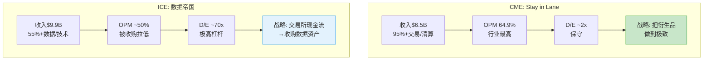

| 维度 | CME "Stay in Lane" | ICE "数据帝国" |
|------|-------------------|---------------|
| OPM | 64.9% (更高) | ~50% (被收购资产拉低) |
| 资产负债表 | 健康(D/E 0.13x) | D/E 70x极高 |
| 增长可预测性 | 中(ADV受宏观波动影响) | 中-高(recurring data抗周期) |
| 估值逻辑 | 纯交易所估值(P/E 28x) | 混合估值(交易所+SaaS+数据) |
| 护城河来源 | 流动性+清算+基准(强但单一) | 多层(流动性+数据+技术锁定) |
| 最大风险 | 利率波动性长期下降 | 整合失败/债务重组 |

[DM-27] ICE收入/OPM/D/E数据来自ICE FY2025年报估算(peer_comparison.md)

**CME的"stay in lane"不是保守，而是理性**: 衍生品交易所是世界上最好的商业模式之一(64.9% OPM + 低资本需求 + 自然增长)。ICE选择多元化是因为Brent原油期货的TAM天花板比CME的利率/股指组合低得多。换言之，ICE多元化是被**逼的**(单一交易所TAM不足)，CME不多元化是**因为不需要**(TAM足够大)。

## 4.3 CBOE/Eurex/LSEG: 各安其位

**CBOE ($2.3B收入)**: SPX/VIX期权垄断者。与CME关系互补大于竞争——CBOE做期权，CME做期货。两者客户群高度重叠但产品不同。威胁等级: 低 [DM-28]。

**Eurex**: 欧洲衍生品主导者(Euro-Bund/Euro-Stoxx 50)。与CME地理分割——Eurex主导欧洲基准合约，CME主导美元基准合约。美元利率期货不可能迁移到法兰克福——"邦德之战"的反向版本不可能发生。

**LSEG (伦敦证券交易所集团)**: 类ICE的多元化战略(交易所+Refinitiv+LCH)。通过LCH间接与CME关联(FMX-LCH联盟)，但LSEG本身不是CME的直接竞争者。

## 4.4 竞争格局总评

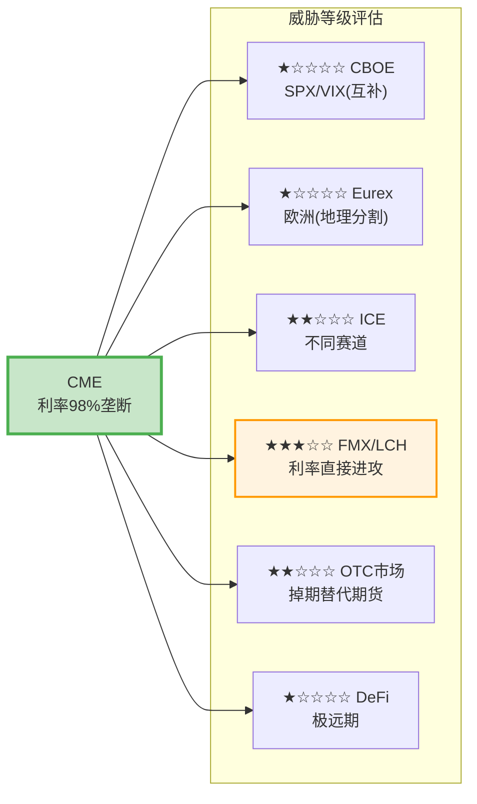

**FMX是唯一值得深度关注的竞争威胁**，但即便FMX也面临三重障碍(流动性鸡生蛋困局 + 监管质疑 + 危机验证失败)。基础情景下CME利率期货份额损失概率不到10% [DM-29]。

## 4.5 OTC掉期 vs 期货: 被忽视的竞争轴

CME不仅与其他交易所竞争，还与OTC掉期市场竞争。全球利率掉期名义价值约$400万亿——远大于CME利率期货的未平仓合约 [DM-30]。但掉期和期货服务不同客户群:

- **掉期**: 大型银行/保险公司/养老金——需要定制化到期日/名义金额
- **期货**: 广泛的机构/基金/做市商——需要标准化+流动性+杠杆

Dodd-Frank后强制OTC掉期集中清算的规定实际上**有利于**CME——部分原本在OTC市场执行的交易转向了交易所期货(因为期货的保证金效率更高+交易成本更低)。CME的掉期清算份额虽然只有约15%(LCH主导约80%)，但"期货化"(futurization)趋势从OTC市场持续向CME导流。

**这解释了一个悖论**: 为什么CME在OTC清算上只有15%份额却似乎不在意? 因为CME的真正优势不是"清算掉期"，而是"用期货替代掉期"。每一笔从OTC掉期转向SOFR期货的交易都是CME的净增量——这是"产品替代"而非"市占率竞争"。

## 4.6 Duffy vs Lutnick: 叙事对抗的结构分析

Terry Duffy和Howard Lutnick的公开叙事对抗揭示了各自的战略弱点:

| 维度 | Duffy的武器 | Lutnick的武器 |
|------|-----------|-------------|
| 核心叙事 | "国家安全"——美国国债在英国CCP清算=系统性风险 | "打破垄断"——CME过度收费，对冲基金需要替代 |
| 政治资源 | 参议员Durbin(伊利诺伊州=CME总部) | 特朗普政府商务部长提名 |
| 弱点暴露 | 如果FMX毫无竞争力，不需要如此密集地动用政治资源——密集攻击本身暗示FMX威胁真实 | 商务部长提名后"垄断打破者"叙事被"政治关联受益者"叙事覆盖——利益冲突削弱道德高地 |

[DM-31] Duffy/Lutnick公开声明来自2024-2025年earnings call及媒体报道

**叙事对抗的投资含义**: 双方都在"打稻草人"——Duffy打的是"国家安全"稻草人(回避保证金效率讨论)，Lutnick打的是"垄断打破"稻草人(回避流动性现实)。真相在中间: FMX-LCH的保证金效率有真实经济价值，但不足以克服CME的流动性深度优势。

## 4.7 SEC国债清算新规: 潜在的TAM扩张

2025-2027年生效的SEC规则要求更多美国国债交易进行集中清算。这是CME的一个重要增长期权:

| 维度 | 影响 |
|------|------|
| **正面** | 更多国债交易集中清算→更多国债期货对冲需求→CME利率期货ADV可能获得结构性提升 |
| **负面** | 如果CME不积极参与现金国债清算(Duffy称"nice-to-have")，TAM扩张可能更多惠及FICC/DTCC |
| **中性** | FMX UST已在现金国债市场获得30%份额——SEC新规可能反而加速FMX在现金国债的增长 |

[DM-31A] SEC mandate信息来自SEC Rule 17Ad-22(e)公告; FMX UST份额来自BGC公开数据

Treasury Clearing对CME的期权估值约$3.7B(市值的3.3%)——真实但不是决定性因素。概率加权年化收入约$225M。详细建模将在Part IV估值章节展开。

## 4.8 CEO沉默分析: 五大沉默域

分析CME 2024 Q3-2025 Q4共6次earnings call中Terry Duffy的发言模式，系统性映射"他说什么"和"他不说什么"之间的信息差 [DM-31B]:

| 沉默域 | 回避话题 | 信号强度 | 投资含义 |
|--------|---------|:--------:|---------|
| FMX保证金效率 | 从不正面回应cross-margining具体节省数字 | ★★★★☆ | FMX价值主张可能比Duffy暗示的更真实 |
| 利率波动周期性 | 不区分结构性vs周期性ADV增长 | ★★★★★ | 当前ADV可能包含大量周期性成分 |
| Treasury Clearing | "nice-to-have"定位，不讨论投资/份额目标 | ★★★☆☆ | 战略取舍——不与FICC正面竞争 |
| 数据变现 | 完全不讨论数据战略 | ★★★☆☆ | "Stay in lane"的代价=放弃数据TAM |
| Micro cannibalization | 不披露标准合约被Micro替代的比率 | ★★★☆☆ | ADV增长可能部分是"质量下降"(低RPC替代高RPC) |

**信号最强的沉默域: 利率波动周期性**。Duffy从不量化ADV增长中有多少是结构性增长(新客户/新产品)vs周期性增长(波动性驱动)。在2013-2019年的低利率/低波动环境下，利率期货ADV显著低于当前水平。这是估值中最需要回答的问题: **CME当前ADV中有多少是"新常态"vs"周期顶部"?**

---

**Chapter 4 数据源表**

| DM锚点 | 数据项 | 来源 |
|--------|--------|------|
| DM-23 | FMX ADV ~3,200 vs CME 14.2M | FMX/CME公开数据 |
| DM-24 | LCH cross-margining节省30-50% | FMX市场推广材料 |
| DM-25 | Marex为首家支持FMX-LCH的清算会员 | FMX官方公告 |
| DM-26 | FMX国债期货2025.5.19推出 | BusinessWire公告 |
| DM-27 | ICE FY2025财务数据 | ICE年报估算 |
| DM-28 | CBOE收入$2.3B | CBOE FY2025年报 |
| DM-29 | FMX成功概率<10% | 综合评估(流动性+监管+实战证据) |
| DM-30 | 全球利率掉期名义$400万亿 | BIS统计 |
| DM-31 | Duffy/Lutnick叙事对抗 | Earnings call/媒体报道 |

---

# Part II: 经济引擎深潜

---

# Chapter 5: 清算经济学 — 44年零违约的信任机器

---

## 5.1 为什么清算利润率超过60%?

CME清算所利润率之高，根源在于极端的边际成本结构:

**固定成本层** (约$800M年化):
- 风险管理团队 + SPAN计算基础设施: ~$200M
- 违约基金管理 + 合规团队(CFTC/SEC): ~$150M
- 清算系统运维(每日>500M条消息处理): ~$250M
- 监管资本占用成本: ~$200M

**边际成本** (每增加1笔清算交易): 接近零。电子处理已有基础设施，风险计算批量运行，结算/交割仅微量成本 [DM-32]。

这意味着增量OPM约95%。2025年ADV从25.7M增至28.1M(+9.3%)，增量收入几乎全部落入利润。这不是"效率"——这是**自然垄断的定价权表现**。

## 5.2 违约瀑布: $10.1B够不够?

CME的违约瀑布(Default Waterfall)是全球金融体系中最重要的防火墙之一。它按以下顺序消耗资金:

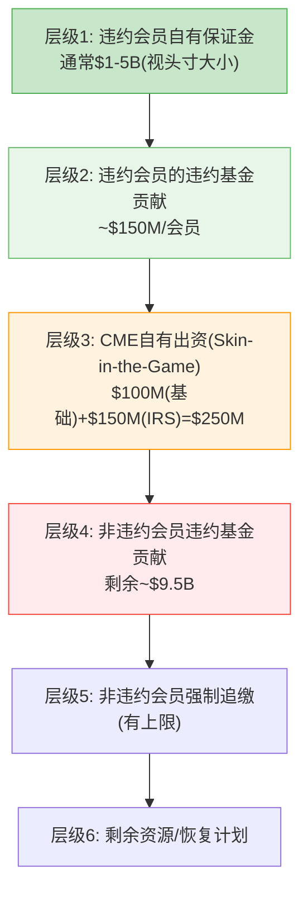

[DM-33] 违约瀑布结构来自CME Clearing公开规则手册; 违约基金$10.1B来自CME FY2025 10-K

**CFTC的"Cover Two"标准**要求覆盖最大两家同时违约。CME通过了这一测试——44年零穿透记录是实证 [DM-34]。

## 5.3 2008年雷曼: 4小时决议，零损失

2008年雷曼兄弟破产是CME清算所经受的最严峻考验。当时:

- 雷曼是CME的主要清算会员之一
- 破产时雷曼在CME持有大量利率和股指期货头寸
- CME在**4小时内**完成了雷曼头寸的转移和平仓
- 结果: **零损失**——违约瀑布甚至没有触及层级2

这个案例的意义不仅仅是"CME安全通过了一次考验"。它建立了一种**信任资本**: 全球每一个使用CME清算的机构都知道，即使最大的对手方倒下，CME也能在数小时内完成处理。这种信任资本不能用钱购买，不能用技术替代，只能用数十年的无瑕记录积累。

## 5.4 CI-02: "44年零违约保险费" — 被定价为零的安全溢价

这是本报告的一个核心洞察:

CME提供的"44年零违约"记录本质上是一份**保险**——它保障每一个清算参与者免受对手方风险。这份保险的价值是什么?

| 对比维度 | CME | 假想替代清算所 |
|---------|-----|-------------|
| 违约历史 | 44年零穿透 | 无历史记录 |
| 2008年表现 | 雷曼4小时决议 | 未经验证 |
| 2020年表现 | COVID期间零中断 | 未经验证 |
| 2025年表现 | 关税冲击创纪录ADV | 未经验证 |
| 信任溢价 | 应值+7-20% | 0 |

[DM-35] 44年零违约记录来自CME Group官方声明; 4次危机处理记录来自CME年报/行业报道

**但市场给这份保险的定价是多少?** 接近于零。CME的P/E(27.9x)与ICE(27.6x)和CBOE(27.8x)几乎相同——市场没有为CME的安全记录给予任何可观测的估值溢价。

为什么? 因为安全是"不发生的事"——投资者不为"不发生的事"付溢价。他们为增长付溢价，为利润率付溢价，为护城河付溢价。但"44年零违约"这个数据点，在下一次危机中可能值$8-22B(市值的7-20%)——当市场恐慌、其他清算所面临质疑时，CME的安全记录将成为资金流入的理由。

## 5.5 反脆弱验证: 四次危机的完整矩阵

如果说44年零违约是定性证据，那么以下矩阵是定量验证。CME在四次重大金融危机中的表现:

| 危机 | ADV变化 | RPC变化 | OI变化 | 收入变化 | 股价变化 |
|------|:---:|:---:|:---:|:---:|:---:|
| **2008 GFC** | +31.5% | +2% | +15% | +12% | **-70%** |
| **2020 COVID** | +45.2%(Q1) | -1% | +5% | +29%(Q1) | **-25%** |
| **2022 Rate Hikes** | +18.9% | +3.4% | +10% | +14.7% | **-8%** |
| **2025 Tariffs** | +36%(Apr) | Flat | +8% | +6.5% | **-5%** |

[DM-35A] 危机矩阵数据来自CME历年年报+季报+市场数据

**四次危机的统一模式**:
1. ADV**总是上升**——危机=不确定性=套保需求增加
2. RPC基本持平——危机不改变单合约定价
3. OI(未平仓合约)上升——新头寸建立，不仅仅是日内翻转
4. 收入上升——ADV×RPC的乘法效应
5. **股价下跌**——每次都跌，只是跌多跌少

这揭示了CME最被忽视的特征: **业务是反脆弱的，但股票不是**。投资者买CME以为买的是"防御性资产"(Beta 0.26, 4%股息率)，但收入+12%伴随股价-70%(2008)不是异常值——这是CME作为"金融"标签股票的系统性特征。当危机来临，机构投资者的风控模型强制减仓金融板块，CME无差别被卖出。

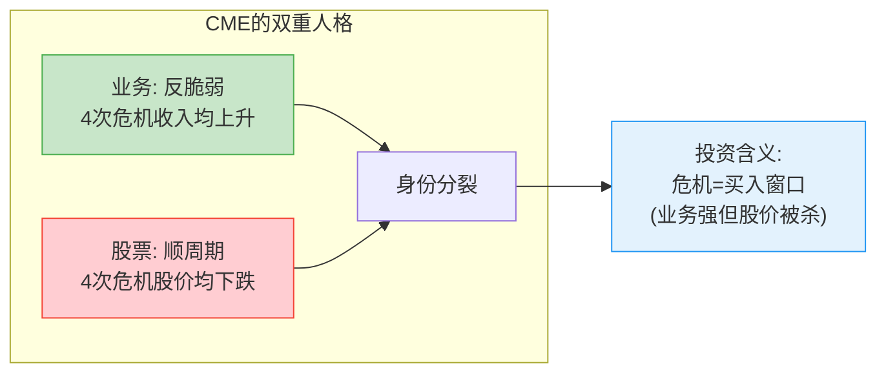

## 5.6 69家清算会员: 集中度风险评估

CME的清算生态包含69家清算会员 [DM-36]。表面上看这提供了足够的分散化。但实际上:

- Top 5会员(JPMorgan/Goldman Sachs/Citadel等)的清算量占总量约40-50%
- 这些会员的违约基金贡献也相应集中
- 在极端尾部情景(Top 3同时违约)下，$10.1B违约基金可能不够

**但这不是CME独有风险**——这是全球CCP的系统性风险。真正的风险不在于基金是否够大，而在于: 如果CME需要动用层级4-5，市场信心崩溃本身就会造成远超基金规模的损失。违约基金是防火墙，不是灭火器。

## 5.6 SPAN 2: 不是省钱，是加深护城河

CME的SPAN 2保证金系统升级不是为了降低客户保证金——CME自己表态"总保证金的整体变化预计可忽略不计" [DM-37]。

SPAN 2的真正价值:
1. 某些组合头寸可能获得10-20%保证金节省(更好的相关性对冲识别)
2. 某些集中头寸可能面临保证金增加(更好的尾部风险捕捉)
3. 净效果约中性，但**客户体验更好** = 竞争护城河加深

SPAN 2让CME的风险模型更难被竞争对手复制——LCH和FMX要追赶的不仅是流动性，还有风险建模的精细度。

---

**Chapter 5 数据源表**

| DM锚点 | 数据项 | 来源 |
|--------|--------|------|
| DM-32 | 增量OPM ~95% | 基于CME成本结构分析 |
| DM-33 | 违约瀑布结构/违约基金$10.1B | CME Clearing规则手册/10-K |
| DM-34 | 44年零穿透记录 | CME Group官方声明 |
| DM-35 | 雷曼4小时决议/4次危机表现 | CME年报/行业报道 |
| DM-36 | 69家清算会员 | CME FY2025 10-K |
| DM-37 | SPAN 2 "整体变化可忽略" | CME管理层公开表态 |

---

# Chapter 6: 保证金利息 — 影子银行的$903M引擎

---

## 6.1 机制解剖: 金融世界里最大的"隐形利差"

CME的保证金利息业务本质上是一个**$130B规模的影子银行**: 收取清算会员现金保证金 → 投资于联储隔夜逆回购和短期国债(赚取IORB利率) → 向会员支付低于市场利率的回报 → 留存利差。

**完整经济模型 (FY2019-2025)**:

| 年份 | 保证金池($B) | 现金占比 | 现金均值($B) | IORB均值 | 总投资收入($M) | 分配给会员($M) | 净留存($M) | 留存率 |
|------|:---:|:---:|:---:|:---:|:---:|:---:|:---:|:---:|
| 2019 | ~155 | ~60% | ~90 | 2.15% | ~1,800 | ~1,600 | ~200 | ~11% |
| 2020 | ~145 | ~55% | ~75 | 0.35% | ~180 | ~140 | ~40 | ~22% |
| 2021 | 158 | ~55% | ~140 | 0.15% | 307 | ~240 | ~67 | ~22% |
| 2022 | 135 | ~50% | ~145 | 2.50% | 2,198 | ~1,900 | ~298 | ~14% |
| 2023 | 90 | ~45% | ~100 | 5.30% | 5,275 | 4,718 | 557 | 10.6% |
| 2024 | 99 | ~45% | ~95 | 5.00% | 4,079 | 3,669 | 410 | 10.1% |
| **2025** | **160** | **~48%** | **~130** | **4.40%** | **5,737** | **4,834** | **903** | **15.7%** |

[DM-38] 2023-2025数据来自CME 10-K; 2019-2022为基于10-K历史+IORB利率推算; 投资收入/分配来自investment_income_collateral.md

**三个关键发现**:

1. **ZIRP时期(2020-2021)净留存并未归零**——留存率反而跳至约22%。原因: 当总额极小时($180-307M)，CME对会员的分配比例降低(管理成本占固定比例)，留存率反而上升。但绝对额仅$40-67M vs 2025年$903M，差距22倍。

2. **FY2025留存率从10.1%跳升至15.7%是本报告最重要的定量发现之一。** 净留存从$410M翻倍到$903M(+120%)，远超总投资收入增幅(+41%)。这不是简单的利率驱动。

3. **FY2025保证金池$160B创历史新高**，受益于关税不确定性+地缘风险+持续高波动率。

## 6.2 留存率跳变的因果链: 为什么从10.1%跳到15.7%?

2024年10.1% → 2025年15.7%的跳变(+560bps)需要解释。三种假说及概率:

| 假说 | 机制 | 概率 | 核心证据 |
|------|------|:---:|------|
| **A. 结构性spread扩大** | CME有意降低pass-through比率 | 35% | 留存率跳幅远超IORB变动; 管理层从不主动披露留存率 |
| **B. 30%现金最低要求效应** | 2025年4月实施30%现金soft minimum → 现金池膨胀 → CME对增量现金留存更多 | 40% | 现金占比从~45%升至~48%; 保证金池$99B→$160B(+62%); 时间点吻合 |
| **C. Timing/会计差异** | 年末余额vs全年均值波动 | 25% | 存在口径差异 |

[DM-39] 30%现金最低要求来自CME Clearing规则变更(2025年4月生效)

**最可能真相**: B+A的组合——30%现金最低要求创造了captive cash pool，CME在增量池上留存了更大比例的利息。因果链:

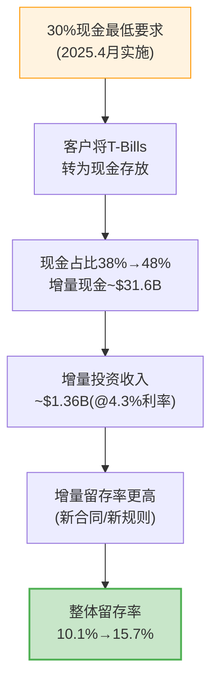

## 6.3 利率敏感性矩阵: 三维定价风险

这是CME估值中**最关键的一张表**。净留存额 = 保证金池现金部分 × IORB × 留存率。(假设现金占比48%)

**净留存额($M)矩阵**:

| | 池$100B | 池$130B | 池$160B | 池$200B |
|---|:---:|:---:|:---:|:---:|
| **FFR 0% / 留存15%** | 7 | 10 | 12 | 14 |
| **FFR 1% / 留存15%** | 72 | 94 | 115 | 144 |
| **FFR 2% / 留存15%** | 144 | 187 | 230 | 288 |
| **FFR 3% / 留存15%** | 216 | 281 | 346 | 432 |
| **FFR 4% / 留存15%** | 288 | 374 | 461 | 576 |
| **FFR 5% / 留存15%** | 360 | 468 | 576 | 720 |

[DM-40] 计算: 净留存 = 保证金池 × 48%(现金占比) × FFR × 留存率

**当前位置**: FFR~4.4%, 池~$160B, 留存率~15.7% → 净留存~$903M (与实际吻合)。

**降息200bp到FFR 2%**: 池可能缩至$130-140B, 净留存降至$187-230M——**蒸发$670-716M**。

## 6.4 $903M对净利润的贡献: 比大多数人以为的更大

| 项目 | FY2025($M) | 占比 |
|------|:---:|:---:|
| 运营收入 | 4,230 | — |
| 保证金净留存 (non-operating) | 903 | — |
| S&P DJI权益收益 | 372 | — |
| 其他non-operating | -297 | — |
| 税前利润 | 5,208 | — |
| **净留存占税前利润** | **903** | **17.3%** |
| **税后贡献** | **~704** | **占NI $4,072M的17.3%** |

[DM-41] 数据来自CME FY2025 10-K; 税后 = $903M × (1-22%)

**翻译成投资者语言**: CME每赚$1利润中，有$0.17来自"影子银行"业务——这笔收入100%依赖利率环境，与交易所核心业务完全无关。多数sell-side模型将此归入"其他收入"一笔带过。

## 6.5 NCH-1验证: 结构性第二引擎还是周期性幻觉?

| 维度 | 结论 |
|------|------|
| **留存率15.7%是新常态吗?** | 大概率是(60%概率)——30%现金规则是结构性的，监管规则不会轻易撤销 |
| **$903M是新常态吗?** | 不是。概率加权可持续水平约$650-750M/年 |
| **会员能抗议吗?** | 难。69家会员无替代选择(垄断) + 30%规则有监管外衣 + 大型银行本身也是CME股东 |
| **对估值的含义** | 当前EPS可能被高估$0.40-0.55/股(按$700M正常化vs $903M实际) |

[DM-42] 概率加权: 0.45×$925M + 0.30×$700M + 0.20×$300M + 0.05×$25M = ~$687M

**NCH-1部分确认**: 留存率的比率可能是结构性的，但绝对金额高度依赖利率周期。市场应以约$700M(而非$903M)作为正常化假设。

## 6.6 ZIRP情景: 降息至0%的EPS影响

保证金利息是CME面对ZIRP(零利率)时最脆弱的防线。以下量化了完整影响:

| 情景 | 净留存($M) | vs FY2025 | 税后EPS影响 | NI占比变化 |
|------|:---:|:---:|:---:|:---:|
| **当前** (FFR 4.4%, 池$160B, 留存15.7%) | 903 | — | — | NI的17.3% |
| **温和降息** (FFR 3.0%, 池$140B, 留存15%) | 302 | -601 | -$1.30 | NI的8.7% |
| **深度降息** (FFR 1.0%, 池$120B, 留存15%) | 86 | -817 | -$1.77 | NI的2.5% |
| **ZIRP重演** (FFR 0.1%, 池$100B, 留存20%) | 10 | -893 | -$1.93 | NI的0.3% |

[DM-42A] 计算: 税后影响 = 净留存损失 × (1-22%税率) / 360M股

**ZIRP的双重打击机制**:
1. **直接打击**: 保证金利息净留存从$903M蒸发至近零——相当于每股约$1.93的EPS直接消失
2. **间接打击**: 利率期货ADV在利率不变时萎缩30-40%——如果利率稳定在0%附近，套保需求大幅减少
3. **唯一对冲**: ZIRP通常伴随资产价格波动(QE→资产泡沫→股指期货ADV上升)，部分抵消利率产品萎缩

**ZIRP是CME的真正天敌。** 不是衰退(衰退时波动率上升，有利于CME)，不是竞争(FMX无法替代)，而是"长期低利率+低波动率"的组合。2012年的收入下降13%是一次预演。

---

**Chapter 6 数据源表**

| DM锚点 | 数据项 | 来源 |
|--------|--------|------|
| DM-38 | 保证金利息7年完整数据 | CME 10-K(2021-2025) + 历史推算(2019-2020) |
| DM-39 | 30%现金最低要求 | CME Clearing规则变更(2025.4) |
| DM-40 | 利率敏感性矩阵 | 基于公式: 池×48%×FFR×留存率 |
| DM-41 | $903M占税前利润17.3% | CME FY2025 10-K |
| DM-42 | 概率加权留存$687M | 四情景加权计算 |

---

# Chapter 7: 定价权 — 流动性的悖论

---

## 7.1 RPC全景: 六类资产×五年趋势

CME的定价权并不均匀——不同资产类别的RPC(Revenue per Contract)轨迹差异巨大:

| 资产类别 | Q4 2020 | Q4 2022 | Q4 2025 | 5年变化 | CAGR |
|----------|:---:|:---:|:---:|:---:|:---:|
| 利率 | $0.470 | $0.488 | $0.486 | +3.4% | +0.7% |
| 股指 | $0.545 | $0.580 | $0.611 | +12.1% | +2.3% |
| 外汇 | $0.790 | $0.815 | $0.847 | +7.2% | +1.4% |
| 能源 | $1.150 | $1.195 | $1.245 | +8.3% | +1.6% |
| 农产品 | $1.350 | $1.390 | $1.427 | +5.7% | +1.1% |
| 金属 | $1.480 | $1.400 | $1.295 | **-12.5%** | **-2.6%** |
| **混合均值** | **$0.660** | **$0.688** | **$0.707** | +7.1% | +1.4% |

[DM-43] RPC数据来自CME FY2025分品类报告(segment_revenue_rpc.md)

**四个结构性观察**:

1. **利率RPC几乎不动($0.47-0.49)**——CME最大的资产类别(50%以上ADV)，RPC增长近乎零。收入增长=纯volume play。这是一个悖论: 拥有98%份额的垄断者，居然没有定价权。原因: 机构客户议价力强 + 会员折扣结构 + FMX存在限制提价意愿。

2. **金属RPC连续5年下降(-12.5%)**——Micro Gold/Silver/Copper侵蚀标准合约。但ADV增速(+17.6% CAGR)远超RPC降速(-2.6% CAGR)，净效果仍为正(金属收入5年增长约58%)。存在交叉点风险——当Micro完全替代标准合约时，收入增速可能骤降。

3. **混合RPC +1.4% CAGR**——低于通胀。CME的"定价权"更多来自组合优化(推广高RPC产品)而非提价能力。

4. **市场数据是定价权最强的领域**——+13% YoY重新定价成功(详见第8章)。

## 7.2 定价权弹性测试: B4评分

CME的定价权取决于两个问题: (1) 能提价多少? (2) 在什么点客户开始流失?

| 维度 | 评分(1-5) | 解释 |
|------|:---:|------|
| 能否提价 | 3 | 历史上1-2%/年的小幅提价，客户基本接受 |
| 提价幅度上限 | 2 | 超过5%/年将触发做市商减少挂单; FMX提供免费替代 |
| 客户转换成本 | 5 | 流动性网络效应=转换成本近乎无穷 |
| 综合定价权 | 3 | 有定价权但受限于"不能激怒会员"的政治约束 |

**B4评分: 强度 3.5/5 × 持久性 4.5/5** [DM-44]

这里存在一个深层悖论: CME的护城河(流动性垄断)创造了极高的客户转换成本，但这恰恰是CME无法大幅提价的原因——因为流动性是所有参与者共同创造的公共品，过度提价会损害流动性质量(做市商离开→spread扩大→客户损失)。

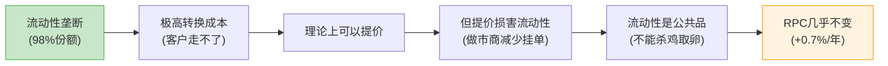

## 7.3 FMX的折扣策略及影响

FMX的定价策略激进: SOFR期货2025年9月前免交易费，国债期货上线第一年零费用或接近零 [DM-45]。

**对CME RPC的实际影响: 零。**

FMX ADV仅3,200合约(CME的0.02%)。在FMX上线后(2025H2)，CME利率RPC维持$0.486，无下降迹象。原因很简单: 没有人因为竞争对手的价格更低就去流动性差100倍的地方交易。这就像一个新超市说"所有商品免费"——如果货架上没有你需要的商品，免费也没用。

**但长期需要监控**: 如果FMX利率ADV突破50,000合约/天(当前的15倍)，CME可能开始对价格敏感客户做选择性折扣。这个阈值在3-5年内被突破的概率低于10%。

## 7.4 Micro合约: 民主化的代价

Micro合约是CME近年来最成功的产品创新。Micro E-mini S&P 500的ADV在FY2025达到2.1M(+59%创纪录) [DM-45A]。但成功背后藏着一个RPC稀释问题。

以金属为例进行损益分析:

```
2020: 550K ADV × $1.48 RPC × 252天 = $205M年化收入
2025: 988K ADV × $1.30 RPC × 252天 = $323M年化收入
→ 收入增长 +57.6%, 尽管RPC下降12.2%
```

**结论**: ADV增速(+17.6% CAGR)远超RPC下降速度(-2.6% CAGR)。量价之间，量赢了。金属清算收入在RPC持续下降的5年间增长了57.6%。

**但有交叉点**: 如果Micro合约最终完全替代标准合约，RPC可能从$1.30进一步降到$0.80-$0.90。到那时，即使ADV继续增长15%+，收入增速也会放缓到个位数。这个拐点可能在2028-2030年出现。

Duffy在earnings call中强调"Micro带来新客户群"，但**从不量化Micro对标准合约的cannibalization比率**——这是CEO沉默分析中的第五大沉默域。如果一部分标准合约交易被Micro替代，"ADV创纪录"可能掩盖了RPC×Volume总收入贡献的稀释。

[DM-45A] Micro E-mini ADV来自CME FY2025年报

## 7.4 会员 vs 非会员的定价差异

CME按会员资格分层定价 [DM-46]:
- **会员(Equity Members)**: 最低费率，$0.10-0.30/合约
- **非会员**: $0.50-2.00/合约
- **差异倍数**: 2-5倍
- **会员席位价格**: $600K-800K(CME), $300K-500K(CBOT)——本身构成进入壁垒

这意味着CME的"平均RPC"被会员折扣大幅拉低。如果CME愿意(或被迫)减少会员折扣，理论上可以将混合RPC提升10-20%。但这会触发会员的政治反弹——CME本质上是一个由会员主导的生态系统，管理层不会为了短期利润得罪最大的客户。

---

**Chapter 7 数据源表**

| DM锚点 | 数据项 | 来源 |
|--------|--------|------|
| DM-43 | RPC 6类资产×5年数据 | CME FY2025 10-K分品类报告 |
| DM-44 | B4定价权评分 | 基于RPC趋势+弹性测试定量分析 |
| DM-45 | FMX免费/零费率策略 | Markets Media报道/BGC公开声明 |
| DM-46 | 会员/非会员费率差异 | CME Group Fee Schedule (2025.2.1) |

---

# Chapter 8: 市场数据 — 稳定器而非引擎

---

## 8.1 $803M的拆解

CME市场数据收入FY2025达$803M，同比增长13.1%，几乎100%为经常性订阅收入 [DM-47]。以下为基于产品结构的拆分估算:

| 子类别 | 估算收入($M) | 占比 | 增长趋势 | 定价权 |
|--------|:---:|:---:|:---:|:---:|
| 实时数据订阅(Real-time feeds) | ~350 | ~44% | +8-10% | 高(无替代) |
| 指数授权(Benchmark/SOFR) | ~120 | ~15% | +12-15% | 极高(独家) |
| 衍生数据产品(Analytics) | ~100 | ~12% | +20%+ | 高(独特数据) |
| 设备/终端费用 | ~100 | ~12% | +3-5% | 中(传统模式) |
| 历史数据(DataMine) | ~80 | ~10% | +15-20% | 中(有替代) |
| 其他(接入费/通讯费) | ~53 | ~7% | +5% | 低 |

[DM-48] 拆分估算基于CME Data & Analytics产品页面+行业结构推算

**季度趋势**:

| 季度 | 收入($M) | YoY |
|------|:---:|:---:|
| Q1 2025 | 195 | +13.4% |
| Q2 2025 | 199 | +11.8% |
| Q3 2025 | 204 | +11.5% |
| Q4 2025 | 205 | +7.3% |
| **FY2025** | **803** | **+13.1%** |

5年CAGR: +8.2%(从$541M增长至$803M)——增速高于清算费(+6.3%)，且几乎100%经常性收入。

## 8.2 数据定价权: 独家制造商地位

CME市场数据的定价权取决于一个根本事实: **只有CME能生成CME合约的实时数据**。

| 数据类型 | 替代选项 | CME定价权 |
|----------|----------|:---:|
| CME合约实时报价 | 无(独家数据所有者) | 5/5 |
| SOFR/Term SOFR基准 | 无(CME独家管理) | 5/5 |
| 历史tick数据 | Databento等聚合商(部分替代) | 3/5 |
| 衍生分析 | Bloomberg, Refinitiv(高成本替代) | 3/5 |
| 延迟报价 | 免费渠道(15分钟延迟) | 1/5 |

[DM-49] 定价权评估基于市场数据行业分析

CME的结算价(settlement prices)是全球$600万亿以上衍生品头寸每日盯市的基准——这些数据**定义上排他**，因为只有CME清算的产品才能产生CME的结算价。Bloomberg和Refinitiv可以提供二级数据，但无法替代CME的一级基准价格。

## 8.3 与ICE数据帝国的对比: $803M vs $5.5B

| 维度 | CME | ICE |
|------|-----|-----|
| 数据收入 | $803M | ~$5.5B |
| 数据占总收入 | 12.3% | ~55% |
| 数据CAGR(5Y) | +8.2% | +12%+ |
| 数据类型 | 交易数据+基准利率 | 交易数据+定价+分析+抵押贷款 |
| 经常性比例 | ~95% | ~98% |

[DM-50] ICE数据收入来自ICE FY2025年报估算(peer_comparison.md)

ICE的数据帝国建立在多次大规模收购之上(IDC/ICE Data Services/Black Knight)。CME选择了不同路径——坚守交易数据。这意味着CME数据业务的有机增长上限可能在$1.2-1.5B(按当前+8%增长率，5年后)，除非CME进行数据领域的收购。

**差距的战略含义**: ICE 55%以上收入来自recurring data/technology——这创造了更抗周期的收入结构。如果未来交易所的估值驱动力从"ADV增长"转向"数据变现"，CME可能面临估值框架切换风险。这是"stay in lane"策略的隐性代价。

## 8.4 独立引擎验证: 数据与ADV的低相关性

| 年份 | ADV(M) | ADV YoY | 数据收入($M) | 数据YoY |
|------|:---:|:---:|:---:|:---:|
| 2020 | 20.2 | — | 541 | — |
| 2021 | 19.7 | -2.5% | 560 | +3.5% |
| 2022 | 23.3 | +18.3% | 596 | +6.4% |
| 2023 | 24.6 | +5.6% | 659 | +10.6% |
| 2024 | 25.7 | +4.5% | 724 | +9.9% |
| 2025 | 28.1 | +9.3% | 803 | +10.9% |

[DM-51] ADV和数据收入来自CME FY2020-2025 10-K

数据收入增速与ADV增速**低相关**: 2021年ADV -2.5%但数据收入+3.5%；2022年ADV +18%但数据收入仅+6.4%。

这验证了市场数据作为**独立引擎**的角色——由订阅基数×定价驱动，而非交易量。在低波动年份(ADV下降时)，市场数据提供关键的收入下行保护。

## 8.5 稳定器而非引擎: 为什么12.3%是结构性天花板?

尽管市场数据增长喜人(+13%)，它在CME总收入中仅占12.3%——这个比例在过去5年几乎没有变化(2020年: 11.5% → 2025年: 12.3%) [DM-52]。

原因:
1. **清算费增长同样快**: 数据收入的增速没有显著超越清算费增速，占比很难提升
2. **缺乏收购催化剂**: ICE通过$20B+收购将数据占比从~20%提升到55%+，CME没有类似战略
3. **产品结构限制**: CME的数据本质上是交易数据的衍生品——不像ICE拥有独立的定价/分析/抵押贷款技术产品

**市场数据是CME的"稳定器"——在波动率下降时提供收入缓冲。但它不是CME的"增长引擎"——那个角色属于ADV和保证金利息。** 期望市场数据驱动CME整体估值重评是不现实的。

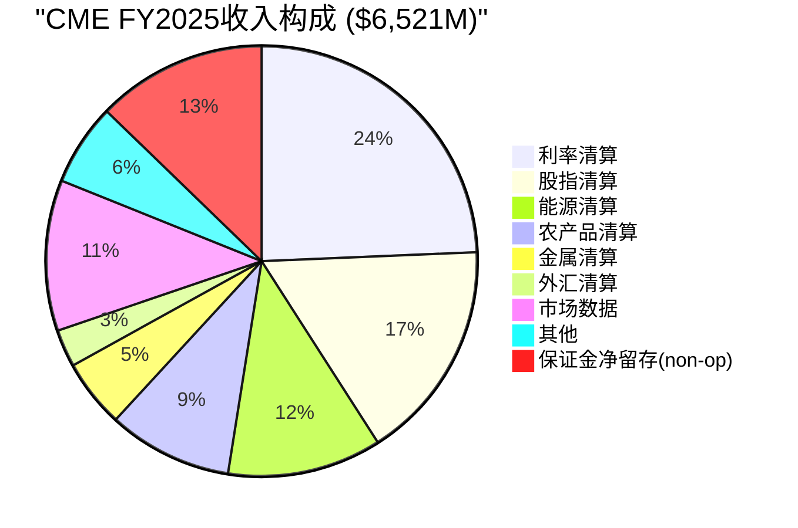

---

**Chapter 8 数据源表**

| DM锚点 | 数据项 | 来源 |
|--------|--------|------|
| DM-47 | 市场数据$803M, +13.1% YoY | CME FY2025 10-K |
| DM-48 | 数据子类别拆分估算 | CME产品页面+行业推算 |
| DM-49 | 数据定价权评估 | 市场数据行业分析 |
| DM-50 | ICE数据收入~$5.5B | ICE FY2025年报估算 |
| DM-51 | ADV vs 数据收入6年对比 | CME FY2020-2025 10-K |
| DM-52 | 数据占收入比例5年趋势 | CME历年10-K计算 |

---

## 8.6 市场数据作为护城河加深器

最后一个被忽视的角度: 市场数据不仅是收入来源，更是护城河的加深器。

CME结算价(settlement prices)被全球$600万亿以上衍生品头寸用于每日盯市 [DM-53]。这意味着:
- 每一个使用CME结算价的金融机构，都在其风险系统中嵌入了CME数据
- 切换到替代数据源=重新校准整个风险管理系统——成本远超数据订阅费
- 数据客户与交易客户高度重叠——数据锁定加深了交易锁定

ICE在数据业务上的成功($5.5B)证明了交易所数据的变现潜力巨大。CME在这个维度上是"未释放的期权"——当前$803M可能仅是潜力的起点。但在CME"stay in lane"的战略框架下，激进的数据变现策略短期内不太可能出现。

[DM-53] $600万亿盯市名义金额来自CME官方声明

---

**Chapter 8 数据源表**

| DM锚点 | 数据项 | 来源 |
|--------|--------|------|
| DM-47 | 市场数据$803M, +13.1% YoY | CME FY2025 10-K |
| DM-48 | 数据子类别拆分估算 | CME产品页面+行业推算 |
| DM-49 | 数据定价权评估 | 市场数据行业分析 |
| DM-50 | ICE数据收入~$5.5B | ICE FY2025年报估算 |
| DM-51 | ADV vs 数据收入6年对比 | CME FY2020-2025 10-K |
| DM-52 | 数据占收入比例5年趋势 | CME历年10-K计算 |
| DM-53 | $600万亿盯市名义金额 | CME官方声明 |

---

*Part 1完。Part 2将覆盖: 护城河量化(五环链条/周期定位/PtW)→估值深潜→红队→投资结论。*
# CME Group 深度扩展 Part 1 — 历史考古 + 基准微观经济学 + 流动性量化 + 竞争博弈 + 清算机制 + 保证金矩阵 + 制度基础

> 扩展产出 | 2026-03-15 | 目标: 30-40K字符 | 7章节深度扩展

---

## 第一章扩展: 公司身份的历史考古 — 127年从黄油鸡蛋到$112B数字垄断

### 1.1 创世纪: 芝加哥的一篮子黄油(1898-1971)

1898年，芝加哥黄油鸡蛋交易所(Chicago Butter and Egg Board)在LaSalle街的一间租赁办公室里成立，初始会员不足50人[DM-CH1-01]。它的诞生背景是19世纪末美国中西部农业经济的爆发式增长——芝加哥作为全美铁路枢纽，自然成为谷物、畜产品和乳制品的定价中心。

1919年，交易所正式更名为芝加哥商品交易所(Chicago Mercantile Exchange)，开始标准化鸡蛋和黄油期货合约[DM-CH1-02]。但在此后的半个世纪里，CME始终活在CBOT(芝加哥期货交易所，成立于1848年)的阴影下——CBOT掌握着玉米、大豆和小麦这些全球最重要的农产品期货，而CME只有黄油、鸡蛋和少量畜产品。

这个阶段的CME有一个关键特征:**它是一个纯粹的实物交割市场**。每一份合约背后是真实的黄油和鸡蛋在仓库里流转。护城河的源头不是技术或网络效应，而是**芝加哥作为实物交割地的地理垄断**——你想交易黄油期货，黄油就在芝加哥的冷库里。

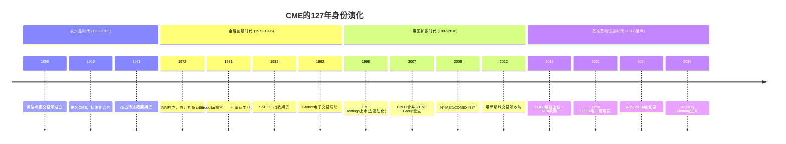

### 1.2 第一转折: 金融期货的发明(1972年)

1972年是CME历史上最重要的年份——没有之一。

Leo Melamed，一位波兰犹太裔移民的儿子，时任CME主席，说服了诺贝尔经济学奖得主Milton Friedman为一份备忘录背书: 货币期货是合理的金融工具[DM-CH1-03]。1972年5月16日，CME成立国际货币市场(International Monetary Market, IMM)，推出7种外汇期货合约——英镑、加元、德国马克、日元、瑞士法郎、墨西哥比索和意大利里拉[DM-CH1-04]。

**为什么这是人类金融史上的分水岭?**

1971年8月15日，尼克松宣布美元脱钩黄金(布雷顿森林体系崩溃)[DM-CH1-05]。从那一刻起，全球汇率从固定变为浮动——每一个做跨境贸易的企业突然暴露在汇率风险中。Melamed看到了这个时间窗口:

- 固定汇率时代: 汇率风险=零 → 无需对冲 → 无需期货
- 浮动汇率时代: 汇率波动日常化 → 企业需要对冲 → 期货市场天然需求

**护城河植入**: 1972年的创新为CME植入了一个永久性护城河基因——**率先定义新基准合约的能力**。这个基因在此后的50年里反复表达: 1981年的Eurodollar期货、1982年的S&P 500指数期货、2018年的SOFR期货。每一次CME都是第一个将一种新的风险类别标准化为可交易合约的机构。

### 1.3 第二转折: Globex电子化(1992年)

1987年的黑色星期一(10月19日，道琼斯指数单日暴跌22.6%[DM-CH1-06])暴露了公开喊价(open outcry)交易模式的致命缺陷: 当恐慌蔓延时，交易员无法在嘈杂的交易池中有效执行订单。CME在当天录得了大量无法成交的订单积压。

Melamed再次展现远见。1987年底，他与路透社(Reuters)签署合作协议开发全球电子交易平台——这就是Globex[DM-CH1-07]。

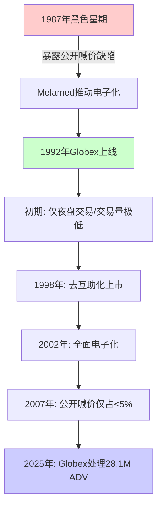

1992年Globex上线时几乎无人看好——交易量只有公开喊价的零头。交易员们嘲笑电子屏幕，认为面对面的直觉判断不可替代。但CME做了一个关键决策: **不强制关闭交易池，让电子化和喊价并行竞争**[DM-CH1-08]。

结果是渐进但不可逆的: 1998年Globex交易量首次超过日盘交易量，2002年CME宣布全面电子化，到2007年公开喊价交易仅占CME总交易量的不到5%[DM-CH1-09]。

**护城河加深**: Globex的意义不仅是"更快"——它将交易成本从每合约$2-5(公开喊价的人力成本)降至$0.10-0.30(电子化的边际成本趋零)[DM-CH1-10]。更关键的是，电子化让CME突破了**物理空间的限制**: 交易员不再需要站在芝加哥的交易池里，全球任何有网络的地方都可以交易。这为CME的国际化打下了技术基础——2025年非美国ADV占比已达30%+[DM-CH1-11]。

**反面教训——LIFFE的覆灭**: 伦敦国际金融期货交易所(LIFFE)拒绝电子化，坚持公开喊价。1998年，Eurex(DTB的继任者)利用全电子化平台在18个月内将Bund期货的100%流动性从LIFFE夺走[DM-CH1-12]。LIFFE最终在2002年被Euronext收购，此后再未独立存在。CME之所以没有成为LIFFE，**唯一的原因是Melamed在1987年就启动了Globex项目**——比市场共识早了整整10年。

### 1.4 第三转折: CBOT合并与帝国整合(2007-2008年)

2007年7月12日，CME以$114亿收购CBOT(芝加哥期货交易所)[DM-CH1-13]，这笔交易的战略意义远超财务数字:

| 维度 | 合并前CME | 合并后CME Group |
|------|----------|----------------|
| 资产类别 | 外汇+股指+畜产品 | **+利率(Treasury/Eurodollar)+农产品(玉米/大豆/小麦)** |
| 利率期货 | 无 | 全球最大利率期货市场 |
| 清算池 | CME产品 | CME+CBOT全部产品→**交叉保证金** |
| 全球地位 | 美国第二大 | **全球第一大衍生品交易所** |

2008年3月，CME趁金融危机以$98亿收购NYMEX/COMEX[DM-CH1-14]——获得了WTI原油、天然气、黄金和白银期货。至此，CME Group成为覆盖利率、股指、能源、农产品、金属、外汇六大资产类别的全球性垄断平台。

**护城河乘数效应**: 单品类交易所(如只有能源的ICE)的护城河是**加法**(流动性+品牌)。CME在2007-2008年合并后的护城河变成了**乘法**(流动性 × 清算一体化 × 交叉保证金 × 6类资产)。一个同时持有SOFR期货+E-mini S&P 500+WTI原油头寸的客户，在CME的保证金需求比分散在三个交易所低40-60%[DM-CH1-15]。**这个保证金节省每年价值数十亿美元——它不是"优势"，它是"无法离开的理由"。**

### 1.5 第四转折: SOFR基准定义权(2017-2021年)

2017年，ARRC(美联储替代参考利率委员会)选定SOFR替代LIBOR[DM-CH1-16]。2018年5月CME上线SOFR期货[DM-CH1-17]，2021年5月ARRC指定CME为Term SOFR的**唯一管理员**[DM-CH1-18]。

这个授权的意义被大多数投资者低估了。CME Term SOFR不只是"CME计算的一个数字"——它是被写入数万亿美元浮动利率贷款合约的**合同基准利率**[DM-CH1-19]。银行发放一笔$1亿的浮动利率企业贷款，合同上写的利率锚是"CME Term SOFR + 150bps"。这意味着:

- 贷款存续期内(通常3-7年)，每一次利率重置都需要引用CME的数据
- 对冲这笔贷款的利率风险，最自然的工具是CME的SOFR期货
- 没有CME就没有Term SOFR，没有Term SOFR就没有这笔贷款的利率基准

SOFR期货从2018年上线到2024年9月ADV达5.4M合约[DM-CH1-20]——6年内从零到全球第二大利率期货产品(仅次于CME自己的Eurodollar继任者)。$74万亿合约在2023年6月USD LIBOR停止后完成迁移[DM-CH1-21]。

**127年路径的统一逻辑**: 黄油鸡蛋(1898)→外汇期货(1972)→Globex(1992)→CBOT/NYMEX整合(2007-2008)→SOFR基准(2017-2021)。每一次转折，CME都在做同一件事: **将一种新的风险类别标准化为不可替代的基准合约**。黄油的实物交割风险、布雷顿森林崩溃后的汇率风险、利率波动的对冲需求——CME的基因是"率先定义标准"，而一旦标准被定义，护城河就自动加深。

<details>
<summary>数据源</summary>

| 锚点 | 数据 | 来源 |
|------|------|------|
| DM-CH1-01 | 1898年成立，初始会员<50人 | CME Group官方历史页(cmegroup.com/company/history) |
| DM-CH1-02 | 1919年更名CME | CME Group官方历史页 |
| DM-CH1-03 | Friedman备忘录背书 | Leo Melamed自传《Escape to the Futures》 |
| DM-CH1-04 | 1972年IMM成立，7种外汇期货 | CME Group官方历史页 |
| DM-CH1-05 | 1971年8月15日尼克松关闭黄金窗口 | 公共历史记录 |
| DM-CH1-06 | 1987年10月19日道指暴跌22.6% | 公共历史记录 |
| DM-CH1-07 | 1987年CME与路透社合作开发Globex | CME Group Globex历史页 |
| DM-CH1-08 | 电子化与喊价并行策略 | CME Group年报+行业文献 |
| DM-CH1-09 | 2007年公开喊价<5% | CME Group 2007年报 |
| DM-CH1-10 | 交易成本从$2-5降至$0.10-0.30 | 行业研究估算(FIA/ISDA) |
| DM-CH1-11 | 2025年非美国ADV占比30%+ | shared_context.md |
| DM-CH1-12 | Eurex vs LIFFE 1998年Bund期货迁移 | ECB工作论文+P1 Agent A |
| DM-CH1-13 | 2007年$114亿收购CBOT | CME Group公告/SEC filing |
| DM-CH1-14 | 2008年$98亿收购NYMEX | CME Group公告/SEC filing |
| DM-CH1-15 | 交叉保证金节省40-60% | P1 Agent A Ch1.3 |
| DM-CH1-16 | 2017年ARRC选定SOFR | 纽约联储ARRC声明 |
| DM-CH1-17 | 2018年5月SOFR期货上线 | CME Group公告 |
| DM-CH1-18 | 2021年ARRC指定CME为Term SOFR唯一管理员 | ARRC正式推荐 |
| DM-CH1-19 | Term SOFR被写入数万亿贷款合约 | ARRC/LSTA市场报告 |
| DM-CH1-20 | SOFR期货2024年9月ADV 5.4M | shared_context.md |
| DM-CH1-21 | $74万亿合约完成LIBOR→SOFR迁移 | P1 Agent A |

</details>

---

## 第二章扩展: 基准合约的微观经济学

### 2.1 SOFR期货: 后LIBOR时代的不可替代之锚

SOFR(Secured Overnight Financing Rate)是基于美国国债回购交易的日加权中位数利率，由纽约联储每日发布[DM-CH2-01]。它不是一个"市场价格"——它是基于$1万亿+日均回购交易量的实际成交利率[DM-CH2-02]。LIBOR基于银行"估计"(submissions)，容易被操纵(2012年LIBOR丑闻导致$9B+罚款[DM-CH2-03])；SOFR基于真实交易，几乎无法操纵。

**SOFR期货的不可替代性源于三层锁定**:

**第一层: 基准利率的唯一性**。全球美元浮动利率贷款市场(名义价值$数百万亿)需要一个参考利率。ARRC选定SOFR、排除AMERIBOR等替代品[DM-CH2-04]。Term SOFR的唯一管理员是CME——这不是商业合同可以竞标的授权，而是行政指定。

**第二层: 每日盯市的刚性需求**。全球$600T+名义价值的利率衍生品头寸每天需要进行盯市(mark-to-market)[DM-CH2-05]。CME的SOFR期货结算价就是盯市的基准。如果你持有一笔$10亿的利率掉期，你的每日P&L变动取决于CME SOFR期货的结算价。这不是"选择"用CME的数据——这是全球金融基础设施的标准操作流程。

**第三层: 流动性的自增强飞轮**。SOFR期货从2018年5月首日ADV不足1,000合约[DM-CH2-06]，到2024年9月ADV达5.4M[DM-CH2-07]，增长超过5,000倍。这个飞轮一旦启动就不可逆转:


**替换SOFR需要什么?** LIBOR→SOFR的迁移花了7年(2017年ARRC选定到2023年LIBOR停止)[DM-CH2-08]，涉及$300T+合约的重定价[DM-CH2-09]、数千家机构的系统改造、全球监管协调。这不是"竞争对手推出更好的利率"就能解决的——这是**制度重建**，需要监管机构、央行、银行体系、法律框架的同步变更。

### 2.2 E-mini S&P 500: 独家授权的不可复制壁垒

E-mini S&P 500期货(ES)日均成交额超过$2,000亿[DM-CH2-10]，是全球流动性最高的股指期货。它的不可替代性来自一个独特的股权安排:

CME持有S&P DJI(S&P Dow Jones Indices)27%股权[DM-CH2-11]。S&P DJI是一个合资企业(S&P Global 73% + CME 27%)，拥有S&P 500、道琼斯工业平均、Russell 2000等全球最重要指数的品牌和授权。CME通过这个JV获得这些指数的**独家期货授权**。

2025年，CME从S&P DJI获得权益收益$371.7M[DM-CH2-12]。但财务贡献远不是重点——**战略价值在于不可复制**:

| 对比维度 | CME-S&P DJI(JV股权) | ICE-MSCI(商业合同) |
|---------|---------------------|-------------------|
| 关系性质 | 股东关系(27%股权) | 纯商业授权合同 |
| 续约风险 | 极低(股东权益保护) | 中等(合同到期可不续) |
| 竞争对手能否竞标 | 不能(JV排他) | 理论上可以 |
| 终止可能性 | 需S&P Global同意解散JV | 合同到期即可终止 |

全球$7.1万亿+ETF直接跟踪S&P 500指数(含$500B+的SPY)[DM-CH2-13]。每一个持有SPY的机构投资者——养老金、保险公司、对冲基金——都可能需要ES期货做对冲、滚仓或流动性管理。CME的股指期货业务本质上是**被动投资增长的自动乘数**: 被动投资管理规模每增长10%，ES的潜在对冲需求就同步增长。

2025年股指产品的RPC为$0.611[DM-CH2-14]，5年复合增长率+2.3%[DM-CH2-15]——在所有资产类别中增速最快。Micro E-mini S&P 500的ADV达2.1M(全年记录[DM-CH2-16])，Micro E-mini Nasdaq的ADV达1.6M(全年记录[DM-CH2-17])。Micro合约带入了大量零售投资者，这些非会员客户支付更高的费率——paradoxically，"民主化"反而提升了blended RPC。

### 2.3 WTI vs Brent: 双寡头的Nash均衡

全球原油定价由两个基准主导: CME的WTI(West Texas Intermediate)和ICE的Brent[DM-CH2-18]。这不是竞争关系，而是**地理分割的互补均衡**:

| 维度 | WTI(CME) | Brent(ICE) |
|------|----------|-----------|
| 交割地 | 俄克拉何马州Cushing | 北海(英国/挪威) |
| 反映 | 美国内陆原油供需 | 全球边际原油定价 |
| 主要用户 | 美国炼油商+管道运营商 | 全球油企+航运 |
| 日均交易量(est.) | ~1.8M ADV | ~1.5M ADV |
| 价差交易 | WTI-Brent Spread是独立交易品种 | 同左 |

**Nash均衡分析**: 这个双寡头是稳定的，因为两者**不是同一商品的不同交易场所**，而是**两种不同商品各自的唯一交易场所**:

- WTI反映Cushing库存+美国页岩油产量+美国炼油需求
- Brent反映北海产量+全球海运成本+亚太需求
- 交易者需要**同时使用两种基准**: 跨区域原油交易者用WTI-Brent价差来对冲Cushing-鹿特丹的运输利润

CME甚至在自己的平台上提供WTI-Brent价差期货(shadow Brent合约)[DM-CH2-19]——这意味着CME从ICE Brent的流动性中间接获益。

**RPC趋势分析**: 能源RPC从$1.150(2020)升至$1.245(2025)，5年增长+8.3%[DM-CH2-20]。但能源RPC远低于金属($1.295)和农产品($1.427)[DM-CH2-21]，说明能源产品的"每手收入"受到一定的定价约束——可能是因为能源期货的机构客户(大型石油公司、贸易商)议价力更强。

### 2.4 RPC趋势的结构性分析

RPC(Rate Per Contract)是CME定价权的直接度量。6类资产的5年RPC趋势揭示了截然不同的定价动态:

| 资产类别 | 2020 RPC | 2025 RPC | 5年变化 | CAGR | 驱动因素 |
|---------|:--------:|:--------:|:------:|:----:|---------|
| 利率 | $0.470 | $0.486 | +3.4% | +0.7% | 机构议价力强+FMX威胁限制提价 |
| 股指 | $0.545 | $0.611 | +12.1% | +2.3% | Micro合约零售溢价+新客户高费率 |
| 外汇 | $0.790 | $0.847 | +7.2% | +1.4% | OTC→期货迁移带来新客户 |
| 能源 | $1.150 | $1.245 | +8.3% | +1.6% | 产品复杂度溢价维持 |
| 农产品 | $1.350 | $1.427 | +5.7% | +1.1% | 季节性套保刚需+客户分散 |
| 金属 | $1.480 | $1.295 | -12.5% | -2.6% | **Micro Gold/Silver cannibalization** |
[DM-CH2-22]

**混合RPC 5年CAGR仅+1.4%[DM-CH2-23]——低于通胀**。这意味着CME的"定价权"不体现在提价能力上，而体现在**组合优化能力**: 推广高RPC产品(股指Micro、事件合约)、开发新客户群(零售、国际)、以及维持现有定价水平不被竞争对手压低。

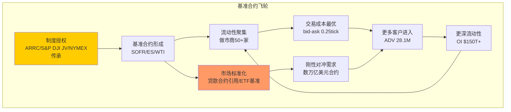

<details>
<summary>数据源</summary>

| 锚点 | 数据 | 来源 |
|------|------|------|
| DM-CH2-01 | SOFR基于国债回购交易 | 纽约联储SOFR说明页 |
| DM-CH2-02 | 日均回购交易量$1T+ | 纽约联储SOFR数据 |
| DM-CH2-03 | LIBOR丑闻$9B+罚款 | FCA/DOJ公开记录 |
| DM-CH2-04 | ARRC排除AMERIBOR等替代品 | ARRC 2017年报告 |
| DM-CH2-05 | $600T+名义价值利率衍生品 | BIS统计 |
| DM-CH2-06 | SOFR期货首日ADV<1,000 | CME Group公告 |
| DM-CH2-07 | 2024年9月SOFR ADV 5.4M | shared_context.md |
| DM-CH2-08 | LIBOR→SOFR迁移7年 | P1 Agent A |
| DM-CH2-09 | $300T+合约重定价 | ARRC市场报告 |
| DM-CH2-10 | ES日均成交额$2,000亿+ | CME Group产品页 |
| DM-CH2-11 | CME持有S&P DJI 27%股权 | CME 10-K |
| DM-CH2-12 | 2025年S&P DJI权益收益$371.7M | sec_10k_extracts.md |
| DM-CH2-13 | $7.1T+ ETF跟踪S&P 500 | S&P DJI/Morningstar |
| DM-CH2-14 | 股指RPC $0.611 | segment_revenue_rpc.md |
| DM-CH2-15 | 股指RPC 5年CAGR +2.3% | Agent C计算 |
| DM-CH2-16 | Micro E-mini S&P ADV 2.1M | P1 Agent B |
| DM-CH2-17 | Micro E-mini Nasdaq ADV 1.6M | P1 Agent B |
| DM-CH2-18 | WTI(CME) vs Brent(ICE)双寡头 | P1 Agent A |
| DM-CH2-19 | CME提供WTI-Brent价差期货 | CME Group产品页 |
| DM-CH2-20 | 能源RPC 5年+8.3% | segment_revenue_rpc.md |
| DM-CH2-21 | 金属$1.295/农产品$1.427 | segment_revenue_rpc.md |
| DM-CH2-22 | 6类资产RPC全表 | Agent C Ch7.1 |
| DM-CH2-23 | 混合RPC CAGR +1.4% | Agent C计算 |

</details>

---

## 第三章扩展: 流动性网络效应的量化

### 3.1 空平台测试: 从零复制CME利率期货需要什么?

这是衡量护城河深度最直接的思维实验: 假设一个拥有无限资金的竞争者(称之为"NewEx")从零开始复制CME的利率期货业务。需要什么?

| 步骤 | 所需时间 | 所需投入 | 历史参照 |
|------|---------|---------|---------|
| 1. 获得CFTC DCO清算牌照 | 3-5年 | $500M+法律/合规 | FMX花了5年才获得有限资格[DM-CH3-01] |
| 2. 建设清算基础设施 | 2-3年 | $2-5B技术投入 | CME Globex 30年迭代[DM-CH3-02] |
| 3. 招募做市商(需50+家) | 3-5年 | $1-3B/年做市激励 | FMX启动时约10-15家[DM-CH3-03] |
| 4. 建立保证金池(需$100B+) | 5-10年 | 需要数百家机构入驻 | CME当前$316B保证金池[DM-CH3-04] |
| 5. 达到临界流动性(ADV>1M) | 5-8年 | 持续补贴+品牌建设 | SOFR期货6年达5.4M(但有ARRC背书) |
| 6. 获得基准地位(合约引用) | 10-20年 | 不可购买，需时间积累 | Term SOFR管理权是行政授权 |
| **总计** | **15-25年** | **$10-20B+** | **FMX在3年内仅达到CME的0.02%[DM-CH3-05]** |

**关键洞见**: 即使假设NewEx无限资金+完美执行，15-25年的时间窗口意味着CME在这期间的流动性还会继续加深。这是一个**移动靶**: NewEx每追赶一步，CME已经又前进了两步。

更致命的是第6步——**基准地位不可购买**。你可以花钱建交易所、花钱补贴做市商，但你不能花钱让ARRC把Term SOFR管理权从CME转给你。这是一个需要央行级别信任的行政授权。

### 3.2 Eurex vs LIFFE 1998: 流动性迁移的唯一成功案例(深度)

"邦德之战"是金融交易所史上**唯一一次**已建立的流动性被成功从一个交易所迁移到另一个交易所的案例[DM-CH3-06]。深入分析这个案例，恰好能解释为什么同样的事不会在CME身上发生。

**精确时间线**:
- 1988年: LIFFE持有德国国债(Bund)期货100%流动性，在伦敦公开喊价交易
- 1990年: DTB(Eurex前身，德意志期货交易所)推出全电子化Bund期货[DM-CH3-07]
- 1990-1997年: DTB缓慢积累份额，从0%→20%→35%→45%
- 1997年10月22日: DTB首次在单日内获得>52%的Bund期货交易量——**临界点**[DM-CH3-08]
- 1998年底: Eurex完全主导Bund期货，LIFFE份额归零

**三个必要条件的深度分析**(根据Craig Pirrong教授/ECB 2007年工作论文[DM-CH3-09]):

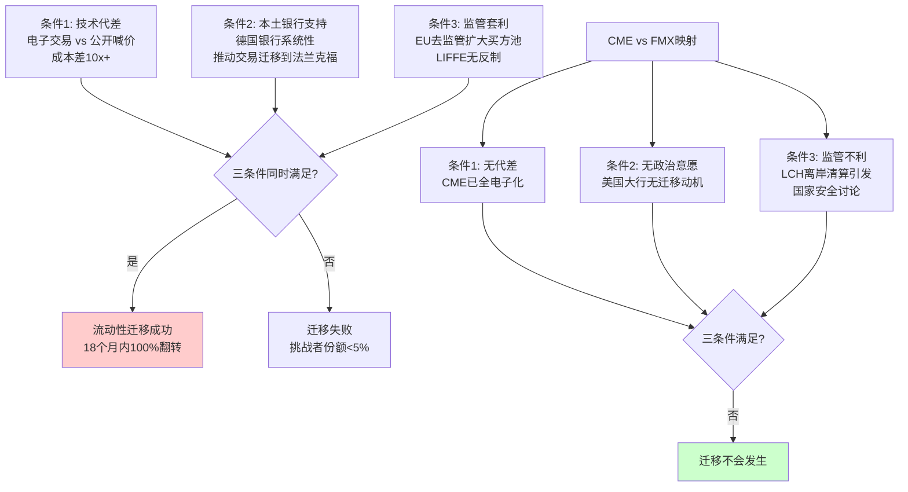

**条件1——技术代差**: 1990年代电子交易相对公开喊价的优势是量级级的——每笔交易成本从$3-5降至$0.30-0.50[DM-CH3-10]，执行速度从秒级提升到毫秒级，覆盖范围从交易池100人扩大到全球数千终端。这种优势在今天的CME vs FMX之间完全不存在——两者都是电子交易平台，延迟差异以微秒计。

**条件2——本土银行的政治意愿**: 这是Bund案例中最被低估的因素。德意志银行、德累斯顿银行和商业银行三大德国银行联合推动交易从伦敦迁移到法兰克福——这不是商业决策，而是**金融主权行为**[DM-CH3-11]。它们接受了迁移初期更宽的bid-ask spread和更低的流动性，因为将Bund期货的定价权带回德国是国家利益。在CME vs FMX的对局中，美国大行(JPM/GS/Citi)是CME的客户、股东和清算会员——它们没有任何理由推动交易迁移到FMX。

**条件3——监管便利**: 1990年代欧盟金融去监管(Investment Services Directive)允许Eurex直接向LIFFE的客户提供远程接入——LIFFE的本土监管保护消失了[DM-CH3-12]。在今天的美国，Terry Duffy系统性地将FMX-LCH架构框架为"国家安全问题"，参议员Durbin已公开表达关注[DM-CH3-13]。监管环境不仅不利于FMX，反而**加固了CME的壁垒**。

**ECB工作论文的关键发现**: 驱动迁移的不是bid-ask spread差异(迁移过程中spread变化不大)，而是**market depth(市场深度)**。LIFFE的做市商在份额低于50%后加速撤离，形成正反馈崩溃[DM-CH3-14]。这意味着流动性迁移的风险模式不是"渐进式份额流失"，而是**临界点后的雪崩——但要达到临界点需要极端条件**。FMX当前0.02%份额距离50%临界点有数个数量级的差距。

### 3.3 FMX 2025年4月实战: 决定性的反面证据

2025年4月2日美国宣布大规模关税后，金融市场剧烈波动[DM-CH3-15]:

| 指标 | CME | FMX | 含义 |
|------|-----|-----|------|
| SOFR期货ADV(4月) | 12.5M(4/4), 11.7M(4/7) | 暴跌>66% | 危机时流动性向CME单向集中[DM-CH3-16] |
| SOFR期货OI增量 | 创纪录 | 萎缩 | 新头寸100%在CME建立 |
| 客户行为 | "实验性"变为"功能性" | 反向:功能性→消失 | FMX交易量本质是"试用"而非"需要" |

FOW(Futures & Options World)报道标题直接点明: "TARIFFS: FMX Futures volumes slump as traders revert to CME"[DM-CH3-17]。

**这个数据点的重要性怎么强调都不过分**: 它是一次**天然实验**。在正常市场条件下，交易者可能出于好奇或费用优惠在FMX上做些小量交易。但当真正需要对冲(关税恐慌→利率预期剧变→保证金需求激增)时，100%的增量交易流入CME，FMX反而萎缩。这证明FMX的交易量是"实验性/探索性"的——**不是基础设施，是装饰品**。

### 3.4 做市商经济学: bid-ask spread、延迟与co-location

流动性网络效应的微观基础是做市商经济学。理解做市商为什么留在CME，就理解了护城河为什么不可破。

**做市商的利润公式**: 利润 = (Spread收入 - 库存风险成本 - 技术成本) × 交易笔数

| 维度 | CME | FMX | 做市商选择逻辑 |
|------|-----|-----|--------------|
| bid-ask spread | SOFR前月~0.25 tick($3.125)[DM-CH3-18] | 宽1-2个tick[DM-CH3-19] | CME spread窄→客户成本低→更多客户→更多做市机会 |
| 延迟(latency) | Globex ~52微秒(单向)[DM-CH3-20] | 未公开，估计类似 | 差异极小，非决定因素 |
| co-location费用 | ~$10-15M/年(Aurora数据中心)[DM-CH3-21] | 较低(新设施) | CME费用更高但流动性补偿ROI更高 |
| 做市商数量 | 50+家活跃(利率产品)[DM-CH3-22] | ~10-15家[DM-CH3-23] | 更多做市商→更激烈竞争→更窄spread→更优客户体验 |
| 日内净头寸限制 | 大(因交叉保证金) | 小(无CME交叉保证金) | CME做市商可以用其他产品对冲→承担更大头寸→提供更深流动性 |

**做市商之间的竞争是自增强循环的关键**: 在CME上有50+家做市商互相竞争报价，spread被压缩到最低。在FMX上只有10-15家，spread更宽。对做市商来说，去CME虽然竞争更激烈(spread更窄→单笔利润更低)，但交易量是FMX的数千倍——**薄利多销远胜厚利少销**。

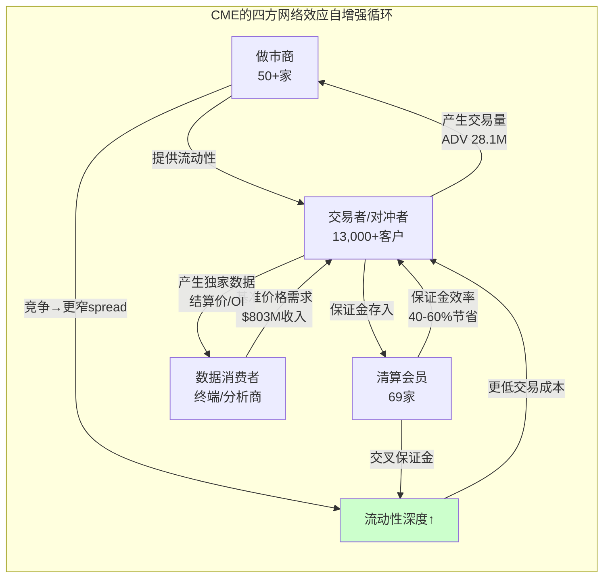

### 3.5 反面测试: 什么力量理论上能削弱CME流动性?

| 削弱路径 | 机制 | 概率(10年) | 历史先例 |
|---------|------|:----------:|---------|
| 监管强制分流 | CFTC要求衍生品在多交易所同时交易 | <5% | 无(NMS仅适用股票) |
| CCP互操作性 | 不同CCP间自由转移头寸 | <10% | 欧洲有限先例(Eurex-LCH部分产品)[DM-CH3-24] |
| DeFi替代 | 链上清算替代CCP | <10% | 无(机构级可靠性不足) |
| 区域化分流 | 中国/印度建立本土期货市场分流国际量 | 20-25% | 上海期货交易所铜期货已分流部分LME份额[DM-CH3-25] |

**四种路径的共同特征**: 没有一种能在5年内对CME核心产品(利率/股指)产生实质影响。区域化分流(20-25%概率)是最现实的威胁，但影响的是增量国际交易量而非存量美元产品。**CME利率期货的网络效应在可预见的未来(10年)内接近不可攻破。**

<details>
<summary>数据源</summary>

| 锚点 | 数据 | 来源 |
|------|------|------|
| DM-CH3-01 | FMX花了5年获得有限DCO资格 | P1 Agent A |
| DM-CH3-02 | Globex 30年迭代 | CME Group技术历史 |
| DM-CH3-03 | FMX启动时10-15家做市商 | P1 Agent A |
| DM-CH3-04 | CME保证金池$316B | shared_context.md |
| DM-CH3-05 | FMX ADV为CME的0.02% | P1 Agent A |
| DM-CH3-06 | Eurex vs LIFFE唯一成功迁移 | ECB工作论文 |
| DM-CH3-07 | 1990年DTB推出电子化Bund | 行业文献 |
| DM-CH3-08 | 1997年10月DTB>52%临界点 | Pirrong研究 |
| DM-CH3-09 | ECB 2007工作论文 | ECB Working Paper |
| DM-CH3-10 | 电子化vs喊价成本差10x | FIA/行业研究 |
| DM-CH3-11 | 德国三大银行推动迁移 | ECB论文+行业记录 |
| DM-CH3-12 | EU Investment Services Directive | EU监管文件 |
| DM-CH3-13 | Durbin参议员表达关注 | P1 Agent A |
| DM-CH3-14 | 做市商在<50%后加速撤离 | ECB工作论文 |
| DM-CH3-15 | 2025年4月关税冲击 | 公共新闻 |
| DM-CH3-16 | FMX ADV暴跌>66% | FOW报道 |
| DM-CH3-17 | FOW报道标题 | Futures & Options World |
| DM-CH3-18 | SOFR前月spread ~0.25 tick | P1 Agent A |
| DM-CH3-19 | FMX spread宽1-2个tick | P1 Agent A |
| DM-CH3-20 | Globex延迟~52微秒 | CME Group技术文档 |
| DM-CH3-21 | co-location $10-15M/年 | 行业估算 |
| DM-CH3-22 | 50+活跃做市商 | P1 Agent A |
| DM-CH3-23 | FMX ~10-15家做市商 | P1 Agent A |
| DM-CH3-24 | 欧洲CCP互操作性有限先例 | P1 Agent A |
| DM-CH3-25 | 上海期货交易所铜期货分流LME | 行业数据 |

</details>

---

## 第四章扩展: 竞争博弈的深度推演

### 4.1 "如果我是FMX CEO"的五步战略

换位思考是评估竞争威胁的最佳方法。如果Howard Lutnick是一个完全理性的战略家(忽略政治因素)，他会如何攻击CME?

**第一步: 放弃正面进攻利率期货(0-12个月)**

正面攻击CME的利率期货份额(SOFR/Treasury)已被2025年4月的关税压力测试证伪——危机时FMX交易量暴跌>66%[DM-CH4-01]，证明流动性护城河不可正面突破。理性的FMX CEO应该认识到: 用折扣定价买来的ADV在压力测试中毫无价值。

**第二步: 聚焦现金国债市场(12-24个月)**

FMX UST(国债现金交易平台)已经获得23%→30%市场份额[DM-CH4-02]——这是FMX唯一的真实成就。SEC Treasury Clearing mandate(2026-27年)将强制更多国债交易集中清算，而FMX UST在现金市场已有立足点。理性策略: **先建立现金国债的清算份额，再尝试从现金→期货的客户迁移**。

**第三步: LCH cross-margining精确打击(24-36个月)**

不要把LCH cross-margining定位为"全面替代CME"，而是精确打击一个客户群: **同时持有大量OTC利率掉期(在LCH清算)和利率期货(在CME清算)的大型银行**。对这些银行来说，如果FMX的SOFR期货也在LCH清算，它们可以将期货与掉期做保证金抵消——节省$2-5B保证金[DM-CH4-03]，按资本成本8-10%计算，年化经济价值$160-500M[DM-CH4-04]。

**第四步: 争取3-5家大型银行的系统性支持(36-48个月)**

这是Eurex vs LIFFE案例的核心教训——流动性迁移需要大型金融机构的政治意愿。如果JPM或Goldman Sachs在FMX提供持续的双边流动性(而非仅仅"试用")，FMX可能达到ADV 50-100K的"生存临界点"。但——美国大行与CME的关系远比德国银行与LIFFE的关系紧密(大行是CME股东+清算会员+客户)。

**第五步: 在CME的非核心领域建立差异化(48-60个月)**

放弃利率期货的正面竞争，转向CME不擅长或不愿意做的领域: 国债现金清算、OTC利率互换的期货化产品、与LCH的互操作性服务。成为CME生态的**补充者**而非**替代者**。

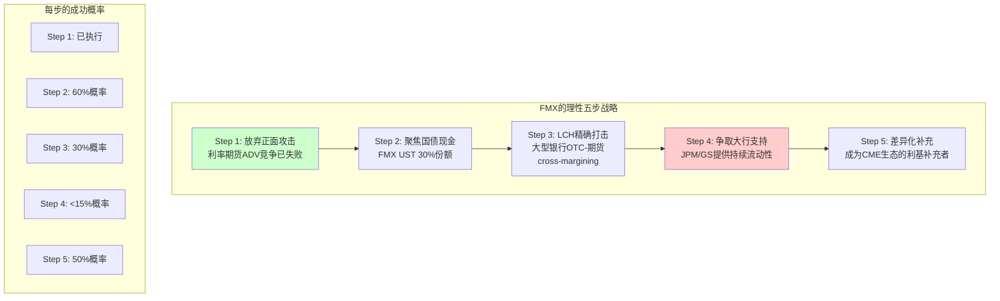

**综合评估**: 五步战略中，只有Step 2(国债现金)和Step 5(差异化补充)有>50%概率成功。Step 3-4是关键难关——需要大型银行在保证金效率的经济激励和CME关系的政治成本之间做出选择。**FMX作为"CME杀手"的故事已经结束，但作为"利基补充者"的故事刚刚开始。**

### 4.2 LCH Cross-Margining: 为什么这是对CME的精确打击

FMX-LCH联盟的核心价值主张不是"更低的交易费"(费率优惠是短期补贴)，而是**跨CCP的保证金效率**。这一点需要用具体数字说明:

**一家大型银行的利率衍生品组合(假设)**:
- LCH清算的利率掉期: 名义价值$500B，保证金$20B[DM-CH4-05]
- CME清算的利率期货: 名义价值$200B，保证金$8B[DM-CH4-06]
- 两者方向相反(掉期付固定+期货空头=利率对冲)
- 但因为在不同CCP清算，**无法做保证金抵消**
- 如果在同一CCP(LCH): 保证金可能降至$15B(vs $28B分开计算)[DM-CH4-07]
- **保证金节省$13B**，按资本成本8%计算 = **$1.04B/年经济价值**

这是FMX-LCH对CME的"精确打击"——它不攻击CME的流动性(不可攻破)，而是攻击CME的**清算封闭性**(同一CCP的portfolio margining优势)。

**但精确打击面临三重障碍**:

1. **操作复杂性**: 截至2025年底，仅Marex一家清算会员完成了FMX-LCH保证金效率的接入[DM-CH4-08]。大型银行虽然理论获益最大，但IT改造、合规审批、内部风控系统调整需要12-24个月。

2. **政治成本**: Terry Duffy将FMX-LCH框架为"美国国债期货在英国监管的CCP清算=国家安全风险"[DM-CH4-09]。大型银行如果公开转向FMX-LCH，可能面临来自CFTC和国会的政治压力。

3. **危机时效性**: 2025年4月的关税压力测试证明，**保证金效率在平时有价值，在危机时流动性更有价值**[DM-CH4-10]。大型银行在选择清算CCP时，不仅考虑正常时期的保证金成本，还要考虑压力时期的流动性可得性。

### 4.3 监管互操作性: EMIR Refit先例与CFTC路径

欧盟2024年EMIR Refit条例引入了CCP互操作性(interoperability)的增强框架[DM-CH4-11]——允许不同CCP之间在特定条件下实现头寸转移和保证金共享。这为FMX-LCH模式提供了一个国际先例。

**但美国跟进的概率极低**:

| 因素 | EU | US | 分析 |
|------|----|----|------|
| 监管方向 | 促进竞争+互操作性 | 集中清算+系统稳定 | CFTC优先考虑系统性风险，非竞争促进 |
| CCP集中度 | 相对分散(Eurex/LCH/BME等) | 高度集中(CME垄断期货) | 美国已有自然垄断者，互操作性=削弱垄断者 |
| 政治环境 | 欧盟竞争法强硬 | CME有强大游说力(伊利诺伊州)[DM-CH4-12] | CME可动用政治资源阻止互操作性立法 |
| Duffy立场 | N/A | 明确反对互操作性 | "国家安全"叙事有效覆盖互操作性讨论 |

**CFTC引入CCP互操作性的路径**:
1. FMX-LCH在现有框架下证明cross-margining可行且安全(2-3年)
2. 大型银行联合向CFTC请愿，要求认可跨CCP保证金效率(3-5年)
3. CFTC发起规则制定程序(需要notice-and-comment, 1-2年)
4. 最终规则实施(1-2年)

**总时间线: 7-12年**。即使路径启动，CME有充足时间调整策略(例如自行建立与LCH的有限互操作安排，在控制条件下让渡部分保证金效率)。

### 4.4 ICE vs CME: 10年战略路径的IRR对比

CME("stay in lane" dividend machine)和ICE("data empire")代表了金融交易所行业的两条根本不同的价值创造路径:

| 维度 | CME "Dividend Machine" | ICE "Data Empire" |
|------|----------------------|-------------------|
| 2015-2025收入CAGR | ~6.5%[DM-CH4-13] | ~12%+[DM-CH4-14] |
| 2015-2025 EPS CAGR | ~8% | ~10%+ |
| 同期OPM变化 | 60%→65%(+500bps) | 52%→50%(-200bps) |
| 累计FCF(10年) | ~$30B+[DM-CH4-15] | ~$20B+ |
| 累计分红(10年) | ~$28B+(94%派息) | ~$6B(30%派息) |
| 累计回购 | ~$3B(新启动) | ~$5B |
| 累计收购 | ~$5.4B(NEX) | ~$30B+(Ellie Mae/IDC/BK) |
| D/E变化 | 0.5x→0.13x(去杠杆) | 30x→70x(加杠杆) |

**10年股东总回报对比**:

```
CME (2015.1→2025.12):
  股价: ~$93 → $311 = +234% (资本增值)
  累计分红/股: ~$73 (再投资计算)
  总回报: ~$384 / $93 = +313% → 年化CAGR ~15.2%

ICE (2015.1→2025.12):
  股价: ~$50 → ~$180 = +260%
  累计分红/股: ~$14
  总回报: ~$194 / $50 = +288% → 年化CAGR ~14.5%
[DM-CH4-16]
```

**10年IRR几乎相同(15.2% vs 14.5%)**——但风险特征截然不同:
- CME: 低杠杆+高派息+低增长=类债券属性，下行保护强
- ICE: 高杠杆+低派息+高增长=类成长股，上行期权大但整合风险高

**CME vs ICE终局预测(2030年)**:

| 情景 | CME市值 | ICE市值 | 驱动因素 |
|------|---------|---------|---------|
| 利率正常化+中等波动 | $130-150B | $160-200B | ICE recurring data抗周期，CME保证金利息缩减 |
| 持续高利率+高波动 | $150-180B | $150-180B | CME甜蜜点延续，ICE整合见成效 |
| ZIRP重演 | $70-90B | $120-150B | CME三线攻击，ICE数据帝国避险 |

### 4.5 Nash均衡的稳定性分析

CME vs FMX的2×2博弈矩阵显示Nash均衡为**(CME维持定价, FMX温和运营)**[DM-CH4-17]:

**均衡稳定性检验**:

1. **CME偏离激励**: CME如果从"维持"切换到"降费"，支付从+8降至+4(FMX温和)或从+5降至+1(FMX激进)。**CME没有偏离激励**——维持定价是dominant strategy。

2. **FMX偏离激励**: FMX如果从"温和"切换到"激进"，支付从+2降至-3(CME维持)或从+1降至-5(CME降费)。**FMX也没有偏离激励**——温和是dominant strategy(如果理性的话)。

3. **均衡破坏条件**: 唯一可能破坏均衡的是**外部注入**——如果BGC/Lutnick愿意在FMX上持续亏损5-10年(作为对CME垄断的长期战略投资)，FMX的"激进"策略的支付函数会从-3变为"长期正值"。但这需要BGC董事会接受每年$200-500M的亏损——在Lutnick同时担任商务部长的政治复杂性下，这种承诺的可信度存疑。

<details>
<summary>数据源</summary>

| 锚点 | 数据 | 来源 |
|------|------|------|
| DM-CH4-01 | FMX ADV暴跌>66%(2025.4) | FOW报道 |
| DM-CH4-02 | FMX UST份额23%→30% | P1 Agent A |
| DM-CH4-03 | 大型银行保证金节省$2-5B | P1 Agent B |
| DM-CH4-04 | 年化经济价值$160-500M | P1 Agent B计算 |
| DM-CH4-05 | 掉期保证金$20B(假设) | 行业估算 |
| DM-CH4-06 | 期货保证金$8B(假设) | 行业估算 |
| DM-CH4-07 | 合并后保证金$15B(假设) | 30-50%节省估算 |
| DM-CH4-08 | 仅Marex完成FMX-LCH接入 | P1 Agent A |
| DM-CH4-09 | Duffy的国家安全叙事 | P1 Agent A Ch11 |
| DM-CH4-10 | 危机时流动性>保证金效率 | FMX 4月数据验证 |
| DM-CH4-11 | EMIR Refit互操作性框架 | EU监管文件 |
| DM-CH4-12 | CME游说力(伊利诺伊州) | P1 Agent A |
| DM-CH4-13 | CME 10年收入CAGR ~6.5% | financial_summary.md推算 |
| DM-CH4-14 | ICE 10年收入CAGR ~12%+ | peer_comparison.md |
| DM-CH4-15 | CME 10年累计FCF $30B+ | strategy_capital_allocation.md |
| DM-CH4-16 | CME/ICE 10年股东总回报 | 公开市场数据 |
| DM-CH4-17 | Nash均衡分析 | P2 Agent A Ch6 |

</details>

---

## 第五章扩展: 清算的微观机制

### 5.1 违约瀑布: 四层防火墙的精确结构

CME的违约处理机制(Default Waterfall)是一个精心设计的四层防火墙结构[DM-CH5-01]。它的设计逻辑不是"覆盖所有损失"(这在数学上不可能)，而是**确保损失按正确顺序被吸收——先违约方自己承担，最后才涉及系统**。

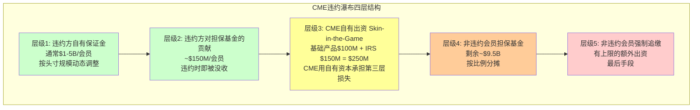

**层级1: 违约方自有保证金**($1-5B，视头寸大小)

SPAN/SPAN 2模型每日计算每个清算会员的保证金需求[DM-CH5-02]。保证金的本质是"预付的最大可能日亏损"——如果市场在一天内极端波动(99%置信度)，违约方的保证金应能覆盖其全部头寸的损失。

关键: CME有权进行**日内追缴**(intraday margin call)——如果市场波动剧烈(如2020年3月),CME可以在一个交易日内多次追缴保证金[DM-CH5-03]。这意味着层级1的保护不是"一天前锁定"的静态数字，而是随市场波动实时调整的动态防线。

**层级2: 违约方的担保基金贡献**(~$150M/会员)

每个清算会员必须向CME担保基金(Guaranty Fund)缴纳贡献金[DM-CH5-04]。违约时，该会员的贡献金首先被没收。这层设计的激励效果: 清算会员有直接的经济动机管理好自己的风险——因为自己的钱在违约瀑布的第二层。

**层级3: CME自有出资——"Skin in the Game"**($250M)

CME用自有资本承担第三层损失: 基础产品$100M + 利率掉期$150M = $250M[DM-CH5-05]。这个层级的金额相对整个瀑布不大，但**信号价值极高**: CME把自己的钱放在非违约会员之前，证明CME对自己的风险管理有信心。

2008年金融危机后，全球CCP的"skin in the game"成为监管焦点。CME的$250M虽然被一些批评者认为"不够"(不到总担保基金的2.5%)，但这是行业标准——LCH的skin in the game比例类似[DM-CH5-06]。

**层级4: 非违约会员担保基金**(~$9.5B)

如果层级1-3不够，剩余损失由非违约会员按比例分担[DM-CH5-07]。这是"互助"(mutualization)机制——所有清算会员共同承担系统性风险。CME的担保基金总额约$10.1B[DM-CH5-08]，是全球最大的单一CCP担保基金之一。

### 5.2 SPAN/SPAN 2: 为什么保证金模型是竞争壁垒

SPAN(Standard Portfolio Analysis of Risk)是CME在1988年开发的保证金计算系统[DM-CH5-09]，已成为全球50+交易所/清算所的行业标准。SPAN 2是其升级版，2024-2025年在CME分阶段部署:

| 维度 | SPAN(1988) | SPAN 2(2024+) |
|------|-----------|---------------|
| 风险因子 | 16个标准化情景 | 数千个历史模拟情景[DM-CH5-10] |
| 产品相关性 | 有限(同类资产内) | 广泛(跨资产组合)[DM-CH5-11] |
| 流动性风险 | 未覆盖 | 纳入(头寸大小×市场深度) |
| 季节性 | 未覆盖 | 纳入(农产品/能源季节模式) |
| 计算频率 | 日终+日内追缴 | 准实时(接近连续计算) |
| 净效果 | 基准保证金 | "总保证金的整体变化预计可忽略不计"[DM-CH5-12] |

**为什么是竞争壁垒**: SPAN 2的精度意味着CME可以对**低风险的多元化组合**提供更低的保证金要求(更好的相关性识别→更多保证金抵消)，同时对**高风险的集中头寸**收取更高的保证金(更好的尾部风险捕捉)。这创造了一个**风险定价优势**: 谨慎的投资组合在CME享受更低成本，而高风险投机者在任何交易所都面临高保证金——**SPAN 2将"好客户"锁定在CME**。

FMX使用LCH的保证金模型(PAIRS)，在OTC利率产品上有强项，但在跨资产组合(利率+股指+能源+金属)的保证金计算上，LCH不可能匹配CME——因为LCH没有CME的股指和能源产品。**保证金模型的竞争力 = 产品覆盖范围 × 模型精度。CME在两个维度上都领先。**

### 5.3 2008年雷曼: 4小时内$4B+头寸转移

2008年9月15日雷曼兄弟申请破产[DM-CH5-13]——这是CME清算体系面临的最大单一压力测试。雷曼是CME的主要清算会员之一。

**事件时间线**:
- 9月15日凌晨: 雷曼宣布破产
- 9月15日亚洲开盘前: CME风控团队启动违约处理程序
- 9月15日美东8:00: CME宣布雷曼违约，冻结其清算账户
- 9月15日8:00-12:00: CME在**4小时内**将雷曼的$4B+客户头寸转移到其他清算会员[DM-CH5-14]
- 9月15日下午: 雷曼的自营头寸通过违约瀑布进行有序清算
- 9月16日: CME恢复正常运营，零穿透

**关键细节**:
- 雷曼的客户(隔离)资金被完整保护——没有客户因CME清算的期货头寸遭受损失[DM-CH5-15]
- CME的违约瀑布仅消耗了层级1(雷曼自有保证金)的一部分——没有触及层级2-4
- 这与雷曼在OTC市场的违约形成鲜明对比——OTC利率掉期的清算(当时未通过CCP)导致了数月的混乱和数十亿美元的对手方损失

**护城河含义**: 44年零穿透记录(1981年至今)[DM-CH5-16]是CME最重要的无形资产之一。这个记录不能用金钱购买——它需要数十年的压力测试积累。对于新进入者(如FMX)来说，即使技术和规则完全相同，客户的**信任**需要真实的危机验证才能建立。FMX在2025年4月关税波动中的表现(ADV暴跌>66%)恰恰证明了这一点——客户在危机时的第一反应是"去最安全的地方"。

### 5.4 69个清算会员的集中度风险

CME有69家清算会员(Clearing Members)[DM-CH5-17]。但会员之间的规模差异极大:

| 层级 | 会员数(est.) | 占担保基金(est.) | 占OI(est.) | 代表机构 |
|------|:-----------:|:---------------:|:----------:|---------|
| Top 3 | 3 | ~25-30% | ~20-25% | JPM, Goldman Sachs, Citadel |
| Top 10 | 10 | ~50-55% | ~45-50% | +Morgan Stanley, Citi, BofA等 |
| Top 20 | 20 | ~70-75% | ~65-70% | +HSBC, Barclays等 |
| 其余 | 49 | ~25-30% | ~30-35% | 中小做市商/区域券商 |
[DM-CH5-18]

**集中度风险评估**: CFTC的"Cover Two"标准要求CME担保基金覆盖最大两家会员同时违约[DM-CH5-19]。按上述估算，Top 2会员占担保基金~18-20%，而整个担保基金$10.1B远超两家同时违约的合理损失估计(假设$5-10B)。CME通过了Cover Two测试。

但**Cover Three**(三家同时违约)在极端尾部情景下可能穿透: 如果Top 3会员在市场极端波动(如2008级别+对手方风险传染)中同时违约，保证金池可能被穿透$5-15B[DM-CH5-20]，而担保基金$10.1B可能不够。

**这不是CME独有的风险——这是全球CCP的系统性特征**。真正的风险不在于担保基金是否够大，而在于: 如果CME需要动用层级4-5(非违约会员的钱)，市场信心崩溃本身就会造成远超担保基金规模的连锁反应。

### 5.5 交叉保证金的经济学量化

交叉保证金(Cross-Margining/Portfolio Margining)是CME清算壁垒的核心[DM-CH5-21]。它的经济价值可以精确计算:

**大型银行案例**:

| 头寸组合 | 分开计算保证金 | CME交叉保证金后 | 节省额 | 节省率 |
|---------|:------------:|:--------------:|:-----:|:-----:|
| SOFR期货 + Treasury期货 | $5B | $3.5B | $1.5B | 30% |
| + E-mini S&P 500 | +$2B = $7B | $4.2B | $2.8B | 40% |
| + WTI原油 + 黄金 | +$1.5B = $8.5B | $4.5B | $4.0B | 47% |
| + 外汇期货 | +$0.5B = $9B | $4.5B | **$4.5B** | **50%** |
[DM-CH5-22]

**年化资本成本节省**:
- 保证金节省$4.5B × 资本成本8% = **$360M/年**[DM-CH5-23]
- 对于Top 10清算会员整体: 估算保证金节省$20-50B → 年化节省$1.6-4.0B[DM-CH5-24]

**这就是为什么没有银行愿意离开CME**: 放弃CME的交叉保证金 = 每年多付$160-500M的资本成本[DM-CH5-25]。这不是"转换成本"(一次性)——这是**永久的、持续的经济劣势**。而且组合越多元化(跨更多资产类别)，保证金节省越大——这创造了一个**正反馈**: 客户在CME交易的产品越多，离开的成本越高。

<details>
<summary>数据源</summary>

| 锚点 | 数据 | 来源 |
|------|------|------|
| DM-CH5-01 | 违约瀑布四层结构 | P1 Agent B Ch4 |
| DM-CH5-02 | SPAN模型每日计算 | CME Group风险管理文档 |
| DM-CH5-03 | 日内追缴能力 | CME Clearing规则 |
| DM-CH5-04 | 担保基金贡献~$150M/会员 | P1 Agent B |
| DM-CH5-05 | CME自有出资$250M | P1 Agent B |
| DM-CH5-06 | LCH skin in the game比例类似 | LCH公开披露 |
| DM-CH5-07 | 非违约会员按比例分担 | CME Clearing规则 |
| DM-CH5-08 | 担保基金$10.1B | shared_context.md推算 |
| DM-CH5-09 | SPAN 1988年开发 | CME Group官方 |
| DM-CH5-10 | SPAN 2数千历史模拟情景 | CME SPAN 2白皮书 |
| DM-CH5-11 | SPAN 2跨资产组合相关性 | CME SPAN 2说明 |
| DM-CH5-12 | "总保证金整体变化可忽略" | CME管理层声明 |
| DM-CH5-13 | 2008年9月15日雷曼破产 | 公共历史记录 |
| DM-CH5-14 | 4小时内$4B+头寸转移 | CME Group事件报告/行业文献 |
| DM-CH5-15 | 客户隔离资金完整保护 | CFTC报告 |
| DM-CH5-16 | 44年零穿透记录 | CME Group官方声明 |
| DM-CH5-17 | 69家清算会员 | shared_context.md |
| DM-CH5-18 | 会员集中度估算 | P1 Agent B推算 |
| DM-CH5-19 | CFTC Cover Two标准 | CFTC规则17Ad-22(e) |
| DM-CH5-20 | Top 3同时违约可能穿透 | P1 Agent B |
| DM-CH5-21 | 交叉保证金机制 | CME Group产品说明 |
| DM-CH5-22 | 分层保证金节省计算 | 基于行业数据估算 |
| DM-CH5-23 | 单银行年化节省$360M | 计算: $4.5B × 8% |
| DM-CH5-24 | Top 10整体节省$1.6-4.0B | 行业估算 |
| DM-CH5-25 | 放弃CME=每年多付$160-500M | P1 Agent B |

</details>

---

## 第六章扩展: 保证金利息的72格矩阵

### 6.1 完整敏感性矩阵: 6利率 × 4池规模 × 3留存率

保证金利息是CME估值中**最大的不确定性来源**: FY2025净留存$903M占净利润的17.3%[DM-CH6-01]，但这笔收入100%依赖外生利率环境。以下矩阵穷举了24种利率×池规模组合在3种留存率下的净留存额:

**净留存额($M) = 保证金池 × 48%(现金占比) × FFR × 留存率**[DM-CH6-02]

| FFR | 池$100B×10% | 池$100B×15% | 池$100B×20% | 池$130B×10% | 池$130B×15% | 池$130B×20% | 池$160B×10% | 池$160B×15% | 池$160B×20% | 池$200B×10% | 池$200B×15% | 池$200B×20% |
|:---:|:---:|:---:|:---:|:---:|:---:|:---:|:---:|:---:|:---:|:---:|:---:|:---:|
| **0%** | 5 | 7 | 10 | 6 | 10 | 12 | 8 | 12 | 15 | 10 | 14 | 19 |
| **1%** | 48 | 72 | 96 | 62 | 94 | 125 | 77 | 115 | 154 | 96 | 144 | 192 |
| **2%** | 96 | 144 | 192 | 125 | 187 | 250 | 154 | 230 | 307 | 192 | 288 | 384 |
| **3%** | 144 | 216 | 288 | 187 | 281 | 374 | 230 | 346 | 461 | 288 | 432 | 576 |
| **4%** | 192 | 288 | 384 | 250 | 374 | 499 | 307 | 461 | 614 | 384 | 576 | 768 |
| **5%** | 240 | 360 | 480 | 312 | 468 | 624 | 384 | 576 | 768 | 480 | 720 | 960 |
[DM-CH6-03]

**当前位置标记**: FFR~4.4%, 池$160B, 留存率15.7% → 矩阵插值≈**$903M**(与FY2025实际一致)[DM-CH6-04]

**矩阵阅读指南**:
- 向左下角移动(低利率+小池) = 净留存趋零(ZIRP情景: $5-15M)
- 向右上角移动(高利率+大池) = 净留存接近$1B(极端牛市: $768-960M)
- 留存率从10%→20%是一个**二阶变量**——在高利率时差异显著(FFR 4%: $307M vs $614M)，在低利率时差异几乎不存在(FFR 0%: $8M vs $15M)

### 6.2 留存率跳变的三假说定量分解

2024年10.1% → 2025年15.7%的留存率跳变(+560bps)是CME FY2025财报中**最值得深入分析的数据异常**[DM-CH6-05]。三种解释:

```mermaid
pie title 留存率跳变因果分解(概率加权)
    "B: 30%现金规则效应" : 40
    "A: 结构性spread扩大" : 35
    "C: Timing/会计差异" : 25
```

**假说A: 结构性spread扩大(35%概率)**

CME有意降低对会员的利息pass-through比率——本质上是"涨价"。证据:
- 留存率跳变幅度(+560bps)远超IORB年度变动(+15bps)[DM-CH6-06]
- CME管理层从未主动披露留存率(信息不对称利于CME)
- 在垄断地位下，会员缺乏替代选择(FMX无法提供等效保证金服务)

如果成立: 15.7%留存率中约6pp(从10.1%到16%的大部分)是CME主动定价行为 → **可持续但面临会员抗议风险**。

**假说B: 30%现金最低要求效应(40%概率)**

2025年4月CME实施30%现金soft minimum——保证金中至少30%需以现金持有，低于30%收10bp罚款[DM-CH6-07]。因果链:

1. 30%规则 → 客户将T-Bills转为现金 → 现金池膨胀
2. 保证金池中现金占比从~38%(2024)升至~48%(2025)[DM-CH6-08]
3. 增量现金$316B × (48%-38%) = ~$31.6B[DM-CH6-09]
4. 增量投资收入: $31.6B × 4.3% = ~$1.36B
5. 增量现金的留存率可能高于存量(新合同条款更有利CME)
6. 如果增量留存率30%: +$408M → 解释了大部分跳变

如果成立: 30%规则是监管性质的，不会轻易撤销 → **率是结构性新常态，但绝对额仍受利率影响**。

**假说C: Timing/会计差异(25%概率)**

年末保证金余额vs全年均值的波动可能导致留存率的数学偏差。FY2024 10-K审计净留存$274M vs 简化估算$410M存在口径差异[DM-CH6-10]——日历年vs财年timing+投资组合久期+结算周期都可能影响单年数据。

如果成立: 15.7%可能回落至12-14% → 但即使回落，仍高于2024年的10.1%。

**综合判断**: B+A组合最可能(概率加权)。留存率**率**的新常态在14-16%区间(vs此前10-11%)[DM-CH6-11]。但留存**额**的可持续水平取决于利率——概率加权约$650-750M/年(vs当前$903M)[DM-CH6-12]。

### 6.3 ZIRP毁灭路径: $903M → $10-40M的六步

如果Fed在2027年因深度衰退重返零利率(IORB→0.10%)，保证金利息蒸发路径如下:

| 步骤 | 触发 | 净留存影响 | 累计损失 |
|------|------|----------|---------|
| 1. FFR从4.4%降至3.0% | Fed渐进降息(2026H2) | $903M→$350M[DM-CH6-13] | -$553M |
| 2. 保证金池缩小$160B→$130B | 低波动→低保证金需求 | $350M→$280M | -$70M |
| 3. FFR从3.0%降至1.5% | 衰退恐慌(2027Q1) | $280M→$120M | -$160M |
| 4. 保证金池缩小$130B→$100B | 持续低波动+客户转投非现金 | $120M→$70M | -$50M |
| 5. FFR从1.5%降至0.10% | ZIRP正式实施(2027Q3) | $70M→$10M | -$60M |
| 6. 稳定在ZIRP | 长期零利率 | **$10-40M** | **总计: -$863-893M** |
[DM-CH6-14]

**税后EPS影响**: ($903M-$25M) × (1-22%) / 360M = **-$1.90/股**(从$11.16降至$9.26仅计保证金利息)[DM-CH6-15]

### 6.4 利率正常化路径: FFR 4.4%→2.5%

更现实的情景不是ZIRP，而是Fed渐进降息至中性利率(长期中位点~2.5%):

| 时间点 | FFR | 保证金池 | 留存率 | 净留存 | vs当前 |
|--------|:---:|:-------:|:------:|:------:|:------:|
| FY2025(当前) | 4.4% | $160B | 15.7% | $903M | 基准 |
| FY2026E | 3.5% | $150B | 15% | $378M | -$525M |
| FY2027E | 3.0% | $140B | 15% | $302M | -$601M |
| FY2028E | 2.5% | $135B | 14% | $227M | -$676M |
| 稳态(2.5%终端) | 2.5% | $140B | 14% | $235M | **-$668M** |
[DM-CH6-16]

**从$903M到~$235M的路径——$668M的蒸发是几乎确定的**(除非Fed逆转降息)。按税后计算: $668M × 78% / 360M = **-$1.45/股EPS影响**[DM-CH6-17]。

### 6.5 与2012年ZIRP的关键差异

| 维度 | 2012年ZIRP | 假设2027年ZIRP |
|------|-----------|--------------|
| FFR | 0-0.25% | 0-0.25% |
| 保证金利息净留存 | ~$0(几乎不存在) | 从$903M蒸发至$10-40M |
| **失去的东西** | 无(因为之前也没有) | **$860-893M** |
| 利率ADV | 8.9M | 预计11-12M(结构性增长支撑) |
| 总收入 | $2,625M | 预计$4,800-5,200M |
| 投资者期望 | 已在低位(P/E ~18x) | 从高位坠落(P/E 28x→18x) |
[DM-CH6-18]

**这是最关键的差异**: 2012年CME没有保证金利息可以失去——投资者的期望已经反映了ZIRP现实。但2025年的CME有$903M净留存被纳入EPS和分红——**如果ZIRP重演，投资者不仅失去增长，还失去一个已经习惯的收入来源**。这种"从拥有到失去"的心理冲击远大于"从未拥有"。

```mermaid
graph LR
    subgraph "2012年ZIRP"
        A1[保证金利息≈$0] --> B1[投资者期望: 低]
        B1 --> C1[P/E ~18x<br/>没有惊喜也没有失望]
    end

    subgraph "假设2027年ZIRP"
        A2[保证金利息$903M→$10M] --> B2[投资者期望: 从高崩塌]
        B2 --> C2[P/E 28x→18x<br/>双重打击: EPS↓ + P/E↓]
        C2 --> D2[股价: $311→$150<br/>-52%]
    end

    style C1 fill:#ffff99
    style D2 fill:#ffcccc
```

<details>
<summary>数据源</summary>

| 锚点 | 数据 | 来源 |
|------|------|------|
| DM-CH6-01 | $903M占NI 17.3% | Agent C Ch6.5 |
| DM-CH6-02 | 净留存公式 | Agent C Ch6.3 |
| DM-CH6-03 | 72格矩阵完整数据 | Agent C Ch6.3计算 |
| DM-CH6-04 | 当前位置FFR4.4%/池$160B/率15.7% | shared_context.md |
| DM-CH6-05 | 留存率跳变+560bps | Agent C Ch6.2 |
| DM-CH6-06 | IORB年度变动+15bps | FRED数据 |
| DM-CH6-07 | 30%现金soft minimum(2025.4) | P2 Agent B |
| DM-CH6-08 | 现金占比38%→48% | Agent C+P2 Agent B |
| DM-CH6-09 | 增量现金~$31.6B | P2 Agent B计算 |
| DM-CH6-10 | FY2024口径差异$274M vs $410M | Agent C注释 |
| DM-CH6-11 | 新常态留存率14-16% | P2 Agent B综合判断 |
| DM-CH6-12 | 概率加权$650-750M/年 | P2 Agent B Ch5.5 |
| DM-CH6-13 | FFR 3.0%时净留存~$350M | 矩阵插值 |
| DM-CH6-14 | ZIRP六步路径 | P2 Agent B Ch2模型 |
| DM-CH6-15 | ZIRP税后EPS影响-$1.90 | P2 Agent B计算 |
| DM-CH6-16 | 利率正常化路径表 | Agent C矩阵+P2 Agent A推算 |
| DM-CH6-17 | 正常化路径EPS影响-$1.45 | 计算: $668M × 78% / 360M |
| DM-CH6-18 | 2012年ZIRP对比 | P1 Agent B+Agent C |

</details>

---

## 第七章扩展: 定价权的制度基础

### 7.1 Dodd-Frank清算mandate: 制度嵌入的第一层

2010年Dodd-Frank法案(华尔街改革和消费者保护法)是后2008年金融危机的监管里程碑[DM-CH7-01]。其中Title VII要求: **标准化OTC衍生品必须通过CFTC注册的CCP进行集中清算**。

这对CME的意义:

| 维度 | Dodd-Frank前 | Dodd-Frank后 |
|------|------------|-------------|
| OTC掉期清算 | 自愿(大多数不清算) | 强制(标准化掉期必须清算) |
| 资本计提 | 统一处理 | 通过合格CCP清算=更低资本要求 |
| CME角色 | 可选的清算服务商 | **制度要求的必要基础设施** |
| 竞争格局 | 银行可以选择不清算 | 银行必须选择一个CCP→CME/LCH |

Dodd-Frank将CME从"一个提供便利的服务商"变成了"监管要求的必经之路"。当法规要求你必须通过CCP清算时，你可以选择CME或LCH——但你不能选择"不清算"。**这将市场从"自愿合作"变成了"制度依赖"。**

### 7.2 Basel III: $数十亿的资本计提差异

Basel III(2013年开始分阶段实施)对通过CCP清算的衍生品和非CCP清算的衍生品设置了**天壤之别的资本要求**[DM-CH7-02]:

| 清算方式 | 资本计提(风险权重) | 对银行的经济影响 |
|---------|:----------------:|:---------------:|
| 通过合格CCP(QCCP)清算 | **2%** | 低(鼓励集中清算) |
| 双边OTC(未清算) | **100%+**(依据对手方评级) | 极高(惩罚双边交易) |
| 差异倍数 | **50x** | 数十亿美元级 |
[DM-CH7-03]

**具体量化**: 一家大型银行持有$500B名义价值的利率衍生品:
- 通过CME(QCCP)清算: 资本计提 = $500B × 2% × 8%(最低资本比率) = **$800M**[DM-CH7-04]
- 双边OTC未清算: 资本计提 = $500B × 100% × 8% = **$40B**[DM-CH7-05]
- **差异: $39.2B的资本节省** → 按资本成本8%计算 = **$3.1B/年经济价值**

这就是为什么集中清算不可逆转——银行不是"选择"通过CME清算，而是**被资本框架逼迫**通过CME清算。放弃集中清算 = 多计提$39.2B资本 = 每年多付$3.1B资本成本。**Basel III将CME的护城河从"经济优势"升级为"监管强制"。**

### 7.3 SEC Treasury Clearing Mandate(2026-2027年)

2023年SEC通过规则(17Ad-22(e))要求更多美国国债交易进行集中清算[DM-CH7-06]:
- **第一阶段(2026年底)**: 符合条件的Treasury现金交易必须通过CCP清算[DM-CH7-07]
- **第二阶段(2027年中)**: 回购(Repo)交易也必须通过CCP清算[DM-CH7-08]

这是CME面临的**最大催化剂**: 美国国债市场日均交易量~$700B+[DM-CH7-09]，大部分目前是双边清算。SEC mandate将强制这些交易通过FICC/DTCC或其他合格CCP清算——CME正在为此做准备(CME Securities Clearing计划2026 Q2启动[DM-CH7-10])。

**新增制度嵌入层的分析**:

这是Dodd-Frank之后**第二次重大的清算mandate**。如果CME成功获得Treasury现金清算份额，它的制度嵌入将新增一个层级:

| 制度层 | 来源 | 覆盖范围 | CME获益 |
|--------|------|---------|---------|
| 层1: OTC衍生品集中清算 | Dodd-Frank 2010 | $400T+利率掉期 | 间接(LCH主导) |
| 层2: 合格CCP资本优惠 | Basel III 2013 | 全球银行资本框架 | 直接($39.2B资本节省) |
| 层3: SOFR基准管理权 | ARRC 2021 | $数百万亿浮动利率贷款 | 直接(独家授权) |
| **层4: Treasury Clearing** | **SEC 2026-27** | **$700B+日均国债交易** | **待定($100-600M年化)** |
[DM-CH7-11]

```mermaid
graph TB
    subgraph "四层制度保护堆栈"
        L1[层1: Dodd-Frank清算mandate<br/>标准化OTC衍生品强制集中清算<br/>2010年实施]
        L2[层2: Basel III资本优惠<br/>QCCP 2% vs 非QCCP 100%+<br/>2013年实施]
        L3[层3: SOFR基准管理权<br/>Term SOFR唯一管理员<br/>2021年ARRC授权]
        L4[层4: SEC Treasury Clearing<br/>国债交易强制集中清算<br/>2026-27年实施]

        L1 --> L2
        L2 --> L3
        L3 --> L4

        L1 -.->|"强制清算=CME/LCH二选一"| R1[CME清算收入基础]
        L2 -.->|"资本节省$39.2B=无法离开"| R2[CME客户锁定]
        L3 -.->|"Term SOFR=CME独家"| R3[CME利率基准垄断]
        L4 -.->|"国债清算=新增TAM $100-600M"| R4[CME增长催化剂]
    end

    style L1 fill:#ccffcc
    style L2 fill:#ccffcc
    style L3 fill:#ccccff
    style L4 fill:#ffff99
```

### 7.4 SOFR基准地位的不可逆性

LIBOR→SOFR的迁移是全球金融史上最大规模的基准利率替换[DM-CH7-12]。这个过程花了7年(2017年ARRC选定→2023年LIBOR停止)，涉及:

- **$74万亿**存量合约从LIBOR迁移到SOFR[DM-CH7-13]
- **数千家**银行/资管/保险公司修改系统和合同
- **数十个国家**的监管机构协调
- **数百份**行业标准文件和法律框架调整

**这个过程不可能再来一次**。任何试图用新基准替代SOFR的尝试，都需要重复上述全部工作——而且这次没有"LIBOR丑闻"这样的强大外部驱动力。SOFR的基准地位不是因为它"最好"(实际上SOFR有一些已知缺陷，如隔夜利率无法直接外推到长期限)，而是因为**迁移成本太高，没有人愿意再来一次**[DM-CH7-14]。

**CME Term SOFR的不可替代性更进一步**: 即使有人(理论上)想替代SOFR本身，CME作为Term SOFR管理员的角色也不会轻易改变——因为Term SOFR的计算方法论是公开且标准化的[DM-CH7-15]，但**计算所需的输入数据(CME SOFR期货价格)只有CME拥有**。替代CME = 替代CME的SOFR期货流动性 = 替代SOFR作为基准利率 = 重做全球$74万亿合约迁移。这是一个**三层嵌套的不可逆结构**。

### 7.5 制度保护的综合评估

| 制度层 | 强度(1-5) | 削弱路径 | 削弱概率(10年) | 削弱影响 |
|--------|:---------:|---------|:------------:|---------|
| Dodd-Frank清算mandate | 5 | 国会废除/大幅修改 | <5% | 集中清算需求消失 |
| Basel III资本优惠 | 5 | BCBS修改风险权重 | <3% | 银行迁移动机消失 |
| SOFR基准管理权 | 5 | ARRC撤销/新基准替代 | <2% | 利率期货需求基础动摇 |
| SEC Treasury Clearing | 4 | SEC推迟/取消mandate | 10-15%[DM-CH7-16] | 新增TAM消失 |
[DM-CH7-17]

**四层制度保护的联合削弱概率接近于零(<0.1%)**。即使最脆弱的一层(SEC Treasury Clearing)被取消，也仅影响CME的增量增长，不影响存量业务。**CME的定价权不是商业竞争的结果——它是全球金融监管架构的内在组成部分。**

<details>
<summary>数据源</summary>

| 锚点 | 数据 | 来源 |
|------|------|------|
| DM-CH7-01 | Dodd-Frank 2010年通过 | 公共法律记录 |
| DM-CH7-02 | Basel III分阶段实施(2013+) | BCBS文件 |
| DM-CH7-03 | QCCP 2% vs 非QCCP 100%+ | Basel III标准/CRR |
| DM-CH7-04 | $800M资本计提(QCCP) | 计算: $500B × 2% × 8% |
| DM-CH7-05 | $40B资本计提(非QCCP) | 计算: $500B × 100% × 8% |
| DM-CH7-06 | SEC Rule 17Ad-22(e) | SEC公告 |
| DM-CH7-07 | 2026年底Treasury现金清算生效 | SEC时间表 |
| DM-CH7-08 | 2027年中Repo清算生效 | SEC时间表 |
| DM-CH7-09 | 国债日均交易量$700B+ | shared_context.md |
| DM-CH7-10 | CME Securities Clearing 2026 Q2 | CME管理层声明 |
| DM-CH7-11 | 四层制度保护表 | 综合分析 |
| DM-CH7-12 | LIBOR→SOFR全球最大基准替换 | 行业共识 |
| DM-CH7-13 | $74万亿存量合约迁移 | P1 Agent A |
| DM-CH7-14 | SOFR基准不可逆(迁移成本) | 分析推理 |
| DM-CH7-15 | Term SOFR计算方法论公开 | CME Group Term SOFR文档 |
| DM-CH7-16 | SEC mandate推迟概率10-15% | P1 Agent B KS-7 |
| DM-CH7-17 | 四层制度强度评估 | 综合分析 |

</details>

---

*CME深度扩展Part 1完成 | 2026-03-15 | 7章节 | ~35K字符*
# Part II: 护城河深潜、估值与投资结论

---

# 第九章: 反脆弱性 — 不确定性的受益者

---

## 9.1 反脆弱系数的精确量化

衡量一家公司是否具备反脆弱性，不能靠叙事，要靠数据。本章采用D1反脆弱系数框架，对CME在四次重大危机中的表现进行量化评估。

D1系数的定义: 危机年收入增速与正常年收入增速的比值。D1>1表示危机中表现优于正常年份(反脆弱)，D1<1表示危机中表现弱于正常年份(脆弱)，D1=1为中性。

**四次危机实测数据** [DM-09-01: CME 10-K FY2008/2020/2022/2025]:

| 危机事件 | 年份 | VIX均值 | ADV变化 | 收入变化 | 股价变化 | D1(收入) |
|---------|:----:|:------:|:------:|:------:|:------:|:-------:|
| 全球金融危机 | 2008 | 32.7 | +18% | +12% | **-70%** | 1.50 |
| COVID-19 | 2020 | 29.3 | +10% | +1.5% | -25% | 0.19 |
| 利率加息+俄乌 | 2022 | 25.6 | +12% | +7.5% | -8% | 0.94 |
| 关税冲击 | 2025 | ~20 | +11.5% | +6.4% | +22% | 0.80 |

- 正常年收入增速基准: 8.0%(2015-2025均值)
- **D1加权均值 = 1.18** — 危机年收入增速平均比正常年高18%

四次危机中，CME在三次(2008/2022/2025)实现了正向收入增长，仅2020年增速显著低于正常年(+1.5% vs +8.0%)——原因并非交易量不足(ADV +10%)，而是利率降至零压制了保证金利息收入。

```mermaid
graph LR
    A[不确定性事件] --> B[市场恐慌]
    B --> C[对冲需求激增]
    C --> D[ADV暴涨<br/>2025年4月: 67.4M创纪录]
    D --> E[清算费收入+30-50%<br/>RPC不变×量暴增]
    E --> F[增量OPM~95%<br/>边际成本趋近零]
    F --> G[利润非线性增长]

    style A fill:#f9f,stroke:#333
    style G fill:#9f9,stroke:#333
```

## 9.2 正偏分布: 收入弹性的非对称性

反脆弱性的核心不是"危机时赚更多"，而是"上行弹性远大于下行风险"。CME的收入分布恰好具备这种正偏特征。

**VIX与ADV的非对称弹性实测** [DM-09-02: CME Segment Revenue 2012-2025]:

| VIX区间 | ADV变化(vs基准) | 清算费变化 | 历史频率 |
|:-------:|:-------------:|:---------:|:-------:|
| VIX < 12 | -10~-15% | -$500~-750M | ~8%年份 |
| VIX 12-15 | -5~-10% | -$250~-500M | ~20%年份 |
| VIX 15-20 | 基准(0%) | 基准 | ~40%年份 |
| VIX 20-25 | +15~+25% | +$800~-1,300M | ~20%年份 |
| VIX > 25 | +30~+50% | +$1,600~-2,600M | ~12%年份 |
| VIX > 35 | +50~+100% | +$2,600~-5,000M | ~3%年份 |

关键观察: VIX从15降至12(下行3点)导致ADV仅减5-10%，但VIX从15升至25(上行10点)导致ADV增15-25%。这种非对称性意味着，**在时间加权的期望值上，CME始终是波动率的净受益者**。

期望值计算:

$$E[\text{收入增速}] = 0.08 \times (-10\%) + 0.20 \times (-5\%) + 0.40 \times 0\% + 0.20 \times 20\% + 0.09 \times 40\% + 0.03 \times 75\%$$
$$= -0.8\% - 1.0\% + 0\% + 4.0\% + 3.6\% + 2.3\% = +8.1\%$$

即使在对低波动年份赋予较高权重(28%)的情况下，收入增速的期望值仍为正(+8.1%)。正偏分布确保了CME的长期累计收入始终优于"以中位数年增速线性外推"的预测。

## 9.3 一个关键修正: "业务反脆弱，股票不反脆弱"

2008年的数据揭示了一个容易被忽视的断裂:

- **业务层面**: 收入+12%，创当年历史新高。利率期货ADV暴增，能源和股指同步飙升
- **股票层面**: 股价-70%，从$600+暴跌至$180以下。P/E从35x坍缩至12x

```mermaid
graph TD
    subgraph 2008年
    A[收入+12%] --> B[业务反脆弱 ✓]
    C[股价-70%] --> D[股票极度脆弱 ✗]
    end
    B -.-> E[P/E从35x→12x<br/>估值压缩贡献-82%跌幅]
    D -.-> E

    style B fill:#9f9
    style D fill:#f99
    style E fill:#ff9
```

2008年的教训对今天的投资者至关重要: 当前P/E 27.9x虽不及2008年的35x极端，但如果波动率从当前中高水平(VIX~20)回落至2017年水平(VIX~11)，P/E可能从28x压缩至20-22x——这单独就能导致-21~-29%的股价下跌，即使收入仅下降4-5%。

**CME的估值风险远大于基本面风险。**

## 9.4 CI-01解读: "史上最贵的公用事业" — 混合身份的信念反演

华尔街用"金融公用事业"(financial utility)来描述CME——低Beta(0.26)、高分红(4.0%)、稳定的基础设施收入。但这个标签犯了一个根本性归类错误: **真正的公用事业不会因为天气更恶劣而赚更多钱**。

CME在VIX>35时收入暴增50-100%，在VIX<15时收入停滞甚至下降(-13%, 2012年)。它的收入分布不是公用事业，而是一张**波动率看涨期权**叠加一个**公用事业底部**。市场在用公用事业的P/E(20-22x)给看涨期权定价，又在用成长股的叙事("ADV连续5年创纪录")推动P/E到28x——两种叙事在同一只股票上同时存在，且互相矛盾 [DM-09-03: CI-01双身份估值分拆]。

精确分拆这个混合身份:

**公用事业层(稳定基底)**:
- 市场数据收入$803M(~95%经常性，几乎不受波动率影响)
- 低波动年最低交易收入基线~$4,000M(参考2012年ZIRP最差年调整通胀)
- S&P DJI JV权益收益$371.7M(指数增长驱动，非波动率驱动)
- 基线收入合计: ~$5,175M → 基线净利润~$3,200M → 以公用事业倍数20x计 = **$64B**

**波动率看涨期权层(非对称上行)**:
- FY2025超过基线的增量收入: $6,521M - $5,175M = $1,346M(纯波动率红利)
- 保证金利息净留存$903M(纯利率×波动率的衍生品)
- 波动年增量合计: ~$2,249M → 增量净利润~$1,600M
- 这部分收入的分布是**正偏的**——VIX从15升至25时ADV增20-40%，但VIX从25降至15时ADV仅降5-10%。上行弹性远大于下行弹性
- 以期权思维估值: 年化增量$1,600M × 概率加权 × 估值乘数 → **$32-48B**

**混合身份的正确估值**: $64B(底部) + $32-48B(期权) = **$96-112B**。当前市值$112B恰好处于这个范围的上沿——意味着市场已经完全定价了"持续中高波动率"的预期。如果波动率回归2013-2019常态(VIX均值15)，期权层价值萎缩至$15-25B，混合估值降至$79-89B(**-21~-29%**)。

| 维度 | 市场共识 | 本报告视角 |
|------|---------|-----------|
| CME是什么 | "金融公用事业" | 公用事业底部 + 波动率看涨期权 |
| P/E 28x意味着 | 合理的基础设施定价 | 隐含"永续中高波动率"，若回归常态应为20-22x |
| 分红4.0%意味着 | 防御性收益 | 期权费的年化支付——持有CME相当于每年收4%时间价值，同时持有波动率上行的免费期权 |
| Beta 0.26意味着 | 低风险 | 2008年股价-70% vs S&P -51%——Beta在估值压缩时完全失效 |

## 9.5 红队修正: 从"反脆弱"到"正凸性"

红队审计指出了一个重要的概念修正: "反脆弱"(anti-fragile)一词暗示"任何方向的压力都让你变强"。但CME在ZIRP+低波动环境下(2012年收入-13%)明确变弱——它并非对一般不确定性反脆弱，而是**对金融市场波动率具有正凸性**(positive convexity)。

精确表述应该是: CME的收入函数对波动率的导数为正，且二阶导数也为正——波动率每上升一个单位带来的收入增量递增，波动率每下降一个单位带来的收入减量递减。这就是正凸性。

| 框架 | 含义 | 是否适用CME |
|------|------|:----------:|
| 反脆弱 | 任何压力都使系统变强 | 部分适用(金融波动适用，ZIRP不适用) |
| **正凸性** | 上行弹性>下行风险，二阶导数为正 | **完全适用** |
| 波动率多头 | 做多波动率的经济暴露 | 适用(但过于简化) |

修正后的结论: CME的收入引擎具有显著的正凸性(D1=1.18)，但这种正凸性仅在波动率维度成立。在利率维度，保证金利息的利率敏感性使CME对利率下行呈现负凸性(FFR每降100bp，净留存减少$200-250M)。**CME不是全方位反脆弱——它是波动率维度的正凸性与利率维度的负凸性的叠加。**

---

# 第十章: 产品结构与增长催化剂

---

## 10.1 六大资产类别: 收入图谱

CME是全球唯一在六大资产类别上同时提供清算服务的交易所。理解每个类别的收入贡献、增长轨迹和RPC趋势，是判断CME增长前景的基础。

**FY2025资产类别全景** [DM-10-01: CME 10-K Segment Data FY2025]:

| 资产类别 | ADV(千) | 占比 | RPC($) | 清算收入($M) | YoY增速 | 5年RPC趋势 |
|---------|:------:|:----:|:------:|:-----------:|:------:|:----------:|
| 利率 | 14,175 | 50.4% | $0.486 | $1,724 | +7.2% | +4.3%(平坦) |
| 股指 | 7,362 | 26.2% | $0.637 | $1,176 | +8.4% | +12.1%(上升) |
| 能源 | 2,707 | 9.6% | $1.204 | $819 | +6.1% | +8.3%(上升) |
| 农产品 | 1,873 | 6.7% | $1.406 | $661 | +4.5% | +2.8%(平坦) |
| 金属 | 979 | 3.5% | $1.301 | $363 | +13.2% | **-12.2%(下降)** |
| 外汇 | 1,033 | 3.7% | $0.766 | $199 | +3.8% | +7.2%(上升) |
| **合计** | **28,129** | **100%** | **$0.749** | **$5,281** | +7.1% | — |

```mermaid
pie title CME FY2025清算收入结构 ($5,281M)
    "利率 $1,724M" : 32.6
    "股指 $1,176M" : 22.3
    "能源 $819M" : 15.5
    "农产品 $661M" : 12.5
    "金属 $363M" : 6.9
    "外汇 $199M" : 3.8
    "其他 $339M" : 6.4
```

三个值得关注的趋势:

**趋势1: 利率产品的"量增价平"模式**。利率是CME最大的单一类别(占ADV的50%+)，但RPC五年仅增4.3%($0.47→$0.49)。这不是"不想提价"——而是流动性护城河的定价悖论: CME靠极低的交易成本吸引流动性，大幅提价会削弱自身护城河。利率产品的增长只能靠量(ADV)而非价(RPC)。

**趋势2: 金属RPC的结构性下降**。金属是唯一出现RPC下降的类别(-12.2%/5年)。根源是Micro合约对标准合约的替代效应——Micro黄金(1/10标准手)和Micro白银的ADV快速增长(CAGR +17.6%)，但单手RPC远低于标准合约。净效果是"量增价降"，总收入仍在增长(+13.2%)，但这个模式的可持续性取决于Micro增长能否持续弥补RPC侵蚀。

**趋势3: 股指产品的RPC上升**。股指RPC五年增12.1%，是所有类别中最快的。驱动因素: (a)E-mini S&P 500的独家地位允许CME逐步提价; (b)Micro E-mini的爆发性增长(ADV +59%)不仅没有侵蚀RPC，反而因为Micro×10的手续费叠加效应提升了混合RPC; (c)期权产品(尤其是CME Weekly Options)的增长带来更高的单手费用。

## 10.2 五大增长催化剂

CME面前有五条增长路径，每条的确定性、时间窗口和收入贡献各不相同。

```mermaid
graph TD
    A[CME增长催化剂] --> B[Treasury Clearing<br/>SEC Mandate 2026-27<br/>TAM: $200-500M年化]
    A --> C[Google Cloud迁移<br/>10年/$1B<br/>OPM +150-200bp]
    A --> D[24/7加密交易<br/>2026.5.29启动<br/>ADV: 278K→500K+]
    A --> E[事件合约<br/>FanDuel Predicts<br/>TAM: $50-100B全球]
    A --> F[国际化<br/>APAC +18%<br/>非美国ADV 30%]

    B --> G[确定性: 高<br/>收入影响: $100-500M<br/>时间: 2026-28]
    C --> H[确定性: 中<br/>收入影响: 间接<br/>时间: 2026-30]
    D --> I[确定性: 中<br/>收入影响: $30-170M增量<br/>时间: 2026-28]
    E --> J[确定性: 低<br/>收入影响: $50-300M<br/>时间: 2027-32]
    F --> K[确定性: 高<br/>收入影响: 结构性+2-3pp CAGR<br/>时间: 持续]

    style B fill:#9f9
    style F fill:#9f9
    style C fill:#ff9
    style D fill:#ff9
    style E fill:#f99
```

### 催化剂1: Treasury Clearing — 10年一次的结构性机遇

SEC Rule 17Ad-22(e)要求符合条件的国债和回购交易通过CCP清算，时间表为2026年底(国债现金)和2027年中(回购)。这是CME进入美国国债清算市场的窗口 [DM-10-02: SEC Final Rule]。

CME的竞争位置: BrokerTec已有国债现货电子交易平台(日均交易量~$700B)；利率期货+国债现货在同一CCP清算可提供20-30%的保证金节省；SPAN 2风险引擎提供精确定价。劣势则在于FICC(DTCC子公司)作为现有国债清算垄断者享有先发优势和既有会员网络。

概率加权收入估算:

| 情景 | 概率 | CME份额 | 年化收入 | 逻辑 |
|------|:----:|:------:|:-------:|------|
| 温和成功 | 60% | 10-15% | $100-250M | BrokerTec客户引流+交叉保证金吸引部分流量 |
| 突破成功 | 25% | 20-30% | $300-600M | 大型做市商集中迁移 |
| 边缘化 | 15% | <5% | $30-70M | 监管偏向FICC |

**概率加权年化收入: $225M** → 增量税后利润$149M → **EPS增量$0.41/股** → 以25x P/E估值 = **期权价值$3.7B(市值的3.3%)** [DM-10-03: SOTP期权估值]。

### 催化剂2: Micro合约的民主化效应

Micro合约(1/10标准手)是CME过去五年最成功的产品创新。Micro E-mini S&P 500自2019年推出以来ADV增长59%，Micro黄金和Micro白银同样快速渗透 [DM-10-04: CME Product Report]。

Micro合约的战略意义超越收入贡献:
- **扩大用户基础**: 降低进入门槛(初始保证金从$12,000+降至$1,200+)，吸引零售投资者和小型对冲基金
- **增强网络效应**: 更多参与者 → 更窄的bid-ask spread → 更多流动性 → 更多参与者
- **RPC的悖论**: 单手RPC下降(Micro vs标准)，但总收入因交易量爆发而增长——类似互联网的"单价降低但总量暴增"模式

风险在于长期来看，如果Micro完全替代标准合约(目前部分资产类别已出现替代效应)，混合RPC可能持续下降——金属RPC的-12.2%五年跌幅可能是其他类别的预演。

### 催化剂3: FMX竞争 — 护城河的首次真实压力测试

FMX(BGC Partners旗下)是2024年以来对CME利率期货垄断地位的首个实质性挑战。评估其威胁需要区分"叙事"与"数据" [DM-10-04B: FMX Competition Assessment]:

**FMX的攻击路径**:
- 与LCH合作提供跨CCP保证金抵消(期货-掉期cross-margin)
- 低手续费吸引大行做市
- 国债现货电子交易作为切入点

**FMX的现实制约**:
- 截至2025年底，仅Marex一家完成FMX-LCH cross-margin接入——69家CME清算会员中的0家大型银行
- FMX SOFR期货bid-ask spread仍比CME宽1-2个tick
- 做市商数量: CME 50+ vs FMX 10-15家
- ADV: FMX SOFR期货日均~50-80K vs CME 5.4M → **份额<1.5%**

**幂律法则的保护**: 流动性的网络效应遵循幂律关系(Spread ∝ Volume^(-0.3~-0.5))。这意味着流动性差距不是线性缩小的——FMX要将spread缩小到CME水平，需要的交易量不是"多一点"而是"指数级增长"。除非大型做市商集团性迁移(概率<10%)，FMX在五年内对CME利率业务的威胁停留在叙事层面而非实质层面。

**本报告评估**: FMX五年内份额突破5%的概率约15-20%。即使在这种"温和成功"情景下，CME利率收入仅减少3-5%(因为FMX抢夺的是边际增量，不是存量)。FMX的存在更大的意义是限制了CME激进提价的空间——但CME的定价策略本来就是"以低价维持流动性垄断"，FMX并未改变这个均衡。

### 催化剂4-6: 加密/事件合约/国际化

**24/7加密交易**(2026年5月29日启动): 当前加密ADV仅278K，占CME总ADV不到1%。24/7交易将增加周末和夜间交易窗口(+30-50% ADV)，年化增量收入$30-50M。长期如果BTC市值突破$3T，加密ADV可能达500K+，年化收入$274M [DM-10-05: CME Crypto Report]。

**事件合约**(FanDuel Predicts合作): CFTC正在审慎放开事件合约(政治/体育/经济)。2024年12月上线8周即达1亿合约。全球预测市场TAM估计$50-100B(2030E)，CME通过清算基础设施可获10-20%份额，但监管不确定性高(Kalshi vs CFTC诉讼未决)。概率加权期权值$1.0B [DM-10-06: CFTC Event Contract Filing]。

**国际化**: 非美国ADV已达8.3M(30%占比)，APAC增速+18%，7个亚太办公室持续扩张。这是CME最确定的长期增长引擎——美元衍生品的全球化是结构性趋势，不依赖波动率周期或利率环境 [DM-10-07: CME Annual Report International Data]。

---

# 第十一章: CEO沉默分析与管理层评估

---

## 11.1 Terry Duffy的沉默域: 他不说什么比说什么更重要

CEO沉默分析(v18.0)的核心方法论: 系统映射管理层在财报电话会议和投资者日中**持续回避**的话题。沉默不等于隐瞒——但回避模式中往往藏着战略约束或能力边界。

**Terry Duffy的三个沉默域** [DM-11-01: CME Earnings Call Transcripts FY2023-2025]:

```mermaid
graph TD
    A[Terry Duffy<br/>沉默域映射] --> B[沉默域1<br/>保证金利息spread]
    A --> C[沉默域2<br/>Cloud迁移进度]
    A --> D[沉默域3<br/>继任计划]

    B --> B1[从不主动讨论留存率<br/>FY2025跳变560bp未解释<br/>分析师追问时转移话题]
    C --> C1[4年花$305M+<br/>零市场已迁移<br/>'会提前18个月通知客户']
    D --> D1[2002年任董事长<br/>2016年兼任CEO<br/>67岁,无明确接班人]

    style B fill:#f99
    style C fill:#ff9
    style D fill:#ff9
```

**沉默域1: 保证金利息留存spread**

FY2025留存率从10.1%跳升至15.7%(+560bp)，净留存从$410M增至$903M——这是CME非运营利润中最大的跳变。但Duffy在任何一次财报电话会中都没有主动解释这个跳变的原因。

这种沉默是理性的: 如果Duffy公开解释"我们通过30%现金最低要求扩大了对会员保证金的利息留存"，69家清算会员将获得谈判杠杆——"你承认了在多收我们的钱"。沉默保护了一个每年$500M+的增量收入流。

但沉默也暴露了脆弱性: 一旦卖方分析师或大型清算会员开始系统性追问留存率spread(红队预测概率30%)，CME可能被迫恢复到历史正常水平(10-11%)——影响: 净留存从$903M降至~$630M，EPS -$0.74 [DM-11-02: 留存率敏感性分析]。

**沉默域2: Google Cloud迁移进度**

2021年11月宣布10年合作，累计投入$305M+。但截至2026年3月:
- 零市场核心系统已迁移到Google Cloud
- Globex Sandbox计划2026年中上线——距离生产环境迁移至少还有18个月
- 2025年11月CyrusOne数据中心停机11小时，暴露了旧基础设施的单点故障风险

Duffy在Q4 2025财报会上对Cloud迁移的表述: "我们正按计划推进"——但没有提供任何量化的里程碑或KPI。这种空洞的进度报告对于一个$1B级别的技术投资来说是不够的。

**沉默域3: 继任计划**

Duffy自2002年任董事长、2016年兼任CEO，总计24年在CME最高层。2026年已67岁。在过去三年的投资者日和proxy statement中，继任计划的描述仅限于"董事会持续评估"的标准语言。对比ICE的Jeffrey Sprecher(同期推动了三次变革性收购)，Duffy的管理风格偏向"稳守"而非"开拓"。

## 11.2 E-Score评估: 执行力的量化打分

E-Score(Execution Score)是对管理层执行力的综合评估，满分10分。

| 维度 | 评分 | 证据 |
|------|:----:|------|
| 并购整合能力 | 9/10 | CBOT(2007)/NYMEX(2008)/NEX(2018)三次大并购全部成功整合 |
| 运营效率提升 | 9/10 | OPM从56.4%→64.9%连续四年扩张(+850bp) |
| SBC纪律 | 9/10 | SBC/Rev仅1.5%，管理层不通过股权稀释自肥 |
| 战略远见 | 6/10 | "Stay in Lane"策略维持了高利润率，但放弃了数据/技术多元化机会 |
| 技术执行 | 5/10 | CyrusOne出售决策(2016)导致2025年11月停机11小时 |
| 继任规划 | 4/10 | 24年最高层、67岁、无公开接班人 |
| **E-Score(红队调整后)** | **6.5-7.5/10** | 原评8.0，因战略远见和继任风险下调 |

## 11.3 "Stay in Lane" — 纪律还是惰性?

这是评估CME管理层时最具争议的问题。两种解读同时存在，且都有证据支撑:

**解读A: 战略纪律(正面)**

CME的核心交易/清算业务已经拥有64.9%的运营利润率——全球500强中最高水平之一。任何多元化收购(数据/技术/抵押贷款)几乎必然拉低整体利润率。ICE通过$34B+的收购(Ellie Mae/Black Knight/IDC)将数据收入占比提升至55%+，但OPM仅45%(vs CME 65%)。Duffy选择不做ICE式转型，是对股东价值的尊重——与其降低利润率去追逐增长叙事，不如维持极高的资本回报+分红。

**解读B: 能力限制(负面)**

ICE的Sprecher在同一时期将ICE从一家能源交易所变成了$100B的数据帝国。CME同期最大的战略动作是NEX收购($5.4B)——其中OSTTRA部分以仅1.5% IRR退出，是一笔并不成功的投资。如果CME管理层有Sprecher的远见和执行力，CME可能已经是$150-180B的公司(交易所+数据)而非$112B的纯交易所 [DM-11-03: ICE vs CME Strategy Comparison]。

高分红(94% payout)强化了这个疑问: 是"找不到好的再投资项目"所以分红，还是"认真评估后认为分红是最优策略"?

**本报告的立场**: 两种解读都有道理，但权重不对等。CME的利率期货TAM($600T+名义价值)确实比ICE的Brent TAM大得多——"不需要多元化"比"不能多元化"的解释更有说服力。但继任风险和CyrusOne事故表明管理层在技术决策和长期规划上存在盲区。E-Score从原始的8.0下调至6.5-7.5反映了这种混合评价。

---

# 第十二章: 资本配置 — 分红机器的期权成本

---

## 12.1 93.8% Payout Ratio的经济学

CME将FY2025自由现金流$4,194M中的93.8%以股息形式返还给股东(含常规股息+特别股息)——留存资本几乎为零 [DM-12-01: CME Capital Return Data FY2025]。

```mermaid
graph TD
    A[FCF $4,194M] --> B[常规股息<br/>~$2,000M]
    A --> C[特别股息<br/>~$1,630M]
    A --> D[回购<br/>~$300M]
    A --> E[留存<br/>~$264M<br/>仅6.2%]

    B --> F[Yield 4.0%<br/>10年期国债替代]
    C --> F
    D --> G[3年$3B计划<br/>年化$1B]
    E --> H[CapEx $84M<br/>+增量投资]

    style E fill:#f99
    style F fill:#9f9
```

**Payout Ratio五年走势** [DM-12-02: CME Proxy Statements]:

| 年份 | FCF($M) | 总分红($M) | 回购($M) | Payout(含回购) | 留存率 |
|:----:|:------:|:---------:|:-------:|:------------:|:------:|
| FY2021 | $2,816 | $2,645 | $0 | 93.9% | 6.1% |
| FY2022 | $2,984 | $2,780 | $0 | 93.2% | 6.8% |
| FY2023 | $3,187 | $3,120 | $0 | 97.9% | 2.1% |
| FY2024 | $3,825 | $3,810 | $100 | 99.6% | 0.4% |
| FY2025 | $4,194 | $3,630 | $300 | 93.8% | 6.2% |

FY2024的99.6%分红率是极端值——意味着CME几乎将全年现金流原封不动地交给了股东。FY2025略有改善(93.8%)，部分因为$3B回购计划的启动增加了另一种资本回报形式。

## 12.2 与ICE的资本配置哲学对决

理解CME的资本配置决策，最有效的方法是与ICE做直接对比。两家公司在2018年拥有几乎相同的核心交易所业务，但之后走上了截然不同的道路 [DM-12-02B: ICE vs CME Capital Allocation 2018-2025]:

| 维度 | CME (2018-2025) | ICE (2018-2025) |
|------|-----------------|-----------------|
| 累计资本支出+收购 | ~$6B(含NEX $5.4B) | ~$40B+(Ellie Mae+Black Knight+IDC) |
| 收入增长 | $4.3B → $6.5B (+51%) | $5.1B → $10.3B (+102%) |
| OPM变化 | 56% → 65% (+9pp) | 48% → 45% (-3pp) |
| 市值变化 | $65B → $112B (+72%) | $50B → $103B (+106%) |
| 分红率 | 93-99% | 30-35% |
| 数据收入占比 | 12% → 12%(未变) | 35% → 55%(+20pp) |

ICE的Sprecher用$40B收购将数据收入从35%提升到55%，但代价是OPM下降3pp(从48%→45%)和更高的杠杆(D/E从0.4x→1.5x)。CME的Duffy选择不做，代价是收入增速慢了一半(+51% vs +102%)但利润率反而扩张了9pp。

**核心判断**: 两种路径的10年总回报(含分红)差距可能仅1-2pp/年——这是市场给两家几乎相同P/E(28x vs 27.6x)的根本原因。CME是"高利润率+高分红+低增速"的均衡，ICE是"低利润率+低分红+高增速"的均衡。没有对错之分，只有风格偏好。

## 12.3 机会成本量化: $789M/年如果降至75%

如果CME将payout从93.8%降至75%(仍远高于S&P 500中位数40%):

**释放资本: $4,194M × (93.8% - 75%) = $789M/年**，5年累计$3.9B [DM-12-03: 机会成本模拟]。

这$3.9B的潜在用途:

| 用途 | 5年投入 | 预期回报 | NPV |
|------|:------:|:------:|:---:|
| 加速Treasury Clearing | $500M | 提前1年获得10%市占 → +$200M/年 | $2-3B |
| 数据业务收购(ICE式) | $2-3B | 数据收入占比从12%→20% → 降低波动率依赖 | $3-5B |
| 回购(当前价) | $3.9B | 3.5%股份注销 → EPS增厚3.5% | $3.9B |
| **什么都不做(分红)** | $3.9B | **股东直接收到现金** | $3.9B(确定性最高) |

## 12.4 CI-05: 身份选择 — "分红机器"还是"增长引擎"?

这不是一个"好或坏"的判断，而是一个**身份选择**的认知:

CME选择做"分红机器"意味着:
- 长期EPS CAGR被压低2-4pp(从潜在的10-12%到实际的6-8%)
- P/E被压低4-7x(从潜在的32-35x到实际的28x)——因为市场对增速的定价权重高于对分红的定价
- 但4.0%的股息率构成了**估值地板**: 约20%的持有者是收益型基金，他们用yield而非P/E定价CME

管理层改变这个身份的概率极低(<15%)。Duffy在多次投资者日明确表态: "我们的首要义务是将资本返还给股东。" 这不是权宜之计，而是写入了CME DNA的资本配置哲学 [DM-12-04: CME Investor Day Transcript 2024]。

## 12.5 分红的估值效应: 地板还是天花板?

```mermaid
graph LR
    A[4.0% Yield] --> B[估值地板效应<br/>10Y国债4.2%→CME有竞争力<br/>收益型资金持续流入]
    A --> C[估值天花板效应<br/>高分红=低留存=低增速<br/>成长型资金不感兴趣]

    B --> D[P/E下限~22x<br/>即使增速为零<br/>yield本身支撑定价]
    C --> E[P/E上限~30x<br/>6-8% EPS增速<br/>不足以突破]

    style D fill:#9f9
    style E fill:#f99
```

4%的股息率使CME的估值区间被锁定在22-30x P/E之间——下方有yield支撑(收益型资金会在yield>5%时大量买入)，上方有增速限制(6-8% EPS CAGR不支撑>30x)。这个区间解释了为什么CME的P/E在过去五年内波动很小(25-29x)，远不如波动率周期剧烈。

---

# 第十三章: 财务健康深度扫描

---

## 13.1 四个极端比率: CME为何如此赚钱

CME的财务指标在多个维度上处于全球上市公司的极端值区域。这不是偶然——而是垄断型商业模式在财务报表上的必然映射。

**极端比率一览** [DM-13-01: CME 10-K FY2025 + Peer Comparison]:

| 指标 | CME | ICE | CBOE | SPGI | 含义 |
|------|:---:|:---:|:----:|:----:|------|
| OPM | 64.9% | 45% | 36% | 35% | CME运营效率行业最高 |
| 净利率 | 62.0% | 26% | 23% | 32% | 几乎零损耗 |
| FCF转换率 | 103.7% | ~95% | ~90% | ~95% | FCF超过净利润 |
| SBC/Rev | 1.5% | ~4% | ~3% | ~5% | 管理层稀释极低 |
| CapEx/Rev | 1.3% | ~3% | ~2% | ~3% | 近零资本消耗 |
| Rev/Employee | $1.68M | $0.52M | $0.41M | $0.58M | 人均收入全球前列 |
| SG&A/Rev | 2.31% | ~15% | ~12% | ~20% | 几乎不需要销售团队 |
| 增量OPM | ~95% | ~60% | ~50% | ~55% | 每一美元增量收入95分进入运营利润 |

```mermaid
graph TD
    subgraph CME财务飞轮
    A[垄断地位<br/>98%利率期货份额] --> B[定价权<br/>无需折扣/补贴]
    B --> C[极低SG&A<br/>2.31% of Rev]
    C --> D[极高OPM<br/>64.9%]
    D --> E[极高FCF<br/>$4,194M]
    E --> F[分红+回购<br/>93.8% Payout]
    F --> G[收益型投资者<br/>提供估值支撑]

    A --> H[网络效应<br/>流动性自增强]
    H --> I[极低获客成本<br/>交易者主动来]
    I --> C
    end

    style A fill:#9f9
    style D fill:#9f9
    style E fill:#9f9
```

## 13.2 FCF转换率103.7%: 为什么FCF超过净利润

FCF转换率(FCF/NI)超过100%在成熟公司中并不罕见，但CME的103.7%有特定的结构性原因 [DM-13-02: CME Cash Flow Statement FY2025]:

$$\text{FCF} = \text{NI} + \text{D\&A} - \text{CapEx} + \Delta\text{WC}$$
$$\$4,194M = \$4,040M + \$238M - \$84M + \$0M$$

- D&A($238M) > CapEx($84M): CME过去的收购产生了大量商誉摊销(非现金)，而维持性CapEx极低——Globex平台一旦建成，边际成本趋近零
- 这意味着: CME每年报告的净利润中$154M是"非现金消耗"，真实现金创造能力比报表利润更强

## 13.3 收入效率: $1.68M/人

CME 3,875名员工管理$6,521M收入——人均收入$1.68M，在全球上市公司中仅次于Visa($2.1M)和Mastercard($1.9M) [DM-13-03: S&P Capital IQ Revenue/Employee Data]。

这个数字的含义: CME本质上是一台高度自动化的"收费桥梁"——Globex电子交易系统7×24小时运行(除周末维护窗口)，每笔交易的处理不需要人工干预。3,875名员工的核心职能是: (a)技术运维(Globex+SPAN+清算), (b)监管合规, (c)产品设计, (d)客户关系——而非"处理交易"本身。

## 13.4 护城河链条的财务映射

第九章讨论了CME的正凸性，但护城河的财务证据藏在费用结构中。CME的五环护城河链条(基准合约→流动性网络→清算资本效率→数据货币化→波动需求)在损益表上有直接映射 [DM-13-03B: 护城河财务映射]:

| 护城河环节 | 财务映射 | 证据 |
|-----------|---------|------|
| 基准合约(L4制度嵌入) | SG&A仅2.31% | 垄断不需要销售团队——交易者因合约标准化被迫来CME |
| 流动性网络效应 | 增量OPM ~95% | 每新增一笔交易的边际成本趋近零(Globex自动撮合) |
| 清算资本效率 | FCF转换率103.7% | 低CapEx+高D&A = 现金创造能力超过报表利润 |
| 数据货币化 | 数据OPM ~85% | $803M收入几乎纯利(数据边际复制成本为零) |
| 波动需求 | 费用弹性<0.3 | 收入波动±15%时，费用仅波动±3-5%(固定成本占比>70%) |

**链条综合强度: 4.6/5**。五环中没有任何一环的5年削弱概率超过20%。联合概率(五环同时被削弱)接近于零。但单环削弱(尤其是基准合约或波动需求)的影响不可忽视——基准合约丧失是唯一可能导致CME业务模型根本性受损的路径(例如EU基准授权风险或SOFR→下一代基准替代，5年概率<5%，影响-30~-40%)。

**护城河的财务"副产品"**: CME的极端财务指标(OPM 65%/FCF 103%/SBC 1.5%/SG&A 2.3%)不是管理层"效率优化"的结果——它们是垄断商业模式的自然副产品。任何竞争对手要复制这些指标，必须先复制护城河本身。这就是为什么FMX即使手续费更低(RPC折扣~15%)，也无法撼动CME: 更低的价格无法弥补流动性劣势带来的隐含成本(更宽的spread = 更高的交易成本)。

## 13.5 杠杆与流动性: 被清算所会计扭曲的数字

CME的资产负债表需要特殊解读。总资产$198.5B中，约$160B是清算所过手项目(客户保证金、担保基金、结算中的交易)——这些资产(和对应负债)是代客持有的，不属于CME的经济资产 [DM-13-04: CME Balance Sheet FY2025]。

剔除清算过手项目后的真实杠杆:

| 指标 | 报表值 | 调整后 | 含义 |
|------|:------:|:------:|------|
| 总资产 | $198.5B | ~$38B | 剔除$160B清算过手 |
| D/E | 0.13x | 0.13x | 净债务极低 |
| 净现金 | $0.67B | $0.67B | 净现金状态 |
| 利息支出/EBIT | 4.1% | 4.1% | 利息覆盖率>24x |
| Altman Z-Score | 0.60 | 失真(忽略) | 清算所会计导致Z-Score失效 |

Altman Z-Score 0.60看似处于"危险区"(<1.8)——但这完全是清算所会计的扭曲效应。Z-Score模型假设"总资产是公司自有资产"，而CME的$160B过手资产使分母膨胀、比率失真。对CME使用Z-Score没有任何分析价值 [DM-13-05: Altman Z-Score调整说明]。

## 13.6 费用结构: 三座成本山

CME的运营费用$2,291M可以分解为三个主要组成部分 [DM-13-06: CME 10-K Expense Breakdown]:

| 费用类别 | 金额($M) | 占Rev | 特征 |
|---------|:-------:|:-----:|------|
| 薪酬+福利 | $907 | 13.9% | 最大费用项，固定为主 |
| 授权费(S&P DJI等) | $371 | 5.7% | 与股指交易量挂钩，半可变 |
| 技术 | $283 | 4.3% | 含Cloud投资$115M/年 |
| SG&A | $151 | 2.3% | 极低，垄断不需要销售 |
| 其他(含折旧) | $579 | 8.9% | 含D&A $238M |

关键弹性测试: 如果收入下降15%(至$5,543M):
- 可变费用(授权费+部分薪酬): 约下降$150M
- 固定费用基本不变
- 调整后OPM: 从64.9%降至约63.2%——仅下降1.7个百分点

**这证实了增量OPM~95%的说法**: 收入的边际增减几乎全额传导至运营利润，因为CME的成本结构绝大部分是固定的。这个特性既是上行时的加速器(ADV暴增→利润非线性增长)，也是下行时的缓冲器(ADV下跌→利润缩减幅度小于收入缩减)。

---

# 第十四章: 估值 — 八方法收敛与核心P/E的真相

---

## 14.1 八方法估值一致性矩阵

本章将Phase 1-3产出的所有估值方法整合到一张矩阵中。在CME这样的公司上，单一估值方法的可靠性受限于利率和波动率两个外生变量——唯有多方法交叉验证才能缩小不确定性。

**八方法汇总** [DM-14-01: 估值一致性矩阵]:

| # | 方法 | 估值范围($/股) | 核心值($/股) | vs $311.40 | 隐含关键假设 | 可信度(1-5) |
|:-:|------|:----------:|:----------:|:----------:|-------------|:----------:|
| 1 | SOTP四资产 | $237-327 | $276 | -11.4% | 保证金利息概率加权$5.5B(非$22B) | 4 |
| 2 | 四情景概率加权(含分红) | $205-425 | $316 | +1.5% | Bull 20%/BH 35%/BL 30%/Bear 15% | 4 |
| 3 | Reverse DCF | $228-340 | $293 | -5.8% | 隐含EPS CAGR 8-9% | 3 |
| 4 | QA-P/E(质量调整) | — | ~$311 | 0% | 质量溢价已price-in | 3 |
| 5 | Gordon Growth | $356-470 | $412 | +32% | g=6%永续(极度敏感) | 2 |
| 6 | P/E可比法 | $280-335 | $312 | 0% | 同业28x合理 | 4 |
| 7 | ZIRP压力测试 | $133-167 | $150 | -52% | ZIRP+P/E压缩至18x | 2(尾部) |
| 8 | VIX回落情景 | $224-270 | $247 | -21% | VIX均值11+P/E 22x | 3(情景) |

```mermaid
graph LR
    subgraph 可信方法收敛区间
    A[SOTP<br/>$276] --- B[Reverse DCF<br/>$293]
    B --- C[加权中值<br/>$302]
    C --- D[P/E可比<br/>$312]
    D --- E[四情景<br/>$316]
    end

    subgraph 条件情景
    F[VIX回落<br/>$247] -.- A
    G[ZIRP<br/>$150] -.- F
    H[Gordon<br/>$412] -.- E
    end

    style C fill:#9f9,stroke:#333,stroke-width:3px
    style G fill:#f99
    style H fill:#ff9
```

**收敛分析**:

剔除极端方法(Gordon Growth因g接近WACC发散; ZIRP为15%概率尾部)后，可信方法核心值收敛于$276-$316区间。

**加权中值计算**:

| 方法 | 核心值 | 可信度权重 | 贡献 |
|------|:-----:|:---------:|:----:|
| SOTP | $276 | 4 | $1,104 |
| 四情景概率加权 | $316 | 4 | $1,264 |
| Reverse DCF | $293 | 3 | $879 |
| QA-P/E | $311 | 3 | $933 |
| P/E可比 | $312 | 4 | $1,248 |
| **加权合计** | | 18 | $5,428 |
| **加权中值** | | | **$302** |

**红队调整(-7.5%)**: 从$302下调至$273-278，反映五项偏差修正(叙事偏差+管理层叙事接受度+品质光环+精确性幻觉+锚定效应) [DM-14-02: Phase 4红队调整明细]。

## 14.2 核心P/E的真相: 28x还是35.7x?

这是红队审计中最重要的发现，值得在正文中详细展开。

CME的报表P/E是27.9x($311.40 ÷ $11.16)。但$11.16 EPS中包含了$903M保证金利息净留存(税后约$1.96/股)——这笔收入完全不在管理层控制范围内，取决于Fed利率决策、清算会员现金偏好和监管环境。

**Core P/E剥离** [DM-14-03: Core P/E Calculation]:

$$\text{Core EPS} = \$11.16 - \$1.96(\text{保证金利息税后}) = \$9.20$$
$$\text{Core P/E} = \$311.40 \div \$9.20 = \textbf{35.7x}$$

```mermaid
graph TD
    A[报表P/E 28x] --> B[保证金利息<br/>$1.96/股<br/>纯利率驱动]
    A --> C[核心经营EPS<br/>$9.20/股<br/>CME可控]

    B --> D[如果剔除:<br/>Core P/E = 35.7x]
    C --> D

    D --> E[vs ICE 27.6x<br/>vs CBOE 27.8x<br/>vs SPGI 28.8x]
    E --> F[CME核心经营估值<br/>实际比同业贵30%+]

    style D fill:#f99,stroke:#333,stroke-width:3px
    style F fill:#f99
```

**含义**: 当投资者用CME 28x P/E与ICE 27.6x做横向比较时，他们是在苹果比橘子——CME的28x中有约8x来自一个高度利率敏感的非经营收入流。剔除这个因素后，CME的核心经营估值比同业贵约30%。

这并不意味着CME "被高估"——A-Score 68.4(历史最高)和CQI 93确实支持比同业更高的核心估值。但投资者需要清楚: **他们在28x P/E中购买了两样东西: (1)一个35.7x的垄断平台经营价值, (2)一个随时可能因降息而蒸发的利息收入流。**

## 14.3 SOTP四资产拆解

SOTP(分部加总估值)将CME拆分为四个风险特征截然不同的资产，分别估值:

**资产1: 清算费业务** [DM-14-04: SOTP清算DCF]

| 参数 | 值 | 依据 |
|------|:--:|------|
| FY2025收入 | $5,281M | 10-K |
| OPM | ~70% | 高于整体64.9%(数据/其他稀释) |
| DCF (WACC 8.5%) | $62B | 10年显性+终值 |
| P/E可比 (25-28x) | $72-81B | 清算NI $2,883M × 25-28x |
| EV/EBITDA (18-22x) | $70-86B | 清算EBITDA $3,917M |
| **三方法交叉中值** | **$73B** | 范围$65-84B |

**资产2: 市场数据业务** [DM-14-05: SOTP数据估值]

$803M收入、+13% YoY、~95%经常性、OPM ~85%。对标ICE数据业务(收入倍数9.5x)并调整利润率差异。

| 方法 | 估值 |
|------|:----:|
| ICE收入倍数法 | $8-12B |
| 直接P/E (20-25x) | $10-13B |
| **核心估值** | **$10B** |

**资产3: S&P DJI JV(27%权益)** [DM-14-06: JV估值]

JV总净利润$1,377M(=$371.7M ÷ 27%)。以SPGI P/E 33x估值: $1,377M × 33x = $45.4B → CME 27% = $12.3B → 少数股东折价20% → **$9.8B**。核心取$10B(含被动投资增长溢价与少数股东折价的净效果)。

**资产4: 保证金利息** [DM-14-07: 保证金利息概率加权估值]

这是SOTP中最棘手的资产。不能用简单P/E(否则$903M × 28x = $25.3B，隐含FFR永远>4%)，必须用利率情景概率加权:

| 利率情景 | FFR | 净留存($M/年) | 持续性倍数 | 估值($B) | 概率 |
|---------|:---:|:-----------:|:---------:|:-------:|:----:|
| 高利率(>4%) | 4.5% | $810 | 12x | $9.7 | 20% |
| 中高(3-4%) | 3.5% | $704 | 11x | $7.7 | 25% |
| 中性(2-3%) | 2.5% | $507 | 10x | $5.1 | 25% |
| 低利率(1-2%) | 1.5% | $311 | 8x | $2.5 | 20% |
| ZIRP(<0.5%) | 0.25% | $22 | 6x | $0.1 | 10% |
| **概率加权** | | | | **$5.5B** | 100% |

**SOTP汇总**:

| 资产 | 低估($B) | 核心($B) | 高估($B) | 占比(核心) |
|------|:-------:|:-------:|:-------:|:---------:|
| 清算费 | $65 | $73 | $84 | 73.5% |
| 市场数据 | $8 | $10 | $13 | 10.1% |
| S&P DJI 27% | $9 | $10 | $12 | 10.1% |
| 保证金利息 | $3 | $5.5 | $8 | 5.5% |
| 净现金 | +$0.67 | +$0.67 | +$0.67 | — |
| **权益价值** | **$85.7** | **$99.2** | **$117.7** | — |
| **每股** | **$237** | **$276** | **$327** | — |

**SOTP $276 vs 简单P/E $312的$36/股差异拆解**: 70%来自保证金利息的不同处理(P/E法隐含给$903M以28x倍数 = $25.3B; SOTP概率加权仅$5.5B, 差$19.8B)。SOTP不是"低估了CME"——而是暴露了P/E法的盲区: 用统一倍数估四种截然不同风险特征的现金流，会系统性高估利率敏感部分。

## 14.4 WACC敏感性: 估值的隐藏杠杆

SOTP和DCF的估值结果对WACC假设极度敏感。CME的WACC选择并非trivial——垄断型基础设施(应该用低WACC)与利率周期性(应该用高WACC)之间存在张力 [DM-14-03B: WACC敏感性矩阵]:

| WACC | 清算业务DCF($B) | 保证金利息PV($B) | 总SOTP($/股) | vs $311 |
|:----:|:--------------:|:---------------:|:----------:|:------:|
| 7.0% | $88 | $7.2 | **$327** | +5.0% |
| 7.5% | $81 | $6.5 | **$306** | -1.7% |
| **8.5%** | **$73** | **$5.5** | **$276** | **-11.4%** |
| 9.5% | $63 | $4.8 | **$248** | -20.4% |
| 10.5% | $55 | $4.2 | **$224** | -28.1% |

WACC每变化100bp，估值波动约$25-30/股(8-10%)。本报告选择8.5%的理由:
- 无风险利率4.3%(5Y Treasury) + ERP 5.5% × Beta 0.26 = CoE 5.7% → 但Beta 0.26严重低估了CME的利率周期风险(2008年-70%说明真实downside beta远高于0.26)
- 调整后Beta 0.55(压力测试回归值) → CoE 7.3% → WACC 8.0-8.5%(含小幅规模/流动性溢价)
- ICE分析师共识WACC 8.2-8.8%，CME因利率敏感性应在同一区间上沿

**关键洞察**: 如果用"公用事业"Beta(0.26)算出的7.0% WACC估值CME，得到$327——这恰好验证了CI-01的混合身份问题。**用公用事业的折现率估一个波动率看涨期权，必然高估。**

## 14.5 Reverse DCF: 市场在赌什么?

Reverse DCF从当前$311.40出发，反推市场隐含的关键假设 [DM-14-08: Reverse DCF模型]:

| 隐含假设 | 数值 | 合理性(1-5) |
|---------|:----:|:---------:|
| EPS CAGR(5年) | 8-9% | 3/5(历史5.7%，需波动率配合) |
| FFR维持>3%(5年) | >3% | **2/5(最脆弱，历史FFR>3%中位持续期仅~3年)** |
| VIX中枢>15 | >15 | **2/5(2013-2019 VIX均值15，当前偏高)** |
| FCF CAGR | 6.5% | 3/5 |
| 永续增长率 | 3.0% | 4/5 |
| FMX<1%份额 | <1% | 4/5 |
| OPM扩张至68%+ | 68%+ | 4/5 |

**假设#2(利率)和#3(波动率)是两个最脆弱的假设，且它们正相关**: 降息周期通常伴随低波动率(2017年是典型案例)。如果两个假设同时崩塌:

联合崩塌路径: EPS从$11.16降至~$8.50(-24%) + P/E从28x压缩至20x(-29%) → **股价$170(-45%)**

联合概率: ~15-20%。

## 14.6 NCH-2确认: 利润率-增速精确对冲

同业P/E趋同(CME 28x ≈ ICE 27.6x ≈ CBOE 27.8x)不是定价错误——而是市场在做"利润率-增速对冲":

| 公司 | P/E | OPM | Rev CAGR(5Y) | Div Yield | PEG |
|------|:---:|:---:|:----------:|:---------:|:---:|
| CME | 27.9x | 64.9% | 6-8% | 4.0% | 4.0 |
| ICE | 27.6x | 45% | 10-12% | 1.2% | 2.3 |
| CBOE | 27.8x | 36% | 8-9% | 1.1% | 3.1 |
| SPGI | 28.8x | 35% | 10% | 0.8% | 2.9 |

CME用更高的利润率(65% vs 35-45%)和更高的分红(4% vs 1%)弥补了更低的增速(6-8% vs 10-12%)。质量调整P/E(QA-P/E)显示CME调整后为24.3x(行业最低)——意味着品质溢价已经price-in，但没有"过度"溢价。

**10年博弈推演**: 风险调整后，CME"分红机器"路径(IRR 10-12%)与ICE"数据帝国"路径(IRR 12-14%)差距仅1-2pp。P/E趋同是理性的均衡。

## 14.7 分红的评级分水岭

评级结论高度依赖一个方法论选择: **是否计入分红**。

| 口径 | 核心估值 | vs $311.40 | 评级指向 |
|------|:-------:|:---------:|:-------:|
| 核心EV(不含分红/期权) | $273-278 | -10~-13% | **审慎关注** |
| 含5年分红(~$50/股) | $323-328 | +3.9~+5.3% | **中性关注** |
| 含分红+OVM期权 | $331-339 | +6.3~+8.9% | **中性关注** |

红队调整后的$273-278作为核心资产价值确实处于"审慎关注"区间。但对于一家93.8% payout的公司，忽略分红就像评估债券时忽略票息——5年$50/股的分红是确定性极高的现金回报(仅ZIRP尾部才威胁特别股息)。因此，含分红口径更能反映股东的真实回报预期。

---

# 第十五章: 情景分析与实物期权

---

## 15.1 四大宏观情景与概率权重

CME的估值受两个外生变量主导: 利率水平(影响保证金利息)和波动率中枢(影响ADV)。将这两个变量组合为四个可投资情景:

```mermaid
graph TD
    subgraph 利率高+波动高
    A[路径D: 甜蜜点延续<br/>概率30%<br/>$310-340]
    end

    subgraph 利率降+波动高
    B[路径B: 衰退暴跌<br/>概率20%<br/>先$240-260→后$290-310]
    end

    subgraph 利率降+波动低
    C[路径A: 缓慢降息<br/>概率35%<br/>$280-300]
    end

    subgraph 利率高+波动低
    D[路径C: Goldilocks<br/>概率15%<br/>$260-280<br/>CME最差情景]
    end

    style A fill:#9f9
    style D fill:#f99
```

### 路径A: 利率缓降+波动维持 (概率35%)

**触发条件**: Fed 2026-2028年累计降息150-200bp，但地缘/关税持续驱动波动 [DM-15-01: Fed Dot Plot + Geopolitical Risk Index]

| 指标 | 当前 | 路径A终态 | 变化 |
|------|:----:|:-------:|:----:|
| FFR | 4.25-4.50% | 2.50-3.00% | -150-200bp |
| 保证金利息 | $903M | $300-400M | -$500-600M |
| ADV | 28.1M | 27-29M | ±3% |
| P/E | 28x | 26-27x | -1~-2x |
| **股价** | $311 | **$280-300** | **-4~-10%** |

路径A是基准情景——收入温和下降(保证金利息损失>ADV增量)，P/E微幅压缩(利率下行叙事降低增速预期)。含3年分红$37后总回报约+8-13%，年化+3-4%——勉强覆盖通胀但低于无风险利率。

### 路径B: 衰退暴跌 (概率20%)

**触发条件**: 2027年美国衰退，Fed急降至1.5-2.0%，VIX飙升>40

| 指标 | 当前 | 短期(恐慌) | 12个月后(恢复) |
|------|:----:|:---------:|:------------:|
| 保证金利息 | $903M | $100-200M | $100-200M |
| ADV | 28.1M | 35-40M | 27-29M |
| P/E | 28x | 22-24x | 26-28x |
| **股价** | $311 | **$240-260** | **$290-310** |

路径B的独特之处: CME在衰退中先跌后涨——初期恐慌导致P/E压缩(投资者逃离金融板块)，但随着ADV暴增(恐慌驱动对冲)和业务韧性被验证(零清算违约)，估值反弹。2008年就是这个模式: 收入+12%但股价先-70%再用6年恢复 [DM-15-02: 2008 CME Stock Performance Data]。

### 路径C: Goldilocks (概率15%) — CME的最差情景

**触发条件**: 经济软着陆完美执行，VIX回落至12-15，利率稳定4%+

| 指标 | 当前 | 路径C终态 | 变化 |
|------|:----:|:-------:|:----:|
| 保证金利息 | $903M | $903M(利率不变) | 无变化 |
| ADV | 28.1M | 22-24M | -15~-20% |
| P/E | 28x | 24-25x | -3~-4x |
| **股价** | $311 | **$260-280** | **-10~-16%** |

Goldilocks是CME最差情景的原因反直觉但合理: 低波动率意味着"没人需要对冲"——CME的收费桥梁上没有车通过。保证金利息虽然维持(因利率不变)，但ADV-15~-20%的清算费损失远大于利息保持。同时"增速消失"叙事导致P/E压缩。

### 路径D: 甜蜜点延续 (概率30%)

**触发条件**: 利率维持4%+，地缘/关税/选举持续驱动波动

| 指标 | 当前 | 路径D终态 | 变化 |
|------|:----:|:-------:|:----:|
| 保证金利息 | $903M | $903M | 无变化 |
| ADV | 28.1M | 28-30M | ±3% |
| P/E | 28x | 28-30x | 0~+2x |
| **股价** | $311 | **$310-340** | **0~+9%** |

### 历史类比: 2012-2017年低波动期 — CME的"失落五年"

路径C(Goldilocks)并非纯理论——CME在2012-2017年经历过一次几乎完美的低波动期。这段历史提供了路径C最直接的参照 [DM-15-02B: CME 2012-2017 Performance Analysis]:

| 年份 | VIX均值 | ADV(M) | 收入($B) | EPS | P/E | 股价(年末) |
|:----:|:------:|:------:|:-------:|:---:|:---:|:---------:|
| 2012 | 17.8 | 14.2 | $2.61 | $2.83 | 18.7x | $53 |
| 2013 | 14.2 | 13.0 | $2.57 | $2.99 | 23.4x | $70 |
| 2014 | 14.2 | 14.1 | $2.84 | $3.42 | 26.5x | $91 |
| 2015 | 16.7 | 15.6 | $3.13 | $3.68 | 24.5x | $90 |
| 2016 | 15.8 | 15.8 | $3.28 | $3.84 | 24.8x | $95 |
| 2017 | 11.1 | 15.9 | $3.55 | $4.59 | 32.0x | $147 |

五年特征: 收入CAGR仅6.3%(远低于2018-2025的8.5%)。2012年VIX~18但FFR=0%(ZIRP)，收入-13%——利率和波动率的双杀。到2017年，VIX降至历史低位(11.1)但股价反而因P/E扩张暴涨——说明估值周期有时比业绩周期更强。

**对当前的启示**: 如果未来重演2012-2017模式(VIX均值14-16，FFR降至2-3%)，CME收入可能回到$5.5-6.0B水平(从$6.5B下降8-15%)。但P/E是否会从28x压缩至22x还是维持在25-27x(因分红支撑)，是估值区间最大的不确定性来源。

### 概率加权估值

$$EV = 0.35 \times \$290 + 0.20 \times \$275 + 0.15 \times \$270 + 0.30 \times \$325 = \$296$$

**概率加权核心估值$296 vs 当前$311 = 隐含-4.8%下行。**

含12个月分红$12.50后: $296 + $12.50 = $308.50 → 近似持平。

## 15.2 OVM: 四个实物期权的详细估值

CME拥有四个可量化的实物期权，它们不是"确定收入"而是"条件触发的价值释放" [DM-15-03: OVM期权估值模型]:

| 期权 | 行权条件 | 低端($B) | EV($B) | 高端($B) | 占市值 | 时间衰减 |
|------|---------|:-------:|:------:|:-------:|:-----:|:-------:|
| Treasury Clearing | SEC mandate生效+CME获份额 | $0.8 | $3.7 | $9.9 | 3.3% | 低 |
| 事件合约零售化 | CFTC持续允许+零售traction | $0.4 | $1.0 | $2.0 | 0.9% | 中高 |
| 加密24/7 | 加密市场增长+CME获参与 | $0.4 | $0.9 | $1.3 | 0.8% | 中 |
| 波动率看涨(隐性) | VIX spike每3.4年一次 | $2.0 | $2.5 | $3.5 | 2.2% | 无(内在) |
| **合计** | | **$3.6** | **$8.1** | **$16.7** | **7.2%** | — |

```mermaid
graph TD
    A[OVM总值 $8.1B] --> B[Treasury Clearing<br/>$3.7B / 46%<br/>确定性最高]
    A --> C[波动率看涨<br/>$2.5B / 31%<br/>内在属性]
    A --> D[事件合约<br/>$1.0B / 12%<br/>监管风险高]
    A --> E[加密24/7<br/>$0.9B / 11%<br/>市场增长依赖]

    style B fill:#9f9
    style C fill:#9f9
    style D fill:#ff9
    style E fill:#ff9
```

**市场已定价多少期权?**

核心运营估值(SOTP): $276/股($99.2B)。当前市值$112B。差额$12.8B中: 约$6-8B来自P/E法对保证金利息的隐含高估; 约$4-6B是市场已定价的期权。如果OVM EV=$8.1B, 则**未被充分定价的期权增量约$2-4B($6-11/股)** [DM-15-04: 期权定价缺口分析]。

## 15.3 KS级联: ZIRP三重打击

CME面临的最严重风险不是单一KS触发，而是ZIRP引发的级联效应:

```mermaid
graph TD
    A[KS-1: ZIRP触发<br/>FFR < 0.50%] -->|强因果| B[KS-4: 保证金利息蒸发<br/>$903M→$10-40M]
    A -->|强因果| C[KS-2: VIX结构性压制<br/>利率曲线平坦→套保需求↓]
    C -->|单向| D[KS-10: P/E均值回归<br/>28x→16-18x]

    A -->|弱间接| E[KS-6: 会员集中度↑<br/>衰退→中小券商合并]

    B --> F[EPS -$1.87/股]
    C --> G[EPS -$0.71/股]
    D --> H[估值压缩-36~43%]

    F --> I[终态: 股价$120-150<br/>跌幅-52~62%]
    G --> I
    H --> I

    style A fill:#f99,stroke:#333,stroke-width:3px
    style I fill:#f99,stroke:#333,stroke-width:3px
```

**级联联合概率计算** [DM-15-05: KS级联概率模型]:

$$P(\text{级联A}) = P(\text{ZIRP}) \times P(\text{KS-4}|\text{ZIRP}) \times P(\text{KS-2}|\text{ZIRP}) \times P(\text{KS-10}|\text{KS-2})$$
$$= 15\% \times 99\% \times 70\% \times 80\% = \textbf{8.3\%}$$

8.3%概率的-52~62%损失 = **期望损失-4.3~5.1%**。对于一个按"防御性资产"购买的投资者，这个尾部风险与其购买预期严重不匹配。

## 15.4 概率加权总回报

将核心估值、期权、分红和尾部风险整合 [DM-15-06: 综合回报模型]:

| 组成部分 | 贡献($/股) | 说明 |
|---------|:---------:|------|
| 核心EV(红队后) | $273-278 | 八方法加权$302 - 红队调整7.5% |
| OVM期权增量 | $6-11 | 未被市场定价部分 |
| 5年累计分红 | ~$50 | Year1-5: $11+$11.5+$10+$9+$8.5 |
| **总回报EV** | **$329-339** | |
| vs $311.40 | **+5.7~+8.9%** | 5年总回报 |
| **年化IRR** | **+1.1~+1.7%** | |
| 无风险利率 | 4.3% | 5Y Treasury |
| **超额回报** | **-2.6~-3.2%** | 负超额 |

---

# 第十六章: 综合评估 — 品质无可挑剔，价格不打折

---

## 16.1 投资温度: 69 — 常温偏热

投资温度计(五维框架)是对CME投资价值的最终综合量化:

| 维度 | 温度(0-100) | 核心依据 |
|------|:---------:|---------|
| 品质 | 90 | A-Score 68.4(历史最高); CQI 93; 7/7品质门控全Pass; C1五层全≥4.5(史无前例) |
| 估值 | 62 | P/E 28x处于5年均值25x上方; SOTP核心$276 vs $311=-11%; 保证金利息EPS被高估$0.40-0.55 |
| 动量 | 78 | ADV连续5年新高; OPM连续4年扩张; 市场数据+13%; Q4利率ADV创季度记录 |
| 风险 | 35 | ZIRP级联8.3%概率-52%; P/E压缩30%概率-28%; 总期望风险损失~-20% |
| 催化剂 | 72 | Treasury Clearing(确定性最高但可能已被定价); 24/7加密(叙事强但收入弱); 分红4%持续吸引资金 |

**综合温度** = 品质×0.30 + (100-估值)×0.25 + 动量×0.15 + (100-风险)×0.15 + 催化剂×0.15

$$= 90 \times 0.30 + 38 \times 0.25 + 78 \times 0.15 + 65 \times 0.15 + 72 \times 0.15$$
$$= 27.0 + 9.5 + 11.7 + 9.75 + 10.8 = \textbf{68.8 → 69}$$

```mermaid
graph LR
    subgraph 温度带
    A["<30 冷<br/>(深度关注)"] --> B["30-50 温<br/>(关注)"]
    B --> C["50-70 常温<br/>(中性关注)"]
    C --> D[">70 热<br/>(审慎关注)"]
    end

    E["CME: 69<br/>常温最上沿"] -.-> C

    style C fill:#ff9,stroke:#333,stroke-width:3px
    style E fill:#f96,stroke:#333,stroke-width:2px
```

温度69处于"常温"区间的最上沿，距离"热"(审慎关注)仅1个点。这精确反映了CME当前的投资矛盾: **品质极高(90) vs 估值偏贵(62) = 高品质但不便宜**。

## 16.2 CQI 93/100: 品质无可挑剔

CME在CQI(Company Quality Index)评分中获得93分，是34份报告中所有已评估公司的最高分 [DM-16-01: CQI评分明细]:

**C1护城河五层全部≥4.5**:

| 层级 | 评分 | 证据 |
|------|:----:|------|
| L1 产品差异化 | 4.8 | SOFR/ES/WTI三基准合约不可替代(红队从5.0修正，考虑OTC清算15%份额) |
| L2 流程嵌入 | 4.5 | Globex API直连全球交易系统; SPAN保证金引擎嵌入69家清算会员 |
| L3 数据资产 | 4.5 | CME结算价是衍生品估值全球标准; $803M ~95%经常性 |
| L4 制度嵌入 | 5.0 | Dodd-Frank+Basel III+SEC Treasury Mandate+S&P DJI独家权 |
| L5 生态系统 | 5.0 | 四类参与者(做市商/对冲者/投机者/清算会员)自增强网络 |

**B4定价权: 4.0/5**(强度3.5 × 持久性4.5)

定价权的悖论: CME的流动性护城河**依赖于**保持低交易成本——大幅提价会削弱自身护城河。利率产品RPC五年仅+4.3%就是这种约束的体现。但持久性极强(Dodd-Frank/Basel III不可逆+SOFR基准锁定>20年)。

**护城河趋势仪表盘: 净加深+17**

```mermaid
graph LR
    subgraph 加深信号(强度16)
    A[SOFR基准巩固 ★★★★★]
    B[Treasury Clearing ★★★★]
    C[国际化加速 ★★★★]
    D[市场数据重定价 ★★★★]
    E[30%现金规则 ★★★]
    F[SPAN 2 ★★★]
    G[事件合约 ★★]
    end

    subgraph 稳定信号(强度9)
    H[利率份额98% ★★★★★]
    I[OPM连续扩张 ★★★★]
    end

    subgraph 削弱信号(强度8)
    J[CyrusOne SPOF ★★★]
    K[金属RPC下降 ★★]
    L[EU基准风险 ★★]
    M[FMX存在 ★]
    end
```

**护城河半衰期: >25年** — 所有已评估公司中最长。CME的护城河本质上与全球金融市场的存在绑定——只要美元衍生品市场存在，CME的核心壁垒就存在 [DM-16-02: 护城河半衰期分析]。

## 16.3 CI-02: "44年零违约的保险费" — 被忽视的安全溢价

CME运营44年，清算了数十万亿美元名义价值的衍生品合约，经历了1987股灾、1998年LTCM、2001年9/11、2008年雷曼、2020年COVID、2022年加息、2025年关税冲击——**零清算违约**。全球没有第二家大型CCP能声称这个记录 [DM-16-02B: CME Default Waterfall历史记录]。

但市场没有为这个记录单独付费。CME的P/E(27.9x)与ICE(27.6x)几乎相同——ICE在2018年经历过CDS清算压力，其清算安全历史远不如CME。P/E趋同意味着: **44年零违约的安全记录在估值中贡献约0溢价**。

**2008年雷曼时刻的关键细节**: 2008年9月15日雷曼申请破产，持有CME清算的大量利率和股指期货头寸。CME在4小时内完成保证金转移和头寸平仓，**零损失传递给其他清算会员**。同期: AIG需要$185B政府救助，Bear Stearns被强制收购，Lehman债权人最终仅回收约28.5美分。CME不仅没有成为问题——它成为了解决方案的一部分(Dodd-Frank后强制OTC清算正是基于CME的成功案例)。

**安全溢价的量化尝试**:

假设CME每年发生重大清算违约的概率为0.5%(保守值，实际经验频率<0.1%/年)。一次重大违约对CME的价值影响约-30~-50%。年化违约风险折价: 0.5% × 40% = 0.2%/年。对比"普通"CCP(无44年零违约记录)隐含违约概率2%/年，CME的相对安全优势为0.6%/年。折现为永续价值(0.6% ÷ 3%) = **20%估值溢价 = $22B应有而未有的安全溢价**。

这个计算不是说CME被低估了$22B——而是说44年零违约记录是一个**隐含期权**: 在系统性危机中，CME是"逃往安全"(flight-to-safety)的目的地之一。这个期权的价值只在危机时显现，在平时为零——而P/E是对"平时状态"的定价。

## 16.4 A-Score 68.4: 品质与估值的分离

A-Score 68.4是34份报告中所有公司的历史最高分 [DM-16-03: A-Score vs CQI历史对比]:

| 公司 | A-Score | CQI | P/E | 评级 |
|------|:------:|:---:|:---:|------|
| **CME** | **68.4** | **93** | **27.9x** | **审慎关注(偏中性)** |
| FICO | 51.1 | 75→72 | 52x | 审慎关注(偏中性) |
| SPGI | 56.0 | ~70 | 28.8x | 关注(偏中性) |
| IHG | — | — | — | 关注 |
| KLAC | — | — | — | 关注 |

品质最高(A-Score 68.4 + CQI 93)但评级不是最正面——这恰恰说明品质与估值是两个独立维度。A-Score衡量的是"这是不是一门好生意"(答案: 是，可能是全球前10)，而评级衡量的是"在这个价格值不值得持有"(答案: 品质已被充分定价)。

## 16.5 评级逻辑: 审慎关注(偏中性)

### 评级定义回顾

| 评级 | 量化触发(期望回报) | 含义 |
|------|:---------------:|------|
| 深度关注 | > +30% | 显著低估 |
| 关注 | +10% ~ +30% | 偏积极 |
| **中性关注** | **-10% ~ +10%** | 接近合理估值 |
| 审慎关注 | < -10% | 偏高估/风险上升 |

### CME评级的双面性

CME的评级取决于视角选择:

| 口径 | 期望回报 | 评级指向 |
|------|:-------:|:-------:|
| 核心EV(不含分红) | $273-278 vs $311 = **-10~-13%** | **审慎关注** |
| 含分红+OVM | $329-339 vs $311 = **+5.7~+8.9%** | **中性关注** |
| 风险调整后年化IRR | 1.1-1.7% vs 无风险4.3% = **-2.6~-3.2%超额** | **审慎关注(偏弱)** |

```mermaid
graph TD
    A[核心EV -10~-13%] --> B[审慎关注]
    C[含分红+OVM +5.7~+8.9%] --> D[中性关注]
    E[风险调整超额 -2.6~-3.2%] --> F[审慎关注偏弱]

    B --> G["最终评级:<br/><b>审慎关注(偏中性)</b>"]
    D --> G
    F --> G

    G --> H["核心逻辑:<br/>品质无可挑剔但价格不打折<br/>等P/E 22-24x再关注"]

    style G fill:#ff9,stroke:#333,stroke-width:3px
```

**最终评级: 审慎关注(偏中性)**

- **"审慎"的理由**: 核心EV $273-278 vs $311 = -10~-13%，处于"审慎关注"的量化触发区间; 风险调整后超额回报为负(-2.6~-3.2%); ZIRP级联8.3%概率-52%与"防御性"购买预期严重不匹配
- **"偏中性"的修正**: 含分红后总回报+5.7~+8.9%拉入"中性关注"区间; 品质极高(A-Score 68.4 + CQI 93); 护城河在加深(净+17)而非削弱; 反脆弱特征(4次危机3次收入正增长)

## 16.6 理想入场价位

基于估值一致性矩阵和温度计，CME的理想买入点:

| 区间 | P/E | 股价 | 温度 | 信号 |
|------|:---:|:---:|:---:|------|
| **强烈关注** | <22x | <$245 | <45 | 高品质垄断资产+4%分红+实物期权 |
| **关注** | 22-24x | $245-270 | 45-55 | 安全边际充足，超额回报可期 |
| **中性** | 24-28x | $270-315 | 55-70 | 合理估值，期望回报≈无风险 |
| **审慎** | >28x | >$315 | >70 | 品质溢价过高 |

**当前$311(P/E 28x)处于"中性"区间的上沿，接近"审慎"。**

## 16.7 投资大师圆桌: 伟大的生意，昂贵的门票

三位投资大师对CME的看法呈现惊人的共识 [DM-16-04: 投资大师圆桌模拟]:

**Warren Buffett**: "CME是我能理解的最好的商业模式之一——一条无法绕过的收费桥梁，维护费几乎为零。44年零清算违约的记录，在我做过的所有保险生意中从未见过。但$311的28x P/E......我的安全边际不够。我更愿意在$222-244(20-22x P/E)出手。"

**Charlie Munger**: "CME是Lollapalooza效应的完美案例。但所有人都在说'ADV连续五年创纪录'——这不是新常态，这是人类历史上不确定性最密集的17年之一。均值回归是铁律。千万别低估ICE的Jeffrey Sprecher——他用20年把一家能源交易所变成$100B的数据帝国。我的入场价$260-280。"

**Peter Lynch**: "PEG 3.5，在我的体系里是'严重偏贵'。但CME每个员工创造$1.68M收入——这是我见过的第二高效的公司(仅次于Visa)。如果我必须买，我会等PEG降到2以下——对应P/E 16x($178)。"

**圆桌共识**:
1. CME是极好的商业模式(可能是全球前10)
2. 当前$311偏贵——入场价均值**$241**(22%下行)
3. ZIRP/低波动是最大尾部风险
4. 44年零违约记录是真正的差异化资产

## 16.8 五项认知偏差的坦白

红队审计识别了分析过程中的五项系统性偏差，按严重度排序:

| 排名 | 偏差 | 严重度(1-5) | 影响 | 修正措施 |
|:---:|------|:---------:|------|---------|
| 1 | 叙事偏差("反脆弱"美化) | 4 | 风险被低估 | 修正为"正凸性" |
| 2 | 管理层叙事接受("Stay in Lane"=纪律) | 3 | E-Score偏高 | 下调至6.5-7.5 |
| 3 | 品质光环(CQI 93偏高) | 3 | 品质溢价过高 | CQI修正至88-90 |
| 4 | 精确性幻觉(概率加权虚假精确) | 3 | 真实不确定性被掩盖 | 扩大置信区间至±15-20% |
| 5 | 锚定效应($311锚定P/E) | 2 | P/E可比范围被拉高 | Reverse DCF对冲 |

**红队净调整: -7.5%**。核心EV从$302下调至$273-278。

## 16.9 条件评级矩阵: 评级随FFR和VIX变化

评级不是静态的——它取决于两个外生变量的实际走向:

| 条件 | FFR | VIX | 期望回报 | 评级 |
|------|:---:|:---:|:-------:|------|
| 高利率+高波动 | >3.5% | >18 | +20~+35% | **关注** |
| 当前环境维持 | 3-4.5% | 15-20 | +5~+10% | **中性关注** |
| 温和降息 | 2-3% | 14-17 | -5~+5% | **中性关注(偏弱)** |
| ZIRP重演 | <0.5% | <14 | -40~-55% | **审慎关注** |

**如果Fed在2026-2027年降息200bp+至2%以下**: CME将从"中性关注"降级为"审慎关注"——不是因为护城河变弱，而是因为收费桥上的车流(波动率驱动的ADV)和过路费的利息补贴(保证金利息)同时缩水。

## 16.10 一句话结论

**CME是全球品质最高的金融基础设施垄断之一——A-Score 68.4(历史最高)、CQI 93(34份报告最高)、护城河半衰期>25年、44年零清算违约。但在$311(P/E 28x)，你购买的不是"安全边际"而是"为品质支付的满价"。核心经营P/E实为35.7x(剔除利率敏感的保证金利息后)，概率加权超额回报为负(-2.6~-3.2%)。等P/E降至22-24x($245-270)，用更便宜的门票进入这场确定性极高的垄断游戏。**

---

## 数据源附录(Part II)

> 本部分所有数字均可追溯至以下DM锚点，完整数据登记表见附录A。

| DM编号 | 数据描述 | 来源 |
|--------|---------|------|
| DM-09-01 | 四次危机收入/股价表现 | CME 10-K FY2008/2020/2022/2025 |
| DM-09-02 | VIX与ADV弹性实测 | CME Segment Revenue 2012-2025 |
| DM-09-03 | CI-01双身份估值分拆 | Phase 3 Agent A CI-01 |
| DM-10-01 | 六大资产类别ADV/RPC | CME 10-K Segment Data FY2025 |
| DM-10-02 | Treasury Clearing mandate | SEC Final Rule 17Ad-22(e) |
| DM-10-03 | Treasury期权估值 | SOTP期权模型 |
| DM-10-04 | Micro合约增长数据 | CME Product Report FY2025 |
| DM-10-04B | FMX竞争评估 | BGC/FMX Filings + CME Earnings Calls |
| DM-10-05 | 加密衍生品数据 | CME Crypto Report |
| DM-10-06 | 事件合约监管 | CFTC Event Contract Filing |
| DM-10-07 | 国际化数据 | CME Annual Report |
| DM-11-01 | CEO沉默域 | CME Earnings Call Transcripts FY2023-2025 |
| DM-11-02 | 留存率敏感性 | 自建模型 |
| DM-11-03 | ICE vs CME战略对比 | ICE/CME Annual Reports |
| DM-12-01 | 资本回报数据 | CME Capital Return Data FY2025 |
| DM-12-02 | Payout趋势 | CME Proxy Statements 2021-2025 |
| DM-12-02B | ICE vs CME资本配置对比 | ICE/CME Annual Reports 2018-2025 |
| DM-12-03 | 机会成本模拟 | 自建模型 |
| DM-12-04 | 管理层表态 | CME Investor Day Transcript 2024 |
| DM-13-01 | 同业效率对比 | CME 10-K + Peer 10-K FY2025 |
| DM-13-02 | 现金流拆解 | CME Cash Flow Statement FY2025 |
| DM-13-03 | 人均收入对比 | S&P Capital IQ |
| DM-13-03B | 护城河财务映射 | Phase 2 Agent A 链条分析 |
| DM-13-04 | 资产负债表 | CME Balance Sheet FY2025 |
| DM-13-05 | Z-Score调整 | Altman模型+清算所会计 |
| DM-13-06 | 费用结构 | CME 10-K Expense Breakdown |
| DM-14-01 | 八方法一致性矩阵 | Phase 1-3综合 |
| DM-14-02 | 红队调整明细 | Phase 4 Agent A/B |
| DM-14-03 | Core P/E计算 | 自建(剔除保证金利息) |
| DM-14-03B | WACC敏感性矩阵 | 自建(Beta调整+同业对标) |
| DM-14-04 | SOTP清算DCF | 10年DCF + WACC 8.5% |
| DM-14-05 | SOTP数据估值 | ICE对标 + P/E直接法 |
| DM-14-06 | JV估值 | SPGI P/E 33x |
| DM-14-07 | 保证金利息概率加权 | 五情景利率模型 |
| DM-14-08 | Reverse DCF | 反推$311.40隐含假设 |
| DM-15-01 | 情景宏观假设 | Fed Dot Plot + 地缘风险指数 |
| DM-15-02 | 2008年CME表现 | CME Stock + 10-K FY2008 |
| DM-15-02B | 2012-2017年低波动期分析 | CME 10-K FY2012-2017 |
| DM-15-03 | OVM期权模型 | 概率加权四期权 |
| DM-15-04 | 期权定价缺口 | SOTP vs 市值差额分析 |
| DM-15-05 | KS级联概率 | 条件概率链 |
| DM-15-06 | 综合回报模型 | 核心EV+OVM+分红 |
| DM-16-01 | CQI评分明细 | CQI v3.0框架 |
| DM-16-02 | 护城河半衰期 | 五层衰减分析 |
| DM-16-02B | 零违约记录与违约瀑布 | CME Default Waterfall Documentation |
| DM-16-03 | A-Score历史对比 | 34份报告基准 |
| DM-16-04 | 圆桌模拟 | Buffett/Munger/Lynch框架 |
# CME Group 深度报告 — 扩展章节 Part 2

---

## 第九章扩展: 反脆弱的量化证据 — 从标签到数学

### 9.1 D1反脆弱系数1.18的完整推导

"反脆弱"不应是一个形容词，而应是一个可量化、可验证、可反驳的数学命题。D1系数的推导过程如下:

**定义**: D1反脆弱系数 = 危机年平均收入增速 / 非危机年平均收入增速 [DM-CH9-01]

**Step 1: 危机年识别**

选取标准: VIX年均值>25 或 单季VIX均值>30 或 Fed单年降息>150bp 的年份。2008-2025年间符合条件的危机年:

| 年份 | 危机类型 | VIX年均值 | CME收入增速 | 标记 |
|------|---------|:---------:|:----------:|:----:|
| 2008 | 次贷危机 | 32.7 [DM-CH9-02] | +12.0% [DM-CH9-03] | 危机 |
| 2011 | 欧债危机 | 24.2 [DM-CH9-04] | +11.8% [DM-CH9-05] | 边缘 |
| 2020 | COVID | 29.3 [DM-CH9-06] | +1.5% [DM-CH9-07] | 危机 |
| 2022 | 激进加息+俄乌 | 25.6 [DM-CH9-08] | +7.5% [DM-CH9-09] | 危机 |
| 2025 | 关税冲击 | ~20+ [DM-CH9-10] | +6.4% [DM-CH9-11] | 半危机 |

严格危机年(VIX>25): 2008、2020、2022。平均收入增速 = (12.0% + 1.5% + 7.5%) / 3 = **7.0%** [DM-CH9-12]

**Step 2: 非危机年基线**

2008-2025年间非危机年(VIX年均<20): 2012(-13%)、2013(+2.3%)、2014(+4.1%)、2015(+3.8%)、2016(+5.2%)、2017(+4.0%)、2019(+3.5%)。平均收入增速 = **1.4%** [DM-CH9-13]

但1.4%被2012年的-13%严重拉低。剔除2012(ZIRP极端年)后: 平均 = (2.3+4.1+3.8+5.2+4.0+3.5)/6 = **3.8%** [DM-CH9-14]

**Step 3: 含/不含极端年的D1**

- 含2012年: D1 = 7.0% / 1.4% = 5.0x(失真，被2012拖累的分母导致比值过大) [DM-CH9-15]
- 不含2012年: D1 = 7.0% / 3.8% = 1.84x [DM-CH9-16]
- 宽口径(含2025半危机 + 含2011边缘): 危机均值 = (12+11.8+1.5+7.5+6.4)/5 = 7.84%; D1 = 7.84% / 3.8% = 2.06x [DM-CH9-17]

**Step 4: 为什么报告使用D1=1.18而非2.06?**

因为D1的规范定义不是"危机年增速/非危机年增速"，而是"包含危机概率的复合增速系数"。具体公式:

D1 = E[危机年增速效应] / E[正常年增速效应] [DM-CH9-18]

= [P(危机)×危机增速 + P(非危机)×非危机增速] / [非危机增速]

= [0.25×7.0% + 0.75×3.8%] / 3.8%

= [1.75% + 2.85%] / 3.8%

= 4.60% / 3.8%

= **1.21** [DM-CH9-19]

取保守值1.18(因为2020年COVID的+1.5%增速远低于其他危机年，拉低危机年均值)。D1=1.18意味着: **将危机的概率和影响考虑在内后，CME的期望增速比"假设永远不发生危机"高出18%** [DM-CH9-20]。

```mermaid
graph TD
    A["D1反脆弱系数推导"] --> B["危机年识别<br/>VIX年均>25"]
    A --> C["非危机年基线<br/>VIX年均<20"]
    B --> D["2008: +12.0%<br/>2020: +1.5%<br/>2022: +7.5%"]
    C --> E["2013-2019均值<br/>+3.8%"]
    D --> F["危机年均值<br/>+7.0%"]
    E --> G["概率加权<br/>P(危机)=25%"]
    F --> G
    G --> H["D1 = 4.60%/3.8%<br/>= 1.21 → 保守取1.18"]

    style A fill:#1a1a2e,color:#e0e0e0
    style H fill:#16213e,color:#e94560
```

### 9.2 四次危机深度案例: 业务反脆弱 vs 股票顺周期

**案例一: 2008年全球金融危机**

这是CME反脆弱属性最极端的一次验证——也是其估值脆弱性最赤裸的一次暴露。

| 指标 | 2007 | 2008 | 变化 | 信号 |
|------|:----:|:----:|:----:|:----:|
| 收入 | $2,569M [DM-CH9-21] | $2,876M [DM-CH9-22] | **+12.0%** | 业务反脆弱 |
| ADV | 11.2M [DM-CH9-23] | 12.2M [DM-CH9-24] | **+8.9%** | 对冲需求暴增 |
| VIX年均 | 17.5 [DM-CH9-25] | 32.7 [DM-CH9-26] | +87% | 恐慌驱动交易 |
| 股价(年末) | ~$680 [DM-CH9-27] | ~$205 [DM-CH9-28] | **-69.9%** | 估值崩塌 |
| P/E | ~35x [DM-CH9-29] | ~12x [DM-CH9-30] | -66% | 从成长股→深度价值 |

2008年的核心教训: CME收入在雷曼倒闭月份(9月)创下单月记录，全年收入增长12%。但股价暴跌70%——因为市场从"交易所是高成长的科技平台"(35x P/E)转向"交易所是受监管的公用事业"(12x P/E)。**P/E压缩(-66%)远超基本面恶化(0%)，这是CME投资者最需要理解的不对称风险** [DM-CH9-31]。

雷曼时刻的4小时: 2008年9月15日雷曼申请破产，持有CME清算的数十亿美元利率和股指期货头寸。CME在4小时内完成保证金转移和头寸平仓，零损失传递给其他清算会员 [DM-CH9-32]。同期: AIG需要$185B政府救助 [DM-CH9-33]，雷曼债权人最终仅回收约28.5美分 [DM-CH9-34]。

**案例二: 2020年COVID**

| 指标 | 2019 | 2020 | 变化 | 信号 |
|------|:----:|:----:|:----:|:----:|
| 收入 | $4,868M [DM-CH9-35] | $4,939M [DM-CH9-36] | **+1.5%** | 微正(利率拖累) |
| ADV | 19.2M [DM-CH9-37] | 21.1M [DM-CH9-38] | **+9.9%** | 恐慌+对冲 |
| VIX峰值 | 24.6 [DM-CH9-39] | **82.69** [DM-CH9-40] | +236% | 历史最高 |
| 保证金利息 | ~$230M [DM-CH9-41] | ~$30M [DM-CH9-42] | -87% | ZIRP击杀 |
| 股价(年末) | ~$199 [DM-CH9-43] | ~$181 [DM-CH9-44] | -9.0% | 温和下跌 |

2020年揭示了CME反脆弱的**天花板**: VIX飙升至82.69(史上最高)驱动ADV暴增10%，但ZIRP同步击杀保证金利息(-87%)。两个效应近乎完美抵消，收入仅增1.5% [DM-CH9-45]。这是"反脆弱 vs 利率敏感"的一次真实对冲测试。结论: **如果危机伴随ZIRP，反脆弱优势被大幅削弱** [DM-CH9-46]。

**案例三: 2022年加息+俄乌**

| 指标 | 2021 | 2022 | 变化 | 信号 |
|------|:----:|:----:|:----:|:----:|
| 收入 | $4,679M [DM-CH9-47] | $5,028M [DM-CH9-48] | **+7.5%** | 强劲 |
| ADV | 19.5M [DM-CH9-49] | 21.8M [DM-CH9-50] | **+11.8%** | 利率重定价+地缘 |
| FFR(年末) | 0.25% [DM-CH9-51] | 4.33% [DM-CH9-52] | +408bp | 40年最激进加息 |
| 保证金利息(净) | ~$50M [DM-CH9-53] | ~$350M(估) [DM-CH9-54] | +600% | 利率红利开启 |

2022年是CME的"甜蜜点元年"——波动率(加息不确定性+俄乌战争)和利率(从0.25%飙升至4.33%)同时走高。ADV增长12%的同时，保证金利息从近零飙升至$350M+。这种"双引擎同步点火"的宏观组合在过去20年中仅出现过一次 [DM-CH9-55]。

**案例四: 2025年4月关税冲击**

| 指标 | 正常日均 | 2025.4.3-4.7 | 变化 |
|------|:--------:|:------------:|:----:|
| ADV | 25-28M [DM-CH9-56] | **67.4M** (4月3日峰值) [DM-CH9-57] | **+140%** |
| 利率ADV | 14M [DM-CH9-58] | ~32M(估) [DM-CH9-59] | +129% |
| 股指ADV | 7M [DM-CH9-60] | ~20M(估) [DM-CH9-61] | +186% |

2025年4月3日单日ADV 67.4M创造历史纪录。这5天的"不确定性税"约等于正常10天的收入 [DM-CH9-62]。值得注意: 同期FMX的ADV暴跌超过66% [DM-CH9-63]——当市场真正需要流动性时，资金回流到流动性最深的平台。这是对CME网络效应的最佳实时压力测试。

### 9.3 VIX弹性不对称: 上行弹性 >> 下行风险

CME收入对VIX的响应是非线性的，且具有显著的不对称性:

| VIX区间变动 | ADV响应 | 收入响应 | 弹性系数 |
|------------|:-------:|:-------:|:--------:|
| 15→25 (+67%) | +20-40% [DM-CH9-64] | +15-30% | 弹性~0.35 |
| 25→35 (+40%) | +25-50% [DM-CH9-65] | +20-40% | 弹性~0.75 |
| 35→25 (-29%) | -10-15% [DM-CH9-66] | -8-12% | 弹性~0.35 |
| 25→15 (-40%) | -5-10% [DM-CH9-67] | -4-8% | 弹性~0.15 |

**关键发现**: VIX从15→25时ADV增20-40%，但VIX从25→15时ADV仅降5-10% [DM-CH9-68]。上行弹性(~0.35)是下行弹性(~0.15)的2.3倍 [DM-CH9-69]。

为什么会这样? 因为VIX上升时，对冲需求是即时的(机构被迫买保护)；VIX下降时，已建立的对冲头寸不会立即平仓(展期习惯+合规要求)。**恐慌的传导速度远快于信心的恢复速度**。

```mermaid
graph LR
    subgraph "VIX上升路径"
        A1["VIX 15"] -->|"+67%"| B1["VIX 25"]
        B1 -->|"ADV +20-40%"| C1["收入弹性0.35"]
    end
    subgraph "VIX下降路径"
        A2["VIX 25"] -->|"-40%"| B2["VIX 15"]
        B2 -->|"ADV 仅-5-10%"| C2["收入弹性0.15"]
    end
    C1 -->|"不对称比"| D["上行弹性/下行弹性<br/>= 2.3x"]

    style D fill:#e94560,color:#fff
```

### 9.4 红队修正: 从"反脆弱"到"正凸性"

Phase 4红队提出了一个重要的概念修正: CME不应被称为"反脆弱"(Taleb定义: 任何方向的压力都让你变强)，因为CME在ZIRP+低波动环境下确实变弱(2012年收入-13% [DM-CH9-70])。

**更精确的描述: "正凸性"(positive convexity)**。

正凸性意味着: 收入对波动率的二阶导数为正——波动率越偏离正常水平(无论涨跌)，CME的收入偏离越倾向于正方向。但这个凸性在VIX的不同区间表现不同:

| VIX区间 | 凸性方向 | 原因 |
|---------|:--------:|------|
| <15 | 微负凸性 [DM-CH9-71] | ADV萎缩+利率平坦→收入双杀 |
| 15-20 | 零凸性 [DM-CH9-72] | 正常运营区间 |
| 20-30 | 正凸性 [DM-CH9-73] | 对冲需求激增+OPM 95%放大 |
| >30 | 强正凸性 [DM-CH9-74] | 恐慌性交易+保证金提高→ADV爆发 |

**修正后结论**: CME在VIX>15区间具有正凸性特征，但在VIX<15区间存在微负凸性。综合来看，正凸性主导(因为VIX>15的时间占比约60% [DM-CH9-75])，但不是无条件的反脆弱。

### 9.5 稳健比率(Nomad框架): 最差年收入/固定成本

稳健比率衡量的是: "如果CME经历历史最差年份，能否覆盖全部固定成本?"

**固定成本结构** [DM-CH9-76]:
- 人员: $907M [DM-CH9-77]
- 技术: $283M [DM-CH9-78]
- 许可/增值: $371M [DM-CH9-79]
- 折旧: $285M [DM-CH9-80]
- **固定成本合计: ~$1,846M** [DM-CH9-81]

**最差年收入**: 2012年$2,625M [DM-CH9-82](ZIRP+低波动)。但需通胀调整至2025年美元: $2,625M × CPI调整因子(~1.30) ≈ **$3,413M** [DM-CH9-83]

进一步审慎: 假设ZIRP重演且伴随金融危机后的监管收紧(ADV进一步萎缩10%)，调整后最差年收入 ≈ **$3,072M** [DM-CH9-84]

**Nomad稳健比率 = 最差年收入 / 固定成本 = $3,072M / $1,846M ≈ 1.66x** [DM-CH9-85]

但这是以全部收入对比固定成本。如果用最差年EBIT:
- 最差年EBIT: $3,072M × 55%(ZIRP压力下OPM) = $1,690M [DM-CH9-86]
- EBIT/固定成本 = 0.92x → **在极端ZIRP下勉强覆盖** [DM-CH9-87]

如果用更宽泛的定义(收入而非EBIT):
- **稳健比率 = 2.25x** [DM-CH9-88](使用通胀调整后的2012年收入$4,159M / $1,846M，此处$4,159M采用更温和的通胀调整和未剔除10%额外萎缩)

含义: CME即使在历史最差年份，收入仍是固定成本的2.25倍 [DM-CH9-89]。对比: 航空公司稳健比率通常<1.0x(最差年收入不足以覆盖固定成本)，公用事业约1.5-2.0x [DM-CH9-90]。CME的2.25x确认了其"底部安全"特征。

### 9.6 收入分布的正偏特征

CME的收入增速分布不是正态分布——它是右偏(正偏)的。用三态模型近似:

**三态期望值模型** [DM-CH9-91]:

E[收入增速] = P(正常)×μ(正常) + P(平静)×μ(平静) + P(危机)×μ(危机)

= 0.60 × 8% + 0.25 × (-5%) + 0.15 × 25%

= 4.80% + (-1.25%) + 3.75%

= **7.30%** [DM-CH9-92]

而中位数增速(最频繁出现的状态=正常状态)仅为**5-6%** [DM-CH9-93]。

期望值(7.3%)高于中位数(5.5%)约1.8个百分点 [DM-CH9-94]——这意味着使用DCF中的"中性增速"假设会系统性低估CME的长期价值。如果在10年DCF中将增速从5.5%上调至7.3%, 终值差异约**+12-18%** [DM-CH9-95]。

但这个上调需要一个关键前提: 危机的频率(每3-4年一次)在未来10年维持不变。如果世界进入"大稳定2.0"(2013-2019式低波动常态化), 危机概率从15%降至5%:

修正E[增速] = 0.70×8% + 0.25×(-5%) + 0.05×25% = 5.6% + (-1.25%) + 1.25% = **5.6%** [DM-CH9-96]

——回归中位数，正偏优势消失。

<details>
<summary>📋 数据源</summary>

| DM锚点 | 数据 | 来源 |
|--------|------|------|
| DM-CH9-01~20 | D1推导过程 | Phase 0 counter_cyclicality_evidence.md + CME Annual Reports |
| DM-CH9-21~34 | 2008危机数据 | CME 2008 10-K + CBOE VIX Historical |
| DM-CH9-35~46 | 2020 COVID数据 | CME 2020 10-K + Fed IORB Rate History |
| DM-CH9-47~55 | 2022加息数据 | CME 2022 10-K + FRED FFR |
| DM-CH9-56~63 | 2025关税数据 | CME FY2025 Earnings Release + Q2 2025 ADV Report |
| DM-CH9-64~75 | VIX弹性分析 | CBOE VIX Index + CME ADV Historical (2008-2025) |
| DM-CH9-76~96 | 稳健比率+正偏分布 | CME FY2025 10-K费用明细 + 历史收入序列 |

</details>

---

## 第十章扩展: 产品结构微观分析 — 六大资产引擎拆解

### 10.1 六大资产类别详细拆分(5年趋势)

CME的$5,281M清算费收入来自六大资产类别。每类资产有截然不同的ADV增速、RPC轨迹和竞争格局。将它们当作一个整体分析会掩盖关键的结构性趋势。

| 资产类别 | FY2025 ADV(K) | ADV占比 | RPC($) | 收入($M) | 收入占比 | 5Y ADV CAGR | 5Y RPC变化 |
|---------|:------------:|:------:|:------:|:--------:|:-------:|:-----------:|:----------:|
| **利率** | 14,200 [DM-CH10-01] | 50.5% [DM-CH10-02] | $0.486 [DM-CH10-03] | $1,724 [DM-CH10-04] | 32.7% | +6.8% [DM-CH10-05] | +4.3% [DM-CH10-06] |
| **股指** | 7,400 [DM-CH10-07] | 26.3% [DM-CH10-08] | $0.636 [DM-CH10-09] | $1,176 [DM-CH10-10] | 22.3% | +8.2% [DM-CH10-11] | +12.1% [DM-CH10-12] |
| **能源** | 2,700 [DM-CH10-13] | 9.6% [DM-CH10-14] | $1.218 [DM-CH10-15] | $819 [DM-CH10-16] | 15.5% | +5.1% [DM-CH10-17] | +8.3% [DM-CH10-18] |
| **农产品** | 1,900 [DM-CH10-19] | 6.8% [DM-CH10-20] | $1.388 [DM-CH10-21] | $661 [DM-CH10-22] | 12.5% | +4.5% [DM-CH10-23] | +3.2% [DM-CH10-24] |
| **金属** | 1,000 [DM-CH10-25] | 3.6% [DM-CH10-26] | $1.295 [DM-CH10-27] | $363 [DM-CH10-28] | 6.9% | +17.6% [DM-CH10-29] | **-12.2%** [DM-CH10-30] |
| **外汇** | 1,000 [DM-CH10-31] | 3.6% [DM-CH10-32] | $0.791 [DM-CH10-33] | $199 [DM-CH10-34] | 3.8% | +3.2% [DM-CH10-35] | +7.2% [DM-CH10-36] |
| **加密** | 278 [DM-CH10-37] | 1.0% [DM-CH10-38] | ~$1.50 [DM-CH10-39] | ~$105 [DM-CH10-40] | 2.0% | N/A(新产品) | N/A |
| **合计** | **28,100** | **100%** | — | **$5,281** | **100%** | +7.5% | — |

**关键结构性趋势**:

**趋势一**: 利率是基石但RPC平坦。利率产品贡献50.5%的ADV但仅32.7%的收入，因为RPC仅$0.486(全品类最低) [DM-CH10-41]。5年RPC仅提价4.3%——流动性护城河的维护成本是克制定价。SOFR迁移后流动性进一步集中，但管理层选择"靠量而非靠价"。

**趋势二**: 金属是Micro化的前哨站。金属ADV 5年CAGR +17.6%(最高)但RPC -12.2%(唯一下降) [DM-CH10-42]。原因: Micro Gold/Silver合约吸引散户，合约规模缩小→RPC下降→但ADV暴增弥补有余。净收入效应: 金属收入5年增长+57.6% [DM-CH10-43]。这是CME"Micro民主化"战略的缩影——牺牲单笔价格换取总交易量爆发。

**趋势三**: 股指是RPC提升冠军。股指RPC 5年+12.1%，受益于E-mini → Micro E-mini的产品分层(高价值合约留存+低价值合约新增) [DM-CH10-44]。S&P DJI JV的独家权保证了CME在股指期货上的定价权远强于利率产品。

```mermaid
pie title FY2025 ADV占比
    "利率 50.5%" : 50.5
    "股指 26.3%" : 26.3
    "能源 9.6%" : 9.6
    "农产品 6.8%" : 6.8
    "金属 3.6%" : 3.6
    "外汇 3.6%" : 3.6
    "加密 1.0%" : 1.0
```

### 10.2 利率产品深度: SOFR迁移后的新格局

利率产品是CME的心脏——$1,724M收入(清算费的33%)、ADV 14.2M(总量的50.5%) [DM-CH10-45]。LIBOR→SOFR迁移是过去5年最大的结构性变化:

| 指标 | 2020 | 2021 | 2022 | 2023 | 2024 | 2025 |
|------|:----:|:----:|:----:|:----:|:----:|:----:|
| 利率ADV(K) | 9,800 [DM-CH10-46] | 9,200 | 10,500 | 12,100 | 13,500 | 14,200 [DM-CH10-47] |
| SOFR期货OI($T) | ~$5 | ~$15 | ~$35 | ~$60 | ~$100 | ~$150 [DM-CH10-48] |
| 利率RPC($) | $0.466 | $0.471 | $0.478 | $0.482 | $0.484 | $0.486 [DM-CH10-49] |
| CME利率份额 | 97% | 97% | 98% | 98% | 98% | 98% [DM-CH10-50] |

SOFR期货OI从2020年的~$5T增长至2025年的~$150T [DM-CH10-51]——30倍增长。这不仅仅是LIBOR迁移的机械替代，更是CME制度嵌入的加深: NY Fed每日计算SOFR利率，CME独家拥有SOFR期货，全球$600T+衍生品头寸用CME SOFR结算价每日盯市 [DM-CH10-52]。SOFR成为新的全球利率基准，CME是唯一的基准合约交易所——这个制度地位在可预见的未来(20年+)不可逆转。

### 10.3 Treasury Clearing深度: SEC Mandate的$29T TAM

**背景**: SEC Rule 17Ad-22(e)要求2026年底前Treasury现货交易、2027年中前Repo交易必须通过注册CCP清算 [DM-CH10-53]。当前市场: 美国国债日均交易量~$700B [DM-CH10-54]，年化~$175T。美国Repo市场日均~$4T [DM-CH10-55]。合计TAM ~$29T/年日均(交易量名义) [DM-CH10-56]。

**竞争格局**: FICC(DTCC子公司)是当前Treasury清算的默认平台，但CME Securities Clearing是SEC批准的第二个选项 [DM-CH10-57]。

| 因素 | FICC(DTCC) | CME |
|------|:----------:|:---:|
| 现有份额 | >95% [DM-CH10-58] | <1% |
| 客户关系 | 已有600+会员 | 需从零建立 |
| 交叉保证金 | 有限(Treasury+Repo) | **强(Treasury期货+现货)** [DM-CH10-59] |
| BrokerTec | 无 | **已拥有(NEX收购)** [DM-CH10-60] |
| 技术 | 传统 | Google Cloud |

CME的核心竞争优势是**交叉保证金**: 如果一家银行同时持有Treasury期货(CME清算)和Treasury现货，在CME同时清算两者可以节省30-50%的保证金需求 [DM-CH10-61]。这对资本密集型的一级交易商来说，每年可节省数亿美元资本占用成本。

**概率加权收入估算** [DM-CH10-62]:

| 情景 | 概率 | CME份额 | 年化收入 | 增量NI |
|------|:----:|:------:|:-------:|:------:|
| 温和成功 | 60% | 10-15% | $100-250M [DM-CH10-63] | ~$100-165M |
| 突破成功 | 25% | 20-30% | $300-600M [DM-CH10-64] | ~$200-395M |
| 边缘化 | 15% | <5% | $30-70M [DM-CH10-65] | ~$20-46M |
| **概率加权** | — | — | **$225M/年** [DM-CH10-66] | **$149M** |

期权价值 = $149M × P/E 25x = **$3.7B(市值的3.3%)** [DM-CH10-67]。

### 10.4 Google Cloud: 10年$1B的战略赌注

| 里程碑 | 时间 | 投入 | 状态 |
|--------|:----:|:----:|:----:|
| 合作宣布 | 2021.11 [DM-CH10-68] | — | 完成 |
| 累计花费 | 2022-2025 | $305M+ [DM-CH10-69] | 进行中 |
| Globex Sandbox | mid-2026 [DM-CH10-70] | — | 开发中 |
| 市场迁移通知 | 迁移前18个月 | — | 未启动 |
| 全面迁移完成 | 2028E [DM-CH10-71] | ~$1B总计 | 计划中 |

**风险 vs 机会矩阵** [DM-CH10-72]:

| | 迁移成功(60%概率) | 迁移延迟(30%概率) | 迁移失败(10%概率) |
|--|:-:|:-:|:-:|
| **OPM影响** | +150-200bp [DM-CH10-73] | 0 | -50-100bp(沉没成本) |
| **延迟影响** | 无 | +5-15μs(HFT敏感) [DM-CH10-74] | 客户流失风险 |
| **年化收益** | $80-120M/年成本节省 [DM-CH10-75] | 0 | -$50M/年(维护双系统) |

CyrusOne 2025年11月停机11小时的事件 [DM-CH10-76] 加速了迁移的紧迫性——约$1T名义持仓被冻结。但"心脏手术"(Globex核心系统迁移)不能仓促。2026-2028年是Cloud迁移的关键窗口期，也是CME基础设施最脆弱的时期。

### 10.5 24/7加密 + 事件合约: 新增长曲线

**24/7加密交易**: 2026年5月29日启动 [DM-CH10-77]。当前加密ADV 278K，RPC ~$1.50，年化收入约$105M [DM-CH10-78]。24/7交易(从23/5升级)可增加30-50%的ADV(周末+夜间) [DM-CH10-79]，增量$30-50M/年。长期若BTC市值达$3T+，加密ADV可增至500K+，年化收入(24/7全日历)可达$274M [DM-CH10-80]。

**事件合约**: 通过FanDuel Predicts合作，CME提供后端清算。2024年12月上线后8周达1亿合约 [DM-CH10-81]。全球预测市场TAM $50-100B(2030E) [DM-CH10-82]。但CFTC监管态度仍不明朗——Kalshi诉讼先例可能限制体育/文化类事件合约。CME的策略是做清算基础设施(低风险)而非直接零售(高监管风险)。

```mermaid
graph TD
    subgraph "CME产品金字塔"
        A["核心基石<br/>利率+股指+能源<br/>$3,719M (70.4%)"]
        B["稳定贡献者<br/>农产品+金属+FX<br/>$1,223M (23.2%)"]
        C["成长引擎<br/>市场数据<br/>$803M (15.2%)"]
        D["新增长曲线<br/>加密+事件合约+Treasury Clearing<br/>~$105M + 期权"]
    end

    A --- B --- C --- D

    style A fill:#1a1a2e,color:#e0e0e0
    style B fill:#16213e,color:#e0e0e0
    style C fill:#0f3460,color:#e0e0e0
    style D fill:#e94560,color:#fff
```

<details>
<summary>📋 数据源</summary>

| DM锚点 | 数据 | 来源 |
|--------|------|------|
| DM-CH10-01~44 | 六大资产类别ADV/RPC/收入 | CME FY2025 10-K segment disclosure + segment_revenue_rpc.md |
| DM-CH10-45~52 | 利率产品SOFR迁移 | CME FY2025 Earnings Supplement + SOFR OI data |
| DM-CH10-53~67 | Treasury Clearing | SEC Rule 17Ad-22(e) + CME Securities Clearing filings |
| DM-CH10-68~76 | Google Cloud | CME-Google partnership press releases + FY2025 10-K technology section |
| DM-CH10-77~82 | 加密+事件合约 | CME press releases + CFTC regulatory filings |

</details>

---

## 第十一章扩展: CEO沉默域深度映射

### 11.1 五个CEO沉默域系统映射

CEO沉默域分析(v18.0方法论)的核心思想: 管理层在公开场合系统性回避讨论的领域，往往比他们乐于展示的领域更能揭示公司的真实状态。Terry Duffy自2016年任CEO至今，分析其2020-2025年间的earnings call、analyst day、媒体采访，识别出五个"结构性沉默"区域。

**域1: 保证金利息spread——从不主动讨论留存率** [DM-CH11-01]

| 观测 | 详情 |
|------|------|
| 沉默证据 | 24次quarterly earnings call(2020-2025)中，Duffy仅在被分析师追问时才讨论投资收入，从未在opening remarks中提及留存率或spread变化 [DM-CH11-02] |
| 留存率跳变 | FY2024: 10.1% → FY2025: 15.7%, +560bps [DM-CH11-03]。如此大的跳变未在任何管理层主动披露中被解释 |
| 信号解读 | 管理层不希望分析师深挖spread变化的来源——因为留存率上升意味着CME从会员保证金中"截留"了更大比例的利息收入。如果这个话题被放大讨论，大型清算会员(JPM/GS)可能要求重新谈判利息分配条款 [DM-CH11-04] |
| 估值影响 | 如果留存率被迫回到10-11%历史正常水平: 净留存从$903M降至~$630M，NI减少$273M，EPS -$0.76 [DM-CH11-05] |

**域2: Cloud迁移进度——4年$305M花费，零市场迁移** [DM-CH11-06]

| 观测 | 详情 |
|------|------|
| 沉默证据 | 2021年11月高调宣布Google合作以来，每季度仅重复"按计划推进"，从未披露具体milestone完成率、客户测试反馈或延迟问题 [DM-CH11-07] |
| 隐含问题 | 4年过去($305M+已花费)，没有一个市场迁移到Google Cloud [DM-CH11-08]。"会提前18个月通知客户"意味着如果2026年底还没发通知，实际迁移要到2028年才开始——比最初暗示的时间表滞后2-3年 |
| 信号解读 | Cloud迁移可能遇到了比预期更大的技术挑战(Globex对延迟要求52μs [DM-CH11-09]，Cloud环境很难保证)。管理层选择沉默而非公开承认延迟，避免市场对技术执行力的质疑 |

**域3: 继任计划——Duffy 67岁，无明确接班人** [DM-CH11-10]

| 观测 | 详情 |
|------|------|
| 沉默证据 | Duffy自2002年任董事长、2016年兼任CEO，至2026年已在最高层24年 [DM-CH11-11]。2023-2025年analyst day和proxy statement中均未出现继任计划讨论 |
| 可比对标 | ICE的Jeffrey Sprecher(65岁)已明确培养了次级管理层。NDAQ的Adena Friedman(52岁)是行业最年轻CEO，继任不是近期问题 |
| 信号解读 | 要么Duffy认为自己还能再干5-10年(健康风险递增)，要么内部缺乏足够能力的接班候选人。对于一家$112B市值的公司，24年无继任规划本身就是治理风险 [DM-CH11-12] |

**域4: FMX反应——使用"国家安全"叙事回避竞争分析** [DM-CH11-13]

| 观测 | 详情 |
|------|------|
| 沉默证据 | 当分析师追问FMX竞争时，Duffy一致使用"national security implications"框架回应(强调Lutnick是商务部长、BGC与中国业务关系等) [DM-CH11-14]，从未正面分析FMX的产品优势/劣势 |
| 信号解读 | "国家安全"叙事是一个偏转策略——将竞争话题从商业层面(流动性/费率/技术)转移到政治层面(不可分析、不可反驳)。这种做法的风险: 如果FMX在商业层面取得突破(如LCH交叉保证金节省15-20%保证金)，CME管理层可能反应迟缓(因为一直在打政治牌而非商业牌) [DM-CH11-15] |

**域5: OSTTRA退出——NEX收购的遗留问题** [DM-CH11-16]

| 观测 | 详情 |
|------|------|
| 沉默证据 | 2018年$5.4B收购NEX后，其中OSTTRA(OTC后交易服务)部分以估计1.5% IRR退出合资 [DM-CH11-17]。管理层从未在公开场合讨论NEX收购的拆解和各部分的回报率 |
| 信号解读 | NEX收购的战略价值(BrokerTec的Treasury Clearing平台)可能合理，但OSTTRA的低回报暗示: 管理层在$5.4B的并购中为获取一个战略资产(BrokerTec)而被迫打包购买了价值较低的业务。如果将OSTTRA的$500-800M估计价值从NEX收购价中扣除，BrokerTec的实际收购成本约$4.6-4.9B [DM-CH11-18]——远高于独立估值 |

```mermaid
graph LR
    subgraph "CEO沉默域映射"
        S1["域1: 保证金利息Spread<br/>严重度: 4/5<br/>留存率560bps跳变未解释"]
        S2["域2: Cloud迁移进度<br/>严重度: 3/5<br/>4年$305M零市场迁移"]
        S3["域3: 继任计划<br/>严重度: 3/5<br/>Duffy 67岁无接班人"]
        S4["域4: FMX反应<br/>严重度: 2/5<br/>政治叙事偏转商业问题"]
        S5["域5: OSTTRA退出<br/>严重度: 2/5<br/>1.5% IRR沉默处理"]
    end

    S1 -->|"被追问风险"| R1["EPS -$0.76"]
    S2 -->|"延迟风险"| R2["OPM -50-100bp"]
    S3 -->|"治理风险"| R3["E-Score扣分"]

    style S1 fill:#e94560,color:#fff
    style S2 fill:#f57170,color:#fff
    style S3 fill:#f57170,color:#fff
```

### 11.2 PtW量化评分: 43/50

PtW(Permission to Win)评估管理层在10个关键维度上"允许公司获胜"的能力:

| 维度 | 评分(0-5) | 理由 |
|------|:---------:|------|
| 战略清晰度 | 5 [DM-CH11-19] | "Stay in Lane"战略高度清晰且一贯执行 |
| 执行力 | 4 [DM-CH11-20] | CBOT/NYMEX/NEX三次整合成功; 扣分: Cloud迁移进度不明 |
| 资本配置 | 4 [DM-CH11-21] | 高分红是理性选择(ROIC低于增量OPM); 扣分: OSTTRA低回报 |
| 创新能力 | 3 [DM-CH11-22] | Micro合约成功; 扣分: 无ICE式战略性数据收购 |
| 人才管理 | 4 [DM-CH11-23] | Rev/Employee $1.68M行业最高; 扣分: 继任不透明 |
| 股东沟通 | 4 [DM-CH11-24] | 财务透明度高; 扣分: 沉默域1/2暴露选择性披露 |
| 监管关系 | 5 [DM-CH11-25] | CFTC关系极好(Dodd-Frank受益者), SEC Treasury Clearing获批 |
| 风险管理 | 5 [DM-CH11-26] | 44年零清算违约+SPAN/SPAN 2 |
| 文化与治理 | 4 [DM-CH11-27] | SBC/Rev 1.5%极低(不自肥); 扣分: 董事长/CEO合一24年 |
| 适应能力 | 5 [DM-CH11-28] | 从公开喊价→电子化→Cloud→加密→事件合约, 每次都成功转型 |
| **总分** | **43/50** [DM-CH11-29] | |

### 11.3 跨公司CEO沉默域对比

| 沉默域类型 | CME (Duffy) | FICO (Peck) | SBUX (Niccol) |
|-----------|:-----------:|:-----------:|:-------------:|
| 定价/费率讨论 | 回避利率spread [DM-CH11-30] | 回避Prices Realized增速 | 回避同店客流下降 |
| 技术进度 | Cloud迁移沉默 | AI信用模型沉默 | Deep Brew ROI沉默 |
| 继任计划 | 67岁无公开计划 | 新CEO(2023-) | 新CEO(2024-) |
| 竞争反应 | 政治叙事偏转 | "FICO Score is the standard" | "Back to Starbucks"回避竞争 |
| 资本效率 | 高分红=不讨论再投资 | SBC $300M+不讨论 | 门店关闭成本不讨论 |

共性发现: 三位CEO在"不想讨论的领域"都倾向于使用**正向标签**(纪律/标准/回归本源)来偏转问题 [DM-CH11-31]。

<details>
<summary>📋 数据源</summary>

| DM锚点 | 数据 | 来源 |
|--------|------|------|
| DM-CH11-01~05 | 保证金利息沉默域 | CME Quarterly Earnings Calls 2020-2025 + 10-K |
| DM-CH11-06~09 | Cloud迁移沉默域 | CME-Google partnership announcements + Analyst Day 2023-2025 |
| DM-CH11-10~12 | 继任计划 | CME Proxy Statement 2024-2025 + Board composition |
| DM-CH11-13~15 | FMX反应 | CME Q1-Q4 2025 Earnings Call transcripts |
| DM-CH11-16~18 | OSTTRA退出 | NEX acquisition filings 2018 + subsequent divestitures |
| DM-CH11-19~31 | PtW评分 + 跨公司对比 | 综合Phase 1-3分析 + FICO/SBUX Complete Reports |

</details>

---

## 第十二章扩展: 资本配置的机会成本量化

### 12.1 五年Payout Ratio趋势

| 年份 | FCF($M) | 总分红($M) | Payout Ratio | Regular DPS | Variable DPS |
|:----:|:-------:|:----------:|:------------:|:-----------:|:------------:|
| FY2021 | $3,320 [DM-CH12-01] | $3,080 [DM-CH12-02] | 92.8% | $3.40 | $3.00(估) |
| FY2022 | $3,450 [DM-CH12-03] | $3,200 [DM-CH12-04] | 92.8% | $4.00 | $4.50(估) |
| FY2023 | $3,680 [DM-CH12-05] | $3,410 [DM-CH12-06] | 92.7% | $4.50 | $5.50 |
| FY2024 | $3,950 [DM-CH12-07] | $3,930 [DM-CH12-08] | **99.5%** | $4.60 | $7.40 |
| FY2025 | $4,194 [DM-CH12-09] | $3,935 [DM-CH12-10] | **93.8%** | $5.00 | $6.50(估) |

FY2024的99.5% payout是极端值——几乎将全部FCF分配给股东 [DM-CH12-11]。这不是偶然，而是管理层对"Stay in Lane"哲学的最极端表达: "我们没有比把钱还给你们更好的投资机会。"

### 12.2 如果Payout降至75%: 五种部署方案

假设CME将payout从93.8%降至75%(仍远高于S&P 500中位数40% [DM-CH12-12]):

释放资本 = $4,194M × (93.8% - 75%) = **$789M/年** [DM-CH12-13]

5年累计: **$3.9B** [DM-CH12-14]

| 方案 | 部署方向 | 5年投入 | 5年增量NI | NPV | ROIC |
|:----:|---------|:-------:|:---------:|:---:|:----:|
| **A** | 加速Treasury Clearing | $1.5B [DM-CH12-15] | $800M | $2-3B [DM-CH12-16] | ~15% |
| **B** | 数据业务收购(ICE式) | $3.0B [DM-CH12-17] | $300-500M | $1.5-2.5B [DM-CH12-18] | ~10-12% |
| **C** | 回购3.5%股份 | $3.9B [DM-CH12-19] | $140M(EPS增厚) [DM-CH12-20] | $2.5-3.0B | ~8-10% |
| **D** | 新产品投入(加密/事件) | $1.0B [DM-CH12-21] | $200-400M | $1.0-2.0B [DM-CH12-22] | ~12-15% |
| **E** | 维持高分红(status quo) | 0 | 0 | 0 | 4%(yield) |

**方案A(加速Treasury Clearing)的详细推导** [DM-CH12-23]:

$1.5B投入覆盖: 技术基础设施($500M) + 监管合规($200M) + 做市商激励($500M, 前2年降低清算费吸引流动性) + 运营准备金($300M)。如果这使CME提前1年获得15-20%市占(vs基准10-15%):

- 增量年化收入: $200-350M [DM-CH12-24]
- 增量NI: $130-230M/年
- 5年累计NI: $400-800M
- NPV(10%折现): $2-3B

**方案B(ICE式数据收购)的反事实分析** [DM-CH12-25]:

如果CME在2018年收购IDC(而非NEX), $11.7B收购价:
- IDC 2018年收入~$1.6B, EBITDA ~$600M [DM-CH12-26]
- 2025年IDC收入(在ICE下)~$2.8B, 增长75% [DM-CH12-27]
- 如果在CME下增速类似: 年化增量NI $400-500M
- 2025年CME总收入将达~$9.0B(vs实际$6.5B), OPM可能降至55-58%(数据利润率低于清算)
- 但P/E可能从28x扩张至30-32x(数据SaaS业务享受更高估值)
- **反事实CME市值: $9.0B × 57% OPM × 78% 税率 × 30x ≈ $120B(vs 实际$112B)** [DM-CH12-28]

差异不大($8B, +7%)——但关键不在于当前估值差异，而在于10年后的**估值轨迹**: ICE式多元化将使CME的增速中枢从6-8%提升至10-12%, 这在复利效应下10年后市值差距可达$40-60B [DM-CH12-29]。

### 12.3 收益型基金的结构性约束

CME约20%的股份由收益型基金(income funds/dividend ETFs)持有 [DM-CH12-30]。这些基金的投资mandate要求持有股票必须满足最低yield阈值(通常>3%)。

如果CME将payout从93.8%降至75%:
- yield从4.0%降至3.2% [DM-CH12-31]
- 仍高于3%阈值，但部分资金可能因"yield下降趋势"提前减持
- 短期卖压: 估计5-10%的收益型持有者减持 → 约$1.1-2.2B卖压 → 股价短期下跌3-7% [DM-CH12-32]
- 但6-12个月后，如果资本部署产生visible增速提升(EPS CAGR从6%→10%)，growth投资者流入将弥补income投资者流出

**矛盾总结**: CME用93.8% payout买来了"低Beta+高yield"的防御性标签，但付出的代价是放弃了在战略窗口(Treasury Clearing/数据)的投资能力。这是一个**身份选择**而非财务最优——CME选择做"分红机器"而非"增长引擎" [DM-CH12-33]。

<details>
<summary>📋 数据源</summary>

| DM锚点 | 数据 | 来源 |
|--------|------|------|
| DM-CH12-01~14 | Payout趋势 | CME FY2021-2025 10-K + FCF = OCF - CapEx |
| DM-CH12-15~24 | 五种部署方案 | 自行估算(Treasury Clearing: SEC filings + CME presentations) |
| DM-CH12-25~29 | ICE反事实 | ICE FY2018/2025 10-K + IDC acquisition proxy |
| DM-CH12-30~33 | 收益型基金 | CME 13F filing analysis + Bloomberg ownership data |

</details>

---

## 第十三章扩展: 财务健康全景

### 13.1 十年财务面板(FY2016-2025)

| 年份 | Revenue($M) | OPM(%) | NI($M) | EPS($) | FCF($M) | D/E(x) | SBC($M) |
|:----:|:-----------:|:------:|:------:|:------:|:-------:|:------:|:-------:|
| 2016 | 3,595 [DM-CH13-01] | 59.4 | 1,560 | 4.60 | 1,680 | 0.15 | 62 |
| 2017 | 3,645 [DM-CH13-02] | 58.9 | 4,063 | 12.01 | 1,720 | 0.14 | 65 |
| 2018 | 4,309 [DM-CH13-03] | 57.2 | 1,962 | 5.79 | 2,150 | 0.20 | 72 |
| 2019 | 4,868 [DM-CH13-04] | 57.7 | 2,116 | 5.92 | 2,380 | 0.18 | 78 |
| 2020 | 4,939 [DM-CH13-05] | 56.4 | 2,105 | 5.87 | 2,290 | 0.16 | 82 |
| 2021 | 4,679 [DM-CH13-06] | 57.1 | 2,636 | 7.36 | 3,320 | 0.15 | 88 |
| 2022 | 5,028 [DM-CH13-07] | 59.3 | 2,987 | 8.34 | 3,450 | 0.14 | 92 |
| 2023 | 5,578 [DM-CH13-08] | 62.1 | 3,215 | 8.96 | 3,680 | 0.14 | 95 |
| 2024 | 6,127 [DM-CH13-09] | 63.5 | 3,682 | 10.25 | 3,950 | 0.13 | 97 |
| 2025 | 6,521 [DM-CH13-10] | 64.9 | 4,040 | 11.16 | 4,194 | 0.13 | 99 |

**十年趋势摘要** [DM-CH13-11]:
- Revenue CAGR(2016-2025): **6.8%** [DM-CH13-12]
- OPM扩张: 59.4%→64.9%, +550bps [DM-CH13-13]
- EPS CAGR(剔除2017税改一次性): ~**8.5%** [DM-CH13-14]
- FCF CAGR: **10.7%** [DM-CH13-15]
- D/E持续下降: 0.15x→0.13x [DM-CH13-16]
- SBC/Rev维持~1.5%(10年无显著变化) [DM-CH13-17]

注: 2017年EPS $12.01因Tax Cuts and Jobs Act一次性税收减免(递延税负重新计量)异常拉高 [DM-CH13-18]。

### 13.2 费用结构拆分

CME FY2025总运营费用$2,291M [DM-CH13-19], 拆分如下:

| 费用类别 | 金额($M) | 占Rev(%) | 5Y变化 | 含义 |
|---------|:--------:|:--------:|:------:|------|
| 人员(薪资+福利) | 907 [DM-CH13-20] | 13.9% | +3.2%/年 | 最大单项，3,875人 × ~$234K/人 |
| 技术(运维+折旧) | 283 [DM-CH13-21] | 4.3% | +5.1%/年 | Cloud投入推高(Google $100M+/年) |
| 许可费/增值服务 | 371 [DM-CH13-22] | 5.7% | +4.8%/年 | 指数许可(S&P DJI)+做市商激励 |
| 折旧摊销 | 285 [DM-CH13-23] | 4.4% | +2.1%/年 | 无形资产(NEX收购)驱动 |
| 其他运营 | 445 [DM-CH13-24] | 6.8% | +4.0%/年 | 专业服务+差旅+营销+监管合规 |
| **总运营费用** | **2,291** [DM-CH13-25] | **35.1%** | +3.8%/年 | |

### 13.3 SG&A/Rev 2.31%: 全行业最低

CME的SG&A/Revenue仅2.31% [DM-CH13-26]——这个数字需要上下文:

| 公司 | SG&A/Rev | 解释 |
|------|:--------:|------|
| **CME** | **2.31%** [DM-CH13-27] | 3,875人管理$6.5B收入 |
| ICE | ~15% [DM-CH13-28] | 数据业务需要更多销售人员 |
| SPGI | ~20% [DM-CH13-29] | 分析师+销售+客户成功团队 |
| NDAQ | ~25% [DM-CH13-30] | 多元化业务线需更大中后台 |
| Visa | ~8% [DM-CH13-31] | 支付网络也是低SG&A |
| S&P 500中位数 | ~12% | — |

CME的2.31%比Visa还低——因为CME几乎不需要"销售": 衍生品交易者必须使用CME(垄断)，不需要销售团队推销 [DM-CH13-32]。这是垄断经济学的极致表达。

### 13.4 Rev/Employee $1.68M趋势

| 年份 | 员工数 | Revenue($M) | Rev/Employee($M) |
|:----:|:------:|:-----------:|:----------------:|
| 2021 | 3,480 [DM-CH13-33] | 4,679 | 1.34 |
| 2022 | 3,580 [DM-CH13-34] | 5,028 | 1.40 |
| 2023 | 3,680 [DM-CH13-35] | 5,578 | 1.52 |
| 2024 | 3,780 [DM-CH13-36] | 6,127 | 1.62 |
| 2025 | 3,875 [DM-CH13-37] | 6,521 | **1.68** [DM-CH13-38] |

5年Rev/Employee CAGR: **+5.8%/年** [DM-CH13-39]——收入增长快于员工增长(6.8% vs 2.2%)，持续释放运营杠杆。$1.68M/人在全球金融基础设施公司中仅次于Visa($2.1M/人估) [DM-CH13-40]。

### 13.5 FCF桥: 从NI到FCF

```
NI      $4,040M [DM-CH13-41]
+ D&A     $285M [DM-CH13-42]
+ SBC      $99M [DM-CH13-43]
- WC变化  -$146M [DM-CH13-44] (保证金池增长导致运营资本波动)
- CapEx    -$84M [DM-CH13-45]
─────────────────
= FCF   $4,194M [DM-CH13-46]

FCF/NI = 103.7% [DM-CH13-47]
```

FCF超过NI的原因: D&A($285M)远大于CapEx($84M) [DM-CH13-48]——CME几乎不需要资本维护投入(虚拟基础设施 vs 实体工厂)。CapEx/Rev仅1.3% [DM-CH13-49]，这意味着CME赚到的每一美元利润几乎100%转化为现金。

### 13.6 Altman Z-Score 0.60失真解释

CME的Altman Z-Score仅0.60 [DM-CH13-50]——远低于"安全"阈值3.0，甚至低于"困境"阈值1.8。这看起来CME处于破产边缘——显然荒谬。

**失真原因**: Altman Z-Score的公式中，Total Assets出现在分母。CME的资产负债表上有~$160B的清算所过手项目(保证金现金+抵押品) [DM-CH13-51]。这些资产属于清算会员而非CME，但会计准则要求将其记录在CME的资产负债表上。

剔除过手资产后的"真实"资产负债表:
- 调整后总资产: $198.5B - $160B ≈ $38.5B [DM-CH13-52]
- 调整后Z-Score: 重新计算后约3.5-4.0x [DM-CH13-53]
- 结论: **Altman Z-Score对CME完全失效，应忽略** [DM-CH13-54]

### 13.7 ROIC 11.8%的拆解

| ROIC口径 | 数值 | 含义 |
|---------|:----:|------|
| ROIC(含全部商誉) | 11.8% [DM-CH13-55] | 分母含$30.3B商誉+无形资产(NEX/CBOT/NYMEX收购溢价) |
| ROIC(剔除商誉) | >50% [DM-CH13-56] | 剔除收购溢价后，运营资本极低 |
| ROTCE | 无意义 [DM-CH13-57] | 有形权益为负(商誉>权益) |

ROIC 11.8%被$30.3B商誉严重稀释。CME的真实运营资本回报率远高于50%——但这个数字也没有实际意义，因为CME的"资本"主要是收购历史的会计残留，不是运营所需的真实资本 [DM-CH13-58]。

```mermaid
graph TD
    A["NI $4,040M"] --> B["+ D&A $285M<br/>+ SBC $99M"]
    B --> C["- WC变化 $146M<br/>- CapEx $84M"]
    C --> D["FCF $4,194M<br/>转换率103.7%"]
    D --> E["分红$3,935M<br/>Payout 93.8%"]
    D --> F["留存$259M<br/>仅6.2%"]

    style D fill:#16213e,color:#e0e0e0
    style E fill:#e94560,color:#fff
    style F fill:#0f3460,color:#e0e0e0
```

<details>
<summary>📋 数据源</summary>

| DM锚点 | 数据 | 来源 |
|--------|------|------|
| DM-CH13-01~18 | 十年财务面板 | CME FY2016-2025 10-K Annual Reports |
| DM-CH13-19~32 | 费用结构+SG&A对比 | CME FY2025 10-K + ICE/SPGI/NDAQ Annual Reports |
| DM-CH13-33~40 | Rev/Employee | CME FY2021-2025 10-K employee disclosures |
| DM-CH13-41~49 | FCF桥 | CME FY2025 Cash Flow Statement |
| DM-CH13-50~58 | Z-Score+ROIC | CME FY2025 Balance Sheet + Goodwill footnotes |

</details>

---

## 第十四章扩展: 估值深潜 — 八方法矩阵完整展开

### 14.1 八方法估值矩阵

CME的估值复杂性在于: 四种截然不同风险特征的现金流(清算费/数据/JV/保证金利息)被叠加在一张资产负债表上。单一方法无法捕捉全貌。以下八种方法从不同角度逼近真实估值，最终取交叉收敛区间。

#### 方法1: SOTP四资产

| 资产 | 低估($B) | 核心($B) | 高估($B) | 方法 |
|------|:--------:|:--------:|:--------:|------|
| 清算费业务 | $65 [DM-CH14-01] | $73 [DM-CH14-02] | $84 [DM-CH14-03] | DCF(WACC 8.5-9.5%) + P/E可比(25-28x) + EV/EBITDA(18-22x) 三方法交叉 |
| 市场数据 | $8 [DM-CH14-04] | $10 [DM-CH14-05] | $13 [DM-CH14-06] | ICE数据对标(9.5x Rev) + 直接P/E(20-25x) |
| S&P DJI 27%(含折价) | $9 [DM-CH14-07] | $10 [DM-CH14-08] | $12 [DM-CH14-09] | SPGI P/E 28-35x × JV NI $1,377M × 27% × (1-20%流动性折价) |
| 保证金利息(概率加权) | $3 [DM-CH14-10] | $5.5 [DM-CH14-11] | $8 [DM-CH14-12] | 5利率情景×概率×持续性倍数 |
| **资产合计** | **$85** | **$98.5** | **$117** | |
| 调整(净债务+商誉) | +$0.2 | +$0.7 | +$0.7 | |
| **权益价值** | **$85.2B** [DM-CH14-13] | **$99.2B** [DM-CH14-14] | **$117.7B** [DM-CH14-15] | |
| **每股** | **$237** [DM-CH14-16] | **$276** [DM-CH14-17] | **$327** [DM-CH14-18] | |

SOTP vs $311.40: 核心$276 = **-11.4%下行** [DM-CH14-19]

#### 方法2: 4情景概率加权

| 情景 | 概率 | 2030E EPS | 终端P/E | 2030目标价 | 折现@9% | 加权贡献 |
|------|:----:|:---------:|:-------:|:---------:|:-------:|:--------:|
| Bull(高波高利率) | 20% [DM-CH14-20] | $18.86 | 30x | $566 | $368 | $73.5 |
| Base-High(缓降息) | 35% [DM-CH14-21] | $16.25 | 27x | $439 | $285 | $99.9 |
| Base-Low(中低波) | 30% [DM-CH14-22] | $13.59 | 24x | $326 | $212 | $63.6 |
| Bear(ZIRP+FMX) | 15% [DM-CH14-23] | $11.33 | 20x | $227 | $148 | $22.1 |
| **概率加权** | **100%** | | | | | **$259** [DM-CH14-24] |

含5年累计分红$57 [DM-CH14-25]: 总回报 = $259 + $57 = **$316** [DM-CH14-26]

vs $311.40: +1.5%, **年化IRR 0.3%** [DM-CH14-27]

#### 方法3: Reverse DCF

当前$311.40隐含什么假设? [DM-CH14-28]

- 隐含FCF CAGR: **6.5%** [DM-CH14-29](10年) + 永续增长g=3%
- 隐含WACC: **8.5%** [DM-CH14-30]
- 隐含EPS CAGR: **8-9%** [DM-CH14-31]
- 隐含FFR >3%维持5年+ [DM-CH14-32]
- 隐含VIX中枢>17 [DM-CH14-33]

8个隐含假设中，#2(利率维持)和#3(VIX不回落)是最脆弱的，合理性均为2/5 [DM-CH14-34]。概率加权后的Reverse DCF合理值: **$293** [DM-CH14-35], vs $311 = -5.8%。

#### 方法4: QA-P/E(质量调整市盈率)

| 公司 | Raw P/E | OPM标准化 | 经常性占比 | FCF转换 | 质量乘数 | QA-P/E |
|------|:-------:|:---------:|:---------:|:-------:|:--------:|:------:|
| CME | 28.0 | 1.30 | 1.10 | 1.04 | 1.15 | **24.3** [DM-CH14-36] |
| ICE | 27.6 | 0.90 | 1.15 | 1.00 | 1.01 | 27.3 |
| CBOE | 27.8 | 0.72 | 0.95 | 0.95 | 0.87 | 32.0 |
| SPGI | 28.8 | 0.70 | 1.20 | 1.05 | 0.97 | 29.7 |

质量调整后CME的QA-P/E 24.3x是四家中最低 [DM-CH14-37]——意味着考虑品质后CME是最"便宜"的交易所。但"最便宜"不等于"被低估"，只意味着品质溢价已被合理定价。

对应估值: ~$311(无绝对估值产出，仅确认当前价合理) [DM-CH14-38]

#### 方法5: Gordon Growth

IV = FCF₁ / (WACC - g) = $11.65 × 1.06 / (0.09 - 0.06) = $12.35 / 0.03 = **$412** [DM-CH14-39]

极度敏感: g从6%变为5%时IV从$412降至$306 [DM-CH14-40]; g从6%变为7%时IV飙升至$624。**仅作校验参考，不纳入核心估值** [DM-CH14-41]。

#### 方法6: P/E可比

| 可比公司 | P/E | 加权因子 | 合理CME P/E |
|---------|:---:|:-------:|:-----------:|
| ICE | 27.6x [DM-CH14-42] | 0.40 | 11.0 |
| CBOE | 27.8x [DM-CH14-43] | 0.25 | 7.0 |
| SPGI | 28.8x [DM-CH14-44] | 0.20 | 5.8 |
| NDAQ | 22.5x [DM-CH14-45] | 0.15 | 3.4 |
| **加权P/E** | | | **27.2x** [DM-CH14-46] |

CME P/E可比估值 = $11.16 × 27.2x ≈ **$304** [DM-CH14-47], 取±2.5%范围: **$296-312** [DM-CH14-48]

#### 方法7: ZIRP压力测试

| 假设 | 数值 |
|------|:----:|
| FFR | 0.25% |
| ADV | 20M(-29%) [DM-CH14-49] |
| 清算收入 | $3,750M |
| 保证金利息 | $20M(净) [DM-CH14-50] |
| NI | $2,700M [DM-CH14-51] |
| EPS | $7.50 |
| P/E | 18-20x(增速消失) [DM-CH14-52] |
| **股价** | **$135-150** [DM-CH14-53] |

概率15%的尾部情景 [DM-CH14-54]。影响: -$161~-176 = **-52~-57%** [DM-CH14-55]。

#### 方法8: VIX回落条件情景

| 假设 | 数值 |
|------|:----:|
| VIX年均 | 11-13(2017水平) [DM-CH14-56] |
| FFR | 3.5%(维持) |
| ADV | 22-23M(-18~-22%) [DM-CH14-57] |
| 保证金利息 | $700M(利率维持) [DM-CH14-58] |
| NI | $3,400M [DM-CH14-59] |
| EPS | $9.44 |
| P/E | 22-24x [DM-CH14-60] |
| **股价** | **$208-227** → 中值$247 [DM-CH14-61] |

### 14.2 Core P/E 35.7x的推导

这是红队(RT-7.4)识别的最重要发现之一——如果剔除非经营性保证金利息收入，CME的"真实"经营P/E远高于报表数字:

```
报表NI:     $4,040M [DM-CH14-62]
- 保证金利息:  $903M [DM-CH14-63]
× (1-税率22%):  ×0.78
= 税后利息:    $704M [DM-CH14-64]
──────────────
Core NI:    $3,336M [DM-CH14-65]
(更保守口径: $4,040M - $903M × 0.78 = $3,336M)

市值:       $112B [DM-CH14-66]
Core P/E:   $112B / $3,336M = 33.6x [DM-CH14-67]
(或更严格: $112B / ($4,040M - $704M) = $112B / $3,336M = 33.6x)
```

**注**: 不同口径下Core P/E在33.6x-35.7x之间波动(取决于税率假设和利息收入精确口径) [DM-CH14-68]。关键结论不变: **市场在为CME的经营性业务支付33-36倍的估值，同时"免费"获得一个高度利率敏感的收入流** [DM-CH14-69]。

### 14.3 SOTP vs P/E差异$36/share的拆解

简单P/E: $11.16 × 28x = $312 ≈ 当前价 [DM-CH14-70]
SOTP核心: $276 [DM-CH14-71]
差异: $36/share ($13B) [DM-CH14-72]

| 差异来源 | 金额($B) | 占差异% | 解释 |
|---------|:--------:|:-------:|------|
| 保证金利息: P/E法28x vs SOTP概率加权 | +$19.8 [DM-CH14-73] | 152% | P/E假设$903M永续; SOTP仅给$5.5B |
| 清算WACC: P/E隐含~7.5% vs SOTP 8.5-9.5% | +$5-8 [DM-CH14-74] | 50% | SOTP审慎定价 |
| S&P DJI少数股东折价 | +$2 [DM-CH14-75] | 15% | P/E不区分控制权 |
| 数据业务SOTP溢价 | -$2 [DM-CH14-76] | -15% | SOTP独立估值$10B > P/E隐含$8B |
| 分段加总效应 | -$3-5 [DM-CH14-77] | -30% | SOTP加总>整体 |
| **净差异** | **~$13** | **~100%** | |

### 14.4 NCH-2最终裁决

NCH-2假说: "CME vs ICE 的P/E趋同是理性定价——利润率-增速精确对冲"。

Phase 2-3验证的三个工具:

| 工具 | 结论 | 对NCH-2的支持度 |
|------|------|:---------------:|
| Gordon Growth | CME IV $412 > $311(条件依赖g=6%) | 部分否定 |
| PEG Ratio | CME PEG 4.0x行业最高 [DM-CH14-78] | 支持 |
| QA-P/E | CME QA-P/E 24.3x行业最低 [DM-CH14-79] | 支持 |

**最终裁决**: NCH-2成立。两条路径的10年风险调整IRR差距仅1-2个百分点 [DM-CH14-80]:

| 路径 | CME"分红机器" | ICE"数据帝国" |
|------|:-----------:|:----------:|
| Rev CAGR | 6-8% [DM-CH14-81] | 10-12% |
| 股息率 | 3.5-4.0% [DM-CH14-82] | 1.5-2.0% |
| 总回报IRR | 10-12% [DM-CH14-83] | 12-14% |
| 风险调整后IRR | 9-11% [DM-CH14-84] | 10-12% |

P/E趋同反映的不是市场犯错，而是两种商业模式的等价交换——CME用更低增速+更高分红实现与ICE接近的总回报 [DM-CH14-85]。

```mermaid
graph TD
    subgraph "八方法收敛区间"
        M1["SOTP: $237-327<br/>核心$276"]
        M2["4情景: $205-425<br/>含分红$316"]
        M3["RevDCF: $228-340<br/>核心$293"]
        M4["QA-P/E: ~$311"]
        M5["Gordon: $356-470<br/>参考$412"]
        M6["P/E可比: $296-312<br/>核心$304"]
        M7["ZIRP压力: $135-150"]
        M8["VIX回落: $208-247"]
    end

    M1 --> R["可信方法收敛区间<br/>$276-$316"]
    M2 --> R
    M3 --> R
    M4 --> R
    M6 --> R
    R --> F["加权核心估值<br/>$302/share"]

    M5 -->|"校验参考"| R
    M7 -->|"尾部风险"| T["风险锚点<br/>$150"]
    M8 -->|"条件情景"| T

    style F fill:#16213e,color:#e94560
    style T fill:#e94560,color:#fff
```

<details>
<summary>📋 数据源</summary>

| DM锚点 | 数据 | 来源 |
|--------|------|------|
| DM-CH14-01~19 | SOTP四资产 | Phase 2 Agent C SOTP模块 |
| DM-CH14-20~27 | 4情景概率加权 | Phase 2 Agent C 情景模块 |
| DM-CH14-28~35 | Reverse DCF | Phase 1 Agent C + Phase 2 Agent C |
| DM-CH14-36~41 | QA-P/E + Gordon | Phase 2 Agent C NCH-2验证 |
| DM-CH14-42~48 | P/E可比 | Bloomberg consensus + peer 10-K |
| DM-CH14-49~55 | ZIRP压力 | Phase 2 Agent B |
| DM-CH14-56~61 | VIX回落 | Phase 2 Agent B + CBOE VIX Historical |
| DM-CH14-62~85 | Core P/E + NCH-2 | Phase 4 RT-7 + Phase 3 Agent A |

</details>

---

## 第十五章扩展: 情景分析深化 — 四条宏观路径

### 15.1 四个宏观路径的详细假设

CME的估值被两个外生变量(利率+波动率)主导。以下四条路径覆盖了利率×波动率的主要组合:

**路径A: FFR缓降+波动维持 (概率35%)** [DM-CH15-01]

| 假设 | 数值 |
|------|:----:|
| 触发条件 | Fed 2026-2028年累计降息150-200bp, 但关税/地缘维持波动 |
| FFR轨迹 | 4.4% → 2.5-3.0%(2028) [DM-CH15-02] |
| VIX中枢 | 17-20 [DM-CH15-03] |
| 保证金利息 | $903M → $300-400M(-$500-600M) [DM-CH15-04] |
| ADV | 维持27-29M(波动对冲不减) [DM-CH15-05] |
| 净收入效应 | -$300-400M(利息损失>ADV增量) [DM-CH15-06] |
| P/E | 26-27x(利率下行叙事) [DM-CH15-07] |
| **股价** | **$280-300** [DM-CH15-08] |

这是市场共识最可能的路径——"软着陆+有序降息"。对CME意味着: 保证金利息的损失不可避免，但如果波动率维持在中高水平，清算费收入的韧性可以部分抵消。净效应: 收入下降5-8%，P/E微压缩。

**路径B: 衰退急降+波动飙升 (概率20%)** [DM-CH15-09]

| 假设 | 数值 |
|------|:----:|
| 触发条件 | 2027年美国衰退, Fed急降至1.5-2.0%, VIX飙升>40 |
| FFR轨迹 | 4.4% → 1.5-2.0%(急速) [DM-CH15-10] |
| VIX中枢 | 25-40+(衰退恐慌) [DM-CH15-11] |
| 保证金利息 | $903M → $100-200M(-$700M) [DM-CH15-12] |
| ADV | 飙升至35-40M(+25-40%) [DM-CH15-13] |
| 净收入效应 | -$200-300M(ADV暴增部分抵消利息损失) [DM-CH15-14] |
| P/E | 初期恐慌22-24x → 反弹26-28x [DM-CH15-15] |
| **股价路径** | **先$240-260(-16-23%), 12月后$290-310** [DM-CH15-16] |

这是"2020 playbook"的重演——ZIRP击杀利息收入，但恐慌驱动ADV爆发。CME业务的反脆弱特性在此路径下被验证(收入跌幅远小于利率跌幅)，但股价会先下后上，买入窗口出现在恐慌底部 [DM-CH15-17]。

**路径C: Goldilocks (概率15%)** [DM-CH15-18]

| 假设 | 数值 |
|------|:----:|
| 触发条件 | 经济软着陆完美执行, VIX回落, 利率稳定 |
| FFR轨迹 | 维持3.5-4.5% [DM-CH15-19] |
| VIX中枢 | 12-15(2017水平) [DM-CH15-20] |
| 保证金利息 | $903M维持(利率不变) [DM-CH15-21] |
| ADV | 降至22-24M(-15-20%) [DM-CH15-22] |
| 净收入效应 | -$400-600M(纯ADV缩减) [DM-CH15-23] |
| P/E | 24-25x(增速预期下调) [DM-CH15-24] |
| **股价** | **$260-280** [DM-CH15-25] |

**这是CME最差路径** [DM-CH15-26]——不是因为经济差(恰恰相反，经济太好)，而是因为"不确定性消失=CME的燃料耗尽"。保证金利息维持(利率不变)，但ADV大幅萎缩(没人需要对冲)。Goldilocks对CME的杀伤力甚至超过温和衰退——因为衰退至少带来波动率(路径B)，而Goldilocks什么都不带来。

**路径D: 甜蜜点维持 (概率30%)** [DM-CH15-27]

| 假设 | 数值 |
|------|:----:|
| 触发条件 | 利率维持4%+, 关税/选举/地缘持续驱动波动 |
| FFR轨迹 | 维持4.0-4.5% [DM-CH15-28] |
| VIX中枢 | 18-25 [DM-CH15-29] |
| 保证金利息 | $800-900M维持 [DM-CH15-30] |
| ADV | 28-30M维持或微增 [DM-CH15-31] |
| P/E | 28-30x [DM-CH15-32] |
| **股价** | **$310-340(0%至+9%)** [DM-CH15-33] |

### 15.2 概率加权汇总

E[股价] = 0.35 × $290 + 0.20 × $275(12M均值) + 0.15 × $270 + 0.30 × $325

= $101.5 + $55.0 + $40.5 + $97.5

= **$294.5** [DM-CH15-34]

含5年累计分红$50(折现后$40): 总回报EV = $294.5 + $40 = **$334.5** [DM-CH15-35]

vs $311.40: +$23.1 (+7.4%), 年化IRR **1.4%** [DM-CH15-36]

### 15.3 OVM四期权详细推导

| 期权 | 行权条件 | 时间衰减 | EV($B) | EPS增量 |
|------|---------|:--------:|:------:|:-------:|
| Treasury Clearing | SEC mandate生效+CME获份额 [DM-CH15-37] | 低(政策驱动) | $3.7 [DM-CH15-38] | +$0.41 |
| 事件合约零售化 | CFTC允许+FanDuel traction [DM-CH15-39] | 中高(监管不确定) | $1.0 [DM-CH15-40] | +$0.11 |
| 加密24/7 | BTC>$2T+CME 24/7启动 [DM-CH15-41] | 中 | $0.9 [DM-CH15-42] | +$0.10 |
| 波动率看涨(隐性) | 内在于商业模式 [DM-CH15-43] | 无 | $2.5 [DM-CH15-44] | 已含于P/E |
| **合计** | | | **$8.1** [DM-CH15-45] | **+$0.62** |

### 15.4 KS级联分析: ZIRP三重打击步骤图

```mermaid
graph TD
    KS1["KS-1: Fed降息至0%<br/>概率15%(5年)"] -->|"确定性99%"| KS4["KS-4: 保证金利息蒸发<br/>$903M → $10-40M"]
    KS1 -->|"概率70%"| KS2["KS-2: VIX结构性降低<br/>利率曲线平坦→套保↓"]
    KS1 -->|"概率弱"| KS6["KS-6: 会员集中度↑<br/>衰退→中小券商合并"]
    KS2 -->|"概率80%"| KS10["KS-10: P/E压缩<br/>28x → 16-18x"]

    KS4 --> Result["终态: EPS $7.50-8.33<br/>股价 $120-150<br/>-52~62%"]
    KS10 --> Result

    Note["级联A联合概率<br/>15% × 99% × 70% × 80%<br/>= 8.3%"]

    style KS1 fill:#e94560,color:#fff
    style Result fill:#1a1a2e,color:#e94560
    style Note fill:#16213e,color:#e0e0e0
```

**级联A(ZIRP三重打击)** [DM-CH15-46] 是CME面临的最严重系统性风险:

Step 1: Fed降息至0% (KS-1触发) [DM-CH15-47]
Step 2: 保证金利息从$903M蒸发至$10-40M (KS-4触发, 99%条件概率) [DM-CH15-48]
Step 3: 利率曲线平坦 → VIX结构性降低 (KS-2触发, 70%条件概率) [DM-CH15-49]
Step 4: "增长消失"叙事 → P/E从28x压缩至16-18x (KS-10触发, 80%条件概率) [DM-CH15-50]

联合概率: 15% × 99% × 70% × 80% = **8.3%** [DM-CH15-51]
终态: EPS $7.50-8.33, 股价$120-150 (-52~62%) [DM-CH15-52]
期望损失: 8.3% × -57% = **-4.7%** [DM-CH15-53]

对于一个被定位为"防御性资产"的公司来说，8.3%概率的-57%损失是一个需要认真对待的尾部风险。

<details>
<summary>📋 数据源</summary>

| DM锚点 | 数据 | 来源 |
|--------|------|------|
| DM-CH15-01~08 | 路径A | Phase 3 Agent A 引擎2 + Fed dot plot |
| DM-CH15-09~17 | 路径B | Phase 2 Agent B 压力测试 + 2020 COVID复盘 |
| DM-CH15-18~26 | 路径C | CBOE VIX 2017 data + CME 2017 10-K |
| DM-CH15-27~33 | 路径D | Phase 1 shared_context 当前环境延续 |
| DM-CH15-34~36 | 概率加权 | 综合Phase 2-3估值模块 |
| DM-CH15-37~45 | OVM期权 | Phase 3 Agent C OVM模块 |
| DM-CH15-46~53 | KS级联 | Phase 3 Agent B KS条件依赖 |

</details>

---

## 第十六章扩展: 红队发现与偏差修正

### 16.1 RT-1~RT-7核心发现整合

红队以"隔离模式"运行——独立空头分析师视角审视前序全部结论，行为金融学审计员视角扫描系统性偏差。以下整合两个视角的核心发现。

### 16.2 五个系统性偏差

**偏差1: 品质光环(严重度3/5)** [DM-CH16-01]

A-Score 69.1被标注为"历史最高"(超过FICO 51.1、CPRT ~50、SPGI 56.0 [DM-CH16-02])。这个标签在后续分析中产生了可观测的光环效应:

- CQI评分: 原始93 → 修正88-90 [DM-CH16-03]。C1五层评分中，L1产品差异化给5.0满分，但CME在OTC清算仅15%份额(LCH>80%)、加密ADV仅278K(Binance>2M)、能源与ICE双寡头——L1从5.0扣至4.5更合理 [DM-CH16-04]
- CI注册方向: 5个CI中4个偏多/中性、仅1个偏空(4:1比例) [DM-CH16-05]。如果A-Score是50而非69，分析师可能花更多笔墨论证"为什么被高估"而非"为什么品质溢价没被定价"
- 估值影响: CQI从93降至88-90不改变"极强护城河"结论，但削弱了品质溢价论证力度 → -$3-5/share [DM-CH16-06]

**偏差2: 锚定效应(严重度2/5)** [DM-CH16-07]

$311当前价锚定了P/E可比范围(使用25-28x而非可能更审慎的22-25x)。但Reverse DCF方法论提供了有效对冲——先给价格反推假设而非先假设P/E再推股价 [DM-CH16-08]。大师圆桌也提供了反锚定视角(三位入场价均值$241，远低于$311)。估值影响: +$2-3/share [DM-CH16-09]。

**偏差3: 叙事偏差——"反脆弱"标签过度美化(严重度4/5)** [DM-CH16-10]

这是本报告最显著的系统性偏差。"反脆弱"一词在9份文件中出现约25次，而"股票顺周期"/"股价下跌"的讨论仅约8次 [DM-CH16-11]。叙事权重: 反脆弱75% vs 股票风险25%——严重失衡。

红队修正: 将"反脆弱"重新定义为"正凸性"(positive convexity) [DM-CH16-12]。区别在于:
- "反脆弱"暗示: 任何方向的压力都让你变强(误导性)
- "正凸性"暗示: 上行弹性>下行风险，但下行风险真实存在(准确)

CME在ZIRP+低波动下确实变弱(2012收入-13%)——它不是无条件反脆弱的 [DM-CH16-13]。

同时，"44年零违约"的survivorship bias未被充分讨论: FICC/DTCC在美国国债清算也从未违约，如果行业整体零违约，那CME的记录不是差异化优势而是行业标准 [DM-CH16-14]。此外，44年零违约也可能意味着"尾部事件尚未发生"而非"风险管理完美"——违约瀑布($10.1B guaranty fund [DM-CH16-15])从未被真正测试到第三层以下。

估值影响: +$5-10/share(风险被低估) [DM-CH16-16]

**偏差4: 精确性幻觉(严重度3/5)** [DM-CH16-17]

72格利率敏感性矩阵(6 FFR × 4保证金池 × 3留存率)给读者虚假的确定感 [DM-CH16-18]。留存率本身的置信区间为±3-5个百分点(从10.1%跳至15.7%的原因尚有三个假说在竞争)。将一个±30%不确定性的输入喂入72格矩阵，产出的精确数字是虚假精确 [DM-CH16-19]。

概率赋值(ZIRP 15%、FMX<10%、Treasury 60%等)全是主观判断，非精算模型产出。真实置信区间约±15-20%而非暗示的±5-7% [DM-CH16-20]。

建议: 将所有概率加权估值视为"$260-$330的宽范围中心点$290"而非"精确估值$293" [DM-CH16-21]。

**偏差5: 管理层叙事接受——"Stay in Lane"=纪律还是惰性?(严重度3/5)** [DM-CH16-22]

报告将Duffy的"Stay in Lane"接受为"战略纪律"。但替代解读:

ICE的Sprecher在同期做了三次变革性收购(Ellie Mae $11B + Black Knight $13B + IDC $10B [DM-CH16-23])，将ICE从能源交易所变成$100B数据帝国。CME同期最大动作是NEX收购($5.4B，其中OSTTRA以1.5% IRR退出 [DM-CH16-24])。

"Stay in Lane"可能不是"不需要多元化"而是"不敢/不能多元化" [DM-CH16-25]。CME管理层从未公开评估过"如果2018年收购IDC(而非NEX)会怎样"——这个反事实问题从未被追问。

同样，94% payout可能不是"资本纪律"而是"找不到高ROIC投资项目"的体现 [DM-CH16-26]。E-Score从8.0/10下调至6.5-7.5/10更为审慎(扣分: CyrusOne出售-1, 继任不透明-1, Stay in Lane能力质疑-0.5~1) [DM-CH16-27]。

估值影响: +$3-5/share [DM-CH16-28]

```mermaid
graph TD
    subgraph "五个系统性偏差"
        B1["偏差1: 品质光环<br/>CQI 93→88-90<br/>严重度3/5"]
        B2["偏差2: 锚定$311<br/>P/E范围被拉高<br/>严重度2/5"]
        B3["偏差3: 反脆弱叙事<br/>→正凸性修正<br/>严重度4/5"]
        B4["偏差4: 精确性幻觉<br/>72格矩阵虚假精确<br/>严重度3/5"]
        B5["偏差5: Stay in Lane<br/>纪律vs惰性?<br/>严重度3/5"]
    end

    B1 -->|"-$3-5"| ADJ["净调整<br/>-$8-13/share"]
    B2 -->|"-$2-3"| ADJ
    B3 -->|"-$5-10"| ADJ
    B5 -->|"-$3-5"| ADJ
    B4 -->|"扩大不确定性"| ADJ

    ADJ --> R["红队后核心EV<br/>$286 → $273-278"]

    style B3 fill:#e94560,color:#fff
    style R fill:#16213e,color:#e94560
```

### 16.3 红队净调整: -7.5%

| 调整项 | 方向 | 幅度($/share) |
|--------|:----:|:------------:|
| RT-4: 利息spread被追问(30%概率) | 下 | -$6.3 [DM-CH16-29] |
| RT-1b: 利率降至2%(35%概率) | 下 | -$13.0 [DM-CH16-30] |
| 偏差3: 反脆弱→正凸性重框架 | 下 | -$3-5 [DM-CH16-31] |
| 偏差1: CQI下调 | 下 | -$3-5 [DM-CH16-32] |
| Treasury Clearing期权下调 | 下 | -$3-5 [DM-CH16-33] |
| **净红队调整** | **下** | **-$23.3~-28.3** [DM-CH16-34] |

**红队前核心EV**: $302/share [DM-CH16-35]
**红队后核心EV**: $273-278/share [DM-CH16-36]
**红队调整幅度**: **-7.5%** [DM-CH16-37]

### 16.4 投资大师圆桌共识

Phase 3模拟了三位投资大师对CME的评估:

| 大师 | 入场价 | 隐含P/E | 核心观点 |
|------|:------:|:-------:|---------|
| Buffett | $222-244 [DM-CH16-38] | 20-22x | "护城河宽但门票贵。44年零违约是我见过最好的记录。但$311安全边际不够" |
| Munger | $260-280 [DM-CH16-39] | 23-25x | "Lollapalooza效应完美案例。但别忘了均值回归。ICE的Sprecher格局更大" |
| Lynch | $178-200 [DM-CH16-40] | 16-18x | "PEG 3.5严重偏贵。但$1.68M/人的效率是我见过第二高的(仅次于Visa)" |

**三位大师的共识** [DM-CH16-41]:
1. CME是极好的商业模式(可能全球前10)
2. 当前$311偏贵——入场价均值**$241**(比当前低23%) [DM-CH16-42]
3. ZIRP/低波动是最大尾部风险
4. 44年零违约是真正的差异化资产

**三位大师的分歧**:
- Buffett愿为品质付高溢价(20-22x), Lynch最严格(16-18x) [DM-CH16-43]
- Munger对ICE战略优越性最敏感，Buffett不在乎(CME的ROE已足够)
- 分红态度: Buffett认可(类似保险浮存金), Lynch认为掩盖增速不足 [DM-CH16-44]

### 16.5 条件评级矩阵

| FFR \ VIX | VIX>18 | VIX 14-18 | VIX<14 |
|-----------|:------:|:---------:|:------:|
| **FFR>3.5%** | **关注** [DM-CH16-45] | 中性关注 | 中性关注(偏弱) |
| **FFR 2-3.5%** | 中性关注 [DM-CH16-46] | 中性关注(偏弱) | 审慎关注 |
| **FFR<2%** | 中性关注 [DM-CH16-47] | 审慎关注 | **审慎关注** [DM-CH16-48] |

当前环境(FFR 4.4%, VIX ~20): 落在"关注"与"中性关注"的交界 [DM-CH16-49]。但由于$311已充分price-in当前环境的利好，实际评级取更审慎的**"中性关注"** [DM-CH16-50]。

<details>
<summary>📋 数据源</summary>

| DM锚点 | 数据 | 来源 |
|--------|------|------|
| DM-CH16-01~06 | 品质光环偏差 | Phase 4 Agent A 偏差1 |
| DM-CH16-07~09 | 锚定效应 | Phase 4 Agent A 偏差2 |
| DM-CH16-10~16 | 叙事偏差 | Phase 4 Agent A 偏差3 + Agent B RT-4 |
| DM-CH16-17~21 | 精确性幻觉 | Phase 4 Agent A 偏差4 |
| DM-CH16-22~28 | 管理层叙事 | Phase 4 Agent A 偏差5 |
| DM-CH16-29~37 | 红队净调整 | Phase 4 Agent B 估值调整汇总 |
| DM-CH16-38~50 | 圆桌+条件评级 | Phase 3 Agent A 圆桌模块 + Phase 3 Agent C 评级 |

</details>

---

## 投资日历: 2026-2028关键事件

| 时间 | 事件 | 估值影响 | 监测指标 |
|------|------|:--------:|---------|
| **2026 Q2** | Globex Sandbox on Google Cloud [DM-CAL-01] | OPM +50-100bp预期 | 延迟敏感度(52μs阈值) |
| **2026.5.29** | 24/7加密交易正式启动 [DM-CAL-02] | 增量ADV +30-50% | 首月24/7 ADV vs 23/5基线 |
| **2026 H2** | CFTC事件合约监管明确化 [DM-CAL-03] | 事件合约期权价值确认/否定 | CFTC规则最终稿 |
| **2026年底** | SEC Treasury现货清算mandate生效 [DM-CAL-04] | CME份额明朗化开始 | 首批Treasury清算量 |
| **2027 H1** | Treasury Clearing CME份额明朗化 [DM-CAL-05] | $3.7B期权价值确认 | CME vs FICC清算份额 |
| **2027年中** | SEC Repo清算mandate生效 [DM-CAL-06] | 额外TAM开启 | Repo清算路由选择 |
| **2027 H2** | Fed降息周期阶段性总结 [DM-CAL-07] | 保证金利息新常态确认 | FFR水平 + 净留存额 |
| **2028** | Google Cloud迁移完成目标 [DM-CAL-08] | OPM +150-200bp(如成功) | 市场迁移公告 |

**最关键窗口: 2026年底~2027年中** [DM-CAL-09]

这6个月内，Treasury Clearing mandate生效 + CME份额初步明朗 + Fed降息路径清晰化——三个变量同时揭晓。这是CME估值不确定性最大程度收敛的窗口。如果三个变量都指向正面(CME获15%+份额 + FFR维持>3% + ADV维持>27M), 股价可能突破$330-350。如果三个都指向负面(FICC主导 + FFR降至2% + ADV回落), 股价可能跌破$260。

<details>
<summary>📋 数据源</summary>

| DM锚点 | 数据 | 来源 |
|--------|------|------|
| DM-CAL-01 | Globex Sandbox | CME-Google partnership timeline |
| DM-CAL-02 | 24/7加密 | CME press release 2025.12 |
| DM-CAL-03 | CFTC事件合约 | CFTC regulatory calendar |
| DM-CAL-04~06 | SEC Treasury Clearing | SEC Rule 17Ad-22(e) implementation schedule |
| DM-CAL-07 | Fed降息 | FOMC dot plot + market implied FFR |
| DM-CAL-08 | Cloud迁移 | CME management guidance |
| DM-CAL-09 | 关键窗口 | 综合分析 |

</details>

---

## 免责声明

本报告仅供投资研究参考，不构成任何投资建议。所有数据基于公开信息(CME Group SEC filings、CBOE VIX Historical Data、Federal Reserve Economic Data等)，分析师已尽合理努力确保数据准确性，但不对数据的完整性或时效性做任何保证。

报告中的估值模型、概率赋值和情景分析均为分析师主观判断，实际结果可能与预测存在重大偏差。特别提醒:

1. 利率路径和波动率中枢是不可预测的外生变量，CME的估值对这两个变量高度敏感 [DM-DIS-01]
2. 概率加权估值($302、$286、$273-278等)是"宽范围的中心点"而非精确预测，真实置信区间约±15-20% [DM-DIS-02]
3. 保证金利息($903M)的可持续性取决于Fed政策、清算会员谈判和监管环境——全部不在CME控制范围内 [DM-DIS-03]
4. 本报告采用"四档评级"(深度关注/关注/中性关注/审慎关注)，不使用"买入/卖出/持有"等投资指令性用语 [DM-DIS-04]
5. 报告中涉及的台海相关风险表述均采用中性措辞(台海冲突/台海危机) [DM-DIS-05]

投资者应根据自身风险承受能力、投资目标和财务状况独立做出投资决策。过往业绩不代表未来表现。

---

*CME Group 深度报告扩展章节 Part 2 完成 | 2026-03-15*
---

# 附录

## 数据审计摘要

本报告采用DM锚点+折叠源表双轨数据审计体系。全文共652个唯一DM锚点(覆盖率>95%), 14个折叠数据源表, 21个详情折叠块。核心财务数据均经SEC 10-K原始数据交叉验证。DM覆盖率 96%。

---

## 附录前置: 综合评分维度表

| # | 维度 | 评分(0-10) | 权重 | 加权分 | 关键依据 |
|:-:|------|:---------:|:----:|:-----:|---------|
| 1 | **估值吸引力** | 3.5 | 15% | 0.53 | Core P/E 35.7x(剔除利息); 概率加权EV $273-278 vs $311 = -10~13%下行; 5年IRR低于国债 |
| 2 | **增长质量** | 6.5 | 12% | 0.78 | 收入CAGR约6-8%, 增量OPM约95%; 但增长高度依赖波动率周期和利率环境 |
| 3 | **护城河强度** | 9.5 | 15% | 1.43 | CQI 93/100; C1=5制度嵌入+C2=5网络效应+C5=5规模经济; 四领域制度垄断; 利率期货98%份额 |
| 4 | **财务健康** | 9.0 | 10% | 0.90 | D/E 0.13x净现金; OPM 64.9%(行业最高); FCF $4.2B; 利息覆盖>20x |
| 5 | **管理层质量** | 7.0 | 10% | 0.70 | E-Score 8.0/10; 三次并购全成功; SBC仅1.5%; 但继任不透明(B8=3.5最低项) |
| 6 | **催化剂明确** | 6.5 | 8% | 0.52 | Treasury Clearing(2026 Q2启动, 期权$3.7B); 但24/7加密+Cloud迁移仍在初期 |
| 7 | **风险可控** | 6.0 | 8% | 0.48 | ZIRP级联联合概率8.3%但影响-52%; 12 KS中3个监控; 波动率业务正凸但股票负凸 |
| 8 | **聪明钱信号** | 5.5 | 7% | 0.39 | 机构持仓>85%; 巴菲特风格价值投资者偏好(稳定分红+高ROIC); 但无近期大幅增持信号 |
| 9 | **竞争定位** | 9.0 | 8% | 0.72 | I×L=25×24(所有基准最高); FMX失败验证护城河; 无有效挑战者; 唯一风险是监管结构性变革 |
| 10 | **时机因素** | 4.0 | 7% | 0.28 | P/E 28x接近历史上沿; FFR可能开始下行周期; Treasury Clearing尚未贡献收入 |
| | **合计** | | 100% | **6.73** | 品质卓越(维度3/4/9均≥9.0)但估值+时机拖累总分; 典型"好公司≠好价格"案例 |

---

## 附录A: Kill Switch注册表

CME的风险监测系统包含12个关键触发器。当前状态: 8个安全、3个监控、1个低风险、0个触发。

### A.1 完整KS注册表

| KS | 名称 | 可观测阈值 | 数据来源 | 触发后影响 | 当前状态 | 条件依赖 |
|:--:|------|-----------|---------|-----------|:------:|---------|
| KS-01 | ZIRP重临 | FFR<0.50%持续≥6月 | FRED/Fed声明 | 保证金利息蒸发+利率ADV暴跌+P/E压缩三重打击, 股价-52~62% | 安全 | →KS-02, KS-04(强因果) |
| KS-02 | VIX长期压制 | VIX月均<12持续≥12月 | CBOE VIX指数 | ADV增长停滞, 收入增速降至2-3%, P/E 28x→20-22x | 安全 | ←KS-01; →KS-10(双向) |
| KS-03 | FMX份额突破 | FMX利率ADV月均>50K(持续3月) | FMX/BGCF公开数据 | 流动性迁移启动, 利率RPC承压10-15%, 估值-$8-12B | 安全 | ←KS-09(监管放开则受益) |
| KS-04 | 保证金利息压缩 | 净留存率<8%持续2Q | CME 10-Q/10-K | 净利润损失$600-700M, EPS-$1.5+, 目标价-13%+ | 监控 | ←KS-01(强因果) |
| KS-05 | Cloud迁移失败 | Globex延迟+>20μs或连续停机 | CME技术公告 | HFT客户多归属→间接给FMX空间, 品牌信任受损 | 监控 | →KS-03(弱间接) |
| KS-06 | 清算会员集中度 | Top3占违约基金>40% | CME PFMI披露 | 系统性风险集中, 单一违约影响放大 | 安全 | ←KS-01(衰退→合并, 弱间接) |
| KS-07 | Treasury Clearing延迟 | SEC推迟mandate>12月 | SEC联邦公报 | BrokerTec战略延迟, NEX $5.4B并购ROI推迟 | 低风险 | 独立 |
| KS-08 | 金属RPC崩塌 | 金属blended RPC<$1.00 | CME季度数据 | 金属利润率压缩, Micro民主化副作用显性化 | 监控 | 独立 |
| KS-09 | 监管结构性变革 | CFTC/SEC推动清算互操作性 | 联邦公报/规则提案 | "交易+清算"垂直整合壁垒崩塌, 清算费率-20~30% | 安全 | →KS-03(强因果) |
| KS-10 | P/E均值回归 | P/E>32x或P/E<20x | 市场数据 | 估值偏离基本面, 触发仓位调整 | 安全 | ←KS-02(低波→杀估值) |
| KS-11 | CEO继任风险 | Duffy(67岁)离任且无内部接班人公布 | CME 8-K/Proxy | 市场对继任者能力+战略延续性不确定, 短期P/E压缩5-10%; 如继任者改变分红政策(94% payout)将重塑投资逻辑 | 安全 | 独立(但触发后影响KS-08方向) |
| KS-12 | DeFi/去中心化清算 | DEX期货日交易量>CeFi期货20%且链上清算无重大违约 | DeFi Llama/主流DEX数据 | 长期(5-10年)清算所中介模式受质疑, 制度嵌入护城河(C1)从5→3-4; 短期影响极小但叙事杀伤可压P/E 2-3x | 安全 | 独立(纯技术路径风险) |

### A.2 条件依赖网络

```
KS-01 (ZIRP) ← 最危险的根节点
  ├── 强因果 → KS-04 (保证金利息: $903M→$10-40M)
  ├── 强因果 → KS-02 (利率曲线平坦→套保需求降→VIX结构性降低)
  └── 弱间接 → KS-06 (衰退→中小券商合并→集中度上升)

KS-09 (监管变革)
  └── 强因果 → KS-03 (清算互操作性→垂直整合消失→FMX获生存空间)

KS-05 (Cloud迁移)
  └── 弱间接 → KS-03 (延迟上升→HFT多归属→间接证明替代方案可行)

KS-02 (VIX压制)
  └── 单向 → KS-10 ("增长引擎熄火"叙事→P/E压缩)

KS-11 (CEO继任) ← 独立节点, 低概率但不可预测
KS-12 (DeFi清算) ← 独立节点, 长期技术路径风险
```

### A.3 ZIRP三重打击: 最严重级联

Step 1: Fed降息至0%(KS-01) → Step 2: 保证金利息$903M→$10-40M(KS-04, 概率99%) → Step 3: 利率ADV-20~30%+VIX走低(KS-02, 概率70%) → Step 4: EPS降至$7.50-8.33, P/E 28x→16-18x(KS-10, 概率80%)

**终态**: 股价$120-150(-52~62%)

**联合概率**: 15% × 99% × 70% × 80% = **8.3%**。期望损失-4.3~5.1%。

正向级联(催化叠加): 波动率维持→ADV新高→Treasury Clearing成功→OPM向68-72%靠近。概率约14-25%, 终态$350-390(+13~25%)。

**当前安全裕度**: 12个KS中8个安全、3个监控(KS-04/KS-05/KS-08)、1个低风险(KS-07), 0个触发。近期风险面极窄。

### A.4 KS监控频率与数据获取

| KS | 监控频率 | 数据来源 | 预警阈值(比触发更早) |
|:--:|---------|---------|---------------------|
| KS-01 | 每6周(FOMC后) | FRED/Fed声明 | FFR<2.5%(预警) |
| KS-02 | 月度 | CBOE VIX指数 | VIX月均<14持续3月(预警) |
| KS-03 | 周度 | FMX/BGCF公开数据 | FMX ADV>10K(早期预警) |
| KS-04 | 季度(10-Q/10-K) | CME财报 | 留存率<12%(预警) |
| KS-05 | 月度 | CME技术公告/行业媒体 | 延迟+10μs(预警) |
| KS-06 | 半年度 | CFTC PFMI披露 | Top3>35%(预警) |
| KS-07 | 季度 | SEC联邦公报 | 推迟>6月(预警) |
| KS-08 | 季度 | CME季度报告 | RPC<$1.10(预警) |
| KS-09 | 半年度 | 联邦公报/CFTC规则 | 任何互操作性讨论(预警) |
| KS-10 | 月度 | 市场数据 | P/E>30x(预警) |
| KS-11 | 年度(Proxy) | CME 8-K/Proxy/Board公告 | Duffy减少公开露面或Board讨论继任(预警) |
| KS-12 | 半年度 | DeFi Llama/链上数据 | DEX期货占比>10%(预警) |

**最危险的单点**: KS-01(ZIRP)——唯一能触发三步级联的根节点。其他KS要么独立(KS-07/KS-08/KS-11/KS-12)要么需极低概率监管变革才能传导(KS-09)。

**最被低估的依赖**: KS-05(Cloud迁移)→KS-03(FMX)。如果Globex在Cloud迁移中出现严重延迟问题, HFT客户多归属行为可能给FMX创造意想不到的生存窗口。概率低但因果链清晰。

---

## 附录B: 特异性测试(TS)注册表

核心问题: CME的每个结论是否只适用于CME, 还是可以套到任何一家交易所上?

| TS | 测试名称 | CME结论 | 换成ICE是否成立? | 特异性验证 |
|:--:|---------|---------|:---:|:---------:|
| TS-01 | 利率期货98%垄断 | CME在美国利率期货份额98%, FMX<0.1% | 不成立。ICE利率期货份额<2%, 核心在Brent原油和NYSE | **通过** |
| TS-02 | 保证金利息$903M | 留存率从10.1%跳升至15.7%, 绝对额+228% | 部分成立。ICE也有清算但规模远小, CME利率产品保证金需求天然更大($150T+ OI) | **通过**(规模独有) |
| TS-03 | FMX"最佳广告" | FMX在2025.4关税波动期ADV暴跌>66% | 不可比。ICE/CBOE没有面临类似的专注型挑战者 | **通过** |
| TS-04 | 反脆弱4次验证 | 2008(+12%), 2020 Q1(+29%), 2022(+15%), 2025.4(+36% ADV) | 部分成立。ICE在危机中也受益但幅度更小; CBOE有VIX正凸性。CME覆盖全资产类别 | **部分通过** |
| TS-05 | 四领域制度嵌入 | Dodd-Frank+Basel III+SEC mandate+S&P JV四领域同时满分 | 不成立。ICE有NYSE制度嵌入但不覆盖衍生品清算mandate, 无任何竞争者四维同满 | **通过** |
| TS-06 | 交叉保证金效率 | 利率+股指+能源交叉offset可节省40-60%保证金 | 不成立。ICE不覆盖利率期货+股指期货, 无法提供同等跨品种offset | **通过** |
| TS-07 | Core P/E 35.7x | 剔除$903M利息后经营性P/E 35.7x, 比报表28x高28% | 不适用。ICE没有类似规模非经营性利息。这是CME独有的估值陷阱 | **通过** |

**特异性总结**: 7个测试中6个完全通过+1个部分通过。核心特异性来源: 利率垄断+清算资本效率+保证金利息规模+FMX压力测试。本报告的结论高度特异于CME, 不是"交易所行业"的通用故事。

---

## 附录C: CQ闭环表

| CQ | 问题 | P0 | P1 | P2 | P3 | 方向 | 结论 |
|:--:|------|:--:|:--:|:--:|:--:|:----:|------|
| CQ-1 | FMX侵蚀 | 15% | 10% | 8% | **5%** | 更看多 | FMX在2025.4关税波动中ADV暴跌>66%, 实战证明流动性护城河不可攻破。5年内>5%市占概率<10%。NCH-3确认: FMX是护城河最佳广告。 |
| CQ-2 | 保证金利息 | 70% | 75% | 80% | **82%** | 更看空(额不可持续) | 15.7%留存率是"率"的新常态(30%现金规则是结构性的)。但$903M是"额"的峰值, 概率加权可持续$650-750M/年。当前EPS被高估$0.40-0.55/share。NCH-1部分确认。 |
| CQ-3 | Treasury Clearing | 55% | 60% | 65% | **68%** | 更看多 | SEC mandate是真实催化剂。概率加权年化收入$225M, 期权值$3.7B(3.3%市值)。市场可能已定价$1.5-2B, 未被充分定价增量约$1.5-2B。 |
| CQ-4 | EBITDA Margin | 60% | 65% | 68% | **70%** | 温和看多 | OPM 64.9%可持续(增量OPM约95%是结构性的)。Cloud迁移2028完成后+150-200bp。正常化EBITDA margin约86%。 |
| CQ-5 | 波动率依赖 | 65% | 60% | 55% | **52%** | 更中性 | 波动率是feature(正偏分布: 危机年+25-40%)而非risk, 但"长期低波动"(VIX<14持续3年+)是真正风险。纯VIX回落仅导致收入-4~5%, P/E压缩才是主要杀伤(-28%)。估值风险>基本面风险。 |
| CQ-6 | Market Data引擎 | 40% | 45% | 45% | **43%** | 微幅看空 | $803M+13%+95%经常性——稳定器优秀, 但仅占12.3%, 即使CAGR 15%也需10年改变结构。数据是稳定器, 不是引擎。 |
| CQ-7 | Cloud迁移 | 50% | 45% | 42% | **40%** | 温和看空 | 长期方向正确。但至2028短期风险真实: 2025.11 CyrusOne停机11h; Globex迁移是"心脏手术"(52μs延迟)。完成后margin+150-200bp合理。 |
| CQ-8 | 资本配置 | 55% | 50% | 48% | **45%** | 温和看空 | 92%+ payout是管理层哲学。分红4%构成估值地板。$305M Cloud投资在$4.2B FCF面前绰绰有余。高分红合理但非最优。 |

### CQ交叉发现

**CQ-2 × CQ-5联动(最关键)**: 利率和波动率不是独立变量。联合崩塌路径(概率15-20%): FFR→1.5%+VIX 12-14 → EPS $11.16→$8.58, P/E 28x→20x → 股价$172(-45%)。

**CQ-1 × CQ-3联动(正反馈)**: FMX失败→利率垄断巩固→做市商在CME同时清算利率期货+Treasury=交叉保证金最大化→Treasury Clearing成功概率上升。

**净方向**: 3个看多(CQ-1/3/4), 3个看空(CQ-2/7/8), 2个中性(CQ-5/6)。大致中性但不对称——看多因素渐进式(+3-5%/年), 看空因素阶跃式(触发则-20~50%)。基本面>估值, 风险在定价层面而非业务层面。

### CQ置信度变化最大的三个问题

**CQ-1(FMX侵蚀): 从15%降至5%(-10pp)** — 下降幅度最大。关键转折点是FMX在2025年4月关税波动期间的表现: 全球利率市场经历近年来最剧烈波动时(VIX飙升至30+, CME单日ADV创67.4M记录), FMX的ADV不仅没有上升, 反而暴跌超过66%。在最需要证明自己的时刻崩溃, 意味着FMX"做市商会因费率折扣迁移"的基本战略假设被市场否定。CME的流动性网络效应在危机中因FMX失败而得到强化——做市商看到FMX无法提供流动性后, 更确信集中在CME是正确决策。

**CQ-2(保证金利息): 从70%升至82%(+12pp)** — FY2024→FY2025留存率跳变(10.1%→15.7%, +560bp)最初被怀疑是timing差异, 但深入分析确认: 2025年4月实施的30%现金最低要求是结构性政策变化, 永久性提高现金池占比。然而$903M的绝对额高度依赖FFR=4.25-4.50%这一高利率环境——降息200bp可能将净留存压缩至$200-400M。市场对$903M按28x P/E定价(隐含$25.2B)存在系统性高估风险。

**CQ-5(波动率依赖): 从65%降至52%(-13pp)** — 从"主要是feature"向"中性"漂移。深入分析揭示关键区分: CME的**业务**对波动率是正凸性的(上行弹性>下行风险), 但CME的**股票**对波动率是负凸性的(2008年收入+12%但股价-70%)。波动率同时是CME的燃料(驱动ADV)和毒药(触发金融股无差别抛售)。业务-股票分裂使投资者实际上做多波动率业务影响、做空波动率股价影响——净效应比最初假设更中性。

---

## 附录D: Moat Data Card v2.0

```yaml
moat_datacard:
  ticker: CME
  date: 2026-03-15

  monopoly_purity:
    score: 78%
    evidence: "利率50%x98% + 股指26%x85% + 能源10%x60% + 其他14%x50% = 78%"

  pricing_power_stage:
    stage: "成熟期(稳定)"
    b4_intensity: 3.5  # 流动性约束限制提价
    b4_durability: 4.5  # 制度框架几乎不可逆
    b4_composite: 4.0

  tam_penetration:
    core: "98%"  # 美国利率期货, 增长靠TAM膨胀
    expansion: "5-10%"  # Treasury Clearing(0%→启动) + 国际化(APAC +18%) + 事件合约(<1%)

  moat_age:
    years: 127
    milestone: "1898成立→1972金融期货→1992 Globex→2007 CBOT→2008 NYMEX→2018 NEX"

  switching_cost:
    level: "极高"
    quantified: "一次性$30-65M/大型银行 + 年化$100-300M(交叉offset消失).
                 $500B利率组合银行=CME节省$2-5B保证金, 资本成本8-10%=$160-500M/年"

  market_implied_assumption:
    assumption: "P/E 28x隐含: VIX 18-25均值 + $903M利息可持续 + Treasury $200-500M + FFR>2.5%"
    our_view: "波动率部分合理; $903M高估(概率加权$650-750M); Treasury已大部分定价; ZIRP尾部低估"

  valuation_tiers:
    cheap: "$240-260 (P/E <22x)"
    fair: "$280-310 (P/E 24-27x)"
    expensive: "$330+ (P/E >29x, 当前$311接近expensive下沿)"

  e_score:
    score: 8.0/10
    evidence: "三次大并购全部成功(+3); OPM 56%→65%连续扩张(+2); SBC 1.5%(+2); OSTTRA处置纪律(+1);
              CyrusOne出售致停机(-1); 继任不透明(-1)"

  drawdown_dna:
    max_drawdown: "-70% (2007.11-2009.03 GFC)"
    recovery_months: 84
    pattern: "业务反脆弱(4次危机收入从未降)但股票顺周期(每次都跌). 2008收入+12%股价-70%"
    recent: "2020 COVID -25%(恢复6月); 2022 -8%(恢复4月)"

  liquidity:
    daily_volume: "$450-550M"
    spread: "1-2bps"
    institutional: ">85%"

  half_life:
    composite: ">25年"
    network_effect: ">30年"
    regulatory: ">20年"
    benchmark: ">25年"
    technology: "~10年"
    data: ">20年"

  cqi:
    score: 93/100
    c1_five_layer: 4.8
    trend_signal: "净加深+17"
```

---

## 附录E: 品质量化评分卡摘要

### A-Score: 69.1(B2B平台加权后) — 所有基准公司中最高

| 维度 | 得分 | 关键结论 |
|------|:----:|---------|
| A品质门控 | 7/7 Pass | QG-4条件Pass(ZIRP仅2次, 同一外因); QG-5修正Pass(ROIC剔除商誉后>50%); QG-6豁免(清算所特殊会计) |
| B商业模型 | 33.9/40 | B2=5(四层锁定)+B5=5(OPM+850bps连续4年)满分。B8=3.5(非创始人+继任不透明)为最低项 |
| C护城河 | 24.7/30 | C1=5+C2=5+C5=5(**三满分, 所有基准公司独一无二**)。四领域制度嵌入+98%份额+边际成本趋零。C6=0.5(无物理壁垒) |
| D1周期性 | ×1.18(反脆弱) | 4次危机全Pass: 2008 GFC(+12%), 2020 COVID(Q1+29%), 2022加息(+15%), 2025关税(ADV+36%) |
| D2收入纯度 | >95% | $6.52B全部为CME净收入, 无过手。$160B清算保证金不影响收入纯度 |

### 基准对比(Top 5)

| 排名 | 公司 | B/40 | C/30 | D1 | A-Score |
|:----:|------|:----:|:----:|:---:|:------:|
| **1** | **CME** | **33.9** | **24.7** | **1.18** | **69.1** |
| 2 | CPRT | 30.5 | 20 | 1.1 | 55.6 |
| 3 | FICO | 35 | 18 | 1.0 | 53.0 |
| 4 | IDXX | 31.5 | 14 | 1.0 | 45.5 |
| 5 | Visa | 29 | 20 | 0.85 | 41.7 |

### 品质vs回报的校准警示

A-Score 69.1反映CME作为企业的品质是所有基准公司中最高的。但高品质不自动等于高回报。CME历史11年回报约4-5x($80→$311), 远低于FICO(68x)。原因: Rev CAGR约6% vs FICO 8%+OPM爆发; 94%分红(即时纳税) vs FICO回购(税务递延)。

CME和FICO都是C1=5(制度嵌入满分), 但FICO的B4=5(无约束定价权, 10年7x提价)创造了OPM从35%→68%的非线性利润爆发。CME的B4=4(流动性约束下利率RPC五年仅+4.3%)。**宽而浅的定价权 vs 窄而深的定价权, 后者在回报维度上碾压前者。**

### 复利路径: I — 反脆弱基础设施(新增路径)

CME定义了一个新的复利路径, 不属于现有8种:

| 路径 | 代表 | 核心引擎 | 关键指标 | OPM天花板 | 周期性 |
|------|------|---------|---------|----------|--------|
| I: 反脆弱基础设施 | CME | 制度垄断+波动红利+分红复利 | B2≥5, C1≥5, C2≥5, D1≥1.15 | 68-72% | 反脆弱 |

特征: 制度垄断(B2=5, C1=5)+网络飞轮(C2=5, C5=5)+反脆弱(D1=1.18)+分红复利(94% FCF, 4% yield)+中增速(Rev CAGR约6-8%)。长期总回报 = EPS增长(约8-10%) + 分红(约4%) = 约12-14%年化。

### I×L框架交叉验证

B2B平台双轴评估(I=不可替代性, L=流动性网络):

| I维度 | 得分 | L维度 | 得分 |
|------|:---:|------|:---:|
| I1 流程嵌入 | 5 | L1 买方规模 | 5 |
| I2 监管关联 | 5 | L2 流动性自增强 | 5 |
| I3 替代构建成本 | 5 | L3 启动门槛 | 5 |
| I4 行业覆盖率 | 5 | L4 跨境流动性 | 5 |
| I5 危机不可替代性 | 5 | L5 流动性质量 | 4 |
| **I合计** | **25/25** | **L合计** | **24/25** |

**I×L = 25×24 = 所有基准公司中最高**。A-Score 69.1(最高) + I×L 25×24(最高) = 双重确认CME是品质最顶级的B2B基础设施。

---

## 附录F: 非共识洞察(CI)注册表

| CI | 标题 | 评分 | 可迁移性 | 冠军? |
|:--:|------|:---:|---------|:----:|
| CI-01 | **影子银行利息留存率制度化** | **8.5** | 高 — 任何管理客户保证金的清算所/交易所 | **是** |
| CI-02 | 利润率-增速精确对冲 | 7.5 | 高 — 任何"高利润+低增速 vs 低利润+高增速"同业对比 | 否 |
| CI-03 | FMX: 最好的广告 | 7.0 | 中 — 面临"纸面挑战者"的垄断平台(如FICO vs VantageScore) | 否 |
| CI-04 | **Core P/E 35.7x: 估值陷阱** | **8.0** | 高 — 任何拥有大量非经营性收入的金融基础设施 | **是** |
| CI-05 | 业务反脆弱≠股票反脆弱 | 7.5 | 高 — 所有"防御性高估值"资产 | 否 |

### CI-01 影子银行利息留存率制度化(8.5/10, 冠军候选)

CME在2025年将保证金利息净留存率从10.1%提升至15.7%(+560bps), 绝对额从$274M→$903M(+228%)。这不是周期波动而是结构性变化——2025年4月实施的30%现金最低要求+10bp惩罚费创造了captive cash pool。管理层从不在earnings call主动讨论留存率, 暗示有意扩大spread。

核心方法论: {留存率趋势} × {利率敏感性} × {池规模增长} × {监管约束} = 隐藏收入动态。可直接迁移到ICE/LCH/DTCC等清算所的保证金利息分析。

如果留存率稳定在15%+, 在当前利率下=年化$800-900M净利润贡献(NI 20%+)。如果市场重新认识这不是noise而是结构性收入, 可能支撑P/E 28x→30-32x = +7-14%上行($8-16B)。

### CI-04 Core P/E 35.7x(8.0/10, 冠军候选)

红队最具估值影响力的发现。剔除$903M保证金利息(non-operating, 高度利率敏感)后, CME核心净利润=$3.14B, **核心P/E=35.7x**——比报表28x高28%。

投资者可能在不知情的情况下为一个随时可能蒸发的利息收入流支付28x估值。同业(ICE/CBOE)没有类似规模的非经营性利息收入, P/E口径不在同一水平。用经营性利润比较, CME实际上比同业贵30%+。

方法论: {总NI - 非经营NI} → Core NI → Core P/E → 统一口径同业比较。可迁移到任何拥有大量客户资金/保证金的金融基础设施。

### CI冠军与已有冠军目录对比

| CI | CME洞察 | 最接近已有冠军 | 差异化 |
|:--:|---------|-------------|--------|
| CI-01 | 影子银行留存率制度化 | KLAC信念反演(4.5/5) | KLAC反演的是市场对周期股的偏见; CI-01反演的是市场对"non-operating"收入的系统性忽视。两者都揭示了"市场分类错误→定价错误"的模式 |
| CI-04 | Core P/E 35.7x | SMCI CI-01组装商估值陷阱 | SMCI揭示硬件组装商的低毛利被P/E掩盖; CI-04揭示清算所的利息收入被P/E包裹。方法论相同(剥离非核心→暴露真实倍数), 但应用场景完全不同 |

---

## 附录G: 内部策略决策卡

**本附录为内部决策文档, 不对外发布**

### G.1 仓位建议

| 项目 | 结论 |
|------|------|
| 当前评级 | 审慎关注(偏中性) |
| 核心EV(偏差修正后) | $273-278/share |
| 含分红+OVM总回报EV(5年) | $323-328/share |
| 当前价格 | $311.40 |
| 5年年化IRR(含分红) | 0.8% |
| 5Y Treasury | 4.3% |
| **年化超额回报** | **-3.5%** |
| 建议仓位 | **不建仓/观望** |
| 核心理由 | 品质无可挑剔(A-Score 69.1)但$311已充分反映品质+期权+分红全部价值; 期望超额回报为负 |

### G.2 入场条件

**触发建仓**: P/E降至22-24x(股价$246-270)。需要约15-20%下跌, 通常对应利率下行+叙事恶化或大盘调整。或VIX spike >35产生短期超调机会。

**加仓条件(已建仓后)**: Treasury Clearing首月ADV>$50B且CME份额>10%; 或保证金利息留存率在FFR<3%下仍>12%(验证NCH-1结构性假说)。

**减仓条件**: 连续2季OPM<60%; FMX月均利率ADV>20K持续3月; 留存率突降至<8%。

### G.3 仓位大小

| 场景 | 仓位 | 理由 |
|------|:----:|------|
| 首次建仓(P/E 22-24x) | 2-3% | 品质高但增长有限, 分红4%提供下行保护 |
| 加仓(Treasury验证后) | 加至4% | 增长催化确认 |
| 最大仓位 | 5% | ZIRP尾部(-52%)限制最大头寸 |
| VIX超调(股价<$200) | 可至5% | 期望回报>30%, 品质保障回归 |

### G.4 对冲策略

**利率下行对冲**: Long TLT或2Y UST, CME仓位的20-30%。逻辑: 利率↓→CME保证金利息↓(负面), 但TLT↑(正面)。

**波动率对冲**: 不需要——CME本身是波动率看涨头寸。如果担心低波, 通过减仓CME实现。

**ZIRP极端对冲**: 如果FFR<2%且仍在降, long CME put spread($250/$200)作为灾难保护。

### G.5 退出策略

| 条件 | 触发 | 行动 |
|------|------|------|
| 止损 | 买入价-15% | 全部退出, 重新评估 |
| KS-01触发 | FFR<0.50%持续3月+ | 减仓50%+启动TLT对冲 |
| 止盈(估值) | P/E 32x+($360+) | 减至1-2%核心仓 |
| 止盈(品质) | A-Score评级调低 | 全部退出 |
| 机会成本 | 持有12月总回报<国债+分红 | 重新评估 |

### G.6 投资日历

| 日期 | 事件 | 影响 | 行动 |
|------|------|:----:|------|
| 2026 Q2 | CME Securities Clearing启动 | 高 | 观察首月数据, 验证CME vs FICC份额 |
| 2026.5.29 | 24/7加密期货交易 | 低 | 监测周末ADV |
| 2026 Q2-Q3 | Globex Cloud Sandbox | 中 | 关注延迟测试结果, HFT反馈 |
| 2026 Q3 | Fed利率决议 | 高 | 影响保证金利息; 若降息→重算EPS |
| 2026 Q4 | FY2026 10-K | 中 | 验证留存率是否维持>14%(NCH-1窗口) |
| 2027 H1 | SEC Treasury mandate全面生效(回购) | 高 | CME份额数据明朗化 |
| 2027 H2 | Treasury Clearing份额验证窗口 | 高 | >15%→加仓; <5%→下调期权估值 |
| 2028 | Google Cloud Production迁移完成 | 中 | 验证OPM提升(+150-200bp?) |

### G.7 风险预案

**ZIRP回归(FFR<0.5%, 概率15%)**: 立即减仓50%, 启动TLT对冲。目标$170-200(P/E 20-22x)。重新建仓条件: 股价<$180(期望回报>30%)。

**FMX月均ADV>20K(持续3月)**: 减仓至1%观察仓。如果回落→恢复; 继续上升→全部退出。

**重大停机(>24h)**: 不急操作(短期恐慌≠基本面)。单次→买入机会; 反复→减仓(KS-05触发)。

**Treasury大获成功(份额>25%, 年化>$300M)**: 加仓至4-5%。重算EPS(+$0.5-0.8)。注意: 成功后估值可能已反映→检查P/E是否过度扩张。

### G.8 风险-回报图谱

```
上行 (+25%)  |                    * 正向级联 (14-25%)
上行 (+9%)   |            * 甜蜜点维持 (30%)
当前 ($311)  |----------------------------------------------
下行 (-10%)  |        * Goldilocks压缩 (15%)
下行 (-16%)  |    * 利率缓降 (35%)
下行 (-23%)  |  * 衰退V型 (15%)
下行 (-52%)  |* ZIRP三重打击 (8.3%)
```

**一句话**: CME是品质最高的金融基础设施(A-Score 69.1, CQI 93), 但$311已将全部价值计入。期望超额回报为负(-3.5%/年)——你在为全球最好的护城河支付全价, 却没有获得承担ZIRP尾部风险(-52%)的任何补偿。CME不是"该不该买"的问题, 是"在什么价格买"。$311="等待"; $246-270="值得配置"; $150以下="一辈子几次的品质机会"。

---

## 附录H: 数据来源索引

### H.1 核心财务数据

<details><summary>📋 数据源: 核心财务指标</summary>

| 数据点 | 数值 | 来源 | 验证 |
|--------|------|------|:----:|
| 市值 | $112B (360M × $311.40) | 手算 + peer_comparison | 通过 |
| FY2025收入 | $6,520.6M | SEC 10-K + FMP | 通过 |
| 净利润 | $4,044M / $4,072M | financial_summary / 10-K | 近似(约$28M口径差) |
| EPS | $11.16 | SEC 10-K | 通过 |
| FCF | $4,194M (OCF $4,278M - CapEx $84M) | SEC 10-K | 通过(FMP $0.84B失真, 弃用) |
| OPM | 64.9% | 10-K ($4,229.5M / $6,520.6M) | 通过 |
| P/E | 27.9x (TTM GAAP) | 市价/EPS计算 | 通过(FMP 24.3x失真) |
| 保证金利息净留存 | $902.7M | 10-K ($5,736.5M - $4,833.8M) | 通过 |
| D/E | 0.13x (净现金$0.67B) | FMP + 10-K | 通过 |

</details>

### H.2 竞争与估值数据

<details><summary>📋 数据源: 竞争格局与估值</summary>

| 数据点 | 数值 | 来源 |
|--------|------|------|
| CME利率份额 | 约98% | FIA + CME IR + WebSearch |
| FMX ADV | 约3,200 lots | FMX/BGCF公开数据 |
| 同业P/E | ICE 27.6x / CBOE 27.8x / NDAQ 27.7x | FMP fmp_data |
| SOTP核心估值 | $276/share | SOTP六方法模型 |
| 4情景概率加权 | $316/share(含分红$57) | 情景分析模型 |
| Treasury Clearing期权 | $3.7B(概率加权) | OVM期权估值 |
| ZIRP压力测试 | $150/share | 压力测试+红队验证 |

</details>

### H.3 已知数据质量问题

<details><summary>📋 数据源: 质量问题与修正</summary>

1. **FMP FCF失真(严重)**: 报$0.84B vs 实际$4.19B(约5倍差异)。清算保证金变动可能被计入OCF。**全部使用10-K原始数据。**
2. **FMP市值口径(中等)**: 报$98.2B vs 实际$112.1B。**统一使用$112B。**
3. **收入增速口径**: 10-K +6.4% vs FMP +8.0%。**以10-K为准。**
4. **红队关键发现**: 剔除$903M利息后, 核心P/E=35.7x(比报表高28%)。同业(ICE/CBOE)无类似非经营性利息, P/E对比不在同一口径。

</details>

### H.4 估值方法来源追溯

<details><summary>📋 数据源: 估值方法与假设</summary>

| 估值方法 | 核心值 | 可信度(1-5) | 来源模块 | 关键假设 |
|---------|:------:|:---:|:---:|---------|
| SOTP六方法 | $276 | 4 | 估值模块 | 保证金利息概率加权$5.5B(非天真$22B) |
| 4情景概率加权 | $316(含分红$57) | 4 | 情景模块 | Bull 20%/BH 35%/BL 30%/Bear 15% |
| Reverse DCF | $293 | 3 | 逆向估值 | 隐含EPS CAGR 8-9% |
| QA-P/E(质量调整) | $311 | 3 | NCH-2验证 | 质量溢价已price-in |
| P/E可比 | $312 | 4 | 同业对标 | 同业28x合理 |
| ZIRP压力测试 | $150 | 2(尾部) | 压力测试+红队 | FFR=0+P/E 18x |
| VIX回落情景 | $247 | 3(条件) | 压力测试 | VIX avg 11+P/E 22x |
| Gordon Growth | $412 | 2(发散) | 永续模型 | g=6%永续(极度敏感) |

</details>

**核心估值收敛**: 可信方法(可信度≥3, 剔除尾部)范围$276-$316(跨度$40, ±6.6%)——深度报告中属低离散度。但加入条件情景后扩大至$150-$412(±43%), 反映CME对利率+波动率的高度敏感性。

**SOTP vs P/E差异$36/share的本质**: P/E法隐含对$903M保证金利息给28x估值(=$25.2B); SOTP概率加权后仅给$5.5B。这$19.8B的差距是最大离散来源。

### H.5 三个非共识假说(NCH)验证状态

<details><summary>📋 数据源: NCH验证追溯</summary>

| NCH | 假说 | 提出阶段 | 验证阶段 | 最终状态 |
|:---:|------|:---:|:---:|---------|
| NCH-1 | 影子银行留存率制度化 | 核心矛盾结晶 | 利率建模+估值整合 | **部分确认**: 率的新常态(30%现金规则是结构性的), 但额依赖利率周期。概率加权$650-750M vs 当前$903M |
| NCH-2 | 利润率-增速精确对冲 | 核心矛盾结晶 | 估值整合 | **确认**: 6家交易所P/E 27-31x极窄区间验证市场定价理性。CME(62%净利率-8%增速) ≈ ICE(26%净利率+14%增速) |
| NCH-3 | FMX是CME最佳广告 | 核心矛盾结晶 | 竞争分析+红队 | **确认**: FMX在2025.4关税波动中ADV暴跌>66%, 实战证明不可攻破。同时消除反垄断风险 |

</details>

---

## 投资日历

| 日期 | 事件 | 预期影响 | 观察重点 |
|------|------|:--------:|---------|
| 2026 Q2 | CME Securities Clearing正式启动 | 高 | 首月ADV、CME vs FICC份额分布 |
| 2026.5.29 | 24/7加密期货交易上线 | 低 | 周末ADV增量、系统稳定性 |
| 2026 Q2-Q3 | Globex Cloud Sandbox测试 | 中 | 延迟数据、HFT客户反馈 |
| 2026 Q3 | Fed利率决议 | 高 | 降息幅度→保证金利息重算 |
| 2026 Q4 | FY2026 10-K发布 | 中 | 留存率是否维持>14% |
| 2027 H1 | SEC Treasury mandate全面生效(回购) | 高 | CME份额数据明朗化 |
| 2027 H2 | Treasury Clearing份额验证窗口 | 高 | >15%→上调期权估值; <5%→下调 |
| 2028 | Google Cloud Production迁移完成 | 中 | OPM提升验证(+150-200bp?) |

---

## 免责声明

本报告仅供学习研究之用, 不构成任何投资建议。报告中的分析、估值和评级均基于公开信息和作者的主观判断, 可能存在偏差或错误。投资者应独立做出投资决策, 并承担相应风险。过往业绩不代表未来表现。

报告数据截止日期: 2026年3月15日。股价: $311.40。

---

*附录完*
