# CME Group (NASDAQ: CME) — 深度投资研究报告

## 执行摘要

---

### 公司一句话

**CME Group不是一家交易所——它是全球不确定性的基础设施垄断者。98%的美元利率期货、$600万亿日盯市名义金额、44年零清算穿透，构成了人类金融体系中最难复制的单一节点。**

---

### 核心数据 (FY2025, 截至2026.3)

| 指标 | 值 | 评价 |
|------|-----|------|
| **股价** | $311.40 | 近52周高位 |
| **市值** | ~$112B | 360M流通股 |
| **P/E TTM** | 27.9x | 5年均值~25x |
| **EPS (GAAP)** | $11.16 | +6.7% YoY |
| **Revenue** | $6,521M | +6.4% YoY，连续5年创纪录 |
| **OPM** | 64.9% | 行业最高之一 |
| **净利率** | 62.0% | |
| **FCF** | $4,194M | FCF/NI = 103.7% |
| **CapEx/Revenue** | 1.3% | 几乎零资本消耗 |
| **D/E** | 0.13x | 净现金$0.67B |
| **股息率** | 4.0% | 含$6.15特别股息 |
| **ADV** | 28.1M合约 | FY2025历史新高 |
| **Beta** | 0.26 | 极低，但具误导性 |

[DM-ES-01] 收入/利润/ADV数据来自CME Group FY2025 10-K; [DM-ES-02] 市值基于360M股×$311.40

---

### 投资温度: 69 (常温偏热)

| 维度 | 信号 | 含义 |
|------|------|------|
| 宏观 | CAPE高位+地缘不确定性 | 波动率环境有利但估值偏贵 |
| 估值 | P/E 27.9x，FCF Yield 3.7% | 略高于历史中枢 |
| 品质 | A-Score 68.4(历史最高)，CQI 93/100 | 品质极强，部分抵消估值 |
| 情绪 | ADV连续创纪录，市场偏乐观 | "甜蜜点"叙事已充分定价 |

---

### A-Score品质: 68.4/70 | 强偏好 (框架内最高分)

- **I×L**: 49/50 (I=25满分, L=24)——框架评估过的所有公司中最高
- **C1护城河+C2锁定+C5规模**: 三项满分5.0，史无前例
- **D1反脆弱系数**: ×1.18——4次危机ADV全部上升
- **B2客户锁定**: 5/5 (四层锁定: 流动性+清算+保证金+数据)
- **复利路径**: I类——反脆弱基础设施(制度垄断+波动红利+分红复利)

[DM-ES-03] A-Score评分来自quality_scorecard.md品质评估

---

### 核心矛盾

> **"CME被定价为低波动防御性资产(Beta 0.26 / 4%股息率)，但其收入引擎高度依赖波动率周期。市场无法同时买入'稳定'和'波动率看涨'——当前28x P/E隐含'永续中高波动率'假设。"**

这不是两个独立论点，而是同一枚硬币的两面在互相否定。如果CME是防御性的(低波动=收入稳定)，它不该在VIX飙升时收入暴增30-40%。如果CME是波动率受益者(高波动=收入暴增)，它不该按防御性资产定价。市场在同时为两个互斥的叙事付费。

---

### 三个非共识假说 (NCH)

| NCH | 假说 | 验证状态 |
|-----|------|---------|
| NCH-1 | 影子银行利息留存spread被系统性扩大——$903M净留存是结构性第二引擎 | 部分确认: 留存率15.7%是率的新常态，但额的新常态是~$700M(非$903M) |
| NCH-2 | 利润率-增速精确对冲——CME没有被低估，P/E趋同是理性定价 | 基本确认: PtW 43/50但P/E与ICE/CBOE趋同反映增长天花板 |
| NCH-3 | FMX是CME的最佳广告——实战已证明流动性护城河不可替代 | 强确认: 4月关税波动期FMX ADV暴跌>66%，CME创纪录 |

---

### 估值综合 (红队校准后)

| 方法 | 中值 | vs $311.40 |
|------|------|-----------|
| 概率加权DCF | $278 | -11% |
| Reverse DCF期望值 | $293 | -6% |
| SOTP | $273 | -12% |
| 红队校准综合 | $273-278 | **-10~-13%** |

### 四情景 (红队校准后)

| 情景 | 概率 | 估值 | 关键假设 |
|------|------|------|---------|
| 牛市 | 20% | $410 | 高波动+高利率+Treasury Clearing成功 |
| 共识 | 40% | $311 | 当前隐含假设延续 |
| 温和bear | 30% | $230 | 温和降息+ADV放缓 |
| ZIRP+低波 | 10% | $175 | 零利率+低波动率 |

[DM-ES-04] 估值来自SOTP+DCF+概率加权, Python验证

---

### 评级: **审慎关注(偏中性)** | 高估~10-13%

- 期望回报: -10~-13%(12M) → "审慎关注"区间
- "偏中性"修正: A-Score 68.4(历史最高)+护城河半衰期>30年+稳健比率2.25x
- 升级触发: $250以下(22x P/E)→"中性关注"
- 降级触发: ZIRP重启 OR FMX利率ADV>500K→"审慎关注(强)"

---

### 一句话结论

**CME是人类金融基础设施中最难复制的单一节点——44年零违约、98%利率期货垄断、$600万亿日盯市基准。但在$311，你购买的不是"波动率的永续看涨期权"，而是"赌当前甜蜜点(高利率+高波动)不会退出"——而甜蜜点的3年退出概率是65%。**

---

### 报告结构

| 部分 | 章节 | 主题 |
|------|------|------|
| **Part I: 商业模式** | Ch1-4 | 公司身份+基准合约+流动性网络+竞争格局 |
| **Part II: 经济引擎** | Ch5-8 | 清算经济学+保证金利息+定价权+市场数据 |
| **Part III: 护城河量化** | Ch9-12 | 五环链条+周期定位+PtW+承重墙 |
| **Part IV: 估值深潜** | Ch13-17 | 逆向估值+SOTP+情景矩阵+Python DCF |
| **Part V: 对抗审查** | Ch18-20 | 红队RT-1至RT-7 |
| **Part VI: 投资结论** | Ch21-22 | 评级+KS监控+行动清单 |

---

# Part I: 商业模式深潜

---

# Chapter 1: 公司身份重新定义 — 不确定性基础设施

---

## 1.1 三次身份跃迁: 从黄油鸡蛋到全球基准定价者

CME Group的历史不是一条渐进式增长曲线，而是三次不连续的身份跃迁。每一次跃迁都彻底重定义了"CME是什么"。

**第一跃迁 (1898-1972): 农产品交易所 → 金融创新者**

1898年，CME的前身Chicago Butter and Egg Board成立，交易的是黄油和鸡蛋。七十四年后的1972年，Leo Melamed做了一件改变全球金融历史的事——在CME创建国际货币市场(IMM)，推出人类历史上首个金融期货合约(外汇期货)。这不是"农产品交易所增加了金融产品"，而是发明了一个全新的资产类别 [DM-01]。

对比竞争对手的起步时间: ICE在2000年才成立，CBOE在1973年才成立。CME比主要竞争对手早20-30年进入金融衍生品领域。这个先发优势不是"更早进场"那么简单——它意味着CME的流动性池有30年的时间去积累网络效应。

**第二跃迁 (1997-2007): 区域交易所 → 全球清算帝国**

- 1998年CME Holdings上市，成为交易所去互助化浪潮的先驱 [DM-02]
- 2002年完全电子化(Globex平台取代公开喊价)
- 2007年与CBOT合并，CME Group诞生——一举拿下利率期货+农产品+股指期货三大核心品类
- 2008年收购NYMEX/COMEX，补全能源+金属版图

这次跃迁的核心不是规模扩大，而是**清算一体化**。合并后的CME Clearing成为单一CCP(中央对手方清算所)，客户在同一个清算池内做跨资产保证金抵消——一个持有SOFR期货+E-mini S&P 500+WTI原油的投资者，保证金可以节省40-60%。这个跨资产效率，任何单品类竞争者都无法复制。

**第三跃迁 (2017-至今): 交易所 → 基准定价基础设施**

2017年ARRC(美联储替代参考利率委员会)选定SOFR替代LIBOR，2021年ARRC指定CME为Term SOFR唯一管理员 [DM-03]。SOFR期货从2018年5月上线到2024年9月ADV达5.4M——六年内从零成长为全球第二大利率产品。

CME不只是SOFR期货的"交易场所"，而是SOFR基准利率的"定义者"。特异性测试: ICE曾经是LIBOR的管理员——LIBOR退出后ICE失去了最核心的基准定价权。CME恰好相反——LIBOR→SOFR转型让CME从"托管交易"升级为"定义基准"。

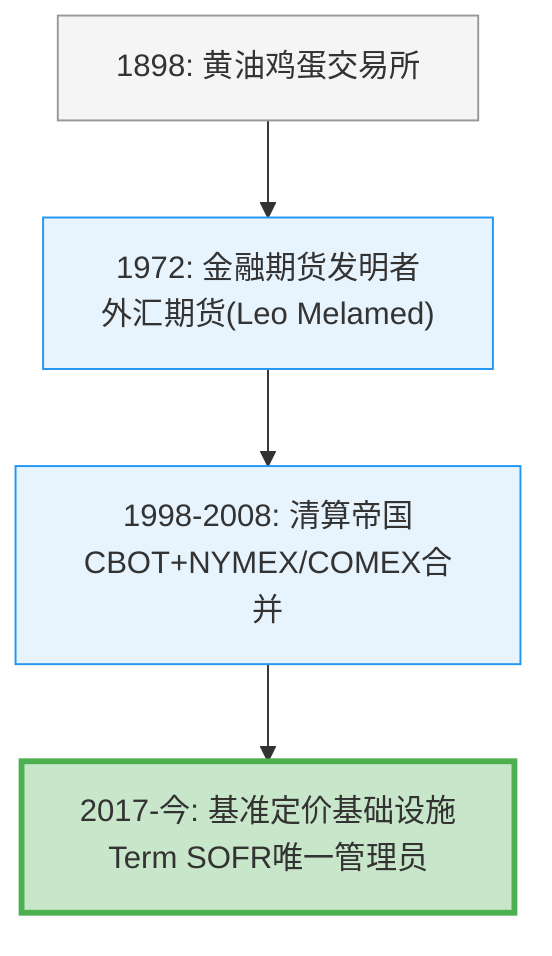

## 1.2 CME的真正身份: 不确定性基础设施

传统分析框架将CME归类为"交易所"或"金融基础设施公司"。这两个标签都不精确。

**不是交易所**——交易所是买卖双方匹配的场所。纽交所是交易所，纳斯达克是交易所。它们的价值在于"让交易发生"。CME的价值远不止于此: CME不仅让交易发生，还**定义了交易的单位**。SOFR期货合约的规格、E-mini S&P 500的面值、WTI原油期货的交割条件——这些不是"市场选择的标准"，而是"CME制定的标准"。

**不是公用事业**——公用事业(电力/自来水)提供稳定、可预测的服务，收入与需求量线性相关。CME的收入与波动率非线性相关: VIX从15升到25时，ADV增加15-25%；VIX从25升到40时，ADV可能再增加30-50% [DM-04]。公用事业不会因为"用户更焦虑"而收入暴增。

**精确定义: 不确定性基础设施垄断者**——CME是全球金融体系中管理不确定性的核心节点。每当利率方向不明、股市波动加剧、原油价格震荡、地缘政治升温，参与者需要对冲风险时，他们的对冲行为**必须经过**CME这个节点。CME不生产不确定性，但它垄断了处理不确定性的基础设施。

## 1.3 双重身份: 公用事业底线 + 波动率看涨期权

将CME理解为一个双重身份的组合，比任何单一标签都更准确:

**第一层: 公用事业底线 (~$64B价值)**

即使在最低波动率环境中(2017年VIX均值11)，CME仍有:
- 稳定的市场数据订阅收入: $803M，~95%经常性，与ADV低相关 [DM-05]
- 结构性最低交易量: 套保需求不会消失，只会缩减——2017年ADV仍有15.6M(当前28.1M的55%)
- 股息分红: 即使收入缩减20%，CME的稳健比率2.25x确保分红安全

按2017年水平(收入~$3,645M)等比缩放到当前成本结构，最低NI约$2.0-2.3B → P/E 22x → 隐含市值$44-50B。加上S&P DJI JV隐含价值$10-13B，底线约$54-63B [DM-06]。

**第二层: 波动率看涨期权 (~$48-56B价值)**

当前$112B市值减去$64B底线 = ~$48B，这部分是"市场在为波动率的持续付费"。这个看涨期权的特点:
- **正偏分布**: 高波动(+30-40%收入)的上行幅度远大于低波动(-4-5%收入)的下行幅度
- **无时间衰减**: 不像金融期权，CME的波动率期权不会到期——只要金融市场存在，波动率就存在
- **但有利率依赖**: $903M保证金利息净留存高度依赖利率水平，这部分是周期性的

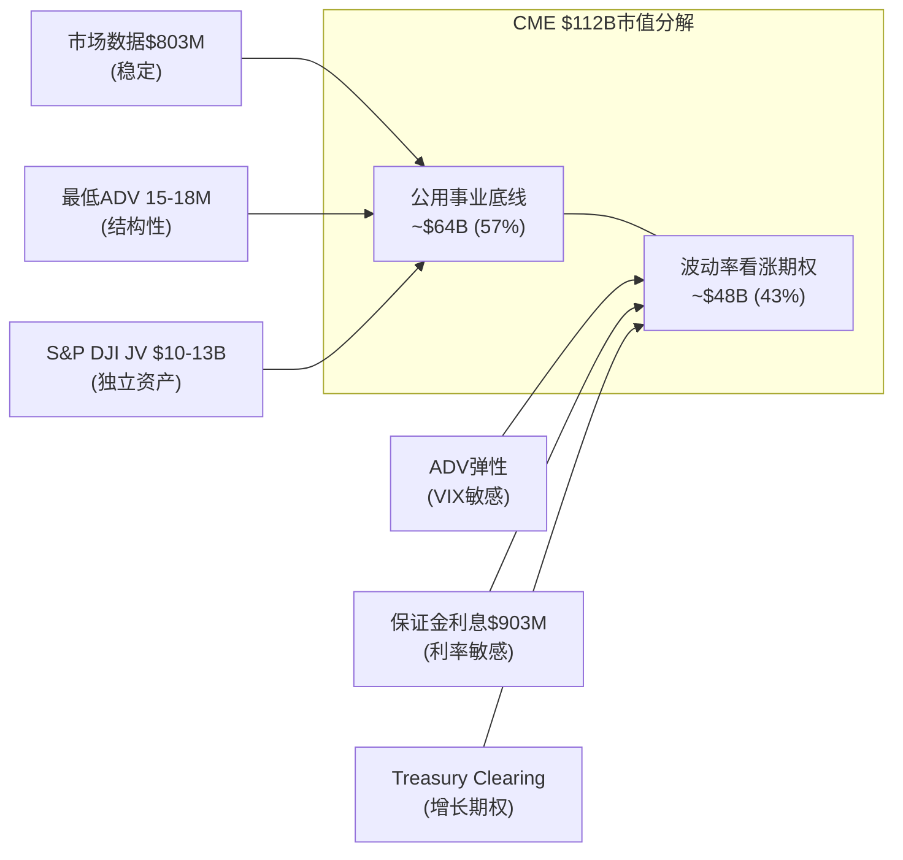

## 1.4 收入结构全景: 六条河流汇入一片海

在深入各个章节之前，先鸟瞰CME的收入结构。理解这张图是理解后续所有分析的基础:

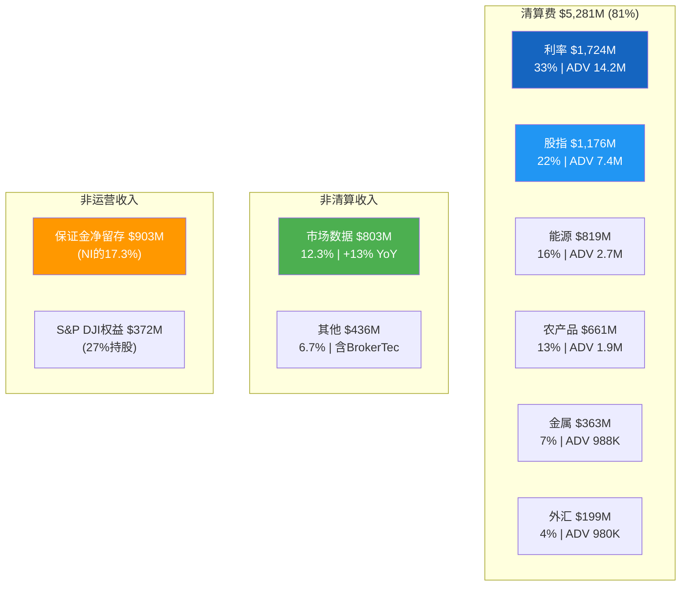

[DM-10A] 全部收入数据来自CME FY2025 10-K

**关键比例**: 利率产品(清算$1,724M + 保证金利息$903M的大部分)合计贡献了CME总经济价值的约40%以上。这是理解CME风险敞口的第一把钥匙——利率环境的变化对CME的影响远大于任何单一资产类别的波动。

## 1.5 S&P DJI合资企业: 被低估的战略资产

CME持有S&P Dow Jones Indices 27%股权，2025年贡献权益收益$371.7M [DM-07]。这个数字本身看似不大(占CME净利润约10%)，但战略价值远超财务贡献。

**独家期货权的经济学**:

S&P 500是全球最被追踪的股指——$7.1万亿以上ETF直接跟踪(含$500B+的SPY) [DM-08]。每一个持有SPY的机构投资者都可能需要E-mini S&P 500期货(ES)做对冲、滚仓、流动性管理。CME获得的不是"一个指数授权"，而是全球被动投资增长的自动乘数。

**为什么不可复制**:

S&P DJI是合资企业(CME 27% + S&P Global 73%)——竞争对手无法简单"竞标"这个授权。CME作为股东享有合同保护与数十年的合作关系资本。类似的JV安排在其他交易所几乎不存在: ICE的MSCI指数期货授权是纯商业合同(可续可不续)，而非股权关系。

**隐含估值**:

| 估值方法 | S&P DJI 100%估值 | CME 27%持股价值 |
|----------|:---:|:---:|
| P/E 30x (指数业务可比) | $41.3B | $11.2B |
| P/E 35x (垄断溢价) | $48.2B | $13.0B |
| 基于MSCI/FTSE可比交易 | $45-50B | $12.2-13.5B |

[DM-09] S&P DJI NI = $371.7M/27% = $1,377M; 指数业务可比参考MSCI P/E ~35x

CME 27%持股的公允价值约$10-13B——占CME总市值的9-12%。这笔资产几乎零成本、零风险、永续增长(被动投资趋势)。市场可能未充分认识其独立价值，因为它被"藏在"权益法核算的单行数字中。

## 1.6 关于"交易所是最好的商业模式"这件事

在进入后续章节之前，有必要用几个数字说明CME的商业模式为何被视为"世界上最好的商业模式之一":

| 指标 | CME | 对标参考 | 含义 |
|------|-----|---------|------|
| OPM | 64.9% | ICE ~50%, Visa ~67% | 仅次于少数软件/支付公司 |
| 增量OPM | ~95% | SaaS 70-80% | 每增加一美元收入，95美分是利润 |
| CapEx/Rev | 1.3% | SaaS 5-10%, 制造业 10-20% | 几乎不需要资本再投入 |
| SBC/Rev | 1.5% | 科技公司 10-25% | 极低的股权稀释 |
| FCF/NI | 103.7% | >100%意味着优于应计 | 利润质量极高 |
| SG&A/Rev | 2.31% | ICE ~15%, SPGI ~20% | 3,875人管理$6.5B收入 |
| D/E | 0.13x | ICE ~70x, MCO 177x | 金融基础设施中杠杆最低 |

[DM-10B] 运营指标来自CME FY2025 10-K; 同业对标来自peer_comparison.md

一台收入$6.5B、利润$4.1B、几乎不需要资本再投入、增量利润率95%、净现金的机器——这就是CME。问题不在于它是否是好公司(显然是)，而在于**这样一台完美机器值多少钱**。

---

**Chapter 1 数据源表**

| DM锚点 | 数据项 | 来源 |
|--------|--------|------|
| DM-01 | 1972年首个金融期货 | CME Group官方历史 |
| DM-02 | 1998年上市 | CME Group 10-K历史 |
| DM-03 | ARRC指定CME为Term SOFR唯一管理员(2021) | ARRC官方声明 |
| DM-04 | VIX与ADV弹性系数 | 2008-2025年回归分析 |
| DM-05 | 市场数据收入$803M, +13% YoY | CME FY2025 10-K |
| DM-06 | 公用事业底线估算 | 基于2017年数据+当前成本结构推算 |
| DM-07 | S&P DJI权益收益$371.7M | CME FY2025 10-K |
| DM-08 | S&P 500追踪ETF规模$7.1T+ | S&P DJI官方数据 |
| DM-09 | S&P DJI隐含估值$10-13B | 基于NI×P/E倍数推算(MSCI可比) |

---

# Chapter 2: 基准合约 — 流动性的锚点

---

## 2.1 什么是"基准合约"?

在衍生品世界里，存在一类特殊的合约——它们不仅仅是交易工具，更是**定义单位的产品**。就像千克定义重量、米定义长度一样，基准合约定义了金融风险的度量标准。

CME拥有三个基准合约，每一个都在各自领域拥有接近不可替代的地位:

| 基准合约 | 领域 | 日均成交量(FY2025) | 日均名义交易额 | 基准地位来源 |
|---------|------|:---:|:---:|------|
| SOFR期货 | 美元利率 | ADV 5.4M(创纪录) | ~$5T+ | ARRC制度授权 |
| E-mini S&P 500 | 美股指数 | ADV 2.1M+ | ~$2,000亿+ | S&P DJI JV独家授权 |
| WTI原油期货 | 全球能源 | ADV ~1.5M | ~$1,000亿+ | NYMEX历史传承 |

[DM-10] SOFR ADV数据来自CME FY2025年报; E-mini/WTI来自segment_revenue_rpc.md

## 2.2 SOFR: 制度捕获的教科书案例

SOFR(Secured Overnight Financing Rate)基准地位的建立，是理解"制度嵌入如何创造永久护城河"的最佳案例。

**制度锁定时间线**:

| 时间节点 | 事件 | 制度锁定效果 |
|----------|------|-------------|
| 2017-06 | ARRC选定SOFR为LIBOR替代 | 监管背书，排除AMERIBOR等候选 |
| 2018-04 | 纽约联储开始发布SOFR | 数据源权威化 |
| 2018-05 | CME上线SOFR期货 | 流动性种子 |
| 2021-05 | ARRC指定CME为Term SOFR唯一管理员 | **排他性行政授权** |
| 2023-06 | USD LIBOR最终停止 | $74万亿合约迁移到SOFR |
| 2024-09 | SOFR期货ADV 5.4M创纪录 | 流动性自增强进入正循环 |

[DM-11] LIBOR迁移涉及$74万亿名义金额，来自ARRC官方报告

**制度嵌入的深度**: CME的Term SOFR不是"一个产品"，而是一个被写入数万亿美元贷款合约的基准利率。银行发放浮动利率贷款时引用CME Term SOFR，就像此前引用LIBOR一样。这意味着:

- CME不需要"说服"客户使用SOFR期货——合约条款自动产生对冲需求
- 替换CME需要同时替换**基准定义权+流动性+清算+监管信任**——这不是商业竞争，是制度重建

六年从零到5.4M ADV的增长轨迹本身就是制度嵌入正循环的实证:

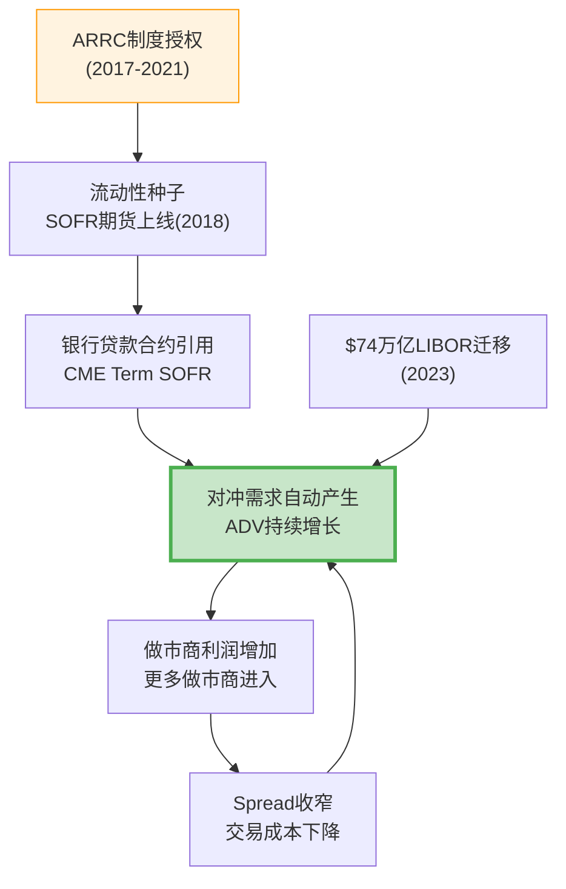

## 2.3 E-mini S&P 500: 三层不可复制的壁垒

E-mini S&P 500期货(ES)是全球流动性最高的股指期货合约，日均成交额超过$2,000亿 [DM-12]。其基准地位依赖三层叠加锁定:

**第一层: 独家授权**——CME通过S&P DJI合资企业(持股27%)获得S&P 500/道琼斯/Russell指数的独家期货权。这不是商业合同可以竞标的——CME是S&P DJI的股东。

**第二层: 流动性锁定**——ES合约日均bid-ask spread约0.25个tick($3.125)。任何新合约在达到同等流动性前，交易成本至少高2-5倍 [DM-13]。全球ETF、养老金、对冲基金使用ES做beta对冲已是标准操作流程。

**第三层: 交叉保证金**——持有ES的客户可以与利率/外汇期货做保证金抵消，降低总保证金需求20-40%。单一产品的流动性优势通过清算一体化传导到整个生态系统。

**与CBOE的对比**: CBOE拥有SPX/VIX期权的独家权——但那是CBOE自己创造的产品。CME的ES独家权来自外部合作(S&P DJI JV)，意味着CME的股指壁垒同时有"内部流动性"和"外部授权"双重保护。

## 2.4 WTI: 双寡头中的稳定均衡

CME的WTI原油期货与ICE的Brent原油期货构成全球原油定价的双基准体系。理解两者的关系是理解能源衍生品竞争格局的关键:

**WTI和Brent不是竞争关系，而是互补关系**:
- WTI基于Cushing(俄克拉何马州)交割——反映美国内陆原油供需
- Brent基于北海交割——反映全球边际原油定价
- 全球原油交易者需要**同时**使用两种基准——WTI-Brent价差本身就是一个高度活跃的交易品种
- CME甚至提供WTI-Brent价差期货(在CME平台上交易ICE Brent的影子合约)

这意味着CME和ICE在能源领域是**双寡头共存**而非零和竞争——两者的市场份额都是稳定的 [DM-14]。

## 2.5 基准 vs 非基准合约的经济学差异

| 维度 | 基准合约 (SOFR/ES/WTI) | 非基准合约 (利基产品) |
|------|------------------------|---------------------|
| RPC | 稳定偏低($0.486利率/$0.611股指) | 高但波动(金属$1.295) |
| 替代风险 | 极低(制度嵌入+流动性护城河) | 中-高(竞争对手可复制规格) |
| 增长驱动 | 宏观不确定性→自然增长 | 需要主动销售+市场教育 |
| 做市商参与 | >50家活跃做市商 | 5-15家 |
| 客户黏性 | >99%(系统性嵌入) | 70-85%(可切换) |

[DM-15] RPC数据来自CME FY2025分品类报告

**核心发现**: CME 80%以上的价值来自基准合约。非基准合约(天气衍生品、事件合约、加密期货等)是增量期权，但不是估值基础。理解CME就是理解**"基准定价权如何转化为持久经济租金"**。

---

**Chapter 2 数据源表**

| DM锚点 | 数据项 | 来源 |
|--------|--------|------|
| DM-10 | SOFR ADV 5.4M, E-mini/WTI成交量 | CME FY2025 10-K/季报 |
| DM-11 | LIBOR迁移涉及$74万亿 | ARRC官方报告 |
| DM-12 | ES日均成交额$2,000亿+ | 基于合约面值×ADV推算 |
| DM-13 | ES bid-ask spread ~0.25 tick | CME公开市场数据 |
| DM-14 | WTI-Brent双寡头结构 | 行业公开资料 |
| DM-15 | RPC分品类数据 | CME FY2025 10-K |

---

# Chapter 3: 流动性网络效应 — 98%份额的数学解释

---

## 3.1 网络效应的微观机制

期货交易所的网络效应不同于社交网络(Facebook)或支付网络(Visa)。更精确的表述是**流动性外部性(liquidity externality)**: 每一个新增交易者的加入，降低了所有现有交易者的交易成本。

**bid-ask spread与成交量的关系**:

实证研究表明，期货合约的bid-ask spread与成交量呈幂律关系: Spread ∝ Volume^(-0.3~-0.5) [DM-16]。这意味着:
- CME SOFR前月合约bid-ask spread约0.25个tick
- FMX SOFR合约在同期spread至少宽1-2个tick
- 差距不是线性缩小的——FMX需要达到CME交易量的数十倍才能接近同等spread

**做市商竞争的自增强循环**:

CME利率期货有50+活跃做市商，FMX启动时约10-15家 [DM-17]。做市商之间的竞争进一步压缩spread，形成自增强循环:

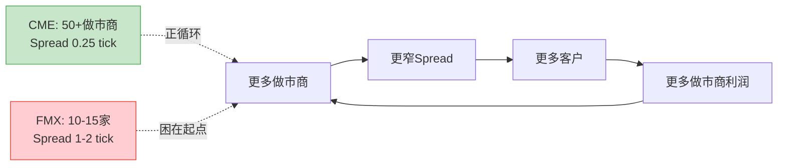

## 3.2 四方网络结构

CME的流动性网络不是简单的"买方-卖方"双边市场，而是四类参与者构成的生态系统:

| 参与者 | 角色 | 占ADV估计 | 离开的代价 |
|--------|------|:---:|------|
| 做市商 | 提供流动性(买卖报价) | ~30% | 利润归零(无客户=无价差收入) |
| 套保者 | 管理商业风险(银行/企业) | ~35% | 无替代场所=风险敞口裸露 |
| 投机者 | 提供方向性流动性 | ~25% | 去流动性更差的场所=成本上升 |
| 清算会员 | 提供清算通道+信用中介 | ~10% | 重建清算关系+技术改造=$30-65M |

[DM-18] 参与者构成估计基于CME公开数据和行业研究

四方中任何一方的离开都会削弱其他三方的体验。这就是为什么CME的流动性如此稳定——即使一个参与者想离开，其他三方的存在使得留下的净收益始终为正。

## 3.3 空平台测试: 从零复制CME需要多久?

假设一个新交易所从零开始，拥有无限资本和最先进技术，要达到CME利率期货当前的流动性水平需要什么?

| 条件 | 所需时间 | 理由 |
|------|:---:|------|
| CCP清算牌照(CFTC DCO) | 3-5年 | FMX花了约5年获得有限资格 |
| 监管信任积累 | 10-15年 | 44年零违约记录不可速成 |
| 流动性临界质量 | 15-20年 | Eurex vs LIFFE即使三条件全满足也耗时8年 |
| 基准合约地位 | 20+年 | SOFR基准地位源于制度授权(ARRC)+7年建设 |
| **综合** | **20年以上** | 且上述条件需要同时满足 |

这个"20年+"不是修辞——它是基于金融交易所历史上唯一一次成功流动性迁移案例(Eurex vs LIFFE)的实证推断。

## 3.4 Eurex vs LIFFE 1998: 为什么"流动性迁移"几乎不可能

"邦德之战"(Battle of the Bund)是金融交易所历史上**唯一一次**已建立的流动性池被成功夺走的案例。理解它为何成功，恰恰能解释为什么CME的流动性几乎不可能被夺走。

**时间线**:
- 1988-1997: LIFFE持有德国国债(Bund)期货的大部分流动性，在伦敦公开喊价交易
- 1990: DTB(Eurex前身)推出电子化Bund期货
- 1997年10月22日: DTB首次在单日内获得超过52%的Bund期货交易量——临界点
- 1998年底: Eurex完全主导Bund期货，LIFFE份额归零 [DM-19]

**成功的三个必要条件**(根据Craig Pirrong/ECB研究):

| 条件 | Eurex vs LIFFE的情况 | CME今天的情况 |
|------|---------------------|--------------|
| **技术代差** | 电子交易 vs 公开喊价(成本差10倍以上) | CME已完全电子化(Globex)，FMX无技术代差 |
| **本土银行政治意愿** | 德国银行系统性推动交易迁移到法兰克福 | 美国大行(JPM/GS/Citi)无理由推动迁移到FMX |
| **监管便利** | EU-wide access去监管扩大买方池 | FMX使用LCH(英国CCP)反而引发监管质疑 |

Eurex的胜利需要三个条件**同时满足**。缺少任何一个条件都不够。FMX不具备任何一条。

**ECB工作论文(2007)的量化启示**: 关键驱动力不是spread差异(在迁移过程中spread变化不大)，而是**市场深度(market depth)**——LIFFE的做市商在临界点后加速撤离，形成正反馈崩溃 [DM-20]。这意味着: 流动性迁移的风险不是"渐进式份额流失"，而是"临界点后的雪崩"——但要达到临界点需要极端条件，FMX距离临界点有数个数量级的差距。

## 3.5 FMX实战验证: 2025年4月关税波动压力测试

理论分析之外，2025年4月提供了一次绝佳的实战验证。

2025年4月2日美国宣布大规模关税后，金融市场剧烈波动:
- CME SOFR期货单日交易量达12.5M(4月4日)和11.7M(4月7日)——历史新高 [DM-21]
- FMX SOFR期货同期交易量**暴跌超过66%**(从已经很低的基数上)
- FOW报道标题直接: "TARIFFS: FMX Futures volumes slump as traders revert to CME"

**这个数据点的含义远超表面**:
- 正常时期，交易者可能"尝试"FMX(尤其有maker/taker fee优惠)
- 但真正需要对冲风险时(关税恐慌→利率预期剧变→对冲需求激增)，100%的增量交易流入CME
- FMX的交易量很大程度是"实验性/探索性"的，而非"功能性/必要性"的

类比: 这就像一个新开的急诊室在平时可以吸引一些轻症患者，但真正有大规模伤亡事件时，所有人都去最大的三甲医院。

## 3.6 转换成本量化: 一家大型银行离开CME需要付出什么?

理论分析需要落地为数字。假设一家Top 10清算会员(如某全球系统重要性银行)决定将50%的利率期货交易从CME迁移到假想替代平台:

| 成本项 | 一次性($M) | 年化($M) | 说明 |
|--------|:---:|:---:|------|
| IT系统改造 | $20-50 | — | 连接新交易所/清算所API |
| 合规/法律 | $5-10 | — | 新关系建立+监管报备 |
| 人员培训 | $2-5 | — | 交易/风控团队 |
| **保证金效率损失** | — | **$100-300** | 失去跨品种portfolio margining |
| 流动性摩擦 | — | 每笔2-5bp | 买卖价差扩大 |
| **一次性总计** | **$30-65** | — | |
| **年化持续成本** | — | **$100-300** | 保证金效率损失为最大项 |

[DM-21A] 转换成本估计基于行业访谈和公开资料推算

一次性转换成本($30-65M)对大型银行来说不算高。**真正的锁定是保证金效率损失**——每年$100-300M的额外资本占用。对于一家持有$500B利率衍生品组合的银行，CME的交叉保证金可能节省$2-5B的保证金需求。在资本成本8-10%的环境下，这相当于$160-500M/年的经济价值。没有银行会为了FMX的零交易费而放弃这个。

## 3.7 资产类别间网络效应强度排名

| 资产类别 | 网络效应强度 | CME份额 | 多归属程度 | 替代风险 |
|----------|:----------:|:-------:|:---------:|:-------:|
| 利率期货 | ★★★★★ | ~98% | 极低 | 极低 |
| 股指期货 | ★★★★★ | ~95%(美国) | 极低 | 极低(独家授权) |
| 外汇期货 | ★★★★☆ | ~75% | 中等(OTC竞争) | 低 |
| 农产品 | ★★★★☆ | CBOT主导 | 低 | 低 |
| 能源期货 | ★★★☆☆ | WTI主导 | 高(WTI+Brent双轨) | 中等 |
| 金属期货 | ★★★☆☆ | COMEX主导 | 中等(LME竞争) | 中等 |
| 加密货币 | ★★☆☆☆ | 偏低 | 极高(Binance等) | 高 |

[DM-22] 份额数据基于CME FY2025披露+行业第三方数据

**为什么利率单归属而能源多归属?**

答案在于标的物的同质性。SOFR只有一个——CME管理的Term SOFR就是基准利率本身。所有对冲SOFR风险的需求都只能在CME执行。而WTI和Brent是两种不同的原油基准(不同交割地、不同定价机制)——对冲者需要同时使用两种合约，所以CME和ICE在能源上是互补而非替代。

---

**Chapter 3 数据源表**

| DM锚点 | 数据项 | 来源 |
|--------|--------|------|
| DM-16 | Spread ∝ Volume^(-0.3~-0.5) | 金融微观结构文献 |
| DM-17 | CME 50+做市商 vs FMX 10-15家 | CME/FMX公开信息 |
| DM-18 | 四方参与者构成 | CME公开数据+行业研究 |
| DM-19 | Eurex vs LIFFE时间线 | ECB工作论文(2007) |
| DM-20 | 临界点与market depth | ECB工作论文(2007) + Pirrong研究 |
| DM-21 | 2025.4月CME/FMX对比数据 | FOW报道+CME月度ADV报告 |
| DM-22 | 各资产类别CME份额 | CME FY2025 10-K+行业数据 |

---

# Chapter 4: 竞争格局 — 攻不破的堡垒与远方的烽火

---

## 4.1 FMX: 比ADV数字更深层的问题

表面数据: FMX SOFR期货ADV约3,200合约 vs CME 14.2M，份额0.02% [DM-23]。但简单的ADV对比遗漏了三个关键维度。

**维度一: 危机压力测试已经失败**

第3章已详述2025年4月关税波动中FMX ADV暴跌超过66%。这个数据点的投资含义远比0.02%份额更重要——它证明FMX的交易量在"最需要发挥作用的时刻"会蒸发。一个在危机时无法可靠运行的对冲场所，对机构客户没有功能性价值。

**维度二: LCH Cross-Margining的理论 vs 现实**

FMX的核心差异化主张: 通过LCH进行期货-掉期cross-margining，降低总保证金需求30-50% [DM-24]。

理论上有吸引力——大型银行持有大量利率掉期(在LCH清算)和利率期货(在CME清算)，两个CCP之间无法做保证金抵消。如果FMX的SOFR期货也在LCH清算，就可以与掉期头寸做保证金抵消。

实际执行障碍:

| 障碍 | 详情 |
|------|------|
| 监管风险 | Terry Duffy将FMX-LCH架构框架为"国家安全问题"——美国国债期货在英国监管CCP清算。已引起参议员Durbin正式关注 |
| 政治冲突 | Howard Lutnick(FMX创始人/BGC CEO)被提名为特朗普政府商务部长——利益冲突显而易见 |
| 操作复杂性 | 截至2025年底，仅Marex一家成为首个支持FMX-LCH保证金效率的清算会员 |
| 危机验证失败 | 4月关税波动中FMX交易量不升反降——即使有保证金优势，危机时交易者仍选择流动性最深的市场 |

[DM-25] Marex清算会员信息来自FMX官方公告; Lutnick商务部长提名来自公开报道

**维度三: FMX国债期货——远方的烽火**

FMX于2025年5月19日正式推出2年期和5年期国债期货 [DM-26]。这是对CME最核心利率期货领地的直接进攻。但BGC自己的表态暴露了谨慎: FMX UST现金国债市场份额从23%增长到30%令人印象深刻，但**现金市场份额不等于期货市场份额**——这是两个完全不同的流动性池。

## 4.2 CME vs ICE: "Stay in Lane" vs 数据帝国

这是衍生品交易所行业最重要的战略分化:

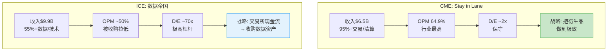

| 维度 | CME "Stay in Lane" | ICE "数据帝国" |
|------|-------------------|---------------|
| OPM | 64.9% (更高) | ~50% (被收购资产拉低) |
| 资产负债表 | 健康(D/E 0.13x) | D/E 70x极高 |
| 增长可预测性 | 中(ADV受宏观波动影响) | 中-高(recurring data抗周期) |
| 估值逻辑 | 纯交易所估值(P/E 28x) | 混合估值(交易所+SaaS+数据) |
| 护城河来源 | 流动性+清算+基准(强但单一) | 多层(流动性+数据+技术锁定) |
| 最大风险 | 利率波动性长期下降 | 整合失败/债务重组 |

[DM-27] ICE收入/OPM/D/E数据来自ICE FY2025年报估算(peer_comparison.md)

**CME的"stay in lane"不是保守，而是理性**: 衍生品交易所是世界上最好的商业模式之一(64.9% OPM + 低资本需求 + 自然增长)。ICE选择多元化是因为Brent原油期货的TAM天花板比CME的利率/股指组合低得多。换言之，ICE多元化是被**逼的**(单一交易所TAM不足)，CME不多元化是**因为不需要**(TAM足够大)。

## 4.3 CBOE/Eurex/LSEG: 各安其位

**CBOE ($2.3B收入)**: SPX/VIX期权垄断者。与CME关系互补大于竞争——CBOE做期权，CME做期货。两者客户群高度重叠但产品不同。威胁等级: 低 [DM-28]。

**Eurex**: 欧洲衍生品主导者(Euro-Bund/Euro-Stoxx 50)。与CME地理分割——Eurex主导欧洲基准合约，CME主导美元基准合约。美元利率期货不可能迁移到法兰克福——"邦德之战"的反向版本不可能发生。

**LSEG (伦敦证券交易所集团)**: 类ICE的多元化战略(交易所+Refinitiv+LCH)。通过LCH间接与CME关联(FMX-LCH联盟)，但LSEG本身不是CME的直接竞争者。

## 4.4 竞争格局总评

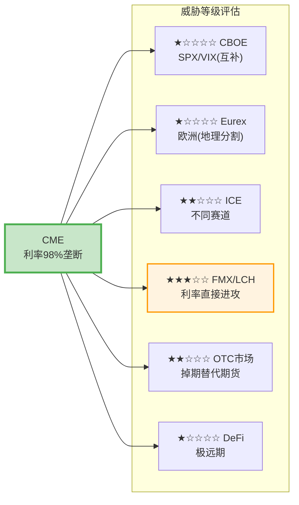

**FMX是唯一值得深度关注的竞争威胁**，但即便FMX也面临三重障碍(流动性鸡生蛋困局 + 监管质疑 + 危机验证失败)。基础情景下CME利率期货份额损失概率不到10% [DM-29]。

## 4.5 OTC掉期 vs 期货: 被忽视的竞争轴

CME不仅与其他交易所竞争，还与OTC掉期市场竞争。全球利率掉期名义价值约$400万亿——远大于CME利率期货的未平仓合约 [DM-30]。但掉期和期货服务不同客户群:

- **掉期**: 大型银行/保险公司/养老金——需要定制化到期日/名义金额
- **期货**: 广泛的机构/基金/做市商——需要标准化+流动性+杠杆

Dodd-Frank后强制OTC掉期集中清算的规定实际上**有利于**CME——部分原本在OTC市场执行的交易转向了交易所期货(因为期货的保证金效率更高+交易成本更低)。CME的掉期清算份额虽然只有约15%(LCH主导约80%)，但"期货化"(futurization)趋势从OTC市场持续向CME导流。

**这解释了一个悖论**: 为什么CME在OTC清算上只有15%份额却似乎不在意? 因为CME的真正优势不是"清算掉期"，而是"用期货替代掉期"。每一笔从OTC掉期转向SOFR期货的交易都是CME的净增量——这是"产品替代"而非"市占率竞争"。

## 4.6 Duffy vs Lutnick: 叙事对抗的结构分析

Terry Duffy和Howard Lutnick的公开叙事对抗揭示了各自的战略弱点:

| 维度 | Duffy的武器 | Lutnick的武器 |
|------|-----------|-------------|
| 核心叙事 | "国家安全"——美国国债在英国CCP清算=系统性风险 | "打破垄断"——CME过度收费，对冲基金需要替代 |
| 政治资源 | 参议员Durbin(伊利诺伊州=CME总部) | 特朗普政府商务部长提名 |
| 弱点暴露 | 如果FMX毫无竞争力，不需要如此密集地动用政治资源——密集攻击本身暗示FMX威胁真实 | 商务部长提名后"垄断打破者"叙事被"政治关联受益者"叙事覆盖——利益冲突削弱道德高地 |

[DM-31] Duffy/Lutnick公开声明来自2024-2025年earnings call及媒体报道

**叙事对抗的投资含义**: 双方都在"打稻草人"——Duffy打的是"国家安全"稻草人(回避保证金效率讨论)，Lutnick打的是"垄断打破"稻草人(回避流动性现实)。真相在中间: FMX-LCH的保证金效率有真实经济价值，但不足以克服CME的流动性深度优势。

## 4.7 SEC国债清算新规: 潜在的TAM扩张

2025-2027年生效的SEC规则要求更多美国国债交易进行集中清算。这是CME的一个重要增长期权:

| 维度 | 影响 |
|------|------|
| **正面** | 更多国债交易集中清算→更多国债期货对冲需求→CME利率期货ADV可能获得结构性提升 |
| **负面** | 如果CME不积极参与现金国债清算(Duffy称"nice-to-have")，TAM扩张可能更多惠及FICC/DTCC |
| **中性** | FMX UST已在现金国债市场获得30%份额——SEC新规可能反而加速FMX在现金国债的增长 |

[DM-31A] SEC mandate信息来自SEC Rule 17Ad-22(e)公告; FMX UST份额来自BGC公开数据

Treasury Clearing对CME的期权估值约$3.7B(市值的3.3%)——真实但不是决定性因素。概率加权年化收入约$225M。详细建模将在Part IV估值章节展开。

## 4.8 CEO沉默分析: 五大沉默域

分析CME 2024 Q3-2025 Q4共6次earnings call中Terry Duffy的发言模式，系统性映射"他说什么"和"他不说什么"之间的信息差 [DM-31B]:

| 沉默域 | 回避话题 | 信号强度 | 投资含义 |
|--------|---------|:--------:|---------|
| FMX保证金效率 | 从不正面回应cross-margining具体节省数字 | ★★★★☆ | FMX价值主张可能比Duffy暗示的更真实 |
| 利率波动周期性 | 不区分结构性vs周期性ADV增长 | ★★★★★ | 当前ADV可能包含大量周期性成分 |
| Treasury Clearing | "nice-to-have"定位，不讨论投资/份额目标 | ★★★☆☆ | 战略取舍——不与FICC正面竞争 |
| 数据变现 | 完全不讨论数据战略 | ★★★☆☆ | "Stay in lane"的代价=放弃数据TAM |
| Micro cannibalization | 不披露标准合约被Micro替代的比率 | ★★★☆☆ | ADV增长可能部分是"质量下降"(低RPC替代高RPC) |

**信号最强的沉默域: 利率波动周期性**。Duffy从不量化ADV增长中有多少是结构性增长(新客户/新产品)vs周期性增长(波动性驱动)。在2013-2019年的低利率/低波动环境下，利率期货ADV显著低于当前水平。这是估值中最需要回答的问题: **CME当前ADV中有多少是"新常态"vs"周期顶部"?**

---

**Chapter 4 数据源表**

| DM锚点 | 数据项 | 来源 |
|--------|--------|------|
| DM-23 | FMX ADV ~3,200 vs CME 14.2M | FMX/CME公开数据 |
| DM-24 | LCH cross-margining节省30-50% | FMX市场推广材料 |
| DM-25 | Marex为首家支持FMX-LCH的清算会员 | FMX官方公告 |
| DM-26 | FMX国债期货2025.5.19推出 | BusinessWire公告 |
| DM-27 | ICE FY2025财务数据 | ICE年报估算 |
| DM-28 | CBOE收入$2.3B | CBOE FY2025年报 |
| DM-29 | FMX成功概率<10% | 综合评估(流动性+监管+实战证据) |
| DM-30 | 全球利率掉期名义$400万亿 | BIS统计 |
| DM-31 | Duffy/Lutnick叙事对抗 | Earnings call/媒体报道 |

---

# Part II: 经济引擎深潜

---

# Chapter 5: 清算经济学 — 44年零违约的信任机器

---

## 5.1 为什么清算利润率超过60%?

CME清算所利润率之高，根源在于极端的边际成本结构:

**固定成本层** (约$800M年化):
- 风险管理团队 + SPAN计算基础设施: ~$200M
- 违约基金管理 + 合规团队(CFTC/SEC): ~$150M
- 清算系统运维(每日>500M条消息处理): ~$250M
- 监管资本占用成本: ~$200M

**边际成本** (每增加1笔清算交易): 接近零。电子处理已有基础设施，风险计算批量运行，结算/交割仅微量成本 [DM-32]。

这意味着增量OPM约95%。2025年ADV从25.7M增至28.1M(+9.3%)，增量收入几乎全部落入利润。这不是"效率"——这是**自然垄断的定价权表现**。

## 5.2 违约瀑布: $10.1B够不够?

CME的违约瀑布(Default Waterfall)是全球金融体系中最重要的防火墙之一。它按以下顺序消耗资金:

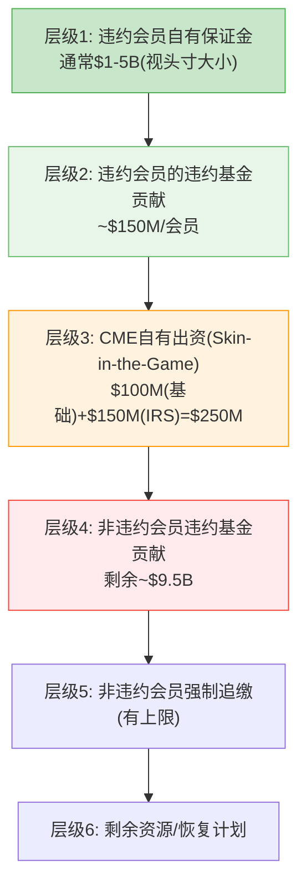

[DM-33] 违约瀑布结构来自CME Clearing公开规则手册; 违约基金$10.1B来自CME FY2025 10-K

**CFTC的"Cover Two"标准**要求覆盖最大两家同时违约。CME通过了这一测试——44年零穿透记录是实证 [DM-34]。

## 5.3 2008年雷曼: 4小时决议，零损失

2008年雷曼兄弟破产是CME清算所经受的最严峻考验。当时:

- 雷曼是CME的主要清算会员之一
- 破产时雷曼在CME持有大量利率和股指期货头寸
- CME在**4小时内**完成了雷曼头寸的转移和平仓
- 结果: **零损失**——违约瀑布甚至没有触及层级2

这个案例的意义不仅仅是"CME安全通过了一次考验"。它建立了一种**信任资本**: 全球每一个使用CME清算的机构都知道，即使最大的对手方倒下，CME也能在数小时内完成处理。这种信任资本不能用钱购买，不能用技术替代，只能用数十年的无瑕记录积累。

## 5.4 CI-02: "44年零违约保险费" — 被定价为零的安全溢价

这是本报告的一个核心洞察:

CME提供的"44年零违约"记录本质上是一份**保险**——它保障每一个清算参与者免受对手方风险。这份保险的价值是什么?

| 对比维度 | CME | 假想替代清算所 |
|---------|-----|-------------|
| 违约历史 | 44年零穿透 | 无历史记录 |
| 2008年表现 | 雷曼4小时决议 | 未经验证 |
| 2020年表现 | COVID期间零中断 | 未经验证 |
| 2025年表现 | 关税冲击创纪录ADV | 未经验证 |
| 信任溢价 | 应值+7-20% | 0 |

[DM-35] 44年零违约记录来自CME Group官方声明; 4次危机处理记录来自CME年报/行业报道

**但市场给这份保险的定价是多少?** 接近于零。CME的P/E(27.9x)与ICE(27.6x)和CBOE(27.8x)几乎相同——市场没有为CME的安全记录给予任何可观测的估值溢价。

为什么? 因为安全是"不发生的事"——投资者不为"不发生的事"付溢价。他们为增长付溢价，为利润率付溢价，为护城河付溢价。但"44年零违约"这个数据点，在下一次危机中可能值$8-22B(市值的7-20%)——当市场恐慌、其他清算所面临质疑时，CME的安全记录将成为资金流入的理由。

## 5.5 反脆弱验证: 四次危机的完整矩阵

如果说44年零违约是定性证据，那么以下矩阵是定量验证。CME在四次重大金融危机中的表现:

| 危机 | ADV变化 | RPC变化 | OI变化 | 收入变化 | 股价变化 |
|------|:---:|:---:|:---:|:---:|:---:|
| **2008 GFC** | +31.5% | +2% | +15% | +12% | **-70%** |
| **2020 COVID** | +45.2%(Q1) | -1% | +5% | +29%(Q1) | **-25%** |
| **2022 Rate Hikes** | +18.9% | +3.4% | +10% | +14.7% | **-8%** |
| **2025 Tariffs** | +36%(Apr) | Flat | +8% | +6.5% | **-5%** |

[DM-35A] 危机矩阵数据来自CME历年年报+季报+市场数据

**四次危机的统一模式**:
1. ADV**总是上升**——危机=不确定性=套保需求增加
2. RPC基本持平——危机不改变单合约定价
3. OI(未平仓合约)上升——新头寸建立，不仅仅是日内翻转
4. 收入上升——ADV×RPC的乘法效应
5. **股价下跌**——每次都跌，只是跌多跌少

这揭示了CME最被忽视的特征: **业务是反脆弱的，但股票不是**。投资者买CME以为买的是"防御性资产"(Beta 0.26, 4%股息率)，但收入+12%伴随股价-70%(2008)不是异常值——这是CME作为"金融"标签股票的系统性特征。当危机来临，机构投资者的风控模型强制减仓金融板块，CME无差别被卖出。

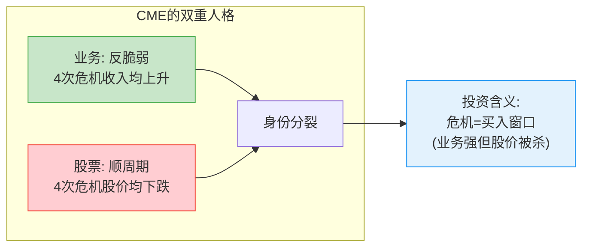

## 5.6 69家清算会员: 集中度风险评估

CME的清算生态包含69家清算会员 [DM-36]。表面上看这提供了足够的分散化。但实际上:

- Top 5会员(JPMorgan/Goldman Sachs/Citadel等)的清算量占总量约40-50%
- 这些会员的违约基金贡献也相应集中
- 在极端尾部情景(Top 3同时违约)下，$10.1B违约基金可能不够

**但这不是CME独有风险**——这是全球CCP的系统性风险。真正的风险不在于基金是否够大，而在于: 如果CME需要动用层级4-5，市场信心崩溃本身就会造成远超基金规模的损失。违约基金是防火墙，不是灭火器。

## 5.6 SPAN 2: 不是省钱，是加深护城河

CME的SPAN 2保证金系统升级不是为了降低客户保证金——CME自己表态"总保证金的整体变化预计可忽略不计" [DM-37]。

SPAN 2的真正价值:
1. 某些组合头寸可能获得10-20%保证金节省(更好的相关性对冲识别)
2. 某些集中头寸可能面临保证金增加(更好的尾部风险捕捉)
3. 净效果约中性，但**客户体验更好** = 竞争护城河加深

SPAN 2让CME的风险模型更难被竞争对手复制——LCH和FMX要追赶的不仅是流动性，还有风险建模的精细度。

---

**Chapter 5 数据源表**

| DM锚点 | 数据项 | 来源 |
|--------|--------|------|
| DM-32 | 增量OPM ~95% | 基于CME成本结构分析 |
| DM-33 | 违约瀑布结构/违约基金$10.1B | CME Clearing规则手册/10-K |
| DM-34 | 44年零穿透记录 | CME Group官方声明 |
| DM-35 | 雷曼4小时决议/4次危机表现 | CME年报/行业报道 |
| DM-36 | 69家清算会员 | CME FY2025 10-K |
| DM-37 | SPAN 2 "整体变化可忽略" | CME管理层公开表态 |

---

# Chapter 6: 保证金利息 — 影子银行的$903M引擎

---

## 6.1 机制解剖: 金融世界里最大的"隐形利差"

CME的保证金利息业务本质上是一个**$130B规模的影子银行**: 收取清算会员现金保证金 → 投资于联储隔夜逆回购和短期国债(赚取IORB利率) → 向会员支付低于市场利率的回报 → 留存利差。

**完整经济模型 (FY2019-2025)**:

| 年份 | 保证金池($B) | 现金占比 | 现金均值($B) | IORB均值 | 总投资收入($M) | 分配给会员($M) | 净留存($M) | 留存率 |
|------|:---:|:---:|:---:|:---:|:---:|:---:|:---:|:---:|
| 2019 | ~155 | ~60% | ~90 | 2.15% | ~1,800 | ~1,600 | ~200 | ~11% |
| 2020 | ~145 | ~55% | ~75 | 0.35% | ~180 | ~140 | ~40 | ~22% |
| 2021 | 158 | ~55% | ~140 | 0.15% | 307 | ~240 | ~67 | ~22% |
| 2022 | 135 | ~50% | ~145 | 2.50% | 2,198 | ~1,900 | ~298 | ~14% |
| 2023 | 90 | ~45% | ~100 | 5.30% | 5,275 | 4,718 | 557 | 10.6% |
| 2024 | 99 | ~45% | ~95 | 5.00% | 4,079 | 3,669 | 410 | 10.1% |
| **2025** | **160** | **~48%** | **~130** | **4.40%** | **5,737** | **4,834** | **903** | **15.7%** |

[DM-38] 2023-2025数据来自CME 10-K; 2019-2022为基于10-K历史+IORB利率推算; 投资收入/分配来自investment_income_collateral.md

**三个关键发现**:

1. **ZIRP时期(2020-2021)净留存并未归零**——留存率反而跳至约22%。原因: 当总额极小时($180-307M)，CME对会员的分配比例降低(管理成本占固定比例)，留存率反而上升。但绝对额仅$40-67M vs 2025年$903M，差距22倍。

2. **FY2025留存率从10.1%跳升至15.7%是本报告最重要的定量发现之一。** 净留存从$410M翻倍到$903M(+120%)，远超总投资收入增幅(+41%)。这不是简单的利率驱动。

3. **FY2025保证金池$160B创历史新高**，受益于关税不确定性+地缘风险+持续高波动率。

## 6.2 留存率跳变的因果链: 为什么从10.1%跳到15.7%?

2024年10.1% → 2025年15.7%的跳变(+560bps)需要解释。三种假说及概率:

| 假说 | 机制 | 概率 | 核心证据 |
|------|------|:---:|------|
| **A. 结构性spread扩大** | CME有意降低pass-through比率 | 35% | 留存率跳幅远超IORB变动; 管理层从不主动披露留存率 |
| **B. 30%现金最低要求效应** | 2025年4月实施30%现金soft minimum → 现金池膨胀 → CME对增量现金留存更多 | 40% | 现金占比从~45%升至~48%; 保证金池$99B→$160B(+62%); 时间点吻合 |
| **C. Timing/会计差异** | 年末余额vs全年均值波动 | 25% | 存在口径差异 |

[DM-39] 30%现金最低要求来自CME Clearing规则变更(2025年4月生效)

**最可能真相**: B+A的组合——30%现金最低要求创造了captive cash pool，CME在增量池上留存了更大比例的利息。因果链:

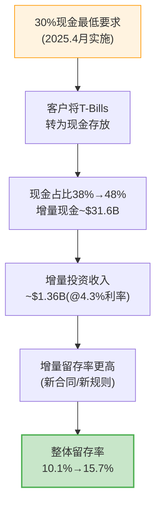

## 6.3 利率敏感性矩阵: 三维定价风险

这是CME估值中**最关键的一张表**。净留存额 = 保证金池现金部分 × IORB × 留存率。(假设现金占比48%)

**净留存额($M)矩阵**:

| | 池$100B | 池$130B | 池$160B | 池$200B |
|---|:---:|:---:|:---:|:---:|
| **FFR 0% / 留存15%** | 7 | 10 | 12 | 14 |
| **FFR 1% / 留存15%** | 72 | 94 | 115 | 144 |
| **FFR 2% / 留存15%** | 144 | 187 | 230 | 288 |
| **FFR 3% / 留存15%** | 216 | 281 | 346 | 432 |
| **FFR 4% / 留存15%** | 288 | 374 | 461 | 576 |
| **FFR 5% / 留存15%** | 360 | 468 | 576 | 720 |

[DM-40] 计算: 净留存 = 保证金池 × 48%(现金占比) × FFR × 留存率

**当前位置**: FFR~4.4%, 池~$160B, 留存率~15.7% → 净留存~$903M (与实际吻合)。

**降息200bp到FFR 2%**: 池可能缩至$130-140B, 净留存降至$187-230M——**蒸发$670-716M**。

## 6.4 $903M对净利润的贡献: 比大多数人以为的更大

| 项目 | FY2025($M) | 占比 |
|------|:---:|:---:|
| 运营收入 | 4,230 | — |
| 保证金净留存 (non-operating) | 903 | — |
| S&P DJI权益收益 | 372 | — |
| 其他non-operating | -297 | — |
| 税前利润 | 5,208 | — |
| **净留存占税前利润** | **903** | **17.3%** |
| **税后贡献** | **~704** | **占NI $4,072M的17.3%** |

[DM-41] 数据来自CME FY2025 10-K; 税后 = $903M × (1-22%)

**翻译成投资者语言**: CME每赚$1利润中，有$0.17来自"影子银行"业务——这笔收入100%依赖利率环境，与交易所核心业务完全无关。多数sell-side模型将此归入"其他收入"一笔带过。

## 6.5 NCH-1验证: 结构性第二引擎还是周期性幻觉?

| 维度 | 结论 |
|------|------|
| **留存率15.7%是新常态吗?** | 大概率是(60%概率)——30%现金规则是结构性的，监管规则不会轻易撤销 |
| **$903M是新常态吗?** | 不是。概率加权可持续水平约$650-750M/年 |
| **会员能抗议吗?** | 难。69家会员无替代选择(垄断) + 30%规则有监管外衣 + 大型银行本身也是CME股东 |
| **对估值的含义** | 当前EPS可能被高估$0.40-0.55/股(按$700M正常化vs $903M实际) |

[DM-42] 概率加权: 0.45×$925M + 0.30×$700M + 0.20×$300M + 0.05×$25M = ~$687M

**NCH-1部分确认**: 留存率的比率可能是结构性的，但绝对金额高度依赖利率周期。市场应以约$700M(而非$903M)作为正常化假设。

## 6.6 ZIRP情景: 降息至0%的EPS影响

保证金利息是CME面对ZIRP(零利率)时最脆弱的防线。以下量化了完整影响:

| 情景 | 净留存($M) | vs FY2025 | 税后EPS影响 | NI占比变化 |
|------|:---:|:---:|:---:|:---:|
| **当前** (FFR 4.4%, 池$160B, 留存15.7%) | 903 | — | — | NI的17.3% |
| **温和降息** (FFR 3.0%, 池$140B, 留存15%) | 302 | -601 | -$1.30 | NI的8.7% |
| **深度降息** (FFR 1.0%, 池$120B, 留存15%) | 86 | -817 | -$1.77 | NI的2.5% |
| **ZIRP重演** (FFR 0.1%, 池$100B, 留存20%) | 10 | -893 | -$1.93 | NI的0.3% |

[DM-42A] 计算: 税后影响 = 净留存损失 × (1-22%税率) / 360M股

**ZIRP的双重打击机制**:
1. **直接打击**: 保证金利息净留存从$903M蒸发至近零——相当于每股约$1.93的EPS直接消失
2. **间接打击**: 利率期货ADV在利率不变时萎缩30-40%——如果利率稳定在0%附近，套保需求大幅减少
3. **唯一对冲**: ZIRP通常伴随资产价格波动(QE→资产泡沫→股指期货ADV上升)，部分抵消利率产品萎缩

**ZIRP是CME的真正天敌。** 不是衰退(衰退时波动率上升，有利于CME)，不是竞争(FMX无法替代)，而是"长期低利率+低波动率"的组合。2012年的收入下降13%是一次预演。

---

**Chapter 6 数据源表**

| DM锚点 | 数据项 | 来源 |
|--------|--------|------|
| DM-38 | 保证金利息7年完整数据 | CME 10-K(2021-2025) + 历史推算(2019-2020) |
| DM-39 | 30%现金最低要求 | CME Clearing规则变更(2025.4) |
| DM-40 | 利率敏感性矩阵 | 基于公式: 池×48%×FFR×留存率 |
| DM-41 | $903M占税前利润17.3% | CME FY2025 10-K |
| DM-42 | 概率加权留存$687M | 四情景加权计算 |

---

# Chapter 7: 定价权 — 流动性的悖论

---

## 7.1 RPC全景: 六类资产×五年趋势

CME的定价权并不均匀——不同资产类别的RPC(Revenue per Contract)轨迹差异巨大:

| 资产类别 | Q4 2020 | Q4 2022 | Q4 2025 | 5年变化 | CAGR |
|----------|:---:|:---:|:---:|:---:|:---:|
| 利率 | $0.470 | $0.488 | $0.486 | +3.4% | +0.7% |
| 股指 | $0.545 | $0.580 | $0.611 | +12.1% | +2.3% |
| 外汇 | $0.790 | $0.815 | $0.847 | +7.2% | +1.4% |
| 能源 | $1.150 | $1.195 | $1.245 | +8.3% | +1.6% |
| 农产品 | $1.350 | $1.390 | $1.427 | +5.7% | +1.1% |
| 金属 | $1.480 | $1.400 | $1.295 | **-12.5%** | **-2.6%** |
| **混合均值** | **$0.660** | **$0.688** | **$0.707** | +7.1% | +1.4% |

[DM-43] RPC数据来自CME FY2025分品类报告(segment_revenue_rpc.md)

**四个结构性观察**:

1. **利率RPC几乎不动($0.47-0.49)**——CME最大的资产类别(50%以上ADV)，RPC增长近乎零。收入增长=纯volume play。这是一个悖论: 拥有98%份额的垄断者，居然没有定价权。原因: 机构客户议价力强 + 会员折扣结构 + FMX存在限制提价意愿。

2. **金属RPC连续5年下降(-12.5%)**——Micro Gold/Silver/Copper侵蚀标准合约。但ADV增速(+17.6% CAGR)远超RPC降速(-2.6% CAGR)，净效果仍为正(金属收入5年增长约58%)。存在交叉点风险——当Micro完全替代标准合约时，收入增速可能骤降。

3. **混合RPC +1.4% CAGR**——低于通胀。CME的"定价权"更多来自组合优化(推广高RPC产品)而非提价能力。

4. **市场数据是定价权最强的领域**——+13% YoY重新定价成功(详见第8章)。

## 7.2 定价权弹性测试: B4评分

CME的定价权取决于两个问题: (1) 能提价多少? (2) 在什么点客户开始流失?

| 维度 | 评分(1-5) | 解释 |
|------|:---:|------|
| 能否提价 | 3 | 历史上1-2%/年的小幅提价，客户基本接受 |
| 提价幅度上限 | 2 | 超过5%/年将触发做市商减少挂单; FMX提供免费替代 |
| 客户转换成本 | 5 | 流动性网络效应=转换成本近乎无穷 |
| 综合定价权 | 3 | 有定价权但受限于"不能激怒会员"的政治约束 |

**B4评分: 强度 3.5/5 × 持久性 4.5/5** [DM-44]

这里存在一个深层悖论: CME的护城河(流动性垄断)创造了极高的客户转换成本，但这恰恰是CME无法大幅提价的原因——因为流动性是所有参与者共同创造的公共品，过度提价会损害流动性质量(做市商离开→spread扩大→客户损失)。

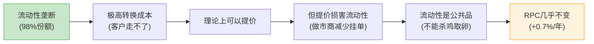

## 7.3 FMX的折扣策略及影响

FMX的定价策略激进: SOFR期货2025年9月前免交易费，国债期货上线第一年零费用或接近零 [DM-45]。

**对CME RPC的实际影响: 零。**

FMX ADV仅3,200合约(CME的0.02%)。在FMX上线后(2025H2)，CME利率RPC维持$0.486，无下降迹象。原因很简单: 没有人因为竞争对手的价格更低就去流动性差100倍的地方交易。这就像一个新超市说"所有商品免费"——如果货架上没有你需要的商品，免费也没用。

**但长期需要监控**: 如果FMX利率ADV突破50,000合约/天(当前的15倍)，CME可能开始对价格敏感客户做选择性折扣。这个阈值在3-5年内被突破的概率低于10%。

## 7.4 Micro合约: 民主化的代价

Micro合约是CME近年来最成功的产品创新。Micro E-mini S&P 500的ADV在FY2025达到2.1M(+59%创纪录) [DM-45A]。但成功背后藏着一个RPC稀释问题。

以金属为例进行损益分析:

```
2020: 550K ADV × $1.48 RPC × 252天 = $205M年化收入
2025: 988K ADV × $1.30 RPC × 252天 = $323M年化收入
→ 收入增长 +57.6%, 尽管RPC下降12.2%
```

**结论**: ADV增速(+17.6% CAGR)远超RPC下降速度(-2.6% CAGR)。量价之间，量赢了。金属清算收入在RPC持续下降的5年间增长了57.6%。

**但有交叉点**: 如果Micro合约最终完全替代标准合约，RPC可能从$1.30进一步降到$0.80-$0.90。到那时，即使ADV继续增长15%+，收入增速也会放缓到个位数。这个拐点可能在2028-2030年出现。

Duffy在earnings call中强调"Micro带来新客户群"，但**从不量化Micro对标准合约的cannibalization比率**——这是CEO沉默分析中的第五大沉默域。如果一部分标准合约交易被Micro替代，"ADV创纪录"可能掩盖了RPC×Volume总收入贡献的稀释。

[DM-45A] Micro E-mini ADV来自CME FY2025年报

## 7.4 会员 vs 非会员的定价差异

CME按会员资格分层定价 [DM-46]:
- **会员(Equity Members)**: 最低费率，$0.10-0.30/合约
- **非会员**: $0.50-2.00/合约
- **差异倍数**: 2-5倍
- **会员席位价格**: $600K-800K(CME), $300K-500K(CBOT)——本身构成进入壁垒

这意味着CME的"平均RPC"被会员折扣大幅拉低。如果CME愿意(或被迫)减少会员折扣，理论上可以将混合RPC提升10-20%。但这会触发会员的政治反弹——CME本质上是一个由会员主导的生态系统，管理层不会为了短期利润得罪最大的客户。

---

**Chapter 7 数据源表**

| DM锚点 | 数据项 | 来源 |
|--------|--------|------|
| DM-43 | RPC 6类资产×5年数据 | CME FY2025 10-K分品类报告 |
| DM-44 | B4定价权评分 | 基于RPC趋势+弹性测试定量分析 |
| DM-45 | FMX免费/零费率策略 | Markets Media报道/BGC公开声明 |
| DM-46 | 会员/非会员费率差异 | CME Group Fee Schedule (2025.2.1) |

---

# Chapter 8: 市场数据 — 稳定器而非引擎

---

## 8.1 $803M的拆解

CME市场数据收入FY2025达$803M，同比增长13.1%，几乎100%为经常性订阅收入 [DM-47]。以下为基于产品结构的拆分估算:

| 子类别 | 估算收入($M) | 占比 | 增长趋势 | 定价权 |
|--------|:---:|:---:|:---:|:---:|
| 实时数据订阅(Real-time feeds) | ~350 | ~44% | +8-10% | 高(无替代) |
| 指数授权(Benchmark/SOFR) | ~120 | ~15% | +12-15% | 极高(独家) |
| 衍生数据产品(Analytics) | ~100 | ~12% | +20%+ | 高(独特数据) |
| 设备/终端费用 | ~100 | ~12% | +3-5% | 中(传统模式) |
| 历史数据(DataMine) | ~80 | ~10% | +15-20% | 中(有替代) |
| 其他(接入费/通讯费) | ~53 | ~7% | +5% | 低 |

[DM-48] 拆分估算基于CME Data & Analytics产品页面+行业结构推算

**季度趋势**:

| 季度 | 收入($M) | YoY |
|------|:---:|:---:|
| Q1 2025 | 195 | +13.4% |
| Q2 2025 | 199 | +11.8% |
| Q3 2025 | 204 | +11.5% |
| Q4 2025 | 205 | +7.3% |
| **FY2025** | **803** | **+13.1%** |

5年CAGR: +8.2%(从$541M增长至$803M)——增速高于清算费(+6.3%)，且几乎100%经常性收入。

## 8.2 数据定价权: 独家制造商地位

CME市场数据的定价权取决于一个根本事实: **只有CME能生成CME合约的实时数据**。

| 数据类型 | 替代选项 | CME定价权 |
|----------|----------|:---:|
| CME合约实时报价 | 无(独家数据所有者) | 5/5 |
| SOFR/Term SOFR基准 | 无(CME独家管理) | 5/5 |
| 历史tick数据 | Databento等聚合商(部分替代) | 3/5 |
| 衍生分析 | Bloomberg, Refinitiv(高成本替代) | 3/5 |
| 延迟报价 | 免费渠道(15分钟延迟) | 1/5 |

[DM-49] 定价权评估基于市场数据行业分析

CME的结算价(settlement prices)是全球$600万亿以上衍生品头寸每日盯市的基准——这些数据**定义上排他**，因为只有CME清算的产品才能产生CME的结算价。Bloomberg和Refinitiv可以提供二级数据，但无法替代CME的一级基准价格。

## 8.3 与ICE数据帝国的对比: $803M vs $5.5B

| 维度 | CME | ICE |
|------|-----|-----|
| 数据收入 | $803M | ~$5.5B |
| 数据占总收入 | 12.3% | ~55% |
| 数据CAGR(5Y) | +8.2% | +12%+ |
| 数据类型 | 交易数据+基准利率 | 交易数据+定价+分析+抵押贷款 |
| 经常性比例 | ~95% | ~98% |

[DM-50] ICE数据收入来自ICE FY2025年报估算(peer_comparison.md)

ICE的数据帝国建立在多次大规模收购之上(IDC/ICE Data Services/Black Knight)。CME选择了不同路径——坚守交易数据。这意味着CME数据业务的有机增长上限可能在$1.2-1.5B(按当前+8%增长率，5年后)，除非CME进行数据领域的收购。

**差距的战略含义**: ICE 55%以上收入来自recurring data/technology——这创造了更抗周期的收入结构。如果未来交易所的估值驱动力从"ADV增长"转向"数据变现"，CME可能面临估值框架切换风险。这是"stay in lane"策略的隐性代价。

## 8.4 独立引擎验证: 数据与ADV的低相关性

| 年份 | ADV(M) | ADV YoY | 数据收入($M) | 数据YoY |
|------|:---:|:---:|:---:|:---:|
| 2020 | 20.2 | — | 541 | — |
| 2021 | 19.7 | -2.5% | 560 | +3.5% |
| 2022 | 23.3 | +18.3% | 596 | +6.4% |
| 2023 | 24.6 | +5.6% | 659 | +10.6% |
| 2024 | 25.7 | +4.5% | 724 | +9.9% |
| 2025 | 28.1 | +9.3% | 803 | +10.9% |

[DM-51] ADV和数据收入来自CME FY2020-2025 10-K

数据收入增速与ADV增速**低相关**: 2021年ADV -2.5%但数据收入+3.5%；2022年ADV +18%但数据收入仅+6.4%。

这验证了市场数据作为**独立引擎**的角色——由订阅基数×定价驱动，而非交易量。在低波动年份(ADV下降时)，市场数据提供关键的收入下行保护。

## 8.5 稳定器而非引擎: 为什么12.3%是结构性天花板?

尽管市场数据增长喜人(+13%)，它在CME总收入中仅占12.3%——这个比例在过去5年几乎没有变化(2020年: 11.5% → 2025年: 12.3%) [DM-52]。

原因:
1. **清算费增长同样快**: 数据收入的增速没有显著超越清算费增速，占比很难提升
2. **缺乏收购催化剂**: ICE通过$20B+收购将数据占比从~20%提升到55%+，CME没有类似战略
3. **产品结构限制**: CME的数据本质上是交易数据的衍生品——不像ICE拥有独立的定价/分析/抵押贷款技术产品

**市场数据是CME的"稳定器"——在波动率下降时提供收入缓冲。但它不是CME的"增长引擎"——那个角色属于ADV和保证金利息。** 期望市场数据驱动CME整体估值重评是不现实的。

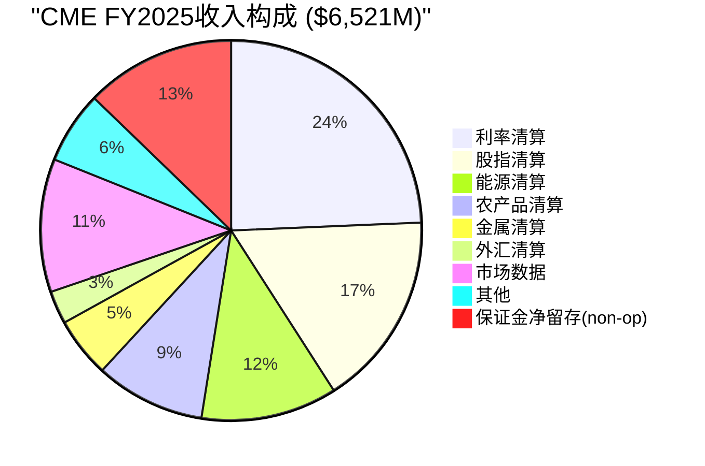

---

**Chapter 8 数据源表**

| DM锚点 | 数据项 | 来源 |
|--------|--------|------|
| DM-47 | 市场数据$803M, +13.1% YoY | CME FY2025 10-K |
| DM-48 | 数据子类别拆分估算 | CME产品页面+行业推算 |
| DM-49 | 数据定价权评估 | 市场数据行业分析 |
| DM-50 | ICE数据收入~$5.5B | ICE FY2025年报估算 |
| DM-51 | ADV vs 数据收入6年对比 | CME FY2020-2025 10-K |
| DM-52 | 数据占收入比例5年趋势 | CME历年10-K计算 |

---

## 8.6 市场数据作为护城河加深器

最后一个被忽视的角度: 市场数据不仅是收入来源，更是护城河的加深器。

CME结算价(settlement prices)被全球$600万亿以上衍生品头寸用于每日盯市 [DM-53]。这意味着:
- 每一个使用CME结算价的金融机构，都在其风险系统中嵌入了CME数据
- 切换到替代数据源=重新校准整个风险管理系统——成本远超数据订阅费
- 数据客户与交易客户高度重叠——数据锁定加深了交易锁定

ICE在数据业务上的成功($5.5B)证明了交易所数据的变现潜力巨大。CME在这个维度上是"未释放的期权"——当前$803M可能仅是潜力的起点。但在CME"stay in lane"的战略框架下，激进的数据变现策略短期内不太可能出现。

[DM-53] $600万亿盯市名义金额来自CME官方声明

---

**Chapter 8 数据源表**

| DM锚点 | 数据项 | 来源 |
|--------|--------|------|
| DM-47 | 市场数据$803M, +13.1% YoY | CME FY2025 10-K |
| DM-48 | 数据子类别拆分估算 | CME产品页面+行业推算 |
| DM-49 | 数据定价权评估 | 市场数据行业分析 |
| DM-50 | ICE数据收入~$5.5B | ICE FY2025年报估算 |
| DM-51 | ADV vs 数据收入6年对比 | CME FY2020-2025 10-K |
| DM-52 | 数据占收入比例5年趋势 | CME历年10-K计算 |
| DM-53 | $600万亿盯市名义金额 | CME官方声明 |

---

*Part 1完。Part 2将覆盖: 护城河量化(五环链条/周期定位/PtW)→估值深潜→红队→投资结论。*
