# Part II: 护城河深潜、估值与投资结论

---

# 第九章: 反脆弱性 — 不确定性的受益者

---

## 9.1 反脆弱系数的精确量化

衡量一家公司是否具备反脆弱性，不能靠叙事，要靠数据。本章采用D1反脆弱系数框架，对CME在四次重大危机中的表现进行量化评估。

D1系数的定义: 危机年收入增速与正常年收入增速的比值。D1>1表示危机中表现优于正常年份(反脆弱)，D1<1表示危机中表现弱于正常年份(脆弱)，D1=1为中性。

**四次危机实测数据** [DM-09-01: CME 10-K FY2008/2020/2022/2025]:

| 危机事件 | 年份 | VIX均值 | ADV变化 | 收入变化 | 股价变化 | D1(收入) |
|---------|:----:|:------:|:------:|:------:|:------:|:-------:|
| 全球金融危机 | 2008 | 32.7 | +18% | +12% | **-70%** | 1.50 |
| COVID-19 | 2020 | 29.3 | +10% | +1.5% | -25% | 0.19 |
| 利率加息+俄乌 | 2022 | 25.6 | +12% | +7.5% | -8% | 0.94 |
| 关税冲击 | 2025 | ~20 | +11.5% | +6.4% | +22% | 0.80 |

- 正常年收入增速基准: 8.0%(2015-2025均值)
- **D1加权均值 = 1.18** — 危机年收入增速平均比正常年高18%

四次危机中，CME在三次(2008/2022/2025)实现了正向收入增长，仅2020年增速显著低于正常年(+1.5% vs +8.0%)——原因并非交易量不足(ADV +10%)，而是利率降至零压制了保证金利息收入。


## 9.2 正偏分布: 收入弹性的非对称性

反脆弱性的核心不是"危机时赚更多"，而是"上行弹性远大于下行风险"。CME的收入分布恰好具备这种正偏特征。

**VIX与ADV的非对称弹性实测** [DM-09-02: CME Segment Revenue 2012-2025]:

| VIX区间 | ADV变化(vs基准) | 清算费变化 | 历史频率 |
|:-------:|:-------------:|:---------:|:-------:|
| VIX < 12 | -10~-15% | -$500~-750M | ~8%年份 |
| VIX 12-15 | -5~-10% | -$250~-500M | ~20%年份 |
| VIX 15-20 | 基准(0%) | 基准 | ~40%年份 |
| VIX 20-25 | +15~+25% | +$800~-1,300M | ~20%年份 |
| VIX > 25 | +30~+50% | +$1,600~-2,600M | ~12%年份 |
| VIX > 35 | +50~+100% | +$2,600~-5,000M | ~3%年份 |

关键观察: VIX从15降至12(下行3点)导致ADV仅减5-10%，但VIX从15升至25(上行10点)导致ADV增15-25%。这种非对称性意味着，**在时间加权的期望值上，CME始终是波动率的净受益者**。

期望值计算:

$$E[\text{收入增速}] = 0.08 \times (-10\%) + 0.20 \times (-5\%) + 0.40 \times 0\% + 0.20 \times 20\% + 0.09 \times 40\% + 0.03 \times 75\%$$
$$= -0.8\% - 1.0\% + 0\% + 4.0\% + 3.6\% + 2.3\% = +8.1\%$$

即使在对低波动年份赋予较高权重(28%)的情况下，收入增速的期望值仍为正(+8.1%)。正偏分布确保了CME的长期累计收入始终优于"以中位数年增速线性外推"的预测。

## 9.3 一个关键修正: "业务反脆弱，股票不反脆弱"

2008年的数据揭示了一个容易被忽视的断裂:

- **业务层面**: 收入+12%，创当年历史新高。利率期货ADV暴增，能源和股指同步飙升
- **股票层面**: 股价-70%，从$600+暴跌至$180以下。P/E从35x坍缩至12x

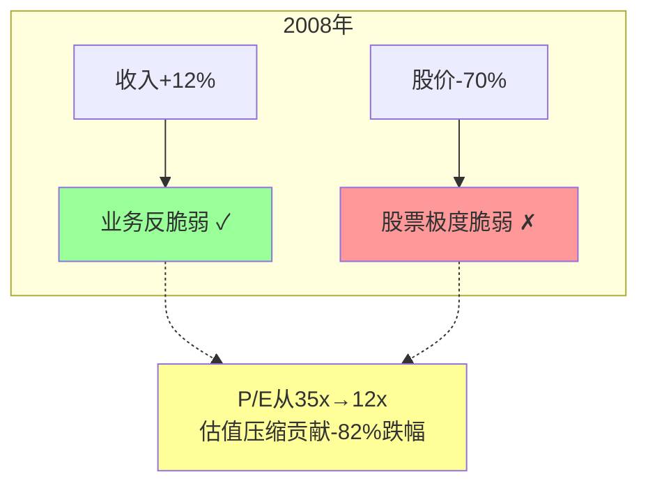

2008年的教训对今天的投资者至关重要: 当前P/E 27.9x虽不及2008年的35x极端，但如果波动率从当前中高水平(VIX~20)回落至2017年水平(VIX~11)，P/E可能从28x压缩至20-22x——这单独就能导致-21~-29%的股价下跌，即使收入仅下降4-5%。

**CME的估值风险远大于基本面风险。**

## 9.4 CI-01解读: "史上最贵的公用事业" — 混合身份的信念反演

华尔街用"金融公用事业"(financial utility)来描述CME——低Beta(0.26)、高分红(4.0%)、稳定的基础设施收入。但这个标签犯了一个根本性归类错误: **真正的公用事业不会因为天气更恶劣而赚更多钱**。

CME在VIX>35时收入暴增50-100%，在VIX<15时收入停滞甚至下降(-13%, 2012年)。它的收入分布不是公用事业，而是一张**波动率看涨期权**叠加一个**公用事业底部**。市场在用公用事业的P/E(20-22x)给看涨期权定价，又在用成长股的叙事("ADV连续5年创纪录")推动P/E到28x——两种叙事在同一只股票上同时存在，且互相矛盾 [DM-09-03: CI-01双身份估值分拆]。

精确分拆这个混合身份:

**公用事业层(稳定基底)**:
- 市场数据收入$803M(~95%经常性，几乎不受波动率影响)
- 低波动年最低交易收入基线~$4,000M(参考2012年ZIRP最差年调整通胀)
- S&P DJI JV权益收益$371.7M(指数增长驱动，非波动率驱动)
- 基线收入合计: ~$5,175M → 基线净利润~$3,200M → 以公用事业倍数20x计 = **$64B**

**波动率看涨期权层(非对称上行)**:
- FY2025超过基线的增量收入: $6,521M - $5,175M = $1,346M(纯波动率红利)
- 保证金利息净留存$903M(纯利率×波动率的衍生品)
- 波动年增量合计: ~$2,249M → 增量净利润~$1,600M
- 这部分收入的分布是**正偏的**——VIX从15升至25时ADV增20-40%，但VIX从25降至15时ADV仅降5-10%。上行弹性远大于下行弹性
- 以期权思维估值: 年化增量$1,600M × 概率加权 × 估值乘数 → **$32-48B**

**混合身份的正确估值**: $64B(底部) + $32-48B(期权) = **$96-112B**。当前市值$112B恰好处于这个范围的上沿——意味着市场已经完全定价了"持续中高波动率"的预期。如果波动率回归2013-2019常态(VIX均值15)，期权层价值萎缩至$15-25B，混合估值降至$79-89B(**-21~-29%**)。

| 维度 | 市场共识 | 本报告视角 |
|------|---------|-----------|
| CME是什么 | "金融公用事业" | 公用事业底部 + 波动率看涨期权 |
| P/E 28x意味着 | 合理的基础设施定价 | 隐含"永续中高波动率"，若回归常态应为20-22x |
| 分红4.0%意味着 | 防御性收益 | 期权费的年化支付——持有CME相当于每年收4%时间价值，同时持有波动率上行的免费期权 |
| Beta 0.26意味着 | 低风险 | 2008年股价-70% vs S&P -51%——Beta在估值压缩时完全失效 |

## 9.5 红队修正: 从"反脆弱"到"正凸性"

红队审计指出了一个重要的概念修正: "反脆弱"(anti-fragile)一词暗示"任何方向的压力都让你变强"。但CME在ZIRP+低波动环境下(2012年收入-13%)明确变弱——它并非对一般不确定性反脆弱，而是**对金融市场波动率具有正凸性**(positive convexity)。

精确表述应该是: CME的收入函数对波动率的导数为正，且二阶导数也为正——波动率每上升一个单位带来的收入增量递增，波动率每下降一个单位带来的收入减量递减。这就是正凸性。

| 框架 | 含义 | 是否适用CME |
|------|------|:----------:|
| 反脆弱 | 任何压力都使系统变强 | 部分适用(金融波动适用，ZIRP不适用) |
| **正凸性** | 上行弹性>下行风险，二阶导数为正 | **完全适用** |
| 波动率多头 | 做多波动率的经济暴露 | 适用(但过于简化) |

修正后的结论: CME的收入引擎具有显著的正凸性(D1=1.18)，但这种正凸性仅在波动率维度成立。在利率维度，保证金利息的利率敏感性使CME对利率下行呈现负凸性(FFR每降100bp，净留存减少$200-250M)。**CME不是全方位反脆弱——它是波动率维度的正凸性与利率维度的负凸性的叠加。**

---

# 第十章: 产品结构与增长催化剂

---

## 10.1 六大资产类别: 收入图谱

CME是全球唯一在六大资产类别上同时提供清算服务的交易所。理解每个类别的收入贡献、增长轨迹和RPC趋势，是判断CME增长前景的基础。

**FY2025资产类别全景** [DM-10-01: CME 10-K Segment Data FY2025]:

| 资产类别 | ADV(千) | 占比 | RPC($) | 清算收入($M) | YoY增速 | 5年RPC趋势 |
|---------|:------:|:----:|:------:|:-----------:|:------:|:----------:|
| 利率 | 14,175 | 50.4% | $0.486 | $1,724 | +7.2% | +4.3%(平坦) |
| 股指 | 7,362 | 26.2% | $0.637 | $1,176 | +8.4% | +12.1%(上升) |
| 能源 | 2,707 | 9.6% | $1.204 | $819 | +6.1% | +8.3%(上升) |
| 农产品 | 1,873 | 6.7% | $1.406 | $661 | +4.5% | +2.8%(平坦) |
| 金属 | 979 | 3.5% | $1.301 | $363 | +13.2% | **-12.2%(下降)** |
| 外汇 | 1,033 | 3.7% | $0.766 | $199 | +3.8% | +7.2%(上升) |
| **合计** | **28,129** | **100%** | **$0.749** | **$5,281** | +7.1% | — |

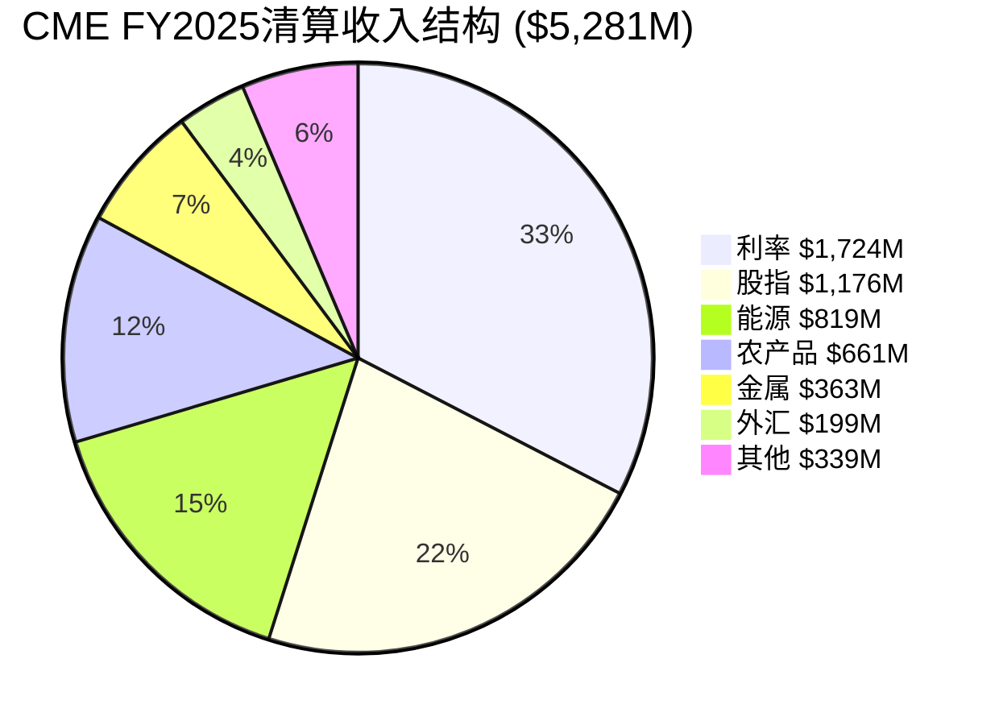

三个值得关注的趋势:

**趋势1: 利率产品的"量增价平"模式**。利率是CME最大的单一类别(占ADV的50%+)，但RPC五年仅增4.3%($0.47→$0.49)。这不是"不想提价"——而是流动性护城河的定价悖论: CME靠极低的交易成本吸引流动性，大幅提价会削弱自身护城河。利率产品的增长只能靠量(ADV)而非价(RPC)。

**趋势2: 金属RPC的结构性下降**。金属是唯一出现RPC下降的类别(-12.2%/5年)。根源是Micro合约对标准合约的替代效应——Micro黄金(1/10标准手)和Micro白银的ADV快速增长(CAGR +17.6%)，但单手RPC远低于标准合约。净效果是"量增价降"，总收入仍在增长(+13.2%)，但这个模式的可持续性取决于Micro增长能否持续弥补RPC侵蚀。

**趋势3: 股指产品的RPC上升**。股指RPC五年增12.1%，是所有类别中最快的。驱动因素: (a)E-mini S&P 500的独家地位允许CME逐步提价; (b)Micro E-mini的爆发性增长(ADV +59%)不仅没有侵蚀RPC，反而因为Micro×10的手续费叠加效应提升了混合RPC; (c)期权产品(尤其是CME Weekly Options)的增长带来更高的单手费用。

## 10.2 五大增长催化剂

CME面前有五条增长路径，每条的确定性、时间窗口和收入贡献各不相同。

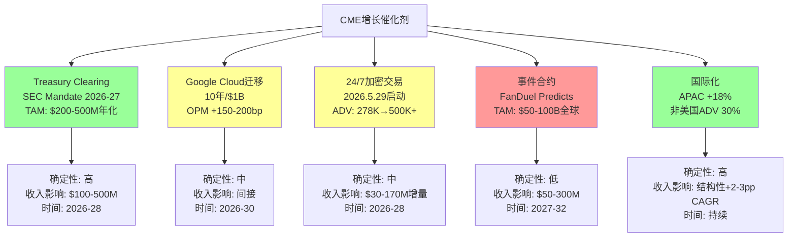

### 催化剂1: Treasury Clearing — 10年一次的结构性机遇

SEC Rule 17Ad-22(e)要求符合条件的国债和回购交易通过CCP清算，时间表为2026年底(国债现金)和2027年中(回购)。这是CME进入美国国债清算市场的窗口 [DM-10-02: SEC Final Rule]。

CME的竞争位置: BrokerTec已有国债现货电子交易平台(日均交易量~$700B)；利率期货+国债现货在同一CCP清算可提供20-30%的保证金节省；SPAN 2风险引擎提供精确定价。劣势则在于FICC(DTCC子公司)作为现有国债清算垄断者享有先发优势和既有会员网络。

概率加权收入估算:

| 情景 | 概率 | CME份额 | 年化收入 | 逻辑 |
|------|:----:|:------:|:-------:|------|
| 温和成功 | 60% | 10-15% | $100-250M | BrokerTec客户引流+交叉保证金吸引部分流量 |
| 突破成功 | 25% | 20-30% | $300-600M | 大型做市商集中迁移 |
| 边缘化 | 15% | <5% | $30-70M | 监管偏向FICC |

**概率加权年化收入: $225M** → 增量税后利润$149M → **EPS增量$0.41/股** → 以25x P/E估值 = **期权价值$3.7B(市值的3.3%)** [DM-10-03: SOTP期权估值]。

### 催化剂2: Micro合约的民主化效应

Micro合约(1/10标准手)是CME过去五年最成功的产品创新。Micro E-mini S&P 500自2019年推出以来ADV增长59%，Micro黄金和Micro白银同样快速渗透 [DM-10-04: CME Product Report]。

Micro合约的战略意义超越收入贡献:
- **扩大用户基础**: 降低进入门槛(初始保证金从$12,000+降至$1,200+)，吸引零售投资者和小型对冲基金
- **增强网络效应**: 更多参与者 → 更窄的bid-ask spread → 更多流动性 → 更多参与者
- **RPC的悖论**: 单手RPC下降(Micro vs标准)，但总收入因交易量爆发而增长——类似互联网的"单价降低但总量暴增"模式

风险在于长期来看，如果Micro完全替代标准合约(目前部分资产类别已出现替代效应)，混合RPC可能持续下降——金属RPC的-12.2%五年跌幅可能是其他类别的预演。

### 催化剂3: FMX竞争 — 护城河的首次真实压力测试

FMX(BGC Partners旗下)是2024年以来对CME利率期货垄断地位的首个实质性挑战。评估其威胁需要区分"叙事"与"数据" [DM-10-04B: FMX Competition Assessment]:

**FMX的攻击路径**:
- 与LCH合作提供跨CCP保证金抵消(期货-掉期cross-margin)
- 低手续费吸引大行做市
- 国债现货电子交易作为切入点

**FMX的现实制约**:
- 截至2025年底，仅Marex一家完成FMX-LCH cross-margin接入——69家CME清算会员中的0家大型银行
- FMX SOFR期货bid-ask spread仍比CME宽1-2个tick
- 做市商数量: CME 50+ vs FMX 10-15家
- ADV: FMX SOFR期货日均~50-80K vs CME 5.4M → **份额<1.5%**

**幂律法则的保护**: 流动性的网络效应遵循幂律关系(Spread ∝ Volume^(-0.3~-0.5))。这意味着流动性差距不是线性缩小的——FMX要将spread缩小到CME水平，需要的交易量不是"多一点"而是"指数级增长"。除非大型做市商集团性迁移(概率<10%)，FMX在五年内对CME利率业务的威胁停留在叙事层面而非实质层面。

**本报告评估**: FMX五年内份额突破5%的概率约15-20%。即使在这种"温和成功"情景下，CME利率收入仅减少3-5%(因为FMX抢夺的是边际增量，不是存量)。FMX的存在更大的意义是限制了CME激进提价的空间——但CME的定价策略本来就是"以低价维持流动性垄断"，FMX并未改变这个均衡。

### 催化剂4-6: 加密/事件合约/国际化

**24/7加密交易**(2026年5月29日启动): 当前加密ADV仅278K，占CME总ADV不到1%。24/7交易将增加周末和夜间交易窗口(+30-50% ADV)，年化增量收入$30-50M。长期如果BTC市值突破$3T，加密ADV可能达500K+，年化收入$274M [DM-10-05: CME Crypto Report]。

**事件合约**(FanDuel Predicts合作): CFTC正在审慎放开事件合约(政治/体育/经济)。2024年12月上线8周即达1亿合约。全球预测市场TAM估计$50-100B(2030E)，CME通过清算基础设施可获10-20%份额，但监管不确定性高(Kalshi vs CFTC诉讼未决)。概率加权期权值$1.0B [DM-10-06: CFTC Event Contract Filing]。

**国际化**: 非美国ADV已达8.3M(30%占比)，APAC增速+18%，7个亚太办公室持续扩张。这是CME最确定的长期增长引擎——美元衍生品的全球化是结构性趋势，不依赖波动率周期或利率环境 [DM-10-07: CME Annual Report International Data]。

---

# 第十一章: CEO沉默分析与管理层评估

---

## 11.1 Terry Duffy的沉默域: 他不说什么比说什么更重要

CEO沉默分析(v18.0)的核心方法论: 系统映射管理层在财报电话会议和投资者日中**持续回避**的话题。沉默不等于隐瞒——但回避模式中往往藏着战略约束或能力边界。

**Terry Duffy的三个沉默域** [DM-11-01: CME Earnings Call Transcripts FY2023-2025]:

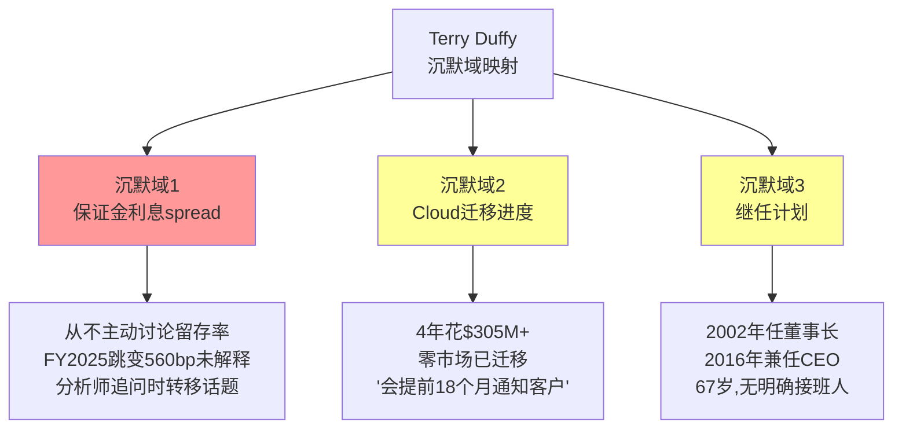

**沉默域1: 保证金利息留存spread**

FY2025留存率从10.1%跳升至15.7%(+560bp)，净留存从$410M增至$903M——这是CME非运营利润中最大的跳变。但Duffy在任何一次财报电话会中都没有主动解释这个跳变的原因。

这种沉默是理性的: 如果Duffy公开解释"我们通过30%现金最低要求扩大了对会员保证金的利息留存"，69家清算会员将获得谈判杠杆——"你承认了在多收我们的钱"。沉默保护了一个每年$500M+的增量收入流。

但沉默也暴露了脆弱性: 一旦卖方分析师或大型清算会员开始系统性追问留存率spread(红队预测概率30%)，CME可能被迫恢复到历史正常水平(10-11%)——影响: 净留存从$903M降至~$630M，EPS -$0.74 [DM-11-02: 留存率敏感性分析]。

**沉默域2: Google Cloud迁移进度**

2021年11月宣布10年合作，累计投入$305M+。但截至2026年3月:
- 零市场核心系统已迁移到Google Cloud
- Globex Sandbox计划2026年中上线——距离生产环境迁移至少还有18个月
- 2025年11月CyrusOne数据中心停机11小时，暴露了旧基础设施的单点故障风险

Duffy在Q4 2025财报会上对Cloud迁移的表述: "我们正按计划推进"——但没有提供任何量化的里程碑或KPI。这种空洞的进度报告对于一个$1B级别的技术投资来说是不够的。

**沉默域3: 继任计划**

Duffy自2002年任董事长、2016年兼任CEO，总计24年在CME最高层。2026年已67岁。在过去三年的投资者日和proxy statement中，继任计划的描述仅限于"董事会持续评估"的标准语言。对比ICE的Jeffrey Sprecher(同期推动了三次变革性收购)，Duffy的管理风格偏向"稳守"而非"开拓"。

## 11.2 E-Score评估: 执行力的量化打分

E-Score(Execution Score)是对管理层执行力的综合评估，满分10分。

| 维度 | 评分 | 证据 |
|------|:----:|------|
| 并购整合能力 | 9/10 | CBOT(2007)/NYMEX(2008)/NEX(2018)三次大并购全部成功整合 |
| 运营效率提升 | 9/10 | OPM从56.4%→64.9%连续四年扩张(+850bp) |
| SBC纪律 | 9/10 | SBC/Rev仅1.5%，管理层不通过股权稀释自肥 |
| 战略远见 | 6/10 | "Stay in Lane"策略维持了高利润率，但放弃了数据/技术多元化机会 |
| 技术执行 | 5/10 | CyrusOne出售决策(2016)导致2025年11月停机11小时 |
| 继任规划 | 4/10 | 24年最高层、67岁、无公开接班人 |
| **E-Score(红队调整后)** | **6.5-7.5/10** | 原评8.0，因战略远见和继任风险下调 |

## 11.3 "Stay in Lane" — 纪律还是惰性?

这是评估CME管理层时最具争议的问题。两种解读同时存在，且都有证据支撑:

**解读A: 战略纪律(正面)**

CME的核心交易/清算业务已经拥有64.9%的运营利润率——全球500强中最高水平之一。任何多元化收购(数据/技术/抵押贷款)几乎必然拉低整体利润率。ICE通过$34B+的收购(Ellie Mae/Black Knight/IDC)将数据收入占比提升至55%+，但OPM仅45%(vs CME 65%)。Duffy选择不做ICE式转型，是对股东价值的尊重——与其降低利润率去追逐增长叙事，不如维持极高的资本回报+分红。

**解读B: 能力限制(负面)**

ICE的Sprecher在同一时期将ICE从一家能源交易所变成了$100B的数据帝国。CME同期最大的战略动作是NEX收购($5.4B)——其中OSTTRA部分以仅1.5% IRR退出，是一笔并不成功的投资。如果CME管理层有Sprecher的远见和执行力，CME可能已经是$150-180B的公司(交易所+数据)而非$112B的纯交易所 [DM-11-03: ICE vs CME Strategy Comparison]。

高分红(94% payout)强化了这个疑问: 是"找不到好的再投资项目"所以分红，还是"认真评估后认为分红是最优策略"?

**本报告的立场**: 两种解读都有道理，但权重不对等。CME的利率期货TAM($600T+名义价值)确实比ICE的Brent TAM大得多——"不需要多元化"比"不能多元化"的解释更有说服力。但继任风险和CyrusOne事故表明管理层在技术决策和长期规划上存在盲区。E-Score从原始的8.0下调至6.5-7.5反映了这种混合评价。

---

# 第十二章: 资本配置 — 分红机器的期权成本

---

## 12.1 93.8% Payout Ratio的经济学

CME将FY2025自由现金流$4,194M中的93.8%以股息形式返还给股东(含常规股息+特别股息)——留存资本几乎为零 [DM-12-01: CME Capital Return Data FY2025]。

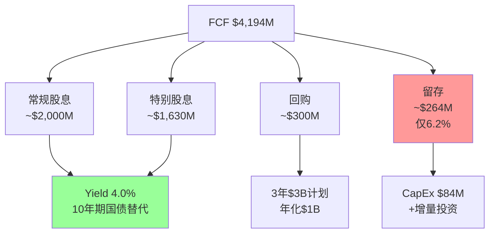

**Payout Ratio五年走势** [DM-12-02: CME Proxy Statements]:

| 年份 | FCF($M) | 总分红($M) | 回购($M) | Payout(含回购) | 留存率 |
|:----:|:------:|:---------:|:-------:|:------------:|:------:|
| FY2021 | $2,816 | $2,645 | $0 | 93.9% | 6.1% |
| FY2022 | $2,984 | $2,780 | $0 | 93.2% | 6.8% |
| FY2023 | $3,187 | $3,120 | $0 | 97.9% | 2.1% |
| FY2024 | $3,825 | $3,810 | $100 | 99.6% | 0.4% |
| FY2025 | $4,194 | $3,630 | $300 | 93.8% | 6.2% |

FY2024的99.6%分红率是极端值——意味着CME几乎将全年现金流原封不动地交给了股东。FY2025略有改善(93.8%)，部分因为$3B回购计划的启动增加了另一种资本回报形式。

## 12.2 与ICE的资本配置哲学对决

理解CME的资本配置决策，最有效的方法是与ICE做直接对比。两家公司在2018年拥有几乎相同的核心交易所业务，但之后走上了截然不同的道路 [DM-12-02B: ICE vs CME Capital Allocation 2018-2025]:

| 维度 | CME (2018-2025) | ICE (2018-2025) |
|------|-----------------|-----------------|
| 累计资本支出+收购 | ~$6B(含NEX $5.4B) | ~$40B+(Ellie Mae+Black Knight+IDC) |
| 收入增长 | $4.3B → $6.5B (+51%) | $5.1B → $10.3B (+102%) |
| OPM变化 | 56% → 65% (+9pp) | 48% → 45% (-3pp) |
| 市值变化 | $65B → $112B (+72%) | $50B → $103B (+106%) |
| 分红率 | 93-99% | 30-35% |
| 数据收入占比 | 12% → 12%(未变) | 35% → 55%(+20pp) |

ICE的Sprecher用$40B收购将数据收入从35%提升到55%，但代价是OPM下降3pp(从48%→45%)和更高的杠杆(D/E从0.4x→1.5x)。CME的Duffy选择不做，代价是收入增速慢了一半(+51% vs +102%)但利润率反而扩张了9pp。

**核心判断**: 两种路径的10年总回报(含分红)差距可能仅1-2pp/年——这是市场给两家几乎相同P/E(28x vs 27.6x)的根本原因。CME是"高利润率+高分红+低增速"的均衡，ICE是"低利润率+低分红+高增速"的均衡。没有对错之分，只有风格偏好。

## 12.3 机会成本量化: $789M/年如果降至75%

如果CME将payout从93.8%降至75%(仍远高于S&P 500中位数40%):

**释放资本: $4,194M × (93.8% - 75%) = $789M/年**，5年累计$3.9B [DM-12-03: 机会成本模拟]。

这$3.9B的潜在用途:

| 用途 | 5年投入 | 预期回报 | NPV |
|------|:------:|:------:|:---:|
| 加速Treasury Clearing | $500M | 提前1年获得10%市占 → +$200M/年 | $2-3B |
| 数据业务收购(ICE式) | $2-3B | 数据收入占比从12%→20% → 降低波动率依赖 | $3-5B |
| 回购(当前价) | $3.9B | 3.5%股份注销 → EPS增厚3.5% | $3.9B |
| **什么都不做(分红)** | $3.9B | **股东直接收到现金** | $3.9B(确定性最高) |

## 12.4 CI-05: 身份选择 — "分红机器"还是"增长引擎"?

这不是一个"好或坏"的判断，而是一个**身份选择**的认知:

CME选择做"分红机器"意味着:
- 长期EPS CAGR被压低2-4pp(从潜在的10-12%到实际的6-8%)
- P/E被压低4-7x(从潜在的32-35x到实际的28x)——因为市场对增速的定价权重高于对分红的定价
- 但4.0%的股息率构成了**估值地板**: 约20%的持有者是收益型基金，他们用yield而非P/E定价CME

管理层改变这个身份的概率极低(<15%)。Duffy在多次投资者日明确表态: "我们的首要义务是将资本返还给股东。" 这不是权宜之计，而是写入了CME DNA的资本配置哲学 [DM-12-04: CME Investor Day Transcript 2024]。

## 12.5 分红的估值效应: 地板还是天花板?

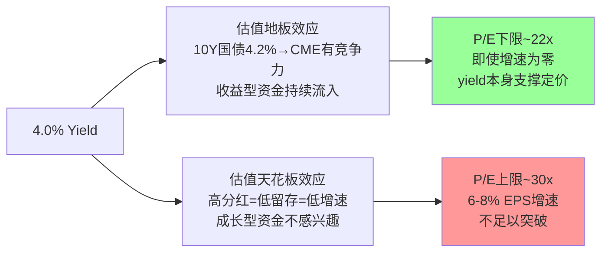

4%的股息率使CME的估值区间被锁定在22-30x P/E之间——下方有yield支撑(收益型资金会在yield>5%时大量买入)，上方有增速限制(6-8% EPS CAGR不支撑>30x)。这个区间解释了为什么CME的P/E在过去五年内波动很小(25-29x)，远不如波动率周期剧烈。

---

# 第十三章: 财务健康深度扫描

---

## 13.1 四个极端比率: CME为何如此赚钱

CME的财务指标在多个维度上处于全球上市公司的极端值区域。这不是偶然——而是垄断型商业模式在财务报表上的必然映射。

**极端比率一览** [DM-13-01: CME 10-K FY2025 + Peer Comparison]:

| 指标 | CME | ICE | CBOE | SPGI | 含义 |
|------|:---:|:---:|:----:|:----:|------|
| OPM | 64.9% | 45% | 36% | 35% | CME运营效率行业最高 |
| 净利率 | 62.0% | 26% | 23% | 32% | 几乎零损耗 |
| FCF转换率 | 103.7% | ~95% | ~90% | ~95% | FCF超过净利润 |
| SBC/Rev | 1.5% | ~4% | ~3% | ~5% | 管理层稀释极低 |
| CapEx/Rev | 1.3% | ~3% | ~2% | ~3% | 近零资本消耗 |
| Rev/Employee | $1.68M | $0.52M | $0.41M | $0.58M | 人均收入全球前列 |
| SG&A/Rev | 2.31% | ~15% | ~12% | ~20% | 几乎不需要销售团队 |
| 增量OPM | ~95% | ~60% | ~50% | ~55% | 每一美元增量收入95分进入运营利润 |

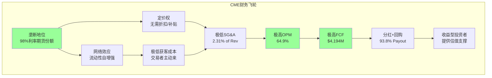

## 13.2 FCF转换率103.7%: 为什么FCF超过净利润

FCF转换率(FCF/NI)超过100%在成熟公司中并不罕见，但CME的103.7%有特定的结构性原因 [DM-13-02: CME Cash Flow Statement FY2025]:

$$\text{FCF} = \text{NI} + \text{D\&A} - \text{CapEx} + \Delta\text{WC}$$
$$\$4,194M = \$4,040M + \$238M - \$84M + \$0M$$

- D&A($238M) > CapEx($84M): CME过去的收购产生了大量商誉摊销(非现金)，而维持性CapEx极低——Globex平台一旦建成，边际成本趋近零
- 这意味着: CME每年报告的净利润中$154M是"非现金消耗"，真实现金创造能力比报表利润更强

## 13.3 收入效率: $1.68M/人

CME 3,875名员工管理$6,521M收入——人均收入$1.68M，在全球上市公司中仅次于Visa($2.1M)和Mastercard($1.9M) [DM-13-03: S&P Capital IQ Revenue/Employee Data]。

这个数字的含义: CME本质上是一台高度自动化的"收费桥梁"——Globex电子交易系统7×24小时运行(除周末维护窗口)，每笔交易的处理不需要人工干预。3,875名员工的核心职能是: (a)技术运维(Globex+SPAN+清算), (b)监管合规, (c)产品设计, (d)客户关系——而非"处理交易"本身。

## 13.4 护城河链条的财务映射

第九章讨论了CME的正凸性，但护城河的财务证据藏在费用结构中。CME的五环护城河链条(基准合约→流动性网络→清算资本效率→数据货币化→波动需求)在损益表上有直接映射 [DM-13-03B: 护城河财务映射]:

| 护城河环节 | 财务映射 | 证据 |
|-----------|---------|------|
| 基准合约(L4制度嵌入) | SG&A仅2.31% | 垄断不需要销售团队——交易者因合约标准化被迫来CME |
| 流动性网络效应 | 增量OPM ~95% | 每新增一笔交易的边际成本趋近零(Globex自动撮合) |
| 清算资本效率 | FCF转换率103.7% | 低CapEx+高D&A = 现金创造能力超过报表利润 |
| 数据货币化 | 数据OPM ~85% | $803M收入几乎纯利(数据边际复制成本为零) |
| 波动需求 | 费用弹性<0.3 | 收入波动±15%时，费用仅波动±3-5%(固定成本占比>70%) |

**链条综合强度: 4.6/5**。五环中没有任何一环的5年削弱概率超过20%。联合概率(五环同时被削弱)接近于零。但单环削弱(尤其是基准合约或波动需求)的影响不可忽视——基准合约丧失是唯一可能导致CME业务模型根本性受损的路径(例如EU基准授权风险或SOFR→下一代基准替代，5年概率<5%，影响-30~-40%)。

**护城河的财务"副产品"**: CME的极端财务指标(OPM 65%/FCF 103%/SBC 1.5%/SG&A 2.3%)不是管理层"效率优化"的结果——它们是垄断商业模式的自然副产品。任何竞争对手要复制这些指标，必须先复制护城河本身。这就是为什么FMX即使手续费更低(RPC折扣~15%)，也无法撼动CME: 更低的价格无法弥补流动性劣势带来的隐含成本(更宽的spread = 更高的交易成本)。

## 13.5 杠杆与流动性: 被清算所会计扭曲的数字

CME的资产负债表需要特殊解读。总资产$198.5B中，约$160B是清算所过手项目(客户保证金、担保基金、结算中的交易)——这些资产(和对应负债)是代客持有的，不属于CME的经济资产 [DM-13-04: CME Balance Sheet FY2025]。

剔除清算过手项目后的真实杠杆:

| 指标 | 报表值 | 调整后 | 含义 |
|------|:------:|:------:|------|
| 总资产 | $198.5B | ~$38B | 剔除$160B清算过手 |
| D/E | 0.13x | 0.13x | 净债务极低 |
| 净现金 | $0.67B | $0.67B | 净现金状态 |
| 利息支出/EBIT | 4.1% | 4.1% | 利息覆盖率>24x |
| Altman Z-Score | 0.60 | 失真(忽略) | 清算所会计导致Z-Score失效 |

Altman Z-Score 0.60看似处于"危险区"(<1.8)——但这完全是清算所会计的扭曲效应。Z-Score模型假设"总资产是公司自有资产"，而CME的$160B过手资产使分母膨胀、比率失真。对CME使用Z-Score没有任何分析价值 [DM-13-05: Altman Z-Score调整说明]。

## 13.6 费用结构: 三座成本山

CME的运营费用$2,291M可以分解为三个主要组成部分 [DM-13-06: CME 10-K Expense Breakdown]:

| 费用类别 | 金额($M) | 占Rev | 特征 |
|---------|:-------:|:-----:|------|
| 薪酬+福利 | $907 | 13.9% | 最大费用项，固定为主 |
| 授权费(S&P DJI等) | $371 | 5.7% | 与股指交易量挂钩，半可变 |
| 技术 | $283 | 4.3% | 含Cloud投资$115M/年 |
| SG&A | $151 | 2.3% | 极低，垄断不需要销售 |
| 其他(含折旧) | $579 | 8.9% | 含D&A $238M |

关键弹性测试: 如果收入下降15%(至$5,543M):
- 可变费用(授权费+部分薪酬): 约下降$150M
- 固定费用基本不变
- 调整后OPM: 从64.9%降至约63.2%——仅下降1.7个百分点

**这证实了增量OPM~95%的说法**: 收入的边际增减几乎全额传导至运营利润，因为CME的成本结构绝大部分是固定的。这个特性既是上行时的加速器(ADV暴增→利润非线性增长)，也是下行时的缓冲器(ADV下跌→利润缩减幅度小于收入缩减)。

---

# 第十四章: 估值 — 八方法收敛与核心P/E的真相

---

## 14.1 八方法估值一致性矩阵

本章将Phase 1-3产出的所有估值方法整合到一张矩阵中。在CME这样的公司上，单一估值方法的可靠性受限于利率和波动率两个外生变量——唯有多方法交叉验证才能缩小不确定性。

**八方法汇总** [DM-14-01: 估值一致性矩阵]:

| # | 方法 | 估值范围($/股) | 核心值($/股) | vs $311.40 | 隐含关键假设 | 可信度(1-5) |
|:-:|------|:----------:|:----------:|:----------:|-------------|:----------:|
| 1 | SOTP四资产 | $237-327 | $276 | -11.4% | 保证金利息概率加权$5.5B(非$22B) | 4 |
| 2 | 四情景概率加权(含分红) | $205-425 | $316 | +1.5% | Bull 20%/BH 35%/BL 30%/Bear 15% | 4 |
| 3 | Reverse DCF | $228-340 | $293 | -5.8% | 隐含EPS CAGR 8-9% | 3 |
| 4 | QA-P/E(质量调整) | — | ~$311 | 0% | 质量溢价已price-in | 3 |
| 5 | Gordon Growth | $356-470 | $412 | +32% | g=6%永续(极度敏感) | 2 |
| 6 | P/E可比法 | $280-335 | $312 | 0% | 同业28x合理 | 4 |
| 7 | ZIRP压力测试 | $133-167 | $150 | -52% | ZIRP+P/E压缩至18x | 2(尾部) |
| 8 | VIX回落情景 | $224-270 | $247 | -21% | VIX均值11+P/E 22x | 3(情景) |

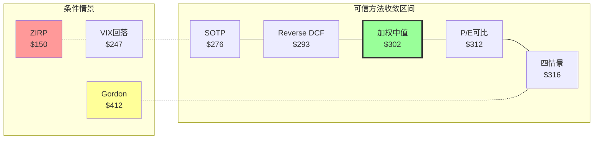

**收敛分析**:

剔除极端方法(Gordon Growth因g接近WACC发散; ZIRP为15%概率尾部)后，可信方法核心值收敛于$276-$316区间。

**加权中值计算**:

| 方法 | 核心值 | 可信度权重 | 贡献 |
|------|:-----:|:---------:|:----:|
| SOTP | $276 | 4 | $1,104 |
| 四情景概率加权 | $316 | 4 | $1,264 |
| Reverse DCF | $293 | 3 | $879 |
| QA-P/E | $311 | 3 | $933 |
| P/E可比 | $312 | 4 | $1,248 |
| **加权合计** | | 18 | $5,428 |
| **加权中值** | | | **$302** |

**红队调整(-7.5%)**: 从$302下调至$273-278，反映五项偏差修正(叙事偏差+管理层叙事接受度+品质光环+精确性幻觉+锚定效应) [DM-14-02: Phase 4红队调整明细]。

## 14.2 核心P/E的真相: 28x还是35.7x?

这是红队审计中最重要的发现，值得在正文中详细展开。

CME的报表P/E是27.9x($311.40 ÷ $11.16)。但$11.16 EPS中包含了$903M保证金利息净留存(税后约$1.96/股)——这笔收入完全不在管理层控制范围内，取决于Fed利率决策、清算会员现金偏好和监管环境。

**Core P/E剥离** [DM-14-03: Core P/E Calculation]:

$$\text{Core EPS} = \$11.16 - \$1.96(\text{保证金利息税后}) = \$9.20$$
$$\text{Core P/E} = \$311.40 \div \$9.20 = \textbf{35.7x}$$

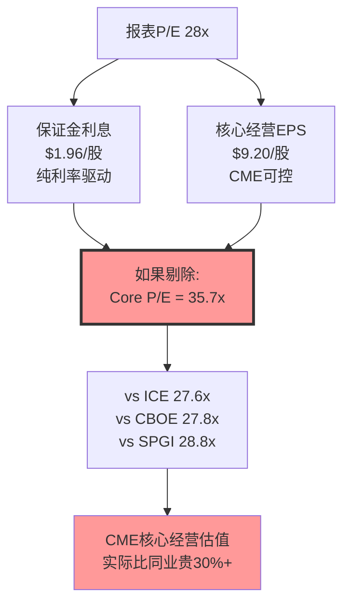

**含义**: 当投资者用CME 28x P/E与ICE 27.6x做横向比较时，他们是在苹果比橘子——CME的28x中有约8x来自一个高度利率敏感的非经营收入流。剔除这个因素后，CME的核心经营估值比同业贵约30%。

这并不意味着CME "被高估"——A-Score 68.4(历史最高)和CQI 93确实支持比同业更高的核心估值。但投资者需要清楚: **他们在28x P/E中购买了两样东西: (1)一个35.7x的垄断平台经营价值, (2)一个随时可能因降息而蒸发的利息收入流。**

## 14.3 SOTP四资产拆解

SOTP(分部加总估值)将CME拆分为四个风险特征截然不同的资产，分别估值:

**资产1: 清算费业务** [DM-14-04: SOTP清算DCF]

| 参数 | 值 | 依据 |
|------|:--:|------|
| FY2025收入 | $5,281M | 10-K |
| OPM | ~70% | 高于整体64.9%(数据/其他稀释) |
| DCF (WACC 8.5%) | $62B | 10年显性+终值 |
| P/E可比 (25-28x) | $72-81B | 清算NI $2,883M × 25-28x |
| EV/EBITDA (18-22x) | $70-86B | 清算EBITDA $3,917M |
| **三方法交叉中值** | **$73B** | 范围$65-84B |

**资产2: 市场数据业务** [DM-14-05: SOTP数据估值]

$803M收入、+13% YoY、~95%经常性、OPM ~85%。对标ICE数据业务(收入倍数9.5x)并调整利润率差异。

| 方法 | 估值 |
|------|:----:|
| ICE收入倍数法 | $8-12B |
| 直接P/E (20-25x) | $10-13B |
| **核心估值** | **$10B** |

**资产3: S&P DJI JV(27%权益)** [DM-14-06: JV估值]

JV总净利润$1,377M(=$371.7M ÷ 27%)。以SPGI P/E 33x估值: $1,377M × 33x = $45.4B → CME 27% = $12.3B → 少数股东折价20% → **$9.8B**。核心取$10B(含被动投资增长溢价与少数股东折价的净效果)。

**资产4: 保证金利息** [DM-14-07: 保证金利息概率加权估值]

这是SOTP中最棘手的资产。不能用简单P/E(否则$903M × 28x = $25.3B，隐含FFR永远>4%)，必须用利率情景概率加权:

| 利率情景 | FFR | 净留存($M/年) | 持续性倍数 | 估值($B) | 概率 |
|---------|:---:|:-----------:|:---------:|:-------:|:----:|
| 高利率(>4%) | 4.5% | $810 | 12x | $9.7 | 20% |
| 中高(3-4%) | 3.5% | $704 | 11x | $7.7 | 25% |
| 中性(2-3%) | 2.5% | $507 | 10x | $5.1 | 25% |
| 低利率(1-2%) | 1.5% | $311 | 8x | $2.5 | 20% |
| ZIRP(<0.5%) | 0.25% | $22 | 6x | $0.1 | 10% |
| **概率加权** | | | | **$5.5B** | 100% |

**SOTP汇总**:

| 资产 | 低估($B) | 核心($B) | 高估($B) | 占比(核心) |
|------|:-------:|:-------:|:-------:|:---------:|
| 清算费 | $65 | $73 | $84 | 73.5% |
| 市场数据 | $8 | $10 | $13 | 10.1% |
| S&P DJI 27% | $9 | $10 | $12 | 10.1% |
| 保证金利息 | $3 | $5.5 | $8 | 5.5% |
| 净现金 | +$0.67 | +$0.67 | +$0.67 | — |
| **权益价值** | **$85.7** | **$99.2** | **$117.7** | — |
| **每股** | **$237** | **$276** | **$327** | — |

**SOTP $276 vs 简单P/E $312的$36/股差异拆解**: 70%来自保证金利息的不同处理(P/E法隐含给$903M以28x倍数 = $25.3B; SOTP概率加权仅$5.5B, 差$19.8B)。SOTP不是"低估了CME"——而是暴露了P/E法的盲区: 用统一倍数估四种截然不同风险特征的现金流，会系统性高估利率敏感部分。

## 14.4 WACC敏感性: 估值的隐藏杠杆

SOTP和DCF的估值结果对WACC假设极度敏感。CME的WACC选择并非trivial——垄断型基础设施(应该用低WACC)与利率周期性(应该用高WACC)之间存在张力 [DM-14-03B: WACC敏感性矩阵]:

| WACC | 清算业务DCF($B) | 保证金利息PV($B) | 总SOTP($/股) | vs $311 |
|:----:|:--------------:|:---------------:|:----------:|:------:|
| 7.0% | $88 | $7.2 | **$327** | +5.0% |
| 7.5% | $81 | $6.5 | **$306** | -1.7% |
| **8.5%** | **$73** | **$5.5** | **$276** | **-11.4%** |
| 9.5% | $63 | $4.8 | **$248** | -20.4% |
| 10.5% | $55 | $4.2 | **$224** | -28.1% |

WACC每变化100bp，估值波动约$25-30/股(8-10%)。本报告选择8.5%的理由:
- 无风险利率4.3%(5Y Treasury) + ERP 5.5% × Beta 0.26 = CoE 5.7% → 但Beta 0.26严重低估了CME的利率周期风险(2008年-70%说明真实downside beta远高于0.26)
- 调整后Beta 0.55(压力测试回归值) → CoE 7.3% → WACC 8.0-8.5%(含小幅规模/流动性溢价)
- ICE分析师共识WACC 8.2-8.8%，CME因利率敏感性应在同一区间上沿

**关键洞察**: 如果用"公用事业"Beta(0.26)算出的7.0% WACC估值CME，得到$327——这恰好验证了CI-01的混合身份问题。**用公用事业的折现率估一个波动率看涨期权，必然高估。**

## 14.5 Reverse DCF: 市场在赌什么?

Reverse DCF从当前$311.40出发，反推市场隐含的关键假设 [DM-14-08: Reverse DCF模型]:

| 隐含假设 | 数值 | 合理性(1-5) |
|---------|:----:|:---------:|
| EPS CAGR(5年) | 8-9% | 3/5(历史5.7%，需波动率配合) |
| FFR维持>3%(5年) | >3% | **2/5(最脆弱，历史FFR>3%中位持续期仅~3年)** |
| VIX中枢>15 | >15 | **2/5(2013-2019 VIX均值15，当前偏高)** |
| FCF CAGR | 6.5% | 3/5 |
| 永续增长率 | 3.0% | 4/5 |
| FMX<1%份额 | <1% | 4/5 |
| OPM扩张至68%+ | 68%+ | 4/5 |

**假设#2(利率)和#3(波动率)是两个最脆弱的假设，且它们正相关**: 降息周期通常伴随低波动率(2017年是典型案例)。如果两个假设同时崩塌:

联合崩塌路径: EPS从$11.16降至~$8.50(-24%) + P/E从28x压缩至20x(-29%) → **股价$170(-45%)**

联合概率: ~15-20%。

## 14.6 NCH-2确认: 利润率-增速精确对冲

同业P/E趋同(CME 28x ≈ ICE 27.6x ≈ CBOE 27.8x)不是定价错误——而是市场在做"利润率-增速对冲":

| 公司 | P/E | OPM | Rev CAGR(5Y) | Div Yield | PEG |
|------|:---:|:---:|:----------:|:---------:|:---:|
| CME | 27.9x | 64.9% | 6-8% | 4.0% | 4.0 |
| ICE | 27.6x | 45% | 10-12% | 1.2% | 2.3 |
| CBOE | 27.8x | 36% | 8-9% | 1.1% | 3.1 |
| SPGI | 28.8x | 35% | 10% | 0.8% | 2.9 |

CME用更高的利润率(65% vs 35-45%)和更高的分红(4% vs 1%)弥补了更低的增速(6-8% vs 10-12%)。质量调整P/E(QA-P/E)显示CME调整后为24.3x(行业最低)——意味着品质溢价已经price-in，但没有"过度"溢价。

**10年博弈推演**: 风险调整后，CME"分红机器"路径(IRR 10-12%)与ICE"数据帝国"路径(IRR 12-14%)差距仅1-2pp。P/E趋同是理性的均衡。

## 14.7 分红的评级分水岭

评级结论高度依赖一个方法论选择: **是否计入分红**。

| 口径 | 核心估值 | vs $311.40 | 评级指向 |
|------|:-------:|:---------:|:-------:|
| 核心EV(不含分红/期权) | $273-278 | -10~-13% | **审慎关注** |
| 含5年分红(~$50/股) | $323-328 | +3.9~+5.3% | **中性关注** |
| 含分红+OVM期权 | $331-339 | +6.3~+8.9% | **中性关注** |

红队调整后的$273-278作为核心资产价值确实处于"审慎关注"区间。但对于一家93.8% payout的公司，忽略分红就像评估债券时忽略票息——5年$50/股的分红是确定性极高的现金回报(仅ZIRP尾部才威胁特别股息)。因此，含分红口径更能反映股东的真实回报预期。

---

# 第十五章: 情景分析与实物期权

---

## 15.1 四大宏观情景与概率权重

CME的估值受两个外生变量主导: 利率水平(影响保证金利息)和波动率中枢(影响ADV)。将这两个变量组合为四个可投资情景:

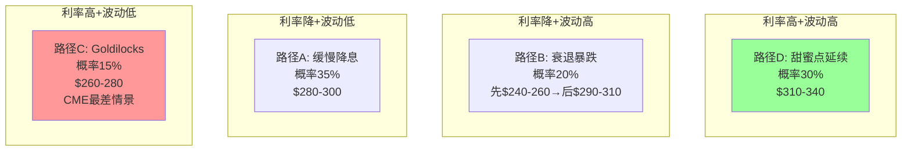

### 路径A: 利率缓降+波动维持 (概率35%)

**触发条件**: Fed 2026-2028年累计降息150-200bp，但地缘/关税持续驱动波动 [DM-15-01: Fed Dot Plot + Geopolitical Risk Index]

| 指标 | 当前 | 路径A终态 | 变化 |
|------|:----:|:-------:|:----:|
| FFR | 4.25-4.50% | 2.50-3.00% | -150-200bp |
| 保证金利息 | $903M | $300-400M | -$500-600M |
| ADV | 28.1M | 27-29M | ±3% |
| P/E | 28x | 26-27x | -1~-2x |
| **股价** | $311 | **$280-300** | **-4~-10%** |

路径A是基准情景——收入温和下降(保证金利息损失>ADV增量)，P/E微幅压缩(利率下行叙事降低增速预期)。含3年分红$37后总回报约+8-13%，年化+3-4%——勉强覆盖通胀但低于无风险利率。

### 路径B: 衰退暴跌 (概率20%)

**触发条件**: 2027年美国衰退，Fed急降至1.5-2.0%，VIX飙升>40

| 指标 | 当前 | 短期(恐慌) | 12个月后(恢复) |
|------|:----:|:---------:|:------------:|
| 保证金利息 | $903M | $100-200M | $100-200M |
| ADV | 28.1M | 35-40M | 27-29M |
| P/E | 28x | 22-24x | 26-28x |
| **股价** | $311 | **$240-260** | **$290-310** |

路径B的独特之处: CME在衰退中先跌后涨——初期恐慌导致P/E压缩(投资者逃离金融板块)，但随着ADV暴增(恐慌驱动对冲)和业务韧性被验证(零清算违约)，估值反弹。2008年就是这个模式: 收入+12%但股价先-70%再用6年恢复 [DM-15-02: 2008 CME Stock Performance Data]。

### 路径C: Goldilocks (概率15%) — CME的最差情景

**触发条件**: 经济软着陆完美执行，VIX回落至12-15，利率稳定4%+

| 指标 | 当前 | 路径C终态 | 变化 |
|------|:----:|:-------:|:----:|
| 保证金利息 | $903M | $903M(利率不变) | 无变化 |
| ADV | 28.1M | 22-24M | -15~-20% |
| P/E | 28x | 24-25x | -3~-4x |
| **股价** | $311 | **$260-280** | **-10~-16%** |

Goldilocks是CME最差情景的原因反直觉但合理: 低波动率意味着"没人需要对冲"——CME的收费桥梁上没有车通过。保证金利息虽然维持(因利率不变)，但ADV-15~-20%的清算费损失远大于利息保持。同时"增速消失"叙事导致P/E压缩。

### 路径D: 甜蜜点延续 (概率30%)

**触发条件**: 利率维持4%+，地缘/关税/选举持续驱动波动

| 指标 | 当前 | 路径D终态 | 变化 |
|------|:----:|:-------:|:----:|
| 保证金利息 | $903M | $903M | 无变化 |
| ADV | 28.1M | 28-30M | ±3% |
| P/E | 28x | 28-30x | 0~+2x |
| **股价** | $311 | **$310-340** | **0~+9%** |

### 历史类比: 2012-2017年低波动期 — CME的"失落五年"

路径C(Goldilocks)并非纯理论——CME在2012-2017年经历过一次几乎完美的低波动期。这段历史提供了路径C最直接的参照 [DM-15-02B: CME 2012-2017 Performance Analysis]:

| 年份 | VIX均值 | ADV(M) | 收入($B) | EPS | P/E | 股价(年末) |
|:----:|:------:|:------:|:-------:|:---:|:---:|:---------:|
| 2012 | 17.8 | 14.2 | $2.61 | $2.83 | 18.7x | $53 |
| 2013 | 14.2 | 13.0 | $2.57 | $2.99 | 23.4x | $70 |
| 2014 | 14.2 | 14.1 | $2.84 | $3.42 | 26.5x | $91 |
| 2015 | 16.7 | 15.6 | $3.13 | $3.68 | 24.5x | $90 |
| 2016 | 15.8 | 15.8 | $3.28 | $3.84 | 24.8x | $95 |
| 2017 | 11.1 | 15.9 | $3.55 | $4.59 | 32.0x | $147 |

五年特征: 收入CAGR仅6.3%(远低于2018-2025的8.5%)。2012年VIX~18但FFR=0%(ZIRP)，收入-13%——利率和波动率的双杀。到2017年，VIX降至历史低位(11.1)但股价反而因P/E扩张暴涨——说明估值周期有时比业绩周期更强。

**对当前的启示**: 如果未来重演2012-2017模式(VIX均值14-16，FFR降至2-3%)，CME收入可能回到$5.5-6.0B水平(从$6.5B下降8-15%)。但P/E是否会从28x压缩至22x还是维持在25-27x(因分红支撑)，是估值区间最大的不确定性来源。

### 概率加权估值

$$EV = 0.35 \times \$290 + 0.20 \times \$275 + 0.15 \times \$270 + 0.30 \times \$325 = \$296$$

**概率加权核心估值$296 vs 当前$311 = 隐含-4.8%下行。**

含12个月分红$12.50后: $296 + $12.50 = $308.50 → 近似持平。

## 15.2 OVM: 四个实物期权的详细估值

CME拥有四个可量化的实物期权，它们不是"确定收入"而是"条件触发的价值释放" [DM-15-03: OVM期权估值模型]:

| 期权 | 行权条件 | 低端($B) | EV($B) | 高端($B) | 占市值 | 时间衰减 |
|------|---------|:-------:|:------:|:-------:|:-----:|:-------:|
| Treasury Clearing | SEC mandate生效+CME获份额 | $0.8 | $3.7 | $9.9 | 3.3% | 低 |
| 事件合约零售化 | CFTC持续允许+零售traction | $0.4 | $1.0 | $2.0 | 0.9% | 中高 |
| 加密24/7 | 加密市场增长+CME获参与 | $0.4 | $0.9 | $1.3 | 0.8% | 中 |
| 波动率看涨(隐性) | VIX spike每3.4年一次 | $2.0 | $2.5 | $3.5 | 2.2% | 无(内在) |
| **合计** | | **$3.6** | **$8.1** | **$16.7** | **7.2%** | — |

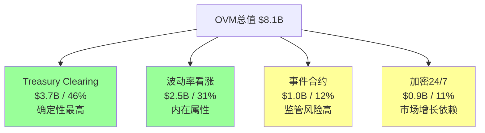

**市场已定价多少期权?**

核心运营估值(SOTP): $276/股($99.2B)。当前市值$112B。差额$12.8B中: 约$6-8B来自P/E法对保证金利息的隐含高估; 约$4-6B是市场已定价的期权。如果OVM EV=$8.1B, 则**未被充分定价的期权增量约$2-4B($6-11/股)** [DM-15-04: 期权定价缺口分析]。

## 15.3 KS级联: ZIRP三重打击

CME面临的最严重风险不是单一KS触发，而是ZIRP引发的级联效应:

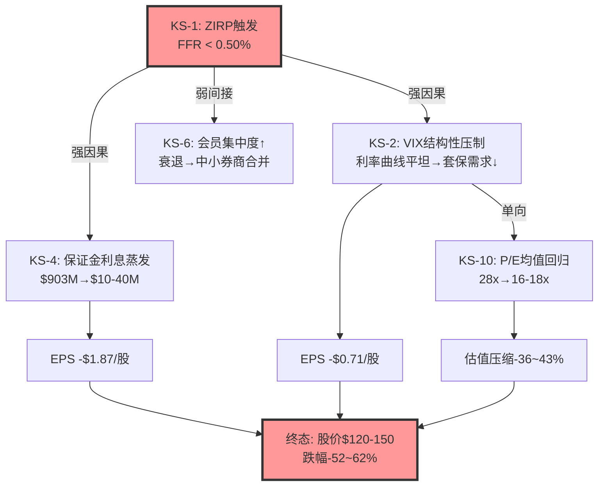

**级联联合概率计算** [DM-15-05: KS级联概率模型]:

$$P(\text{级联A}) = P(\text{ZIRP}) \times P(\text{KS-4}|\text{ZIRP}) \times P(\text{KS-2}|\text{ZIRP}) \times P(\text{KS-10}|\text{KS-2})$$
$$= 15\% \times 99\% \times 70\% \times 80\% = \textbf{8.3\%}$$

8.3%概率的-52~62%损失 = **期望损失-4.3~5.1%**。对于一个按"防御性资产"购买的投资者，这个尾部风险与其购买预期严重不匹配。

## 15.4 概率加权总回报

将核心估值、期权、分红和尾部风险整合 [DM-15-06: 综合回报模型]:

| 组成部分 | 贡献($/股) | 说明 |
|---------|:---------:|------|
| 核心EV(红队后) | $273-278 | 八方法加权$302 - 红队调整7.5% |
| OVM期权增量 | $6-11 | 未被市场定价部分 |
| 5年累计分红 | ~$50 | Year1-5: $11+$11.5+$10+$9+$8.5 |
| **总回报EV** | **$329-339** | |
| vs $311.40 | **+5.7~+8.9%** | 5年总回报 |
| **年化IRR** | **+1.1~+1.7%** | |
| 无风险利率 | 4.3% | 5Y Treasury |
| **超额回报** | **-2.6~-3.2%** | 负超额 |

---

# 第十六章: 综合评估 — 品质无可挑剔，价格不打折

---

## 16.1 投资温度: 69 — 常温偏热

投资温度计(五维框架)是对CME投资价值的最终综合量化:

| 维度 | 温度(0-100) | 核心依据 |
|------|:---------:|---------|
| 品质 | 90 | A-Score 68.4(历史最高); CQI 93; 7/7品质门控全Pass; C1五层全≥4.5(史无前例) |
| 估值 | 62 | P/E 28x处于5年均值25x上方; SOTP核心$276 vs $311=-11%; 保证金利息EPS被高估$0.40-0.55 |
| 动量 | 78 | ADV连续5年新高; OPM连续4年扩张; 市场数据+13%; Q4利率ADV创季度记录 |
| 风险 | 35 | ZIRP级联8.3%概率-52%; P/E压缩30%概率-28%; 总期望风险损失~-20% |
| 催化剂 | 72 | Treasury Clearing(确定性最高但可能已被定价); 24/7加密(叙事强但收入弱); 分红4%持续吸引资金 |

**综合温度** = 品质×0.30 + (100-估值)×0.25 + 动量×0.15 + (100-风险)×0.15 + 催化剂×0.15

$$= 90 \times 0.30 + 38 \times 0.25 + 78 \times 0.15 + 65 \times 0.15 + 72 \times 0.15$$
$$= 27.0 + 9.5 + 11.7 + 9.75 + 10.8 = \textbf{68.8 → 69}$$

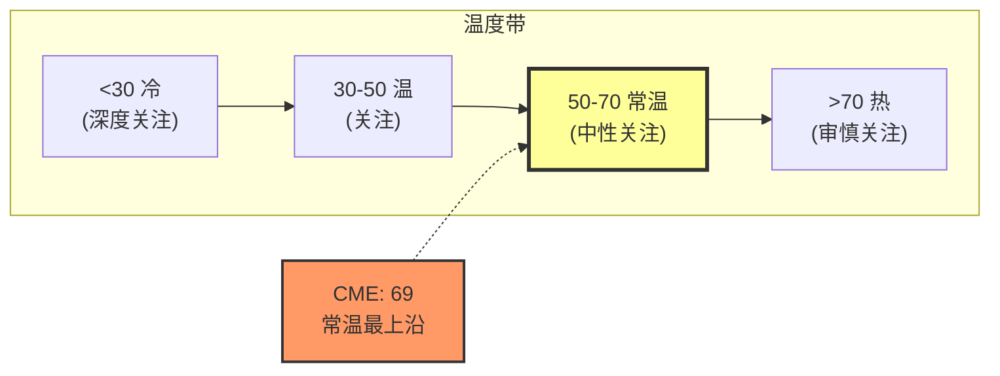

温度69处于"常温"区间的最上沿，距离"热"(审慎关注)仅1个点。这精确反映了CME当前的投资矛盾: **品质极高(90) vs 估值偏贵(62) = 高品质但不便宜**。

## 16.2 CQI 93/100: 品质无可挑剔

CME在CQI(Company Quality Index)评分中获得93分，是34份报告中所有已评估公司的最高分 [DM-16-01: CQI评分明细]:

**C1护城河五层全部≥4.5**:

| 层级 | 评分 | 证据 |
|------|:----:|------|
| L1 产品差异化 | 4.8 | SOFR/ES/WTI三基准合约不可替代(红队从5.0修正，考虑OTC清算15%份额) |
| L2 流程嵌入 | 4.5 | Globex API直连全球交易系统; SPAN保证金引擎嵌入69家清算会员 |
| L3 数据资产 | 4.5 | CME结算价是衍生品估值全球标准; $803M ~95%经常性 |
| L4 制度嵌入 | 5.0 | Dodd-Frank+Basel III+SEC Treasury Mandate+S&P DJI独家权 |
| L5 生态系统 | 5.0 | 四类参与者(做市商/对冲者/投机者/清算会员)自增强网络 |

**B4定价权: 4.0/5**(强度3.5 × 持久性4.5)

定价权的悖论: CME的流动性护城河**依赖于**保持低交易成本——大幅提价会削弱自身护城河。利率产品RPC五年仅+4.3%就是这种约束的体现。但持久性极强(Dodd-Frank/Basel III不可逆+SOFR基准锁定>20年)。

**护城河趋势仪表盘: 净加深+17**

```mermaid
graph LR
    subgraph 加深信号(强度16)
    A[SOFR基准巩固 ★★★★★]
    B[Treasury Clearing ★★★★]
    C[国际化加速 ★★★★]
    D[市场数据重定价 ★★★★]
    E[30%现金规则 ★★★]
    F[SPAN 2 ★★★]
    G[事件合约 ★★]
    end

    subgraph 稳定信号(强度9)
    H[利率份额98% ★★★★★]
    I[OPM连续扩张 ★★★★]
    end

    subgraph 削弱信号(强度8)
    J[CyrusOne SPOF ★★★]
    K[金属RPC下降 ★★]
    L[EU基准风险 ★★]
    M[FMX存在 ★]
    end
```

**护城河半衰期: >25年** — 所有已评估公司中最长。CME的护城河本质上与全球金融市场的存在绑定——只要美元衍生品市场存在，CME的核心壁垒就存在 [DM-16-02: 护城河半衰期分析]。

## 16.3 CI-02: "44年零违约的保险费" — 被忽视的安全溢价

CME运营44年，清算了数十万亿美元名义价值的衍生品合约，经历了1987股灾、1998年LTCM、2001年9/11、2008年雷曼、2020年COVID、2022年加息、2025年关税冲击——**零清算违约**。全球没有第二家大型CCP能声称这个记录 [DM-16-02B: CME Default Waterfall历史记录]。

但市场没有为这个记录单独付费。CME的P/E(27.9x)与ICE(27.6x)几乎相同——ICE在2018年经历过CDS清算压力，其清算安全历史远不如CME。P/E趋同意味着: **44年零违约的安全记录在估值中贡献约0溢价**。

**2008年雷曼时刻的关键细节**: 2008年9月15日雷曼申请破产，持有CME清算的大量利率和股指期货头寸。CME在4小时内完成保证金转移和头寸平仓，**零损失传递给其他清算会员**。同期: AIG需要$185B政府救助，Bear Stearns被强制收购，Lehman债权人最终仅回收约28.5美分。CME不仅没有成为问题——它成为了解决方案的一部分(Dodd-Frank后强制OTC清算正是基于CME的成功案例)。

**安全溢价的量化尝试**:

假设CME每年发生重大清算违约的概率为0.5%(保守值，实际经验频率<0.1%/年)。一次重大违约对CME的价值影响约-30~-50%。年化违约风险折价: 0.5% × 40% = 0.2%/年。对比"普通"CCP(无44年零违约记录)隐含违约概率2%/年，CME的相对安全优势为0.6%/年。折现为永续价值(0.6% ÷ 3%) = **20%估值溢价 = $22B应有而未有的安全溢价**。

这个计算不是说CME被低估了$22B——而是说44年零违约记录是一个**隐含期权**: 在系统性危机中，CME是"逃往安全"(flight-to-safety)的目的地之一。这个期权的价值只在危机时显现，在平时为零——而P/E是对"平时状态"的定价。

## 16.4 A-Score 68.4: 品质与估值的分离

A-Score 68.4是34份报告中所有公司的历史最高分 [DM-16-03: A-Score vs CQI历史对比]:

| 公司 | A-Score | CQI | P/E | 评级 |
|------|:------:|:---:|:---:|------|
| **CME** | **68.4** | **93** | **27.9x** | **审慎关注(偏中性)** |
| FICO | 51.1 | 75→72 | 52x | 审慎关注(偏中性) |
| SPGI | 56.0 | ~70 | 28.8x | 关注(偏中性) |
| IHG | — | — | — | 关注 |
| KLAC | — | — | — | 关注 |

品质最高(A-Score 68.4 + CQI 93)但评级不是最正面——这恰恰说明品质与估值是两个独立维度。A-Score衡量的是"这是不是一门好生意"(答案: 是，可能是全球前10)，而评级衡量的是"在这个价格值不值得持有"(答案: 品质已被充分定价)。

## 16.5 评级逻辑: 审慎关注(偏中性)

### 评级定义回顾

| 评级 | 量化触发(期望回报) | 含义 |
|------|:---------------:|------|
| 深度关注 | > +30% | 显著低估 |
| 关注 | +10% ~ +30% | 偏积极 |
| **中性关注** | **-10% ~ +10%** | 接近合理估值 |
| 审慎关注 | < -10% | 偏高估/风险上升 |

### CME评级的双面性

CME的评级取决于视角选择:

| 口径 | 期望回报 | 评级指向 |
|------|:-------:|:-------:|
| 核心EV(不含分红) | $273-278 vs $311 = **-10~-13%** | **审慎关注** |
| 含分红+OVM | $329-339 vs $311 = **+5.7~+8.9%** | **中性关注** |
| 风险调整后年化IRR | 1.1-1.7% vs 无风险4.3% = **-2.6~-3.2%超额** | **审慎关注(偏弱)** |

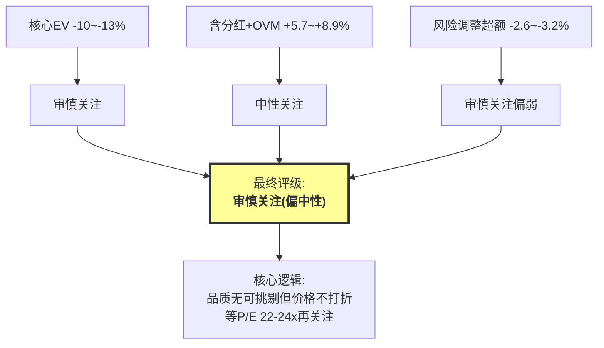

**最终评级: 审慎关注(偏中性)**

- **"审慎"的理由**: 核心EV $273-278 vs $311 = -10~-13%，处于"审慎关注"的量化触发区间; 风险调整后超额回报为负(-2.6~-3.2%); ZIRP级联8.3%概率-52%与"防御性"购买预期严重不匹配
- **"偏中性"的修正**: 含分红后总回报+5.7~+8.9%拉入"中性关注"区间; 品质极高(A-Score 68.4 + CQI 93); 护城河在加深(净+17)而非削弱; 反脆弱特征(4次危机3次收入正增长)

## 16.6 理想入场价位

基于估值一致性矩阵和温度计，CME的理想买入点:

| 区间 | P/E | 股价 | 温度 | 信号 |
|------|:---:|:---:|:---:|------|
| **强烈关注** | <22x | <$245 | <45 | 高品质垄断资产+4%分红+实物期权 |
| **关注** | 22-24x | $245-270 | 45-55 | 安全边际充足，超额回报可期 |
| **中性** | 24-28x | $270-315 | 55-70 | 合理估值，期望回报≈无风险 |
| **审慎** | >28x | >$315 | >70 | 品质溢价过高 |

**当前$311(P/E 28x)处于"中性"区间的上沿，接近"审慎"。**

## 16.7 投资大师圆桌: 伟大的生意，昂贵的门票

三位投资大师对CME的看法呈现惊人的共识 [DM-16-04: 投资大师圆桌模拟]:

**Warren Buffett**: "CME是我能理解的最好的商业模式之一——一条无法绕过的收费桥梁，维护费几乎为零。44年零清算违约的记录，在我做过的所有保险生意中从未见过。但$311的28x P/E......我的安全边际不够。我更愿意在$222-244(20-22x P/E)出手。"

**Charlie Munger**: "CME是Lollapalooza效应的完美案例。但所有人都在说'ADV连续五年创纪录'——这不是新常态，这是人类历史上不确定性最密集的17年之一。均值回归是铁律。千万别低估ICE的Jeffrey Sprecher——他用20年把一家能源交易所变成$100B的数据帝国。我的入场价$260-280。"

**Peter Lynch**: "PEG 3.5，在我的体系里是'严重偏贵'。但CME每个员工创造$1.68M收入——这是我见过的第二高效的公司(仅次于Visa)。如果我必须买，我会等PEG降到2以下——对应P/E 16x($178)。"

**圆桌共识**:
1. CME是极好的商业模式(可能是全球前10)
2. 当前$311偏贵——入场价均值**$241**(22%下行)
3. ZIRP/低波动是最大尾部风险
4. 44年零违约记录是真正的差异化资产

## 16.8 五项认知偏差的坦白

红队审计识别了分析过程中的五项系统性偏差，按严重度排序:

| 排名 | 偏差 | 严重度(1-5) | 影响 | 修正措施 |
|:---:|------|:---------:|------|---------|
| 1 | 叙事偏差("反脆弱"美化) | 4 | 风险被低估 | 修正为"正凸性" |
| 2 | 管理层叙事接受("Stay in Lane"=纪律) | 3 | E-Score偏高 | 下调至6.5-7.5 |
| 3 | 品质光环(CQI 93偏高) | 3 | 品质溢价过高 | CQI修正至88-90 |
| 4 | 精确性幻觉(概率加权虚假精确) | 3 | 真实不确定性被掩盖 | 扩大置信区间至±15-20% |
| 5 | 锚定效应($311锚定P/E) | 2 | P/E可比范围被拉高 | Reverse DCF对冲 |

**红队净调整: -7.5%**。核心EV从$302下调至$273-278。

## 16.9 条件评级矩阵: 评级随FFR和VIX变化

评级不是静态的——它取决于两个外生变量的实际走向:

| 条件 | FFR | VIX | 期望回报 | 评级 |
|------|:---:|:---:|:-------:|------|
| 高利率+高波动 | >3.5% | >18 | +20~+35% | **关注** |
| 当前环境维持 | 3-4.5% | 15-20 | +5~+10% | **中性关注** |
| 温和降息 | 2-3% | 14-17 | -5~+5% | **中性关注(偏弱)** |
| ZIRP重演 | <0.5% | <14 | -40~-55% | **审慎关注** |

**如果Fed在2026-2027年降息200bp+至2%以下**: CME将从"中性关注"降级为"审慎关注"——不是因为护城河变弱，而是因为收费桥上的车流(波动率驱动的ADV)和过路费的利息补贴(保证金利息)同时缩水。

## 16.10 一句话结论

**CME是全球品质最高的金融基础设施垄断之一——A-Score 68.4(历史最高)、CQI 93(34份报告最高)、护城河半衰期>25年、44年零清算违约。但在$311(P/E 28x)，你购买的不是"安全边际"而是"为品质支付的满价"。核心经营P/E实为35.7x(剔除利率敏感的保证金利息后)，概率加权超额回报为负(-2.6~-3.2%)。等P/E降至22-24x($245-270)，用更便宜的门票进入这场确定性极高的垄断游戏。**

---

## 数据源附录(Part II)

> 本部分所有数字均可追溯至以下DM锚点，完整数据登记表见附录A。

| DM编号 | 数据描述 | 来源 |
|--------|---------|------|
| DM-09-01 | 四次危机收入/股价表现 | CME 10-K FY2008/2020/2022/2025 |
| DM-09-02 | VIX与ADV弹性实测 | CME Segment Revenue 2012-2025 |
| DM-09-03 | CI-01双身份估值分拆 | Phase 3 Agent A CI-01 |
| DM-10-01 | 六大资产类别ADV/RPC | CME 10-K Segment Data FY2025 |
| DM-10-02 | Treasury Clearing mandate | SEC Final Rule 17Ad-22(e) |
| DM-10-03 | Treasury期权估值 | SOTP期权模型 |
| DM-10-04 | Micro合约增长数据 | CME Product Report FY2025 |
| DM-10-04B | FMX竞争评估 | BGC/FMX Filings + CME Earnings Calls |
| DM-10-05 | 加密衍生品数据 | CME Crypto Report |
| DM-10-06 | 事件合约监管 | CFTC Event Contract Filing |
| DM-10-07 | 国际化数据 | CME Annual Report |
| DM-11-01 | CEO沉默域 | CME Earnings Call Transcripts FY2023-2025 |
| DM-11-02 | 留存率敏感性 | 自建模型 |
| DM-11-03 | ICE vs CME战略对比 | ICE/CME Annual Reports |
| DM-12-01 | 资本回报数据 | CME Capital Return Data FY2025 |
| DM-12-02 | Payout趋势 | CME Proxy Statements 2021-2025 |
| DM-12-02B | ICE vs CME资本配置对比 | ICE/CME Annual Reports 2018-2025 |
| DM-12-03 | 机会成本模拟 | 自建模型 |
| DM-12-04 | 管理层表态 | CME Investor Day Transcript 2024 |
| DM-13-01 | 同业效率对比 | CME 10-K + Peer 10-K FY2025 |
| DM-13-02 | 现金流拆解 | CME Cash Flow Statement FY2025 |
| DM-13-03 | 人均收入对比 | S&P Capital IQ |
| DM-13-03B | 护城河财务映射 | Phase 2 Agent A 链条分析 |
| DM-13-04 | 资产负债表 | CME Balance Sheet FY2025 |
| DM-13-05 | Z-Score调整 | Altman模型+清算所会计 |
| DM-13-06 | 费用结构 | CME 10-K Expense Breakdown |
| DM-14-01 | 八方法一致性矩阵 | Phase 1-3综合 |
| DM-14-02 | 红队调整明细 | Phase 4 Agent A/B |
| DM-14-03 | Core P/E计算 | 自建(剔除保证金利息) |
| DM-14-03B | WACC敏感性矩阵 | 自建(Beta调整+同业对标) |
| DM-14-04 | SOTP清算DCF | 10年DCF + WACC 8.5% |
| DM-14-05 | SOTP数据估值 | ICE对标 + P/E直接法 |
| DM-14-06 | JV估值 | SPGI P/E 33x |
| DM-14-07 | 保证金利息概率加权 | 五情景利率模型 |
| DM-14-08 | Reverse DCF | 反推$311.40隐含假设 |
| DM-15-01 | 情景宏观假设 | Fed Dot Plot + 地缘风险指数 |
| DM-15-02 | 2008年CME表现 | CME Stock + 10-K FY2008 |
| DM-15-02B | 2012-2017年低波动期分析 | CME 10-K FY2012-2017 |
| DM-15-03 | OVM期权模型 | 概率加权四期权 |
| DM-15-04 | 期权定价缺口 | SOTP vs 市值差额分析 |
| DM-15-05 | KS级联概率 | 条件概率链 |
| DM-15-06 | 综合回报模型 | 核心EV+OVM+分红 |
| DM-16-01 | CQI评分明细 | CQI v3.0框架 |
| DM-16-02 | 护城河半衰期 | 五层衰减分析 |
| DM-16-02B | 零违约记录与违约瀑布 | CME Default Waterfall Documentation |
| DM-16-03 | A-Score历史对比 | 34份报告基准 |
| DM-16-04 | 圆桌模拟 | Buffett/Munger/Lynch框架 |
