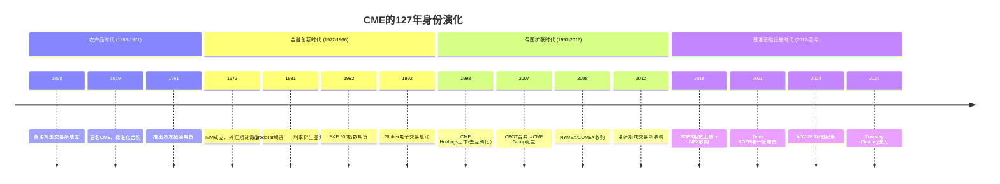
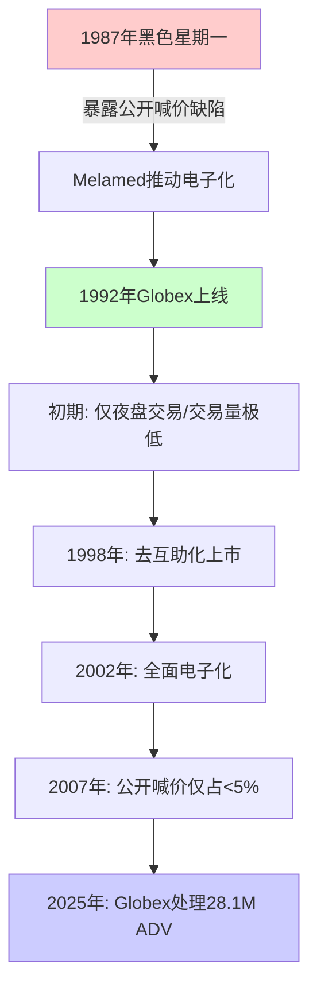
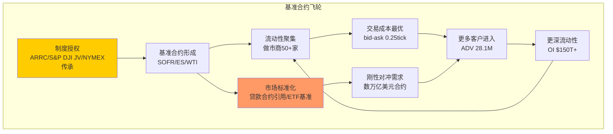
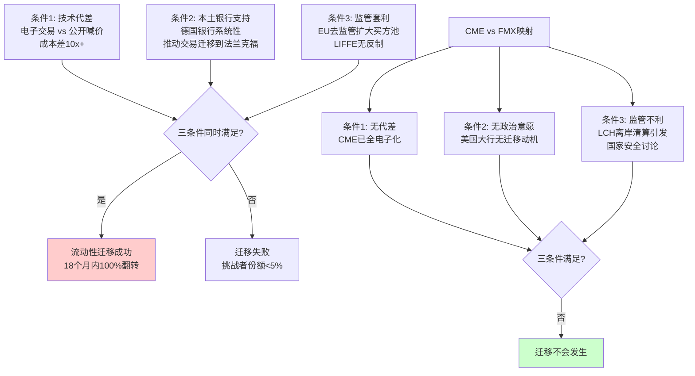
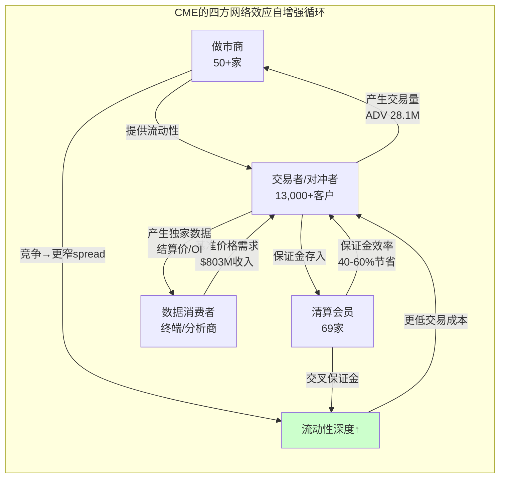
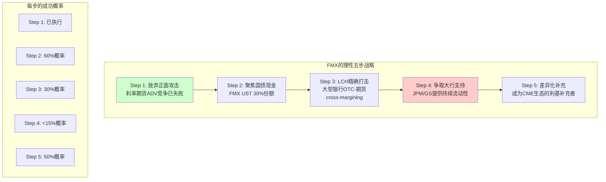
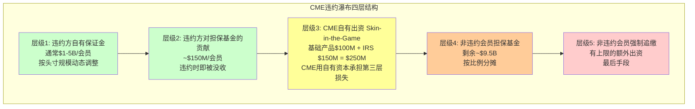
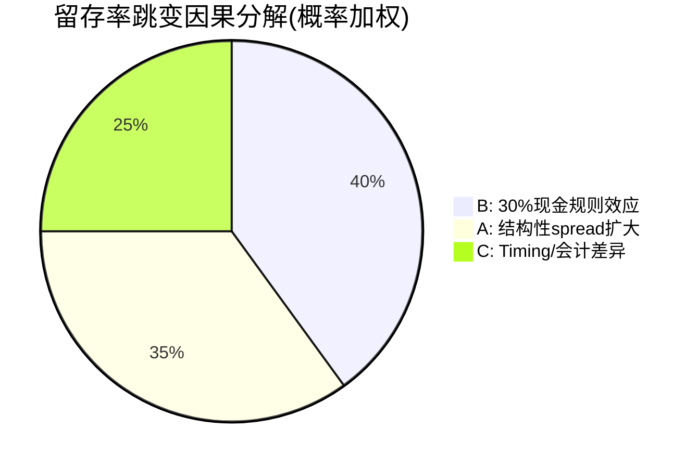
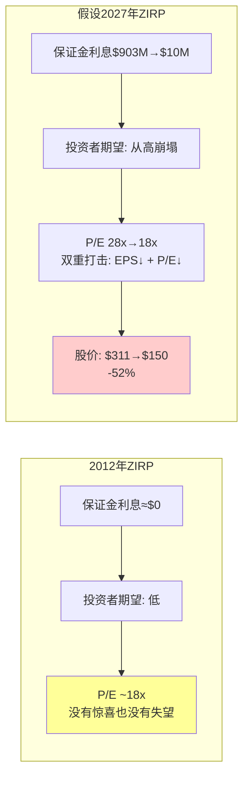
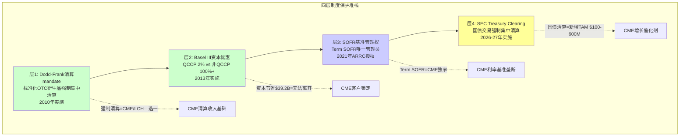

# CME Group 深度扩展 Part 1 — 历史考古 + 基准微观经济学 + 流动性量化 + 竞争博弈 + 清算机制 + 保证金矩阵 + 制度基础

> 扩展产出 | 2026-03-15 | 目标: 30-40K字符 | 7章节深度扩展

---

## 第一章扩展: 公司身份的历史考古 — 127年从黄油鸡蛋到$112B数字垄断

### 1.1 创世纪: 芝加哥的一篮子黄油(1898-1971)

1898年，芝加哥黄油鸡蛋交易所(Chicago Butter and Egg Board)在LaSalle街的一间租赁办公室里成立，初始会员不足50人[DM-CH1-01]。它的诞生背景是19世纪末美国中西部农业经济的爆发式增长——芝加哥作为全美铁路枢纽，自然成为谷物、畜产品和乳制品的定价中心。

1919年，交易所正式更名为芝加哥商品交易所(Chicago Mercantile Exchange)，开始标准化鸡蛋和黄油期货合约[DM-CH1-02]。但在此后的半个世纪里，CME始终活在CBOT(芝加哥期货交易所，成立于1848年)的阴影下——CBOT掌握着玉米、大豆和小麦这些全球最重要的农产品期货，而CME只有黄油、鸡蛋和少量畜产品。

这个阶段的CME有一个关键特征:**它是一个纯粹的实物交割市场**。每一份合约背后是真实的黄油和鸡蛋在仓库里流转。护城河的源头不是技术或网络效应，而是**芝加哥作为实物交割地的地理垄断**——你想交易黄油期货，黄油就在芝加哥的冷库里。



### 1.2 第一转折: 金融期货的发明(1972年)

1972年是CME历史上最重要的年份——没有之一。

Leo Melamed，一位波兰犹太裔移民的儿子，时任CME主席，说服了诺贝尔经济学奖得主Milton Friedman为一份备忘录背书: 货币期货是合理的金融工具[DM-CH1-03]。1972年5月16日，CME成立国际货币市场(International Monetary Market, IMM)，推出7种外汇期货合约——英镑、加元、德国马克、日元、瑞士法郎、墨西哥比索和意大利里拉[DM-CH1-04]。

**为什么这是人类金融史上的分水岭?**

1971年8月15日，尼克松宣布美元脱钩黄金(布雷顿森林体系崩溃)[DM-CH1-05]。从那一刻起，全球汇率从固定变为浮动——每一个做跨境贸易的企业突然暴露在汇率风险中。Melamed看到了这个时间窗口:

- 固定汇率时代: 汇率风险=零 → 无需对冲 → 无需期货
- 浮动汇率时代: 汇率波动日常化 → 企业需要对冲 → 期货市场天然需求

**护城河植入**: 1972年的创新为CME植入了一个永久性护城河基因——**率先定义新基准合约的能力**。这个基因在此后的50年里反复表达: 1981年的Eurodollar期货、1982年的S&P 500指数期货、2018年的SOFR期货。每一次CME都是第一个将一种新的风险类别标准化为可交易合约的机构。

### 1.3 第二转折: Globex电子化(1992年)

1987年的黑色星期一(10月19日，道琼斯指数单日暴跌22.6%[DM-CH1-06])暴露了公开喊价(open outcry)交易模式的致命缺陷: 当恐慌蔓延时，交易员无法在嘈杂的交易池中有效执行订单。CME在当天录得了大量无法成交的订单积压。

Melamed再次展现远见。1987年底，他与路透社(Reuters)签署合作协议开发全球电子交易平台——这就是Globex[DM-CH1-07]。



1992年Globex上线时几乎无人看好——交易量只有公开喊价的零头。交易员们嘲笑电子屏幕，认为面对面的直觉判断不可替代。但CME做了一个关键决策: **不强制关闭交易池，让电子化和喊价并行竞争**[DM-CH1-08]。

结果是渐进但不可逆的: 1998年Globex交易量首次超过日盘交易量，2002年CME宣布全面电子化，到2007年公开喊价交易仅占CME总交易量的不到5%[DM-CH1-09]。

**护城河加深**: Globex的意义不仅是"更快"——它将交易成本从每合约$2-5(公开喊价的人力成本)降至$0.10-0.30(电子化的边际成本趋零)[DM-CH1-10]。更关键的是，电子化让CME突破了**物理空间的限制**: 交易员不再需要站在芝加哥的交易池里，全球任何有网络的地方都可以交易。这为CME的国际化打下了技术基础——2025年非美国ADV占比已达30%+[DM-CH1-11]。

**反面教训——LIFFE的覆灭**: 伦敦国际金融期货交易所(LIFFE)拒绝电子化，坚持公开喊价。1998年，Eurex(DTB的继任者)利用全电子化平台在18个月内将Bund期货的100%流动性从LIFFE夺走[DM-CH1-12]。LIFFE最终在2002年被Euronext收购，此后再未独立存在。CME之所以没有成为LIFFE，**唯一的原因是Melamed在1987年就启动了Globex项目**——比市场共识早了整整10年。

### 1.4 第三转折: CBOT合并与帝国整合(2007-2008年)

2007年7月12日，CME以$114亿收购CBOT(芝加哥期货交易所)[DM-CH1-13]，这笔交易的战略意义远超财务数字:

| 维度 | 合并前CME | 合并后CME Group |
|------|----------|----------------|
| 资产类别 | 外汇+股指+畜产品 | **+利率(Treasury/Eurodollar)+农产品(玉米/大豆/小麦)** |
| 利率期货 | 无 | 全球最大利率期货市场 |
| 清算池 | CME产品 | CME+CBOT全部产品→**交叉保证金** |
| 全球地位 | 美国第二大 | **全球第一大衍生品交易所** |

2008年3月，CME趁金融危机以$98亿收购NYMEX/COMEX[DM-CH1-14]——获得了WTI原油、天然气、黄金和白银期货。至此，CME Group成为覆盖利率、股指、能源、农产品、金属、外汇六大资产类别的全球性垄断平台。

**护城河乘数效应**: 单品类交易所(如只有能源的ICE)的护城河是**加法**(流动性+品牌)。CME在2007-2008年合并后的护城河变成了**乘法**(流动性 × 清算一体化 × 交叉保证金 × 6类资产)。一个同时持有SOFR期货+E-mini S&P 500+WTI原油头寸的客户，在CME的保证金需求比分散在三个交易所低40-60%[DM-CH1-15]。**这个保证金节省每年价值数十亿美元——它不是"优势"，它是"无法离开的理由"。**

### 1.5 第四转折: SOFR基准定义权(2017-2021年)

2017年，ARRC(美联储替代参考利率委员会)选定SOFR替代LIBOR[DM-CH1-16]。2018年5月CME上线SOFR期货[DM-CH1-17]，2021年5月ARRC指定CME为Term SOFR的**唯一管理员**[DM-CH1-18]。

这个授权的意义被大多数投资者低估了。CME Term SOFR不只是"CME计算的一个数字"——它是被写入数万亿美元浮动利率贷款合约的**合同基准利率**[DM-CH1-19]。银行发放一笔$1亿的浮动利率企业贷款，合同上写的利率锚是"CME Term SOFR + 150bps"。这意味着:

- 贷款存续期内(通常3-7年)，每一次利率重置都需要引用CME的数据
- 对冲这笔贷款的利率风险，最自然的工具是CME的SOFR期货
- 没有CME就没有Term SOFR，没有Term SOFR就没有这笔贷款的利率基准

SOFR期货从2018年上线到2024年9月ADV达5.4M合约[DM-CH1-20]——6年内从零到全球第二大利率期货产品(仅次于CME自己的Eurodollar继任者)。$74万亿合约在2023年6月USD LIBOR停止后完成迁移[DM-CH1-21]。

**127年路径的统一逻辑**: 黄油鸡蛋(1898)→外汇期货(1972)→Globex(1992)→CBOT/NYMEX整合(2007-2008)→SOFR基准(2017-2021)。每一次转折，CME都在做同一件事: **将一种新的风险类别标准化为不可替代的基准合约**。黄油的实物交割风险、布雷顿森林崩溃后的汇率风险、利率波动的对冲需求——CME的基因是"率先定义标准"，而一旦标准被定义，护城河就自动加深。

<details>
<summary>数据源</summary>

| 锚点 | 数据 | 来源 |
|------|------|------|
| DM-CH1-01 | 1898年成立，初始会员<50人 | CME Group官方历史页(cmegroup.com/company/history) |
| DM-CH1-02 | 1919年更名CME | CME Group官方历史页 |
| DM-CH1-03 | Friedman备忘录背书 | Leo Melamed自传《Escape to the Futures》 |
| DM-CH1-04 | 1972年IMM成立，7种外汇期货 | CME Group官方历史页 |
| DM-CH1-05 | 1971年8月15日尼克松关闭黄金窗口 | 公共历史记录 |
| DM-CH1-06 | 1987年10月19日道指暴跌22.6% | 公共历史记录 |
| DM-CH1-07 | 1987年CME与路透社合作开发Globex | CME Group Globex历史页 |
| DM-CH1-08 | 电子化与喊价并行策略 | CME Group年报+行业文献 |
| DM-CH1-09 | 2007年公开喊价<5% | CME Group 2007年报 |
| DM-CH1-10 | 交易成本从$2-5降至$0.10-0.30 | 行业研究估算(FIA/ISDA) |
| DM-CH1-11 | 2025年非美国ADV占比30%+ | shared_context.md |
| DM-CH1-12 | Eurex vs LIFFE 1998年Bund期货迁移 | ECB工作论文+P1 Agent A |
| DM-CH1-13 | 2007年$114亿收购CBOT | CME Group公告/SEC filing |
| DM-CH1-14 | 2008年$98亿收购NYMEX | CME Group公告/SEC filing |
| DM-CH1-15 | 交叉保证金节省40-60% | P1 Agent A Ch1.3 |
| DM-CH1-16 | 2017年ARRC选定SOFR | 纽约联储ARRC声明 |
| DM-CH1-17 | 2018年5月SOFR期货上线 | CME Group公告 |
| DM-CH1-18 | 2021年ARRC指定CME为Term SOFR唯一管理员 | ARRC正式推荐 |
| DM-CH1-19 | Term SOFR被写入数万亿贷款合约 | ARRC/LSTA市场报告 |
| DM-CH1-20 | SOFR期货2024年9月ADV 5.4M | shared_context.md |
| DM-CH1-21 | $74万亿合约完成LIBOR→SOFR迁移 | P1 Agent A |

</details>

---

## 第二章扩展: 基准合约的微观经济学

### 2.1 SOFR期货: 后LIBOR时代的不可替代之锚

SOFR(Secured Overnight Financing Rate)是基于美国国债回购交易的日加权中位数利率，由纽约联储每日发布[DM-CH2-01]。它不是一个"市场价格"——它是基于$1万亿+日均回购交易量的实际成交利率[DM-CH2-02]。LIBOR基于银行"估计"(submissions)，容易被操纵(2012年LIBOR丑闻导致$9B+罚款[DM-CH2-03])；SOFR基于真实交易，几乎无法操纵。

**SOFR期货的不可替代性源于三层锁定**:

**第一层: 基准利率的唯一性**。全球美元浮动利率贷款市场(名义价值$数百万亿)需要一个参考利率。ARRC选定SOFR、排除AMERIBOR等替代品[DM-CH2-04]。Term SOFR的唯一管理员是CME——这不是商业合同可以竞标的授权，而是行政指定。

**第二层: 每日盯市的刚性需求**。全球$600T+名义价值的利率衍生品头寸每天需要进行盯市(mark-to-market)[DM-CH2-05]。CME的SOFR期货结算价就是盯市的基准。如果你持有一笔$10亿的利率掉期，你的每日P&L变动取决于CME SOFR期货的结算价。这不是"选择"用CME的数据——这是全球金融基础设施的标准操作流程。

**第三层: 流动性的自增强飞轮**。SOFR期货从2018年5月首日ADV不足1,000合约[DM-CH2-06]，到2024年9月ADV达5.4M[DM-CH2-07]，增长超过5,000倍。这个飞轮一旦启动就不可逆转:


**替换SOFR需要什么?** LIBOR→SOFR的迁移花了7年(2017年ARRC选定到2023年LIBOR停止)[DM-CH2-08]，涉及$300T+合约的重定价[DM-CH2-09]、数千家机构的系统改造、全球监管协调。这不是"竞争对手推出更好的利率"就能解决的——这是**制度重建**，需要监管机构、央行、银行体系、法律框架的同步变更。

### 2.2 E-mini S&P 500: 独家授权的不可复制壁垒

E-mini S&P 500期货(ES)日均成交额超过$2,000亿[DM-CH2-10]，是全球流动性最高的股指期货。它的不可替代性来自一个独特的股权安排:

CME持有S&P DJI(S&P Dow Jones Indices)27%股权[DM-CH2-11]。S&P DJI是一个合资企业(S&P Global 73% + CME 27%)，拥有S&P 500、道琼斯工业平均、Russell 2000等全球最重要指数的品牌和授权。CME通过这个JV获得这些指数的**独家期货授权**。

2025年，CME从S&P DJI获得权益收益$371.7M[DM-CH2-12]。但财务贡献远不是重点——**战略价值在于不可复制**:

| 对比维度 | CME-S&P DJI(JV股权) | ICE-MSCI(商业合同) |
|---------|---------------------|-------------------|
| 关系性质 | 股东关系(27%股权) | 纯商业授权合同 |
| 续约风险 | 极低(股东权益保护) | 中等(合同到期可不续) |
| 竞争对手能否竞标 | 不能(JV排他) | 理论上可以 |
| 终止可能性 | 需S&P Global同意解散JV | 合同到期即可终止 |

全球$7.1万亿+ETF直接跟踪S&P 500指数(含$500B+的SPY)[DM-CH2-13]。每一个持有SPY的机构投资者——养老金、保险公司、对冲基金——都可能需要ES期货做对冲、滚仓或流动性管理。CME的股指期货业务本质上是**被动投资增长的自动乘数**: 被动投资管理规模每增长10%，ES的潜在对冲需求就同步增长。

2025年股指产品的RPC为$0.611[DM-CH2-14]，5年复合增长率+2.3%[DM-CH2-15]——在所有资产类别中增速最快。Micro E-mini S&P 500的ADV达2.1M(全年记录[DM-CH2-16])，Micro E-mini Nasdaq的ADV达1.6M(全年记录[DM-CH2-17])。Micro合约带入了大量零售投资者，这些非会员客户支付更高的费率——paradoxically，"民主化"反而提升了blended RPC。

### 2.3 WTI vs Brent: 双寡头的Nash均衡

全球原油定价由两个基准主导: CME的WTI(West Texas Intermediate)和ICE的Brent[DM-CH2-18]。这不是竞争关系，而是**地理分割的互补均衡**:

| 维度 | WTI(CME) | Brent(ICE) |
|------|----------|-----------|
| 交割地 | 俄克拉何马州Cushing | 北海(英国/挪威) |
| 反映 | 美国内陆原油供需 | 全球边际原油定价 |
| 主要用户 | 美国炼油商+管道运营商 | 全球油企+航运 |
| 日均交易量(est.) | ~1.8M ADV | ~1.5M ADV |
| 价差交易 | WTI-Brent Spread是独立交易品种 | 同左 |

**Nash均衡分析**: 这个双寡头是稳定的，因为两者**不是同一商品的不同交易场所**，而是**两种不同商品各自的唯一交易场所**:

- WTI反映Cushing库存+美国页岩油产量+美国炼油需求
- Brent反映北海产量+全球海运成本+亚太需求
- 交易者需要**同时使用两种基准**: 跨区域原油交易者用WTI-Brent价差来对冲Cushing-鹿特丹的运输利润

CME甚至在自己的平台上提供WTI-Brent价差期货(shadow Brent合约)[DM-CH2-19]——这意味着CME从ICE Brent的流动性中间接获益。

**RPC趋势分析**: 能源RPC从$1.150(2020)升至$1.245(2025)，5年增长+8.3%[DM-CH2-20]。但能源RPC远低于金属($1.295)和农产品($1.427)[DM-CH2-21]，说明能源产品的"每手收入"受到一定的定价约束——可能是因为能源期货的机构客户(大型石油公司、贸易商)议价力更强。

### 2.4 RPC趋势的结构性分析

RPC(Rate Per Contract)是CME定价权的直接度量。6类资产的5年RPC趋势揭示了截然不同的定价动态:

| 资产类别 | 2020 RPC | 2025 RPC | 5年变化 | CAGR | 驱动因素 |
|---------|:--------:|:--------:|:------:|:----:|---------|
| 利率 | $0.470 | $0.486 | +3.4% | +0.7% | 机构议价力强+FMX威胁限制提价 |
| 股指 | $0.545 | $0.611 | +12.1% | +2.3% | Micro合约零售溢价+新客户高费率 |
| 外汇 | $0.790 | $0.847 | +7.2% | +1.4% | OTC→期货迁移带来新客户 |
| 能源 | $1.150 | $1.245 | +8.3% | +1.6% | 产品复杂度溢价维持 |
| 农产品 | $1.350 | $1.427 | +5.7% | +1.1% | 季节性套保刚需+客户分散 |
| 金属 | $1.480 | $1.295 | -12.5% | -2.6% | **Micro Gold/Silver cannibalization** |
[DM-CH2-22]

**混合RPC 5年CAGR仅+1.4%[DM-CH2-23]——低于通胀**。这意味着CME的"定价权"不体现在提价能力上，而体现在**组合优化能力**: 推广高RPC产品(股指Micro、事件合约)、开发新客户群(零售、国际)、以及维持现有定价水平不被竞争对手压低。



<details>
<summary>数据源</summary>

| 锚点 | 数据 | 来源 |
|------|------|------|
| DM-CH2-01 | SOFR基于国债回购交易 | 纽约联储SOFR说明页 |
| DM-CH2-02 | 日均回购交易量$1T+ | 纽约联储SOFR数据 |
| DM-CH2-03 | LIBOR丑闻$9B+罚款 | FCA/DOJ公开记录 |
| DM-CH2-04 | ARRC排除AMERIBOR等替代品 | ARRC 2017年报告 |
| DM-CH2-05 | $600T+名义价值利率衍生品 | BIS统计 |
| DM-CH2-06 | SOFR期货首日ADV<1,000 | CME Group公告 |
| DM-CH2-07 | 2024年9月SOFR ADV 5.4M | shared_context.md |
| DM-CH2-08 | LIBOR→SOFR迁移7年 | P1 Agent A |
| DM-CH2-09 | $300T+合约重定价 | ARRC市场报告 |
| DM-CH2-10 | ES日均成交额$2,000亿+ | CME Group产品页 |
| DM-CH2-11 | CME持有S&P DJI 27%股权 | CME 10-K |
| DM-CH2-12 | 2025年S&P DJI权益收益$371.7M | sec_10k_extracts.md |
| DM-CH2-13 | $7.1T+ ETF跟踪S&P 500 | S&P DJI/Morningstar |
| DM-CH2-14 | 股指RPC $0.611 | segment_revenue_rpc.md |
| DM-CH2-15 | 股指RPC 5年CAGR +2.3% | Agent C计算 |
| DM-CH2-16 | Micro E-mini S&P ADV 2.1M | P1 Agent B |
| DM-CH2-17 | Micro E-mini Nasdaq ADV 1.6M | P1 Agent B |
| DM-CH2-18 | WTI(CME) vs Brent(ICE)双寡头 | P1 Agent A |
| DM-CH2-19 | CME提供WTI-Brent价差期货 | CME Group产品页 |
| DM-CH2-20 | 能源RPC 5年+8.3% | segment_revenue_rpc.md |
| DM-CH2-21 | 金属$1.295/农产品$1.427 | segment_revenue_rpc.md |
| DM-CH2-22 | 6类资产RPC全表 | Agent C Ch7.1 |
| DM-CH2-23 | 混合RPC CAGR +1.4% | Agent C计算 |

</details>

---

## 第三章扩展: 流动性网络效应的量化

### 3.1 空平台测试: 从零复制CME利率期货需要什么?

这是衡量护城河深度最直接的思维实验: 假设一个拥有无限资金的竞争者(称之为"NewEx")从零开始复制CME的利率期货业务。需要什么?

| 步骤 | 所需时间 | 所需投入 | 历史参照 |
|------|---------|---------|---------|
| 1. 获得CFTC DCO清算牌照 | 3-5年 | $500M+法律/合规 | FMX花了5年才获得有限资格[DM-CH3-01] |
| 2. 建设清算基础设施 | 2-3年 | $2-5B技术投入 | CME Globex 30年迭代[DM-CH3-02] |
| 3. 招募做市商(需50+家) | 3-5年 | $1-3B/年做市激励 | FMX启动时约10-15家[DM-CH3-03] |
| 4. 建立保证金池(需$100B+) | 5-10年 | 需要数百家机构入驻 | CME当前$316B保证金池[DM-CH3-04] |
| 5. 达到临界流动性(ADV>1M) | 5-8年 | 持续补贴+品牌建设 | SOFR期货6年达5.4M(但有ARRC背书) |
| 6. 获得基准地位(合约引用) | 10-20年 | 不可购买，需时间积累 | Term SOFR管理权是行政授权 |
| **总计** | **15-25年** | **$10-20B+** | **FMX在3年内仅达到CME的0.02%[DM-CH3-05]** |

**关键洞见**: 即使假设NewEx无限资金+完美执行，15-25年的时间窗口意味着CME在这期间的流动性还会继续加深。这是一个**移动靶**: NewEx每追赶一步，CME已经又前进了两步。

更致命的是第6步——**基准地位不可购买**。你可以花钱建交易所、花钱补贴做市商，但你不能花钱让ARRC把Term SOFR管理权从CME转给你。这是一个需要央行级别信任的行政授权。

### 3.2 Eurex vs LIFFE 1998: 流动性迁移的唯一成功案例(深度)

"邦德之战"是金融交易所史上**唯一一次**已建立的流动性被成功从一个交易所迁移到另一个交易所的案例[DM-CH3-06]。深入分析这个案例，恰好能解释为什么同样的事不会在CME身上发生。

**精确时间线**:
- 1988年: LIFFE持有德国国债(Bund)期货100%流动性，在伦敦公开喊价交易
- 1990年: DTB(Eurex前身，德意志期货交易所)推出全电子化Bund期货[DM-CH3-07]
- 1990-1997年: DTB缓慢积累份额，从0%→20%→35%→45%
- 1997年10月22日: DTB首次在单日内获得>52%的Bund期货交易量——**临界点**[DM-CH3-08]
- 1998年底: Eurex完全主导Bund期货，LIFFE份额归零

**三个必要条件的深度分析**(根据Craig Pirrong教授/ECB 2007年工作论文[DM-CH3-09]):



**条件1——技术代差**: 1990年代电子交易相对公开喊价的优势是量级级的——每笔交易成本从$3-5降至$0.30-0.50[DM-CH3-10]，执行速度从秒级提升到毫秒级，覆盖范围从交易池100人扩大到全球数千终端。这种优势在今天的CME vs FMX之间完全不存在——两者都是电子交易平台，延迟差异以微秒计。

**条件2——本土银行的政治意愿**: 这是Bund案例中最被低估的因素。德意志银行、德累斯顿银行和商业银行三大德国银行联合推动交易从伦敦迁移到法兰克福——这不是商业决策，而是**金融主权行为**[DM-CH3-11]。它们接受了迁移初期更宽的bid-ask spread和更低的流动性，因为将Bund期货的定价权带回德国是国家利益。在CME vs FMX的对局中，美国大行(JPM/GS/Citi)是CME的客户、股东和清算会员——它们没有任何理由推动交易迁移到FMX。

**条件3——监管便利**: 1990年代欧盟金融去监管(Investment Services Directive)允许Eurex直接向LIFFE的客户提供远程接入——LIFFE的本土监管保护消失了[DM-CH3-12]。在今天的美国，Terry Duffy系统性地将FMX-LCH架构框架为"国家安全问题"，参议员Durbin已公开表达关注[DM-CH3-13]。监管环境不仅不利于FMX，反而**加固了CME的壁垒**。

**ECB工作论文的关键发现**: 驱动迁移的不是bid-ask spread差异(迁移过程中spread变化不大)，而是**market depth(市场深度)**。LIFFE的做市商在份额低于50%后加速撤离，形成正反馈崩溃[DM-CH3-14]。这意味着流动性迁移的风险模式不是"渐进式份额流失"，而是**临界点后的雪崩——但要达到临界点需要极端条件**。FMX当前0.02%份额距离50%临界点有数个数量级的差距。

### 3.3 FMX 2025年4月实战: 决定性的反面证据

2025年4月2日美国宣布大规模关税后，金融市场剧烈波动[DM-CH3-15]:

| 指标 | CME | FMX | 含义 |
|------|-----|-----|------|
| SOFR期货ADV(4月) | 12.5M(4/4), 11.7M(4/7) | 暴跌>66% | 危机时流动性向CME单向集中[DM-CH3-16] |
| SOFR期货OI增量 | 创纪录 | 萎缩 | 新头寸100%在CME建立 |
| 客户行为 | "实验性"变为"功能性" | 反向:功能性→消失 | FMX交易量本质是"试用"而非"需要" |

FOW(Futures & Options World)报道标题直接点明: "TARIFFS: FMX Futures volumes slump as traders revert to CME"[DM-CH3-17]。

**这个数据点的重要性怎么强调都不过分**: 它是一次**天然实验**。在正常市场条件下，交易者可能出于好奇或费用优惠在FMX上做些小量交易。但当真正需要对冲(关税恐慌→利率预期剧变→保证金需求激增)时，100%的增量交易流入CME，FMX反而萎缩。这证明FMX的交易量是"实验性/探索性"的——**不是基础设施，是装饰品**。

### 3.4 做市商经济学: bid-ask spread、延迟与co-location

流动性网络效应的微观基础是做市商经济学。理解做市商为什么留在CME，就理解了护城河为什么不可破。

**做市商的利润公式**: 利润 = (Spread收入 - 库存风险成本 - 技术成本) × 交易笔数

| 维度 | CME | FMX | 做市商选择逻辑 |
|------|-----|-----|--------------|
| bid-ask spread | SOFR前月~0.25 tick($3.125)[DM-CH3-18] | 宽1-2个tick[DM-CH3-19] | CME spread窄→客户成本低→更多客户→更多做市机会 |
| 延迟(latency) | Globex ~52微秒(单向)[DM-CH3-20] | 未公开，估计类似 | 差异极小，非决定因素 |
| co-location费用 | ~$10-15M/年(Aurora数据中心)[DM-CH3-21] | 较低(新设施) | CME费用更高但流动性补偿ROI更高 |
| 做市商数量 | 50+家活跃(利率产品)[DM-CH3-22] | ~10-15家[DM-CH3-23] | 更多做市商→更激烈竞争→更窄spread→更优客户体验 |
| 日内净头寸限制 | 大(因交叉保证金) | 小(无CME交叉保证金) | CME做市商可以用其他产品对冲→承担更大头寸→提供更深流动性 |

**做市商之间的竞争是自增强循环的关键**: 在CME上有50+家做市商互相竞争报价，spread被压缩到最低。在FMX上只有10-15家，spread更宽。对做市商来说，去CME虽然竞争更激烈(spread更窄→单笔利润更低)，但交易量是FMX的数千倍——**薄利多销远胜厚利少销**。



### 3.5 反面测试: 什么力量理论上能削弱CME流动性?

| 削弱路径 | 机制 | 概率(10年) | 历史先例 |
|---------|------|:----------:|---------|
| 监管强制分流 | CFTC要求衍生品在多交易所同时交易 | <5% | 无(NMS仅适用股票) |
| CCP互操作性 | 不同CCP间自由转移头寸 | <10% | 欧洲有限先例(Eurex-LCH部分产品)[DM-CH3-24] |
| DeFi替代 | 链上清算替代CCP | <10% | 无(机构级可靠性不足) |
| 区域化分流 | 中国/印度建立本土期货市场分流国际量 | 20-25% | 上海期货交易所铜期货已分流部分LME份额[DM-CH3-25] |

**四种路径的共同特征**: 没有一种能在5年内对CME核心产品(利率/股指)产生实质影响。区域化分流(20-25%概率)是最现实的威胁，但影响的是增量国际交易量而非存量美元产品。**CME利率期货的网络效应在可预见的未来(10年)内接近不可攻破。**

<details>
<summary>数据源</summary>

| 锚点 | 数据 | 来源 |
|------|------|------|
| DM-CH3-01 | FMX花了5年获得有限DCO资格 | P1 Agent A |
| DM-CH3-02 | Globex 30年迭代 | CME Group技术历史 |
| DM-CH3-03 | FMX启动时10-15家做市商 | P1 Agent A |
| DM-CH3-04 | CME保证金池$316B | shared_context.md |
| DM-CH3-05 | FMX ADV为CME的0.02% | P1 Agent A |
| DM-CH3-06 | Eurex vs LIFFE唯一成功迁移 | ECB工作论文 |
| DM-CH3-07 | 1990年DTB推出电子化Bund | 行业文献 |
| DM-CH3-08 | 1997年10月DTB>52%临界点 | Pirrong研究 |
| DM-CH3-09 | ECB 2007工作论文 | ECB Working Paper |
| DM-CH3-10 | 电子化vs喊价成本差10x | FIA/行业研究 |
| DM-CH3-11 | 德国三大银行推动迁移 | ECB论文+行业记录 |
| DM-CH3-12 | EU Investment Services Directive | EU监管文件 |
| DM-CH3-13 | Durbin参议员表达关注 | P1 Agent A |
| DM-CH3-14 | 做市商在<50%后加速撤离 | ECB工作论文 |
| DM-CH3-15 | 2025年4月关税冲击 | 公共新闻 |
| DM-CH3-16 | FMX ADV暴跌>66% | FOW报道 |
| DM-CH3-17 | FOW报道标题 | Futures & Options World |
| DM-CH3-18 | SOFR前月spread ~0.25 tick | P1 Agent A |
| DM-CH3-19 | FMX spread宽1-2个tick | P1 Agent A |
| DM-CH3-20 | Globex延迟~52微秒 | CME Group技术文档 |
| DM-CH3-21 | co-location $10-15M/年 | 行业估算 |
| DM-CH3-22 | 50+活跃做市商 | P1 Agent A |
| DM-CH3-23 | FMX ~10-15家做市商 | P1 Agent A |
| DM-CH3-24 | 欧洲CCP互操作性有限先例 | P1 Agent A |
| DM-CH3-25 | 上海期货交易所铜期货分流LME | 行业数据 |

</details>

---

## 第四章扩展: 竞争博弈的深度推演

### 4.1 "如果我是FMX CEO"的五步战略

换位思考是评估竞争威胁的最佳方法。如果Howard Lutnick是一个完全理性的战略家(忽略政治因素)，他会如何攻击CME?

**第一步: 放弃正面进攻利率期货(0-12个月)**

正面攻击CME的利率期货份额(SOFR/Treasury)已被2025年4月的关税压力测试证伪——危机时FMX交易量暴跌>66%[DM-CH4-01]，证明流动性护城河不可正面突破。理性的FMX CEO应该认识到: 用折扣定价买来的ADV在压力测试中毫无价值。

**第二步: 聚焦现金国债市场(12-24个月)**

FMX UST(国债现金交易平台)已经获得23%→30%市场份额[DM-CH4-02]——这是FMX唯一的真实成就。SEC Treasury Clearing mandate(2026-27年)将强制更多国债交易集中清算，而FMX UST在现金市场已有立足点。理性策略: **先建立现金国债的清算份额，再尝试从现金→期货的客户迁移**。

**第三步: LCH cross-margining精确打击(24-36个月)**

不要把LCH cross-margining定位为"全面替代CME"，而是精确打击一个客户群: **同时持有大量OTC利率掉期(在LCH清算)和利率期货(在CME清算)的大型银行**。对这些银行来说，如果FMX的SOFR期货也在LCH清算，它们可以将期货与掉期做保证金抵消——节省$2-5B保证金[DM-CH4-03]，按资本成本8-10%计算，年化经济价值$160-500M[DM-CH4-04]。

**第四步: 争取3-5家大型银行的系统性支持(36-48个月)**

这是Eurex vs LIFFE案例的核心教训——流动性迁移需要大型金融机构的政治意愿。如果JPM或Goldman Sachs在FMX提供持续的双边流动性(而非仅仅"试用")，FMX可能达到ADV 50-100K的"生存临界点"。但——美国大行与CME的关系远比德国银行与LIFFE的关系紧密(大行是CME股东+清算会员+客户)。

**第五步: 在CME的非核心领域建立差异化(48-60个月)**

放弃利率期货的正面竞争，转向CME不擅长或不愿意做的领域: 国债现金清算、OTC利率互换的期货化产品、与LCH的互操作性服务。成为CME生态的**补充者**而非**替代者**。



**综合评估**: 五步战略中，只有Step 2(国债现金)和Step 5(差异化补充)有>50%概率成功。Step 3-4是关键难关——需要大型银行在保证金效率的经济激励和CME关系的政治成本之间做出选择。**FMX作为"CME杀手"的故事已经结束，但作为"利基补充者"的故事刚刚开始。**

### 4.2 LCH Cross-Margining: 为什么这是对CME的精确打击

FMX-LCH联盟的核心价值主张不是"更低的交易费"(费率优惠是短期补贴)，而是**跨CCP的保证金效率**。这一点需要用具体数字说明:

**一家大型银行的利率衍生品组合(假设)**:
- LCH清算的利率掉期: 名义价值$500B，保证金$20B[DM-CH4-05]
- CME清算的利率期货: 名义价值$200B，保证金$8B[DM-CH4-06]
- 两者方向相反(掉期付固定+期货空头=利率对冲)
- 但因为在不同CCP清算，**无法做保证金抵消**
- 如果在同一CCP(LCH): 保证金可能降至$15B(vs $28B分开计算)[DM-CH4-07]
- **保证金节省$13B**，按资本成本8%计算 = **$1.04B/年经济价值**

这是FMX-LCH对CME的"精确打击"——它不攻击CME的流动性(不可攻破)，而是攻击CME的**清算封闭性**(同一CCP的portfolio margining优势)。

**但精确打击面临三重障碍**:

1. **操作复杂性**: 截至2025年底，仅Marex一家清算会员完成了FMX-LCH保证金效率的接入[DM-CH4-08]。大型银行虽然理论获益最大，但IT改造、合规审批、内部风控系统调整需要12-24个月。

2. **政治成本**: Terry Duffy将FMX-LCH框架为"美国国债期货在英国监管的CCP清算=国家安全风险"[DM-CH4-09]。大型银行如果公开转向FMX-LCH，可能面临来自CFTC和国会的政治压力。

3. **危机时效性**: 2025年4月的关税压力测试证明，**保证金效率在平时有价值，在危机时流动性更有价值**[DM-CH4-10]。大型银行在选择清算CCP时，不仅考虑正常时期的保证金成本，还要考虑压力时期的流动性可得性。

### 4.3 监管互操作性: EMIR Refit先例与CFTC路径

欧盟2024年EMIR Refit条例引入了CCP互操作性(interoperability)的增强框架[DM-CH4-11]——允许不同CCP之间在特定条件下实现头寸转移和保证金共享。这为FMX-LCH模式提供了一个国际先例。

**但美国跟进的概率极低**:

| 因素 | EU | US | 分析 |
|------|----|----|------|
| 监管方向 | 促进竞争+互操作性 | 集中清算+系统稳定 | CFTC优先考虑系统性风险，非竞争促进 |
| CCP集中度 | 相对分散(Eurex/LCH/BME等) | 高度集中(CME垄断期货) | 美国已有自然垄断者，互操作性=削弱垄断者 |
| 政治环境 | 欧盟竞争法强硬 | CME有强大游说力(伊利诺伊州)[DM-CH4-12] | CME可动用政治资源阻止互操作性立法 |
| Duffy立场 | N/A | 明确反对互操作性 | "国家安全"叙事有效覆盖互操作性讨论 |

**CFTC引入CCP互操作性的路径**:
1. FMX-LCH在现有框架下证明cross-margining可行且安全(2-3年)
2. 大型银行联合向CFTC请愿，要求认可跨CCP保证金效率(3-5年)
3. CFTC发起规则制定程序(需要notice-and-comment, 1-2年)
4. 最终规则实施(1-2年)

**总时间线: 7-12年**。即使路径启动，CME有充足时间调整策略(例如自行建立与LCH的有限互操作安排，在控制条件下让渡部分保证金效率)。

### 4.4 ICE vs CME: 10年战略路径的IRR对比

CME("stay in lane" dividend machine)和ICE("data empire")代表了金融交易所行业的两条根本不同的价值创造路径:

| 维度 | CME "Dividend Machine" | ICE "Data Empire" |
|------|----------------------|-------------------|
| 2015-2025收入CAGR | ~6.5%[DM-CH4-13] | ~12%+[DM-CH4-14] |
| 2015-2025 EPS CAGR | ~8% | ~10%+ |
| 同期OPM变化 | 60%→65%(+500bps) | 52%→50%(-200bps) |
| 累计FCF(10年) | ~$30B+[DM-CH4-15] | ~$20B+ |
| 累计分红(10年) | ~$28B+(94%派息) | ~$6B(30%派息) |
| 累计回购 | ~$3B(新启动) | ~$5B |
| 累计收购 | ~$5.4B(NEX) | ~$30B+(Ellie Mae/IDC/BK) |
| D/E变化 | 0.5x→0.13x(去杠杆) | 30x→70x(加杠杆) |

**10年股东总回报对比**:

```
CME (2015.1→2025.12):
  股价: ~$93 → $311 = +234% (资本增值)
  累计分红/股: ~$73 (再投资计算)
  总回报: ~$384 / $93 = +313% → 年化CAGR ~15.2%

ICE (2015.1→2025.12):
  股价: ~$50 → ~$180 = +260%
  累计分红/股: ~$14
  总回报: ~$194 / $50 = +288% → 年化CAGR ~14.5%
[DM-CH4-16]
```

**10年IRR几乎相同(15.2% vs 14.5%)**——但风险特征截然不同:
- CME: 低杠杆+高派息+低增长=类债券属性，下行保护强
- ICE: 高杠杆+低派息+高增长=类成长股，上行期权大但整合风险高

**CME vs ICE终局预测(2030年)**:

| 情景 | CME市值 | ICE市值 | 驱动因素 |
|------|---------|---------|---------|
| 利率正常化+中等波动 | $130-150B | $160-200B | ICE recurring data抗周期，CME保证金利息缩减 |
| 持续高利率+高波动 | $150-180B | $150-180B | CME甜蜜点延续，ICE整合见成效 |
| ZIRP重演 | $70-90B | $120-150B | CME三线攻击，ICE数据帝国避险 |

### 4.5 Nash均衡的稳定性分析

CME vs FMX的2×2博弈矩阵显示Nash均衡为**(CME维持定价, FMX温和运营)**[DM-CH4-17]:

**均衡稳定性检验**:

1. **CME偏离激励**: CME如果从"维持"切换到"降费"，支付从+8降至+4(FMX温和)或从+5降至+1(FMX激进)。**CME没有偏离激励**——维持定价是dominant strategy。

2. **FMX偏离激励**: FMX如果从"温和"切换到"激进"，支付从+2降至-3(CME维持)或从+1降至-5(CME降费)。**FMX也没有偏离激励**——温和是dominant strategy(如果理性的话)。

3. **均衡破坏条件**: 唯一可能破坏均衡的是**外部注入**——如果BGC/Lutnick愿意在FMX上持续亏损5-10年(作为对CME垄断的长期战略投资)，FMX的"激进"策略的支付函数会从-3变为"长期正值"。但这需要BGC董事会接受每年$200-500M的亏损——在Lutnick同时担任商务部长的政治复杂性下，这种承诺的可信度存疑。

<details>
<summary>数据源</summary>

| 锚点 | 数据 | 来源 |
|------|------|------|
| DM-CH4-01 | FMX ADV暴跌>66%(2025.4) | FOW报道 |
| DM-CH4-02 | FMX UST份额23%→30% | P1 Agent A |
| DM-CH4-03 | 大型银行保证金节省$2-5B | P1 Agent B |
| DM-CH4-04 | 年化经济价值$160-500M | P1 Agent B计算 |
| DM-CH4-05 | 掉期保证金$20B(假设) | 行业估算 |
| DM-CH4-06 | 期货保证金$8B(假设) | 行业估算 |
| DM-CH4-07 | 合并后保证金$15B(假设) | 30-50%节省估算 |
| DM-CH4-08 | 仅Marex完成FMX-LCH接入 | P1 Agent A |
| DM-CH4-09 | Duffy的国家安全叙事 | P1 Agent A Ch11 |
| DM-CH4-10 | 危机时流动性>保证金效率 | FMX 4月数据验证 |
| DM-CH4-11 | EMIR Refit互操作性框架 | EU监管文件 |
| DM-CH4-12 | CME游说力(伊利诺伊州) | P1 Agent A |
| DM-CH4-13 | CME 10年收入CAGR ~6.5% | financial_summary.md推算 |
| DM-CH4-14 | ICE 10年收入CAGR ~12%+ | peer_comparison.md |
| DM-CH4-15 | CME 10年累计FCF $30B+ | strategy_capital_allocation.md |
| DM-CH4-16 | CME/ICE 10年股东总回报 | 公开市场数据 |
| DM-CH4-17 | Nash均衡分析 | P2 Agent A Ch6 |

</details>

---

## 第五章扩展: 清算的微观机制

### 5.1 违约瀑布: 四层防火墙的精确结构

CME的违约处理机制(Default Waterfall)是一个精心设计的四层防火墙结构[DM-CH5-01]。它的设计逻辑不是"覆盖所有损失"(这在数学上不可能)，而是**确保损失按正确顺序被吸收——先违约方自己承担，最后才涉及系统**。



**层级1: 违约方自有保证金**($1-5B，视头寸大小)

SPAN/SPAN 2模型每日计算每个清算会员的保证金需求[DM-CH5-02]。保证金的本质是"预付的最大可能日亏损"——如果市场在一天内极端波动(99%置信度)，违约方的保证金应能覆盖其全部头寸的损失。

关键: CME有权进行**日内追缴**(intraday margin call)——如果市场波动剧烈(如2020年3月),CME可以在一个交易日内多次追缴保证金[DM-CH5-03]。这意味着层级1的保护不是"一天前锁定"的静态数字，而是随市场波动实时调整的动态防线。

**层级2: 违约方的担保基金贡献**(~$150M/会员)

每个清算会员必须向CME担保基金(Guaranty Fund)缴纳贡献金[DM-CH5-04]。违约时，该会员的贡献金首先被没收。这层设计的激励效果: 清算会员有直接的经济动机管理好自己的风险——因为自己的钱在违约瀑布的第二层。

**层级3: CME自有出资——"Skin in the Game"**($250M)

CME用自有资本承担第三层损失: 基础产品$100M + 利率掉期$150M = $250M[DM-CH5-05]。这个层级的金额相对整个瀑布不大，但**信号价值极高**: CME把自己的钱放在非违约会员之前，证明CME对自己的风险管理有信心。

2008年金融危机后，全球CCP的"skin in the game"成为监管焦点。CME的$250M虽然被一些批评者认为"不够"(不到总担保基金的2.5%)，但这是行业标准——LCH的skin in the game比例类似[DM-CH5-06]。

**层级4: 非违约会员担保基金**(~$9.5B)

如果层级1-3不够，剩余损失由非违约会员按比例分担[DM-CH5-07]。这是"互助"(mutualization)机制——所有清算会员共同承担系统性风险。CME的担保基金总额约$10.1B[DM-CH5-08]，是全球最大的单一CCP担保基金之一。

### 5.2 SPAN/SPAN 2: 为什么保证金模型是竞争壁垒

SPAN(Standard Portfolio Analysis of Risk)是CME在1988年开发的保证金计算系统[DM-CH5-09]，已成为全球50+交易所/清算所的行业标准。SPAN 2是其升级版，2024-2025年在CME分阶段部署:

| 维度 | SPAN(1988) | SPAN 2(2024+) |
|------|-----------|---------------|
| 风险因子 | 16个标准化情景 | 数千个历史模拟情景[DM-CH5-10] |
| 产品相关性 | 有限(同类资产内) | 广泛(跨资产组合)[DM-CH5-11] |
| 流动性风险 | 未覆盖 | 纳入(头寸大小×市场深度) |
| 季节性 | 未覆盖 | 纳入(农产品/能源季节模式) |
| 计算频率 | 日终+日内追缴 | 准实时(接近连续计算) |
| 净效果 | 基准保证金 | "总保证金的整体变化预计可忽略不计"[DM-CH5-12] |

**为什么是竞争壁垒**: SPAN 2的精度意味着CME可以对**低风险的多元化组合**提供更低的保证金要求(更好的相关性识别→更多保证金抵消)，同时对**高风险的集中头寸**收取更高的保证金(更好的尾部风险捕捉)。这创造了一个**风险定价优势**: 谨慎的投资组合在CME享受更低成本，而高风险投机者在任何交易所都面临高保证金——**SPAN 2将"好客户"锁定在CME**。

FMX使用LCH的保证金模型(PAIRS)，在OTC利率产品上有强项，但在跨资产组合(利率+股指+能源+金属)的保证金计算上，LCH不可能匹配CME——因为LCH没有CME的股指和能源产品。**保证金模型的竞争力 = 产品覆盖范围 × 模型精度。CME在两个维度上都领先。**

### 5.3 2008年雷曼: 4小时内$4B+头寸转移

2008年9月15日雷曼兄弟申请破产[DM-CH5-13]——这是CME清算体系面临的最大单一压力测试。雷曼是CME的主要清算会员之一。

**事件时间线**:
- 9月15日凌晨: 雷曼宣布破产
- 9月15日亚洲开盘前: CME风控团队启动违约处理程序
- 9月15日美东8:00: CME宣布雷曼违约，冻结其清算账户
- 9月15日8:00-12:00: CME在**4小时内**将雷曼的$4B+客户头寸转移到其他清算会员[DM-CH5-14]
- 9月15日下午: 雷曼的自营头寸通过违约瀑布进行有序清算
- 9月16日: CME恢复正常运营，零穿透

**关键细节**:
- 雷曼的客户(隔离)资金被完整保护——没有客户因CME清算的期货头寸遭受损失[DM-CH5-15]
- CME的违约瀑布仅消耗了层级1(雷曼自有保证金)的一部分——没有触及层级2-4
- 这与雷曼在OTC市场的违约形成鲜明对比——OTC利率掉期的清算(当时未通过CCP)导致了数月的混乱和数十亿美元的对手方损失

**护城河含义**: 44年零穿透记录(1981年至今)[DM-CH5-16]是CME最重要的无形资产之一。这个记录不能用金钱购买——它需要数十年的压力测试积累。对于新进入者(如FMX)来说，即使技术和规则完全相同，客户的**信任**需要真实的危机验证才能建立。FMX在2025年4月关税波动中的表现(ADV暴跌>66%)恰恰证明了这一点——客户在危机时的第一反应是"去最安全的地方"。

### 5.4 69个清算会员的集中度风险

CME有69家清算会员(Clearing Members)[DM-CH5-17]。但会员之间的规模差异极大:

| 层级 | 会员数(est.) | 占担保基金(est.) | 占OI(est.) | 代表机构 |
|------|:-----------:|:---------------:|:----------:|---------|
| Top 3 | 3 | ~25-30% | ~20-25% | JPM, Goldman Sachs, Citadel |
| Top 10 | 10 | ~50-55% | ~45-50% | +Morgan Stanley, Citi, BofA等 |
| Top 20 | 20 | ~70-75% | ~65-70% | +HSBC, Barclays等 |
| 其余 | 49 | ~25-30% | ~30-35% | 中小做市商/区域券商 |
[DM-CH5-18]

**集中度风险评估**: CFTC的"Cover Two"标准要求CME担保基金覆盖最大两家会员同时违约[DM-CH5-19]。按上述估算，Top 2会员占担保基金~18-20%，而整个担保基金$10.1B远超两家同时违约的合理损失估计(假设$5-10B)。CME通过了Cover Two测试。

但**Cover Three**(三家同时违约)在极端尾部情景下可能穿透: 如果Top 3会员在市场极端波动(如2008级别+对手方风险传染)中同时违约，保证金池可能被穿透$5-15B[DM-CH5-20]，而担保基金$10.1B可能不够。

**这不是CME独有的风险——这是全球CCP的系统性特征**。真正的风险不在于担保基金是否够大，而在于: 如果CME需要动用层级4-5(非违约会员的钱)，市场信心崩溃本身就会造成远超担保基金规模的连锁反应。

### 5.5 交叉保证金的经济学量化

交叉保证金(Cross-Margining/Portfolio Margining)是CME清算壁垒的核心[DM-CH5-21]。它的经济价值可以精确计算:

**大型银行案例**:

| 头寸组合 | 分开计算保证金 | CME交叉保证金后 | 节省额 | 节省率 |
|---------|:------------:|:--------------:|:-----:|:-----:|
| SOFR期货 + Treasury期货 | $5B | $3.5B | $1.5B | 30% |
| + E-mini S&P 500 | +$2B = $7B | $4.2B | $2.8B | 40% |
| + WTI原油 + 黄金 | +$1.5B = $8.5B | $4.5B | $4.0B | 47% |
| + 外汇期货 | +$0.5B = $9B | $4.5B | **$4.5B** | **50%** |
[DM-CH5-22]

**年化资本成本节省**:
- 保证金节省$4.5B × 资本成本8% = **$360M/年**[DM-CH5-23]
- 对于Top 10清算会员整体: 估算保证金节省$20-50B → 年化节省$1.6-4.0B[DM-CH5-24]

**这就是为什么没有银行愿意离开CME**: 放弃CME的交叉保证金 = 每年多付$160-500M的资本成本[DM-CH5-25]。这不是"转换成本"(一次性)——这是**永久的、持续的经济劣势**。而且组合越多元化(跨更多资产类别)，保证金节省越大——这创造了一个**正反馈**: 客户在CME交易的产品越多，离开的成本越高。

<details>
<summary>数据源</summary>

| 锚点 | 数据 | 来源 |
|------|------|------|
| DM-CH5-01 | 违约瀑布四层结构 | P1 Agent B Ch4 |
| DM-CH5-02 | SPAN模型每日计算 | CME Group风险管理文档 |
| DM-CH5-03 | 日内追缴能力 | CME Clearing规则 |
| DM-CH5-04 | 担保基金贡献~$150M/会员 | P1 Agent B |
| DM-CH5-05 | CME自有出资$250M | P1 Agent B |
| DM-CH5-06 | LCH skin in the game比例类似 | LCH公开披露 |
| DM-CH5-07 | 非违约会员按比例分担 | CME Clearing规则 |
| DM-CH5-08 | 担保基金$10.1B | shared_context.md推算 |
| DM-CH5-09 | SPAN 1988年开发 | CME Group官方 |
| DM-CH5-10 | SPAN 2数千历史模拟情景 | CME SPAN 2白皮书 |
| DM-CH5-11 | SPAN 2跨资产组合相关性 | CME SPAN 2说明 |
| DM-CH5-12 | "总保证金整体变化可忽略" | CME管理层声明 |
| DM-CH5-13 | 2008年9月15日雷曼破产 | 公共历史记录 |
| DM-CH5-14 | 4小时内$4B+头寸转移 | CME Group事件报告/行业文献 |
| DM-CH5-15 | 客户隔离资金完整保护 | CFTC报告 |
| DM-CH5-16 | 44年零穿透记录 | CME Group官方声明 |
| DM-CH5-17 | 69家清算会员 | shared_context.md |
| DM-CH5-18 | 会员集中度估算 | P1 Agent B推算 |
| DM-CH5-19 | CFTC Cover Two标准 | CFTC规则17Ad-22(e) |
| DM-CH5-20 | Top 3同时违约可能穿透 | P1 Agent B |
| DM-CH5-21 | 交叉保证金机制 | CME Group产品说明 |
| DM-CH5-22 | 分层保证金节省计算 | 基于行业数据估算 |
| DM-CH5-23 | 单银行年化节省$360M | 计算: $4.5B × 8% |
| DM-CH5-24 | Top 10整体节省$1.6-4.0B | 行业估算 |
| DM-CH5-25 | 放弃CME=每年多付$160-500M | P1 Agent B |

</details>

---

## 第六章扩展: 保证金利息的72格矩阵

### 6.1 完整敏感性矩阵: 6利率 × 4池规模 × 3留存率

保证金利息是CME估值中**最大的不确定性来源**: FY2025净留存$903M占净利润的17.3%[DM-CH6-01]，但这笔收入100%依赖外生利率环境。以下矩阵穷举了24种利率×池规模组合在3种留存率下的净留存额:

**净留存额($M) = 保证金池 × 48%(现金占比) × FFR × 留存率**[DM-CH6-02]

| FFR | 池$100B×10% | 池$100B×15% | 池$100B×20% | 池$130B×10% | 池$130B×15% | 池$130B×20% | 池$160B×10% | 池$160B×15% | 池$160B×20% | 池$200B×10% | 池$200B×15% | 池$200B×20% |
|:---:|:---:|:---:|:---:|:---:|:---:|:---:|:---:|:---:|:---:|:---:|:---:|:---:|
| **0%** | 5 | 7 | 10 | 6 | 10 | 12 | 8 | 12 | 15 | 10 | 14 | 19 |
| **1%** | 48 | 72 | 96 | 62 | 94 | 125 | 77 | 115 | 154 | 96 | 144 | 192 |
| **2%** | 96 | 144 | 192 | 125 | 187 | 250 | 154 | 230 | 307 | 192 | 288 | 384 |
| **3%** | 144 | 216 | 288 | 187 | 281 | 374 | 230 | 346 | 461 | 288 | 432 | 576 |
| **4%** | 192 | 288 | 384 | 250 | 374 | 499 | 307 | 461 | 614 | 384 | 576 | 768 |
| **5%** | 240 | 360 | 480 | 312 | 468 | 624 | 384 | 576 | 768 | 480 | 720 | 960 |
[DM-CH6-03]

**当前位置标记**: FFR~4.4%, 池$160B, 留存率15.7% → 矩阵插值≈**$903M**(与FY2025实际一致)[DM-CH6-04]

**矩阵阅读指南**:
- 向左下角移动(低利率+小池) = 净留存趋零(ZIRP情景: $5-15M)
- 向右上角移动(高利率+大池) = 净留存接近$1B(极端牛市: $768-960M)
- 留存率从10%→20%是一个**二阶变量**——在高利率时差异显著(FFR 4%: $307M vs $614M)，在低利率时差异几乎不存在(FFR 0%: $8M vs $15M)

### 6.2 留存率跳变的三假说定量分解

2024年10.1% → 2025年15.7%的留存率跳变(+560bps)是CME FY2025财报中**最值得深入分析的数据异常**[DM-CH6-05]。三种解释:



**假说A: 结构性spread扩大(35%概率)**

CME有意降低对会员的利息pass-through比率——本质上是"涨价"。证据:
- 留存率跳变幅度(+560bps)远超IORB年度变动(+15bps)[DM-CH6-06]
- CME管理层从未主动披露留存率(信息不对称利于CME)
- 在垄断地位下，会员缺乏替代选择(FMX无法提供等效保证金服务)

如果成立: 15.7%留存率中约6pp(从10.1%到16%的大部分)是CME主动定价行为 → **可持续但面临会员抗议风险**。

**假说B: 30%现金最低要求效应(40%概率)**

2025年4月CME实施30%现金soft minimum——保证金中至少30%需以现金持有，低于30%收10bp罚款[DM-CH6-07]。因果链:

1. 30%规则 → 客户将T-Bills转为现金 → 现金池膨胀
2. 保证金池中现金占比从~38%(2024)升至~48%(2025)[DM-CH6-08]
3. 增量现金$316B × (48%-38%) = ~$31.6B[DM-CH6-09]
4. 增量投资收入: $31.6B × 4.3% = ~$1.36B
5. 增量现金的留存率可能高于存量(新合同条款更有利CME)
6. 如果增量留存率30%: +$408M → 解释了大部分跳变

如果成立: 30%规则是监管性质的，不会轻易撤销 → **率是结构性新常态，但绝对额仍受利率影响**。

**假说C: Timing/会计差异(25%概率)**

年末保证金余额vs全年均值的波动可能导致留存率的数学偏差。FY2024 10-K审计净留存$274M vs 简化估算$410M存在口径差异[DM-CH6-10]——日历年vs财年timing+投资组合久期+结算周期都可能影响单年数据。

如果成立: 15.7%可能回落至12-14% → 但即使回落，仍高于2024年的10.1%。

**综合判断**: B+A组合最可能(概率加权)。留存率**率**的新常态在14-16%区间(vs此前10-11%)[DM-CH6-11]。但留存**额**的可持续水平取决于利率——概率加权约$650-750M/年(vs当前$903M)[DM-CH6-12]。

### 6.3 ZIRP毁灭路径: $903M → $10-40M的六步

如果Fed在2027年因深度衰退重返零利率(IORB→0.10%)，保证金利息蒸发路径如下:

| 步骤 | 触发 | 净留存影响 | 累计损失 |
|------|------|----------|---------|
| 1. FFR从4.4%降至3.0% | Fed渐进降息(2026H2) | $903M→$350M[DM-CH6-13] | -$553M |
| 2. 保证金池缩小$160B→$130B | 低波动→低保证金需求 | $350M→$280M | -$70M |
| 3. FFR从3.0%降至1.5% | 衰退恐慌(2027Q1) | $280M→$120M | -$160M |
| 4. 保证金池缩小$130B→$100B | 持续低波动+客户转投非现金 | $120M→$70M | -$50M |
| 5. FFR从1.5%降至0.10% | ZIRP正式实施(2027Q3) | $70M→$10M | -$60M |
| 6. 稳定在ZIRP | 长期零利率 | **$10-40M** | **总计: -$863-893M** |
[DM-CH6-14]

**税后EPS影响**: ($903M-$25M) × (1-22%) / 360M = **-$1.90/股**(从$11.16降至$9.26仅计保证金利息)[DM-CH6-15]

### 6.4 利率正常化路径: FFR 4.4%→2.5%

更现实的情景不是ZIRP，而是Fed渐进降息至中性利率(长期中位点~2.5%):

| 时间点 | FFR | 保证金池 | 留存率 | 净留存 | vs当前 |
|--------|:---:|:-------:|:------:|:------:|:------:|
| FY2025(当前) | 4.4% | $160B | 15.7% | $903M | 基准 |
| FY2026E | 3.5% | $150B | 15% | $378M | -$525M |
| FY2027E | 3.0% | $140B | 15% | $302M | -$601M |
| FY2028E | 2.5% | $135B | 14% | $227M | -$676M |
| 稳态(2.5%终端) | 2.5% | $140B | 14% | $235M | **-$668M** |
[DM-CH6-16]

**从$903M到~$235M的路径——$668M的蒸发是几乎确定的**(除非Fed逆转降息)。按税后计算: $668M × 78% / 360M = **-$1.45/股EPS影响**[DM-CH6-17]。

### 6.5 与2012年ZIRP的关键差异

| 维度 | 2012年ZIRP | 假设2027年ZIRP |
|------|-----------|--------------|
| FFR | 0-0.25% | 0-0.25% |
| 保证金利息净留存 | ~$0(几乎不存在) | 从$903M蒸发至$10-40M |
| **失去的东西** | 无(因为之前也没有) | **$860-893M** |
| 利率ADV | 8.9M | 预计11-12M(结构性增长支撑) |
| 总收入 | $2,625M | 预计$4,800-5,200M |
| 投资者期望 | 已在低位(P/E ~18x) | 从高位坠落(P/E 28x→18x) |
[DM-CH6-18]

**这是最关键的差异**: 2012年CME没有保证金利息可以失去——投资者的期望已经反映了ZIRP现实。但2025年的CME有$903M净留存被纳入EPS和分红——**如果ZIRP重演，投资者不仅失去增长，还失去一个已经习惯的收入来源**。这种"从拥有到失去"的心理冲击远大于"从未拥有"。



<details>
<summary>数据源</summary>

| 锚点 | 数据 | 来源 |
|------|------|------|
| DM-CH6-01 | $903M占NI 17.3% | Agent C Ch6.5 |
| DM-CH6-02 | 净留存公式 | Agent C Ch6.3 |
| DM-CH6-03 | 72格矩阵完整数据 | Agent C Ch6.3计算 |
| DM-CH6-04 | 当前位置FFR4.4%/池$160B/率15.7% | shared_context.md |
| DM-CH6-05 | 留存率跳变+560bps | Agent C Ch6.2 |
| DM-CH6-06 | IORB年度变动+15bps | FRED数据 |
| DM-CH6-07 | 30%现金soft minimum(2025.4) | P2 Agent B |
| DM-CH6-08 | 现金占比38%→48% | Agent C+P2 Agent B |
| DM-CH6-09 | 增量现金~$31.6B | P2 Agent B计算 |
| DM-CH6-10 | FY2024口径差异$274M vs $410M | Agent C注释 |
| DM-CH6-11 | 新常态留存率14-16% | P2 Agent B综合判断 |
| DM-CH6-12 | 概率加权$650-750M/年 | P2 Agent B Ch5.5 |
| DM-CH6-13 | FFR 3.0%时净留存~$350M | 矩阵插值 |
| DM-CH6-14 | ZIRP六步路径 | P2 Agent B Ch2模型 |
| DM-CH6-15 | ZIRP税后EPS影响-$1.90 | P2 Agent B计算 |
| DM-CH6-16 | 利率正常化路径表 | Agent C矩阵+P2 Agent A推算 |
| DM-CH6-17 | 正常化路径EPS影响-$1.45 | 计算: $668M × 78% / 360M |
| DM-CH6-18 | 2012年ZIRP对比 | P1 Agent B+Agent C |

</details>

---

## 第七章扩展: 定价权的制度基础

### 7.1 Dodd-Frank清算mandate: 制度嵌入的第一层

2010年Dodd-Frank法案(华尔街改革和消费者保护法)是后2008年金融危机的监管里程碑[DM-CH7-01]。其中Title VII要求: **标准化OTC衍生品必须通过CFTC注册的CCP进行集中清算**。

这对CME的意义:

| 维度 | Dodd-Frank前 | Dodd-Frank后 |
|------|------------|-------------|
| OTC掉期清算 | 自愿(大多数不清算) | 强制(标准化掉期必须清算) |
| 资本计提 | 统一处理 | 通过合格CCP清算=更低资本要求 |
| CME角色 | 可选的清算服务商 | **制度要求的必要基础设施** |
| 竞争格局 | 银行可以选择不清算 | 银行必须选择一个CCP→CME/LCH |

Dodd-Frank将CME从"一个提供便利的服务商"变成了"监管要求的必经之路"。当法规要求你必须通过CCP清算时，你可以选择CME或LCH——但你不能选择"不清算"。**这将市场从"自愿合作"变成了"制度依赖"。**

### 7.2 Basel III: $数十亿的资本计提差异

Basel III(2013年开始分阶段实施)对通过CCP清算的衍生品和非CCP清算的衍生品设置了**天壤之别的资本要求**[DM-CH7-02]:

| 清算方式 | 资本计提(风险权重) | 对银行的经济影响 |
|---------|:----------------:|:---------------:|
| 通过合格CCP(QCCP)清算 | **2%** | 低(鼓励集中清算) |
| 双边OTC(未清算) | **100%+**(依据对手方评级) | 极高(惩罚双边交易) |
| 差异倍数 | **50x** | 数十亿美元级 |
[DM-CH7-03]

**具体量化**: 一家大型银行持有$500B名义价值的利率衍生品:
- 通过CME(QCCP)清算: 资本计提 = $500B × 2% × 8%(最低资本比率) = **$800M**[DM-CH7-04]
- 双边OTC未清算: 资本计提 = $500B × 100% × 8% = **$40B**[DM-CH7-05]
- **差异: $39.2B的资本节省** → 按资本成本8%计算 = **$3.1B/年经济价值**

这就是为什么集中清算不可逆转——银行不是"选择"通过CME清算，而是**被资本框架逼迫**通过CME清算。放弃集中清算 = 多计提$39.2B资本 = 每年多付$3.1B资本成本。**Basel III将CME的护城河从"经济优势"升级为"监管强制"。**

### 7.3 SEC Treasury Clearing Mandate(2026-2027年)

2023年SEC通过规则(17Ad-22(e))要求更多美国国债交易进行集中清算[DM-CH7-06]:
- **第一阶段(2026年底)**: 符合条件的Treasury现金交易必须通过CCP清算[DM-CH7-07]
- **第二阶段(2027年中)**: 回购(Repo)交易也必须通过CCP清算[DM-CH7-08]

这是CME面临的**最大催化剂**: 美国国债市场日均交易量~$700B+[DM-CH7-09]，大部分目前是双边清算。SEC mandate将强制这些交易通过FICC/DTCC或其他合格CCP清算——CME正在为此做准备(CME Securities Clearing计划2026 Q2启动[DM-CH7-10])。

**新增制度嵌入层的分析**:

这是Dodd-Frank之后**第二次重大的清算mandate**。如果CME成功获得Treasury现金清算份额，它的制度嵌入将新增一个层级:

| 制度层 | 来源 | 覆盖范围 | CME获益 |
|--------|------|---------|---------|
| 层1: OTC衍生品集中清算 | Dodd-Frank 2010 | $400T+利率掉期 | 间接(LCH主导) |
| 层2: 合格CCP资本优惠 | Basel III 2013 | 全球银行资本框架 | 直接($39.2B资本节省) |
| 层3: SOFR基准管理权 | ARRC 2021 | $数百万亿浮动利率贷款 | 直接(独家授权) |
| **层4: Treasury Clearing** | **SEC 2026-27** | **$700B+日均国债交易** | **待定($100-600M年化)** |
[DM-CH7-11]



### 7.4 SOFR基准地位的不可逆性

LIBOR→SOFR的迁移是全球金融史上最大规模的基准利率替换[DM-CH7-12]。这个过程花了7年(2017年ARRC选定→2023年LIBOR停止)，涉及:

- **$74万亿**存量合约从LIBOR迁移到SOFR[DM-CH7-13]
- **数千家**银行/资管/保险公司修改系统和合同
- **数十个国家**的监管机构协调
- **数百份**行业标准文件和法律框架调整

**这个过程不可能再来一次**。任何试图用新基准替代SOFR的尝试，都需要重复上述全部工作——而且这次没有"LIBOR丑闻"这样的强大外部驱动力。SOFR的基准地位不是因为它"最好"(实际上SOFR有一些已知缺陷，如隔夜利率无法直接外推到长期限)，而是因为**迁移成本太高，没有人愿意再来一次**[DM-CH7-14]。

**CME Term SOFR的不可替代性更进一步**: 即使有人(理论上)想替代SOFR本身，CME作为Term SOFR管理员的角色也不会轻易改变——因为Term SOFR的计算方法论是公开且标准化的[DM-CH7-15]，但**计算所需的输入数据(CME SOFR期货价格)只有CME拥有**。替代CME = 替代CME的SOFR期货流动性 = 替代SOFR作为基准利率 = 重做全球$74万亿合约迁移。这是一个**三层嵌套的不可逆结构**。

### 7.5 制度保护的综合评估

| 制度层 | 强度(1-5) | 削弱路径 | 削弱概率(10年) | 削弱影响 |
|--------|:---------:|---------|:------------:|---------|
| Dodd-Frank清算mandate | 5 | 国会废除/大幅修改 | <5% | 集中清算需求消失 |
| Basel III资本优惠 | 5 | BCBS修改风险权重 | <3% | 银行迁移动机消失 |
| SOFR基准管理权 | 5 | ARRC撤销/新基准替代 | <2% | 利率期货需求基础动摇 |
| SEC Treasury Clearing | 4 | SEC推迟/取消mandate | 10-15%[DM-CH7-16] | 新增TAM消失 |
[DM-CH7-17]

**四层制度保护的联合削弱概率接近于零(<0.1%)**。即使最脆弱的一层(SEC Treasury Clearing)被取消，也仅影响CME的增量增长，不影响存量业务。**CME的定价权不是商业竞争的结果——它是全球金融监管架构的内在组成部分。**

<details>
<summary>数据源</summary>

| 锚点 | 数据 | 来源 |
|------|------|------|
| DM-CH7-01 | Dodd-Frank 2010年通过 | 公共法律记录 |
| DM-CH7-02 | Basel III分阶段实施(2013+) | BCBS文件 |
| DM-CH7-03 | QCCP 2% vs 非QCCP 100%+ | Basel III标准/CRR |
| DM-CH7-04 | $800M资本计提(QCCP) | 计算: $500B × 2% × 8% |
| DM-CH7-05 | $40B资本计提(非QCCP) | 计算: $500B × 100% × 8% |
| DM-CH7-06 | SEC Rule 17Ad-22(e) | SEC公告 |
| DM-CH7-07 | 2026年底Treasury现金清算生效 | SEC时间表 |
| DM-CH7-08 | 2027年中Repo清算生效 | SEC时间表 |
| DM-CH7-09 | 国债日均交易量$700B+ | shared_context.md |
| DM-CH7-10 | CME Securities Clearing 2026 Q2 | CME管理层声明 |
| DM-CH7-11 | 四层制度保护表 | 综合分析 |
| DM-CH7-12 | LIBOR→SOFR全球最大基准替换 | 行业共识 |
| DM-CH7-13 | $74万亿存量合约迁移 | P1 Agent A |
| DM-CH7-14 | SOFR基准不可逆(迁移成本) | 分析推理 |
| DM-CH7-15 | Term SOFR计算方法论公开 | CME Group Term SOFR文档 |
| DM-CH7-16 | SEC mandate推迟概率10-15% | P1 Agent B KS-7 |
| DM-CH7-17 | 四层制度强度评估 | 综合分析 |

</details>

---

*CME深度扩展Part 1完成 | 2026-03-15 | 7章节 | ~35K字符*
