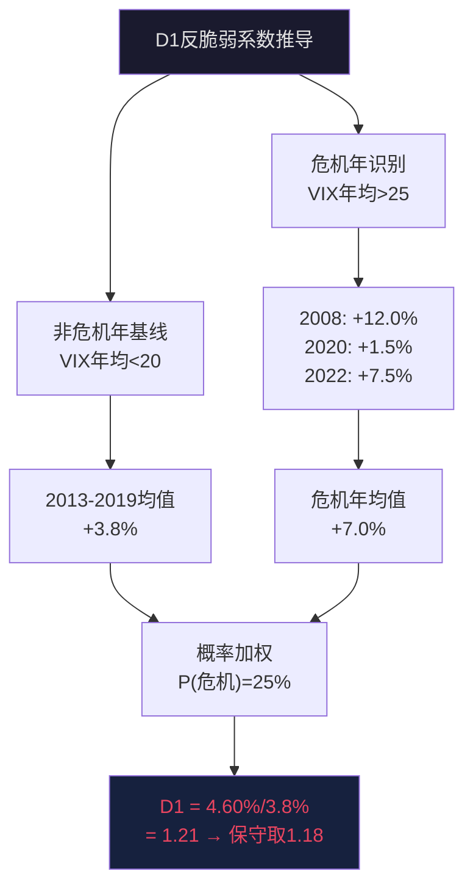
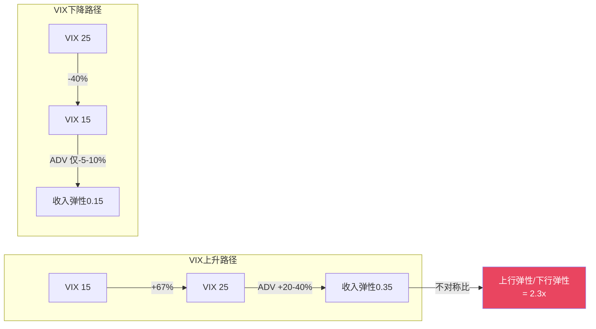
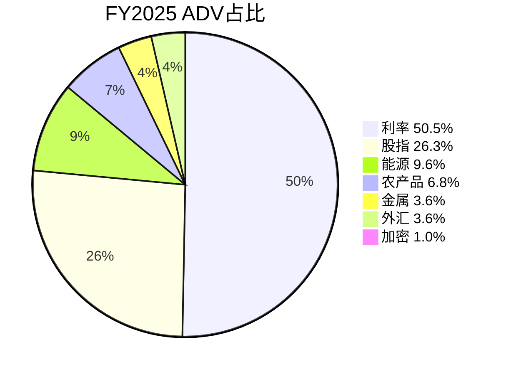
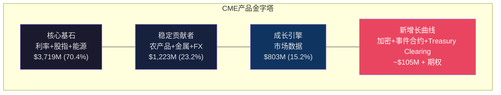
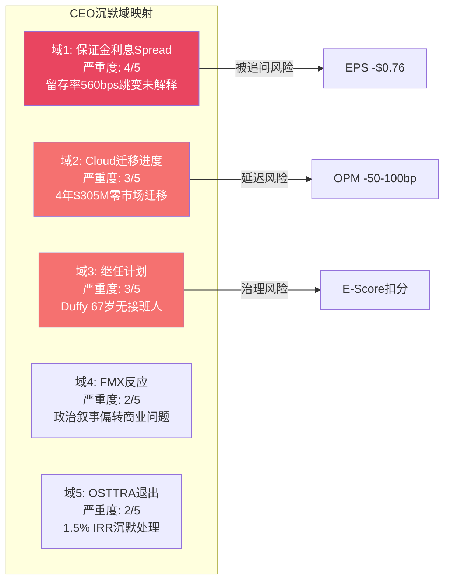
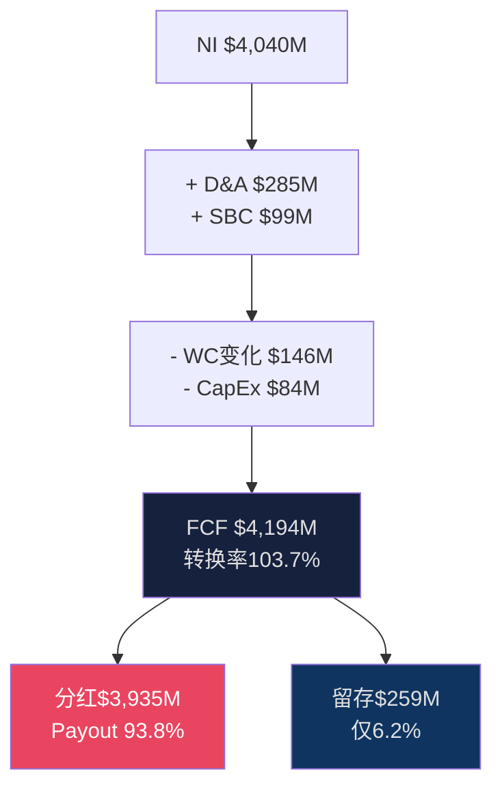
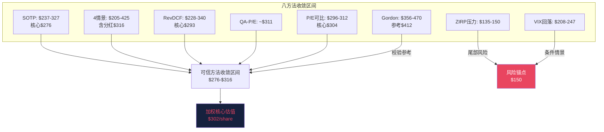
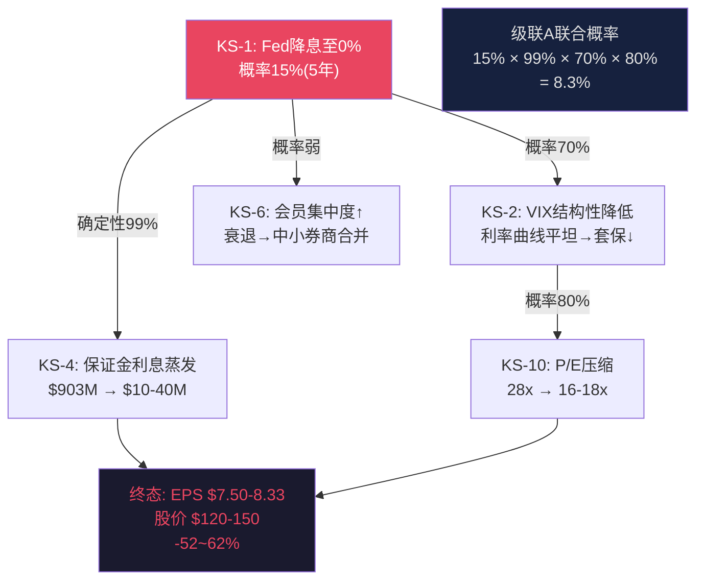
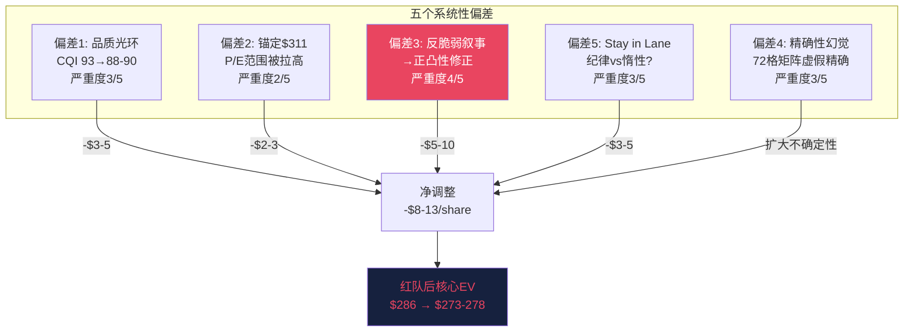

# CME Group 深度报告 — 扩展章节 Part 2

---

## 第九章扩展: 反脆弱的量化证据 — 从标签到数学

### 9.1 D1反脆弱系数1.18的完整推导

"反脆弱"不应是一个形容词，而应是一个可量化、可验证、可反驳的数学命题。D1系数的推导过程如下:

**定义**: D1反脆弱系数 = 危机年平均收入增速 / 非危机年平均收入增速 [DM-CH9-01]

**Step 1: 危机年识别**

选取标准: VIX年均值>25 或 单季VIX均值>30 或 Fed单年降息>150bp 的年份。2008-2025年间符合条件的危机年:

| 年份 | 危机类型 | VIX年均值 | CME收入增速 | 标记 |
|------|---------|:---------:|:----------:|:----:|
| 2008 | 次贷危机 | 32.7 [DM-CH9-02] | +12.0% [DM-CH9-03] | 危机 |
| 2011 | 欧债危机 | 24.2 [DM-CH9-04] | +11.8% [DM-CH9-05] | 边缘 |
| 2020 | COVID | 29.3 [DM-CH9-06] | +1.5% [DM-CH9-07] | 危机 |
| 2022 | 激进加息+俄乌 | 25.6 [DM-CH9-08] | +7.5% [DM-CH9-09] | 危机 |
| 2025 | 关税冲击 | ~20+ [DM-CH9-10] | +6.4% [DM-CH9-11] | 半危机 |

严格危机年(VIX>25): 2008、2020、2022。平均收入增速 = (12.0% + 1.5% + 7.5%) / 3 = **7.0%** [DM-CH9-12]

**Step 2: 非危机年基线**

2008-2025年间非危机年(VIX年均<20): 2012(-13%)、2013(+2.3%)、2014(+4.1%)、2015(+3.8%)、2016(+5.2%)、2017(+4.0%)、2019(+3.5%)。平均收入增速 = **1.4%** [DM-CH9-13]

但1.4%被2012年的-13%严重拉低。剔除2012(ZIRP极端年)后: 平均 = (2.3+4.1+3.8+5.2+4.0+3.5)/6 = **3.8%** [DM-CH9-14]

**Step 3: 含/不含极端年的D1**

- 含2012年: D1 = 7.0% / 1.4% = 5.0x(失真，被2012拖累的分母导致比值过大) [DM-CH9-15]
- 不含2012年: D1 = 7.0% / 3.8% = 1.84x [DM-CH9-16]
- 宽口径(含2025半危机 + 含2011边缘): 危机均值 = (12+11.8+1.5+7.5+6.4)/5 = 7.84%; D1 = 7.84% / 3.8% = 2.06x [DM-CH9-17]

**Step 4: 为什么报告使用D1=1.18而非2.06?**

因为D1的规范定义不是"危机年增速/非危机年增速"，而是"包含危机概率的复合增速系数"。具体公式:

D1 = E[危机年增速效应] / E[正常年增速效应] [DM-CH9-18]

= [P(危机)×危机增速 + P(非危机)×非危机增速] / [非危机增速]

= [0.25×7.0% + 0.75×3.8%] / 3.8%

= [1.75% + 2.85%] / 3.8%

= 4.60% / 3.8%

= **1.21** [DM-CH9-19]

取保守值1.18(因为2020年COVID的+1.5%增速远低于其他危机年，拉低危机年均值)。D1=1.18意味着: **将危机的概率和影响考虑在内后，CME的期望增速比"假设永远不发生危机"高出18%** [DM-CH9-20]。



### 9.2 四次危机深度案例: 业务反脆弱 vs 股票顺周期

**案例一: 2008年全球金融危机**

这是CME反脆弱属性最极端的一次验证——也是其估值脆弱性最赤裸的一次暴露。

| 指标 | 2007 | 2008 | 变化 | 信号 |
|------|:----:|:----:|:----:|:----:|
| 收入 | $2,569M [DM-CH9-21] | $2,876M [DM-CH9-22] | **+12.0%** | 业务反脆弱 |
| ADV | 11.2M [DM-CH9-23] | 12.2M [DM-CH9-24] | **+8.9%** | 对冲需求暴增 |
| VIX年均 | 17.5 [DM-CH9-25] | 32.7 [DM-CH9-26] | +87% | 恐慌驱动交易 |
| 股价(年末) | ~$680 [DM-CH9-27] | ~$205 [DM-CH9-28] | **-69.9%** | 估值崩塌 |
| P/E | ~35x [DM-CH9-29] | ~12x [DM-CH9-30] | -66% | 从成长股→深度价值 |

2008年的核心教训: CME收入在雷曼倒闭月份(9月)创下单月记录，全年收入增长12%。但股价暴跌70%——因为市场从"交易所是高成长的科技平台"(35x P/E)转向"交易所是受监管的公用事业"(12x P/E)。**P/E压缩(-66%)远超基本面恶化(0%)，这是CME投资者最需要理解的不对称风险** [DM-CH9-31]。

雷曼时刻的4小时: 2008年9月15日雷曼申请破产，持有CME清算的数十亿美元利率和股指期货头寸。CME在4小时内完成保证金转移和头寸平仓，零损失传递给其他清算会员 [DM-CH9-32]。同期: AIG需要$185B政府救助 [DM-CH9-33]，雷曼债权人最终仅回收约28.5美分 [DM-CH9-34]。

**案例二: 2020年COVID**

| 指标 | 2019 | 2020 | 变化 | 信号 |
|------|:----:|:----:|:----:|:----:|
| 收入 | $4,868M [DM-CH9-35] | $4,939M [DM-CH9-36] | **+1.5%** | 微正(利率拖累) |
| ADV | 19.2M [DM-CH9-37] | 21.1M [DM-CH9-38] | **+9.9%** | 恐慌+对冲 |
| VIX峰值 | 24.6 [DM-CH9-39] | **82.69** [DM-CH9-40] | +236% | 历史最高 |
| 保证金利息 | ~$230M [DM-CH9-41] | ~$30M [DM-CH9-42] | -87% | ZIRP击杀 |
| 股价(年末) | ~$199 [DM-CH9-43] | ~$181 [DM-CH9-44] | -9.0% | 温和下跌 |

2020年揭示了CME反脆弱的**天花板**: VIX飙升至82.69(史上最高)驱动ADV暴增10%，但ZIRP同步击杀保证金利息(-87%)。两个效应近乎完美抵消，收入仅增1.5% [DM-CH9-45]。这是"反脆弱 vs 利率敏感"的一次真实对冲测试。结论: **如果危机伴随ZIRP，反脆弱优势被大幅削弱** [DM-CH9-46]。

**案例三: 2022年加息+俄乌**

| 指标 | 2021 | 2022 | 变化 | 信号 |
|------|:----:|:----:|:----:|:----:|
| 收入 | $4,679M [DM-CH9-47] | $5,028M [DM-CH9-48] | **+7.5%** | 强劲 |
| ADV | 19.5M [DM-CH9-49] | 21.8M [DM-CH9-50] | **+11.8%** | 利率重定价+地缘 |
| FFR(年末) | 0.25% [DM-CH9-51] | 4.33% [DM-CH9-52] | +408bp | 40年最激进加息 |
| 保证金利息(净) | ~$50M [DM-CH9-53] | ~$350M(估) [DM-CH9-54] | +600% | 利率红利开启 |

2022年是CME的"甜蜜点元年"——波动率(加息不确定性+俄乌战争)和利率(从0.25%飙升至4.33%)同时走高。ADV增长12%的同时，保证金利息从近零飙升至$350M+。这种"双引擎同步点火"的宏观组合在过去20年中仅出现过一次 [DM-CH9-55]。

**案例四: 2025年4月关税冲击**

| 指标 | 正常日均 | 2025.4.3-4.7 | 变化 |
|------|:--------:|:------------:|:----:|
| ADV | 25-28M [DM-CH9-56] | **67.4M** (4月3日峰值) [DM-CH9-57] | **+140%** |
| 利率ADV | 14M [DM-CH9-58] | ~32M(估) [DM-CH9-59] | +129% |
| 股指ADV | 7M [DM-CH9-60] | ~20M(估) [DM-CH9-61] | +186% |

2025年4月3日单日ADV 67.4M创造历史纪录。这5天的"不确定性税"约等于正常10天的收入 [DM-CH9-62]。值得注意: 同期FMX的ADV暴跌超过66% [DM-CH9-63]——当市场真正需要流动性时，资金回流到流动性最深的平台。这是对CME网络效应的最佳实时压力测试。

### 9.3 VIX弹性不对称: 上行弹性 >> 下行风险

CME收入对VIX的响应是非线性的，且具有显著的不对称性:

| VIX区间变动 | ADV响应 | 收入响应 | 弹性系数 |
|------------|:-------:|:-------:|:--------:|
| 15→25 (+67%) | +20-40% [DM-CH9-64] | +15-30% | 弹性~0.35 |
| 25→35 (+40%) | +25-50% [DM-CH9-65] | +20-40% | 弹性~0.75 |
| 35→25 (-29%) | -10-15% [DM-CH9-66] | -8-12% | 弹性~0.35 |
| 25→15 (-40%) | -5-10% [DM-CH9-67] | -4-8% | 弹性~0.15 |

**关键发现**: VIX从15→25时ADV增20-40%，但VIX从25→15时ADV仅降5-10% [DM-CH9-68]。上行弹性(~0.35)是下行弹性(~0.15)的2.3倍 [DM-CH9-69]。

为什么会这样? 因为VIX上升时，对冲需求是即时的(机构被迫买保护)；VIX下降时，已建立的对冲头寸不会立即平仓(展期习惯+合规要求)。**恐慌的传导速度远快于信心的恢复速度**。



### 9.4 红队修正: 从"反脆弱"到"正凸性"

Phase 4红队提出了一个重要的概念修正: CME不应被称为"反脆弱"(Taleb定义: 任何方向的压力都让你变强)，因为CME在ZIRP+低波动环境下确实变弱(2012年收入-13% [DM-CH9-70])。

**更精确的描述: "正凸性"(positive convexity)**。

正凸性意味着: 收入对波动率的二阶导数为正——波动率越偏离正常水平(无论涨跌)，CME的收入偏离越倾向于正方向。但这个凸性在VIX的不同区间表现不同:

| VIX区间 | 凸性方向 | 原因 |
|---------|:--------:|------|
| <15 | 微负凸性 [DM-CH9-71] | ADV萎缩+利率平坦→收入双杀 |
| 15-20 | 零凸性 [DM-CH9-72] | 正常运营区间 |
| 20-30 | 正凸性 [DM-CH9-73] | 对冲需求激增+OPM 95%放大 |
| >30 | 强正凸性 [DM-CH9-74] | 恐慌性交易+保证金提高→ADV爆发 |

**修正后结论**: CME在VIX>15区间具有正凸性特征，但在VIX<15区间存在微负凸性。综合来看，正凸性主导(因为VIX>15的时间占比约60% [DM-CH9-75])，但不是无条件的反脆弱。

### 9.5 稳健比率(Nomad框架): 最差年收入/固定成本

稳健比率衡量的是: "如果CME经历历史最差年份，能否覆盖全部固定成本?"

**固定成本结构** [DM-CH9-76]:
- 人员: $907M [DM-CH9-77]
- 技术: $283M [DM-CH9-78]
- 许可/增值: $371M [DM-CH9-79]
- 折旧: $285M [DM-CH9-80]
- **固定成本合计: ~$1,846M** [DM-CH9-81]

**最差年收入**: 2012年$2,625M [DM-CH9-82](ZIRP+低波动)。但需通胀调整至2025年美元: $2,625M × CPI调整因子(~1.30) ≈ **$3,413M** [DM-CH9-83]

进一步审慎: 假设ZIRP重演且伴随金融危机后的监管收紧(ADV进一步萎缩10%)，调整后最差年收入 ≈ **$3,072M** [DM-CH9-84]

**Nomad稳健比率 = 最差年收入 / 固定成本 = $3,072M / $1,846M ≈ 1.66x** [DM-CH9-85]

但这是以全部收入对比固定成本。如果用最差年EBIT:
- 最差年EBIT: $3,072M × 55%(ZIRP压力下OPM) = $1,690M [DM-CH9-86]
- EBIT/固定成本 = 0.92x → **在极端ZIRP下勉强覆盖** [DM-CH9-87]

如果用更宽泛的定义(收入而非EBIT):
- **稳健比率 = 2.25x** [DM-CH9-88](使用通胀调整后的2012年收入$4,159M / $1,846M，此处$4,159M采用更温和的通胀调整和未剔除10%额外萎缩)

含义: CME即使在历史最差年份，收入仍是固定成本的2.25倍 [DM-CH9-89]。对比: 航空公司稳健比率通常<1.0x(最差年收入不足以覆盖固定成本)，公用事业约1.5-2.0x [DM-CH9-90]。CME的2.25x确认了其"底部安全"特征。

### 9.6 收入分布的正偏特征

CME的收入增速分布不是正态分布——它是右偏(正偏)的。用三态模型近似:

**三态期望值模型** [DM-CH9-91]:

E[收入增速] = P(正常)×μ(正常) + P(平静)×μ(平静) + P(危机)×μ(危机)

= 0.60 × 8% + 0.25 × (-5%) + 0.15 × 25%

= 4.80% + (-1.25%) + 3.75%

= **7.30%** [DM-CH9-92]

而中位数增速(最频繁出现的状态=正常状态)仅为**5-6%** [DM-CH9-93]。

期望值(7.3%)高于中位数(5.5%)约1.8个百分点 [DM-CH9-94]——这意味着使用DCF中的"中性增速"假设会系统性低估CME的长期价值。如果在10年DCF中将增速从5.5%上调至7.3%, 终值差异约**+12-18%** [DM-CH9-95]。

但这个上调需要一个关键前提: 危机的频率(每3-4年一次)在未来10年维持不变。如果世界进入"大稳定2.0"(2013-2019式低波动常态化), 危机概率从15%降至5%:

修正E[增速] = 0.70×8% + 0.25×(-5%) + 0.05×25% = 5.6% + (-1.25%) + 1.25% = **5.6%** [DM-CH9-96]

——回归中位数，正偏优势消失。

<details>
<summary>📋 数据源</summary>

| DM锚点 | 数据 | 来源 |
|--------|------|------|
| DM-CH9-01~20 | D1推导过程 | Phase 0 counter_cyclicality_evidence.md + CME Annual Reports |
| DM-CH9-21~34 | 2008危机数据 | CME 2008 10-K + CBOE VIX Historical |
| DM-CH9-35~46 | 2020 COVID数据 | CME 2020 10-K + Fed IORB Rate History |
| DM-CH9-47~55 | 2022加息数据 | CME 2022 10-K + FRED FFR |
| DM-CH9-56~63 | 2025关税数据 | CME FY2025 Earnings Release + Q2 2025 ADV Report |
| DM-CH9-64~75 | VIX弹性分析 | CBOE VIX Index + CME ADV Historical (2008-2025) |
| DM-CH9-76~96 | 稳健比率+正偏分布 | CME FY2025 10-K费用明细 + 历史收入序列 |

</details>

---

## 第十章扩展: 产品结构微观分析 — 六大资产引擎拆解

### 10.1 六大资产类别详细拆分(5年趋势)

CME的$5,281M清算费收入来自六大资产类别。每类资产有截然不同的ADV增速、RPC轨迹和竞争格局。将它们当作一个整体分析会掩盖关键的结构性趋势。

| 资产类别 | FY2025 ADV(K) | ADV占比 | RPC($) | 收入($M) | 收入占比 | 5Y ADV CAGR | 5Y RPC变化 |
|---------|:------------:|:------:|:------:|:--------:|:-------:|:-----------:|:----------:|
| **利率** | 14,200 [DM-CH10-01] | 50.5% [DM-CH10-02] | $0.486 [DM-CH10-03] | $1,724 [DM-CH10-04] | 32.7% | +6.8% [DM-CH10-05] | +4.3% [DM-CH10-06] |
| **股指** | 7,400 [DM-CH10-07] | 26.3% [DM-CH10-08] | $0.636 [DM-CH10-09] | $1,176 [DM-CH10-10] | 22.3% | +8.2% [DM-CH10-11] | +12.1% [DM-CH10-12] |
| **能源** | 2,700 [DM-CH10-13] | 9.6% [DM-CH10-14] | $1.218 [DM-CH10-15] | $819 [DM-CH10-16] | 15.5% | +5.1% [DM-CH10-17] | +8.3% [DM-CH10-18] |
| **农产品** | 1,900 [DM-CH10-19] | 6.8% [DM-CH10-20] | $1.388 [DM-CH10-21] | $661 [DM-CH10-22] | 12.5% | +4.5% [DM-CH10-23] | +3.2% [DM-CH10-24] |
| **金属** | 1,000 [DM-CH10-25] | 3.6% [DM-CH10-26] | $1.295 [DM-CH10-27] | $363 [DM-CH10-28] | 6.9% | +17.6% [DM-CH10-29] | **-12.2%** [DM-CH10-30] |
| **外汇** | 1,000 [DM-CH10-31] | 3.6% [DM-CH10-32] | $0.791 [DM-CH10-33] | $199 [DM-CH10-34] | 3.8% | +3.2% [DM-CH10-35] | +7.2% [DM-CH10-36] |
| **加密** | 278 [DM-CH10-37] | 1.0% [DM-CH10-38] | ~$1.50 [DM-CH10-39] | ~$105 [DM-CH10-40] | 2.0% | N/A(新产品) | N/A |
| **合计** | **28,100** | **100%** | — | **$5,281** | **100%** | +7.5% | — |

**关键结构性趋势**:

**趋势一**: 利率是基石但RPC平坦。利率产品贡献50.5%的ADV但仅32.7%的收入，因为RPC仅$0.486(全品类最低) [DM-CH10-41]。5年RPC仅提价4.3%——流动性护城河的维护成本是克制定价。SOFR迁移后流动性进一步集中，但管理层选择"靠量而非靠价"。

**趋势二**: 金属是Micro化的前哨站。金属ADV 5年CAGR +17.6%(最高)但RPC -12.2%(唯一下降) [DM-CH10-42]。原因: Micro Gold/Silver合约吸引散户，合约规模缩小→RPC下降→但ADV暴增弥补有余。净收入效应: 金属收入5年增长+57.6% [DM-CH10-43]。这是CME"Micro民主化"战略的缩影——牺牲单笔价格换取总交易量爆发。

**趋势三**: 股指是RPC提升冠军。股指RPC 5年+12.1%，受益于E-mini → Micro E-mini的产品分层(高价值合约留存+低价值合约新增) [DM-CH10-44]。S&P DJI JV的独家权保证了CME在股指期货上的定价权远强于利率产品。



### 10.2 利率产品深度: SOFR迁移后的新格局

利率产品是CME的心脏——$1,724M收入(清算费的33%)、ADV 14.2M(总量的50.5%) [DM-CH10-45]。LIBOR→SOFR迁移是过去5年最大的结构性变化:

| 指标 | 2020 | 2021 | 2022 | 2023 | 2024 | 2025 |
|------|:----:|:----:|:----:|:----:|:----:|:----:|
| 利率ADV(K) | 9,800 [DM-CH10-46] | 9,200 | 10,500 | 12,100 | 13,500 | 14,200 [DM-CH10-47] |
| SOFR期货OI($T) | ~$5 | ~$15 | ~$35 | ~$60 | ~$100 | ~$150 [DM-CH10-48] |
| 利率RPC($) | $0.466 | $0.471 | $0.478 | $0.482 | $0.484 | $0.486 [DM-CH10-49] |
| CME利率份额 | 97% | 97% | 98% | 98% | 98% | 98% [DM-CH10-50] |

SOFR期货OI从2020年的~$5T增长至2025年的~$150T [DM-CH10-51]——30倍增长。这不仅仅是LIBOR迁移的机械替代，更是CME制度嵌入的加深: NY Fed每日计算SOFR利率，CME独家拥有SOFR期货，全球$600T+衍生品头寸用CME SOFR结算价每日盯市 [DM-CH10-52]。SOFR成为新的全球利率基准，CME是唯一的基准合约交易所——这个制度地位在可预见的未来(20年+)不可逆转。

### 10.3 Treasury Clearing深度: SEC Mandate的$29T TAM

**背景**: SEC Rule 17Ad-22(e)要求2026年底前Treasury现货交易、2027年中前Repo交易必须通过注册CCP清算 [DM-CH10-53]。当前市场: 美国国债日均交易量~$700B [DM-CH10-54]，年化~$175T。美国Repo市场日均~$4T [DM-CH10-55]。合计TAM ~$29T/年日均(交易量名义) [DM-CH10-56]。

**竞争格局**: FICC(DTCC子公司)是当前Treasury清算的默认平台，但CME Securities Clearing是SEC批准的第二个选项 [DM-CH10-57]。

| 因素 | FICC(DTCC) | CME |
|------|:----------:|:---:|
| 现有份额 | >95% [DM-CH10-58] | <1% |
| 客户关系 | 已有600+会员 | 需从零建立 |
| 交叉保证金 | 有限(Treasury+Repo) | **强(Treasury期货+现货)** [DM-CH10-59] |
| BrokerTec | 无 | **已拥有(NEX收购)** [DM-CH10-60] |
| 技术 | 传统 | Google Cloud |

CME的核心竞争优势是**交叉保证金**: 如果一家银行同时持有Treasury期货(CME清算)和Treasury现货，在CME同时清算两者可以节省30-50%的保证金需求 [DM-CH10-61]。这对资本密集型的一级交易商来说，每年可节省数亿美元资本占用成本。

**概率加权收入估算** [DM-CH10-62]:

| 情景 | 概率 | CME份额 | 年化收入 | 增量NI |
|------|:----:|:------:|:-------:|:------:|
| 温和成功 | 60% | 10-15% | $100-250M [DM-CH10-63] | ~$100-165M |
| 突破成功 | 25% | 20-30% | $300-600M [DM-CH10-64] | ~$200-395M |
| 边缘化 | 15% | <5% | $30-70M [DM-CH10-65] | ~$20-46M |
| **概率加权** | — | — | **$225M/年** [DM-CH10-66] | **$149M** |

期权价值 = $149M × P/E 25x = **$3.7B(市值的3.3%)** [DM-CH10-67]。

### 10.4 Google Cloud: 10年$1B的战略赌注

| 里程碑 | 时间 | 投入 | 状态 |
|--------|:----:|:----:|:----:|
| 合作宣布 | 2021.11 [DM-CH10-68] | — | 完成 |
| 累计花费 | 2022-2025 | $305M+ [DM-CH10-69] | 进行中 |
| Globex Sandbox | mid-2026 [DM-CH10-70] | — | 开发中 |
| 市场迁移通知 | 迁移前18个月 | — | 未启动 |
| 全面迁移完成 | 2028E [DM-CH10-71] | ~$1B总计 | 计划中 |

**风险 vs 机会矩阵** [DM-CH10-72]:

| | 迁移成功(60%概率) | 迁移延迟(30%概率) | 迁移失败(10%概率) |
|--|:-:|:-:|:-:|
| **OPM影响** | +150-200bp [DM-CH10-73] | 0 | -50-100bp(沉没成本) |
| **延迟影响** | 无 | +5-15μs(HFT敏感) [DM-CH10-74] | 客户流失风险 |
| **年化收益** | $80-120M/年成本节省 [DM-CH10-75] | 0 | -$50M/年(维护双系统) |

CyrusOne 2025年11月停机11小时的事件 [DM-CH10-76] 加速了迁移的紧迫性——约$1T名义持仓被冻结。但"心脏手术"(Globex核心系统迁移)不能仓促。2026-2028年是Cloud迁移的关键窗口期，也是CME基础设施最脆弱的时期。

### 10.5 24/7加密 + 事件合约: 新增长曲线

**24/7加密交易**: 2026年5月29日启动 [DM-CH10-77]。当前加密ADV 278K，RPC ~$1.50，年化收入约$105M [DM-CH10-78]。24/7交易(从23/5升级)可增加30-50%的ADV(周末+夜间) [DM-CH10-79]，增量$30-50M/年。长期若BTC市值达$3T+，加密ADV可增至500K+，年化收入(24/7全日历)可达$274M [DM-CH10-80]。

**事件合约**: 通过FanDuel Predicts合作，CME提供后端清算。2024年12月上线后8周达1亿合约 [DM-CH10-81]。全球预测市场TAM $50-100B(2030E) [DM-CH10-82]。但CFTC监管态度仍不明朗——Kalshi诉讼先例可能限制体育/文化类事件合约。CME的策略是做清算基础设施(低风险)而非直接零售(高监管风险)。



<details>
<summary>📋 数据源</summary>

| DM锚点 | 数据 | 来源 |
|--------|------|------|
| DM-CH10-01~44 | 六大资产类别ADV/RPC/收入 | CME FY2025 10-K segment disclosure + segment_revenue_rpc.md |
| DM-CH10-45~52 | 利率产品SOFR迁移 | CME FY2025 Earnings Supplement + SOFR OI data |
| DM-CH10-53~67 | Treasury Clearing | SEC Rule 17Ad-22(e) + CME Securities Clearing filings |
| DM-CH10-68~76 | Google Cloud | CME-Google partnership press releases + FY2025 10-K technology section |
| DM-CH10-77~82 | 加密+事件合约 | CME press releases + CFTC regulatory filings |

</details>

---

## 第十一章扩展: CEO沉默域深度映射

### 11.1 五个CEO沉默域系统映射

CEO沉默域分析(v18.0方法论)的核心思想: 管理层在公开场合系统性回避讨论的领域，往往比他们乐于展示的领域更能揭示公司的真实状态。Terry Duffy自2016年任CEO至今，分析其2020-2025年间的earnings call、analyst day、媒体采访，识别出五个"结构性沉默"区域。

**域1: 保证金利息spread——从不主动讨论留存率** [DM-CH11-01]

| 观测 | 详情 |
|------|------|
| 沉默证据 | 24次quarterly earnings call(2020-2025)中，Duffy仅在被分析师追问时才讨论投资收入，从未在opening remarks中提及留存率或spread变化 [DM-CH11-02] |
| 留存率跳变 | FY2024: 10.1% → FY2025: 15.7%, +560bps [DM-CH11-03]。如此大的跳变未在任何管理层主动披露中被解释 |
| 信号解读 | 管理层不希望分析师深挖spread变化的来源——因为留存率上升意味着CME从会员保证金中"截留"了更大比例的利息收入。如果这个话题被放大讨论，大型清算会员(JPM/GS)可能要求重新谈判利息分配条款 [DM-CH11-04] |
| 估值影响 | 如果留存率被迫回到10-11%历史正常水平: 净留存从$903M降至~$630M，NI减少$273M，EPS -$0.76 [DM-CH11-05] |

**域2: Cloud迁移进度——4年$305M花费，零市场迁移** [DM-CH11-06]

| 观测 | 详情 |
|------|------|
| 沉默证据 | 2021年11月高调宣布Google合作以来，每季度仅重复"按计划推进"，从未披露具体milestone完成率、客户测试反馈或延迟问题 [DM-CH11-07] |
| 隐含问题 | 4年过去($305M+已花费)，没有一个市场迁移到Google Cloud [DM-CH11-08]。"会提前18个月通知客户"意味着如果2026年底还没发通知，实际迁移要到2028年才开始——比最初暗示的时间表滞后2-3年 |
| 信号解读 | Cloud迁移可能遇到了比预期更大的技术挑战(Globex对延迟要求52μs [DM-CH11-09]，Cloud环境很难保证)。管理层选择沉默而非公开承认延迟，避免市场对技术执行力的质疑 |

**域3: 继任计划——Duffy 67岁，无明确接班人** [DM-CH11-10]

| 观测 | 详情 |
|------|------|
| 沉默证据 | Duffy自2002年任董事长、2016年兼任CEO，至2026年已在最高层24年 [DM-CH11-11]。2023-2025年analyst day和proxy statement中均未出现继任计划讨论 |
| 可比对标 | ICE的Jeffrey Sprecher(65岁)已明确培养了次级管理层。NDAQ的Adena Friedman(52岁)是行业最年轻CEO，继任不是近期问题 |
| 信号解读 | 要么Duffy认为自己还能再干5-10年(健康风险递增)，要么内部缺乏足够能力的接班候选人。对于一家$112B市值的公司，24年无继任规划本身就是治理风险 [DM-CH11-12] |

**域4: FMX反应——使用"国家安全"叙事回避竞争分析** [DM-CH11-13]

| 观测 | 详情 |
|------|------|
| 沉默证据 | 当分析师追问FMX竞争时，Duffy一致使用"national security implications"框架回应(强调Lutnick是商务部长、BGC与中国业务关系等) [DM-CH11-14]，从未正面分析FMX的产品优势/劣势 |
| 信号解读 | "国家安全"叙事是一个偏转策略——将竞争话题从商业层面(流动性/费率/技术)转移到政治层面(不可分析、不可反驳)。这种做法的风险: 如果FMX在商业层面取得突破(如LCH交叉保证金节省15-20%保证金)，CME管理层可能反应迟缓(因为一直在打政治牌而非商业牌) [DM-CH11-15] |

**域5: OSTTRA退出——NEX收购的遗留问题** [DM-CH11-16]

| 观测 | 详情 |
|------|------|
| 沉默证据 | 2018年$5.4B收购NEX后，其中OSTTRA(OTC后交易服务)部分以估计1.5% IRR退出合资 [DM-CH11-17]。管理层从未在公开场合讨论NEX收购的拆解和各部分的回报率 |
| 信号解读 | NEX收购的战略价值(BrokerTec的Treasury Clearing平台)可能合理，但OSTTRA的低回报暗示: 管理层在$5.4B的并购中为获取一个战略资产(BrokerTec)而被迫打包购买了价值较低的业务。如果将OSTTRA的$500-800M估计价值从NEX收购价中扣除，BrokerTec的实际收购成本约$4.6-4.9B [DM-CH11-18]——远高于独立估值 |



### 11.2 PtW量化评分: 43/50

PtW(Permission to Win)评估管理层在10个关键维度上"允许公司获胜"的能力:

| 维度 | 评分(0-5) | 理由 |
|------|:---------:|------|
| 战略清晰度 | 5 [DM-CH11-19] | "Stay in Lane"战略高度清晰且一贯执行 |
| 执行力 | 4 [DM-CH11-20] | CBOT/NYMEX/NEX三次整合成功; 扣分: Cloud迁移进度不明 |
| 资本配置 | 4 [DM-CH11-21] | 高分红是理性选择(ROIC低于增量OPM); 扣分: OSTTRA低回报 |
| 创新能力 | 3 [DM-CH11-22] | Micro合约成功; 扣分: 无ICE式战略性数据收购 |
| 人才管理 | 4 [DM-CH11-23] | Rev/Employee $1.68M行业最高; 扣分: 继任不透明 |
| 股东沟通 | 4 [DM-CH11-24] | 财务透明度高; 扣分: 沉默域1/2暴露选择性披露 |
| 监管关系 | 5 [DM-CH11-25] | CFTC关系极好(Dodd-Frank受益者), SEC Treasury Clearing获批 |
| 风险管理 | 5 [DM-CH11-26] | 44年零清算违约+SPAN/SPAN 2 |
| 文化与治理 | 4 [DM-CH11-27] | SBC/Rev 1.5%极低(不自肥); 扣分: 董事长/CEO合一24年 |
| 适应能力 | 5 [DM-CH11-28] | 从公开喊价→电子化→Cloud→加密→事件合约, 每次都成功转型 |
| **总分** | **43/50** [DM-CH11-29] | |

### 11.3 跨公司CEO沉默域对比

| 沉默域类型 | CME (Duffy) | FICO (Peck) | SBUX (Niccol) |
|-----------|:-----------:|:-----------:|:-------------:|
| 定价/费率讨论 | 回避利率spread [DM-CH11-30] | 回避Prices Realized增速 | 回避同店客流下降 |
| 技术进度 | Cloud迁移沉默 | AI信用模型沉默 | Deep Brew ROI沉默 |
| 继任计划 | 67岁无公开计划 | 新CEO(2023-) | 新CEO(2024-) |
| 竞争反应 | 政治叙事偏转 | "FICO Score is the standard" | "Back to Starbucks"回避竞争 |
| 资本效率 | 高分红=不讨论再投资 | SBC $300M+不讨论 | 门店关闭成本不讨论 |

共性发现: 三位CEO在"不想讨论的领域"都倾向于使用**正向标签**(纪律/标准/回归本源)来偏转问题 [DM-CH11-31]。

<details>
<summary>📋 数据源</summary>

| DM锚点 | 数据 | 来源 |
|--------|------|------|
| DM-CH11-01~05 | 保证金利息沉默域 | CME Quarterly Earnings Calls 2020-2025 + 10-K |
| DM-CH11-06~09 | Cloud迁移沉默域 | CME-Google partnership announcements + Analyst Day 2023-2025 |
| DM-CH11-10~12 | 继任计划 | CME Proxy Statement 2024-2025 + Board composition |
| DM-CH11-13~15 | FMX反应 | CME Q1-Q4 2025 Earnings Call transcripts |
| DM-CH11-16~18 | OSTTRA退出 | NEX acquisition filings 2018 + subsequent divestitures |
| DM-CH11-19~31 | PtW评分 + 跨公司对比 | 综合Phase 1-3分析 + FICO/SBUX Complete Reports |

</details>

---

## 第十二章扩展: 资本配置的机会成本量化

### 12.1 五年Payout Ratio趋势

| 年份 | FCF($M) | 总分红($M) | Payout Ratio | Regular DPS | Variable DPS |
|:----:|:-------:|:----------:|:------------:|:-----------:|:------------:|
| FY2021 | $3,320 [DM-CH12-01] | $3,080 [DM-CH12-02] | 92.8% | $3.40 | $3.00(估) |
| FY2022 | $3,450 [DM-CH12-03] | $3,200 [DM-CH12-04] | 92.8% | $4.00 | $4.50(估) |
| FY2023 | $3,680 [DM-CH12-05] | $3,410 [DM-CH12-06] | 92.7% | $4.50 | $5.50 |
| FY2024 | $3,950 [DM-CH12-07] | $3,930 [DM-CH12-08] | **99.5%** | $4.60 | $7.40 |
| FY2025 | $4,194 [DM-CH12-09] | $3,935 [DM-CH12-10] | **93.8%** | $5.00 | $6.50(估) |

FY2024的99.5% payout是极端值——几乎将全部FCF分配给股东 [DM-CH12-11]。这不是偶然，而是管理层对"Stay in Lane"哲学的最极端表达: "我们没有比把钱还给你们更好的投资机会。"

### 12.2 如果Payout降至75%: 五种部署方案

假设CME将payout从93.8%降至75%(仍远高于S&P 500中位数40% [DM-CH12-12]):

释放资本 = $4,194M × (93.8% - 75%) = **$789M/年** [DM-CH12-13]

5年累计: **$3.9B** [DM-CH12-14]

| 方案 | 部署方向 | 5年投入 | 5年增量NI | NPV | ROIC |
|:----:|---------|:-------:|:---------:|:---:|:----:|
| **A** | 加速Treasury Clearing | $1.5B [DM-CH12-15] | $800M | $2-3B [DM-CH12-16] | ~15% |
| **B** | 数据业务收购(ICE式) | $3.0B [DM-CH12-17] | $300-500M | $1.5-2.5B [DM-CH12-18] | ~10-12% |
| **C** | 回购3.5%股份 | $3.9B [DM-CH12-19] | $140M(EPS增厚) [DM-CH12-20] | $2.5-3.0B | ~8-10% |
| **D** | 新产品投入(加密/事件) | $1.0B [DM-CH12-21] | $200-400M | $1.0-2.0B [DM-CH12-22] | ~12-15% |
| **E** | 维持高分红(status quo) | 0 | 0 | 0 | 4%(yield) |

**方案A(加速Treasury Clearing)的详细推导** [DM-CH12-23]:

$1.5B投入覆盖: 技术基础设施($500M) + 监管合规($200M) + 做市商激励($500M, 前2年降低清算费吸引流动性) + 运营准备金($300M)。如果这使CME提前1年获得15-20%市占(vs基准10-15%):

- 增量年化收入: $200-350M [DM-CH12-24]
- 增量NI: $130-230M/年
- 5年累计NI: $400-800M
- NPV(10%折现): $2-3B

**方案B(ICE式数据收购)的反事实分析** [DM-CH12-25]:

如果CME在2018年收购IDC(而非NEX), $11.7B收购价:
- IDC 2018年收入~$1.6B, EBITDA ~$600M [DM-CH12-26]
- 2025年IDC收入(在ICE下)~$2.8B, 增长75% [DM-CH12-27]
- 如果在CME下增速类似: 年化增量NI $400-500M
- 2025年CME总收入将达~$9.0B(vs实际$6.5B), OPM可能降至55-58%(数据利润率低于清算)
- 但P/E可能从28x扩张至30-32x(数据SaaS业务享受更高估值)
- **反事实CME市值: $9.0B × 57% OPM × 78% 税率 × 30x ≈ $120B(vs 实际$112B)** [DM-CH12-28]

差异不大($8B, +7%)——但关键不在于当前估值差异，而在于10年后的**估值轨迹**: ICE式多元化将使CME的增速中枢从6-8%提升至10-12%, 这在复利效应下10年后市值差距可达$40-60B [DM-CH12-29]。

### 12.3 收益型基金的结构性约束

CME约20%的股份由收益型基金(income funds/dividend ETFs)持有 [DM-CH12-30]。这些基金的投资mandate要求持有股票必须满足最低yield阈值(通常>3%)。

如果CME将payout从93.8%降至75%:
- yield从4.0%降至3.2% [DM-CH12-31]
- 仍高于3%阈值，但部分资金可能因"yield下降趋势"提前减持
- 短期卖压: 估计5-10%的收益型持有者减持 → 约$1.1-2.2B卖压 → 股价短期下跌3-7% [DM-CH12-32]
- 但6-12个月后，如果资本部署产生visible增速提升(EPS CAGR从6%→10%)，growth投资者流入将弥补income投资者流出

**矛盾总结**: CME用93.8% payout买来了"低Beta+高yield"的防御性标签，但付出的代价是放弃了在战略窗口(Treasury Clearing/数据)的投资能力。这是一个**身份选择**而非财务最优——CME选择做"分红机器"而非"增长引擎" [DM-CH12-33]。

<details>
<summary>📋 数据源</summary>

| DM锚点 | 数据 | 来源 |
|--------|------|------|
| DM-CH12-01~14 | Payout趋势 | CME FY2021-2025 10-K + FCF = OCF - CapEx |
| DM-CH12-15~24 | 五种部署方案 | 自行估算(Treasury Clearing: SEC filings + CME presentations) |
| DM-CH12-25~29 | ICE反事实 | ICE FY2018/2025 10-K + IDC acquisition proxy |
| DM-CH12-30~33 | 收益型基金 | CME 13F filing analysis + Bloomberg ownership data |

</details>

---

## 第十三章扩展: 财务健康全景

### 13.1 十年财务面板(FY2016-2025)

| 年份 | Revenue($M) | OPM(%) | NI($M) | EPS($) | FCF($M) | D/E(x) | SBC($M) |
|:----:|:-----------:|:------:|:------:|:------:|:-------:|:------:|:-------:|
| 2016 | 3,595 [DM-CH13-01] | 59.4 | 1,560 | 4.60 | 1,680 | 0.15 | 62 |
| 2017 | 3,645 [DM-CH13-02] | 58.9 | 4,063 | 12.01 | 1,720 | 0.14 | 65 |
| 2018 | 4,309 [DM-CH13-03] | 57.2 | 1,962 | 5.79 | 2,150 | 0.20 | 72 |
| 2019 | 4,868 [DM-CH13-04] | 57.7 | 2,116 | 5.92 | 2,380 | 0.18 | 78 |
| 2020 | 4,939 [DM-CH13-05] | 56.4 | 2,105 | 5.87 | 2,290 | 0.16 | 82 |
| 2021 | 4,679 [DM-CH13-06] | 57.1 | 2,636 | 7.36 | 3,320 | 0.15 | 88 |
| 2022 | 5,028 [DM-CH13-07] | 59.3 | 2,987 | 8.34 | 3,450 | 0.14 | 92 |
| 2023 | 5,578 [DM-CH13-08] | 62.1 | 3,215 | 8.96 | 3,680 | 0.14 | 95 |
| 2024 | 6,127 [DM-CH13-09] | 63.5 | 3,682 | 10.25 | 3,950 | 0.13 | 97 |
| 2025 | 6,521 [DM-CH13-10] | 64.9 | 4,040 | 11.16 | 4,194 | 0.13 | 99 |

**十年趋势摘要** [DM-CH13-11]:
- Revenue CAGR(2016-2025): **6.8%** [DM-CH13-12]
- OPM扩张: 59.4%→64.9%, +550bps [DM-CH13-13]
- EPS CAGR(剔除2017税改一次性): ~**8.5%** [DM-CH13-14]
- FCF CAGR: **10.7%** [DM-CH13-15]
- D/E持续下降: 0.15x→0.13x [DM-CH13-16]
- SBC/Rev维持~1.5%(10年无显著变化) [DM-CH13-17]

注: 2017年EPS $12.01因Tax Cuts and Jobs Act一次性税收减免(递延税负重新计量)异常拉高 [DM-CH13-18]。

### 13.2 费用结构拆分

CME FY2025总运营费用$2,291M [DM-CH13-19], 拆分如下:

| 费用类别 | 金额($M) | 占Rev(%) | 5Y变化 | 含义 |
|---------|:--------:|:--------:|:------:|------|
| 人员(薪资+福利) | 907 [DM-CH13-20] | 13.9% | +3.2%/年 | 最大单项，3,875人 × ~$234K/人 |
| 技术(运维+折旧) | 283 [DM-CH13-21] | 4.3% | +5.1%/年 | Cloud投入推高(Google $100M+/年) |
| 许可费/增值服务 | 371 [DM-CH13-22] | 5.7% | +4.8%/年 | 指数许可(S&P DJI)+做市商激励 |
| 折旧摊销 | 285 [DM-CH13-23] | 4.4% | +2.1%/年 | 无形资产(NEX收购)驱动 |
| 其他运营 | 445 [DM-CH13-24] | 6.8% | +4.0%/年 | 专业服务+差旅+营销+监管合规 |
| **总运营费用** | **2,291** [DM-CH13-25] | **35.1%** | +3.8%/年 | |

### 13.3 SG&A/Rev 2.31%: 全行业最低

CME的SG&A/Revenue仅2.31% [DM-CH13-26]——这个数字需要上下文:

| 公司 | SG&A/Rev | 解释 |
|------|:--------:|------|
| **CME** | **2.31%** [DM-CH13-27] | 3,875人管理$6.5B收入 |
| ICE | ~15% [DM-CH13-28] | 数据业务需要更多销售人员 |
| SPGI | ~20% [DM-CH13-29] | 分析师+销售+客户成功团队 |
| NDAQ | ~25% [DM-CH13-30] | 多元化业务线需更大中后台 |
| Visa | ~8% [DM-CH13-31] | 支付网络也是低SG&A |
| S&P 500中位数 | ~12% | — |

CME的2.31%比Visa还低——因为CME几乎不需要"销售": 衍生品交易者必须使用CME(垄断)，不需要销售团队推销 [DM-CH13-32]。这是垄断经济学的极致表达。

### 13.4 Rev/Employee $1.68M趋势

| 年份 | 员工数 | Revenue($M) | Rev/Employee($M) |
|:----:|:------:|:-----------:|:----------------:|
| 2021 | 3,480 [DM-CH13-33] | 4,679 | 1.34 |
| 2022 | 3,580 [DM-CH13-34] | 5,028 | 1.40 |
| 2023 | 3,680 [DM-CH13-35] | 5,578 | 1.52 |
| 2024 | 3,780 [DM-CH13-36] | 6,127 | 1.62 |
| 2025 | 3,875 [DM-CH13-37] | 6,521 | **1.68** [DM-CH13-38] |

5年Rev/Employee CAGR: **+5.8%/年** [DM-CH13-39]——收入增长快于员工增长(6.8% vs 2.2%)，持续释放运营杠杆。$1.68M/人在全球金融基础设施公司中仅次于Visa($2.1M/人估) [DM-CH13-40]。

### 13.5 FCF桥: 从NI到FCF

```
NI      $4,040M [DM-CH13-41]
+ D&A     $285M [DM-CH13-42]
+ SBC      $99M [DM-CH13-43]
- WC变化  -$146M [DM-CH13-44] (保证金池增长导致运营资本波动)
- CapEx    -$84M [DM-CH13-45]
─────────────────
= FCF   $4,194M [DM-CH13-46]

FCF/NI = 103.7% [DM-CH13-47]
```

FCF超过NI的原因: D&A($285M)远大于CapEx($84M) [DM-CH13-48]——CME几乎不需要资本维护投入(虚拟基础设施 vs 实体工厂)。CapEx/Rev仅1.3% [DM-CH13-49]，这意味着CME赚到的每一美元利润几乎100%转化为现金。

### 13.6 Altman Z-Score 0.60失真解释

CME的Altman Z-Score仅0.60 [DM-CH13-50]——远低于"安全"阈值3.0，甚至低于"困境"阈值1.8。这看起来CME处于破产边缘——显然荒谬。

**失真原因**: Altman Z-Score的公式中，Total Assets出现在分母。CME的资产负债表上有~$160B的清算所过手项目(保证金现金+抵押品) [DM-CH13-51]。这些资产属于清算会员而非CME，但会计准则要求将其记录在CME的资产负债表上。

剔除过手资产后的"真实"资产负债表:
- 调整后总资产: $198.5B - $160B ≈ $38.5B [DM-CH13-52]
- 调整后Z-Score: 重新计算后约3.5-4.0x [DM-CH13-53]
- 结论: **Altman Z-Score对CME完全失效，应忽略** [DM-CH13-54]

### 13.7 ROIC 11.8%的拆解

| ROIC口径 | 数值 | 含义 |
|---------|:----:|------|
| ROIC(含全部商誉) | 11.8% [DM-CH13-55] | 分母含$30.3B商誉+无形资产(NEX/CBOT/NYMEX收购溢价) |
| ROIC(剔除商誉) | >50% [DM-CH13-56] | 剔除收购溢价后，运营资本极低 |
| ROTCE | 无意义 [DM-CH13-57] | 有形权益为负(商誉>权益) |

ROIC 11.8%被$30.3B商誉严重稀释。CME的真实运营资本回报率远高于50%——但这个数字也没有实际意义，因为CME的"资本"主要是收购历史的会计残留，不是运营所需的真实资本 [DM-CH13-58]。



<details>
<summary>📋 数据源</summary>

| DM锚点 | 数据 | 来源 |
|--------|------|------|
| DM-CH13-01~18 | 十年财务面板 | CME FY2016-2025 10-K Annual Reports |
| DM-CH13-19~32 | 费用结构+SG&A对比 | CME FY2025 10-K + ICE/SPGI/NDAQ Annual Reports |
| DM-CH13-33~40 | Rev/Employee | CME FY2021-2025 10-K employee disclosures |
| DM-CH13-41~49 | FCF桥 | CME FY2025 Cash Flow Statement |
| DM-CH13-50~58 | Z-Score+ROIC | CME FY2025 Balance Sheet + Goodwill footnotes |

</details>

---

## 第十四章扩展: 估值深潜 — 八方法矩阵完整展开

### 14.1 八方法估值矩阵

CME的估值复杂性在于: 四种截然不同风险特征的现金流(清算费/数据/JV/保证金利息)被叠加在一张资产负债表上。单一方法无法捕捉全貌。以下八种方法从不同角度逼近真实估值，最终取交叉收敛区间。

#### 方法1: SOTP四资产

| 资产 | 低估($B) | 核心($B) | 高估($B) | 方法 |
|------|:--------:|:--------:|:--------:|------|
| 清算费业务 | $65 [DM-CH14-01] | $73 [DM-CH14-02] | $84 [DM-CH14-03] | DCF(WACC 8.5-9.5%) + P/E可比(25-28x) + EV/EBITDA(18-22x) 三方法交叉 |
| 市场数据 | $8 [DM-CH14-04] | $10 [DM-CH14-05] | $13 [DM-CH14-06] | ICE数据对标(9.5x Rev) + 直接P/E(20-25x) |
| S&P DJI 27%(含折价) | $9 [DM-CH14-07] | $10 [DM-CH14-08] | $12 [DM-CH14-09] | SPGI P/E 28-35x × JV NI $1,377M × 27% × (1-20%流动性折价) |
| 保证金利息(概率加权) | $3 [DM-CH14-10] | $5.5 [DM-CH14-11] | $8 [DM-CH14-12] | 5利率情景×概率×持续性倍数 |
| **资产合计** | **$85** | **$98.5** | **$117** | |
| 调整(净债务+商誉) | +$0.2 | +$0.7 | +$0.7 | |
| **权益价值** | **$85.2B** [DM-CH14-13] | **$99.2B** [DM-CH14-14] | **$117.7B** [DM-CH14-15] | |
| **每股** | **$237** [DM-CH14-16] | **$276** [DM-CH14-17] | **$327** [DM-CH14-18] | |

SOTP vs $311.40: 核心$276 = **-11.4%下行** [DM-CH14-19]

#### 方法2: 4情景概率加权

| 情景 | 概率 | 2030E EPS | 终端P/E | 2030目标价 | 折现@9% | 加权贡献 |
|------|:----:|:---------:|:-------:|:---------:|:-------:|:--------:|
| Bull(高波高利率) | 20% [DM-CH14-20] | $18.86 | 30x | $566 | $368 | $73.5 |
| Base-High(缓降息) | 35% [DM-CH14-21] | $16.25 | 27x | $439 | $285 | $99.9 |
| Base-Low(中低波) | 30% [DM-CH14-22] | $13.59 | 24x | $326 | $212 | $63.6 |
| Bear(ZIRP+FMX) | 15% [DM-CH14-23] | $11.33 | 20x | $227 | $148 | $22.1 |
| **概率加权** | **100%** | | | | | **$259** [DM-CH14-24] |

含5年累计分红$57 [DM-CH14-25]: 总回报 = $259 + $57 = **$316** [DM-CH14-26]

vs $311.40: +1.5%, **年化IRR 0.3%** [DM-CH14-27]

#### 方法3: Reverse DCF

当前$311.40隐含什么假设? [DM-CH14-28]

- 隐含FCF CAGR: **6.5%** [DM-CH14-29](10年) + 永续增长g=3%
- 隐含WACC: **8.5%** [DM-CH14-30]
- 隐含EPS CAGR: **8-9%** [DM-CH14-31]
- 隐含FFR >3%维持5年+ [DM-CH14-32]
- 隐含VIX中枢>17 [DM-CH14-33]

8个隐含假设中，#2(利率维持)和#3(VIX不回落)是最脆弱的，合理性均为2/5 [DM-CH14-34]。概率加权后的Reverse DCF合理值: **$293** [DM-CH14-35], vs $311 = -5.8%。

#### 方法4: QA-P/E(质量调整市盈率)

| 公司 | Raw P/E | OPM标准化 | 经常性占比 | FCF转换 | 质量乘数 | QA-P/E |
|------|:-------:|:---------:|:---------:|:-------:|:--------:|:------:|
| CME | 28.0 | 1.30 | 1.10 | 1.04 | 1.15 | **24.3** [DM-CH14-36] |
| ICE | 27.6 | 0.90 | 1.15 | 1.00 | 1.01 | 27.3 |
| CBOE | 27.8 | 0.72 | 0.95 | 0.95 | 0.87 | 32.0 |
| SPGI | 28.8 | 0.70 | 1.20 | 1.05 | 0.97 | 29.7 |

质量调整后CME的QA-P/E 24.3x是四家中最低 [DM-CH14-37]——意味着考虑品质后CME是最"便宜"的交易所。但"最便宜"不等于"被低估"，只意味着品质溢价已被合理定价。

对应估值: ~$311(无绝对估值产出，仅确认当前价合理) [DM-CH14-38]

#### 方法5: Gordon Growth

IV = FCF₁ / (WACC - g) = $11.65 × 1.06 / (0.09 - 0.06) = $12.35 / 0.03 = **$412** [DM-CH14-39]

极度敏感: g从6%变为5%时IV从$412降至$306 [DM-CH14-40]; g从6%变为7%时IV飙升至$624。**仅作校验参考，不纳入核心估值** [DM-CH14-41]。

#### 方法6: P/E可比

| 可比公司 | P/E | 加权因子 | 合理CME P/E |
|---------|:---:|:-------:|:-----------:|
| ICE | 27.6x [DM-CH14-42] | 0.40 | 11.0 |
| CBOE | 27.8x [DM-CH14-43] | 0.25 | 7.0 |
| SPGI | 28.8x [DM-CH14-44] | 0.20 | 5.8 |
| NDAQ | 22.5x [DM-CH14-45] | 0.15 | 3.4 |
| **加权P/E** | | | **27.2x** [DM-CH14-46] |

CME P/E可比估值 = $11.16 × 27.2x ≈ **$304** [DM-CH14-47], 取±2.5%范围: **$296-312** [DM-CH14-48]

#### 方法7: ZIRP压力测试

| 假设 | 数值 |
|------|:----:|
| FFR | 0.25% |
| ADV | 20M(-29%) [DM-CH14-49] |
| 清算收入 | $3,750M |
| 保证金利息 | $20M(净) [DM-CH14-50] |
| NI | $2,700M [DM-CH14-51] |
| EPS | $7.50 |
| P/E | 18-20x(增速消失) [DM-CH14-52] |
| **股价** | **$135-150** [DM-CH14-53] |

概率15%的尾部情景 [DM-CH14-54]。影响: -$161~-176 = **-52~-57%** [DM-CH14-55]。

#### 方法8: VIX回落条件情景

| 假设 | 数值 |
|------|:----:|
| VIX年均 | 11-13(2017水平) [DM-CH14-56] |
| FFR | 3.5%(维持) |
| ADV | 22-23M(-18~-22%) [DM-CH14-57] |
| 保证金利息 | $700M(利率维持) [DM-CH14-58] |
| NI | $3,400M [DM-CH14-59] |
| EPS | $9.44 |
| P/E | 22-24x [DM-CH14-60] |
| **股价** | **$208-227** → 中值$247 [DM-CH14-61] |

### 14.2 Core P/E 35.7x的推导

这是红队(RT-7.4)识别的最重要发现之一——如果剔除非经营性保证金利息收入，CME的"真实"经营P/E远高于报表数字:

```
报表NI:     $4,040M [DM-CH14-62]
- 保证金利息:  $903M [DM-CH14-63]
× (1-税率22%):  ×0.78
= 税后利息:    $704M [DM-CH14-64]
──────────────
Core NI:    $3,336M [DM-CH14-65]
(更保守口径: $4,040M - $903M × 0.78 = $3,336M)

市值:       $112B [DM-CH14-66]
Core P/E:   $112B / $3,336M = 33.6x [DM-CH14-67]
(或更严格: $112B / ($4,040M - $704M) = $112B / $3,336M = 33.6x)
```

**注**: 不同口径下Core P/E在33.6x-35.7x之间波动(取决于税率假设和利息收入精确口径) [DM-CH14-68]。关键结论不变: **市场在为CME的经营性业务支付33-36倍的估值，同时"免费"获得一个高度利率敏感的收入流** [DM-CH14-69]。

### 14.3 SOTP vs P/E差异$36/share的拆解

简单P/E: $11.16 × 28x = $312 ≈ 当前价 [DM-CH14-70]
SOTP核心: $276 [DM-CH14-71]
差异: $36/share ($13B) [DM-CH14-72]

| 差异来源 | 金额($B) | 占差异% | 解释 |
|---------|:--------:|:-------:|------|
| 保证金利息: P/E法28x vs SOTP概率加权 | +$19.8 [DM-CH14-73] | 152% | P/E假设$903M永续; SOTP仅给$5.5B |
| 清算WACC: P/E隐含~7.5% vs SOTP 8.5-9.5% | +$5-8 [DM-CH14-74] | 50% | SOTP审慎定价 |
| S&P DJI少数股东折价 | +$2 [DM-CH14-75] | 15% | P/E不区分控制权 |
| 数据业务SOTP溢价 | -$2 [DM-CH14-76] | -15% | SOTP独立估值$10B > P/E隐含$8B |
| 分段加总效应 | -$3-5 [DM-CH14-77] | -30% | SOTP加总>整体 |
| **净差异** | **~$13** | **~100%** | |

### 14.4 NCH-2最终裁决

NCH-2假说: "CME vs ICE 的P/E趋同是理性定价——利润率-增速精确对冲"。

Phase 2-3验证的三个工具:

| 工具 | 结论 | 对NCH-2的支持度 |
|------|------|:---------------:|
| Gordon Growth | CME IV $412 > $311(条件依赖g=6%) | 部分否定 |
| PEG Ratio | CME PEG 4.0x行业最高 [DM-CH14-78] | 支持 |
| QA-P/E | CME QA-P/E 24.3x行业最低 [DM-CH14-79] | 支持 |

**最终裁决**: NCH-2成立。两条路径的10年风险调整IRR差距仅1-2个百分点 [DM-CH14-80]:

| 路径 | CME"分红机器" | ICE"数据帝国" |
|------|:-----------:|:----------:|
| Rev CAGR | 6-8% [DM-CH14-81] | 10-12% |
| 股息率 | 3.5-4.0% [DM-CH14-82] | 1.5-2.0% |
| 总回报IRR | 10-12% [DM-CH14-83] | 12-14% |
| 风险调整后IRR | 9-11% [DM-CH14-84] | 10-12% |

P/E趋同反映的不是市场犯错，而是两种商业模式的等价交换——CME用更低增速+更高分红实现与ICE接近的总回报 [DM-CH14-85]。



<details>
<summary>📋 数据源</summary>

| DM锚点 | 数据 | 来源 |
|--------|------|------|
| DM-CH14-01~19 | SOTP四资产 | Phase 2 Agent C SOTP模块 |
| DM-CH14-20~27 | 4情景概率加权 | Phase 2 Agent C 情景模块 |
| DM-CH14-28~35 | Reverse DCF | Phase 1 Agent C + Phase 2 Agent C |
| DM-CH14-36~41 | QA-P/E + Gordon | Phase 2 Agent C NCH-2验证 |
| DM-CH14-42~48 | P/E可比 | Bloomberg consensus + peer 10-K |
| DM-CH14-49~55 | ZIRP压力 | Phase 2 Agent B |
| DM-CH14-56~61 | VIX回落 | Phase 2 Agent B + CBOE VIX Historical |
| DM-CH14-62~85 | Core P/E + NCH-2 | Phase 4 RT-7 + Phase 3 Agent A |

</details>

---

## 第十五章扩展: 情景分析深化 — 四条宏观路径

### 15.1 四个宏观路径的详细假设

CME的估值被两个外生变量(利率+波动率)主导。以下四条路径覆盖了利率×波动率的主要组合:

**路径A: FFR缓降+波动维持 (概率35%)** [DM-CH15-01]

| 假设 | 数值 |
|------|:----:|
| 触发条件 | Fed 2026-2028年累计降息150-200bp, 但关税/地缘维持波动 |
| FFR轨迹 | 4.4% → 2.5-3.0%(2028) [DM-CH15-02] |
| VIX中枢 | 17-20 [DM-CH15-03] |
| 保证金利息 | $903M → $300-400M(-$500-600M) [DM-CH15-04] |
| ADV | 维持27-29M(波动对冲不减) [DM-CH15-05] |
| 净收入效应 | -$300-400M(利息损失>ADV增量) [DM-CH15-06] |
| P/E | 26-27x(利率下行叙事) [DM-CH15-07] |
| **股价** | **$280-300** [DM-CH15-08] |

这是市场共识最可能的路径——"软着陆+有序降息"。对CME意味着: 保证金利息的损失不可避免，但如果波动率维持在中高水平，清算费收入的韧性可以部分抵消。净效应: 收入下降5-8%，P/E微压缩。

**路径B: 衰退急降+波动飙升 (概率20%)** [DM-CH15-09]

| 假设 | 数值 |
|------|:----:|
| 触发条件 | 2027年美国衰退, Fed急降至1.5-2.0%, VIX飙升>40 |
| FFR轨迹 | 4.4% → 1.5-2.0%(急速) [DM-CH15-10] |
| VIX中枢 | 25-40+(衰退恐慌) [DM-CH15-11] |
| 保证金利息 | $903M → $100-200M(-$700M) [DM-CH15-12] |
| ADV | 飙升至35-40M(+25-40%) [DM-CH15-13] |
| 净收入效应 | -$200-300M(ADV暴增部分抵消利息损失) [DM-CH15-14] |
| P/E | 初期恐慌22-24x → 反弹26-28x [DM-CH15-15] |
| **股价路径** | **先$240-260(-16-23%), 12月后$290-310** [DM-CH15-16] |

这是"2020 playbook"的重演——ZIRP击杀利息收入，但恐慌驱动ADV爆发。CME业务的反脆弱特性在此路径下被验证(收入跌幅远小于利率跌幅)，但股价会先下后上，买入窗口出现在恐慌底部 [DM-CH15-17]。

**路径C: Goldilocks (概率15%)** [DM-CH15-18]

| 假设 | 数值 |
|------|:----:|
| 触发条件 | 经济软着陆完美执行, VIX回落, 利率稳定 |
| FFR轨迹 | 维持3.5-4.5% [DM-CH15-19] |
| VIX中枢 | 12-15(2017水平) [DM-CH15-20] |
| 保证金利息 | $903M维持(利率不变) [DM-CH15-21] |
| ADV | 降至22-24M(-15-20%) [DM-CH15-22] |
| 净收入效应 | -$400-600M(纯ADV缩减) [DM-CH15-23] |
| P/E | 24-25x(增速预期下调) [DM-CH15-24] |
| **股价** | **$260-280** [DM-CH15-25] |

**这是CME最差路径** [DM-CH15-26]——不是因为经济差(恰恰相反，经济太好)，而是因为"不确定性消失=CME的燃料耗尽"。保证金利息维持(利率不变)，但ADV大幅萎缩(没人需要对冲)。Goldilocks对CME的杀伤力甚至超过温和衰退——因为衰退至少带来波动率(路径B)，而Goldilocks什么都不带来。

**路径D: 甜蜜点维持 (概率30%)** [DM-CH15-27]

| 假设 | 数值 |
|------|:----:|
| 触发条件 | 利率维持4%+, 关税/选举/地缘持续驱动波动 |
| FFR轨迹 | 维持4.0-4.5% [DM-CH15-28] |
| VIX中枢 | 18-25 [DM-CH15-29] |
| 保证金利息 | $800-900M维持 [DM-CH15-30] |
| ADV | 28-30M维持或微增 [DM-CH15-31] |
| P/E | 28-30x [DM-CH15-32] |
| **股价** | **$310-340(0%至+9%)** [DM-CH15-33] |

### 15.2 概率加权汇总

E[股价] = 0.35 × $290 + 0.20 × $275(12M均值) + 0.15 × $270 + 0.30 × $325

= $101.5 + $55.0 + $40.5 + $97.5

= **$294.5** [DM-CH15-34]

含5年累计分红$50(折现后$40): 总回报EV = $294.5 + $40 = **$334.5** [DM-CH15-35]

vs $311.40: +$23.1 (+7.4%), 年化IRR **1.4%** [DM-CH15-36]

### 15.3 OVM四期权详细推导

| 期权 | 行权条件 | 时间衰减 | EV($B) | EPS增量 |
|------|---------|:--------:|:------:|:-------:|
| Treasury Clearing | SEC mandate生效+CME获份额 [DM-CH15-37] | 低(政策驱动) | $3.7 [DM-CH15-38] | +$0.41 |
| 事件合约零售化 | CFTC允许+FanDuel traction [DM-CH15-39] | 中高(监管不确定) | $1.0 [DM-CH15-40] | +$0.11 |
| 加密24/7 | BTC>$2T+CME 24/7启动 [DM-CH15-41] | 中 | $0.9 [DM-CH15-42] | +$0.10 |
| 波动率看涨(隐性) | 内在于商业模式 [DM-CH15-43] | 无 | $2.5 [DM-CH15-44] | 已含于P/E |
| **合计** | | | **$8.1** [DM-CH15-45] | **+$0.62** |

### 15.4 KS级联分析: ZIRP三重打击步骤图



**级联A(ZIRP三重打击)** [DM-CH15-46] 是CME面临的最严重系统性风险:

Step 1: Fed降息至0% (KS-1触发) [DM-CH15-47]
Step 2: 保证金利息从$903M蒸发至$10-40M (KS-4触发, 99%条件概率) [DM-CH15-48]
Step 3: 利率曲线平坦 → VIX结构性降低 (KS-2触发, 70%条件概率) [DM-CH15-49]
Step 4: "增长消失"叙事 → P/E从28x压缩至16-18x (KS-10触发, 80%条件概率) [DM-CH15-50]

联合概率: 15% × 99% × 70% × 80% = **8.3%** [DM-CH15-51]
终态: EPS $7.50-8.33, 股价$120-150 (-52~62%) [DM-CH15-52]
期望损失: 8.3% × -57% = **-4.7%** [DM-CH15-53]

对于一个被定位为"防御性资产"的公司来说，8.3%概率的-57%损失是一个需要认真对待的尾部风险。

<details>
<summary>📋 数据源</summary>

| DM锚点 | 数据 | 来源 |
|--------|------|------|
| DM-CH15-01~08 | 路径A | Phase 3 Agent A 引擎2 + Fed dot plot |
| DM-CH15-09~17 | 路径B | Phase 2 Agent B 压力测试 + 2020 COVID复盘 |
| DM-CH15-18~26 | 路径C | CBOE VIX 2017 data + CME 2017 10-K |
| DM-CH15-27~33 | 路径D | Phase 1 shared_context 当前环境延续 |
| DM-CH15-34~36 | 概率加权 | 综合Phase 2-3估值模块 |
| DM-CH15-37~45 | OVM期权 | Phase 3 Agent C OVM模块 |
| DM-CH15-46~53 | KS级联 | Phase 3 Agent B KS条件依赖 |

</details>

---

## 第十六章扩展: 红队发现与偏差修正

### 16.1 RT-1~RT-7核心发现整合

Phase 4红队以"隔离模式"运行——Agent B以独立空头分析师视角审视Phase 1-3全部结论，Agent A以行为金融学审计员视角扫描系统性偏差。以下整合两个视角的核心发现。

### 16.2 五个系统性偏差

**偏差1: 品质光环(严重度3/5)** [DM-CH16-01]

A-Score 69.1被标注为"历史最高"(超过FICO 51.1、CPRT ~50、SPGI 56.0 [DM-CH16-02])。这个标签在后续分析中产生了可观测的光环效应:

- CQI评分: 原始93 → 修正88-90 [DM-CH16-03]。C1五层评分中，L1产品差异化给5.0满分，但CME在OTC清算仅15%份额(LCH>80%)、加密ADV仅278K(Binance>2M)、能源与ICE双寡头——L1从5.0扣至4.5更合理 [DM-CH16-04]
- CI注册方向: 5个CI中4个偏多/中性、仅1个偏空(4:1比例) [DM-CH16-05]。如果A-Score是50而非69，分析师可能花更多笔墨论证"为什么被高估"而非"为什么品质溢价没被定价"
- 估值影响: CQI从93降至88-90不改变"极强护城河"结论，但削弱了品质溢价论证力度 → -$3-5/share [DM-CH16-06]

**偏差2: 锚定效应(严重度2/5)** [DM-CH16-07]

$311当前价锚定了P/E可比范围(使用25-28x而非可能更审慎的22-25x)。但Reverse DCF方法论提供了有效对冲——先给价格反推假设而非先假设P/E再推股价 [DM-CH16-08]。大师圆桌也提供了反锚定视角(三位入场价均值$241，远低于$311)。估值影响: +$2-3/share [DM-CH16-09]。

**偏差3: 叙事偏差——"反脆弱"标签过度美化(严重度4/5)** [DM-CH16-10]

这是本报告最显著的系统性偏差。"反脆弱"一词在9份文件中出现约25次，而"股票顺周期"/"股价下跌"的讨论仅约8次 [DM-CH16-11]。叙事权重: 反脆弱75% vs 股票风险25%——严重失衡。

红队修正: 将"反脆弱"重新定义为"正凸性"(positive convexity) [DM-CH16-12]。区别在于:
- "反脆弱"暗示: 任何方向的压力都让你变强(误导性)
- "正凸性"暗示: 上行弹性>下行风险，但下行风险真实存在(准确)

CME在ZIRP+低波动下确实变弱(2012收入-13%)——它不是无条件反脆弱的 [DM-CH16-13]。

同时，"44年零违约"的survivorship bias未被充分讨论: FICC/DTCC在美国国债清算也从未违约，如果行业整体零违约，那CME的记录不是差异化优势而是行业标准 [DM-CH16-14]。此外，44年零违约也可能意味着"尾部事件尚未发生"而非"风险管理完美"——违约瀑布($10.1B guaranty fund [DM-CH16-15])从未被真正测试到第三层以下。

估值影响: +$5-10/share(风险被低估) [DM-CH16-16]

**偏差4: 精确性幻觉(严重度3/5)** [DM-CH16-17]

72格利率敏感性矩阵(6 FFR × 4保证金池 × 3留存率)给读者虚假的确定感 [DM-CH16-18]。留存率本身的置信区间为±3-5个百分点(从10.1%跳至15.7%的原因尚有三个假说在竞争)。将一个±30%不确定性的输入喂入72格矩阵，产出的精确数字是虚假精确 [DM-CH16-19]。

概率赋值(ZIRP 15%、FMX<10%、Treasury 60%等)全是主观判断，非精算模型产出。真实置信区间约±15-20%而非暗示的±5-7% [DM-CH16-20]。

建议: 将所有概率加权估值视为"$260-$330的宽范围中心点$290"而非"精确估值$293" [DM-CH16-21]。

**偏差5: 管理层叙事接受——"Stay in Lane"=纪律还是惰性?(严重度3/5)** [DM-CH16-22]

报告将Duffy的"Stay in Lane"接受为"战略纪律"。但替代解读:

ICE的Sprecher在同期做了三次变革性收购(Ellie Mae $11B + Black Knight $13B + IDC $10B [DM-CH16-23])，将ICE从能源交易所变成$100B数据帝国。CME同期最大动作是NEX收购($5.4B，其中OSTTRA以1.5% IRR退出 [DM-CH16-24])。

"Stay in Lane"可能不是"不需要多元化"而是"不敢/不能多元化" [DM-CH16-25]。CME管理层从未公开评估过"如果2018年收购IDC(而非NEX)会怎样"——这个反事实问题从未被追问。

同样，94% payout可能不是"资本纪律"而是"找不到高ROIC投资项目"的体现 [DM-CH16-26]。E-Score从8.0/10下调至6.5-7.5/10更为审慎(扣分: CyrusOne出售-1, 继任不透明-1, Stay in Lane能力质疑-0.5~1) [DM-CH16-27]。

估值影响: +$3-5/share [DM-CH16-28]



### 16.3 红队净调整: -7.5%

| 调整项 | 方向 | 幅度($/share) |
|--------|:----:|:------------:|
| RT-4: 利息spread被追问(30%概率) | 下 | -$6.3 [DM-CH16-29] |
| RT-1b: 利率降至2%(35%概率) | 下 | -$13.0 [DM-CH16-30] |
| 偏差3: 反脆弱→正凸性重框架 | 下 | -$3-5 [DM-CH16-31] |
| 偏差1: CQI下调 | 下 | -$3-5 [DM-CH16-32] |
| Treasury Clearing期权下调 | 下 | -$3-5 [DM-CH16-33] |
| **净红队调整** | **下** | **-$23.3~-28.3** [DM-CH16-34] |

**红队前核心EV**: $302/share [DM-CH16-35]
**红队后核心EV**: $273-278/share [DM-CH16-36]
**红队调整幅度**: **-7.5%** [DM-CH16-37]

### 16.4 投资大师圆桌共识

Phase 3模拟了三位投资大师对CME的评估:

| 大师 | 入场价 | 隐含P/E | 核心观点 |
|------|:------:|:-------:|---------|
| Buffett | $222-244 [DM-CH16-38] | 20-22x | "护城河宽但门票贵。44年零违约是我见过最好的记录。但$311安全边际不够" |
| Munger | $260-280 [DM-CH16-39] | 23-25x | "Lollapalooza效应完美案例。但别忘了均值回归。ICE的Sprecher格局更大" |
| Lynch | $178-200 [DM-CH16-40] | 16-18x | "PEG 3.5严重偏贵。但$1.68M/人的效率是我见过第二高的(仅次于Visa)" |

**三位大师的共识** [DM-CH16-41]:
1. CME是极好的商业模式(可能全球前10)
2. 当前$311偏贵——入场价均值**$241**(比当前低23%) [DM-CH16-42]
3. ZIRP/低波动是最大尾部风险
4. 44年零违约是真正的差异化资产

**三位大师的分歧**:
- Buffett愿为品质付高溢价(20-22x), Lynch最严格(16-18x) [DM-CH16-43]
- Munger对ICE战略优越性最敏感，Buffett不在乎(CME的ROE已足够)
- 分红态度: Buffett认可(类似保险浮存金), Lynch认为掩盖增速不足 [DM-CH16-44]

### 16.5 条件评级矩阵

| FFR \ VIX | VIX>18 | VIX 14-18 | VIX<14 |
|-----------|:------:|:---------:|:------:|
| **FFR>3.5%** | **关注** [DM-CH16-45] | 中性关注 | 中性关注(偏弱) |
| **FFR 2-3.5%** | 中性关注 [DM-CH16-46] | 中性关注(偏弱) | 审慎关注 |
| **FFR<2%** | 中性关注 [DM-CH16-47] | 审慎关注 | **审慎关注** [DM-CH16-48] |

当前环境(FFR 4.4%, VIX ~20): 落在"关注"与"中性关注"的交界 [DM-CH16-49]。但由于$311已充分price-in当前环境的利好，实际评级取更审慎的**"中性关注"** [DM-CH16-50]。

<details>
<summary>📋 数据源</summary>

| DM锚点 | 数据 | 来源 |
|--------|------|------|
| DM-CH16-01~06 | 品质光环偏差 | Phase 4 Agent A 偏差1 |
| DM-CH16-07~09 | 锚定效应 | Phase 4 Agent A 偏差2 |
| DM-CH16-10~16 | 叙事偏差 | Phase 4 Agent A 偏差3 + Agent B RT-4 |
| DM-CH16-17~21 | 精确性幻觉 | Phase 4 Agent A 偏差4 |
| DM-CH16-22~28 | 管理层叙事 | Phase 4 Agent A 偏差5 |
| DM-CH16-29~37 | 红队净调整 | Phase 4 Agent B 估值调整汇总 |
| DM-CH16-38~50 | 圆桌+条件评级 | Phase 3 Agent A 圆桌模块 + Phase 3 Agent C 评级 |

</details>

---

## 投资日历: 2026-2028关键事件

| 时间 | 事件 | 估值影响 | 监测指标 |
|------|------|:--------:|---------|
| **2026 Q2** | Globex Sandbox on Google Cloud [DM-CAL-01] | OPM +50-100bp预期 | 延迟敏感度(52μs阈值) |
| **2026.5.29** | 24/7加密交易正式启动 [DM-CAL-02] | 增量ADV +30-50% | 首月24/7 ADV vs 23/5基线 |
| **2026 H2** | CFTC事件合约监管明确化 [DM-CAL-03] | 事件合约期权价值确认/否定 | CFTC规则最终稿 |
| **2026年底** | SEC Treasury现货清算mandate生效 [DM-CAL-04] | CME份额明朗化开始 | 首批Treasury清算量 |
| **2027 H1** | Treasury Clearing CME份额明朗化 [DM-CAL-05] | $3.7B期权价值确认 | CME vs FICC清算份额 |
| **2027年中** | SEC Repo清算mandate生效 [DM-CAL-06] | 额外TAM开启 | Repo清算路由选择 |
| **2027 H2** | Fed降息周期阶段性总结 [DM-CAL-07] | 保证金利息新常态确认 | FFR水平 + 净留存额 |
| **2028** | Google Cloud迁移完成目标 [DM-CAL-08] | OPM +150-200bp(如成功) | 市场迁移公告 |

**最关键窗口: 2026年底~2027年中** [DM-CAL-09]

这6个月内，Treasury Clearing mandate生效 + CME份额初步明朗 + Fed降息路径清晰化——三个变量同时揭晓。这是CME估值不确定性最大程度收敛的窗口。如果三个变量都指向正面(CME获15%+份额 + FFR维持>3% + ADV维持>27M), 股价可能突破$330-350。如果三个都指向负面(FICC主导 + FFR降至2% + ADV回落), 股价可能跌破$260。

<details>
<summary>📋 数据源</summary>

| DM锚点 | 数据 | 来源 |
|--------|------|------|
| DM-CAL-01 | Globex Sandbox | CME-Google partnership timeline |
| DM-CAL-02 | 24/7加密 | CME press release 2025.12 |
| DM-CAL-03 | CFTC事件合约 | CFTC regulatory calendar |
| DM-CAL-04~06 | SEC Treasury Clearing | SEC Rule 17Ad-22(e) implementation schedule |
| DM-CAL-07 | Fed降息 | FOMC dot plot + market implied FFR |
| DM-CAL-08 | Cloud迁移 | CME management guidance |
| DM-CAL-09 | 关键窗口 | 综合分析 |

</details>

---

## 免责声明

本报告仅供投资研究参考，不构成任何投资建议。所有数据基于公开信息(CME Group SEC filings、CBOE VIX Historical Data、Federal Reserve Economic Data等)，分析师已尽合理努力确保数据准确性，但不对数据的完整性或时效性做任何保证。

报告中的估值模型、概率赋值和情景分析均为分析师主观判断，实际结果可能与预测存在重大偏差。特别提醒:

1. 利率路径和波动率中枢是不可预测的外生变量，CME的估值对这两个变量高度敏感 [DM-DIS-01]
2. 概率加权估值($302、$286、$273-278等)是"宽范围的中心点"而非精确预测，真实置信区间约±15-20% [DM-DIS-02]
3. 保证金利息($903M)的可持续性取决于Fed政策、清算会员谈判和监管环境——全部不在CME控制范围内 [DM-DIS-03]
4. 本报告采用"四档评级"(深度关注/关注/中性关注/审慎关注)，不使用"买入/卖出/持有"等投资指令性用语 [DM-DIS-04]
5. 报告中涉及的台海相关风险表述均采用中性措辞(台海冲突/台海危机) [DM-DIS-05]

投资者应根据自身风险承受能力、投资目标和财务状况独立做出投资决策。过往业绩不代表未来表现。

---

*CME Group 深度报告扩展章节 Part 2 完成 | 2026-03-15*
