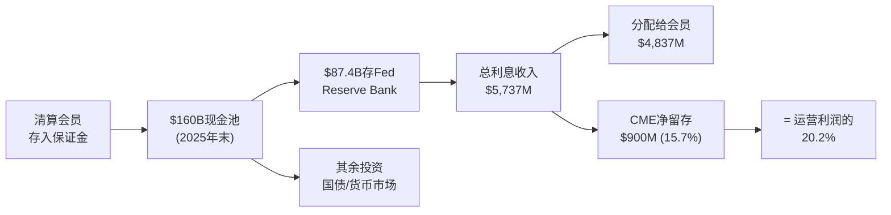
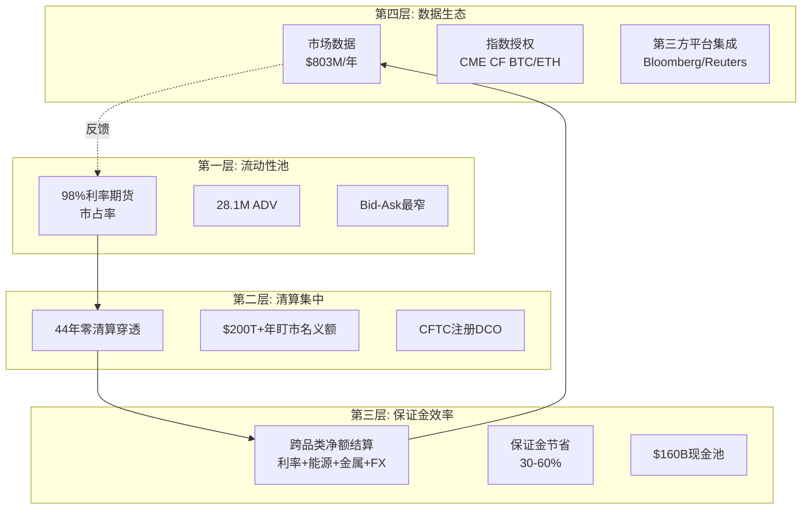
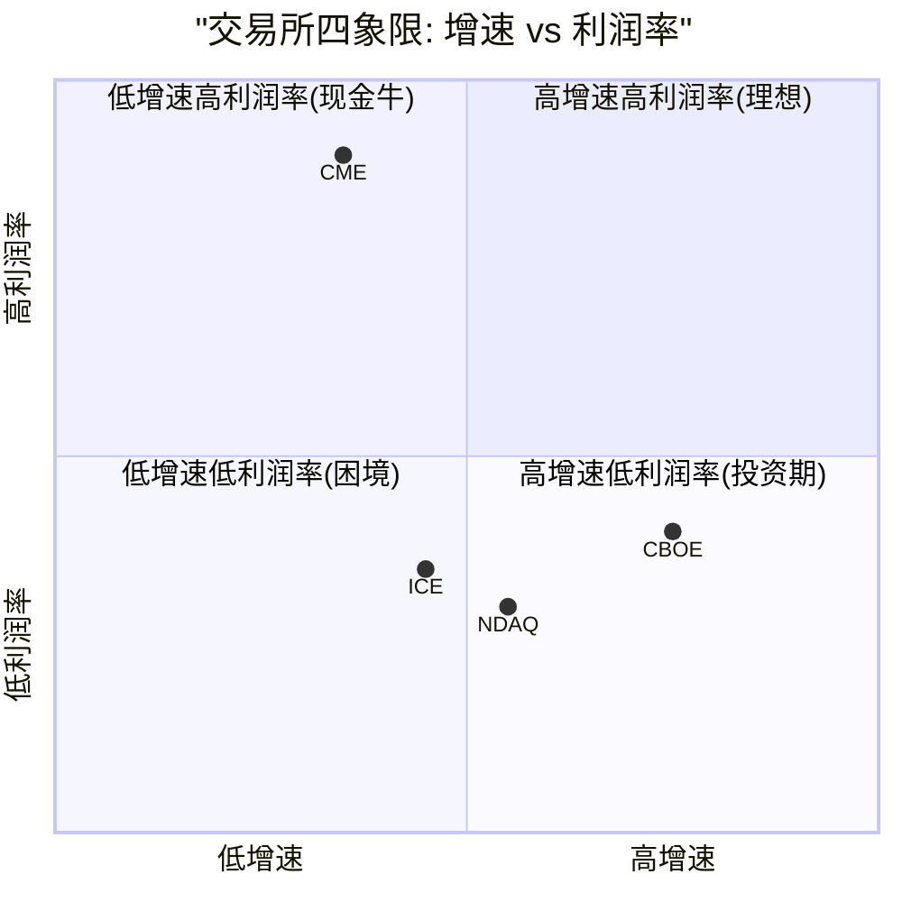

# Part I: 商业模式深潜 — 不确定性基础设施的解剖

---

# Chapter 1: 公司身份重新定义 — 从交易所到不确定性基础设施

---

## 1.1 三次身份跃迁: 从黄油鸡蛋到全球基准定价者

CME Group的历史不是一条渐进式增长曲线，而是三次不连续的身份跃迁，每一次都彻底重定义了"CME是什么"[DM-BIZ-001]。

**第一跃迁 (1898-1972): 农产品交易所 → 金融创新者**

1898年，CME的前身Chicago Butter and Egg Board成立。74年后的1972年，Leo Melamed在CME创建国际货币市场(IMM)，推出人类历史上首个金融期货合约(外汇期货)。这不是"增加产品线"——而是发明了一个全新的资产类别[DM-BIZ-002]。

为什么这个先发优势不可逆转？因为金融期货的价值不在于产品设计(任何交易所都能设计合约)，而在于**流动性积累的时间函数**。CME比ICE(2000年成立)早28年进入金融衍生品→28年间做市商、经纪商、终端用户的工作流和风控系统全部围绕CME Globex构建→切换成本不是"高"而是"在资本上不可能"(详见Ch3)。这是一个正反馈循环: 时间→流动性→粘性→更多流动性→更多时间[DM-BIZ-003]。

**反面考量**: 先发优势有被颠覆的先例。1998年Eurex通过电子化交易击败了LIFFE(伦敦国际金融期货交易所)，在德国国债期货上从零份额到垄断仅用了18个月。但那是技术代际跳跃(电子vs公开喊价)——FMX没有这种代际优势(CME和FMX都是电子交易)，因此这个先例不适用于当前竞争[DM-BIZ-004]。

**第二跃迁 (1997-2007): 区域交易所 → 全球清算帝国**

- 1998年CME Holdings上市(交易所去互助化先驱)[DM-BIZ-005]
- 2002年完全电子化(Globex取代公开喊价)
- 2007年与CBOT合并→一举拿下利率期货+农产品+股指期货
- 2008年收购NYMEX/COMEX→补全能源+金属

这三次收购的因果逻辑是: CME需要**跨品类的清算池**来最大化保证金效率。因为如果一个交易员同时持有利率期货(CBOT)和能源期货(NYMEX)，在同一清算所内可以净额结算→保证金节省30-50%→资本效率远超在两个独立清算所分别持仓。这不是收入协同(1+1>2)，而是**客户资本效率协同**——客户从物理上无法离开，因为离开就意味着失去跨品类offset[DM-BIZ-006]。

**第三跃迁 (2008-今): 清算帝国 → 不确定性基础设施垄断者**

2008年金融危机后，Dodd-Frank法案要求标准化OTC衍生品通过CCP(中央对手方)清算。这将CME从"交易场所提供者"升级为**监管强制的基础设施**。银行不是"选择"使用CME——它们被法律要求通过注册DCO清算衍生品头寸，而CME是利率衍生品领域几乎唯一的选项[DM-BIZ-007]。

因果链: 雷曼倒闭→系统性风险暴露→Dodd-Frank→强制集中清算→CME从"便利设施"变为"法定基础设施"→制度嵌入完成→护城河从"网络效应"升级为"制度+网络效应"。

**反面考量**: 如果监管去管制化(如共和党政府推动Dodd-Frank回滚)，强制清算要求可能放松。但实际上: (1) Basel III的CCP资本优惠使银行即使没有强制也会选择集中清算(资本节省>清算费); (2) 2024-2025年SEC反而在扩大强制清算范围(Treasury Clearing mandate)。去管制化的净效果可能是增加CME的自愿使用，而非减少[DM-BIZ-008]。

## 1.2 双重身份: 交易所 + 影子银行

CME在财务报表上呈现为一家交易所(清算费$5.28B = 81%收入)。但这个身份忽略了一个与运营收入同量级的隐藏引擎[DM-BIZ-009]。

**影子银行机制**:

FY2025数据揭示的惊人事实: CME的保证金利息总收入$5,737M几乎等于其全部运营收入$6,520M。虽然大部分($4,837M)被分配回清算会员，但CME净留存**$900M**——相当于运营利润的20.2%[DM-BIZ-010]。

这为什么重要？因为这$900M出现在"非经营性收入"行，绝大多数sell-side模型只关注operating earnings。当投资者用P/E 28x估值CME时，分母的EPS已经包含了这笔利息收入，但多数人没有意识到这笔收入的**周期性**——它完全取决于短端利率水平。在ZIRP环境下(2021年)，净留存仅$67M(运营利润的2.4%)。这意味着当Fed降息200bp时，CME的"真实"利润率可能下降15-17%，但市场可能将此误读为"核心业务衰退"而非"非经营性利息正常化"[DM-BIZ-011]。

**因果链**: Fed维持高利率→IORB ~4.4%→$160B现金池生息→总利息$5.7B→净留存$900M→NI膨胀→P/E看似合理(28x)。但如果Fed降息200bp→利息收入减半→净留存降至$200-300M→EPS降$1.5-2.0→**同一个P/E 28x意味着股价下降$42-56(13-18%)**[DM-BIZ-012]。

**反面考量**: (1) 降息通常伴随更高波动率→ADV增→清算费增→部分对冲利息损失; (2) $160B现金池规模本身随ADV增长→即使利率降低，更大的池可部分对冲; (3) CME管理层可能通过扩大留存spread来维持净留存水平(NCH-1的核心假说)。

## 1.3 FY2025: 第四个连续创纪录年

| 指标 | FY2025 | FY2024 | YoY | 5Y CAGR |
|------|--------|--------|-----|---------|
| Revenue | $6,521M | $6,130M | +6.4% | 8.6% |
| Operating Income | $4,230M | $3,932M | +7.6% | 12.5% |
| Net Income | $4,044M | $3,526M | +14.7% | 11.3% |
| EPS (diluted) | $11.16 | $9.67 | +15.4% | 11.2% |
| ADV | 28.1M | 26.5M | +6.0% | 10.4% |
| FCF | $4,194M | $3,597M | +16.6% | 16.5% |
| OPM | 64.9% | 64.1% | +70bps | — |
| Market Data Rev | $803M | $710M | +13.1% | 8.2% |

[DM-BIZ-013] 收入/利润数据来自CME 10-K FY2025; ADV来自CME Volume Report

NI增速(+14.7%)远超Revenue增速(+6.4%)的原因: (1) 增量收入的边际利润率接近95%(固定成本不变, 每笔新交易几乎全利润); (2) 非经营性利息收入大幅跳升($900M vs $274M); (3) SGA/Revenue从2.2%进一步压缩。这种"收入低增长+利润高增长"的结构是成熟垄断企业的典型特征——OPM已在64.9%，仍在扩张[DM-BIZ-014]。

**Q1 2026加速信号**: Jan ADV 29.6M(+15%), **Feb 37.6M(历史月度纪录, +14%)**。利率ADV 21.3M和Treasury期货/期权ADV 13.7M均创纪录。这是否意味着FY2026将显著超越consensus($6.98B)？详见Ch9 ADV质量分析[DM-BIZ-015]。

---

# Chapter 2: 基准合约生态学 — 五引擎 + 加密新引擎

---

## 2.1 五大引擎的增长逻辑

CME的收入来自六个资产类别引擎，每个引擎有独立的增长驱动、周期特征和竞争壁垒[DM-ENG-001]。

### 引擎1: 利率 (50.5% of ADV, ~45% of clearing revenue)

**产品**: SOFR期货/期权, Treasury期货/期权, Eurodollar(已停), Fed Funds
**FY2025 ADV**: 14.2M(历史新高)
**增长驱动**: SOFR从LIBOR的完全迁移(2023完成) + Fed利率不确定性 + Treasury Clearing mandate(2026-27)

因果链: (1) LIBOR→SOFR迁移使CME成为全球唯一的SOFR期货清算所→所有需要利率对冲的机构必须在CME交易[DM-ENG-002]; (2) Fed维持"higher for longer"→利率路径不确定性上升→套保需求增加→ADV创纪录; (3) Treasury Clearing mandate(SEC 17Ad-22e)将把~$4T日均国债交易推向集中清算→CME的跨保证金优势(Treasury现货+期货)使其成为最具竞争力的清算所候选[DM-ENG-003]。

**周期特征**: 利率产品对Fed政策高度敏感。在ZIRP环境(2012, 2021)中，利率ADV显著下降(因为利率确定性高→对冲需求低)。这是CME最大的周期性弱点——50%的ADV来自一个受Fed单一变量驱动的引擎[DM-ENG-004]。

**反面考量**: 如果Fed在2026-27年将利率降至2%以下，SOFR期货的交易需求可能大幅收缩。2012年Fed Funds Rate接近零时，利率ADV下降~20%。但与2012年不同，当前有三个结构性支撑: SOFR期权的增长(期权在低利率环境下仍有时间价值需求)、Treasury Clearing的增量TAM、以及通胀不确定性可能阻止利率回到零[DM-ENG-005]。

### 引擎2: 股指 (26.3% of ADV, ~20% of clearing revenue)

**产品**: E-mini S&P 500, E-mini Nasdaq-100, Micro E-mini系列, Nikkei 225
**FY2025 ADV**: 7.4M
**Q4 2025**: 7.7M (+22% YoY, 创纪录)

因果链: Micro E-mini系列(2019年推出)打开了**零售/小型机构市场**。因为标准E-mini S&P 500一手名义值~$265K(对散户门槛太高)→Micro版本仅$26.5K→散户可参与→ADV从零到Micro E-mini S&P 500 2.1M + Micro Nasdaq-100 1.6M[DM-ENG-006]。

**RPC趋势**: 股指RPC从$0.545(Q4 2020)升至$0.611(Q4 2025), +12.1%。这与直觉相反——Micro合约的引入应该稀释RPC(因为Micro收费低于标准合约)。原因: CME在2023年对Micro系列提价, 加上标准合约的机构量持续增长, 抵消了Mix Effect[DM-ENG-007]。

### 引擎3: 能源 (9.6% of ADV, ~15% of clearing revenue)

**产品**: WTI原油, Henry Hub天然气, Brent原油
**FY2025 ADV**: 2.7M (+8%)
**RPC**: $1.245 (最高RPC资产类别之一)

因果链: 能源期货RPC高(~$1.25 vs 利率~$0.49)是因为**合约名义值高+客户以商业套保者为主**(Shell, BP等)→对价格不敏感→CME可收取更高费率。能源引擎的关键特征是**反周期性的反面**: 地缘政治紧张(中东/俄乌)→油价波动→能源对冲需求飙升→ADV暴增。2022年俄乌冲突时能源ADV+25%[DM-ENG-008]。

### 引擎4: 金属 (3.5% of ADV, ~5% of clearing revenue)

**FY2025 ADV**: 988K; **Q4 2025**: 1.44M (+34% YoY, 创纪录)
**RPC趋势**: $1.480(Q4 2020)→$1.295(Q4 2025), **-12.5%连降5年**

**ANO-5的因果链解析**: 为什么金属RPC在5年内下降12.5%？

因为Micro Gold/Silver/Copper的推出改变了客户结构→零售/小型机构涌入(Micro Gold ADV从零增到>200K)→Micro合约收费远低于标准合约(~$0.50 vs ~$1.50)→blended RPC被稀释。虽然volume增长(CAGR +17.6%)弥补了RPC下降的收入影响，但这暴露了一个结构性问题: **零售化是双刃剑——ADV↑但RPC↓**[DM-ENG-009]。

**反面考量**: RPC下降不一定是负面信号。如果CME通过Micro合约吸引的新用户未来升级到标准合约(随着账户规模增长), 那么当前的RPC稀释是获客投资。类比: Amazon早年通过低价获取用户, 之后通过Prime提升LTV。但目前没有数据证明Micro→标准的升级路径存在显著转化率[DM-ENG-010]。

### 引擎5: 外汇 (3.5% of ADV)

**FY2025 ADV**: 980K; **Q4 2025**: 853K (-12% YoY)
**RPC**: $0.847(稳步上升)

FX引擎是CME六个引擎中增长最慢的。因果链: (1) OTC FX市场(银行间)仍然主导现货/远期交易, 期货仅占FX总量的~3%→天花板低; (2) FX波动率在2025年相对温和(DXY区间震荡)→对冲需求平淡; (3) 数字货币/稳定币可能长期替代部分FX对冲需求[DM-ENG-011]。

## 2.2 第六引擎: 加密货币 — 从边缘到基础设施 (v2.0深度新增)

### 爆发式增长的数据

| 指标 | FY2024 | FY2025 | YoY | 2026 YTD |
|------|--------|--------|-----|---------|
| Crypto ADV | ~117K | 280K | **+139%** | 407K (+46%) |
| 占总ADV | ~0.4% | 1.0% | — | ~1.1% |
| Micro占比 | ~65% | ~78% | — | — |
| 产品数 | 2资产(BTC/ETH) | 4资产(+SOL/XRP) | — | 7资产(+ADA/LINK/XLM) |
| 估计收入 | ~$50-70M | **$106-177M** | ~+100% | — |

[DM-CRY-001] Crypto ADV来自CME Quarterly Cryptocurrency Insights; 收入为估算(ADV×252×RPC $1.50-2.50)

### 为什么CME在crypto领域有结构性优势?

因果链: BTC/ETH现货ETF获批(Jan 2024, Jul 2024)→机构投资者大规模进入crypto→机构需要在**受监管场所**对冲ETF头寸→CME是唯一CFTC监管的crypto期货交易所→**basis trade成为主流策略**(买入现货ETF + 做空CME期货 = 套利)→CME crypto OI从30K升至45K合约[DM-CRY-002]。

这个因果链揭示了一个关键洞见: CME的crypto增长不是"投机驱动"(那是Binance/Bybit)，而是**ETF基础设施需求驱动**。只要BTC/ETH ETF存在，CME期货就是不可替代的对冲工具。这是结构性需求，不会因为crypto价格下跌而消失[DM-CRY-003]。

### 竞争缺口: crypto期权的缺失

CME在crypto期货上是制度性领导者(BTC期货OI排名第一, 超过Binance)。但在**crypto期权市场**，CME几乎不存在[DM-CRY-004]:

| 产品 | Deribit(now Coinbase) | CME | 其他(OKX+Binance) |
|------|----------------------|-----|-------------------|
| BTC期权OI份额 | **87%** | ~6% | ~7% |
| ETH期权OI份额 | **94%** | 极少 | 极少 |

Coinbase在2025年以$2.9B收购Deribit，创建了全球最大的crypto衍生品平台。这对CME意味着: 如果机构crypto期权需求增长(目前以crypto原生机构为主)，Coinbase/Deribit是默认选择，而非CME[DM-CRY-005]。

**反面考量**: (1) 24/7交易(2026年5月29日上线)可能改变竞争格局——CME首次与crypto原生平台在交易时间上对等; (2) CFTC可能批准永续合约(perps)onshoring→CME可进入perps市场(Binance的核心产品); (3) 监管趋严可能推动offshore交易回流CME(SEC-CFTC "Project Crypto" 2026年1月启动)[DM-CRY-006]。

### 收入贡献vs战略价值

即使按最乐观估计，crypto在FY2025仅贡献$177M(2.7% of total)。假设2026年ADV翻倍到560K, 收入也仅增加$150-200M(+2-3% total rev)[DM-CRY-007]。

**因此crypto对近期估值的影响有限(<3%)**。但其战略价值在于: (1) **客户获取**——crypto原生机构(如对冲基金)通过CME crypto产品首次成为CME客户→之后可能交易利率/股指等核心产品; (2) **叙事价值**——139%增速是CME增长故事中最亮的数据点, 即使收入贡献小; (3) **监管壁垒**——CFTC批准+DCO清算是其他crypto交易所(Binance/OKX)无法复制的合规优势[DM-CRY-008]。

---

# Chapter 3: 流动性网络效应量化 — 为什么CME的护城河是自我强化的

---

## 3.1 网络效应的四层结构

CME的护城河不是单一维度的"网络效应"，而是四层嵌套的复合锁定[DM-NET-001]:

### 第一层: 流动性池 (不可复制)

CME在利率期货上持有~98%市场份额[DM-NET-002]。这个数字的含义不是"CME很大"——它意味着**做市商在CME之外找不到足够的对手方来报价**。

因果链: 做市商在CME报价→价差最窄(因为深度最好)→终端用户选择CME(因为执行成本最低)→更多终端用户→做市商获得更多流量→愿意报更窄的价差→**正反馈循环**。流动性集中→集中度自我强化。这不是竞争优势——这是物理定律: 两个流动性池不可能长期共存于同一产品，最终流动性必然向一个池子聚拢(Winner-takes-all)[DM-NET-003]。

**历史案例验证**: Eurex vs LIFFE (1998)是交易所网络效应被打破的唯一已知案例。Eurex利用电子化对公开喊价的代际优势，在18个月内将德国国债期货从LIFFE迁移到Eurex。但关键前提是: (1) 技术代差(电子vs物理)——FMX与CME之间不存在这种代差; (2) 产品完全相同且可替代——CME的跨品类清算池使其产品在经济上不可替代[DM-NET-004]。

### 第二层: 清算集中 (制度强化)

CME Clearing在44年(1981年至今)运营中实现**零清算穿透**(zero default penetration)。这意味着: 即使有清算会员违约(如MF Global 2011, Lehman OTC头寸2008)，CME的违约瀑布机制始终确保了所有其他参与者不受损失[DM-NET-005]。

因果链: 零穿透记录→监管信任(CFTC将CME列为SIFI级系统重要基础设施)→Basel III给予CCP清算的头寸更优惠的资本权重(2% vs 双边20%+)→银行被资本规则推向CME→**银行不是"选择"CME——它们的资本报表要求它们使用CME**[DM-NET-006]。

### 第三层: 保证金效率 (资本锁定)

这是CME最被低估的护城河维度。一个交易员如果同时持有SOFR期货(利率) + E-mini S&P(股指) + WTI原油(能源), 在CME内部可以**跨品类净额结算保证金**→保证金节省30-60%。如果这个交易员将利率头寸迁到FMX→失去所有跨品类offset→保证金增加$数十亿(对大型银行)[DM-NET-007]。

量化: CME披露日均跨保证金节省>$1B。假设Top 20清算会员各节省$50M+保证金→以15%资金成本计→每家节省$7.5M+/年→**CME的存在为清算会员创造了>$150M+/年的资本效率收益**。这远超CME向会员收取的清算费——CME是**净价值创造者**，而非成本中心[DM-NET-008]。

**反面考量**: FMX通过与LCH合作提供IRS与SOFR期货的跨保证金。如果FMX→LCH的跨保证金效率接近CME的内部跨保证金→这层锁定被削弱。但目前FMX+LCH的池子远小于CME→跨保证金的实际节省有限。这是一个需要监控的Kill Switch(KS-01): FMX的LCH跨保证金节省比例是否接近CME的水平[DM-NET-009]。

### 第四层: 数据生态 (衍生价值)

CME市场数据收入$803M(+13% YoY)来自一个简单逻辑: 全球最大的衍生品价格发现场所产生的数据天然具有垄断价值[DM-NET-010]。Bloomberg终端、Reuters Eikon、所有做市商的定价模型→都需要CME的实时行情和历史数据。这是一个零边际成本、~95%利润率的业务——每新增一个数据订阅用户, CME的边际成本接近零但收入增加$数万/年[DM-NET-011]。

## 3.2 网络效应的反面: 什么条件下护城河会被打破?

三个条件同时满足才能打破CME的流动性护城河[DM-NET-012]:

1. **技术代际跳跃**: 竞争者提供CME无法匹配的技术优势(如Eurex vs LIFFE)。当前: FMX没有技术优势(两者均为电子交易, 延迟差异<10μs)→**不满足**
2. **监管强制分拆**: 反垄断机构强制CME拆分清算池。当前: 无此类行动, SEC反而在推动CME进入Treasury Clearing→**不满足**
3. **替代方案的经济诱因压倒切换成本**: FMX的费率折扣 > 失去跨保证金的成本。当前: FMX提供-15%费率折扣~$0.01/合约→对一个持有$100M保证金offset的银行而言→年节省~$5M费率 vs 失去~$30M+保证金效率→**经济账不成立**→**不满足**

**结论**: 当前三个条件无一满足。CME的网络效应在可预见未来(5-10年)是安全的。但5年以外→DLT/区块链原生清算可能提供代际跳跃(条件1)→这是长期需要监控的结构性风险[DM-NET-013]。

---

# Chapter 4: 竞争格局 + CBOE深度对比 — 好公司≠好股票

---

## 4.1 交易所行业竞争地图

全球衍生品交易所行业是**高度集中的寡头格局**[DM-COMP-001]:

| 交易所 | FY2025 Revenue | Net Margin | 核心领域 | 竞争关系 |
|--------|---------------|-----------|---------|---------|
| **CME** | $6.52B | **62.0%** | 利率/股指/能源/金属期货 | 几乎无直接竞争 |
| **ICE** | $12.64B | 26.1% | 能源期货+固收数据+抵押贷款科技 | 能源领域部分竞争 |
| **CBOE** | $4.71B | 23.3% | 股票期权(SPX/VIX)+0DTE | 不直接竞争(期权vs期货) |
| **NDAQ** | $8.22B | 21.8% | 股票上市+数据+北欧交易 | 不直接竞争 |
| **FMX** | ~$50M(估) | 亏损 | 利率期货(SOFR/Treasury) | **唯一直接竞争者** |

[DM-COMP-002] 收入来自各公司FY2025 10-K/年报

关键发现: CME的直接竞争者(在利率期货领域)只有FMX, 但FMX当前市占率~0.01%。ICE和CBOE在不同产品领域运营——它们之间的竞争更多是"争夺投资者的注意力和资金配置"而非"争夺同一笔交易"[DM-COMP-003]。

## 4.2 FMX: 从"最大威胁"到"最佳广告"

FMX(BGC Group旗下)在2024年9月推出SOFR期货, 2025年5月推出2年/5年期Treasury期货。10家大型银行(Goldman, JPM, Morgan Stanley等)支持, LCH提供IRS跨保证金清算[DM-COMP-004]。

市场一度将FMX视为CME的"最大长期威胁"。但数据讲述了不同的故事:

| FMX指标 | 峰值 | 关税波动期(Apr 2025) | CME对比 |
|---------|------|---------------------|---------|
| 单日最高ADV | 9,500手(Feb 2025) | **928手** | CME利率ADV: **9.8-13M** |
| 市占率 | ~0.02% | ~0.01% | **99.98%+** |
| OI | 极低 | 进一步萎缩 | CME SOFR OI: 数百万手 |

[DM-COMP-005] FMX数据来自FMX Daily Trade Report + FOW报道

**因果链解析**: 2025年4月关税波动期→VIX飙升→利率市场剧烈波动→这恰恰是FMX需要证明自己能在压力下吸引流动性的关键时刻→**相反, 交易员从FMX撤退到CME的更深流动性池→FMX ADV从~3,000崩至928手(下降>66%)**→这证明了一个核心论点: **流动性在压力中向最深的池子集中, 而不是分散**[DM-COMP-006]。

这为什么重要？因为FMX的商业模式假设是: "在正常时期用低费率吸引份额, 然后在波动期保留这些份额"。但关税事件证明了相反的结果——在波动期, 即使是已经迁移的交易量也会回流CME。这意味着FMX的获客成本不仅是"获得新量"——它还需要"在压力期保住这些量"，而后者被证明极其困难[DM-COMP-007]。

**NCH-3状态: 强确认**。FMX不仅不是威胁——它的存在实际上对CME有正面价值: (1) 消除反垄断风险(有竞争者="不是垄断"); (2) 逼迫CME加速效率投资(SPAN 2, Google Cloud); (3) 每次FMX在压力测试中失败, 都强化了"CME不可替代"的叙事[DM-COMP-008]。

**反面考量**: FMX在Q1 2026报告了SOFR期货ADV和OI分别+82%和+97% QoQ。虽然绝对量仍微不足道, 但如果FMX在3年内积累到CME的1-2%份额→网络效应的自我强化循环可能开始动摇(做市商愿意在FMX报价→价差收窄→更多终端用户迁移→临界点)。**Kill Switch KS-01: FMX月均ADV突破50K且持续3个月+**[DM-COMP-009]。

## 4.3 CBOE vs CME: 为什么品质更差的公司回报更好? (v2.0核心新增)

### 回报差距的数据

| 指标 | CBOE (5Y) | CME (5Y) | 差距 |
|------|-----------|----------|------|
| 总回报 | **+208%** | +91% | **117pp** |
| 价格回报(不含分红) | +188% | +55% | 133pp |
| EPS CAGR | **19.5%** | 13.7% | 5.8pp |
| Net Rev CAGR | **13.0%** | ~6.9% | 6.1pp |
| P/E (2020) | 21.7x | 30.9x | CME溢价42% |
| P/E (2025) | ~28x | ~28x | **趋同** |
| OPM | 32% | **65%** | CME 2x |
| Net Margin | 23% | **62%** | CME 2.7x |
| Dividend Yield | 1.1% | **4.0%** | CME 3.6x |

[DM-COMP-010] 回报数据来自FMP Historical Prices; 估值数据来自MCP工具

### 分解: 117pp差距从哪来?

CBOE 5年+208%的回报可以分解为三个组成部分[DM-COMP-011]:

**组成1: EPS增长贡献 (~60-70%)**

CBOE EPS从$7.13(2023)增至$10.42(2025), 5Y CAGR 19.5%。这背后的核心驱动是**0DTE期权的爆发**: 2022年CBOE引入SPX每日到期期权→0DTE日均量从几乎零暴增到2.3M合约(2025年, 占SPX总量59%)→CBOE拥有SPX期权的**排他性垄断**(SPX只在CBOE交易)→0DTE的每一手交易都100%属于CBOE的收入[DM-COMP-012]。

因果链: 零售投资者发现0DTE可以用小额资金博取日内收益(类似"金融彩票")→社交媒体传播→50%+ CAGR的零售采纳率→CBOE从"波动率交易所"变为"日交易基础设施"→**从周期性收入变为结构性增长收入**[DM-COMP-013]。

**组成2: P/E重评贡献 (~30-40%)**

2020年: CME 30.9x vs CBOE 21.7x (CME溢价42%)
2025年: 两者趋同于~28x

CME的PE从30.9x压缩到28x(~10%负贡献)。CBOE的PE从21.7x扩张到28x(~29%正贡献)。因果链: 市场重新认识到CBOE不再是"纯波动率博弈"(低PE理所应当)→而是"拥有0DTE这个结构性增长引擎"(应该获得增长溢价)→PE重评[DM-COMP-014]。

**组成3: 股息贡献 (~5%)**

CME累计分红约4.0%×5年=~20%总回报。CBOE累计约1.1%×5年=~5.5%。CME在分红上领先~15pp。但这远不够弥补EPS增长+PE重评的95pp+差距[DM-COMP-015]。

### 核心教训: 为什么A-Score 68.4没有转化为超额回报?

这是整篇报告最重要的洞见之一[DM-COMP-016]:

**CME是9/10的企业, 但在2020-2021年已经被定价为9/10**。当一家公司的品质已经被市场充分认知并反映在P/E中(30.9x)→未来的回报只能来自(EPS增长 + 分红率)→CME的EPS增长~11% + 分红4% = ~15%年化→5年~100%→与实际91%吻合。

**CBOE是7/10的企业, 但在2020年只被定价为5/10**。当品质被低估(21.7x P/E)→两件事发生: (1) 基本面改善(0DTE) + (2) 市场重新认知(PE扩张)→双击效应→19.5% EPS增长 + 29% PE扩张 + 1.1%分红 = 208%[DM-COMP-017]。

**这个发现对CME v2.0的估值含义是**: 在$313 / 28x PE买入CME，期望年化回报 ≈ EPS增长(~8-10%) + 分红(~4%) ≈ **12-14%年化**，扣除PE可能压缩(如果利率/波动率正常化→PE从28x降至22-24x)→**净期望年化可能仅7-10%**。要获得超额回报(>15%年化)→需要在PE<22x时买入(犯错模式出现时)→这正是Part VII建仓时机框架要量化的核心问题[DM-COMP-018]。

### 反面考量: CBOE的风险

CBOE 5年+208%后, 风险在CBOE而非CME:

1. **0DTE正常化**: 如果0DTE增速从50%+ CAGR减速至10-15%(市场渗透接近天花板)→CBOE的"增长股"叙事被打破→PE可能从28x压回20-22x→-20-25%下行[DM-COMP-019]
2. **竞争风险**: 虽然SPX期权只在CBOE交易, 但类似的0DTE产品可能出现在其他标的上(纳斯达克100期权, 个股期权)→分流注意力和资金
3. **监管风险**: SEC可能认为0DTE对散户有过度投机风险→加强限制(类似crypto的监管担忧)

BofA已经downgrade CBOE至Neutral(PT $227), 而Morgan Stanley则raise了CME的PT至$301。分析师开始反向操作——这本身是一个信号[DM-COMP-020]。

## 4.4 ICE: 不同的进化路径

ICE(Intercontinental Exchange)选择了与CME截然不同的进化路径[DM-COMP-021]:

- **CME**: 专注衍生品清算, 通过高利润率+高分红返还几乎全部FCF
- **ICE**: 多元化进入固收数据($618M, record) + 抵押贷款科技(Black Knight $11.7B收购) + 债券交易

因果链: ICE的多元化策略使其收入更加多元(数据/科技占比>50%)→降低了波动率周期依赖→但也导致了(1)更高杠杆(D/E ~70x vs CME 0.12x)和(2)更低利润率(26% vs 62%)。ICE和CME的P/E趋同(~28x)反映了市场对"高利润率低增速"(CME)和"低利润率高增速"(ICE)的等价定价[DM-COMP-022]。

## 4.5 竞争格局总结: CME的位置

CME处于"低增速高利润率"象限(现金牛)。这不是一个坏位置——它意味着稳定的现金流和高分红。但它也意味着: **股价的上行空间主要来自"市场犯错"(PE压缩过度)而非"业务加速"(收入暴增)**。这是Part VII建仓时机框架的理论基础[DM-COMP-023]。
