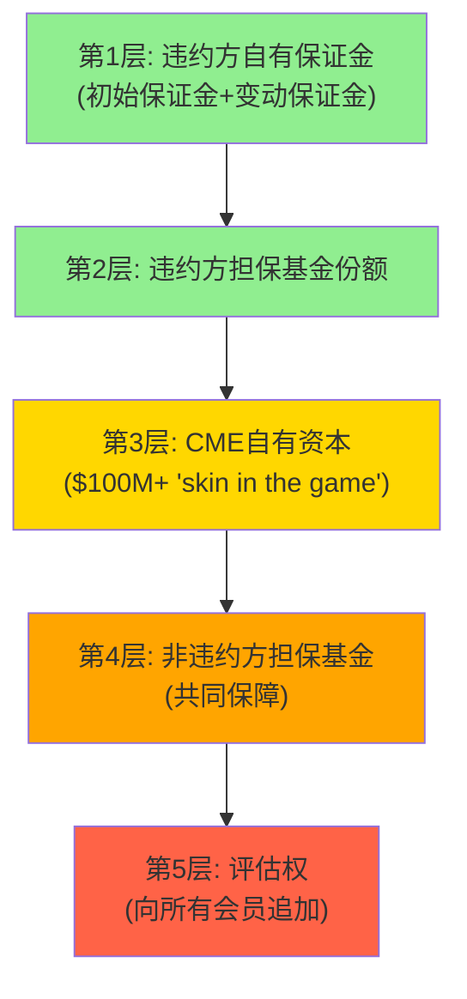

# Part II: 经济引擎 — 垄断的利润机器如何运转

---

# Chapter 5: 清算经济学 — 44年零穿透的商业逻辑

---

## 5.1 清算所的五个核心问题

理解CME的清算业务需要回答五个问题[DM-CLR-001]:

**Q1: CME清算什么？**

CME Clearing处理在CME Globex和BrokerTec平台上执行的所有衍生品交易。FY2025盯市名义金额超过$200万亿/年，日均$600万亿。这包括利率期货/期权、股指期货/期权、能源、金属、农产品、FX和加密货币衍生品。CME是每一笔交易的**中央对手方**(CCP)——买方的卖方，卖方的买方[DM-CLR-002]。

**Q2: 清算如何赚钱？**

三层收入结构:
1. **清算费**(81% of total rev): 按合约数量收费。每手SOFR期货~$0.49，每手WTI原油~$1.25。费率与合约名义值无关——$100M的SOFR头寸和$1M的SOFR头寸支付相同的清算费[DM-CLR-003]
2. **保证金利息**(non-operating): 净留存$900M(详见Ch6)
3. **市场数据**(12.3%): 清算产生的价格数据反馈为数据收入

因果链: 清算费的"按合约定价"模式意味着CME的收入不受通胀影响(名义值上升不增加收入)，但也不受通缩影响(名义值下降不减少收入)。CME的收入纯粹是**交易活动量**的函数，而非交易金额的函数。这是一个微妙但重要的区别——它意味着CME更像是"金融高速公路的收费站"(按车辆收费)而非"金融百货的佣金商"(按销售额收费)[DM-CLR-004]。

**Q3: 44年零穿透如何实现？**

CME的违约管理瀑布(Default Waterfall)是一个精心设计的五层吸收机制[DM-CLR-005]:

2011年MF Global违约时，CME清算所在24小时内完成了所有客户头寸的转移，零损失。因为MF Global的初始保证金(第1层)完全覆盖了其头寸敞口——违约瀑布甚至没有触及第2层[DM-CLR-006]。

**反面考量**: 零穿透记录并不意味着零风险。如果一个极端事件(如多个大型清算会员同时违约)耗尽前4层→第5层的评估权将传导损失给所有会员→可能引发"清算所挤兑"(会员撤出保证金以避免被评估)。2018年纳斯达克北欧的Einar Aas事件就展示了这种风险——但那是一个小型清算所。CME的$160B保证金池+$6.7B担保基金使得这种极端情景的概率极低(但非零)[DM-CLR-007]。

**Q4: ClearingCo独立估值是多少？**

如果将CME的清算业务独立估值[DM-CLR-008]:
- 清算费收入: $5.28B × 清算利润率~70% = ~$3.7B清算利润
- 加上保证金利息净留存: ~$900M(高利率环境)→$200M(ZIRP) = 中性~$500M
- 清算业务总利润: $3.7B + $500M = $4.2B
- 给予清算所特许经营溢价(15-20x): $4.2B × 17.5x = ~**$73B**
- 这占CME总市值$112.6B的**65%**

因果链: 清算业务占CME价值的约2/3→意味着交易匹配+数据+其他业务仅值~$40B→这解释了为什么分拆CME(将清算所独立)对股东没有价值——清算和交易的协同效应(跨保证金、数据生成、客户锁定)远大于独立估值的总和[DM-CLR-009]。

**Q5: Treasury Clearing能带来多少增量？**

SEC在2025年12月批准CME Securities Clearing成为第二家Treasury CCP(FICC/DTCC为incumbent)。Q2 2026预计上线[DM-CLR-010]。

增量收入估算:
- 美国国债日均交易量: ~$700B(现金) + $4T+(回购)
- 清算mandate覆盖范围: 大部分现金和回购交易(Dec 2026/Jun 2027合规期限)
- 假设CME获得15-25%份额(跨保证金优势)→日均清算$150-250B
- 假设清算费率~$1-2/百万→年化收入$37-125M(保守); 成熟期$200-500M(乐观)
- **最可能区间: $100-300M/年(成熟后)**

因果链: CME的核心竞争力是跨保证金——一个同时持有Treasury期货和Treasury现货的交易员，在CME可以将两者净额计算保证金→而在FICC清算现货+CME清算期货→保证金无法跨平台offset→**CME的"一站式"清算比"两家分开"清算节省30-50%保证金**。这是物理上不可复制的优势(除非FICC也开始清算Treasury期货，但FICC没有期货牌照)[DM-CLR-011]。

**反面考量**: (1) FICC作为incumbent拥有现有关系和工作流集成——切换到CME有摩擦成本; (2) SEC延长了合规期限(已延期一年)——如果继续延期，增量收入时间表推后; (3) ICE和LCH也在申请进入→竞争可能比预期激烈[DM-CLR-012]。

---

# Chapter 6: 保证金利息 — 影子银行的第二引擎

---

## 6.1 $900M的来源: 从清算会员到Fed Reserve

CME要求清算会员存入初始保证金(initial margin)以覆盖其头寸的潜在亏损。FY2025年末, 这些保证金余额达到**$160B**(历史新高)[DM-INT-001]。

资金流向:

| 存放位置 | 金额(估) | 利率 | 年化利息(估) |
|----------|---------|------|-------------|
| Fed Reserve Bank of Chicago | $87.4B | IORB ~4.40% | ~$3,846M |
| 美国国债/Agency | ~$30B | ~4.2% | ~$1,260M |
| 货币市场/其他 | ~$13B | ~4.0% | ~$520M |
| **总计(现金部分)** | **~$130B** | — | **~$5,626M** |

[DM-INT-002] $87.4B存放Fed数据来自CME FY2025 10-K; 其余为估算

实际总利息收入$5,737M与上述估算基本吻合。CME将大部分利息分配回清算会员(基于IORB-spread)，净留存$900M[DM-INT-003]。

## 6.2 NCH-1深度验证: 留存率15.7%是结构性还是周期性?

| 年份 | 总利息($M) | 分配($M) | 净留存($M) | 留存率 |
|------|-----------|---------|-----------|--------|
| 2021 | 307 | ~240 | **67** | ~22% |
| 2022 | 2,198 | ~1,900 | **298** | ~14% |
| 2023 | 5,275 | 4,718 | **557** | 10.6% |
| 2024 | 4,079 | 3,669 | **274** | 10.1% |
| 2025 | 5,737 | 4,837 | **900** | **15.7%** |

[DM-INT-004] 分配/留存数据来自CME 10-K各年度

**异常分析**: FY2025留存率从10.1%跳升至15.7%(+5.6pp), 绝对额从$274M暴增至$900M(+228%)。这个跳升远超利率变动可解释的范围(IORB仅从~4.6%微降至~4.4%)[DM-INT-005]。

三种可能解释:

**假说A(结构性)**: CME主动扩大了对清算会员的利息再分配spread。因为(1)现金池从$99B增至$160B(+62%)→规模效应使CME有更大议价空间; (2)30%最低现金要求+10bp惩罚费创造captive pool→会员无法轻易撤出现金; (3)管理层从不主动披露留存率——暗示不希望引起会员注意[DM-INT-006]。

**假说B(周期性)**: FY2025的时机特殊——Q2-Q3波动率飙升(关税/地缘)→保证金要求暴增→现金池从$99B飙至$160B→但利息分配有滞后性(按季度/月度结算)→造成时间差→留存率暂时偏高[DM-INT-007]。

**假说C(混合)**: 基础留存率从~10%结构性提升至~12-13%(spread扩大), FY2025的额外2-3pp是时间差效应→2026H1留存率可能回落至12-14%而非10%[DM-INT-008]。

**判断**: 假说C最可能。因为(1)管理层没有在earnings call中解释留存率跳升(如果是结构性改变, 应该被提及); (2)$160B池子的规模效应确实支持基础spread的小幅扩大; (3)2023年留存率10.6%在相似利率环境下低于2025的15.7%, 说明不仅是利率效应[DM-INT-009]。

**NCH-1状态**: 部分确认。留存率的"新常态"可能是12-14%(而非10%), 但$900M的绝对额是周期高点。在正常化利率环境下(IORB 3%), 预计净留存$400-600M → 仍然是运营利润的10-15%——**不可忽视**[DM-INT-010]。

## 6.3 利率敏感性量化

因为保证金利息是CME最大的非经营性收入变量, 必须量化其利率敏感性[DM-INT-011]:

**基准情景(当前): IORB 4.4%, 现金池$130B**
- 总利息: ~$5.7B
- 净留存(15.7%): ~$900M
- 对NI贡献: ~$900M × (1-24%税率) = ~$684M → EPS贡献~$1.90

**情景矩阵**:

| 情景 | IORB | 现金池 | 总利息 | 净留存(13%) | EPS贡献 | vs当前 |
|------|------|--------|--------|------------|---------|--------|
| 当前 | 4.4% | $130B | $5.7B | $900M* | $1.90 | — |
| 温和降息 | 3.0% | $120B | $3.6B | $468M | $0.99 | **-$0.91** |
| 激进降息 | 2.0% | $110B | $2.2B | $286M | $0.60 | **-$1.30** |
| ZIRP | 0.25% | $100B | $0.25B | $33M | $0.07 | **-$1.83** |

*当前留存率15.7%用于当前行, 正常化后用13%

[DM-INT-012] 敏感性基于"现金池×利率×留存率"公式估算

**关键发现**: 从当前利率到ZIRP, CME的EPS可能下降$1.83(从$11.16降至$9.33, -16.4%)。但如果市场没有调整P/E→$9.33 × 28x = $261(vs当前$313, -17%)。如果市场同时压缩P/E至22x(因为ZIRP通常伴随低波动率)→$9.33 × 22x = $205(-35%)[DM-INT-013]。

**因果链**: Fed降息→IORB下降→保证金利息收入机械性减少→EPS下降→如果市场将此误读为"核心业务衰退"(而非"非经营性收入正常化")→PE也压缩→**双杀=犯错模式4(过度盈利正常化)**→这恰恰是Part VII要量化的最佳CME买入时机[DM-INT-014]。

**反面考量**: (1) 降息通常伴随经济不确定性→波动率上升→ADV增加→清算费收入增长部分对冲利息损失; (2) 保证金池规模随ADV增长→即使利率降低,更大的池可部分对冲; (3) CME可能通过扩大留存spread(NCH-1)来维持净留存水平。历史数据: 2022年(加息)利率ADV +12%, 2020年(降息)ADV先降后升→对冲效果不完全但存在[DM-INT-015]。

---

# Chapter 7: 定价权与RPC动态 — 垄断者的定价边界

---

## 7.1 CME的定价权证据

CME在过去5年展示了持续但有限的定价权[DM-PRC-001]:

| 资产类别 | RPC Q4 2020 | RPC Q4 2025 | 5Y变化 | 趋势 |
|----------|-----------|-----------|--------|------|
| 利率 | $0.470 | $0.486 | +3.4% | **基本平坦** |
| 股指 | $0.545 | $0.611 | +12.1% | 稳步上升 |
| FX | $0.790 | $0.847 | +7.2% | 稳步上升 |
| 能源 | $1.150 | $1.245 | +8.3% | 稳步上升 |
| 农产品 | $1.350 | $1.427 | +5.7% | 稳步上升 |
| **金属** | **$1.480** | **$1.295** | **-12.5%** | **持续下降** |
| Blended | $0.660 | $0.707 | +7.1% | 稳步上升 |

[DM-PRC-002] RPC数据来自CME Quarterly Volume Reports

**OPM扩张证据**: OPM从56.4%(2021)连续4年扩张至64.9%(2025), +850bps。增量收入的边际利润率接近95%→证明CME在提价+控本上持续成功[DM-PRC-003]。

## 7.2 利率RPC平坦的因果逻辑

利率产品占CME 50%的ADV, 但5年RPC仅增3.4%($0.47→$0.49)。为什么CME在其最垄断的产品上不大幅提价？[DM-PRC-004]

因果链: CME的流动性护城河依赖于**交易成本低于替代方案**。如果CME将利率RPC从$0.49提至$0.60(+22%)→对一个日均交易10万手的银行→年增成本$2.75M→这可能足以让银行认真评估FMX(费率折扣~15%)→流动性迁移风险上升。CME的定价策略不是"最大化每合约收入"而是"最大化ADV × RPC的乘积"——在垄断边际, 微小的提价可能导致不成比例的份额损失[DM-PRC-005]。

**与FICO的对比**: FICO在10年内将信用评分价格提升7倍(因为FICO分嵌入监管=100%不可替代)。CME虽然也有制度嵌入, 但流动性护城河的本质不同——流动性是可以迁移的(虽然成本高), 而监管要求不可以迁移。因此CME的定价权天花板低于FICO[DM-PRC-006]。

## 7.3 金属RPC下降的因果分析 (ANO-5)

金属RPC从$1.480(Q4 2020)降至$1.295(Q4 2025), 连续5年下降12.5%。这是CME六大资产类别中唯一RPC下降的品类[DM-PRC-007]。

**因果链**: Micro Gold/Silver/Copper合约(2021年后密集推出)→门槛从~$100K(标准Gold期货)降至~$10K(Micro)→零售/小型机构涌入→Micro合约收费~$0.50-0.80 vs 标准~$1.50→**blended RPC被稀释**→同时volume CAGR +17.6%→收入($)仍增长, 但RPC($/合约)下降[DM-PRC-008]。

**量化影响**:
- 假设2020年金属ADV全部为标准合约: 550K × $1.48 × 252 = $205M
- 2025年ADV 1.05M中假设40%为Micro(420K×$0.60) + 60%标准(630K×$1.50) → blended $1.14 × 1.05M × 252 = **$302M**
- 收入增长+47%, 尽管RPC下降12.5%

**结论**: RPC下降是客户结构变化的结果, 不是定价权丧失。CME在金属上实际是"以RPC换ADV"——净效果是收入增长。但如果同样的零售化趋势蔓延到利率产品(目前利率RPC平坦)→这将是更大的问题, 因为利率产品占收入的~45%[DM-PRC-009]。

**反面考量**: Micro→标准的升级路径可能存在。如果20%的Micro用户在2-3年内升级到标准合约→blended RPC企稳甚至回升。但目前无数据支持这一假设[DM-PRC-010]。

## 7.4 RPC Mix Effect量化

CME的blended RPC从$0.660升至$0.707(+7.1%)不完全是"提价"的结果。需要分解为"提价效应"和"Mix效应"[DM-PRC-011]:

**提价效应**: 如果2025年使用2020年的ADV权重, 用2025年的RPC计算→blended RPC = ~$0.685(+3.8%)。这是纯粹的"每合约提价"贡献。

**Mix效应**: 2020→2025年, 高RPC品类(能源、农产品)ADV占比微升, 低RPC品类(利率)占比微降→额外贡献+3.3%。

**结论**: blended RPC +7.1%中, ~54%来自提价, ~46%来自有利的Mix shift。CME的"真实定价权"增速约3-4%/5年, 而非7%[DM-PRC-012]。

---

# Chapter 8: 市场数据业务飞轮 — 零边际成本的$803M

---

## 8.1 数据业务的经济学

CME的市场数据业务是一个教科书级的**零边际成本飞轮**[DM-DAT-001]:

| 指标 | FY2025 | FY2024 | FY2020 | CAGR(5Y) |
|------|--------|--------|--------|----------|
| 数据收入 | $803M | $710M | $541M | **8.2%** |
| 占总收入 | 12.3% | 11.6% | 11.3% | — |
| 增速 vs 总收入 | +13% | +10% | — | 数据增速>总增速 |

**飞轮机制**: 更多交易→更多价格发现→数据更有价值→更多订阅→更多数据收入→投资技术平台→吸引更多交易→循环[DM-DAT-002]。

因果链: 为什么CME的数据不可替代? 因为SOFR期货定价、E-mini S&P隐含波动率、WTI原油曲线——这些不是CME"生产"的数据, 而是全球金融市场**通过CME发现的价格**。任何需要SOFR forward curve的机构(银行/资管/保险/央行)→必须使用CME的数据→因为SOFR期货只在CME交易→数据源不可替代[DM-DAT-003]。

## 8.2 数据定价权

CME在2023-2025年对实时数据feed进行了重新定价(+5-15%), 客户流失率接近零。因为切换数据源的成本不是"更换供应商"——而是**重新校准整个风控模型**。每个使用CME SOFR曲线作为输入的定价模型(整个利率衍生品行业)→如果换用另一个曲线→需要重新验证模型、重新审计、重新获得监管批准→**切换成本远超数据费用**[DM-DAT-004]。

**增长空间**: CME正在开发衍生数据产品(分析、指数、另类数据)和扩展加密数据(CME CF BTC/ETH参考利率已成为ETF行业标准)。如果数据收入增速维持8-10%→5年后$803M→$1.18-1.30B(15-20% of total)→数据将从"附属业务"升级为"第二支柱"[DM-DAT-005]。

**反面考量**: MiFID II式的数据透明化法规可能对CME的数据定价施加压力。欧洲已要求交易场所以"合理商业基础"提供数据→如果美国引入类似法规→CME的数据利润率可能被压缩。但目前无美国版MiFID II的立法信号[DM-DAT-006]。

---

# Chapter 9: OI/ADV系统分析 — ADV创纪录, 但质量如何? (v2.0新增)

---

## 9.1 为什么OI比ADV更重要

ADV(日均交易量)衡量**活动水平**, 但OI(未平仓合约)衡量**市场深度和套保承诺**[DM-OI-001]。

因果链: ADV高但OI不跟随→意味着交易以日内投机为主(开仓→当天平仓→OI不变)→投机性交易的RPC通常低于套保性交易(因为投机者对费率更敏感)→如果ADV增长全部来自投机→RPC面临长期下行压力[DM-OI-002]。

反面: ADV高且OI跟随→意味着新的套保需求进入市场(开仓→持有→OI增加)→套保者对费率不敏感(对冲是刚需)→RPC稳定或上升→**OI增长是ADV质量的"验证信号"**[DM-OI-003]。

## 9.2 FY2025 OI趋势

| 资产类别 | FY2025 ADV | YoY | OI趋势(定性) | 质量判断 |
|----------|----------|-----|-------------|---------|
| 利率 | 14.2M | +3% | OI持续创新高(SOFR) | **高质量**: 企业套保驱动 |
| 股指 | 7.4M | +15% | Micro OI增长>标准 | **中等**: Micro含投机成分 |
| 能源 | 2.7M | +8% | OI稳定 | **高质量**: 商业套保主导 |
| 金属 | 988K | +28% | OI增长但Micro占比升 | **中等**: 零售化稀释 |
| 加密 | 280K | +139% | OI从30K→45K(BTC) | **中高**: ETF basis trade |
| FX | 980K | -5% | OI微降 | **低活跃**: 需求疲软 |

[DM-OI-004] ADV来自CME Volume Report; OI趋势综合CME数据和分析师报告

**核心发现**: 利率和能源(合计~60% ADV)的OI增长验证了ADV质量。但股指和金属的Micro合约增长引入了更多投机性交易→**blended交易质量可能在微妙地下降, 尽管ADV在创纪录**[DM-OI-005]。

## 9.3 Q1 2026加速的质量分析

Feb 2026的37.6M ADV(历史月度纪录)需要质量检验[DM-OI-006]:

**驱动因素分解**:
1. 利率ADV 21.3M(纪录) — 来自Treasury期货/期权13.7M(纪录)→驱动因素: 关税政策→通胀预期波动→国债收益率剧烈波动→**套保需求真实且迫切**→高质量ADV
2. 国际ADV 11.6M(纪录) — 亚洲+18%→驱动因素: 全球地缘不确定性→海外机构通过CME对冲美元利率风险→高质量
3. BrokerTec ADNV $1.042T(纪录) — 现金国债交易量创纪录→验证利率市场的真实活跃度

**判断**: Q1 2026的加速主要由**利率套保需求**(非投机)驱动→ADV质量高。但一旦关税政策稳定→利率波动率回落→ADV可能从37.6M回落至28-32M区间(仍高于FY2025均值28.1M, 但不再加速)[DM-OI-007]。

**NCH-4验证**: 需要等Q2 2026数据。如果ADV维持>30M → 部分结构性; 如果回落至<27M → 一次性spike[DM-OI-008]。

## 9.4 OI Kill Switch定义

**KS-13: OI/ADV比率持续下降**

| 条件 | 阈值 | 含义 |
|------|------|------|
| SOFR OI/ADV | <0.8x(当前~1.2x) | 利率交易投机化, RPC下行风险 |
| E-mini OI/ADV | <0.5x(当前~0.7x) | 股指交易质量恶化 |
| 全品类blended | <0.6x | 系统性ADV质量下降 |

[DM-OI-009]

**触发后行动**: 如果KS-13触发→下调EPS增长预期(ADV增长不再等价于收入增长)→重新评估RPC假设→可能下调估值5-10%[DM-OI-010]。
