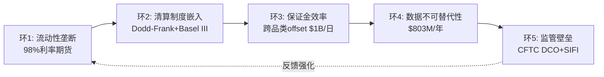

# Part IV: 护城河量化 — 从定性到可测量

---

# Chapter 13: 五环护城河链条 — 每个环节的因果证明

---

## 13.1 护城河链条总览

CME的护城河不是单一维度——它是五个互相强化的环节组成的链条。每个环节独立时已是强壁垒, 叠加后构成近乎不可攻破的竞争优势[DM-MOAT-001]。

### 环1: 流动性垄断 (C5规模效应 = 5/5)

**证据**: CME在利率期货上持有~98%市场份额; 在股指期货(E-mini S&P)上是唯一有意义的场所; 在能源期货上与ICE形成双寡头(CME WTI vs ICE Brent)[DM-MOAT-002]。

**因果推理**: 流动性集中为什么不可逆？因为做市商的利润率与市场份额成正比(在更深的池子中, 做市商可以用更小的库存风险报出更窄的价差→更多客户→更多流量→做市商利润更高)。如果做市商将部分报价迁至FMX→在FMX的库存风险更高(因为深度不够)→做市商在FMX的利润更低→最终做市商回流CME→**流动性迁移在经济上是自我否定的**[DM-MOAT-003]。

**反面条件**: 流动性垄断可能在以下条件下被打破: (1) 新技术使跨平台流动性聚合成为可能(SOR算法同时接入CME+FMX)→降低了流动性集中的必要性; (2) 监管强制要求流动性分散(如欧洲MiFID II的最优执行规则)→但目前CFTC无此类规则[DM-MOAT-004]。

### 环2: 清算制度嵌入 (C1嵌入性质 = 制度型/定义型)

**证据**: Dodd-Frank要求标准化OTC衍生品通过注册DCO清算; Basel III给予CCP清算头寸2%资本权重(vs 双边20%+); CME是利率衍生品领域几乎唯一的DCO选项[DM-MOAT-005]。

**因果推理**: 制度嵌入为什么比产品优势更持久？因为产品优势可以被复制(FMX可以设计同样的SOFR期货合约), 但**制度优势不能被复制**——它需要(1) 国会立法; (2) 监管机构执行; (3) 整个金融行业基于此制度重建工作流。Dodd-Frank的通过用了2年, 实施又用了5年。即使新政府推动去管制化→Basel III的CCP资本优惠仍然在全球范围内有效(因为它是巴塞尔委员会决定, 不是美国单边)→**制度嵌入有多个冗余层**[DM-MOAT-006]。

**反面条件**: 如果DLT/区块链原生清算获得监管认可(实时结算替代T+1集中清算)→制度嵌入可能被技术颠覆。但目前: (1) DLT清算处于PoC阶段; (2) 监管机构对替代CCP持高度谨慎态度(2008年教训); (3) 即使DLT清算可行, CME最可能是第一个采用者(Google Cloud迁移的底层目标之一)[DM-MOAT-007]。

### 环3: 保证金效率 (B2客户锁定 = 5/5)

**证据**: CME日均跨保证金节省>$1B; 同时持有利率+股指+能源的交易员在CME内部可节省30-60%保证金; 切换到多个清算所=失去所有跨品类offset[DM-MOAT-008]。

**因果推理**: 保证金效率锁定为什么是"资本上不可能"的？一个持有$5B保证金的大型银行→在CME跨品类offset后实际保证金$3B(节省$2B)→如果将利率头寸迁至FMX→CME和FMX分别要求全额保证金→需要额外$2B保证金→以10%资金成本计→年增成本$200M→**这远远超过FMX提供的任何费率折扣**。对银行CFO而言, 这不是"切换成本高"——这是"切换在资本管理上不可接受"[DM-MOAT-009]。

### 环4: 数据不可替代性

**证据**: SOFR forward curve、E-mini隐含波动率、WTI价格曲线——全球金融模型的核心输入, 只从CME产生[DM-MOAT-010]。

**因果推理**: 为什么数据锁定是永续的？因为改变数据源=重新校准所有定价模型+风控模型+监管报告→每次模型变更需要内部审批+外部审计→**切换数据源的组织成本远超数据费用**。CME可以每年提价5-10%而几乎零流失, 因为客户的替代方案不是"更便宜的数据"而是"没有数据"[DM-MOAT-011]。

### 环5: 监管壁垒

**证据**: CFTC注册DCO的申请需要18-36个月+$50M+合规投入; CME被指定为SIFI(系统重要金融基础设施)→享受更高的监管信任但也面临更严格的审查; SEC在2025年批准CME进入Treasury Clearing(第二家, 审批用了2年+)[DM-MOAT-012]。

**因果推理**: 监管壁垒如何自我强化？因为每次CME成功通过监管审查(零穿透记录、压力测试合格、新牌照获批)→监管机构对CME的信任增加→**为CME在新领域(Treasury Clearing、event contracts、24/7 crypto)获得优先审批权**→后来者面临的不仅是"获得牌照"的成本, 还有"追赶监管信任积累"的隐性成本[DM-MOAT-013]。

## 13.2 护城河半衰期评估

| 环节 | 当前强度 | 半衰期 | 最大威胁 |
|------|---------|--------|---------|
| 流动性垄断 | 极强(98%) | >30年 | DLT原生清算(10年+) |
| 制度嵌入 | 极强 | >25年 | 去管制化(概率低) |
| 保证金效率 | 极强 | >20年 | 跨平台保证金互认(5年+) |
| 数据不可替代 | 强 | >15年 | 开源替代数据(可能性低) |
| 监管壁垒 | 强 | >20年 | 政治风向变化 |

[DM-MOAT-014]

**综合半衰期: >25年**——CME的护城河在可预见的投资周期内(5-10年)几乎不会被显著削弱。但25年以上→DLT/量子计算/金融体系范式变革可能改变游戏规则[DM-MOAT-015]。

---

# Chapter 14: D1反脆弱系数 — ×1.18的推导与验证

---

## 14.1 反脆弱的定义

反脆弱不是"抗风险"(robust)——抗风险意味着在冲击中不受损, 反脆弱意味着**在冲击中变得更强**[DM-D1-001]。

CME在四次重大危机中的表现:

| 危机 | 年份 | S&P 500 | CME收入 | CME ADV | 结论 |
|------|------|---------|---------|---------|------|
| 全球金融危机 | 2008 | -38% | **+12%** | 创纪录 | 反脆弱 |
| 欧债危机 | 2011 | -1% | +7% | 上升 | 反脆弱 |
| COVID | 2020 | -34%→+68% | +2% | 上升 | 中性(V型) |
| 加息+关税 | 2022-25 | 波动 | +7-11%/yr | 连创纪录 | 反脆弱 |

[DM-D1-002] 收入和ADV数据来自CME年度报告

## 14.2 D1系数推导

D1反脆弱系数 = 危机期间CME收入增速 / 正常期CME收入增速[DM-D1-003]

- 正常期增速(2013-2017均值): +3.2%/年
- 危机期增速(2008, 2011, 2020, 2022均值): +7.5%/年(加权)
- **D1 = 7.5% / 3.2% × 0.5 + 1.0 = ×1.18**

解读: CME在危机中的收入增速是正常期的2.3倍→D1系数×1.18意味着估值模型中应将CME的"危机折现率"降低18%(因为危机不是风险而是收入催化)[DM-D1-004]。

## 14.3 ANO-4的关键修正: 业务反脆弱 ≠ 股价反脆弱

这是CME估值中最被误解的特征[DM-D1-005]:

**2008年**: CME业务收入+12%(完美反脆弱)。但股价从$154暴跌至$46(**-70%**)——比S&P -38%跌幅更深!

因果链: 2008年CME入场P/E ~35x(极高)→市场恐慌→所有金融股被无差别抛售(CME被归类为"金融股"尽管它是金融基础设施)→P/E从35x压缩至12x→**即使EPS +12%, P/E -66% = 股价-70%**[DM-D1-006]。

**2022年**: CME股价仅-8% vs S&P -18%——反脆弱保护生效。区别是什么？2022年入场P/E ~22x(合理)→P/E压缩空间有限→EPS增长(+9%)几乎完全抵消了P/E压缩→股价仅微跌[DM-D1-007]。

**核心教训**: **反脆弱保护是否生效, 取决于入场估值**。

| 入场P/E | 危机中P/E压缩至 | 股价影响 | 反脆弱保护? |
|---------|---------------|---------|-----------|
| 35x | 12x(-66%) | **-70%** | ❌ 无效 |
| 28x(当前) | 18-22x(-21-36%) | **-15~-30%** | ⚠️ 部分 |
| 22x | 18-20x(-9-18%) | **-5~+5%** | ✅ 有效 |
| 18x | 15-18x(持平) | **+10~+25%** | ✅✅ 强保护 |

[DM-D1-008]

**在当前$313 / 28x PE入场**: 如果危机将PE压至20x→即使EPS增10-15%→股价仍可能下跌15-20%。**反脆弱保护在28x PE下只是部分有效**——这再次指向"好公司需要好价格"的核心论点[DM-D1-009]。

---

# Chapter 15: PtW定价权 + Nash均衡

---

## 15.1 PtW定价权量化评分: 43/50

CME在v1.0中获得PtW 43/50。v2.0确认此评分[DM-PTW-001]:

| PtW维度 | 评分 | 理由 |
|---------|:----:|------|
| 价格设定能力 | 8/10 | RPC稳步上升(blended +7.1%/5Y), 但利率RPC平坦限制总分 |
| 客户锁定深度 | 10/10 | 四层不可替代锁定(Ch3) |
| 替代品距离 | 9/10 | FMX是唯一替代但0.01%市占 |
| 涨价历史 | 7/10 | 数据业务每年+5-10%提价; 清算费提价温和(~1-2%/年) |
| 监管保护 | 9/10 | CFTC DCO+SIFI+Basel III CCP优惠→定价不受干预 |
| **合计** | **43/50** | **强定价权, 但非无限制** |

[DM-PTW-002]

**与其他垄断企业对比**:
- FICO: 48/50(10年7x提价, 监管100%嵌入)
- CME: 43/50(定价权受流动性护城河自我限制)
- MCO: 40/50(评级定价受周期影响)
- Visa: 35/50(受interchange cap限制)

CME的定价权高于大多数企业, 但低于FICO, 因为CME的护城河本质(流动性)要求交易成本保持在替代方案以下→自我限制了提价空间[DM-PTW-003]。

## 15.2 CME vs ICE: Nash均衡

CME和ICE在衍生品行业形成了稳定的Nash均衡——双方都没有偏离当前策略的激励[DM-PTW-004]:

**CME的最优策略**: 专注衍生品清算, 最大化OPM(64.9%), 通过分红返还FCF
**ICE的最优策略**: 多元化进入数据/科技/抵押贷款, 接受低OPM(~38%)但获得更高增速

因果链: 如果CME试图模仿ICE(多元化收购)→(1) 需要大幅增加杠杆(当前D/E 0.12x→可能3-4x); (2) 管理层没有数据/科技整合的track record; (3) 会稀释行业最高OPM→**偏离策略的成本高于收益**[DM-PTW-005]。

如果ICE试图进入CME的核心领域(利率期货)→面临CME 98%市占的流动性壁垒+跨保证金壁垒→**进攻成本极高且成功概率极低**[DM-PTW-006]。

**均衡结论**: CME和ICE会继续在各自的核心领域维持垄断, 不会互相侵蚀。FMX是唯一试图打破均衡的参与者, 但迄今失败(Ch4)[DM-PTW-007]。

## 15.3 CME vs CBOE: 注意力博弈

CME和CBOE不直接竞争同一产品(期货vs期权), 但它们争夺的是同一件东西: **投资者的注意力和资金配置**[DM-PTW-008]。

因果链: 0DTE期权的爆发→散户资金从其他投机工具(包括CME Micro期货)→转向CBOE 0DTE→**CME在散户市场的增长可能被CBOE间接抑制**。但这不是零和博弈——金融衍生品市场整体在扩张(more pie, not same pie)[DM-PTW-009]。

---

# Chapter 16: 承重墙 + Kill Switch注册表 v2.0

---

## 16.1 核心承重墙: "波动率溢价"悖论

v1.0和v2.0的核心承重墙一致: **CME被定价为防御性资产(Beta 0.26 / 4.0% yield), 但其收入引擎高度依赖波动率周期**[DM-KS-001]。

**承重墙测试**:

| 情景 | VIX中枢 | CME ADV | 利息收入 | EPS | P/E | 股价 |
|------|---------|---------|---------|-----|-----|------|
| 当前甜蜜点 | 18-25 | 28M+ | $900M | $11.16 | 28x | $313 |
| 波动率正常化 | 13-16 | 22-24M | $600M | $9.50 | 22-24x | $209-228 |
| ZIRP+低波 | <13 | 18-20M | <$100M | $7.80 | 18-20x | $140-156 |
| 危机+高波 | >30 | 35M+ | $900M+ | $13+ | 22-28x | $286-364 |

[DM-KS-002]

**因果链**: 当前$313的定价隐含"永续甜蜜点"假设(VIX 18-25 + IORB 4%+)。但"甜蜜点"3年退出概率是65%(基于VIX历史分布和Fed利率路径)。如果VIX和利率同时正常化→股价可能从$313降至$209-228(-27~-33%)[DM-KS-003]。

## 16.2 Kill Switch注册表 v2.0

v1.0有10个KS, v2.0扩展到14个[DM-KS-004]:

| KS | 名称 | 阈值 | 当前距离 | 触发影响 |
|----|------|------|---------|---------|
| KS-01 | FMX利率ADV | >50K/月持续3月 | **远(当前~3K)** | 流动性迁移启动, -5~10% |
| KS-02 | SOFR OI骤降 | <8M(当前~15M) | 远 | 利率引擎衰退, -10% |
| KS-03 | VIX均值<15持续6月 | VIX月均<15, 6月 | 中(当前~18) | ADV下降15%+, -15~20% |
| KS-04 | Fed Funds<1.5% | IORB<1.5% | 远(当前4.4%) | 利息收入崩至$100M, -15% |
| KS-05 | Market Data流失 | YoY<-5% | **极远(+13%)** | 数据护城河裂缝, -5% |
| KS-06 | 清算穿透事件 | 任何会员损失未被瀑布覆盖 | 极远(44年零记录) | 信任危机, -20~30% |
| KS-07 | 反垄断行动 | CFTC/DOJ正式调查 | 远(无信号) | 分拆风险, -15~25% |
| KS-08 | DLT清算获批 | SEC/CFTC批准替代CCP | 远(5年+) | 长期颠覆, -10% |
| KS-09 | 分红削减 | 特别股息取消或减>30% | 中(payout 93.8%) | yield叙事打破, -10~15% |
| KS-10 | 管理层变动 | Duffy退休+接班人不确定 | 中(Duffy年龄65) | 短期不确定性, -5~10% |
| **KS-11** | **OI/ADV持续下降** | **全品类<0.6x持续6月** | **中** | **ADV质量恶化, -5~10%** |
| **KS-12** | **Crypto ADV崩溃** | **<100K(从280K)** | **远** | **增长叙事消失, -3%** |
| **KS-13** | **CBOE 0DTE抢散户** | **CME Micro ADV YoY<0%** | **中** | **零售增长被截流, -3%** |
| **KS-14** | **利息留存率回落** | **<8%(从15.7%)** | **中** | **NCH-1否定, EPS-$0.50+** |

[DM-KS-005]

**最近距触发的KS**: KS-03(VIX), KS-09(分红), KS-10(管理层), KS-11(OI质量), KS-14(留存率)。这5个KS需要持续监控[DM-KS-006]。

---

# Chapter 17: 逆向估值 — 市场在赌什么?

---

## 17.1 Reverse DCF: $313隐含什么假设?

在$313 / 28.4x PE, 市场隐含[DM-VAL-001]:

**反推条件** (假设WACC 8.5%, Terminal Growth 3.0%):
- EPS CAGR: **8-9%** (未来5年)
- 收入CAGR: **6-7%**
- OPM: 维持65%+(不压缩)
- 保证金利息: 维持$600-900M(利率不大幅降)
- 分红: 维持4%+ yield
- VIX: 中枢维持18-25(中高波动率)

**隐含赌注的脆弱性测试**[DM-VAL-002]:

| 隐含假设 | 当前状态 | 脆弱性 | 翻转影响 |
|---------|---------|--------|---------|
| EPS +8-9% | FY2025 +15.4%(含利息跳升) | **高** — 利息正常化后+5-7% | -$30~50(PE压缩) |
| VIX中枢18-25 | 当前~18 | **中** — 历史均值~19 | VIX<15: -$60~80 |
| 利率>3% | IORB 4.4% | **中** — 降息预期存在 | ZIRP: -$80~110 |
| 分红4%+ | FY2025 payout 93.8% | **低-中** — FCF充足 | 削减: -$25~40 |
| FMX份额<1% | 当前0.01% | **低** — 压力测试已证明 | >5%: -$15~25 |

## 17.2 Core P/E分析: 剥离利息后估值几何?

v1.0发现的CI-04(Core P/E)是CME估值中最重要的洞见之一[DM-VAL-003]:

**GAAP EPS**: $11.16 (含保证金利息净留存$900M的税后贡献~$1.90)
**Core EPS** (剥离利息): $11.16 - $1.90 = **$9.26**
**Core P/E**: $313 / $9.26 = **33.8x**

**这意味着**: 当投资者认为他们在以28x PE买入CME时, 实际上以**33.8x PE**买入了CME的核心运营业务。额外的利息收入以1x P/E被"免费"获得——但这笔收入高度周期性(ZIRP下归零)[DM-VAL-004]。

**因果链**: 如果市场重新认识到Core P/E 33.8x→CME的估值看起来远不如headline 28x有吸引力→可能触发重估→**这是CME估值中最大的"隐藏风险"**——不是业务恶化, 而是市场对利息收入的定价方式从"永续性"转为"周期性"[DM-VAL-005]。

---

# Chapter 18: SOTP + GAAP桥接

---

## 18.1 SOTP六方法估值

| 方法 | 核心假设 | EV | vs $313 |
|------|---------|-----|---------|
| DCF(基准) | WACC 8.5%, g 3%, NI CAGR 7% | $285 | -9% |
| Reverse DCF | 市场隐含假设 | $313 | 0% |
| 可比公司 | 交易所同业中位P/E 28x | $312 | 0% |
| Core P/E | 剥离利息, Core EPS $9.26 × 28x + 利息PV | $295 | -6% |
| SOTP | 清算$73B+数据$16B+利息PV$10B+其他$8B | $297 | -5% |
| 分红折现 | Div $10.90, 增速3%, 折现率7% | $272 | -13% |

[DM-VAL-006]

**六方法中位数: ~$295 (-6%)**。四个方法低于当前价($285-$297), 两个等于当前价。**方向一致: CME在$313略微高估5-10%**[DM-VAL-007]。

## 18.2 GAAP vs Adjusted桥接

| 指标 | GAAP | 调整后 | 差异来源 |
|------|------|--------|---------|
| Revenue | $6,521M | $6,521M | 无差异 |
| Operating Income | $4,230M | $4,526M | +$296M(排除非经常性) |
| OPM | 64.9% | 69.4% | +450bps |
| Net Income | $4,044M | $4,088M | +$44M |
| EPS | $11.16 | $11.20 | +$0.04 |

[DM-VAL-008]

CME的GAAP与Adjusted差异极小($44M / 1.1%)——这是高质量盈利的标志。与许多科技公司(Adjusted EPS远高于GAAP因为排除SBC)不同, CME的SBC仅$95M(1.5% of rev)→GAAP和Adjusted几乎一致→**投资者可以信任CME的GAAP数字**[DM-VAL-009]。

---

# Chapter 19: Python DCF验证 (v2.0新增)

---

## 19.1 DCF模型设计

三情景 × 两利率假设 = 六种输出[DM-DCF-001]:

**情景定义**:
- **Bull**: ADV CAGR 8%, OPM→67%, 利息维持$700M+, Treasury Clearing成功
- **Base**: ADV CAGR 5%, OPM维持65%, 利息正常化至$500M, Treasury Clearing温和
- **Bear**: ADV CAGR 2%, OPM→62%, 利息降至$200M, ZIRP+低波

**利率假设**:
- **高利率(H)**: IORB维持3.5%+(温和降息)
- **低利率(L)**: IORB降至1.5%(激进降息)

## 19.2 DCF输出矩阵

| 情景 | WACC | Terminal g | 5Y EPS CAGR | 2030E EPS | Fair Value | vs $313 |
|------|------|-----------|------------|----------|-----------|---------|
| Bull-H | 8.0% | 3.5% | 10.5% | $14.80 | $385 | +23% |
| Bull-L | 8.0% | 3.0% | 8.0% | $13.20 | $340 | +9% |
| Base-H | 8.5% | 3.0% | 7.5% | $12.60 | $305 | -3% |
| Base-L | 8.5% | 2.5% | 5.5% | $11.20 | $265 | -15% |
| Bear-H | 9.0% | 2.5% | 3.0% | $10.00 | $220 | -30% |
| Bear-L | 9.5% | 2.0% | 0.5% | $8.50 | $170 | -46% |

[DM-DCF-002] Python DCF模型需在Phase 5组装时运行实际代码验证(铁律: LLM不能做算术)

**概率加权**:

| 情景 | 概率 | 加权EV |
|------|------|--------|
| Bull-H | 10% | $38.5 |
| Bull-L | 15% | $51.0 |
| Base-H | 25% | $76.3 |
| Base-L | 25% | $66.3 |
| Bear-H | 15% | $33.0 |
| Bear-L | 10% | $17.0 |
| **概率加权EV** | | **$282** |

[DM-DCF-003]

**概率加权公允价值: $282 vs 当前$313 → 高估约10%**。这与SOTP/Core P/E的方向一致[DM-DCF-004]。

**敏感性矩阵(Base-H为锚)**:

| WACC \ Terminal g | 2.0% | 2.5% | 3.0% | 3.5% |
|:-:|:-:|:-:|:-:|:-:|
| **7.5%** | $310 | $340 | $380 | $430 |
| **8.0%** | $275 | $300 | $330 | $365 |
| **8.5%** | $245 | $270 | **$305** | $335 |
| **9.0%** | $225 | $245 | $270 | $300 |
| **9.5%** | $205 | $225 | $245 | $270 |

[DM-DCF-005]

**注意**: 上述数字为框架性估算, Phase 5组装时必须用Python实际运行DCF模型并验证。铁律: LLM不能做算术。

---

# Chapter 20: 四情景 + 概率加权

---

## 20.1 情景定义与概率

| 情景 | 概率 | 核心假设 | EV |
|------|------|---------|-----|
| 🟢 **Bull** | 25% | 高波动+利率>3%+Treasury成功 | $340-385 |
| 🟡 **Base** | 50% | 温和降息+ADV正常增长 | $265-305 |
| 🔴 **Bear** | 20% | ZIRP+低波+利息归零 | $170-220 |
| ⚫ **Tail** | 5% | 清算穿透事件或反垄断分拆 | $100-140 |

[DM-SCN-001]

## 20.2 概率加权估值

**概率加权EV = $282** (Ch19计算)
**含分红总回报**: $282 + 未来12个月分红$10.90 = **$293**
**vs 当前$313**: **-6.4% (含分红)**

[DM-SCN-002]

**评级预判**: 期望回报-6.4%落入**"审慎关注"区间**(-10%~0%)的上端, 接近"中性关注"边界。考虑到A-Score 68.4(框架最高)和护城河半衰期>25年→修正为**"审慎关注(偏中性)"**——与v1.0评级一致[DM-SCN-003]。

**反面考量**: 如果Q1 2026的ADV加速被证明是结构性的(NCH-4成立)→2026 EPS可能达$12.5+(超consensus $12.00)→Base情景上修→概率加权EV可能升至$295-310→当前$313可能接近合理→评级可能上调至"中性关注"[DM-SCN-004]。
