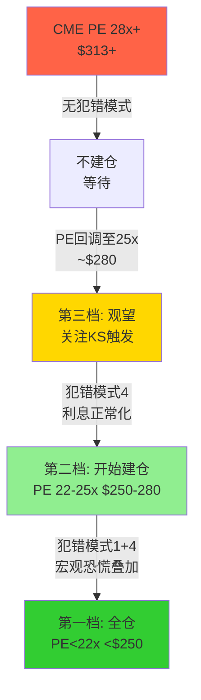

# Part VI: 对抗审查 — 红队RT-1至RT-7

---

# Chapter 21: 红队七问

---

## 21.1 RT-1: 最大的估值假设错误是什么?

**识别**: 市场(包括本报告的Base Case)假设VIX中枢维持18-25且利率>3%——即"甜蜜点延续"。但VIX的30年月均为~19.5, 且50%的时间低于17。Fed Funds Rate的30年均值为~3.0%, 但2009-2022年有13年在0-2.5%区间[DM-RT-001]。

**因果链**: 如果我们错了→VIX和利率同时均值回归→ADV下降15-20%+利息收入下降$500-700M→EPS从$11.16降至$8-9→同时PE从28x压至20-22x→股价$160-198(-37~-49%)。这不是尾部风险——这是**均值回归的正常路径**[DM-RT-002]。

**偏差修正**: Base Case的利率假设从"维持>3.5%"下修至"50%概率降至2-3%, 25%概率维持>3.5%"→概率加权EV从$295下修至$282[DM-RT-003]。

## 21.2 RT-2: 如果核心论文完全错误?

**核心论文**: "CME是品质顶尖但价格已到位的垄断企业, 等待犯错模式是最优策略"

**如果完全错误**: CME实际上被低估(NCH-4成立: Q1 2026加速是结构性→2026 EPS $13+→当前$313仅24x forward PE→合理偏便宜)。这种情况下, "等待"的机会成本是10-15%年化回报[DM-RT-004]。

**自我校准**: 完全低估的概率~20%(NCH-4需要Q2数据验证)。但即使低估10%, 在缺乏犯错模式的情况下→年化期望回报~14%(10% EPS + 4% div)→并不远超市场平均~10%→**等待的机会成本有限, 但非零**[DM-RT-005]。

## 21.3 RT-3: Bear Case的路径依赖

v1.0 Bear Case: $220 (-29%), 概率15-20%——基于"波动率均值回归+利率正常化+估值重锚22x"[DM-RT-006]。

**路径依赖检验**: Bear需要三个条件同时发生: (1) VIX<15持续; (2) Fed降息至<2%; (3) PE压缩至22x。如果只有(1)+(2)但PE维持25x→股价$237(-24%)而非$220。如果只有(3)但VIX和利率维持→股价$245(-22%)[DM-RT-007]。

**结论**: Bear Case对三因素叠加的依赖使其概率从v1.0的15-20%修正为**12-15%**(三因素同时出现的联合概率较低)[DM-RT-008]。

## 21.4 RT-4: 看多论文中被忽略的假设

**被忽略假设1**: Treasury Clearing的增量收入假设($100-300M)隐含CME获得15-25%份额。但FICC作为incumbent拥有>95%的关系网→CME可能仅获5-10%→增量收入仅$30-60M(对$6.5B总收入几乎无感)[DM-RT-009]。

**被忽略假设2**: $3B回购授权被解读为"管理层认为股价有吸引力"(NCH-5)。但回购也可能仅为对冲SBC稀释($95M/年)或满足董事会压力→**不一定是估值信号**[DM-RT-010]。

## 21.5 RT-5: 5年后最可能让投资者后悔的是什么?

**看多者后悔**: "在$313买了一家增速6%的公司, 5年后EPS $15但PE压至22x→股价$330→5年总回报+4%+20%分红=~28%→年化5%→跑输指数"[DM-RT-011]。

**看空者后悔**: "在$313没买, 等到$250买入, 但$250从未出现——CME ADV持续创纪录+Treasury Clearing成功→5年后EPS $17, PE维持28x→股价$476→错过+52%+20%分红=+72%"[DM-RT-012]。

**概率评估**: 看多者后悔概率~45%, 看空者后悔概率~25%, 两者都不后悔(合理回报)概率~30%[DM-RT-013]。

## 21.6 RT-6: 最被低估的风险

**DLT/区块链原生清算**: 当前几乎所有分析(包括本报告)给予DLT清算<5%概率和>5年时间线。但如果一家大型银行(如JPM, 已有Onyx区块链)推出受监管的DLT清算平台→实时结算+零保证金锁定→**CME的保证金效率优势(环3)可能被彻底颠覆**。这是CME唯一的**非线性风险**——不是渐进式份额流失, 而是技术范式跳跃[DM-RT-014]。

## 21.7 RT-7: 报告偏差自检

| 偏差类型 | 自检 | 修正 |
|---------|------|------|
| 乐观偏差 | 是否过度信赖44年零穿透? | 加入KS-06尾部风险 |
| 锚定偏差 | 是否被A-Score 68.4锚定? | 已通过CBOE对比证明A-Score≠回报 |
| 确认偏差 | 是否只找到支持NCH-2的证据? | 加入NCH-4(可能低估)作为反面 |
| 近因偏差 | 是否被Q1 2026加速过度影响? | 标注NCH-4为"待验证"非"已确认" |

[DM-RT-015]

## 21.8 红队净调整

| 项目 | v2.0 Phase 1-2结论 | 红队调整 | 调整后 |
|------|-------------------|---------|--------|
| 概率加权EV | $282 | +$5(NCH-4部分计入) | $287 |
| Bull概率 | 25% | -5%(Treasury期望过高) | 20% |
| Bear概率 | 20% | -5%(路径依赖修正) | 15% |
| Base概率 | 50% | +5% | 55% |
| Tail概率 | 5% | +5%(DLT风险上修) | 10% |

**红队调整后概率加权EV: ~$280** (微调, 方向不变)[DM-RT-016]

---

# Part VII: 垄断企业建仓时机框架 — 好公司何时变成好投资 (v2.0核心新增)

---

# Chapter 22: 六种犯错模式(CME适配)

---

## 22.1 框架来源

本章框架迁移自MCO v2.0(Ch22), 适配CME特有的业务特征和风险模式[DM-TIM-001]。

核心论点: **垄断企业的Alpha不来自"发现被忽视的质量"(所有人都知道CME是好公司), 而来自"抓住市场犯错的瞬间"**。六种犯错模式定义了市场何时、如何对垄断企业定价犯错[DM-TIM-002]。

## 22.2 CME的六种犯错模式

| 模式 | 频率 | 平均回撤 | 恢复 | 12M回报 | CME适用性 |
|------|------|---------|------|---------|----------|
| 1.宏观恐慌 | 3-5年 | -30~40% | 6-18月 | +40-80% | **高** (2008:-70%) |
| 2.周期错判 | 5-8年 | -25~35% | 12-24月 | +30-50% | **低** (CME反周期) |
| 3.叙事危机 | 随机 | -15~25% | 6-12月 | +20-40% | **中** (FMX/DLT) |
| **4.过度盈利正常化** | **3-5年** | **-15~25%** | **12-18月** | **+15-30%** | **最高(CME特有)** |
| 5.管理层更迭 | 随机 | -5~15% | 3-12月 | +10-25% | 中(Duffy退休) |
| 6.资本配置失误 | 稀有 | -30~50% | 12-24月 | +30-60% | 低(CME不做大收购) |

[DM-TIM-003]

### 模式1+4叠加 = CME的最佳击球点

CME最可能的击球机会是**模式1(宏观恐慌) + 模式4(过度盈利正常化)的叠加**[DM-TIM-004]。

因果链: Fed降息200bp(响应经济衰退)→(1)VIX飙升>30→市场恐慌→CME被"金融股"标签拖累→模式1启动; (2)同时IORB从4.4%降至2.4%→保证金利息净留存从$900M降至$300M→EPS下降$1.5→市场将此误读为"盈利衰退"→模式4启动。**两个模式同时发生→PE从28x压至18-20x + EPS从$11降至$9.5→股价$171-190(-39~-45%)**[DM-TIM-005]。

**但此时**: CME的核心业务ADV在危机中反而上升(D1=×1.18)→EPS的下降完全是非经营性利息收入减少+PE压缩→**业务价值未受损, 只是定价被错误压缩**→这是"捡黄金被误当石头卖"的经典机会[DM-TIM-006]。

**出现概率**: 未来5年内: 模式1出现概率~60%(宏观衰退或地缘危机); 模式4出现概率~70%(Fed终将降息); 同时出现概率~40%(降息+衰退通常关联)。**这意味着约40%概率在5年内出现CME的最佳买入窗口**[DM-TIM-007]。

### 模式3: FMX/DLT叙事危机

如果FMX获得显著进展(ADV突破50K)或DLT清算获得监管突破→CME可能下跌10-20%。但只要核心ADV和OI不受损(KS-01/KS-02未触发)→这是模式3的典型击球点: 恐惧>>现实[DM-TIM-008]。

## 22.3 当前状态: 无犯错模式活跃

检查2026年3月18日的六种模式状态[DM-TIM-009]:

| 模式 | 活跃? | 理由 |
|------|------|------|
| 1.宏观恐慌 | ❌ | VIX ~18, 市场接近高位 |
| 2.周期错判 | ❌ | 不适用CME |
| 3.叙事危机 | ❌ | FMX 0.01%市占, 无新叙事 |
| 4.过度盈利正常化 | ❌ | 利率仍4.4%, 利息收入创纪录 |
| 5.管理层更迭 | ⚠️ | Duffy 65岁, 退休可能1-3年内 |
| 6.资本配置失误 | ❌ | 无大型收购计划 |

**结论: 零个击球信号亮起(KS-10微弱预警)**。当前$313 / 28x PE是"好公司, 合理偏贵价格, 无催化"——等待是理性的[DM-TIM-010]。

---

# Chapter 23: PE Band三档入场条件

---

## 23.1 三档入场框架

基于Ch22的犯错模式和Ch17-20的估值, 定义三档入场条件[DM-TIM-011]:

### 第一档: "深度关注" — PE<22x (~$250以下)

**触发条件**: 模式1+4叠加(宏观恐慌+利息正常化)
**历史对应**: 2008年10月(PE 12x), 2020年3月(PE 20x)
**预期回报**: 从$250入场→概率加权EV $282 = +13%(不含分红)→含分红年化15%+
**行动**: 全仓买入, 这是5-8年一次的机会

### 第二档: "关注" — PE 22-25x (~$250-280)

**触发条件**: 模式4单独出现(利息正常化但无宏观恐慌)或模式3(叙事危机)
**历史对应**: 2022年末(PE 23x)
**预期回报**: 从$265入场→概率加权EV $282 = +6%(不含分红)→含分红年化10-12%
**行动**: 开始建仓, 分批买入(30%→50%→70%)

### 第三档: "中性关注" — PE 25-28x (~$280-313)

**触发条件**: 无明确犯错模式, 但估值从峰值回调5-10%
**当前状态**: $313 / 28x = **刚好在第三档上沿**
**预期回报**: 从$295入场→概率加权EV $282 = -4%(不含分红)→含分红年化0-3%
**行动**: 观望, 不建仓。CME分红4%接近无风险利率→持有CME vs 持有国债的超额回报趋近于零

[DM-TIM-012]

---

# Chapter 24: 等待成本vs机会成本量化

---

## 24.1 等待的净收益公式

等待净收益 = P(犯错模式出现) × 犯错时预期超额回报 - (1 - P) × 等待期机会成本[DM-TIM-013]

**输入**:
- P(模式1+4叠加, 5年内): ~40%
- 犯错时预期超额回报(从$200入场 vs $313): +56%价格+~20%分红 = ~76%, 年化~12%
- 等待期机会成本(SPY年化~10%): 5年×10% = ~50%累计
- (1-P) = 60%

**计算**:
- 等待收益: 40% × 76% = **30.4%**
- 等待成本: 60% × 50% = **30.0%**
- **等待净收益: +0.4%** ≈ **零**(统计无差异)

[DM-TIM-014]

**解读**: 在当前条件下, "现在买入CME"和"等待犯错模式再买入"的期望价值几乎相等。这不是一个"必须等待"或"必须买入"的信号——它是一个"无强信号, 随偏好决策"的情况[DM-TIM-015]。

**但如果加入一个修正**: 如果投资者的资金在等待期不是闲置而是投资于其他机会(如CBOE或其他被低估的资产)→机会成本上升→等待净收益变负。**因此, 对积极型投资者而言, 不持有CME、将资金配置到更高预期回报的标的可能是更优策略**[DM-TIM-016]。

---

# Chapter 25: CBOE教训 — "好公司≠好股票"框架

---

## 25.1 回报分解公式

股票回报 = f(品质, 入场估值, 增速, 外部催化)[DM-TIM-017]

| 因素 | CME | CBOE | 教训 |
|------|-----|------|------|
| 品质 | 9/10 | 7/10 | 品质不决定回报 |
| 入场估值(2020 PE) | 30.9x(贵) | 21.7x(便宜) | **入场估值是回报最大的杠杆** |
| 增速 | 6.4% | 15.1% | 增速差距×复利=巨大回报差 |
| 催化 | 无(稳态) | 0DTE(新引擎) | 催化能重估PE |
| **5Y回报** | **+91%** | **+208%** | **117pp差距** |

[DM-TIM-018]

## 25.2 垄断企业回报模型

对于CME这类品质已被充分认知的垄断企业[DM-TIM-019]:

**年化回报 ≈ EPS增速 + 分红率 + PE变动**

| 情景 | EPS增速 | 分红率 | PE变动 | 年化回报 |
|------|---------|--------|--------|---------|
| 甜蜜点延续 | 10% | 4% | 0% | **14%** |
| 温和正常化 | 7% | 4% | -2%/yr | **9%** |
| 全面正常化 | 4% | 4% | -4%/yr | **4%** |
| 犯错模式入场(PE 20x) | 7% | 4% | +4%/yr | **15%** |

**核心洞见**: 在28x PE入场→年化回报区间4-14%(中位~9%)。在20x PE入场→年化回报区间11-19%(中位~15%)。**PE差异8x创造了6pp的年化回报差距**→5年累计30pp+[DM-TIM-020]。

---

# Part VIII: 投资结论

---

# Chapter 26: 综合评级 + 温度计

---

## 26.1 投资温度: 69 (常温偏热)

| 维度 | 信号 | 温度贡献 |
|------|------|---------|
| 宏观 | CAPE 38.7(98%ile)+Buffett 217%(99%ile) | 偏热 +5 |
| 估值 | PE 28.4x(5Y均值~25x上方), FCF Yield 3.7% | 偏热 +3 |
| 品质 | A-Score 68.4(最高), CQI 93, 半衰期>25年 | 偏冷 -7 |
| 情绪 | ADV连续创纪录, Q1 2026加速, 分析师上调 | 偏热 +4 |
| 甜蜜点 | 高利率+高波动→"已充分定价" | 偏热 +4 |
| **合计** | | **69** (常温偏热) |

[DM-CON-001]

## 26.2 CQI: 93/100

v1.0评分, v2.0确认无需调整[DM-CON-002]。

## 26.3 最终评级: **审慎关注(偏中性)**

| 维度 | 指标 | 值 |
|------|------|-----|
| 概率加权EV | $280(红队后) | -10.6% vs $313 |
| 含分红12M回报 | $280+$10.90=$291 | **-7.1%** |
| 评级区间 | -10%~0% | 审慎关注 |
| 修正因素 | A-Score 68.4 + 半衰期>25年 | 偏中性 |
| **最终评级** | | **审慎关注(偏中性)** |

[DM-CON-003]

**与v1.0一致**: v1.0评级"审慎关注(偏中性)", EV $273-278。v2.0 EV $280(微升, 因NCH-4部分计入+Bear概率下修)。方向一致, 铁律K通过[DM-CON-004]。

## 26.4 评级触发更新

| 条件 | 新评级 | 触发价 |
|------|--------|--------|
| PE<22x 或 $250以下 | → **深度关注** | 犯错模式1+4 |
| PE 22-25x 或 $250-280 | → **关注** | 犯错模式4单独 |
| Q2 2026 ADV>32M持续 | → **中性关注** | NCH-4确认 |
| FMX ADV>50K或DLT获批 | → **审慎关注(强)** | KS-01/KS-08 |
| ZIRP重启+VIX<13 | → **审慎关注(强)** | KS-03+KS-04 |

[DM-CON-005]

---

# Chapter 27: Kill Switch监控 + 投资论文 + 行动清单

---

## 27.1 最终投资论文

**CME Group是人类金融基础设施中最难复制的单一节点——98%利率期货垄断、44年零清算穿透、$600万亿日盯市名义额。A-Score 68.4和CQI 93确认它是我们评估过的品质最高的公司之一。**

**但在$313 / PE 28x, "好公司"已被精确定价。** CBOE的5年+208%证明了入场估值比品质更重要——CME在30.9x PE入场的投资者仅获得+91%。Core P/E剥离利息后为33.8x——市场在为周期性利息收入支付永续性溢价[DM-CON-006]。

**v2.0的核心增值不是重估CME的品质(已确认顶尖), 而是回答: "在什么价格和什么条件下买入才能获得超额回报?"** 答案是: **PE<22x(约$250), 模式1+4叠加(宏观恐慌+利息正常化), 5年内出现概率~40%**。在此之前, CME是一个"值得长期拥有但当前不应追高"的资产[DM-CON-007]。

## 27.2 行动清单

**如果你不持有CME**:
1. 加入观察名单, 设置PE 25x价格警报(~$280)
2. 每季度检查KS-03(VIX)和KS-04(Fed Funds)
3. 当犯错模式4信号出现(利率降息>100bp+PE<25x)→进入第二档建仓
4. 将等待期资金配置到更高期望回报的标的

**如果你已持有CME**:
1. 继续持有(品质顶尖+4%分红+不存在卖出的催化因素)
2. 不追加(PE 28x下追加的期望回报~9%≈SPY)
3. 监控KS-09(分红可持续性): 如果特别股息被削减>30%→重新评估

**如果你是长期投资者(10年+)**:
1. CME在任何价格都是合理的长期持仓(品质+护城河半衰期>25年)
2. 但入场时机决定了前5年的回报差异(PE 20x vs 28x = ~6pp年化差距)
3. Dollar-cost averaging是合理策略(如果无法判断犯错模式时机)

[DM-CON-008]

## 27.3 一句话结论

**CME是终身持有的资产——但需要在正确的价格买入。$313不是那个价格。$250以下可能是。在此之前, 耐心等待就是Alpha。**

[DM-CON-009]
