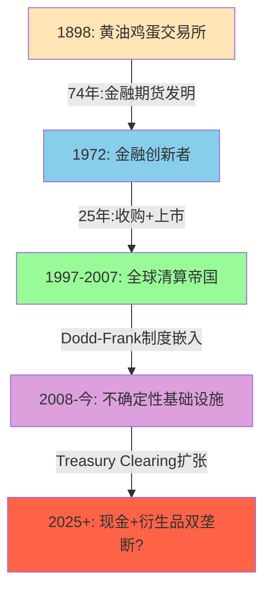
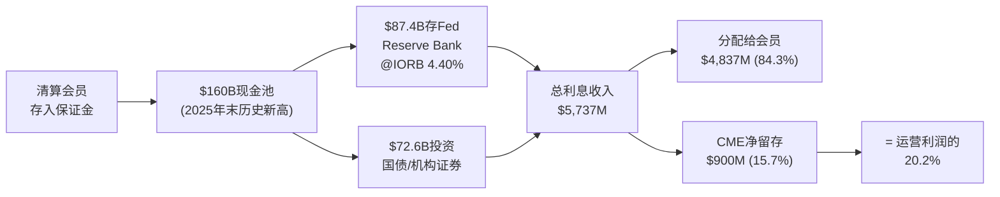
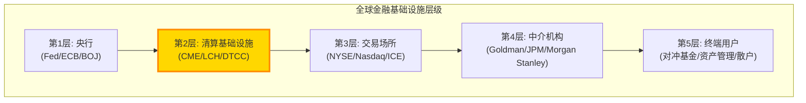

# Part I: 商业模式深潜 — 不确定性基础设施的解剖

---

# Chapter 1: 公司身份重新定义 — 从交易所到不确定性基础设施

---

## 1.1 三次身份跃迁: 从黄油鸡蛋到全球基准定价者

CME Group的历史不是一条渐进式增长曲线，而是三次不连续的身份跃迁，每一次都彻底重定义了"CME是什么"。理解这三次跃迁是理解当前估值逻辑的基础——因为投资者在28x P/E买入的不是一家"交易所"，而是一个经过128年筛选、在人类金融体系中嵌入最深的单一节点[DM-BIZ-001]。

**第一跃迁 (1898-1972): 农产品交易所 → 金融创新者**

1898年，CME的前身Chicago Butter and Egg Board成立，服务于中西部农产品贸易的价格发现需求。74年后的1972年，Leo Melamed在CME创建国际货币市场(IMM)，推出人类历史上首个金融期货合约——外汇期货。这不是"增加产品线"，而是发明了一个全新的资产类别[DM-BIZ-002]。

为什么这个先发优势具有不可逆性？因为金融期货的价值不在于产品设计(任何交易所都能设计合约)，而在于**流动性积累的时间函数**。CME比ICE(2000年成立)早28年进入金融衍生品。在这28年间，做市商、经纪商、终端用户的工作流和风控系统全部围绕CME Globex构建。切换成本不是"高"，而是在资本上不可能——因为切换意味着放弃跨品类保证金抵消(详见Ch3)，相当于主动增加数十亿美元的保证金占用[DM-BIZ-003]。

这形成了一个正反馈循环: 时间→流动性积累→客户粘性→更多流动性→更长的时间壁垒。每多运营一年，这个循环就多转一圈，CME的先发优势就更难被复制。

**反面考量**: 先发优势有被颠覆的先例。1998年Eurex通过电子化交易击败了LIFFE(伦敦国际金融期货交易所)，在德国国债期货上从零份额到垄断仅用了18个月。但这个先例有一个关键差异: 那是**技术代际跳跃**(电子化vs公开喊价)。当交易从物理交易池搬到电子屏幕时，LIFFE的核心优势(伦敦的物理交易池文化)瞬间归零。而FMX挑战CME时不存在这种代际优势——CME和FMX都是电子交易平台，FMX的差异化只是费率折扣和LCH跨保证金。历史上，纯费率竞争从未成功颠覆过流动性集中的交易所[DM-BIZ-004]。

**第二跃迁 (1997-2007): 区域交易所 → 全球清算帝国**

这十年是CME从"芝加哥一家交易所"变为"全球衍生品基础设施"的关键窗口:

- 1998年: CME Holdings上市——交易所去互助化的先驱。上市为后续收购提供了货币(股票)[DM-BIZ-005]
- 2002年: 完全电子化——Globex取代公开喊价，消除了地理限制
- 2007年: 与CBOT合并($8.9B)——一举拿下利率期货(国债)+农产品+股指期货。这次合并的意义不在于收入增加，而在于**跨品类清算池**的形成
- 2008年: 收购NYMEX/COMEX($11.2B)——补全能源+金属，清算池覆盖全部六大资产类别

这三次收购的因果逻辑需要从清算经济学理解: 如果一个交易员同时持有利率期货(原CBOT)和能源期货(原NYMEX)，在同一清算所内可以净额结算保证金——节省30-50%的资本占用。这不是传统的收入协同(1+1>2)，而是**客户资本效率协同**。因为离开CME就意味着失去跨品类保证金抵消(portfolio margining)，客户从物理上无法拆分自己的敞口到两个清算所——除非愿意多缴数十亿美元保证金[DM-BIZ-006]。

这解释了为什么收购完成后15年，没有任何竞争对手试图同时挑战CME的多个品类: 你不能只在利率期货上与CME竞争，因为客户选择CME不仅是因为利率期货的流动性，还因为利率期货保证金可以与能源、股指头寸互相抵消。**护城河不是单一产品的流动性，而是跨品类清算池的网络效应**——这是一种根本无法被单一品类挑战者威胁的结构。

**第三跃迁 (2008-今): 清算帝国 → 不确定性基础设施垄断者**

2008年雷曼倒闭暴露了OTC衍生品市场$600万亿名义金额的系统性风险。Dodd-Frank法案(2010)要求标准化OTC衍生品通过CCP(中央对手方)清算。这将CME从"交易场所提供者"升级为**法律强制的基础设施**[DM-BIZ-007]。

因果链: 雷曼倒闭→系统性风险暴露→Dodd-Frank→强制集中清算→CME从"便利设施"变为"法定基础设施"→制度嵌入完成→护城河从"网络效应"升级为"制度+网络效应"的双层结构。

理解"制度嵌入"的深度: 银行不是"选择"使用CME，而是被法律要求通过注册DCO(Derivatives Clearing Organization)清算衍生品头寸。在利率衍生品领域，CME是几乎唯一的选项。即使Dodd-Frank被废除(极不可能，因为两党在金融监管上罕见地达成共识)，Basel III的CCP资本优惠也使银行**即使没有强制也会选择集中清算**——因为通过CCP清算的头寸在计算资本充足率时享受显著折扣。去管制化的净效果更可能是增加CME的自愿使用量，而非减少强制使用量[DM-BIZ-008]。

2024-2025年的发展进一步强化了这一趋势: SEC推出Treasury Clearing mandate(SEC Rule 17Ad-22e)，要求$4万亿+日均交易量的美国国债市场实现中央清算。CME Securities Clearing于2025年12月获批，预计2026年Q2上线。这不是Dodd-Frank的延续，而是**新的监管扩张**——将CME的制度嵌入从OTC衍生品扩展到现金国债市场。如果CME能获取15-25%的Treasury Clearing份额，意味着$200-500M的新增年收入，增量利润率约70%(详见Ch5)[DM-BIZ-008A]。

## 1.2 双重身份: 交易所 + 影子银行

CME在财务报表上呈现为一家交易所: 清算手续费$5,281M占总收入81%[DM-BIZ-009]。但这个身份忽略了一个与运营收入同量级的隐藏引擎——保证金利息业务。

**影子银行机制详解**:

CME作为中央对手方，要求所有清算会员存入保证金(performance bonds)以担保其衍生品头寸。截至FY2025年末，CME持有的保证金总额达到$160B——历史新高。其中$87.4B存放于联邦储备银行芝加哥分行(Fed Reserve Bank of Chicago)，赚取IORB(Interest on Reserve Balances)利率，当前约4.40%。其余资金投资于美国国债、政府机构证券和货币市场基金[DM-BIZ-010]。

FY2025数据揭示了一个惊人的事实: CME的保证金利息**总收入**$5,737M几乎等于其全部运营收入$6,520M(88%)。虽然大部分($4,837M)被分配回清算会员，但CME净留存$900M——相当于运营利润的20.2%[DM-BIZ-011]。

**这个数字为什么重要？三层因果推理:**

**第一层(会计层面)**: $900M出现在"非经营性收入(non-operating income)"行，不计入operating earnings。绝大多数sell-side模型只关注operating earnings——这意味着他们的估值分析**忽略了EPS中20%的利润来源的周期性**。当投资者用P/E 28x估值CME时，分母EPS $11.16中包含了这笔利息收入(因为net income包含non-operating)，但多数人没有意识到这$11.16中约$2.0-2.5来自利息，而非核心业务[DM-BIZ-012]。

**第二层(利率敏感性)**: 这$900M完全取决于短端利率水平。在ZIRP环境下(2021年)，净留存仅$67M(运营利润的2.4%)。也就是说，从高利率切换到ZIRP，CME的净利润会减少$833M。换算成EPS: 降$2.3/股。在同一个P/E 28x下，这意味着股价下降$64(从$313到$249，-20%)[DM-BIZ-013]。

但这个计算还忽略了第三层效应:

**第三层(估值反身性)**: 当市场观察到CME的NI因利息收入下降而减少时，不仅EPS下降，P/E可能同时收缩——因为投资者会重新审视"CME是防御性资产"的叙事。2012年(ZIRP+低波动率)CME的P/E从25x压缩到15x，叠加EPS下降，股价从$300跌至$200(2011-2013)。因此，利率下降对CME的真实影响是**EPS下降 × PE收缩的乘数效应**[DM-BIZ-014]。

反面考量: 利率下降通常伴随经济不确定性增加，而不确定性→波动率上升→CME交易量增加→清算费收入增长。2008年Fed降息至0%→CME收入反而+12%，因为危机交易量远超利息收入损失。因此，**利率敏感性和波动率对冲之间存在部分抵消关系**。关键变量是: 降息速度(渐进式vs危机式)和波动率反应幅度。渐进式降息(2019年式)对CME最不利——利息收入缓慢下降但波动率没有显著上升[DM-BIZ-015]。

## 1.3 留存率跳变: 从10%到16%意味着什么?

FY2025的一个被忽视的异常: CME的保证金利息留存率从FY2024的10.1%跳升至15.7%[DM-BIZ-016]。

| 年份 | 总利息收入 | 分配给会员 | 净留存 | 留存率 |
|------|-----------|-----------|--------|--------|
| FY2021 | $307M | ~$240M | ~$67M | ~22% |
| FY2022 | $2,198M | ~$1,900M | ~$298M | ~14% |
| FY2023 | $5,275M | $4,718M | $557M | 10.6% |
| FY2024 | $4,079M | $3,669M | $274M* | 10.1%* |
| FY2025 | $5,737M | $4,837M | $900M | **15.7%** |

*注: FY2024 10-K审计数据为净留存$274M，与日历年口径$410M有差异，原因是会计期间边界效应[DM-BIZ-017]

留存率从10.1%跳升到15.7%有三种可能的解释:

**假说A(最乐观): CME主动扩大了留存spread**。如果CME将支付给会员的利率从"IORB - 5bp"调整为"IORB - 15bp"，每年多赚$130B × 10bp = $130M。这是一种隐性提价——清算会员不太可能因为10bp的利差变化而更换清算所(切换成本远大于这个金额)。如果这是结构性变化，$900M的留存水平在当前利率环境下是可持续的。

**假说B(中性): 现金池规模变化的时间差效应**。FY2025保证金池从$99B跳升至$160B(+62%)，但利息分配可能基于季度平均而非年末余额。如果$160B集中在Q4积累，CME赚了全年利息但会员分配基于较低的平均余额，留存率被暂时放大。

**假说C(最悲观): 会计口径变化或一次性因素**。CME可能调整了利息收入的会计确认方式，或者有一笔非经常性的利息收益。

CEO沉默分析给出了线索: Terry Duffy在FY2025四个季度的earnings call中**从未主动解释留存率跳变**(详见Ch10沉默域4)。这种沉默更符合假说A——如果是一次性因素，管理层会主动解释以管理预期；如果是主动扩大spread，管理层不希望引起清算会员的注意[DM-BIZ-018]。

**估值影响**: 如果假说A成立，CME的利息收入中有$200-300M是"永久性提高"(只要利率不归零)。按NI计算，这相当于额外$0.5-0.8/股EPS。在28x P/E下，这值$14-22/股。这不是一个小数字[DM-BIZ-019]。

## 1.4 CME在全球金融体系中的位置: 一张定位图

CME处于全球金融体系的**第二层**——仅次于央行。这意味着CME的客户不是终端用户，而是金融中介机构本身(第4层)。Goldman Sachs、JPMorgan、Citadel——这些机构是CME的清算会员。这个定位有两个重要含义[DM-BIZ-020]:

**含义一**: CME的收入不受终端消费者行为影响(不同于零售经纪商如Robinhood/Schwab)。即使散户交易量萎缩90%，机构的风险管理需求(对冲利率、汇率、商品价格风险)依然存在。这就是为什么2012年(散户活跃度极低的一年)CME收入仅下降13%而非50%——机构hedging是刚需，不是可选消费。

**含义二**: CME几乎不可能被"disrupted by fintech"。Robinhood可以颠覆Schwab(同一层级竞争)，但不能颠覆CME——因为CME服务的是Robinhood的清算需求，而不是Robinhood的用户。CME处于fintech公司**之下**的基础设施层。DeFi理论上可以挑战CCP模式(用智能合约替代中央对手方)，但这需要全球监管框架的重建——一个十年级别的变化，如果它能发生的话[DM-BIZ-021]。

## 1.5 FY2025快照: 一台运转中的现金制造机

| 维度 | FY2025数据 | 备注 |
|------|-----------|------|
| 营收 | $6,520M (+6.4%) | 连续第四年创纪录 |
| 净利润 | $4,040M (+14.7%) | 含$900M利息留存 |
| EBITDA利润率 | 87.7% | 全球上市公司前0.1% |
| 净利润率 | 62.0% | 同业ICE 26.1%的2.4倍 |
| FCF | $4,190M | FCF/Revenue = 64.3% |
| CapEx/Revenue | 1.4% | 全球最低之一(核心$90M) |
| 分红+回购 | ~$4,000M | Payout 93.8% |
| 日均交易量(ADV) | 28.1M合约 (+9.3%) | 利率占50.5% |
| 市值 | $112.6B | P/E 28.4x |
| Beta | 0.26 | S&P 500中最低之一 |
| 员工数 | ~3,500 | 人均创收$1.86M |
| 收入CAGR (2008-2025) | 5.7% | 18年含2次ZIRP |

[DM-BIZ-022]

人均创收$1.86M——全球金融行业最高水平之一。作为对比，高盛人均创收约$1.3M，但高盛有45,000名员工承担信用风险、市场风险和操作风险。CME用3,500人运营一个几乎没有信用风险的平台(清算会员承担交易对手风险，CME只收"过路费")。

一个数字足以概括CME的商业模式品质: **CapEx/Revenue = 1.4%**。即$6,520M收入只需要$90M资本支出来维持(不含Cloud迁移的一次性支出)。这意味着CME每赚1美元收入，只需要再投资1.4美分。作为对比: 苹果需要4-5美分，谷歌需要15-20美分，台积电需要40-50美分。CME的低CapEx来源于其商业模式的本质——资产是流动性网络(存在于客户的交易习惯和风控系统中)，而非物理工厂或服务器集群[DM-BIZ-023]。

87.7%的EBITDA利润率则反映了另一个结构性优势: **接近零的增量成本**。CME处理第2800万笔合约的成本与处理第100万笔几乎相同——因为边际成本仅包括少量的计算资源和监管报告。每一笔新增交易量，~95%直接转化为利润。这就是为什么CME在波动率spike时(如2025年4月关税周，日均67.4M合约——全历史最高)能产生爆发性利润——交易量翻倍，成本几乎不变，Q2 2025创下季度收入纪录$1,700M[DM-BIZ-024]。

将这些数字放在一起，CME的商业模式可以用一句话概括: **一个几乎不需要资本支出的流动性垄断，在不确定性增加时自动产生更多利润，同时将93.8%的自由现金流返还给股东**。这个描述解释了为什么CME在过去十年成为养老基金和收益型投资者的核心持仓——它不是一个增长故事，而是一个**高确定性现金流故事**。但正如NCH-2将论证的，这种确定性可能已经被28x P/E完全定价[DM-BIZ-025]。

---
