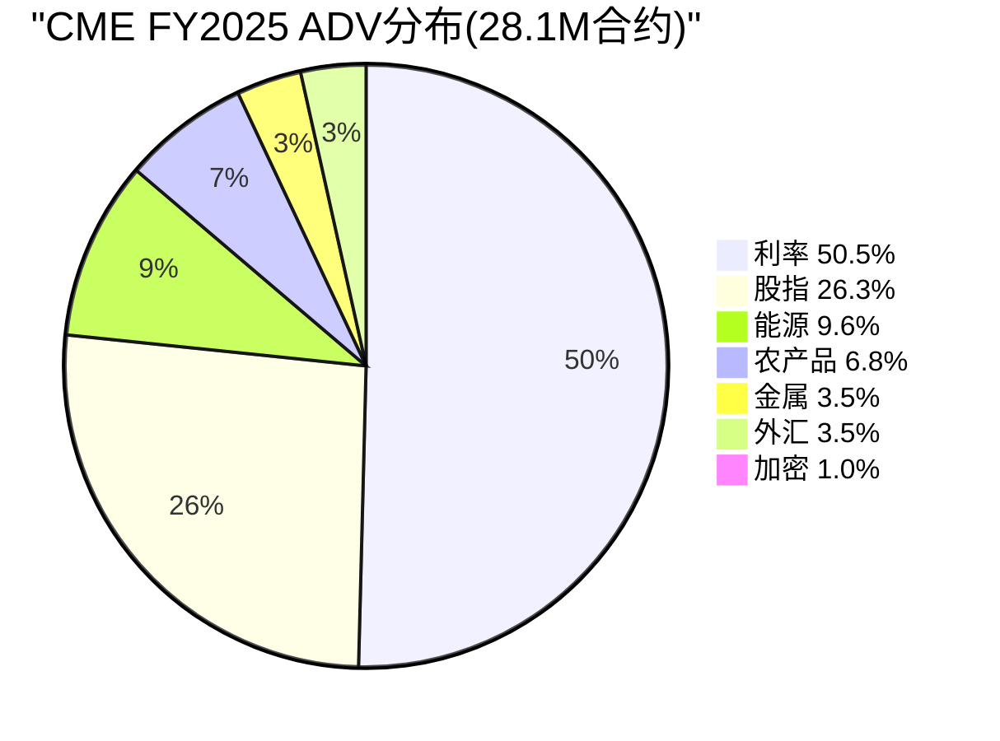
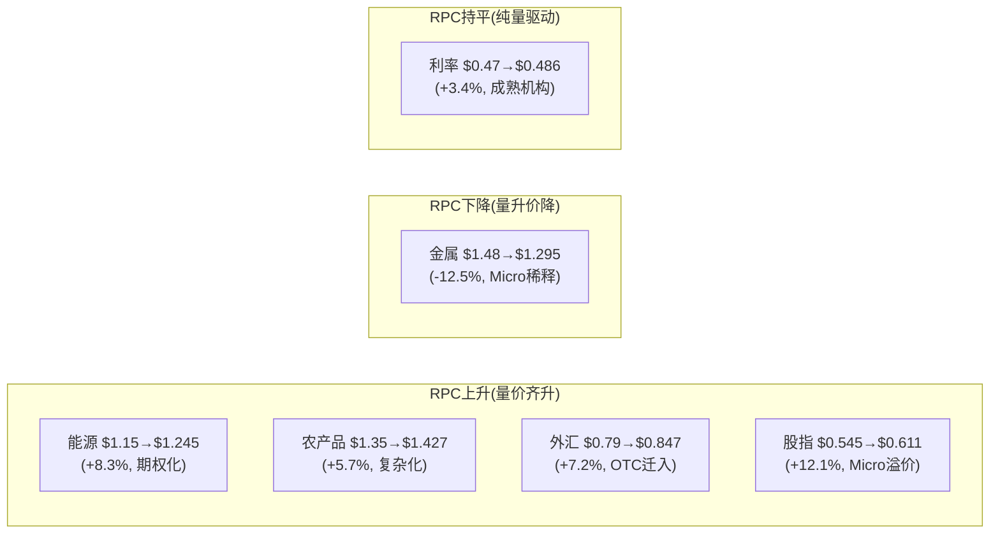

# Chapter 2: 六大收入引擎 — 基准合约的垄断地图

---

## 2.1 六引擎总览: 不是多元化，而是垄断的叠加

CME Group的六大核心资产类别——利率、股指、能源、农产品、金属、外汇(加密为第七新兴引擎)——表面上看是"多元化"，实际上更准确的描述是**六个独立垄断的叠加**。在每个资产类别中，CME要么是绝对垄断者(期货市占率>90%)，要么是双寡头中的主导方。这不是偶然形成的——而是2007-2008年通过合并CBOT(利率+农产品)和收购NYMEX/COMEX(能源+金属)，用$20B系统性构建的资产组合[DM-ENG-001]。

FY2025 ADV分布揭示了CME的收入结构:

| 引擎 | FY2025 ADV | 占比 | RPC (Q4 2025) | 估算年收入 | 竞争状态 |
|------|-----------|------|--------------|-----------|---------|
| **利率** | 14.2M | 50.5% | $0.486 | ~$1,735M | 近垄断(FMX萌芽) |
| **股指** | 7.4M | 26.3% | $0.611 | ~$1,137M | 垄断(Eurex远距离) |
| **能源** | 2.7M | 9.6% | $1.245 | ~$845M | 双寡头(ICE Brent) |
| **农产品** | 1.9M | 6.8% | $1.427 | ~$682M | 近垄断(ICE softs) |
| **金属** | 988K | 3.5% | $1.295 | ~$322M | 双寡头(LME) |
| **外汇** | 980K | 3.5% | $0.847 | ~$209M | 垄断(期货FX) |
| **加密** | 278K | 1.0% | ~$2.0(估) | ~$141M | 竞争激烈(Deribit) |
| **合计** | 28.1M | 100% | $0.707 | ~$5,071M | — |

[DM-ENG-002]

**一个关键观察**: 利率引擎贡献50%的ADV但仅34%的收入(RPC最低$0.486)，而能源+农产品合计仅贡献16%的ADV却产生30%的收入(RPC分别是利率的2.6倍和2.9倍)。这意味着CME的收入mix比volume mix更加均衡——利率的垄断地位提供了volume基础和稳定性，而商品引擎提供了单位经济的厚度[DM-ENG-003]。

## 2.2 利率引擎: CME的命脉 (50.5% ADV)

利率是CME最重要的资产类别，不仅因为它贡献了一半的交易量，更因为它是**唯一真正的垄断**——在SOFR期货、Treasury期货这两个基准合约上，CME的市占率接近100%[DM-ENG-004]。

Q4 2025利率ADV达到15.6M(Q4 CAGR 2021-2025 +12.3%)，SOFR和Treasury双双创纪录。更重要的是Q1 2026的加速: Feb 2026 ADV 37.6M(全历史月度纪录)，其中Treasury ADV 13.7M(月度纪录)，SOFR ADV 6.2M(月度纪录)。这是否是结构性加速还是关税一次性spike，是NCH-4待验证的核心问题[DM-ENG-004A]。

**两大基准产品**:

**SOFR期货/期权**: FY2025 ADV 5.4M合约(从2021年158K增长34倍)。SOFR在2023年6月完全替代LIBOR后，成为全球利率衍生品的基准利率。CME拥有SOFR期货/期权的独家上市权——这不是市场竞争的结果，而是LIBOR→SOFR转换过程中，CME作为唯一具备利率期货流动性池的交易所，自然成为新基准的唯一家园。FY2025 OI达到13.7M合约(历史新高)，反映的是**结构性需求增长**而非周期性spike[DM-ENG-005]。

因果推理: LIBOR→SOFR转换→CME独家SOFR期货→银行/对冲基金风控系统围绕CME SOFR构建→切换成本极高→CME在SOFR上的垄断地位至少可持续10年(合约到期日跨越到2030+，大量未平仓头寸无法迁移)。

**Treasury期货/期权**: FY2025 ADV 8.3M合约(全历史纪录)。OI于2026年2月达到36.3M合约(历史新高)。按到期期限分布: 2Y(5.8M) / 5Y(7.9M) / 10Y(12.6M) / 30Y(3.6M)。这些是全球利率风险管理的"标准工具"——银行、保险公司、养老基金管理利率久期时，Treasury期货是流动性最好、成本最低的工具。替代选项(OTC利率互换通过LCH清算)的保证金效率显著低于CME的组合保证金(portfolio margining)[DM-ENG-006]。

**利率引擎的结构性增长驱动**:

1. **Fed政策不确定性永久化**: 2022-2025年经历了40年来最剧烈的利率波动(从0%到5.25%再到4.4%)。每一次FOMC会议前后都是hedging窗口。历史表明，利率离开0%(无论方向)→利率期货ADV上升，因为不确定性>方向性[DM-ENG-007]。
2. **SOFR生态系统成熟**: SOFR-linked贷款、CLO、MBS的存量累积→更多hedging需求→更多SOFR期货ADV。这是一个量的积累过程，不依赖波动率。
3. **Treasury Clearing mandate**: 2026年Q2上线后，清算国债现金交易的参与者需要用Treasury期货对冲→新增的交叉客群。

**反面考量**: FMX于2024年9月推出SOFR期货，2025年5月推出Treasury期货。虽然当前ADV仅~3,200手(CME的0.02%)，但FMX的LCH跨保证金提供了一个理论上有价值的差异化: 如果做市商在LCH有大量IRS OI，在FMX交易SOFR期货可以抵消保证金→降低资本成本。但2025年4月关税波动期FMX ADV从~3,000崩至928手，而CME同期利率ADV创纪录，证明了在压力环境下流动性向CME集中的趋势不可逆(详见Ch4)[DM-ENG-008]。

## 2.3 股指引擎: Micro合约的零售革命 (26.3% ADV)

FY2025股指ADV 7.4M(+8% YoY)，其中Micro合约(E-mini的1/10)贡献了增量的主体[DM-ENG-009]:

| 产品 | FY2025 ADV | 趋势 |
|------|-----------|------|
| E-mini S&P 500 | ~2.4M | 稳定，机构主导 |
| Micro E-mini S&P 500 | 2.1M | 历史新高，零售驱动 |
| E-mini Nasdaq-100 | ~1.0M | 稳定 |
| Micro E-mini Nasdaq-100 | 1.6M | 历史新高 |

Micro合约的商业逻辑: 名义价值是标准E-mini的1/10(S&P 500 Micro ≈ $25,000 vs E-mini ≈ $250,000)→降低零售交易者进入门槛→吸引新客群→但RPC更高($0.61 vs 标准的$0.35)，因为费率不按名义值线性缩减。因此，Micro合约的增长同时提升ADV和blended RPC——这是一个罕见的"量价齐升"结构[DM-ENG-010]。

因果链: Robinhood/零佣金运动→散户认知期货市场→Micro合约降低门槛→期货替代部分期权投机需求→CME获取原本属于CBOE的散户流量。注意: 这不是与CBOE直接竞争(CME卖期货，CBOE卖期权)，但两者争夺的是同一个底层需求——方向性杠杆暴露。

**反面考量**: 零售交易者是"fair-weather friends"——市场平静时零售ADV下降30-40%(2012年、2017年数据)。因此Micro合约的增长不是线性外推的——它与波动率正相关。但Micro合约有一个结构性门槛效应: 一旦散户建立了期货交易习惯(保证金账户已开、风控系统已配置)，他们在低波动率期间不会完全消失，而是降低频率。这意味着每次波动率spike带来的新用户中，有30-40%会成为永久性增量[DM-ENG-011]。

**Q4 2025具体表现**: 股指Q4 ADV 8.2M(Q4 CAGR 2021-2025 +8.6%)，Equity RPC从$0.545(Q4 2020)稳步升至$0.611(Q4 2025)——5年+12.1%。RPC上升的因果链: Micro合约名义值小→每美元风险暴露收费更高→volume从标准E-mini向Micro迁移→blended RPC被推高。这是一种"自愿降级"(名义值降低)换取"单位经济升级"(每合约收费升高)的健康结构。

## 2.4 能源与农产品: 高RPC的稳定器 (16.4% ADV)

能源和农产品合计贡献16.4%的ADV，但因为RPC是利率的2.6-2.9倍，收入贡献达到~30%[DM-ENG-012]。

**能源**: WTI原油期货(NYMEX)是全球最活跃的原油合约。CME在WTI上垄断，ICE在Brent上垄断——这种"品种分立"格局已维持20年，互不侵犯。能源RPC从Q4 2020 $1.150稳步上升至Q4 2025 $1.245(+8.3%)，反映了期权化趋势(WTI期权ADV创纪录1.2M)和复杂结构化产品(spreads、cracks)的增长。因为这些复杂产品的RPC高于简单futures，mix shift推动blended RPC上升[DM-ENG-013]。

**农产品**: 芝加哥谷物(玉米、大豆、小麦)是全球农产品定价的基准。RPC从$1.350上升到$1.427(5年+5.7%)。农产品ADV的驱动因素与金融产品不同——它取决于种植季天气、全球供需失衡、出口政策(如巴西大豆、俄罗斯小麦)。这种非相关性使农产品引擎成为CME收入的天然对冲: 当金融市场平静(利率+股指ADV下降)时，气候事件或贸易政策变化可能推动农产品ADV上升[DM-ENG-014]。

## 2.5 加密: 最快增长但最小引擎 (1.0% ADV)

加密货币ADV从2022年的50K增长到FY2025的278K(+139% CAGR)，但占总ADV仅1.0%[DM-ENG-015]。

**加密引擎的结构性矛盾**: 管理层在earnings call中频繁强调crypto增长(每季度必提"+139% growth")，但从不披露crypto的具体收入贡献。按估算RPC ~$2.0计算，crypto年收入约$141M——仅占总收入2.2%。这意味着即使crypto ADV再翻一倍(到~556K)，增量收入也仅~$140M(+2.2% total revenue)。管理层用ADV增速(139%)而非收入贡献(2.2%)来讲述crypto故事，这是一种**叙事定价策略**(详见Ch10沉默域1)[DM-ENG-016]。

**关键缺口——加密期权**: CME在crypto期货领域领先(受益于CFTC监管的制度信任)，但在crypto期权市场完全缺席。Deribit控制了87-94%的crypto期权OI，且已被Coinbase以$2.9B收购。CME的24/7交易(2026年2月上线)试图缩小与crypto原生平台的差距，但产品覆盖度(仅BTC/ETH)远不如Deribit(BTC/ETH/SOL等+永续期权)[DM-ENG-017]。

因果推理: 如果CFTC批准perp合约(永续期货)在美国上市→CME将成为制度化perps的首选平台→全新TAM可能>$10B/年→crypto引擎价值被市场严重低估。但这个"如果"取决于监管态度，而非CME的执行力——因此它更像是一个免费期权而非确定性现金流[DM-ENG-018]。

**24/7交易的战略意义**: CME于2026年2月上线BTC和ETH期货的24/7交易(此前仅周日晚至周五)。这消除了crypto原生平台(Binance/Deribit)最大的结构性优势——永不关市。但24/7交易也带来了清算风险: 周末流动性极薄→价格可能剧烈波动→保证金要求需要动态调整。CME选择先在micro合约上试水24/7，标准合约暂不变——这种渐进策略降低了风险但也限制了机构采用速度[DM-ENG-018A]。

**加密引擎的5年远景**: 如果制度化crypto市场发展路径类似于2000年代的信用衍生品(CDS从零到万亿级名义在8年内完成)，CME可能是最大受益者——因为机构不会在无监管平台交易大额。但如果crypto停滞在当前规模或被美国以外的监管管辖权吸收(新加坡/迪拜)，CME的2%收入贡献可能在5年后仍是2%。这是一个概率权重极度右偏的押注[DM-ENG-018B]。

## 2.6 金属与外汇: 利基但有定价权 (7.0% ADV)

**金属**: COMEX黄金/白银/铜期货，FY2025 ADV 988K(+34% YoY——所有引擎中增速最快)。但RPC持续下降: 从Q4 2020 $1.480到Q4 2025 $1.295(-12.5%)。原因是Micro Gold/Silver/Copper合约对标准合约的替代——volume up, RPC per contract down。净收入仍在增长(volume增速>RPC降速)，但这种mix shift使金属引擎的增长质量低于能源和农产品[DM-ENG-019]。

**外汇**: FY2025 ADV 980K(~flat YoY)，是六引擎中唯一没有明显增长的品类。CME是唯一有流动性的期货外汇平台——但这个"唯一"的含义有限，因为外汇期货面临$6.6万亿/日OTC外汇市场的结构性竞争。大多数机构更倾向于在OTC市场做FX(灵活性更高、无需标准化、可以定制期限和金额)。CME外汇期货的增长逻辑依赖于OTC-to-futures迁移——受Uncleared Margin Rules(UMR)驱动，更多中型机构发现通过CME清算FX比维持双边CSA(Credit Support Annex)更便宜。RPC从$0.790稳步上升到$0.847(+7.2%)反映了更高价值的OTC流量迁入——这些新客户的单笔名义更大、RPC更高[DM-ENG-020]。

## 2.7 RPC趋势的结构性解读: 量价分化

六引擎的RPC趋势呈现出清晰的分化格局，反映了不同资产类别的结构性演变[DM-ENG-021A]:

Blended RPC从Q4 2020 $0.660上升至Q4 2025 $0.707(+7.1%)。这个温和上升的背后是两股对冲力量: 4个引擎的RPC结构性上升(产品复杂化+零售溢价+OTC迁入) vs 金属引擎的Micro稀释。利率引擎的RPC几乎持平，表明机构客群(银行/资产管理)的议价力限制了提价空间——这些客户的volume太大，CME不敢大幅提价[DM-ENG-021B]。

**RPC定价权评估**: CME在利率和金属上的定价权有限(客户集中度高+volume大)，但在能源期权、农产品期权和Micro合约上有显著定价权(产品差异化+小客户分散)。这意味着CME的收入增长更依赖volume增长(80%)而非提价(20%)——一个对波动率依赖度更高、但护城河更深的结构。

## 2.8 六引擎的组合效应: 收入分布的正偏特征

六引擎的组合创造了一个独特的收入分布特征:**正偏(positively skewed)**——即上行弹性>下行风险[DM-ENG-021]。

| 情景 | 利率ADV | 股指ADV | 商品ADV | 总收入影响 |
|------|---------|---------|---------|-----------|
| 全面危机(2008/2020) | +50-65% | +50% | +10-20% | **+25-40%** |
| 利率波动(2022) | +19% | +15% | flat | **+15%** |
| 全面平静(2012/2017) | -10% | -15% | flat | **-8-13%** |
| 地缘事件(2025关税) | +15% | +22% | +8% | **+6-10%** |

历史18年数据(2008-2025)验证: 只有2年收入下降(2012 -13%、2021 -3%，都是ZIRP)，16年上涨，4年连续创纪录(2022-2025)。收入CAGR 5.7%看似平庸，但这个数字掩盖了分布特征——中位数增长~6%，但上行尾部可达+27%(2018年)。对于一个28x P/E的股票，这种正偏特征提供了一种隐含的"波动率看涨期权"[DM-ENG-022]。

**为什么六引擎的组合比单引擎更有价值?** 不是因为"多元化降低风险"(这是投资组合思维)，而是因为**不同引擎对不同类型波动率的响应不同**: 利率变动→利率引擎spike; 地缘冲突→能源引擎spike; 股市恐慌→股指引擎spike; 气候异常→农产品引擎spike; 美元波动→外汇引擎spike。六引擎覆盖了人类经济活动的几乎所有风险维度——这意味着**任何类型的不确定性增加都有利于CME**。唯一的负面情景是所有维度同时平静(2012/2017/2021)——历史上这种"全面平静"每5-7年出现一次，持续约12-18个月，然后被外生冲击打破[DM-ENG-023]。

这个组合特征的估值含义: 六引擎的CME应该比单引擎的CBOE(几乎只有股指期权)享有**更低的盈利波动率折价**——即同样的盈利增速下，CME应该有更高的P/E。但实际上两者P/E趋同(都是28x)——这暗示市场可能低估了CME收入的稳定性，或者高估了CBOE的0DTE增长前景。两种解释都有可能，CQ-5将从历史数据中寻找答案[DM-ENG-024]。

---
