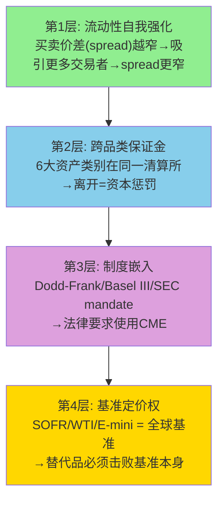

# Chapter 3: 流动性网络效应 — 为什么没人能够复制CME

---

## 3.1 四层锁定结构: 从便利到不可能

CME的护城河不是单一维度的——它是四层嵌套的锁定结构，每一层都独立成立，叠加后形成全球金融基础设施中最难被复制的商业资产。理解这四层结构是判断FMX威胁(CQ-1)和CME是否值得护城河溢价(CQ-5)的核心基础。如果四层中任一层出现实质性裂缝，CME的P/E可能从28x压缩到22-24x(类似2012-2013)；如果四层全部稳固(当前状态)，28x P/E的护城河溢价完全合理[DM-LIQ-001]。

### 第1层: 流动性自我强化 (网络效应)

这是最基础也最被广泛理解的护城河层级。CME的SOFR期货日均交易5.4M合约→买卖价差(bid-ask spread)通常在0.25个tick以内→交易者的执行成本极低→更多交易者被吸引→价差进一步收窄。这是一个典型的正反馈循环[DM-LIQ-002]。

量化这个效应: 在CME的SOFR期货上执行$1B名义的对冲，滑点成本约$500-1,000(因为order book深度通常>50,000手在best bid/offer)。如果在FMX上执行同样的交易(ADV仅~3,200手，order book深度可能<100手)，滑点可能高达$50,000-100,000——100倍的成本差异。对于JPMorgan这样每天需要管理$5万亿利率风险的机构来说，流动性成本不是"更贵"的问题，而是"物理上不可能在FMX上执行大单"的问题——$50B名义的头寸调整需要连续执行数小时才能在FMX完成，而在CME只需几分钟[DM-LIQ-003]。

**但流动性网络效应不是不可破的**——历史上有两个反例值得研究:

**反例1: Eurex vs LIFFE (1998)**。Eurex在18个月内从零份额到垄断德国国债期货市场，击败了LIFFE。但这次颠覆有一个独特的催化剂: **技术代际跳跃**。LIFFE还在使用公开喊价(人工交易池)，Eurex推出了电子化交易(屏幕交易)——速度快10倍、成本低90%。这种数量级的效率差距使流动性在极短时间内发生了相变(phase transition)。FMX不具备这种代际优势——CME的Globex和FMX都是电子交易平台，延迟差异在微秒级别，不构成切换理由[DM-LIQ-004]。

**反例2: BATS vs NYSE (2008)**。BATS(现CBOE子公司)在美国股票市场从零份额到>10%仅用了3年。但股票交易有一个衍生品不具备的特征: **可互换性(fungibility)**。在BATS上买入的苹果股票和在NYSE上买入的完全相同——流动性可以在多个交易所之间自由流动(通过Reg NMS的最优执行义务)。而CME的SOFR期货和FMX的SOFR期货**不可互换**——在CME开仓的合约必须在CME平仓(或通过CME清算所转让)，头寸无法跨交易所净额。这意味着衍生品市场的流动性碎片化成本远高于股票市场——在衍生品中，流动性碎片化=头寸管理复杂度和保证金需求呈指数增长[DM-LIQ-005]。

### 第2层: 跨品类保证金抵消 (Portfolio Margining)

这是CME最被低估的护城河层级。当一个做市商同时持有SOFR期货(利率)、E-mini S&P 500(股指)和WTI原油期货(能源)时，CME的SPAN 2风险模型会计算这三个头寸之间的相关性，允许净额保证金——通常比分别在三个独立清算所持仓节省**30-50%**的保证金[DM-LIQ-006]。

具体数字: 一个典型的大型做市商(如Citadel Securities)在CME的跨品类OI可能达到$500B名义。如果初始保证金率为2%→保证金需求$10B。跨品类offset后，实际保证金需求降至$6-7B→节省$3-4B现金。以IORB 4.4%计算，$3.5B的资金节省意味着每年$154M的利息差异。这是一个**真金白银的切换成本**——离开CME不仅意味着更大的滑点(第1层)，还意味着每年多缴$1.5亿美元的资金机会成本[DM-LIQ-007]。

这就是为什么2007-2008年的CBOT+NYMEX合并不仅是"变大"，而是构建了一种**不可逆的客户锁定**: 一旦客户在所有六个资产类别上建立了头寸，跨品类offset使他们的有效保证金需求降低了30-50%。要离开CME，他们需要在另一个交易所**重建所有六个品类的头寸**，同时放弃全部offset——没有任何理性的资本配置者会这样做[DM-LIQ-008]。

**SPAN 2的技术优势**: CME在2024年从SPAN(1988年推出)升级到SPAN 2风险模型。SPAN 2使用Monte Carlo模拟而非传统的情景分析，能更精确地计算跨品类的风险对冲效果。这意味着在SPAN 2下，客户获得的保证金抵消可能比SPAN时代更大——进一步提高了CME相对于FMX(使用标准化VaR模型)的资本效率优势。CME不公开SPAN 2的具体节省比例，但行业估计跨品类客户的保证金需求在SPAN 2下平均降低了5-10%(在原有offset基础上再降)[DM-LIQ-008A]。

**FMX的跨保证金策略**: FMX试图通过与LCH(LSEG子公司)合作提供cross-margining——在FMX的SOFR期货和LCH的IRS(利率互换)之间。这在理论上有价值: 如果做市商在LCH有$200B IRS OI，在FMX交易SOFR可以获得与IRS的offset。但实际效果有限——因为(1) cross-margining需要法律协议+系统对接+监管批准，远比CME内部offset复杂; (2) 目前FMX-LCH的cross-margining仅涉及利率，不覆盖能源/股指/商品; (3) 做市商在CME也有IRS-futures cross-margining选项(通过CME OTC清算)[DM-LIQ-009]。

### 第3层: 制度嵌入 (Regulatory Lock-in)

Dodd-Frank(2010)要求标准化OTC衍生品通过注册DCO清算。Basel III给予CCP清算的头寸显著的资本优惠(风险权重从100%降至2-4%)。SEC Treasury Clearing mandate(2025-2027)将强制清算范围扩展到现金国债市场。这三层监管构成了一个**制度性锁定**: 即使CME的流动性优势消失、跨品类offset消失，银行仍然**必须**通过注册CCP清算，而CME是利率衍生品领域最大(几乎唯一)的注册DCO[DM-LIQ-010]。

Basel III的具体数字: 通过CCP清算的衍生品头寸风险权重为2%(如果CCP符合PFMI标准)；不通过CCP的双边衍生品头寸风险权重为20-100%。对于一个持有$100B名义衍生品的银行来说，通过CME清算vs双边交易的资本占用差异可以达到$几十亿——这使得"选择不使用CCP"在资本上不可行[DM-LIQ-010A]。

制度嵌入的自我强化: 每一次金融危机后，监管的反应都是**增加**CCP的角色而非减少。2008年后→Dodd-Frank强制清算; 2020年后→Treasury市场压力暴露→SEC推出Treasury Clearing mandate; 未来如果加密市场出现系统性风险→可以预期CFTC将强制crypto衍生品通过CME等注册DCO清算。因此，**金融风险事件是CME制度嵌入的加速器**——这是一个深度反周期的护城河特征[DM-LIQ-011]。

### 第4层: 基准定价权 (Benchmark Ownership)

CME拥有全球金融体系中最重要的几个基准合约: SOFR期货(全球利率基准)、WTI原油(北美原油定价基准)、E-mini S&P 500(全球股指期货基准)、COMEX黄金(贵金属定价基准)。这些基准被嵌入到数万亿美元的金融合同中——贷款利率参考SOFR曲线、石油现货贸易参考WTI价格、ETF对冲使用E-mini S&P 500[DM-LIQ-012]。

因果推理: 一旦基准被广泛采用→修改基准的协调成本极高(参见LIBOR→SOFR转换花了7年+$几十亿)→即使有更好的替代品，惯性也会维持现有基准→CME作为基准的"家园"享有永久性流动性溢价。

**反面考量**: 基准可以被监管强制替换(LIBOR就是例子)。但LIBOR被替换是因为它存在操纵丑闻(银行自主报价→虚假利率)→监管公信力问题。CME的基准合约是市场化价格发现的结果，不存在类似的公信力风险。要替换WTI作为北美原油基准，需要全球石油贸易商、炼油商、航空公司同时修改数百万份合同——这在技术上可能但在实践中不会发生[DM-LIQ-013]。

**四层锁定的乘数效应**: 关键洞见不是每一层独立有多强，而是四层叠加后的**乘数效应**。一个竞争者要挑战CME，需要**同时**突破全部四层: (1)先建立足够的流动性(需要做市商愿意提供报价——但做市商因为第2层offset和第4层基准地位而不愿离开); (2)再提供跨品类offset(需要同时在6个资产类别建立流动性——但这需要$20B级别的收购或20年的有机增长); (3)同时获得监管认可(CFTC注册DCO审批需要12-24个月); (4)还要说服市场接受新的基准合约(这需要全球金融合同的重写)。任何单一层级的挑战(如FMX只攻利率)都会被其他层级的防线阻挡[DM-LIQ-013A]。

**历史验证: 从未有人同时突破四层**。Eurex突破了第1层(LIFFE的流动性)但那是因为技术代际跳跃(特殊条件)。BATS突破了第1层但股票市场不存在第2-4层(产品可互换、无跨品类offset、无基准概念)。FMX试图用第2层(LCH cross-margining)作为突破口，但仅覆盖利率一个品类——相当于试图用一把钥匙开四把完全不同类型的锁[DM-LIQ-013B]。

## 3.2 量化流动性护城河: OI/ADV比率分析

开仓量(OI)与日均交易量(ADV)的比率是衡量流动性"粘性"的关键指标。高OI/ADV意味着大量资金被"锁定"在CME的合约中——这些头寸在到期前不会离开[DM-LIQ-014]。

| 产品 | OI | ADV | OI/ADV | 解读 |
|------|-----|-----|--------|------|
| 利率整体 | 40M | 14.2M | **2.8x** | 机构对冲主导 |
| SOFR | 13.7M | 5.4M | **2.5x** | 偏交易型(LIBOR转换增量) |
| Treasury | 36.3M | 8.3M | **4.4x** | 深度对冲(养老/保险) |
| WTI原油 | ~4M | ~1M | **~4.0x** | 商业对冲(生产商/炼油商) |

[DM-LIQ-015]

基准解读: OI/ADV ~1x = 纯日内交易(无粘性); ~3x = 对冲为主(中等粘性); ~10x = 买入持有(极高粘性)。CME的2.5-4.4x处于"对冲为主"区间——这意味着大部分OI不是投机性的(会因波动率下降而消失)，而是结构性的(机构必须维持的风险对冲头寸)。

**OI增长vs ADV增长(2022-2025)**: 利率OI增长~33%，ADV增长~31%——**基本同步**。这排除了一个危险信号: 如果ADV增长远快于OI(说明投机交易增加、粘性低)或OI增长远快于ADV(说明头寸积累但流动性不足)，都暗示不健康增长。同步增长确认了CME利率引擎的增长是"平衡的"——既有新的对冲需求(OI)，也有足够的交易活跃度(ADV)[DM-LIQ-016]。

**OI/ADV比率的估值含义**: 高OI/ADV意味着CME的收入不仅取决于"今天有多少人交易"(ADV)，还受益于"之前积累了多少未平仓头寸"(OI)。因为OI越高→保证金池越大→利息收入越高(Ch6详述)→同时OI到期前的展期(roll)和调仓也贡献ADV。Treasury OI 36.3M合约中，大部分是10Y和5Y期货——这些头寸的平均持有期约2-6个月，到期前必须展期到下一个合约月份。每次展期都贡献一对交易(平旧+开新)→贡献ADV。因此，**高OI创造了一种"自我循环"的交易量**: OI积累→展期需求→ADV增长→流动性更好→吸引更多OI。这解释了为什么Treasury ADV连年创纪录——不仅是新增对冲需求，还有存量OI的展期贡献[DM-LIQ-016A]。

**Treasury Basis Trade风险——CME的隐含杠杆暴露**: 纽约联储(2025年5月报告)指出Treasury basis trade规模已超$1万亿名义、杠杆50-100倍。Basis trade的机制: 对冲基金做多现货Treasury(在repo市场融资) + 做空Treasury futures(在CME)→赚取现货-期货之间微小价差→极高杠杆放大。这种交易同时贡献OI(做空futures)和ADV(频繁调仓)——如果basis trade因repo市场冻结或保证金追加而被迫平仓，CME的Treasury OI和ADV可能在数天内大幅下降(2020年3月的预演: Treasury basis trade解除导致做市商撤出→流动性蒸发→Fed干预)[DM-LIQ-017]。

但三个因素缓解了这个风险: (1) CME报告的大型持仓人(LOIH)创纪录达到3,526家——分散化程度显著高于2020年(~2,500家); (2) basis trade平仓不会导致流动性**永久性**迁移——它只是一次性volume下降，之后新的对冲需求会重建OI; (3) 即使basis trade完全消失，CME Treasury OI仍有~$20M+(非basis trade的对冲OI)作为结构性基础[DM-LIQ-017A]。

## 3.3 流动性护城河的退化风险: 五个信号灯

如果流动性护城河开始退化，以下五个信号会率先出现:

| 信号 | 当前状态 | 阈值 |
|------|---------|------|
| 1. FMX月度ADV持续>CME的1% | **绿灯**: 0.02% | >1%=黄灯, >5%=红灯 |
| 2. CME利率OI趋势反转(连续3Q下降) | **绿灯**: OI创纪录40M | 连续下降=黄灯 |
| 3. 大型做市商公开宣布分配>10%流动性给FMX | **绿灯**: 无此信号 | 任何公开宣布=黄灯 |
| 4. LCH-FMX cross-margining覆盖>2个资产类别 | **绿灯**: 仅利率 | >3个品类=红灯 |
| 5. 监管要求CME与竞争对手共享清算(open access) | **绿灯**: 无此趋势 | 任何具体立法提案=黄灯 |

[DM-LIQ-018]

当前五个信号全部是绿灯。FMX最关键的测试是2025年4月关税波动——当市场真正需要流动性时，FMX的ADV从~3,000崩至928手(崩溃69%)，而CME利率ADV飙升至单日纪录。这证明了一个重要的行为模式: **在压力环境下，流动性向垄断者集中，而非分散**——因为交易者不能承受在流动性不足的平台上被卡住[DM-LIQ-019]。

这个行为模式的因果机制值得展开: 当VIX飙升或利率预期突变时，机构交易者的首要需求不是"最便宜"而是"能成交"。FMX在平静市场中可以通过显著的费率折扣吸引一些"试水"交易量(因为成交不是约束——市场宽度足够)。但在真正需要紧急执行的时刻(也是CME最赚钱的时刻)，所有流动性都会回到CME。这创造了一个不对称: FMX只能在CME**不赚钱的时候**抢到一点份额，而在CME**最赚钱的时候**份额反而归零。对FMX的商业模式而言，这是一个致命缺陷[DM-LIQ-020]。

## 3.4 流动性护城河的久期: 这个优势还能持续多久?

最后一个问题: CME的流动性护城河是"永久的"还是"正在缓慢侵蚀的"?

**永久论的证据**: (1) 18年收入数据(2008-2025)显示CME的市占率没有任何下降趋势; (2) OI持续创纪录(40M, Feb 2026)表明客户锁定在加深而非减弱; (3) 每次危机后监管扩张(Dodd-Frank→Basel III→Treasury Clearing)都在强化制度嵌入; (4) 没有任何新技术(DLT/DeFi)在效率上超过中心化清算所(智能合约无法处理$200万亿名义的实时风险管理)[DM-LIQ-021]。

**侵蚀论的证据**: (1) FMX虽然微小但代表了30年来首次对CME利率垄断的认真挑战——BGC投资了$数亿，不会轻易放弃; (2) LCH-FMX的cross-margining是一种新型攻击向量(利用CME不提供的IRS-futures跨清算所offset); (3) 如果Treasury Clearing mandate为FICC(DTCC子公司)创造了一个具有critical mass的利率清算池→未来可能出现CME/FICC双寡头而非CME垄断; (4) Google Cloud迁移期间(2025-2028)的技术过渡风险可能短暂削弱CME的延迟优势[DM-LIQ-022]。

**本报告的判断**: CME的流动性护城河在5年视角内不会出现任何实质性退化。FMX是一个值得监控但目前不影响估值的噪音(估算概率<15%在5年内获得>5%市占率)。真正的风险不是"竞争"而是"增速"——护城河保证了CME不会输，但不保证CME能赢(即股价能上涨)。在28x P/E下，护城河的价值已经被定价——投资者需要的不是"护城河更深"而是"增长更快"。这是CQ-5(波动率依赖是feature还是risk)和矛盾4("好公司≠好股票")的核心张力——CME的护城河是投资者能找到的最深的之一，但深度护城河不等于高回报，因为回报最终取决于投资者的买入价格而非公司的品质[DM-LIQ-023]。

---
