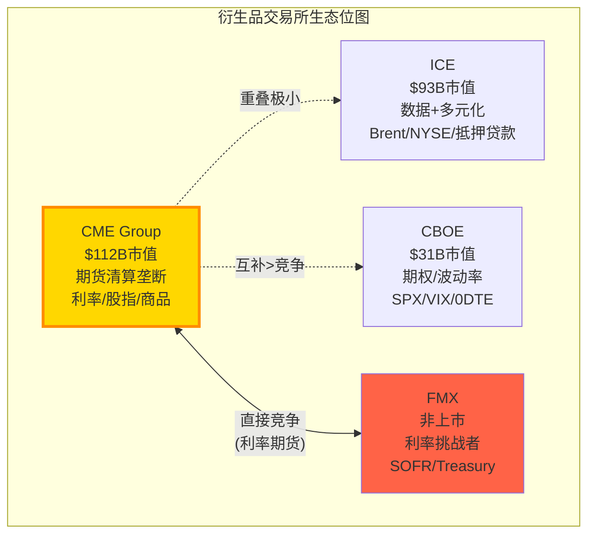

# Chapter 4: 竞争格局深度分析 — CME vs ICE vs CBOE vs FMX

---

## 4.1 竞争格局总览: 四个不同的物种

全球衍生品交易所行业的竞争格局不是一个传统的市占率之争，而是**四个进化到不同生态位的物种**共存。CME(衍生品清算垄断)、ICE(数据+多元化帝国)、CBOE(期权/波动率专家)和FMX(利率挑战者)各自占据独特且稳定的生态位，直接竞争面有限。理解这一点对估值至关重要——因为"竞争"对CME的威胁不是同行的价格战，而是**各自增速差异带来的估值重评**[DM-COMP-001]。

## 4.2 CME vs ICE: 利润机器 vs 增长引擎

CME和ICE是全球最大的两家交易所集团，但商业模式截然不同。这种根本性的商业模式差异直接导致了投资者面临的选择困境: CME是更好的**公司**(利润率2倍+、杠杆1/3)，但ICE可能是更好的**股票**(增速更快、recurring占比更高)[DM-COMP-002]。

### 财务对比 (FY2025)

| 维度 | CME | ICE | 差异 | 含义 |
|------|-----|-----|------|------|
| Revenue | $6.52B | $9.9B | ICE 1.5x | ICE含NYSE+抵押贷款 |
| Net Margin | **62.0%** | 26.1% | CME 2.4x | CME轻资产极致 |
| EBITDA Margin | **87.7%** | ~60% | CME +28pp | 垄断经济的体现 |
| Debt | $3.4B | **$20B** | ICE 5.9x | ICE收购驱动 |
| Debt/EBITDA | <1x | ~3x | CME更安全 | ICE收购Black Knight $11.7B |
| P/E (TTM) | 28x | 28x | **趋同** | 市场不给CME品质溢价 |
| EPS Growth (FY2025) | +8.7% | +14.3% (adj +21%) | ICE更快 | ICE收购协同+数据增长 |
| Recurring Revenue % | ~13% (数据) | **~55%+** | ICE 4x | ICE数据+抵押贷款 |
| Div Yield | **4.2%** | 1.2% | CME 3.5x | CME返还几乎全部FCF |
| FCF Yield | **4.3%** | ~3.5% | CME略高 | 但ICE用FCF还债+收购 |

[DM-COMP-003]

**P/E趋同的深层含义**: CME和ICE的P/E在2026年完全趋同(都是~28x)，但2020年时CME 30.9x vs ICE 24.7x(CME有25%溢价)。这个溢价收敛不是因为CME变差了——而是因为ICE变好了(0DTE间接受益于CBOE创造的波动率生态+Black Knight整合释放协同+数据业务增速加快)。对CME投资者的含义: **你不能指望P/E扩张来提升回报——CME的品质溢价已经被ICE的增速追平了**[DM-COMP-004]。

### 业务重叠与护城河对比

CME和ICE的直接竞争仅在能源(WTI vs Brent)和固定收益数据(CME DataMine vs ICE Data)两个领域。在这两个领域:

**能源**: WTI(CME)和Brent(ICE)是两个不同的基准——WTI定价北美原油，Brent定价全球原油。两者的差值(WTI-Brent spread)本身是一个活跃的交易品种。这不是零和竞争，而是**互补关系**——因为做WTI-Brent spread的交易者必须同时在CME和ICE交易。如果CME试图推出Brent期货(历史上尝试过)，由于ICE在Brent上的流动性垄断(同Ch3的流动性网络效应逻辑)，不会成功；反之亦然[DM-COMP-005]。

**固定收益数据**: ICE在固定收益定价数据上有近垄断地位(来自2015年收购Interactive Data和2019年整合Refinitiv的部分业务)。CME的DataMine提供交易数据(volume、OI、price history)但不覆盖定价估值数据。这两种数据服务于不同客群(ICE: 资产管理公司的组合估值; CME: 交易策略和风控)——重叠有限[DM-COMP-006]。

### ICE的战略路径: 从交易所到金融基础设施平台

ICE过去5年的战略方向是一个深思熟虑的pivot——**远离纯交易所业务**，向高recurring、低波动率相关的收入模型转型:
- 2020年: NYSE上市收入仅占~10%(大部分来自IPO/listing fees)
- 2021年: 收购Ellie Mae(抵押贷款技术, $11B)——彻底进入非交易所领域
- 2023年: 收购Black Knight($11.7B)——抵押贷款服务技术(Mortgage Tech revenue $2.1B)
- 2025年: 数据+Mortgage Tech合计占收入55%+, 交易所收入降至<45%

因果推理: ICE的战略是将自己从"EBITDA margin 60%但增速8%的交易所"转型为"EBITDA margin 45%但增速15%的技术平台"——用短期利润率换长期增速和收入稳定性。这个策略在2021-2025年被市场奖励(P/E从24.7x扩张到28x)。但$20B的收购债务意味着ICE的资产负债表远不如CME健康——如果利率长期维持高位，ICE的利息成本($800M+/年)将持续侵蚀盈利质量[DM-COMP-007]。

**对CME投资者的启示**: ICE的转型验证了一个矛盾: 纯交易所模式(CME)的利润率最高但增速最低; 多元化模式(ICE)牺牲利润率换增速。市场目前给两者相同的P/E——这意味着市场认为ICE的增速恰好补偿了CME的利润率优势。如果ICE的Mortgage Tech增速放缓(当前受美国房贷市场周期影响)，CME可能重新获得P/E溢价[DM-COMP-008]。

## 4.3 CME vs CBOE: 期货 vs 期权的共生生态

CBOE和CME的关系更准确地描述为**共生**而非竞争——CBOE的SPX期权和CME的E-mini S&P 500期货服务于同一个底层指数(S&P 500)但满足不同的需求: 期权用于非线性对冲(下行保护、收益增强)，期货用于线性暴露(方向性交易、指数复制)[DM-COMP-009]。

### CBOE的0DTE革命: 为什么它跑赢了CME

CBOE 5年回报+208% vs CME +91%。三个驱动因素(按贡献度排序):

**驱动1 — 0DTE(零日到期期权)创造了新TAM (贡献~40%)**:
- 2022年CBOE推出SPX日到期期权
- 0DTE ADV: 2.3M合约/日(占所有SPX volume 59%)
- SPX期权**只在CBOE交易**(独家listing)→零竞争
- 0DTE吸引了一个全新的客群: 零售交易者(用期权替代杠杆ETF)和机构(用0DTE替代delta-one hedging)
- 这相当于CBOE从平地创造了一个年收入$500M+的新业务线——CME同期没有任何类似的产品创新[DM-COMP-010]

**驱动2 — P/E重评: 从30%折价到完全平价 (贡献~30-40%)**:
- 2020年CBOE P/E 21.7x(CME 30.9x)——CBOE有30%折价
- 2026年两者都是~28x——折价完全消除
- P/E从21.7x扩张到28x(+29%)在5年内贡献了~29pp的回报
- 因果: 0DTE增长故事→sell-side重新定义CBOE从"周期股"到"成长股"→P/E扩张[DM-COMP-011]

**驱动3 — EPS增速差 (贡献~25-30%)**:
- CBOE 5年 EPS CAGR 19.5% vs CME 13.7%——5.8pp的持续差距
- CBOE保留74%利润再投资(vs CME分红94%)
- 复利效应: $1 × (1.195^5) = $2.44 vs $1 × (1.137^5) = $1.91→差距27pp(5年)
- 因果: 高retention→更多再投资→收购Data/Analytics→recurring收入增长→EPS增速更快[DM-COMP-012]

### CBOE 5年回报的投资教训

这个5年回报差异的比较对CME估值有深刻含义(ANO-7/矛盾4):

> **"最好的回报不来自最好的公司，而来自预期最错的公司"**

CME = 9/10品质的公司，2020年被定价为9/10(30.9x P/E)→合理回报(EPS+dividend=~10%年化)
CBOE = 7/10品质的公司，2020年被定价为5/10(21.7x P/E)→0DTE将品质提升到8/10→超额回报(EPS增长+P/E扩张+0DTE)

这验证了NCH-2: **CME在$313/28x没有被低估——品质溢价已经完全反映在价格中**。要在CME上获得超额回报，投资者需要等到P/E压缩到22x以下(犯错买入窗口)或者出现CME自己的"0DTE时刻"(一个市场没有预期到的增长引擎)[DM-COMP-013]。

### 当前分析师分歧: CBOE→CME轮转?

一个有趣的最新信号: BofA下调CBOE至Neutral(PT $227, 当前$293)，理由是0DTE volume normalization风险。同时Morgan Stanley上调CME PT至$301。这可能暗示一波从CBOE到CME的资金轮转开始——如果0DTE增长放缓，CBOE的"成长股"叙事可能逆转→P/E压缩→资金流向"稳定性"定价的CME[DM-COMP-014]。

但这个轮转对CME股价的影响有限: CME的P/E已经在28x，即使获得少量轮转资金也不太可能推升到30x+(因为CME的增速不支持更高估值)。更可能的结果是CBOE从28x压缩到24x，而CME维持28x——**CME的相对表现改善但绝对回报不变**[DM-COMP-015]。

### CME是否需要自己的"0DTE时刻"?

CBOE vs CME的回报差异揭示了CME面临的一个战略问题: **CME在过去5年没有创造任何真正的新产品类别**。CME的增长来自(1)有机volume增长(波动率+新客户); (2)RPC温和上升; (3)保证金利息。这些都是**现有业务的自然增长**，缺乏CBOE 0DTE那样的"从零到一"创新。

潜在的"CME 0DTE时刻"候选:
- **Treasury Clearing**(2026 Q2上线): 如果CME获得15-25%份额→$200-500M新收入→可能改变增速叙事
- **事件合约(Event Contracts)**: CFTC正在审批非金融事件合约(选举、天气等)→全新TAM→但监管不确定性极高
- **CFTC批准Perp合约**: 永续期货在美国上市→CME成为制度化perps平台→TAM可能>$10B但时间表完全不确定
- **Micro期权**: 类似Micro期货的成功，推出更小面额的期权→吸引零售客群

这四个候选中，Treasury Clearing最接近现实(已获批、有时间表)。如果成功，它可能为CME提供类似0DTE的增长催化——将增速从6-7%提升到8-10%→P/E可能从28x扩张到30-32x→$15-25/股的上行空间[DM-COMP-015A]。

## 4.4 FMX深度分析: 数十年来最显著的威胁

BGC Group旗下的FMX(BGC Partners子公司)是CME在利率期货垄断上面临的首个认真挑战者。深入理解FMX的攻击策略、当前进展、结构性劣势和最终成败概率是回答CQ-1的核心[DM-COMP-016]。

### FMX的攻击策略

FMX的核心战略不是"建立一个更好的CME"(这在数学上不可能)，而是**利用CME生态系统的一个结构性缝隙: 跨清算所保证金**。

机制: CME要求所有产品在CME Clearing清算。如果一个做市商在CME有SOFR期货头寸+在LCH有利率互换(IRS)头寸，这两个头寸在经济上是相互对冲的——但因为分属两个清算所，不能享受保证金抵消→双重资本占用。FMX的方案: 在FMX交易SOFR期货→通过LCH清算→与LCH的IRS头寸自动offset→**节省保证金**[DM-COMP-017]。

这在理论上有显著价值: 一个大型做市商(如Jane Street)可能在LCH有$100B IRS OI。如果能将$50B的SOFR期货对冲也放在LCH(通过FMX)，保证金节省可能达到$5-10B→年化资金成本节省$200-400M(按IORB计算)。这是一个**巨大的、真金白银的经济激励**——足以让做市商愿意承受FMX更差的流动性[DM-COMP-018]。

### 当前进展: 从承诺到现实

| 里程碑 | 日期 | 结果 |
|--------|------|------|
| SOFR期货上线 | 2024年9月 | ADV缓慢增长至~3,200手 |
| Treasury期货上线 | 2025年5月 | 数据有限 |
| 峰值日ADV | 2025年2月 | 9,500手(CME同日>14M) |
| 关税压力测试 | 2025年4月 | **ADV从~3,000崩至928手(-69%)** |
| 当前市占率 | 2026年3月 | **~0.01%** (可忽略) |

[DM-COMP-019]

### FMX的五个结构性劣势

**劣势1: 流动性鸡生蛋问题**。做市商不愿在FMX提供深度报价(因为没有对手方)→没有深度报价→对冲基金不愿在FMX交易→做市商更没有动力→恶性循环。FMX试图通过费率折扣(免费或负手续费)打破这个循环，但上线18个月来效果有限——ADV仍在~3,000手(CME的0.02%)，远未达到critical mass[DM-COMP-020]。

**劣势2: 压力环境下的流动性蒸发**。2025年4月关税波动是FMX上线后的首次真实压力测试——结果对FMX来说是灾难性的: ADV暴跌69%。这暴露了一个致命弱点: 做市商在FMX提供的流动性是"好天气流动性"——当他们自己需要风险管理时(恰恰是波动率spike时)，他们会**首先撤回FMX的报价去CME执行**[DM-COMP-021]。

**劣势3: CME的跨品类offset**。即使FMX-LCH的cross-margining在利率上提供了价值，客户在CME还有股指、能源、商品等其他品类的头寸——这些品类的offset不可能在FMX获得(详见Ch3第2层)。一个客户可能因为LCH cross-margining在FMX放$10B利率头寸，但因为CME跨品类offset在CME保留$200B其他头寸——净效果对CME几乎无影响[DM-COMP-022]。

**劣势4: 时间不站在FMX一边**。每个月CME的OI继续创纪录(Treasury OI 36.3M, SOFR OI 13.7M)→流动性护城河加深→FMX追赶难度增加。流动性网络效应的特点是**先发者的优势随时间扩大，而非缩小**。FMX需要在CME的OI趋势反转之前获得critical mass——但目前没有任何迹象表明CME OI会反转[DM-COMP-023]。

**劣势5: BGC的资金和耐心有限**。BGC Group 2025年收入~$2.4B，市值~$8B。FMX的持续亏损(负手续费+基础设施投资+人员成本)需要BGC持续输血——估计年亏损$50-100M。如果FMX在3-5年内无法达到盈亏平衡(需要~50,000 ADV——当前的15倍)，BGC可能面临股东压力被迫缩减投入或寻找战略合作伙伴(如LSEG收购FMX以增强LCH的利率生态)——这会进一步削弱FMX作为独立竞争者的定位[DM-COMP-024]。

### FMX成功概率评估

| 情景 | 概率 | 5年后市占率 | CME估值影响 |
|------|------|-----------|-----------|
| FMX获得>5%利率份额 | **<15%** | >5% | -7到-10% |
| FMX维持在1-5% | **~25%** | 1-5% | -2到-5% |
| FMX停滞在<1% | **~40%** | <1% | 无影响 |
| FMX被迫关闭或被LSEG收购整合 | **~20%** | 0% | 消除不确定性溢价 |

[DM-COMP-025]

**期望值**: 0.15×(-8.5%) + 0.25×(-3.5%) + 0.40×(0%) + 0.20×(+1%) = **-1.95%**。FMX对CME估值的期望影响约-2%——这是噪音级别，不影响投资决策。但尾部风险(>5%份额, P<15%)需要持续监控: 如果FMX月度ADV连续3个月>10,000手，应上调成功概率[DM-COMP-026]。

## 4.5 其他竞争者: Eurex / LSEG / Nasdaq

**Eurex(Deutsche Börse子公司)**: 欧洲衍生品~65%份额，在Euro Stoxx期货和欧洲利率期货上垄断。对CME美国核心业务的直接威胁近零——因为Eurex的流动性集中在欧元计价产品上。唯一的间接竞争: Eurex的美元利率产品试图吸引亚洲时区交易量(利用时差，在CME休市时提供流动性)。但这只是边缘量——机构在亚洲时区的美元利率对冲需求通过CME的亚洲电子交易时段满足[DM-COMP-027]。

**LSEG(London Stock Exchange Group)**: 通过LCH运营全球最大的OTC利率互换清算所($140万亿名义)。LCH与CME不直接竞争(IRS vs 期货是不同产品)，但LCH-FMX的合作关系使LSEG间接成为FMX的战略支持者。LSEG的动机: 如果FMX成功→LCH获得更多利率清算volume→增强LSEG在利率基础设施中的地位。但LSEG不太可能为FMX提供大量资金支持(LSEG自身债务~$10B，优先还债)[DM-COMP-028]。

**Nasdaq**: 主要竞争领域是北欧衍生品和美国股票期权。与CME在期货领域几乎没有重叠。Nasdaq的技术平台服务于其他交易所(如HKEx使用Nasdaq的matching engine)，但这不影响CME的市场地位[DM-COMP-029]。

**DTCC/FICC — Treasury Clearing的潜在竞争者**: 虽然不是传统的"交易所竞争者"，DTCC旗下的FICC(Fixed Income Clearing Corporation)是当前美国国债市场的垄断清算所。SEC的Treasury Clearing mandate虽然旨在增加中央清算覆盖率，但FICC作为incumbant拥有**现有客户关系+成熟的清算基础设施+与Fed的直接结算通道**。CME能从FICC手中抢到多少份额是CQ-3的核心——如果FICC防守成功(CME份额<5%)，BrokerTec和NEX $5.4B收购的投资回报率将进一步被质疑。CME的差异化是Treasury cash-futures cross-margining(在同一清算所持有现货和期货→保证金节省)——这是FICC无法提供的(FICC不清算期货)[DM-COMP-029A]。

### 竞争格局的动态演变: 2026-2030展望

当前竞争格局的稳定性在5年内可能被三个因素打破:

**因素1: Treasury Clearing上线(2026-2027)**。这是衍生品清算行业20年来最大的结构变化——$4万亿+日均交易量的市场从双边走向中央清算。CME和FICC的竞争结果将重新定义两者的市场地位。如果CME获得15-25%份额→CME增速叙事改善→P/E可能从28x扩张。如果CME<5%→NEX收购价值被进一步质疑→P/E可能承压[DM-COMP-030A]。

**因素2: ICE的Mortgage Tech整合成效(2025-2027)**。ICE花了$23B收购Ellie Mae和Black Knight——如果整合释放了显著协同(如被预期的$200M+成本协同)→ICE的EPS增速将进一步拉开与CME的差距→P/E分化压力。反之，如果整合不及预期→ICE P/E压缩→CME相对受益[DM-COMP-030B]。

**因素3: 加密衍生品监管明朗化(2026-2028)**。如果CFTC获得加密现货市场监管权+批准perp合约→CME可能成为最大受益者(制度信任+现有crypto期货基础设施)。但这个时间表高度不确定，且政治风险(国会两党对加密监管框架的分歧)使任何具体预测都不可靠——因此我们给予较低的概率权重[DM-COMP-030C]。

## 4.6 竞争格局的估值含义

总结四个竞争者对CME估值的影响:

| 竞争者 | 直接威胁 | 间接影响 | 估值影响(5年) |
|--------|---------|---------|-------------|
| ICE | 极低(不同生态位) | **EPS增速差驱动P/E收敛** | -2%至+2%(P/E波动) |
| CBOE | 无(互补) | **0DTE创造新产品预期** | 0%(CME需要自己的创新) |
| FMX | 低(0.01%份额) | **利率垄断叙事被质疑** | -2%(期望值) |
| Eurex/LSEG | 极低 | LCH-FMX间接支持 | 已包含在FMX评估中 |

**净影响**: 竞争格局对CME当前$313/28x的估值影响在-5%至+2%之间——远小于波动率周期(CQ-5, 影响可达±30%)和利率周期(CQ-2, 影响±13%)的影响。**CME的估值不是被竞争决定的，而是被增速和宏观环境决定的**——这是一个被护城河保护的业务，但护城河的深度不能转化为超额回报，除非在估值折价时买入[DM-COMP-030]。

换言之: 投资者在CME的竞争分析上花的每一分钟，可能不如花在利率路径预测和波动率中枢判断上有价值。竞争是CME最不需要担心的维度——收入增速(能否超过consensus 7%)和宏观环境(利率水平和波动率中枢)才是真正驱动CME股价的核心变量[DM-COMP-030D]。

---
