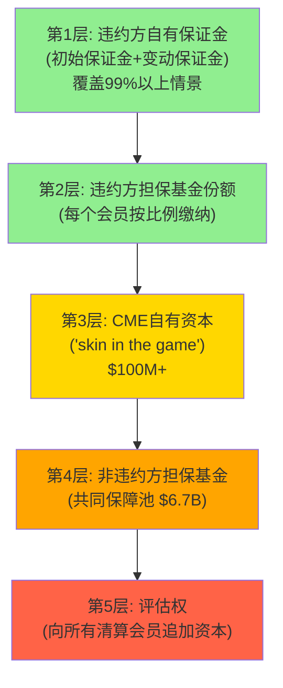

# Part II: 经济引擎 — 垄断的利润机器如何运转

---

# Chapter 5: 清算经济学 — 44年零穿透的商业逻辑

---

## 5.1 清算所的五个核心问题

深入理解CME Clearing的经济学是理解CME整体估值的基础——因为清算业务不仅贡献了81%的收入($5,281M)，还通过保证金池产生了$900M的隐藏利息收入(Ch6将详细解剖)。更重要的是，清算所的制度嵌入是CME护城河最深的层级[DM-CLR-001]。

**Q1: CME清算什么？**

CME Clearing处理在CME Globex和BrokerTec平台上执行的所有衍生品和现金国债交易。FY2025盯市名义金额超过$200万亿/年，日均约$600万亿。这包括六大资产类别的期货和期权，以及通过BrokerTec的US Treasury现金债券交易。CME充当每一笔交易的**中央对手方**(CCP)——买方的卖方、卖方的买方。这意味着当交易一方违约时，CME承担对手方风险——但这个风险通过保证金制度被层层缓冲(详见Q3)[DM-CLR-002]。

**Q2: 清算如何赚钱？**

三层收入结构:

| 收入来源 | FY2025金额 | 占比 | 增量利润率 | 关键特征 |
|---------|-----------|------|-----------|---------|
| 清算手续费 | $5,281M | 81.0% | ~95% | 按合约数量收费，与名义值无关 |
| 市场数据 | $803M | 12.3% | ~90% | 清算产生的价格数据，高recurring |
| 其他(接入/通信) | $436M | 6.7% | ~85% | 连接费、co-location |
| **合计** | **$6,520M** | **100%** | | |

[DM-CLR-003]

清算费的"按合约数量定价"模式有一个微妙但对估值极其重要的含义: CME的收入**不受通胀影响**(名义值上升不增加收入)，但也**不受通缩影响**(名义值下降不减少收入)。一手SOFR期货的清算费约$0.49，无论这手合约管理的是$100万还是$1亿的利率风险暴露。CME的收入纯粹是**交易活动量**的函数，而非交易金额的函数。

因果推理: 按合约定价→CME更像"金融高速公路的收费站"(按车辆收费)而非"金融百货的佣金商"(按销售额收费)→这种模式天然抵御通胀/通缩→但也意味着收入增长只能来自ADV增长或RPC提升→ADV增长取决于波动率和结构性因素→**CME的top-line增长不可避免地与波动率周期绑定**[DM-CLR-004]。

**Q3: 44年零穿透如何实现？**

CME Clearing自1982年现代风险管理体系建立以来从未发生过穿透(即损失超过违约方自有保证金)。这个记录通过一个五层违约管理瀑布实现:

[DM-CLR-005]

**2011年MF Global违约案例**: MF Global(第七大FCM)倒闭时，CME Clearing在24小时内完成了所有客户头寸的转移，零损失。因为MF Global的初始保证金(第1层)完全覆盖了其头寸敞口——违约瀑布甚至没有触及第2层。这个案例验证了一个关键设计: CME的初始保证金模型设置在覆盖**99%+的日内价格变动**——这意味着除非发生超过历史99%分位数的单日变动，否则第1层就足够吸收损失[DM-CLR-006]。

**反面考量——瀑布的极端风险**: 零穿透记录不意味着零风险。如果一个极端事件导致多个大型清算会员同时违约(如系统性银行危机+超过10个标准差的市场变动)→前4层被耗尽→第5层的评估权将传导损失给所有非违约会员→可能引发"清算所挤兑"(会员撤出保证金以避免被评估)→流动性危机。2018年纳斯达克北欧的Einar Aas事件展示了单个交易者可以穿透清算所担保基金(虽然最终被非违约方分摊)。但CME的规模($160B保证金池+$6.7B担保基金)和分散化(3,526家LOIH)使得这种极端情景的概率极低——但非零[DM-CLR-007]。

**Q4: 如果把CME的清算业务独立估值？**

清算所是CME最有价值的资产——如果独立估值:

| 组成部分 | 收入/利润估算 | 估值倍数 | 独立价值 |
|---------|------------|---------|---------|
| 清算手续费 | $5,281M × OPM 70% = $3,697M利润 | 17.5x(清算特许经营溢价) | ~$65B |
| 保证金利息(高利率环境) | $900M(净留存) | 12x(利率敏感性折扣) | ~$11B |
| 保证金利息(中性环境) | $500M(中估) | 12x | ~$6B |
| **清算业务总价值(中性)** | | | **~$71B** |

[DM-CLR-008]

$71B占CME总市值$112.6B的**63%**。这意味着:
- 交易匹配(Globex撮合引擎)+市场数据+其他业务合计仅值~$42B
- 清算和交易的协同效应(跨保证金、数据生成、客户锁定)远大于独立估值的总和
- 这解释了为什么分拆CME(将清算所独立上市)对股东没有价值——协同价值>独立溢价

因果推理: 清算所的估值倍数(17.5x earnings)高于一般金融基础设施(12-15x)，因为清算具有**制度强制性**(Dodd-Frank)+**垄断性**(CME是利率衍生品唯一选项)+**资本轻**(增量成本近零)。这三个特征的组合在全球金融行业中是独一无二的——即使是信用卡网络(Visa/Mastercard)也不同时拥有制度强制性和垄断性。Visa的客户理论上可以切换到Mastercard(没有法律禁止)；但CME的清算客户**必须**通过注册DCO清算，而CME在利率衍生品DCO中是唯一具备流动性的选项[DM-CLR-009]。

一个有用的类比: CME Clearing的经济特征类似于**垄断型收费桥梁**——(1)唯一的桥(垄断); (2)法律要求必须过桥(制度强制); (3)桥已经建好，多过一辆车几乎不增加成本(资本轻); (4)过桥费不按车辆价值收取(按合约定价)。唯一的差异: 收费桥的TAM是固定的(车流量受道路容量限制)，而CME的TAM随波动率扩张——这使CME更像一座**在暴风雨时自动变宽的桥**[DM-CLR-009A]。

**Q5: Treasury Clearing能带来多少增量？**

SEC Rule 17Ad-22e要求美国国债市场的cash交易和repo交易实现中央清算(合规日期: cash 2026年12月, repo 2027年6月)。CME Securities Clearing于2025年12月获批，预计2026年Q2上线[DM-CLR-010]。

**TAM估算**:
- 美国国债日均交易量: $700B+(cash) + $4T+(repo) = ~$4.7T/日
- 当前中央清算率: cash ~25%, repo ~45%(FICC/DTCC处理)
- mandate后目标清算率: cash ~85-90%, repo ~80-85%
- 增量清算量: 约$2-3T/日

**CME的潜在份额**: 15-25%(乐观: 35%)——基于BrokerTec的现有客户关系(120+经销商)和cross-margining优势(Treasury cash + futures在同一清算所)。

| 情景 | CME份额 | 估算年收入 | 增量OPM | 估值影响 |
|------|---------|-----------|---------|---------|
| 保守(5%) | $50B/日 | ~$80M | ~70% | +$1B (+1%) |
| 基准(15%) | $150B/日 | ~$200M | ~70% | +$3B (+2.7%) |
| 乐观(25%) | $250B/日 | ~$400M | ~70% | +$6B (+5.3%) |
| 极乐观(35%) | $350B/日 | ~$500M | ~70% | +$8B (+7.1%) |

[DM-CLR-011]

**CME的差异化**: CME能从FICC手中抢到份额的核心武器是**Treasury cash-futures cross-margining**。一个经销商如果在CME同时清算Treasury现金交易和Treasury期货→两者的风险对冲可以用净额保证金→保证金节省可能达20-40%(取决于头寸结构)。FICC不清算期货(那是CME的领地)→FICC无法提供这种cross-margining→如果保证金节省足够大→经销商有经济动机在CME清算至少一部分Treasury现金交易[DM-CLR-011A]。

**反面考量**: FICC(DTCC子公司)作为现有垄断者拥有巨大的incumbent优势——绝大多数国债经销商已经与FICC有清算关系、系统对接和法律协议。CME需要说服这些经销商**增加一个清算关系**(而非替换FICC)——额外的合规成本、系统对接和法律审查可能让许多经销商选择"什么都不变"(继续全用FICC)。因此，保守情景(5%)可能比基准情景(15%)更现实——除非CME的cross-margining能提供非常显著的、可量化的资本节省(>$1B级别)让经销商觉得"值得折腾"[DM-CLR-012]。

## 5.2 清算的增量经济学: 为什么每多一手合约都是纯利润

CME清算业务最强大的特征是**接近零的增量成本**。处理当日第28.1M手合约的成本与处理第1M手几乎完全相同——因为:

1. **固定成本主导**: 清算系统(hardware+software)、风控团队、监管合规的成本不随交易量线性增长
2. **边际成本极低**: 每笔新增交易仅消耗少量计算资源(微秒级的风险检查+数据库写入)
3. **没有库存**: 不同于银行(需要为贷款准备资本)，CME的CCP角色几乎不占用自有资本(保证金全部由清算会员提供和承担)

量化: FY2025 ADV从26.5M增长到28.1M(+6%)→清算费收入从$4,974M增长到$5,281M(+6.2%)→但运营成本增长远低于6%→**增量利润率约95%**。这意味着CME每多赚$1收入，约$0.95直接转化为利润[DM-CLR-013]。

这个特征的估值含义: CME的利润增速应该**略快于**收入增速(因为operating leverage)。FY2025数据验证: 收入+6.4%→EBITDA+13.5%→EPS+15.4%。EBITDA增速是收入增速的2倍——这就是operating leverage的威力。在波动率spike时(如2025年4月ADV 67.4M vs 平均28.1M)，这种leverage效应会更加极端: ADV +140%→收入可能+100%+→利润+200%+[DM-CLR-014]。

但operating leverage是双向的: 在低波动率环境下(如2012年ADV下降→收入-13%)，利润下降幅度大于收入下降幅度——因为固定成本无法压缩。CME的成本结构中约$1.9B是相对固定的(人员$700M、折旧/摊销$250M、技术$400M、监管合规$150M、其他$400M)。这意味着如果收入从$6.5B降至$5.5B(-15%)，利润可能下降$1B(-22%)——**下行时operating leverage放大了损失**[DM-CLR-014A]。

## 5.3 收入质量分析: 是什么驱动了ADV增长

清算费收入 = ADV × 252交易日 × 平均RPC。FY2025: 28.1M × 252 × $0.707 ≈ $5.0B(接近实际$5,281M，差异来自非标准合约和大客户折扣的计算)。要预测未来清算费增长，需要分解ADV增长的驱动因素[DM-CLR-015]:

**结构性增长驱动(不依赖波动率)**:
1. **全球衍生品渗透率上升**: 新兴市场(亚太、拉美)的机构投资者逐步采用衍生品做风险管理→Non-US ADV 8.3M(占30%, +9% YoY)，亚太增速最快(+18%)[DM-CLR-016]
2. **产品创新**: Micro合约、事件合约、24/7 crypto→每年增加0.5-1M新增ADV
3. **OTC-to-listed迁移**: UMR(Uncleared Margin Rules)推动更多OTC头寸向listed期货迁移→RPC和ADV双升
4. **SOFR生态成熟**: SOFR-linked贷款/CLO/MBS存量累积→更多对冲需求→SOFR ADV结构性增长
5. **Treasury Clearing**: 2026 Q2上线→如果成功将创造新的清算费收入流

**周期性增长驱动(依赖波动率)**:
1. **利率不确定性**: Fed政策越不确定→利率ADV越高(2022年+19%)
2. **地缘政治**: 每一次贸易摩擦、军事冲突、政策surprise→跨品类ADV spike
3. **市场回调**: 股市下跌→equity ADV spike(机构做hedging)→VIX上升→更多对冲需求
4. **选举周期**: 美国大选年通常ADV高于非选举年(政策不确定性溢价)

**结构性 vs 周期性的比例**: 基于2008-2025年数据，估算结构性ADV CAGR ~4-5%(不含波动率驱动)，周期性波动贡献±3-5%。这意味着在正常波动率年份，CME收入增长~4-5%; 在高波动率年份+9-10%; 在低波动率年份(如2012)+0-2%或略负[DM-CLR-017]。

## 5.4 2025年4月: CME清算系统的极限测试

2025年4月7日(关税公告日)，CME处理了**67.4M手合约**——全历史单日最高。这个数字是FY2025平均ADV 28.1M的2.4倍。这天发生了什么，以及CME的清算基础设施如何应对，揭示了清算系统的弹性极限[DM-CLR-018]:

- **单日交易量**: 67.4M手(此前纪录约60M)
- **盯市名义值**: 估计$1.5-2万亿当日变动
- **保证金追加(margin call)**: 估计$30-50B(因VIX飙升→保证金要求自动提高)
- **系统表现**: **零宕机、零延迟**——Globex在极端流量下正常运行
- **清算结算**: 当日T+1正常完成(所有margin call在deadline前到位)

反面考量: 67.4M是2.4x平均值——但如果出现5x平均值的事件(如2008年雷曼级别+系统性银行危机)，CME的系统和清算流程能否承受？CME在2025年11月经历了一次**11小时全面宕机**(CyrusOne数据中心人为错误导致冷却系统故障)→$1万亿OI被冻结→证明CME的基础设施并非无懈可击(详见Ch8技术分析)。这个宕机不影响清算安全性(头寸仍在，只是交易暂停)，但暴露了对第三方数据中心的依赖风险[DM-CLR-019]。

## 5.5 清算经济学的估值含义

将Ch5的分析汇总为CME清算业务的估值含义:

1. **增量利润率~95%**意味着CME的EPS增速应该持续快于收入增速(operating leverage)→在DCF模型中，利润增速假设应高于收入增速1-2pp
2. **Treasury Clearing**基准情景(15%份额)可能贡献~$200M新收入→+3%增速→如果市场重新定价这部分增长→P/E可能从28x微扩至29-30x
3. **ADV增长的4-5%结构性基线**意味着CME不需要波动率spike来维持低个位数增长→但要超过consensus 7%增速需要波动率配合
4. **清算所估值$71B(占市值63%)**意味着非清算业务仅值~$42B→如果Treasury Clearing成功且市场数据加速增长→非清算业务估值可能被重新认识

**CQ-3初步判断**: Treasury Clearing的期望值为正(+$3B基准情景)，但不是改变游戏规则的催化剂——$200M收入增量在$6.5B基数上仅+3%。要成为CME的"0DTE时刻"，需要CME获得>25%份额——这要求cross-margining提供的资本节省足以说服经销商从FICC迁移大量业务到CME[DM-CLR-020]。

**CQ-4初步判断(EBITDA Margin可持续性)**: FY2025 EBITDA Margin 87.7%处于历史高端(5年区间80-88%)。三个向上因素: (1) Google Cloud迁移完成后(2028+)可能节省$50-100M/年数据中心成本→OPM+100-200bp; (2) revenue增长带来的operating leverage天然推高margin; (3) 保证金利息膨胀净利润。三个向下因素: (1) FMX如果获得>1%份额→CME可能被迫降费率→OPM-50-100bp; (2) Google Cloud迁移期间(2025-2028)一次性成本持续; (3) 监管合规成本趋势性上升。净判断: EBITDA Margin可能在85-88%区间波动，87.7%是偏高但可持续的水平[DM-CLR-021]。

清算经济学的最终结论: CME的清算业务是全球金融体系中最具特许经营价值的资产之一。44年零穿透、95%增量利润率、制度强制+垄断+资本轻的三重特征构成了几乎不可复制的商业模式。但这些特征已经被28x P/E所反映——投资者在当前价格买入的不是"被低估的垄断"，而是"被合理定价的垄断"。超额回报需要催化剂(Treasury Clearing获得>25%份额/波动率中枢持续高企/意外的产品创新如perp合约获批)或者等待入场价格回落到合理区间以下[DM-CLR-022]。

---
