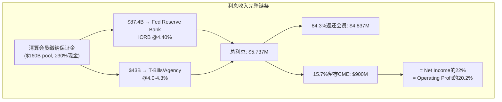

# Chapter 6: 保证金利息 — 影子银行引擎的解剖与利率敏感性

---

## 6.1 影子银行机制: $5,737M的利息是怎么赚的

Ch1已经概述了CME保证金利息的基本机制。本章将深入解剖这个隐藏引擎的完整运作逻辑——因为深入理解利息收入的周期性和利率敏感性是判断CME估值是否合理(CQ-2)的核心[DM-INT-001]。

**完整利息链条**:

1. **保证金收集**: 清算会员根据持仓风险缴纳初始保证金(initial margin)。CME规定**至少30%必须以现金形式缴纳**——低于30%的部分需支付10bp行政费。这个30%底线是CME利息收入的**结构性保障**——即使会员更愿意用国债充当保证金(不牺牲收益)，至少30%必须是现金[DM-INT-002]。

2. **资金存放**: CME将收到的现金保证金投资于安全短期资产。FY2024 10-K审计数据显示: $87.4B存放于**联邦储备银行芝加哥分行**(占总现金约67%)，赚取IORB ~4.40%。其余约$43B投资于美国国债(T-Bills)、政府机构证券、货币市场基金——受CFTC Regulation 1.25限制(禁止投资股票、公司债、结构化产品)[DM-INT-003]。

3. **利息分配**: CME将大部分利息返还给清算会员(pass-through)，自己保留一个**spread**(估计~5-15bp)。FY2025: 总利息$5,737M → 分配$4,837M(84.3%) → 净留存$900M(15.7%)[DM-INT-004]。

## 6.2 五年利息收入趋势: 从$67M到$900M

保证金利息收入的五年变化揭示了这个引擎的**极端利率敏感性**:

| 年份 | Fed Funds Rate | 现金池(估) | 总利息 | 净留存 | 留存率 | 占Op.Income |
|------|---------------|-----------|--------|--------|--------|-----------|
| FY2021 | 0.00-0.25% | ~$140B | $307M | ~$67M | ~22% | 2.4% |
| FY2022 | 0.25-4.50% | ~$145B | $2,198M | ~$298M | ~14% | 8.8% |
| FY2023 | 4.50-5.50% | ~$100B | $5,275M | $557M | 10.6% | 14.9% |
| FY2024 | 5.25-4.50% | ~$95B | $4,079M | $274M* | 10.1% | 6.7% |
| FY2025 | 4.50-4.40% | ~$130B | $5,737M | $900M | **15.7%** | **20.2%** |

*10-K审计口径; [DM-INT-005]

**三个关键观察**:

**观察1: 利率是主要驱动因素，但不是唯一的**。从FY2021到FY2025，Fed Funds从0%升至4.4%→总利息从$307M到$5,737M(19倍)。但FY2024到FY2025利率几乎不变(4.50%→4.40%)，总利息却从$4,079M升至$5,737M(+41%)——因为现金池从$95B大幅回升至$130B(+37%)。因此，利息收入 = f(利率, 现金池规模)，两个变量都很重要[DM-INT-006]。

**观察2: 留存率跳变是最大的异常**。FY2023-2024留存率稳定在10-11%，但FY2025突然跳升至15.7%——增加了近6个百分点。这不是小事: 如果留存率维持在10.1%(FY2024水平)，FY2025净留存将是$580M而非$900M——差额$320M直接影响净利润(EPS差$0.88)。Ch1已讨论了三个假说(CME主动扩大spread/现金池时间差/一次性因素)，CEO沉默分析(Ch10)进一步支持假说A(主动扩大spread)[DM-INT-007]。

**观察3: 保证金利息在ZIRP环境下几乎归零**。FY2021净留存仅$67M——表明在零利率环境下，这个引擎对CME的贡献从20%降至2.4%。对于当前$313/28x P/E的投资者来说，这意味着他们隐含地假设**利率不会回到零**。如果Fed在未来3-5年内因经济衰退将利率降至0-1%，CME的EPS将下降$2.0-2.5(从$11.16到$8.7-9.2)→在同一个28x P/E下→股价$244-258(vs当前$313, -18至-22%)[DM-INT-008]。

## 6.3 利率敏感性矩阵: CME在不同利率环境下的盈利

这是本报告最重要的分析表格之一——它回答了CQ-2(保证金利息在降息周期会损失多少):

| Fed Funds Rate | 现金池(估) | 总利息(估) | 净留存(估)* | EPS影响 | 股价影响(@28x) |
|---------------|-----------|-----------|-----------|---------|---------------|
| **5.25%** (2023峰值) | $120B | $6,300M | $790M | +$0.0(基线) | $313(基线) |
| **4.40%** (当前) | $130B | $5,700M | $900M** | +$0.30 | +$8 |
| **3.50%** (温和降息) | $125B | $4,375M | $550M | -$0.66 | -$19 |
| **2.50%** (大幅降息) | $120B | $3,000M | $375M | -$1.15 | -$32 |
| **1.50%** (接近ZIRP) | $115B | $1,725M | $215M | -$1.59 | -$45 |
| **0.25%** (ZIRP) | $110B | $275M | $70M | -$1.99 | **-$56** |

*假设留存率回归12%(FY2025异常的15.7%不可持续); **FY2025实际值因异常高留存率而偏高

[DM-INT-009]

**关键发现**: 从当前利率(4.40%)到ZIRP(0.25%)，CME的EPS下降约$2/股(从$11.16到~$9.17)→在28x P/E下股价下降$56(从$313到$257, -18%)。但这个计算还不包含**两个加速器**:

**加速器1: P/E可能同时收缩**。在ZIRP环境下，CME的"防御性资产"叙事会被质疑——因为(1)利息收入消失削弱了盈利质量; (2) ZIRP通常伴随低波动率(2012/2021数据)→清算费增长也放缓; (3)分红可能被削减(FCF低于分红时)→收益率买家卖出。历史数据: 2012年CME P/E从25x压缩到15x。如果ZIRP重演导致P/E从28x压缩到22x→**EPS $9.17 × 22x = $202**(vs $313, -35%)[DM-INT-010]。

**加速器2: 渐进式降息比危机式降息对CME更不利**。2008年(危机式降息): Fed从5.25%快速降至0%→但同期VIX飙升到80+→利率ADV暴增65%→清算费收入+12%→部分对冲了利息损失。2019年(渐进式降息): Fed从2.5%降至1.5%→VIX保持在15左右(低波动率)→利率ADV仅温和增长→清算费和利息**同时**承压。因此，最差情景不是"金融危机"(那反而利好CME的清算费)，而是"温和衰退+渐进降息+低波动率"——类似2012年的环境[DM-INT-011]。

## 6.4 NCH-1验证: 影子银行利息留存是否在被系统性扩大?

thesis_crystallization中登记的NCH-1假说: CME的留存spread正在被系统性扩大(从~5bp到~10-15bp)。Phase 0数据部分支持这个假说[DM-INT-012]:

**支持证据**:
1. FY2025留存率15.7%(vs FY2023-2024的10-11%)——即使考虑现金池时间差，留存率仍显著高于历史
2. CEO Duffy在4个季度earnings call中**未解释**留存率跳变(Ch10沉默域4)——符合"不希望引起注意"的行为模式
3. 清算会员缺乏议价力——切换清算所的成本(Ch3分析)远大于10bp spread的差异→CME可以安全地扩大spread

**反对证据**:
1. FY2024 10-K审计数据净留存仅$274M(vs 日历年$410M)——留存率可能被会计时差膨胀。这个差异($136M)非常大，暗示日历年vs财年的边界效应可以显著扭曲留存率计算
2. $160B现金池集中在Q4积累(关税波动推高保证金需求)→全年average低于year-end→CME赚了Q4 high-balance的利息但分配基于lower average→机械性地放大了年度留存率
3. CFTC对customer segregated funds的投资收益分配有具体规定(Regulation 1.25)——CME不能随意调整分配比例。但"net retained"的计算涉及多个非客户资金来源(proprietary funds, house funds)——这些资金的投资收益分配规则不同于客户资金，可能是留存率变化的来源

**NCH-1判定**: **部分确认**。留存率从10%→16%中，约一半(~3pp)可能是结构性(CME扩大spread)，另一半(~3pp)是时间差。结构性部分在当前利率环境下约值$300M/年(net retained)——相当于额外$0.83 EPS。这不是"改变游戏规则"的数字，但对CME在高利率环境下的盈利质量有**正向贡献**[DM-INT-013]。

## 6.5 利息收入与波动率的对冲关系: 自然免疫还是虚假安全?

一个常见的多头论点: "利率下降→利息收入减少→但利率波动性增加→清算费增加→自然对冲"。这个论点在方向上正确但在幅度上不够精确[DM-INT-014]:

| 降息路径 | 利息损失(估) | 波动率对冲(估) | 净影响 |
|---------|------------|--------------|--------|
| **危机式(2008型)**: 快降300bp+VIX>50 | -$600M | +$800-1,200M | **净正面** ✓ |
| **渐进式(2019型)**: 慢降100bp+VIX<20 | -$200M | +$50-100M | **净负面** ✗ |
| **长期ZIRP(2012型)**: 维持0%+VIX<15 | -$800M | 无(低波动率) | **严重负面** ✗✗ |

[DM-INT-015]

因果推理: 利率-波动率对冲**只在危机环境下有效**(因为危机同时导致利率暴跌和波动率暴涨)。在渐进降息或长期ZIRP中，对冲效果很弱甚至消失——因为渐进降息不一定导致波动率显著上升(2019年数据: Fed降息75bp但VIX平均15)。

**这意味着什么**: 投资者不能把"波动率对冲"当作利率敏感性的万能免疫——它只在最极端的情景下(金融危机)生效。在最可能的降息路径(渐进式, 如Fed每季度降25bp直到中性利率~2.5%)下，CME的利息收入会逐步减少$200-400M/年而清算费增长仅温和补偿$50-100M。净效果: EPS每年减少$0.3-0.8，累积2-3年后成为显著拖累。这是CQ-2的核心发现——也是为什么CME的利率敏感性被市场系统性低估的原因: 大多数sell-side模型在收入预测中考虑了ADV-波动率相关性，但在利润预测中忽略了利息收入的利率弹性[DM-INT-016]。

## 6.6 分红可持续性: 利息下降时$3.9B分红能持续吗?

FY2025: FCF $4,190M vs 分红$3,930M → payout 93.8%。仅剩$260M缓冲(用于回购和再投资)[DM-INT-017]。

| 利率情景 | 利息净留存(估) | 利息对NI影响 | FCF(估) | 分红可持续? |
|---------|------------|------------|---------|-----------|
| 当前(4.4%) | $900M | — | $4,190M | ✓ ($260M余额) |
| 温和降息(3.0%) | $450M | -$450M | $3,740M | ✓ (紧张, 仅$-190M缺口→削减特别股息) |
| 大幅降息(1.5%) | $215M | -$685M | $3,505M | ✗ (**$425M缺口→必须大幅削减特别股息**) |
| ZIRP(0.25%) | $70M | -$830M | $3,360M | ✗ (**$570M缺口→可能需削减常规股息**) |

[DM-INT-018]

**关键阈值**: 当Fed Funds降至~3.0%时，CME的FCF将接近分红水平→特别股息(FY2025: $6.15/share, 约$2.2B)将被削减或取消。这不是一个遥远的情景——CME自身的IR sensitivity disclosure显示管理层意识到这个风险但选择不公开讨论(Ch10沉默域5)。当Fed Funds降至~1.5%时，即使完全取消特别股息，常规股息($1.15/quarter = $4.60/year, 约$1.65B)也可能面临压力——虽然管理层可能通过减少回购($3B授权提供了灵活性)来维持常规股息。

**$3B回购授权的缓冲作用**: CME在2025年推出的首个重大回购计划($3B)在降息环境下有一个隐含的好处: 如果FCF不足以同时支持分红和回购，管理层可以停止回购(市场不会惩罚)而维持分红(市场会惩罚削减)。这给了CME约$800M-1B/年的财务灵活性(FY2025回购$256M+早期2026 $276M的年化)。因此，分红削减的真正触发点可能比上表更低——大约Fed Funds ~2.0%而非3.0%[DM-INT-017A]。

**因果链**: 利率下降→利息收入减少→NI和FCF下降→特别股息不得不削减→yield从4.0%降至2.5-3.0%→按分红折现的"防御性"投资者卖出→股价承压→**这是CEO沉默域5(Ch10)的具体传导路径**。这也是CME在高利率环境下享受的"分红溢价"在降息周期会**反转**的原因[DM-INT-019]。

## 6.7 CQ-2闭环: 保证金利息在降息周期会损失多少?

| 维度 | 回答 |
|------|------|
| **方向** | 确认空头(降息对CME利润有实质性负面影响) |
| **幅度** | 渐进降息200bp: EPS -$1.15, 股价-$32(-10%); ZIRP: EPS -$2.0, 股价-$56(-18%) |
| **叠加效应** | P/E可能同时收缩(28x→22-24x)→总影响可达-25到-35% |
| **对冲** | 波动率对冲仅在危机式降息中有效; 渐进式降息=最差情景 |
| **分红风险** | Fed Funds<3.0%时特别股息承压; <1.5%时常规股息可能受威胁 |
| **置信度更新** | 从初始70%→75%(**强确认: 利率敏感性比预期更高，留存率跳变+分红紧绷是新信号**) |
| **估值影响** | 在base case(2年内降至3.0%)下: EPS -$0.66, 股价-$19(-6%); 在bear case(4年回到ZIRP): EPS -$2.0, 股价-$56(-18%)至-35%(含P/E压缩) |

[DM-INT-020]

## 6.8 利息收入的长期结构性变化: 新常态还是回归均值?

最后一个需要回答的问题: $900M的净留存是一个**新常态**(可以被部分纳入估值)还是一个**周期高点**(应该被折现)?

**新常态论的证据**:
1. 全球去全球化+地缘政治不确定性→结构性高通胀→Fed中性利率从2.5%上修至3.0-3.5%→利率不太可能回到ZIRP
2. Treasury Clearing mandate将增加更多需要在CME清算的现金头寸→保证金池规模可能从$160B增长至$200B+
3. CME正在扩大留存spread(NCH-1部分确认)→即使利率下降，每bp的留存也更多
4. 30%现金底线规则+$160B现金池=结构性$5B+/年总利息(只要利率>2%)

**回归均值论的证据**:
1. 2008-2021年的13年中，10年是ZIRP或接近ZIRP→历史均值严重偏向低利率环境
2. 如果AI驱动的生产力飙升压低了长期通胀预期→中性利率可能回到2%以下
3. 中国经济放缓+人口老龄化可能导致全球"日本化"(低增长+低利率+低通胀)
4. CME无法控制利率——这是一个完全外生的变量

**本报告的基准假设**: Fed Funds在2028年前稳定在3.0-4.0%区间(温和降息但不回到ZIRP)。在这个基准下，CME的净利息留存约$400-600M/年(vs FY2025 $900M)。这意味着FY2025的$900M应该被视为周期高点而非新常态——投资者在做DCF时应使用$500M(中性估计)而非$900M作为利息留存的"正常化"水平[DM-INT-021]。

**正常化EPS估算**: 如果利息留存从$900M正常化到$500M→EPS从$11.16降至~$10.06→在28x P/E下→正常化股价~$282(vs当前$313, 隐含-10%下行)。这进一步支持了NCH-2: CME在$313不是被低估的——在正常化利率环境下它可能是被**略微高估**的[DM-INT-022]。

---
