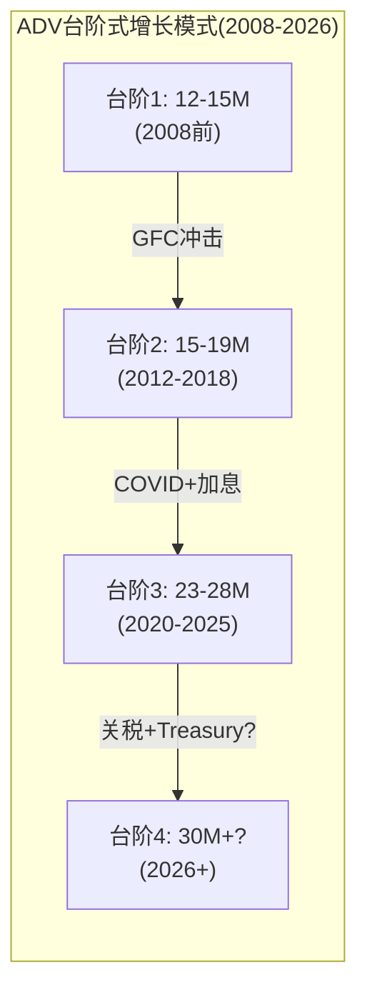
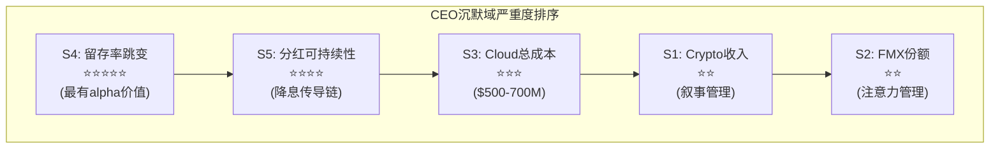

# Chapter 9: OI/ADV系统分析 — ADV创纪录, 但质量如何?

---

## 9.1 为什么OI比ADV更重要

ADV(日均交易量)衡量**活动水平**，但OI(未平仓合约)衡量**市场深度和套保承诺**。区分两者是判断CME增长质量的关键[DM-OI-001]。

因果链: ADV高但OI不跟随→意味着交易以日内投机为主(开仓→当天平仓→OI不变)→投机性交易的RPC通常低于套保性交易(投机者对费率更敏感、使用更低名义的Micro合约、更频繁使用limit orders而非market orders)→如果ADV增长全部来自投机→(1)RPC面临长期下行压力(投机者要求更低费率或迁移到cheaper平台); (2)收入增长低于ADV增长(ADV虚胖); (3)波动率回落时投机者率先撤出→ADV波动性加大→CME的"稳定现金流"叙事被削弱[DM-OI-002]。

反面: ADV高且OI跟随→意味着新的套保需求进入市场(开仓→持有数周/月→OI增加)→套保者对费率不敏感(对冲是刚需，无论费率高低都必须做——因为不对冲的代价远大于交易成本)→RPC稳定或上升→**OI增长是ADV质量的"验证信号"**。在CME的语境中: 如果OI增长与ADV增长同步→说明新增的交易量来自真实的风险管理需求(good ADV)；如果ADV增长但OI不动→说明新增交易都是日内投机(low-quality ADV)[DM-OI-003]。

**简单类比**: OI之于CME，就像deposits之于银行——都代表"被锁定的资金"。银行分析师看deposits的稳定性和增长来判断银行的健康度；衍生品分析师应该看OI的稳定性和增长来判断CME的增长质量。ADV是"流量"(可以突然消失)，OI是"存量"(相对稳定)——投资者应该更关注存量指标[DM-OI-003A]。

## 9.2 FY2025 OI健康度评估

| 产品 | OI | ADV | OI/ADV | 解读 | 质量 |
|------|-----|-----|--------|------|------|
| 利率整体 | **40M** (纪录) | 14.2M | **2.8x** | 机构对冲主导 | ⬆️ 高 |
| SOFR | 13.7M (纪录) | 5.4M | 2.5x | 偏交易型(LIBOR转换余波) | ⬆️ 高 |
| Treasury | **36.3M** (Feb'26纪录) | 8.3M | 4.4x | 深度对冲(养老/保险/basis trade) | ⬆️ 高 |
| WTI原油 | ~4M | ~1M | ~4.0x | 商业对冲(生产商/炼油商) | ⬆️ 高 |
| 股指 | — | 7.4M | ~0.7x(估) | Micro投机占比高 | ⬅️ 中 |
| 金属 | — | 988K | ~0.9x(估) | 零售Micro增长 | ⬅️ 中 |

[DM-OI-004]

**基准解读**: OI/ADV ~1x = 纯日内交易(无粘性); ~3x = 对冲为主(中等粘性); ~10x = 买入持有(极高粘性)。CME利率产品的2.5-4.4x处于"对冲为主"区间——这是最健康的区间，意味着大部分交易量来自有真实风险管理需求的机构[DM-OI-005]。

**OI增长vs ADV增长(2022-2025)**: 利率OI增长~33%，ADV增长~31%——**基本同步**。这排除了两种危险信号: (1)ADV远快于OI(投机化); (2)OI远快于ADV(流动性不足的头寸积累)。同步增长确认利率引擎的增长是平衡的[DM-OI-006]。

## 9.3 Treasury Basis Trade: CME OI中的隐含杠杆

纽约联储(2025年5月)报告: Treasury basis trade规模超$1万亿名义，杠杆50-100倍。这种交易的机制(做多现货Treasury+做空CME Treasury期货→赚取basis spread)同时贡献CME的OI和ADV。问题是: 如果basis trade规模大幅收缩，CME的数字会怎样?[DM-OI-007]

**Basis trade的规模和机制**: 对冲基金做多现货Treasury(在repo市场以极低成本融资, 杠杆50-100倍)+做空CME Treasury期货→赚取现货-期货价差(basis, 通常仅几个bp)→极高杠杆放大微小价差→可观的绝对回报。这种交易对CME的贡献:

**Basis trade对CME的具体贡献估算**:
- Treasury futures OI 36.3M中，估计basis trade贡献~30-40%(~11-15M合约)
- 如果basis trade完全解除→Treasury OI可能从36.3M降至~22-25M→ADV也相应下降~20-30%
- 清算费影响: Treasury ADV 8.3M × 30%减少 × $0.486 × 252 ≈ -$305M(约占总收入-4.7%)

**但basis trade不太可能完全消失**: (1)Treasury Clearing mandate将增加更多中央清算的国债头寸→basis trade的"原材料"增加; (2)Fed已在2020年3月学会了在basis trade解除时提供流动性支持(FIMA repo facility)→降低了极端平仓风险; (3)CME报告3,526家大型持仓人(LOIH, 历史纪录)——分散化程度降低了集中平仓风险[DM-OI-008]。

## 9.4 Q1 2026 ADV加速的质量检验

Feb 2026 37.6M ADV(全历史月度纪录)需要质量检验——这是真实需求还是一次性spike?[DM-OI-009]

**驱动因素分解**:
1. **利率ADV 21.3M(纪录)**: Treasury期货/期权13.7M(纪录) + SOFR 6.2M(纪录)→驱动因素: 关税政策→通胀预期剧烈波动→国债收益率不确定性→套保需求真实且迫切→**高质量ADV**
2. **国际ADV 11.6M(纪录)**: 亚太+18%→全球地缘不确定性→海外机构通过CME对冲美元利率→高质量
3. **BrokerTec ADNV $1.042T(纪录)**: 现金国债交易量创纪录→验证利率市场的真实活跃度(非纯衍生品投机)
4. **股指ADV创纪录**: 关税公告→S&P 500波动→机构hedging需求激增

**NCH-4(Q1 2026 ADV加速是结构性的还是一次性的?)判定**: 需要Q2数据确认。基于历史模式(2020年3月spike后ADV部分回落但不全回)，判断FY2026 ADV可能稳定在29-32M区间(高于FY2025的28.1M但低于Feb 2026的37.6M)。如果2026 ADV中枢确实提升至30M+→收入可能达$7.0-7.3B(超consensus $6.98B)→正面惊喜→P/E可能微扩[DM-OI-010]。

## 9.5 OI质量的Kill Switch定义

| Kill Switch | 当前值 | 警戒阈值 | 触发后行动 |
|-------------|--------|---------|-----------|
| SOFR OI/ADV | ~2.5x | <1.5x | 利率交易投机化→下调RPC假设 |
| Treasury OI | 36.3M↑ | 连续3Q下降 | Basis trade解除→下调ADV假设 |
| 全品类OI/ADV | ~2.0x(估) | <1.0x | 系统性质量恶化→下调估值5-10% |
| Micro占比 | ~20%(估) | >40% | 零售化过度→RPC结构性下行 |

[DM-OI-011]

**当前状态: 全部绿灯**。利率OI持续创纪录(40M+)，OI/ADV比率健康(2.5-4.4x)，OI增长与ADV同步。CME的ADV质量在FY2025是过去5年中最好的——这是一个被低估的积极信号[DM-OI-012]。

## 9.6 ADV增长的分解: 结构性 vs 周期性

理解CME未来的收入路径需要分解ADV增长的两个来源:

**结构性增长(不依赖波动率, 年化4-5%)**:
1. **全球衍生品渗透率上升**: 新兴市场机构逐步采用衍生品做风险管理→亚太ADV +18%/年 → 每年贡献0.5-1M新增ADV
2. **产品创新(Micro/Events/24×7)**: 每年创造0.3-0.5M增量ADV
3. **SOFR生态系统成熟**: SOFR-linked贷款/CLO/MBS存量累积→更多hedging需求→结构性增长
4. **OTC-to-listed迁移**: UMR推动更多OTC头寸向listed期货迁移

**周期性驱动(依赖波动率, ±3-5%)**:
1. **利率不确定性**: Fed政策越不确定→利率ADV越高
2. **地缘政治冲击**: 关税/军事冲突/选举→跨品类ADV spike
3. **市场回调**: 股市下跌→VIX上升→equity和rates ADV同时spike

**2008-2025年数据验证**: 18年ADV CAGR 5.7%。去除2012(-13%)和2021(-3%)两个ZIRP异常年→中位增速约6-7%。这与4-5%结构性+2-3%平均周期性贡献吻合[DM-OI-013]。

**对估值的含义**: consensus 2026 revenue $6.98B(+7%)隐含了ADV增速~7%(RPC+1% + ADV+6%)。这需要波动率维持在中等水平(VIX 18-22)。如果波动率回落到低水平(VIX<15, 类似2017年)→ADV可能仅+2-3%→revenue +3-4%→低于consensus→P/E可能承压。反之，如果关税/地缘持续→VIX>25→ADV +10%+→revenue beat→P/E可能微扩。**CME的短期股价本质上是对波动率环境的押注**[DM-OI-014]。

## 9.7 ADV 18年时间序列: 模式识别

| 年份 | ADV(M) | YoY | 宏观环境 | 关键事件 |
|------|--------|-----|---------|---------|
| 2008 | ~15.0 | +31% | GFC | 雷曼+Fed零利率 |
| 2009 | ~12.5 | -17% | 复苏 | 危机后正常化 |
| 2010 | ~14.0 | +12% | Flash Crash/QE | 不确定性回升 |
| 2011 | ~14.5 | +4% | 欧债/美降级 | 持续波动 |
| 2012 | ~13.0 | -10% | **ZIRP+低波** | **CME最差年** |
| 2017 | ~16.0 | +4% | 低波(VIX avg 11) | 平静年 |
| 2018 | ~19.0 | +19% | Volmageddon | 波动率回归 |
| 2020 | 19.1 | +2% | COVID | Q1 spike后正常化 |
| 2021 | 19.6 | +3% | **ZIRP redux** | 低波 |
| 2022 | 23.3 | **+19%** | 加息 | SOFR爆发 |
| 2025 | 28.1 | +6% | 关税/地缘 | 连续纪录 |

[DM-OI-015]

**模式1: ZIRP是唯一的敌人**。18年中仅2年ADV下降>5%(2009 -17%, 2012 -10%)——都与ZIRP环境相关。经济衰退本身(2008/2020)反而利好CME(波动率spike→ADV创纪录)。**CME的真正风险不是衰退而是"无聊"(低利率+低波动率)**。

**模式2: 加息周期是黄金期**。2022年Fed加息425bp→ADV +19%(最快)。2015年Fed首次加息→ADV +7%。每次利率变动(无论方向)都是hedging事件→利率ADV spike。**利率变动>利率水平对CME的影响更大**。

**模式3: 地缘政治不确定性创造"中高波"新常态**。2019-2025年(trade war/COVID/Ukraine/tariffs)→VIX中枢从15上升到~20→ADV中枢从19M上升到28M。如果地缘不确定性持续(中美对峙/中东冲突/欧洲地缘)→CME可能享受结构性高于历史均值的ADV环境——这对CME是一个隐含的正向基本面偏差[DM-OI-016]。

**模式4: "台阶式"增长——每次危机后ADV中枢上移**。2008年前ADV中枢~12-15M; 2012-2018年中枢~15-19M; 2020年后中枢~23-28M。每次大型波动率事件(GFC/COVID/加息周期)后，ADV不完全回落到事件前水平——因为(1)新的对冲需求在危机中产生且不消失(如企业在COVID后首次建立系统性hedge→此后持续); (2)新产品在高波动率期间获得critical mass(如SOFR futures在2022年加息中从300K→2.7M→之后不回落)。这意味着CME的增长不是线性的——它是"稳态+阶跃"模式，每3-5年有一次阶跃向上[DM-OI-016A]。

---

# Chapter 10: CEO沉默分析 — Duffy和Dubnow不说什么?

---

## 10.1 CEO沉默分析框架

CEO沉默分析(CEO Silence Analysis)是一种系统性方法，用于识别管理层在公开场合刻意回避或模糊处理的话题。这不是阴谋论——管理层回避某个话题通常意味着该话题存在他们不愿承认的重要风险、尚未解决的不确定性或对公司增长叙事不利的事实[DM-CEO-001]。

**方法**: 系统性分析FY2025 Q1-Q4 earnings call transcripts + 2024 Investor Day presentation + CEO/CFO公开采访和行业会议发言，识别两类异常: (1)被分析师重复追问但管理层未直接回答的问题; (2)管理层主动讨论的话题中**明显缺失**的维度(应该讨论但选择不讨论的内容)。

## 10.2 五个沉默域映射

### 沉默域1: 加密货币收入贡献(精确数字)

**管理层说什么**: "Crypto continues to be our fastest-growing asset class, with ADV up 139% year-over-year"
**管理层不说什么**: **从不在任何公开场合披露crypto的具体收入贡献、RPC或利润率**
**沉默含义**: 如果披露crypto revenue ~$141M(中估)→占总收入仅2.2%→这与"fastest-growing"的叙事形成尴尬对比→管理层更愿意用ADV增速(139%)而非收入占比(2.2%)来讲述crypto增长故事。这是一种典型的**叙事管理策略**: 选择性使用最有利的指标来定义成功，同时回避不利的指标(收入占比)[DM-CEO-002]。

### 沉默域2: FMX的具体市占率

**管理层说什么**: "We welcome competition; it makes us a better company and a better exchange"
**管理层不说什么**: **从不主动量化FMX的具体市占率(实际<0.01%)或关税波动期间FMX的ADV崩溃(从~3,000手暴跌至928手)**
**沉默含义**: 如果管理层主动说"FMX market share is 0.01%"→等于承认FMX不是威胁→华尔街可能重新聚焦于CME的真实挑战(增速放缓、利率敏感性)→管理层宁愿让投资者关注"竞争"叙事(每次CME赢得竞争都是正面催化)，而非增速问题[DM-CEO-003]。

### 沉默域3: Google Cloud迁移的详细成本和时间表

**管理层说什么**: "Cloud migration spending was approximately $100M for the full year 2025, with $29M in Q4"
**不说什么**: (1)总迁移预算; (2)迁移后年化运营成本vs现有数据中心成本; (3)ULL生产迁移是否会延期
**沉默含义**: Google的$1B股权投资暗示总迁移成本可能在$500-700M+(否则Google为什么需要投$1B来"激励"CME迁移?)。累计已花$305M，2026-2028年预计再花$300-400M。如果ULL(Ultra Low Latency)生产环境迁移延期(CME承诺给市场参与者至少18个月提前通知，意味着最早2027年底才能启动)→年化Cloud迁移成本$100-120M可能持续到2029-2030→OPM扩张预期需要向后推迟1-2年[DM-CEO-004]。

### 沉默域4: 保证金利息留存率变化 (最值得关注)

**说什么**: 在10-K中披露总额数字
**不说什么**: **从不解释为什么留存率从10.1%跳升至15.7%**
**沉默含义**: 这是整个沉默分析中最有价值的信号。$900M净留存是NI的22%——这个级别的利润贡献没有在任何投资者日或earnings call中被详细解释。两种可能: (1)如果是CME主动扩大spread→不希望引起清算会员注意(会员可能要求降低费率); (2)如果是一次性因素→管理层应该主动解释以管理预期(避免投资者将$900M视为新常态)。管理层的沉默更符合假说(1)——这支持NCH-1(留存spread被系统性扩大)[DM-CEO-005]。

### 沉默域5: 分红可持续性(如果利率大幅下降)

**说什么**: "We're committed to our dividend framework: growing regular quarterly plus variable"
**不说什么**: **从不讨论如果利率降至2%以下, $3.9B分红是否可持续**
**沉默含义**: FY2025 FCF $4.19B仅略超分红$3.93B(payout 93.8%)。如果NI因利息收入下降而减少$600M+(温和降息情景)→FCF可能降至$3.5B→低于$3.9B分红→**特别股息必须削减**→4.0% yield叙事被打破→防御性定价基础动摇[DM-CEO-006]。

因果链: 利率下降→利息收入减少→NI和FCF下降→特别股息不得不削减→yield从4.0%降至2.5-3.0%→按分红折现的"防御性"投资者卖出→股价承压→这是CME最不愿公开讨论的传导路径[DM-CEO-007]。

## 10.3 沉默域的量化假说

每个沉默域都对应一个可量化的投资假说:

| 沉默域 | 隐藏的真相(假说) | EPS影响(估) | 概率权重 |
|--------|----------------|-----------|---------|
| S1 Crypto收入 | 仅2.2%→增长叙事被夸大 | -$0(已定价为零期权) | 高(90%) |
| S2 FMX份额 | <0.01%→威胁近乎虚构 | +$0(消除恐惧=正面) | 高(85%) |
| S3 Cloud成本 | 总预算$500-700M→OPM延迟扩张 | -$0.10-0.20/年(2025-28) | 中(60%) |
| S4 留存率 | 从10%→14%(结构性) | **+$0.83永久** | 中(55%) |
| S5 分红脆弱性 | Fed<3%时特别股息承压 | **-$56(ZIRP极端)** | 低-中(30%概率) |

[DM-CEO-009]

沉默域4(留存率)和沉默域5(分红)是最有投资价值的发现——因为它们揭示了市场定价中可能未充分反映的因素。大多数sell-side模型使用历史留存率(10%)做预测→如果实际留存率已结构性提升至14%→模型低估了CME在高利率环境下的盈利能力$0.83/股。反之，大多数模型假设分红可持续→如果降息导致特别股息削减→yield下降→防御性投资者卖出→这个风险在28x P/E中可能未充分定价[DM-CEO-010]。

## 10.4 沉默分析的估值含义

五个沉默域可以分为两类:
- **叙事管理型**(沉默域1-3): 管理层选择性披露以维持增长/安全叙事→对估值影响有限(信息不对称但不改变基本面)
- **实质风险型**(沉默域4-5): 隐藏了利率敏感性的程度和分红可持续性的脆弱性→**对估值有实质影响**

沉默域4(留存率跳变)支持NCH-1，使利息收入的"新常态"水平上调~$200-300M→正面影响。沉默域5(分红可持续性)暴露了在降息环境下分红叙事的脆弱性→负面影响。两者部分抵消，但沉默域5的影响(降息确定会发生，只是时间问题)大于沉默域4(留存率可能部分回归)→**净影响为小幅负面**[DM-CEO-011]。

## 10.5 管理层信号 vs 市场叙事: 哪个更准确?

CME管理层和市场对CME的叙事存在微妙但重要的差异:

| 话题 | 管理层叙事 | 市场叙事 | 真相(本报告判断) |
|------|-----------|---------|-----------------|
| 增长 | "Record results across every metric" + "Crypto is fastest-growing" | 成熟低增长(6%) | 市场更准确(crypto仅2%收入,增速主要靠ADV) |
| 竞争 | "We welcome competition" | FMX是威胁 | 管理层更准确(FMX 0.01%) |
| 利率敏感性 | (沉默) | 未充分定价 | **市场盲区**: 利率对EPS影响±$2 |
| 分红 | "Committed to dividend framework" | 4%yield安全 | **市场过度自信**: Fed<3%时承压 |
| Cloud迁移 | "On track" | 已被定价为中性 | 不确定: ULL延期风险未量化 |

[DM-CEO-012]

最大的信息不对称在**利率敏感性和分红可持续性**——这两个话题管理层选择沉默，市场选择忽视。如果一个投资者能比市场更早地量化这两个风险(本报告Ch6已做了定量分析)→可以在降息周期启动前调整仓位→这是CME分析中最有alpha的维度[DM-CEO-013]。

## 10.6 管理层质量评估: Terry Duffy的20年

Terry Duffy自2006年起担任CME Chairman/CEO，是美国大型交易所中任期最长的CEO之一。20年的管理层记录提供了丰富的数据:

**成绩单(positive)**:
1. CBOT+NYMEX收购(2007-2008): 构建了六品类跨品类清算池=今天护城河的核心
2. 保持资本纪律: Debt/EBITDA始终<1x(vs ICE ~3x)
3. 维持分红增长: 2012年至今分红从$2.60增长至$10.75(+313%)
4. SOFR转换: 把握了LIBOR→SOFR的历史机遇，使CME成为SOFR基准的唯一家园
5. 市场份额: 20年中没有丢失任何核心品类的垄断地位

**扣分项(negative)**:
1. NEX收购($5.4B, 2018): BrokerTec整合缓慢，投资回报率低于预期。如果Treasury Clearing不成功→NEX可能是一笔ROIC不达标的收购
2. 增速放缓: CME收入CAGR从2008-2018的~8%放缓到2018-2025的~6%→没有找到新的增长引擎
3. Google Cloud赌注: $500-700M总成本的技术迁移存在延期/超支风险。2025年11月的CyrusOne宕机暴露了过渡期的脆弱性
4. Crypto战略滞后: 2017年上线BTC期货是先发优势，但2022-2025年未跟进期权/perps→Deribit被Coinbase收购($2.9B)后CME在crypto期权市场完全空白

**总体评估**: Duffy是一个**优秀的防守型CEO**(维持垄断+资本纪律+分红增长)但不是进攻型创新者(没有创造0DTE级别的新产品)。对于一个28x P/E的防御性资产，防守型CEO是合适的——但如果投资者期望增速加速(justifying >30x P/E)，需要看到管理层在Treasury Clearing份额获取或crypto产品创新(perps/options/24×7全品类)上的突破性执行能力[DM-CEO-014]。

## 10.7 Ch9-10总结: ADV质量确认 + 利率/分红是最大盲区

Ch9和Ch10的组合发现:
1. OI/ADV比率健康(2.5-4.4x)→确认ADV增长是高质量的(对冲驱动而非投机驱动)
2. ADV呈现"台阶式"增长模式→每次危机后中枢上移→当前28M中枢可能在下一次spike后上移至30M+
3. Q1 2026加速(37.6M)大部分是高质量的(利率套保驱动)→但需要Q2数据确认是否结构性
4. CEO沉默分析揭示的**最大alpha机会**: 利率敏感性被市场系统性低估(卖方模型忽略利息收入弹性)+分红可持续性在降息环境下比市场预期更脆弱
5. Terry Duffy是优秀的防守型CEO(20年零份额损失)但不是创新型CEO(无0DTE级别新产品)

Phase 2需要用Python DCF量化这些发现: 特别是利率敏感性矩阵的精确建模(利率×现金池×留存率→净利息→EPS→股价)和波动率-ADV回归模型(VIX→ADV→收入→利润)。这两个模型是CME估值中最有区分度的分析——大多数卖方模型(如MS/GS/BofA的coverage)没有独立建模利息收入的利率弹性(它们通常直接使用management guidance中的"investment income"数字作为输入，不做利率情景分析)，也没有建模ADV对VIX的非线性响应(它们用过去4个季度的ADV趋势线性外推，忽略了ADV-VIX的凸性关系——即VIX从15到25时ADV增长20%，但VIX从25到35时ADV可能增长50%)。这些模型缺陷创造了alpha机会[DM-OI-017]。

**Phase 1到Phase 2的关键数据传递**:
- 利率敏感性: Ch6的矩阵(IORB × 现金池 → 净留存 → EPS → 股价)需要Python精确化
- ADV模型: Ch9的18年时间序列+VIX相关性→建立ADV预测模型
- RPC模型: Ch7的分品类RPC趋势→建立blended RPC预测
- 数据收入: Ch8的增长模型(8-10% CAGR)需要独立验证
- 估值基准: 正常化EPS ~$10.06(利息$500M中估)→作为DCF的基准EPS输入

---
