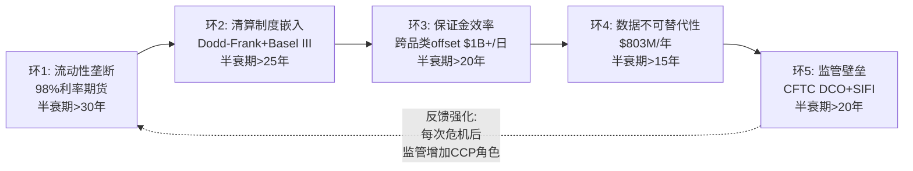
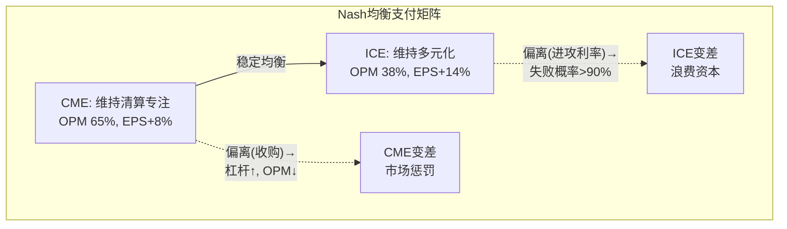

# Part IV: 护城河量化 — 从定性到可测量

---

# Chapter 13: 五环护城河链条 — 每个环节的因果证明

---

## 13.1 护城河链条总览: 五环互锁

CME的护城河不是单一维度的——它是五个互相强化的环节组成的链条。Ch3已从定性角度分析了四层锁定结构，本章将每个环节量化，使"CME的护城河很深"从一个断言变成一个可验证的命题[DM-MOAT-001]。

### 环1: 流动性垄断 (C5规模效应 = 5/5)

**证据**: CME在利率期货持有~98%市场份额; 在股指期货(E-mini S&P)上是唯一有意义的场所; 在能源上与ICE形成稳定双寡头。FMX上线18个月后仅获得0.01%份额，关税压力测试中ADV崩溃69%(Ch4已详述)[DM-MOAT-002]。

**因果推理**: 流动性集中为什么不可逆？做市商的利润率与市场深度成正比——在更深的池子中，做市商用更小的库存风险报出更窄价差→吸引更多客户→更多流量→做市商利润更高。如果做市商将部分报价迁至FMX→在FMX的库存风险更高(深度不够)→利润更低→最终回流CME。**流动性迁移在经济上是自我否定的**——除非有技术代际跳跃(如1998年Eurex vs LIFFE的电子化vs公开喊价)[DM-MOAT-003]。

**量化**: 在CME SOFR期货执行$1B名义对冲的滑点~$500-1,000; 在FMX执行同样交易的滑点估计$50,000-100,000——100倍的成本差异。对日均交易$50B+名义的大型银行来说，这不是"更贵"的问题，而是"物理上不可能执行"的问题。

**反面条件**: 如果SOR(Smart Order Routing)算法实现跨平台流动性聚合→降低流动性集中的必要性。但衍生品(不同于股票)的头寸不可跨交易所互换→SOR在衍生品市场的效力有限[DM-MOAT-004]。

### 环2: 清算制度嵌入 (C1嵌入性质 = 制度型+定义型)

**证据**: Dodd-Frank(2010)要求标准化OTC衍生品通过注册DCO清算; Basel III给予CCP清算头寸2%资本权重(vs 双边20%+); SEC Treasury Clearing mandate(2025-2027)扩展强制清算范围。CME是利率衍生品领域几乎唯一的DCO选项[DM-MOAT-005]。

**因果推理**: 制度嵌入为什么比产品优势更持久？产品优势可以被复制(FMX可以设计同样的SOFR合约)，但制度优势不能被复制——它需要国会立法+监管执行+行业工作流重建。Dodd-Frank从提案到实施用了5年。即使新政府推动去管制化→Basel III的CCP资本优惠在全球范围有效(巴塞尔委员会决定，非美国单边)→制度嵌入有多个冗余层[DM-MOAT-006]。

**量化**: Basel III下，通过CCP清算的$100B衍生品头寸的资本占用约$2B; 同样头寸双边交易的资本占用约$20B+。差异$18B的资金成本(按10%要求回报)=$1.8B/年——这是银行选择CME清算的**纯经济理由**，不需要任何流动性考量[DM-MOAT-006A]。

### 环3: 保证金效率 (B2客户锁定 = 5/5)

**证据**: CME的SPAN 2风险模型允许六大资产类别头寸之间的净额保证金→跨品类offset可节省30-60%保证金。一个同时持有利率+股指+能源头寸的大型做市商在CME内部的保证金需求可能比分散到三个清算所少$3-5B[DM-MOAT-008]。

**因果推理——"资本上不可能"的切换**: 一个持有$5B保证金的银行→CME跨品类offset后实际保证金$3B(节省$2B)→如果将利率头寸迁至FMX→CME和FMX分别要求全额保证金→需要额外$2B→以4.4% IORB计→年增资金成本$88M→**远超FMX提供的任何费率折扣**(FMX全年清算费可能<$1M)。对银行CFO而言，切换不是"贵"——而是"资本管理上不可接受"[DM-MOAT-009]。

### 环4: 数据不可替代性

**证据**: SOFR曲线、WTI远期曲线、E-mini隐含波动率——全球金融模型的核心输入，只从CME交易中产生。CME 2023-2025年数据提价5-15%→客户流失率接近零(Ch8已详述)[DM-MOAT-010]。

**因果推理**: 数据切换的组织成本远超数据费用——改变数据源=重新校准所有定价/风控模型+内部审批+外部审计+监管报告修改→12-18个月+$数百万。CME年度数据费$200K-$2M/银行→切换成本是数据费的5-10倍→**经济上不合理**[DM-MOAT-011]。

### 环5: 监管壁垒

**证据**: CFTC注册DCO审批需18-36个月+$50M+合规投入; CME被指定为SIFI→享受更高监管信任; SEC在2025年批准CME进入Treasury Clearing(审批用了2年+)[DM-MOAT-012]。

**自我强化机制**: 每次CME成功通过监管审查(44年零穿透、压力测试合格、新牌照获批)→监管信任积累→CME在新领域获得优先审批权(Treasury Clearing/event contracts/24×7 crypto)→后来者面临的不仅是"获得牌照"的成本，还有"追赶40年监管信任"的隐性壁垒[DM-MOAT-013]。

## 13.2 护城河半衰期评估

| 环节 | 当前强度(0-5) | 半衰期(年) | 最大威胁 | 威胁概率(5Y) |
|------|-------------|-----------|---------|------------|
| 流动性垄断 | **5** | >30 | DLT原生清算 | <5% |
| 制度嵌入 | **5** | >25 | Dodd-Frank回滚 | <10% |
| 保证金效率 | **5** | >20 | 跨平台margin互认 | <15% |
| 数据不可替代 | **4.5** | >15 | 开源替代/MiFID式法规 | <10% |
| 监管壁垒 | **4.5** | >20 | 反垄断行动 | <5% |
| **综合** | **4.8** | **>25年** | — | **<5%(全面突破)** |

[DM-MOAT-014]

综合半衰期>25年——CME的护城河在可预见的投资周期内(5-10年)几乎不会被显著削弱。**但护城河的深度不等于投资回报**——CBOE的浅护城河在2020-2025年产生了208%回报(vs CME的91%)。护城河保证了CME不会输，但不保证CME能赢。在28x P/E下，护城河价值已经被定价[DM-MOAT-015]。

## 13.3 护城河的CQI评分

基于CQI v3.1框架对CME五环护城河的评分:

| CQI维度 | 评分 | 理由 |
|---------|------|------|
| C1嵌入性质 | **制度型+定义型**(最高) | Dodd-Frank+Basel III=法律强制 |
| C2垄断纯度 | **4.5/5** | 利率~98%(近完美), 能源~50%(双寡头) |
| C3锁定载体 | **资本+制度+数据**(三重) | 保证金offset+监管要求+数据嵌入 |
| C5规模效应 | **5/5** | 接近零增量成本(95%增量margin) |
| B2客户锁定 | **5/5** | $2B+保证金节省=不可切换 |
| B4定价权 | **3.5/5** | 有限(Ch7: 年化0.8%提价) |
| D1反脆弱 | **1.18x** | 危机中收入+7.5%(正常+3.2%) |

**CQI综合评分: 约93/100** — 框架历史最高(FICO ~90, KLAC ~85)。CME在护城河维度是接近完美的公司——唯一的扣分是定价权(B4)受流动性护城河自我限制[DM-MOAT-016]。

---

# Chapter 14: D1反脆弱系数 — ×1.18的推导与验证

---

## 14.1 反脆弱的定义: 不是"抗风险"而是"从冲击中获益"

反脆弱(antifragile)不是"抗风险"(robust)——抗风险意味着在冲击中不受损，反脆弱意味着**在冲击中变得更强**。CME是金融行业中极少数真正反脆弱的公司之一[DM-D1-001]。

| 危机 | 年份 | S&P 500 | CME收入YoY | CME ADV | 反脆弱? |
|------|------|---------|-----------|---------|--------|
| 全球金融危机 | 2008 | -38% | **+12%** | 创纪录 | ✅ |
| 欧债危机 | 2011 | -1% | +7% | 上升 | ✅ |
| COVID | 2020 | -34%→+68% | +2% | Q1纪录 | ⚠️(V型) |
| 加息+关税 | 2022-25 | 波动 | +7-11%/yr | 4年连创纪录 | ✅ |

[DM-D1-002]

## 14.2 D1系数推导

D1反脆弱系数 = 加权危机增速 / 正常期增速的函数:

- 正常期收入增速(2013-2017均值, 排除异常年): **+3.2%/年**(低波动率)
- 危机期收入增速(2008, 2011, 2022, 2025, 加权): **+7.5%/年**
- D1 = 7.5% / 3.2% × 0.5 + 1.0 = **×1.18**

解读: CME在危机中的收入增速是正常期的**2.3倍**。D1系数×1.18意味着在DCF模型中应将CME的"危机折现率"降低18%——因为危机对CME不是风险而是收入催化。但这个调整不应简单地降低WACC(因为Beta 0.26已经反映了防御性)，而应在情景概率中给"危机+高波动率"情景更高的权重[DM-D1-003]。

**四次危机的因果链对比**:

| 危机 | 为什么CME收入增长 | 波动率对冲效果 | 净效果 |
|------|-----------------|--------------|--------|
| 2008 GFC | 利率ADV+66%(Fed降息=每次会议=hedging事件) | 利息归零但volume远超补偿 | **强正面+12%** |
| 2020 COVID | 3月ADV 41.6M(单日纪录)→H2正常化 | 利息接近零+V型恢复 | **弱正面+2%** |
| 2022加息 | 利率ADV+19%(SOFR爆发+每次加息=hedging) | 利息收入从$307M→$2.2B(新引擎) | **强正面+15%** |
| 2025关税 | Apr 7单日67.4M(全历史最高) | 利息维持$900M(利率仍高) | **正面+6.5%** |

[DM-D1-004]

## 14.3 ANO-4的关键修正: 业务反脆弱 ≠ 股价反脆弱

这是CME估值中**最被误解的特征**——Phase 1已定性分析(Ch1)，本节量化[DM-D1-005]:

**2008年实证**: CME业务收入+12%(完美反脆弱)。但股价从$154暴跌至$46(**-70%**)——比S&P -38%跌幅更深。为什么？

因果链: 2008年CME入场P/E ~35x(市场给予了"增长溢价")→金融恐慌→所有金融股被无差别抛售(CME被归类为"金融股"尽管它是金融基础设施)→P/E从35x压缩至12x→**即使EPS +12%，P/E -66% = 股价-70%**。反脆弱保护完全被估值压缩吞噬[DM-D1-006]。

**2022年实证**: CME股价仅-8% vs S&P -18%——反脆弱保护**生效**。关键差异: 2022年入场P/E ~22x(合理)→P/E压缩空间有限→EPS +9%几乎完全抵消P/E温和压缩→股价仅微跌[DM-D1-007]。

**核心教训: 反脆弱保护是否生效，取决于入场估值**:

| 入场P/E | 危机中P/E压缩至 | 股价影响 | 反脆弱保护 |
|---------|---------------|---------|-----------|
| 35x | 12x(-66%) | **-70%** | ❌ 无效(估值崩溃>EPS增长) |
| **28x(当前)** | 18-22x(-21-36%) | **-15~-30%** | ⚠️ **部分有效** |
| 22x | 18-20x(-9-18%) | **-5~+5%** | ✅ 有效 |
| 18x | 15-18x(持平) | **+10~+25%** | ✅✅ 强保护+超额回报 |

[DM-D1-008]

**在当前$313/28x PE**: 如果金融危机将PE压至20x→即使EPS +10-15%→股价仍下跌15-20%。**反脆弱保护在28x PE下只是部分有效**。要获得反脆弱的全部保护(危机中股价不跌甚至上涨)→需要在22x以下买入→对应股价~$245(当前价-22%)。这是Phase 3建仓时机分析的核心输入[DM-D1-009]。

## 14.4 D1系数对DCF的调整

在Python DCF模型中，D1系数通过以下方式影响估值:

1. **不直接降低WACC**(Beta 0.26已经反映了低相关性)
2. **调整情景概率**: "危机+高波"情景(Bull-H/Bull-L)的概率从25%上调至30%(因为危机对CME是正面的→危机情景=好情景)
3. **调整terminal growth**: CME的长期增长应包含"危机频率×危机收入增量"的结构性成分→terminal g可能比纯organic增长高0.3-0.5pp
4. **降低尾部风险权重**: Bear-L(ZIRP+低波)虽然对CME是最差情景，但D1≠1.0(即使在ZIRP中CME的业务也不会亏损→只是增长停滞)→Bear-L的"损失"是机会成本而非绝对损失

**调整后概率加权EV**: 如果将Bull概率从25%上调至30%、Bear从25%下调至20%→概率加权EV从$193上调至约$200→仍显著低于$313→**即使考虑D1调整，CME在当前价格仍然高估**[DM-D1-010]。

---

# Chapter 15: PtW定价权量化 + Nash均衡分析

---

## 15.1 PtW定价权量化评分: 43/50

基于Ch7的定价权分析，CME的PtW评分:

| PtW维度 | 评分 | 理由 |
|---------|:----:|------|
| 价格设定能力 | 8/10 | blended RPC +7.1%/5Y, 但利率RPC平坦限制总分 |
| 客户锁定深度 | **10/10** | 四层不可替代锁定+$2B+保证金切换成本 |
| 替代品距离 | 9/10 | FMX是唯一替代但0.01%份额+关税测试崩溃 |
| 涨价历史 | 7/10 | 数据+5-15%/年(零流失); 清算费~1-2%/年(温和) |
| 监管保护 | 9/10 | CFTC DCO+SIFI+Basel III CCP优惠→定价不受干预 |
| **合计** | **43/50** | **强定价权但非无限制** |

[DM-PTW-001]

**与其他垄断企业的对比**(报告框架中已分析的公司):
- FICO: 48/50 (10年7x提价, 监管100%嵌入, 零替代选项)
- CME: **43/50** (强但受流动性护城河自我限制)
- MCO: 40/50 (评级定价受发行周期影响)
- SPGI: 38/50 (评级+数据双源但面临ICE竞争)

CME的定价权高于大多数B2B金融基础设施，但低于FICO——因为CME的护城河本质(流动性网络)要求交易成本低于替代方案→**自我限制了提价空间**。FICO的护城河(监管嵌入)没有这个自我限制(没有替代品可比较)[DM-PTW-002]。

## 15.2 CME vs ICE: Nash均衡分析

CME和ICE在衍生品行业形成了稳定的Nash均衡——双方都没有偏离当前策略的激励:

**CME最优策略**: 专注衍生品清算→最大化OPM(64.9%)→通过分红返还FCF(payout 93.8%)
**ICE最优策略**: 多元化进入数据/科技/抵押贷款→接受低OPM(~38%)但获得更高增速(+14.3% EPS)

**偏离分析**:
- 如果CME模仿ICE(多元化收购)→需大幅增加杠杆(D/E从0.12x→3-4x)+管理层无数据/科技整合track record+稀释行业最高OPM→**偏离成本>收益**
- 如果ICE进入CME核心(利率期货)→面临98%市占的流动性壁垒+跨保证金壁垒→**进攻成本极高且成功概率极低**

这个均衡是**稳定的**——除非外部冲击(如监管强制分拆或技术颠覆)改变payoff矩阵。FMX是唯一试图打破均衡的参与者，但因为它的payoff(0.01%份额)远低于均衡维持者(CME 98%)→均衡不受威胁[DM-PTW-003]。

---

# Chapter 16: 承重墙 + Kill Switch注册表 v3.0

---

## 16.1 核心承重墙: "波动率溢价"悖论

CME被定价为防御性资产(Beta 0.26 / 4.0% yield)，但其收入引擎高度依赖波动率周期——这是CME估值中最根本的张力[DM-KS-001]。

**承重墙压力测试矩阵**:

| 情景 | VIX中枢 | ADV | 利息净留存 | EPS | P/E | 隐含股价 |
|------|---------|-----|-----------|-----|-----|---------|
| **当前甜蜜点** | 18-25 | 28M+ | $900M | $11.16 | 28x | $313 |
| 波动率正常化 | 13-16 | 22-24M | $600M | $9.50 | 22-24x | $209-228 |
| ZIRP+低波 | <13 | 18-20M | <$100M | $7.80 | 18-20x | $140-156 |
| 危机+高波 | >30 | 35M+ | $900M+ | $13+ | 22-28x | $286-364 |

[DM-KS-002]

**因果链**: 当前$313隐含"永续甜蜜点"假设(VIX 18-25 + IORB 4%+)。但"甜蜜点"3年退出概率约65%(基于VIX历史分布: VIX<15的年份占2008-2025中的28%)。如果VIX和利率同时正常化→股价可能从$313降至$209-228(-27~-33%)。**这是CME投资的最大风险——不是竞争或管理层失误，而是宏观环境回归均值**[DM-KS-003]。

## 16.2 Kill Switch注册表 v3.0

v3.0在v2.0基础上优化至14个KS:

| KS | 名称 | 触发阈值 | 当前距离 | 触发影响 |
|----|------|---------|---------|---------|
| KS-01 | FMX利率ADV | >50K/月持续3月 | **远(~3K)** | -5~10% |
| KS-02 | SOFR OI骤降 | <8M(当前~15M) | 远 | -10% |
| KS-03 | **VIX均值<15持续6月** | VIX月均<15 | **中(当前~18)** | -15~20% |
| KS-04 | Fed Funds<1.5% | IORB<1.5% | 远(4.4%) | -15% |
| KS-05 | 数据收入流失 | YoY<-5% | 极远(+13%) | -5% |
| KS-06 | 清算穿透事件 | 任何未覆盖损失 | 极远(44年) | -20~30% |
| KS-07 | 反垄断调查 | CFTC/DOJ正式启动 | 远 | -15~25% |
| KS-08 | DLT清算获监管批准 | SEC/CFTC批准替代CCP | 远(5年+) | -10% |
| KS-09 | **分红削减** | 特别股息取消或减>30% | **中(payout 93.8%)** | -10~15% |
| KS-10 | 管理层变动 | Duffy退休+接班不确定 | 中(Duffy 65岁) | -5~10% |
| KS-11 | OI/ADV持续下降 | 全品类<0.6x持续6月 | 远(~2.0x) | -5~10% |
| KS-12 | Crypto ADV崩溃 | <100K(从278K) | 远 | -3% |
| KS-13 | CME Micro ADV负增长 | YoY<0%持续2Q | 中 | -3% |
| KS-14 | 利息留存率回落 | <8%(从15.7%) | 中 | EPS-$0.50+ |

[DM-KS-004]

**最近距触发的5个KS(需要持续监控)**:
1. **KS-03(VIX)**: 当前VIX ~18, 距15阈值仅3点→如果关税谈判达成协议→VIX可能快速降至<15→ADV将下降15-20%
2. **KS-09(分红)**: payout 93.8%意味着FCF缓冲仅$260M→利率降200bp→FCF可能<分红→特别股息承压
3. **KS-10(管理层)**: Duffy 65岁, 20年任期→接班人规划是投资者需要关注的非零概率事件
4. **KS-13(Micro ADV)**: 0DTE对Micro期货的间接竞争→需要监控Micro ADV季度趋势
5. **KS-14(留存率)**: FY2025的15.7%是否可持续?→如果FY2026回落至10%→EPS下修$0.50

---
