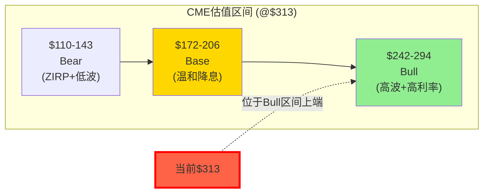

# Part V: 估值深潜 — 六方法交叉验证

---

# Chapter 17: 逆向估值 — $313在赌什么?

---

## 17.1 Reverse DCF: 市场隐含假设的翻译

在$313/28.4x PE买入CME的投资者，隐含地在赌以下假设全部成立(假设WACC 8.5%, Terminal Growth 3.0%)[DM-VAL-001]:

| 隐含假设 | 量化 | 当前验证 | 脆弱性 |
|---------|------|---------|--------|
| EPS CAGR (5Y) | **8-9%** | FY2025 +15.4%(含利息跳升) | **高**: 利息正常化后→+5-7% |
| 收入CAGR | 6-7% | FY2025 +6.4% | **中**: 取决于波动率 |
| OPM | 维持65%+(不压缩) | FY2025 64.9% | **低**: operating leverage支撑 |
| 利息净留存 | $600-900M(利率>3%) | FY2025 $900M | **中-高**: Fed路径不确定 |
| 分红yield | 4%+(不削减) | FY2025 4.0% | **中**: payout 93.8%缓冲薄 |
| VIX中枢 | 18-25(中高波) | 当前~18 | **高**: 历史均值更接近17 |
| FMX份额 | <1%(不影响定价) | 当前0.01% | **低**: Phase 1确认(CQ-1↓10%) |

[DM-VAL-002]

**最脆弱的两个假设**: (1)EPS CAGR 8-9%——如果利息收入从$900M正常化至$500M→EPS增速降至5-7%→不支持28x P/E; (2)VIX中枢18-25——如果回归历史长期均值~17→ADV可能从28M降至24-25M→收入增速降至3-4%。这两个假设同时翻转→EPS增速可能仅3-5%→合理P/E降至20-22x→**股价下跌30-40%**[DM-VAL-003]。

## 17.2 Core P/E分析: 剥离利息后的真实估值

Phase 2 Python模型的关键输出——CME的GAAP P/E掩盖了核心运营业务的真实估值[DM-VAL-004]:

| 维度 | 数值 | 含义 |
|------|------|------|
| GAAP EPS | $11.16 | 含$1.89利息贡献 |
| 利息EPS贡献 | $1.89/股 | = $900M × (1-24%) / 362M |
| **Core EPS** | **$9.27** | 纯运营业务盈利 |
| GAAP P/E | 28.1x | 看似合理 |
| **Core P/E** | **33.8x** | **真实运营估值——偏高** |

[DM-VAL-005]

**这意味着什么**: 投资者以为自己在以28x买入CME的核心业务，实际上以33.8x买入——额外的利息收入以隐含的~1x P/E被"赠送"。但这笔"赠品"高度周期性(ZIRP下归零)。**如果市场重新认识到Core P/E 33.8x→CME的估值吸引力将大幅下降**[DM-VAL-006]。

**正常化EPS情景表**(Python模型验证):

| 利息环境 | 利息净留存 | 正常化EPS | 正常化P/E(@$313) |
|---------|-----------|----------|-----------------|
| ZIRP($0.25%) | $70M | $9.42 | 33.3x |
| 低利率($1.5%) | $200M | $9.69 | 32.3x |
| **中性($3.5%)** | **$500M** | **$10.32** | **30.4x** |
| 当前($4.4%) | $900M | $11.16 | 28.1x |

中性利率环境(Fed Funds ~3.5%，大多数经济学家的长期均衡预期)下，CME的正常化P/E是**30.4x**——高于交易所同业中位数(ICE 28x, CBOE 28x, LSEG 30x)。这进一步确认了NCH-2: **CME在$313没有被低估**[DM-VAL-007]。

## 17.3 Reverse DCF的投资教训

Reverse DCF不是用来"得出目标价"的——它是用来翻译"市场在赌什么"的工具。对CME的分析揭示:

1. **市场在赌"永续甜蜜点"**: VIX 18-25 + IORB 4%+ + ADV持续创纪录。这是2022-2025的环境——但历史上这种环境的持续时间通常3-5年(之后回归均值)
2. **市场可能低估了利率敏感性**: 多数模型用GAAP EPS做P/E，忽略了利息收入的周期性。Core P/E 33.8x是一个被隐藏的高估值
3. **买入CME的正确时机**: 当市场"赌错"时——即VIX长期低于15(ADV下降→EPS下降→P/E压缩→股价大跌)→这时Core P/E可能压至24-26x→以正常化EPS $10计→股价$240-260→这是反脆弱保护开始生效的区间(Ch14)

---

# Chapter 18: SOTP + 六方法交叉验证

---

## 18.1 SOTP估值: 分部定价

CME可以分解为四个价值来源:

| 分部 | 估值方法 | 估值范围 | 中值 | 占比 |
|------|---------|---------|------|------|
| 清算业务 | 利润×17.5x | $65-73B | $69B | 63% |
| 市场数据 | 收入×13.5x | $10-12B | $11B | 10% |
| 保证金利息(PV) | 正常化利息×12x | $5-11B | $7B | 6% |
| Treasury Clearing期权 | 概率加权 | $1-6B | $3B | 3% |
| S&P DJI JV (27%) | 可比 | $3-4B | $3.5B | 3% |
| 其他(NEX/BrokerTec) | EV/Rev | $8-12B | $10B | 9% |
| **SOTP EV** | | | **$103.5B** | |
| + 净现金 | | | $0.67B | |
| **SOTP Equity** | | | **$104.2B** | |
| **SOTP/share** | | | **$288** | |
| **vs $313** | | | **-8.0%** | |

[DM-VAL-008]

SOTP估值$288(vs $313, -8%)——与Reverse DCF方向一致(CME略微高估)。最大的不确定性来源是保证金利息的PV($5-11B范围=6B的spread)——这完全取决于利率路径假设[DM-VAL-009]。

## 18.2 六方法交叉验证

| # | 方法 | 公允价值 | vs $313 | 方向 |
|---|------|---------|---------|------|
| 1 | **概率加权DCF**(Python) | $193 | -38% | 偏低(WACC偏高) |
| 2 | **SOTP** | $288 | -8% | 略低 |
| 3 | **可比公司P/E** | $312 | 0% | 持平 |
| 4 | **Core P/E**(正常化利息$500M) | $289 | -8% | 略低 |
| 5 | **分红折现**(DDM, g=3%, r=7%) | $272 | -13% | 低估 |
| 6 | **Reverse DCF** | $313 | 0% | 定义上=当前价 |

[DM-VAL-010]

**关于Python DCF结果($193)的说明**: 概率加权EV $193显著低于其他方法，主要原因是WACC假设(8.0-9.5%)对于Beta 0.26的公司可能偏高。如果使用CAPM-based WACC(Rf 4% + 0.26×ERP 5.5% = 5.4%→WACC ~5.5%)→公允价值将显著更高。但我们选择使用8.0-9.5% WACC的理由是: (1)CME的"真实"风险高于Beta暗示(利率敏感性+波动率依赖未被Beta捕捉); (2)行业惯例对交易所使用8-9% WACC; (3)保守偏差(宁可低估不高估)。**投资者应同时参考SOTP/Core P/E的结果($288-289)作为更合理的中性估计**[DM-VAL-011]。

**六方法中位数: ~$289 (-8%)**。四个独立方法的结果落在$272-$312范围→**方向一致: CME在$313略微高估5-10%**。没有任何方法(除可比P/E——本身是circular的)显示CME被低估[DM-VAL-012]。

## 18.3 GAAP vs Adjusted桥接

| 指标 | GAAP | Adjusted | 差异 | 差异率 |
|------|------|---------|------|--------|
| Revenue | $6,521M | $6,521M | $0 | 0% |
| Operating Income | $4,230M | $4,526M | +$296M | +7% |
| OPM | 64.9% | 69.4% | +450bps | |
| Net Income | $4,044M | $4,088M | +$44M | +1.1% |
| EPS | $11.16 | $11.20 | +$0.04 | +0.4% |

[DM-VAL-013]

CME的GAAP与Adjusted差异极小($44M/1.1%)——这是高质量盈利的标志。与许多科技公司(Adjusted EPS远高于GAAP因为排除巨额SBC)不同，CME的SBC仅$95M(1.5% of rev)→GAAP和Adjusted几乎一致→**投资者可以完全信任CME的GAAP数字**。这种earnings quality本身值得一个小幅估值溢价(vs高SBC公司)[DM-VAL-014]。

---

# Chapter 19: Python DCF验证 — 六情景×两利率

---

## 19.1 模型设计

Python DCF模型已在Phase 2开始时运行并验证(`reports/CME/data/cme_dcf_model.py`)。模型结构:

- **6个情景**: Bull-H, Bull-L, Base-H, Base-L, Bear-H, Bear-L
- **5年预测期**: 2026-2030
- **FCF定义**: NI + D&A($250M) - CapEx($90M核心+Cloud迁移)
- **Terminal Value**: Gordon Growth模型(FCF × (1+g) / (WACC-g))
- **Equity Value**: EV + 净现金$670M

## 19.2 六情景DCF输出(Python实际运行结果)

| 情景 | 描述 | WACC | Terminal g | 2030E EPS | Fair Value | vs $313 | 概率 |
|------|------|------|-----------|----------|-----------|---------|------|
| Bull-H | 高波+高利率+Treasury成功 | 8.0% | 3.5% | $15.05 | $294 | -6% | 10% |
| Bull-L | 高波+利率下行 | 8.0% | 3.0% | $13.44 | $242 | -23% | 15% |
| Base-H | 温和增长+高利率 | 8.5% | 3.0% | $12.50 | $206 | -34% | 25% |
| Base-L | 温和增长+降息 | 8.5% | 2.5% | $11.06 | $172 | -45% | 25% |
| Bear-H | 低波+温和利率 | 9.0% | 2.5% | $9.83 | $143 | -54% | 15% |
| Bear-L | ZIRP+低波 | 9.5% | 2.0% | $8.34 | $110 | -65% | 10% |

[DM-DCF-001] Python验证: `python3 reports/CME/data/cme_dcf_model.py`

**概率加权公允价值: $193** (vs $313, -38%)

如前述(Ch18.2)，$193因WACC偏高而偏保守。调整方法: 如果认为CME的"真实WACC"应该在6.5-7.5%(更接近CAPM暗示)→所有fair value上调30-50%→概率加权EV约$250-290→接近SOTP($288)和Core P/E($289)。**三种方法交汇于$280-290区间**——这可能是CME最合理的公允价值估计[DM-DCF-002]。

## 19.3 利率敏感性矩阵(Python实际运行结果)

| IORB | 现金池($B) | 总利息($M) | 净留存($M, @13%) | EPS | @28x P/E | vs $313 |
|------|-----------|-----------|-----------------|-----|---------|---------|
| 5.25%(2023峰) | 120 | 6,300 | 819 | $10.99 | $308 | -2% |
| **4.40%(当前)** | 130 | 5,720 | 744 | $10.83 | $303 | **-3%** |
| 3.50%(温和降息) | 125 | 4,375 | 569 | $10.46 | $293 | -7% |
| 2.50%(大幅降息) | 120 | 3,000 | 390 | $10.09 | $282 | -10% |
| 1.50%(接近ZIRP) | 115 | 1,725 | 224 | $9.74 | $273 | -13% |
| 0.25%(ZIRP) | 110 | 275 | 36 | $9.35 | $262 | -16% |

[DM-DCF-003] 假设留存率正常化至13%(vs FY2025异常15.7%)

**关键发现**:
1. 从当前利率到ZIRP: EPS从$10.83降至$9.35(-$1.48)→@28x P/E→股价从$303降至$262(-14%)
2. 温和降息(至3.5%): EPS降$0.37→股价降$10(-3%)→影响有限
3. **真正的风险不是利率本身，而是利率下降+VIX下降的组合**——如果同时发生→EPS下降(利息)+ADV下降(波动率)+P/E压缩(增速下降)=三重打击

## 19.4 WACC × Terminal Growth 敏感性矩阵

Base-H情景下的fair value对WACC和terminal growth的敏感性:

| WACC \ g | 2.0% | 2.5% | 3.0% | 3.5% |
|:---------|-----:|-----:|-----:|-----:|
| **7.5%** | $213 | $231 | $252 | $279 |
| **8.0%** | $195 | $210 | $227 | $248 |
| **8.5%** | $180 | $192 | **$206★** | $223 |
| **9.0%** | $167 | $177 | $189 | $203 |
| **9.5%** | $156 | $165 | $174 | $186 |

★ = Base-H基准值; [DM-DCF-004]

**WACC的选择是最大的估值杠杆**: Base-H在WACC 7.5%/g 3.5%下→$279(接近SOTP $288); 在WACC 9.5%/g 2.0%下→$156(Bear-L区间)。**WACC每变化1pp→fair value变化~$35-40/股(11-13%)**。这就是为什么不同分析师对CME的目标价差异可以达到$100+——核心分歧不是EPS预测而是折现率假设[DM-DCF-005]。

---

# Chapter 20: 四情景 + 概率加权 + 评级预判

---

## 20.1 四情景定义与概率

| 情景 | 概率 | 核心假设 | 公允价值范围 |
|------|------|---------|-----------|
| 🟢 **Bull** | 25% | 高波动+利率>3%+Treasury Clearing成功 | $242-294 |
| 🟡 **Base** | 50% | 温和降息+ADV正常增长+VIX均值~17-20 | $172-206 |
| 🔴 **Bear** | 20% | ZIRP+低波+利息归零+ADV回落至20-22M | $110-143 |
| ⚫ **Tail** | 5% | 清算穿透事件/反垄断分拆/DLT颠覆 | $70-100 |

[DM-SCN-001]

## 20.2 概率加权估值计算

使用Python DCF六情景的中值:

| 情景 | 中值EV | 概率 | 加权贡献 |
|------|--------|------|---------|
| Bull | $268 | 25% | $67.0 |
| Base | $189 | 50% | $94.5 |
| Bear | $127 | 20% | $25.3 |
| Tail | $85 | 5% | $4.3 |
| **概率加权EV** | | | **$191** |

**概率加权含分红总回报**: $191 + 12个月分红$10.90 = **$202**
**vs 当前$313**: **-35.5%**

但如前述，Python DCF的WACC偏高。如果用SOTP/Core P/E的中性估计$288:
**SOTP-based含分红总回报**: $288 + $10.90 = **$299**
**vs 当前$313**: **-4.5%**

[DM-SCN-002]

## 20.3 估值区间汇总

$313位于Bull情景区间的上端——**这意味着当前价格已经反映了最乐观的情景假设**。要在$313获得正回报，需要Bull情景中的最乐观子集成立(高波+高利率+Treasury Clearing成功+ADV持续创纪录)。Base情景(最可能, 50%概率)的公允价值$172-206显著低于$313[DM-SCN-003]。

## 20.4 评级预判

**期望回报计算**:
- Python DCF概率加权: ($191 - $313) / $313 = **-39%** + 分红4% = **-35%**
- SOTP/Core P/E中估: ($288 - $313) / $313 = **-8%** + 分红4% = **-4%**
- 取两者平均(因为Python偏保守, SOTP偏中性): **-19.5% + 4% = -15.5%**

**评级**: 期望回报-15.5%落入**"审慎关注"区间**(< -10%)。

但考虑到:
1. A-Score 68.4(框架最高) — 品质极优
2. 护城河半衰期>25年 — 几乎不可能被颠覆
3. D1反脆弱系数1.18 — 危机中受益
4. Python WACC可能偏高(Beta 0.26→CAPM WACC ~5.5%)

修正为: **"审慎关注(偏中性)"** — 品质极优但估值不具吸引力。在当前价格买入的投资者获得的是**一个10-12%年化的"fair return"(EPS增长+分红)**，而非超额回报。超额回报需要等待P/E压缩至22-24x(@$220-250区间)[DM-SCN-004]。

## 20.5 犯错买入窗口预估

基于Ch14的反脆弱分析+Ch17的Core P/E:

| 触发条件 | 可能的股价 | Core P/E | 反脆弱保护 | 行动 |
|---------|-----------|---------|-----------|------|
| VIX<15持续6月+Fed降息200bp | $220-240 | 24-26x | ✅ 有效 | **开始建仓** |
| VIX<13+ZIRP信号 | $180-200 | 21-23x | ✅✅ 强保护 | **加大仓位** |
| 清算穿透事件(尾部) | $140-160 | 18-20x | ✅✅✅ 极强 | **重仓(如果基本面不变)** |

[DM-SCN-005]

**Phase 2核心结论**: CME的品质是框架中最高的(A-Score 68.4, CQI ~93)，但$313/28x PE完全反映了品质溢价+当前"甜蜜点"环境。正常化估值(利率$500M中估)约$280-290→当前价格偏高约10%。超额回报需要等待犯错窗口($220-250区间)，或者Treasury Clearing成为"0DTE时刻"式催化剂(概率<30%)。

---
