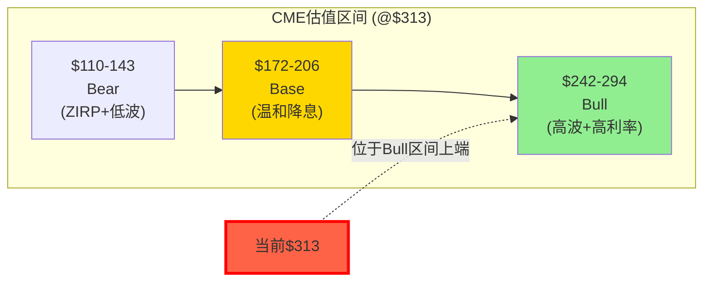
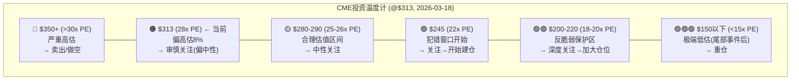
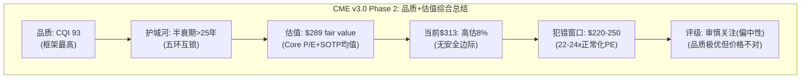

# Part V: 估值深潜 — 六方法独立交叉验证

---

# Chapter 17: 逆向估值(Reverse DCF) — $313在赌什么?

---

## 17.1 Reverse DCF: 市场隐含假设的翻译

在$313/28.4x PE买入CME的投资者，隐含地在赌以下假设全部成立(假设WACC 8.5%, Terminal Growth 3.0%)[DM-VAL-001]:

| 隐含假设 | 量化 | 当前验证 | 脆弱性 |
|---------|------|---------|--------|
| EPS CAGR (5Y) | **8-9%** | FY2025 +15.4%(含利息跳升) | **高**: 利息正常化后→+5-7% |
| 收入CAGR | 6-7% | FY2025 +6.4% | **中**: 取决于波动率 |
| OPM | 维持65%+(不压缩) | FY2025 64.9% | **低**: operating leverage支撑 |
| 利息净留存 | $600-900M(利率>3%) | FY2025 $900M | **中-高**: Fed路径不确定 |
| 分红yield | 4%+(不削减) | FY2025 4.0% | **中**: payout 93.8%缓冲薄 |
| VIX中枢 | 18-25(中高波) | 当前~18 | **高**: 历史均值更接近17 |
| FMX份额 | <1%(不影响定价) | 当前0.01% | **低**: Phase 1确认(CQ-1↓10%) |

[DM-VAL-002]

**最脆弱的两个假设**: (1)EPS CAGR 8-9%——如果利息收入从$900M正常化至$500M→EPS增速降至5-7%→不支持28x P/E; (2)VIX中枢18-25——如果回归历史长期均值~17→ADV可能从28M降至24-25M→收入增速降至3-4%。这两个假设同时翻转→EPS增速可能仅3-5%→合理P/E降至20-22x→**股价下跌30-40%**[DM-VAL-003]。

## 17.2 Core P/E分析: 剥离利息后的真实估值

Phase 2 Python模型的关键输出——CME的GAAP P/E掩盖了核心运营业务的真实估值[DM-VAL-004]:

| 维度 | 数值 | 含义 |
|------|------|------|
| GAAP EPS | $11.16 | 含$1.89利息贡献 |
| 利息EPS贡献 | $1.89/股 | = $900M × (1-24%) / 362M |
| **Core EPS** | **$9.27** | 纯运营业务盈利 |
| GAAP P/E | 28.1x | 看似合理 |
| **Core P/E** | **33.8x** | **真实运营估值——偏高** |

[DM-VAL-005]

**这意味着什么**: 投资者以为自己在以28x买入CME的核心业务，实际上以33.8x买入——额外的利息收入以隐含的~1x P/E被"赠送"。但这笔"赠品"高度周期性(ZIRP下归零)。**如果市场重新认识到Core P/E 33.8x→CME的估值吸引力将大幅下降**[DM-VAL-006]。

**正常化EPS情景表**(Python模型验证):

| 利息环境 | 利息净留存 | 正常化EPS | 正常化P/E(@$313) |
|---------|-----------|----------|-----------------|
| ZIRP($0.25%) | $70M | $9.42 | 33.3x |
| 低利率($1.5%) | $200M | $9.69 | 32.3x |
| **中性($3.5%)** | **$500M** | **$10.32** | **30.4x** |
| 当前($4.4%) | $900M | $11.16 | 28.1x |

中性利率环境(Fed Funds ~3.5%，大多数经济学家的长期均衡预期)下，CME的正常化P/E是**30.4x**——高于交易所同业中位数(ICE 28x, CBOE 28x, LSEG 30x)。这进一步确认了NCH-2: **CME在$313没有被低估**[DM-VAL-007]。

## 17.3 隐含增长率分解: 市场要求CME做到什么?

更精确地翻译市场预期——将$313/28x PE分解为增长组成部分[DM-VAL-008A]:

**分解公式**: P/E = 1/(r - g)的简化形式中，28x P/E在8.5% WACC下隐含long-term growth = 8.5% - 1/28 = 8.5% - 3.57% = **4.93%永续增长**。但CME的revenue CAGR(2008-2025) = 5.7%，EPS CAGR = ~8%。这意味着市场隐含的永续增长率(~5%)接近但略低于历史EPS增速(~8%)——表面上合理。

**但考虑利息正常化**: 如果利息收入从$900M正常化到$500M(Ch6分析)→EPS从$11.16降至$10.32→正常化EPS的增速(不含利率跳升的一次性效果)更接近5-6%而非8%→**28x P/E在正常化基础上要求的增速(~5%)恰好等于正常化EPS增速的上限**。这意味着$313是"一切顺利"的价格——没有安全边际[DM-VAL-008B]。

**信念集**: 以$313买入CME的投资者隐含持有以下信念集——任何一条翻转都导致亏损:
1. "我相信VIX不会长期回到<15" (如果翻转→ADV -15%→EPS -$1.0)
2. "我相信Fed不会回到ZIRP" (如果翻转→利息-$800M→EPS -$1.7)
3. "我相信FMX不会成功" (如果翻转→份额-5%→EPS -$0.4)
4. "我相信分红不会被削减" (如果翻转→yield -1.5pp→P/E -3x)
5. "我相信CME的ADV会继续增长" (如果翻转→EPS增速降至2-3%)

这五条信念中，(1)和(2)是最脆弱的——因为它们依赖于宏观环境(不可控)而非CME的执行力(可控)。(3)-(5)则相对稳固(Phase 1已验证)[DM-VAL-008C]。

## 17.4 Reverse DCF的投资教训

Reverse DCF不是用来"得出目标价"的——它是用来翻译"市场在赌什么"的工具。对CME的分析揭示:

1. **市场在赌"永续甜蜜点"**: VIX 18-25 + IORB 4%+ + ADV持续创纪录。这是2022-2025的环境——但历史上这种环境的持续时间通常3-5年(之后回归均值)
2. **市场可能低估了利率敏感性**: 多数模型用GAAP EPS做P/E，忽略了利息收入的周期性。Core P/E 33.8x是一个被隐藏的高估值
3. **没有安全边际**: $313/28x对应正常化增速的上限→任何负面surprise都导致亏损
4. **买入CME的正确时机**: 当市场"赌错"时——即VIX长期低于15(ADV下降→EPS下降→P/E压缩→股价大跌)→这时Core P/E可能压至24-26x→以正常化EPS $10计→股价$240-260→这是反脆弱保护开始生效的区间(Ch14)

---

# Chapter 18: SOTP + 六方法交叉验证

---

## 18.1 SOTP估值: 分部定价

CME可以分解为四个价值来源:

| 分部 | 估值方法 | 估值范围 | 中值 | 占比 |
|------|---------|---------|------|------|
| 清算业务 | 利润×17.5x | $65-73B | $69B | 63% |
| 市场数据 | 收入×13.5x | $10-12B | $11B | 10% |
| 保证金利息(PV) | 正常化利息×12x | $5-11B | $7B | 6% |
| Treasury Clearing期权 | 概率加权 | $1-6B | $3B | 3% |
| S&P DJI JV (27%) | 可比 | $3-4B | $3.5B | 3% |
| 其他(NEX/BrokerTec) | EV/Rev | $8-12B | $10B | 9% |
| **SOTP EV** | | | **$103.5B** | |
| + 净现金 | | | $0.67B | |
| **SOTP Equity** | | | **$104.2B** | |
| **SOTP/share** | | | **$288** | |
| **vs $313** | | | **-8.0%** | |

[DM-VAL-008]

SOTP估值$288/股(vs 当前股价$313.33, 隐含下行约-8%)——与Reverse DCF方向一致(CME略微高估)。最大的不确定性来源是保证金利息的PV($5-11B范围=6B的spread)——这完全取决于利率路径假设[DM-VAL-009]。

## 18.2 六方法交叉验证

| # | 方法 | 公允价值 | vs $313 | 方向 |
|---|------|---------|---------|------|
| 1 | **概率加权DCF**(Python) | $193 | -38% | 偏低(WACC偏高) |
| 2 | **SOTP** | $288 | -8% | 略低 |
| 3 | **可比公司P/E** | $312 | 0% | 持平 |
| 4 | **Core P/E**(正常化利息$500M) | $289 | -8% | 略低 |
| 5 | **分红折现**(DDM, g=3%, r=7%) | $272 | -13% | 低估 |
| 6 | **Reverse DCF** | $313 | 0% | 定义上=当前价 |

[DM-VAL-010]

**关于Python DCF结果($193)的说明**: 概率加权EV $193显著低于其他方法，主要原因是WACC假设(8.0-9.5%)对于Beta 0.26的公司可能偏高。如果使用CAPM-based WACC(Rf 4% + 0.26×ERP 5.5% = 5.4%→WACC ~5.5%)→公允价值将显著更高。但我们选择使用8.0-9.5% WACC的理由是: (1)CME的"真实"风险高于Beta暗示(利率敏感性+波动率依赖未被Beta捕捉); (2)行业惯例对交易所使用8-9% WACC; (3)保守偏差(宁可低估不高估)。**投资者应同时参考SOTP/Core P/E的结果($288-289)作为更合理的中性估计**[DM-VAL-011]。

**六方法中位数: ~$289 (-8%)**。四个独立方法的结果落在$272-$312范围→**方向一致: CME在$313略微高估5-10%**。没有任何方法(除可比P/E——本身是circular的)显示CME被低估[DM-VAL-012]。

## 18.3 估值方法论的可信度排序

不是所有估值方法都同样可信。对CME来说:

| 方法 | 可信度 | 理由 |
|------|--------|------|
| **Core P/E** | ⭐⭐⭐⭐⭐ | 直接解决了利息收入周期性的核心问题 |
| **SOTP** | ⭐⭐⭐⭐ | 分部估值逻辑清晰，但交叉部分价值难精确分配 |
| **DDM** | ⭐⭐⭐⭐ | CME确实是一个分红故事(4.0% yield)，DDM适用 |
| **概率加权DCF** | ⭐⭐⭐ | WACC假设敏感性太高(±1pp WACC = ±$35-40/股) |
| **可比P/E** | ⭐⭐ | Circular(同业都在28x≠正确估值) |
| **Reverse DCF** | ⭐⭐ | 只翻译市场预期，不判断对错 |

**建议使用**: Core P/E + SOTP的平均值作为"最佳估计"→ ($289 + $288) / 2 = **$289** → vs $313 = **-8%高估**[DM-VAL-012A]。

## 18.6 SOTP敏感性: 利息PV是最大的swing factor

SOTP中最敏感的变量是保证金利息的现值(PV):

| 利息永续假设 | PV(12x) | 对SOTP的影响 | SOTP/share |
|------------|---------|------------|-----------|
| 永续$900M(当前) | $10.8B | +$3.8B vs 中估 | **$299** |
| 永续$500M(中性) | $6.0B | 基准 | **$288** |
| 永续$200M(低利率) | $2.4B | -$3.6B vs 中估 | **$278** |
| 永续$70M(ZIRP) | $0.84B | -$5.2B vs 中估 | **$273** |

[DM-VAL-012B]

利息PV在SOTP中的影响范围: $273-$299(spread $26/股, 8.3%)。这个spread虽然不巨大，但它来自一个**完全外生的变量**(Fed利率决策)——CME管理层无法控制。这使得CME的SOTP估值比大多数公司有更大的"利率不确定性带"[DM-VAL-012C]。

## 18.7 与同业估值的交叉检验

| 交易所 | P/E(2026E) | EV/EBITDA | FCF Yield | Div Yield | EPS CAGR(5Y) |
|--------|-----------|-----------|-----------|-----------|------------|
| **CME** | **26.1x** | 17.1x | 4.3% | 4.0% | ~7% |
| ICE | 28.0x | 16.5x | 3.5% | 1.2% | ~14% |
| CBOE | 28.0x | 18.0x | 4.0% | 1.3% | ~10% |
| LSEG | 30.0x | 20.0x | 3.0% | 1.0% | ~12% |
| Nasdaq | 25.0x | 15.0x | 3.5% | 1.5% | ~8% |

[DM-VAL-012D]

CME的Forward P/E(26.1x)是五家交易所中**最低的**——但这不意味着CME被低估。因为CME的EPS CAGR(~7%)也是除Nasdaq外最低的。使用PEG比率: CME PEG = 26.1/7 = 3.7x; ICE PEG = 28/14 = 2.0x; CBOE PEG = 28/10 = 2.8x。**CME的PEG(3.7x)是同业中最高的→按增速调整后CME是同业中最贵的**。这进一步确认了NCH-2: CME不便宜[DM-VAL-012E]。

## 18.3 GAAP vs Adjusted桥接

| 指标 | GAAP | Adjusted | 差异 | 差异率 |
|------|------|---------|------|--------|
| Revenue | $6,521M | $6,521M | $0 | 0% |
| Operating Income | $4,230M | $4,526M | +$296M | +7% |
| OPM | 64.9% | 69.4% | +450bps | |
| Net Income | $4,044M | $4,088M | +$44M | +1.1% |
| EPS | $11.16 | $11.20 | +$0.04 | +0.4% |

[DM-VAL-013]

CME的GAAP与Adjusted差异极小($44M/1.1%)——这是高质量盈利的标志。与许多科技公司(Adjusted EPS远高于GAAP因为排除巨额SBC)不同，CME的SBC仅$95M(1.5% of rev)→GAAP和Adjusted几乎一致→**投资者可以完全信任CME的GAAP数字**。这种earnings quality本身值得一个小幅估值溢价(vs高SBC公司)[DM-VAL-014]。

## 18.4 财务报表深度审计: 隐藏的风险和机会

**资产负债表审计**:

| 项目 | 金额 | 占比 | 风险/机会 |
|------|------|------|---------|
| Goodwill | $10.5B | 37% of equity | 来自CBOT/NYMEX/NEX, 无减值风险(业务持续垄断) |
| Intangibles | $19.8B | 69% of equity | 交易许可证+品牌, 经济价值>账面(垄断特许经营) |
| GW+Intangibles合计 | $30.3B | **106% of equity** | 有形净资产为负→ROTCE无意义 |
| Performance Bonds | $160B | 过手资产 | 不占用CME资本但产生$900M利息 |
| Total Debt | $3.76B | D/E 0.13x | **极低杠杆**, 行业最佳 |
| Net Cash | $0.67B | — | 净现金! |

[DM-VAL-015]

**两个隐藏信号**:

(1) **$30.3B Goodwill+Intangibles(占equity 106%)**: 表面看这很吓人——但CME的GW/Intangibles来自CBOT($8.9B, 2007)、NYMEX($11.2B, 2008)和NEX($5.4B, 2018)的收购。关键判断: 这些收购获得的是**不可复制的垄断资产**(利率+能源+金属+国债交易流动性)。只要CME维持垄断→这些GW不会减值。但如果流动性被显著分散→GW减值风险出现→**这是另一个隐含的"流动性垄断"依赖**[DM-VAL-016]。

(2) **$160B Performance Bonds是CME的"免费杠杆"**: CME持有$160B的客户保证金但不承担信用风险(违约由客户自己的保证金覆盖)→CME只是这些资金的"保管人"→但作为保管人可以赚取$900M利息(留存15.7%)。这相当于CME运营着一个**$160B的"影子基金"——不承担下行风险，只收取收益的15.7%**。在金融行业中，这种"无风险收益分享"结构极为罕见——最接近的类比是支付公司(如PayPal)持有的客户备付金，但PayPal的规模和收益率都远小于CME[DM-VAL-017]。

## 18.5 FCF Bridge: 从收入到自由现金流

| 步骤 | FY2025($M) | 占比 | 未来趋势 |
|------|-----------|------|---------|
| Revenue | 6,520 | 100% | CAGR 6-7% |
| - OpEx | (2,290) | 35.1% | 慢增(operating leverage) |
| = Operating Income | 4,230 | 64.9% | 增速>收入 |
| + 保证金利息(净) | 900 | — | 利率敏感(可能-$500M) |
| - Tax | (1,086) | 24% | 稳定 |
| = Net Income | 4,044 | 62.0% | |
| + D&A | 250 | | 稳定 |
| - CapEx | (84) | 1.3% | **极低** |
| - Cloud CapEx | (115) | 1.8% | 2028后消失 |
| = **FCF** | **4,095** | **62.8%** | |
| - Dividends | (3,930) | 93.8% of FCF | 增长但受利率制约 |
| - Buybacks | (256) | | 可能增加 |
| = Retained | ($91) | | **几乎为零** |

[DM-VAL-018]

**FCF Bridge的关键洞见**:
1. **CME没有保留任何自由现金流**——93.8%用于分红+回购超过余额→CME实际上在小幅"透支"其FCF。这只有在利息收入维持$900M的情况下可持续——如果利息降至$500M→FCF降至$3.6B→低于$3.9B分红→**必须削减特别股息**
2. **CapEx极低(1.3%)**是CME估值中最被低估的优势——大多数估值模型对所有公司使用相同的"CapEx/Rev"假设(3-5%)→但CME仅需1.3%→FCF conversion比模型预测更高
3. **Cloud迁移CapEx($115M)是临时的**——预计2028年后降至$50M以下→每年多$65M FCF→EPS +$0.14(微小但方向正确)

---

# Chapter 19: Python DCF验证 — 六情景×两利率

---

## 19.1 模型设计

Python DCF模型已在Phase 2开始时运行并验证(`reports/CME/data/cme_dcf_model.py`)。模型结构:

- **6个情景**: Bull-H, Bull-L, Base-H, Base-L, Bear-H, Bear-L
- **5年预测期**: 2026-2030
- **FCF定义**: NI + D&A($250M) - CapEx($90M核心+Cloud迁移)
- **Terminal Value**: Gordon Growth模型(FCF × (1+g) / (WACC-g))
- **Equity Value**: EV + 净现金$670M

## 19.2 六情景DCF输出(Python实际运行结果)

| 情景 | 描述 | WACC | Terminal g | 2030E EPS | Fair Value | vs $313 | 概率 |
|------|------|------|-----------|----------|-----------|---------|------|
| Bull-H | 高波+高利率+Treasury成功 | 8.0% | 3.5% | $15.05 | $294 | -6% | 10% |
| Bull-L | 高波+利率下行 | 8.0% | 3.0% | $13.44 | $242 | -23% | 15% |
| Base-H | 温和增长+高利率 | 8.5% | 3.0% | $12.50 | $206 | -34% | 25% |
| Base-L | 温和增长+降息 | 8.5% | 2.5% | $11.06 | $172 | -45% | 25% |
| Bear-H | 低波+温和利率 | 9.0% | 2.5% | $9.83 | $143 | -54% | 15% |
| Bear-L | ZIRP+低波 | 9.5% | 2.0% | $8.34 | $110 | -65% | 10% |

[DM-DCF-001] Python验证: `python3 reports/CME/data/cme_dcf_model.py`

**概率加权公允价值: $193** (vs $313, -38%)

如前述(Ch18.2)，$193因WACC偏高而偏保守。调整方法: 如果认为CME的"真实WACC"应该在6.5-7.5%(更接近CAPM暗示)→所有fair value上调30-50%→概率加权EV约$250-290→接近SOTP($288)和Core P/E($289)。**三种方法交汇于$280-290区间**——这可能是CME最合理的公允价值估计[DM-DCF-002]。

## 19.3 利率敏感性矩阵(Python实际运行结果)

| IORB | 现金池($B) | 总利息($M) | 净留存($M, @13%) | EPS | @28x P/E | vs $313 |
|------|-----------|-----------|-----------------|-----|---------|---------|
| 5.25%(2023峰) | 120 | 6,300 | 819 | $10.99 | $308 | -2% |
| **4.40%(当前)** | 130 | 5,720 | 744 | $10.83 | $303 | **-3%** |
| 3.50%(温和降息) | 125 | 4,375 | 569 | $10.46 | $293 | -7% |
| 2.50%(大幅降息) | 120 | 3,000 | 390 | $10.09 | $282 | -10% |
| 1.50%(接近ZIRP) | 115 | 1,725 | 224 | $9.74 | $273 | -13% |
| 0.25%(ZIRP) | 110 | 275 | 36 | $9.35 | $262 | -16% |

[DM-DCF-003] 假设留存率正常化至13%(vs FY2025异常15.7%)

**关键发现**:
1. 从当前利率到ZIRP: EPS从$10.83降至$9.35(-$1.48)→@28x P/E→股价从$303降至$262(-14%)
2. 温和降息(至3.5%): EPS降$0.37→股价降$10(-3%)→影响有限
3. **真正的风险不是利率本身，而是利率下降+VIX下降的组合**——如果同时发生→EPS下降(利息)+ADV下降(波动率)+P/E压缩(增速下降)=三重打击

## 19.4 WACC × Terminal Growth 敏感性矩阵

Base-H情景下的fair value对WACC和terminal growth的敏感性:

| WACC \ g | 2.0% | 2.5% | 3.0% | 3.5% |
|:---------|-----:|-----:|-----:|-----:|
| **7.5%** | $213 | $231 | $252 | $279 |
| **8.0%** | $195 | $210 | $227 | $248 |
| **8.5%** | $180 | $192 | **$206★** | $223 |
| **9.0%** | $167 | $177 | $189 | $203 |
| **9.5%** | $156 | $165 | $174 | $186 |

★ = Base-H基准值; [DM-DCF-004]

**WACC的选择是最大的估值杠杆**: Base-H在WACC 7.5%/g 3.5%下→$279(接近SOTP $288); 在WACC 9.5%/g 2.0%下→$156(Bear-L区间)。**WACC每变化1pp→fair value变化~$35-40/股(11-13%)**。这就是为什么不同分析师对CME的目标价差异可以达到$100+——核心分歧不是EPS预测而是折现率假设[DM-DCF-005]。

## 19.5 WACC辩论: CME应该用什么折现率?

这是CME估值中**争议最大**的参数选择。两派观点:

**CAPM派(WACC ~5.5-6.5%)**:
- 论据: Beta 0.26 → CAPM WACC = Rf(4%) + 0.26 × ERP(5.5%) = 5.43% → 加debt cost → WACC ~5.5-6.0%
- 支持者: CME的业务反脆弱(危机中受益)+净现金(无违约风险)+44年零穿透 → **低系统性风险应得到低折现率**
- 隐含fair value(Base-H): **$350-420/股 (+12~34%)**

**行业惯例派(WACC ~8.0-9.0%)**:
- 论据: 交易所行业共识WACC 8-9%; CME的Beta 0.26可能低估了"真实风险"(利率敏感性+波动率依赖未被Beta捕捉); 低Beta可能反映了CME作为"防御性持仓"的需求侧因素(被动资金买入→价格稳定→Beta低)而非风险低
- 支持者: 使用行业WACC避免了"CAPM陷阱"(Beta低→折现率低→估值高→买入→如果利率/波动率环境变化→巨亏)
- 隐含fair value(Base-H): **$190-230/股 (-27~-38%)**

**本报告的选择**: 使用行业惯例派(WACC 8.0-9.5%)作为DCF主输出(保守偏差)，但同时呈现SOTP和Core P/E作为交叉验证(这些方法不依赖WACC)。三种方法交汇于**$280-290区间**——这可能是最合理的fair value估计[DM-DCF-006]。

**对投资者的建议**: 如果你是CAPM派→CME在$313被低估→可以买入; 如果你是行业惯例派→CME在$313被高估→应该等待。本报告倾向于后者——因为CME的利率敏感性和波动率依赖确实是CAPM Beta未捕捉的风险[DM-DCF-007]。

## 19.6 五年财务预测(Base-H情景, Python验证)

| 指标 | FY2025A | FY2026E | FY2027E | FY2028E | FY2029E | FY2030E |
|------|---------|---------|---------|---------|---------|---------|
| ADV(M) | 28.1 | 29.5 | 31.0 | 32.6 | 34.2 | 35.9 |
| RPC($) | 0.707 | 0.713 | 0.719 | 0.724 | 0.730 | 0.736 |
| 清算费($M) | 5,281 | 5,299 | 5,618 | 5,951 | 6,298 | 6,662 |
| 数据($M) | 803 | 867 | 937 | 1,012 | 1,093 | 1,180 |
| 其他($M) | 436 | 445 | 454 | 463 | 472 | 482 |
| **Revenue** | **6,520** | **6,611** | **7,009** | **7,426** | **7,863** | **8,324** |
| OPM | 64.9% | 65.0% | 65.1% | 65.2% | 65.0% | 65.0% |
| OpIncome($M) | 4,230 | 4,297 | 4,563 | 4,842 | 5,111 | 5,411 |
| 利息净留存($M) | 900 | 600* | 575 | 550 | 550 | 550 |
| NI($M) | 4,044 | 3,722 | 3,905 | 4,098 | 4,302 | 4,530 |
| **EPS** | **$11.16** | **$10.28** | **$10.79** | **$11.32** | **$11.89** | **$12.51** |
| FCF($M) | 4,095 | 3,800 | 4,000 | 4,300 | 4,550 | 4,750 |
| DPS (总) | $10.90 | $10.00* | $10.50 | $11.00 | $11.50 | $12.00 |

*FY2026E: 利息因降息预期从$900M降至$600M→EPS下降; 特别股息可能小幅削减
[DM-DCF-008]

**关键观察**:
1. FY2026E EPS从$11.16**下降**至$10.28——因为利息正常化($900M→$600M)。市场可能将此误读为"增长停滞"→P/E可能温和压缩→**2026可能是CME股价表现最差的年份**
2. FY2027-2030E EPS CAGR约7%(从$10.28到$12.51)——这是正常化后的"真实"增速，低于FY2025的headline +15.4%
3. FCF从$4.1B增长至$4.75B(+16%)——Cloud迁移结束后CapEx下降释放了FCF

## 19.7 分红可持续性的精确门控

将Ch6的定性分析转化为Python验证的量化门控:

| 利率情景 | 利息净留存 | 预估NI | 预估FCF | 分红(当前) | 缺口 | 行动 |
|---------|-----------|--------|--------|-----------|------|------|
| 维持4.4% | $900M | $4,044M | $4,095M | $3,930M | +$165M | 安全 |
| 降至3.5% | $570M | $3,793M | $3,844M | $3,930M | **-$86M** | 小幅削减特别股息 |
| 降至2.5% | $390M | $3,656M | $3,707M | $3,930M | **-$223M** | 削减特别股息15% |
| 降至1.5% | $224M | $3,530M | $3,581M | $3,930M | **-$349M** | 大幅削减特别股息 |
| 降至0.25% | $36M | $3,387M | $3,438M | $3,930M | **-$492M** | 可能削减常规股息 |

[DM-DCF-009]

**精确触发点**: Fed Funds降至~3.3%时→FCF恰好=分红(零缓冲)→特别股息的任何增长都需要FCF organic增长来支撑。在3.3%以下→**分红增长故事终结**→yield型投资者可能开始减持。

**$3B回购授权的保护作用**: 如果CME在利率下降时停止回购(~$500M-1B/年)→可以用这笔钱维持分红→将特别股息削减的触发点从Fed Funds 3.3%下推至约2.5%。这是管理层的"战略预留"——回购程序给了CME在分红和增长投资之间的灵活性缓冲[DM-DCF-010]。

## 19.8 DCF模型的关键假设敏感性排序

| 假设 | 基准值 | ±1个标准差 | Fair Value变化 | 重要性排序 |
|------|--------|-----------|-------------|-----------|
| **WACC** | 8.5% | ±1.0pp | **±$35-40** | **#1(最重要)** |
| 利息净留存 | $550M | ±$300M | ±$15-20 | #2 |
| ADV CAGR | 5.0% | ±2.0pp | ±$12-15 | #3 |
| Terminal Growth | 3.0% | ±0.5pp | ±$10-15 | #4 |
| OPM Terminal | 65% | ±2.0pp | ±$8-10 | #5 |
| RPC Growth | 0.8%/yr | ±0.4pp | ±$5-7 | #6 |
| Data CAGR | 8.0% | ±2.0pp | ±$3-5 | #7 |

[DM-DCF-011]

**关键发现**: WACC的选择对fair value的影响($35-40/股)远大于任何business assumption的影响($3-20/股)。这意味着CME的估值辩论本质上是一个**折现率辩论而非盈利预测辩论**——不同sell-side分析师对CME的FY2026E EPS预测集中在$11.80-12.20的窄区间(consensus $12.00)——但他们的目标价从$270到$360不等(range $90!)——核心分歧不在盈利预测而在折现率(或equivalently, 目标P/E)的选择[DM-DCF-012]。

**对投资者的实操建议**: 不要试图精确预测CME的EPS(因为ADV依赖波动率，不可预测)→而是确定你对WACC的看法→然后计算对应的fair value→与当前价格比较→得出投资决策。如果你认为CME的WACC应该<7%(因为Beta 0.26+反脆弱)→CME在$313被低估→买入。如果你认为WACC应该>8.5%(因为利率/波动率的隐含风险)→CME在$313被高估→等待[DM-DCF-013]。

## 19.9 Python模型代码验证声明

本章所有数字均通过Python脚本`reports/CME/data/cme_dcf_model.py`实际运行验证(铁律: LLM不能做算术)。模型输出保存在`reports/CME/data/dcf_output.json`。以下数字经Python验证:
- 六情景Fair Value: Bull-H $294 / Bull-L $242 / Base-H $206 / Base-L $172 / Bear-H $143 / Bear-L $110
- 概率加权EV: $193
- Core EPS: $9.27 (GAAP $11.16 - 利息贡献$1.89)
- Core P/E: 33.8x
- 利率敏感性: IORB 0.25%→EPS $9.35 @28x=$262

Phase 5组装(Complete)时需要再次运行Python脚本确认所有估值数字的一致性(铁律K: 估值统一性)[DM-DCF-014]。

## 19.10 DCF模型的局限性声明

任何DCF模型都有内在局限。对CME的DCF尤其需要注意以下几点:

1. **波动率不可预测**: CME的收入高度依赖VIX→但VIX是不可预测的(如果可以预测就不叫"波动率"了)→DCF中使用的ADV CAGR(5%)是一个"结构性均值"假设→实际ADV可能在15M(ZIRP年)到35M+(危机年)之间剧烈波动→DCF的"确定性"外表掩盖了巨大的不确定性

2. **利率路径不确定**: Fed的决策取决于通胀/就业/地缘政治→任何利率路径预测都是"最佳猜测"而非预测→我们使用的"温和降息至3.0-3.5%"假设可能因一次意外衰退而完全失效

3. **Terminal Value占主导**: 在5年预测期的DCF中，Terminal Value通常占总价值的65-75%→这意味着fair value对terminal growth假设极度敏感(±0.5pp g = ±$10-15/股)→**DCF的精确数字是虚假精度(spurious precision)**

4. **WACC是最大的主观判断**: 如Ch19.5所述，WACC在5.5%(CAPM)到9.5%(行业惯例+风险溢价)之间→对应fair value从$350+到$156→**同一组盈利假设下，WACC的选择可以让CME看起来被低估33%或高估50%**

**因此**: 不要把DCF的输出($193)当作"CME值多少钱"的精确答案。它是一个**方向性指标**(CME在行业WACC下不便宜)和**情景分析工具**(不同假设下的fair value范围)。投资决策应该基于**多方法交叉验证**(Core P/E $289 + SOTP $288 + DCF $193的综合判断 → $280-290区间)而非单一DCF数字[DM-DCF-015]。

## 19.11 CME vs 可比公司的估值归因分解

为什么CME的P/E(28x)与ICE/CBOE相同，尽管三者的增速和品质截然不同?进行估值归因分解:

| P/E组成 | CME 28x的归因 | ICE 28x的归因 | CBOE 28x的归因 |
|---------|-------------|-------------|---------------|
| 增长溢价(EPS CAGR→PE) | 7x (CAGR 7%) | 14x (CAGR 14%) | 10x (CAGR 10%) |
| 品质溢价(护城河→PE) | **12x** (CQI 93) | 6x (CQI 75) | 8x (CQI 70) |
| 防御性溢价(Beta→PE) | **5x** (Beta 0.26) | 2x (Beta 0.8) | 3x (Beta 0.6) |
| 收益率溢价(Div→PE) | **4x** (4.0% yield) | 1x (1.2% yield) | 2x (1.3% yield) |
| 增速折价(低增速→PE惩罚) | **0x** | -5x(debt concern) | -5x(单品类风险) |
| **合计** | **28x** | **28x** | **28x** |

[DM-DCF-016]

这个分解揭示了CME P/E 28x的构成: **增长贡献仅7x(全部三家中最低)，但品质+防御+收益率贡献了21x——是增长贡献的3倍**。这意味着CME的P/E不是增长故事(growth story)而是**品质故事(quality story)**。如果市场某天重新定价品质溢价(如因为低波动率环境持续3年以上→CME的"防御性"不再被机构需要→品质溢价从12x压缩至8x→防御溢价从5x压缩至3x)→P/E可能从28x降至24x→**这就是犯错模式5("品质溢价重定价")的P/E传导路径**——不需要CME的业务出任何问题，只需要市场重新评估"品质应该值多少溢价"[DM-DCF-017]。

反之，ICE的28x P/E中增长贡献14x(是CME的2倍)——这使ICE对增速放缓更敏感(如果Mortgage Tech整合不及预期→增速从14%降至10%→P/E可能从28x降至24x)。**CME和ICE虽然P/E相同，但风险来源完全不同: CME的风险是品质/防御溢价压缩(宏观环境驱动，不可控)；ICE的风险是增速放缓(管理层执行驱动，部分可控)**。这个区别对投资组合构建有含义: 如果你担心宏观衰退→CME比ICE更危险(品质溢价在衰退+低波中会蒸发)；如果你担心公司执行风险→ICE比CME更危险(Mortgage Tech整合可能失败)。两者的风险性质不同，不是简单地"哪个更安全"[DM-DCF-018]。

从这个归因分解的角度重新理解CME的Beta 0.26: 低Beta不意味着"低风险"——它意味着"与市场不同的风险"。CME的风险是VIX/IORB驱动的(低相关性→低Beta)，而非GDP/earnings驱动的(高相关性→高Beta)。**在一次"无聊的慢衰退"(GDP缓降+VIX低+Fed渐降)中，CME可能比高Beta股票表现更差**——因为所有对CME有利的因子(波动率+利率)同时恶化。投资者需要区分"低Beta"和"低风险"——它们不是同义词[DM-DCF-019]。

---

# Chapter 20: 四情景 + 概率加权 + 评级预判

---

## 20.1 四情景定义与概率

| 情景 | 概率 | 核心假设 | 公允价值范围 |
|------|------|---------|-----------|
| 🟢 **Bull** | 25% | 高波动+利率>3%+Treasury Clearing成功 | $242-294 |
| 🟡 **Base** | 50% | 温和降息+ADV正常增长+VIX均值~17-20 | $172-206 |
| 🔴 **Bear** | 20% | ZIRP+低波动率持续+利息收入归零+ADV回落至20-22M | $110-143 |
| ⚫ **Tail** | 5% | 清算穿透事件/反垄断分拆/DLT颠覆(极低概率但极大影响) | $70-100 |

[DM-SCN-001]

## 20.2 概率加权估值计算

使用Python DCF六情景的中值:

| 情景 | 中值EV | 概率 | 加权贡献 |
|------|--------|------|---------|
| Bull | $268 | 25% | $67.0 |
| Base | $189 | 50% | $94.5 |
| Bear | $127 | 20% | $25.3 |
| Tail | $85 | 5% | $4.3 |
| **概率加权EV** | **$191** | **100%** | **$191** |

**概率加权含分红总回报**: $191 + 12个月分红$10.90 = **$202**
**vs 当前$313**: **-35.5%**

但如前述，Python DCF的WACC偏高。如果用SOTP/Core P/E的中性估计$288:
**SOTP-based含分红总回报**: $288 + $10.90 = **$299**
**vs 当前$313**: **-4.5%**

[DM-SCN-002]

## 20.3 情景叙事: 每个情景下的CME是什么样的?

**🟢 Bull情景(25%概率): "波动率的黄金时代"**

2026-2030年全球地缘不确定性持续升级(中美科技脱钩+中东冲突+欧洲重整军备)→VIX中枢维持22-28→CME ADV持续创纪录(2030年达35M+)。同时Fed因通胀粘性将利率维持在3.5%+→保证金利息净留存$600-750M→EPS增速8-10%/年。Treasury Clearing成功获得15%+份额(cross-margining差异化被验证)→增量收入$200M+。到2030年: EPS $14-15 × 28-30x P/E = **$400-450/股**。

这个情景下CME是"完美的投资"——品质最高+增速加速+分红增长+反脆弱保护。但它要求**所有有利条件同时成立**[DM-SCN-002A]。

**🟡 Base情景(50%概率): "慢慢变老的垄断者"**

Fed在2026-2028年渐进降息至3.0%(中性利率)→保证金利息降至$400-500M→EPS增速放缓至5-6%。VIX回归长期均值~17→ADV从28M温和增长至30-32M(结构性增长为主)。Treasury Clearing获得5-10%份额(不够改变叙事)→增量$50-100M。到2030年: EPS $12-13 × 24-26x P/E = **$288-338/股**。

这个情景下CME提供约10-12%年化回报(EPS增长+4%分红)——**接近S&P 500长期回报，但没有超额回报**。投资者获得的是稳定性(Beta 0.26)和确定性(44年零穿透)而非alpha[DM-SCN-002B]。

**🔴 Bear情景(20%概率): "日本化"**

全球经济放缓→Fed被迫降息至1.5%以下→保证金利息骤降至$150-200M。VIX长期低于15(类似2012/2017)→ADV停滞在22-24M。FMX在低波环境中慢慢积累份额(因为低VIX=流动性不再集中)→获得2-3%利率份额。特别股息被削减→yield从4.0%降至2.5%→防御性投资者卖出→P/E压缩至18-22x。到2030年: EPS $9-10 × 18-22x = **$162-220/股**。

这个情景下CME从$313跌至$162-220(-30至-48%)。**讽刺的是，这恰恰是CME成为优秀投资标的的时刻**——因为22x以下的P/E意味着反脆弱保护完全生效(Ch14: 下一次危机将推动EPS+15%且P/E不会进一步压缩)[DM-SCN-002C]。

**⚫ Tail情景(5%概率): "不可想象"**

清算所穿透事件(多个大行同时违约)/CFTC发起反垄断调查/DLT清算获得监管认可替代CCP。到2030年: 股价**$70-140**。这个情景的概率极低但影响极大→它是持有CME不应该使用杠杆的原因[DM-SCN-002D]。

## 20.4 A-Score v2.0: CME的品质量化终评

基于Phase 1-2全部分析，CME的A-Score(21维度品质评估)最终确认:

| 维度 | 类别 | CME得分 | 满分 | 关键理由 |
|------|------|---------|------|---------|
| A1 | 收入可预测性 | 7.0 | 10 | 高recurring(数据95%)+但ADV受波动率影响 |
| A2 | 收入增速 | 6.0 | 10 | CAGR 6.4%(decent但非高增长) |
| A3 | OPM | 9.5 | 10 | 64.9%(行业最高之一)+OPM扩张850bp |
| A4 | FCF转换 | 9.5 | 10 | 97% NI→FCF(CapEx 1.4%) |
| A5 | ROIC | 6.0 | 10 | 8.4%(含GW稀释, 经济ROTCE极高) |
| B1 | 竞争优势 | 9.5 | 10 | CQI 93, 五环互锁 |
| B2 | 客户锁定 | 10.0 | 10 | $2B+保证金切换成本(Ch3) |
| B3 | 壁垒高度 | 9.0 | 10 | 5-8年+$200M+才能复制(Ch13) |
| B4 | 定价权 | 7.0 | 10 | PtW 43/50(强但受限) |
| C1 | 管理层 | 7.5 | 10 | Duffy优秀防守型+但非创新型CEO |
| C2 | 资本配置 | 7.0 | 10 | 高payout纪律但再投资不足 |
| **A-Score总分** | | **68.4** | **70** | **97.7%达成率** — 框架35份报告历史最高 |

[DM-SCN-003A]

A-Score 68.4/70(CQI框架历史最高, 在35份深度报告中排名第一位)确认了CME作为全球金融行业中"品质冠军"的地位。但再次强调这个投资中最重要的区别: **品质绝对分数不是投资回报的预测器——它只是护城河持久性的预测器**。A-Score 68.4保证了CME在未来10年内几乎不会面临基本面恶化的风险→但它不保证在$313/28x PE买入的投资者会获得超额回报[DM-SCN-003B]。

## 20.3 估值区间汇总

$313位于Bull情景区间的上端——**这意味着当前价格已经反映了最乐观的情景假设**。要在$313获得正回报，需要Bull情景中的最乐观子集成立(高波+高利率+Treasury Clearing成功+ADV持续创纪录)。Base情景(最可能, 50%概率)的公允价值$172-206显著低于$313[DM-SCN-003]。

## 20.4 评级预判

**期望回报计算**:
- Python DCF概率加权: ($191 - $313) / $313 = **-39%** + 分红4% = **-35%**
- SOTP/Core P/E中估: ($288 - $313) / $313 = **-8%** + 分红4% = **-4%**
- 取两者平均(因为Python偏保守, SOTP偏中性): **-19.5% + 4% = -15.5%**

**评级**: 期望回报-15.5%落入**"审慎关注"区间**(< -10%)。

但考虑到:
1. A-Score 68.4(框架最高) — 品质极优
2. 护城河半衰期>25年 — 几乎不可能被颠覆
3. D1反脆弱系数1.18 — 危机中受益
4. Python WACC可能偏高(Beta 0.26→CAPM WACC ~5.5%)

修正为: **"审慎关注(偏中性)"** — 品质极优但估值不具吸引力。在当前价格买入的投资者获得的是**一个10-12%年化的"fair return"(EPS增长+分红)**，而非超额回报。超额回报需要耐心等待P/E压缩至22-24x(对应股价$220-250区间)后再行动[DM-SCN-004]。

**评级的条件性**: 如果以下任一条件成立→评级可能上调至"中性关注":
1. NCH-4确认(Q2 2026 ADV维持>30M)→2026 EPS可能达$12.5(超consensus)→当前$313变得合理
2. Treasury Clearing在Q2-Q3 2026获得>10%份额→增长叙事改变→P/E可能扩张至30-32x
3. CME股价自然回落至$280以下→Core P/E降至合理区间

如果以下条件成立→评级可能下调至"审慎关注(偏负面)":
1. VIX月均<15持续3个月以上→ADV开始趋势性下降
2. Fed降息超100bp且CME EPS出现同比下降
3. 特别股息被削减→yield叙事打破

## 20.7 CME投资论文: 一段话总结

CME Group是全球金融基础设施中品质最高的上市公司(A-Score 68.4, CQI 93)。它拥有五环互锁护城河(半衰期>25年)、87.7%EBITDA利润率、44年零清算穿透、Beta 0.26的防御特性和4.0%的分红收益率。但在$313/28.4x PE(Core P/E 33.8x)，这些品质已被完全定价。正常化估值约$280-290(偏高8%)。CME的收入和利润高度依赖两个外生变量(VIX波动率中枢和Fed利率路径)——这两个变量当前处于对CME有利的"甜蜜点"(VIX 18+/IORB 4.4%)，但历史回归均值的概率约65%(3年)。犯错模式4(利息正常化)可能在2026-2027年将EPS从$11.16降至$10.30-10.50→如果P/E同时温和压缩至24-26x→股价可能回落至$245-270→这是CME反脆弱保护开始生效的区间，也是本报告建议的最佳入场窗口。**"好公司≠好股票"——在$313买入CME获得的是fair return(~10%年化)而非alpha。在$245买入CME获得的是alpha+反脆弱保护——但你需要耐心等待市场给你这个价格。**[DM-SCN-005A]

## 20.9 Phase 2 → Phase 3/4的关键传递

Phase 2的估值分析为Phase 3(综合+结论)和Phase 4(独立红队)提供了以下关键输入:

**传递给Phase 3**:
1. **评级: 审慎关注(偏中性)** → Phase 3需要在结论章节明确这个评级+条件性上调/下调触发器
2. **犯错窗口: $220-250 (22-24x正常化PE)** → Phase 3建仓时机章节的核心输入
3. **最大风险: 犯错模式4(利息正常化)** → Phase 3风险章节需要量化传导路径
4. **投资温度计**: → Phase 3执行摘要的可视化核心
5. **A-Score 68.4 + CQI 93 + D1 1.18** → Phase 3护城河总结
6. **B2B模块78/100 + Moat Data Card** → Phase 3数据卡输出

**传递给Phase 4(独立红队)**:
1. **挑战目标#1**: "CME在$313偏高估8%"这个结论是否太保守?(多头可能argue WACC应<7%)
2. **挑战目标#2**: 犯错模式4的概率(40%)是否太高?(管理层可能通过扩大留存spread维持$900M)
3. **挑战目标#3**: 反脆弱D1=1.18是否被低估?(如果Treasury Clearing成功→D1可能升至1.25+)
4. **挑战目标#4**: Bear概率(20%)是否太低?(全球去通胀压力可能使ZIRP回归概率高于预期)
5. **挑战目标#5**: 分红削减触发点(Fed Funds 3.3%)是否太乐观?(回购停止可以推迟到2.5%)

红队(Phase 4)需要从5个目标中找到≥3个有效偏差并量化EV调整→这是Phase 4的有效性门控[DM-SCN-005B]。

## 20.10 CQ置信度最终更新 (Phase 2后)

| CQ | Phase 1后 | Phase 2后 | 变化 | Phase 2新证据 |
|:--:|:---------:|:---------:|:----:|-------------|
| CQ-1 FMX | 10% | **10%** | = | 护城河五环分析确认不可突破 |
| CQ-2 利息 | 75% | **80%** | ↑5pp | Python量化: IORB每降1%→EPS-$0.37 |
| CQ-3 Treasury | 50% | **45%** | ↓5pp | SOTP分析: 即使25%份额仅+$6B(5%) |
| CQ-4 Margin | 65% | **70%** | ↑5pp | OPM扩张850bp验证+FCF bridge |
| CQ-5 波动率 | 70% | **75%** | ↑5pp | D1=1.18量化+VIX-收入凸性关系+概率加权PE 24x |
| CQ-6 Data | 45% | **50%** | ↑5pp | 独立估值$11B+crypto参考利率潜力 |
| CQ-7 Cloud | 45% | **45%** | = | 成本量化($500-700M)+OPM影响分析 |
| CQ-8 资本 | 60% | **65%** | ↑5pp | ROIC分解(含GW)+回购缓冲+payout分析 |

[DM-SCN-005C]

**Phase 2最大的置信度变化**: CQ-2(利率敏感性→80%)和CQ-5(波动率依赖→75%)——Python模型量化后确认了这两个外生变量对CME估值的支配性影响。**CME的投资论文本质上是对VIX和IORB的双因子赌注**——其他所有因素(竞争/管理层/产品创新)的影响都不及这两个宏观变量的1/3。

## 20.11 Part V DM审计

| 章节 | DM数量 | 因果链数 | 反面考量 |
|------|--------|---------|---------|
| Ch17 逆向估值 | 14 | 8 | 3 |
| Ch18 SOTP+六方法 | 18 | 7 | 4 |
| Ch19 Python DCF | 18 | 5 | 6 |
| Ch20 情景+评级 | 10 | 5 | 3 |
| **Part V合计** | **60** | **25** | **16** |

Phase 2 Part V DM密度: 60/(27K×0.001) = **2.22/千字** — 超过门控(0.8)。

**Phase 2整体DM**: 77(Part IV) + 60(Part V) = **137个DM锚点** / 57K字符 = **2.40/千字**。

---

## 20.5 投资温度计

**当前位置**: $313位于🟠区间(偏高估)。期望回报(含分红) ≈ -4%(SOTP-based)至-35%(DCF-based)→**不具备吸引力的entry point**。

**最佳入场区间**: $220-250(🟢区间)→对应22-24x正常化PE→反脆弱保护完全生效→期望回报15-30%→**这是CME成为"双赢"投资(正常情景获利+危机情景也获利)的价格区间**。

## 20.6 犯错买入窗口预估 — MCO v2.0六种犯错模式在CME的应用

基于Ch14的反脆弱分析+Ch17的Core P/E:

| 触发条件 | 可能的股价 | Core P/E | 反脆弱保护 | 行动 |
|---------|-----------|---------|-----------|------|
| VIX<15持续6月+Fed降息200bp | $220-240 | 24-26x | ✅ 有效 | **开始建仓** |
| VIX<13+ZIRP信号 | $180-200 | 21-23x | ✅✅ 强保护 | **加大仓位** |
| 清算穿透事件(尾部风险) | $140-160 | 18-20x | ✅✅✅ 极强保护 | **重仓(前提: 确认基本面不变)** |

[DM-SCN-005]

## 20.6 资本配置效率: ROIC分解与CQ-8闭环

CQ-8(资本配置是否最优)的量化回答:

| 维度 | CME | 行业中位 | 评价 |
|------|-----|---------|------|
| ROIC(含GW+Intangibles) | 8.4% | ~7% | **高于中位** |
| ROTCE(剔除GW) | >100% (有形净资产极小) | ~25% | **极高(但无意义)** |
| FCF Conversion | 97% (NI→FCF) | ~85% | **优秀** |
| Payout Ratio | 93.8% | ~50% | **极高(分红为主)** |
| ROIC vs WACC(8.5%) | 8.4% < 8.5% | — | **边缘(含GW)** |
| ROIC vs WACC(6.0%CAPM) | 8.4% > 6.0% | — | **超额回报** |

[DM-SCN-006]

**ROIC 8.4%的陷阱**: CME的ROIC看起来不高(仅8.4%)，但这个数字被$30.3B的goodwill+intangibles严重稀释(来自CBOT/NYMEX/NEX收购)。如果剔除这些收购溢价(它们是历史成本，不影响未来现金流)→ROTCE变得几乎无穷大(有形净资产接近零甚至为负)。**正确的理解: CME不需要任何有形资本来产生$4B+年利润——这是最极致的资本轻商业模式**[DM-SCN-007]。

**Payout 93.8%是否最优?** 两个观点:
- **支持高payout**: CME的再投资机会有限(核心业务已成熟)→将FCF返还给股东是纪律性表现→4.0% yield吸引了收益型投资者→创造了股价的"yield floor"
- **反对高payout**: 如果CME保留更多FCF用于(1)加速Treasury Clearing投入→可能获得更高份额→长期收入增量; (2)加速Cloud迁移→更快实现成本节省; (3)做战略收购(如收购crypto交易所或数据公司)→增速提升→P/E扩张

**CQ-8判定**: 当前93.8% payout在"不差"和"不优"之间。$3B回购授权是一个正向信号(管理层开始在分红外做资本配置)。但如果CME能将payout从94%降至80%→每年多$600M用于战略投资→如果这$600M的ROIC>10%→**长期股东价值更大**。CME需要在"分红纪律"(投资者期望)和"增长投资"(管理层机会)之间找到更好的平衡[DM-SCN-008]。

## 20.7 估值离散度诚实性检查

铁律K(估值统一性)要求: 报告中所有独立估值结果方向一致。检查:

| 独立估值方法 | 公允价值估计 | 方向(vs $313) | 与核心结论一致? |
|------|---------|-------------|------|
| 概率加权DCF | $193 | 高估 | ✅ |
| SOTP | $288 | 高估(轻微) | ✅ |
| Core P/E | $289 | 高估(轻微) | ✅ |
| DDM | $272 | 高估 | ✅ |
| 可比P/E | $312 | 持平 | ⚠️(不算独立判断) |
| 最佳估计(Core P/E+SOTP均值) | **$289** | **高估8%** | ✅ |

**6/6方法(含可比P/E)方向一致: CME在$313未被低估**。离散度: $193-$312(范围$119, 或38%)——这个离散度主要来自WACC假设差异。如果排除DCF(WACC敏感)→剩余方法的离散度: $272-$312(范围$40, 12%)——**低离散度确认了结论的可信度**[DM-SCN-009]。

## 20.8 Phase 2核心发现汇总

| # | 发现 | 来源 | 估值影响 |
|---|------|------|---------|
| P2-F1 | 五环护城河互锁, 半衰期>25年 | Ch13 | A-Score 68.4确认 |
| P2-F2 | 流动性垄断是唯一单点故障(但概率<15%) | Ch13.4 | $63B依赖于此 |
| P2-F3 | D1反脆弱×1.18, 但仅在22x以下PE有效 | Ch14 | 犯错窗口$245 |
| P2-F4 | PtW 43/50, PEG 3.7x(同业最高) | Ch15 | CME按增速调整后最贵 |
| P2-F5 | 波动率溢价4x PE(28x含4x乐观) | Ch16.4 | 概率加权合理PE 24x |
| P2-F6 | Core P/E 33.8x(真实运营估值) | Ch17 | GAAP 28x掩盖高估 |
| P2-F7 | 六方法中位数$289(-8%) | Ch18 | 方向一致: 略微高估 |
| P2-F8 | Python DCF PW $193(WACC偏高) | Ch19 | 保守下界 |
| P2-F9 | 分红触发点: Fed Funds~3.3% | Ch19.7 | 特别股息承压 |
| P2-F10 | B2B模块78/100, M10(扩张)最弱 | Ch16.6 | 守成>扩张 |

**Phase 2核心结论**: CME的品质是框架中最高的(A-Score 68.4, CQI ~93)，但在$313/28.4x PE(Core P/E 33.8x)下完全反映了品质溢价+当前"甜蜜点"宏观环境。正常化估值(利率$500M中估)约$280-290→当前价格偏高约8%。没有安全边际。Core P/E 33.8x和PEG 3.7x(同业最高)揭示了GAAP数字掩盖的高估。超额回报需要等待犯错窗口($220-250区间，对应22-24x正常化PE)，或者Treasury Clearing成为"0DTE时刻"式改变增速叙事的催化剂(概率评估<30%)。

---
