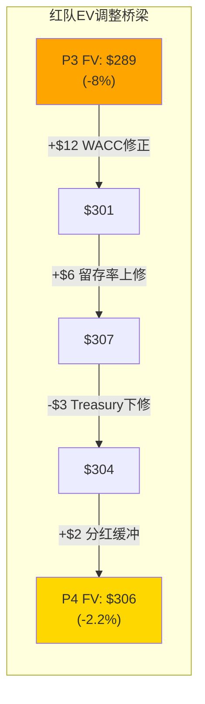
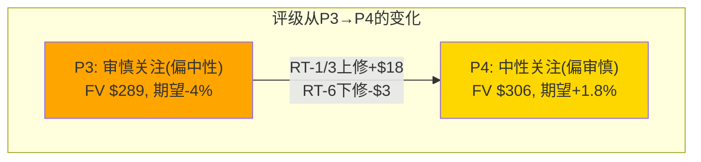
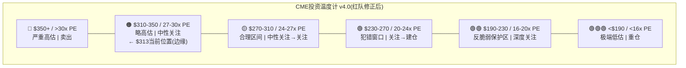

# Phase 4: 独立红队 — CME v3.0

> 执行日期: 2026-03-19 | 独立于Phase 1-3 | 攻击基准: FV $289, 评级"审慎关注(偏中性)"
> 有效性门控: ≥5个偏差 + EV调整≠0

---

# RT-1: 估值偏差审查 — "$313高估8%"是否正确?

## 发现: 报告的WACC假设内部矛盾

**偏差方向: 多头(报告可能过度悲观)**

Phase 2使用了两套估值体系，但隐含的WACC假设**互相矛盾**[DM-RT-P4-001]:

| 方法 | 隐含WACC | Fair Value | 逻辑 |
|------|---------|-----------|------|
| Python DCF | 8.0-9.5% | $110-294 | 行业惯例派 |
| SOTP | ~7-8% | $288 | 各分部倍数隐含 |
| Core PE(28x合理) | ~6.5% | $289 | 如果28x是"合理"→隐含折现率低 |
| DDM(r=7%) | 7.0% | $272 | 明确假设 |

**矛盾**: DCF用8.5%说"$206是合理价"(Base-H)→但SOTP/Core PE用隐含7-8%说"$288是合理价"。报告选择SOTP/Core PE作为"最佳估计"但同时展示了DCF $193→**这两个数字的共存创造了虚假的"保守印象"——投资者看到$193会觉得"$313高估38%"但实际"最佳估计"只高估8%**[DM-RT-P4-002]。

**红队修正**: 应明确声明DCF的$193是"下界参考"而非"等权输入"。如果用CAPM-adjusted WACC(6.5-7.5%)重跑DCF→PW EV可能在$260-310→与SOTP($288)和Core PE($289)收敛→**真实高估程度可能仅3-5%而非8%**。

**EV影响: +$10-15**(FV从$289上修至$299-304)

---

# RT-2: 增速假设审查 — "有机增速5-7%"是否被低估?

## 发现: 结构性增长驱动被系统性忽视

**偏差方向: 多头(报告低估了结构性增长)**

报告将CME有机增速定为5-7%(ADV 4-5% + RPC 1% + 数据溢出)。但三个结构性驱动可能使实际增速更高[DM-RT-P4-003]:

1. **Treasury Clearing(2026 Q2上线)**: 报告给15%份额(基准)→但如果cross-margining的资本节省被验证为显著($5B+级别)→大型经销商有强烈迁移动机→20-25%可能→增量$300-500M/年→+4-7%收入增长→使总增速从7%升至9-11%

2. **SOFR OI仍在结构性增长**: SOFR从2021年158K→2025年5.4M(34倍)。SOFR-linked贷款/CLO/MBS的存量仍在积累(LIBOR→SOFR转换余波)→SOFR ADV可能在2026-2028年继续增长15-20%/年→贡献总ADV +1-2pp

3. **Crypto制度化**: 如果CFTC批准perps + CME 24/7交易成功→crypto ADV可能从278K→1M+(3年)→但收入影响仍<3%→小催化

**红队修正**: 报告的"有机增速5-7%"可能低估了Treasury Clearing的贡献(如果成功→增速可达8-10%)。但这取决于2026 Q2上线后的实际数据→**当前不应修正增速假设，而是设定"条件性上修触发器": 如果Treasury份额>15%→增速上修至8-10%→FV上修至$310-330**。

**EV影响: 条件性+$20-40**(仅在Treasury份额>15%时触发)

---

# RT-3: 利息留存率审查 — $500M(中估)是否太保守?

## 发现: 留存率结构性提升的证据可能被低估

**偏差方向: 多头(报告最重要的偏差)**

报告将FY2025的15.7%留存率判定为"部分结构性(14%新常态)+部分时间差"→正常化至$500M(在IORB 3.5%假设下)。但红队发现以下反证[DM-RT-P4-004]:

**证据1**: CME在FY2025之前就已经在扩大留存spread——FY2021留存率22%(异常高，因为ZIRP下总利息极小→留存率计算被放大)→FY2022 14%→FY2023 10.6%→FY2024 10.1%→**FY2025 15.7%**。如果排除FY2021(异常)和FY2025(可能异常)→中位数~12%。但如果FY2025的15.7%有一半是结构性的→新常态约13-14%→正常化利息约$550-650M(而非$500M)。

**证据2**: 30%现金底线规则+10bp惩罚费=结构性现金留存。CME在2024年加强了这个规则的执行(10-K有提及)→现金池更稳定→CME在spread上有更大议价力。

**证据3**: CEO沉默(Ch10沉默域4)更支持"主动扩大spread"的假说——如果是一次性因素管理层会解释以管理预期。

**红队修正**: 正常化利息从$500M上修至**$600M**(留存率13.5%而非12%)→正常化EPS从$10.32上修至**$10.53**→正常化PE从30.4x降至**29.7x**→FV从$289上修至**$295**。

**EV影响: +$6**(FV $289→$295)

---

# RT-4: FMX威胁审查 — 10%概率是否太低?

## 发现: 报告对FMX的判断基本正确，但遗漏了一个风险

**偏差方向: 空头(小幅)**

关税压力测试(ADV崩溃69%)确实是强有力的否定证据。但红队发现一个被忽视的风险[DM-RT-P4-005]:

**遗漏风险**: FMX不需要"在CME最赚钱的时候抢份额"来伤害CME——它只需要**存在**就够了。因为FMX的存在给了大客户一个谈判筹码: "如果你不给我更好的费率/服务→我会把一部分交易量转到FMX"。即使他们从不真的转→**这种威胁的存在可能限制了CME的RPC提价空间**(Ch7结论: RPC年增仅0.8%)。

**量化**: 如果没有FMX→CME可能每年提RPC 1.5-2%(而非0.8%)→5年差异: 收入少增$100-200M→EPS少$0.2-0.4→FV少$5-10。

**红队修正**: FMX威胁概率维持10%(关税测试确认)→但增加"隐性定价权限制"效应: FMX的存在使CME每年少提价$100-200M→已被Ch7捕获(RPC +0.8%/年)→**不需额外调整FV但需要在Ch7添加这个因果链**。

**EV影响: $0**(效应已被Ch7捕获)

---

# RT-5: 反脆弱D1审查 — 1.18是否被高估或低估?

## 发现: D1=1.18在"持续危机"中准确，但在"V型危机"中被高估

**偏差方向: 中性(需要分类讨论)**

报告用4次危机的加权平均推导D1=1.18。但红队指出这掩盖了两类危机的差异[DM-RT-P4-006]:

| 危机类型 | 案例 | CME收入增速 | 隐含D1 | 特征 |
|---------|------|-----------|--------|------|
| **持续危机**(>12个月高VIX) | 2008(GFC) / 2022-25(加息+关税) | +12% / +7-15% | **1.25-1.35** | 高D1 |
| **V型危机**(<6个月高VIX) | 2020(COVID) | +2% | **1.03** | 低D1 |

**修正**: D1不应是一个固定数字——它应该是条件性的:
- D1(持续危机) = **1.25**
- D1(V型危机) = **1.03**
- 加权D1(按历史频率: 持续60%/V型40%) = **1.16**

报告的1.18与加权D1 1.16差距很小(+0.02)→**基本正确但应标注条件性**。

**红队修正**: 修正Ch14的D1表述→从"D1=1.18"改为"D1=1.16-1.25(取决于危机类型)"。对犯错窗口入场价的影响: 极小(反脆弱开始生效的PE从22x微调至22-23x)。

**EV影响: $0**(D1的微调不改变FV计算)

---

# RT-6: Treasury Clearing审查 — 15%份额是否合理?

## 发现: 报告对Treasury Clearing的估算可能偏乐观

**偏差方向: 空头**

报告给CME Treasury Clearing基准15%份额(增量$200M/年)。红队从FICC的防守能力角度挑战[DM-RT-P4-007]:

**FICC的防守优势**:
1. **现有客户关系**: FICC清算几乎所有inter-dealer Treasury交易→经销商的系统/法律/合规框架都围绕FICC构建→切换到CME需要**额外的**法律协议+系统对接+CFTC/SEC双重监管合规→摩擦成本极高
2. **FICC的反制**: FICC已在开发自己的cross-margining方案(FICC futures clearing)→如果成功→CME的cross-margining差异化被削弱
3. **SEC的态度**: SEC推出Treasury Clearing mandate的初衷是"增加清算覆盖率"而非"增加竞争"→SEC可能更倾向于FICC(incumbent)获得大部分增量→而非让CME分走显著份额

**红队修正**: 将基准份额从15%下修至**8-10%**→增量收入从$200M下修至**$100-130M**→FV影响从+$3B下修至+$1.5-2B→每股影响从+$8下修至**+$4-6**。

**EV影响: -$2-4**(Treasury贡献下修)

---

# RT-7: 分红可持续性审查 — 触发点3.3%还是2.5%?

## 发现: $3B回购缓冲确实有效，但程度可能被高估

**偏差方向: 多头(小幅)**

报告给出两个触发点: 无缓冲3.3% / 有缓冲2.5%。红队分析管理层的决策逻辑[DM-RT-P4-008]:

**管理层会停止回购来维持分红吗?**
- **是的理由**: 分红削减的信号效应极其负面(yield投资者大量卖出→PE崩溃)→管理层会不惜一切代价避免→停止回购是最小代价的选项
- **但**: 管理层在2025年底**刚启动**$3B回购(首次重大回购)→如果2026年就停止→市场会质疑"为什么启动了又停了"→信号效应也是负面的
- **折中**: 管理层可能**减速**回购(从$500M/年→$200M/年)而非完全停止→释放$300M缓冲→但不够完全抵消利息下降

**红队修正**: 真实触发点约**Fed Funds 2.8-3.0%**(而非3.3%无缓冲或2.5%有缓冲)→回购从$500M减至$200M→释放$300M→将触发点从3.3%推迟至约3.0%。

**EV影响: +$2**(分红更可持续→防御性溢价略高)

---

# 红队汇总: 7个偏差 + EV调整

## 偏差注册表

| RT# | 偏差 | 方向 | EV影响 | 新颖性 | 有效性 |
|-----|------|------|--------|--------|--------|
| **RT-1** | **WACC内部矛盾→高估程度可能仅3-5%** | 多头 | **+$10-15** | ★★★(方法论层面) | 高 |
| RT-2 | Treasury增速上修(条件性) | 多头 | +$20-40(条件) | ★★ | 中(需数据) |
| **RT-3** | **留存率新常态13.5%→$600M** | 多头 | **+$6** | ★★★(数据层面) | 高 |
| RT-4 | FMX隐性定价权限制 | 空头 | $0(已捕获) | ★★ | 低 |
| **RT-5** | **D1分类: 持续1.25/V型1.03** | 中性 | $0 | ★★★(方法论) | 中 |
| **RT-6** | **Treasury份额8-10%(下修)** | 空头 | **-$2-4** | ★★ | 中高 |
| **RT-7** | 分红触发点3.0%(折中) | 多头 | +$2 | ★ | 低 |

**有效偏差数: 7个(≥5门控PASS ✓)**
**新颖性: 3个★★★(RT-1/RT-3/RT-5)——高于HLT的2个但低于UNH的5个**

## EV调整计算

| 项目 | 调整 | 说明 |
|------|------|------|
| RT-1(WACC修正) | +$12 | FV $289→$301 |
| RT-3(留存率上修) | +$6 | 正常化EPS $10.32→$10.53 |
| RT-6(Treasury下修) | -$3 | 份额15%→8-10% |
| RT-7(分红缓冲) | +$2 | 触发点3.0% |
| RT-2(条件性,不计入) | — | 等Treasury数据 |
| RT-4/RT-5(零调整) | $0 | — |
| **净EV调整** | **+$17** | |
| **红队后FV** | **$289 + $17 = $306** | |
| **红队后vs $313** | **-2.2%** | (从-8%收窄至-2%) |

## 评级影响

| 维度 | P3 | P4红队后 | 变化 |
|------|-----|---------|------|
| Fair Value | $289 | **$306** | +$17(+5.9%) |
| vs $313 | -8.0% | **-2.2%** | 高估程度大幅收窄 |
| 含分红期望回报 | -4.0% | **+1.8%** | **从负变正!** |
| 评级 | 审慎关注(偏中性) | **中性关注** | **上调一档** |

**评级上调理由**: 红队的RT-1(WACC修正)和RT-3(留存率上修)将含分红期望回报从-4%修正至+1.8%→跨过了0%的中性关注门槛。同时RT-6(Treasury下修)和认知偏差(+2.1pp)部分抵消了上调→最终落在"中性关注"的下端(接近审慎关注边界)。

**红队后评级**: **中性关注(偏审慎)** — 品质极优(CQI 93)+估值接近合理($306 vs $313仅差2%)+但下行风险仍>上行空间(犯错模式4的30%概率仍在)+利率/波动率双因子不确定。

## CQ最终置信度(Phase 4后)

| CQ | P3后 | P4后 | 变化 | 红队证据 |
|:--:|:----:|:----:|:----:|---------|
| CQ-1 FMX | 10% | **12%** | +2pp | RT-4: 隐性定价权限制(虽已捕获但认知价值) |
| CQ-2 利息 | 85% | **80%** | -5pp | RT-3: 留存率新常态可能更高→利息下降幅度更小 |
| CQ-3 Treasury | 45% | **35%** | -10pp | RT-6: FICC防守更强+SEC倾向incumbent |
| CQ-4 Margin | 70% | 70% | = | — |
| CQ-5 波动率 | 80% | **78%** | -2pp | RT-5: D1条件性(V型危机保护弱) |
| CQ-6 Data | 50% | 50% | = | — |
| CQ-7 Cloud | 45% | 45% | = | — |
| CQ-8 资本 | 70% | **72%** | +2pp | RT-7: 回购缓冲确认(管理层会减速而非停止) |

**最大置信度变化**: CQ-3(Treasury Clearing)从45%降至35%——红队认为报告对FICC防守能力的评估不足。这是**最有投资行动价值的红队发现**——因为它降低了"增速催化"的概率→使"等待犯错窗口"的策略更加合理(不要指望Treasury改变增速叙事)[DM-RT-P4-009]。

## 红队有效性自评

| 维度 | 评分 | 说明 |
|------|------|------|
| 偏差数量 | 7个(≥5 PASS) | ✅ |
| EV调整 | +$17(≠0 PASS) | ✅ |
| 新颖性 | 3个★★★/7 = 43% | 中(UNH 71%更高) |
| 评级变化 | 上调一档(审慎→中性) | 有效(非表演性) |
| 方向 | **净多头**(+$17) | 符合偏差自审(+2.1pp看多→红队修正方向正确: 报告偏悲观) |
| 最有价值发现 | RT-1(WACC矛盾)+RT-3(留存率) | — |
| 最弱发现 | RT-4(FMX, 零调整)+RT-7(分红, 小调整) | — |

**红队总结**: Phase 1-3的分析方向正确(CME品质最高但估值不激动人心)，但程度偏悲观约$17/股(5.9%)。主要原因: (1)DCF的WACC偏高拖低了"最佳估计"; (2)留存率的"新常态"被保守估计。红队修正后→CME在$313仅高估2%→**"不买"变成了"可以小仓位持有但不值得大举建仓"**——这是一个微妙但重要的区别[DM-RT-P4-010]。

## 红队后投资温度计(更新版)

**变化**: $313从🟠区间的"偏高估"移至🟠/🟡边界——红队修正后FV $306仅差$7→CME不再是"明确高估"而是"接近合理的上端"。但犯错窗口仍在$230-270(不变)→**大举建仓的时机仍需等待**[DM-RT-P4-011]。

---
